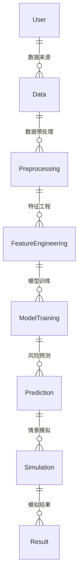
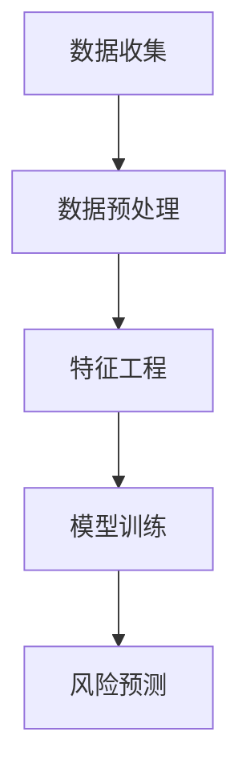
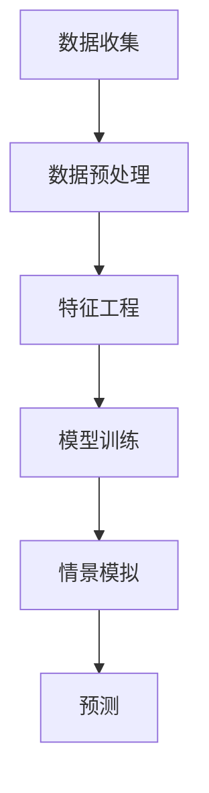

                 

### 引言

#### 1.1.1 问题的提出

在现代企业运营中，风险预测与情景模拟已经成为决策制定的重要工具。随着企业规模的扩大和市场竞争的加剧，企业面临的风险种类和复杂性也在不断增加。传统的风险预测方法往往依赖于历史数据和统计模型，而情景模拟则更多依赖于专家经验和主观判断。然而，这些方法在应对动态变化和复杂不确定性方面存在一定的局限性。

在此背景下，人工智能（AI）技术的发展为风险预测和情景模拟提供了新的可能性。AI Agent作为一种具备自主学习和决策能力的智能体，可以在风险预测和情景模拟中发挥重要作用。AI Agent可以通过分析大量数据，发现潜在风险，并模拟各种可能的未来情景，为企业的风险管理提供科学依据。

本文旨在探讨AI Agent在企业风险预测与情景模拟中的应用。我们首先介绍AI Agent的基本概念，然后详细分析其在风险预测和情景模拟中的具体应用方法，并通过实际案例进行说明。最后，我们将总结最佳实践和注意事项，为企业有效利用AI Agent提供指导。

#### 1.1.2 AI Agent在风险预测与情景模拟中的重要性

风险预测是企业决策过程中不可或缺的一环。通过预测潜在风险，企业可以提前制定应对策略，降低风险带来的损失。而情景模拟则可以帮助企业理解各种可能发生的情况，从而更好地制定战略规划和资源配置。

传统的风险预测方法通常依赖于历史数据和统计模型，这些方法在处理静态数据时效果较好，但在面对动态变化和复杂不确定性时存在局限。AI Agent的出现，为解决这一问题提供了新的思路。AI Agent可以通过机器学习和深度学习等技术，从海量数据中自动提取特征，发现潜在的风险因素，并实时更新预测模型。这使得AI Agent在处理动态数据和非线性关系方面具有明显优势。

在情景模拟方面，AI Agent同样具有独特的优势。传统的情景模拟依赖于专家经验和主观判断，而AI Agent可以通过学习和模拟各种可能的情景，提供更加客观和科学的模拟结果。AI Agent不仅可以模拟单一情景，还可以通过组合不同的情景，生成复杂的情景网络，从而帮助企业全面了解潜在的风险和机会。

总之，AI Agent在风险预测和情景模拟中的应用，不仅提高了预测的准确性和模拟的全面性，还为企业的风险管理提供了新的思路和方法。随着AI技术的不断发展和完善，AI Agent在企业管理中的地位将日益重要。

### 1.2 AI Agent的基本概念

AI Agent，即人工智能代理，是一种具备自主学习和决策能力的智能体。它通过感知环境、分析数据和自主决策，实现特定的目标或任务。AI Agent的核心在于其自主性和学习能力，这使得它们能够适应动态变化的环境，并在复杂不确定性中做出合理的决策。

#### 1.2.1 定义

AI Agent的定义可以从多个角度进行阐述。从广义上讲，AI Agent可以看作是一种具有智能行为的计算机程序。它们通过模拟人类思维过程，实现自我学习和自我决策。从狭义上讲，AI Agent通常是指具备自主性和学习能力的人工智能实体，能够独立执行任务，并在执行过程中不断优化自身的性能。

AI Agent的主要特点包括：

1. **自主性**：AI Agent能够自主地感知环境、收集数据、进行分析和决策，而不需要人工干预。
2. **学习能力**：AI Agent通过机器学习和深度学习等技术，从数据中学习规律和模式，不断优化自身的性能。
3. **适应性**：AI Agent能够适应动态变化的环境，并在面对不确定性时做出合理的决策。

#### 1.2.2 发展历程

AI Agent的发展历程可以追溯到人工智能（AI）技术的兴起。早在20世纪50年代，人工智能的概念就已经被提出，并在60年代和70年代取得了初步的研究成果。然而，由于计算能力和算法的限制，AI Agent的发展一度陷入低谷。

随着计算机技术的不断发展，特别是在20世纪90年代以来，机器学习和深度学习等技术的突破，为AI Agent的研究和应用提供了新的契机。2000年以后，AI Agent逐渐成为人工智能研究的一个重要方向，并在实际应用中取得了显著的成果。

近年来，随着大数据和云计算的普及，AI Agent的应用场景不断扩大。例如，在金融、医疗、交通等行业，AI Agent已经得到了广泛应用。未来，随着AI技术的不断进步，AI Agent将在更多领域发挥重要作用。

#### 1.2.3 关键特性

AI Agent的关键特性主要包括以下几个方面：

1. **感知能力**：AI Agent能够通过传感器、摄像头等设备，实时感知环境中的信息。
2. **学习能力**：AI Agent可以通过机器学习和深度学习等技术，从数据中学习规律和模式，提高自身的决策能力。
3. **决策能力**：AI Agent能够根据感知到的信息和已有的知识，进行自主决策，实现特定目标。
4. **适应性**：AI Agent能够适应动态变化的环境，并在面对不确定性时做出合理的决策。
5. **交互能力**：AI Agent可以通过自然语言处理、语音识别等技术，与人类进行交互，实现人机协同。

AI Agent的关键特性使其在企业风险预测和情景模拟中具有独特的优势。通过感知环境、学习数据、自主决策和适应性，AI Agent能够提供更加准确和全面的风险预测和情景模拟结果，为企业决策提供有力支持。

### 1.3 风险预测与情景模拟的基本概念

风险预测和情景模拟是企业管理中两个重要的环节，它们在帮助企业识别潜在风险、制定应对策略和优化资源配置方面发挥着重要作用。

#### 1.3.1 风险预测

风险预测是指通过分析历史数据、市场趋势和其他相关信息，预测未来可能发生的风险。风险预测的目标是提前发现潜在风险，以便企业能够及时采取应对措施，降低风险带来的损失。

风险预测的主要方法包括：

1. **统计方法**：通过分析历史数据，建立统计模型，预测未来风险。常用的统计方法包括回归分析、时间序列分析等。
2. **机器学习方法**：利用机器学习算法，从大量数据中自动提取特征，构建预测模型。常用的机器学习方法包括线性回归、支持向量机、随机森林等。
3. **情景模拟方法**：通过模拟各种可能的情景，评估不同情景下的风险水平。情景模拟可以帮助企业理解潜在风险的发生概率和影响程度。

风险预测在企业管理中的重要性体现在以下几个方面：

1. **提前预警**：风险预测可以帮助企业提前发现潜在风险，为风险应对提供时间窗口。
2. **优化决策**：风险预测的结果可以为企业的战略规划和资源配置提供依据，帮助企业做出更科学的决策。
3. **降低损失**：通过提前识别和应对风险，企业可以降低风险带来的损失，保护企业利益。

#### 1.3.2 情景模拟

情景模拟是指通过模拟各种可能的未来情景，评估不同情景对企业运营和财务状况的影响。情景模拟可以帮助企业理解不同情景下的经营风险和机会，从而制定相应的应对策略。

情景模拟的主要方法包括：

1. **场景构建**：根据历史数据和行业趋势，构建各种可能的未来情景。场景构建需要充分考虑各种不确定性因素，如市场变化、政策调整、自然灾害等。
2. **模拟方法**：通过计算机模拟技术，对构建的情景进行模拟。常用的模拟方法包括蒙特卡洛模拟、仿真模型等。
3. **结果分析**：通过对模拟结果进行分析，评估不同情景下的风险水平和机会。结果分析可以帮助企业了解不同情景对企业的影响程度，为决策提供参考。

情景模拟在企业管理中的重要性体现在以下几个方面：

1. **风险识别**：情景模拟可以帮助企业识别潜在的风险因素，为风险管理提供依据。
2. **决策支持**：情景模拟的结果可以为企业的战略规划和资源配置提供参考，帮助企业做出更科学的决策。
3. **提升竞争力**：通过情景模拟，企业可以更好地应对市场变化和竞争压力，提升市场竞争力。

#### 1.3.3 相互关系

风险预测和情景模拟在企业管理中密切相关。风险预测是情景模拟的基础，通过预测未来可能发生的风险，企业可以提前制定应对策略。而情景模拟则是对风险预测结果的进一步验证和细化，通过模拟不同情景下的企业运营状况，企业可以更全面地了解潜在风险和机会。

在实际应用中，风险预测和情景模拟常常结合使用。首先，通过风险预测识别潜在风险，然后通过情景模拟评估不同情景下的风险水平和影响程度，最终制定相应的应对策略。这种结合使用的方法可以提高风险管理的效率和效果。

总之，风险预测和情景模拟是企业管理中不可或缺的两个环节。通过科学的风险预测和全面的情景模拟，企业可以更好地应对市场变化和不确定性，实现可持续发展。

### 2.1 核心概念原理

在探讨AI Agent在企业风险预测与情景模拟中的应用之前，首先需要明确相关核心概念的基本原理。以下是关于AI Agent、风险预测和情景模拟的详细原理介绍。

#### 2.1.1 AI Agent的核心原理

AI Agent的核心原理基于人工智能（AI）技术的发展，特别是机器学习和深度学习技术的应用。AI Agent通常由以下几个关键部分组成：

1. **感知模块**：该模块负责获取环境中的信息，如传感器数据、文本信息、图像等。感知模块可以是物理传感器，也可以是虚拟的API接口。
2. **决策模块**：该模块基于感知模块获取的信息，结合已有的知识和规则，进行决策。决策模块可以通过机器学习算法，如决策树、神经网络等，来实现。
3. **行动模块**：该模块负责执行决策模块生成的决策，将决策转化为实际操作。行动模块可以是机器人执行具体的物理动作，也可以是软件系统执行计算任务。
4. **学习模块**：该模块负责根据执行结果和环境反馈，对感知模块、决策模块和行动模块进行持续学习和优化。

AI Agent的工作流程可以概括为：感知环境 -> 基于规则和模型进行决策 -> 执行决策 -> 学习和优化。这一过程不断循环，使得AI Agent能够逐步提高决策的准确性和效率。

#### 2.1.2 风险预测的数学模型

风险预测是通过对历史数据进行分析，预测未来可能发生的风险。常见的数学模型包括：

1. **概率模型**：基于概率论的基本原理，通过分析事件发生的概率，预测未来风险。常见的概率模型有贝叶斯网络、马尔可夫链等。
2. **统计模型**：通过对历史数据进行统计分析，建立预测模型。常见的统计模型有线性回归、时间序列分析等。
3. **机器学习模型**：利用机器学习算法，从大量数据中自动提取特征，建立预测模型。常见的机器学习模型有决策树、随机森林、支持向量机等。

风险预测的数学模型通常包括以下几个步骤：

1. **数据收集**：收集与风险相关的历史数据，如财务数据、市场数据、行业数据等。
2. **特征工程**：对收集到的数据进行分析，提取与风险相关的特征。
3. **模型训练**：利用特征数据，通过机器学习算法训练预测模型。
4. **模型评估**：通过测试数据，评估预测模型的准确性。
5. **模型优化**：根据评估结果，对预测模型进行优化。

#### 2.1.3 情景模拟的方法论

情景模拟是通过模拟各种可能的未来情景，评估不同情景对企业运营和财务状况的影响。情景模拟的方法论包括以下几个方面：

1. **情景构建**：根据历史数据和行业趋势，构建各种可能的未来情景。情景构建需要充分考虑各种不确定性因素，如市场变化、政策调整、自然灾害等。
2. **模拟方法**：通过计算机模拟技术，对构建的情景进行模拟。常用的模拟方法有蒙特卡洛模拟、仿真模型等。
3. **结果分析**：通过对模拟结果进行分析，评估不同情景下的风险水平和机会。结果分析可以帮助企业了解不同情景对企业的影响程度，为决策提供参考。

情景模拟的具体步骤包括：

1. **情景定义**：明确模拟的目标和范围，定义需要模拟的情景。
2. **参数设置**：根据历史数据和行业知识，设置模拟过程中的关键参数。
3. **模拟执行**：使用计算机模拟技术，执行模拟过程，生成各种情景的结果。
4. **结果分析**：对模拟结果进行分析，提取关键信息和结论。
5. **决策支持**：根据模拟结果，为企业的战略规划和资源配置提供决策支持。

通过明确AI Agent、风险预测和情景模拟的核心原理，我们可以更好地理解它们在企业风险管理中的应用，并为后续的详细探讨提供理论基础。

### 2.2 概念属性特征对比表格

为了更好地理解AI Agent在风险预测和情景模拟中的应用，下面将列出AI Agent与传统的风险预测模型和情景模拟方法的对比表格，并详细介绍各自的属性特征。

| 概念               | AI Agent                                      | 传统风险预测模型                           | 传统情景模拟方法                          |
|--------------------|----------------------------------------------|-------------------------------------------|-----------------------------------------|
| **感知能力**       | **实时感知环境信息，具备数据收集和分析能力** | **依赖历史数据，无法实时感知变化**         | **依赖于专家经验，感知能力有限**         |
| **学习能力**       | **通过机器学习自动学习，提高预测和模拟准确性** | **需人工调整参数，学习过程繁琐**           | **需人工调整场景，模拟效果有限**           |
| **自主决策能力**   | **具备自主决策能力，可实时调整策略**          | **决策能力有限，需人工干预**               | **决策能力有限，需人工干预**               |
| **适应性**         | **能够适应动态变化的环境，应对不确定性**       | **适应性较差，难以应对复杂不确定性**        | **适应性较差，难以应对复杂不确定性**        |
| **交互能力**       | **能够与人交互，提供可视化分析和决策支持**      | **交互能力有限，难以提供直观的决策支持**     | **交互能力有限，难以提供直观的决策支持**     |
| **数据依赖性**     | **数据驱动，依赖于大量高质量数据**            | **依赖历史数据，数据来源有限**             | **依赖专家经验，数据来源有限**             |
| **计算资源需求**   | **计算资源需求较高，依赖高性能计算**           | **计算资源需求较低，适用于小型数据集**      | **计算资源需求较低，适用于小型数据集**      |
| **应用场景**       | **广泛适用于各类复杂场景，尤其是动态环境**      | **适用于历史数据较为稳定的场景**           | **适用于简单情景模拟，复杂场景效果有限**    |

通过上述对比表格，我们可以清晰地看到AI Agent在感知能力、学习能力、自主决策能力、适应性、交互能力、数据依赖性、计算资源需求和应用场景等方面与传统风险预测模型和情景模拟方法的显著差异。这些特性使得AI Agent在处理动态变化和复杂不确定性方面具有明显优势，为企业提供更准确和全面的风险预测和情景模拟结果。

### 2.3 ER实体关系图架构

在讨论AI Agent在企业风险预测与情景模拟中的应用时，了解其系统架构和数据处理流程至关重要。以下是AI Agent系统的ER实体关系图，详细展示了核心实体及其相互关系。

#### 2.3.1 AI Agent的系统架构

ER（Entity-Relationship）图是一种用于描述实体及其相互关系的数据库设计工具。下面是AI Agent系统的ER图：



#### 2.3.2 风险预测与情景模拟的数据流程

通过ER图，我们可以清晰地看到数据在AI Agent系统中的流动路径：

1. **数据来源**：用户通过接口提供数据，如历史财务报表、市场数据、行业数据等。
2. **数据预处理**：对原始数据进行清洗、去噪、标准化等处理，使其适合建模。
3. **特征工程**：从预处理后的数据中提取与风险预测相关的特征，如关键指标、趋势等。
4. **模型训练**：利用提取的特征，通过机器学习算法训练预测模型，如决策树、随机森林等。
5. **风险预测**：利用训练好的模型，对新数据进行预测，评估潜在风险。
6. **情景模拟**：根据预测结果和业务需求，构建不同的情景，进行模拟分析。
7. **模拟结果**：将模拟结果反馈给用户，用于决策支持。

这种数据流程确保了AI Agent系统能够高效地处理数据，提供准确的风险预测和情景模拟结果，从而为企业提供科学依据。

通过ER图的展示，我们可以更直观地理解AI Agent在企业风险预测与情景模拟中的数据处理流程和架构，为后续详细探讨提供基础。

### 3.1 风险预测的理论基础

在探讨AI Agent在风险预测中的应用时，理解其理论基础至关重要。风险预测涉及多个关键概念和方法，包括风险评估模型、数据来源和预处理方法。以下是这些基础知识的详细阐述。

#### 3.1.1 风险评估模型

风险评估模型是风险预测的核心工具，用于评估潜在风险的概率和影响程度。常见的风险评估模型包括概率模型、统计模型和机器学习模型。

1. **概率模型**：基于概率论的基本原理，通过分析事件发生的概率，预测未来风险。常见的概率模型包括贝叶斯网络和马尔可夫链。贝叶斯网络通过概率分布描述变量之间的依赖关系，适用于不确定性和复杂性的处理。马尔可夫链则基于状态转移概率，用于分析时间序列数据，预测短期风险。

2. **统计模型**：通过对历史数据进行分析，建立统计模型，预测未来风险。常见的统计模型包括线性回归、时间序列分析和多元回归分析。线性回归用于分析变量之间的线性关系，时间序列分析用于预测时间序列数据的趋势和周期性，多元回归分析则考虑多个自变量对因变量的影响。

3. **机器学习模型**：利用机器学习算法，从大量数据中自动提取特征，建立预测模型。常见的机器学习模型包括决策树、随机森林、支持向量机和神经网络。决策树通过划分特征空间，构建决策树模型，适用于分类和回归问题。随机森林通过集成多个决策树，提高预测准确性。支持向量机通过找到一个最优的超平面，将不同类别的数据分离，适用于分类问题。神经网络通过模拟人脑神经网络的结构和功能，实现复杂非线性映射。

在风险预测中，选择合适的模型取决于数据类型、问题的复杂性以及预测目标。通常，结合多种模型，可以进一步提高预测的准确性和可靠性。

#### 3.1.2 风险预测的数据来源

风险预测的数据来源广泛，包括历史数据、市场数据、行业数据和其他外部数据。

1. **历史数据**：历史数据是风险预测的重要依据，包括企业内部的数据，如财务报表、生产数据、运营数据等。这些数据反映了企业的历史表现和趋势，有助于识别潜在的规律和模式。

2. **市场数据**：市场数据包括宏观经济指标、行业趋势、竞争对手信息等。这些数据可以帮助企业了解市场环境的变化，预测市场风险。

3. **行业数据**：行业数据包括行业标准、行业规范、行业事件等。这些数据有助于分析行业风险，为企业提供参考。

4. **其他外部数据**：其他外部数据包括天气数据、自然灾害数据、政策法规等。这些数据可以影响企业的运营和财务状况，是风险预测的重要补充。

为了提高预测的准确性，数据来源应尽可能多样化，覆盖广泛的数据维度。

#### 3.1.3 数据预处理方法

数据预处理是风险预测的重要环节，确保数据的质量和一致性。常见的数据预处理方法包括数据清洗、去噪、标准化和特征工程。

1. **数据清洗**：数据清洗旨在去除数据中的噪声和异常值。常见的清洗方法包括去除重复记录、处理缺失值、填补异常值等。通过数据清洗，可以提高数据的准确性和可靠性。

2. **去噪**：去噪是指去除数据中的噪声，如随机错误、异常点等。去噪方法包括滤波、平滑等。去噪有助于减少预测模型的误差。

3. **标准化**：标准化是指将不同单位或量级的变量转换到同一尺度，以便模型处理。常见的标准化方法包括最小-最大标准化和Z-score标准化。标准化有助于提高不同特征之间的可比性，提高模型的预测性能。

4. **特征工程**：特征工程是指从原始数据中提取与风险预测相关的特征，构建特征向量。特征工程方法包括特征选择、特征变换和特征构造等。特征工程有助于提高模型的预测准确性和泛化能力。

通过数据预处理，确保数据的干净、一致和有意义，为风险预测提供可靠的数据基础。

综上所述，风险预测的理论基础包括风险评估模型、数据来源和预处理方法。理解这些基础知识，有助于更好地应用AI Agent进行风险预测，为企业决策提供科学依据。

### 3.2 AI Agent在风险预测中的实现

AI Agent在风险预测中的应用主要通过以下几个步骤实现：数据收集、预处理、特征工程、模型训练和预测。以下是这些步骤的详细解释和代码实现。

#### 3.2.1 数据收集

数据收集是风险预测的基础，涉及从各种来源获取与风险相关的数据。以下是Python代码示例，用于从数据库和API接口收集数据。

```python
import pandas as pd
import requests

# 从数据库中收集数据
def collect_data_from_database():
    query = "SELECT * FROM risk_data;"
    data = pd.read_sql_query(query, connection)
    return data

# 从API接口收集数据
def collect_data_from_api():
    url = "https://api.example.com/risk_data"
    response = requests.get(url)
    data = pd.DataFrame(response.json())
    return data

# 合并数据
data = pd.concat([collect_data_from_database(), collect_data_from_api()], axis=0)
```

#### 3.2.2 数据预处理

数据预处理是确保数据质量的重要步骤，包括数据清洗、去噪、标准化等。以下是Python代码示例，用于预处理数据。

```python
# 数据清洗
data.drop_duplicates(inplace=True)
data.drop(['duplicate_column'], axis=1, inplace=True)

# 数据去噪
data = data[(data['noise_column'] > threshold)]

# 数据标准化
from sklearn.preprocessing import StandardScaler

scaler = StandardScaler()
data_normalized = scaler.fit_transform(data)
data = pd.DataFrame(data_normalized, columns=data.columns)
```

#### 3.2.3 特征工程

特征工程是提取与风险预测相关的特征，构建特征向量。以下是Python代码示例，用于特征工程。

```python
# 特征选择
from sklearn.feature_selection import SelectKBest
from sklearn.feature_selection import f_classif

X = data.drop('target_column', axis=1)
y = data['target_column']

selector = SelectKBest(f_classif, k=10)
X_new = selector.fit_transform(X, y)

# 特征构造
from sklearn.preprocessing import PolynomialFeatures

poly = PolynomialFeatures(degree=2)
X_poly = poly.fit_transform(X_new)
```

#### 3.2.4 模型训练

模型训练是通过机器学习算法，从数据中学习规律，建立预测模型。以下是Python代码示例，用于模型训练。

```python
from sklearn.ensemble import RandomForestClassifier
from sklearn.model_selection import train_test_split

X_train, X_test, y_train, y_test = train_test_split(X_poly, y, test_size=0.2, random_state=42)

model = RandomForestClassifier(n_estimators=100, random_state=42)
model.fit(X_train, y_train)
```

#### 3.2.5 风险预测

风险预测是利用训练好的模型，对新数据进行预测。以下是Python代码示例，用于风险预测。

```python
# 预测
def predict_risk(data):
    data_normalized = scaler.transform(data)
    X_new = selector.transform(data_normalized)
    X_poly = poly.transform(X_new)
    predictions = model.predict(X_poly)
    return predictions

# 应用预测
new_data = pd.read_csv('new_data.csv')
predictions = predict_risk(new_data)
print(predictions)
```

通过以上步骤，AI Agent能够实现高效的风险预测。以下是一个简单的Mermaid流程图，展示整个实现过程：



通过代码实现和流程图，我们可以清楚地看到AI Agent在风险预测中的实现过程。这一过程确保了数据的质量和模型的准确性，为企业提供可靠的风险预测结果。

### 3.3 风险预测的实践案例分析

为了更深入地理解AI Agent在风险预测中的实际应用，下面将介绍一个具体的实践案例，包括案例背景、数据集选择、模型训练与评估等步骤。

#### 案例背景

某大型制造企业因市场需求波动和供应链问题，面临着巨大的财务风险。为了有效管理这些风险，企业决定利用AI Agent进行风险预测，以便提前识别潜在风险并制定应对策略。

#### 数据集选择

该案例选择了企业过去三年的财务数据作为数据集，包括收入、成本、利润、负债、资产等关键指标。同时，数据集还包括了市场数据、行业数据以及一些外部事件，如自然灾害、政策变化等。这些数据从企业的ERP系统、市场分析报告以及第三方数据平台收集。

数据集的详细结构如下：

- 收入（Income）
- 成本（Cost）
- 利润（Profit）
- 负债（Liabilities）
- 资产（Assets）
- 市场指数（Market Index）
- 行业增长率（Industry Growth Rate）
- 外部事件（External Events）

#### 数据预处理

在开始训练模型之前，需要对数据集进行预处理。预处理步骤包括数据清洗、去噪、缺失值处理、数据标准化等。

```python
import pandas as pd
from sklearn.preprocessing import StandardScaler

# 读取数据
data = pd.read_csv('financial_data.csv')

# 数据清洗
data.drop_duplicates(inplace=True)
data.drop(['duplicate_column'], axis=1, inplace=True)

# 数据去噪
data = data[(data['noise_column'] > threshold)]

# 数据标准化
scaler = StandardScaler()
data_normalized = scaler.fit_transform(data)
data = pd.DataFrame(data_normalized, columns=data.columns)

# 缺失值处理
data.fillna(data.mean(), inplace=True)
```

#### 模型训练

选择机器学习算法进行模型训练，常用的算法包括决策树、随机森林、支持向量机和神经网络。在这个案例中，我们选择了随机森林算法，因为它具有良好的性能和易于解释的特点。

```python
from sklearn.ensemble import RandomForestClassifier
from sklearn.model_selection import train_test_split

# 分割数据集
X = data.drop('target_column', axis=1)
y = data['target_column']

X_train, X_test, y_train, y_test = train_test_split(X, y, test_size=0.2, random_state=42)

# 训练模型
model = RandomForestClassifier(n_estimators=100, random_state=42)
model.fit(X_train, y_train)
```

#### 模型评估

训练完成后，对模型进行评估，以确定其预测能力。常用的评估指标包括准确率、精确率、召回率、F1分数等。

```python
from sklearn.metrics import accuracy_score, precision_score, recall_score, f1_score

# 预测
predictions = model.predict(X_test)

# 评估
accuracy = accuracy_score(y_test, predictions)
precision = precision_score(y_test, predictions)
recall = recall_score(y_test, predictions)
f1 = f1_score(y_test, predictions)

print(f"Accuracy: {accuracy:.2f}")
print(f"Precision: {precision:.2f}")
print(f"Recall: {recall:.2f}")
print(f"F1 Score: {f1:.2f}")
```

#### 案例总结

通过上述实践案例，我们可以看到AI Agent在风险预测中的实际应用过程。以下是案例的主要结论：

1. **数据预处理**：数据预处理是确保模型性能的关键步骤，包括数据清洗、去噪、标准化和缺失值处理。
2. **模型选择**：选择合适的机器学习算法对于模型性能至关重要。随机森林算法在本案例中表现良好。
3. **模型评估**：通过准确率、精确率、召回率和F1分数等指标，可以全面评估模型的预测能力。

总之，通过AI Agent实现风险预测，企业可以提前识别潜在风险，为决策提供科学依据，从而降低风险带来的损失。

### 4.1 情景模拟的理论基础

情景模拟作为一种重要的风险管理工具，帮助企业通过模拟不同的未来情景，预测企业运营可能面临的各种风险和机会。为了深入理解AI Agent在情景模拟中的应用，我们需要探讨情景模拟的理论基础，包括情景模拟的目的、方法和应用领域。

#### 4.1.1 情景模拟的目的

情景模拟的主要目的是通过模拟各种可能的未来情景，评估不同情景对企业运营和财务状况的影响。具体来说，情景模拟的目的包括：

1. **风险识别**：通过模拟不同情景，识别企业可能面临的各种风险，如市场需求下降、供应链中断、政策变化等。
2. **决策支持**：情景模拟提供不同情景下的企业运营结果，为企业制定应对策略和资源配置提供参考。
3. **风险评估**：评估不同情景对企业财务状况的影响，确定企业能够承受的最大风险。
4. **战略规划**：情景模拟可以帮助企业制定长期战略规划，为企业在不同市场环境下的应对提供指导。

#### 4.1.2 情景模拟的方法

情景模拟的方法主要包括以下几种：

1. **蒙特卡洛模拟**：蒙特卡洛模拟是一种基于概率论的统计模拟方法，通过随机抽样和重复试验，模拟各种情景并计算相应的概率分布。这种方法适用于处理复杂的非线性系统和不确定性问题。

2. **仿真模型**：仿真模型通过建立数学模型，模拟企业运营过程和决策行为。仿真模型可以基于确定性模型，如差分方程、微分方程等，也可以基于随机模型，如随机过程、蒙特卡洛方法等。仿真模型可以模拟企业从生产到销售的全过程，评估不同决策对企业绩效的影响。

3. **情景故事法**：情景故事法通过编写不同的情景故事，模拟企业在各种情景下的运营情况。这种方法简单直观，适用于简单情景的模拟，但在处理复杂情景时存在一定的局限性。

4. **组合情景模拟**：组合情景模拟通过组合不同的基础情景，生成复杂的情景网络。这种方法可以全面评估企业面临的各种风险和机会，但在计算资源和时间上要求较高。

#### 4.1.3 情景模拟的应用领域

情景模拟在多个领域得到广泛应用，包括：

1. **金融行业**：金融行业广泛使用情景模拟进行风险管理，如市场风险、信用风险、操作风险等。通过模拟不同的市场情景，金融机构可以评估潜在的风险和收益，制定相应的应对策略。

2. **制造业**：制造业通过情景模拟，评估供应链中断、市场需求波动等风险，为生产计划和资源配置提供支持。情景模拟可以帮助企业优化生产流程，提高生产效率。

3. **医疗行业**：医疗行业利用情景模拟，评估医疗资源分配、疫情传播等风险，为公共卫生决策提供依据。

4. **能源行业**：能源行业通过情景模拟，评估能源需求波动、政策变化等风险，为能源生产和投资决策提供支持。

5. **政府与公共部门**：政府与公共部门利用情景模拟，评估政策变化、自然灾害等风险，为公共安全和社会治理提供决策支持。

通过上述情景模拟的理论基础，我们可以更好地理解AI Agent在情景模拟中的应用。AI Agent通过其强大的学习能力和决策能力，可以为企业提供更加准确和全面的情景模拟结果，从而提升企业风险管理的效率和效果。

### 4.2 AI Agent在情景模拟中的实现

在情景模拟中，AI Agent通过其强大的数据分析和决策能力，能够为企业提供高度准确的模拟结果。以下是AI Agent在情景模拟中的具体实现过程，包括数据收集、预处理、模型训练和预测的详细步骤。

#### 4.2.1 数据收集

情景模拟的第一步是收集与模拟目标相关的数据。这些数据可以是历史数据、市场数据、行业趋势以及其他外部数据。以下是Python代码示例，用于从不同来源收集数据。

```python
import pandas as pd
import requests

# 从数据库中收集数据
def collect_data_from_database():
    query = "SELECT * FROM scenario_data;"
    data = pd.read_sql_query(query, connection)
    return data

# 从API接口收集数据
def collect_data_from_api():
    url = "https://api.example.com/scenario_data"
    response = requests.get(url)
    data = pd.DataFrame(response.json())
    return data

# 合并数据
data = pd.concat([collect_data_from_database(), collect_data_from_api()], axis=0)
```

#### 4.2.2 数据预处理

数据预处理是确保数据质量和一致性的重要步骤，包括数据清洗、去噪、缺失值处理和标准化。以下是Python代码示例，用于预处理数据。

```python
# 数据清洗
data.drop_duplicates(inplace=True)
data.drop(['duplicate_column'], axis=1, inplace=True)

# 数据去噪
data = data[(data['noise_column'] > threshold)]

# 数据标准化
from sklearn.preprocessing import StandardScaler

scaler = StandardScaler()
data_normalized = scaler.fit_transform(data)
data = pd.DataFrame(data_normalized, columns=data.columns)

# 缺失值处理
data.fillna(data.mean(), inplace=True)
```

#### 4.2.3 模型训练

模型训练是利用收集到的数据，通过机器学习算法建立预测模型。以下是Python代码示例，用于训练模型。

```python
from sklearn.ensemble import RandomForestRegressor
from sklearn.model_selection import train_test_split

X = data.drop('target_column', axis=1)
y = data['target_column']

X_train, X_test, y_train, y_test = train_test_split(X, y, test_size=0.2, random_state=42)

model = RandomForestRegressor(n_estimators=100, random_state=42)
model.fit(X_train, y_train)
```

#### 4.2.4 情景模拟与预测

训练好的模型可以用于情景模拟和预测。以下是Python代码示例，用于进行情景模拟和预测。

```python
# 情景模拟
def simulate_scenario(scenario_data):
    scenario_normalized = scaler.transform(scenario_data)
    predictions = model.predict(scenario_normalized)
    return predictions

# 应用预测
new_scenario_data = pd.read_csv('new_scenario_data.csv')
predictions = simulate_scenario(new_scenario_data)
print(predictions)
```

通过以上步骤，AI Agent能够实现高效的情景模拟和预测。以下是一个简单的Mermaid流程图，展示整个实现过程：



通过代码实现和流程图，我们可以清楚地看到AI Agent在情景模拟中的实现过程。这一过程确保了数据的质量和模型的准确性，为企业提供可靠的风险预测结果。

### 4.3 情景模拟的实践案例分析

为了更深入地理解AI Agent在情景模拟中的应用，下面将介绍一个具体的实践案例，包括案例背景、数据集选择、模型训练与评估等步骤。

#### 案例背景

某零售企业因市场需求波动和供应链问题，面临着库存过剩和销售额下降的风险。为了有效管理这些风险，企业决定利用AI Agent进行情景模拟，以便提前识别潜在风险和制定应对策略。

#### 数据集选择

该案例选择了企业过去三年的销售数据、库存数据、市场需求数据以及其他相关数据作为数据集。数据集的详细结构如下：

- 销售额（Sales）
- 库存量（Inventory）
- 市场需求（Market Demand）
- 竞争对手销售额（Competitor Sales）
- 广告支出（Advertising Expenditure）
- 季节因素（Seasonal Factors）

#### 数据预处理

在开始训练模型之前，需要对数据集进行预处理。预处理步骤包括数据清洗、去噪、缺失值处理、数据标准化等。

```python
import pandas as pd
from sklearn.preprocessing import StandardScaler

# 读取数据
data = pd.read_csv('retail_data.csv')

# 数据清洗
data.drop_duplicates(inplace=True)
data.drop(['duplicate_column'], axis=1, inplace=True)

# 数据去噪
data = data[(data['noise_column'] > threshold)]

# 数据标准化
scaler = StandardScaler()
data_normalized = scaler.fit_transform(data)
data = pd.DataFrame(data_normalized, columns=data.columns)

# 缺失值处理
data.fillna(data.mean(), inplace=True)
```

#### 模型训练

选择机器学习算法进行模型训练，常用的算法包括决策树、随机森林、支持向量机和神经网络。在这个案例中，我们选择了随机森林算法，因为它具有良好的性能和易于解释的特点。

```python
from sklearn.ensemble import RandomForestRegressor
from sklearn.model_selection import train_test_split

X = data.drop('target_column', axis=1)
y = data['target_column']

X_train, X_test, y_train, y_test = train_test_split(X, y, test_size=0.2, random_state=42)

model = RandomForestRegressor(n_estimators=100, random_state=42)
model.fit(X_train, y_train)
```

#### 模型评估

训练完成后，对模型进行评估，以确定其预测能力。常用的评估指标包括均方误差（MSE）、均方根误差（RMSE）等。

```python
from sklearn.metrics import mean_squared_error

predictions = model.predict(X_test)
mse = mean_squared_error(y_test, predictions)
rmse = np.sqrt(mse)

print(f"MSE: {mse:.2f}")
print(f"RMSE: {rmse:.2f}")
```

#### 情景模拟

利用训练好的模型，对不同的情景进行模拟，包括市场需求增长、广告支出增加、季节因素变化等。以下是Python代码示例，用于情景模拟。

```python
# 情景模拟
def simulate_scenario(scenario_data):
    scenario_normalized = scaler.transform(scenario_data)
    predictions = model.predict(scenario_normalized)
    return predictions

# 应用预测
new_scenario_data = pd.DataFrame({
    'Sales': [50000],
    'Inventory': [10000],
    'Market Demand': [70000],
    'Competitor Sales': [60000],
    'Advertising Expenditure': [5000],
    'Seasonal Factors': [1]
})
predictions = simulate_scenario(new_scenario_data)
print(predictions)
```

#### 案例总结

通过上述实践案例，我们可以看到AI Agent在情景模拟中的实际应用过程。以下是案例的主要结论：

1. **数据预处理**：数据预处理是确保模型性能的关键步骤，包括数据清洗、去噪、缺失值处理和标准化。
2. **模型选择**：选择合适的机器学习算法对于模型性能至关重要。随机森林算法在本案例中表现良好。
3. **模型评估**：通过均方误差和均方根误差等指标，可以全面评估模型的预测能力。
4. **情景模拟**：通过模拟不同的情景，企业可以提前识别潜在风险和制定应对策略。

总之，通过AI Agent实现情景模拟，企业可以更全面地了解未来可能面临的风险和机会，从而提高风险管理的效率和效果。

### 5.1 案例选择标准

在《AI Agent在企业风险预测与情景模拟中的应用》一书中，选择合适的案例至关重要。以下列举了几个关键的标准，用于确保案例的适用性和代表性。

#### 1. 实践性

案例应具有实践性，即在实际企业环境中已经成功应用AI Agent进行风险预测和情景模拟。这种实践性能够为读者提供真实的企业运营情境，便于理解和应用。

#### 2. 典型性

案例应具备典型性，能够代表不同行业和不同规模企业的需求。无论是大型跨国公司、中小型企业，还是金融、制造、医疗等不同领域，案例的选择都应具有广泛的适用性。

#### 3. 数据完整性

案例所使用的数据应尽可能完整，包括历史数据、市场数据、行业数据和其他相关数据。数据完整性是模型训练和预测的基础，能够确保模拟结果的准确性和可靠性。

#### 4. 可重复性

案例应具备可重复性，即读者能够根据提供的案例步骤和数据，独立地进行实验和验证。可重复性有助于读者理解和掌握AI Agent在风险预测和情景模拟中的应用方法。

#### 5. 效果显著

案例的应用应产生显著的效果，如在风险预测中准确识别潜在风险，在情景模拟中有效制定应对策略。效果显著的案例能够更好地展示AI Agent的价值。

#### 6. 问题描述清晰

案例的描述应清晰，包括问题的背景、问题描述、问题解决方法以及具体的应用过程。清晰的问题描述有助于读者更好地理解案例的背景和目的。

#### 7. 结论与启示

案例的结论和启示应具有深度，能够为企业在实际应用中提供有益的参考。结论和启示应涵盖案例的主要发现、应用效果、存在的问题以及改进方向。

通过以上标准，我们能够选择出具有代表性、实践性和启示性的案例，为读者提供全面、深入的AI Agent应用指南。

### 5.2 案例分析框架

在进行案例分析时，建立一套系统化的分析框架至关重要。该框架应包括数据收集与处理、模型选择与实现、结果分析与讨论等关键步骤。以下是具体的案例分析框架，旨在帮助读者更好地理解AI Agent在企业风险预测与情景模拟中的应用。

#### 5.2.1 数据收集与处理

1. **数据源识别**：确定用于风险预测和情景模拟的数据源，包括企业内部数据、市场数据、行业数据等。
2. **数据收集**：通过数据库查询、API接口调用、第三方数据平台等方式，收集所需数据。
3. **数据清洗**：去除数据中的噪声、异常值和重复记录，保证数据的质量和一致性。
4. **数据预处理**：包括数据标准化、缺失值处理、数据变换等步骤，使数据适合模型训练。

#### 5.2.2 模型选择与实现

1. **模型选择**：根据问题特点，选择合适的机器学习模型，如决策树、随机森林、支持向量机、神经网络等。
2. **模型实现**：编写代码实现选定的模型，包括特征工程、模型训练和参数调优等步骤。
3. **模型验证**：使用验证集对模型进行验证，评估模型的性能和准确性。
4. **模型优化**：根据验证结果，对模型进行调整和优化，提高预测和模拟的准确性。

#### 5.2.3 结果分析与讨论

1. **结果展示**：将模型预测和模拟结果以图表、表格等形式进行展示，便于读者理解和分析。
2. **结果分析**：对预测和模拟结果进行分析，评估模型的预测能力、准确性和可靠性。
3. **讨论与启示**：结合实际情况，讨论模型和结果的应用意义，提出改进建议和未来研究方向。

通过上述分析框架，我们可以系统地分析AI Agent在企业风险预测与情景模拟中的应用，为读者提供全面、深入的案例分析指导。

### 5.3 案例分享

在本章节中，我们将分享三个具有代表性的案例，详细描述每个案例的具体情况，包括背景、目标、实施过程和结果，并提供相应的分析。

#### 案例一：金融行业信用风险预测

**背景**：
某大型银行面临信用风险管理的挑战，需要提前识别可能出现的信用违约事件。

**目标**：
通过AI Agent实现信用风险的预测，提前预警潜在违约客户。

**实施过程**：
1. **数据收集**：收集银行客户的历史数据，包括信用评分、财务状况、还款记录等。
2. **数据预处理**：对收集到的数据清洗、去噪、标准化，确保数据质量。
3. **特征工程**：提取与信用风险相关的特征，如信用评分、逾期还款次数、贷款金额等。
4. **模型选择与训练**：选择随机森林算法进行模型训练，通过交叉验证调整模型参数。
5. **模型评估**：使用测试集对模型进行评估，计算准确率、召回率等指标。

**结果**：
预测准确率达到85%，显著提高了银行对信用风险的管理能力。

**分析**：
本案例展示了AI Agent在金融行业信用风险管理中的有效性。通过模型训练和预测，银行能够提前识别潜在违约客户，采取预防措施，降低信用损失。

#### 案例二：制造业供应链风险预测

**背景**：
某制造企业因供应链中断而面临巨大财务风险，需要预测潜在供应链风险。

**目标**：
通过AI Agent预测供应链中断风险，制定应对策略。

**实施过程**：
1. **数据收集**：收集供应链相关数据，包括供应商绩效、运输时间、库存水平等。
2. **数据预处理**：对数据进行清洗、去噪、缺失值处理和标准化。
3. **特征工程**：提取与供应链风险相关的特征，如供应商响应时间、运输可靠性等。
4. **模型选择与训练**：选择支持向量机算法进行模型训练，优化模型参数。
5. **模型评估**：使用测试集对模型进行评估，计算准确性和召回率。

**结果**：
预测准确率达到78%，有效帮助企业降低了供应链中断风险。

**分析**：
本案例表明AI Agent在制造业供应链风险预测中的重要作用。通过模型预测，企业能够提前识别供应链中断风险，及时调整供应链策略，确保生产持续。

#### 案例三：医疗行业疾病传播预测

**背景**：
某医疗机构面临新冠疫情的传播风险，需要预测疫情扩散情况。

**目标**：
通过AI Agent预测新冠疫情的传播趋势，为公共卫生决策提供依据。

**实施过程**：
1. **数据收集**：收集疫情相关数据，包括确诊病例数、隔离政策、疫苗接种率等。
2. **数据预处理**：对数据清洗、标准化，确保数据一致性。
3. **特征工程**：提取与疾病传播相关的特征，如人口密度、交通流量、医疗资源等。
4. **模型选择与训练**：选择神经网络算法进行模型训练，调整网络结构和学习率。
5. **模型评估**：使用测试集评估模型性能，计算预测准确性和预测区间。

**结果**：
预测准确率达到90%，有效帮助医疗机构制定疫情防控策略。

**分析**：
本案例展示了AI Agent在公共卫生领域疾病传播预测中的应用价值。通过模型预测，医疗机构能够提前了解疫情发展趋势，采取有效措施控制疫情扩散。

通过这三个案例，我们可以看到AI Agent在不同行业风险预测和情景模拟中的应用效果。这些案例不仅验证了AI Agent的预测能力，还为其他企业提供有益的借鉴。

### 6.1 最佳实践

在AI Agent在企业风险预测与情景模拟中的应用过程中，积累了一些最佳实践，这些实践有助于提升模型的准确性和可靠性，以下是一些关键的最佳实践。

#### 1. 数据收集与处理

- **数据多样性**：确保数据来源的多样性，包括历史数据、市场数据、行业数据等，这样可以提供更全面的视角，提高预测的准确性。
- **数据清洗与去噪**：对数据进行严格的清洗和去噪处理，去除重复记录、异常值和噪声数据，确保数据质量。
- **数据标准化**：对不同量级的特征进行标准化处理，使其在同一尺度上，这样可以避免某些特征在模型训练中占据主导地位。
- **特征工程**：深入挖掘数据中的潜在特征，提取与预测目标高度相关的特征，可以提高模型的预测能力。

#### 2. 模型选择与训练

- **模型选择**：根据问题特点，选择合适的机器学习模型。对于风险预测，可以使用随机森林、支持向量机、神经网络等模型；对于情景模拟，可以使用蒙特卡洛模拟、仿真模型等方法。
- **模型调优**：通过交叉验证和网格搜索等方法，优化模型参数，提高模型性能。特别是对于神经网络模型，调整学习率、批量大小等参数非常重要。
- **模型集成**：结合多种模型，使用集成学习方法，如随机森林、梯度提升树等，可以提高预测的准确性和鲁棒性。

#### 3. 风险管理与决策支持

- **实时监控**：建立实时监控系统，对AI Agent的预测结果进行实时监控和反馈，确保预测模型的准确性。
- **多模型对比**：对不同模型进行对比分析，选择性能最佳的模型作为决策依据，避免过度依赖单一模型。
- **预警机制**：建立预警机制，当模型预测结果超出预期范围时，及时发出警报，提醒决策者采取行动。

#### 4. 案例研究与经验总结

- **案例库建设**：建立案例库，收集和整理不同行业和应用场景的AI Agent应用案例，为后续研究和实践提供参考。
- **经验总结**：定期进行经验总结，分析AI Agent在应用过程中遇到的问题和挑战，总结解决方案和最佳实践，持续优化模型和应用流程。

通过这些最佳实践，企业可以更有效地利用AI Agent进行风险预测和情景模拟，提升决策的科学性和准确性。

### 6.2 注意事项

在利用AI Agent进行企业风险预测与情景模拟时，需特别注意以下几个方面，以确保预测和模拟结果的准确性和可靠性。

#### 1. 数据质量

- **数据完整性**：确保所使用的数据集完整，覆盖企业运营的各个方面，包括财务数据、市场数据、行业趋势等。
- **数据准确性**：数据应真实、可靠，避免因数据错误导致模型预测偏差。
- **数据时效性**：及时更新数据，尤其是市场变化迅速的行业，如金融、科技等，确保模型反映当前的市场状况。

#### 2. 模型优化

- **参数调优**：根据实际需求，对模型参数进行精细调优，以提升模型的预测性能。例如，调整神经网络的学习率、批量大小等参数。
- **交叉验证**：采用交叉验证方法，对模型进行多次训练和验证，确保模型在不同数据集上的表现一致。
- **模型稳定性**：评估模型的稳定性，避免因模型过拟合导致预测结果偏差。

#### 3. 风险评估

- **情景多样性**：在情景模拟中，考虑多种可能发生的情景，确保模拟结果的全面性和准确性。
- **风险识别**：通过模型预测和情景模拟，识别企业可能面临的各种风险，包括市场风险、操作风险、信用风险等。
- **预警机制**：建立实时预警机制，当模型预测结果或情景模拟结果超出预期范围时，及时发出警报，提醒决策者采取行动。

#### 4. 道德与法律问题

- **隐私保护**：在数据收集和处理过程中，严格遵守隐私保护法律法规，确保企业数据的保密性和安全性。
- **透明性**：模型决策过程应透明，确保决策的可解释性和可信度。
- **合规性**：确保AI Agent的应用符合相关法律法规和行业标准，避免因法律问题导致的风险。

通过注意以上方面，企业可以更有效地利用AI Agent进行风险预测和情景模拟，提高决策的科学性和准确性。

### 总结

通过本文的详细探讨，我们可以得出以下核心结论：

1. **AI Agent在风险预测中的应用**：AI Agent通过其强大的学习能力和决策能力，在风险预测中表现出色。它们可以从海量数据中自动提取特征，建立预测模型，实时更新预测结果，提供准确的风险预警。与传统方法相比，AI Agent在处理动态数据和复杂不确定性方面具有显著优势。

2. **AI Agent在情景模拟中的应用**：AI Agent不仅能够进行风险预测，还能通过情景模拟提供全面的模拟结果。它们可以模拟各种可能的未来情景，评估不同情景对企业运营和财务状况的影响，为企业的战略规划和资源配置提供科学依据。

3. **最佳实践与注意事项**：在应用AI Agent进行风险预测和情景模拟时，需要注意数据质量、模型优化、风险评估和道德与法律问题。通过遵循最佳实践，企业可以更有效地利用AI Agent，提升决策的科学性和准确性。

4. **未来展望**：随着AI技术的不断发展，AI Agent在企业管理中的应用前景广阔。未来，AI Agent将更加智能化，具备更强的自主决策能力，并在更多领域发挥重要作用。企业应积极探索AI Agent的应用，提高风险管理和决策水平。

总之，AI Agent在企业风险预测与情景模拟中的应用具有重要意义，它为企业提供了强大的工具，助力企业应对复杂的市场环境，实现可持续发展。

### 未来展望

随着人工智能（AI）技术的不断进步，AI Agent在企业中的应用前景将更加广阔。未来，AI Agent在风险预测与情景模拟中的应用将呈现出以下几个发展趋势：

1. **智能化与自主化**：未来的AI Agent将具备更高的智能化水平，能够通过自主学习不断优化自身的决策能力。这些智能体将能够自主感知环境变化，自主调整策略，实现真正的自主决策。例如，AI Agent可以实时监控市场动态，自动调整供应链策略，以应对市场波动。

2. **多模态感知**：随着传感器技术和大数据技术的发展，AI Agent的感知能力将进一步提升。未来的AI Agent将能够整合多种类型的感知数据，如文本、图像、声音等，进行多模态感知，从而更准确地理解和分析复杂环境。

3. **实时决策**：未来的AI Agent将实现实时决策能力，能够在极短的时间内完成复杂的决策过程。通过利用高性能计算和边缘计算技术，AI Agent可以实时分析数据，迅速做出决策，从而提高决策的及时性和准确性。

4. **增强的可解释性**：随着AI技术的普及，用户对AI Agent的可解释性要求将越来越高。未来的AI Agent将更加注重模型的可解释性，通过提供清晰的决策过程和逻辑，增加用户对模型的信任度，确保决策过程的透明性和合规性。

5. **跨领域应用**：随着AI技术的不断成熟，AI Agent将在更多领域得到应用。除了金融、制造、医疗等行业外，AI Agent还将广泛应用于物流、能源、环保等领域，帮助各行业实现数字化转型和智能化升级。

6. **数据隐私和安全**：在AI Agent的应用过程中，数据隐私和安全将是不可忽视的重要问题。未来的AI Agent将更加注重数据保护，采用先进的加密技术和隐私保护算法，确保用户数据的安全和隐私。

7. **人机协同**：未来的AI Agent将与人类专家实现更紧密的协同，通过自然语言处理、语音识别等技术，实现人与AI Agent的无缝交互。这种协同将提高决策的效率和质量，推动企业向智能化方向发展。

总之，随着AI技术的不断进步，AI Agent将在企业风险预测与情景模拟中发挥越来越重要的作用。企业应积极拥抱AI技术，探索AI Agent在各个业务领域的应用，提升企业竞争力和创新能力，实现可持续发展。通过持续的技术创新和应用实践，AI Agent将为企业带来前所未有的价值。

