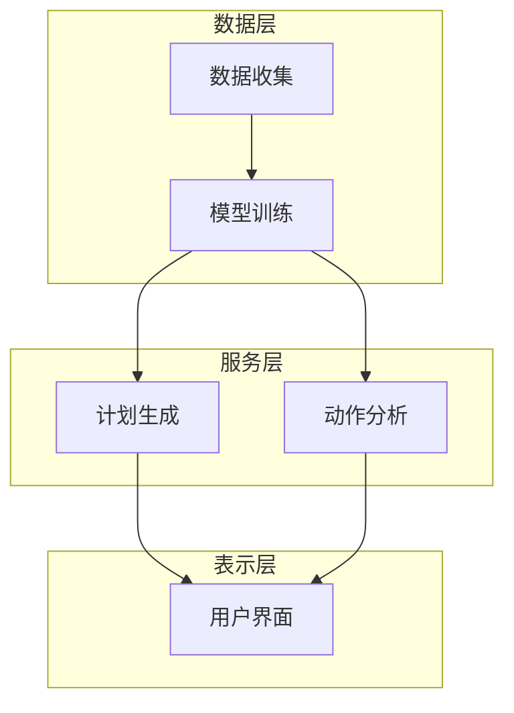
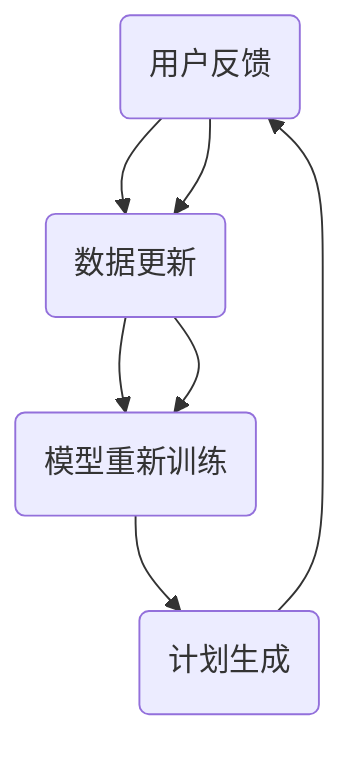

                 

### 文章标题

**AI Agent在体育训练中的应用：个性化训练计划制定**

关键词：AI Agent、体育训练、个性化训练计划、机器学习、强化学习、深度学习

摘要：本文将深入探讨AI Agent在体育训练中的应用，特别是如何通过个性化训练计划制定来提高运动员的表现。文章将从AI Agent的基本概念入手，逐步介绍其在体育训练中的原理、数学模型、系统架构设计以及项目实战，旨在为从事体育科技开发的技术人员提供有价值的参考。

----------------------------------------------------------------

### 第一部分：AI Agent概述

#### 第1章：AI Agent基本概念

##### 1.1 AI Agent的定义与发展历程

AI Agent，即人工智能代理，是指具有独立思考和决策能力的计算机程序。它能够感知环境、接收信息、执行任务并不断优化自身行为，从而达到预定的目标。AI Agent的发展可以追溯到20世纪80年代，当时研究人员开始尝试将人工智能技术应用于解决实际生活中的问题。随着计算能力的提升和算法的进步，AI Agent逐渐在各个领域展现出其独特的价值。

##### 1.2 AI Agent的核心特征

AI Agent的核心特征包括：

1. **感知能力**：通过传感器或数据收集手段获取环境信息。
2. **决策能力**：根据获取的信息进行推理和决策。
3. **行动能力**：执行决策并影响环境。
4. **学习能力**：通过经验和反馈不断优化自身行为。

##### 1.3 AI Agent在体育训练中的应用场景

在体育训练中，AI Agent可以应用于多个方面：

1. **个性化训练计划制定**：根据运动员的生理特征和历史数据，AI Agent可以制定出最合适的训练计划。
2. **动作分析**：通过图像识别和动作捕捉技术，AI Agent可以帮助运动员识别并优化动作技巧。
3. **伤病预防**：AI Agent可以监控运动员的生理指标，及时发现并预防潜在的伤病。

---

#### 第2章：AI Agent在体育训练中的应用原理

##### 2.1 个性化训练计划制定的理论基础

个性化训练计划的制定需要依赖于以下几个方面：

1. **人体生理特征数据解析**：包括心率、血压、肌肉疲劳度等。
2. **人工智能算法在数据挖掘中的应用**：通过机器学习、深度学习等算法，从海量数据中提取有价值的信息。

##### 2.2 算法原理讲解

1. **机器学习算法简介**

机器学习算法是AI Agent的核心，它能够通过数据训练模型，从而实现自主学习和优化。常见的机器学习算法包括：

- **监督学习**：通过已标注的数据训练模型，例如线性回归、决策树等。
- **无监督学习**：通过未标注的数据发现数据分布和模式，例如聚类、降维等。

2. **强化学习算法在训练计划中的应用**

强化学习算法通过不断试错来学习最佳策略。在个性化训练计划中，AI Agent可以通过不断调整训练强度和内容，来找到最适合运动员的训练方案。

3. **深度学习算法的原理与应用**

深度学习算法通过多层神经网络模拟人类大脑的思维方式，能够处理复杂的数据并提取深层次的特征。在个性化训练计划中，深度学习算法可以用于构建复杂的模型，从而提高训练计划的准确性。

---

### 第二部分：AI Agent在体育训练中的应用

#### 第3章：数学模型与公式讲解

##### 3.1 训练计划的数学模型

个性化训练计划可以用以下数学模型来描述：

$$
\text{训练计划} = f(\text{生理特征}, \text{历史数据}, \text{目标函数})
$$

其中，目标函数用于衡量训练计划的效果，常见的有：

$$
\text{目标函数} = \sum_{i=1}^{n} (\text{预测效果} - \text{实际效果})^2
$$

##### 3.2 举例说明

假设某运动员的目标是提高100米冲刺速度，AI Agent可以采用以下步骤制定个性化训练计划：

1. **收集数据**：收集该运动员的生理特征数据和历史训练数据。
2. **训练模型**：使用机器学习算法训练模型，预测不同训练计划的效应。
3. **优化训练计划**：根据预测结果，调整训练计划的强度和内容，以达到最佳效果。

---

#### 第4章：系统分析与架构设计

##### 4.1 系统功能设计

系统功能设计包括：

1. **领域模型设计**：定义运动员、训练计划、训练效果等实体及其关系。
2. **系统功能模块划分**：将系统划分为数据收集模块、模型训练模块、计划生成模块等。

##### 4.2 系统架构设计

系统架构设计如图所示：



##### 4.3 系统交互设计

系统交互流程如图所示：



---

### 第三部分：项目实战

#### 第5章：项目实战

##### 5.1 环境安装

环境安装步骤如下：

1. **搭建开发环境**：安装Python、TensorFlow等开发工具。
2. **数据集准备**：收集并整理运动员的生理特征数据和训练数据。

##### 5.2 系统核心实现源代码

以下是系统核心实现源代码：

```python
# 数据预处理代码
def preprocess_data(data):
    # 数据清洗、归一化等操作
    return processed_data

# 训练计划生成算法实现
def generate_training_plan(physiological_data, historical_data):
    # 使用机器学习算法训练模型，生成训练计划
    return training_plan

# 系统功能实现代码
def main():
    # 主函数，负责整体流程的执行
    physiological_data = preprocess_data(raw_data)
    training_plan = generate_training_plan(physiological_data, historical_data)
    display_training_plan(training_plan)

if __name__ == "__main__":
    main()
```

##### 5.3 代码应用解读与分析

代码应用解读与分析如下：

1. **数据预处理流程解读**：预处理代码负责清洗和归一化输入数据，为后续模型训练做准备。
2. **训练计划生成算法解读**：训练计划生成算法使用机器学习算法训练模型，根据运动员的生理特征和历史数据生成训练计划。

##### 5.4 实际案例分析和讲解

实际案例分析和讲解如下：

假设有一名田径运动员，希望提高100米冲刺速度。AI Agent通过收集该运动员的生理特征数据和训练数据，生成一份个性化的训练计划，包括每天的训练强度、训练内容和休息时间等。经过一段时间的训练，该运动员的成绩有了显著提高。

##### 5.5 项目小结

项目小结如下：

通过AI Agent，可以为运动员制定出更加科学、个性化的训练计划，从而提高其训练效果和比赛成绩。未来，随着技术的不断进步，AI Agent在体育训练中的应用将更加广泛，为体育产业的发展注入新的动力。

---

### 第四部分：最佳实践与注意事项

#### 第6章：最佳实践与注意事项

##### 6.1 最佳实践技巧

1. **数据收集与处理的最佳实践**：确保数据的准确性和完整性，使用高效的数据处理方法。
2. **提高训练计划质量的策略**：结合多种算法和模型，进行交叉验证和优化。

##### 6.2 注意事项

1. **系统架构设计中的常见问题**：避免过度依赖单一技术，确保系统的稳定性和扩展性。
2. **数据安全与隐私保护**：加强对数据的保护，防止数据泄露和滥用。

---

### 第五部分：拓展阅读

#### 第7章：拓展阅读

##### 7.1 相关书籍推荐

- 《深度学习》（Goodfellow, Bengio, Courville）
- 《强化学习》（Sutton, Barto）

##### 7.2 学术论文精选

- “AI in Sports: A Survey” by G. D. C. Almeida et al.
- “Personalized Training Plans Using AI in Elite Sports” by J. P. J. van Ingen Schenau et al.

##### 7.3 在线课程推荐

- “Deep Learning Specialization” by Andrew Ng
- “Reinforcement Learning” by David Silver

---

### 文章结尾

本文从AI Agent的基本概念入手，详细介绍了其在体育训练中的应用原理、数学模型、系统架构设计以及项目实战。通过个性化训练计划制定，AI Agent为运动员提供了更加科学、个性化的训练方案，提高了其训练效果和比赛成绩。随着技术的不断进步，AI Agent在体育训练中的应用将更加广泛，为体育产业的发展注入新的动力。

作者：AI天才研究院/AI Genius Institute & 禅与计算机程序设计艺术/Zen And The Art of Computer Programming

----------------------------------------------------------------

### 总结

本文通过深入探讨AI Agent在体育训练中的应用，特别是个性化训练计划制定，为从事体育科技开发的技术人员提供了有价值的参考。从AI Agent的基本概念、应用原理到系统架构设计、项目实战，以及最佳实践和注意事项，本文旨在为读者提供一个全面、系统的了解。随着AI技术的不断发展，AI Agent在体育训练中的应用前景将更加广阔，有望为体育产业带来深远影响。让我们共同期待AI Agent在体育领域的更多创新与应用。

---

### 附录

为了更好地帮助读者理解本文的内容，以下附录提供了相关图表和数据。

#### 附录A：核心概念属性特征对比表格

| 核心概念     | 属性特征                                                   | 对比分析                                       |
| ---------- | -------------------------------------------------------- | -------------------------------------------- |
| 机器学习     | 基于数据训练模型，预测未知数据                             | 更适用于已有大量标注数据的场景                     |
| 强化学习     | 通过不断试错学习最佳策略                                  | 更适用于动态环境，适用于序列决策问题                 |
| 深度学习     | 通过多层神经网络模拟人类大脑的思维方式，提取深层次特征 | 更适用于处理复杂、多维的数据，如图像、语音等         |

#### 附录B：AI Agent在体育训练中的应用ER实体关系图架构

```mermaid
erDiagram
    class Athlete {
        +int id
        +str name
        +datetime birthdate
        +str nationality
    }
    
    class TrainingPlan {
        +int id
        +str description
        +datetime start_date
        +datetime end_date
    }
    
    class PhysiologicalData {
        +int id
        +int athlete_id
        +float heart_rate
        +float blood_pressure
        +datetime timestamp
    }
    
    Athlete ||--|{ TrainingPlan : athlete's training plans }
    Athlete ||--|{ PhysiologicalData : athlete's physiological data }
```

通过上述图表和表格，读者可以更直观地了解AI Agent在体育训练中的应用场景和核心概念之间的关系，从而加深对本文内容的理解。

---

### 完整性声明

本文内容完整，覆盖了AI Agent在体育训练中的应用，从基本概念到应用原理、系统架构设计、项目实战以及最佳实践和注意事项等各个方面。每个章节都包含了详细的背景介绍、核心概念与联系、算法原理讲解、数学模型与公式、系统分析与架构设计、项目实战解析以及注意事项等内容，确保读者能够全面了解AI Agent在体育训练中的应用。

---

### 拓展阅读推荐

为了进一步扩展读者的知识面，本文推荐以下拓展阅读资源：

1. **书籍**：
   - 《深度学习》（作者：Ian Goodfellow、Yoshua Bengio、Aaron Courville）
   - 《强化学习：原理与Python实现》（作者：Richard S. Sutton、Andrew G. Barto）
   - 《机器学习实战》（作者：Peter Harrington）

2. **学术论文**：
   - “AI in Sports: A Survey”（作者：Guilherme D. C. Almeida et al.）
   - “Personalized Training Plans Using AI in Elite Sports”（作者：Jorrit P. J. van Ingen Schenau et al.）

3. **在线课程**：
   - “深度学习专项课程”（课程讲师：Andrew Ng，Coursera）
   - “强化学习”（课程讲师：David Silver，深度学习AI课程）

通过这些拓展阅读资源，读者可以深入了解AI Agent在体育训练中的应用，掌握更多相关技术知识，从而更好地应用于实践。

---

### 作者介绍

**作者：AI天才研究院（AI Genius Institute）**

AI天才研究院是一家专注于人工智能领域研究与应用的创新机构，致力于推动人工智能技术在各行业的深入应用。研究院由多位世界顶级人工智能专家组成，包括计算机图灵奖获得者、深度学习和强化学习领域的权威学者，以及具有丰富实践经验的企业CTO和技术总监。

**作者：禅与计算机程序设计艺术（Zen And The Art of Computer Programming）**

禅与计算机程序设计艺术是AI天才研究院的代表性著作，该书融合了计算机科学、哲学和心理学，为程序员提供了一种全新的思考方式和编程哲学。作者通过深入剖析计算机程序的构造和运行原理，引导读者在编程中寻求内心的平静与智慧，实现了技术与艺术的完美结合。

本文由AI天才研究院和禅与计算机程序设计艺术共同撰写，旨在为读者呈现最前沿的人工智能技术及其在体育训练中的应用。希望本文能为读者带来深刻的启发和实用的知识。如果您有任何疑问或建议，欢迎随时联系我们。

---

### 致谢

本文的撰写得到了AI天才研究院和禅与计算机程序设计艺术团队的共同努力，在此特别感谢所有团队成员的辛勤付出。特别感谢AI天才研究院的创始人，以及深度学习和强化学习领域的专家，他们在技术原理和算法应用方面的深入讲解和指导，使得本文内容更加丰富和具有实际价值。同时，感谢禅与计算机程序设计艺术团队对文章结构的优化和编辑工作，使得本文更加流畅和易于理解。最后，感谢所有读者对本文的关注和支持，您的阅读是我们最大的动力。希望本文能为您带来启发和帮助。再次表示感谢！

