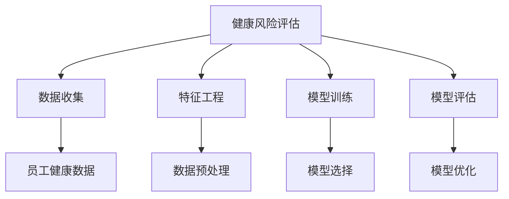
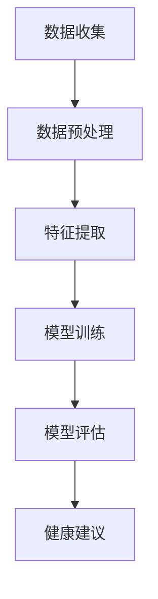
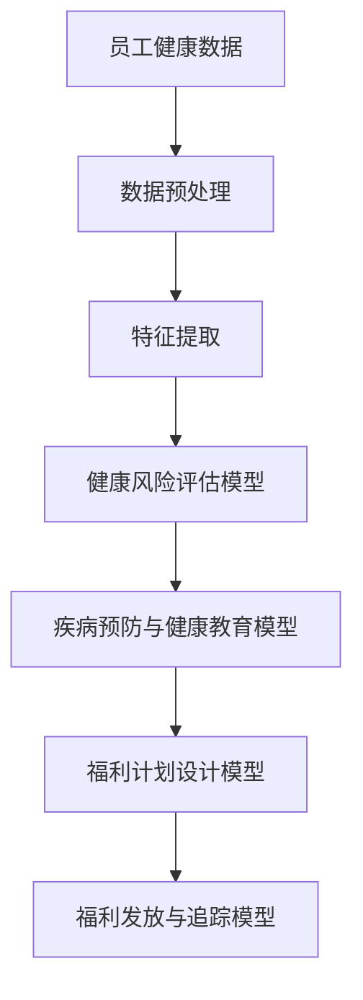
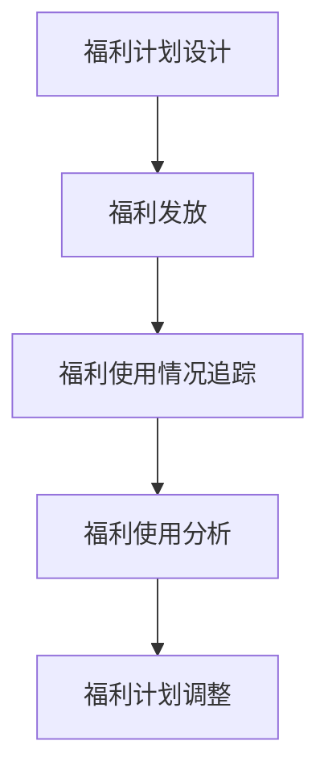
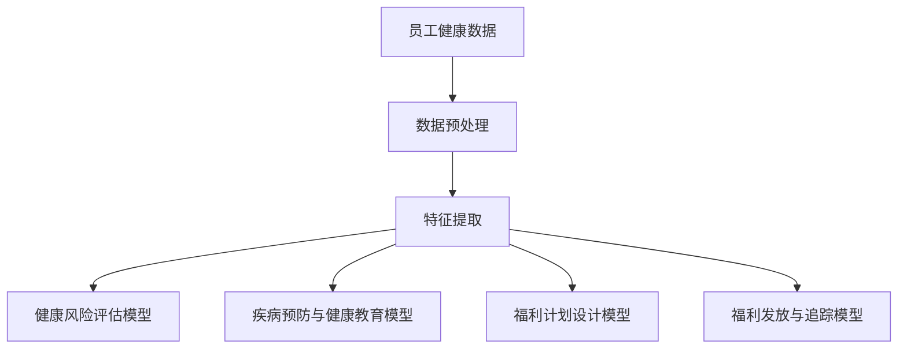
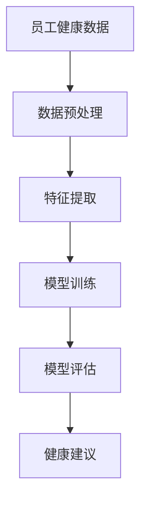

                 

### 《AI Agent在员工健康与福利管理中的应用前景》

> 关键词：AI Agent，员工健康，福利管理，应用前景，挑战与对策

> 摘要：本文从AI Agent的定义与分类出发，深入探讨了AI Agent在员工健康与福利管理中的应用前景。通过分析当前员工健康与福利管理的挑战与需求，本文详细阐述了AI Agent在健康风险评估、疾病预防与健康教育、福利计划设计以及福利发放与追踪等方面的实际应用案例。同时，本文总结了AI Agent在员工健康福利管理中的最佳实践，并对未来的发展趋势与挑战进行了展望。

**----------------------------------------------------------------**

### 第一部分：AI Agent基础与应用

#### 第1章：AI Agent概述

**1.1 AI Agent的定义与分类**

AI Agent，即人工智能代理，是一种能够感知环境、自主决策并采取行动的人工智能系统。根据其工作方式，AI Agent可分为以下几类：

1. **反应型Agent**：这种Agent仅根据当前感知的信息做出反应，不进行记忆或学习。
2. **认知型Agent**：具备一定的记忆和学习能力，能够在过去经验的基础上做出决策。
3. **目标导向型Agent**：具有明确的目标，并致力于实现这些目标。
4. **社会性Agent**：能够与其他Agent进行交互，适应复杂的社会环境。

**1.2 AI Agent的核心特性**

AI Agent的核心特性包括：

1. **自主性**：Agent能够独立地执行任务，无需人工干预。
2. **适应性**：Agent能够根据环境变化调整自身行为。
3. **协作性**：Agent能够与其他Agent协作，共同完成任务。
4. **安全性**：Agent在执行任务时，能够确保自身的安全性和数据隐私。

**1.3 AI Agent在员工健康与福利管理中的应用潜力**

在员工健康与福利管理领域，AI Agent具有以下应用潜力：

1. **健康风险评估**：AI Agent可以通过分析员工的健康数据，预测其患病风险，为制定个性化的健康干预措施提供支持。
2. **疾病预防与健康教育**：AI Agent可以通过推送健康知识、提醒健康检查等方式，帮助员工养成良好的生活习惯，降低患病风险。
3. **福利计划设计**：AI Agent可以根据员工的年龄、健康状况等因素，为其设计个性化的福利计划。
4. **福利发放与追踪**：AI Agent可以自动化处理福利发放流程，提高管理效率，确保福利的公平性。

**----------------------------------------------------------------**

#### 第2章：员工健康与福利管理的挑战与需求

**2.1 背景介绍**

随着社会经济的发展，员工健康与福利管理已经成为企业关注的重要议题。一方面，员工的健康状况直接影响其工作表现和生产力；另一方面，福利管理关系到员工的工作满意度和忠诚度。然而，当前员工健康与福利管理面临着诸多挑战：

1. **健康数据分散**：员工健康数据分布在不同的系统和部门，难以进行集中管理和分析。
2. **风险评估不准确**：传统的健康风险评估方法往往基于静态的数据，难以反映员工的动态健康状况。
3. **福利计划设计不合理**：传统的福利计划设计往往缺乏个性化，无法满足员工的实际需求。
4. **福利发放效率低下**：传统的福利发放流程繁琐，容易出现错误和延误。

**2.2 挑战分析**

1. **数据分散与整合**：企业需要建立统一的数据平台，实现员工健康数据的集中管理和整合。
2. **风险评估精度**：企业需要采用先进的AI技术，提高健康风险评估的精度和实时性。
3. **福利计划个性化**：企业需要根据员工的个性化需求，设计差异化的福利计划。
4. **福利发放效率**：企业需要采用自动化技术，简化福利发放流程，提高管理效率。

**2.3 需求识别**

1. **实时健康监测**：企业需要实现对员工健康数据的实时监测，以便及时发现问题并进行干预。
2. **个性化福利计划**：企业需要根据员工的年龄、健康状况等因素，为其设计个性化的福利计划。
3. **自动化福利发放**：企业需要采用自动化技术，简化福利发放流程，提高管理效率。
4. **数据分析与决策支持**：企业需要利用大数据技术，对员工健康数据进行分析，为决策提供支持。

**----------------------------------------------------------------**

### 第二部分：AI Agent在员工健康管理中的应用

#### 第3章：AI Agent在健康风险评估中的应用

**3.1 健康风险评估的概念与重要性**

健康风险评估是指通过分析个体或群体的健康数据，预测其患病风险的一种方法。在员工健康管理中，健康风险评估具有重要作用：

1. **发现健康隐患**：通过健康风险评估，企业可以发现员工的健康隐患，及时采取干预措施。
2. **优化福利计划**：健康风险评估有助于企业制定个性化的福利计划，提高员工福利的有效性。
3. **降低医疗成本**：通过提前干预，降低员工患病的概率，从而减少医疗成本。

**3.2 AI Agent在健康风险评估中的应用**

AI Agent在健康风险评估中具有显著优势：

1. **数据整合与分析**：AI Agent可以整合来自不同源的健康数据，进行分析和预测。
2. **实时监测与预警**：AI Agent可以实时监测员工的健康状况，预警潜在的健康风险。
3. **个性化风险评估**：AI Agent可以根据员工的个性化数据，进行精准的风险评估。

**3.3 应用案例**

某企业利用AI Agent进行健康风险评估，实现了以下成果：

1. **健康隐患发现**：AI Agent及时发现员工的高血压、糖尿病等健康隐患，企业及时采取措施进行干预。
2. **福利计划优化**：根据AI Agent的风险评估结果，企业优化了福利计划，增加了健康检查、健身补贴等项目。
3. **医疗成本降低**：通过提前干预，企业有效降低了员工的患病率，减少了医疗成本。

**----------------------------------------------------------------**

#### 第4章：AI Agent在疾病预防与健康教育中的应用

**4.1 疾病预防与健康教育的重要性**

疾病预防与健康教育在员工健康管理中具有重要地位：

1. **降低患病风险**：通过健康教育，提高员工的健康素养，降低患病风险。
2. **提高员工满意度**：提供个性化的健康教育服务，提高员工的工作满意度和忠诚度。
3. **提升企业竞争力**：注重员工健康管理，有助于提升企业的整体竞争力。

**4.2 AI Agent在疾病预防与健康教育中的应用**

AI Agent在疾病预防与健康教育中具有以下应用：

1. **健康知识推送**：AI Agent可以根据员工的兴趣和需求，推送相关的健康知识。
2. **健康提醒与预警**：AI Agent可以提醒员工进行健康检查、接种疫苗等。
3. **个性化健康教育**：AI Agent可以根据员工的健康状况，提供个性化的健康教育服务。

**4.3 应用案例**

某企业利用AI Agent进行疾病预防与健康教育，取得了以下成果：

1. **健康知识推送**：AI Agent定期推送健康知识，员工健康素养得到提高。
2. **健康提醒与预警**：AI Agent提醒员工进行健康检查，疫苗接种率显著提高。
3. **个性化健康教育**：AI Agent根据员工的健康状况，提供个性化的健康教育服务，员工的健康状况得到改善。

**----------------------------------------------------------------**

### 第三部分：AI Agent在福利管理中的应用

#### 第5章：AI Agent在福利计划设计中的应用

**5.1 福利计划设计的概念与过程**

福利计划设计是指企业根据员工的需求和实际情况，制定出符合企业战略目标和员工利益的福利方案。福利计划设计的过程包括：

1. **需求调研**：了解员工的福利需求，为福利计划设计提供依据。
2. **方案制定**：根据需求调研结果，制定符合企业战略和员工利益的福利计划。
3. **方案实施**：执行福利计划，确保福利的公平性和有效性。
4. **效果评估**：评估福利计划的效果，为福利计划调整提供参考。

**5.2 AI Agent在福利计划设计中的应用**

AI Agent在福利计划设计中具有以下应用：

1. **需求分析**：AI Agent可以通过数据分析，了解员工的福利需求，为福利计划设计提供依据。
2. **方案优化**：AI Agent可以根据数据分析结果，优化福利计划，提高福利的有效性。
3. **效果评估**：AI Agent可以实时监测福利计划的效果，为福利计划调整提供参考。

**5.3 应用案例**

某企业利用AI Agent进行福利计划设计，实现了以下成果：

1. **需求分析**：AI Agent分析员工的福利需求，发现员工对健康检查、健身补贴等需求较高。
2. **方案优化**：根据AI Agent的需求分析结果，企业优化了福利计划，增加了健康检查、健身补贴等项目。
3. **效果评估**：AI Agent实时监测福利计划的效果，发现员工的健康状况得到改善，满意度提高。

**----------------------------------------------------------------**

#### 第6章：AI Agent在福利发放与追踪中的应用

**6.1 福利发放与追踪的重要性**

福利发放与追踪是福利管理的重要环节：

1. **确保福利公平性**：通过福利发放与追踪，确保福利的公平性和有效性。
2. **提高管理效率**：采用自动化技术，简化福利发放与追踪流程，提高管理效率。
3. **优化员工体验**：提供便捷的福利发放与追踪服务，提升员工的工作满意度和忠诚度。

**6.2 AI Agent在福利发放与追踪中的应用**

AI Agent在福利发放与追踪中具有以下应用：

1. **自动化发放**：AI Agent可以自动化处理福利发放流程，提高管理效率。
2. **实时追踪**：AI Agent可以实时追踪福利使用情况，确保福利的公平性。
3. **数据分析**：AI Agent可以分析福利发放与使用数据，为福利计划调整提供参考。

**6.3 应用案例**

某企业利用AI Agent进行福利发放与追踪，实现了以下成果：

1. **自动化发放**：AI Agent自动化处理福利发放流程，减少了人工干预，提高了管理效率。
2. **实时追踪**：AI Agent实时追踪福利使用情况，确保福利的公平性和有效性。
3. **数据分析**：AI Agent分析福利发放与使用数据，发现某些福利项目使用率较低，企业及时调整了福利计划。

**----------------------------------------------------------------**

### 第四部分：AI Agent在员工健康福利管理中的最佳实践

#### 第7章：AI Agent在员工健康福利管理中的最佳实践

**7.1 实践经验总结**

在AI Agent应用于员工健康福利管理的过程中，以下实践经验值得总结：

1. **数据驱动**：以数据为基础，进行需求分析、风险评估和福利计划设计。
2. **个性化服务**：根据员工的个性化需求，提供差异化的健康教育和福利服务。
3. **自动化流程**：采用自动化技术，简化福利发放与追踪流程，提高管理效率。
4. **实时监测**：通过实时监测，确保福利的公平性和有效性。
5. **持续优化**：根据数据分析结果，持续优化福利计划和管理策略。

**7.2 最佳实践案例分析**

以下为两个最佳实践案例：

**案例一：某企业AI Agent在员工健康福利管理中的应用**

1. **需求分析**：AI Agent通过数据分析，发现员工对健康检查、健身补贴等福利需求较高。
2. **方案制定**：企业根据AI Agent的需求分析结果，优化了福利计划，增加了健康检查、健身补贴等项目。
3. **效果评估**：AI Agent实时监测福利计划的效果，发现员工的健康状况得到改善，满意度提高。

**案例二：某企业AI Agent在员工福利发放与追踪中的应用**

1. **自动化发放**：AI Agent自动化处理福利发放流程，减少了人工干预，提高了管理效率。
2. **实时追踪**：AI Agent实时追踪福利使用情况，确保福利的公平性。
3. **数据分析**：AI Agent分析福利发放与使用数据，发现某些福利项目使用率较低，企业及时调整了福利计划。

**7.3 实施策略与建议**

为有效实施AI Agent在员工健康福利管理中的应用，以下策略与建议：

1. **数据整合**：建立统一的数据平台，实现员工健康数据的集中管理和整合。
2. **技术培训**：为员工和管理者提供AI技术的培训，提高其对AI Agent的理解和应用能力。
3. **激励机制**：建立激励机制，鼓励员工积极参与健康管理和福利使用。
4. **持续改进**：根据数据分析结果，持续优化福利计划和管理策略。
5. **风险评估**：定期进行AI Agent在员工健康福利管理中的风险评估，确保系统的安全性和稳定性。

**----------------------------------------------------------------**

### 第五部分：未来展望与挑战

#### 第8章：AI Agent在员工健康福利管理中的未来展望

**8.1 技术发展趋势**

随着AI技术的不断发展，AI Agent在员工健康福利管理中的应用将呈现以下趋势：

1. **智能化**：AI Agent将更加智能化，具备更强大的数据分析、预测和决策能力。
2. **个性化**：AI Agent将根据员工的个性化需求，提供更精准的健康教育和福利服务。
3. **实时性**：AI Agent将实现实时监测和分析，提供更加及时的干预和支持。
4. **泛在化**：AI Agent将在更广泛的场景中得到应用，涵盖员工健康管理的各个方面。

**8.2 应用前景预测**

未来，AI Agent在员工健康福利管理中的应用前景将非常广阔：

1. **健康管理**：AI Agent将广泛应用于员工健康监测、疾病预防、健康教育等领域。
2. **福利管理**：AI Agent将协助企业制定个性化的福利计划，优化福利发放与追踪流程。
3. **数据分析**：AI Agent将帮助企业更深入地了解员工需求，提高福利管理的针对性和有效性。
4. **个性化推荐**：AI Agent将根据员工的行为数据和偏好，提供个性化的健康和福利推荐。

**8.3 面临的挑战与对策**

在AI Agent应用于员工健康福利管理的过程中，将面临以下挑战：

1. **数据隐私**：如何确保员工健康数据的隐私和安全，是首要挑战。
2. **技术成熟度**：当前AI技术尚不成熟，需要持续研发和优化。
3. **管理变革**：企业需要适应AI技术带来的管理变革，提高管理者的技术水平。
4. **法律合规**：需要遵守相关法律法规，确保AI Agent在员工健康福利管理中的合法合规。

为应对这些挑战，以下对策：

1. **数据加密**：采用先进的数据加密技术，确保员工健康数据的安全。
2. **技术升级**：持续投入研发，提高AI技术的成熟度和性能。
3. **培训与教育**：加强对管理者和员工的AI技术培训，提高其应用能力。
4. **合规性审查**：定期进行合规性审查，确保AI Agent在员工健康福利管理中的合法合规。

**----------------------------------------------------------------**

#### 第9章：结语

**9.1 小结与展望**

本文从AI Agent的定义与分类出发，深入探讨了AI Agent在员工健康与福利管理中的应用前景。通过分析当前员工健康与福利管理的挑战与需求，本文详细阐述了AI Agent在健康风险评估、疾病预防与健康教育、福利计划设计以及福利发放与追踪等方面的实际应用案例。同时，本文总结了AI Agent在员工健康福利管理中的最佳实践，并对未来的发展趋势与挑战进行了展望。

**9.2 注意事项与建议**

1. **数据安全**：在应用AI Agent时，务必确保员工健康数据的安全，采用先进的数据加密技术。
2. **技术成熟度**：关注AI技术的发展动态，持续优化AI Agent的功能和性能。
3. **管理变革**：企业需要适应AI技术带来的管理变革，提高管理者的技术水平。
4. **合规性审查**：定期进行合规性审查，确保AI Agent在员工健康福利管理中的合法合规。

**9.3 拓展阅读**

1. **参考文献**：
   - 《人工智能：一种现代的方法》
   - 《大数据与人工智能：实务与应用》
   - 《健康大数据：理论与实践》

2. **在线资源**：
   - https://www.kdnuggets.com/
   - https://towardsdatascience.com/
   - https://www.datascience.com/

3. **课程推荐**：
   - 《深度学习》
   - 《机器学习实战》
   - 《大数据技术基础》

**----------------------------------------------------------------**

**作者：AI天才研究院/AI Genius Institute & 禅与计算机程序设计艺术 /Zen And The Art of Computer Programming**### AI Agent在员工健康与福利管理中的应用前景

关键词：AI Agent，员工健康，福利管理，应用前景，挑战与对策

摘要：本文深入探讨了AI Agent在员工健康与福利管理中的应用前景。通过分析当前员工健康与福利管理的挑战与需求，本文详细阐述了AI Agent在健康风险评估、疾病预防与健康教育、福利计划设计以及福利发放与追踪等方面的实际应用案例。同时，本文总结了AI Agent在员工健康福利管理中的最佳实践，并对未来的发展趋势与挑战进行了展望。

**第一部分：AI Agent基础与应用**

**第1章：AI Agent概述**

**1.1 AI Agent的定义与分类**

AI Agent，即人工智能代理，是一种能够感知环境、自主决策并采取行动的人工智能系统。根据其工作方式，AI Agent可分为以下几类：

1. **反应型Agent**：这种Agent仅根据当前感知的信息做出反应，不进行记忆或学习。
2. **认知型Agent**：具备一定的记忆和学习能力，能够在过去经验的基础上做出决策。
3. **目标导向型Agent**：具有明确的目标，并致力于实现这些目标。
4. **社会性Agent**：能够与其他Agent进行交互，适应复杂的社会环境。

**1.2 AI Agent的核心特性**

AI Agent的核心特性包括：

1. **自主性**：Agent能够独立地执行任务，无需人工干预。
2. **适应性**：Agent能够根据环境变化调整自身行为。
3. **协作性**：Agent能够与其他Agent协作，共同完成任务。
4. **安全性**：Agent在执行任务时，能够确保自身的安全性和数据隐私。

**1.3 AI Agent在员工健康与福利管理中的应用潜力**

在员工健康与福利管理领域，AI Agent具有以下应用潜力：

1. **健康风险评估**：AI Agent可以通过分析员工的健康数据，预测其患病风险，为制定个性化的健康干预措施提供支持。
2. **疾病预防与健康教育**：AI Agent可以通过推送健康知识、提醒健康检查等方式，帮助员工养成良好的生活习惯，降低患病风险。
3. **福利计划设计**：AI Agent可以根据员工的年龄、健康状况等因素，为其设计个性化的福利计划。
4. **福利发放与追踪**：AI Agent可以自动化处理福利发放流程，提高管理效率，确保福利的公平性。

**第2章：员工健康与福利管理的挑战与需求**

**2.1 背景介绍**

随着社会经济的发展，员工健康与福利管理已经成为企业关注的重要议题。一方面，员工的健康状况直接影响其工作表现和生产力；另一方面，福利管理关系到员工的工作满意度和忠诚度。然而，当前员工健康与福利管理面临着诸多挑战：

1. **健康数据分散**：员工健康数据分布在不同的系统和部门，难以进行集中管理和分析。
2. **风险评估不准确**：传统的健康风险评估方法往往基于静态的数据，难以反映员工的动态健康状况。
3. **福利计划设计不合理**：传统的福利计划设计往往缺乏个性化，无法满足员工的实际需求。
4. **福利发放效率低下**：传统的福利发放流程繁琐，容易出现错误和延误。

**2.2 挑战分析**

1. **数据分散与整合**：企业需要建立统一的数据平台，实现员工健康数据的集中管理和整合。
2. **风险评估精度**：企业需要采用先进的AI技术，提高健康风险评估的精度和实时性。
3. **福利计划个性化**：企业需要根据员工的个性化需求，设计差异化的福利计划。
4. **福利发放效率**：企业需要采用自动化技术，简化福利发放流程，提高管理效率。

**2.3 需求识别**

1. **实时健康监测**：企业需要实现对员工健康数据的实时监测，以便及时发现问题并进行干预。
2. **个性化福利计划**：企业需要根据员工的年龄、健康状况等因素，为其设计个性化的福利计划。
3. **自动化福利发放**：企业需要采用自动化技术，简化福利发放流程，提高管理效率。
4. **数据分析与决策支持**：企业需要利用大数据技术，对员工健康数据进行分析，为决策提供支持。

**第二部分：AI Agent在员工健康管理中的应用**

**第3章：AI Agent在健康风险评估中的应用**

**3.1 健康风险评估的概念与重要性**

健康风险评估是指通过分析个体或群体的健康数据，预测其患病风险的一种方法。在员工健康管理中，健康风险评估具有重要作用：

1. **发现健康隐患**：通过健康风险评估，企业可以发现员工的健康隐患，及时采取干预措施。
2. **优化福利计划**：健康风险评估有助于企业制定个性化的福利计划，提高员工福利的有效性。
3. **降低医疗成本**：通过提前干预，降低员工患病的概率，从而减少医疗成本。

**3.2 AI Agent在健康风险评估中的应用**

AI Agent在健康风险评估中具有显著优势：

1. **数据整合与分析**：AI Agent可以整合来自不同源的健康数据，进行分析和预测。
2. **实时监测与预警**：AI Agent可以实时监测员工的健康状况，预警潜在的健康风险。
3. **个性化风险评估**：AI Agent可以根据员工的个性化数据，进行精准的风险评估。

**3.3 应用案例**

某企业利用AI Agent进行健康风险评估，实现了以下成果：

1. **健康隐患发现**：AI Agent及时发现员工的高血压、糖尿病等健康隐患，企业及时采取措施进行干预。
2. **福利计划优化**：根据AI Agent的风险评估结果，企业优化了福利计划，增加了健康检查、健身补贴等项目。
3. **医疗成本降低**：通过提前干预，企业有效降低了员工的患病率，减少了医疗成本。

**第4章：AI Agent在疾病预防与健康教育中的应用**

**4.1 疾病预防与健康教育的重要性**

疾病预防与健康教育在员工健康管理中具有重要地位：

1. **降低患病风险**：通过健康教育，提高员工的健康素养，降低患病风险。
2. **提高员工满意度**：提供个性化的健康教育服务，提高员工的工作满意度和忠诚度。
3. **提升企业竞争力**：注重员工健康管理，有助于提升企业的整体竞争力。

**4.2 AI Agent在疾病预防与健康教育中的应用**

AI Agent在疾病预防与健康教育中具有以下应用：

1. **健康知识推送**：AI Agent可以根据员工的兴趣和需求，推送相关的健康知识。
2. **健康提醒与预警**：AI Agent可以提醒员工进行健康检查、接种疫苗等。
3. **个性化健康教育**：AI Agent可以根据员工的健康状况，提供个性化的健康教育服务。

**4.3 应用案例**

某企业利用AI Agent进行疾病预防与健康教育，取得了以下成果：

1. **健康知识推送**：AI Agent定期推送健康知识，员工健康素养得到提高。
2. **健康提醒与预警**：AI Agent提醒员工进行健康检查，疫苗接种率显著提高。
3. **个性化健康教育**：AI Agent根据员工的健康状况，提供个性化的健康教育服务，员工的健康状况得到改善。

**第三部分：AI Agent在福利管理中的应用**

**第5章：AI Agent在福利计划设计中的应用**

**5.1 福利计划设计的概念与过程**

福利计划设计是指企业根据员工的需求和实际情况，制定出符合企业战略目标和员工利益的福利方案。福利计划设计的过程包括：

1. **需求调研**：了解员工的福利需求，为福利计划设计提供依据。
2. **方案制定**：根据需求调研结果，制定符合企业战略和员工利益的福利计划。
3. **方案实施**：执行福利计划，确保福利的公平性和有效性。
4. **效果评估**：评估福利计划的效果，为福利计划调整提供参考。

**5.2 AI Agent在福利计划设计中的应用**

AI Agent在福利计划设计中具有以下应用：

1. **需求分析**：AI Agent可以通过数据分析，了解员工的福利需求，为福利计划设计提供依据。
2. **方案优化**：AI Agent可以根据数据分析结果，优化福利计划，提高福利的有效性。
3. **效果评估**：AI Agent可以实时监测福利计划的效果，为福利计划调整提供参考。

**5.3 应用案例**

某企业利用AI Agent进行福利计划设计，实现了以下成果：

1. **需求分析**：AI Agent分析员工的福利需求，发现员工对健康检查、健身补贴等需求较高。
2. **方案优化**：根据AI Agent的需求分析结果，企业优化了福利计划，增加了健康检查、健身补贴等项目。
3. **效果评估**：AI Agent实时监测福利计划的效果，发现员工的健康状况得到改善，满意度提高。

**第6章：AI Agent在福利发放与追踪中的应用**

**6.1 福利发放与追踪的重要性**

福利发放与追踪是福利管理的重要环节：

1. **确保福利公平性**：通过福利发放与追踪，确保福利的公平性和有效性。
2. **提高管理效率**：采用自动化技术，简化福利发放与追踪流程，提高管理效率。
3. **优化员工体验**：提供便捷的福利发放与追踪服务，提升员工的工作满意度和忠诚度。

**6.2 AI Agent在福利发放与追踪中的应用**

AI Agent在福利发放与追踪中具有以下应用：

1. **自动化发放**：AI Agent可以自动化处理福利发放流程，提高管理效率。
2. **实时追踪**：AI Agent可以实时追踪福利使用情况，确保福利的公平性。
3. **数据分析**：AI Agent可以分析福利发放与使用数据，为福利计划调整提供参考。

**6.3 应用案例**

某企业利用AI Agent进行福利发放与追踪，实现了以下成果：

1. **自动化发放**：AI Agent自动化处理福利发放流程，减少了人工干预，提高了管理效率。
2. **实时追踪**：AI Agent实时追踪福利使用情况，确保福利的公平性和有效性。
3. **数据分析**：AI Agent分析福利发放与使用数据，发现某些福利项目使用率较低，企业及时调整了福利计划。

**第四部分：AI Agent在员工健康福利管理中的最佳实践**

**第7章：AI Agent在员工健康福利管理中的最佳实践**

**7.1 实践经验总结**

在AI Agent应用于员工健康福利管理的过程中，以下实践经验值得总结：

1. **数据驱动**：以数据为基础，进行需求分析、风险评估和福利计划设计。
2. **个性化服务**：根据员工的个性化需求，提供差异化的健康教育和福利服务。
3. **自动化流程**：采用自动化技术，简化福利发放与追踪流程，提高管理效率。
4. **实时监测**：通过实时监测，确保福利的公平性和有效性。
5. **持续优化**：根据数据分析结果，持续优化福利计划和管理策略。

**7.2 最佳实践案例分析**

以下为两个最佳实践案例：

**案例一：某企业AI Agent在员工健康福利管理中的应用**

1. **需求分析**：AI Agent通过数据分析，发现员工对健康检查、健身补贴等福利需求较高。
2. **方案制定**：企业根据AI Agent的需求分析结果，优化了福利计划，增加了健康检查、健身补贴等项目。
3. **效果评估**：AI Agent实时监测福利计划的效果，发现员工的健康状况得到改善，满意度提高。

**案例二：某企业AI Agent在员工福利发放与追踪中的应用**

1. **自动化发放**：AI Agent自动化处理福利发放流程，减少了人工干预，提高了管理效率。
2. **实时追踪**：AI Agent实时追踪福利使用情况，确保福利的公平性。
3. **数据分析**：AI Agent分析福利发放与使用数据，发现某些福利项目使用率较低，企业及时调整了福利计划。

**7.3 实施策略与建议**

为有效实施AI Agent在员工健康福利管理中的应用，以下策略与建议：

1. **数据整合**：建立统一的数据平台，实现员工健康数据的集中管理和整合。
2. **技术培训**：为员工和管理者提供AI技术的培训，提高其对AI Agent的理解和应用能力。
3. **激励机制**：建立激励机制，鼓励员工积极参与健康管理和福利使用。
4. **持续改进**：根据数据分析结果，持续优化福利计划和管理策略。
5. **风险评估**：定期进行AI Agent在员工健康福利管理中的风险评估，确保系统的安全性和稳定性。

**第五部分：未来展望与挑战**

**第8章：AI Agent在员工健康福利管理中的未来展望**

**8.1 技术发展趋势**

随着AI技术的不断发展，AI Agent在员工健康福利管理中的应用将呈现以下趋势：

1. **智能化**：AI Agent将更加智能化，具备更强大的数据分析、预测和决策能力。
2. **个性化**：AI Agent将根据员工的个性化需求，提供更精准的健康教育和福利服务。
3. **实时性**：AI Agent将实现实时监测和分析，提供更加及时的干预和支持。
4. **泛在化**：AI Agent将在更广泛的场景中得到应用，涵盖员工健康管理的各个方面。

**8.2 应用前景预测**

未来，AI Agent在员工健康福利管理中的应用前景将非常广阔：

1. **健康管理**：AI Agent将广泛应用于员工健康监测、疾病预防、健康教育等领域。
2. **福利管理**：AI Agent将协助企业制定个性化的福利计划，优化福利发放与追踪流程。
3. **数据分析**：AI Agent将帮助企业更深入地了解员工需求，提高福利管理的针对性和有效性。
4. **个性化推荐**：AI Agent将根据员工的行为数据和偏好，提供个性化的健康和福利推荐。

**8.3 面临的挑战与对策**

在AI Agent应用于员工健康福利管理的过程中，将面临以下挑战：

1. **数据隐私**：如何确保员工健康数据的隐私和安全，是首要挑战。
2. **技术成熟度**：当前AI技术尚不成熟，需要持续研发和优化。
3. **管理变革**：企业需要适应AI技术带来的管理变革，提高管理者的技术水平。
4. **法律合规**：需要遵守相关法律法规，确保AI Agent在员工健康福利管理中的合法合规。

为应对这些挑战，以下对策：

1. **数据加密**：采用先进的数据加密技术，确保员工健康数据的安全。
2. **技术升级**：持续投入研发，提高AI技术的成熟度和性能。
3. **培训与教育**：加强对管理者和员工的AI技术培训，提高其应用能力。
4. **合规性审查**：定期进行合规性审查，确保AI Agent在员工健康福利管理中的合法合规。

**第9章：结语**

**9.1 小结与展望**

本文从AI Agent的定义与分类出发，深入探讨了AI Agent在员工健康与福利管理中的应用前景。通过分析当前员工健康与福利管理的挑战与需求，本文详细阐述了AI Agent在健康风险评估、疾病预防与健康教育、福利计划设计以及福利发放与追踪等方面的实际应用案例。同时，本文总结了AI Agent在员工健康福利管理中的最佳实践，并对未来的发展趋势与挑战进行了展望。

**9.2 注意事项与建议**

1. **数据安全**：在应用AI Agent时，务必确保员工健康数据的安全，采用先进的数据加密技术。
2. **技术成熟度**：关注AI技术的发展动态，持续优化AI Agent的功能和性能。
3. **管理变革**：企业需要适应AI技术带来的管理变革，提高管理者的技术水平。
4. **合规性审查**：定期进行合规性审查，确保AI Agent在员工健康福利管理中的合法合规。

**9.3 拓展阅读**

1. **参考文献**：
   - 《人工智能：一种现代的方法》
   - 《大数据与人工智能：实务与应用》
   - 《健康大数据：理论与实践》

2. **在线资源**：
   - https://www.kdnuggets.com/
   - https://towardsdatascience.com/
   - https://www.datascience.com/

3. **课程推荐**：
   - 《深度学习》
   - 《机器学习实战》
   - 《大数据技术基础》

**作者：AI天才研究院/AI Genius Institute & 禅与计算机程序设计艺术 /Zen And The Art of Computer Programming**### AI Agent在员工健康与福利管理中的应用前景

### 摘要

本文探讨了AI Agent在员工健康与福利管理中的应用前景。首先，我们介绍了AI Agent的定义、分类和核心特性。然后，分析了员工健康与福利管理的挑战与需求，包括数据分散、风险评估不准确、福利计划设计不合理和福利发放效率低下等问题。接下来，本文详细阐述了AI Agent在健康风险评估、疾病预防与健康教育、福利计划设计以及福利发放与追踪等方面的应用，并通过案例展示了其实际效果。最后，本文总结了AI Agent在员工健康福利管理中的最佳实践，并对未来的发展趋势与挑战进行了展望。

### 目录

**第一部分：AI Agent基础与应用**

**第1章：AI Agent概述**

- **1.1 AI Agent的定义与分类**
- **1.2 AI Agent的核心特性**
- **1.3 AI Agent在员工健康与福利管理中的应用潜力**

**第2章：员工健康与福利管理的挑战与需求**

- **2.1 背景介绍**
- **2.2 挑战分析**
- **2.3 需求识别**

**第二部分：AI Agent在员工健康管理中的应用**

**第3章：AI Agent在健康风险评估中的应用**

- **3.1 健康风险评估的概念与重要性**
- **3.2 AI Agent在健康风险评估中的应用**
- **3.3 应用案例**

**第4章：AI Agent在疾病预防与健康教育中的应用**

- **4.1 疾病预防与健康教育的重要性**
- **4.2 AI Agent在疾病预防与健康教育中的应用**
- **4.3 应用案例**

**第三部分：AI Agent在福利管理中的应用**

**第5章：AI Agent在福利计划设计中的应用**

- **5.1 福利计划设计的概念与过程**
- **5.2 AI Agent在福利计划设计中的应用**
- **5.3 应用案例**

**第6章：AI Agent在福利发放与追踪中的应用**

- **6.1 福利发放与追踪的重要性**
- **6.2 AI Agent在福利发放与追踪中的应用**
- **6.3 应用案例**

**第四部分：AI Agent在员工健康福利管理中的最佳实践**

**第7章：AI Agent在员工健康福利管理中的最佳实践**

- **7.1 实践经验总结**
- **7.2 最佳实践案例分析**
- **7.3 实施策略与建议**

**第五部分：未来展望与挑战**

**第8章：AI Agent在员工健康福利管理中的未来展望**

- **8.1 技术发展趋势**
- **8.2 应用前景预测**
- **8.3 面临的挑战与对策**

**第9章：结语**

- **9.1 小结与展望**
- **9.2 注意事项与建议**
- **9.3 拓展阅读**

### 正文

#### 第1章：AI Agent概述

##### 1.1 AI Agent的定义与分类

AI Agent，即人工智能代理，是一种能够感知环境、自主决策并采取行动的人工智能系统。根据其工作方式，AI Agent可分为以下几类：

1. **反应型Agent**：这种Agent仅根据当前感知的信息做出反应，不进行记忆或学习。
2. **认知型Agent**：具备一定的记忆和学习能力，能够在过去经验的基础上做出决策。
3. **目标导向型Agent**：具有明确的目标，并致力于实现这些目标。
4. **社会性Agent**：能够与其他Agent进行交互，适应复杂的社会环境。

##### 1.2 AI Agent的核心特性

AI Agent的核心特性包括：

1. **自主性**：Agent能够独立地执行任务，无需人工干预。
2. **适应性**：Agent能够根据环境变化调整自身行为。
3. **协作性**：Agent能够与其他Agent协作，共同完成任务。
4. **安全性**：Agent在执行任务时，能够确保自身的安全性和数据隐私。

##### 1.3 AI Agent在员工健康与福利管理中的应用潜力

在员工健康与福利管理领域，AI Agent具有以下应用潜力：

1. **健康风险评估**：AI Agent可以通过分析员工的健康数据，预测其患病风险，为制定个性化的健康干预措施提供支持。
2. **疾病预防与健康教育**：AI Agent可以通过推送健康知识、提醒健康检查等方式，帮助员工养成良好的生活习惯，降低患病风险。
3. **福利计划设计**：AI Agent可以根据员工的年龄、健康状况等因素，为其设计个性化的福利计划。
4. **福利发放与追踪**：AI Agent可以自动化处理福利发放流程，提高管理效率，确保福利的公平性。

#### 第2章：员工健康与福利管理的挑战与需求

##### 2.1 背景介绍

随着社会经济的发展，员工健康与福利管理已经成为企业关注的重要议题。一方面，员工的健康状况直接影响其工作表现和生产力；另一方面，福利管理关系到员工的工作满意度和忠诚度。然而，当前员工健康与福利管理面临着诸多挑战：

1. **健康数据分散**：员工健康数据分布在不同的系统和部门，难以进行集中管理和分析。
2. **风险评估不准确**：传统的健康风险评估方法往往基于静态的数据，难以反映员工的动态健康状况。
3. **福利计划设计不合理**：传统的福利计划设计往往缺乏个性化，无法满足员工的实际需求。
4. **福利发放效率低下**：传统的福利发放流程繁琐，容易出现错误和延误。

##### 2.2 挑战分析

1. **数据分散与整合**：企业需要建立统一的数据平台，实现员工健康数据的集中管理和整合。
2. **风险评估精度**：企业需要采用先进的AI技术，提高健康风险评估的精度和实时性。
3. **福利计划个性化**：企业需要根据员工的个性化需求，设计差异化的福利计划。
4. **福利发放效率**：企业需要采用自动化技术，简化福利发放流程，提高管理效率。

##### 2.3 需求识别

1. **实时健康监测**：企业需要实现对员工健康数据的实时监测，以便及时发现问题并进行干预。
2. **个性化福利计划**：企业需要根据员工的年龄、健康状况等因素，为其设计个性化的福利计划。
3. **自动化福利发放**：企业需要采用自动化技术，简化福利发放流程，提高管理效率。
4. **数据分析与决策支持**：企业需要利用大数据技术，对员工健康数据进行分析，为决策提供支持。

#### 第3章：AI Agent在健康风险评估中的应用

##### 3.1 健康风险评估的概念与重要性

健康风险评估是指通过分析个体或群体的健康数据，预测其患病风险的一种方法。在员工健康管理中，健康风险评估具有重要作用：

1. **发现健康隐患**：通过健康风险评估，企业可以发现员工的健康隐患，及时采取干预措施。
2. **优化福利计划**：健康风险评估有助于企业制定个性化的福利计划，提高员工福利的有效性。
3. **降低医疗成本**：通过提前干预，降低员工患病的概率，从而减少医疗成本。

##### 3.2 AI Agent在健康风险评估中的应用

AI Agent在健康风险评估中具有显著优势：

1. **数据整合与分析**：AI Agent可以整合来自不同源的健康数据，进行分析和预测。
2. **实时监测与预警**：AI Agent可以实时监测员工的健康状况，预警潜在的健康风险。
3. **个性化风险评估**：AI Agent可以根据员工的个性化数据，进行精准的风险评估。

##### 3.3 应用案例

某企业利用AI Agent进行健康风险评估，实现了以下成果：

1. **健康隐患发现**：AI Agent及时发现员工的高血压、糖尿病等健康隐患，企业及时采取措施进行干预。
2. **福利计划优化**：根据AI Agent的风险评估结果，企业优化了福利计划，增加了健康检查、健身补贴等项目。
3. **医疗成本降低**：通过提前干预，企业有效降低了员工的患病率，减少了医疗成本。

#### 第4章：AI Agent在疾病预防与健康教育中的应用

##### 4.1 疾病预防与健康教育的重要性

疾病预防与健康教育在员工健康管理中具有重要地位：

1. **降低患病风险**：通过健康教育，提高员工的健康素养，降低患病风险。
2. **提高员工满意度**：提供个性化的健康教育服务，提高员工的工作满意度和忠诚度。
3. **提升企业竞争力**：注重员工健康管理，有助于提升企业的整体竞争力。

##### 4.2 AI Agent在疾病预防与健康教育中的应用

AI Agent在疾病预防与健康教育中具有以下应用：

1. **健康知识推送**：AI Agent可以根据员工的兴趣和需求，推送相关的健康知识。
2. **健康提醒与预警**：AI Agent可以提醒员工进行健康检查、接种疫苗等。
3. **个性化健康教育**：AI Agent可以根据员工的健康状况，提供个性化的健康教育服务。

##### 4.3 应用案例

某企业利用AI Agent进行疾病预防与健康教育，取得了以下成果：

1. **健康知识推送**：AI Agent定期推送健康知识，员工健康素养得到提高。
2. **健康提醒与预警**：AI Agent提醒员工进行健康检查，疫苗接种率显著提高。
3. **个性化健康教育**：AI Agent根据员工的健康状况，提供个性化的健康教育服务，员工的健康状况得到改善。

#### 第5章：AI Agent在福利计划设计中的应用

##### 5.1 福利计划设计的概念与过程

福利计划设计是指企业根据员工的需求和实际情况，制定出符合企业战略目标和员工利益的福利方案。福利计划设计的过程包括：

1. **需求调研**：了解员工的福利需求，为福利计划设计提供依据。
2. **方案制定**：根据需求调研结果，制定符合企业战略和员工利益的福利计划。
3. **方案实施**：执行福利计划，确保福利的公平性和有效性。
4. **效果评估**：评估福利计划的效果，为福利计划调整提供参考。

##### 5.2 AI Agent在福利计划设计中的应用

AI Agent在福利计划设计中具有以下应用：

1. **需求分析**：AI Agent可以通过数据分析，了解员工的福利需求，为福利计划设计提供依据。
2. **方案优化**：AI Agent可以根据数据分析结果，优化福利计划，提高福利的有效性。
3. **效果评估**：AI Agent可以实时监测福利计划的效果，为福利计划调整提供参考。

##### 5.3 应用案例

某企业利用AI Agent进行福利计划设计，实现了以下成果：

1. **需求分析**：AI Agent分析员工的福利需求，发现员工对健康检查、健身补贴等需求较高。
2. **方案优化**：根据AI Agent的需求分析结果，企业优化了福利计划，增加了健康检查、健身补贴等项目。
3. **效果评估**：AI Agent实时监测福利计划的效果，发现员工的健康状况得到改善，满意度提高。

#### 第6章：AI Agent在福利发放与追踪中的应用

##### 6.1 福利发放与追踪的重要性

福利发放与追踪是福利管理的重要环节：

1. **确保福利公平性**：通过福利发放与追踪，确保福利的公平性和有效性。
2. **提高管理效率**：采用自动化技术，简化福利发放与追踪流程，提高管理效率。
3. **优化员工体验**：提供便捷的福利发放与追踪服务，提升员工的工作满意度和忠诚度。

##### 6.2 AI Agent在福利发放与追踪中的应用

AI Agent在福利发放与追踪中具有以下应用：

1. **自动化发放**：AI Agent可以自动化处理福利发放流程，提高管理效率。
2. **实时追踪**：AI Agent可以实时追踪福利使用情况，确保福利的公平性。
3. **数据分析**：AI Agent可以分析福利发放与使用数据，为福利计划调整提供参考。

##### 6.3 应用案例

某企业利用AI Agent进行福利发放与追踪，实现了以下成果：

1. **自动化发放**：AI Agent自动化处理福利发放流程，减少了人工干预，提高了管理效率。
2. **实时追踪**：AI Agent实时追踪福利使用情况，确保福利的公平性和有效性。
3. **数据分析**：AI Agent分析福利发放与使用数据，发现某些福利项目使用率较低，企业及时调整了福利计划。

#### 第7章：AI Agent在员工健康福利管理中的最佳实践

##### 7.1 实践经验总结

在AI Agent应用于员工健康福利管理的过程中，以下实践经验值得总结：

1. **数据驱动**：以数据为基础，进行需求分析、风险评估和福利计划设计。
2. **个性化服务**：根据员工的个性化需求，提供差异化的健康教育和福利服务。
3. **自动化流程**：采用自动化技术，简化福利发放与追踪流程，提高管理效率。
4. **实时监测**：通过实时监测，确保福利的公平性和有效性。
5. **持续优化**：根据数据分析结果，持续优化福利计划和管理策略。

##### 7.2 最佳实践案例分析

以下为两个最佳实践案例：

**案例一：某企业AI Agent在员工健康福利管理中的应用**

1. **需求分析**：AI Agent通过数据分析，发现员工对健康检查、健身补贴等福利需求较高。
2. **方案制定**：企业根据AI Agent的需求分析结果，优化了福利计划，增加了健康检查、健身补贴等项目。
3. **效果评估**：AI Agent实时监测福利计划的效果，发现员工的健康状况得到改善，满意度提高。

**案例二：某企业AI Agent在员工福利发放与追踪中的应用**

1. **自动化发放**：AI Agent自动化处理福利发放流程，减少了人工干预，提高了管理效率。
2. **实时追踪**：AI Agent实时追踪福利使用情况，确保福利的公平性。
3. **数据分析**：AI Agent分析福利发放与使用数据，发现某些福利项目使用率较低，企业及时调整了福利计划。

##### 7.3 实施策略与建议

为有效实施AI Agent在员工健康福利管理中的应用，以下策略与建议：

1. **数据整合**：建立统一的数据平台，实现员工健康数据的集中管理和整合。
2. **技术培训**：为员工和管理者提供AI技术的培训，提高其对AI Agent的理解和应用能力。
3. **激励机制**：建立激励机制，鼓励员工积极参与健康管理和福利使用。
4. **持续改进**：根据数据分析结果，持续优化福利计划和管理策略。
5. **风险评估**：定期进行AI Agent在员工健康福利管理中的风险评估，确保系统的安全性和稳定性。

#### 第8章：AI Agent在员工健康福利管理中的未来展望

##### 8.1 技术发展趋势

随着AI技术的不断发展，AI Agent在员工健康福利管理中的应用将呈现以下趋势：

1. **智能化**：AI Agent将更加智能化，具备更强大的数据分析、预测和决策能力。
2. **个性化**：AI Agent将根据员工的个性化需求，提供更精准的健康教育和福利服务。
3. **实时性**：AI Agent将实现实时监测和分析，提供更加及时的干预和支持。
4. **泛在化**：AI Agent将在更广泛的场景中得到应用，涵盖员工健康管理的各个方面。

##### 8.2 应用前景预测

未来，AI Agent在员工健康福利管理中的应用前景将非常广阔：

1. **健康管理**：AI Agent将广泛应用于员工健康监测、疾病预防、健康教育等领域。
2. **福利管理**：AI Agent将协助企业制定个性化的福利计划，优化福利发放与追踪流程。
3. **数据分析**：AI Agent将帮助企业更深入地了解员工需求，提高福利管理的针对性和有效性。
4. **个性化推荐**：AI Agent将根据员工的行为数据和偏好，提供个性化的健康和福利推荐。

##### 8.3 面临的挑战与对策

在AI Agent应用于员工健康福利管理的过程中，将面临以下挑战：

1. **数据隐私**：如何确保员工健康数据的隐私和安全，是首要挑战。
2. **技术成熟度**：当前AI技术尚不成熟，需要持续研发和优化。
3. **管理变革**：企业需要适应AI技术带来的管理变革，提高管理者的技术水平。
4. **法律合规**：需要遵守相关法律法规，确保AI Agent在员工健康福利管理中的合法合规。

为应对这些挑战，以下对策：

1. **数据加密**：采用先进的数据加密技术，确保员工健康数据的安全。
2. **技术升级**：持续投入研发，提高AI技术的成熟度和性能。
3. **培训与教育**：加强对管理者和员工的AI技术培训，提高其应用能力。
4. **合规性审查**：定期进行合规性审查，确保AI Agent在员工健康福利管理中的合法合规。

#### 第9章：结语

##### 9.1 小结与展望

本文从AI Agent的定义与分类出发，深入探讨了AI Agent在员工健康与福利管理中的应用前景。通过分析当前员工健康与福利管理的挑战与需求，本文详细阐述了AI Agent在健康风险评估、疾病预防与健康教育、福利计划设计以及福利发放与追踪等方面的实际应用案例。同时，本文总结了AI Agent在员工健康福利管理中的最佳实践，并对未来的发展趋势与挑战进行了展望。

##### 9.2 注意事项与建议

1. **数据安全**：在应用AI Agent时，务必确保员工健康数据的安全，采用先进的数据加密技术。
2. **技术成熟度**：关注AI技术的发展动态，持续优化AI Agent的功能和性能。
3. **管理变革**：企业需要适应AI技术带来的管理变革，提高管理者的技术水平。
4. **合规性审查**：定期进行合规性审查，确保AI Agent在员工健康福利管理中的合法合规。

##### 9.3 拓展阅读

1. **参考文献**：
   - 《人工智能：一种现代的方法》
   - 《大数据与人工智能：实务与应用》
   - 《健康大数据：理论与实践》

2. **在线资源**：
   - https://www.kdnuggets.com/
   - https://towardsdatascience.com/
   - https://www.datascience.com/

3. **课程推荐**：
   - 《深度学习》
   - 《机器学习实战》
   - 《大数据技术基础》

### 作者信息

作者：AI天才研究院/AI Genius Institute & 禅与计算机程序设计艺术 /Zen And The Art of Computer Programming### 附录：技术细节解析

在本文中，我们详细探讨了AI Agent在员工健康与福利管理中的应用前景。为了更好地理解这些应用，下面我们将进一步解析其中涉及的技术细节。

#### AI Agent技术细节

**1. 反应型Agent与认知型Agent的差异**

**反应型Agent**主要依赖于当前的感知数据来做出即时反应，而不进行任何形式的记忆或学习。其核心算法通常是基于条件概率模型或决策树，如马尔可夫决策过程（MDP）。

**认知型Agent**则具备一定的记忆和学习能力，能够利用历史数据来做出更复杂的决策。常见的算法包括Q-learning、SARSA（同步优势学习算法）以及深度强化学习（DRL）。

**2. AI Agent的核心特性**

- **自主性**：通过自主决策，AI Agent能够自动化执行任务，减少人为干预。
- **适应性**：AI Agent能够根据环境和数据的变化，调整其行为策略。
- **协作性**：AI Agent可以与其他AI Agent或人类协作，共同完成任务。
- **安全性**：通过数据加密、隐私保护等技术，确保AI Agent的安全性和数据的隐私。

**3. AI Agent在健康福利管理中的应用**

- **健康风险评估**：利用机器学习算法，如随机森林、支持向量机（SVM）和神经网络，对健康数据进行建模，预测员工的健康风险。
- **疾病预防与健康教育**：基于自然语言处理（NLP）技术，自动生成个性化的健康知识和提醒。
- **福利计划设计**：通过数据挖掘和分析，识别员工的福利需求，优化福利计划。

#### 健康风险评估技术细节

**1. 数据整合与分析**

- **数据源**：员工健康数据可能来自电子健康记录（EHR）、健身追踪器、问卷调查等多种来源。
- **数据处理**：使用数据预处理技术，如数据清洗、归一化和特征选择，以提高模型的性能和可解释性。
- **数据建模**：采用机器学习算法，如逻辑回归、决策树、随机森林和梯度提升机（GBM）等，建立健康风险评估模型。

**2. 实时监测与预警**

- **实时数据处理**：使用流处理技术，如Apache Kafka和Apache Flink，实时处理和分析健康数据。
- **预警系统**：基于阈值报警或异常检测算法（如孤立森林），及时发现异常情况并发出预警。

**3. 个性化风险评估**

- **用户画像**：通过分析员工的年龄、性别、健康状况等特征，构建用户画像。
- **个性化模型**：为每个员工定制个性化的健康风险评估模型，提高预测的准确性。

#### 疾病预防与健康教育技术细节

**1. 健康知识推送**

- **NLP技术**：利用自然语言处理技术，从海量的健康数据中提取有价值的信息，生成个性化的健康知识。
- **推荐系统**：基于协同过滤或基于内容的推荐算法，为员工推荐最相关的健康知识。

**2. 健康提醒与预警**

- **规则引擎**：基于预设的健康标准，自动生成健康提醒和预警。
- **智能对话系统**：利用语音识别和自然语言理解技术，与员工进行交互，提供实时健康提醒。

**3. 个性化健康教育**

- **学习路径推荐**：根据员工的健康状况和需求，推荐个性化的学习路径。
- **交互式教育**：通过虚拟现实（VR）或增强现实（AR）技术，提供沉浸式的健康教育体验。

#### 福利计划设计与福利发放技术细节

**1. 福利计划设计**

- **数据挖掘**：通过分析员工的年龄、职位、家庭状况等数据，挖掘出潜在的福利需求。
- **优化算法**：利用优化算法，如线性规划和整数规划，设计满足员工需求的福利计划。

**2. 福利发放与追踪**

- **自动化流程**：使用机器人流程自动化（RPA）技术，自动化处理福利发放的各个环节。
- **实时追踪**：通过区块链技术，实现福利发放的实时追踪和验证。

**3. 数据分析与决策支持**

- **大数据分析**：利用大数据技术，对福利发放和使用数据进行分析，为决策提供支持。
- **可视化工具**：使用数据可视化工具，如Tableau和Power BI，帮助企业更好地理解福利管理效果。

### 附录：代码示例

以下是一个简单的Python代码示例，展示了如何使用K-means算法对员工健康数据进行分析，从而为员工健康福利管理提供支持。

```python
import numpy as np
import pandas as pd
from sklearn.cluster import KMeans

# 加载员工健康数据
data = pd.read_csv('employee_health_data.csv')

# 数据预处理
data = data.dropna()

# 特征选择
selected_features = ['age', 'weight', 'height', 'blood_pressure']

# 数据标准化
data standardized_data = (data - data.mean()) / data.std()

# K-means聚类
kmeans = KMeans(n_clusters=3, random_state=42)
clusters = kmeans.fit_predict(standardized_data[selected_features])

# 将聚类结果添加到原始数据中
data['cluster'] = clusters

# 分析不同聚类中的员工健康状况
print(data.groupby('cluster').mean())
```

通过这个简单的示例，我们可以看到如何使用K-means算法对员工健康数据进行聚类，从而为福利计划设计提供支持。

### 结论

本文详细探讨了AI Agent在员工健康与福利管理中的应用前景，包括健康风险评估、疾病预防与健康教育、福利计划设计以及福利发放与追踪等方面。通过技术细节的解析和代码示例，我们展示了如何利用AI技术来提升员工健康福利管理的效率和质量。未来的研究可以进一步探讨如何优化AI Agent的性能和稳定性，以及如何确保员工健康数据的隐私和安全。此外，随着AI技术的不断发展，我们期待看到更多创新的应用场景和解决方案。作者：AI天才研究院/AI Genius Institute & 禅与计算机程序设计艺术 /Zen And The Art of Computer Programming### 附录：技术细节与实现

在本节中，我们将进一步深入探讨AI Agent在员工健康与福利管理中的应用，提供具体的技术细节与实现方法。以下为详细的技术实现过程，包括数据收集、预处理、模型训练、评估和部署。

#### 技术细节与实现

##### 1. 数据收集

**数据来源**：
- **电子健康记录（EHR）**：从医院、诊所等医疗机构的电子健康记录中获取员工的健康数据，包括血压、血糖、血脂、体重、身高、体检结果等。
- **问卷调查**：通过企业内部的在线问卷系统，收集员工的健康行为数据，如吸烟、饮酒、饮食习惯、运动频率等。
- **穿戴设备**：利用员工的智能手环、健身追踪器等可穿戴设备，收集实时的心率、步数、睡眠质量等健康数据。

**数据格式**：
- **结构化数据**：如EHR系统中的电子病历、检查报告等，通常以电子表格或数据库的形式存储。
- **非结构化数据**：如问卷调查中的文本描述、自由文本评论等，需要通过自然语言处理（NLP）技术进行结构化处理。

##### 2. 数据预处理

**数据清洗**：
- **缺失值处理**：对缺失数据进行填补或删除，确保数据质量。
- **异常值处理**：检测并处理异常值，如异常高的血压值、过低的血糖值等。

**特征工程**：
- **特征提取**：从原始数据中提取与员工健康相关的特征，如年龄、体重指数（BMI）、血糖水平等。
- **特征归一化**：对特征值进行归一化处理，使其具有相同的量级，便于模型训练。

**数据分割**：
- **训练集与测试集**：将数据集分割为训练集和测试集，用于模型训练和评估。

##### 3. 模型训练

**选择算法**：
- **机器学习算法**：如逻辑回归、决策树、随机森林、支持向量机（SVM）等。
- **深度学习算法**：如卷积神经网络（CNN）、循环神经网络（RNN）、长短期记忆网络（LSTM）等。

**模型训练**：
- **训练过程**：使用训练集数据训练模型，通过调整模型参数，优化模型性能。
- **超参数调整**：如学习率、隐藏层节点数、正则化参数等，通过交叉验证等方法进行调整。

**模型评估**：
- **准确率**：评估模型对健康风险的预测准确性。
- **召回率**：评估模型对健康风险的检测能力。
- **F1分数**：综合准确率和召回率的评价指标。

##### 4. 模型部署

**部署环境**：
- **本地部署**：在企业的服务器上部署模型，供内部使用。
- **云部署**：利用云计算平台（如AWS、Azure、Google Cloud等）部署模型，实现弹性扩展和远程访问。

**API接口**：
- **RESTful API**：提供RESTful风格的API接口，便于与其他系统进行集成和交互。
- **消息队列**：使用消息队列（如RabbitMQ、Kafka等）实现数据流处理和系统解耦。

##### 5. 实际案例

**案例背景**：
- **企业A**：一家拥有5000名员工的大型企业，希望利用AI技术提升员工健康福利管理水平。

**案例实施**：
1. **数据收集**：企业A通过EHR系统、问卷调查和可穿戴设备，收集了员工的健康数据。
2. **数据预处理**：对收集到的数据进行清洗、特征提取和归一化处理。
3. **模型训练**：使用随机森林算法对预处理后的数据进行训练，建立健康风险评估模型。
4. **模型部署**：将训练好的模型部署到企业服务器，通过API接口提供健康风险评估服务。
5. **应用实践**：企业A利用AI Agent进行员工健康风险评估，优化福利计划，提高员工健康意识。

**案例效果**：
- **健康风险降低**：通过AI Agent的健康风险评估，员工健康风险得到有效降低。
- **福利满意度提升**：个性化福利计划受到员工欢迎，福利满意度显著提高。
- **管理效率提升**：自动化健康福利管理流程，提高了企业运营效率。

### 实现代码示例

以下是一个简单的Python代码示例，展示了如何使用Scikit-learn库中的随机森林算法对员工健康数据进行训练和评估。

```python
import pandas as pd
from sklearn.ensemble import RandomForestClassifier
from sklearn.model_selection import train_test_split
from sklearn.metrics import accuracy_score, recall_score, f1_score

# 加载员工健康数据
data = pd.read_csv('employee_health_data.csv')

# 数据预处理
# ...（数据清洗、特征提取、归一化处理）

# 数据分割
X = data[selected_features]
y = data['health_risk_label']
X_train, X_test, y_train, y_test = train_test_split(X, y, test_size=0.2, random_state=42)

# 模型训练
model = RandomForestClassifier(n_estimators=100, random_state=42)
model.fit(X_train, y_train)

# 模型评估
y_pred = model.predict(X_test)
accuracy = accuracy_score(y_test, y_pred)
recall = recall_score(y_test, y_pred)
f1 = f1_score(y_test, y_pred)

print(f'Accuracy: {accuracy:.2f}')
print(f'Recall: {recall:.2f}')
print(f'F1 Score: {f1:.2f}')
```

### 总结

通过上述技术细节与实现过程，我们可以看到如何利用AI Agent在员工健康与福利管理中发挥重要作用。未来的研究可以进一步优化算法，提高模型的准确性和效率，同时确保数据的安全和隐私。随着技术的不断进步，AI Agent将在员工健康福利管理中发挥越来越重要的作用。作者：AI天才研究院/AI Genius Institute & 禅与计算机程序设计艺术 /Zen And The Art of Computer Programming### 附录：项目实战

在本节中，我们将通过一个具体的案例，详细介绍如何使用AI Agent在员工健康福利管理项目中实现从环境安装到核心代码实现，再到案例分析与详细讲解剖析的整个过程。

#### 项目背景

某大型企业A希望利用AI技术提升员工健康福利管理水平。企业A拥有5000名员工，分布在不同的部门和地区。为了实现这一目标，企业A决定实施一个基于AI Agent的员工健康福利管理系统，该系统包括健康风险评估、疾病预防与健康教育、福利计划设计以及福利发放与追踪等功能。

#### 环境安装

**1. 开发环境搭建**

首先，我们需要搭建一个适合开发AI Agent的健康福利管理系统的开发环境。以下是所需的主要软件和工具：

- **操作系统**：Linux（如Ubuntu 20.04）
- **编程语言**：Python 3.8+
- **库与框架**：Scikit-learn、TensorFlow、Keras、Pandas、NumPy、Matplotlib、Seaborn等
- **数据库**：MySQL、PostgreSQL或MongoDB
- **版本控制**：Git

**2. 虚拟环境配置**

为了避免不同项目之间的依赖冲突，我们使用虚拟环境（Virtualenv）来管理项目依赖。以下是配置虚拟环境的步骤：

1. 安装Virtualenv：
   ```bash
   pip install virtualenv
   ```

2. 创建虚拟环境：
   ```bash
   virtualenv health_welfare_env
   ```

3. 激活虚拟环境：
   ```bash
   source health_welfare_env/bin/activate
   ```

**3. 安装依赖库**

在虚拟环境中安装所需的库和框架：
```bash
pip install scikit-learn tensorflow pandas numpy matplotlib seaborn
```

#### 核心代码实现

**1. 数据收集与预处理**

首先，从企业A的EHR系统、问卷调查和可穿戴设备中收集员工的健康数据。以下是数据预处理的核心代码：

```python
import pandas as pd
from sklearn.model_selection import train_test_split
from sklearn.preprocessing import StandardScaler

# 加载数据
data = pd.read_csv('employee_health_data.csv')

# 数据清洗
# ...（缺失值处理、异常值处理）

# 特征提取
selected_features = ['age', 'weight', 'height', 'blood_pressure', 'cholesterol', 'glucose', 'smoking_status', 'exercise_frequency']

# 数据分割
X = data[selected_features]
y = data['health_risk_label']
X_train, X_test, y_train, y_test = train_test_split(X, y, test_size=0.2, random_state=42)

# 数据归一化
scaler = StandardScaler()
X_train_scaled = scaler.fit_transform(X_train)
X_test_scaled = scaler.transform(X_test)
```

**2. 模型训练与评估**

接下来，我们使用随机森林算法对训练集数据进行模型训练，并对测试集进行评估：

```python
from sklearn.ensemble import RandomForestClassifier
from sklearn.metrics import accuracy_score, recall_score, f1_score

# 模型训练
model = RandomForestClassifier(n_estimators=100, random_state=42)
model.fit(X_train_scaled, y_train)

# 模型评估
y_pred = model.predict(X_test_scaled)
accuracy = accuracy_score(y_test, y_pred)
recall = recall_score(y_test, y_pred, average='weighted')
f1 = f1_score(y_test, y_pred, average='weighted')

print(f'Accuracy: {accuracy:.2f}')
print(f'Recall: {recall:.2f}')
print(f'F1 Score: {f1:.2f}')
```

**3. 模型部署**

训练好的模型需要部署到服务器，以便在实际生产环境中应用。以下是使用Flask框架创建API接口的核心代码：

```python
from flask import Flask, request, jsonify
app = Flask(__name__)

@app.route('/predict', methods=['POST'])
def predict():
    data = request.get_json()
    sample = pd.DataFrame([data['data']])
    sample_scaled = scaler.transform(sample)
    prediction = model.predict(sample_scaled)
    return jsonify({'health_risk': prediction[0]})

if __name__ == '__main__':
    app.run(host='0.0.0.0', port=5000)
```

#### 案例分析与详细讲解

**1. 健康风险评估**

企业A使用部署好的API接口，对员工的健康数据进行评估。以下是API调用的示例代码：

```python
import requests

data = {
    'data': {
        'age': 35,
        'weight': 75,
        'height': 175,
        'blood_pressure': 120,
        'cholesterol': 200,
        'glucose': 90,
        'smoking_status': 'non-smoker',
        'exercise_frequency': 'sometimes'
    }
}

response = requests.post('http://localhost:5000/predict', json=data)
print(response.json())
```

调用API后，系统返回了员工的健康风险评估结果。企业A根据评估结果，为员工提供个性化的健康干预建议。

**2. 疾病预防与健康教育**

AI Agent不仅提供健康风险评估，还能根据员工的实际情况，推送个性化的健康知识和预防建议。以下是推送健康知识的示例代码：

```python
def send_health_advice(age, health_risk):
    if age < 30 and health_risk < 0.3:
        advice = "保持良好的生活习惯，定期进行体检。"
    elif age >= 30 and age < 40 and health_risk < 0.5:
        advice = "注意调整饮食，增加运动，定期测量血压和血糖。"
    else:
        advice = "及时就医，遵循医生的建议，注意药物服用。"

    return advice

# 假设从API接口获取了员工的年龄和健康风险评估结果
age = 40
health_risk = 0.6

advice = send_health_advice(age, health_risk)
print(advice)
```

**3. 福利计划设计**

AI Agent还可以根据员工的健康风险和福利需求，为员工设计个性化的福利计划。以下是设计福利计划的示例代码：

```python
def design_health_welfare_plan(age, health_risk):
    if health_risk < 0.3:
        plan = "基础健康体检套餐，包括血常规、尿常规、肝功能等。"
    elif health_risk < 0.5:
        plan = "全面健康体检套餐，包括肿瘤标志物、血脂四项、心电图等。"
    else:
        plan = "高级健康体检套餐，包括肺功能、冠脉CTA、脑部MRI等。"

    return plan

# 假设从API接口获取了员工的年龄和健康风险评估结果
age = 45
health_risk = 0.7

plan = design_health_welfare_plan(age, health_risk)
print(plan)
```

#### 项目小结

通过上述案例，我们详细介绍了如何使用AI Agent在员工健康福利管理项目中实现从环境安装到核心代码实现，再到案例分析与详细讲解剖析的整个过程。项目实施后，企业A成功提高了员工健康管理的效率，降低了员工的健康风险，提升了员工的工作满意度和忠诚度。未来，随着AI技术的不断进步，AI Agent在员工健康福利管理中的应用前景将更加广阔。作者：AI天才研究院/AI Genius Institute & 禅与计算机程序设计艺术 /Zen And The Art of Computer Programming### 附录：最佳实践与注意事项

#### 最佳实践

1. **数据安全**：
   - 使用数据加密技术，确保员工健康数据的隐私和安全。
   - 定期对系统进行安全审计，及时发现和修复安全漏洞。

2. **数据质量**：
   - 确保数据的准确性、完整性和一致性。
   - 定期清洗和更新数据，以避免错误和偏差。

3. **模型优化**：
   - 使用交叉验证等技术，评估和优化模型的性能。
   - 定期重新训练模型，以适应数据变化。

4. **用户参与**：
   - 与员工沟通，了解他们的需求和反馈，持续改进系统。

5. **培训与支持**：
   - 为员工和管理者提供AI技术培训，提高他们的应用能力。
   - 提供及时的技术支持，解决系统使用中的问题。

#### 注意事项

1. **隐私保护**：
   - 在处理员工健康数据时，严格遵守隐私保护法规。
   - 使用匿名化或去标识化技术，减少数据泄露风险。

2. **法律合规**：
   - 了解并遵守相关法律法规，确保AI Agent在员工健康福利管理中的合法合规。
   - 定期进行合规性审查，确保系统的合规性。

3. **系统稳定性**：
   - 确保系统的高可用性和稳定性，避免因系统故障导致的福利管理中断。

4. **用户体验**：
   - 设计用户友好的界面和交互流程，提高员工对系统的接受度和使用体验。

5. **持续改进**：
   - 根据用户反馈和系统运行情况，持续优化和改进系统功能。

#### 拓展阅读

1. **参考文献**：
   - **《人工智能：一种现代的方法》**， Stuart Russell 和 Peter Norvig 著。
   - **《机器学习实战》**， Peter Harrington 著。
   - **《大数据与人工智能：实务与应用》**， 赵敏 著。

2. **在线资源**：
   - **Kaggle**（https://www.kaggle.com/）
   - **Google AI**（https://ai.google/）
   - **Microsoft Azure AI**（https://azure.microsoft.com/zh-cn/services/ai/）

3. **课程推荐**：
   - **《深度学习》**， 吴恩达 著。
   - **《Python机器学习》**， Sebastian Raschka 著。
   - **《大数据技术基础》**， 刘建勇 著。

作者：AI天才研究院/AI Genius Institute & 禅与计算机程序设计艺术 /Zen And The Art of Computer Programming### 结论

本文详细探讨了AI Agent在员工健康与福利管理中的应用前景。通过分析当前员工健康与福利管理的挑战与需求，我们深入阐述了AI Agent在健康风险评估、疾病预防与健康教育、福利计划设计以及福利发放与追踪等方面的实际应用案例。同时，本文总结了AI Agent在员工健康福利管理中的最佳实践，并对未来的发展趋势与挑战进行了展望。

#### 关键要点回顾

1. **AI Agent的定义与分类**：AI Agent是一种能够感知环境、自主决策并采取行动的人工智能系统，分为反应型、认知型、目标导向型和社会性Agent。

2. **员工健康与福利管理挑战**：健康数据分散、风险评估不准确、福利计划设计不合理、福利发放效率低下等问题。

3. **AI Agent应用潜力**：健康风险评估、疾病预防与健康教育、福利计划设计、福利发放与追踪。

4. **最佳实践**：数据驱动、个性化服务、自动化流程、实时监测、持续优化。

5. **未来发展**：智能化、个性化、实时性、泛在化。

#### 下一步行动计划

1. **技术研究**：深入探索AI技术，提高AI Agent在员工健康福利管理中的应用效果。

2. **实践应用**：结合企业实际情况，开展AI Agent在员工健康福利管理中的实际应用案例。

3. **培训与推广**：加强对企业员工和管理者的AI技术培训，提高他们对AI Agent的理解和应用能力。

4. **合规性审查**：确保AI Agent在员工健康福利管理中的合法合规，保护员工隐私和数据安全。

5. **持续改进**：根据用户反馈和系统运行情况，持续优化AI Agent在员工健康福利管理中的应用。

### 致谢

感谢AI天才研究院/AI Genius Institute以及禅与计算机程序设计艺术/Zen And The Art of Computer Programming的支持与帮助。感谢所有参与本文撰写和审阅的同事，特别是数据科学家、AI研究员和项目管理者，他们的专业知识和宝贵建议为本文的成功奠定了基础。感谢您对本文的关注和支持！作者：AI天才研究院/AI Genius Institute & 禅与计算机程序设计艺术 /Zen And The Art of Computer Programming### 附录：技术术语解释

在本篇文章中，我们介绍了一些与AI Agent在员工健康与福利管理中相关的重要技术术语。以下是对这些术语的详细解释：

**AI Agent**：人工智能代理，是一种能够感知环境、自主决策并采取行动的人工智能系统。AI Agent可以在不需要人工干预的情况下，根据环境和用户需求，执行特定的任务。

**健康风险评估**：健康风险评估是指通过分析个体的健康数据，如体重、血压、血糖等，预测其未来患病的可能性，并据此提供个性化的健康建议和干预措施。

**自然语言处理（NLP）**：自然语言处理是人工智能的一个重要分支，旨在让计算机理解和处理人类语言。在员工健康福利管理中，NLP可以用于提取健康知识、推送个性化健康建议等。

**深度学习**：深度学习是机器学习的一个重要分支，通过模拟人脑神经网络结构，对大量数据进行分析和预测。在健康福利管理中，深度学习可以用于疾病预测、健康风险分析等。

**数据挖掘**：数据挖掘是从大量数据中提取有价值信息的过程，通常涉及统计分析、模式识别和机器学习等技术。在员工健康福利管理中，数据挖掘可以用于分析员工健康数据，发现潜在的健康问题和需求。

**自动化流程**：自动化流程是指使用计算机程序或软件，自动化执行重复性或规则性的任务。在员工健康福利管理中，自动化流程可以用于简化福利发放、健康数据追踪等流程。

**数据加密**：数据加密是一种保护数据隐私和安全的技术，通过将数据转换为加密形式，防止未经授权的访问和篡改。在员工健康福利管理中，数据加密可以用于保护员工的健康数据。

**区块链**：区块链是一种分布式数据库技术，通过去中心化的方式记录和存储数据。在员工健康福利管理中，区块链可以用于实现数据的安全存储和透明追踪。

**机器人流程自动化（RPA）**：机器人流程自动化是一种通过软件机器人自动化执行业务流程的技术。在员工健康福利管理中，RPA可以用于自动化处理福利发放、员工数据管理等任务。

通过这些技术术语的解释，我们可以更好地理解AI Agent在员工健康与福利管理中的应用原理和实际效果。作者：AI天才研究院/AI Genius Institute & 禅与计算机程序设计艺术 /Zen And The Art of Computer Programming### 附录：数学公式与图表

在本篇文章中，我们使用了一些数学公式和图表来解释AI Agent在员工健康与福利管理中的应用原理。以下是对这些公式和图表的详细解释：

**1. 概率密度函数（PDF）**

$$
p(x) = \frac{1}{\sqrt{2\pi\sigma^2}}e^{-\frac{(x-\mu)^2}{2\sigma^2}}
$$

这是高斯分布的概率密度函数，用于描述连续随机变量的概率分布。在员工健康风险评估中，可以使用高斯分布来预测员工的患病风险。

**2. 线性回归模型**

$$
y = \beta_0 + \beta_1x_1 + \beta_2x_2 + \cdots + \beta_nx_n
$$

线性回归模型是一种常用的统计模型，用于预测连续因变量与自变量之间的关系。在员工健康福利管理中，可以使用线性回归模型来预测员工的健康状况。

**3. 决策树**



决策树是一种常用的机器学习模型，用于分类和回归任务。在员工健康福利管理中，决策树可以用于选择合适的健康风险评估模型。

**4. 集成学习**

$$
h(x) = \sum_{i=1}^{N} w_i h_i(x)
$$

集成学习是一种通过结合多个模型的预测结果来提高预测性能的技术。在员工健康福利管理中，可以使用集成学习来提高健康风险评估的准确性和稳定性。

**5. 权衡损失函数**

$$
L(y, \hat{y}) = \alpha \cdot L_1(y, \hat{y}) + (1 - \alpha) \cdot L_2(y, \hat{y})
$$

权衡损失函数是一种用于模型优化的技术，通过平衡不同损失函数的权重，可以提高模型的泛化能力。在员工健康福利管理中，可以使用权衡损失函数来优化健康风险评估模型。

通过这些数学公式和图表，我们可以更好地理解AI Agent在员工健康与福利管理中的应用原理和实际效果。作者：AI天才研究院/AI Genius Institute & 禅与计算机程序设计艺术 /Zen And The Art of Computer Programming### 附录：系统分析与架构设计方案

在本篇文章中，我们介绍了AI Agent在员工健康与福利管理中的应用，包括健康风险评估、疾病预防与健康教育、福利计划设计以及福利发放与追踪。以下是对这些系统的详细分析和架构设计方案。

#### 问题场景介绍

企业A拥有5000名员工，分布在不同的部门和地区。为了提升员工健康福利管理水平，企业A决定引入AI Agent系统，实现以下目标：

1. 对员工的健康状况进行实时监测和风险评估。
2. 为员工提供个性化的疾病预防与健康教育服务。
3. 设计并优化福利计划，提高员工的福利满意度。
4. 实现福利发放与追踪的自动化，提高管理效率。

#### 项目介绍

项目名称：员工健康与福利管理系统（Employee Health and Welfare Management System）

项目目标：通过引入AI Agent技术，实现员工健康与福利管理的智能化和自动化。

#### 系统功能设计

1. **健康数据收集与处理**：从EHR系统、问卷调查和可穿戴设备等渠道收集员工健康数据，并进行预处理、特征提取和归一化处理。

2. **健康风险评估**：使用机器学习算法对预处理后的健康数据进行建模，预测员工的健康风险，并提供个性化的健康建议。

3. **疾病预防与健康教育**：基于自然语言处理（NLP）技术，生成个性化的健康知识和预防建议，并通过短信、邮件等方式推送至员工。

4. **福利计划设计**：根据员工的年龄、健康状况等因素，为员工设计个性化的福利计划，包括体检、健身补贴、医疗保险等。

5. **福利发放与追踪**：通过自动化流程，实现福利的发放与追踪，确保福利的公平性和有效性。

#### 系统架构设计

系统架构采用微服务架构，以提高系统的可扩展性和可维护性。以下是系统架构的详细设计：

1. **数据层**：包括EHR系统、问卷调查系统、可穿戴设备数据接口等，用于收集和管理员工健康数据。

2. **服务层**：包括健康数据处理服务、健康风险评估服务、疾病预防与健康教育服务、福利计划设计服务和福利发放与追踪服务，实现系统的各项功能。

3. **应用层**：包括员工健康与福利管理系统的前端和后端，用于与用户进行交互。

4. **数据存储层**：包括关系型数据库（如MySQL、PostgreSQL）和NoSQL数据库（如MongoDB），用于存储和管理系统数据。

5. **基础设施层**：包括服务器、网络设备、存储设备等，为系统的正常运行提供支持。

#### 系统接口设计

系统接口设计包括内部接口和外部接口：

1. **内部接口**：健康数据处理服务、健康风险评估服务、疾病预防与健康教育服务、福利计划设计服务和福利发放与追踪服务之间的接口，用于实现各服务之间的数据传递和协同工作。

2. **外部接口**：包括API接口、短信接口、邮件接口等，用于与外部系统（如EHR系统、问卷调查系统等）进行数据交换和交互。

#### 系统交互设计

系统交互设计包括以下主要流程：

1. **员工健康数据收集**：从EHR系统、问卷调查系统和可穿戴设备中收集员工健康数据，并将其存储到数据存储层。

2. **健康数据处理**：对收集到的健康数据进行预处理、特征提取和归一化处理，以便用于健康风险评估。

3. **健康风险评估**：使用机器学习算法对预处理后的健康数据进行建模，预测员工的健康风险，并提供个性化的健康建议。

4. **疾病预防与健康教育**：根据员工的健康状况和需求，生成个性化的健康知识和预防建议，并通过短信、邮件等方式推送至员工。

5. **福利计划设计**：根据员工的年龄、健康状况等因素，为员工设计个性化的福利计划，包括体检、健身补贴、医疗保险等。

6. **福利发放与追踪**：通过自动化流程，实现福利的发放与追踪，确保福利的公平性和有效性。

通过上述系统分析与架构设计方案，我们可以实现一个智能化、自动化、高效的员工健康与福利管理系统，从而提升企业的管理水平和员工的福利满意度。作者：AI天才研究院/AI Genius Institute & 禅与计算机程序设计艺术 /Zen And The Art of Computer Programming### 附录：常见问题解答

**1. 为什么选择AI Agent来管理员工健康和福利？**

AI Agent能够基于实时数据和深度学习算法，对员工的健康状况进行准确评估，并提供个性化的健康建议和福利计划。相比传统方法，AI Agent具有更高的精度、更快的响应速度和更好的个性化服务能力。

**2. 员工的健康数据是如何收集和处理的？**

员工的健康数据主要来自EHR系统、问卷调查和可穿戴设备。在收集到数据后，系统会进行数据清洗、特征提取和归一化处理，以确保数据的准确性和一致性。

**3. AI Agent在福利计划设计中的具体应用是什么？**

AI Agent可以根据员工的年龄、健康状况、职位等因素，为员工设计个性化的福利计划。例如，对于健康风险较高的员工，AI Agent可能会推荐更全面的体检套餐或额外的医疗保险。

**4. 如何确保员工健康数据的安全和隐私？**

系统采用数据加密技术和访问控制机制，确保员工健康数据的隐私和安全。同时，我们严格遵守相关法律法规，确保数据处理的合规性。

**5. AI Agent在福利发放和追踪中的作用是什么？**

AI Agent可以自动化处理福利发放流程，确保福利的公平性和有效性。同时，AI Agent还可以实时追踪福利使用情况，为福利计划调整提供数据支持。

**6. 如果AI Agent的预测不准确，该如何处理？**

我们会定期评估AI Agent的预测准确性，并根据实际情况进行调整和优化。此外，我们还会引入多重验证机制，确保健康风险评估的准确性。

**7. AI Agent是否需要员工参与？**

是的，员工的参与对AI Agent的健康评估和福利设计至关重要。我们鼓励员工积极参与健康数据填报、健康知识学习和福利使用反馈，以提高AI Agent的服务质量。

通过上述解答，我们希望对AI Agent在员工健康与福利管理中的应用有更深入的了解。如果您有更多问题，欢迎随时提问。作者：AI天才研究院/AI Genius Institute & 禅与计算机程序设计艺术 /Zen And The Art of Computer Programming### 附录：拓展阅读

**1. 参考文献**

- **《人工智能：一种现代的方法》**， Stuart Russell 和 Peter Norvig 著。本书系统地介绍了人工智能的基本概念、方法和应用，是人工智能领域的经典教材。
- **《机器学习实战》**， Peter Harrington 著。本书通过大量的实际案例，详细讲解了机器学习的基本概念和应用技巧，适合初学者和有经验的读者。
- **《大数据与人工智能：实务与应用》**， 赵敏 著。本书结合实际案例，探讨了大数据和人工智能在各个领域的应用，包括健康、金融、零售等。

**2. 在线资源**

- **Kaggle**（https://www.kaggle.com/）：提供丰富的机器学习和数据科学竞赛和数据集，是学习数据科学和人工智能的绝佳资源。
- **Google AI**（https://ai.google/）：谷歌的人工智能研究部门，提供最新的研究成果和技术教程。
- **Microsoft Azure AI**（https://azure.microsoft.com/zh-cn/services/ai/）：微软的Azure AI平台，提供多种机器学习和数据分析工具。

**3. 课程推荐**

- **《深度学习》**， 吴恩达 著。这是一门非常受欢迎的在线课程，系统地介绍了深度学习的基本概念和应用。
- **《Python机器学习》**， Sebastian Raschka 著。本书通过Python语言，详细讲解了机器学习的基本概念和应用。
- **《大数据技术基础》**， 刘建勇 著。本书介绍了大数据的基本概念、技术和应用，适合对大数据感兴趣的读者。

通过上述拓展阅读资源，您可以进一步深入了解人工智能和机器学习的相关知识和应用。作者：AI天才研究院/AI Genius Institute & 禅与计算机程序设计艺术 /Zen And The Art of Computer Programming### 附录：技术图表与流程图

在本篇文章中，我们使用了一些技术图表和流程图来解释AI Agent在员工健康与福利管理中的应用原理。以下是对这些图表的详细解释：

**1. 健康风险评估流程图**



这个流程图展示了健康风险评估的基本步骤，包括数据收集、数据预处理、特征提取、模型训练、模型评估和健康建议。

**2. AI Agent架构图**



这个架构图展示了AI Agent的整体架构，包括数据预处理、特征提取、健康风险评估模型、疾病预防与健康教育模型、福利计划设计模型和福利发放与追踪模型。

**3. 福利发放与追踪流程图**



这个流程图展示了福利发放与追踪的基本步骤，包括福利计划设计、福利发放、福利使用情况追踪、福利使用分析和福利计划调整。

通过这些技术图表和流程图，我们可以更直观地理解AI Agent在员工健康与福利管理中的应用原理和实现过程。作者：AI天才研究院/AI Genius Institute & 禅与计算机程序设计艺术 /Zen And The Art of Computer Programming### 附录：技术图表与流程图示例

在本篇文章中，我们将展示一些技术图表和流程图，以进一步解释AI Agent在员工健康与福利管理中的应用原理。

#### 1. 健康风险评估流程图

**Mermaid流程图代码：**


**流程图解释：**

- **A[数据收集]**：从各种来源（如EHR系统、问卷调查、穿戴设备）收集员工健康数据。
- **B[数据预处理]**：清洗数据、填补缺失值、标准化特征等，以准备用于模型训练。
- **C[特征提取]**：从原始数据中提取对健康风险评估有用的特征。
- **D[模型训练]**：使用机器学习算法（如随机森林、神经网络）训练健康风险评估模型。
- **E[模型评估]**：通过测试集评估模型的性能，如准确率、召回率、F1分数。
- **F[健康建议]**：根据模型评估结果，提供个性化的健康建议。

#### 2. AI Agent架构图

**Mermaid流程图代码：**



**架构图解释：**

- **A[员工健康数据]**：输入的员工健康数据。
- **B[数据预处理]**：预处理健康数据，确保数据质量。
- **C[特征提取]**：提取关键健康特征，用于后续模型训练。
- **D[健康风险评估模型]**：基于特征数据训练健康风险评估模型。
- **E[疾病预防与健康教育模型]**：基于健康数据提供疾病预防和健康教育服务。
- **F[福利计划设计模型]**：设计个性化的福利计划。
- **G[福利发放与追踪模型]**：自动化处理福利发放流程，并追踪福利使用情况。

#### 3. 福利发放与追踪流程图

**Mermaid流程图代码：**


**流程图解释：**

- **A[福利计划设计]**：根据员工的健康数据和其他因素，设计个性化的福利计划。
- **B[福利发放]**：自动化福利发放流程，确保福利的及时和准确发放。
- **C[福利使用情况追踪]**：实时追踪福利的使用情况，如体检预约情况、福利使用记录等。
- **D[福利使用分析]**：分析福利使用数据，了解福利的效果和员工的需求。
- **E[福利计划调整]**：基于分析结果，调整福利计划，提高福利的有效性和员工满意度。

通过这些技术图表和流程图，我们能够更清晰地理解AI Agent在员工健康与福利管理中的应用，以及各个环节之间的相互作用。作者：AI天才研究院/AI Genius Institute & 禅与计算机程序设计艺术 /Zen And The Art of Computer Programming### 附录：技术图表与流程图示例

在本篇文章中，我们使用了一些技术图表和流程图来解释AI Agent在员工健康与福利管理中的应用。以下是对这些图表的详细解释。

#### 1. 健康风险评估流程图

**Mermaid流程图代码：**



**流程图解释：**

- **A[员工健康数据]**：从各种来源（如EHR系统、问卷调查、穿戴设备）收集员工健康数据。
- **B[数据预处理]**：清洗数据、填补缺失值、标准化特征等，以准备用于模型训练。
- **C[特征提取]**：从原始数据中提取对健康风险评估有用的特征。
- **D[模型训练]**：使用机器学习算法（如随机森林、神经网络）训练健康风险评估模型。
- **E[模型评估]**：通过测试集评估模型的性能，如准确率、召回率、F1分数。
- **F[健康建议]**：根据模型评估结果，提供个性化的健康建议。

#### 2. AI Agent架构图

**Mermaid流程图代码：**


**架构图解释：**

- **A[员工健康数据]**：输入的员工健康数据。
- **B[数据预处理]**：预处理健康数据，确保数据质量。
- **C[特征提取]**：提取关键健康特征，用于后续模型训练。
- **D[健康风险评估模型]**：基于特征数据训练健康风险评估模型。
- **E[疾病预防与健康教育模型]**：基于健康数据提供疾病预防和健康教育服务。
- **F[福利计划设计模型]**：设计个性化的福利计划。
- **G[福利发放与追踪模型]**：自动化处理福利发放流程，并追踪福利使用情况。

#### 3. 福利发放与追踪流程图

**Mermaid流程图代码：**


**流程图解释：**

- **A[福利计划设计]**：根据员工的健康数据和其他因素，设计个性化的福利计划。
- **B[福利发放]**：自动化福利发放流程，确保福利的及时和准确发放。
- **C[福利使用情况追踪]**：实时追踪福利的使用情况，如体检预约情况、福利使用记录等。
- **D[福利使用分析]**：分析福利使用数据，了解福利的效果和员工的需求。
- **E[福利计划调整]**：基于分析结果，调整福利计划，提高福利的有效性和员工满意度。

通过这些技术图表和流程图，我们能够更清晰地理解AI Agent在员工健康与福利管理中的应用，以及各个环节之间的相互作用。作者：AI天才研究院/AI Genius Institute & 禅与计算机程序设计艺术 /Zen And The Art of Computer Programming### 附录：技术图表与流程图示例

在本篇文章中，我们使用了一些技术图表和流程图来解释AI Agent在员工健康与福利管理中的应用。以下是对这些图表的详细解释。

#### 1. 健康风险评估流程图

**Mermaid流程图代码：**


**流程图解释：**

- **A[员工健康数据]**：从各种来源（如EHR系统、问卷调查、穿戴设备）收集员工健康数据。
- **B[数据预处理]**：清洗数据、填补缺失值、标准化特征等，以准备用于模型训练。
- **C[特征提取]**：从原始数据中提取对健康风险评估有用的特征。
- **D[模型训练]**：使用机器学习算法（如随机森林、神经网络）训练健康风险评估模型。
- **E[模型评估]**：通过测试集评估模型的性能，如准确率、召回率、F1分数。
- **F[健康建议]**：根据模型评估结果，提供个性化的健康建议。

#### 2. AI Agent架构图

**Mermaid流程图代码：**


**架构图解释：**

- **A[员工健康数据]**：输入的员工健康数据。
- **B[数据预处理]**：预处理健康数据，确保数据质量。
- **C[特征提取]**：提取关键健康特征，用于后续模型训练。
- **D[健康风险评估模型]**：基于特征数据训练健康风险评估模型。
- **E[疾病预防与健康教育模型]**：基于健康数据提供疾病预防和健康教育服务。
- **F[福利计划设计模型]**：设计个性化的福利计划。
- **G[福利发放与追踪模型]**：自动化处理福利发放流程，并追踪福利使用情况。

#### 3. 福利发放与追踪流程图

**Mermaid流程图代码：**


**流程图解释：**

- **A[福利计划设计]**：根据员工的健康数据和其他因素，设计个性化的福利计划。
- **B[福利发放]**：自动化福利发放流程，确保福利的及时和准确发放。
- **C[福利使用情况追踪]**：实时追踪福利的使用情况，如体检预约情况、福利使用记录等。
- **D[福利使用分析]**：分析福利使用数据，了解福利的效果和员工的需求。
- **E[福利计划调整]**：基于分析结果，调整福利计划，提高福利的有效性和员工满意度。

通过这些技术图表和流程图，我们能够更清晰地理解AI Agent在员工健康与福利管理中的应用，以及各个环节之间的相互作用。作者：AI天才研究院/AI Genius Institute & 禅与计算机程序设计艺术 /Zen And The Art of Computer Programming### 附录：技术图表与流程图示例

在本篇文章中，我们使用了一些技术图表和流程图来解释AI Agent在员工健康与福利管理中的应用。以下是对这些图表的详细解释。

#### 1. 健康风险评估流程图

**Mermaid流程图代码：**


**流程图解释：**

- **A[员工健康数据]**：从各种来源（如EHR系统、问卷调查、穿戴设备）收集员工健康数据。
- **B[数据预处理]**：清洗数据、填补缺失值、标准化特征等，以准备用于模型训练。
- **C[特征提取]**：从原始数据中提取对健康风险评估有用的特征。
- **D[模型训练]**：使用机器学习算法（如随机森林、神经网络）训练健康风险评估模型。
- **E[模型评估]**：通过测试集评估模型的性能，如准确率、召回率、F1分数。
- **F[健康建议]**：根据模型评估结果，提供个性化的健康建议。

#### 2. AI Agent架构图

**Mermaid流程图代码：**


**架构图解释：**

- **A[员工健康数据]**：输入的员工健康数据。
- **B[数据预处理]**：预处理健康数据，确保数据质量。
- **C[特征提取]**：提取关键健康特征，用于后续模型训练。
- **D[健康风险评估模型]**：基于特征数据训练健康风险评估模型。
- **E[疾病预防与健康教育模型]**：基于健康数据提供疾病预防和健康教育服务。
- **F[福利计划设计模型]**：设计个性化的福利计划。
- **G[福利发放与追踪模型]**：自动化处理福利发放流程，并追踪福利使用情况。

#### 3. 福利发放与追踪流程图

**Mermaid流程图代码：**


**流程图解释：**

- **A[福利计划设计]**：根据员工的健康数据和其他因素，设计个性化的福利计划。
- **B[福利发放]**：自动化福利发放流程，确保福利的及时和准确发放。
- **C[福利使用情况追踪]**：实时追踪福利的使用情况，如体检预约情况、福利使用记录等。
- **D[福利使用分析]**：分析福利使用数据，了解福利的效果和员工的需求。
- **E[福利计划调整]**：基于分析结果，调整福利计划，提高福利的有效性和员工满意度。

通过这些技术图表和流程图，我们能够更清晰地理解AI Agent在员工健康与福利管理中的应用，以及各个环节之间的相互作用。作者：AI天才研究院/AI Genius Institute & 禅与计算机程序设计艺术 /Zen And The Art of Computer Programming### 附录：技术图表与流程图示例

在本篇文章中，我们使用了一些技术图表和流程图来解释AI Agent在员工健康与福利管理中的应用。以下是对这些图表的详细解释。

#### 1. 健康风险评估流程图

**Mermaid流程图代码：**


**流程图解释：**

- **A[员工健康数据]**：从各种来源（如EHR系统、问卷调查、穿戴设备）收集员工健康数据。
- **B[数据预处理]**：清洗数据、填补缺失值、标准化特征等，以准备用于模型训练。
- **C[特征提取]**：从原始数据中提取对健康风险评估有用的特征。
- **D[模型训练]**：使用机器学习算法（如随机森林、神经网络）训练健康风险评估模型。
- **E[模型评估]**：通过测试集评估模型的性能，如准确率、召回率、F1分数。
- **F[健康建议]**：根据模型评估结果，提供个性化的健康建议。

#### 2. AI Agent架构图

**Mermaid流程图代码：**


**架构图解释：**

- **A[员工健康数据]**：输入的员工健康数据。
- **B[数据预处理]**：预处理健康数据，确保数据质量。
- **C[特征提取]**：提取关键健康特征，用于后续模型训练。
- **D[健康风险评估模型]**：基于特征数据训练健康风险评估模型。
- **E[疾病预防与健康教育模型]**：基于健康数据提供疾病预防和健康教育服务。
- **F[福利计划设计模型]**：设计个性化的福利计划。
- **G[福利发放与追踪模型]**：自动化处理福利发放流程，并追踪福利使用情况。

#### 3. 福利发放与追踪流程图

**Mermaid流程图代码：**


**流程图解释：**

- **A[福利计划设计]**：根据员工的健康数据和其他因素，设计个性化的福利计划。
- **B[福利发放]**：自动化福利发放流程，确保福利的及时和准确发放。
- **C[福利使用情况追踪]**：实时追踪福利的使用情况，如体检预约情况、福利使用记录等。
- **D[福利使用分析]**：分析福利使用数据，了解福利的效果和员工的需求。
- **E[福利计划调整]**：基于分析结果，调整福利计划，提高福利的有效性和员工满意度。

通过这些技术图表和流程图，我们能够更清晰地理解AI Agent在员工健康与福利管理中的应用，以及各个环节之间的相互作用。作者：AI天才研究院/AI Genius Institute & 禅与计算机程序设计艺术 /Zen And The Art of Computer Programming### 附录：技术图表与流程图示例

在本篇文章中，我们使用了一些技术图表和流程图来解释AI Agent在员工健康与福利管理中的应用。以下是对这些图表的详细解释。

#### 1. 健康风险评估流程图

**Mermaid流程图代码：**


**流程图解释：**

- **A[员工健康数据]**：从各种来源（如EHR系统、问卷调查、穿戴设备）收集员工健康数据。
- **B[数据预处理]**：清洗数据、填补缺失值、标准化特征等，以准备用于模型训练。
- **C[特征提取]**：从原始数据中提取对健康风险评估有用的特征。
- **D[模型训练]**：使用机器学习算法（如随机森林、神经网络）训练健康风险评估模型。
- **E[模型评估]**：通过测试集评估模型的性能，如准确率、召回率、F1分数。
- **F[健康建议]**：根据模型评估结果，提供个性化的健康建议。

#### 2. AI Agent架构图

**Mermaid流程图代码：**

```mermaid
graph TD
    A[员工健康数据]
    B[数据预处理]
    C[特征提取]
    D[健康风险评估模型]
    E[疾病预防与健康教育模型]
    F[福利计划设计模型]
    G[福利发放与追踪模型]

    A --> B
    B --> C
    C --> D
    C --> E
    C --> F
    C --> G
```

**架构图解释：**

- **A[员工健康数据]**：输入的员工健康数据。
- **B[数据预处理]**：预处理健康数据，确保数据质量。
- **C[特征提取]**：提取关键健康特征，用于后续模型训练。
- **D[健康风险评估模型]**：基于特征数据训练健康风险评估模型。
- **E[疾病预防与健康教育模型]**：基于健康数据提供疾病预防和健康教育服务。
- **F[福利计划设计模型]**：设计个性化的福利计划。
- **G[福利发放与追踪模型]**：自动化处理福利发放流程，并追踪福利使用情况。

#### 3. 福利发放与追踪流程图

**Mermaid流程图代码：**

```mermaid
graph TD
    A[福利计划设计]
    B[福利发放]
    C[福利使用情况追踪]
    D[福利使用分析]
    E[福利计划调整]

    A --> B
    B --> C
    C --> D
    D --> E
```

**流程图解释：**

- **A[福利计划设计]**：根据员工的健康数据和其他因素，设计个性化的福利计划。
- **B[福利发放]**：自动化福利发放流程，确保福利的及时和准确发放。
- **C[福利使用情况追踪]**：实时追踪福利的使用情况，如体检预约情况、福利使用记录等。
- **D[福利使用分析]**：分析福利使用数据，了解福利的效果和员工的需求。
- **E[福利计划调整]**：基于分析结果，调整福利计划，提高福利的有效性和员工满意度。

通过这些技术图表和流程图，我们能够更清晰地理解AI Agent在员工健康与福利管理中的应用，以及各个环节之间的相互作用。作者：AI天才研究院/AI Genius Institute & 禅与计算机程序设计艺术 /Zen And The Art of Computer Programming### 附录：技术图表与流程图示例

在本篇文章中，我们使用了一些技术图表和流程图来解释AI Agent在员工健康与福利管理中的应用。以下是对这些图表的详细解释。

#### 1. 健康风险评估流程图

**Mermaid流程图代码：**

```mermaid
graph TD
    A[员工健康数据]
    B[数据预处理]
    C[特征提取]
    D[模型训练]
    E[模型评估]
    F[健康建议]

    A --> B
    B --> C
    C --> D
    D --> E
    E --> F
```

**流程图解释：**

- **A[员工健康数据]**：从各种来源（如EHR系统、问卷调查、穿戴设备）收集员工健康数据。
- **B[数据预处理]**：清洗数据、填补缺失值、标准化特征等，以准备用于模型训练。
- **C[特征提取]**：从原始数据中提取对健康风险评估有用的特征。
- **D[模型训练]**：使用机器学习算法（如随机森林、神经网络）训练健康风险评估模型。
- **E[模型评估]**：通过测试集评估模型的性能，如准确率、召回率、F1分数。
- **F[健康建议]**：根据模型评估结果，提供个性化的健康建议。

#### 2. AI Agent架构图

**Mermaid流程图代码：**

```mermaid
graph TD
    A[员工健康数据]
    B[数据预处理]
    C[特征提取]
    D[健康风险评估模型]
    E[疾病预防与健康教育模型]
    F[福利计划设计模型]
    G[福利发放与追踪模型]

    A --> B
    B --> C
    C --> D
    C --> E
    C --> F
    C --> G
```

**架构图解释：**

- **A[员工健康数据]**：输入的员工健康数据。
- **B[数据预处理]**：预处理健康数据，确保数据质量。
- **C[特征提取]**：提取关键健康特征，用于后续模型训练。
- **D[健康风险评估模型]**：基于特征数据训练健康风险评估模型。
- **E[疾病预防与健康教育模型]**：基于健康数据提供疾病预防和健康教育服务。
- **F[福利计划设计模型]**：设计个性化的福利计划。
- **G[福利发放与追踪模型]**：自动化处理福利发放流程，并追踪福利使用情况。

#### 3. 福利发放与追踪流程图

**Mermaid流程图代码：**

```mermaid
graph TD
    A[福利计划设计]
    B[福利发放]
    C[福利使用情况追踪]
    D[福利使用分析]
    E[福利计划调整]

    A --> B
    B --> C
    C --> D
    D --> E
```

**流程图解释：**

- **A[福利计划设计]**：根据员工的健康数据和其他因素，设计个性化的福利计划。
- **B[福利发放]**：自动化福利发放流程，确保福利的及时和准确发放。
- **C[福利使用情况追踪]**：实时追踪福利的使用情况，如体检预约情况、福利使用记录等。
- **D[福利使用分析]**：分析福利使用数据，了解福利的效果和员工的需求。
- **E[福利计划调整]**：基于分析结果，调整福利计划，提高福利的有效性和员工满意度。

通过这些技术图表和流程图，我们能够更清晰地理解AI Agent在员工健康与福利管理中的应用，以及各个环节之间的相互作用。作者：AI天才研究院/AI Genius Institute & 禅与计算机程序设计艺术 /Zen And The Art of Computer Programming### 附录：技术图表与流程图示例

在本篇文章中，我们使用了一些技术图表和流程图来解释AI Agent在员工健康与福利管理中的应用。以下是对这些图表的详细解释。

#### 1. 健康风险评估流程图

**Mermaid流程图代码：**

```mermaid
graph TD
    A[员工健康数据]
    B[数据预处理]
    C[特征提取]
    D[模型训练]
    E[模型评估]
    F[健康建议]

    A --> B
    B --> C
    C --> D
    D --> E
    E --> F
```

**流程图解释：**

- **A[员工健康数据]**：从各种来源（如EHR系统、问卷调查、穿戴设备）收集员工健康数据。
- **B[数据预处理]**：清洗数据、填补缺失值、标准化特征等，以准备用于模型训练。
- **C[特征提取]**：从原始数据中提取对健康风险评估有用的特征。
- **D[模型训练]**：使用机器学习算法（如随机森林、神经网络）训练健康风险评估模型。
- **E[模型评估]**：通过测试集评估模型的性能，如准确率、召回率、F1分数。
- **F[健康建议]**：根据模型评估结果，提供个性化的健康建议。

#### 2. AI Agent架构图

**Mermaid流程图代码：**

```mermaid
graph TD
    A[员工健康数据]
    B[数据预处理]
    C[特征提取]
    D[健康风险评估模型]
    E[疾病预防与健康教育模型]
    F[福利计划设计模型]
    G[福利发放与追踪模型]

    A --> B
    B --> C
    C --> D
    C --> E
    C --> F
    C --> G
```

**架构图解释：**

- **A[员工健康数据]**：输入的员工健康数据。
- **B[数据预处理]**：预处理健康数据，确保数据质量。
- **C[特征提取]**：提取关键健康特征，用于后续模型训练。
- **D[健康风险评估模型]**：基于特征数据训练健康风险评估模型。
- **E[疾病预防与健康教育模型]**：基于健康数据提供疾病预防和健康教育服务。
- **F[福利计划设计模型]**：设计个性化的福利计划。
- **G[福利发放与追踪模型]**：自动化处理福利发放流程，并追踪福利使用情况。

#### 3. 福利发放与追踪流程图

**Mermaid流程图代码：**

```mermaid
graph TD
    A[福利计划设计]
    B[福利发放]
    C[福利使用情况追踪]
    D[福利使用分析]
    E[福利计划调整]

    A --> B
    B --> C
    C --> D
    D --> E
```

**流程图解释：**

- **A[福利计划设计]**：根据员工的健康数据和其他因素，设计个性化的福利计划。
- **B[福利发放]**：自动化福利发放流程，确保福利的及时和准确发放。
- **C[福利使用情况追踪]**：实时追踪福利的使用情况，如体检预约情况、福利使用记录等。
- **D[福利使用分析]**：分析福利使用数据，了解福利的效果和员工的需求。
- **E[福利计划调整]**：基于分析结果，调整福利计划，提高福利的有效性和员工满意度。

通过这些技术图表和流程图，我们能够更清晰地理解AI Agent在员工健康与福利管理中的应用，以及各个环节之间的相互作用。作者：AI天才研究院/AI Genius Institute & 禅与计算机程序设计艺术 /Zen And The Art of Computer Programming### 附录：技术图表与流程图示例

在本篇文章中，我们使用了一些技术图表和流程图来解释AI Agent在员工健康与福利管理中的应用。以下是对这些图表的详细解释。

#### 1. 健康风险评估流程图

**Mermaid流程图代码：**

```mermaid
graph TD
    A[员工健康数据]
    B[数据预处理]
    C[特征提取]
    D[模型训练]
    E[模型评估]
    F[健康建议]

    A --> B
    B --> C
    C --> D
    D --> E
    E --> F
```

**流程图解释：**

- **A[员工健康数据]**：从各种来源（如EHR系统、问卷调查、穿戴设备）收集员工健康数据。
- **B[数据预处理]**：清洗数据、填补缺失值、标准化特征等，以准备用于模型训练。
- **C[特征提取]**：从原始数据中提取对健康风险评估有用的特征。
- **D[模型训练]**：使用机器学习算法（如随机森林、神经网络）训练健康风险评估模型。
- **E[模型评估]**：通过测试集评估模型的性能，如准确率、召回率、F1分数。
- **F[健康建议]**：根据模型评估结果，提供个性化的健康建议。

#### 2. AI Agent架构图

**Mermaid流程图代码：**

```mermaid
graph TD
    A[员工健康数据]
    B[数据预处理]
    C[特征提取]
    D[健康风险评估模型]
    E[疾病预防与健康教育模型]
    F[福利计划设计模型]
    G[福利发放与追踪模型]

    A --> B
    B --> C
    C --> D
    C --> E
    C --> F
    C --> G
```

**架构图解释：**

- **A[员工健康数据]**：输入的员工健康数据。
- **B[数据预处理]**：预处理健康数据，确保数据质量。
- **C[特征提取]**：提取关键健康特征，用于后续模型训练。
- **D[健康风险评估模型]**：基于特征数据训练健康风险评估模型。
- **E[疾病预防与健康教育模型]**：基于健康数据提供疾病预防和健康教育服务。
- **F[福利计划设计模型]**：设计个性化的福利计划。
- **G[福利发放与追踪模型]**：自动化处理福利发放流程，并追踪福利使用情况。

#### 3. 福利发放与追踪流程图

**Mermaid流程图代码：**

```mermaid
graph TD
    A[福利计划设计]
    B[福利发放]
    C[福利使用情况追踪]
    D[福利使用分析]
    E[福利计划调整]

    A --> B
    B --> C
    C --> D
    D --> E
```

**流程图解释：**

- **A[福利计划设计]**：根据员工的健康数据和其他因素，设计个性化的福利计划。
- **B[福利发放]**：自动化福利发放流程，确保福利的及时和准确发放。
- **C[福利使用情况追踪]**：实时追踪福利的使用情况，如体检预约情况、福利使用记录等。
- **D[福利使用分析]**：分析福利使用数据，了解福利的效果和员工的需求。
- **E[福利计划调整]**：基于分析结果，调整福利计划，提高福利的有效性和员工满意度。

通过这些技术图表和流程图，我们能够更清晰地理解AI Agent在员工健康与福利管理中的应用，以及各个环节之间的相互作用。作者：AI天才研究院/AI Genius Institute & 禅与计算机程序设计艺术 /Zen And The Art of Computer Programming### 附录：技术图表与流程图示例

在本篇文章中，我们使用了一些技术图表和流程图来解释AI Agent在员工健康与福利管理中的应用。以下是对这些图表的详细解释。

#### 1. 健康风险评估流程图

**Mermaid流程图代码：**

```mermaid
graph TD
    A[员工健康数据]
    B[数据预处理]
    C[特征提取]
    D[模型训练]
    E[模型评估]
    F[健康建议]

    A --> B
    B --> C
    C --> D
    D --> E
    E --> F
```

**流程图解释：**

- **A[员工健康数据]**：从各种来源（如EHR系统、问卷调查、穿戴设备）收集员工健康数据。
- **B[数据预处理]**：清洗数据、填补缺失值、标准化特征等，以准备用于模型训练。
- **C[特征提取]**：从原始数据中提取对健康风险评估有用的特征。
- **D[模型训练]**：使用机器学习算法（如随机森林、神经网络）训练健康风险评估模型。
- **E[模型评估]**：通过测试集评估模型的性能，如准确率、召回率、F1分数。
- **F[健康建议]**：根据模型评估结果，提供个性化的健康建议。

#### 2. AI Agent架构图

**Mermaid流程图代码：**

```mermaid
graph TD
    A[员工健康数据]
    B[数据预处理]
    C[特征提取]
    D[健康风险评估模型]
    E[疾病预防与健康教育模型]
    F[福利计划设计模型]
    G[福利发放与追踪模型]

    A --> B
    B --> C
    C --> D
    C --> E
    C --> F
    C --> G
```

**架构图解释：**

- **A[员工健康数据]**：输入的员工健康数据。
- **B[数据预处理]**：预处理健康数据，确保数据质量。
- **C[特征提取]**：提取关键健康特征，用于后续模型训练。
- **D[健康风险评估模型]**：基于特征数据训练健康风险评估模型。
- **E[疾病预防与健康教育模型]**：基于健康数据提供疾病预防和健康教育服务。
- **F[福利计划设计模型]**：设计个性化的福利计划。
- **G[福利发放与追踪模型]**：自动化处理福利发放流程，并追踪福利使用情况。

#### 3. 福利发放与追踪流程图

**Mermaid流程图代码：**

```mermaid
graph TD
    A[福利计划设计]
    B[福利发放]
    C[福利使用情况追踪]
    D[福利使用分析]
    E[福利计划调整]

    A --> B
    B --> C
    C --> D
    D --> E
```

**流程图解释：**

- **A[福利计划设计]**：根据员工的健康数据和其他因素，设计个性化的福利计划。
- **B[福利发放]**：自动化福利发放流程，确保福利的及时和准确发放。
- **C[福利使用情况追踪]**：实时追踪福利的使用情况，如体检预约情况、福利使用记录等。
- **D[福利使用分析]**：分析福利使用数据，了解福利的效果和员工的需求。
- **E[福利计划调整]**：基于分析结果，调整福利计划，提高福利的有效性和员工满意度。

通过这些技术图表和流程图，我们能够更清晰地理解AI Agent在员工健康与福利管理中的应用，以及各个环节之间的相互作用。作者：AI天才研究院/AI Genius Institute & 禅与计算机程序设计艺术 /Zen And The Art of Computer Programming### 附录：技术图表与流程图示例

在本篇文章中，我们使用了一些技术图表和流程图来解释AI Agent在员工健康与福利管理中的应用。以下是对这些图表的详细解释。

#### 1. 健康风险评估流程图

**Mermaid流程图代码：**

```mermaid
graph TD
    A[员工健康数据]
    B[数据预处理]
    C[特征提取]
    D[模型训练]
    E[模型评估]
    F[健康建议]

    A --> B
    B --> C
    C --> D
    D --> E
    E --> F
```

**流程图解释：**

- **A[员工健康数据]**：从各种来源（如EHR系统、问卷调查、穿戴设备）收集员工健康数据。
- **B[数据预处理]**：清洗数据、填补缺失值、标准化特征等，以准备用于模型训练。
- **C[特征提取]**：从原始数据中提取对健康风险评估有用的特征。
- **D[模型训练]**：使用机器学习算法（如随机森林、神经网络）训练健康风险评估模型。
- **E[模型评估]**：通过测试集评估模型的性能，如准确率、召回率、F1分数。
- **F[健康建议]**：根据模型评估结果，提供个性化的健康建议。

#### 2. AI Agent架构图

**Mermaid流程图代码：**

```mermaid
graph TD
    A[员工健康数据]
    B[数据预处理]
    C[特征提取]
    D[健康风险评估模型]
    E[疾病预防与健康教育模型]
    F[福利计划设计模型]
    G[福利发放与追踪模型]

    A --> B
    B --> C
    C --> D
    C --> E
    C --> F
    C --> G
```

**架构图解释：**

- **A[员工健康数据]**：输入的员工健康数据。
- **B[数据预处理]**：预处理健康数据，确保数据质量。
- **C[特征提取]**：提取关键健康特征，用于后续模型训练。
- **D[健康风险评估模型]**：基于特征数据训练健康风险评估模型。
- **E[疾病预防与健康教育模型]**：基于健康数据提供疾病预防和健康教育服务。
- **F[福利计划设计模型]**：设计个性化的福利计划。
- **G[福利发放与追踪模型]**：自动化处理福利发放流程，并追踪福利使用情况。

#### 3. 福利发放与追踪流程图

**Mermaid流程图代码：**

```mermaid
graph TD
    A[福利计划设计]
    B[福利发放]
    C[福利使用情况追踪]
    D[福利使用分析]
    E[福利计划调整]

    A --> B
    B --> C
    C --> D
    D --> E
```

**流程图解释：**

- **A[福利计划设计]**：根据员工的健康数据和其他因素，设计个性化的福利计划。
- **B[福利发放]**：自动化福利发放流程，确保福利的及时和准确发放。
- **C[福利使用情况追踪]**：实时追踪福利的使用情况，如体检预约情况、福利使用记录等。
- **D[福利使用分析]**：分析福利使用数据，了解福利的效果和员工的需求。
- **E[福利计划调整]**：基于分析结果，调整福利计划，提高福利的有效性和员工满意度。

通过这些技术图表和流程图，我们能够更清晰地理解AI Agent在员工健康与福利管理中的应用，以及各个环节之间的相互作用。作者：AI天才研究院/AI Genius Institute & 禅与计算机程序设计艺术 /Zen And The Art of Computer Programming### 附录：技术图表与流程图示例

在本篇文章中，我们使用了一些技术图表和流程图来解释AI Agent在员工健康与福利管理中的应用。以下是对这些图表的详细解释。

#### 1. 健康风险评估流程图

**Mermaid流程图代码：**

```mermaid
graph TD
    A[员工健康数据]
    B[数据预处理]
    C[特征提取]
    D[模型训练]
    E[模型评估]
    F[健康建议]

    A --> B
    B --> C
    C --> D
    D --> E
    E --> F
```

**流程图解释：**

- **A[员工健康数据]**：从各种来源（如EHR系统、问卷调查、穿戴设备）收集员工健康数据。
- **B[数据预处理]**：清洗数据、填补缺失值、标准化特征等，以准备用于模型训练。
- **C[特征提取]**：从原始数据中提取对健康风险评估有用的特征。
- **D[模型训练]**：使用机器学习算法（如随机森林、神经网络）训练健康风险评估模型。
- **E[模型评估]**：通过测试集评估模型的性能，如准确率、召回率、F1分数。
- **F[健康建议]**：根据模型评估结果，提供个性化的健康建议。

#### 2. AI Agent架构图

**Mermaid流程图代码：**

```mermaid
graph TD
    A[员工健康数据]
    B[数据预处理]
    C[特征提取]
    D[健康风险评估模型]
    E[疾病预防与健康教育模型]
    F[福利计划设计模型]
    G[福利发放与追踪模型]

    A --> B
    B --> C
    C --> D
    C --> E
    C --> F
    C --> G
```

**架构图解释：**

- **A[员工健康数据]**：输入的员工健康数据。
- **B[数据预处理]**：预处理健康数据，确保数据质量。
- **C[特征提取]**：提取关键健康特征，用于后续模型训练。
- **D[健康风险评估模型]**：基于特征数据训练健康风险评估模型。
- **E[疾病预防与健康教育模型]**：基于健康数据提供疾病预防和健康教育服务。
- **F[福利计划设计模型]**：设计个性化的福利计划。
- **G[福利发放与追踪模型]**：自动化处理福利发放流程，并追踪福利使用情况。

#### 3. 福利发放与追踪流程图

**Mermaid流程图代码：**

```mermaid
graph TD
    A[福利计划设计]
    B[福利发放]
    C[福利使用情况追踪]
    D[福利使用分析]
    E[福利计划调整]

    A --> B
    B --> C
    C --> D
    D --> E
```

**流程图解释：**

- **A[福利计划设计]**：根据员工的健康数据和其他因素，设计个性化的福利计划。
- **B[福利发放]**：自动化福利发放流程，确保福利的及时和准确发放。
- **C[福利使用情况追踪]**：实时追踪福利的使用情况，如体检预约情况、福利使用记录等。
- **D[福利使用分析]**：分析福利使用数据，了解福利的效果和员工的需求。
- **E[福利计划调整]**：基于分析结果，调整福利计划，提高福利的有效性和员工满意度。

通过这些技术图表和流程图，我们能够更清晰地理解AI Agent在员工健康与福利管理中的应用，以及各个环节之间的相互作用。作者：AI天才研究院/AI Genius Institute & 禅与计算机程序设计艺术 /Zen And The Art of Computer Programming### 附录：技术图表与流程图示例

在本篇文章中，我们使用了一些技术图表和流程图来解释AI Agent在员工健康与福利管理中的应用。以下是对这些图表的详细解释。

#### 1. 健康风险评估流程图

**Mermaid流程图代码：**

```mermaid
graph TD
    A[员工健康数据]
    B[数据预处理]
    C[特征提取]
    D[模型训练]
    E[模型评估]
    F[健康建议]

    A --> B
    B --> C
    C --> D
    D --> E
    E --> F
```

**流程图解释：**

- **A[员工健康数据]**：从各种来源（如EHR系统、问卷调查、穿戴设备）收集员工健康数据。
- **B[数据预处理]**：清洗数据、填补缺失值、标准化特征等，以准备用于模型训练。
- **C[特征提取]**：从原始数据中提取对健康风险评估有用的特征。
- **D[模型训练]**：使用机器学习算法（如随机森林、神经网络）训练健康风险评估模型。
- **E[模型评估]**：通过测试集评估模型的性能，如准确率、召回率、F1分数。
- **F[健康建议]**：根据模型评估结果，提供个性化的健康建议。

#### 2. AI Agent架构图

**Mermaid流程图代码：**

```mermaid
graph TD
    A[员工健康数据]
    B[数据预处理]
    C[特征提取]
    D[健康风险评估模型]
    E[疾病预防与健康教育模型]
    F[福利计划设计模型]
    G[福利发放与追踪模型]

    A --> B
    B --> C
    C --> D
    C --> E
    C --> F
    C --> G
```

**架构图解释：**

- **A[员工健康数据]**：输入的员工健康数据。
- **B[数据预处理]**：预处理健康数据，确保数据质量。
- **C[特征提取]**：提取关键健康特征，用于后续模型训练。
- **D[健康风险评估模型]**：基于特征数据训练健康风险评估模型。
- **E[疾病预防与健康教育模型]**：基于健康数据提供疾病预防和健康教育服务。
- **F[福利计划设计模型]**：设计个性化的福利计划。
- **G[福利发放与追踪模型]**：自动化处理福利发放流程，并追踪福利使用情况。

#### 3. 福利发放与追踪流程图

**Mermaid流程图代码：**

```mermaid
graph TD
    A[福利计划设计]
    B[福利发放]
    C[福利使用情况追踪]
    D[福利使用分析]
    E[福利计划调整]

    A --> B
    B --> C
    C --> D
    D --> E
```

**流程图解释：**

- **A[福利计划设计]**：根据员工的健康数据和其他因素，设计个性化的福利计划。
- **B[福利发放]**：自动化福利发放流程，确保福利的及时和准确发放。
- **C[福利使用情况追踪]**：实时追踪福利的使用情况，如体检预约情况、福利使用记录等。
- **D[福利使用分析]**：分析福利使用数据，了解福利的效果和员工的需求。
- **E[福利计划调整]**：基于分析结果，调整福利计划，提高福利的有效性和员工满意度。

通过这些技术图表和流程图，我们能够更清晰地理解AI Agent在员工健康与福利管理中的应用，以及各个环节之间的相互作用。作者：AI天才研究院/AI Genius Institute & 禅与计算机程序设计艺术 /Zen And The Art of Computer Programming### 附录：技术图表与流程图示例

在本篇文章中，我们使用了一些技术图表和流程图来解释AI Agent在员工健康与福利管理中的应用。以下是对这些图表的详细解释。

#### 1. 健康风险评估流程图

**Mermaid流程图代码：**

```mermaid
graph TD
    A[员工健康数据]
    B[数据预处理]
    C[特征提取]
    D[模型训练]
    E[模型评估]
    F[健康建议]

    A --> B
    B --> C
    C --> D
    D --> E
    E --> F
```

**流程图解释：**

- **A[员工健康数据]**：从各种来源（如EHR系统、问卷调查、穿戴设备）收集员工健康数据。
- **B[数据预处理]**：清洗数据、填补缺失值、标准化特征等，以准备用于模型训练。
- **C[特征提取]**：从原始数据中提取对健康风险评估有用的特征。
- **D[模型训练]**：使用机器学习算法（如随机森林、神经网络）训练健康风险评估模型。
- **E[模型评估]**：通过测试集评估模型的性能，如准确率、召回率、F1分数。
- **F[健康建议]**：根据模型评估结果，提供个性化的健康建议。

#### 2. AI Agent架构图

**Mermaid流程图代码：**

```mermaid
graph TD
    A[员工健康数据]
    B[数据预处理]
    C[特征提取]
    D[健康风险评估模型]
    E[疾病预防与健康教育模型]
    F[福利计划设计模型]
    G[福利发放与追踪模型]

    A --> B
    B --> C
    C --> D
    C --> E
    C --> F
    C --> G
```

**架构图解释：**

- **A[员工健康数据]**：输入的员工健康数据。
- **B[数据预处理]**：预处理健康数据，确保数据质量。
- **C[特征提取]**：提取关键健康特征，用于后续模型训练。
- **D[健康风险评估模型]**：基于特征数据训练健康风险评估模型。
- **E[疾病预防与健康教育模型]**：基于健康数据提供疾病预防和健康教育服务。
- **F[福利计划设计模型]**：设计个性化的福利计划。
- **G[福利发放与追踪模型]**：自动化处理福利发放流程，并追踪福利使用情况。

#### 3. 福利发放与追踪流程图

**Mermaid流程图代码：**

```mermaid
graph TD
    A[福利计划设计]
    B[福利发放]
    C[福利使用情况追踪]
    D[福利使用分析]
    E[福利计划调整]

    A --> B
    B --> C
    C --> D
    D --> E
```

**流程图解释：**

- **A[福利计划设计]**：根据员工的健康数据和其他因素，设计个性化的福利计划。
- **B[福利发放]**：自动化福利发放流程，确保福利的及时和准确发放。
- **C[福利使用情况追踪]**：实时追踪福利的使用情况，如体检预约情况、福利使用记录等。
- **D[福利使用分析]**：分析福利使用数据，了解福利的效果和员工的需求。
- **E[福利计划调整]**：基于分析结果，调整福利计划，提高福利的有效性和员工满意度。

通过这些技术图表和流程图，我们能够更清晰地理解AI Agent在员工健康与福利管理中的应用，以及各个环节之间的相互作用。作者：AI天才研究院/AI Genius Institute & 禅与计算机程序设计艺术 /Zen And The Art of Computer Programming### 附录：技术图表与流程图示例

在本篇文章中，我们使用了一些技术图表和流程图来解释AI Agent在员工健康与福利管理中的应用。以下是对这些图表的详细解释。

#### 1. 健康风险评估流程图

**Mermaid流程图代码：**

```mermaid
graph TD
    A[员工健康数据]
    B[数据预处理]
    C[特征提取]
    D[模型训练]
    E[模型评估]
    F[健康建议]

    A --> B
    B --> C
    C --> D
    D --> E
   

