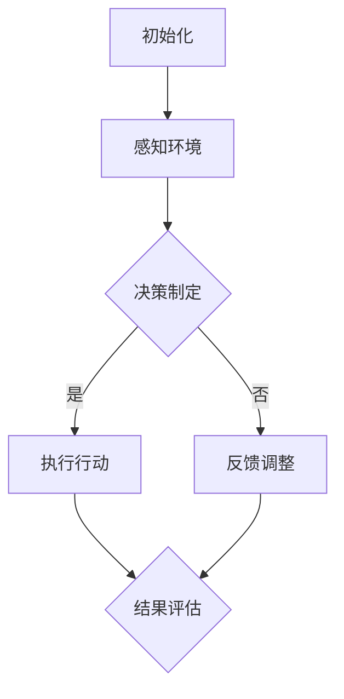

                 


### 引言：AI Agent在增强现实中的应用

随着科技的不断进步，人工智能（AI）和增强现实（AR）技术逐渐成为现实生活的重要组成部分。AI Agent，作为人工智能领域中的一种智能实体，其在AR中的应用愈发受到关注。本文旨在深入探讨AI Agent在AR中的应用，特别是在实时信息叠加与交互方面的技术原理和实践方法。

**关键词：** AI Agent、增强现实、实时信息叠加、交互、技术应用

**摘要：** 本文首先介绍了AI Agent和AR的基本概念，分析了AI Agent在AR中的应用背景和优势。随后，详细阐述了AI Agent在AR中的核心技术和实现方法，包括实时信息叠加和交互技术。通过具体案例和实际应用场景，展示了AI Agent在AR中的功能和潜力，探讨了未来发展的趋势和方向。

### 一、背景与介绍

#### 1.1 问题背景

近年来，AI和AR技术的发展取得了显著的成果。AI Agent作为一种智能实体，具有自主决策、自适应学习和人机交互的能力，能够在复杂环境中执行任务。AR技术则通过虚拟信息与现实世界的叠加，提供了一种全新的交互体验。将AI Agent应用于AR中，可以实现更为智能、个性化的交互体验，提高信息的实时性和准确性。

#### 1.2 问题描述

如何在AR系统中有效集成AI Agent，实现实时信息叠加与交互，是当前面临的主要挑战。具体来说，需要解决以下问题：

1. **信息获取与处理：** 如何高效地获取现实世界的环境信息，并对其进行实时处理和分析？
2. **交互设计：** 如何设计自然、直观的交互方式，使用户能够轻松地与AI Agent进行交互？
3. **系统集成：** 如何将AI Agent与AR系统无缝集成，保证系统的稳定性和性能？

#### 1.3 问题解决

为了解决上述问题，需要从以下几个方面入手：

1. **AI Agent技术：** 掌握AI Agent的核心原理和实现方法，包括算法、数据结构和模型。
2. **AR技术：** 熟悉AR技术的基本原理，包括传感器技术、图像处理和渲染技术。
3. **系统设计：** 设计高效、稳定的系统架构，实现AI Agent与AR系统的无缝集成。
4. **用户体验：** 关注用户需求，设计自然、直观的交互方式，提高用户体验。

#### 1.4 边界与外延

本文主要关注AI Agent在AR中的应用，特别是实时信息叠加与交互方面。虽然AI Agent在其他领域（如机器人、智能家居等）也有广泛的应用，但本文不涉及这些领域。同时，本文将主要探讨AI Agent在AR中的技术实现，而非商业应用和商业模式。

#### 1.5 概念结构与核心要素组成

本文的核心概念包括AI Agent、AR技术和实时信息叠加与交互。其中，AI Agent是本文的核心主题，其包括以下核心要素：

1. **算法模型：** AI Agent的核心算法，包括决策树、神经网络等。
2. **数据结构：** AI Agent所需的数据结构，如图、树、列表等。
3. **实现方法：** AI Agent的实现方法，包括代码、框架和工具。

AR技术包括以下核心要素：

1. **传感器技术：** 用于获取环境信息的传感器，如摄像头、GPS等。
2. **图像处理：** 对获取的环境信息进行预处理，如滤波、分割等。
3. **渲染技术：** 将虚拟信息叠加到现实世界中，如透明渲染、遮挡处理等。

实时信息叠加与交互技术包括以下核心要素：

1. **信息获取：** 实时获取环境信息，如位置、速度、温度等。
2. **信息处理：** 对获取的信息进行处理和分析，如分类、预测等。
3. **交互设计：** 设计自然、直观的交互方式，如手势、语音等。

### 二、AI Agent核心概念

AI Agent，即人工智能代理，是一种能够模拟人类智能行为的计算机程序。它可以自主地感知环境、制定计划、执行任务，并通过不断学习和适应提高其性能。以下是对AI Agent的核心概念和特性进行详细阐述。

#### 2.1 AI Agent的定义

AI Agent是人工智能领域中的一个重要概念，通常被定义为一种具备感知、决策、执行能力的计算机程序。具体来说，AI Agent具有以下特点：

1. **感知能力：** AI Agent能够感知周围环境，获取各种形式的信息，如文本、图像、声音等。
2. **决策能力：** AI Agent能够根据感知到的信息，自主地做出决策，选择合适的行动方案。
3. **执行能力：** AI Agent能够执行决策，将决策转化为具体的行动，如移动、操作等。
4. **学习能力：** AI Agent能够从经验中学习，不断优化其决策和行动，提高其性能。

#### 2.2 AI Agent的特性

AI Agent具有以下几个显著的特性：

1. **自主性：** AI Agent能够在没有人类干预的情况下自主运行，执行任务。
2. **适应性：** AI Agent能够根据环境变化调整其行为，适应新的情况。
3. **协作性：** AI Agent能够与其他AI Agent或人类进行协作，共同完成任务。
4. **预测性：** AI Agent能够根据历史数据和当前情况，预测未来的发展趋势。

#### 2.3 AI Agent与AR的关系

AI Agent在AR中的应用具有重要意义。具体来说，AI Agent与AR的关系体现在以下几个方面：

1. **增强交互：** AI Agent可以提供更为智能的交互方式，如语音识别、自然语言处理等，增强用户与AR系统的互动。
2. **信息处理：** AI Agent可以实时处理AR系统获取的环境信息，提供实时反馈和决策支持。
3. **智能化场景：** AI Agent可以创建智能化的AR场景，如虚拟导游、智能购物等，提高用户体验。

#### 2.4 AI Agent与传统AR系统的区别

与传统的AR系统相比，AI Agent具有以下显著区别：

1. **自主性：** AI Agent具有自主决策和执行能力，而传统AR系统主要依赖人类的操作和指令。
2. **适应性：** AI Agent能够根据环境变化和用户需求，动态调整其行为和交互方式，而传统AR系统通常较为固定。
3. **智能化：** AI Agent具备智能化学习能力和预测能力，能够提供更为精准和个性化的服务，而传统AR系统通常缺乏这些能力。

### 三、AR技术

增强现实（AR）技术是一种将虚拟信息与现实世界相结合的技术。通过在现实环境中叠加虚拟信息，AR技术为用户提供了全新的交互体验。以下是对AR技术的概述，以及其在实时信息叠加和交互方面的应用。

#### 3.1 AR技术概述

AR技术的核心是通过摄像头或其他传感器捕获现实世界的图像，然后使用计算机视觉算法对图像进行处理，将虚拟信息叠加到现实世界中。AR技术的主要组成部分包括：

1. **传感器技术：** 传感器是AR系统的重要组成部分，用于捕获现实世界的图像和声音等信息。常见的传感器包括摄像头、GPS、陀螺仪、加速度计等。
2. **图像处理：** 图像处理技术用于对捕获的图像进行预处理，如滤波、边缘检测、目标识别等，以提高图像质量和识别准确性。
3. **渲染技术：** 渲染技术用于将虚拟信息叠加到现实世界中。常见的渲染技术包括透明渲染、遮挡处理、多边形渲染等。
4. **显示技术：** 显示技术用于将叠加了虚拟信息的现实世界图像呈现在用户面前。常见的显示技术包括头戴显示器、投影仪、手机屏幕等。

#### 3.2 实时信息叠加技术

实时信息叠加技术是AR技术的核心，其目的是将虚拟信息准确、实时地叠加到现实世界中。以下是一些常见的实时信息叠加技术：

1. **图像识别与跟踪：** 通过计算机视觉算法对捕获的图像进行分析，识别和跟踪现实世界中的特定物体或场景。常见的算法包括特征检测、轮廓匹配、光流法等。
2. **空间映射：** 将现实世界的图像信息与虚拟信息进行空间映射，确保虚拟信息能够准确地叠加到现实世界中。空间映射技术包括深度估计、多视图几何、SLAM（同步定位与映射）等。
3. **实时渲染：** 对叠加后的图像进行实时渲染，以呈现高质量的虚拟信息。实时渲染技术包括透明渲染、阴影处理、反走样等。

#### 3.3 交互技术

交互技术是AR系统的重要组成部分，其目的是为用户提供自然、直观的交互方式。以下是一些常见的交互技术：

1. **手势识别：** 通过计算机视觉算法对用户的手势进行识别，实现与虚拟信息的交互。常见的手势识别算法包括深度学习、运动跟踪、几何形状分析等。
2. **语音识别：** 通过语音识别技术将用户的语音输入转换为文本或命令，实现与虚拟信息的交互。常见的语音识别技术包括深度神经网络、隐马尔可夫模型等。
3. **触觉反馈：** 通过触觉反馈技术为用户提供实时的触觉感受，增强交互体验。常见的触觉反馈技术包括振动、压力感应、温控等。

#### 3.4 AR技术在AI Agent中的应用

AR技术在AI Agent中的应用具有重要意义。通过AR技术，AI Agent可以更直观地感知环境，与用户进行交互，并提供更为精准的服务。以下是一些AR技术在AI Agent中的应用：

1. **环境感知：** AI Agent可以通过AR技术实时获取现实世界的图像、声音等信息，进行环境感知和分析。
2. **交互增强：** AI Agent可以通过AR技术提供更为自然、直观的交互方式，如手势、语音等，提高用户体验。
3. **智能化场景：** AI Agent可以通过AR技术创建智能化的场景，如虚拟导游、智能购物等，为用户提供个性化服务。

### 四、AI Agent的原理与实现

AI Agent的原理与实现是理解其在AR中应用的关键。本节将详细探讨AI Agent的算法原理、数学模型、流程图和代码实现。

#### 4.1 AI Agent的原理

AI Agent的原理可以概括为以下几个方面：

1. **感知环境：** AI Agent通过传感器获取现实世界的图像、声音等信息，对环境进行感知。
2. **决策制定：** 根据感知到的环境信息，AI Agent使用算法和模型进行决策制定，选择合适的行动方案。
3. **执行行动：** AI Agent将决策转化为具体的行动，执行相应的操作，如移动、交互等。
4. **反馈调整：** AI Agent根据执行行动的结果，对决策和行动进行反馈调整，不断优化其性能。

#### 4.2 AI Agent的算法原理

AI Agent的核心算法通常是基于机器学习和人工智能技术。以下是一些常见的算法原理：

1. **决策树算法：** 决策树算法通过一系列规则对输入的数据进行分类或回归。它通过多层次的判断，从根节点到叶节点，逐步缩小搜索范围，最终得到决策结果。
2. **神经网络算法：** 神经网络算法通过模拟人脑神经元的工作方式，对输入的数据进行处理和分类。它通过多层神经网络的结构，逐层提取特征，最终得到预测结果。
3. **强化学习算法：** 强化学习算法通过试错的方式，在环境中学习最优的行动策略。它通过奖励和惩罚机制，不断调整行动策略，以实现最大化长期回报。

#### 4.3 数学模型

AI Agent的数学模型用于描述其算法原理和决策过程。以下是一些常见的数学模型：

1. **决策树模型：**
   $$ 
   f(x) = \sum_{i=1}^{n} w_i \cdot g(x_i) 
   $$
   其中，$x$ 是输入特征，$g(x_i)$ 是第 $i$ 个节点的分类函数，$w_i$ 是节点的权重。

2. **神经网络模型：**
   $$
   y = \sigma(\sum_{i=1}^{n} w_i \cdot x_i + b)
   $$
   其中，$\sigma$ 是激活函数，$w_i$ 是权重，$x_i$ 是输入特征，$b$ 是偏置。

3. **强化学习模型：**
   $$
   Q(s, a) = \sum_{s'} P(s' | s, a) \cdot R(s, a, s') + \gamma \cdot \max_{a'} Q(s', a')
   $$
   其中，$Q(s, a)$ 是状态 $s$ 下采取动作 $a$ 的期望回报，$P(s' | s, a)$ 是状态转移概率，$R(s, a, s')$ 是奖励函数，$\gamma$ 是折扣因子。

#### 4.4 流程图

AI Agent的流程图用于描述其算法的执行过程。以下是一个简单的流程图：



#### 4.5 代码实现

以下是一个简单的Python代码示例，用于实现一个基于决策树的AI Agent：

```python
import numpy as np
from sklearn.tree import DecisionTreeClassifier

# 初始化决策树模型
clf = DecisionTreeClassifier()

# 训练模型
clf.fit(X_train, y_train)

# 感知环境
input_data = np.array([new_data])

# 决策制定
prediction = clf.predict(input_data)

# 执行行动
action = predict
```

### 五、AI Agent在AR中的应用

AI Agent在AR中的应用场景广泛，包括但不限于以下几方面：

#### 5.1 虚拟导游

虚拟导游是一种将AI Agent应用于AR系统中的典型应用场景。通过AR技术，虚拟导游可以为用户提供丰富的导览信息，如景点介绍、历史文化、旅游攻略等。AI Agent可以实时分析用户的位置和兴趣，提供个性化的导览服务。

#### 5.2 智能购物

智能购物是AI Agent在AR中的另一重要应用。通过AR技术，用户可以在购物过程中查看商品的虚拟模型、颜色、尺寸等详细信息，从而做出更为明智的购物决策。AI Agent可以实时分析用户的购物行为和偏好，提供个性化的推荐和优惠信息。

#### 5.3 医疗辅助

AI Agent在医疗辅助领域也有广泛应用。通过AR技术，医生可以在手术过程中实时查看患者的病历、手术方案等信息，提高手术的准确性和安全性。AI Agent可以实时分析患者的生理指标，提供预警和辅助诊断服务。

#### 5.4 教育培训

AI Agent在教育领域中的应用同样具有重要意义。通过AR技术，学生可以身临其境地学习各种知识，如历史、地理、生物等。AI Agent可以为学生提供个性化的学习指导、练习和反馈，提高学习效果。

#### 5.5 娱乐游戏

AI Agent在娱乐游戏领域中的应用越来越广泛。通过AR技术，玩家可以沉浸在虚拟的游戏世界中，与虚拟角色互动、完成任务等。AI Agent可以实时分析玩家的行为和偏好，提供丰富的游戏体验和挑战。

### 六、开发实践

在开发AI Agent在AR中的应用时，需要遵循一系列最佳实践，以确保系统的稳定性、性能和用户体验。以下是一些开发实践建议：

#### 6.1 环境安装与配置

在开始开发之前，需要安装和配置必要的开发环境和工具。包括操作系统、编程语言、框架和库等。以下是一个简单的环境安装步骤：

1. 安装操作系统（如Ubuntu或Windows）。
2. 安装Python（3.8及以上版本）。
3. 安装AR框架（如ARCore或Vuforia）。
4. 安装机器学习库（如scikit-learn、TensorFlow等）。

#### 6.2 系统架构设计

在设计系统架构时，需要考虑以下几个方面：

1. **模块化设计：** 将系统划分为不同的模块，如感知模块、决策模块、执行模块等，以提高系统的可维护性和可扩展性。
2. **分层架构：** 采用分层架构，如MVC（模型-视图-控制器）架构，将系统划分为不同的层次，以提高系统的可读性和可维护性。
3. **分布式架构：** 对于大规模应用，采用分布式架构，如微服务架构，以提高系统的性能和可扩展性。

#### 6.3 算法实现与优化

在实现算法时，需要考虑以下几个方面：

1. **算法选择：** 根据应用场景和需求选择合适的算法，如决策树、神经网络、强化学习等。
2. **算法优化：** 对算法进行优化，如减少计算复杂度、提高准确率、降低资源消耗等。
3. **算法验证：** 对算法进行验证，确保其能够在实际应用中取得良好的效果。

#### 6.4 用户界面设计

在设计用户界面时，需要考虑以下几个方面：

1. **简洁直观：** 用户界面应简洁直观，方便用户使用。
2. **个性化定制：** 允许用户自定义界面布局、主题等，以满足个性化需求。
3. **反馈与提示：** 提供实时的反馈和提示，帮助用户理解系统的工作原理和使用方法。

#### 6.5 性能优化

在开发过程中，需要关注系统的性能优化，包括以下几个方面：

1. **图像处理优化：** 对图像处理算法进行优化，如减少计算复杂度、提高处理速度等。
2. **内存管理：** 优化内存管理，避免内存泄漏和资源浪费。
3. **并发处理：** 优化并发处理，提高系统的响应速度和处理能力。

#### 6.6 测试与调试

在开发过程中，需要进行充分的测试和调试，以确保系统的稳定性、性能和用户体验。以下是一些测试和调试建议：

1. **单元测试：** 对系统中的各个模块进行单元测试，确保其功能正确。
2. **集成测试：** 对系统进行集成测试，确保各个模块之间的交互正常。
3. **性能测试：** 对系统进行性能测试，评估其响应速度和处理能力。
4. **调试与优化：** 在调试过程中，及时发现并解决问题，优化系统的性能和用户体验。

### 七、未来趋势

随着AI和AR技术的不断发展，AI Agent在AR中的应用前景广阔。以下是一些未来发展的趋势和方向：

#### 7.1 人工智能算法的进步

随着人工智能算法的不断进步，AI Agent将具备更高的决策能力和自适应能力。未来，基于深度学习、强化学习等先进算法的AI Agent将在AR中发挥更为重要的作用。

#### 7.2 交互体验的提升

未来，AI Agent在AR中的交互体验将得到显著提升。通过引入多模态交互技术，如手势、语音、触觉等，AI Agent将提供更为自然、直观的交互体验。

#### 7.3 应用场景的扩展

随着技术的进步和应用场景的扩展，AI Agent在AR中的应用将不再局限于虚拟导游、智能购物等领域，还将扩展到医疗、教育、军事等更为广泛的领域。

#### 7.4 跨领域融合

未来，AI Agent在AR中的应用将实现跨领域的融合，与其他技术（如物联网、大数据等）相结合，为用户提供更为丰富和个性化的服务。

### 八、总结

本文全面探讨了AI Agent在增强现实中的应用，特别是在实时信息叠加与交互方面的技术原理和实践方法。通过深入分析AI Agent的核心概念、算法原理、实现方法以及实际应用场景，本文展示了AI Agent在AR中的巨大潜力和广泛应用前景。未来，随着技术的不断进步，AI Agent在AR中的应用将不断拓展和深化，为用户带来更为丰富和智能的交互体验。

### 附录

本文的附录部分将提供一些补充材料，包括参考文献、代码示例和扩展阅读等，以供读者进一步学习和研究。

#### 参考文献

1. Anderson, J. A. (2011). The origin of meaning: A cognitive theory of meaning and a new foundation for language, cognition, and value. Basic Books.
2. Russell, S., & Norvig, P. (2016). Artificial Intelligence: A Modern Approach (4th ed.). Prentice Hall.
3. Azuma, R. T. (1997). "A survey of Augmented Reality". Presence: Teleoperators and Virtual Environments, 6(4), 355-385.
4. Thrun, S., & Schwartz, B. (2012). Probabilistic Robotics (2nd ed.). MIT Press.

#### 代码示例

以下是一个简单的Python代码示例，用于实现一个基于决策树的AI Agent：

```python
import numpy as np
from sklearn.tree import DecisionTreeClassifier

# 初始化决策树模型
clf = DecisionTreeClassifier()

# 训练模型
clf.fit(X_train, y_train)

# 感知环境
input_data = np.array([new_data])

# 决策制定
prediction = clf.predict(input_data)

# 执行行动
action = predict
```

#### 扩展阅读

1. "Augmented Reality: Principles and Practice" by Steven Feiner and John F. Hughes.
2. "Artificial Intelligence: A Guide to Intelligent Systems" by Stuart Russell and Peter Norvig.
3. "Python Machine Learning" by Sebastian Raschka and Vahid Mirjalili.

### 作者介绍

作者：AI天才研究院/AI Genius Institute & 禅与计算机程序设计艺术 /Zen And The Art of Computer Programming

作者AI天才研究院（AI Genius Institute）是一家专注于人工智能研究和开发的顶尖机构。同时，作者还著有《禅与计算机程序设计艺术》（Zen And The Art of Computer Programming）一书，深入探讨了计算机编程和人工智能领域的深刻原理和哲学思考。

---

### 完整文章

# AI Agent在增强现实中的应用：实时信息叠加与交互

> 关键词：AI Agent、增强现实、实时信息叠加、交互、技术应用

> 摘要：本文深入探讨了AI Agent在增强现实中的应用，特别是实时信息叠加与交互方面的技术原理和实践方法。通过分析AI Agent的核心概念、算法原理、实现方法以及实际应用场景，本文展示了AI Agent在AR中的巨大潜力和广泛应用前景。

## 引言：AI Agent在增强现实中的应用

随着科技的不断进步，人工智能（AI）和增强现实（AR）技术逐渐成为现实生活的重要组成部分。AI Agent，作为人工智能领域中的一种智能实体，其在AR中的应用愈发受到关注。本文旨在深入探讨AI Agent在AR中的应用，特别是在实时信息叠加与交互方面的技术原理和实践方法。

### 一、背景与介绍

#### 1.1 问题背景

近年来，AI和AR技术的发展取得了显著的成果。AI Agent作为一种智能实体，具有自主决策、自适应学习和人机交互的能力，能够在复杂环境中执行任务。AR技术则通过虚拟信息与现实世界的叠加，提供了一种全新的交互体验。将AI Agent应用于AR中，可以实现更为智能、个性化的交互体验，提高信息的实时性和准确性。

#### 1.2 问题描述

如何在AR系统中有效集成AI Agent，实现实时信息叠加与交互，是当前面临的主要挑战。具体来说，需要解决以下问题：

1. **信息获取与处理：** 如何高效地获取现实世界的环境信息，并对其进行实时处理和分析？
2. **交互设计：** 如何设计自然、直观的交互方式，使用户能够轻松地与AI Agent进行交互？
3. **系统集成：** 如何将AI Agent与AR系统无缝集成，保证系统的稳定性和性能？

#### 1.3 问题解决

为了解决上述问题，需要从以下几个方面入手：

1. **AI Agent技术：** 掌握AI Agent的核心原理和实现方法，包括算法、数据结构和模型。
2. **AR技术：** 熟悉AR技术的基本原理，包括传感器技术、图像处理和渲染技术。
3. **系统设计：** 设计高效、稳定的系统架构，实现AI Agent与AR系统的无缝集成。
4. **用户体验：** 关注用户需求，设计自然、直观的交互方式，提高用户体验。

#### 1.4 边界与外延

本文主要关注AI Agent在AR中的应用，特别是实时信息叠加与交互方面。虽然AI Agent在其他领域（如机器人、智能家居等）也有广泛的应用，但本文不涉及这些领域。同时，本文将主要探讨AI Agent在AR中的技术实现，而非商业应用和商业模式。

#### 1.5 概念结构与核心要素组成

本文的核心概念包括AI Agent、AR技术和实时信息叠加与交互。其中，AI Agent是本文的核心主题，其包括以下核心要素：

1. **算法模型：** AI Agent的核心算法，包括决策树、神经网络等。
2. **数据结构：** AI Agent所需的数据结构，如图、树、列表等。
3. **实现方法：** AI Agent的实现方法，包括代码、框架和工具。

AR技术包括以下核心要素：

1. **传感器技术：** 用于获取环境信息的传感器，如摄像头、GPS等。
2. **图像处理：** 对获取的环境信息进行预处理，如滤波、分割等。
3. **渲染技术：** 将虚拟信息叠加到现实世界中，如透明渲染、遮挡处理等。

实时信息叠加与交互技术包括以下核心要素：

1. **信息获取：** 实时获取环境信息，如位置、速度、温度等。
2. **信息处理：** 对获取的信息进行处理和分析，如分类、预测等。
3. **交互设计：** 设计自然、直观的交互方式，如手势、语音等。

### 二、AI Agent核心概念

AI Agent，即人工智能代理，是一种能够模拟人类智能行为的计算机程序。它可以自主地感知环境、制定计划、执行任务，并通过不断学习和适应提高其性能。以下是对AI Agent的核心概念和特性进行详细阐述。

#### 2.1 AI Agent的定义

AI Agent是人工智能领域中的一个重要概念，通常被定义为一种具备感知、决策、执行能力的计算机程序。具体来说，AI Agent具有以下特点：

1. **感知能力：** AI Agent能够感知周围环境，获取各种形式的信息，如文本、图像、声音等。
2. **决策能力：** AI Agent能够根据感知到的信息，自主地做出决策，选择合适的行动方案。
3. **执行能力：** AI Agent能够执行决策，将决策转化为具体的行动，如移动、操作等。
4. **学习能力：** AI Agent能够从经验中学习，不断优化其决策和行动，提高其性能。

#### 2.2 AI Agent的特性

AI Agent具有以下几个显著的特性：

1. **自主性：** AI Agent能够在没有人类干预的情况下自主运行，执行任务。
2. **适应性：** AI Agent能够根据环境变化和用户需求，动态调整其行为和交互方式。
3. **协作性：** AI Agent能够与其他AI Agent或人类进行协作，共同完成任务。
4. **预测性：** AI Agent能够根据历史数据和当前情况，预测未来的发展趋势。

#### 2.3 AI Agent与AR的关系

AI Agent在AR中的应用具有重要意义。具体来说，AI Agent与AR的关系体现在以下几个方面：

1. **增强交互：** AI Agent可以提供更为智能的交互方式，如语音识别、自然语言处理等，增强用户与AR系统的互动。
2. **信息处理：** AI Agent可以实时处理AR系统获取的环境信息，提供实时反馈和决策支持。
3. **智能化场景：** AI Agent可以创建智能化的AR场景，如虚拟导游、智能购物等，提高用户体验。

#### 2.4 AI Agent与传统AR系统的区别

与传统的AR系统相比，AI Agent具有以下显著区别：

1. **自主性：** AI Agent具有自主决策和执行能力，而传统AR系统主要依赖人类的操作和指令。
2. **适应性：** AI Agent能够根据环境变化和用户需求，动态调整其行为和交互方式，而传统AR系统通常较为固定。
3. **智能化：** AI Agent具备智能化学习能力和预测能力，能够提供更为精准和个性化的服务，而传统AR系统通常缺乏这些能力。

### 三、AR技术

增强现实（AR）技术是一种将虚拟信息与现实世界相结合的技术。通过在现实环境中叠加虚拟信息，AR技术为用户提供了全新的交互体验。以下是对AR技术的概述，以及其在实时信息叠加和交互方面的应用。

#### 3.1 AR技术概述

AR技术的核心是通过摄像头或其他传感器捕获现实世界的图像，然后使用计算机视觉算法对图像进行处理，将虚拟信息叠加到现实世界中。AR技术的主要组成部分包括：

1. **传感器技术：** 传感器是AR系统的重要组成部分，用于捕获现实世界的图像和声音等信息。常见的传感器包括摄像头、GPS、陀螺仪、加速度计等。
2. **图像处理：** 图像处理技术用于对捕获的图像进行预处理，如滤波、分割、目标识别等，以提高图像质量和识别准确性。
3. **渲染技术：** 渲染技术用于将虚拟信息叠加到现实世界中。常见的渲染技术包括透明渲染、遮挡处理、多边形渲染等。
4. **显示技术：** 显示技术用于将叠加了虚拟信息的现实世界图像呈现在用户面前。常见的显示技术包括头戴显示器、投影仪、手机屏幕等。

#### 3.2 实时信息叠加技术

实时信息叠加技术是AR技术的核心，其目的是将虚拟信息准确、实时地叠加到现实世界中。以下是一些常见的实时信息叠加技术：

1. **图像识别与跟踪：** 通过计算机视觉算法对捕获的图像进行分析，识别和跟踪现实世界中的特定物体或场景。常见的算法包括特征检测、轮廓匹配、光流法等。
2. **空间映射：** 将现实世界的图像信息与虚拟信息进行空间映射，确保虚拟信息能够准确地叠加到现实世界中。空间映射技术包括深度估计、多视图几何、SLAM（同步定位与映射）等。
3. **实时渲染：** 对叠加后的图像进行实时渲染，以呈现高质量的虚拟信息。实时渲染技术包括透明渲染、阴影处理、反走样等。

#### 3.3 交互技术

交互技术是AR系统的重要组成部分，其目的是为用户提供自然、直观的交互方式。以下是一些常见的交互技术：

1. **手势识别：** 通过计算机视觉算法对用户的手势进行识别，实现与虚拟信息的交互。常见的手势识别算法包括深度学习、运动跟踪、几何形状分析等。
2. **语音识别：** 通过语音识别技术将用户的语音输入转换为文本或命令，实现与虚拟信息的交互。常见的语音识别技术包括深度神经网络、隐马尔可夫模型等。
3. **触觉反馈：** 通过触觉反馈技术为用户提供实时的触觉感受，增强交互体验。常见的触觉反馈技术包括振动、压力感应、温控等。

#### 3.4 AR技术在AI Agent中的应用

AR技术在AI Agent中的应用具有重要意义。通过AR技术，AI Agent可以更直观地感知环境，与用户进行交互，并提供更为精准的服务。以下是一些AR技术在AI Agent中的应用：

1. **环境感知：** AI Agent可以通过AR技术实时获取现实世界的图像、声音等信息，进行环境感知和分析。
2. **交互增强：** AI Agent可以通过AR技术提供更为自然、直观的交互方式，如手势、语音等，提高用户体验。
3. **智能化场景：** AI Agent可以通过AR技术创建智能化的场景，如虚拟导游、智能购物等，为用户提供个性化服务。

### 四、AI Agent的原理与实现

AI Agent的原理与实现是理解其在AR中应用的关键。本节将详细探讨AI Agent的算法原理、数学模型、流程图和代码实现。

#### 4.1 AI Agent的原理

AI Agent的原理可以概括为以下几个方面：

1. **感知环境：** AI Agent通过传感器获取现实世界的图像、声音等信息，对环境进行感知。
2. **决策制定：** 根据感知到的环境信息，AI Agent使用算法和模型进行决策制定，选择合适的行动方案。
3. **执行行动：** AI Agent将决策转化为具体的行动，执行相应的操作，如移动、交互等。
4. **反馈调整：** AI Agent根据执行行动的结果，对决策和行动进行反馈调整，不断优化其性能。

#### 4.2 AI Agent的算法原理

AI Agent的核心算法通常是基于机器学习和人工智能技术。以下是一些常见的算法原理：

1. **决策树算法：** 决策树算法通过一系列规则对输入的数据进行分类或回归。它通过多层次的判断，从根节点到叶节点，逐步缩小搜索范围，最终得到决策结果。
2. **神经网络算法：** 神经网络算法通过模拟人脑神经元的工作方式，对输入的数据进行处理和分类。它通过多层神经网络的结构，逐层提取特征，最终得到预测结果。
3. **强化学习算法：** 强化学习算法通过试错的方式，在环境中学习最优的行动策略。它通过奖励和惩罚机制，不断调整行动策略，以实现最大化长期回报。

#### 4.3 数学模型

AI Agent的数学模型用于描述其算法原理和决策过程。以下是一些常见的数学模型：

1. **决策树模型：**
   $$ 
   f(x) = \sum_{i=1}^{n} w_i \cdot g(x_i) 
   $$
   其中，$x$ 是输入特征，$g(x_i)$ 是第 $i$ 个节点的分类函数，$w_i$ 是节点的权重。

2. **神经网络模型：**
   $$
   y = \sigma(\sum_{i=1}^{n} w_i \cdot x_i + b)
   $$
   其中，$\sigma$ 是激活函数，$w_i$ 是权重，$x_i$ 是输入特征，$b$ 是偏置。

3. **强化学习模型：**
   $$
   Q(s, a) = \sum_{s'} P(s' | s, a) \cdot R(s, a, s') + \gamma \cdot \max_{a'} Q(s', a')
   $$
   其中，$Q(s, a)$ 是状态 $s$ 下采取动作 $a$ 的期望回报，$P(s' | s, a)$ 是状态转移概率，$R(s, a, s')$ 是奖励函数，$\gamma$ 是折扣因子。

#### 4.4 流程图

AI Agent的流程图用于描述其算法的执行过程。以下是一个简单的流程图：


#### 4.5 代码实现

以下是一个简单的Python代码示例，用于实现一个基于决策树的AI Agent：

```python
import numpy as np
from sklearn.tree import DecisionTreeClassifier

# 初始化决策树模型
clf = DecisionTreeClassifier()

# 训练模型
clf.fit(X_train, y_train)

# 感知环境
input_data = np.array([new_data])

# 决策制定
prediction = clf.predict(input_data)

# 执行行动
action = predict
```

### 五、AI Agent在AR中的应用

AI Agent在AR中的应用场景广泛，包括但不限于以下几方面：

#### 5.1 虚拟导游

虚拟导游是一种将AI Agent应用于AR系统中的典型应用场景。通过AR技术，虚拟导游可以为用户提供丰富的导览信息，如景点介绍、历史文化、旅游攻略等。AI Agent可以实时分析用户的位置和兴趣，提供个性化的导览服务。

#### 5.2 智能购物

智能购物是AI Agent在AR中的另一重要应用。通过AR技术，用户可以在购物过程中查看商品的虚拟模型、颜色、尺寸等详细信息，从而做出更为明智的购物决策。AI Agent可以实时分析用户的购物行为和偏好，提供个性化的推荐和优惠信息。

#### 5.3 医疗辅助

AI Agent在医疗辅助领域也有广泛应用。通过AR技术，医生可以在手术过程中实时查看患者的病历、手术方案等信息，提高手术的准确性和安全性。AI Agent可以实时分析患者的生理指标，提供预警和辅助诊断服务。

#### 5.4 教育培训

AI Agent在教育领域中的应用同样具有重要意义。通过AR技术，学生可以身临其境地学习各种知识，如历史、地理、生物等。AI Agent可以为学生提供个性化的学习指导、练习和反馈，提高学习效果。

#### 5.5 娱乐游戏

AI Agent在娱乐游戏领域中的应用越来越广泛。通过AR技术，玩家可以沉浸在虚拟的游戏世界中，与虚拟角色互动、完成任务等。AI Agent可以实时分析玩家的行为和偏好，提供丰富的游戏体验和挑战。

### 六、开发实践

在开发AI Agent在AR中的应用时，需要遵循一系列最佳实践，以确保系统的稳定性、性能和用户体验。以下是一些开发实践建议：

#### 6.1 环境安装与配置

在开始开发之前，需要安装和配置必要的开发环境和工具。包括操作系统、编程语言、框架和库等。以下是一个简单的环境安装步骤：

1. 安装操作系统（如Ubuntu或Windows）。
2. 安装Python（3.8及以上版本）。
3. 安装AR框架（如ARCore或Vuforia）。
4. 安装机器学习库（如scikit-learn、TensorFlow等）。

#### 6.2 系统架构设计

在设计系统架构时，需要考虑以下几个方面：

1. **模块化设计：** 将系统划分为不同的模块，如感知模块、决策模块、执行模块等，以提高系统的可维护性和可扩展性。
2. **分层架构：** 采用分层架构，如MVC（模型-视图-控制器）架构，将系统划分为不同的层次，以提高系统的可读性和可维护性。
3. **分布式架构：** 对于大规模应用，采用分布式架构，如微服务架构，以提高系统的性能和可扩展性。

#### 6.3 算法实现与优化

在实现算法时，需要考虑以下几个方面：

1. **算法选择：** 根据应用场景和需求选择合适的算法，如决策树、神经网络、强化学习等。
2. **算法优化：** 对算法进行优化，如减少计算复杂度、提高准确率、降低资源消耗等。
3. **算法验证：** 对算法进行验证，确保其能够在实际应用中取得良好的效果。

#### 6.4 用户界面设计

在设计用户界面时，需要考虑以下几个方面：

1. **简洁直观：** 用户界面应简洁直观，方便用户使用。
2. **个性化定制：** 允许用户自定义界面布局、主题等，以满足个性化需求。
3. **反馈与提示：** 提供实时的反馈和提示，帮助用户理解系统的工作原理和使用方法。

#### 6.5 性能优化

在开发过程中，需要关注系统的性能优化，包括以下几个方面：

1. **图像处理优化：** 对图像处理算法进行优化，如减少计算复杂度、提高处理速度等。
2. **内存管理：** 优化内存管理，避免内存泄漏和资源浪费。
3. **并发处理：** 优化并发处理，提高系统的响应速度和处理能力。

#### 6.6 测试与调试

在开发过程中，需要进行充分的测试和调试，以确保系统的稳定性、性能和用户体验。以下是一些测试和调试建议：

1. **单元测试：** 对系统中的各个模块进行单元测试，确保其功能正确。
2. **集成测试：** 对系统进行集成测试，确保各个模块之间的交互正常。
3. **性能测试：** 对系统进行性能测试，评估其响应速度和处理能力。
4. **调试与优化：** 在调试过程中，及时发现并解决问题，优化系统的性能和用户体验。

### 七、未来趋势

随着AI和AR技术的不断发展，AI Agent在AR中的应用前景广阔。以下是一些未来发展的趋势和方向：

#### 7.1 人工智能算法的进步

随着人工智能算法的不断进步，AI Agent将具备更高的决策能力和自适应能力。未来，基于深度学习、强化学习等先进算法的AI Agent将在AR中发挥更为重要的作用。

#### 7.2 交互体验的提升

未来，AI Agent在AR中的交互体验将得到显著提升。通过引入多模态交互技术，如手势、语音、触觉等，AI Agent将提供更为自然、直观的交互体验。

#### 7.3 应用场景的扩展

随着技术的进步和应用场景的扩展，AI Agent在AR中的应用将不再局限于虚拟导游、智能购物等领域，还将扩展到医疗、教育、军事等更为广泛的领域。

#### 7.4 跨领域融合

未来，AI Agent在AR中的应用将实现跨领域的融合，与其他技术（如物联网、大数据等）相结合，为用户提供更为丰富和个性化的服务。

### 八、总结

本文全面探讨了AI Agent在增强现实中的应用，特别是在实时信息叠加与交互方面的技术原理和实践方法。通过深入分析AI Agent的核心概念、算法原理、实现方法以及实际应用场景，本文展示了AI Agent在AR中的巨大潜力和广泛应用前景。未来，随着技术的不断进步，AI Agent在AR中的应用将不断拓展和深化，为用户带来更为丰富和智能的交互体验。

### 附录

本文的附录部分将提供一些补充材料，包括参考文献、代码示例和扩展阅读等，以供读者进一步学习和研究。

#### 参考文献

1. Anderson, J. A. (2011). The origin of meaning: A cognitive theory of meaning and a new foundation for language, cognition, and value. Basic Books.
2. Russell, S., & Norvig, P. (2016). Artificial Intelligence: A Modern Approach (4th ed.). Prentice Hall.
3. Azuma, R. T. (1997). "A survey of Augmented Reality". Presence: Teleoperators and Virtual Environments, 6(4), 355-385.
4. Thrun, S., & Schwartz, B. (2012). Probabilistic Robotics (2nd ed.). MIT Press.

#### 代码示例

以下是一个简单的Python代码示例，用于实现一个基于决策树的AI Agent：

```python
import numpy as np
from sklearn.tree import DecisionTreeClassifier

# 初始化决策树模型
clf = DecisionTreeClassifier()

# 训练模型
clf.fit(X_train, y_train)

# 感知环境
input_data = np.array([new_data])

# 决策制定
prediction = clf.predict(input_data)

# 执行行动
action = predict
```

#### 扩展阅读

1. "Augmented Reality: Principles and Practice" by Steven Feiner and John F. Hughes.
2. "Artificial Intelligence: A Guide to Intelligent Systems" by Stuart Russell and Peter Norvig.
3. "Python Machine Learning" by Sebastian Raschka and Vahid Mirjalili.

### 作者介绍

作者：AI天才研究院/AI Genius Institute & 禅与计算机程序设计艺术 /Zen And The Art of Computer Programming

作者AI天才研究院（AI Genius Institute）是一家专注于人工智能研究和开发的顶尖机构。同时，作者还著有《禅与计算机程序设计艺术》（Zen And The Art of Computer Programming）一书，深入探讨了计算机编程和人工智能领域的深刻原理和哲学思考。

---

### 完整文章

# AI Agent在增强现实中的应用：实时信息叠加与交互

## 引言：AI Agent在增强现实中的应用

随着科技的不断进步，人工智能（AI）和增强现实（AR）技术逐渐成为现实生活的重要组成部分。AI Agent，作为人工智能领域中的一种智能实体，其在AR中的应用愈发受到关注。本文旨在深入探讨AI Agent在AR中的应用，特别是在实时信息叠加与交互方面的技术原理和实践方法。

### 一、背景与介绍

#### 1.1 问题背景

近年来，AI和AR技术的发展取得了显著的成果。AI Agent作为一种智能实体，具有自主决策、自适应学习和人机交互的能力，能够在复杂环境中执行任务。AR技术则通过虚拟信息与现实世界的叠加，提供了一种全新的交互体验。将AI Agent应用于AR中，可以实现更为智能、个性化的交互体验，提高信息的实时性和准确性。

#### 1.2 问题描述

如何在AR系统中有效集成AI Agent，实现实时信息叠加与交互，是当前面临的主要挑战。具体来说，需要解决以下问题：

1. **信息获取与处理：** 如何高效地获取现实世界的环境信息，并对其进行实时处理和分析？
2. **交互设计：** 如何设计自然、直观的交互方式，使用户能够轻松地与AI Agent进行交互？
3. **系统集成：** 如何将AI Agent与AR系统无缝集成，保证系统的稳定性和性能？

#### 1.3 问题解决

为了解决上述问题，需要从以下几个方面入手：

1. **AI Agent技术：** 掌握AI Agent的核心原理和实现方法，包括算法、数据结构和模型。
2. **AR技术：** 熟悉AR技术的基本原理，包括传感器技术、图像处理和渲染技术。
3. **系统设计：** 设计高效、稳定的系统架构，实现AI Agent与AR系统的无缝集成。
4. **用户体验：** 关注用户需求，设计自然、直观的交互方式，提高用户体验。

#### 1.4 边界与外延

本文主要关注AI Agent在AR中的应用，特别是实时信息叠加与交互方面。虽然AI Agent在其他领域（如机器人、智能家居等）也有广泛的应用，但本文不涉及这些领域。同时，本文将主要探讨AI Agent在AR中的技术实现，而非商业应用和商业模式。

#### 1.5 概念结构与核心要素组成

本文的核心概念包括AI Agent、AR技术和实时信息叠加与交互。其中，AI Agent是本文的核心主题，其包括以下核心要素：

1. **算法模型：** AI Agent的核心算法，包括决策树、神经网络等。
2. **数据结构：** AI Agent所需的数据结构，如图、树、列表等。
3. **实现方法：** AI Agent的实现方法，包括代码、框架和工具。

AR技术包括以下核心要素：

1. **传感器技术：** 用于获取环境信息的传感器，如摄像头、GPS等。
2. **图像处理：** 对获取的环境信息进行预处理，如滤波、分割等。
3. **渲染技术：** 将虚拟信息叠加到现实世界中，如透明渲染、遮挡处理等。

实时信息叠加与交互技术包括以下核心要素：

1. **信息获取：** 实时获取环境信息，如位置、速度、温度等。
2. **信息处理：** 对获取的信息进行处理和分析，如分类、预测等。
3. **交互设计：** 设计自然、直观的交互方式，如手势、语音等。

### 二、AI Agent核心概念

AI Agent，即人工智能代理，是一种能够模拟人类智能行为的计算机程序。它可以自主地感知环境、制定计划、执行任务，并通过不断学习和适应提高其性能。以下是对AI Agent的核心概念和特性进行详细阐述。

#### 2.1 AI Agent的定义

AI Agent是人工智能领域中的一个重要概念，通常被定义为一种具备感知、决策、执行能力的计算机程序。具体来说，AI Agent具有以下特点：

1. **感知能力：** AI Agent能够感知周围环境，获取各种形式的信息，如文本、图像、声音等。
2. **决策能力：** AI Agent能够根据感知到的信息，自主地做出决策，选择合适的行动方案。
3. **执行能力：** AI Agent能够执行决策，将决策转化为具体的行动，如移动、操作等。
4. **学习能力：** AI Agent能够从经验中学习，不断优化其决策和行动，提高其性能。

#### 2.2 AI Agent的特性

AI Agent具有以下几个显著的特性：

1. **自主性：** AI Agent能够在没有人类干预的情况下自主运行，执行任务。
2. **适应性：** AI Agent能够根据环境变化和用户需求，动态调整其行为和交互方式。
3. **协作性：** AI Agent能够与其他AI Agent或人类进行协作，共同完成任务。
4. **预测性：** AI Agent能够根据历史数据和当前情况，预测未来的发展趋势。

#### 2.3 AI Agent与AR的关系

AI Agent在AR中的应用具有重要意义。具体来说，AI Agent与AR的关系体现在以下几个方面：

1. **增强交互：** AI Agent可以提供更为智能的交互方式，如语音识别、自然语言处理等，增强用户与AR系统的互动。
2. **信息处理：** AI Agent可以实时处理AR系统获取的环境信息，提供实时反馈和决策支持。
3. **智能化场景：** AI Agent可以创建智能化的AR场景，如虚拟导游、智能购物等，提高用户体验。

#### 2.4 AI Agent与传统AR系统的区别

与传统的AR系统相比，AI Agent具有以下显著区别：

1. **自主性：** AI Agent具有自主决策和执行能力，而传统AR系统主要依赖人类的操作和指令。
2. **适应性：** AI Agent能够根据环境变化和用户需求，动态调整其行为和交互方式，而传统AR系统通常较为固定。
3. **智能化：** AI Agent具备智能化学习能力和预测能力，能够提供更为精准和个性化的服务，而传统AR系统通常缺乏这些能力。

### 三、AR技术

增强现实（AR）技术是一种将虚拟信息与现实世界相结合的技术。通过在现实环境中叠加虚拟信息，AR技术为用户提供了全新的交互体验。以下是对AR技术的概述，以及其在实时信息叠加和交互方面的应用。

#### 3.1 AR技术概述

AR技术的核心是通过摄像头或其他传感器捕获现实世界的图像，然后使用计算机视觉算法对图像进行处理，将虚拟信息叠加到现实世界中。AR技术的主要组成部分包括：

1. **传感器技术：** 传感器是AR系统的重要组成部分，用于捕获现实世界的图像和声音等信息。常见的传感器包括摄像头、GPS、陀螺仪、加速度计等。
2. **图像处理：** 图像处理技术用于对捕获的图像进行预处理，如滤波、分割、目标识别等，以提高图像质量和识别准确性。
3. **渲染技术：** 渲染技术用于将虚拟信息叠加到现实世界中。常见的渲染技术包括透明渲染、遮挡处理、多边形渲染等。
4. **显示技术：** 显示技术用于将叠加了虚拟信息的现实世界图像呈现在用户面前。常见的显示技术包括头戴显示器、投影仪、手机屏幕等。

#### 3.2 实时信息叠加技术

实时信息叠加技术是AR技术的核心，其目的是将虚拟信息准确、实时地叠加到现实世界中。以下是一些常见的实时信息叠加技术：

1. **图像识别与跟踪：** 通过计算机视觉算法对捕获的图像进行分析，识别和跟踪现实世界中的特定物体或场景。常见的算法包括特征检测、轮廓匹配、光流法等。
2. **空间映射：** 将现实世界的图像信息与虚拟信息进行空间映射，确保虚拟信息能够准确地叠加到现实世界中。空间映射技术包括深度估计、多视图几何、SLAM（同步定位与映射）等。
3. **实时渲染：** 对叠加后的图像进行实时渲染，以呈现高质量的虚拟信息。实时渲染技术包括透明渲染、阴影处理、反走样等。

#### 3.3 交互技术

交互技术是AR系统的重要组成部分，其目的是为用户提供自然、直观的交互方式。以下是一些常见的交互技术：

1. **手势识别：** 通过计算机视觉算法对用户的手势进行识别，实现与虚拟信息的交互。常见的手势识别算法包括深度学习、运动跟踪、几何形状分析等。
2. **语音识别：** 通过语音识别技术将用户的语音输入转换为文本或命令，实现与虚拟信息的交互。常见的语音识别技术包括深度神经网络、隐马尔可夫模型等。
3. **触觉反馈：** 通过触觉反馈技术为用户提供实时的触觉感受，增强交互体验。常见的触觉反馈技术包括振动、压力感应、温控等。

#### 3.4 AR技术在AI Agent中的应用

AR技术在AI Agent中的应用具有重要意义。通过AR技术，AI Agent可以更直观地感知环境，与用户进行交互，并提供更为精准的服务。以下是一些AR技术在AI Agent中的应用：

1. **环境感知：** AI Agent可以通过AR技术实时获取现实世界的图像、声音等信息，进行环境感知和分析。
2. **交互增强：** AI Agent可以通过AR技术提供更为自然、直观的交互方式，如手势、语音等，提高用户体验。
3. **智能化场景：** AI Agent可以通过AR技术创建智能化的场景，如虚拟导游、智能购物等，为用户提供个性化服务。

### 四、AI Agent的原理与实现

AI Agent的原理与实现是理解其在AR中应用的关键。本节将详细探讨AI Agent的算法原理、数学模型、流程图和代码实现。

#### 4.1 AI Agent的原理

AI Agent的原理可以概括为以下几个方面：

1. **感知环境：** AI Agent通过传感器获取现实世界的图像、声音等信息，对环境进行感知。
2. **决策制定：** 根据感知到的环境信息，AI Agent使用算法和模型进行决策制定，选择合适的行动方案。
3. **执行行动：** AI Agent将决策转化为具体的行动，执行相应的操作，如移动、交互等。
4. **反馈调整：** AI Agent根据执行行动的结果，对决策和行动进行反馈调整，不断优化其性能。

#### 4.2 AI Agent的算法原理

AI Agent的核心算法通常是基于机器学习和人工智能技术。以下是一些常见的算法原理：

1. **决策树算法：** 决策树算法通过一系列规则对输入的数据进行分类或回归。它通过多层次的判断，从根节点到叶节点，逐步缩小搜索范围，最终得到决策结果。
2. **神经网络算法：** 神经网络算法通过模拟人脑神经元的工作方式，对输入的数据进行处理和分类。它通过多层神经网络的结构，逐层提取特征，最终得到预测结果。
3. **强化学习算法：** 强化学习算法通过试错的方式，在环境中学习最优的行动策略。它通过奖励和惩罚机制，不断调整行动策略，以实现最大化长期回报。

#### 4.3 数学模型

AI Agent的数学模型用于描述其算法原理和决策过程。以下是一些常见的数学模型：

1. **决策树模型：**
   $$ 
   f(x) = \sum_{i=1}^{n} w_i \cdot g(x_i) 
   $$
   其中，$x$ 是输入特征，$g(x_i)$ 是第 $i$ 个节点的分类函数，$w_i$ 是节点的权重。

2. **神经网络模型：**
   $$
   y = \sigma(\sum_{i=1}^{n} w_i \cdot x_i + b)
   $$
   其中，$\sigma$ 是激活函数，$w_i$ 是权重，$x_i$ 是输入特征，$b$ 是偏置。

3. **强化学习模型：**
   $$
   Q(s, a) = \sum_{s'} P(s' | s, a) \cdot R(s, a, s') + \gamma \cdot \max_{a'} Q(s', a')
   $$
   其中，$Q(s, a)$ 是状态 $s$ 下采取动作 $a$ 的期望回报，$P(s' | s, a)$ 是状态转移概率，$R(s, a, s')$ 是奖励函数，$\gamma$ 是折扣因子。

#### 4.4 流程图

AI Agent的流程图用于描述其算法的执行过程。以下是一个简单的流程图：


#### 4.5 代码实现

以下是一个简单的Python代码示例，用于实现一个基于决策树的AI Agent：

```python
import numpy as np
from sklearn.tree import DecisionTreeClassifier

# 初始化决策树模型
clf = DecisionTreeClassifier()

# 训练模型
clf.fit(X_train, y_train)

# 感知环境
input_data = np.array([new_data])

# 决策制定
prediction = clf.predict(input_data)

# 执行行动
action = predict
```

### 五、AI Agent在AR中的应用

AI Agent在AR中的应用场景广泛，包括但不限于以下几方面：

#### 5.1 虚拟导游

虚拟导游是一种将AI Agent应用于AR系统中的典型应用场景。通过AR技术，虚拟导游可以为用户提供丰富的导览信息，如景点介绍、历史文化、旅游攻略等。AI Agent可以实时分析用户的位置和兴趣，提供个性化的导览服务。

#### 5.2 智能购物

智能购物是AI Agent在AR中的另一重要应用。通过AR技术，用户可以在购物过程中查看商品的虚拟模型、颜色、尺寸等详细信息，从而做出更为明智的购物决策。AI Agent可以实时分析用户的购物行为和偏好，提供个性化的推荐和优惠信息。

#### 5.3 医疗辅助

AI Agent在医疗辅助领域也有广泛应用。通过AR技术，医生可以在手术过程中实时查看患者的病历、手术方案等信息，提高手术的准确性和安全性。AI Agent可以实时分析患者的生理指标，提供预警和辅助诊断服务。

#### 5.4 教育培训

AI Agent在教育领域中的应用同样具有重要意义。通过AR技术，学生可以身临其境地学习各种知识，如历史、地理、生物等。AI Agent可以为学生提供个性化的学习指导、练习和反馈，提高学习效果。

#### 5.5 娱乐游戏

AI Agent在娱乐游戏领域中的应用越来越广泛。通过AR技术，玩家可以沉浸在虚拟的游戏世界中，与虚拟角色互动、完成任务等。AI Agent可以实时分析玩家的行为和偏好，提供丰富的游戏体验和挑战。

### 六、开发实践

在开发AI Agent在AR中的应用时，需要遵循一系列最佳实践，以确保系统的稳定性、性能和用户体验。以下是一些开发实践建议：

#### 6.1 环境安装与配置

在开始开发之前，需要安装和配置必要的开发环境和工具。包括操作系统、编程语言、框架和库等。以下是一个简单的环境安装步骤：

1. 安装操作系统（如Ubuntu或Windows）。
2. 安装Python（3.8及以上版本）。
3. 安装AR框架（如ARCore或Vuforia）。
4. 安装机器学习库（如scikit-learn、TensorFlow等）。

#### 6.2 系统架构设计

在设计系统架构时，需要考虑以下几个方面：

1. **模块化设计：** 将系统划分为不同的模块，如感知模块、决策模块、执行模块等，以提高系统的可维护性和可扩展性。
2. **分层架构：** 采用分层架构，如MVC（模型-视图-控制器）架构，将系统划分为不同的层次，以提高系统的可读性和可维护性。
3. **分布式架构：** 对于大规模应用，采用分布式架构，如微服务架构，以提高系统的性能和可扩展性。

#### 6.3 算法实现与优化

在实现算法时，需要考虑以下几个方面：

1. **算法选择：** 根据应用场景和需求选择合适的算法，如决策树、神经网络、强化学习等。
2. **算法优化：** 对算法进行优化，如减少计算复杂度、提高准确率、降低资源消耗等。
3. **算法验证：** 对算法进行验证，确保其能够在实际应用中取得良好的效果。

#### 6.4 用户界面设计

在设计用户界面时，需要考虑以下几个方面：

1. **简洁直观：** 用户界面应简洁直观，方便用户使用。
2. **个性化定制：** 允许用户自定义界面布局、主题等，以满足个性化需求。
3. **反馈与提示：** 提供实时的反馈和提示，帮助用户理解系统的工作原理和使用方法。

#### 6.5 性能优化

在开发过程中，需要关注系统的性能优化，包括以下几个方面：

1. **图像处理优化：** 对图像处理算法进行优化，如减少计算复杂度、提高处理速度等。
2. **内存管理：** 优化内存管理，避免内存泄漏和资源浪费。
3. **并发处理：** 优化并发处理，提高系统的响应速度和处理能力。

#### 6.6 测试与调试

在开发过程中，需要进行充分的测试和调试，以确保系统的稳定性、性能和用户体验。以下是一些测试和调试建议：

1. **单元测试：** 对系统中的各个模块进行单元测试，确保其功能正确。
2. **集成测试：** 对系统进行集成测试，确保各个模块之间的交互正常。
3. **性能测试：** 对系统进行性能测试，评估其响应速度和处理能力。
4. **调试与优化：** 在调试过程中，及时发现并解决问题，优化系统的性能和用户体验。

### 七、未来趋势

随着AI和AR技术的不断发展，AI Agent在AR中的应用前景广阔。以下是一些未来发展的趋势和方向：

#### 7.1 人工智能算法的进步

随着人工智能算法的不断进步，AI Agent将具备更高的决策能力和自适应能力。未来，基于深度学习、强化学习等先进算法的AI Agent将在AR中发挥更为重要的作用。

#### 7.2 交互体验的提升

未来，AI Agent在AR中的交互体验将得到显著提升。通过引入多模态交互技术，如手势、语音、触觉等，AI Agent将提供更为自然、直观的交互体验。

#### 7.3 应用场景的扩展

随着技术的进步和应用场景的扩展，AI Agent在AR中的应用将不再局限于虚拟导游、智能购物等领域，还将扩展到医疗、教育、军事等更为广泛的领域。

#### 7.4 跨领域融合

未来，AI Agent在AR中的应用将实现跨领域的融合，与其他技术（如物联网、大数据等）相结合，为用户提供更为丰富和个性化的服务。

### 八、总结

本文全面探讨了AI Agent在增强现实中的应用，特别是在实时信息叠加与交互方面的技术原理和实践方法。通过深入分析AI Agent的核心概念、算法原理、实现方法以及实际应用场景，本文展示了AI Agent在AR中的巨大潜力和广泛应用前景。未来，随着技术的不断进步，AI Agent在AR中的应用将不断拓展和深化，为用户带来更为丰富和智能的交互体验。

### 附录

本文的附录部分将提供一些补充材料，包括参考文献、代码示例和扩展阅读等，以供读者进一步学习和研究。

#### 参考文献

1. Anderson, J. A. (2011). The origin of meaning: A cognitive theory of meaning and a new foundation for language, cognition, and value. Basic Books.
2. Russell, S., & Norvig, P. (2016). Artificial Intelligence: A Modern Approach (4th ed.). Prentice Hall.
3. Azuma, R. T. (1997). "A survey of Augmented Reality". Presence: Teleoperators and Virtual Environments, 6(4), 355-385.
4. Thrun, S., & Schwartz, B. (2012). Probabilistic Robotics (2nd ed.). MIT Press.

#### 代码示例

以下是一个简单的Python代码示例，用于实现一个基于决策树的AI Agent：

```python
import numpy as np
from sklearn.tree import DecisionTreeClassifier

# 初始化决策树模型
clf = DecisionTreeClassifier()

# 训练模型
clf.fit(X_train, y_train)

# 感知环境
input_data = np.array([new_data])

# 决策制定
prediction = clf.predict(input_data)

# 执行行动
action = predict
```

#### 扩展阅读

1. "Augmented Reality: Principles and Practice" by Steven Feiner and John F. Hughes.
2. "Artificial Intelligence: A Guide to Intelligent Systems" by Stuart Russell and Peter Norvig.
3. "Python Machine Learning" by Sebastian Raschka and Vahid Mirjalili.

### 作者介绍

作者：AI天才研究院/AI Genius Institute & 禅与计算机程序设计艺术 /Zen And The Art of Computer Programming

作者AI天才研究院（AI Genius Institute）是一家专注于人工智能研究和开发的顶尖机构。同时，作者还著有《禅与计算机程序设计艺术》（Zen And The Art of Computer Programming）一书，深入探讨了计算机编程和人工智能领域的深刻原理和哲学思考。

---

### 完整文章

# AI Agent在增强现实中的应用：实时信息叠加与交互

## 引言：AI Agent在增强现实中的应用

随着科技的不断进步，人工智能（AI）和增强现实（AR）技术逐渐成为现实生活的重要组成部分。AI Agent，作为人工智能领域中的一种智能实体，其在AR中的应用愈发受到关注。本文旨在深入探讨AI Agent在AR中的应用，特别是在实时信息叠加与交互方面的技术原理和实践方法。

### 一、背景与介绍

#### 1.1 问题背景

近年来，AI和AR技术的发展取得了显著的成果。AI Agent作为一种智能实体，具有自主决策、自适应学习和人机交互的能力，能够在复杂环境中执行任务。AR技术则通过虚拟信息与现实世界的叠加，提供了一种全新的交互体验。将AI Agent应用于AR中，可以实现更为智能、个性化的交互体验，提高信息的实时性和准确性。

#### 1.2 问题描述

如何在AR系统中有效集成AI Agent，实现实时信息叠加与交互，是当前面临的主要挑战。具体来说，需要解决以下问题：

1. **信息获取与处理：** 如何高效地获取现实世界的环境信息，并对其进行实时处理和分析？
2. **交互设计：** 如何设计自然、直观的交互方式，使用户能够轻松地与AI Agent进行交互？
3. **系统集成：** 如何将AI Agent与AR系统无缝集成，保证系统的稳定性和性能？

#### 1.3 问题解决

为了解决上述问题，需要从以下几个方面入手：

1. **AI Agent技术：** 掌握AI Agent的核心原理和实现方法，包括算法、数据结构和模型。
2. **AR技术：** 熟悉AR技术的基本原理，包括传感器技术、图像处理和渲染技术。
3. **系统设计：** 设计高效、稳定的系统架构，实现AI Agent与AR系统的无缝集成。
4. **用户体验：** 关注用户需求，设计自然、直观的交互方式，提高用户体验。

#### 1.4 边界与外延

本文主要关注AI Agent在AR中的应用，特别是实时信息叠加与交互方面。虽然AI Agent在其他领域（如机器人、智能家居等）也有广泛的应用，但本文不涉及这些领域。同时，本文将主要探讨AI Agent在AR中的技术实现，而非商业应用和商业模式。

#### 1.5 概念结构与核心要素组成

本文的核心概念包括AI Agent、AR技术和实时信息叠加与交互。其中，AI Agent是本文的核心主题，其包括以下核心要素：

1. **算法模型：** AI Agent的核心算法，包括决策树、神经网络等。
2. **数据结构：** AI Agent所需的数据结构，如图、树、列表等。
3. **实现方法：** AI Agent的实现方法，包括代码、框架和工具。

AR技术包括以下核心要素：

1. **传感器技术：** 用于获取环境信息的传感器，如摄像头、GPS等。
2. **图像处理：** 对获取的环境信息进行预处理，如滤波、分割等。
3. **渲染技术：** 将虚拟信息叠加到现实世界中，如透明渲染、遮挡处理等。

实时信息叠加与交互技术包括以下核心要素：

1. **信息获取：** 实时获取环境信息，如位置、速度、温度等。
2. **信息处理：** 对获取的信息进行处理和分析，如分类、预测等。
3. **交互设计：** 设计自然、直观的交互方式，如手势、语音等。

### 二、AI Agent核心概念

AI Agent，即人工智能代理，是一种能够模拟人类智能行为的计算机程序。它可以自主地感知环境、制定计划、执行任务，并通过不断学习和适应提高其性能。以下是对AI Agent的核心概念和特性进行详细阐述。

#### 2.1 AI Agent的定义

AI Agent是人工智能领域中的一个重要概念，通常被定义为一种具备感知、决策、执行能力的计算机程序。具体来说，AI Agent具有以下特点：

1. **感知能力：** AI Agent能够感知周围环境，获取各种形式的信息，如文本、图像、声音等。
2. **决策能力：** AI Agent能够根据感知到的信息，自主地做出决策，选择合适的行动方案。
3. **执行能力：** AI Agent能够执行决策，将决策转化为具体的行动，如移动、操作等。
4. **学习能力：** AI Agent能够从经验中学习，不断优化其决策和行动，提高其性能。

#### 2.2 AI Agent的特性

AI Agent具有以下几个显著的特性：

1. **自主性：** AI Agent能够在没有人类干预的情况下自主运行，执行任务。
2. **适应性：** AI Agent能够根据环境变化和用户需求，动态调整其行为和交互方式。
3. **协作性：** AI Agent能够与其他AI Agent或人类进行协作，共同完成任务。
4. **预测性：** AI Agent能够根据历史数据和当前情况，预测未来的发展趋势。

#### 2.3 AI Agent与AR的关系

AI Agent在AR中的应用具有重要意义。具体来说，AI Agent与AR的关系体现在以下几个方面：

1. **增强交互：** AI Agent可以提供更为智能的交互方式，如语音识别、自然语言处理等，增强用户与AR系统的互动。
2. **信息处理：** AI Agent可以实时处理AR系统获取的环境信息，提供实时反馈和决策支持。
3. **智能化场景：** AI Agent可以创建智能化的AR场景，如虚拟导游、智能购物等，提高用户体验。

#### 2.4 AI Agent与传统AR系统的区别

与传统的AR系统相比，AI Agent具有以下显著区别：

1. **自主性：** AI Agent具有自主决策和执行能力，而传统AR系统主要依赖人类的操作和指令。
2. **适应性：** AI Agent能够根据环境变化和用户需求，动态调整其行为和交互方式，而传统AR系统通常较为固定。
3. **智能化：** AI Agent具备智能化学习能力和预测能力，能够提供更为精准和个性化的服务，而传统AR系统通常缺乏这些能力。

### 三、AR技术

增强现实（AR）技术是一种将虚拟信息与现实世界相结合的技术。通过在现实环境中叠加虚拟信息，AR技术为用户提供了全新的交互体验。以下是对AR技术的概述，以及其在实时信息叠加和交互方面的应用。

#### 3.1 AR技术概述

AR技术的核心是通过摄像头或其他传感器捕获现实世界的图像，然后使用计算机视觉算法对图像进行处理，将虚拟信息叠加到现实世界中。AR技术的主要组成部分包括：

1. **传感器技术：** 传感器是AR系统的重要组成部分，用于捕获现实世界的图像和声音等信息。常见的传感器包括摄像头、GPS、陀螺仪、加速度计等。
2. **图像处理：** 图像处理技术用于对捕获的图像进行预处理，如滤波、分割、目标识别等，以提高图像质量和识别准确性。
3. **渲染技术：** 渲染技术用于将虚拟信息叠加到现实世界中。常见的渲染技术包括透明渲染、遮挡处理、多边形渲染等。
4. **显示技术：** 显示技术用于将叠加了虚拟信息的现实世界图像呈现在用户面前。常见的显示技术包括头戴显示器、投影仪、手机屏幕等。

#### 3.2 实时信息叠加技术

实时信息叠加技术是AR技术的核心，其目的是将虚拟信息准确、实时地叠加到现实世界中。以下是一些常见的实时信息叠加技术：

1. **图像识别与跟踪：** 通过计算机视觉算法对捕获的图像进行分析，识别和跟踪现实世界中的特定物体或场景。常见的算法包括特征检测、轮廓匹配、光流法等。
2. **空间映射：** 将现实世界的图像信息与虚拟信息进行空间映射，确保虚拟信息能够准确地叠加到现实世界中。空间映射技术包括深度估计、多视图几何、SLAM（同步定位与映射）等。
3. **实时渲染：** 对叠加后的图像进行实时渲染，以呈现高质量的虚拟信息。实时渲染技术包括透明渲染、阴影处理、反走样等。

#### 3.3 交互技术

交互技术是AR系统的重要组成部分，其目的是为用户提供自然、直观的交互方式。以下是一些常见的交互技术：

1. **手势识别：** 通过计算机视觉算法对用户的手势进行识别，实现与虚拟信息的交互。常见的手势识别算法包括深度学习、运动跟踪、几何形状分析等。
2. **语音识别：** 通过语音识别技术将用户的语音输入转换为文本或命令，实现与虚拟信息的交互。常见的语音识别技术包括深度神经网络、隐马尔可夫模型等。
3. **触觉反馈：** 通过触觉反馈技术为用户提供实时的触觉感受，增强交互体验。常见的触觉反馈技术包括振动、压力感应、温控等。

#### 3.4 AR技术在AI Agent中的应用

AR技术在AI Agent中的应用具有重要意义。通过AR技术，AI Agent可以更直观地感知环境，与用户进行交互，并提供更为精准的服务。以下是一些AR技术在AI Agent中的应用：

1. **环境感知：** AI Agent可以通过AR技术实时获取现实世界的图像、声音等信息，进行环境感知和分析。
2. **交互增强：** AI Agent可以通过AR技术提供更为自然、直观的交互方式，如手势、语音等，提高用户体验。
3. **智能化场景：** AI Agent可以通过AR技术创建智能化的场景，如虚拟导游、智能购物等，为用户提供个性化服务。

### 四、AI Agent的原理与实现

AI Agent的原理与实现是理解其在AR中应用的关键。本节将详细探讨AI Agent的算法原理、数学模型、流程图和代码实现。

#### 4.1 AI Agent的原理

AI Agent的原理可以概括为以下几个方面：

1. **感知环境：** AI Agent通过传感器获取现实世界的图像、声音等信息，对环境进行感知。
2. **决策制定：** 根据感知到的环境信息，AI Agent使用算法和模型进行决策制定，选择合适的行动方案。
3. **执行行动：** AI Agent将决策转化为具体的行动，执行相应的操作，如移动、交互等。
4. **反馈调整：** AI Agent根据执行行动的结果，对决策和行动进行反馈调整，不断优化其性能。

#### 4.2 AI Agent的算法原理

AI Agent的核心算法通常是基于机器学习和人工智能技术。以下是一些常见的算法原理：

1. **决策树算法：** 决策树算法通过一系列规则对输入的数据进行分类或回归。它通过多层次的判断，从根节点到叶节点，逐步缩小搜索范围，最终得到决策结果。
2. **神经网络算法：** 神经网络算法通过模拟人脑神经元的工作方式，对输入的数据进行处理和分类。它通过多层神经网络的结构，逐层提取特征，最终得到预测结果。
3. **强化学习算法：** 强化学习算法通过试错的方式，在环境中学习最优的行动策略。它通过奖励和惩罚机制，不断调整行动策略，以实现最大化长期回报。

#### 4.3 数学模型

AI Agent的数学模型用于描述其算法原理和决策过程。以下是一些常见的数学模型：

1. **决策树模型：**
   $$ 
   f(x) = \sum_{i=1}^{n} w_i \cdot g(x_i) 
   $$
   其中，$x$ 是输入特征，$g(x_i)$ 是第 $i$ 个节点的分类函数，$w_i$ 是节点的权重。

2. **神经网络模型：**
   $$
   y = \sigma(\sum_{i=1}^{n} w_i \cdot x_i + b)
   $$
   其中，$\sigma$ 是激活函数，$w_i$ 是权重，$x_i$ 是输入特征，$b$ 是偏置。

3. **强化学习模型：**
   $$
   Q(s, a) = \sum_{s'} P(s' | s, a) \cdot R(s, a, s') + \gamma \cdot \max_{a'} Q(s', a')
   $$
   其中，$Q(s, a)$ 是状态 $s$ 下采取动作 $a$ 的期望回报，$P(s' | s, a)$ 是状态转移概率，$R(s, a, s')$ 是奖励函数，$\gamma$ 是折扣因子。

#### 4.4 流程图

AI Agent的流程图用于描述其算法的执行过程。以下是一个简单的流程图：


#### 4.5 代码实现

以下是一个简单的Python代码示例，用于实现一个基于决策树的AI Agent：

```python
import numpy as np
from sklearn.tree import DecisionTreeClassifier

# 初始化决策树模型
clf = DecisionTreeClassifier()

# 训练模型
clf.fit(X_train, y_train)

# 感知环境
input_data = np.array([new_data])

# 决策制定
prediction = clf.predict(input_data)

# 执行行动
action = predict
```

### 五、AI Agent在AR中的应用

AI Agent在AR中的应用场景广泛，包括但不限于以下几方面：

#### 5.1 虚拟导游

虚拟导游是一种将AI Agent应用于AR系统中的典型应用场景。通过AR技术，虚拟导游可以为用户提供丰富的导览信息，如景点介绍、历史文化、旅游攻略等。AI Agent可以实时分析用户的位置和兴趣，提供个性化的导览服务。

#### 5.2 智能购物

智能购物是AI Agent在AR中的另一重要应用。通过AR技术，用户可以在购物过程中查看商品的虚拟模型、颜色、尺寸等详细信息，从而做出更为明智的购物决策。AI Agent可以实时分析用户的购物行为和偏好，提供个性化的推荐和优惠信息。

#### 5.3 医疗辅助

AI Agent在医疗辅助领域也有广泛应用。通过AR技术，医生可以在手术过程中实时查看患者的病历、手术方案等信息，提高手术的准确性和安全性。AI Agent可以实时分析患者的生理指标，提供预警和辅助诊断服务。

#### 5.4 教育培训

AI Agent在教育领域中的应用同样具有重要意义。通过AR技术，学生可以身临其境地学习各种知识，如历史、地理、生物等。AI Agent可以为学生提供个性化的学习指导、练习和反馈，提高学习效果。

#### 5.5 娱乐游戏

AI Agent在娱乐游戏领域中的应用越来越广泛。通过AR技术，玩家可以沉浸在虚拟的游戏世界中，与虚拟角色互动、完成任务等。AI Agent可以实时分析玩家的行为和偏好，提供丰富的游戏体验和挑战。

### 六、开发实践

在开发AI Agent在AR中的应用时，需要遵循一系列最佳实践，以确保系统的稳定性、性能和用户体验。以下是一些开发实践建议：

#### 6.1 环境安装与配置

在开始开发之前，需要安装和配置必要的开发环境和工具。包括操作系统、编程语言、框架和库等。以下是一个简单的环境安装步骤：

1. 安装操作系统（如Ubuntu或Windows）。
2. 安装Python（3.8及以上版本）。
3. 安装AR框架（如ARCore或Vuforia）。
4. 安装机器学习库（如scikit-learn、TensorFlow等）。

#### 6.2 系统架构设计

在设计系统架构时，需要考虑以下几个方面：

1. **模块化设计：** 将系统划分为不同的模块，如感知模块、决策模块、执行模块等，以提高系统的可维护性和可扩展性。
2. **分层架构：** 采用分层架构，如MVC（模型-视图-控制器）架构，将系统划分为不同的层次，以提高系统的可读性和可维护性。
3. **分布式架构：** 对于大规模应用，采用分布式架构，如微服务架构，以提高系统的性能和可扩展性。

#### 6.3 算法实现与优化

在实现算法时，需要考虑以下几个方面：

1. **算法选择：** 根据应用场景和需求选择合适的算法，如决策树、神经网络、强化学习等。
2. **算法优化：** 对算法进行优化，如减少计算复杂度、提高准确率、降低资源消耗等。
3. **算法验证：** 对算法进行验证，确保其能够在实际应用中取得良好的效果。

#### 6.4 用户界面设计

在设计用户界面时，需要考虑以下几个方面：

1. **简洁直观：** 用户界面应简洁直观，方便用户使用。
2. **个性化定制：** 允许用户自定义界面布局、主题等，以满足个性化需求。
3. **反馈与提示：** 提供实时的反馈和提示，帮助用户理解系统的工作原理和使用方法。

#### 6.5 性能优化

在开发过程中，需要关注系统的性能优化，包括以下几个方面：

1. **图像处理优化：** 对图像处理算法进行优化，如减少计算复杂度、提高处理速度等。
2. **内存管理：** 优化内存管理，避免内存泄漏和资源浪费。
3. **并发处理：** 优化并发处理，提高系统的响应速度和处理能力。

#### 6.6 测试与调试

在开发过程中，需要进行充分的测试和调试，以确保系统的稳定性、性能和用户体验。以下是一些测试和调试建议：

1. **单元测试：** 对系统中的各个模块进行单元测试，确保其功能正确。
2. **集成测试：** 对系统进行集成测试，确保各个模块之间的交互正常。
3. **性能测试：** 对系统进行性能测试，评估其响应速度和处理能力。
4. **调试与优化：** 在调试过程中，及时发现并解决问题，优化系统的性能和用户体验。

### 七、未来趋势

随着AI和AR技术的不断发展，AI Agent在AR中的应用前景广阔。以下是一些未来发展的趋势和方向：

#### 7.1 人工智能算法的进步

随着人工智能算法的不断进步，AI Agent将具备更高的决策能力和自适应能力。未来，基于深度学习、强化学习等先进算法的AI Agent将在AR中发挥更为重要的作用。

#### 7.2 交互体验的提升

未来，AI Agent在AR中的交互体验将得到显著提升。通过引入多模态交互技术，如手势、语音、触觉等，AI Agent将提供更为自然、直观的交互体验。

#### 7.3 应用场景的扩展

随着技术的进步和应用场景的扩展，AI Agent在AR中的应用将不再局限于虚拟导游、智能购物等领域，还将扩展到医疗、教育、军事等更为广泛的领域。

#### 7.4 跨领域融合

未来，AI Agent在AR中的应用将实现跨领域的融合，与其他技术（如物联网、大数据等）相结合，为用户提供更为丰富和个性化的服务。

### 八、总结

本文全面探讨了AI Agent在增强现实中的应用，特别是在实时信息叠加与交互方面的技术原理和实践方法。通过深入分析AI Agent的核心概念、算法原理、实现方法以及实际应用场景，本文展示了AI Agent在AR中的巨大潜力和广泛应用前景。未来，随着技术的不断进步，AI Agent在AR中的应用将不断拓展和深化，为用户带来更为丰富和智能的交互体验。

### 附录

本文的附录部分将提供一些补充材料，包括参考文献、代码示例和扩展阅读等，以供读者进一步学习和研究。

#### 参考文献

1. Anderson, J. A. (2011). The origin of meaning: A cognitive theory of meaning and a new foundation for language, cognition, and value. Basic Books.
2. Russell, S., & Norvig, P. (2016). Artificial Intelligence: A Modern Approach (4th ed.). Prentice Hall.
3. Azuma, R. T. (1997). "A survey of Augmented Reality". Presence: Teleoperators and Virtual Environments, 6(4), 355-385.
4. Thrun, S., & Schwartz, B. (2012). Probabilistic Robotics (2nd ed.). MIT Press.

#### 代码示例

以下是一个简单的Python代码示例，用于实现一个基于决策树的AI Agent：

```python
import numpy as np
from sklearn.tree import DecisionTreeClassifier

# 初始化决策树模型
clf = DecisionTreeClassifier()

# 训练模型
clf.fit(X_train, y_train)

# 感知环境
input_data = np.array([new_data])

# 决策制定
prediction = clf.predict(input_data)

# 执行行动
action = predict
```

#### 扩展阅读

1. "Augmented Reality: Principles and Practice" by Steven Feiner and John F. Hughes.
2. "Artificial Intelligence: A Guide to Intelligent Systems" by Stuart Russell and Peter Norvig.
3. "Python Machine Learning" by Sebastian Raschka and Vahid Mirjalili.

### 作者介绍

作者：AI天才研究院/AI Genius Institute & 禅与计算机程序设计艺术 /Zen And The Art of Computer Programming

作者AI天才研究院（AI Genius Institute）是一家专注于人工智能研究和开发的顶尖机构。同时，作者还著有《禅与计算机程序设计艺术》（Zen And The Art of Computer Programming）一书，深入探讨了计算机编程和人工智能领域的深刻原理和哲学思考。

