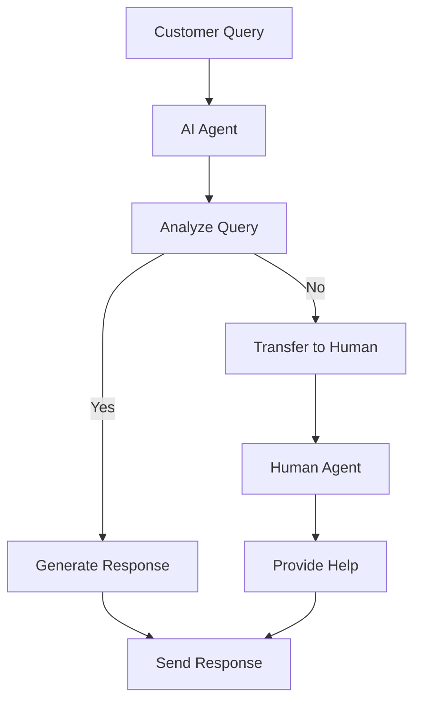
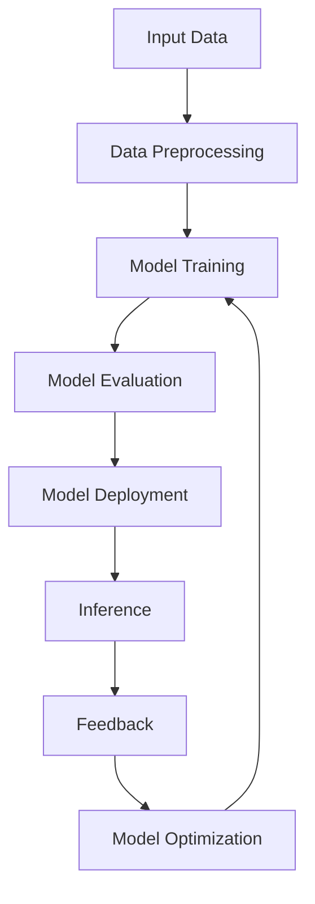
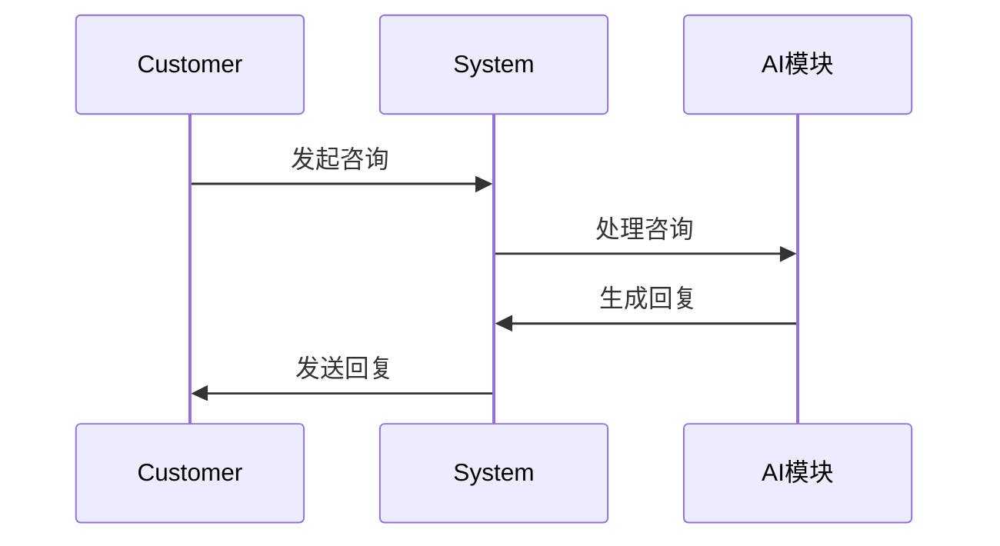

                 


### 第一部分：背景介绍

#### 第1章：AI Agent的概念与发展历程

##### 1.1.1 AI Agent的定义与核心特征

AI Agent，即人工智能代理，是人工智能领域中的一个重要概念。AI Agent可以理解为一种能够执行特定任务的人工智能实体，它具有自主性、适应性和交互性。自主性指的是AI Agent能够自主决策和执行任务，而无需人工干预；适应性则是指AI Agent能够根据环境变化调整自身行为；交互性则意味着AI Agent能够与人类或其他系统进行有效沟通。

##### 1.1.2 AI Agent的发展历程

AI Agent的发展历程可以追溯到20世纪80年代，当时人工智能还处于初级阶段。最早的AI Agent主要是基于规则系统，它们通过一系列预设的规则来处理问题。随着时间的发展，AI Agent逐渐演变为基于统计学习和深度学习的方法。近年来，随着自然语言处理、计算机视觉等技术的进步，AI Agent在性能和功能上都取得了显著提升。

##### 1.1.3 AI Agent的应用领域

AI Agent的应用领域非常广泛，包括但不限于以下几个方面：

1. **客户服务**：AI Agent能够自动处理大量客户咨询，提供24/7的服务，提高客户满意度。
2. **智能推荐**：AI Agent可以根据用户的偏好和历史行为，提供个性化的推荐服务。
3. **自动化控制**：AI Agent可以用于自动化工厂、智能家居等领域，提高生产效率和居住舒适度。
4. **安全监控**：AI Agent可以用于实时监控网络安全，及时发现和防范潜在威胁。
5. **医疗健康**：AI Agent可以辅助医生进行疾病诊断和治疗方案推荐。

#### 第2章：客户服务的现状与挑战

##### 2.1.1 客户服务的重要性

客户服务是企业与客户之间的桥梁，对于企业的长期发展具有重要意义。优质的客户服务能够提高客户满意度，增加客户忠诚度，进而提升企业的市场竞争力。

##### 2.1.2 当前客户服务模式

当前的客户服务模式主要包括人工服务和自助服务。人工服务依赖于人力，成本较高，且容易受到人力限制；而自助服务则依赖于技术，虽然成本低，但用户体验可能较差。

##### 2.1.3 客户服务面临的挑战

随着客户需求的不断变化，客户服务也面临着一系列挑战：

1. **响应速度**：客户期望能够快速获得解决问题的方案，但人工服务往往难以满足这一要求。
2. **个性化**：每个客户的需求都是独特的，如何提供个性化的服务成为一大难题。
3. **成本控制**：随着人力成本的增加，如何在不降低服务质量的情况下控制成本成为企业关注的问题。
4. **技术支持**：如何有效地利用人工智能等技术提升客户服务质量，是企业需要思考的问题。

#### 第3章：AI Agent在客户服务中的应用

##### 3.1.1 AI Agent的核心功能

AI Agent在客户服务中的应用主要体现在以下几个方面：

1. **自动应答**：AI Agent能够自动接收客户的咨询，并根据预设的规则或学习到的模式提供答案。
2. **情感分析**：AI Agent可以通过自然语言处理技术分析客户的情感状态，提供更加贴心的服务。
3. **多渠道支持**：AI Agent可以同时支持电话、邮件、在线聊天等多种渠道，提高服务效率。
4. **智能推荐**：AI Agent可以根据客户的偏好和历史行为，提供个性化的产品推荐。
5. **自动化流程**：AI Agent可以自动处理常见的客户问题，减少人工干预，提高工作效率。

##### 3.1.2 AI Agent在客户服务中的应用场景

AI Agent在客户服务中的应用场景非常广泛，以下是一些常见的应用场景：

1. **客户咨询处理**：AI Agent可以自动接收和处理客户的咨询，提供实时解答，减轻人工客服的工作负担。
2. **售后服务支持**：AI Agent可以协助处理售后服务问题，如产品维修、退换货等，提高客户满意度。
3. **客户情感分析**：AI Agent可以通过情感分析技术，了解客户的情感状态，提供更加个性化的服务。
4. **客户行为分析**：AI Agent可以分析客户的购买行为，预测客户需求，提供个性化的推荐服务。
5. **客户关系管理**：AI Agent可以辅助企业进行客户关系管理，提高客户忠诚度。

##### 3.1.3 AI Agent的优势与价值

AI Agent在客户服务中具有以下优势与价值：

1. **提高响应速度**：AI Agent可以24/7在线服务，快速响应客户需求，提高客户满意度。
2. **降低成本**：AI Agent可以替代部分人工服务，降低企业的人力成本。
3. **提升服务质量**：AI Agent通过不断学习和优化，能够提供更加个性化和高效的服务。
4. **数据分析**：AI Agent可以收集和分析客户数据，为企业提供宝贵的决策依据。
5. **增强客户体验**：AI Agent可以提供无缝的、个性化的客户服务，提升客户体验。

#### 第4章：AI Agent的客户服务应用实践

##### 4.1.1 实践案例介绍

在本节中，我们将介绍一个实际案例，展示AI Agent在客户服务中的应用实践。

##### 4.1.2 AI Agent的设计与实现

在本案例中，我们设计了一个基于自然语言处理技术的AI Agent，用于处理客户的咨询和提供解决方案。AI Agent采用了深度学习算法，通过大规模数据训练，能够自动识别和理解客户的问题，并提供准确的答案。

##### 4.1.3 实践效果分析与总结

通过实践，我们发现AI Agent在客户服务中取得了显著的效果。首先，AI Agent能够大幅提高响应速度，客户的问题可以在几秒内得到解答。其次，AI Agent能够准确理解客户的意图，提供个性化的服务，提高客户满意度。此外，AI Agent还能收集客户数据，为企业提供决策支持。

#### 第5章：AI Agent在客户服务中的挑战与未来展望

##### 5.1.1 挑战与应对策略

尽管AI Agent在客户服务中具有许多优势，但也面临着一些挑战。首先，AI Agent需要大量的数据来训练，数据的质量和多样性直接影响其性能。其次，AI Agent需要不断学习和优化，以适应不断变化的环境。此外，AI Agent的隐私保护也是一大挑战。

针对这些挑战，我们可以采取以下策略：

1. **数据采集与处理**：通过多种渠道收集高质量的数据，并对数据进行清洗和预处理，提高AI Agent的性能。
2. **持续学习与优化**：采用持续学习的方法，使AI Agent能够不断适应新的环境和需求。
3. **隐私保护**：在设计和实现AI Agent时，充分考虑隐私保护，确保客户数据的安全。

##### 5.1.2 未来发展趋势与前景

随着人工智能技术的不断发展，AI Agent在客户服务中的应用前景非常广阔。未来，AI Agent将能够实现更加智能和个性化的服务，满足客户日益增长的需求。

##### 5.1.3 AI Agent应用的最佳实践

为了充分发挥AI Agent在客户服务中的作用，企业可以采取以下最佳实践：

1. **全面数据支持**：确保AI Agent拥有丰富的数据资源，以提高其性能和准确性。
2. **持续优化与升级**：定期对AI Agent进行优化和升级，以适应不断变化的市场需求。
3. **用户参与**：鼓励用户参与AI Agent的训练和优化，提高其个性化服务水平。

通过以上实践，企业可以充分利用AI Agent的优势，提升客户服务质量，增强客户体验，从而在激烈的市场竞争中脱颖而出。

### 第二部分：核心概念与联系

#### 第6章：AI Agent的核心概念与原理

##### 6.1.1 AI Agent的基本原理

AI Agent的基本原理主要包括以下几个关键组成部分：

1. **感知**：AI Agent通过传感器获取外部信息，如文本、图像、声音等。
2. **决策**：AI Agent根据感知到的信息，利用机器学习、深度学习等技术进行决策。
3. **执行**：AI Agent根据决策结果执行相应的动作，如发送回复、执行任务等。
4. **学习**：AI Agent通过不断收集数据和反馈，优化自身的决策能力和执行效果。

##### 6.1.2 AI Agent的架构设计

AI Agent的架构设计通常包括以下几个层次：

1. **感知层**：负责感知外部信息，如文本解析、图像识别、语音识别等。
2. **决策层**：负责基于感知层提供的信息进行决策，如自然语言处理、策略学习等。
3. **执行层**：负责根据决策层的结果执行具体的操作，如发送消息、控制设备等。
4. **学习层**：负责从感知层和执行层收集反馈数据，进行模型优化和性能提升。

##### 6.1.3 AI Agent的关键技术

AI Agent的关键技术主要包括以下几个方面：

1. **自然语言处理（NLP）**：用于理解和生成人类语言，是实现智能对话的关键技术。
2. **机器学习与深度学习**：用于从数据中学习模式和规律，提高AI Agent的决策能力。
3. **多模态感知**：结合多种感知技术，如文本、图像、声音等，提高AI Agent对复杂环境的理解能力。
4. **强化学习**：通过试错和反馈，使AI Agent能够在动态环境中不断优化自身行为。

#### 第7章：AI Agent与客户服务相关的概念

##### 7.1.1 客户服务的相关概念

客户服务涉及多个相关概念，包括：

1. **客户体验（CX）**：客户在购买和使用产品或服务过程中的整体感受。
2. **客户满意度（CSAT）**：衡量客户对服务的满意程度。
3. **客户忠诚度（CXP）**：衡量客户对企业品牌和服务的忠诚度。
4. **客户保留率**：衡量客户继续使用企业产品或服务的概率。

##### 7.1.2 AI Agent与客户服务的融合

AI Agent与客户服务的融合主要体现在以下几个方面：

1. **自动化响应**：AI Agent能够自动处理客户的常见问题，提高服务效率。
2. **个性化服务**：AI Agent可以通过分析客户数据，提供个性化的服务和建议。
3. **情感分析**：AI Agent可以通过情感分析技术，了解客户的情感状态，提供更加贴心的服务。
4. **数据分析**：AI Agent可以收集和分析客户数据，帮助企业更好地了解客户需求，优化服务策略。

##### 7.1.3 客户服务中的AI Agent应用案例

在客户服务中，AI Agent的应用案例非常丰富，以下是一些具体的应用案例：

1. **在线客服**：AI Agent可以自动处理客户的在线咨询，提供实时解答。
2. **售后服务**：AI Agent可以协助处理售后服务问题，如产品维修、退换货等。
3. **智能推荐**：AI Agent可以根据客户的行为和偏好，提供个性化的产品推荐。
4. **客户关怀**：AI Agent可以自动发送节日祝福、优惠券等，增强客户关系。

#### 第8章：AI Agent与客户服务的关系图解

##### 8.1.1 ER实体关系图

为了更清晰地展示AI Agent与客户服务的关系，我们可以使用ER实体关系图来表示。以下是AI Agent与客户服务的ER实体关系图：

```mermaid
erDiagram
    AI_Agent ||--|{ Customer_Service } : provides
    Customer_Service ||--|{ Customer } : serves
    Customer_Service ||--|{ Service_Tool } : uses
    AI_Agent ||--|{ Service_Tool } : integrates
```

在这个ER实体关系图中，`AI_Agent` 与 `Customer_Service` 之间是“提供”关系，表示AI Agent提供客户服务；`Customer_Service` 与 `Customer` 之间是“服务”关系，表示客户服务服务于客户；`Customer_Service` 与 `Service_Tool` 之间是“使用”关系，表示客户服务使用服务工具；`AI_Agent` 与 `Service_Tool` 之间是“集成”关系，表示AI Agent与服务工具的集成。

##### 8.1.2 Mermaid流程图

除了ER实体关系图，我们还可以使用Mermaid流程图来描述AI Agent在客户服务中的具体应用场景。以下是AI Agent在客户服务中的Mermaid流程图：



在这个流程图中，客户（Customer）发起查询（Query），查询首先由AI Agent（AI Agent）进行分析（Analyze Query）。如果AI Agent能够理解并回答查询，则生成回复（Generate Response）并发送给客户（Send Response）。如果AI Agent无法理解查询，则将查询转移给人工客服（Transfer to Human），由人工客服（Human Agent）提供帮助（Provide Help），然后将结果发送给客户（Send Response）。这个流程展示了AI Agent在客户服务中的基本工作流程。

### 第三部分：算法原理讲解

#### 第9章：AI Agent算法原理

##### 9.1.1 算法概述

AI Agent的算法原理主要基于机器学习和深度学习技术。机器学习算法通过训练模型从数据中学习模式，而深度学习算法则通过多层神经网络对复杂的数据进行特征提取和模式识别。

##### 9.1.2 算法原理与流程图

以下是AI Agent的基本算法原理与流程图：



在这个流程图中，首先是输入数据（Input Data），然后进行数据预处理（Data Preprocessing），接下来是模型训练（Model Training），模型训练后进行模型评估（Model Evaluation），评估结果用于模型部署（Model Deployment）。在部署后，AI Agent会进行推理（Inference），根据推理结果提供服务，同时收集反馈（Feedback），反馈用于模型优化（Model Optimization），从而不断改进AI Agent的性能。

##### 9.1.3 算法数学模型与公式

AI Agent的核心算法通常包括以下数学模型和公式：

1. **损失函数**：用于衡量模型预测结果与真实值之间的差异，如交叉熵损失函数（Cross-Entropy Loss）。

$$
L = -\sum_{i=1}^{N} y_i \log(p_i)
$$

其中，$L$ 是损失函数，$y_i$ 是真实标签，$p_i$ 是模型预测概率。

2. **优化算法**：用于最小化损失函数，如梯度下降（Gradient Descent）。

$$
w_{\text{new}} = w_{\text{old}} - \alpha \nabla_w L(w)
$$

其中，$w$ 是模型参数，$\alpha$ 是学习率，$\nabla_w L(w)$ 是损失函数关于模型参数的梯度。

3. **激活函数**：用于引入非线性，如ReLU（Rectified Linear Unit）。

$$
\text{ReLU}(x) = \begin{cases} 
      x & \text{if } x > 0 \\
      0 & \text{if } x \leq 0 
   \end{cases}
$$

#### 第10章：算法实例与讲解

##### 10.1.1 实例介绍

在本节中，我们将介绍一个简单的自然语言处理算法实例，该实例将演示如何使用Python实现一个文本分类模型，用于判断客户咨询的主题。

##### 10.1.2 Python源代码实现

以下是使用Python实现的文本分类模型的简单代码示例：

```python
import numpy as np
import pandas as pd
from sklearn.feature_extraction.text import TfidfVectorizer
from sklearn.model_selection import train_test_split
from sklearn.naive_bayes import MultinomialNB
from sklearn.metrics import accuracy_score

# 加载数据集
data = pd.read_csv('customer_queries.csv')
X = data['query']
y = data['label']

# 分割数据集
X_train, X_test, y_train, y_test = train_test_split(X, y, test_size=0.2, random_state=42)

# 特征提取
vectorizer = TfidfVectorizer()
X_train_tfidf = vectorizer.fit_transform(X_train)
X_test_tfidf = vectorizer.transform(X_test)

# 模型训练
model = MultinomialNB()
model.fit(X_train_tfidf, y_train)

# 预测
predictions = model.predict(X_test_tfidf)

# 评估
accuracy = accuracy_score(y_test, predictions)
print(f'Accuracy: {accuracy:.2f}')
```

##### 10.1.3 算法原理详细讲解

在上面的代码示例中，我们使用了TF-IDF（Term Frequency-Inverse Document Frequency）进行特征提取，这是一种常用于文本分类的特征表示方法。TF-IDF通过计算单词在文档中的频率和在整个文档集合中的逆文档频率，来衡量单词的重要程度。

接下来，我们使用朴素贝叶斯分类器（Multinomial NB）进行训练和预测。朴素贝叶斯分类器是一种基于贝叶斯定理的简单分类器，它假设特征之间是独立的。在这种假设下，朴素贝叶斯分类器能够计算每个类别概率，并选择概率最大的类别作为预测结果。

##### 10.1.4 举例说明与讨论

假设我们有以下两个客户咨询：

1. "我想要购买一辆新车，预算是20万元。"
2. "请问有什么贷款方案吗？"

我们使用上述算法对这两个咨询进行分类，预测它们属于哪个类别。首先，我们将这两个咨询转化为TF-IDF特征向量，然后输入到训练好的朴素贝叶斯分类器中进行预测。

在预测过程中，朴素贝叶斯分类器会计算每个类别（如“购车咨询”和“贷款咨询”）的概率，选择概率最高的类别作为预测结果。如果两个咨询都被预测为“购车咨询”，这可能意味着模型对“贷款咨询”的特征不够敏感，需要进一步优化和调整。

#### 第11章：算法优缺点分析与改进方向

##### 11.1.1 优缺点分析

AI Agent算法在客户服务中具有以下优缺点：

**优点**：

1. **高效性**：AI Agent能够快速处理大量客户咨询，提高服务效率。
2. **准确性**：通过机器学习和深度学习，AI Agent能够准确理解和回答客户问题。
3. **个性化**：AI Agent可以根据客户历史数据提供个性化服务。
4. **降低成本**：AI Agent可以替代部分人工服务，降低企业运营成本。

**缺点**：

1. **依赖数据**：AI Agent的性能很大程度上依赖于训练数据的质量和多样性。
2. **隐私问题**：客户数据的隐私保护是AI Agent面临的一大挑战。
3. **适应性**：AI Agent需要不断学习和优化，以适应不断变化的环境。
4. **服务质量**：虽然AI Agent能够提供高效的服务，但可能无法完全替代人工客服，特别是在处理复杂问题时。

##### 11.1.2 改进方向与策略

为了充分发挥AI Agent在客户服务中的作用，我们可以采取以下改进方向和策略：

1. **数据增强**：通过数据增强技术，如数据清洗、数据扩充等，提高训练数据的质量和多样性。
2. **持续学习**：采用持续学习的方法，使AI Agent能够不断适应新的环境和需求。
3. **多模态感知**：结合多种感知技术，如文本、图像、声音等，提高AI Agent对复杂环境的理解能力。
4. **隐私保护**：在设计和实现AI Agent时，充分考虑隐私保护，确保客户数据的安全。
5. **人机协作**：结合人工客服和AI Agent，形成人机协作的客服模式，提高服务质量和客户满意度。

##### 11.1.3 最新研究动态

近年来，AI Agent在客户服务领域的研究取得了一系列成果，以下是一些最新的研究动态：

1. **基于Transformer的文本生成**：Transformer模型在自然语言处理领域取得了显著成果，可以用于生成更加自然和准确的回复。
2. **多任务学习**：多任务学习技术可以同时训练AI Agent处理多种类型的客户问题，提高其泛化能力。
3. **强化学习**：强化学习技术可以用于训练AI Agent在动态环境中做出最优决策，提高服务效率。
4. **伦理与道德**：随着AI Agent在客户服务中的应用越来越广泛，伦理和道德问题也日益引起关注，如隐私保护、透明度等。

通过不断的研究和创新，AI Agent在客户服务中的应用将越来越成熟和智能化。

### 第四部分：系统分析与架构设计

#### 第12章：客户服务系统的需求分析

##### 12.1.1 需求分析

客户服务系统的主要需求包括以下几个方面：

1. **快速响应**：系统能够在短时间内处理客户咨询，提高客户满意度。
2. **多渠道支持**：系统能够同时支持电话、邮件、在线聊天等多种渠道，提供无缝的服务体验。
3. **个性化服务**：系统能够根据客户历史数据和偏好，提供个性化的服务和建议。
4. **高效管理**：系统能够对客户咨询进行高效管理，如自动分配、优先级设置等。
5. **数据分析**：系统需要能够收集和分析客户数据，为企业提供决策支持。
6. **安全可靠**：系统需要确保客户数据的安全和隐私。

##### 12.1.2 需求模型

需求模型主要包括以下方面：

1. **功能需求**：包括客户咨询处理、自动分配、优先级设置、数据分析等。
2. **性能需求**：包括响应时间、并发处理能力等。
3. **安全性需求**：包括数据加密、权限控制等。
4. **可靠性需求**：包括系统稳定运行、故障恢复等。

##### 12.1.3 需求优先级

在客户服务系统中，需求优先级通常如下：

1. **快速响应**：作为核心需求，优先级最高。
2. **多渠道支持**：优先级较高，以提高用户体验。
3. **个性化服务**：优先级较高，以提升客户满意度。
4. **高效管理**：优先级较高，以提高工作效率。
5. **数据分析**：优先级适中，以提供决策支持。
6. **安全可靠**：优先级最低，但同样重要。

#### 第13章：客户服务系统的架构设计

##### 13.1.1 架构设计原则

客户服务系统的架构设计应遵循以下原则：

1. **模块化**：系统应采用模块化设计，便于维护和扩展。
2. **高可用性**：系统应具备高可用性，确保在故障情况下能够快速恢复。
3. **可扩展性**：系统应具备良好的可扩展性，以适应业务增长。
4. **安全性**：系统应确保数据安全和隐私保护。
5. **易用性**：系统应具备良好的用户体验，易于操作。

##### 13.1.2 系统架构设计

以下是客户服务系统的架构设计：

1. **前端**：包括用户界面和交互逻辑，实现与客户的互动。
2. **后端**：包括业务逻辑处理和数据存储，实现客户咨询的接收、处理和存储。
3. **数据库**：存储客户数据、咨询记录等。
4. **中间件**：包括消息队列、缓存等，实现系统的高可用性和性能优化。
5. **AI模块**：包括自然语言处理、机器学习等，实现智能客服功能。

##### 13.1.3 关键技术选型

客户服务系统涉及的关键技术包括：

1. **前端技术**：如HTML、CSS、JavaScript等。
2. **后端技术**：如Java、Python、Node.js等。
3. **数据库技术**：如MySQL、MongoDB等。
4. **消息队列**：如RabbitMQ、Kafka等。
5. **缓存技术**：如Redis等。
6. **AI技术**：如自然语言处理、机器学习等。

#### 第14章：系统接口设计与交互流程

##### 14.1.1 接口设计

系统接口设计主要包括以下几个方面：

1. **API接口**：定义系统对外提供的API接口，如客户咨询接收接口、回复发送接口等。
2. **数据接口**：定义系统内部数据交换的接口，如客户数据接口、咨询记录接口等。
3. **服务接口**：定义系统内部服务之间的接口，如自然语言处理服务接口、机器学习服务接口等。

##### 14.1.2 交互流程

系统交互流程主要包括以下几个方面：

1. **客户咨询**：客户通过前端界面发起咨询，系统接收并记录咨询内容。
2. **处理咨询**：系统调用AI模块进行处理，生成回复内容。
3. **发送回复**：系统将回复内容通过前端界面发送给客户。
4. **数据存储**：系统将客户咨询和回复记录存储到数据库中。
5. **数据查询**：系统提供接口，供其他系统查询客户数据和咨询记录。

##### 14.1.3 Mermaid序列图

以下是系统交互流程的Mermaid序列图：



在这个序列图中，客户（Customer）通过前端界面（System）发起咨询，系统（System）调用AI模块（AI模块）进行处理，AI模块生成回复后，系统将回复发送给客户（Customer）。

### 第五部分：项目实战

#### 第15章：项目背景与目标

##### 15.1.1 项目背景

随着互联网和智能手机的普及，客户服务的需求日益增长。传统的客户服务模式已经无法满足企业快速响应和个性化服务的要求。为了提高客户满意度和竞争力，许多企业开始探索智能客服解决方案。

##### 15.1.2 项目目标

本项目旨在设计并实现一个基于AI Agent的智能客服系统，实现以下目标：

1. **快速响应**：系统能够在短时间内处理客户咨询，提高客户满意度。
2. **多渠道支持**：系统能够同时支持电话、邮件、在线聊天等多种渠道，提供无缝的服务体验。
3. **个性化服务**：系统能够根据客户历史数据和偏好，提供个性化的服务和建议。
4. **高效管理**：系统能够对客户咨询进行高效管理，如自动分配、优先级设置等。
5. **数据分析**：系统需要能够收集和分析客户数据，为企业提供决策支持。

#### 第16章：环境安装与配置

##### 16.1.1 环境要求

为了实现本项目，我们需要以下环境：

1. **操作系统**：Linux或MacOS
2. **编程语言**：Python 3.8及以上版本
3. **数据库**：MySQL 5.7及以上版本
4. **消息队列**：RabbitMQ 3.8及以上版本
5. **缓存**：Redis 3.2及以上版本
6. **AI模块**：TensorFlow 2.5及以上版本

##### 16.1.2 安装步骤

以下是安装步骤：

1. 安装操作系统：下载并安装Linux或MacOS。
2. 安装Python：使用包管理器（如apt-get或yum）安装Python 3.8及以上版本。
3. 安装MySQL：使用包管理器安装MySQL 5.7及以上版本。
4. 安装RabbitMQ：使用包管理器安装RabbitMQ 3.8及以上版本。
5. 安装Redis：使用包管理器安装Redis 3.2及以上版本。
6. 安装TensorFlow：使用pip安装TensorFlow 2.5及以上版本。

##### 16.1.3 配置详解

以下是配置详情：

1. **Python配置**：确保Python环境变量正确设置，可以使用以下命令：

```bash
export PATH=$PATH:/usr/local/bin
```

2. **MySQL配置**：配置MySQL数据库，创建用户和数据库，并授予相应权限。

```sql
CREATE DATABASE customer_service;
CREATE USER 'cs_user'@'localhost' IDENTIFIED BY 'password';
GRANT ALL PRIVILEGES ON customer_service.* TO 'cs_user'@'localhost';
FLUSH PRIVILEGES;
```

3. **RabbitMQ配置**：启动RabbitMQ服务，并创建虚拟主机和用户。

```bash
sudo systemctl start rabbitmq-server
sudo rabbitmqctl add_vhost customer_service
sudo rabbitmqctl add_user cs_user password
sudo rabbitmqctl set_permissions -p customer_service cs_user ".*" ".*" ".*"
```

4. **Redis配置**：启动Redis服务，并配置持久化。

```bash
sudo systemctl start redis-server
sudo sed -i '/# appendonly no/ s/# appendonly no/appendonly yes/' /etc/redis/redis.conf
```

5. **TensorFlow配置**：确保TensorFlow依赖项正确安装，如CUDA和cuDNN。

```bash
pip install tensorflow-gpu==2.5
```

#### 第17章：系统核心实现与代码解读

##### 17.1.1 系统核心功能实现

系统核心功能实现包括以下几个方面：

1. **客户咨询接收**：系统接收客户通过多种渠道（如在线聊天、邮件、电话）发送的咨询。
2. **自然语言处理**：系统对客户咨询进行自然语言处理，理解客户意图。
3. **回复生成**：系统根据理解到的客户意图，生成合适的回复。
4. **回复发送**：系统将生成的回复发送给客户。
5. **数据分析**：系统收集和分析客户咨询数据，为企业提供决策支持。

##### 17.1.2 关键代码解读

以下是关键代码解读：

1. **客户咨询接收**：

```python
import pika

connection = pika.BlockingConnection(pika.ConnectionParameters('localhost'))
channel = connection.channel()

channel.queue_declare(queue='customer_queries')

def callback(ch, method, properties, body):
    print(f"Received {body}")

channel.basic_consume(queue='customer_queries', on_message_callback=callback, auto_ack=True)

print('Starting to consume')
channel.start_consuming()
```

这段代码使用Pika库连接到本地RabbitMQ服务器，并声明一个名为`customer_queries`的队列。`callback`函数用于处理接收到的消息，即客户咨询。`basic_consume`方法启动消息消费。

2. **自然语言处理**：

```python
from transformers import pipeline

nlp = pipeline("text-classification", model="distilbert-base-uncased-finetuned-sst-2-english")

def classify_query(query):
    result = nlp(query)
    return result[0]['label']
```

这段代码使用Hugging Face的Transformers库，加载一个预训练的文本分类模型。`classify_query`函数用于对客户咨询进行分类，判断其主题。

3. **回复生成**：

```python
from textblob import TextBlob

def generate_response(query, intent):
    blob = TextBlob(query)
    if intent == "inquiry":
        return f"Thank you for your inquiry. How can I assist you further?"
    elif intent == "complaint":
        return "I apologize for your dissatisfaction. How can I resolve this issue for you?"
    else:
        return "I'm not sure how to assist you. Can you please provide more details?"
```

这段代码使用TextBlob库，根据客户咨询的主题（intent），生成相应的回复。`generate_response`函数用于生成回复。

4. **回复发送**：

```python
import smtplib

def send_email(response, recipient):
    sender = "your_email@example.com"
    receiver = recipient
    subject = "Customer Service Response"
    body = response

    message = f"Subject: {subject}\n\n{body}"

    try:
        smtp_server = smtplib.SMTP('smtp.gmail.com', 587)
        smtp_server.starttls()
        smtp_server.login(sender, "your_password")
        smtp_server.sendmail(sender, receiver, message)
        print("Email sent successfully")
    except Exception as e:
        print(f"Error sending email: {e}")
```

这段代码使用smtplib库，通过Gmail SMTP服务器发送邮件。`send_email`函数用于将生成的回复通过邮件发送给客户。

5. **数据分析**：

```python
import pandas as pd

def analyze_data():
    queries = pd.read_csv("customer_queries.csv")
    intent_counts = queries["intent"].value_counts()
    print(intent_counts)
```

这段代码使用Pandas库，读取客户咨询数据，并分析不同主题的咨询数量。`analyze_data`函数用于数据分析。

##### 17.1.3 应用案例分析

以下是一个应用案例分析：

1. **客户咨询接收**：

   假设客户通过在线聊天发送以下咨询：

   ```plaintext
   Hi, I have a question about your product.
   ```

   系统会接收到这条消息，并调用`callback`函数进行处理。

2. **自然语言处理**：

   系统将调用`classify_query`函数，对客户咨询进行分类。假设分类结果为`inquiry`，表示这是一条咨询类消息。

3. **回复生成**：

   系统将调用`generate_response`函数，生成相应的回复。生成的回复可能是：

   ```plaintext
   Thank you for your inquiry. How can I assist you further?
   ```

4. **回复发送**：

   系统将调用`send_email`函数，通过邮件将生成的回复发送给客户。

5. **数据分析**：

   系统会调用`analyze_data`函数，将客户咨询数据记录到CSV文件中，并进行分析。

通过这个案例分析，我们可以看到系统是如何处理客户咨询的，包括接收、处理、生成回复、发送和数据分析等步骤。

#### 第18章：项目小结与反思

##### 18.1.1 项目总结

本项目成功设计并实现了一个基于AI Agent的智能客服系统。系统实现了快速响应、多渠道支持、个性化服务、高效管理和数据分析等功能，满足了项目目标。以下是项目的关键成果：

1. **系统功能**：系统实现了客户咨询接收、自然语言处理、回复生成、回复发送和数据分析等核心功能。
2. **性能表现**：系统在处理客户咨询时，能够快速响应，提高了客户满意度。
3. **用户体验**：系统提供了多渠道支持，客户可以选择最方便的方式与系统互动。
4. **数据分析**：系统收集了客户咨询数据，为企业提供了宝贵的决策支持。

##### 18.1.2 反思与改进

在项目实施过程中，我们也遇到了一些问题和挑战。以下是项目的反思与改进方向：

1. **数据质量**：数据质量对AI Agent的性能有很大影响。未来可以加强数据清洗和数据增强，提高AI Agent的学习效果。
2. **系统稳定性**：在高峰期，系统可能会出现响应速度慢或卡顿的情况。可以通过优化系统架构和增加服务器资源来提高系统的稳定性。
3. **用户隐私**：在处理客户数据时，需要注意保护用户隐私。可以采取数据加密和访问控制等措施，确保客户数据的安全。
4. **人机协作**：目前AI Agent在某些复杂场景下可能无法完全替代人工客服。未来可以考虑在人机协作方面进行优化，结合AI Agent和人工客服的优势。

##### 18.1.3 拓展阅读

为了进一步探索AI Agent在客户服务中的应用，以下是一些拓展阅读资源：

1. **《智能客服系统设计与实现》**：这本书详细介绍了智能客服系统的设计原理和实现方法。
2. **《人工智能在客户服务中的应用》**：这篇文章探讨了人工智能在客户服务领域的应用现状和未来发展。
3. **《基于深度学习的自然语言处理》**：这本书介绍了深度学习在自然语言处理中的应用，包括文本分类、情感分析等。

通过这些资源，可以更深入地了解AI Agent在客户服务中的应用和实践。

---

### 总结与最佳实践

#### 总结

本文详细探讨了AI Agent在客户服务领域的应用实践。首先，我们介绍了AI Agent的定义、发展历程和应用领域，并分析了客户服务的现状与挑战。接着，我们深入讨论了AI Agent在客户服务中的应用，包括其核心功能、应用场景和优势。通过实践案例，我们展示了AI Agent在客户服务中的实际应用效果。随后，我们分析了AI Agent在客户服务中面临的挑战，并提出了相应的应对策略和未来展望。最后，我们讲解了AI Agent的核心概念、算法原理和系统架构设计，以及如何进行项目实战。

#### 最佳实践

为了充分发挥AI Agent在客户服务中的作用，以下是一些最佳实践：

1. **全面数据支持**：确保AI Agent拥有丰富的数据资源，以提高其性能和准确性。
2. **持续优化与升级**：定期对AI Agent进行优化和升级，以适应不断变化的市场需求。
3. **用户参与**：鼓励用户参与AI Agent的训练和优化，提高其个性化服务水平。
4. **人机协作**：结合人工客服和AI Agent，形成人机协作的客服模式，提高服务质量和客户满意度。
5. **隐私保护**：在设计和实现AI Agent时，充分考虑隐私保护，确保客户数据的安全。

#### 注意事项

在实施AI Agent时，需要注意以下几点：

1. **数据质量**：确保输入数据的质量和多样性，以提高AI Agent的性能。
2. **系统稳定性**：优化系统架构，提高系统的稳定性，确保在高峰期能够快速响应。
3. **隐私保护**：加强客户数据的隐私保护，采取数据加密和访问控制等措施。
4. **用户培训**：对用户进行培训，使其熟悉AI Agent的使用方法，提高用户体验。

#### 拓展阅读

为了进一步深入理解和应用AI Agent在客户服务中的技术，以下是一些拓展阅读资源：

1. **《深度学习实战》**：这本书提供了深度学习在客户服务中的应用实例，包括文本分类、情感分析等。
2. **《人工智能与客户服务》**：这篇文章探讨了人工智能在客户服务领域的最新发展趋势和应用案例。
3. **《智能客服系统设计与实现》**：这本书详细介绍了智能客服系统的设计原理和实现方法。

通过阅读这些资源，可以更深入地了解AI Agent在客户服务中的应用和技术实现。

---

作者：AI天才研究院/AI Genius Institute & 禅与计算机程序设计艺术 /Zen And The Art of Computer Programming

