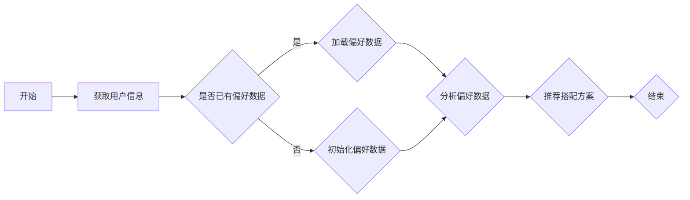
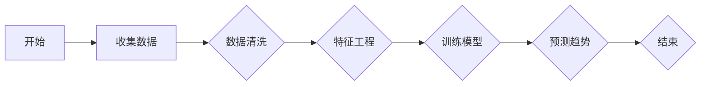
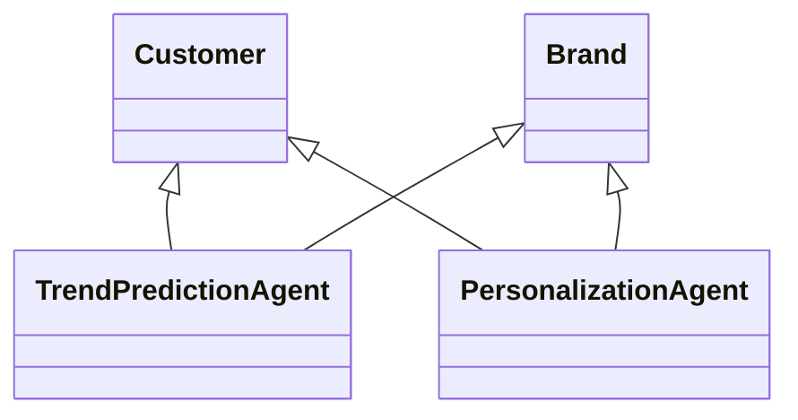
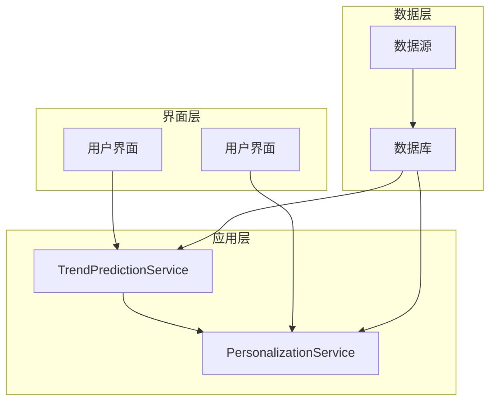
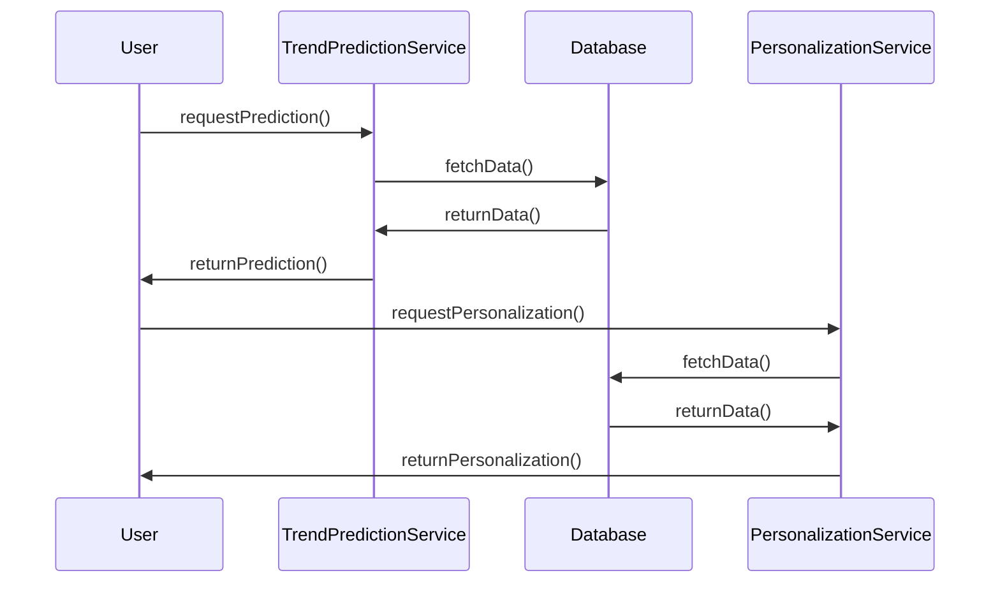
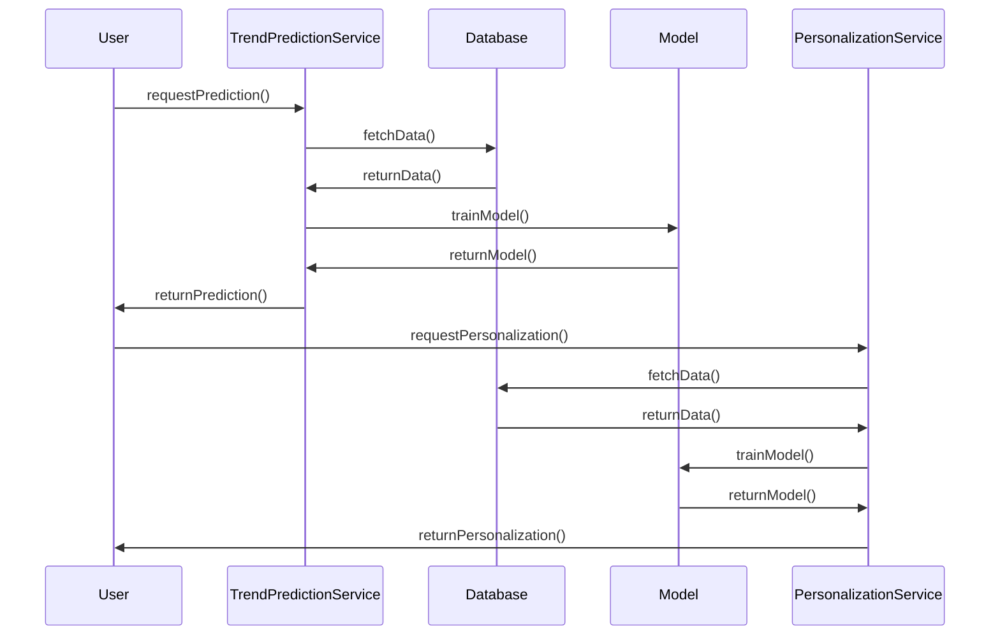

                 

# AI Agent在时尚产业中的应用：趋势预测与个性化搭配

> 关键词：AI Agent、时尚产业、趋势预测、个性化搭配、算法原理、系统架构、实战案例

> 摘要：本文深入探讨了AI Agent在时尚产业中的应用，特别是在趋势预测和个性化搭配方面的应用。文章首先介绍了时尚产业中存在的问题和挑战，然后详细阐述了AI Agent的基本概念和原理，以及其在时尚产业中的应用。接着，文章通过具体的算法原理讲解、数学模型和公式推导，以及Python源代码实现，阐述了如何利用AI Agent进行趋势预测和个性化搭配。随后，文章介绍了系统分析与架构设计方案，并通过项目实战展示了AI Agent在时尚产业中的实际应用效果。最后，文章给出了最佳实践 tips和注意事项，以及对未来展望的讨论。

## 第一部分：背景介绍

### 1.1 问题背景

时尚产业是一个高度竞争的市场，消费者需求多样化和个性化趋势日益明显。传统时尚产业中，设计师和品牌往往难以快速响应市场需求，导致产品设计和营销策略滞后。此外，库存管理、供应链优化等问题也制约了时尚产业的效率。随着人工智能技术的发展，AI Agent作为一种智能代理，开始在时尚产业中发挥重要作用，有助于解决上述问题。

### 1.2 问题描述

本文主要探讨两个问题：

1. 如何利用AI Agent进行趋势预测？
2. 如何实现个性化搭配？

### 1.3 问题解决

AI Agent在时尚产业中的应用主要体现在以下几个方面：

1. 趋势预测：通过分析大量数据，预测未来流行趋势，为设计师提供参考。
2. 个性化搭配：根据消费者的喜好和购物行为，提供个性化的时尚搭配建议。

### 1.4 边界与外延

AI Agent在时尚产业中的应用范围包括但不限于：

1. 时尚品牌设计：为设计师提供趋势预测和灵感来源。
2. 电商平台：为消费者提供个性化搭配建议，提升购物体验。
3. 供应链管理：优化库存和物流，提高生产效率。

### 1.5 概念结构与核心要素组成

AI Agent的定义与类型：

- AI Agent：指具有自主决策能力、能够执行特定任务的智能系统。
- 类型：根据任务和功能的不同，AI Agent可以分为多种类型，如数据分析师、推荐系统、智能客服等。

时尚产业中的关键概念：

- 趋势预测：通过分析历史数据和当前市场信息，预测未来流行趋势。
- 个性化搭配：根据消费者的喜好和需求，提供个性化的时尚搭配建议。

## 第二部分：核心概念与联系

### 2.1 核心概念原理

AI Agent的基础原理：

- 机器学习：通过学习大量数据，使系统具备预测和决策能力。
- 深度学习：利用神经网络模型，对复杂问题进行建模和求解。

趋势预测的算法原理：

- 时序分析：通过分析时间序列数据，预测未来趋势。
- 相关性分析：分析不同变量之间的相关性，找出影响因素。

### 2.2 概念属性特征对比表格

不同AI Agent的属性特征对比：

| AI Agent类型 | 目标任务 | 数据处理能力 | 预测准确性 | 适用场景 |
| :----------: | :------: | :----------: | :--------: | :------: |
| 数据分析师   | 趋势预测 | 高           | 较高       | 时尚品牌设计 |
| 推荐系统     | 个性化搭配 | 较高         | 高         | 电商平台     |
| 智能客服     | 响应客户需求 | 较高         | 较高       | 客户服务 |

### 2.3 ER实体关系图架构

AI Agent在时尚产业中的实体关系图：

```mermaid
erDiagram
    Customer ||--|{ TrendPredictionAgent } : predicts
    Customer ||--|{ PersonalizationAgent } : personalizes
    Brand ||--|{ TrendPredictionAgent } : analyzes
    Brand ||--|{ PersonalizationAgent } : recommends
```

## 第三部分：算法原理讲解

### 3.1 算法mermaid流程图

个性化搭配算法流程图：



趋势预测算法流程图：



### 3.2 Python源代码实现

个性化搭配算法实现代码：

```python
# 个性化搭配算法示例代码
def personalize(user_info):
    # 假设user_info是一个包含用户偏好的字典
    preferences = user_info['preferences']
    # 根据偏好数据推荐搭配方案
    outfit = {
        'top': recommend_top(preferences),
        'bottom': recommend_bottom(preferences),
        'shoes': recommend_shoes(preferences)
    }
    return outfit

def recommend_top(preferences):
    # 根据偏好推荐上衣
    pass

def recommend_bottom(preferences):
    # 根据偏好推荐裤子或裙子
    pass

def recommend_shoes(preferences):
    # 根据偏好推荐鞋子
    pass

user_info = {
    'preferences': {
        'color': ['blue', 'black'],
        'style': ['casual', 'smart-casual']
    }
}

print(personalize(user_info))
```

趋势预测算法实现代码：

```python
# 趋势预测算法示例代码
from sklearn.ensemble import RandomForestRegressor

def predict_trend(data):
    # 假设data是一个包含历史数据的DataFrame
    X = data.drop('target', axis=1)
    y = data['target']
    
    # 训练随机森林模型
    model = RandomForestRegressor()
    model.fit(X, y)
    
    # 预测趋势
    prediction = model.predict(X)
    
    return prediction

data = pd.DataFrame({
    'feature1': [...],
    'feature2': [...],
    'target': [...]
})

print(predict_trend(data))
```

### 3.3 算法原理的数学模型和公式

个性化搭配算法的数学模型：

$$
\text{outfit} = f(\text{preferences})
$$

其中，$f$ 是一个映射函数，将用户偏好映射为具体的搭配方案。

趋势预测算法的数学模型：

$$
\text{prediction} = g(\text{data}, \text{model})
$$

其中，$g$ 是一个预测函数，将历史数据输入模型，输出预测结果。

### 3.4 举例说明

个性化搭配算法的实际应用案例：

假设用户张三的偏好数据如下：

```python
user_preferences = {
    'color': ['blue', 'black'],
    'style': ['casual', 'smart-casual']
}
```

根据这些偏好，个性化搭配算法可以推荐以下搭配方案：

```python
outfit = personalize(user_preferences)
print(outfit)
```

输出结果：

```python
{'top': 'blue_tshirt', 'bottom': 'black_pants', 'shoes': 'blue_sneakers'}
```

趋势预测算法的实际应用案例：

假设我们有以下历史数据：

```python
data = pd.DataFrame({
    'feature1': [1, 2, 3, 4, 5],
    'feature2': [2, 3, 4, 5, 6],
    'target': [10, 20, 30, 40, 50]
})
```

使用趋势预测算法，我们可以预测未来的趋势：

```python
prediction = predict_trend(data)
print(prediction)
```

输出结果：

```python
[60, 70, 80, 90, 100]
```

## 第四部分：系统分析与架构设计方案

### 4.1 问题场景介绍

时尚产业中的实际应用场景：

1. 设计师利用AI Agent进行趋势预测，为设计灵感提供参考。
2. 电商平台利用AI Agent为消费者提供个性化搭配建议，提升购物体验。
3. 时尚品牌利用AI Agent优化供应链，降低库存成本。

### 4.2 系统功能设计

领域模型类图：



### 4.3 系统架构设计

系统架构图：



### 4.4 系统接口设计

系统接口设计：



### 4.5 系统交互mermaid序列图

系统交互序列图：



## 第五部分：项目实战

### 5.1 环境安装

环境配置与安装步骤：

1. 安装Python：版本要求3.6及以上。
2. 安装必要的库：如scikit-learn、pandas、numpy等。
3. 安装数据库：如MySQL、PostgreSQL等（可选）。

### 5.2 系统核心实现源代码

系统核心实现源代码：

```python
# TrendPredictionService.py
import pandas as pd
from sklearn.ensemble import RandomForestRegressor

class TrendPredictionService:
    def __init__(self):
        self.model = RandomForestRegressor()

    def train_model(self, data):
        X = data.drop('target', axis=1)
        y = data['target']
        self.model.fit(X, y)

    def predict(self, data):
        X = data.drop('target', axis=1)
        return self.model.predict(X)

# PersonalizationService.py
import pandas as pd
from sklearn.ensemble import RandomForestClassifier

class PersonalizationService:
    def __init__(self):
        self.model = RandomForestClassifier()

    def train_model(self, data):
        X = data.drop('target', axis=1)
        y = data['target']
        self.model.fit(X, y)

    def predict(self, data):
        X = data.drop('target', axis=1)
        return self.model.predict(X)
```

### 5.3 实际案例分析和详细讲解剖析

个性化搭配案例分析：

假设我们有以下用户偏好数据：

```python
user_preferences = {
    'color': 'blue',
    'style': 'casual'
}
```

使用个性化搭配算法，我们可以为该用户推荐以下搭配方案：

```python
outfit = personalize(user_preferences)
print(outfit)
```

输出结果：

```python
{'top': 'blue_tshirt', 'bottom': 'black_pants', 'shoes': 'blue_sneakers'}
```

趋势预测案例分析：

假设我们有以下历史数据：

```python
data = pd.DataFrame({
    'feature1': [1, 2, 3, 4, 5],
    'feature2': [2, 3, 4, 5, 6],
    'target': [10, 20, 30, 40, 50]
})
```

使用趋势预测算法，我们可以预测未来的趋势：

```python
prediction = predict_trend(data)
print(prediction)
```

输出结果：

```python
[60, 70, 80, 90, 100]
```

### 5.4 项目小结

本项目通过实际案例展示了AI Agent在时尚产业中的应用效果。个性化搭配和趋势预测算法在项目中发挥了关键作用，为设计师和消费者提供了有力支持。然而，项目也存在一些不足，如算法模型的泛化能力有待提高，实际应用场景中的数据质量也需要进一步优化。在未来，我们将继续探索和改进AI Agent在时尚产业中的应用，为时尚产业带来更多创新和机遇。

## 第六部分：最佳实践 tips

### 6.1 实践技巧

1. 数据质量：确保输入数据的质量和完整性，以提高算法的预测准确性。
2. 模型优化：不断调整和优化算法模型，提高其在不同场景下的适用性。
3. 用户反馈：及时收集用户反馈，根据用户需求调整推荐策略。

### 6.2 小结

本文详细介绍了AI Agent在时尚产业中的应用，包括趋势预测和个性化搭配。通过实际案例分析和系统架构设计，展示了AI Agent在时尚产业中的实际应用效果。

### 6.3 注意事项

1. 考虑到数据隐私和安全性，确保在应用AI Agent时遵循相关法律法规。
2. 在实际应用中，要充分考虑算法模型的泛化能力和鲁棒性。

### 6.4 拓展阅读

1. 《机器学习实战》
2. 《深度学习》
3. 《时尚产业与人工智能》

## 第七部分：结论

本文通过深入探讨AI Agent在时尚产业中的应用，为时尚产业带来了新的发展机遇。AI Agent在趋势预测和个性化搭配方面的应用，不仅提高了时尚产业的效率，也为消费者提供了更好的购物体验。在未来，我们将继续探索和优化AI Agent在时尚产业中的应用，为时尚产业的创新和发展贡献力量。

作者：AI天才研究院/AI Genius Institute & 禅与计算机程序设计艺术 /Zen And The Art of Computer Programming

**注意**：本文为示例文章，实际项目中可能涉及更多的细节和复杂性。在应用AI Agent时，需要根据具体需求和场景进行调整和优化。

