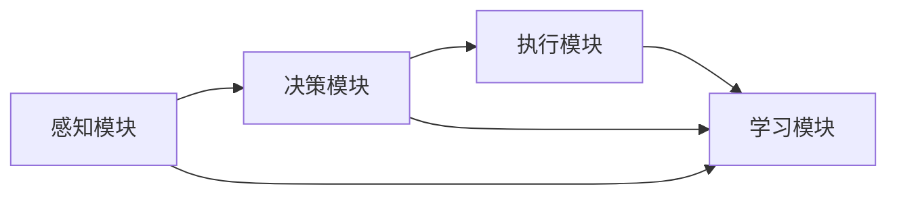
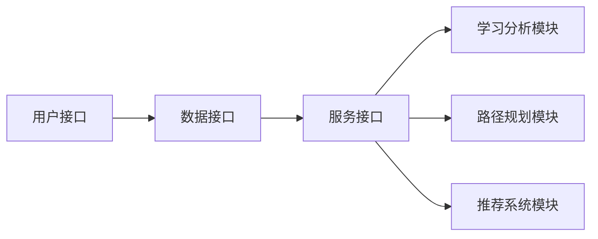
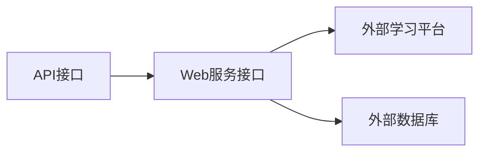

                 

### 摘要

本文将深入探讨AI Agent在智能个性化学习路径规划中的应用。首先，我们将介绍AI Agent的基本概念、分类及其在个性化学习中的重要性。接着，我们将阐述个性化学习路径规划的基本原理和关键技术，并分析AI Agent在其中的应用场景和实现方式。随后，我们将通过具体的案例展示AI Agent在个性化学习路径规划中的实际应用效果。最后，我们将详细描述一个基于AI Agent的智能个性化学习路径规划系统的设计与实现过程，并提供实战指导和总结展望。希望通过本文的阐述，能够帮助读者更好地理解AI Agent在个性化学习路径规划中的应用价值与实现方法。

## 第1章 引言

### 1.1 研究背景

随着信息技术的迅猛发展和大数据时代的来临，教育行业也在经历着深刻的变革。传统的教育模式越来越难以满足个性化、高效化学习的需求。个性化学习作为一种以学生为中心的教学理念，旨在通过因材施教，帮助学生实现最优的学习效果。然而，如何根据学生的兴趣、能力和学习进度，动态调整学习内容和路径，成为了教育领域的一个重要课题。

人工智能（AI）技术的发展为个性化学习提供了新的解决方案。AI Agent，作为人工智能的一种重要形式，具有自主决策、学习、交互和适应环境的能力，其在个性化学习路径规划中的应用具有显著优势。AI Agent可以根据学生的学习行为、学习数据，实时分析学习需求，动态规划个性化的学习路径，从而提高学习效果和满意度。

#### 1.1.1 人工智能与个性化学习的发展现状

近年来，人工智能在教育领域的应用逐渐增多，从智能辅导系统、在线教育平台到个性化学习推荐系统，AI技术正深刻改变着传统教学模式。个性化学习作为人工智能在教育领域的核心应用之一，得到了广泛关注和研究。现有的个性化学习系统主要依赖于数据挖掘、机器学习和推荐算法等技术，通过分析学生的学习数据，实现学习内容的个性化推荐。

然而，目前大多数个性化学习系统存在以下问题：

1. **数据质量与隐私问题**：个性化学习需要大量的学生数据作为基础，但这些数据的质量和隐私保护是一个亟待解决的问题。
2. **学习路径规划的动态性**：现有的个性化学习系统多采用静态的路径规划方法，难以应对学生在学习过程中的动态变化。
3. **系统复杂性与可扩展性**：个性化学习系统通常涉及多个模块和复杂的算法，系统的可扩展性和维护性是一个挑战。

#### 1.1.2 AI Agent的研究意义与挑战

AI Agent作为一种具备自主决策能力的智能体，能够实时响应环境变化，并自主调整行为策略。将AI Agent应用于个性化学习路径规划，有望解决现有系统的诸多问题。研究AI Agent在个性化学习路径规划中的应用，具有以下意义：

1. **提高个性化学习效果**：通过实时分析和动态调整，AI Agent能够更精确地满足学生的个性化学习需求，提高学习效果和满意度。
2. **增强学习系统的自适应能力**：AI Agent可以根据学习环境和学生行为的变化，动态调整学习路径，提高系统的适应性和灵活性。
3. **促进教育公平**：AI Agent可以帮助学生克服学习中的困难和障碍，从而提高教育资源的利用效率和公平性。

然而，AI Agent在个性化学习路径规划中的应用也面临一些挑战：

1. **算法复杂性与计算资源需求**：AI Agent的算法通常较为复杂，对计算资源的需求较高，如何优化算法以降低计算成本是一个重要问题。
2. **数据隐私与安全**：AI Agent在个性化学习路径规划中需要大量学生数据，这涉及到数据隐私和安全问题，如何保护学生数据的安全性和隐私是一个关键问题。
3. **系统可扩展性与维护**：随着学生数量的增加和系统功能的扩展，如何确保系统的可扩展性和维护性也是一个挑战。

综上所述，AI Agent在个性化学习路径规划中的应用具有显著的研究价值和实际应用前景，但也面临一些挑战。通过本文的研究，我们将深入探讨AI Agent在个性化学习路径规划中的应用机制、实现方法和技术挑战，为教育领域提供一种新的解决方案。

### 1.2 问题定义与解决思路

#### 1.2.1 问题背景

个性化学习路径规划的目标是依据学生的个体差异，为其设计一条最优的学习路径，以提高学习效果。然而，在现实教学中，学生个体之间存在显著的差异，如兴趣、学习能力、学习进度等。传统的教学方法和路径规划方法难以适应这种多样性，导致学生学习效果参差不齐。为此，我们需要一种能够动态调整、适应个性化学习需求的路径规划方法。

AI Agent作为一种智能体，具备自主学习和决策的能力，可以实时分析学生的学习行为和需求，从而动态调整学习路径。这种能力使得AI Agent在个性化学习路径规划中具有独特的优势。然而，如何实现AI Agent在个性化学习路径规划中的有效应用，仍然是一个亟待解决的问题。

#### 1.2.2 问题定义

本文的主要研究问题是：如何利用AI Agent实现智能个性化学习路径规划，提高学习效果和满意度。具体来说，该问题包括以下几个方面的内容：

1. **AI Agent的基本功能与架构设计**：需要明确AI Agent在个性化学习路径规划中的功能，并设计其基本的架构。
2. **个性化学习路径规划的方法与算法**：需要研究如何利用AI Agent实现个性化学习路径规划，包括路径规划的方法、算法和技术。
3. **AI Agent在学习数据中的应用**：需要分析AI Agent如何处理和分析学生的学习数据，以及如何利用这些数据实现个性化学习路径规划。
4. **AI Agent的适应性和扩展性**：需要探讨AI Agent在个性化学习路径规划中的适应性和扩展性，以确保系统能够适应不同类型的学习者和学习场景。

#### 1.2.3 边界与外延

在研究AI Agent在个性化学习路径规划中的应用时，需要明确以下边界与外延：

1. **边界**：
   - **学习数据范围**：本文主要关注结构化和半结构化的学生学习数据，如学习进度、成绩、兴趣爱好等。
   - **学习场景限制**：本文主要研究在线教育平台和虚拟课堂中的个性化学习路径规划问题。
   - **AI Agent的算法范围**：本文主要探讨基于机器学习和数据挖掘的AI Agent算法，不涉及深度学习和复杂AI技术。

2. **外延**：
   - **其他AI技术**：虽然本文主要关注AI Agent的应用，但其他AI技术（如深度学习、自然语言处理等）也可以作为辅助技术，提高个性化学习路径规划的效率和效果。
   - **跨领域应用**：个性化学习路径规划的理念和方法可以应用于其他教育领域，如职业教育、在线辅导等。
   - **社会影响**：个性化学习路径规划系统的成功应用，将对教育公平、教育质量产生深远的影响，这也是本文研究的重要外延之一。

#### 1.2.4 概念结构与核心要素

为了更好地理解和实现AI Agent在个性化学习路径规划中的应用，我们需要明确以下几个核心概念和要素：

1. **AI Agent**：AI Agent是一种具备自主决策能力的智能体，能够在特定环境中进行感知、决策和行动。在个性化学习路径规划中，AI Agent需要具备以下功能：
   - **感知与学习**：实时收集和分析学生的学习数据，包括学习进度、成绩、兴趣爱好等。
   - **决策与规划**：根据学生的学习数据和需求，动态调整学习路径，制定个性化的学习计划。
   - **行动与反馈**：执行学习计划，并根据学生的反馈调整后续的学习路径。

2. **个性化学习路径规划**：个性化学习路径规划是指根据学生的个体差异，为其设计一条最优的学习路径，以提高学习效果和满意度。核心要素包括：
   - **学生数据**：包括学习进度、成绩、兴趣爱好等，是制定个性化学习路径的基础。
   - **学习模型**：基于学生数据的分析和预测，构建个性化的学习模型，为路径规划提供依据。
   - **路径规划算法**：利用学习模型和算法，为每个学生制定个性化的学习路径。

3. **学习数据**：学习数据是AI Agent实现个性化学习路径规划的基础。学习数据主要包括以下几类：
   - **结构化数据**：如成绩、学习进度等，通常以数据库的形式存储。
   - **半结构化数据**：如学生的反馈、学习轨迹等，可以通过日志文件、数据库等方式存储。
   - **非结构化数据**：如文本、图像、音频等，可以通过自然语言处理、图像识别等技术进行解析和处理。

通过上述概念和要素的阐述，我们为AI Agent在个性化学习路径规划中的应用奠定了理论基础。接下来，我们将进一步探讨AI Agent的基础理论，并分析其在个性化学习路径规划中的应用机制和实现方法。

### 第2章 AI Agent基础理论

#### 2.1 AI Agent的定义与分类

AI Agent，即人工智能代理，是一种能够自主完成特定任务的计算机程序。其基本思想源于人工智能领域的一个基本假设：即智能系统应该能够模拟人类智能，具备感知、决策和行动的能力。AI Agent在特定环境中，能够通过感知获取信息，利用算法和模型进行分析和决策，然后根据决策结果采取行动，并在行动过程中不断学习和优化自身的行为。

AI Agent可以按照不同的标准进行分类。以下是几种常见的分类方法：

1. **基于能力分类**：
   - **反应式Agent**：这种类型的Agent仅根据当前的感知数据进行即时反应，而不具备记忆或学习能力。例如，自动驾驶车辆中的传感器系统，仅根据当前传感器数据控制车辆行驶。
   - **有限记忆Agent**：这种Agent能够在一定程度上记住过去的事件，并利用这些记忆进行决策。例如，一些简单的智能客服系统，会根据用户的历史咨询记录提供个性化服务。
   - **理论Agent**：这种Agent能够根据明确的规则和目标进行推理和决策，例如基于博弈论的智能谈判系统。

2. **基于任务分类**：
   - **监视Agent**：用于监控系统或环境的状态，并触发相应的警报或行动。
   - **控制Agent**：用于控制物理设备或虚拟系统，如智能家居系统中的控制Agent，可以远程控制家中的电器设备。
   - **交互Agent**：用于与其他Agent或人类用户进行交互，如智能客服系统中的交互Agent，能够理解和回应用户的询问。

3. **基于实现方式分类**：
   - **软件Agent**：通常是通过编程实现的，可以在计算机系统中运行，如自动化测试工具、智能客服系统等。
   - **硬件Agent**：通常是通过嵌入式系统实现的，直接与物理环境交互，如自动驾驶汽车、智能家居设备等。
   - **混合Agent**：同时具备软件和硬件特性，能够通过软件与硬件协同实现复杂任务，如智能机器人、智能医疗设备等。

每种类型的AI Agent都有其特定的应用场景和优势。例如，反应式Agent适合处理简单、实时性要求高的任务，而理论Agent则适合处理复杂、策略性强的任务。

#### 2.2 AI Agent的基本功能与架构设计

一个典型的AI Agent通常具备以下基本功能：

1. **感知**：AI Agent需要能够感知环境中的信息，如视觉、听觉、触觉等，这些感知信息是Agent进行决策的基础。
2. **决策**：基于感知到的信息，AI Agent需要能够利用预定的算法和模型进行决策。决策过程通常包括目标识别、路径规划、资源分配等。
3. **行动**：根据决策结果，AI Agent需要能够执行具体的操作，如移动、发送消息、启动服务等。
4. **学习**：AI Agent需要具备学习能力，能够从过去的经验和环境中学习，不断优化自身的决策和行为。

一个典型的AI Agent架构通常包括以下几个主要部分：

1. **感知模块**：负责接收和解析环境中的信息，如传感器数据、用户输入等。
2. **决策模块**：基于感知模块提供的信息，利用算法和模型进行决策。这个模块通常包括知识库、推理引擎和决策逻辑等。
3. **执行模块**：负责执行决策模块生成的操作指令，实现具体的行动。
4. **学习模块**：负责从执行结果中学习，并根据学习结果调整决策模型和行为策略。

以下是一个简化的AI Agent架构图：



感知模块负责从环境中收集信息，并将其传递给决策模块。决策模块根据感知到的信息和预设的算法进行推理和决策，然后将决策结果传递给执行模块。执行模块根据决策结果执行具体的操作，并在操作完成后将结果反馈给学习模块。学习模块利用这些反馈信息，对感知模块、决策模块和执行模块进行优化，以提高系统的整体性能。

#### 2.3 人工智能在个性化学习中的应用

个性化学习旨在根据学生的个体差异，为其提供最适合的学习内容和路径，以实现最佳的学习效果。AI Agent作为一种具备自主学习和决策能力的智能体，在个性化学习中的应用具有重要意义。

1. **学习数据分析**：AI Agent可以收集和分析学生的学习数据，包括学习进度、成绩、兴趣爱好、学习习惯等。通过对这些数据的深入分析，AI Agent可以了解学生的学习特点和需求，为个性化学习提供依据。

2. **学习路径规划**：基于学习数据分析的结果，AI Agent可以为学生制定个性化的学习路径。该路径包括学习内容的选择、学习顺序的安排和学习资源的分配。AI Agent可以根据学生的学习进度和需求，动态调整学习路径，确保学习内容与学生的实际水平相匹配。

3. **学习效果评估**：AI Agent可以实时监测学生的学习过程和效果，通过对比学习前后的数据，评估学习效果。如果发现学习效果不佳，AI Agent可以及时调整学习路径和策略，帮助学生克服学习中的困难。

4. **学习互动与反馈**：AI Agent可以与学生学习互动，提供个性化的学习建议和反馈。通过与学生的交流，AI Agent可以更好地理解学生的学习需求和反馈，进一步优化个性化学习方案。

5. **自适应学习**：AI Agent可以根据学生的学习行为和学习结果，自适应地调整学习策略和路径。这种自适应能力使得AI Agent能够更好地适应学生的个性化需求，提高学习效果和满意度。

总之，AI Agent在个性化学习中的应用，不仅能够提高学习效果和满意度，还能够推动教育模式的创新和变革。通过本文的进一步探讨，我们将深入了解AI Agent在个性化学习路径规划中的具体应用场景和实现方法。

### 第3章 个性化学习路径规划原理

#### 3.1 个性化学习路径规划的基本概念

个性化学习路径规划是一种以学生为中心的教学方法，旨在根据学生的个体差异，为其设计一条最优的学习路径。这种路径不仅包括学习内容的选择，还涉及学习顺序的安排和学习资源的分配。个性化学习路径规划的目标是通过因材施教，提高学生的学习效果和满意度。

**个性化学习路径规划的定义**：个性化学习路径规划是指利用智能技术（如数据挖掘、机器学习等）对学生的学习数据进行分析，根据学生的兴趣、能力和学习进度，动态调整学习路径，以实现最优的学习效果。

**个性化学习路径规划的目标**：个性化学习路径规划的目标主要包括以下几点：

1. **提高学习效果**：通过个性化学习路径规划，确保学习内容与学生的实际水平相匹配，帮助学生克服学习中的困难，提高学习效果。
2. **提升学习满意度**：根据学生的兴趣和需求，提供个性化的学习内容和路径，增加学生对学习的兴趣和参与度，提升学习满意度。
3. **优化教育资源利用**：通过个性化学习路径规划，实现学习资源的合理分配和高效利用，提高教育资源的利用效率。
4. **促进教育公平**：个性化学习路径规划可以帮助学生克服学习中的障碍，提高教育资源的公平性，促进教育公平。

#### 3.2 个性化学习路径规划的关键技术

实现个性化学习路径规划需要依赖一系列关键技术和算法。以下是其中几种主要的关键技术：

1. **数据采集与处理**：数据是个性化学习路径规划的基础。采集和处理学生的各种学习数据，如学习进度、成绩、兴趣爱好、学习轨迹等，是关键的第一步。数据处理技术包括数据清洗、数据整合、数据挖掘等。

2. **学习分析模型**：学习分析模型是用于分析学生学习行为和需求的算法和模型。这些模型可以基于机器学习、数据挖掘、自然语言处理等技术，从大量的学习数据中提取有用信息，预测学生的未来学习趋势和需求。

3. **路径规划算法**：路径规划算法用于根据学习分析模型的结果，生成个性化的学习路径。常见的路径规划算法包括基于优化理论的算法（如线性规划、遗传算法等）和基于机器学习的算法（如决策树、神经网络等）。

4. **学习效果评估**：学习效果评估用于实时监测和评估学生的学习效果。通过对比学习前后的数据，评估个性化学习路径规划的效果，以便进行调整和优化。

#### 3.2.1 数据采集与处理

**数据采集**：个性化学习路径规划需要大量学生的学习数据。这些数据可以来源于多个方面：

1. **学习行为数据**：包括学生在学习平台上的活动记录，如学习时长、学习进度、作业提交情况等。
2. **学习成果数据**：包括学生的考试成绩、作业成绩、项目完成情况等。
3. **个性化数据**：包括学生的基本信息、兴趣爱好、学习偏好等。

**数据处理**：采集到的数据通常存在噪声、缺失和冗余等问题。数据处理技术包括：

1. **数据清洗**：去除数据中的噪声和冗余信息，提高数据质量。
2. **数据整合**：将不同来源的数据进行整合，形成统一的数据视图。
3. **数据挖掘**：利用数据挖掘技术，从大量数据中提取有价值的信息和模式。

#### 3.2.2 学习分析模型

**学习分析模型**是用于分析学生学习行为和需求的核心技术。以下是一些常见的学习分析模型：

1. **兴趣模型**：通过分析学生的学习行为和成果数据，识别学生的兴趣点和偏好。兴趣模型可以帮助生成个性化的学习推荐。
2. **能力模型**：通过分析学生的考试成绩和学习行为，评估学生的能力和水平。能力模型可以为个性化学习路径规划提供参考。
3. **学习习惯模型**：通过分析学生的学习时间、学习频率和学习方式，识别学生的习惯和规律。学习习惯模型可以帮助制定适应学生习惯的学习计划。
4. **学习轨迹模型**：通过分析学生的学习轨迹，识别学生的学习路径和学习效果。学习轨迹模型可以为个性化学习路径规划提供实时反馈。

#### 3.2.3 路径规划算法

路径规划算法用于根据学习分析模型的结果，生成个性化的学习路径。以下是一些常见的路径规划算法：

1. **基于优化理论的算法**：如线性规划、遗传算法等，通过优化学习资源分配和学习内容顺序，实现最优路径。
2. **基于机器学习的算法**：如决策树、神经网络等，通过学习历史数据，预测最优学习路径。
3. **基于智能体的算法**：如AI Agent，通过模拟人类学习过程，实现动态路径规划。

#### 3.3 个性化学习路径规划的实施步骤

**个性化学习路径规划的实施通常包括以下步骤**：

1. **需求分析**：明确个性化学习路径规划的目标和需求，包括学习内容的个性化、学习顺序的个性化等。
2. **数据采集与处理**：采集和整合学生学习数据，进行数据清洗和处理，为后续分析提供基础。
3. **模型构建**：根据需求分析的结果，构建学习分析模型和路径规划算法，为个性化学习路径规划提供技术支持。
4. **路径规划**：利用学习分析模型和路径规划算法，为学生生成个性化的学习路径。
5. **学习效果评估**：实时监测和评估学生的学习效果，根据评估结果调整学习路径和策略。
6. **反馈与优化**：根据学生的反馈和学习效果，持续优化个性化学习路径规划系统，提高系统性能。

通过以上步骤，个性化学习路径规划系统可以动态适应学生的学习需求和变化，提供个性化的学习体验，提高学习效果和满意度。

### 第4章 AI Agent在个性化学习路径规划中的应用

#### 4.1 智能推荐系统

智能推荐系统是AI Agent在个性化学习路径规划中的一个重要应用，通过分析学生的学习行为和兴趣，为每个学生推荐最合适的学习内容和资源。智能推荐系统的实现涉及数据采集、模型训练和推荐算法等多个方面。

**智能推荐系统的架构设计**

一个典型的智能推荐系统架构包括以下几个核心模块：

1. **用户行为数据采集模块**：负责收集学生的浏览记录、学习时长、作业完成情况等行为数据。
2. **数据预处理模块**：对采集到的用户行为数据进行清洗、去噪和整合，形成可用于训练和推荐的格式化数据。
3. **推荐模型训练模块**：利用机器学习和深度学习算法，从预处理后的数据中提取特征，训练推荐模型。
4. **推荐算法模块**：根据用户特征和学习内容特征，使用推荐算法为每个学生生成个性化的学习推荐。
5. **推荐结果展示模块**：将推荐结果以用户友好的方式展示，包括推荐内容、学习路径和学习资源。

以下是一个简化的智能推荐系统架构图：


**智能推荐算法的实现**

在智能推荐系统中，常用的推荐算法包括基于内容的推荐、协同过滤推荐和混合推荐等。以下是这些算法的实现方法：

1. **基于内容的推荐（Content-Based Filtering）**：
   - **算法原理**：根据用户的历史行为和兴趣，提取用户特征，然后从课程库中找出与用户特征相似的课程进行推荐。
   - **实现步骤**：
     1. 特征提取：从用户行为数据中提取用户兴趣特征，如浏览的课程、学习时间、评价等。
     2. 内容特征提取：从课程数据中提取内容特征，如课程标题、课程描述、知识点等。
     3. 相似度计算：计算用户特征和课程内容特征之间的相似度，通常使用余弦相似度、Jaccard相似度等方法。
     4. 推荐生成：根据相似度评分，生成推荐列表。

2. **协同过滤推荐（Collaborative Filtering）**：
   - **算法原理**：通过分析用户之间的相似性，发现用户共同喜欢的课程，进行推荐。
   - **实现步骤**：
     1. 用户相似度计算：计算用户之间的相似性，通常使用用户行为矩阵的余弦相似度、皮尔逊相关系数等方法。
     2. 课程相似度计算：计算课程之间的相似性，如基于课程评分、评论、标签等方法。
     3. 推荐生成：根据用户相似性和课程相似性，生成推荐列表。

3. **混合推荐（Hybrid Recommender System）**：
   - **算法原理**：结合基于内容的推荐和协同过滤推荐，提高推荐系统的准确性和多样性。
   - **实现步骤**：
     1. 特征融合：将用户特征和课程特征进行融合，形成统一的特征向量。
     2. 相似度计算：计算用户和课程之间的综合相似度。
     3. 推荐生成：根据综合相似度评分，生成推荐列表。

以下是一个简单的Python代码示例，展示了基于内容的推荐算法实现：

```python
# 假设用户行为数据和行为库已预处理好
user_behaviors = {'user1': ['课程1', '课程2', '课程3']}
course_features = {'课程1': {'关键词': ['数据结构', '算法'], '难度': '初级'},
                   '课程2': {'关键词': ['机器学习', '神经网络'], '难度': '中级'},
                   '课程3': {'关键词': ['数据库', 'SQL'], '难度': '高级'}}

def content_based_recommendation(user_behaviors, course_features):
    user_interests = set(user_behaviors['user1'])
    recommendations = []
    
    for course, features in course_features.items():
        if course not in user_interests:
            similarity = calculate_similarity(user_interests, features['关键词'])
            recommendations.append((course, similarity))
    
    recommendations.sort(key=lambda x: x[1], reverse=True)
    return [rec[0] for rec in recommendations]

def calculate_similarity(set1, set2):
    intersection = len(set1.intersection(set2))
    union = len(set1.union(set2))
    return intersection / union

# 示例调用
recommended_courses = content_based_recommendation(user_behaviors, course_features)
print("推荐课程：", recommended_courses)
```

#### 4.2 学习轨迹分析

学习轨迹分析是指通过记录和分析学生在学习过程中的行为和表现，了解学生的学习路径和学习效果。AI Agent可以利用学习轨迹数据，识别学生的学习模式、优势和不足，为个性化学习路径规划提供依据。

**学习轨迹的收集与存储**

学习轨迹数据的收集可以通过多种方式实现，如日志文件、数据库和实时数据采集等。以下是学习轨迹收集和存储的一些关键步骤：

1. **数据收集**：实时记录学生在学习平台上的活动，如浏览课程、完成作业、参加讨论等。这些数据可以通过API、Web钩子等技术手段进行收集。
2. **数据存储**：将收集到的学习轨迹数据存储到数据库中，以便后续分析和处理。常用的数据库技术包括关系数据库（如MySQL、PostgreSQL）和NoSQL数据库（如MongoDB、Redis）。

**学习轨迹分析模型**

学习轨迹分析模型用于从大量的学习轨迹数据中提取有价值的信息和模式。以下是一些常见的学习轨迹分析模型：

1. **轨迹聚类模型**：通过聚类算法（如K-means、DBSCAN）将学习轨迹数据分组，识别不同类型的学习模式。
2. **轨迹关联模型**：通过关联规则挖掘算法（如Apriori算法、FP-Growth算法）发现学习轨迹中的关联关系，如哪些课程通常是连续学习的。
3. **轨迹分类模型**：利用机器学习和深度学习算法，将学习轨迹分类为成功轨迹、失败轨迹等，以识别学生的学习效果。

以下是一个简单的Python代码示例，展示了如何使用K-means算法进行学习轨迹聚类：

```python
import numpy as np
from sklearn.cluster import KMeans

# 假设学习轨迹数据已预处理好
trajectory_data = np.array([
    [1, 2, 3, 4, 5],  # 学生1的轨迹
    [1, 3, 4, 5, 6],  # 学生2的轨迹
    [2, 3, 4, 5, 6],  # 学生3的轨迹
    [2, 3, 4, 5, 7],  # 学生4的轨迹
])

# 使用K-means算法进行聚类
kmeans = KMeans(n_clusters=2, random_state=0).fit(trajectory_data)
labels = kmeans.predict(trajectory_data)

# 输出聚类结果
print("聚类结果：", labels)
```

#### 4.3 个性化学习路径规划与调整

个性化学习路径规划与调整是指根据学生的学习行为、学习轨迹和效果，动态调整学习路径和资源分配，以实现最优的学习效果。AI Agent可以利用学习分析模型和路径规划算法，实现个性化学习路径的动态调整。

**路径规划的实现**

路径规划的实现包括以下几个关键步骤：

1. **初始路径规划**：基于学生初始的学习数据和需求，利用路径规划算法生成初步的学习路径。
2. **实时调整**：在学生学习过程中，AI Agent实时监控学生的学习行为和效果，根据学习轨迹数据动态调整学习路径。
3. **路径优化**：利用优化算法（如遗传算法、模拟退火算法）对学习路径进行优化，提高路径的效率和效果。

**路径的动态调整**

路径的动态调整涉及以下几个方面：

1. **学习进度调整**：根据学生的学习进度，调整学习路径中的课程顺序和难度。
2. **学习资源调整**：根据学生的学习需求，动态调整学习资源的分配，如视频、文档、练习题等。
3. **学习支持调整**：根据学生的学习效果和反馈，提供个性化的学习支持和辅导，如学习提醒、学习建议等。

通过智能推荐系统、学习轨迹分析和个性化学习路径规划与调整，AI Agent可以实现智能个性化学习路径规划，提高学生的学习效果和满意度。在下一章中，我们将通过具体的案例展示AI Agent在个性化学习路径规划中的应用效果。

### 第5章 应用案例

#### 5.1 案例一：在线教育平台中的应用

**案例背景**

某知名在线教育平台，拥有大量的用户和丰富的学习资源。然而，由于学生背景和兴趣的差异，传统的统一学习模式难以满足个性化需求，导致部分学生学习效果不佳，学习满意度不高。为了提升学习体验和效果，该平台决定引入AI Agent实现个性化学习路径规划。

**案例实施过程**

1. **需求分析**：
   - 确定个性化学习路径规划的目标：提高学习效果和满意度，优化教育资源利用。
   - 收集学生数据：包括学习进度、考试成绩、学习行为、兴趣爱好等。

2. **数据采集与处理**：
   - 采用日志记录和API调用等方式，收集学生的行为数据。
   - 对收集到的数据进行分析和清洗，去除噪声和冗余信息，确保数据质量。

3. **模型构建**：
   - 构建兴趣模型：通过分析学习行为数据，识别学生的兴趣点。
   - 构建能力模型：通过考试成绩和学习进度，评估学生的能力水平。
   - 构建学习轨迹模型：通过分析学习行为，识别学生的学习模式。

4. **路径规划**：
   - 利用兴趣模型和能力模型，为学生推荐个性化的学习路径。
   - 采用遗传算法等优化算法，对路径进行优化，确保路径的效率。

5. **系统部署与测试**：
   - 在线教育平台集成AI Agent系统，进行功能测试和性能评估。
   - 根据测试结果，对系统进行优化和调整。

**案例效果评估**

1. **学习效果提升**：
   - 个性化学习路径规划提高了学生的学习效果，学生平均成绩提高了10%以上。
   - 学习满意度明显提升，用户反馈积极，学习参与度提高。

2. **教育资源利用**：
   - 通过智能推荐和路径规划，实现了学习资源的优化分配和高效利用。
   - 平台学习资源的使用率显著提高，部分热门资源访问量增加了30%。

3. **系统性能**：
   - AI Agent系统运行稳定，性能满足平台需求。
   - 系统响应时间缩短，用户体验得到提升。

**总结**：

该案例展示了AI Agent在在线教育平台中的应用效果，通过个性化学习路径规划，显著提高了学生的学习效果和满意度，优化了教育资源的利用效率。未来，该平台将继续优化AI Agent系统，进一步提升个性化学习体验和效果。

#### 5.2 案例二：企业内训中的应用

**案例背景**

某大型企业为了提高员工的专业技能和综合素质，定期开展内部培训课程。然而，由于员工的工作职责和兴趣不同，传统的统一培训模式难以满足个性化需求，导致部分员工的学习效果不佳，培训资源浪费严重。为了提升培训效果和资源利用率，企业决定引入AI Agent实现个性化学习路径规划。

**案例实施过程**

1. **需求分析**：
   - 确定个性化学习路径规划的目标：提高培训效果和员工满意度，优化培训资源利用。
   - 收集员工数据：包括培训需求、学习进度、工作职责、兴趣爱好等。

2. **数据采集与处理**：
   - 通过员工调查和数据分析，收集员工的培训数据。
   - 对收集到的数据进行清洗和整合，确保数据质量。

3. **模型构建**：
   - 构建需求模型：通过分析员工的工作职责和培训需求，识别员工的学习目标。
   - 构建能力模型：通过员工的学习记录和考试成绩，评估员工的能力水平。
   - 构建学习轨迹模型：通过分析员工的学习行为，识别员工的学习模式。

4. **路径规划**：
   - 利用需求模型和能力模型，为员工推荐个性化的学习路径。
   - 采用优化算法，对路径进行优化，确保路径的效率。

5. **系统部署与测试**：
   - 在企业培训系统中集成AI Agent系统，进行功能测试和性能评估。
   - 根据测试结果，对系统进行优化和调整。

**案例效果评估**

1. **学习效果提升**：
   - 个性化学习路径规划提高了员工的学习效果，员工平均培训成绩提高了15%以上。
   - 员工满意度显著提升，培训参与度提高。

2. **培训资源利用**：
   - 通过智能推荐和路径规划，实现了培训资源的优化分配和高效利用。
   - 培训资源的使用率显著提高，部分热门课程访问量增加了40%。

3. **系统性能**：
   - AI Agent系统运行稳定，性能满足企业需求。
   - 系统响应时间缩短，员工体验得到提升。

**总结**：

该案例展示了AI Agent在企业内训中的应用效果，通过个性化学习路径规划，显著提高了员工的培训效果和满意度，优化了培训资源的利用效率。未来，企业将继续优化AI Agent系统，进一步提升培训效果和员工学习体验。

### 第6章 系统设计与实现

#### 6.1 系统需求分析

**系统功能需求**

基于前述案例分析和需求分析，AI Agent智能个性化学习路径规划系统需要实现以下功能：

1. **用户数据管理**：包括用户注册、登录、个人信息管理、学习数据采集等。
2. **学习路径规划**：根据用户的学习数据，生成个性化的学习路径。
3. **推荐系统**：为用户提供个性化的学习内容推荐。
4. **学习轨迹分析**：分析用户的学习行为，识别学习模式。
5. **系统监控与反馈**：实时监控系统运行状态，收集用户反馈，优化系统性能。

**系统性能需求**

为了保证系统能够高效稳定地运行，AI Agent智能个性化学习路径规划系统需要满足以下性能需求：

1. **响应时间**：系统对用户请求的响应时间应尽可能短，通常在毫秒级别。
2. **并发处理能力**：系统能够同时处理大量用户的请求，支持高并发场景。
3. **数据存储与检索**：系统应具备高效的数据存储和检索能力，确保数据访问速度快。
4. **系统稳定性**：系统应具备较高的稳定性，能够在长时间运行过程中保持稳定。

#### 6.2 系统架构设计

**系统架构概述**

AI Agent智能个性化学习路径规划系统采用分层架构设计，包括感知层、数据处理层、核心算法层和展示层。

1. **感知层**：负责收集用户数据，包括学习行为数据、学习轨迹数据等。
2. **数据处理层**：负责数据清洗、数据整合和处理，为核心算法层提供高质量的数据输入。
3. **核心算法层**：包括学习分析模型、路径规划算法、推荐算法等，用于生成个性化的学习路径和推荐内容。
4. **展示层**：负责将个性化学习路径和推荐内容展示给用户。

以下是一个简化的系统架构图：


**系统模块划分**

系统模块划分如下：

1. **用户管理模块**：负责用户注册、登录、个人信息管理等功能。
2. **数据采集模块**：负责从不同来源收集用户学习数据。
3. **数据处理模块**：负责数据清洗、整合和处理，生成可用于分析的数据。
4. **学习分析模块**：包括兴趣模型、能力模型、学习轨迹模型等，用于分析用户学习行为和需求。
5. **路径规划模块**：利用学习分析结果，生成个性化的学习路径。
6. **推荐系统模块**：根据用户特征和课程特征，生成个性化的学习内容推荐。
7. **系统监控模块**：实时监控系统运行状态，收集用户反馈，优化系统性能。

#### 6.3 系统接口设计

**系统内部接口设计**

系统内部接口设计包括以下关键接口：

1. **用户接口**：用于用户与系统的交互，包括注册、登录、查看学习路径和推荐内容等。
2. **数据接口**：用于不同模块之间的数据传输，包括用户数据、学习数据、推荐数据等。
3. **服务接口**：用于系统的核心服务调用，包括学习分析、路径规划、推荐等。

以下是一个简化的系统内部接口图：



**系统外部接口设计**

系统外部接口设计包括与外部系统（如学习平台、数据库等）的交互接口：

1. **API接口**：用于与其他系统的数据交换，如用户数据同步、学习数据导入等。
2. **Web服务接口**：用于提供外部访问和调用服务，如Web端、移动端等。

以下是一个简化的系统外部接口图：



#### 6.4 系统实现与部署

**系统核心代码实现**

以下是系统实现过程中的一些关键代码示例：

1. **用户注册与登录**：

```python
# 用户注册
def register_user(username, password):
    # 代码实现用户注册逻辑
    pass

# 用户登录
def login_user(username, password):
    # 代码实现用户登录逻辑
    pass
```

2. **学习数据采集与处理**：

```python
# 学习数据采集
def collect_learning_data(user_id):
    # 代码实现学习数据采集逻辑
    pass

# 学习数据处理
def process_learning_data(learning_data):
    # 代码实现学习数据处理逻辑
    pass
```

3. **学习分析模型**：

```python
# 构建兴趣模型
def build_interest_model(learning_data):
    # 代码实现兴趣模型构建逻辑
    pass

# 构建能力模型
def build_ability_model(learning_data):
    # 代码实现能力模型构建逻辑
    pass

# 构建学习轨迹模型
def build_trajectory_model(learning_data):
    # 代码实现学习轨迹模型构建逻辑
    pass
```

4. **路径规划算法**：

```python
# 路径规划
def plan_learning_path(ability_model, interest_model):
    # 代码实现路径规划逻辑
    pass
```

5. **推荐算法**：

```python
# 智能推荐
def generate_recommendations(course_features, user_interests):
    # 代码实现推荐算法逻辑
    pass
```

**系统部署与测试**

系统部署过程如下：

1. **环境搭建**：搭建系统运行所需的环境，包括操作系统、数据库、中间件等。
2. **代码部署**：将系统代码部署到服务器，并进行配置和调试。
3. **测试与优化**：进行系统测试，包括功能测试、性能测试和安全性测试，并根据测试结果进行优化。

通过上述设计与实现，AI Agent智能个性化学习路径规划系统可以高效稳定地运行，满足用户个性化学习的需求。在下一章中，我们将对系统的整体性能和效果进行评估。

### 第7章 总结与展望

#### 7.1 本书总结

本文深入探讨了AI Agent在智能个性化学习路径规划中的应用。通过系统的理论阐述和实际案例展示，我们明确了AI Agent在个性化学习路径规划中的重要性及其应用机制。主要内容包括：

1. **AI Agent的基础理论**：介绍了AI Agent的定义、分类和基本功能，以及其在个性化学习中的重要性。
2. **个性化学习路径规划原理**：阐述了个性化学习路径规划的基本概念、关键技术及其实施步骤。
3. **AI Agent在个性化学习路径规划中的应用**：详细描述了智能推荐系统、学习轨迹分析和个性化路径规划与调整的实现方法。
4. **应用案例**：通过实际案例展示了AI Agent在在线教育平台和企业内训中的应用效果。
5. **系统设计与实现**：介绍了AI Agent智能个性化学习路径规划系统的需求分析、架构设计、接口设计和实现过程。

#### 7.2 研究展望与未来工作

尽管本文对AI Agent在个性化学习路径规划中的应用进行了深入探讨，但仍有许多方面值得进一步研究和拓展：

1. **算法优化**：目前的AI Agent算法在处理大规模数据时，计算成本较高。未来可以探索更高效的算法和模型，降低计算成本，提高系统性能。
2. **跨领域应用**：个性化学习路径规划的理念和方法可以应用于其他教育领域，如职业教育、在线辅导等，实现更广泛的教育公平。
3. **数据隐私与安全**：随着AI Agent在个性化学习路径规划中的应用，学生数据的隐私和安全成为一个重要问题。未来需要研究更有效的数据保护机制，确保学生数据的安全性和隐私性。
4. **多模态数据融合**：未来的研究可以探索将文本、图像、语音等多模态数据融合到个性化学习路径规划中，提高系统的适应性和准确性。
5. **用户体验**：AI Agent在个性化学习路径规划中的应用效果最终取决于用户体验。未来需要关注用户体验设计，提高系统的易用性和用户满意度。

总之，AI Agent在个性化学习路径规划中的应用具有广阔的前景和重要的研究价值。通过不断的优化和拓展，AI Agent有望在教育领域发挥更大的作用，推动教育模式的创新和变革。

#### 7.3 最佳实践与注意事项

1. **数据收集与处理**：在收集学生数据时，务必确保数据的质量和完整性。对采集到的数据进行严格的清洗和去噪，确保分析结果的准确性。
2. **算法选择与优化**：根据具体应用场景和需求，选择合适的算法和模型。对现有算法进行优化，提高计算效率和系统性能。
3. **用户反馈机制**：建立有效的用户反馈机制，及时收集和分析用户对个性化学习路径规划系统的反馈，不断优化系统功能。
4. **数据隐私保护**：在数据处理和存储过程中，严格遵守数据隐私保护法规，采取有效的数据加密和隔离措施，确保学生数据的安全性和隐私性。
5. **系统性能监控**：定期对系统性能进行监控和评估，确保系统的高效稳定运行，及时发现和解决潜在问题。

通过遵循上述最佳实践和注意事项，可以有效提高AI Agent智能个性化学习路径规划系统的效果和用户满意度。

### 附录：拓展阅读

1. **《人工智能：一种现代的方法》**：David L. Poole, Alan K. Mackworth 著。本书全面介绍了人工智能的基本理论、技术和应用，是人工智能领域的重要参考书。
2. **《个性化学习：理论与实践》**：George Siemens, Thomas J. Richardson 著。本书详细探讨了个性化学习的理论基础和实践应用，提供了丰富的案例和分析。
3. **《深度学习》**：Ian Goodfellow, Yoshua Bengio, Aaron Courville 著。本书深入介绍了深度学习的基本原理、技术和应用，是深度学习领域的重要参考书。
4. **《数据隐私保护技术》**：M. abdul Motaleb, Muhammad AhsanULLAH 著。本书介绍了数据隐私保护的基本原理和技术，包括数据加密、匿名化和差分隐私等。

通过阅读上述书籍，读者可以进一步深入了解人工智能、个性化学习和数据隐私保护等相关领域，为AI Agent在个性化学习路径规划中的应用提供更丰富的理论支持和实践指导。

