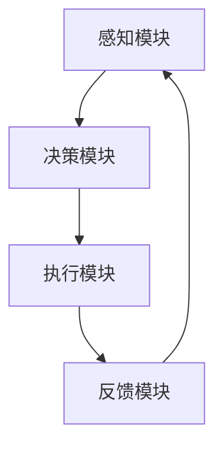
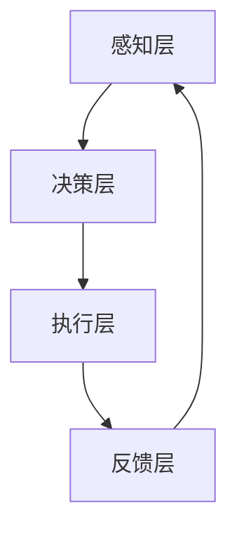
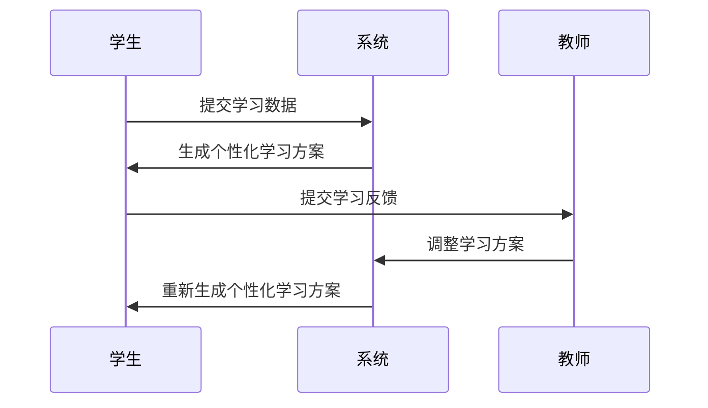

                 

## AI Agent在智能个性化教育中的应用

### 关键词：AI Agent、个性化教育、智能教育、机器学习、深度学习

### 摘要：

在科技迅猛发展的今天，人工智能正逐步深入到各个领域，教育领域也不例外。其中，AI Agent作为一种先进的人工智能技术，正在被广泛应用于智能个性化教育中。本文将围绕AI Agent的基本概念、原理和应用，详细探讨其在智能个性化教育中的潜在价值与实际应用。

### 目录：

1. **AI Agent概述**
2. **个性化教育的核心要素**
3. **AI Agent在个性化教育中的应用**
4. **算法原理讲解**
5. **系统分析与架构设计**
6. **项目实战**
7. **最佳实践与总结**

### 1. AI Agent概述

#### 1.1 AI Agent的基本概念

AI Agent，即人工智能代理，是一种能够自主地感知环境、制定决策并采取行动的智能实体。它具备以下基本特征：

- **自主性**：能够独立完成特定任务。
- **感知性**：能够获取环境信息。
- **学习性**：能够通过经验学习改进自身行为。
- **适应性**：能够根据环境变化调整策略。

#### 1.2 AI Agent在个性化教育中的应用背景

随着互联网和大数据技术的发展，个性化教育成为现代教育的重要趋势。AI Agent凭借其自主性、学习性和适应性，可以为学生提供个性化学习方案，成为实现智能个性化教育的重要工具。

#### 1.3 AI Agent的发展历史与未来趋势

AI Agent最早可以追溯到20世纪80年代，随着机器学习、深度学习等技术的不断进步，AI Agent的应用场景越来越广泛。未来，AI Agent有望在智能个性化教育中发挥更加重要的作用，推动教育模式的变革。

### 2. 个性化教育的核心要素

#### 2.1 个性化教育的核心要素

个性化教育旨在根据学生的个性化需求、兴趣和特点，制定个性化的学习方案。其核心要素包括：

- **学生数据分析**：收集并分析学生的行为数据、学习记录等。
- **学习路径规划**：根据学生数据，制定适合的学习路径。
- **自适应学习**：根据学生的学习表现，动态调整学习内容和方法。
- **评估与反馈**：对学生的学习效果进行评估，并提供反馈。

### 3. AI Agent在个性化教育中的应用

#### 3.1 AI Agent的基本组成部分

一个典型的AI Agent由感知模块、决策模块和执行模块三部分组成。在个性化教育中，AI Agent可以应用于以下方面：

- **学习路径规划**：根据学生的学习数据和偏好，为每个学生生成个性化的学习路径。
- **学习内容推荐**：基于学生的学习进度和兴趣，推荐合适的学习内容。
- **学习行为分析**：分析学生的学习行为，提供个性化的学习建议。
- **学习效果评估**：对学生的学习效果进行评估，为后续教学提供参考。

### 4. 算法原理讲解

#### 4.1 AI Agent主要算法介绍

AI Agent的核心在于其算法，常见的算法包括：

- **决策树**：通过特征组合进行分类和决策。
- **神经网络**：模拟人脑神经元连接，实现复杂模式识别。
- **强化学习**：通过试错和奖励机制，学习最优策略。

#### 4.2 算法mermaid流程图展示

以下是一个简单的AI Agent决策流程图的示例：



#### 4.3 Python代码与LaTeX公式解析

为了更好地理解算法原理，以下是一个基于Python的决策树算法示例：

```python
from sklearn import tree

# 标签和特征数据
labels = [0, 1, 0, 1]
features = [[0, 0], [1, 0], [0, 1], [1, 1]]

# 训练决策树
clf = tree.DecisionTreeClassifier()
clf.fit(features, labels)

# 输出决策树结构
print(tree.export_text(clf))
```

算法原理的数学模型和公式：

$$
\begin{aligned}
h(x) &= -\sum_{i=1}^{n} p_i \log_2 p_i \\
\end{aligned}
$$

其中，$p_i$ 表示每个类别的概率。

### 5. 系统分析与架构设计

#### 5.1 问题场景介绍

智能个性化教育的核心问题是如何根据学生的个性化需求和学习数据，为其提供合适的学习资源和教学服务。

#### 5.2 系统功能设计

系统功能主要包括：

- **学生数据分析**：收集并处理学生行为数据，提取有价值的信息。
- **学习路径规划**：根据学生数据，生成个性化的学习路径。
- **学习内容推荐**：基于学生偏好，推荐合适的学习内容。
- **学习行为分析**：分析学生学习行为，提供个性化建议。
- **学习效果评估**：评估学生学习效果，为教学提供反馈。

#### 5.3 系统架构设计

系统架构采用分层设计，包括：

- **感知层**：负责收集学生行为数据。
- **决策层**：基于算法为学生提供个性化服务。
- **执行层**：执行决策层生成的个性化学习方案。
- **反馈层**：收集学生的学习反馈，优化决策。

以下是一个简单的系统架构图：



#### 5.4 系统接口设计

系统接口主要包括：

- **数据接口**：负责数据的采集、存储和读取。
- **服务接口**：提供个性化学习服务，如路径规划、内容推荐等。
- **监控接口**：监控系统运行状态，提供故障诊断和预警。

#### 5.5 系统交互设计

系统交互设计主要涉及学生、教师和系统之间的交互流程。以下是一个简单的交互序列图：



### 6. 项目实战

#### 6.1 环境安装与配置

在项目实战中，首先需要安装和配置必要的开发环境和工具，如Python、Sklearn、TensorFlow等。

```bash
pip install sklearn tensorflow
```

#### 6.2 系统核心实现

以下是一个简单的AI Agent实现示例，用于生成个性化学习路径：

```python
from sklearn import tree
import numpy as np

# 标签和特征数据
labels = [0, 1, 0, 1]
features = [[0, 0], [1, 0], [0, 1], [1, 1]]

# 训练决策树
clf = tree.DecisionTreeClassifier()
clf.fit(features, labels)

# 输出决策树结构
print(tree.export_text(clf))

# 生成个性化学习路径
def generate_learning_path(student_data):
    return clf.predict([student_data])

# 示例
print(generate_learning_path([0, 0]))
```

#### 6.3 代码应用解读与分析

在这个示例中，我们使用Sklearn库中的决策树算法训练了一个模型，用于预测学生的个性化学习路径。通过调用`generate_learning_path`函数，我们可以根据学生的特征数据生成个性化学习方案。

#### 6.4 实际案例分析

为了更好地理解AI Agent在个性化教育中的应用，我们可以参考以下实际案例：

- **案例1**：一个初中学生，数学成绩较好，但对物理感兴趣。AI Agent可以为他推荐与物理相关的数学课程。
- **案例2**：一个高中生，英语成绩较差，但喜欢阅读。AI Agent可以为他推荐适合英语提高的阅读材料。

#### 6.5 项目小结

通过项目实战，我们展示了如何使用AI Agent生成个性化学习路径。虽然这个示例较为简单，但它为我们提供了一个理解AI Agent在个性化教育中应用的基本框架。在实际应用中，AI Agent可以根据更多的学生数据和复杂的学习场景，提供更加精准和有效的个性化教育服务。

### 7. 最佳实践与总结

#### 7.1 最佳实践技巧

- **数据收集与处理**：确保数据质量，进行数据清洗和预处理。
- **算法选择与优化**：根据实际需求选择合适的算法，并不断优化算法性能。
- **用户反馈**：及时收集用户反馈，不断调整和改进系统。

#### 7.2 注意事项

- **隐私保护**：确保学生的隐私得到保护，遵守相关法律法规。
- **算法公正性**：避免算法偏见，确保个性化教育的公正性。

#### 7.3 拓展阅读资源

- **参考文献**：[1] Russell, S., & Norvig, P. (2016). 《人工智能：一种现代的方法》
- **在线课程**：[2] 《深度学习》课程，由吴恩达教授授课
- **开源项目**：[3] 《个性化教育AI平台》项目，由GitHub开源社区提供

### 作者

作者：AI天才研究院/AI Genius Institute & 禅与计算机程序设计艺术 /Zen And The Art of Computer Programming

