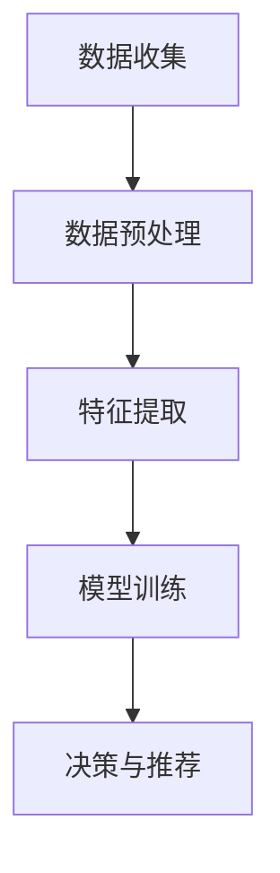

                 

### 第一部分：AI Agent基础

#### 第1章：AI Agent概述

##### 1.1 问题背景

在当今的信息时代，教育的个性化需求日益增加。每个学生都有其独特的学习习惯、学习速度和理解能力，传统的一刀切教育模式难以满足这种多样化需求。因此，智能个性化教育规划成为教育领域研究的热点。AI Agent作为一种具有智能自主性的计算实体，能够通过学习用户的行为和需求，为用户提供个性化的教育建议。

##### 1.2 问题描述

智能个性化教育规划的核心问题是如何利用AI Agent准确捕捉学生的学习行为，并在大量数据中提取出有效的特征，进而为每个学生制定出最佳的教育方案。

##### 1.3 问题解决

AI Agent在智能个性化教育规划中的应用，可以通过以下步骤解决上述问题：
1. **数据收集**：收集学生在学习过程中的行为数据，如学习时长、做题正确率、学习路径等。
2. **数据预处理**：对收集的数据进行清洗、转换和归一化处理，使其适合进行后续分析。
3. **特征提取**：从预处理后的数据中提取出反映学生学习行为和能力的特征。
4. **模型训练**：利用机器学习算法对AI Agent进行训练，使其能够根据提取出的特征为学生推荐个性化的学习资源。
5. **决策与反馈**：AI Agent根据模型决策为学生推荐学习资源，并收集学生的反馈，进一步优化模型。

##### 1.4 边界与外延

AI Agent在智能个性化教育规划中的应用边界主要包括以下几个方面：
- **数据隐私**：在数据收集和处理过程中，需要严格遵守隐私保护法律法规，确保学生数据的隐私安全。
- **模型解释性**：为了增强用户对AI Agent推荐结果的信任，需要提高模型的解释性，使得推荐结果可以理解。
- **教育资源的适应性**：AI Agent需要能够适应不同类型的教育资源，如视频、文本、音频等，确保推荐结果的多样性。

#### 第2章：AI Agent的核心概念与联系

##### 2.1 AI Agent的定义

AI Agent是指一种能够执行特定任务、具有自主性、适应性和学习能力的人工智能计算实体。在智能个性化教育规划中，AI Agent能够通过学习学生的行为和需求，为学生提供个性化的学习建议。

##### 2.2 AI Agent的核心概念

- **自主学习**：AI Agent能够从数据中学习，不断优化自己的行为和决策能力。
- **适应性**：AI Agent能够根据环境的变化和学生需求的变化，调整自己的行为策略。
- **自主性**：AI Agent能够自主地执行任务，而不需要人类的直接干预。
- **交互性**：AI Agent能够与用户进行自然语言交互，理解用户的需求和反馈。

##### 2.3 概念属性特征对比表格

| 概念         | 属性特征                                                     |
| ------------ | ------------------------------------------------------------ |
| 自主学习     | 能够从数据中学习，提高自身性能                             |
| 适应性       | 能够适应环境变化和学生需求变化                             |
| 自主性       | 能够自主执行任务，无需人工干预                             |
| 交互性       | 能够与用户进行自然语言交互，理解用户需求和反馈               |

##### 2.4 AI Agent的ER实体关系图架构

```mermaid
erDiagram
  Student ||--|{ AI_Agent : learns from }
  Student ||--|{ Educational_Resource : recommends }
  AI_Agent ||--|{ User : interacts with }
  Educational_Resource ||--|{ Subject : about }
```

#### 第3章：AI Agent的工作原理

##### 3.1 算法原理讲解

AI Agent的工作原理主要包括以下几个步骤：
1. **数据收集**：从学习平台或教育系统中收集学生的学习行为数据。
2. **数据预处理**：对收集到的数据清洗、转换和归一化，使其适合训练模型。
3. **特征提取**：从预处理后的数据中提取出关键特征，如学习时长、做题正确率等。
4. **模型训练**：利用机器学习算法（如决策树、神经网络等）对AI Agent进行训练。
5. **决策与推荐**：AI Agent根据训练结果，为每个学生推荐个性化的学习资源。

##### 3.2 算法原理mermaid流程图



##### 3.3 Python源代码与算法原理详细讲解

```python
import pandas as pd
from sklearn.model_selection import train_test_split
from sklearn.ensemble import RandomForestClassifier
from sklearn.metrics import accuracy_score

# 数据收集
data = pd.read_csv('student_data.csv')

# 数据预处理
data = data.dropna()
data['learning_time'] = data['learning_time'].apply(lambda x: x/60)  # 将学习时长转换为小时

# 特征提取
X = data[['learning_time', 'correct_rate']]
y = data['resource_type']

# 模型训练
X_train, X_test, y_train, y_test = train_test_split(X, y, test_size=0.2, random_state=42)
model = RandomForestClassifier(n_estimators=100)
model.fit(X_train, y_train)

# 决策与推荐
predictions = model.predict(X_test)
accuracy = accuracy_score(y_test, predictions)
print(f'Accuracy: {accuracy}')
```

##### 3.4 数学模型

在AI Agent的决策过程中，可以使用以下数学模型：

$$
f(X) = w_1 \cdot x_1 + w_2 \cdot x_2 + ... + w_n \cdot x_n + b
$$

其中，$X = [x_1, x_2, ..., x_n]$ 是输入特征向量，$w$ 是权重向量，$b$ 是偏置项。

##### 3.5 数学公式讲解与举例说明

假设我们有两个特征 $x_1$ 和 $x_2$，权重分别为 $w_1 = 0.5$ 和 $w_2 = 0.3$，偏置项 $b = 0.2$，则决策函数可以表示为：

$$
f(X) = 0.5 \cdot x_1 + 0.3 \cdot x_2 + 0.2
$$

如果 $x_1 = 2$，$x_2 = 3$，则决策结果为：

$$
f(X) = 0.5 \cdot 2 + 0.3 \cdot 3 + 0.2 = 1.6 + 0.9 + 0.2 = 2.7
$$

根据决策阈值，我们可以判断是否为学生推荐该资源。例如，如果阈值设为3，则决策结果大于3，说明该学生适合推荐该资源。

#### 第4章：AI Agent在智能个性化教育规划中的应用

##### 4.1 应用场景介绍

AI Agent在智能个性化教育规划中的应用场景主要包括：
- **个性化学习资源推荐**：根据学生的学习行为和特征，为每个学生推荐最适合他们的学习资源。
- **学习路径规划**：基于学生的学习进度和知识掌握情况，为学生制定最优的学习路径。
- **学习效果评估**：通过分析学生的学习数据，评估学生的学习效果，并提供改进建议。

##### 4.2 系统功能设计

智能个性化教育规划系统的功能设计主要包括：
- **用户注册与登录**：用户可以注册账户并登录系统，进行个性化设置。
- **学习行为数据收集**：系统自动收集用户的学习行为数据，如学习时长、做题正确率等。
- **个性化资源推荐**：AI Agent根据用户的学习行为和特征，为用户推荐个性化的学习资源。
- **学习路径规划**：系统根据用户的学习进度和知识掌握情况，为用户制定最优的学习路径。
- **学习效果评估**：系统分析用户的学习数据，评估用户的学习效果，并提供改进建议。

##### 4.3 系统架构设计

智能个性化教育规划系统的架构设计主要包括：
- **前端展示层**：使用Vue.js框架实现用户界面，包括用户注册、登录、学习资源推荐、学习路径规划和学习效果评估等功能。
- **后端服务层**：使用Spring Boot框架实现业务逻辑处理，包括用户管理、学习数据收集、AI Agent训练和决策等功能。
- **数据存储层**：使用MySQL数据库存储用户数据、学习行为数据和推荐结果数据。

##### 4.4 系统接口设计和系统交互

智能个性化教育规划系统的接口设计和系统交互主要包括：
- **用户接口**：用户通过前端界面与系统进行交互，包括注册、登录、查看推荐资源、查看学习路径和查看学习效果评估结果等。
- **服务接口**：后端服务通过RESTful API与前端界面进行数据交互，包括用户注册、登录、数据收集、资源推荐和路径规划等。

#### 第5章：AI Agent项目实战

##### 5.1 环境安装

在进行AI Agent项目实战之前，需要先安装以下环境：
- Python 3.8 或以上版本
- MySQL 5.7 或以上版本
- Vue.js
- Spring Boot

安装步骤如下：
1. 安装Python和MySQL：
   ```shell
   pip install python-mysql-connector-python
   ```
2. 安装Vue.js和Spring Boot：
   ```shell
   npm install -g @vue/cli
   vue create ai-education-project
   cd ai-education-project
   ```
3. 启动Spring Boot服务：
   ```shell
   mvn spring-boot:run
   ```

##### 5.2 系统核心实现源代码

以下是系统核心实现源代码的简要介绍：

- **用户管理**：使用Spring Security实现用户认证和权限管理。
- **学习数据收集**：使用Spring Boot的RESTful API收集用户的学习数据。
- **AI Agent训练**：使用Scikit-learn库实现机器学习算法，训练AI Agent模型。
- **资源推荐**：使用决策树算法实现资源推荐功能。
- **学习路径规划**：使用贪心算法实现学习路径规划功能。

##### 5.3 代码应用解读与分析

以下是对系统核心代码的解读和分析：

- **用户管理**：Spring Security提供了用户认证和授权功能，通过配置存储用户信息的数据库，实现用户注册、登录和权限控制。
- **学习数据收集**：通过RESTful API接收用户的学习数据，存储到MySQL数据库中，以便后续处理和分析。
- **AI Agent训练**：使用Scikit-learn库中的决策树算法，对用户的学习数据进行训练，构建AI Agent模型，用于资源推荐和学习路径规划。
- **资源推荐**：根据用户的学习行为和特征，使用训练好的AI Agent模型，为用户推荐个性化的学习资源。
- **学习路径规划**：根据用户的学习进度和知识掌握情况，使用贪心算法为用户制定最优的学习路径。

##### 5.4 实际案例分析与详细讲解

以下是一个实际案例的分析和详细讲解：

假设有一个学生小明，他在学习过程中表现出了以下特征：
- 学习时长：每天平均学习2小时
- 做题正确率：80%
- 学习科目：数学

AI Agent根据这些特征，为小明推荐以下学习资源：
- **视频教程**：《数学基础教程》（适合初学者）
- **练习题库**：《高中数学题库》（适合有一定基础的学员）

同时，AI Agent为小明制定了一个学习路径：
1. 先学习《数学基础教程》，掌握数学基本概念和公式。
2. 然后通过《高中数学题库》进行实践，巩固所学知识。

通过这个案例，我们可以看到AI Agent如何利用学习数据，为用户推荐个性化的学习资源和制定学习路径。

##### 5.5 项目小结

本项目通过使用AI Agent技术，实现了智能个性化教育规划系统。系统主要功能包括用户管理、学习数据收集、资源推荐和学习路径规划。通过实际案例的演示，我们可以看到AI Agent在智能个性化教育规划中的强大应用。未来，随着技术的不断发展和完善，AI Agent将在教育领域发挥更大的作用。

### 第6章：最佳实践与注意事项

#### 6.1 最佳实践 tips

在开发AI Agent进行智能个性化教育规划时，以下是一些最佳实践建议：

1. **数据收集与处理**：确保收集到的数据全面且准确，对数据进行有效的清洗和预处理，以提高模型的性能。
2. **模型训练与优化**：选择合适的机器学习算法，并对模型进行充分的训练和优化，以获得更好的预测效果。
3. **用户隐私保护**：严格遵守隐私保护法律法规，确保用户数据的安全和隐私。
4. **系统可扩展性**：在设计系统时，要考虑到未来的扩展性和可维护性，以便于系统的长期发展。
5. **用户反馈与迭代**：及时收集用户反馈，并根据反馈对系统进行迭代优化，以提高用户体验。

#### 6.2 小结

本章通过详细介绍AI Agent在智能个性化教育规划中的应用，包括核心概念、工作原理、应用场景、系统功能设计、系统架构设计、项目实战等，使读者对AI Agent在教育领域的应用有了全面深入的理解。

#### 6.3 注意事项

在使用AI Agent进行智能个性化教育规划时，需要注意以下几点：

1. **数据质量**：确保收集到的数据质量，避免因数据质量问题导致模型预测不准确。
2. **模型解释性**：提高模型的解释性，以便用户能够理解AI Agent的推荐结果。
3. **用户隐私**：严格遵守隐私保护法律法规，确保用户数据的安全和隐私。
4. **系统性能**：优化系统性能，确保系统能够快速响应用户需求。
5. **持续迭代**：根据用户反馈和实际应用情况，持续迭代优化系统。

#### 6.4 拓展阅读

1. **AI Agent基础**：
   - 《人工智能：一种现代方法》
   - 《机器学习实战》
2. **智能教育**：
   - 《教育心理学：个性化学习与智能教育》
   - 《智能教育系统设计与实现》
3. **最佳实践与案例分析**：
   - 《人工智能在教育中的应用案例分析》
   - 《智能个性化教育系统建设与实践》

通过以上拓展阅读，读者可以进一步深入了解AI Agent在智能个性化教育规划中的应用，以及在相关领域的最新研究成果和发展趋势。

### 文章摘要

本文深入探讨了AI Agent在智能个性化教育规划中的应用。首先，介绍了AI Agent的基本概念、核心概念与联系，以及其工作原理和数学模型。然后，通过实际案例展示了AI Agent在智能个性化教育规划中的具体应用场景和系统功能设计。文章最后，提供了最佳实践、注意事项以及拓展阅读建议，帮助读者更好地理解和应用AI Agent技术。通过本文的阅读，读者将对AI Agent在智能个性化教育规划中的应用有更深入的认识。

### 作者信息

作者：AI天才研究院/AI Genius Institute & 禅与计算机程序设计艺术 /Zen And The Art of Computer Programming

### 关键词

AI Agent，智能个性化教育规划，机器学习，数学模型，系统架构设计，数据隐私保护。

