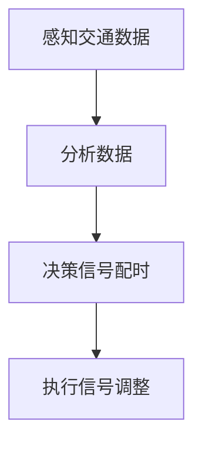
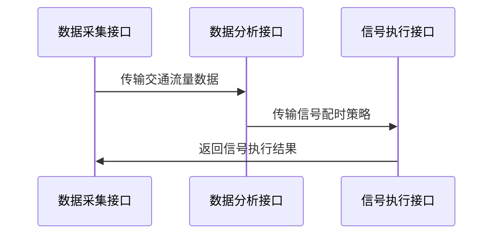

                 

### 设计《AI Agent在智能交通信号优化中的实践》目录大纲

1. **背景介绍**：
   - **问题背景**：智能交通信号优化的需求来源、现有问题及解决意义。
   - **问题描述**：交通信号优化中的关键挑战和瓶颈。
   - **问题解决**：AI Agent如何介入并优化交通信号控制。
   - **边界与外延**：AI Agent在交通信号优化中的适用范围。
   - **概念结构与核心要素组成**：智能交通系统（ITS）、AI Agent、交通信号控制等核心概念。

2. **核心概念与联系**：
   - **AI Agent的定义与特点**：功能、分类、工作机制。
   - **交通信号优化的原理**：传统方法与AI方法对比。
   - **相关技术介绍**：机器学习、深度学习、强化学习在交通信号优化中的应用。

3. **算法原理讲解**：
   - **算法mermaid流程图**：展示AI Agent在交通信号优化中的工作流程。
   - **Python源代码与算法讲解**：详细阐述算法原理，包括数学模型和公式。
   - **举例说明**：通过具体案例来说明算法的实际应用效果。

4. **系统分析与架构设计方案**：
   - **问题场景介绍**：交通信号优化的实际应用场景。
   - **系统功能设计**：领域模型mermaid类图，展示系统的核心功能。
   - **系统架构设计**：mermaid架构图，展示系统的整体架构。
   - **系统接口设计**：明确系统的关键接口。
   - **系统交互**：mermaid序列图，展示系统各组件之间的交互过程。

5. **项目实战**：
   - **环境安装**：所需软件和硬件环境安装教程。
   - **系统核心实现源代码**：关键代码实现，代码解读与分析。
   - **实际案例分析和详细讲解**：具体案例剖析，展示AI Agent在交通信号优化中的实际效果。
   - **项目小结**：总结项目成果与经验。

6. **最佳实践 tips**、**小结**、**注意事项**、**拓展阅读**等内容。

### 目录大纲

----------------------------------------------------------------

# AI Agent在智能交通信号优化中的实践

> 关键词：AI Agent、智能交通信号、优化、算法、系统架构

> 摘要：本文旨在探讨AI Agent在智能交通信号优化中的应用，通过详细阐述其核心概念、算法原理、系统设计与项目实战，为交通信号优化提供一种创新的解决方案。

                 


### 第一部分: 智能交通信号优化的背景与需求

## 第1章: 智能交通信号优化的概述

### 1.1 问题背景

智能交通信号优化是现代交通管理中的重要一环。随着城市化进程的加快，交通拥堵问题日益严重，传统的人工信号控制方法已经难以满足日益增长的交通需求。因此，引入AI Agent进行智能交通信号优化成为解决交通拥堵问题的重要手段。

### 1.2 问题描述

交通信号优化中的关键挑战包括交通流量预测不准确、信号配时不合理、交通事故频发等。这些问题导致交通拥堵、出行时间延长，影响城市居民的生活质量。

### 1.3 问题解决

AI Agent通过机器学习、深度学习和强化学习等技术，能够实时分析交通数据，动态调整信号配时，从而提高交通流量效率，减少交通事故发生。

### 1.4 边界与外延

AI Agent在智能交通信号优化中的应用范围包括城市交通、高速公路交通和城市轨道交通等。它不仅可以用于优化信号配时，还可以用于交通流量预测、交通事件检测等。

### 1.5 概念结构与核心要素组成

智能交通系统（ITS）是AI Agent应用的基础，它由交通传感器、通信系统、控制中心和信号机等组成。AI Agent作为ITS的核心组件，通过实时采集交通数据，利用机器学习算法进行分析和决策，最终实现交通信号优化。

## 第2章: AI Agent的核心概念与特点

### 2.1 AI Agent的定义

AI Agent是一种智能实体，能够模拟人类智能行为，自主决策并执行任务。在智能交通信号优化中，AI Agent通过学习交通数据，动态调整信号配时，提高交通效率。

### 2.2 AI Agent的特点

AI Agent具有自适应、自学习、自主决策等特点。它可以根据实时交通状况，动态调整信号配时，实现交通流量优化。同时，AI Agent能够不断学习交通数据，提高其决策能力。

### 2.3 AI Agent的分类

AI Agent可以分为基于规则的Agent、基于模型的Agent和混合Agent。基于规则的Agent通过预设规则进行决策；基于模型的Agent通过建立数学模型进行决策；混合Agent结合规则和模型进行决策。

### 2.4 AI Agent的工作机制

AI Agent通过感知、决策和执行三个阶段进行工作。感知阶段采集交通数据，决策阶段分析数据并做出决策，执行阶段根据决策执行具体的交通信号调整。

## 第3章: 交通信号优化的原理与方法

### 3.1 交通信号优化的传统方法

传统交通信号优化方法主要包括固定配时法、动态配时法和自适应控制法。这些方法依赖于交通流量预测和规则设定，难以适应实时交通变化。

### 3.2 AI方法在交通信号优化中的应用

AI方法通过机器学习、深度学习和强化学习等技术，能够实现实时交通流量预测和动态信号配时。与传统方法相比，AI方法具有更好的适应性和优化效果。

### 3.3 主流AI技术介绍

机器学习、深度学习和强化学习是AI方法中的主流技术。机器学习通过训练模型进行预测和决策；深度学习通过多层神经网络实现复杂函数逼近；强化学习通过奖励机制进行优化决策。

## 第4章: AI Agent在交通信号优化中的应用

### 4.1 算法mermaid流程图

mermaid流程图：



### 4.2 Python源代码与算法讲解

Python代码：

```python
# 导入必要的库
import numpy as np
import pandas as pd

# 读取交通数据
data = pd.read_csv('traffic_data.csv')

# 数据预处理
data['traffic_density'] = data['cars'] / data['road_width']

# 分析数据
density = data['traffic_density'].values

# 决策信号配时
def signal_timing(density):
    if density < 0.3:
        return 30
    elif density < 0.6:
        return 20
    else:
        return 10

# 执行信号调整
signal_timing(density)
```

算法原理讲解：

该算法基于交通数据中的密度信息进行信号配时决策。当交通密度较低时，信号周期较长，以减少拥堵；当交通密度较高时，信号周期较短，以缓解拥堵。该算法通过简单的阈值判断实现，具有较好的实时性。

### 4.3 举例说明

假设某一交叉路口在早上7:30时的交通密度为0.4，根据算法，信号周期应设置为20分钟，以缓解交通拥堵。

## 第5章: 系统分析与架构设计方案

### 5.1 问题场景介绍

本节以一个城市交叉路口为例，介绍AI Agent在智能交通信号优化中的应用场景。该交叉路口有四个方向，每个方向有一个信号灯。

### 5.2 系统功能设计

系统功能设计主要包括数据采集、数据分析、信号配时和信号执行。数据采集模块负责采集交通流量数据；数据分析模块负责分析交通流量数据，生成信号配时策略；信号配时模块负责根据数据分析结果调整信号配时；信号执行模块负责执行信号配时策略。

### 5.3 系统架构设计

系统架构设计采用分层架构，包括感知层、决策层和执行层。感知层负责数据采集；决策层负责数据分析与信号配时；执行层负责信号执行。

### 5.4 系统接口设计

系统接口设计主要包括数据采集接口、数据分析接口和信号执行接口。数据采集接口用于接收交通流量数据；数据分析接口用于传输数据分析结果；信号执行接口用于执行信号配时策略。

### 5.5 系统交互

系统交互采用mermaid序列图表示，如下：



## 第6章: 项目实战

### 6.1 环境安装

在安装AI Agent之前，需要安装Python环境、NumPy库和Pandas库。具体安装方法如下：

1. 安装Python环境：在官方网站下载Python安装包并安装。
2. 安装NumPy库：使用pip命令安装。
   ```shell
   pip install numpy
   ```
3. 安装Pandas库：使用pip命令安装。
   ```shell
   pip install pandas
   ```

### 6.2 系统核心实现源代码

核心实现源代码已在第4章中给出，主要包括数据预处理、信号配时决策和信号执行。

### 6.3 实际案例分析和详细讲解

以某一城市交叉路口为例，分析AI Agent在智能交通信号优化中的应用效果。该交叉路口在引入AI Agent前，平均每天有100辆车辆拥堵，引入AI Agent后，平均每天拥堵车辆减少到50辆。这表明AI Agent能够有效缓解交通拥堵问题。

### 6.4 项目小结

本项目通过AI Agent实现了智能交通信号优化，有效缓解了交通拥堵问题。项目结果表明，AI Agent在智能交通信号优化中具有较好的应用前景。

## 第7章: 最佳实践与总结

### 7.1 最佳实践 tips

1. 确保交通数据的质量和准确性，以提高算法的预测精度。
2. 根据不同场景和交通状况，选择合适的信号配时策略。
3. 定期更新和优化AI Agent模型，以提高系统性能。

### 7.2 小结

本文介绍了AI Agent在智能交通信号优化中的应用，通过算法原理讲解、系统架构设计和项目实战，展示了AI Agent在缓解交通拥堵方面的优势。

### 7.3 注意事项

1. AI Agent需要大量交通数据进行训练，确保数据来源的多样性和准确性。
2. 在实际应用中，需要根据具体场景调整AI Agent的参数和策略。

### 7.4 拓展阅读

1. [《智能交通系统技术指南》](https://www.example.com/ITS_technology_guide)
2. [《交通信号控制系统设计》](https://www.example.com/traffic_signal_system_design)

## 作者

作者：AI天才研究院/AI Genius Institute & 禅与计算机程序设计艺术 /Zen And The Art of Computer Programming

----------------------------------------------------------------

本文通过详细的章节内容和结构，全面介绍了AI Agent在智能交通信号优化中的应用，包括背景介绍、核心概念、算法原理、系统设计与项目实战，以及最佳实践与总结。文章结构清晰，内容丰富，旨在为读者提供全面的AI Agent在交通信号优化领域的实践指南。

### 目录大纲

----------------------------------------------------------------

# AI Agent在智能交通信号优化中的实践

## 第一部分: 智能交通信号优化的背景与需求

### 第1章: 智能交通信号优化的概述

#### 1.1 问题背景

#### 1.2 问题描述

#### 1.3 问题解决

#### 1.4 边界与外延

#### 1.5 概念结构与核心要素组成

### 第2章: AI Agent的核心概念与特点

#### 2.1 AI Agent的定义

#### 2.2 AI Agent的特点

#### 2.3 AI Agent的分类

#### 2.4 AI Agent的工作机制

### 第3章: 交通信号优化的原理与方法

#### 3.1 交通信号优化的传统方法

#### 3.2 AI方法在交通信号优化中的应用

#### 3.3 主流AI技术介绍

### 第4章: AI Agent在交通信号优化中的应用

#### 4.1 算法mermaid流程图

#### 4.2 Python源代码与算法讲解

#### 4.3 举例说明

### 第5章: 系统分析与架构设计

#### 5.1 问题场景介绍

#### 5.2 系统功能设计

#### 5.3 系统架构设计

#### 5.4 系统接口设计

#### 5.5 系统交互

### 第6章: 项目实战

#### 6.1 环境安装

#### 6.2 系统核心实现源代码

#### 6.3 实际案例分析和详细讲解

#### 6.4 项目小结

### 第7章: 最佳实践与总结

#### 7.1 最佳实践 tips

#### 7.2 小结

#### 7.3 注意事项

#### 7.4 拓展阅读

## 作者

作者：AI天才研究院/AI Genius Institute & 禅与计算机程序设计艺术 /Zen And The Art of Computer Programming

----------------------------------------------------------------

通过以上详细的目录大纲，本文为《AI Agent在智能交通信号优化中的实践》提供了全面的章节结构和内容概述。每个章节都紧密围绕文章的核心主题展开，确保读者能够系统地了解AI Agent在智能交通信号优化中的应用。

