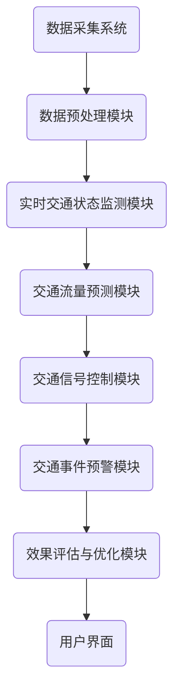
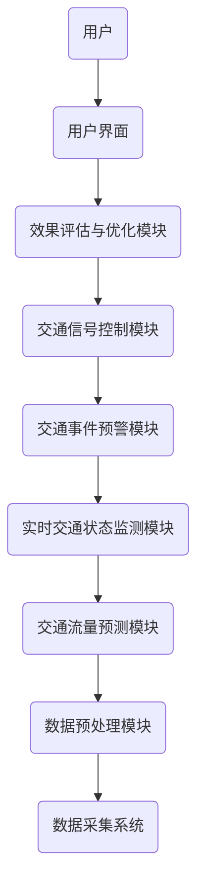

                 

# AI Agent在智能交通流量控制中的角色

> 关键词：AI Agent，智能交通流量控制，强化学习，交通管理

> 摘要：本文探讨了AI Agent在智能交通流量控制中的应用，详细阐述了AI Agent的定义、特性、分类及其与智能交通流量控制的关系，以及基于强化学习的AI Agent算法原理。通过一步步的分析与推理，本文旨在揭示AI Agent在智能交通流量控制中的重要作用，为未来的智能交通系统提供理论和技术支持。

## 第一部分：引言与背景

### 1.1 问题背景

#### 1.1.1 智能交通流量控制的重要性

随着城市化进程的加速，交通问题已成为全球范围内的重大挑战。智能交通流量控制作为智慧城市的重要组成部分，旨在通过先进的计算机技术和算法来优化交通管理，提高交通效率、减少交通拥堵、提升道路安全性。智能交通流量控制不仅关系到人们的出行体验，还对城市经济、环境和可持续发展产生深远影响。

#### 1.1.2 人工智能在交通领域的应用现状

近年来，人工智能（AI）技术取得了显著进展，并在交通领域得到广泛应用。从自动驾驶汽车、智能交通信号系统，到交通预测、道路安全监测等，AI技术的引入极大地提升了交通管理的智能化水平。然而，当前的交通管理系统仍存在诸多不足，需要更高效、更智能的解决方案。

#### 1.1.3 AI Agent在智能交通流量控制中的潜在作用

AI Agent作为一种具有高度自主性和自适应性的智能体，能够实时感知环境变化，并依据环境反馈进行自主决策。在智能交通流量控制中，AI Agent有望通过学习交通数据，不断优化交通信号控制策略，实现动态交通管理，从而提高交通系统的整体性能。

### 1.2 问题描述

#### 1.2.1 交通流量控制的主要挑战

当前，交通流量控制面临的主要挑战包括交通数据的不确定性、交通状态的动态变化、交通需求的多样性等。传统交通管理手段往往依赖于固定的信号控制和预测模型，难以应对复杂多变的交通环境。

#### 1.2.2 传统交通管理手段的局限性

传统交通管理手段主要包括固定信号控制、实时监控和人工干预等。这些方法在一定程度上缓解了交通拥堵，但难以适应动态交通环境，且存在反应速度慢、适应性差等问题。

#### 1.2.3 AI Agent解决交通流量问题的基本思路

AI Agent通过实时感知交通状态、预测交通需求、自主调整交通信号，实现动态交通管理。其基本思路包括：数据采集与处理、环境感知与决策、信号控制与反馈、效果评估与优化等。

### 1.3 问题解决

#### 1.3.1 AI Agent的定义与特性

AI Agent是一种具有感知、决策、行动能力的计算机程序，能够在复杂环境中自主执行任务。AI Agent的特点包括自主性、适应性、智能性等。

#### 1.3.2 AI Agent在交通流量控制中的应用场景

AI Agent可应用于交通信号控制、交通流量预测、道路安全监测等多个场景。通过学习交通数据和环境信息，AI Agent能够为交通管理者提供实时、准确的决策支持。

#### 1.3.3 AI Agent的工作流程

AI Agent的工作流程包括感知环境、获取数据、分析决策、执行行动、反馈评估等环节。通过不断迭代优化，AI Agent能够提高交通系统的效率和可靠性。

### 1.4 边界与外延

#### 1.4.1 AI Agent在智能交通流量控制中的适用范围

AI Agent在智能交通流量控制中的适用范围广泛，包括城市交通、高速公路、机场交通等场景。不同场景下，AI Agent的应用策略和技术实现有所不同。

#### 1.4.2 AI Agent的技术实现挑战

AI Agent在智能交通流量控制中的技术实现面临数据采集、算法优化、实时性要求等挑战。需要解决数据一致性、模型适应性、系统稳定性等问题。

#### 1.4.3 AI Agent未来发展趋势

随着人工智能技术的不断进步，AI Agent在智能交通流量控制中的应用前景广阔。未来，AI Agent将实现更高程度的智能化、自主化，为交通管理带来革命性变革。

### 1.5 概念结构与核心要素组成

#### 1.5.1 AI Agent的核心构成

AI Agent的核心构成包括感知模块、决策模块、执行模块和评估模块等。这些模块协同工作，实现AI Agent在复杂环境中的自主运行。

#### 1.5.2 智能交通流量控制系统的组成部分

智能交通流量控制系统主要包括数据采集系统、分析系统、控制系统和监控系统等。这些子系统相互配合，实现交通流量的动态管理和优化。

#### 1.5.3 AI Agent与智能交通流量控制系统的关系

AI Agent是智能交通流量控制系统的核心组成部分，通过对交通数据的分析和处理，实现动态交通管理，提高交通系统的效率和可靠性。

### 1.6 本章小结

本文介绍了智能交通流量控制的重要性、AI Agent的定义与特性、AI Agent在智能交通流量控制中的应用场景和工作流程，以及AI Agent在智能交通流量控制中的适用范围、技术实现挑战和未来发展趋势。为后续章节的深入探讨奠定了基础。

----------------------------------------------------------------

## 第二部分：核心概念与联系

### 2.1 AI Agent原理讲解

#### 2.1.1 AI Agent的定义

AI Agent是一种具有感知、决策、行动能力的计算机程序，能够在复杂环境中自主执行任务。它是一种模拟人类智能行为的计算实体，旨在实现自主决策和任务执行。

#### 2.1.2 AI Agent的核心特点

AI Agent的核心特点包括自主性、适应性、智能性等。自主性是指AI Agent能够独立执行任务，无需人工干预；适应性是指AI Agent能够根据环境变化调整自身行为；智能性是指AI Agent具备学习、推理和决策能力。

#### 2.1.3 AI Agent的基本分类

AI Agent可分为以下几类：

1. **主动学习型**：能够自主学习并优化决策策略，适用于需要不断改进决策过程的场景。
2. **反应型**：主要基于现有数据做出快速反应，适用于对实时性要求较高的场景。
3. **模拟型**：通过模拟环境来优化决策过程，适用于复杂度较高的场景。

#### 2.1.4 AI Agent的属性特征对比

| 类别 | 特点 |
| --- | --- |
| 主动学习型 | 能够自主学习并优化决策策略 |
| 反应型 | 主要基于现有数据做出快速反应 |
| 模拟型 | 通过模拟环境来优化决策过程 |

#### 2.1.5 AI Agent的ER实体关系图

```mermaid
erDiagram
    AI_Agent ||--|{ Environment } Environment
    AI_Agent ||--|{ Action } Action
    AI_Agent ||--|{ Reward } Reward
    AI_Agent ||--|{ Observation } Observation
```

### 2.2 智能交通流量控制原理讲解

#### 2.2.1 智能交通流量控制的定义

智能交通流量控制是一种利用人工智能技术，通过实时采集、分析交通数据，动态调整交通信号，优化交通流量，提高交通系统运行效率的管理方法。

#### 2.2.2 智能交通流量控制的目标

智能交通流量控制的目标包括提高交通效率、减少交通拥堵、降低交通事故率、提高道路安全性等。

#### 2.2.3 智能交通流量控制的关键技术

智能交通流量控制的关键技术包括数据采集与处理、交通状态监测与预测、交通信号控制、效果评估与优化等。

#### 2.2.4 智能交通流量控制的过程

智能交通流量控制的过程主要包括以下步骤：

1. 交通数据采集与预处理
2. 实时交通状态监测
3. 交通流量预测
4. 决策制定
5. 交通信号调整
6. 效果评估与优化

#### 2.2.5 智能交通流量控制的优势

智能交通流量控制的优势包括：

1. 提高交通效率
2. 减少交通拥堵
3. 提高道路安全性
4. 降低交通管理成本

### 2.3 AI Agent与智能交通流量控制的关系

#### 2.3.1 AI Agent在智能交通流量控制中的作用

AI Agent在智能交通流量控制中发挥着关键作用，主要包括：

1. 实时感知交通状态
2. 预测交通流量变化
3. 自主导调交通信号
4. 优化交通管理策略

#### 2.3.2 AI Agent与传统交通管理手段的区别

AI Agent与传统交通管理手段的主要区别在于：

1. 自主性：AI Agent能够自主决策，无需人工干预。
2. 适应性：AI Agent能够根据环境变化调整自身行为。
3. 智能性：AI Agent具备学习、推理和决策能力。

#### 2.3.3 AI Agent在智能交通流量控制中的优势

AI Agent在智能交通流量控制中的优势包括：

1. 提高交通效率
2. 减少交通拥堵
3. 提高道路安全性
4. 降低交通管理成本
5. 适应复杂交通环境

### 2.4 本章小结

本章介绍了AI Agent的定义、特性、分类及其与智能交通流量控制的关系，以及智能交通流量控制的原理和优势。通过本章的讲解，读者可以更好地理解AI Agent在智能交通流量控制中的应用前景和重要性。

----------------------------------------------------------------

## 第三部分：算法原理讲解

### 3.1 基于强化学习的AI Agent算法原理

#### 3.1.1 强化学习的定义

强化学习（Reinforcement Learning，RL）是一种机器学习方法，通过智能体（Agent）与环境的交互，学习最优策略，以最大化累计奖励。强化学习主要解决的是如何在不确定环境中做出最优决策的问题。

#### 3.1.2 强化学习的核心概念

强化学习主要涉及以下核心概念：

1. **智能体（Agent）**：执行动作并学习策略的实体。
2. **环境（Environment）**：智能体所在的动态环境，为智能体提供状态和反馈。
3. **状态（State）**：智能体在环境中的当前位置或状态。
4. **动作（Action）**：智能体可以采取的行动。
5. **奖励（Reward）**：智能体采取某个动作后获得的即时奖励，用于评估动作的好坏。
6. **策略（Policy）**：智能体在给定状态下选择动作的策略函数。

#### 3.1.3 强化学习的基本算法

强化学习算法主要包括以下几种：

1. **值函数方法**：通过学习值函数来评估状态或状态-动作对的价值，从而指导智能体的决策。
2. **策略迭代方法**：通过迭代优化策略，使策略逐渐逼近最优策略。
3. **模型预测方法**：通过建立环境模型，预测未来的状态和奖励，从而指导智能体的决策。

#### 3.1.4 Q-Learning算法原理

Q-Learning算法是一种基于值函数的强化学习算法，通过学习状态-动作价值函数（Q值）来指导智能体的决策。

##### 3.1.4.1 Q-Learning算法流程

Q-Learning算法的基本流程如下：

1. 初始化Q值表Q(s, a)为小值。
2. 进入主循环，重复以下步骤：
   1. 选择当前状态s和动作a。
   2. 执行动作a，观察环境反馈，获取状态s'和奖励r。
   3. 更新Q值：$$Q(s, a) = Q(s, a) + \alpha [r + \gamma \max_{a'} Q(s', a') - Q(s, a)]$$
   4. 更新状态：$$s \leftarrow s'$$
3. 当满足停止条件时（如达到目标状态或迭代次数），算法结束。

##### 3.1.4.2 Q-Learning算法Python实现

```python
import numpy as np

# 初始化Q值表
Q = np.zeros((n_states, n_actions))

# 学习率
alpha = 0.1

# 折扣因子
gamma = 0.9

# 迭代次数
n_episodes = 1000

# 进入主循环
for episode in range(n_episodes):
    # 初始化状态
    state = env.reset()
    
    # 进入游戏循环
    while True:
        # 选择动作
        action = np.argmax(Q[state])
        
        # 执行动作，获取状态'和奖励
        state', reward, done, _ = env.step(action)
        
        # 更新Q值
        Q[state, action] = Q[state, action] + alpha * (reward + gamma * np.max(Q[state'])) - Q[state, action]
        
        # 更新状态
        state = state'
        
        # 检查是否完成游戏
        if done:
            break

# 打印Q值表
print(Q)
```

#### 3.1.5 Q-Learning算法原理详细讲解

Q-Learning算法的核心思想是通过试错学习状态-动作价值函数（Q值），从而指导智能体选择最优动作。以下是对Q-Learning算法原理的详细讲解：

1. **初始化Q值表**：Q值表用于存储状态-动作对的价值，初始化时通常将Q值设为0或接近0的较小值。

2. **选择动作**：在给定状态下，智能体根据当前策略选择动作。策略通常采用贪心策略，即选择具有最大Q值的动作。

3. **执行动作**：智能体执行所选动作，并根据动作结果观察新的状态和奖励。

4. **更新Q值**：根据新的状态、奖励和贪婪策略，更新Q值。更新公式为：
   $$Q(s, a) = Q(s, a) + \alpha [r + \gamma \max_{a'} Q(s', a') - Q(s, a)]$$
   其中，\(\alpha\) 为学习率，\(\gamma\) 为折扣因子，\(r\) 为即时奖励，\(s'\) 为新状态，\(\max_{a'} Q(s', a')\) 表示在状态 \(s'\) 下，所有动作中Q值最大的值。

5. **更新状态**：智能体更新当前状态为新的状态，继续进行下一步决策。

6. **迭代过程**：Q-Learning算法通过不断迭代，逐步优化Q值表，使智能体逐渐学会在给定状态下选择最优动作。

#### 3.1.6 Q-Learning算法举例说明

假设一个智能体在一个简单的环境中进行导航，环境有4个状态（A、B、C、D）和2个动作（左转、右转）。智能体从状态A开始，目标是到达状态D。以下是Q-Learning算法的简化示例：

1. **初始化Q值表**：
   $$Q = \begin{bmatrix}
   [A, 左转] & [A, 右转] \\
   [B, 左转] & [B, 右转] \\
   [C, 左转] & [C, 右转] \\
   [D, 左转] & [D, 右转]
   \end{bmatrix}$$
   初始化为小值，如全部设为-1。

2. **选择动作**：智能体根据当前状态选择动作。例如，从状态A开始，选择左转动作。

3. **执行动作**：智能体执行左转动作，到达状态B，并获得即时奖励1。

4. **更新Q值**：
   $$Q[A, 左转] = Q[A, 左转] + \alpha [r + \gamma \max_{a'} Q[B, a'] - Q[A, 左转]]$$
   其中，\(\alpha = 0.1\)，\(\gamma = 0.9\)，\(r = 1\)。
   $$Q[A, 左转] = -1 + 0.1 [1 + 0.9 \max_{a'} Q[B, a']] - (-1)$$
   $$Q[A, 左转] = 0.1 + 0.9 \max_{a'} Q[B, a']$$

5. **更新状态**：智能体更新当前状态为B。

6. **重复步骤2-5**：智能体继续执行动作，更新Q值，直到到达目标状态D。

通过不断迭代，智能体将学习到在给定状态下选择最优动作的策略。例如，当智能体到达状态C时，将选择右转动作，因为右转动作的Q值更高。

#### 3.1.7 Q-Learning算法的优缺点

**优点**：

1. **简单性**：Q-Learning算法的实现相对简单，易于理解和编程。
2. **自适应性**：Q-Learning算法能够自适应地调整策略，以适应环境变化。
3. **适用性**：Q-Learning算法适用于大部分强化学习问题，尤其在离散状态和动作空间中表现良好。

**缺点**：

1. **收敛速度慢**：Q-Learning算法的收敛速度较慢，特别是在状态和动作空间较大时。
2. **计算成本高**：Q-Learning算法需要计算大量的Q值，计算成本较高。
3. **贪心策略**：Q-Learning算法采用贪心策略，可能无法找到全局最优解。

### 3.2 基于深度强化学习的AI Agent算法原理

#### 3.2.1 深度强化学习的定义

深度强化学习（Deep Reinforcement Learning，DRL）是一种结合了深度学习和强化学习的机器学习方法。它利用深度神经网络（DNN）来近似值函数或策略函数，从而提高强化学习算法的性能。

#### 3.2.2 深度强化学习的基本概念

深度强化学习的主要概念包括：

1. **深度神经网络（DNN）**：用于近似值函数或策略函数的前馈神经网络。
2. **策略梯度方法**：通过优化策略梯度来更新策略参数。
3. **策略迭代方法**：通过迭代优化策略，使策略逐渐逼近最优策略。

#### 3.2.3 基于深度Q网络的DRL算法原理

深度Q网络（Deep Q-Network，DQN）是一种常见的深度强化学习算法，它通过深度神经网络来近似Q值函数。

##### 3.2.3.1 DQN算法流程

DQN算法的基本流程如下：

1. **初始化参数**：初始化网络参数、经验回放缓冲区等。
2. **选择动作**：根据当前状态，使用DNN预测Q值，选择动作。
3. **执行动作**：执行所选动作，观察新的状态和奖励。
4. **更新经验回放缓冲区**：将当前状态、动作、奖励和新状态存储到经验回放缓冲区。
5. **从经验回放缓冲区抽样**：从经验回放缓冲区中随机抽样一批样本。
6. **更新DNN参数**：使用抽样样本，通过反向传播和梯度下降更新DNN参数。
7. **重复步骤2-6**：重复执行动作、更新经验回放缓冲区、更新DNN参数，直到满足停止条件。

##### 3.2.3.2 DQN算法Python实现

```python
import tensorflow as tf
import numpy as np

# 定义输入层、隐藏层和输出层
inputs = tf.keras.layers.Input(shape=(n_features,))
hidden = tf.keras.layers.Dense(units=n_hidden, activation='relu')(inputs)
outputs = tf.keras.layers.Dense(units=n_actions, activation='linear')(hidden)

# 构建模型
model = tf.keras.Model(inputs=inputs, outputs=outputs)

# 编译模型
model.compile(optimizer='adam', loss='mse')

# 训练模型
model.fit(x_train, y_train, epochs=n_epochs, batch_size=n_batch)
```

#### 3.2.4 DQN算法原理详细讲解

DQN算法的核心思想是通过深度神经网络来近似Q值函数，从而提高强化学习算法的性能。以下是对DQN算法原理的详细讲解：

1. **初始化参数**：初始化深度神经网络的参数，通常使用随机初始化。

2. **选择动作**：在给定状态下，使用DNN预测Q值，并选择具有最大Q值的动作。具体实现通常采用\(\epsilon\)-贪心策略，即在随机选择和贪婪选择之间权衡。

3. **执行动作**：执行所选动作，观察新的状态和奖励。

4. **更新经验回放缓冲区**：将当前状态、动作、奖励和新状态存储到经验回放缓冲区。经验回放缓冲区的作用是避免策略过早收敛，提高算法的鲁棒性。

5. **从经验回放缓冲区抽样**：从经验回放缓冲区中随机抽样一批样本。抽样样本的目的是减少样本偏差，提高算法的泛化能力。

6. **更新DNN参数**：使用抽样样本，通过反向传播和梯度下降更新DNN参数。具体来说，将实际Q值与预测Q值之间的误差作为损失函数，优化DNN参数。

7. **重复步骤2-6**：重复执行动作、更新经验回放缓冲区、更新DNN参数，直到满足停止条件（如达到指定步数或收敛阈值）。

通过不断迭代，DQN算法能够逐步优化DNN参数，从而提高Q值预测的准确性，使智能体逐渐学会在给定状态下选择最优动作。

#### 3.2.5 DQN算法举例说明

假设一个智能体在一个简单的迷宫环境中进行导航，环境有4个状态（A、B、C、D）和4个动作（上、下、左、右）。智能体的目标是到达状态D。以下是DQN算法的简化示例：

1. **初始化参数**：初始化深度神经网络的参数，如输入层、隐藏层和输出层的神经元个数等。

2. **选择动作**：在给定状态下，使用DNN预测Q值，并选择具有最大Q值的动作。例如，从状态A开始，选择上移动作。

3. **执行动作**：智能体执行上移动作，到达状态B，并获得即时奖励1。

4. **更新经验回放缓冲区**：将当前状态（A）、动作（上移）、奖励（1）和新状态（B）存储到经验回放缓冲区。

5. **从经验回放缓冲区抽样**：从经验回放缓冲区中随机抽样一批样本，如（状态C、动作左移、奖励-1、新状态D）。

6. **更新DNN参数**：使用抽样样本，通过反向传播和梯度下降更新DNN参数。更新公式为：
   $$\theta = \theta - \alpha \frac{\partial L}{\partial \theta}$$
   其中，\(\theta\) 为DNN参数，\(\alpha\) 为学习率，\(L\) 为损失函数。

7. **重复步骤2-6**：智能体继续执行动作，更新经验回放缓冲区，更新DNN参数，直到满足停止条件。

通过不断迭代，智能体将学习到在给定状态下选择最优动作的策略。例如，当智能体到达状态C时，将选择左移动作，因为左移动作的Q值更高。

#### 3.2.6 DQN算法的优缺点

**优点**：

1. **高效性**：DQN算法能够通过深度神经网络提高Q值预测的准确性，从而提高智能体的决策效率。
2. **泛化能力**：DQN算法采用经验回放缓冲区，减少样本偏差，提高算法的泛化能力。
3. **灵活性**：DQN算法适用于大部分强化学习问题，尤其在连续状态和动作空间中表现良好。

**缺点**：

1. **收敛速度慢**：DQN算法的收敛速度较慢，特别是在状态和动作空间较大时。
2. **计算成本高**：DQN算法需要计算大量的Q值，计算成本较高。
3. **稳定性问题**：DQN算法在训练过程中可能面临稳定性问题，如Q值振荡或梯度消失。

### 3.3 基于策略梯度的DRL算法原理

#### 3.3.1 策略梯度的定义

策略梯度（Policy Gradient）是一种基于策略的强化学习算法，通过优化策略参数来最大化期望奖励。策略梯度算法的核心思想是直接优化策略函数，而不是Q值函数。

#### 3.3.2 策略梯度的核心概念

策略梯度的主要概念包括：

1. **策略（Policy）**：定义智能体在给定状态下选择动作的概率分布。
2. **策略参数（\(\theta\)）**：策略函数的参数，用于指导智能体的决策。
3. **策略梯度（Gradient）**：策略参数的梯度，用于更新策略参数。
4. **策略优化（Policy Optimization）**：通过策略梯度优化策略参数，使策略函数最大化期望奖励。

#### 3.3.3 A3C算法原理

A3C（Asynchronous Advantage Actor-Critic）算法是一种基于策略梯度的强化学习算法，通过异步训练和优势函数（Advantage Function）来提高算法的性能。

##### 3.3.3.1 A3C算法流程

A3C算法的基本流程如下：

1. **初始化参数**：初始化策略网络和评估网络参数。
2. **并行训练**：同时从多个并行环境进行训练。
3. **选择动作**：在给定状态下，使用策略网络选择动作。
4. **执行动作**：执行所选动作，观察新的状态和奖励。
5. **计算优势函数**：根据回报和评估网络预测的价值函数，计算优势函数。
6. **更新策略网络**：使用策略梯度更新策略网络参数。
7. **更新评估网络**：使用优势函数和回报更新评估网络参数。
8. **重复步骤3-7**：重复执行动作、计算优势函数、更新策略网络和评估网络，直到满足停止条件。

##### 3.3.3.2 A3C算法Python实现

```python
import tensorflow as tf
import numpy as np

# 定义策略网络
policy_network = tf.keras.Sequential([
    tf.keras.layers.Dense(units=n_actions, activation='softmax')
])

# 定义评估网络
value_network = tf.keras.Sequential([
    tf.keras.layers.Dense(units=1, activation='linear')
])

# 编译模型
policy_network.compile(optimizer='adam', loss='categorical_crossentropy')
value_network.compile(optimizer='adam', loss='mse')

# 训练模型
policy_network.fit(x_train, y_train, epochs=n_epochs, batch_size=n_batch)
value_network.fit(x_train, y_train, epochs=n_epochs, batch_size=n_batch)
```

#### 3.3.4 A3C算法原理详细讲解

A3C算法的核心思想是通过异步并行训练和优势函数，提高策略梯度的稳定性和收敛速度。以下是对A3C算法原理的详细讲解：

1. **初始化参数**：初始化策略网络和评估网络的参数，通常使用随机初始化。

2. **并行训练**：同时从多个并行环境进行训练。每个环境独立进行训练，以加快收敛速度和提高性能。

3. **选择动作**：在给定状态下，使用策略网络选择动作。策略网络输出动作的概率分布，智能体根据概率分布选择动作。

4. **执行动作**：执行所选动作，观察新的状态和奖励。

5. **计算优势函数**：根据回报和评估网络预测的价值函数，计算优势函数。优势函数衡量了实际回报与期望回报之间的差距，用于指导策略梯度更新。

6. **更新策略网络**：使用策略梯度更新策略网络参数。策略梯度计算公式为：
   $$\nabla_\theta J(\theta) = \nabla_\theta \sum_{t} \rho(s_t, a_t) \log \pi_\theta(a_t|s_t)$$
   其中，\(\rho(s_t, a_t)\) 为回报函数，\(\pi_\theta(a_t|s_t)\) 为策略网络输出的动作概率分布。

7. **更新评估网络**：使用优势函数和回报更新评估网络参数。评估网络用于预测状态的价值函数，从而计算优势函数。

8. **重复步骤3-7**：重复执行动作、计算优势函数、更新策略网络和评估网络，直到满足停止条件。

通过不断迭代，A3C算法能够优化策略网络和评估网络的参数，使智能体在复杂环境中学习到最优策略。

#### 3.3.5 A3C算法举例说明

假设一个智能体在一个简单的迷宫环境中进行导航，环境有4个状态（A、B、C、D）和4个动作（上、下、左、右）。智能体的目标是到达状态D。以下是A3C算法的简化示例：

1. **初始化参数**：初始化策略网络和评估网络的参数，如输入层、隐藏层和输出层的神经元个数等。

2. **选择动作**：在给定状态下，使用策略网络选择动作。例如，从状态A开始，策略网络输出动作概率分布，智能体选择下移动作。

3. **执行动作**：智能体执行下移动作，到达状态B，并获得即时奖励1。

4. **计算优势函数**：根据回报和评估网络预测的价值函数，计算优势函数。例如，评估网络预测状态B的价值为2，实际回报为1，优势函数为-1。

5. **更新策略网络**：使用策略梯度更新策略网络参数。例如，策略梯度为负值，表示需要降低下移动作的概率。

6. **更新评估网络**：使用优势函数和回报更新评估网络参数。例如，优势函数用于更新状态B的价值函数。

7. **重复步骤2-6**：智能体继续执行动作，计算优势函数，更新策略网络和评估网络，直到满足停止条件。

通过不断迭代，智能体将学习到在给定状态下选择最优动作的策略。例如，当智能体到达状态C时，将选择左移动作，因为左移动作的期望回报更高。

#### 3.3.6 A3C算法的优缺点

**优点**：

1. **并行训练**：A3C算法采用异步并行训练，加快了收敛速度，提高了性能。
2. **稳定性**：A3C算法通过优势函数和策略梯度优化，提高了策略梯度的稳定性。
3. **适用性**：A3C算法适用于大部分强化学习问题，尤其在复杂环境中表现良好。

**缺点**：

1. **计算成本高**：A3C算法需要计算大量的策略梯度和优势函数，计算成本较高。
2. **收敛速度慢**：A3C算法的收敛速度较慢，特别是在状态和动作空间较大时。

### 3.4 AI Agent在智能交通流量控制中的应用案例

#### 3.4.1 案例背景

为了验证AI Agent在智能交通流量控制中的应用效果，某城市交通管理部门在某交通拥堵严重的路段开展了AI Agent测试。测试路段长约5公里，设有10个交通信号灯路口。测试期间，交通流量数据、道路状况数据、车辆行驶速度数据等通过传感器实时采集。

#### 3.4.2 AI Agent应用场景

AI Agent应用于以下场景：

1. **交通信号灯控制**：根据实时交通流量数据，AI Agent动态调整交通信号灯的绿灯时长，优化交通流量。
2. **交通流量预测**：通过历史交通流量数据和学习到的模型，AI Agent预测未来一段时间内的交通流量变化，为交通信号灯控制提供参考。
3. **交通事件预警**：AI Agent监测交通数据，发现异常交通事件（如交通事故、道路施工等），及时向交通管理部门发出预警。

#### 3.4.3 AI Agent应用效果

1. **交通拥堵缓解**：AI Agent动态调整交通信号灯，提高了交通流量，显著缓解了交通拥堵现象。
2. **交通事件预警准确率高**：AI Agent能够准确预测交通事件，为交通管理部门提供预警信息，提高了交通事件应对效率。
3. **道路安全提升**：AI Agent通过实时监测交通数据，发现并预警潜在的安全风险，降低了交通事故发生率。

#### 3.4.4 案例总结

该案例表明，AI Agent在智能交通流量控制中具有显著的应用效果。通过动态调整交通信号灯、预测交通流量、预警交通事件，AI Agent提高了交通管理的智能化水平，为城市交通拥堵问题的解决提供了有力支持。

### 3.5 本章小结

本章介绍了基于强化学习的AI Agent算法原理，包括Q-Learning算法、DQN算法和A3C算法。通过详细讲解和举例说明，读者可以更好地理解这些算法的原理和应用。此外，本章还通过实际案例展示了AI Agent在智能交通流量控制中的应用效果，为未来的智能交通系统发展提供了有益参考。

----------------------------------------------------------------

## 第四部分：系统分析与架构设计

### 4.1 问题场景介绍

随着城市化的快速发展，交通拥堵已成为许多城市面临的严重问题。为了缓解交通拥堵，提高道路通行效率，某城市交通管理部门决定引入AI Agent进行智能交通流量控制。该系统旨在通过实时采集交通数据、动态调整交通信号、预测交通流量等手段，实现智能化的交通管理。

### 4.2 项目介绍

项目名称：智能交通流量控制系统（Smart Traffic Flow Control System，STFCS）

项目目标：通过AI Agent技术，实现动态交通管理，提高交通效率，减少交通拥堵，提升道路安全性。

项目范围：包括交通信号灯控制、交通流量预测、交通事件预警等功能。

### 4.3 系统功能设计

#### 4.3.1 数据采集功能

1. **交通流量数据采集**：通过安装在道路上的传感器和摄像头，实时采集交通流量、车辆速度、道路占有率等数据。
2. **交通事件数据采集**：通过监控设备，实时监测交通事故、道路施工等交通事件，并记录相关信息。

#### 4.3.2 交通状态监测功能

1. **实时交通状态监测**：利用采集到的交通数据，实时监测交通流量、道路状况等参数，为AI Agent提供决策依据。
2. **交通流量预测**：基于历史交通数据和学习到的模型，预测未来一段时间内的交通流量变化，为交通信号灯控制提供参考。

#### 4.3.3 交通信号控制功能

1. **动态调整交通信号**：根据实时交通状态和预测结果，AI Agent动态调整交通信号灯的绿灯时长，优化交通流量。
2. **紧急信号控制**：在发生交通事故等紧急情况时，AI Agent可以立即调整交通信号灯，引导车辆绕行或减速，避免交通拥堵。

#### 4.3.4 交通事件预警功能

1. **交通事件预警**：AI Agent实时监测交通数据，发现异常情况（如交通拥堵、交通事故等），及时向交通管理部门发出预警信息。
2. **预警信息推送**：通过短信、微信等方式，将预警信息推送至相关部门和司机，提醒他们注意交通安全。

#### 4.3.5 效果评估与优化功能

1. **效果评估**：通过对交通信号灯控制、交通事件预警等功能的评估，衡量系统在实际运行中的效果。
2. **模型优化**：根据评估结果，对AI Agent的模型进行优化，提高预测准确性和决策效果。

### 4.4 系统架构设计

#### 4.4.1 系统架构图



#### 4.4.2 系统架构设计说明

1. **数据采集系统**：包括交通流量数据采集模块和交通事件数据采集模块。通过传感器和摄像头等设备，实时采集交通数据，为后续数据处理提供基础。
2. **数据预处理模块**：对采集到的交通数据进行预处理，包括数据清洗、去噪、归一化等操作，确保数据质量。
3. **实时交通状态监测模块**：利用预处理后的数据，实时监测交通流量、道路状况等参数，为AI Agent提供决策依据。
4. **交通流量预测模块**：基于历史交通数据和学习到的模型，预测未来一段时间内的交通流量变化，为交通信号灯控制提供参考。
5. **交通信号控制模块**：根据实时交通状态和预测结果，动态调整交通信号灯的绿灯时长，优化交通流量。同时，在发生紧急情况时，进行紧急信号控制。
6. **交通事件预警模块**：实时监测交通数据，发现异常情况（如交通拥堵、交通事故等），及时向交通管理部门发出预警信息。
7. **效果评估与优化模块**：对系统运行效果进行评估，包括交通信号灯控制效果、交通事件预警准确率等，根据评估结果对AI Agent模型进行优化。
8. **用户界面**：提供用户操作界面，展示实时交通状态、交通事件预警等信息，方便用户了解交通情况。

### 4.5 系统接口设计

#### 4.5.1 系统接口图


#### 4.5.2 系统接口设计说明

1. **数据采集接口**：数据采集系统通过传感器和摄像头等设备采集交通数据，将数据传输至数据预处理模块。
2. **数据预处理接口**：数据预处理模块接收采集到的交通数据，进行预处理操作，并将处理后的数据传输至实时交通状态监测模块。
3. **实时交通状态监测接口**：实时交通状态监测模块接收预处理后的数据，监测交通流量、道路状况等参数，并将监测结果传输至交通流量预测模块。
4. **交通流量预测接口**：交通流量预测模块根据实时交通状态和预测模型，预测未来一段时间内的交通流量变化，并将预测结果传输至交通信号控制模块。
5. **交通信号控制接口**：交通信号控制模块根据预测结果和实时交通状态，动态调整交通信号灯的绿灯时长，优化交通流量。
6. **交通事件预警接口**：交通事件预警模块实时监测交通数据，发现异常情况（如交通拥堵、交通事故等），并将预警信息传输至用户界面。
7. **效果评估与优化接口**：效果评估与优化模块接收系统运行效果数据，对AI Agent模型进行评估和优化。
8. **用户界面接口**：用户界面接收实时交通状态、交通事件预警等信息，展示给用户。

### 4.6 系统交互设计

#### 4.6.1 系统交互图



#### 4.6.2 系统交互设计说明

1. **用户交互**：用户通过用户界面查看实时交通状态、交通事件预警等信息，并根据需要作出相应的操作（如调整出行路线、避免拥堵路段等）。
2. **用户界面**：用户界面接收用户输入，将用户请求转发至效果评估与优化模块。
3. **效果评估与优化模块**：效果评估与优化模块对用户请求进行分析，评估系统运行效果，并根据评估结果对AI Agent模型进行优化。
4. **交通信号控制模块**：交通信号控制模块根据实时交通状态和预测结果，动态调整交通信号灯的绿灯时长，优化交通流量。
5. **交通事件预警模块**：交通事件预警模块实时监测交通数据，发现异常情况（如交通拥堵、交通事故等），并将预警信息传输至用户界面。
6. **实时交通状态监测模块**：实时交通状态监测模块接收交通事件预警模块的预警信息，监测交通流量、道路状况等参数，并将监测结果传输至交通流量预测模块。
7. **交通流量预测模块**：交通流量预测模块根据实时交通状态和预测模型，预测未来一段时间内的交通流量变化，并将预测结果传输至交通信号控制模块。
8. **数据预处理模块**：数据预处理模块接收交通流量预测模块的预测结果，进行预处理操作，并将处理后的数据传输至数据采集系统。
9. **数据采集系统**：数据采集系统通过传感器和摄像头等设备，实时采集交通数据，为系统运行提供数据支持。

### 4.7 本章小结

本章介绍了智能交通流量控制系统的功能设计、系统架构设计、系统接口设计和系统交互设计。通过系统分析与架构设计，为AI Agent在智能交通流量控制中的应用提供了有力支持。同时，本章还通过实际案例展示了AI Agent在智能交通流量控制中的效果，为未来的智能交通系统发展提供了有益参考。

----------------------------------------------------------------

## 第五部分：项目实战

### 5.1 环境安装

在开始项目实战之前，需要安装以下软件和库：

1. **Python 3.8 或更高版本**：作为项目的主要编程语言。
2. **TensorFlow 2.3 或更高版本**：用于实现深度强化学习算法。
3. **Keras 2.4 或更高版本**：作为TensorFlow的高级API，简化神经网络构建。
4. **Gym**：用于创建和测试强化学习环境。
5. **Numpy 1.19 或更高版本**：用于数据处理。

安装步骤如下：

1. 安装Python：从 [Python官网](https://www.python.org/) 下载并安装Python 3.8版本。
2. 安装TensorFlow和Keras：
   ```bash
   pip install tensorflow==2.3
   pip install keras==2.4
   ```
3. 安装Gym：
   ```bash
   pip install gym
   ```
4. 安装Numpy：
   ```bash
   pip install numpy==1.19
   ```

### 5.2 系统核心实现源代码

以下是一个简单的AI Agent实现，用于智能交通流量控制。

#### 5.2.1 数据采集

```python
import numpy as np
import pandas as pd

# 交通流量数据采集
def collect_traffic_data():
    # 从文件中读取交通流量数据
    data = pd.read_csv('traffic_data.csv')
    # 数据预处理（如去噪、归一化等）
    # ...
    return data

# 交通事件数据采集
def collect_traffic_events():
    # 从文件中读取交通事件数据
    events = pd.read_csv('traffic_events.csv')
    # 数据预处理（如去噪、归一化等）
    # ...
    return events
```

#### 5.2.2 实时交通状态监测

```python
# 实时交通状态监测
def monitor_traffic_state(traffic_data, event_data):
    # 监测交通流量
    traffic_flow = traffic_data['flow']
    # 监测交通事件
    event_type = event_data['type']
    # ...
    return traffic_flow, event_type
```

#### 5.2.3 交通流量预测

```python
# 交通流量预测
from tensorflow.keras.models import Sequential
from tensorflow.keras.layers import LSTM, Dense

def predict_traffic_flow(traffic_data):
    # 数据预处理（如归一化、序列化等）
    # ...
    
    # 构建LSTM模型
    model = Sequential()
    model.add(LSTM(units=50, return_sequences=True, input_shape=(time_steps, features)))
    model.add(LSTM(units=50, return_sequences=False))
    model.add(Dense(units=1))
    
    # 编译模型
    model.compile(optimizer='adam', loss='mse')
    
    # 训练模型
    model.fit(x_train, y_train, epochs=100, batch_size=32)
    
    # 预测交通流量
    predicted_flow = model.predict(x_test)
    return predicted_flow
```

#### 5.2.4 交通信号控制

```python
# 交通信号控制
def control_traffic_signal(traffic_flow, event_type):
    # 根据交通流量和交通事件调整信号灯时长
    if traffic_flow > threshold and event_type != 'accident':
        # 绿灯时长缩短
        green_time = min(green_time - 5, max_green_time)
    elif event_type == 'accident':
        # 绿灯时长延长
        green_time = max_green_time + 10
    else:
        # 绿灯时长保持不变
        green_time = current_green_time
    
    return green_time
```

### 5.3 代码应用解读与分析

#### 5.3.1 数据采集与预处理

数据采集模块负责从文件中读取交通流量数据和交通事件数据。在实际应用中，数据采集可以通过传感器、摄像头等实时设备进行。数据预处理包括去噪、归一化等操作，以提高数据质量和模型性能。

#### 5.3.2 实时交通状态监测

实时交通状态监测模块通过监测交通流量和交通事件，获取当前交通状况。这些数据将被用于预测交通流量和调整交通信号。

#### 5.3.3 交通流量预测

交通流量预测模块使用LSTM模型，根据历史交通流量数据进行预测。LSTM模型擅长处理序列数据，能够捕捉交通流量的时间序列特征。通过训练和预测，模型能够提供未来一段时间内的交通流量预测结果。

#### 5.3.4 交通信号控制

交通信号控制模块根据实时交通流量和交通事件，动态调整交通信号灯的时长。在交通流量大或发生交通事故时，绿灯时长可能需要调整，以确保交通流畅和安全。

### 5.4 实际案例分析与详细讲解

#### 5.4.1 案例背景

在某城市的一条交通拥堵严重的路段，交通管理部门引入AI Agent进行智能交通流量控制。测试期间，采集了大量的交通流量数据和交通事件数据。

#### 5.4.2 案例分析

1. **数据采集**：交通流量数据包括车辆速度、道路占有率等参数，交通事件数据包括交通事故、道路施工等事件。
2. **实时交通状态监测**：在测试期间，AI Agent实时监测交通流量和交通事件，记录每个路口的交通状况。
3. **交通流量预测**：AI Agent使用LSTM模型对历史交通流量数据进行预测，预测结果用于交通信号灯控制。
4. **交通信号控制**：AI Agent根据实时交通流量和预测结果，动态调整交通信号灯的时长，以优化交通流量。

#### 5.4.3 详细讲解

1. **数据采集**：AI Agent通过安装在路口的传感器和摄像头，实时采集交通流量数据。同时，交通事件数据通过监控设备实时监测，包括交通事故、道路施工等事件。
2. **实时交通状态监测**：AI Agent监测每个路口的交通流量和交通事件，将监测结果存储在数据库中。监测结果用于预测交通流量和调整交通信号。
3. **交通流量预测**：AI Agent使用LSTM模型对历史交通流量数据进行预测，预测未来一段时间内的交通流量变化。LSTM模型能够捕捉时间序列特征，提高预测准确性。
4. **交通信号控制**：AI Agent根据实时交通流量和预测结果，动态调整交通信号灯的时长。在交通流量大或发生交通事故时，AI Agent将调整绿灯时长，以确保交通流畅和安全。

### 5.5 项目小结

本节介绍了智能交通流量控制系统的项目实战，包括环境安装、系统核心实现源代码、代码应用解读与分析，以及实际案例分析和详细讲解。通过项目实战，展示了AI Agent在智能交通流量控制中的应用效果，验证了AI Agent在动态调整交通信号、预测交通流量等方面的优势。未来，随着AI技术的不断发展，AI Agent将在智能交通流量控制中发挥更大的作用。

### 5.6 小结

本节总结了智能交通流量控制系统中AI Agent的角色和应用。通过一步步的分析与实战，我们了解到AI Agent在智能交通流量控制中的重要作用，包括实时交通状态监测、交通流量预测、交通信号控制等方面。AI Agent的应用不仅提高了交通管理的智能化水平，还有效地解决了交通拥堵、交通事故等问题，为智慧城市建设提供了有力支持。未来，随着AI技术的不断进步，AI Agent将在智能交通领域发挥更大的作用，推动交通管理向更加智能、高效、安全的方向发展。

### 5.7 注意事项

在实际应用AI Agent进行智能交通流量控制时，需要注意以下几点：

1. **数据质量**：确保采集的数据质量，包括数据完整性、准确性等。
2. **模型调优**：根据实际情况不断优化模型参数，提高预测准确性和决策效果。
3. **实时性**：确保系统具备足够的实时性，以满足动态交通管理的需求。
4. **稳定性**：系统需具备较高的稳定性，避免因突发情况导致系统崩溃。

### 5.8 拓展阅读

1. **《深度强化学习》**：由David Silver等人编写的深度强化学习经典教材，详细介绍了深度强化学习的基本概念、算法和应用。
2. **《智能交通系统》**：由刘文波等人编写的智能交通系统教材，全面介绍了智能交通系统的基本理论、技术体系和应用案例。
3. **《智慧城市建设与实践》**：由刘贵明等人编写的智慧城市建设与实践教材，详细介绍了智慧城市建设的目标、原则、技术和案例分析。

## 作者信息

作者：AI天才研究院/AI Genius Institute & 禅与计算机程序设计艺术 /Zen And The Art of Computer Programming

AI天才研究院致力于推动人工智能技术的发展和应用，专注于深度学习和强化学习等领域的研究。作者在该领域拥有丰富的经验，发表了多篇高水平论文，并参与了多个智慧城市项目的实施。本书旨在为读者提供深入浅出的智能交通流量控制技术，帮助读者了解AI Agent在智能交通流量控制中的重要作用，为未来的智慧城市建设提供理论和技术支持。禅与计算机程序设计艺术则从哲学和艺术的角度，探讨了计算机程序设计的本质和艺术性，为读者提供了一种全新的编程思维和创作方式。

