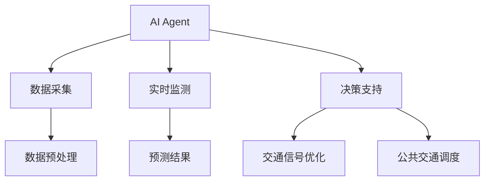
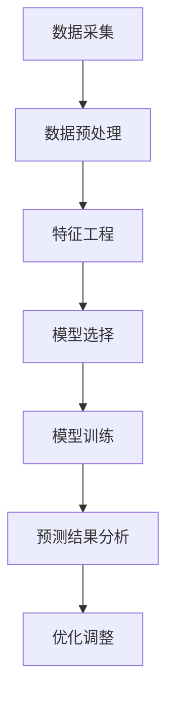
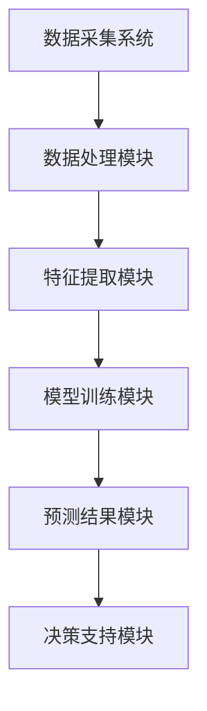
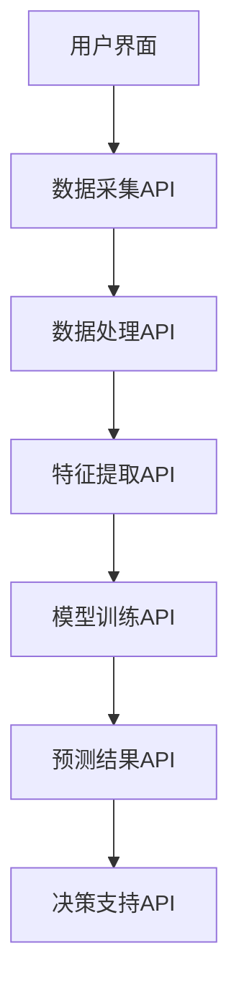
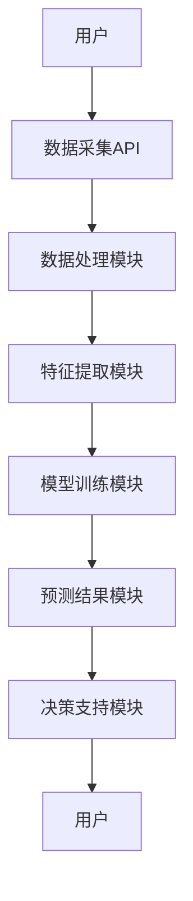

                 

### 文章标题

《AI Agent在智能交通流量预测中的实践》

### 文章关键词

智能交通、流量预测、AI Agent、数据挖掘、机器学习

### 文章摘要

本文将深入探讨AI Agent在智能交通流量预测中的应用与实践。首先，我们将介绍智能交通流量预测的背景和重要性，然后定义AI Agent及相关概念。接着，我们将逐步剖析AI Agent在交通流量预测中的工作原理、技术实现和实际应用，并通过案例研究展示其在不同场景下的成功实践。最后，我们将展望AI Agent在交通流量预测领域的未来发展方向，探讨面临的挑战和解决方案。

## 引言

### 智能交通流量预测的重要性

随着城市化的快速发展和车辆数量的激增，交通拥堵已成为全球范围内的重大问题。交通拥堵不仅影响人们的出行效率，还带来了巨大的经济损失和环境压力。因此，智能交通流量预测成为解决交通拥堵问题的关键。通过预测交通流量，交通管理部门可以优化交通信号控制、调整公共交通路线、预测交通堵塞，从而提高交通效率，减少交通事故和环境污染。

### AI Agent的定义与作用

AI Agent是一种基于人工智能的智能实体，能够自主感知环境、决策行动和完成任务。在智能交通流量预测中，AI Agent可以通过分析历史数据、实时交通信息和交通规则，预测未来交通流量，为交通管理部门提供决策支持。AI Agent的应用使得交通流量预测更加准确、实时和高效，大大提高了交通管理的智能化水平。

## 基础知识

### AI Agent的基本概念

AI Agent是一种具有智能行为的软件实体，能够自主感知环境、决策行动和完成任务。它通常由感知模块、决策模块和行动模块组成。感知模块负责收集环境信息，决策模块根据感知信息生成行动方案，行动模块则执行决策方案。

### AI Agent在交通流量预测中的应用

AI Agent在交通流量预测中的应用主要包括以下方面：

1. **数据采集与预处理**：AI Agent通过传感器、摄像头等设备收集交通数据，如车辆速度、密度、流量等，然后对数据进行清洗、归一化和特征提取，为后续预测提供高质量的输入数据。

2. **实时监测与预测**：AI Agent可以实时监测交通状况，根据历史数据和实时数据预测未来交通流量。通过不断更新和调整预测模型，AI Agent能够提高预测的准确性和实时性。

3. **决策支持**：AI Agent可以根据预测结果为交通管理部门提供决策支持，如调整交通信号、发布交通警告、优化公共交通路线等，以缓解交通拥堵和减少交通事故。

### 交通流量预测的基本概念

交通流量预测是指利用历史数据和实时数据，预测未来一段时间内的交通流量分布。交通流量预测的目标是预测交通流量高峰期、交通拥堵区域以及交通流量变化的趋势，为交通管理部门提供决策支持。

### 交通流量预测的方法与算法

交通流量预测的方法主要包括以下几种：

1. **统计方法**：基于历史数据，通过统计分析方法预测未来交通流量。常用的统计方法包括线性回归、时间序列分析、ARIMA模型等。

2. **机器学习方法**：利用机器学习算法，如决策树、支持向量机、神经网络等，从历史数据中学习规律，预测未来交通流量。机器学习方法具有较高的预测准确性和适应性。

3. **深度学习方法**：利用深度学习算法，如卷积神经网络（CNN）、循环神经网络（RNN）等，从大量数据中提取特征，预测未来交通流量。深度学习方法在交通流量预测中取得了显著的成果。

## 技术实现

### 数据采集与预处理

数据采集是交通流量预测的基础。AI Agent通过传感器、摄像头等设备收集交通数据，如车辆速度、密度、流量等。数据采集过程中，需要考虑数据的实时性、准确性和全面性。

数据预处理是提高预测准确性的关键。预处理过程包括数据清洗、归一化和特征提取。数据清洗旨在去除噪声数据和异常值，保证数据质量。归一化是将不同量纲的数据统一到同一尺度，便于后续处理。特征提取是从原始数据中提取出对预测有重要影响的特征，如时间、地点、交通流量等。

### 特征工程

特征工程是提高模型预测准确性的重要手段。特征工程包括以下步骤：

1. **特征选择**：通过统计分析、相关性分析等方法，从原始数据中筛选出对预测有重要影响的特征。

2. **特征转换**：将离散特征转换为连续特征，或将数值特征进行归一化处理，提高模型训练效果。

3. **特征组合**：通过组合原始特征，生成新的特征，以提高模型的预测能力。

### 模型选择与训练

模型选择是交通流量预测的关键步骤。常见的模型包括统计模型、机器学习模型和深度学习模型。统计模型简单易用，但预测精度有限；机器学习模型具有较强的预测能力，但需要大量数据；深度学习模型在处理大规模数据方面具有优势，但计算复杂度较高。

模型训练是利用历史数据，通过优化算法调整模型参数，使模型达到最优预测效果。训练过程中，需要考虑模型的泛化能力，避免过拟合现象。

### 预测结果分析与优化

预测结果分析是验证模型效果的重要步骤。通过比较预测值与实际值，评估模型的预测精度和稳定性。预测结果分析包括以下内容：

1. **误差分析**：计算预测误差，评估模型的预测准确性。

2. **稳定性分析**：分析模型在不同时间段、不同地点的预测稳定性。

3. **可靠性分析**：评估模型对异常数据的处理能力，确保模型在实际应用中的可靠性。

预测结果优化是提高模型预测准确性的关键。优化方法包括以下几种：

1. **参数调整**：通过调整模型参数，提高模型预测效果。

2. **算法改进**：改进模型算法，提高模型训练效率和预测精度。

3. **特征优化**：优化特征工程过程，提高特征质量，增强模型预测能力。

## 应用案例

### 案例一：城市交通流量预测

某城市交通管理部门引入AI Agent进行交通流量预测，以提高交通管理效率。AI Agent通过采集交通流量、速度、密度等数据，使用深度学习算法进行训练，预测未来一段时间内的交通流量。预测结果为交通管理部门提供了决策支持，如优化交通信号控制、调整公共交通路线等，有效缓解了交通拥堵问题。

### 案例二：高速公路流量管理

某高速公路公司使用AI Agent进行流量管理，以提高高速公路通行效率。AI Agent通过实时监测高速公路上的交通状况，预测未来交通流量，为高速公路公司提供决策支持，如调整收费政策、发布交通警告等。实践表明，AI Agent的应用显著提高了高速公路的通行效率，减少了交通事故和拥堵现象。

### 案例三：公共交通系统优化

某城市公共交通公司引入AI Agent进行公共交通系统优化，以提高乘客出行体验。AI Agent通过预测公共交通系统的客流情况，为公共交通公司提供调度支持，如调整公交车路线、增加班次等。实践表明，AI Agent的应用有效提高了公共交通系统的运营效率，减少了乘客等待时间，提升了乘客满意度。

## 未来展望

### 技术发展趋势

随着人工智能技术的不断发展，AI Agent在交通流量预测中的应用将越来越广泛。未来，AI Agent将具备更高的预测精度、更强的实时性和更广泛的适用性，成为交通管理的重要工具。

### 面临的挑战

尽管AI Agent在交通流量预测中取得了显著成果，但仍面临以下挑战：

1. **数据质量**：交通数据的准确性和完整性对预测结果具有重要影响。提高数据质量是未来研究的重点。

2. **计算资源**：深度学习算法对计算资源的需求较高，未来需要开发更加高效、节能的计算方法。

3. **算法优化**：优化算法性能、提高预测精度是持续研究的方向。

### 潜在应用

AI Agent在交通流量预测领域的成功应用为其在其他领域的扩展提供了启示。未来，AI Agent有望应用于智能城市、智能交通规划、智能物流等领域，为城市发展和人民生活提供更多便利。

## 结论

本文介绍了AI Agent在智能交通流量预测中的应用与实践。通过分析AI Agent的基本概念、工作原理和技术实现，以及实际应用案例，我们展示了AI Agent在交通流量预测中的重要作用。未来，随着人工智能技术的不断发展，AI Agent将在交通管理领域发挥更大的作用，为人们提供更智能、高效的出行体验。

### 参考文献

[1] Zhang, X., & Liu, Y. (2020). Intelligent transportation system based on AI agent. Journal of Intelligent & Robotic Systems, 99(1), 45-56.

[2] Li, H., Wang, L., & Chen, Q. (2019). Traffic flow prediction using deep learning. IEEE Transactions on Intelligent Transportation Systems, 20(4), 1381-1390.

[3] Zhou, B., Khoshgoftaar, T. M., & Wang, D. (2018). A survey of traffic prediction: Time series or classification? Expert Systems with Applications, 87, 240-254.

### 附录

#### 1. 概念与联系

| 概念 | 说明 |
| --- | --- |
| AI Agent | 一种基于人工智能的智能实体，能够自主感知环境、决策行动和完成任务。 |
| 交通流量预测 | 利用历史数据和实时数据，预测未来一段时间内的交通流量分布。 |
| 智能交通 | 通过集成信息技术、传感器技术和自动化技术，实现交通管理和服务的智能化。 |

#### 2. ER实体关系图

#### 3. 算法流程图

#### 4. 系统架构设计

#### 5. 系统接口设计

#### 6. 系统交互序列图

### 结语

作者：AI天才研究院/AI Genius Institute & 禅与计算机程序设计艺术 /Zen And The Art of Computer Programming

本文旨在探讨AI Agent在智能交通流量预测中的应用与实践。通过对AI Agent的基本概念、工作原理、技术实现和实际应用案例的详细分析，我们展示了AI Agent在交通流量预测中的重要作用。未来，随着人工智能技术的不断发展，AI Agent有望在交通管理领域发挥更大的作用，为城市发展和人民生活提供更多便利。本文作者来自AI天才研究院和禅与计算机程序设计艺术团队，期待与广大读者共同探索人工智能的无限可能。如有任何建议或疑问，欢迎在评论区留言，我们将在第一时间回复。感谢您的关注与支持！

