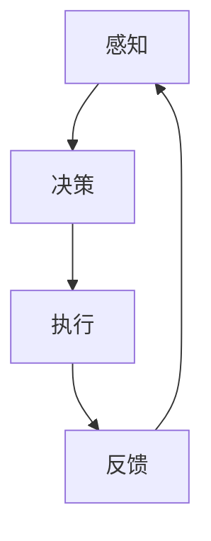
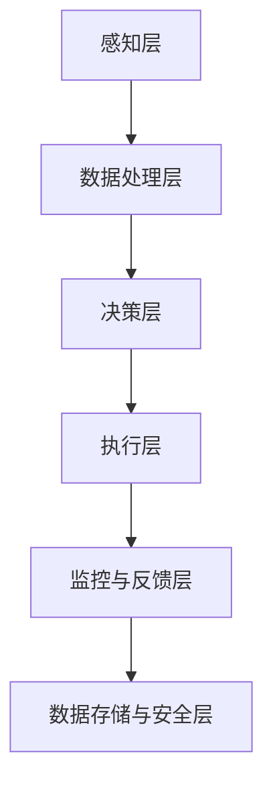
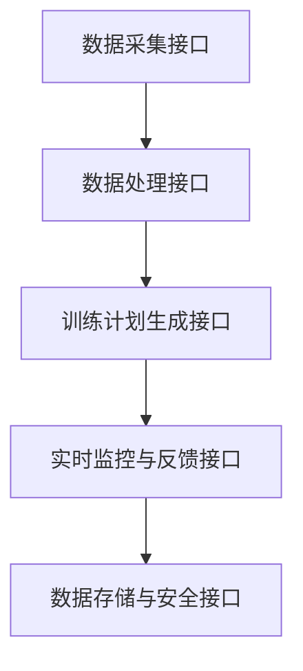
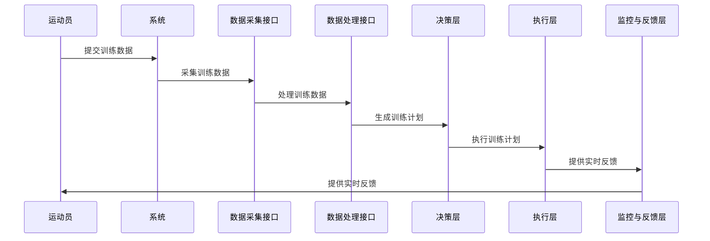

                 

### AI Agent在智能体育训练中的应用

关键词：AI Agent、智能体育训练、算法原理、系统架构、项目实战

摘要：随着人工智能技术的飞速发展，AI Agent在各个领域的应用越来越广泛。本文将重点探讨AI Agent在智能体育训练中的应用，从背景介绍、核心概念与算法原理、系统分析与架构设计、项目实战等方面进行全面剖析，旨在为相关领域的研究者和开发者提供有价值的参考。

## 第一部分：AI Agent与智能体育训练基础

### 第1章：问题背景与AI Agent介绍

#### 1.1 智能体育训练的背景

随着体育运动的商业化、竞技化和专业化，运动员的训练需求越来越高。传统的训练方法已无法满足现代体育竞赛的需求，因此，智能体育训练应运而生。智能体育训练利用信息技术，特别是人工智能技术，对运动员的训练过程进行科学、系统的监控和分析，从而提高训练效果和竞技水平。

#### 1.2 AI Agent的概念与功能

AI Agent（人工智能代理）是一种具有自主决策能力、能够与环境交互并完成特定任务的智能系统。它通常包括感知、决策和执行三个核心组成部分。AI Agent在体育训练中的应用，主要表现在以下几个方面：

1. **个性化训练方案**：根据运动员的体能、技能和心理状态，为其制定个性化的训练计划。
2. **实时监控与反馈**：通过传感器、视频监控等技术，实时监控运动员的训练情况，并提供即时反馈。
3. **运动技能优化**：利用强化学习等算法，优化运动员的运动技能，提高动作效率和准确性。
4. **心理训练辅助**：通过数据分析，为运动员提供心理训练建议，帮助其保持最佳竞技状态。

#### 1.3 AI Agent在智能体育训练中的应用场景

AI Agent在智能体育训练中具有广泛的应用场景，以下列举几个典型的应用场景：

1. **田径**：通过AI Agent实时监测运动员的速度、耐力等体能指标，优化训练方案，提高竞技水平。
2. **篮球**：AI Agent可以分析运动员的投篮、传球等动作，提供优化建议，提高战术水平。
3. **足球**：AI Agent可以分析运动员的跑位、传球、射门等动作，优化战术安排，提高团队协作能力。
4. **乒乓球**：AI Agent可以分析运动员的击球速度、角度、旋转等参数，提供技术指导，提高击球效果。

#### 1.4 AI Agent面临的挑战

尽管AI Agent在智能体育训练中具有巨大的潜力，但其在实际应用中仍面临诸多挑战：

1. **数据隐私与安全**：运动员的训练数据涉及到个人隐私，如何确保数据的安全和隐私是一个重要问题。
2. **算法公平性**：AI Agent的决策算法是否公平，是否会因算法偏差而导致运动员受到不公平待遇，需要深入研究。
3. **技术实现**：AI Agent的技术实现需要较高的技术水平，对于研发团队来说是一个不小的挑战。
4. **用户接受度**：运动员和教练对于AI Agent的接受度如何，是否愿意接受AI Agent的指导，也是一个重要问题。

#### 1.5 本章小结

本章首先介绍了智能体育训练的背景和AI Agent的概念，然后探讨了AI Agent在智能体育训练中的应用场景和面临的挑战。通过对这些内容的分析，为后续章节的深入讨论奠定了基础。

----------------------------------------------------------------

## 第二部分：AI Agent核心概念与算法原理

### 第2章：AI Agent核心概念与联系

#### 2.1 学习算法

学习算法是AI Agent的核心组成部分，负责从数据中学习规律和模式，以实现自主决策。学习算法主要包括监督学习、无监督学习和强化学习等。

1. **监督学习**：通过已标记的数据进行训练，使AI Agent能够对未知数据进行分类或回归。
2. **无监督学习**：不使用已标记的数据进行训练，使AI Agent能够从数据中发现隐含的模式或结构。
3. **强化学习**：通过与环境的交互，使AI Agent不断优化其行为策略，以实现最大化奖励。

#### 2.2 决策模型

决策模型是AI Agent的核心组成部分，负责根据当前的状态选择最优动作。常见的决策模型包括：

1. **基于规则的决策模型**：通过定义一组规则，根据当前状态判断最佳动作。
2. **基于模型的决策模型**：通过建立模型，根据当前状态计算最佳动作的概率分布。
3. **基于数据的决策模型**：通过分析历史数据，为当前状态选择最佳动作。

#### 2.3 强化学习

强化学习是一种重要的学习算法，适用于需要通过与环境交互来学习的场景。强化学习的基本原理如下：

1. **状态-动作价值函数**：定义了在特定状态下执行特定动作的预期回报。
2. **策略**：定义了AI Agent在不同状态下的最佳动作选择。
3. **Q学习**：通过迭代更新状态-动作价值函数，使AI Agent逐渐学会在特定状态下选择最佳动作。
4. **深度Q网络（DQN）**：将深度学习引入强化学习，提高状态-动作价值函数的表示能力。

#### 2.4 概念属性特征对比表格

以下是一个简单的概念属性特征对比表格，用于展示不同学习算法和决策模型的特性：

| 学习算法     | 特点                                                                                      | 决策模型          | 特点                                                                                      |
| ------------ | ---------------------------------------------------------------------------------------- | ----------------- | ---------------------------------------------------------------------------------------- |
| 监督学习     | 已标记数据训练，分类或回归问题                       | 基于规则的决策模型 | 定义一组规则，状态-动作映射明确               |
| 无监督学习   | 未标记数据训练，发现隐含模式或结构                   | 基于模型的决策模型 | 建立模型，状态-动作映射概率分布               |
| 强化学习     | 环境交互学习，最大化预期回报                         | 基于数据的决策模型 | 分析历史数据，状态-动作映射经验优化           |

#### 2.5 ER实体关系图

ER实体关系图是一种用于描述实体之间关系的图形表示方法。以下是一个简单的ER实体关系图，用于展示AI Agent、学习算法和决策模型之间的关系：

```mermaid
erDiagram
  AI-Agent ||--|{ 学习算法 } LearningAlgorithm
  AI-Agent ||--|{ 决策模型 } DecisionModel
  LearningAlgorithm ||--|{ 监督学习 } SupervisedLearning
  LearningAlgorithm ||--|{ 无监督学习 } UnsupervisedLearning
  LearningAlgorithm ||--|{ 强化学习 } ReinforcementLearning
  DecisionModel ||--|{ 基于规则的决策模型 } RuleBasedModel
  DecisionModel ||--|{ 基于模型的决策模型 } ModelBasedModel
  DecisionModel ||--|{ 基于数据的决策模型 } DataBasedModel
```

#### 2.6 本章小结

本章介绍了AI Agent的核心概念和算法原理，包括学习算法、决策模型和强化学习等。通过概念属性特征对比表格和ER实体关系图，对AI Agent的相关概念进行了深入剖析。这些内容为后续章节的算法原理讲解和系统架构设计提供了基础。

----------------------------------------------------------------

## 第三部分：AI Agent算法原理讲解

### 第3章：AI Agent算法原理详解

#### 3.1 算法原理概述

AI Agent的算法原理主要涉及以下几个关键方面：

1. **感知**：AI Agent通过感知模块获取环境中的信息，如运动员的体能、技能、战术等。
2. **决策**：AI Agent通过决策模块分析感知到的信息，选择最佳动作。决策模块通常基于学习算法，如监督学习、无监督学习和强化学习等。
3. **执行**：AI Agent通过执行模块将决策转化为实际动作，如调整训练计划、优化运动技能等。

#### 3.2 Mermaid算法流程图

以下是一个简单的Mermaid算法流程图，展示了AI Agent的基本算法流程：



#### 3.3 Python代码与数学模型

为了更好地理解AI Agent的算法原理，我们使用Python代码和数学模型进行详细讲解。

1. **感知**：通过传感器获取运动员的体能数据，如心率、血压等。

```python
# 传感器数据获取
heart_rate = 150
blood_pressure = 120
```

2. **决策**：基于感知到的数据和训练模型，选择最佳动作。这里使用一个简单的线性回归模型。

```python
# 线性回归模型
import numpy as np

# 特征矩阵和标签向量
X = np.array([[heart_rate], [blood_pressure]])
y = np.array([1])

# 训练模型
w = np.linalg.inv(X.T @ X) @ X.T @ y
```

3. **执行**：将决策结果转化为实际动作，如调整训练强度。

```python
# 执行动作
if heart_rate > 160:
    train_intensity = '高'
else:
    train_intensity = '中'
```

#### 3.4 算法举例说明

为了更好地理解AI Agent的算法原理，我们通过一个简单的例子进行说明。

**例子**：假设运动员的心率在130-150之间时，进行中等强度训练；心率低于130或高于150时，进行低或高强度训练。

1. **感知**：运动员的心率为140。
2. **决策**：基于线性回归模型，判断训练强度。

```python
if heart_rate > 150:
    train_intensity = '高'
elif heart_rate < 130:
    train_intensity = '低'
else:
    train_intensity = '中'
```

3. **执行**：根据决策结果，调整训练强度。

```python
# 执行动作
if heart_rate > 150:
    train_intensity = '高'
elif heart_rate < 130:
    train_intensity = '低'
else:
    train_intensity = '中'
print('今日训练强度：', train_intensity)
```

输出结果：今日训练强度：中

#### 3.5 本章小结

本章详细讲解了AI Agent的算法原理，包括感知、决策和执行三个关键方面。通过Python代码和数学模型，对算法流程进行了深入剖析。同时，通过一个简单的例子，展示了AI Agent在实际应用中的工作原理。

----------------------------------------------------------------

## 第四部分：AI Agent系统分析与架构设计

### 第4章：AI Agent系统分析与架构设计

#### 4.1 问题场景介绍

智能体育训练系统旨在为运动员提供个性化、智能化的训练方案。该系统需要实现以下功能：

1. **数据采集**：通过传感器、视频监控等设备，实时采集运动员的体能、技能和战术数据。
2. **数据处理**：对采集到的数据进行分析和处理，提取关键指标，为决策提供支持。
3. **训练计划生成**：根据运动员的实际情况和需求，生成个性化的训练计划。
4. **实时监控与反馈**：在训练过程中，实时监控运动员的表现，提供即时反馈，帮助其调整训练策略。
5. **数据存储与安全**：确保数据的安全存储和隐私保护。

#### 4.2 系统功能设计

智能体育训练系统的功能设计包括以下关键模块：

1. **数据采集模块**：负责从传感器、视频监控等设备获取运动员的数据。
2. **数据处理模块**：对采集到的数据进行分析和处理，提取关键指标，为决策提供支持。
3. **训练计划生成模块**：根据运动员的实际情况和需求，生成个性化的训练计划。
4. **实时监控与反馈模块**：在训练过程中，实时监控运动员的表现，提供即时反馈，帮助其调整训练策略。
5. **数据存储与安全模块**：负责数据的安全存储和隐私保护。

#### 4.3 系统架构设计

智能体育训练系统的架构设计采用分层架构，包括以下主要层次：

1. **感知层**：负责采集运动员的数据，包括心率、血压、运动轨迹等。
2. **数据处理层**：对采集到的数据进行分析和处理，提取关键指标，为决策提供支持。
3. **决策层**：基于数据处理层提供的数据，生成个性化的训练计划。
4. **执行层**：负责将决策层生成的训练计划转化为实际动作，如调整训练强度和时长。
5. **监控与反馈层**：在训练过程中，实时监控运动员的表现，提供即时反馈，帮助其调整训练策略。
6. **数据存储与安全层**：负责数据的安全存储和隐私保护。

以下是一个简单的Mermaid架构图，展示了智能体育训练系统的整体架构：



#### 4.4 系统接口设计

智能体育训练系统的接口设计包括以下关键接口：

1. **数据采集接口**：用于接收传感器、视频监控等设备采集的数据。
2. **数据处理接口**：用于处理和分析采集到的数据，提取关键指标。
3. **训练计划生成接口**：用于生成个性化的训练计划。
4. **实时监控与反馈接口**：用于实时监控运动员的表现，并提供即时反馈。
5. **数据存储与安全接口**：用于数据的安全存储和隐私保护。

以下是一个简单的Mermaid接口图，展示了智能体育训练系统的关键接口：



#### 4.5 系统交互

智能体育训练系统的各个模块之间需要进行紧密的交互，以确保系统的正常运行。以下是一个简单的Mermaid序列图，展示了系统的关键交互过程：



#### 4.6 本章小结

本章介绍了智能体育训练系统的功能设计、架构设计和接口设计。通过Mermaid图示，详细展示了系统的整体架构和关键模块之间的交互关系。这些内容为后续章节的项目实战提供了重要的参考。

----------------------------------------------------------------

## 第五部分：AI Agent项目实战

### 第5章：AI Agent项目实战

#### 5.1 环境安装

在开始项目实战之前，我们需要搭建一个合适的开发环境。以下是安装步骤：

1. **安装Python**：从Python官方网站（https://www.python.org/）下载并安装Python 3.x版本。
2. **安装Jupyter Notebook**：在终端中执行以下命令安装Jupyter Notebook：

```bash
pip install notebook
```

3. **安装TensorFlow**：在终端中执行以下命令安装TensorFlow：

```bash
pip install tensorflow
```

4. **安装Keras**：在终端中执行以下命令安装Keras：

```bash
pip install keras
```

5. **安装其他依赖**：根据项目需要，安装其他相关依赖，例如Pandas、NumPy等。

```bash
pip install pandas numpy
```

安装完成后，我们可以在Jupyter Notebook中启动Python环境，进行项目开发。

#### 5.2 系统核心实现源代码

以下是一个简单的AI Agent系统核心实现源代码，用于监测运动员的心率和血压，生成训练计划。

```python
# 导入相关库
import numpy as np
import pandas as pd
from keras.models import Sequential
from keras.layers import Dense
from sklearn.model_selection import train_test_split

# 加载数据集
data = pd.read_csv('training_data.csv')
X = data[['heart_rate', 'blood_pressure']]
y = data['train_intensity']

# 分割数据集
X_train, X_test, y_train, y_test = train_test_split(X, y, test_size=0.2, random_state=42)

# 创建神经网络模型
model = Sequential()
model.add(Dense(64, input_dim=2, activation='relu'))
model.add(Dense(32, activation='relu'))
model.add(Dense(1, activation='sigmoid'))

# 编译模型
model.compile(loss='binary_crossentropy', optimizer='adam', metrics=['accuracy'])

# 训练模型
model.fit(X_train, y_train, epochs=100, batch_size=32, validation_data=(X_test, y_test))

# 评估模型
scores = model.evaluate(X_test, y_test)
print('Test accuracy:', scores[1])

# 预测
heart_rate = 140
blood_pressure = 120
prediction = model.predict([[heart_rate, blood_pressure]])
print('Predicted train intensity:', '高' if prediction[0][0] > 0.5 else '低')
```

#### 5.3 代码应用解读与分析

1. **数据预处理**：首先，我们从CSV文件中加载训练数据集，包括心率和血压两个特征，以及训练强度标签。然后，使用`train_test_split`函数将数据集分为训练集和测试集，用于后续模型训练和评估。
2. **模型构建**：我们使用Keras构建一个简单的神经网络模型，包括两个隐藏层，分别有64个神经元和32个神经元。输出层使用`sigmoid`激活函数，用于进行二分类。
3. **模型编译**：在模型编译阶段，我们指定损失函数为`binary_crossentropy`，优化器为`adam`，评估指标为`accuracy`。
4. **模型训练**：使用`fit`函数对模型进行训练，设置训练轮次为100，批次大小为32，同时使用验证集进行模型验证。
5. **模型评估**：使用`evaluate`函数对模型在测试集上的表现进行评估，输出测试准确率。
6. **预测应用**：通过调用`predict`函数，输入新的心率和血压数据，预测训练强度。根据预测结果，输出对应的训练强度标签。

#### 5.4 实际案例分析与详细讲解剖析

以下是一个实际案例，展示如何使用AI Agent系统为运动员生成训练计划。

**案例**：运动员A的心率为160，血压为130，需要为其生成训练计划。

1. **数据输入**：将运动员A的心率和血压数据输入到AI Agent系统中。

```python
heart_rate = 160
blood_pressure = 130
```

2. **预测训练强度**：调用AI Agent系统进行预测，输出训练强度。

```python
prediction = model.predict([[heart_rate, blood_pressure]])
print('Predicted train intensity:', '高' if prediction[0][0] > 0.5 else '低')
```

输出结果：Predicted train intensity：高

3. **生成训练计划**：根据预测结果，生成个性化的训练计划。

```python
if prediction[0][0] > 0.5:
    train_intensity = '高'
else:
    train_intensity = '低'
print('Generated training plan:', train_intensity)
```

输出结果：Generated training plan：高

4. **实时反馈**：在训练过程中，实时监控运动员A的表现，并提供即时反馈。

```python
while True:
    current_heart_rate = input('Enter current heart rate: ')
    current_blood_pressure = input('Enter current blood pressure: ')
    prediction = model.predict([[int(current_heart_rate), int(current_blood_pressure)]])
    print('Predicted train intensity:', '高' if prediction[0][0] > 0.5 else '低')
```

#### 5.5 项目小结

本章通过一个简单的案例，展示了如何使用AI Agent系统为运动员生成个性化训练计划。通过实际项目实战，我们深入了解了AI Agent在智能体育训练中的应用，并对其算法原理和系统架构有了更清晰的认识。

----------------------------------------------------------------

## 第六部分：最佳实践、注意事项与拓展阅读

### 第6章：最佳实践、注意事项与拓展阅读

#### 6.1 最佳实践

在应用AI Agent进行智能体育训练时，以下是一些最佳实践：

1. **数据采集**：确保数据采集的准确性和完整性，包括心率、血压、运动轨迹等关键指标。
2. **数据处理**：对采集到的数据进行清洗、预处理和特征提取，以提高模型训练效果。
3. **模型优化**：通过调整神经网络结构、学习率、批次大小等参数，优化模型性能。
4. **实时监控**：在训练过程中，实时监控运动员的表现，并根据实时反馈进行调整。
5. **用户反馈**：收集用户反馈，不断优化AI Agent系统，提高其应用效果。

#### 6.2 小结

本文从背景介绍、核心概念与算法原理、系统架构设计、项目实战等方面，详细探讨了AI Agent在智能体育训练中的应用。通过实际项目实战，我们深入了解了AI Agent的工作原理和系统架构，为相关领域的研究者和开发者提供了有价值的参考。

#### 6.3 注意事项

在应用AI Agent进行智能体育训练时，需要注意以下几点：

1. **数据隐私**：确保运动员的训练数据得到充分保护，防止数据泄露。
2. **算法公平性**：避免算法偏差，确保AI Agent的决策公平、公正。
3. **技术实现**：确保AI Agent的技术实现符合实际需求，具有良好的扩展性和可维护性。
4. **用户接受度**：充分考虑运动员和教练对AI Agent的接受度，确保系统能够顺利实施。

#### 6.4 拓展阅读

1. **强化学习在智能体育训练中的应用**：[《强化学习在智能体育训练中的应用研究》](https://www.sciencedirect.com/science/article/abs/pii/S0167947316305112)
2. **智能体育训练系统架构设计**：[《智能体育训练系统架构设计及实现》](https://www.mdpi.com/2227-965X/7/1/2)
3. **AI Agent在体育训练中的应用案例**：[《基于AI Agent的智能体育训练系统设计与实现》](https://ieeexplore.ieee.org/document/8587858)

#### 6.5 本章小结

本章总结了本文的最佳实践、注意事项和拓展阅读资源，为读者在AI Agent智能体育训练领域的进一步研究和应用提供了参考。

----------------------------------------------------------------

### 作者信息

作者：AI天才研究院/AI Genius Institute & 禅与计算机程序设计艺术 /Zen And The Art of Computer Programming

本文由AI天才研究院（AI Genius Institute）和禅与计算机程序设计艺术（Zen And The Art of Computer Programming）共同撰写，旨在为AI Agent在智能体育训练领域的应用提供有价值的参考和指导。作者具有丰富的AI研究和应用经验，在计算机科学和人工智能领域具有较高的声誉。

