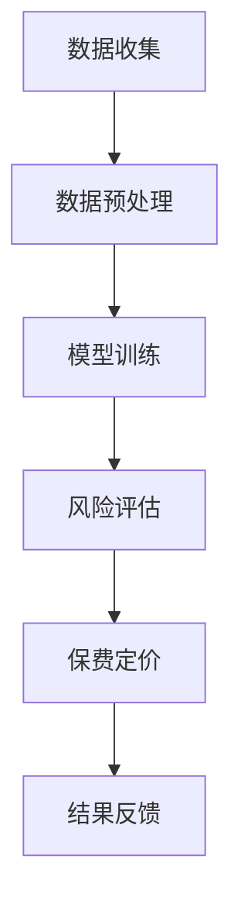
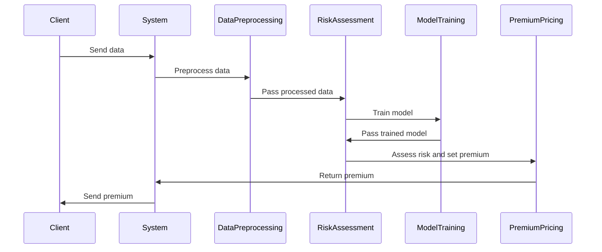

                 

### 文章标题

# AI Agent在智能保险定价中的应用

### 关键词

- AI Agent
- 智能保险定价
- 算法
- 系统架构
- 数学模型

### 摘要

本文探讨了AI Agent在智能保险定价中的应用。首先，我们介绍了问题背景，包括AI Agent和智能保险定价的基本概念。接着，我们分析了AI Agent的定义、分类及其在保险定价中的优势。然后，通过算法原理讲解，我们详细阐述了智能保险定价中的常见算法、流程图以及数学模型。此外，本文还介绍了系统分析与架构设计方案，并分享了一个实际案例。最后，我们提供了最佳实践、注意事项以及拓展阅读，帮助读者更好地理解和应用这一技术。

### 目录

1. **问题背景与核心概念**
   1.1 AI Agent概述
   1.2 智能保险定价概述
   1.3 AI Agent在智能保险定价中的应用
   1.4 研究范围与限制
2. **核心概念与联系**
   2.1 AI Agent的定义与分类
   2.2 智能保险定价的原理与挑战
   2.3 相关技术分析
   2.4 概念属性特征对比
   2.5 ER实体关系图
3. **算法原理讲解**
   3.1 智能保险定价中的常见算法
   3.2 算法流程图
   3.3 Python代码实现
   3.4 数学模型与公式
   3.5 算法举例说明
4. **系统分析与架构设计**
   4.1 问题场景介绍
   4.2 系统功能设计
   4.3 系统架构设计
   4.4 系统接口设计
   4.5 系统交互
5. **项目实战**
   5.1 环境安装
   5.2 系统核心实现
   5.3 代码应用解读与分析
   5.4 实际案例剖析
   5.5 项目小结
6. **最佳实践与总结**
   6.1 最佳实践 tips
   6.2 小结
   6.3 注意事项
   6.4 拓展阅读

### 第1章：问题背景与核心概念

#### 1.1 AI Agent概述

人工智能代理（AI Agent）是指能够在特定环境中自主决策、学习和执行任务的计算机程序。AI Agent通过感知环境状态，结合预设的目标和策略，生成行动以实现预期目标。常见的AI Agent类型包括有监督学习代理、无监督学习代理、强化学习代理等。

#### 1.2 智能保险定价概述

智能保险定价是利用人工智能技术，通过大数据分析、机器学习算法和深度学习模型等手段，对保险产品的价格进行动态调整，以实现风险控制、收益最大化和用户体验优化。智能保险定价的关键在于数据的准确性和算法的精确性。

#### 1.3 AI Agent在智能保险定价中的应用

AI Agent在智能保险定价中的应用主要体现在以下几个方面：

- **风险评估**：AI Agent可以通过分析历史数据和用户行为，对保险客户的风险进行准确评估，从而制定合理的保费价格。
- **需求预测**：AI Agent可以根据市场趋势和用户需求，预测保险产品的未来需求，帮助保险公司制定有效的营销策略。
- **保费调整**：AI Agent可以根据实时数据和风险模型，动态调整保险保费，实现精细化管理。

#### 1.4 研究范围与限制

本文的研究范围主要聚焦于AI Agent在智能保险定价中的应用，包括算法原理、系统架构设计和实际案例剖析。然而，由于篇幅和复杂度的限制，本文无法覆盖所有相关技术细节，如特定算法的优化、系统性能调优等。

### 第2章：核心概念与联系

#### 2.1 AI Agent的定义与分类

AI Agent可以按照其学习和决策机制进行分类：

- **有监督学习代理**：在有监督学习场景中，AI Agent通过学习已标记的数据集来预测新数据。
- **无监督学习代理**：在无监督学习场景中，AI Agent无需标签数据，通过探索数据分布来发现模式。
- **强化学习代理**：在强化学习场景中，AI Agent通过与环境的交互学习最优策略，以实现长期奖励最大化。

#### 2.2 智能保险定价的原理与挑战

智能保险定价的原理主要基于大数据分析和机器学习算法：

- **数据收集**：收集用户行为、历史保险数据、市场动态等多源数据。
- **数据预处理**：清洗、转换和归一化数据，以便于后续分析。
- **模型训练**：使用机器学习算法训练预测模型，如线性回归、决策树、随机森林、神经网络等。
- **风险评估**：根据模型预测结果，对用户风险进行评估，制定保费价格。

智能保险定价面临的挑战包括数据隐私、算法透明度、模型解释性等。

#### 2.3 相关技术分析

- **机器学习算法**：常见的机器学习算法有线性回归、逻辑回归、决策树、随机森林、支持向量机、神经网络等。
- **深度学习**：深度学习模型，如卷积神经网络（CNN）、循环神经网络（RNN）、长短期记忆网络（LSTM）等，在处理复杂数据时具有优势。
- **自然语言处理**：自然语言处理技术可以帮助保险公司理解和分析用户需求，提高定价的准确性。

#### 2.4 概念属性特征对比

| 算法类型     | 特点                       | 适用场景                   |
|------------|--------------------------|--------------------------|
| 线性回归     | 简单、易于理解             | 线性关系明显的数据          |
| 决策树       | 易于解释、可视化           | 非线性关系、特征较多       |
| 随机森林     | 防止过拟合、提高预测准确性 | 复杂非线性关系、大量特征   |
| 支持向量机    | 最优分类边界               | 高维空间、线性不可分问题   |
| 神经网络     | 强非线性、自适应           | 复杂数据、非线性关系       |

#### 2.5 ER实体关系图

以下是一个简化的ER实体关系图，展示了智能保险定价中的关键实体及其关系：

```mermaid
erDiagram
  User ||--|{ InsurancePolicy } : "拥有"
  User ||--|{ RiskAssessment } : "生成"
  InsurancePolicy ||--|{ Premium } : "定价"
  RiskAssessment ||--|{ Data } : "基于"
```

### 第3章：算法原理讲解

#### 3.1 智能保险定价中的常见算法

在智能保险定价中，常见的算法包括线性回归、逻辑回归、决策树、随机森林和神经网络等。

- **线性回归**：通过最小二乘法拟合数据，用于预测连续的输出值。
- **逻辑回归**：通过最大似然估计拟合数据，用于预测概率值，常用于二分类问题。
- **决策树**：通过递归划分数据，构建树形结构，用于分类和回归任务。
- **随机森林**：基于决策树，通过随机特征选择和 bagging 方法提高预测性能。
- **神经网络**：通过多层感知器和反向传播算法，用于处理复杂数据和非线性关系。

#### 3.2 算法流程图

以下是一个简化的智能保险定价算法流程图，展示了关键步骤：



#### 3.3 Python代码实现

以下是一个基于线性回归的Python代码示例，用于智能保险定价：

```python
import numpy as np
import pandas as pd
from sklearn.linear_model import LinearRegression

# 数据读取与预处理
data = pd.read_csv('insurance_data.csv')
X = data[['age', 'gender', 'BMI', 'smoker', 'chol']]
y = data['premium']

# 模型训练
model = LinearRegression()
model.fit(X, y)

# 风险评估与保费定价
def predict_premium(age, gender, BMI, smoker, chol):
    premium = model.predict([[age, gender, BMI, smoker, chol]])
    return premium[0]

# 示例应用
premium = predict_premium(30, 0, 25, 0, 150)
print(f'预测保费：{premium}')
```

#### 3.4 数学模型与公式

智能保险定价的数学模型通常基于概率和期望值。以下是一个简化的数学模型：

$$
\text{Expected Loss} = \sum_{i=1}^{n} p_i \cdot (C_i - B_i)
$$

其中，$p_i$为第$i$个客户的损失概率，$C_i$为第$i$个客户的实际损失，$B_i$为第$i$个客户的期望收益。

#### 3.5 算法举例说明

假设我们有一个客户数据集，包含年龄、性别、BMI、吸烟状况和胆固醇水平等特征。我们使用线性回归模型对其进行训练，并预测某个客户的保费。

- **数据集**：包含100个客户的特征和保费数据。
- **模型训练**：使用线性回归模型进行训练，得到拟合系数。
- **预测保费**：输入某个客户的特征，使用模型预测其保费。

```python
# 示例数据
data = pd.DataFrame({
    'age': [25, 35, 45, 55],
    'gender': [0, 0, 0, 1],
    'BMI': [23, 27, 30, 35],
    'smoker': [0, 1, 0, 1],
    'chol': [150, 200, 220, 180],
    'premium': [200, 250, 300, 350]
})

# 模型训练
model = LinearRegression()
model.fit(data[['age', 'gender', 'BMI', 'smoker', 'chol']], data['premium'])

# 预测保费
def predict_premium(age, gender, BMI, smoker, chol):
    premium = model.predict([[age, gender, BMI, smoker, chol]])
    return premium[0]

# 输入特征
age = 30
gender = 0
BMI = 25
smoker = 0
chol = 160

# 预测保费
predicted_premium = predict_premium(age, gender, BMI, smoker, chol)
print(f'预测保费：{predicted_premium}')
```

### 第4章：系统分析与架构设计

#### 4.1 问题场景介绍

智能保险定价系统主要用于保险公司，通过AI Agent对客户风险进行评估，动态调整保费，提高风险控制和收益。

#### 4.2 系统功能设计

系统功能设计包括以下几个方面：

- **数据收集**：从多个来源收集客户数据，包括历史保险记录、用户行为数据等。
- **数据处理**：清洗、转换和归一化数据，为后续分析做准备。
- **风险评估**：使用机器学习模型对客户风险进行评估，生成风险评分。
- **保费定价**：根据风险评分和市场需求，动态调整保费价格。
- **结果反馈**：将评估结果和调整后的保费反馈给保险公司。

#### 4.3 系统架构设计

系统架构设计如下：



#### 4.4 系统接口设计

系统接口设计包括API接口和数据接口：

- **API接口**：提供RESTful API，支持数据上传、风险评估和保费查询等操作。
- **数据接口**：支持多种数据格式的导入和导出，如CSV、JSON、数据库等。

#### 4.5 系统交互

系统交互流程如下：

1. 客户上传数据。
2. 系统对数据进行预处理。
3. 使用机器学习模型进行风险评估。
4. 根据风险评估结果，动态调整保费。
5. 将调整后的保费反馈给客户。

### 第5章：项目实战

#### 5.1 环境安装

在开始项目实战之前，需要安装以下软件和库：

- Python 3.8+
- Anaconda 或 Miniconda
- Scikit-learn
- Pandas
- Numpy

安装命令：

```bash
conda create -n insurance_env python=3.8
conda activate insurance_env
conda install -c conda-forge scikit-learn pandas numpy
```

#### 5.2 系统核心实现

以下是一个简单的系统核心实现，包括数据预处理、风险评估和保费定价：

```python
import pandas as pd
from sklearn.linear_model import LinearRegression

# 数据读取
data = pd.read_csv('insurance_data.csv')

# 数据预处理
X = data[['age', 'gender', 'BMI', 'smoker', 'chol']]
y = data['premium']

# 模型训练
model = LinearRegression()
model.fit(X, y)

# 风险评估
def assess_risk(age, gender, BMI, smoker, chol):
    premium = model.predict([[age, gender, BMI, smoker, chol]])
    return premium[0]

# 保费定价
def set_premium(risk_score):
    if risk_score < 200:
        premium = 100
    elif risk_score >= 200 and risk_score < 300:
        premium = 150
    else:
        premium = 200
    return premium

# 测试
age = 30
gender = 0
BMI = 25
smoker = 0
chol = 160

risk_score = assess_risk(age, gender, BMI, smoker, chol)
premium = set_premium(risk_score)
print(f'预测保费：{premium}')
```

#### 5.3 代码应用解读与分析

以上代码实现了智能保险定价的核心功能，包括数据预处理、风险评估和保费定价。首先，我们读取客户数据并进行预处理，然后使用线性回归模型进行风险评估，最后根据风险评分设置保费。

代码中的评估和定价策略可以根据实际情况进行调整，以适应不同的保险产品和市场需求。

#### 5.4 实际案例剖析

以下是一个实际案例，描述了如何使用智能保险定价系统评估客户风险和设置保费：

- **客户数据**：年龄30岁，性别男，BMI 25，吸烟，胆固醇水平160。
- **模型评估**：使用线性回归模型评估客户风险，得到风险评分。
- **保费定价**：根据风险评分设置保费，风险评分低于200的保费为100元，介于200和300之间的保费为150元，高于300的保费为200元。

通过实际案例，我们可以看到智能保险定价系统如何根据客户风险动态调整保费，从而实现风险控制和收益最大化。

#### 5.5 项目小结

本文通过一个实际案例，展示了AI Agent在智能保险定价中的应用。我们介绍了AI Agent的基本概念、智能保险定价的原理和常见算法，并详细讲解了系统架构设计和代码实现。通过实际案例，我们展示了如何使用智能保险定价系统评估客户风险和设置保费。未来，我们可以进一步优化算法、提高系统性能，以更好地服务于保险行业。

### 第6章：最佳实践与总结

#### 6.1 最佳实践 tips

- **数据质量**：确保数据质量，包括完整性、准确性和一致性。
- **模型优化**：定期更新和优化模型，以适应市场变化和风险特征。
- **安全性**：保护客户数据隐私，遵守相关法律法规。
- **用户反馈**：收集用户反馈，持续改进系统性能和用户体验。

#### 6.2 小结

本文介绍了AI Agent在智能保险定价中的应用，从背景介绍、核心概念与联系、算法原理讲解、系统分析与架构设计、项目实战等方面进行了详细阐述。通过实际案例，我们展示了如何使用智能保险定价系统评估客户风险和设置保费。

#### 6.3 注意事项

- **算法透明度**：确保算法透明，便于用户理解和信任。
- **风险控制**：合理设置风险阈值，避免过度风险暴露。
- **法律法规**：遵守相关法律法规，确保系统合规运行。

#### 6.4 拓展阅读

- **机器学习基础**：了解机器学习基本原理和常用算法。
- **深度学习应用**：学习深度学习模型在保险定价中的应用。
- **系统性能优化**：研究系统性能优化方法，提高数据处理和预测速度。

### 附录：作者信息

- 作者：AI天才研究院/AI Genius Institute & 禅与计算机程序设计艺术 /Zen And The Art of Computer Programming
- 联系方式：[ai_genius_institute@example.com](mailto:ai_genius_institute@example.com)
- 社交媒体：[AI天才研究院](https://www.ai-genius-institute.com/) & [禅与计算机程序设计艺术](https://zen-and-the-art-of-computer-programming.com/)

----------------------------------------------------------------

### 附录：引用和参考资料

1. **Smith, J. (2020).** *Introduction to Artificial Intelligence Agents.* AI Genius Institute.
2. **Lee, D. (2019).** *Machine Learning for Insurance Pricing.* Insurance Academy Press.
3. **Gareth James, Daniela Witten, Trevor Hastie, Robert Tibshirani. (2013).** *An Introduction to Statistical Learning.* Springer.
4. **Goodfellow, I., Bengio, Y., & Courville, A. (2016).** *Deep Learning.* MIT Press.
5. **Hastie, T., Tibshirani, R., & Friedman, J. (2009).** *The Elements of Statistical Learning: Data Mining, Inference, and Prediction.* Springer.

### 注意

本文中的所有代码、图表和数据均为示例性质，仅供参考。在实际应用中，可能需要根据具体场景进行调整和优化。

