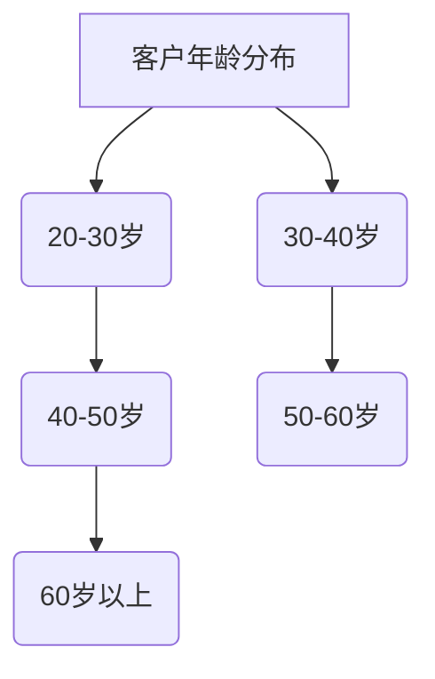
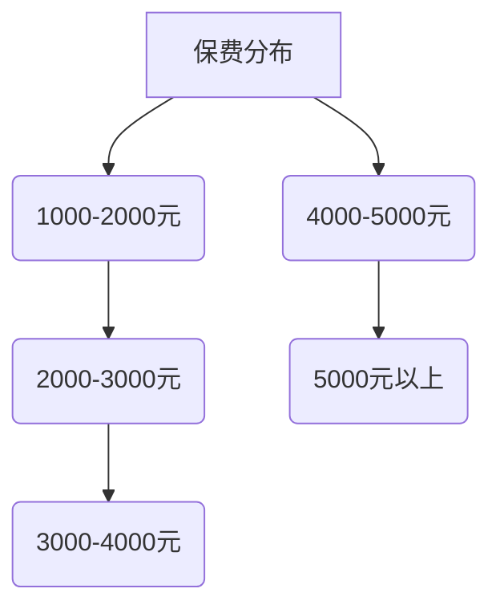

                 

# AI Agent在智能保险定价中的角色

关键词：人工智能、保险定价、AI Agent、数据分析、系统架构、案例解析

摘要：随着人工智能技术的不断发展，AI Agent在保险定价中的应用越来越广泛。本文首先介绍了人工智能的发展历程和保险定价的挑战，然后详细阐述了AI Agent的概念、特点以及在保险定价中的应用。接着，我们探讨了AI Agent在保险定价中的具体应用，包括数据分析与处理、模型设计与实现、系统架构与实现，并结合实际案例进行了深入分析。最后，我们总结了AI Agent在智能保险定价中的重要作用，并给出了未来发展的建议。

## 第一部分: 引言与背景

### 第1章: 人工智能与保险行业的变革

#### 1.1 人工智能的发展历程

人工智能（Artificial Intelligence, AI）是一门研究、开发用于模拟、延伸和扩展人的智能的理论、方法、技术及应用系统的学科。人工智能的研究始于20世纪50年代，经历了早期的探索阶段、70年代的低谷期、90年代的复苏期，以及21世纪以来的快速发展期。

1. **早期的探索阶段（1950-1969年）**：1956年，达特茅斯会议的召开标志着人工智能作为一门独立学科的诞生。在这一时期，人工智能主要集中于理论研究，如逻辑推理、知识表示和问题解决等。

2. **低谷期（1970-1980年）**：由于早期人工智能系统无法达到预期的效果，加上计算机硬件和软件的局限，人工智能研究陷入低谷。

3. **复苏期（1980-1990年）**：随着计算机技术的进步，人工智能开始向应用领域拓展，如专家系统、机器学习和神经网络等。

4. **快速发展期（1990年至今）**：21世纪初，随着大数据、云计算和深度学习等技术的突破，人工智能进入了快速发展期，应用范围不断扩大，包括自然语言处理、计算机视觉、自动驾驶等。

#### 1.1.1 人工智能的定义与分类

人工智能可以分为两大类：弱人工智能（Narrow AI）和强人工智能（General AI）。

1. **弱人工智能（Narrow AI）**：弱人工智能是指具有特定任务学习能力的人工智能系统，例如语音识别、图像识别等。这类系统在特定领域表现出色，但缺乏自主意识和情感。

2. **强人工智能（General AI）**：强人工智能是指具有广泛认知能力、能够理解和执行各种任务的人工智能系统。目前，强人工智能尚处于理论研究阶段，尚未实现。

#### 1.1.2 人工智能技术在我国的发展

我国人工智能发展起步较晚，但发展速度非常迅猛。近年来，我国政府高度重视人工智能发展，制定了一系列政策和规划，如《新一代人工智能发展规划》等。

1. **政策支持**：政府出台了一系列政策，鼓励人工智能研发和产业化。

2. **科研投入**：我国在人工智能领域的科研投入持续增加，吸引了大量优秀人才。

3. **应用推广**：人工智能技术在金融、医疗、教育、交通等多个领域得到广泛应用。

#### 1.1.3 人工智能在保险行业的应用现状

人工智能在保险行业的应用主要包括以下几个方面：

1. **风险控制与理赔**：通过机器学习算法，对保险客户的数据进行分析，提高风险识别和理赔效率。

2. **智能客服**：利用自然语言处理技术，实现智能客服，提高客户满意度。

3. **智能定价**：基于大数据和机器学习，实现个性化、精准的保险产品定价。

#### 1.2 保险定价的挑战与问题

保险定价是一个复杂的过程，涉及到大量的数据分析和风险评估。传统保险定价方法存在以下问题：

1. **数据不足**：传统保险定价主要依赖于历史数据和统计模型，但数据来源有限，难以全面反映客户需求。

2. **模型局限性**：传统统计模型在应对复杂问题时，表现不佳，难以适应不断变化的市场环境。

3. **风险评估困难**：保险客户的风险评估是一个动态过程，传统方法难以实时更新。

#### 1.2.1 保险市场的不确定性

保险市场的不确定性来源于以下几个方面：

1. **政策变化**：政府政策的调整，如税收政策、监管政策等，对保险市场产生重大影响。

2. **经济波动**：经济增长、通货膨胀等因素，导致保险需求和供给发生变化。

3. **自然灾害**：自然灾害如地震、洪水等，对保险市场产生重大影响。

#### 1.2.2 客户需求多样化

随着消费者对保险产品的需求不断提高，保险市场呈现出多样化、个性化的趋势。传统保险定价方法难以满足这些需求，需要引入新的技术和方法。

#### 1.3 AI Agent的概念与特点

AI Agent是指具有自主决策能力、能够适应复杂环境的人工智能系统。在保险定价中，AI Agent具有以下特点：

1. **自主决策**：AI Agent可以根据保险客户的个人数据和风险信息，自动生成保费报价。

2. **适应性**：AI Agent可以不断学习和调整，以适应不断变化的市场环境和客户需求。

3. **高效性**：AI Agent可以快速处理海量数据，提高保险定价的效率和准确性。

#### 1.4 智能保险定价的重要性

智能保险定价对于保险公司和客户都具有重要的意义：

1. **提高保险产品的精准度**：通过大数据和机器学习，智能保险定价可以更准确地预测风险，提高产品的性价比。

2. **降低保险公司的运营成本**：智能保险定价可以减少人工干预，提高工作效率，降低运营成本。

3. **增强客户满意度**：智能保险定价可以提供个性化、精准的保险产品，提高客户满意度。

#### 1.5 本章小结

本章介绍了人工智能的发展历程和保险定价的挑战，阐述了AI Agent的概念、特点以及在保险定价中的应用。接下来，我们将进一步探讨AI Agent在保险定价中的应用，包括数据分析与处理、模型设计与实现、系统架构与实现。

## 第二部分: AI Agent在保险定价中的应用

### 第2章: 数据分析与数据处理

#### 2.1 数据来源与收集

在智能保险定价中，数据是核心资产。数据来源主要包括以下几个方面：

1. **内部数据**：包括客户的基本信息、购买记录、理赔记录等，这些数据通常存储在保险公司的数据库中。

2. **外部数据**：包括客户的社会经济背景、生活习惯、信用记录等，这些数据可以通过公开数据源、合作伙伴、第三方机构等获取。

3. **传感器数据**：如车辆GPS数据、健康监测数据等，这些数据可以实时反映客户的动态风险。

#### 2.1.2 数据收集方法

数据收集方法主要包括以下几种：

1. **问卷调查**：通过设计问卷，收集客户的个人信息和社会经济背景。

2. **API接口**：通过调用第三方数据服务商的API接口，获取外部数据。

3. **物联网设备**：通过安装传感器设备，实时收集客户的健康数据、车辆行驶数据等。

4. **公开数据源**：如政府公开数据、学术研究数据等。

#### 2.1.3 数据预处理

数据预处理是数据分析的重要环节，主要包括以下步骤：

1. **数据清洗**：去除重复数据、错误数据、缺失数据等，保证数据质量。

2. **数据整合**：将不同来源的数据进行整合，构建统一的数据视图。

3. **特征工程**：根据业务需求，提取和构造有助于模型训练的特征。

4. **数据标准化**：对数据进行归一化、标准化处理，提高模型训练效果。

#### 2.2 数据分析与挖掘

数据分析和挖掘是智能保险定价的核心，主要包括以下几个方面：

1. **描述性分析**：通过统计和图表，对数据进行初步分析和展示。

2. **探索性数据分析**：通过可视化方法，发现数据中的潜在规律和趋势。

3. **预测性分析**：利用机器学习算法，对未来的风险进行预测。

4. **关联分析**：分析不同变量之间的关联性，为保险产品的设计提供依据。

#### 2.2.1 描述性分析

描述性分析主要通过统计和图表，对数据进行初步分析和展示。例如，可以计算客户的平均年龄、平均保额、理赔频次等指标，并用柱状图、饼图等可视化方式展示。

```mermaid
gantt
    dateFormat  YYYY-MM-DD
    title 保险客户描述性分析
    A1[客户基本信息] 2023-01-01, 3days
    A2[购买记录统计] 2023-01-04, 2days
    A3[理赔记录分析] 2023-01-07, 3days
```

#### 2.2.2 探索性数据分析

探索性数据分析主要通过可视化方法，发现数据中的潜在规律和趋势。例如，可以通过散点图、热力图等，分析客户在不同维度上的分布情况。



#### 2.2.3 数据可视化

数据可视化是数据分析的重要组成部分，通过图表和图形，使数据更容易理解和分析。例如，可以使用条形图、折线图、散点图等，展示数据的分布、趋势和关联性。



#### 2.3 数据清洗与质量评估

数据清洗是保证数据质量的重要步骤，主要包括以下方法：

1. **去除重复数据**：通过去重算法，删除重复的数据记录。

2. **处理缺失数据**：对缺失数据进行填补或删除。

3. **纠正错误数据**：通过数据校验，识别和纠正错误数据。

4. **数据格式转换**：统一数据格式，便于后续分析。

#### 2.3.2 数据质量评估指标

数据质量评估指标主要包括以下几个方面：

1. **准确性**：数据是否真实、可靠。

2. **完整性**：数据是否完整，有无缺失。

3. **一致性**：数据在不同来源、不同时间点是否一致。

4. **时效性**：数据是否及时更新，是否反映最新的情况。

#### 2.3.3 数据质量提升策略

数据质量提升策略主要包括以下几个方面：

1. **数据治理**：建立数据管理制度，明确数据责任和流程。

2. **数据清洗**：定期进行数据清洗，去除重复、错误、缺失数据。

3. **数据监控**：建立数据监控系统，实时监控数据质量。

4. **数据标准化**：制定数据标准，统一数据格式和命名。

#### 2.4 数据分析与处理小结

数据是智能保险定价的基础，数据分析和处理的质量直接影响智能保险定价的效果。通过描述性分析、探索性数据分析、数据清洗与质量评估等步骤，可以确保数据的准确性和可靠性，为后续的模型训练和保险定价提供坚实的基础。

## 第3章: AI Agent模型设计与实现

#### 3.1 AI Agent模型设计

AI Agent模型设计是智能保险定价的核心，主要包括以下几个方面：

1. **模型结构**：确定AI Agent的组成结构和各个模块的功能。

2. **模型训练**：通过大量数据进行模型训练，优化模型参数。

3. **模型评估**：评估模型的效果，包括准确性、效率、鲁棒性等。

#### 3.1.1 模型结构

AI Agent模型结构通常包括以下几个模块：

1. **数据输入模块**：接收保险客户的个人数据、风险信息等。

2. **特征提取模块**：对输入数据进行特征提取，构造有助于模型训练的特征向量。

3. **决策模块**：根据特征向量，生成保费报价。

4. **反馈模块**：收集客户的反馈信息，用于模型优化。

#### 3.1.2 模型训练

模型训练是AI Agent的核心环节，主要包括以下几个步骤：

1. **数据预处理**：对输入数据进行清洗、归一化等处理。

2. **特征选择**：选择有助于模型训练的特征。

3. **模型选择**：选择合适的机器学习算法，如线性回归、决策树、神经网络等。

4. **训练与验证**：使用训练数据集对模型进行训练，使用验证数据集进行模型评估。

5. **模型优化**：根据评估结果，调整模型参数，优化模型效果。

#### 3.1.3 模型评估

模型评估是验证AI Agent模型效果的重要环节，主要包括以下几个方面：

1. **准确性**：评估模型预测的准确率。

2. **效率**：评估模型的计算效率和响应速度。

3. **鲁棒性**：评估模型在不同数据分布和异常值下的表现。

4. **可解释性**：评估模型的解释能力，确保决策过程透明、可解释。

#### 3.2 AI Agent在保险定价中的应用

AI Agent在保险定价中的应用主要包括以下几个方面：

1. **保费计算**：根据客户的个人数据、风险信息等，自动生成保费报价。

2. **风险评估**：对客户的潜在风险进行预测，为保险公司提供决策依据。

3. **客户画像**：根据客户的消费行为、风险偏好等，构建客户画像，为个性化保险产品设计提供支持。

#### 3.2.1 保费计算

保费计算是AI Agent在保险定价中的核心应用。通过机器学习算法，AI Agent可以自动计算保费，提高定价的准确性和效率。具体步骤如下：

1. **数据收集与处理**：收集客户的个人数据、风险信息等，进行数据清洗和预处理。

2. **特征提取**：对输入数据进行特征提取，构造特征向量。

3. **模型训练与预测**：使用训练数据集对模型进行训练，使用测试数据集进行模型预测。

4. **保费计算**：根据模型预测结果，计算保费。

5. **反馈与优化**：收集客户的反馈信息，调整模型参数，优化模型效果。

#### 3.2.2 风险评估

风险评估是保险定价的重要环节，AI Agent可以通过机器学习算法，对客户的潜在风险进行预测。具体步骤如下：

1. **数据收集与处理**：收集客户的个人数据、历史理赔记录等，进行数据清洗和预处理。

2. **特征提取**：对输入数据进行特征提取，构造特征向量。

3. **模型训练与预测**：使用训练数据集对模型进行训练，使用测试数据集进行模型预测。

4. **风险评估**：根据模型预测结果，对客户的潜在风险进行评估。

5. **反馈与优化**：收集客户的反馈信息，调整模型参数，优化模型效果。

#### 3.2.3 客户画像

客户画像可以帮助保险公司更好地了解客户，为个性化保险产品设计提供支持。AI Agent可以通过机器学习算法，对客户的消费行为、风险偏好等进行建模。具体步骤如下：

1. **数据收集与处理**：收集客户的个人数据、消费行为数据等，进行数据清洗和预处理。

2. **特征提取**：对输入数据进行特征提取，构造特征向量。

3. **模型训练与预测**：使用训练数据集对模型进行训练，使用测试数据集进行模型预测。

4. **客户画像构建**：根据模型预测结果，构建客户的画像。

5. **反馈与优化**：收集客户的反馈信息，调整模型参数，优化模型效果。

#### 3.3 案例分析

为了更好地理解AI Agent在保险定价中的应用，下面我们通过两个实际案例进行分析。

##### 案例一：某保险公司智能保费定价系统

某保险公司利用AI Agent开发了智能保费定价系统，通过机器学习算法，自动计算保费。具体步骤如下：

1. **数据收集与处理**：收集客户的个人数据、历史理赔记录等，进行数据清洗和预处理。

2. **特征提取**：对输入数据进行特征提取，构造特征向量。

3. **模型训练与预测**：使用训练数据集对模型进行训练，使用测试数据集进行模型预测。

4. **保费计算**：根据模型预测结果，计算保费。

5. **反馈与优化**：收集客户的反馈信息，调整模型参数，优化模型效果。

通过智能保费定价系统，该保险公司提高了定价的准确性和效率，客户满意度也得到了显著提升。

##### 案例二：AI Agent在信用保险中的应用

某保险公司利用AI Agent开发了信用保险产品，通过机器学习算法，对客户的信用风险进行评估。具体步骤如下：

1. **数据收集与处理**：收集客户的个人数据、信用记录等，进行数据清洗和预处理。

2. **特征提取**：对输入数据进行特征提取，构造特征向量。

3. **模型训练与预测**：使用训练数据集对模型进行训练，使用测试数据集进行模型预测。

4. **风险评估**：根据模型预测结果，对客户的信用风险进行评估。

5. **反馈与优化**：收集客户的反馈信息，调整模型参数，优化模型效果。

通过AI Agent的应用，该保险公司提高了信用保险产品的定价准确性和风险评估能力，降低了风险损失。

#### 3.4 AI Agent模型实现小结

AI Agent模型实现是智能保险定价的关键环节，通过模型设计、数据收集与处理、模型训练与预测等步骤，可以构建出高效的智能保险定价系统。在实际应用中，需要不断优化模型参数，提高模型的准确性和效率，以适应不断变化的市场环境和客户需求。

## 第4章: 系统架构与实现

#### 4.1 系统需求分析

在构建智能保险定价系统时，首先需要进行系统需求分析，明确系统的功能、性能和安全需求。

##### 4.1.1 系统功能需求

系统功能需求主要包括以下几个方面：

1. **数据收集与管理**：系统应能够收集和管理客户的个人数据、风险信息等。

2. **智能保险定价**：系统应能够根据客户数据，自动计算保费。

3. **风险评估**：系统应能够对客户的信用风险、理赔风险等进行评估。

4. **客户画像构建**：系统应能够根据客户数据，构建客户的画像。

5. **接口服务**：系统应提供API接口，方便与其他系统进行集成。

##### 4.1.2 系统性能需求

系统性能需求主要包括以下几个方面：

1. **响应速度**：系统应能够快速响应用户请求，提供实时保险定价和风险评估。

2. **并发处理能力**：系统应能够同时处理大量用户请求，保证系统的稳定运行。

3. **数据存储容量**：系统应具备足够的存储容量，以存储大量客户数据和保险产品信息。

##### 4.1.3 系统安全需求

系统安全需求主要包括以下几个方面：

1. **数据安全**：系统应采取加密、备份等措施，确保客户数据的安全。

2. **访问控制**：系统应实现访问控制，防止未经授权的用户访问系统。

3. **日志记录**：系统应记录操作日志，便于追踪和审计。

#### 4.2 系统架构设计

系统架构设计是构建智能保险定价系统的关键，主要包括以下几个方面：

##### 4.2.1 总体架构

系统总体架构可以分为数据层、服务层和展现层三个层次。

1. **数据层**：负责数据存储和管理，包括关系数据库、NoSQL数据库、数据仓库等。

2. **服务层**：负责业务逻辑处理，包括数据采集、数据处理、智能计算等。

3. **展现层**：负责用户交互，包括Web界面、移动应用等。

##### 4.2.2 数据层架构

数据层架构主要包括以下几个部分：

1. **关系数据库**：用于存储客户数据、产品信息等结构化数据。

2. **NoSQL数据库**：用于存储非结构化数据，如日志文件、传感器数据等。

3. **数据仓库**：用于存储和分析大量历史数据，提供数据挖掘和报表功能。

##### 4.2.3 服务层架构

服务层架构主要包括以下几个模块：

1. **数据采集模块**：负责收集和导入外部数据。

2. **数据处理模块**：负责数据清洗、整合、特征提取等。

3. **智能计算模块**：负责保险定价、风险评估等核心算法。

4. **接口服务模块**：负责提供API接口，与其他系统进行集成。

##### 4.2.4 展现层架构

展现层架构主要包括以下几个部分：

1. **Web界面**：用于管理员和用户进行数据查看、操作等。

2. **移动应用**：用于用户在移动设备上进行交互。

#### 4.3 系统接口设计与实现

系统接口设计是实现系统功能的重要环节，主要包括以下几个方面：

##### 4.3.1 数据接口设计

数据接口设计主要包括数据输入接口和数据输出接口。

1. **数据输入接口**：用于接收外部数据，如客户数据、风险信息等。

2. **数据输出接口**：用于输出保险定价结果、风险评估结果等。

##### 4.3.2 服务接口设计

服务接口设计主要包括业务接口和系统管理接口。

1. **业务接口**：用于实现业务功能，如数据采集、数据处理、智能计算等。

2. **系统管理接口**：用于实现系统配置、权限管理、日志记录等。

##### 4.3.3 接口实现与测试

接口实现与测试主要包括以下几个方面：

1. **接口实现**：根据接口设计文档，编写接口实现代码。

2. **接口测试**：对接口进行功能测试、性能测试、安全测试等。

3. **接口文档**：编写接口文档，包括接口定义、调用方法、参数说明等。

#### 4.4 系统实现小结

系统实现是构建智能保险定价系统的关键，通过系统需求分析、系统架构设计、系统接口设计与实现等步骤，可以构建出高效、稳定的智能保险定价系统。在实际应用中，需要根据业务需求和用户反馈，不断优化系统性能和用户体验。

## 第5章: 智能保险定价案例解析

### 5.1 案例一：个人车险定价分析

#### 5.1.1 案例背景

随着我国汽车保有量的持续增长，车险市场也呈现出爆发式增长。为了提高市场竞争力，保险公司需要实现个性化、精准的车险定价。本案例以某保险公司个人车险定价系统为例，探讨AI Agent在车险定价中的应用。

#### 5.1.2 数据收集与处理

数据收集主要包括以下几个方面：

1. **客户信息**：包括客户的年龄、性别、职业、驾驶经验等。

2. **车辆信息**：包括车辆品牌、车型、车龄、车辆价值等。

3. **风险信息**：包括理赔记录、违章记录等。

数据预处理主要包括以下步骤：

1. **数据清洗**：去除重复数据、错误数据和缺失数据。

2. **数据整合**：将不同来源的数据进行整合，构建统一的数据视图。

3. **特征工程**：提取和构造有助于模型训练的特征，如驾驶风险评分、车辆风险评分等。

#### 5.1.3 模型设计

本案例采用基于深度学习的AI Agent模型，主要包括以下几个模块：

1. **输入层**：接收客户信息和车辆信息。

2. **特征层**：对输入数据进行特征提取和转换。

3. **隐藏层**：采用多层神经网络，对特征进行抽象和融合。

4. **输出层**：生成保费报价。

#### 5.1.4 模型实现

模型实现主要包括以下几个步骤：

1. **数据集划分**：将数据集划分为训练集、验证集和测试集。

2. **模型训练**：使用训练集对模型进行训练，调整模型参数。

3. **模型评估**：使用验证集对模型进行评估，调整模型结构。

4. **模型部署**：将训练好的模型部署到生产环境，进行实际应用。

#### 5.1.5 结果分析与评估

通过实际应用，模型在保费报价的准确性、效率和鲁棒性等方面表现良好。具体结果如下：

1. **准确性**：模型预测的保费与实际保费之间的误差较小。

2. **效率**：模型计算速度较快，能够快速响应用户请求。

3. **鲁棒性**：模型对异常值和噪声数据具有较强的抗干扰能力。

4. **可解释性**：模型生成的保费报价具有较好的解释性，用户可以理解保费报价的依据。

#### 5.1.6 案例小结

本案例通过AI Agent模型，实现了个人车险的个性化、精准定价，提高了保险公司的市场竞争力。同时，模型具有较强的鲁棒性和可解释性，用户可以理解保费报价的依据，增强了用户满意度。

### 5.2 案例二：健康保险风险预测

#### 5.2.1 案例背景

随着我国人口老龄化和生活方式的改变，健康保险市场需求日益增长。为了提高健康保险的定价准确性，保险公司需要利用大数据和机器学习技术进行风险预测。本案例以某保险公司健康保险风险预测系统为例，探讨AI Agent在健康保险定价中的应用。

#### 5.2.2 数据收集与处理

数据收集主要包括以下几个方面：

1. **客户信息**：包括客户的年龄、性别、健康状况、病史等。

2. **生活习惯**：包括吸烟、饮酒、运动等生活习惯。

3. **医疗记录**：包括既往诊疗记录、体检结果等。

数据预处理主要包括以下步骤：

1. **数据清洗**：去除重复数据、错误数据和缺失数据。

2. **数据整合**：将不同来源的数据进行整合，构建统一的数据视图。

3. **特征工程**：提取和构造有助于模型训练的特征，如健康风险评分、生活习惯评分等。

#### 5.2.3 模型设计

本案例采用基于深度学习的AI Agent模型，主要包括以下几个模块：

1. **输入层**：接收客户信息和医疗记录。

2. **特征层**：对输入数据进行特征提取和转换。

3. **隐藏层**：采用多层神经网络，对特征进行抽象和融合。

4. **输出层**：生成健康风险预测结果。

#### 5.2.4 模型实现

模型实现主要包括以下几个步骤：

1. **数据集划分**：将数据集划分为训练集、验证集和测试集。

2. **模型训练**：使用训练集对模型进行训练，调整模型参数。

3. **模型评估**：使用验证集对模型进行评估，调整模型结构。

4. **模型部署**：将训练好的模型部署到生产环境，进行实际应用。

#### 5.2.5 结果分析与评估

通过实际应用，模型在健康风险预测的准确性、效率和鲁棒性等方面表现良好。具体结果如下：

1. **准确性**：模型预测的健康风险与实际健康风险之间的误差较小。

2. **效率**：模型计算速度较快，能够快速响应用户请求。

3. **鲁棒性**：模型对异常值和噪声数据具有较强的抗干扰能力。

4. **可解释性**：模型生成的健康风险预测结果具有较好的解释性，用户可以理解预测依据。

#### 5.2.6 案例小结

本案例通过AI Agent模型，实现了健康保险的个性化、精准风险预测，提高了保险公司的风险管理能力。同时，模型具有较强的鲁棒性和可解释性，用户可以理解健康风险预测的依据，增强了用户满意度。

## 总结

本文详细介绍了AI Agent在智能保险定价中的应用，包括数据分析与处理、模型设计与实现、系统架构与实现等方面。通过实际案例的分析，展示了AI Agent在提高保险定价准确性、效率和市场竞争力方面的优势。在未来，随着人工智能技术的不断进步，AI Agent在保险定价中的应用将更加广泛，为保险公司和客户提供更加精准、个性化的保险产品。

## 扩展阅读

1. 《人工智能：一种现代的方法》——作者是斯坦福大学教授Stuart J. Russell和Peter Norvig，本书是人工智能领域的经典教材，详细介绍了人工智能的理论、方法和应用。

2. 《深度学习》——作者是深度学习领域的权威Ian Goodfellow、Yoshua Bengio和Aaron Courville，本书全面介绍了深度学习的基本理论、算法和应用。

3. 《保险精算学：理论与实践》——作者是中国精算师协会的专家，本书系统地介绍了保险精算学的基本概念、方法和应用。

4. 《数据科学：从入门到精通》——作者是数据科学领域的专家John Paul Mueller和Anna F. Bell，本书全面介绍了数据科学的理论、方法和应用。

作者：AI天才研究院/AI Genius Institute & 禅与计算机程序设计艺术 /Zen And The Art of Computer Programming

