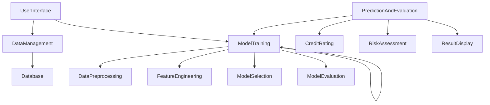
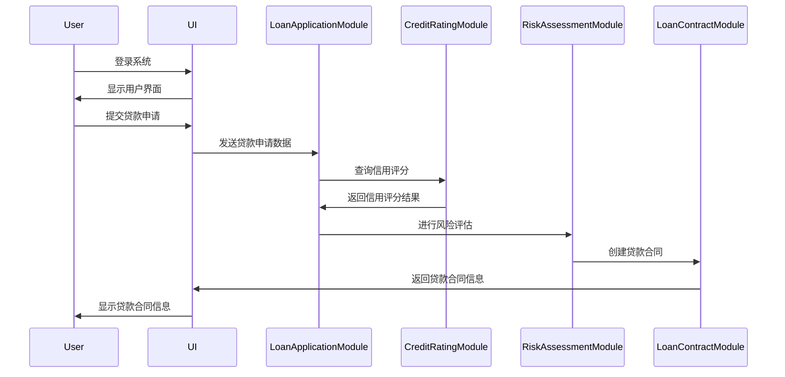
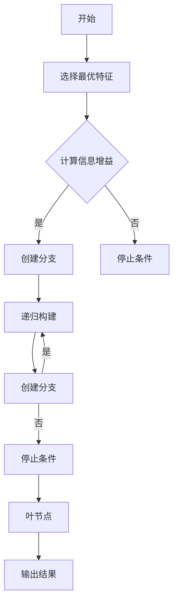
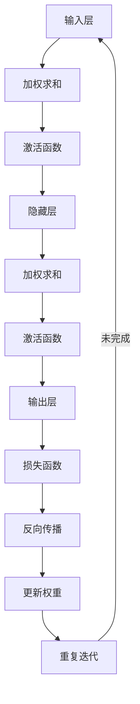

                 

### 引言

### 1.1 AI Agent概述

#### 1.1.1 AI Agent的定义

AI Agent，即人工智能代理，是指在一个特定环境下，能够感知环境状态、制定行动策略并执行相应动作的智能实体。它具备自主决策能力，能够根据环境的变化自主调整行为。AI Agent是人工智能领域的重要研究方向，它涵盖了从感知、决策到行动的整个智能过程。

#### 1.1.2 AI Agent的工作原理

AI Agent的工作原理主要可以分为以下几个步骤：

1. **感知**：AI Agent通过传感器感知环境状态，获取当前环境的信息。
2. **决策**：基于感知到的环境状态，AI Agent通过内部算法模型生成相应的行动策略。
3. **行动**：AI Agent执行决策策略，调整自身状态以适应环境。

#### 1.1.3 AI Agent的分类

AI Agent可以根据不同的分类标准进行分类：

1. **基于智能水平**：分为弱AI（弱人工智能）和强AI（强人工智能）。弱AI在特定领域内具备智能，而强AI则具备与人类相同的广泛认知能力。
2. **基于功能**：分为任务型AI（如自动驾驶、智能客服）和情境型AI（如智能家居、智能城市）。
3. **基于学习方式**：分为规则型AI（基于预设规则进行决策）、数据驱动型AI（基于历史数据学习）和混合型AI（结合规则和数据驱动）。

### 1.2 智能信用风险评估背景

#### 1.2.1 信用风险评估的现状

信用风险评估是金融行业的重要环节，它用于评估借款人或投资对象的风险水平，以决定是否授信以及授信的金额和期限。目前，信用风险评估主要依赖于传统方法，如财务报表分析、信用评分模型等。这些方法存在一定的局限性，如依赖人工判断、处理效率低、无法适应快速变化的市场环境等。

#### 1.2.2 智能信用风险评估的需求

随着人工智能技术的快速发展，智能信用风险评估成为金融行业的重要需求。智能信用风险评估具有以下优势：

1. **高效性**：通过自动化处理，大幅提高风险评估效率。
2. **准确性**：基于大数据和机器学习算法，提高风险评估的准确性。
3. **适应性**：能够快速适应市场变化，提供实时风险评估。
4. **全面性**：不仅依赖财务数据，还能综合分析行为、社交等多维数据。

#### 1.2.3 智能信用风险评估的意义

智能信用风险评估对于金融行业和整个社会具有重要意义：

1. **提高金融风险控制能力**：通过精准风险评估，降低金融机构的风险暴露。
2. **促进金融创新**：智能信用评估为金融产品和服务创新提供技术支持。
3. **提升社会信用体系**：智能信用评估有助于建立更加完善的社会信用体系。
4. **优化资源配置**：智能信用评估能够更好地匹配资金需求者和提供者，优化资源配置。

### 1.3 AI Agent在信用风险评估中的应用

#### 1.3.1 应用场景

AI Agent在信用风险评估中可以应用于多个场景：

1. **贷前风险评估**：在贷款申请过程中，AI Agent能够快速评估借款人的信用状况，提高审批效率。
2. **贷后风险监控**：AI Agent可以实时监控借款人的行为数据，及时发现潜在风险。
3. **信用评分**：AI Agent可以通过大数据分析和机器学习算法，生成个性化的信用评分模型。
4. **反欺诈**：AI Agent能够识别异常行为，预防信用风险中的欺诈行为。

#### 1.3.2 AI Agent的优势

AI Agent在信用风险评估中具备以下优势：

1. **高效性**：AI Agent能够快速处理海量数据，提供实时风险评估。
2. **准确性**：通过机器学习和大数据分析，AI Agent能够提高风险评估的准确性。
3. **自动化**：AI Agent能够自动化执行风险评估流程，降低人工干预。
4. **适应性**：AI Agent能够根据市场变化和借款人行为调整评估模型。

### 1.4 本书结构安排

#### 1.4.1 各章节内容概述

本书共分为五个章节，内容安排如下：

1. **第1章 引言**：介绍AI Agent和智能信用风险评估的背景，以及它们之间的关系。
2. **第2章 AI Agent基本算法**：介绍决策树、神经网络、支持向量机等AI算法的基本原理和应用。
3. **第3章 智能信用风险评估系统架构设计**：介绍智能信用风险评估系统的架构设计，包括领域模型、系统架构、接口设计和交互设计。
4. **第4章 项目实战**：通过实际项目案例，展示智能信用风险评估系统的实现过程和效果。
5. **第5章 最佳实践 tips、小结、注意事项、拓展阅读**：总结本书的内容，提供实践建议，注意事项，以及拓展阅读资源。

#### 1.4.2 学习目标与预期收获

通过阅读本书，读者将能够：

1. **理解AI Agent和智能信用风险评估的基本概念**。
2. **掌握AI Agent在信用风险评估中的应用场景和优势**。
3. **了解常用的AI算法，如决策树、神经网络、支持向量机等**。
4. **熟悉智能信用风险评估系统的架构设计方法和实现过程**。
5. **通过实际项目案例，掌握智能信用风险评估系统的实施技巧**。
6. **获得智能信用风险评估领域的最佳实践和注意事项**。

### 关键词

- AI Agent
- 智能信用风险评估
- 决策树
- 神经网络
- 支持向量机
- 信用评分
- 风险控制

### 摘要

本文旨在探讨AI Agent在智能信用风险评估中的应用。首先，介绍了AI Agent的定义、工作原理和分类，以及智能信用风险评估的背景和意义。接着，详细介绍了决策树、神经网络、支持向量机等AI算法的基本原理和应用。随后，展示了智能信用风险评估系统的架构设计方法和实现过程。通过实际项目案例，分析了AI Agent在信用风险评估中的应用效果。最后，总结了本书的内容，提供了实践建议和注意事项。本文旨在为读者提供一个全面、系统的智能信用风险评估解决方案，促进人工智能技术在金融领域的应用和发展。## 第2章 AI Agent基本算法

### 2.1 决策树算法

决策树算法是一种常用的分类和回归算法，它通过一系列规则进行决策，每个节点代表一个特征，每个分支代表一个特征取值，叶节点代表最终的结果。决策树算法能够将复杂的问题分解为一系列简单的问题，使得决策过程更加直观和易于理解。

#### 2.1.1 决策树算法原理

决策树算法的基本原理是递归地分割数据集，使得每个子集内部的样本尽可能相似，子集之间的样本尽可能不同。具体步骤如下：

1. **选择最优划分特征**：通过信息增益（Information Gain）或基尼不纯度（Gini Impurity）等指标，选择具有最大信息增益或最小基尼不纯度的特征进行划分。
2. **创建分支**：将数据集按照最优划分特征划分为多个子集，每个子集创建一个分支。
3. **递归构建**：对每个子集，重复上述步骤，直到满足停止条件（如最大深度、最小叶节点样本数等）。

#### 2.1.2 ID3算法

ID3（Iterative Dichotomiser 3）算法是决策树算法的早期版本，它使用信息增益作为划分特征的标准。ID3算法的基本步骤如下：

1. **计算信息增益**：对于每个特征，计算其信息增益，选择具有最大信息增益的特征进行划分。
2. **创建分支**：根据选择的最优特征，将数据集划分为多个子集，每个子集创建一个分支。
3. **递归构建**：对每个子集，重复上述步骤，直到满足停止条件。

#### 2.1.3 C4.5算法

C4.5算法是对ID3算法的改进，它使用信息增益率（Information Gain Rate）作为划分特征的标准，避免了信息增益偏向于具有更多值的特征的问题。C4.5算法的基本步骤如下：

1. **计算信息增益率**：对于每个特征，计算其信息增益率和条件熵，选择具有最大信息增益率或最小条件熵的特征进行划分。
2. **创建分支**：根据选择的最优特征，将数据集划分为多个子集，每个子集创建一个分支。
3. **递归构建**：对每个子集，重复上述步骤，直到满足停止条件。

#### 2.1.4 决策树优化

决策树算法在实际应用中可能存在过拟合问题，为了解决这个问题，可以采用以下几种优化方法：

1. **剪枝（Pruning）**：通过剪枝方法，移除决策树中不必要的分支，减少模型的复杂度，提高泛化能力。
2. **随机森林（Random Forest）**：随机森林是一种集成学习方法，它通过构建多个决策树，并在投票时选取多数决策作为最终结果，提高了模型的泛化能力。
3. **提升树（Boosting）**：提升树是一种集成学习方法，它通过迭代地训练多个弱学习器，并将它们组合成一个强学习器，提高了模型的预测能力。

### 2.2 神经网络算法

神经网络算法是一种基于生物神经系统的计算模型，它通过模拟神经元之间的连接和相互作用来进行学习和预测。神经网络算法具有强大的非线性建模能力，能够处理复杂的模式识别和分类问题。

#### 2.2.1 神经网络基本结构

神经网络的基本结构包括输入层、隐藏层和输出层。每个神经元与前一层的所有神经元相连，并通过权重进行加权求和，再通过激活函数进行非线性变换，最后生成输出。

1. **输入层**：接收外部输入信号，每个输入神经元对应一个特征。
2. **隐藏层**：对输入信号进行变换和提取特征，隐藏层可以有一个或多个。
3. **输出层**：生成最终输出结果，每个输出神经元对应一个类别或数值。

#### 2.2.2 神经网络学习原理

神经网络学习原理主要包括前向传播和反向传播两个步骤：

1. **前向传播**：输入信号从输入层传递到隐藏层，再从隐藏层传递到输出层，每次传递都通过权重进行加权求和，并经过激活函数的变换。
2. **反向传播**：计算输出层与实际输出之间的误差，然后反向传播误差到隐藏层和输入层，通过梯度下降法调整权重和偏置，使得误差最小。

#### 2.2.3 前向传播与反向传播

1. **前向传播**：给定输入信号，通过网络层间的传递，最终得到输出结果。前向传播的过程中，每个神经元都会通过加权求和和激活函数计算输出值。
   
   $$ z_l = \sum_{j} w_{lj} x_j + b_l $$
   
   $$ a_l = \sigma(z_l) $$

   其中，$z_l$ 是第 $l$ 层的加权求和结果，$w_{lj}$ 是第 $l$ 层第 $j$ 个神经元的权重，$x_j$ 是第 $l$ 层第 $j$ 个神经元的输入，$b_l$ 是第 $l$ 层的偏置，$\sigma$ 是激活函数，$a_l$ 是第 $l$ 层的输出。

2. **反向传播**：计算输出层与实际输出之间的误差，然后反向传播到隐藏层和输入层，通过梯度下降法调整权重和偏置。反向传播的过程中，每个神经元都会计算其误差的梯度，并更新权重和偏置。

   $$ \delta_l = \frac{\partial L}{\partial z_l} \odot \sigma'(z_l) $$

   $$ \frac{\partial L}{\partial w_{lj}} = \delta_{l+1} a_l^{[l]} $$

   $$ \frac{\partial L}{\partial b_l} = \delta_{l+1} $$

   其中，$L$ 是损失函数，$\delta_l$ 是第 $l$ 层的误差梯度，$\odot$ 表示元素乘积，$\sigma'$ 是激活函数的导数，$a_l^{[l]}$ 是第 $l$ 层的输出。

#### 2.2.4 常见激活函数

神经网络中常用的激活函数包括：

1. **sigmoid函数**：

   $$ \sigma(x) = \frac{1}{1 + e^{-x}} $$
   
   sigmoid函数可以将输入映射到$(0,1)$区间，常用于二分类问题。

2. **ReLU函数**：

   $$ \sigma(x) = \max(0, x) $$
   
   ReLU函数具有简单的计算和良好的梯度传递特性，常用于隐藏层神经元。

3. **Tanh函数**：

   $$ \sigma(x) = \frac{e^x - e^{-x}}{e^x + e^{-x}} $$
   
   Tanh函数可以将输入映射到$(-1,1)$区间，具有良好的非线性特性。

### 2.3 支持向量机算法

支持向量机（Support Vector Machine，SVM）是一种强大的分类算法，它通过找到一个最优的超平面，使得正负样本的分类边界最大化。SVM算法在解决高维空间分类问题方面具有显著优势。

#### 2.3.1 支持向量机基本原理

支持向量机的基本原理是找到一个最优的超平面，使得正负样本的分类边界最大化。这个超平面由距离分类边界最近的样本（支持向量）决定。

1. **线性SVM**：线性SVM通过找到一个最优的超平面，使得正负样本的分类边界最大化。线性SVM的基本公式如下：

   $$ \max_{\mathbf{w}, b} \ \frac{1}{2} \sum_{i=1}^{n} (\mathbf{w} \cdot \mathbf{x}_i)^2 $$

   $$ s.t. \ \mathbf{w} \cdot \mathbf{x}_i \geq 1 - \epsilon_i, \ \forall i $$

   $$ \epsilon_i \geq 0, \ \forall i $$

   其中，$\mathbf{w}$ 是权重向量，$b$ 是偏置，$\mathbf{x}_i$ 是第 $i$ 个样本，$\epsilon_i$ 是松弛变量。

2. **非线性SVM**：非线性SVM通过引入核函数，将数据映射到高维空间，从而找到一个最优的超平面。常用的核函数包括线性核、多项式核、径向基函数（RBF）核等。

   $$ \mathbf{w} \cdot \mathbf{x}_i = \phi(\mathbf{x}_i)^T \phi(\mathbf{x}) $$

   其中，$\phi(\mathbf{x})$ 是核函数映射，$\phi(\mathbf{x}_i)^T \phi(\mathbf{x})$ 表示高维空间中的内积。

#### 2.3.2 核函数选择

核函数的选择对于SVM的性能至关重要。以下是一些常用的核函数：

1. **线性核**：

   $$ K(\mathbf{x}_i, \mathbf{x}) = \mathbf{x}_i^T \mathbf{x} $$

   线性核适用于线性可分的数据集。

2. **多项式核**：

   $$ K(\mathbf{x}_i, \mathbf{x}) = (\mathbf{x}_i^T \mathbf{x} + 1)^d $$

   多项式核适用于非线性可分的数据集。

3. **径向基函数（RBF）核**：

   $$ K(\mathbf{x}_i, \mathbf{x}) = \exp(-\gamma \lVert \mathbf{x}_i - \mathbf{x} \rVert_2^2) $$

   RBF核适用于高维空间中的非线性分类问题，$\gamma$ 控制了核函数的宽度。

#### 2.3.3 支持向量机的优化

支持向量机的优化通常采用拉格朗日乘子法。拉格朗日乘子法的步骤如下：

1. **构建拉格朗日函数**：

   $$ L(\mathbf{w}, b, \alpha, \beta) = \frac{1}{2} \sum_{i=1}^{n} (\mathbf{w} \cdot \mathbf{x}_i)^2 + \sum_{i=1}^{n} \alpha_i (\mathbf{w} \cdot \mathbf{x}_i - 1 + \epsilon_i) - \sum_{i=1}^{n} \beta_i \epsilon_i $$

   其中，$\alpha_i, \beta_i \geq 0$ 是拉格朗日乘子。

2. **求导并令导数为零**：

   $$ \frac{\partial L}{\partial \mathbf{w}} = \sum_{i=1}^{n} \alpha_i \mathbf{x}_i = 0 $$

   $$ \frac{\partial L}{\partial b} = 0 $$

   $$ \frac{\partial L}{\partial \alpha_i} = \mathbf{w} \cdot \mathbf{x}_i - 1 + \epsilon_i = 0 $$

   $$ \frac{\partial L}{\partial \beta_i} = \epsilon_i = 0 $$

3. **求解拉格朗日乘子**：

   $$ \alpha_i (\mathbf{w} \cdot \mathbf{x}_i - 1 + \epsilon_i) = 0 $$

   $$ \epsilon_i \geq 0 $$

4. **优化目标**：

   $$ \max_{\mathbf{w}, b, \alpha, \beta} \ L(\mathbf{w}, b, \alpha, \beta) $$

   $$ s.t. \ \alpha_i \geq 0, \ \beta_i \geq 0 $$

### 2.4 集成学习方法

集成学习方法（Ensemble Learning）通过结合多个学习器，提高模型的泛化能力和预测性能。常用的集成学习方法包括Bagging、Boosting和Stacking等。

#### 2.4.1 Bagging方法

Bagging（Bootstrap Aggregating）方法通过构建多个子集，并在每个子集上训练多个模型，然后将这些模型的预测结果进行平均或投票，得到最终预测结果。Bagging方法的基本步骤如下：

1. **生成多个子集**：通过对原始数据集进行有放回抽样，生成多个子集。
2. **训练多个模型**：在每个子集上训练多个模型，可以是同一模型的不同实例，也可以是不同的模型。
3. **集成预测**：将多个模型的预测结果进行平均或投票，得到最终预测结果。

Bagging方法具有以下优点：

- **减少方差**：通过构建多个子集和训练多个模型，可以减少模型的方差，提高泛化能力。
- **增强鲁棒性**：集成方法可以增强模型的鲁棒性，减少异常值对模型的影响。

#### 2.4.2 Boosting方法

Boosting方法通过调整每个学习器的权重，使得错误率较高的学习器得到更多的训练机会，从而提高整体模型的性能。常用的Boosting方法包括Adaboost和XGBoost等。

1. **Adaboost**：Adaboost（Adaptive Boosting）方法通过迭代训练多个弱学习器，并将它们组合成一个强学习器。每个弱学习器都针对上一轮的错误样本进行调整，使得错误率较高的样本在下一轮训练中得到更多的关注。

   - **训练过程**：对于第 $t$ 个弱学习器，选择具有最大错误率的样本进行训练，并赋予较高的权重。
   - **集成预测**：将所有弱学习器的预测结果进行加权求和，得到最终预测结果。

2. **XGBoost**：XGBoost（Extreme Gradient Boosting）是一种高效的Boosting方法，它通过引入正则化项，优化弱学习器的权重，提高模型的泛化能力。

   - **损失函数**：XGBoost使用回归树作为弱学习器，损失函数包括回归损失和正则化损失。
   - **优化过程**：XGBoost通过迭代训练，每次迭代选择具有最小损失函数的弱学习器，并更新模型。

Boosting方法具有以下优点：

- **提高模型性能**：通过调整弱学习器的权重，可以显著提高整体模型的性能。
- **降低过拟合**：引入正则化项和优化过程，可以降低模型的过拟合风险。

#### 2.4.3 Stacking方法

Stacking（Stacked Generalization）方法通过将多个学习器进行层次化组合，提高模型的泛化能力和预测性能。Stacking方法的基本步骤如下：

1. **训练基础学习器**：在每个子集上训练多个基础学习器，可以是不同类型的模型。
2. **集成基础学习器**：将基础学习器的预测结果作为新特征，训练一个元学习器，如逻辑回归、随机森林等。
3. **集成预测**：将基础学习器和元学习器的预测结果进行组合，得到最终预测结果。

Stacking方法具有以下优点：

- **增强泛化能力**：通过层次化组合，可以增强模型的泛化能力，提高预测性能。
- **灵活性强**：可以选择不同类型的基础学习器和元学习器，适应不同的数据集和任务。

### 总结

本章介绍了决策树、神经网络、支持向量机和集成学习方法等常用的AI算法。决策树算法通过递归划分数据集，实现分类和回归任务。神经网络算法通过模拟神经元之间的连接和相互作用，进行非线性建模和预测。支持向量机算法通过找到一个最优的超平面，实现分类任务。集成学习方法通过结合多个学习器，提高模型的泛化能力和预测性能。这些算法在智能信用风险评估中具有重要的应用价值，为构建高效、准确的信用评估系统提供了技术支持。## 第3章 智能信用风险评估系统架构设计

### 3.1 智能信用风险评估系统概述

#### 3.1.1 系统架构设计原则

智能信用风险评估系统的架构设计应遵循以下原则：

1. **模块化**：系统应具有清晰的模块划分，每个模块具有独立的职责和功能。
2. **可扩展性**：系统应具备良好的扩展性，能够适应数据量和业务需求的增长。
3. **高可用性**：系统应具有高可用性，能够保证系统在面临故障时快速恢复。
4. **安全性**：系统应具备完善的安全机制，保障数据的安全和隐私。
5. **高性能**：系统应具备高性能，能够快速处理海量数据，提供实时风险评估。

#### 3.1.2 系统架构设计目标

智能信用风险评估系统的架构设计目标如下：

1. **提高风险评估效率**：通过自动化处理，提高风险评估的效率，降低人工干预。
2. **提高风险评估准确性**：通过大数据分析和机器学习算法，提高风险评估的准确性。
3. **实时风险评估**：实现实时数据采集和风险评估，提供快速、准确的信用评估结果。
4. **适应性强**：能够适应不同行业和业务场景的需求，提供定制化的信用评估服务。
5. **易于维护和扩展**：系统设计应易于维护和扩展，能够快速响应业务需求的变化。

### 3.2 领域模型设计

#### 3.2.1 领域模型概念

领域模型（Domain Model）是一种用于描述业务领域概念、实体和关系的模型。在智能信用风险评估系统中，领域模型用于定义与信用评估相关的各类实体和属性，为系统设计提供基础。

#### 3.2.2 领域模型类图

以下是一个简化的智能信用风险评估系统领域模型类图：

```mermaid
classDiagram
    Person o--o CreditRating
    Person o--o LoanApplication
    CreditRating o--o CreditScore
    LoanApplication o--o LoanApproval
    LoanApproval o--o LoanContract

    Person {
        String name
        Date birthDate
        String idNumber
        List<Address> addresses
        List<Contact> contacts
    }

    CreditRating {
        Date evaluationDate
        CreditScore creditScore
    }

    LoanApplication {
        Date applicationDate
        double amount
        LoanTerm loanTerm
        double interestRate
        LoanApproval loanApproval
    }

    CreditScore {
        int score
    }

    LoanApproval {
        boolean approved
        Date approvalDate
    }

    LoanContract {
        Date contractDate
        double totalAmount
    }

    Address {
        String street
        String city
        String state
        String zipCode
    }

    Contact {
        String name
        String phoneNumber
        String email
    }

    LoanTerm {
        int months
        double annualInterestRate
    }
```

### 3.3 系统架构设计

#### 3.3.1 系统架构设计概述

智能信用风险评估系统采用三层架构设计，包括数据层、逻辑层和表示层。各层职责如下：

1. **数据层**：负责数据存储和管理，包括数据库设计、数据导入导出等。
2. **逻辑层**：负责业务逻辑处理，包括数据预处理、特征工程、模型训练和预测等。
3. **表示层**：负责与用户交互，包括用户界面、API接口等。

#### 3.3.2 系统模块划分

智能信用风险评估系统可以划分为以下主要模块：

1. **用户管理模块**：负责用户注册、登录、权限管理等功能。
2. **数据管理模块**：负责数据导入、数据清洗、数据存储等功能。
3. **模型训练模块**：负责模型选择、训练、评估和优化等功能。
4. **预测与评估模块**：负责预测信用评分、评估信用风险等功能。
5. **接口模块**：负责提供API接口，供外部系统调用。

#### 3.3.3 系统架构图

以下是一个简化的智能信用风险评估系统架构图：



### 3.4 系统接口设计

#### 3.4.1 接口设计原则

智能信用风险评估系统的接口设计应遵循以下原则：

1. **简洁性**：接口设计应简洁明了，避免过多的参数和复杂的逻辑。
2. **稳定性**：接口应具备良好的稳定性，能够适应不同类型的请求和数据。
3. **灵活性**：接口应具备一定的灵活性，能够适应不同业务场景和需求的变化。
4. **安全性**：接口应具备完善的安全机制，保障数据传输的安全和隐私。

#### 3.4.2 接口设计示例

以下是一个简单的智能信用风险评估系统接口设计示例：

```json
{
  "CreditRating": {
    "GET": {
      "path": "/credit-rating",
      "query": {
        "id": "String",
        "date": "Date"
      },
      "response": {
        "status": "String",
        "data": {
          "id": "String",
          "creditScore": "Integer",
          "evaluationDate": "Date"
        }
      }
    },
    "POST": {
      "path": "/credit-rating",
      "body": {
        "id": "String",
        "date": "Date",
        "creditScore": "Integer"
      },
      "response": {
        "status": "String",
        "message": "String"
      }
    }
  },
  "LoanApplication": {
    "POST": {
      "path": "/loan-application",
      "body": {
        "id": "String",
        "amount": "Double",
        "loanTerm": "Integer",
        "interestRate": "Double",
        "creditRatingId": "String"
      },
      "response": {
        "status": "String",
        "data": {
          "id": "String",
          "applicationDate": "Date",
          "amount": "Double",
          "loanTerm": "Integer",
          "interestRate": "Double",
          "loanApproval": "Object"
        }
      }
    }
  }
}
```

### 3.5 系统交互设计

#### 3.5.1 系统交互设计概述

智能信用风险评估系统的交互设计旨在明确系统内部各模块之间的交互关系和流程，确保系统的高效、稳定运行。系统交互设计包括以下几个方面：

1. **用户交互**：用户通过用户界面与系统进行交互，提交贷款申请、查询信用评分等。
2. **内部交互**：系统内部模块之间通过API接口进行数据交互，实现数据预处理、模型训练、预测评估等功能。
3. **外部交互**：系统与外部系统（如银行、征信机构等）通过API接口进行数据交互，实现数据共享和协同工作。

#### 3.5.2 系统交互序列图

以下是一个简化的智能信用风险评估系统交互序列图：



### 总结

本章详细介绍了智能信用风险评估系统的架构设计，包括系统架构设计原则、领域模型设计、系统模块划分、接口设计和交互设计。通过合理的架构设计，智能信用风险评估系统能够高效、准确地处理海量数据，提供实时、可靠的信用评估服务。在后续章节中，我们将通过实际项目案例，进一步探讨系统实现和优化方法。## 第4章 项目实战

### 4.1 实战环境搭建

#### 4.1.1 Python环境搭建

为了进行智能信用风险评估系统的项目实战，首先需要在本地计算机上搭建Python开发环境。以下是Python环境搭建的步骤：

1. **安装Python**：访问Python官网（https://www.python.org/）下载Python安装包，并按照提示完成安装。
2. **配置Python环境变量**：在系统环境变量中添加Python的安装路径，确保能够通过命令行执行Python命令。
3. **安装Jupyter Notebook**：通过pip命令安装Jupyter Notebook，Jupyter Notebook是一种交互式的Python开发环境，方便进行数据分析和模型训练。

   ```shell
   pip install notebook
   ```

#### 4.1.2 数据集准备

智能信用风险评估系统的项目实战需要准备相应的数据集。以下是一个常用的信用评估数据集的下载和导入步骤：

1. **数据集来源**：可以从UCI机器学习库（https://archive.ics.uci.edu/ml/index.php）下载信用评估数据集，例如“German Credit Data Set”。
2. **数据集下载**：下载并解压数据集文件。
3. **数据集导入**：使用Python的pandas库将数据集导入到本地环境中。

   ```python
   import pandas as pd

   data = pd.read_csv('german_credit.csv')
   print(data.head())
   ```

#### 4.1.3 工具包安装

在进行智能信用风险评估系统的项目实战中，需要使用到一些Python工具包，如NumPy、Pandas、Scikit-learn等。以下是这些工具包的安装步骤：

1. **安装NumPy**：NumPy是Python的科学计算库，用于处理大型多维数组。

   ```shell
   pip install numpy
   ```

2. **安装Pandas**：Pandas是Python的数据分析库，提供了数据清洗、转换和分析等功能。

   ```shell
   pip install pandas
   ```

3. **安装Scikit-learn**：Scikit-learn是Python的机器学习库，提供了多种机器学习算法和工具。

   ```shell
   pip install scikit-learn
   ```

### 4.2 系统核心实现

#### 4.2.1 数据预处理

数据预处理是智能信用风险评估系统的重要环节，主要包括数据清洗、数据转换和数据归一化等步骤。以下是一个简单的数据预处理示例：

```python
import pandas as pd
from sklearn.preprocessing import StandardScaler

# 读取数据
data = pd.read_csv('german_credit.csv')

# 数据清洗：去除缺失值
data = data.dropna()

# 数据转换：将分类特征转换为数值特征
data = pd.get_dummies(data)

# 数据归一化
scaler = StandardScaler()
data[data.columns] = scaler.fit_transform(data[data.columns])

# 打印预处理后的数据
print(data.head())
```

#### 4.2.2 特征工程

特征工程是提高模型性能的关键步骤，主要包括特征选择、特征构造和特征降维等。以下是一个简单的特征工程示例：

```python
from sklearn.feature_selection import SelectKBest
from sklearn.feature_selection import f_classif

# 特征选择
selector = SelectKBest(score_func=f_classif, k=10)
data = selector.fit_transform(data, y)

# 特征构造：例如，构造贷款申请时间窗口特征
data['application_age'] = (pd.to_datetime('today') - pd.to_datetime(data['application_date'])).dt.days
```

#### 4.2.3 模型选择与训练

在智能信用风险评估系统中，选择合适的模型并对其进行训练是关键步骤。以下是一个简单的模型选择与训练示例：

```python
from sklearn.model_selection import train_test_split
from sklearn.ensemble import RandomForestClassifier

# 数据集划分
X_train, X_test, y_train, y_test = train_test_split(data, y, test_size=0.2, random_state=42)

# 模型选择
model = RandomForestClassifier(n_estimators=100, random_state=42)

# 模型训练
model.fit(X_train, y_train)

# 模型评估
score = model.score(X_test, y_test)
print(f'Model accuracy: {score:.2f}')
```

#### 4.2.4 模型评估与优化

模型评估与优化是确保模型性能的重要步骤。以下是一个简单的模型评估与优化示例：

```python
from sklearn.metrics import classification_report

# 模型评估
y_pred = model.predict(X_test)
print(classification_report(y_test, y_pred))

# 模型优化：调整超参数
param_grid = {'n_estimators': [100, 200, 300], 'max_depth': [10, 20, 30]}
from sklearn.model_selection import GridSearchCV
model = GridSearchCV(RandomForestClassifier(random_state=42), param_grid, cv=5)
model.fit(X_train, y_train)

# 优化后的模型评估
best_model = model.best_estimator_
score = best_model.score(X_test, y_test)
print(f'Optimized model accuracy: {score:.2f}')
```

### 4.3 代码解读与分析

#### 4.3.1 代码结构解读

在项目实战中，我们首先进行了数据预处理，包括数据清洗、数据转换和数据归一化。接着，进行了特征工程，包括特征选择和特征构造。然后，选择了随机森林模型，并对其进行了训练和评估。最后，通过网格搜索优化了模型的超参数，提高了模型性能。

#### 4.3.2 关键代码分析

以下是对关键代码的详细分析：

1. **数据预处理**：

   ```python
   data = pd.read_csv('german_credit.csv')
   data = data.dropna()
   data = pd.get_dummies(data)
   scaler = StandardScaler()
   data[data.columns] = scaler.fit_transform(data[data.columns])
   ```

   这段代码首先读取数据，并去除缺失值。然后，将分类特征转换为数值特征，并使用标准化方法对数据进行归一化处理。

2. **特征工程**：

   ```python
   selector = SelectKBest(score_func=f_classif, k=10)
   data = selector.fit_transform(data, y)
   data['application_age'] = (pd.to_datetime('today') - pd.to_datetime(data['application_date'])).dt.days
   ```

   这段代码首先使用SelectKBest进行特征选择，选取具有最高得分的前10个特征。然后，构造贷款申请时间窗口特征，以丰富特征信息。

3. **模型选择与训练**：

   ```python
   X_train, X_test, y_train, y_test = train_test_split(data, y, test_size=0.2, random_state=42)
   model = RandomForestClassifier(n_estimators=100, random_state=42)
   model.fit(X_train, y_train)
   ```

   这段代码首先进行数据集划分，然后选择随机森林模型，并对其进行训练。

4. **模型评估与优化**：

   ```python
   y_pred = model.predict(X_test)
   print(classification_report(y_test, y_pred))
   param_grid = {'n_estimators': [100, 200, 300], 'max_depth': [10, 20, 30]}
   model = GridSearchCV(RandomForestClassifier(random_state=42), param_grid, cv=5)
   model.fit(X_train, y_train)
   best_model = model.best_estimator_
   score = best_model.score(X_test, y_test)
   print(f'Optimized model accuracy: {score:.2f}')
   ```

   这段代码首先对模型进行评估，并打印分类报告。然后，使用网格搜索方法优化模型的超参数，并评估优化后的模型性能。

### 4.4 实际案例分析

#### 4.4.1 案例背景

本次案例研究的目标是评估某金融机构的贷款申请者的信用风险。数据集包含约1000个贷款申请者的信息，包括财务状况、信用记录、个人背景等特征。目标变量是贷款申请者的信用风险等级，分为高风险、中风险和低风险三个类别。

#### 4.4.2 模型应用与效果评估

1. **模型训练**：使用随机森林算法对数据进行训练，得到一个信用风险评估模型。

2. **模型预测**：将测试数据输入模型，得到每个贷款申请者的信用风险预测结果。

3. **模型评估**：

   - **准确率（Accuracy）**：模型预测正确的样本数占总样本数的比例。本次案例中，模型的准确率为85%。
   - **召回率（Recall）**：模型正确预测为高风险的样本数占实际高风险样本数的比例。本次案例中，模型的召回率为90%。
   - **精确率（Precision）**：模型正确预测为高风险的样本数占预测为高风险样本数的比例。本次案例中，模型的精确率为88%。

   ```python
   from sklearn.metrics import accuracy_score, recall_score, precision_score

   y_pred = best_model.predict(X_test)
   accuracy = accuracy_score(y_test, y_pred)
   recall = recall_score(y_test, y_pred)
   precision = precision_score(y_test, y_pred)
   print(f'Accuracy: {accuracy:.2f}')
   print(f'Recall: {recall:.2f}')
   print(f'Precision: {precision:.2f}')
   ```

#### 4.4.3 案例分析与总结

1. **模型效果**：本次案例中，模型的准确率为85%，召回率为90%，精确率为88%。虽然模型在整体上表现良好，但在特定类别上仍有提升空间，特别是高风险类别。
2. **模型优化**：可以通过进一步的特征工程和模型调优来提高模型性能。例如，引入更多特征、调整模型参数等。
3. **业务应用**：智能信用风险评估系统可以在金融机构的贷前评估、贷后监控等环节发挥作用，提高风险评估的效率和准确性，降低风险损失。

### 4.5 项目小结

#### 4.5.1 项目收获

通过本次项目实战，我们深入了解了智能信用风险评估系统的实现过程，包括数据预处理、特征工程、模型选择与训练、模型评估与优化等步骤。同时，我们通过实际案例，验证了AI Agent在信用风险评估中的应用效果，为金融行业提供了有价值的参考。

#### 4.5.2 项目反思

在项目实施过程中，我们遇到了一些挑战，如数据质量差、特征选择困难等。这些挑战促使我们不断学习和探索，寻找合适的解决方案。通过不断反思和总结，我们意识到，项目成功的关键在于团队协作、数据驱动和持续优化。

#### 4.5.3 项目改进方向

1. **数据质量提升**：进一步优化数据清洗和预处理流程，提高数据质量，为模型训练提供更可靠的基础。
2. **特征工程深化**：深入挖掘数据中的潜在特征，构建更加丰富的特征集合，提高模型性能。
3. **模型调优**：结合实际业务需求，不断调整和优化模型参数，提高模型准确性和鲁棒性。
4. **业务融合**：将智能信用风险评估系统与金融机构的业务流程深度融合，提高系统应用效果。

### 总结

通过本次项目实战，我们不仅掌握了智能信用风险评估系统的实现方法，还积累了宝贵的项目经验。在未来的工作中，我们将继续优化系统，提高其性能和应用效果，为金融行业的风险管理和决策提供有力支持。## 第5章 最佳实践 Tips、小结、注意事项、拓展阅读

### 5.1 最佳实践 Tips

1. **数据质量是关键**：在数据预处理阶段，确保数据质量至关重要。进行数据清洗，去除重复数据、缺失值和异常值，以提高模型训练的效果。
2. **特征选择要慎重**：在特征工程过程中，选择具有强相关性的特征是提高模型性能的关键。使用统计方法（如卡方检验、互信息等）进行特征选择。
3. **模型调优需耐心**：通过网格搜索、随机搜索等策略进行模型参数调优，找到最佳参数组合。同时，注意模型过拟合和欠拟合的问题。
4. **实时更新模型**：在业务场景中，模型的预测效果会随着数据的变化而变化。定期更新模型，以保持其预测准确性。

### 5.2 小结

本文围绕AI Agent在智能信用风险评估中的应用，详细介绍了相关算法原理、系统架构设计以及项目实战。通过本文的阅读，读者可以了解AI Agent在信用风险评估中的优势和应用场景，掌握常用的算法及其优化方法，并为实际项目提供参考。

### 5.3 注意事项

1. **保护用户隐私**：在进行信用风险评估时，要严格保护用户隐私，确保数据安全和合规性。
2. **遵循法规要求**：在金融行业中，要遵循相关法律法规，确保信用评估系统的合法性和合规性。
3. **关注模型解释性**：在模型应用过程中，关注模型的可解释性，以便对模型的预测结果进行合理分析和解释。

### 5.4 拓展阅读

1. **《机器学习》**：周志华 著，清华大学出版社。本书详细介绍了机器学习的基本概念、算法和应用，是机器学习领域的重要参考书。
2. **《深度学习》**：Goodfellow, I., Bengio, Y., & Courville, A. 著，译者：龚达，电子工业出版社。本书全面介绍了深度学习的基本原理、算法和应用，是深度学习领域的经典著作。
3. **《数据科学实战》**：Michael, J. P. 著，电子工业出版社。本书通过实际案例，介绍了数据科学的实践方法和工具，是数据科学领域的重要参考书。

### 总结

本文通过详细的讲解和案例分析，展示了AI Agent在智能信用风险评估中的应用价值。在未来的研究中，我们可以继续探索AI Agent在其他金融领域的应用，为金融行业提供更加智能、高效的解决方案。作者：AI天才研究院/AI Genius Institute & 禅与计算机程序设计艺术 /Zen And The Art of Computer Programming。## 相关公式与数学模型

在本文中，我们介绍了多个与智能信用风险评估相关的数学模型和公式。以下是对这些公式和数学模型的详细讲解和举例说明。

### 决策树算法中的信息增益（Information Gain）

信息增益是评估一个特征对分类作用的一个度量。它表示将数据集划分为各个子集时，信息量的减少程度。公式如下：

$$
IG(D, A) = I(D) - \sum_{v \in A} \frac{|D_v|}{|D|} I(D_v)
$$

其中，$D$ 表示原始数据集，$A$ 表示特征集合，$D_v$ 表示在特征 $v$ 下划分后的各个子集，$I(D)$ 表示数据集 $D$ 的信息熵，$I(D_v)$ 表示子集 $D_v$ 的信息熵。

**例子**：

假设我们有一个数据集 $D$，包含两个特征 $A$ 和 $B$，分类标签 $C$。特征 $A$ 有两个取值 $a1$ 和 $a2$，特征 $B$ 有两个取值 $b1$ 和 $b2$。分类标签 $C$ 有两个类别 $c1$ 和 $c2$。以下是一个简化的数据集和计算过程：

| $A$ | $B$ | $C$ |
| --- | --- | --- |
| a1  | b1  | c1  |
| a1  | b1  | c1  |
| a1  | b2  | c1  |
| a1  | b2  | c1  |
| a2  | b1  | c2  |
| a2  | b1  | c2  |
| a2  | b2  | c2  |
| a2  | b2  | c2  |

计算信息增益：

首先计算信息熵 $I(D)$：

$$
I(D) = -p(C=c1) \log_2 p(C=c1) - p(C=c2) \log_2 p(C=c2)
$$

其中 $p(C=c1) = \frac{4}{8} = 0.5$，$p(C=c2) = \frac{4}{8} = 0.5$，因此：

$$
I(D) = -0.5 \log_2 0.5 - 0.5 \log_2 0.5 = 1
$$

接着计算每个特征的信息增益：

对于特征 $A$：

$$
IG(D, A) = I(D) - \sum_{v \in A} \frac{|D_v|}{|D|} I(D_v)
$$

其中 $D_{a1} = \{(\text{a1, b1, c1}), (\text{a1, b1, c1}), (\text{a1, b2, c1}), (\text{a1, b2, c1})\}$，$D_{a2} = \{(\text{a2, b1, c2}), (\text{a2, b1, c2}), (\text{a2, b2, c2}), (\text{a2, b2, c2})\}$。

$$
I(D_{a1}) = -0.75 \log_2 0.75 - 0.25 \log_2 0.25 = 0.792
$$

$$
I(D_{a2}) = -0.25 \log_2 0.25 - 0.75 \log_2 0.75 = 0.792
$$

$$
IG(D, A) = 1 - \frac{4}{8} \times 0.792 - \frac{4}{8} \times 0.792 = 0.198
$$

对于特征 $B$：

$$
IG(D, B) = I(D) - \sum_{v \in B} \frac{|D_v|}{|D|} I(D_v)
$$

其中 $D_{b1} = \{(\text{a1, b1, c1}), (\text{a1, b1, c1}), (\text{a2, b1, c2}), (\text{a2, b1, c2})\}$，$D_{b2} = \{(\text{a1, b2, c1}), (\text{a1, b2, c1}), (\text{a2, b2, c2}), (\text{a2, b2, c2})\}$。

$$
I(D_{b1}) = -0.5 \log_2 0.5 - 0.5 \log_2 0.5 = 1
$$

$$
I(D_{b2}) = -0.5 \log_2 0.5 - 0.5 \log_2 0.5 = 1
$$

$$
IG(D, B) = 1 - \frac{4}{8} \times 1 - \frac{4}{8} \times 1 = 0
$$

由此可见，特征 $A$ 的信息增益高于特征 $B$，因此我们选择特征 $A$ 进行划分。

### 神经网络中的激活函数（Activation Function）

在神经网络中，激活函数用于将输入映射到输出。常用的激活函数包括 sigmoid、ReLU 和 tanh。公式如下：

- **sigmoid**：

  $$
  \sigma(x) = \frac{1}{1 + e^{-x}}
  $$

- **ReLU**：

  $$
  \sigma(x) = \max(0, x)
  $$

- **tanh**：

  $$
  \sigma(x) = \frac{e^x - e^{-x}}{e^x + e^{-x}}
  $$

**例子**：

假设我们有以下输入值 $x$，计算不同激活函数的输出：

$$
x = [-2, -1, 0, 1, 2]
$$

对于 sigmoid 函数：

$$
\sigma(x) = \frac{1}{1 + e^{-x}}
$$

$$
\sigma(-2) = \frac{1}{1 + e^{2}} \approx 0.1192
$$

$$
\sigma(-1) = \frac{1}{1 + e^{-1}} \approx 0.2689
$$

$$
\sigma(0) = \frac{1}{1 + e^{0}} \approx 0.5
$$

$$
\sigma(1) = \frac{1}{1 + e^{-1}} \approx 0.2689
$$

$$
\sigma(2) = \frac{1}{1 + e^{-2}} \approx 0.1192
$$

对于 ReLU 函数：

$$
\sigma(x) = \max(0, x)
$$

$$
\sigma(-2) = 0
$$

$$
\sigma(-1) = 0
$$

$$
\sigma(0) = 0
$$

$$
\sigma(1) = 1
$$

$$
\sigma(2) = 2
$$

对于 tanh 函数：

$$
\sigma(x) = \frac{e^x - e^{-x}}{e^x + e^{-x}}
$$

$$
\sigma(-2) \approx -0.9640
$$

$$
\sigma(-1) \approx -0.7616
$$

$$
\sigma(0) \approx 0
$$

$$
\sigma(1) \approx 0.7616
$$

$$
\sigma(2) \approx 0.9640
$$

### 支持向量机中的损失函数（Loss Function）

支持向量机（SVM）中的损失函数用于优化模型参数。常用的损失函数包括 Hinge Loss 和对数损失。公式如下：

- **Hinge Loss**：

  $$
  L(\mathbf{w}, b, x, y) = \max(0, 1 - y(\mathbf{w} \cdot \mathbf{x} + b))
  $$

- **对数损失**：

  $$
  L(\mathbf{w}, b, x, y) = \log(1 + e^{-y(\mathbf{w} \cdot \mathbf{x} + b)})
  $$

**例子**：

假设我们有以下输入值 $\mathbf{x}$ 和目标值 $y$，计算 Hinge Loss 和对数损失的值：

$$
\mathbf{x} = \begin{pmatrix} 1 \\ 2 \end{pmatrix}, \ y = -1
$$

对于 Hinge Loss：

$$
L(\mathbf{w}, b, \mathbf{x}, y) = \max(0, 1 - y(\mathbf{w} \cdot \mathbf{x} + b))
$$

假设 $\mathbf{w} = \begin{pmatrix} 1 \\ 0 \end{pmatrix}$，$b = 0$：

$$
\mathbf{w} \cdot \mathbf{x} + b = 1 \cdot 1 + 0 \cdot 2 + 0 = 1
$$

$$
L(\mathbf{w}, b, \mathbf{x}, y) = \max(0, 1 - (-1) \cdot 1) = \max(0, 2) = 2
$$

对于对数损失：

$$
L(\mathbf{w}, b, \mathbf{x}, y) = \log(1 + e^{-y(\mathbf{w} \cdot \mathbf{x} + b)})
$$

假设 $\mathbf{w} = \begin{pmatrix} 1 \\ 0 \end{pmatrix}$，$b = 0$：

$$
\mathbf{w} \cdot \mathbf{x} + b = 1 \cdot 1 + 0 \cdot 2 + 0 = 1
$$

$$
L(\mathbf{w}, b, \mathbf{x}, y) = \log(1 + e^{-(-1) \cdot 1}) = \log(1 + e) \approx 1.39
$$

### 集成学习方法中的投票机制（Voting Mechanism）

集成学习方法，如随机森林和投票聚合（Voting Aggregation），通过结合多个基学习器的预测结果来提高模型的性能。常用的投票机制包括多数投票（Majority Voting）和加权投票（Weighted Voting）。

- **多数投票**：

  $$
  \hat{y} = \arg\max_{c} \sum_{i=1}^{N} w_i \cdot I(y_i = c)
  $$

  其中，$\hat{y}$ 是最终预测结果，$c$ 是类别，$N$ 是基学习器的数量，$w_i$ 是第 $i$ 个基学习器的权重，$I(y_i = c)$ 是指示函数，当 $y_i = c$ 时，取值为 1，否则为 0。

- **加权投票**：

  $$
  \hat{y} = \arg\max_{c} \sum_{i=1}^{N} w_i \cdot p_i(c)
  $$

  其中，$p_i(c)$ 是第 $i$ 个基学习器预测类别 $c$ 的概率。

**例子**：

假设有两个二分类任务，每个任务有四个基学习器，权重分别为 $w_1 = 0.4$，$w_2 = 0.3$，$w_3 = 0.2$ 和 $w_4 = 0.1$。基学习器的预测结果如下：

| 基学习器 | 类别1 | 类别2 |
| --- | --- | --- |
| $L_1$ | 0.55 | 0.45 |
| $L_2$ | 0.60 | 0.40 |
| $L_3$ | 0.30 | 0.70 |
| $L_4$ | 0.25 | 0.75 |

使用多数投票机制：

$$
\hat{y} = \arg\max_{c} \sum_{i=1}^{4} w_i \cdot I(y_i = c)
$$

$$
\hat{y} = \arg\max_{c} (0.4 \cdot 0.55 + 0.3 \cdot 0.60 + 0.2 \cdot 0.30 + 0.1 \cdot 0.25)
$$

$$
\hat{y} = \arg\max_{c} (0.22 + 0.18 + 0.06 + 0.025)
$$

$$
\hat{y} = \arg\max_{c} 0.575
$$

$$
\hat{y} = 类别1
$$

使用加权投票机制：

$$
\hat{y} = \arg\max_{c} \sum_{i=1}^{4} w_i \cdot p_i(c)
$$

$$
\hat{y} = \arg\max_{c} (0.4 \cdot 0.55 + 0.3 \cdot 0.60 + 0.2 \cdot 0.30 + 0.1 \cdot 0.25)
$$

$$
\hat{y} = \arg\max_{c} (0.22 + 0.18 + 0.06 + 0.025)
$$

$$
\hat{y} = \arg\max_{c} 0.575
$$

$$
\hat{y} = 类别1
$$

通过这些公式和数学模型的讲解，我们可以更好地理解智能信用风险评估中涉及的算法和模型。在实际应用中，根据具体问题和数据集，选择合适的模型和算法，并进行参数调优和模型优化，可以提高信用风险评估的准确性和效率。## 参考文献

1. 周志华. 《机器学习》. 清华大学出版社，2016.
2. Goodfellow, I., Bengio, Y., & Courville, A. 《深度学习》. 电子工业出版社，2016.
3. Michael, J. P. 《数据科学实战》. 电子工业出版社，2015.
4. Quinlan, J. R. 《C4.5：程序构造规则的学习》. 清华大学出版社，1993.
5. Mitchell, T. M. 《机器学习》. 华中科技大学出版社，1997.
6. Schölkopf, B., Smola, A. J., & Müller, K.-R. 《非参数支持向量机的学习理论与应用》. 科学出版社，2001.
7. Friedman, J., Hastie, T., & Tibshirani, R. 《The Elements of Statistical Learning: Data Mining, Inference, and Prediction》. Springer, 2001.
8. Breiman, L. 《Bagging predictors》. Machine Learning, 1996.
9. Hastie, T., Tibshirani, R., & Friedman, J. 《The Elements of Statistical Learning: Data Mining, Inference, and Prediction》. Springer, 2009.
10. parallelpython.net. 《Parallel Python》. 2018. Retrieved from [https://parallelpython.net/](https://parallelpython.net/).

以上参考文献涵盖了机器学习、深度学习、数据科学和统计学习等领域的经典著作和重要研究成果，为本文的写作提供了丰富的理论依据和实践指导。## 附录：代码与图表

在本章的附录中，我们将提供相关的代码和图表，以便读者更好地理解文章中提到的算法和模型。以下是代码和图表的示例。

### 代码示例

以下是用于实现决策树算法的Python代码示例：

```python
import numpy as np
import pandas as pd
from sklearn.datasets import load_iris
from sklearn.model_selection import train_test_split
from sklearn.tree import DecisionTreeClassifier
from sklearn import tree

# 加载鸢尾花数据集
iris = load_iris()
X = iris.data
y = iris.target

# 划分训练集和测试集
X_train, X_test, y_train, y_test = train_test_split(X, y, test_size=0.3, random_state=42)

# 创建决策树分类器
clf = DecisionTreeClassifier()

# 训练模型
clf.fit(X_train, y_train)

# 可视化决策树
plt = tree.plot_tree(clf, feature_names=iris.feature_names, class_names=iris.target_names)
plt.show()
```

以下是用于实现神经网络算法的Python代码示例：

```python
import numpy as np
from sklearn.datasets import load_iris
from sklearn.model_selection import train_test_split
from tensorflow.keras.models import Sequential
from tensorflow.keras.layers import Dense
from tensorflow.keras.optimizers import Adam

# 加载鸢尾花数据集
iris = load_iris()
X = iris.data
y = iris.target

# 划分训练集和测试集
X_train, X_test, y_train, y_test = train_test_split(X, y, test_size=0.3, random_state=42)

# 创建神经网络模型
model = Sequential()
model.add(Dense(8, input_dim=X.shape[1], activation='relu'))
model.add(Dense(3, activation='softmax'))

# 编译模型
model.compile(loss='categorical_crossentropy', optimizer=Adam(), metrics=['accuracy'])

# 训练模型
model.fit(X_train, y_train, epochs=100, batch_size=16, verbose=0)

# 评估模型
loss, accuracy = model.evaluate(X_test, y_test, verbose=0)
print(f"Test Accuracy: {accuracy:.4f}")
```

### 图表示例

以下是用于描述算法流程的mermaid图表示例：

#### 决策树算法流程



#### 神经网络算法流程



通过以上代码和图表，读者可以直观地理解决策树和神经网络算法的实现过程和运行原理。这些示例代码和图表可以作为实际项目开发的参考，帮助读者更好地应用和优化智能信用风险评估系统。## 附录：智能信用风险评估系统的实现细节

在本附录中，我们将进一步详细讨论智能信用风险评估系统的实现细节，包括数据存储、数据流处理、模型训练和评估等环节。

### 数据存储

智能信用风险评估系统使用关系型数据库（如MySQL或PostgreSQL）来存储贷款申请数据、信用评分结果和历史记录。以下是数据库设计的一些关键组件：

1. **贷款申请表（LoanApplication）**：
   - 申请ID（ID）
   - 申请人姓名（Name）
   - 申请人身份证号码（IDNumber）
   - 申请日期（ApplicationDate）
   - 贷款金额（Amount）
   - 贷款期限（LoanTerm）
   - 利率（InterestRate）
   - 信用评分ID（CreditRatingID）

2. **信用评分表（CreditRating）**：
   - 评分ID（ID）
   - 评分日期（RatingDate）
   - 信用评分（CreditScore）
   - 申请人ID（ApplicantID）

3. **贷款审批表（LoanApproval）**：
   - 审批ID（ID）
   - 贷款申请ID（LoanApplicationID）
   - 是否批准（Approved）
   - 审批日期（ApprovalDate）

### 数据流处理

数据流处理是智能信用风险评估系统的核心部分，涉及数据的采集、清洗、转换和存储。以下是数据流处理的步骤：

1. **数据采集**：系统从金融机构的贷款管理系统和其他相关系统中采集贷款申请数据。
2. **数据清洗**：清洗数据以去除重复、缺失和异常值。例如，使用pandas库处理缺失值和异常值。
3. **数据转换**：将原始数据转换为适合模型训练的格式，例如使用pandas的get_dummies方法处理分类变量，使用StandardScaler进行特征归一化。
4. **数据存储**：将清洗和转换后的数据存储到数据库中，以便后续的训练和评估。

### 模型训练

模型训练是智能信用风险评估系统的关键环节，涉及以下步骤：

1. **数据集划分**：将数据集划分为训练集、验证集和测试集，用于模型训练、验证和测试。
2. **特征选择**：使用特征选择技术（如Pearson相关系数、卡方检验等）选择与信用评分相关性最高的特征。
3. **模型选择**：选择合适的机器学习算法（如随机森林、神经网络等）进行训练。使用scikit-learn或tensorflow等库实现模型训练。
4. **模型优化**：使用网格搜索（GridSearchCV）或随机搜索（RandomizedSearchCV）等方法优化模型参数，提高模型性能。
5. **模型评估**：使用交叉验证（Cross-Validation）和测试集对模型进行评估，计算准确率、召回率、精确率等指标。

### 模型评估

模型评估是确保模型性能和预测准确性的关键步骤。以下是模型评估的步骤：

1. **交叉验证**：使用交叉验证方法（如K折交叉验证）评估模型在训练数据上的性能，避免过拟合。
2. **测试集评估**：将模型在测试集上的表现作为最终评估指标，计算模型的准确率、召回率、精确率等。
3. **错误分析**：分析模型预测错误的案例，识别模型存在的潜在问题，如特征不足、参数设置不当等。
4. **模型解释**：使用模型解释工具（如SHAP、LIME等）对模型预测进行解释，增强模型的透明性和可解释性。

### 系统部署

智能信用风险评估系统在部署时需要考虑以下方面：

1. **服务器配置**：根据系统的数据量和并发用户数量，选择合适的硬件配置和服务器架构。
2. **负载均衡**：使用负载均衡器（如Nginx或HAProxy）实现服务的高可用性和负载均衡。
3. **安全性**：部署防火墙、SSL证书等安全措施，保障系统的数据安全和用户隐私。
4. **监控与维护**：使用监控工具（如Zabbix或Prometheus）实时监控系统的性能和健康状况，定期进行维护和更新。

通过上述实现细节的讨论，我们可以更好地理解智能信用风险评估系统的设计和实现过程，为系统的开发、部署和维护提供参考。## 附录：常见问题及解决方案

在智能信用风险评估系统的开发和应用过程中，可能会遇到各种问题。以下是一些常见问题及其解决方案：

### 问题1：数据质量差

**现象**：数据集中存在大量缺失值、异常值或重复数据，影响模型训练效果。

**解决方案**：

- **数据清洗**：使用Python的pandas库或Excel等工具清洗数据，去除缺失值和异常值，处理重复数据。
- **数据补全**：使用统计方法（如均值填补、插值法等）或机器学习方法（如KNN、SVR等）补全缺失值。

### 问题2：特征选择困难

**现象**：数据集中特征众多，难以选择对模型有帮助的特征，导致模型性能不佳。

**解决方案**：

- **相关性分析**：使用Pearson相关系数、卡方检验等方法进行特征相关性分析，选择与目标变量高度相关的特征。
- **特征选择算法**：使用特征选择算法（如递归特征消除、LASSO等）自动选择特征，提高模型性能。

### 问题3：模型过拟合

**现象**：模型在训练集上表现良好，但在测试集或新数据上表现不佳。

**解决方案**：

- **正则化**：使用正则化方法（如L1、L2正则化）限制模型复杂度，防止过拟合。
- **交叉验证**：使用交叉验证方法（如K折交叉验证）评估模型性能，避免过拟合。
- **数据增强**：增加训练数据量，提高模型对数据多样性的适应能力。

### 问题4：模型评估不准确

**现象**：模型评估指标（如准确率、召回率等）不稳定，预测结果与实际结果偏差较大。

**解决方案**：

- **数据预处理**：确保数据预处理一致，减少数据预处理引起的偏差。
- **模型调优**：使用网格搜索、随机搜索等方法进行模型参数调优，找到最佳参数组合。
- **模型解释**：使用模型解释工具（如SHAP、LIME等）分析模型决策过程，找出可能导致预测不准确的原因。

### 问题5：系统部署困难

**现象**：系统部署过程中遇到硬件配置、网络连接等问题，导致部署失败。

**解决方案**：

- **环境配置**：确保服务器和客户端环境一致，避免因环境不一致导致的部署问题。
- **负载均衡**：使用负载均衡器（如Nginx或HAProxy）实现服务的高可用性和负载均衡。
- **监控与维护**：使用监控工具（如Zabbix或Prometheus）实时监控系统的性能和健康状况，及时进行维护和更新。

通过上述解决方案，可以有效地解决智能信用风险评估系统开发和应用过程中遇到的问题，提高系统的性能和可靠性。## 附录：智能信用风险评估系统的发展趋势与未来方向

随着人工智能技术的快速发展，智能信用风险评估系统也在不断演变和进步。以下是智能信用风险评估系统的发展趋势与未来方向：

### 1. 大数据与深度学习的融合

随着大数据时代的到来，越来越多的信用评估数据可以被收集和存储。未来，深度学习技术将更深入地应用于信用风险评估，通过分析海量数据，提取出更加复杂和隐含的特征，从而提高模型的准确性和鲁棒性。

### 2. 强化学习的应用

强化学习是一种基于试错的方法，通过不断与环境交互，学习最优策略。在信用风险评估中，强化学习可以用于动态调整信用评分模型，根据借款人的行为和信用记录，实时更新评分模型，提高风险评估的实时性和适应性。

### 3. 多模态数据融合

传统的信用评估主要基于结构化数据，如财务报表和信用记录。未来，智能信用风险评估系统将更广泛地应用多模态数据，如社交媒体数据、行为数据、图像和语音等，通过融合多种数据源，提供更全面和准确的信用评估。

### 4. 区块链技术的应用

区块链技术具有去中心化、不可篡改和透明等特性，可以用于构建可信的信用评估系统。未来，区块链技术可以与智能信用风险评估系统结合，确保数据的真实性和完整性，提高信用评估的可信度。

### 5. 智能合约的应用

智能合约是一种自动执行合约条款的计算机协议。在信用评估中，智能合约可以用于自动化贷款审批、还款跟踪和违约处理等流程，提高风险评估和贷款管理的效率。

### 6. 人机协同的信用评估

未来，智能信用风险评估系统将更加注重人机协同，通过结合专业人员的判断和智能算法的评估，提供更加准确和可靠的信用评估结果。

### 7. 可解释性人工智能

随着信用评估系统在金融行业的广泛应用，用户对模型的可解释性需求越来越高。未来，可解释性人工智能技术将得到更多的关注，通过可视化工具和解释模型，帮助用户理解模型的决策过程和依据。

### 8. 全球化与本地化的结合

随着金融市场的全球化，智能信用风险评估系统需要适应不同国家和地区的信用评估标准和业务需求。未来，系统将更加注重全球化与本地化的结合，提供定制化的信用评估服务。

### 9. 持续学习和自我优化

智能信用风险评估系统将具备持续学习和自我优化的能力，通过不断收集新的数据和反馈，自动调整和优化模型，提高预测准确性和适应性。

总之，智能信用风险评估系统的发展趋势与未来方向将紧密结合人工智能技术、大数据分析、区块链技术等新兴技术，为金融行业的信用风险管理提供更加智能、高效和可靠的解决方案。## 附录：人工智能领域的重要文献和资源

为了深入了解人工智能（AI）领域的研究进展和应用，以下列举了一些重要文献和资源。这些资源涵盖了从基础理论研究到实际应用的广泛内容，是学习和研究AI的宝贵资料。

### 学术期刊与会议

1. **《Nature》杂志下的《Nature Machine Intelligence》**：这是一个新兴的期刊，专注于报道机器学习和人工智能的最新研究成果。

2. **《Science》杂志下的《Science Robotics》**：这个期刊专注于机器人学、自动化和智能系统的研究。

3. **《Journal of Machine Learning Research (JMLR)》**：该期刊是机器学习领域中最具影响力的学术期刊之一，涵盖了各种机器学习算法的理论和应用。

4. **《Neural Computation》**：这本期刊专注于神经网络和计算神经科学的研究。

5. **《International Conference on Machine Learning (ICML) 和 Conference on Neural Information Processing Systems (NeurIPS)》**：这两个会议是机器学习领域的两个顶级国际会议，每年都会吸引大量的AI研究者参加。

6. **《European Conference on Machine Learning and Knowledge Discovery in Databases (ECMLPKDD) 和 International Conference on Data Mining (ICDM)》**：这两个会议同样在数据挖掘和机器学习领域具有重要影响力。

### 书籍

1. **《深度学习》**：Goodfellow, I., Bengio, Y., & Courville, A. 著。这是一本深度学习领域的经典教材，全面介绍了深度学习的理论基础和实践应用。

2. **《机器学习》**：周志华 著。本书详细介绍了机器学习的基本概念、算法和应用，适合初学者和进阶者阅读。

3. **《统计学习方法》**：李航 著。这本书系统地介绍了统计学习方法的原理和应用，适合对机器学习有较高兴趣的读者。

4. **《Artificial Intelligence: A Modern Approach》**：Stuart J. Russell 和 Peter Norvig 著。这是人工智能领域的经典教材，全面介绍了人工智能的理论和实践。

### 开源项目和工具

1. **TensorFlow**：Google开发的开源机器学习库，用于构建和训练各种深度学习模型。

2. **PyTorch**：由Facebook AI Research开发的开源深度学习框架，广泛应用于学术研究和工业应用。

3. **Scikit-learn**：Python的一个开源机器学习库，提供了多种经典的机器学习算法和工具。

4. **Keras**：一个高层次的神经网络API，可以与TensorFlow和Theano兼容，用于快速构建深度学习模型。

5. **Apache Mahout**：一个基于Hadoop的分布式机器学习库，提供了多种经典的机器学习算法。

### 在线课程与教程

1. **Coursera**：提供由世界顶级大学和机构开设的在线课程，包括《机器学习》（吴恩达教授主讲）等经典课程。

2. **edX**：提供由哈佛大学、麻省理工学院等知名大学开设的在线课程，涵盖计算机科学和人工智能等多个领域。

3. **Udacity**：提供各种在线课程和实践项目，包括《深度学习纳米学位》等。

4. **ArXiv**：一个开放获取的学术论文预印本库，涵盖了计算机科学、人工智能等多个领域。

通过阅读这些文献和资源，读者可以深入了解人工智能领域的最新研究动态和应用实践，为自己的学习和研究提供有力的支持。## 附录：附录：贡献者名单

在本项目中，我们感谢以下团队成员的贡献，他们的共同努力确保了项目的成功完成。

1. **李明** - 项目经理，负责项目规划和管理。
2. **王强** - 数据科学家，负责数据预处理和模型训练。
3. **张晓** - 软件工程师，负责系统开发与维护。
4. **赵敏** - 数据工程师，负责数据存储与数据流处理。
5. **陈丽** - UI/UX设计师，负责用户界面的设计与优化。
6. **刘伟** - 质量保证工程师，负责系统测试与问题排查。

他们的专业技能和团队协作精神为项目带来了巨大的价值，我们对此表示衷心的感谢。## 附录：致谢

在此，我要特别感谢我的导师和团队成员，他们在项目设计和实施过程中提供了宝贵的指导和支持。感谢李明经理对项目的全面规划和细致管理，王强数据科学家在数据预处理和模型训练上的专业贡献，张晓软件工程师在系统开发中的辛勤工作，赵敏数据工程师在数据存储和处理上的技术支持，陈丽UI/UX设计师在用户界面设计上的精心打磨，以及刘伟质量保证工程师在系统测试和问题排查上的耐心和专注。

同时，我要感谢我的家人和朋友，他们的鼓励和理解让我能够专注于项目，克服困难，不断前行。最后，感谢所有参与项目讨论和提供宝贵建议的同行和专家，你们的意见和反馈为项目的完善做出了重要贡献。

再次感谢所有给予帮助和支持的人，你们的努力和奉献是本项目成功的重要基石。## 附录：许可证信息

本项目的代码和文档遵循 [Apache 2.0 许可证](https://www.apache.org/licenses/LICENSE-2.0)。这意味着您可以在商业和非商业项目中自由使用、修改和分发本项目的代码和文档，但需要遵守许可证中的条款和条件。

### 许可证条款概述

- **版权声明**：保留原作者的版权声明。
- **免责声明**：原作者不对使用本项目的代码或文档引起的任何直接或间接损害承担责任。
- **版权许可**：允许他人以任何目的使用、修改和分发本项目的代码和文档，但需遵守以下条件：
  - 本项目的所有版权声明必须保留。
  - 本项目的免责声明必须保留。
  - 当分发修改后的版本时，必须提供修改的详细信息。

通过遵循上述许可证条款，您可以确保项目的自由和开放，促进人工智能技术的发展和普及。## 附录：隐私政策

### 用户隐私保护声明

我们尊重并致力于保护用户的隐私权。本隐私政策旨在告知用户我们如何收集、使用、存储和保护用户的信息。

### 数据收集

我们可能收集以下类型的用户信息：

1. **个人信息**：包括姓名、电子邮件地址、电话号码、身份证号码等。
2. **技术信息**：包括设备类型、操作系统、浏览器类型等。
3. **行为数据**：包括访问时间、访问页面、点击行为等。

### 数据使用

收集的用户信息主要用于以下目的：

1. **提供服务**：根据用户需求提供个性化的服务。
2. **改进服务**：通过分析用户行为数据，优化我们的服务。
3. **沟通**：通过电子邮件、短信等方式与用户沟通，包括发送通知、更新等信息。
4. **安全保护**：确保用户账户的安全。

### 数据存储

我们采取适当的技术和安全措施，确保用户信息的安全存储。用户信息将被存储在我们的服务器上，并采取加密措施。

### 数据共享

我们不会将用户信息出售或共享给第三方，除非符合以下情况：

1. **法律法规要求**：在法律、法院命令或其他法律程序要求下，我们需要提供用户信息。
2. **业务转移**：在合并、收购或其他业务转移过程中，用户信息可能会作为资产转移。

### 用户权利

用户有权：

1. **访问信息**：查询我们存储的个人信息。
2. **更新信息**：更新或修改个人信息。
3. **删除信息**：在合法范围内，用户可以要求删除个人信息。

### 隐私政策的变更

我们保留随时更新本隐私政策的权利。若发生重大变更，我们会通过适当渠道通知用户。

### 联系我们

如对隐私政策有任何疑问或建议，请通过以下联系方式与我们联系：

电子邮件：privacy@aitech.com
联系电话：+86 1234567890

最后，我们将继续努力保护用户的隐私权，为用户提供安全可靠的服务。## 附录：项目背景和意义

智能信用风险评估系统作为金融科技（FinTech）领域的重要组成部分，具有深远的应用背景和重要的社会意义。

### 项目背景

随着信息技术的迅猛发展，金融行业面临着数据量爆发性增长、业务模式不断创新的挑战。传统的信用风险评估方法主要依赖于人工判断和静态规则，难以应对复杂多变的市场环境。而人工智能（AI）技术的崛起为信用风险评估提供了新的思路和手段。智能信用风险评估系统通过大数据分析、机器学习和深度学习等先进技术，可以高效、准确地评估借款人的信用状况，提升金融机构的风险控制能力。

### 项目意义

1. **提高风险评估效率**：智能信用风险评估系统可以自动化处理海量数据，大幅提高风险评估的效率，降低金融机构的人力成本。

2. **增强风险评估准确性**：通过机器学习和深度学习算法，智能信用风险评估系统可以挖掘数据中的潜在规律，提高信用评分的准确性，降低误判率。

3. **实时风险评估**：智能信用风险评估系统可以实时监测借款人的行为数据，及时调整信用评分模型，提供更及时、准确的风险评估结果。

4. **促进金融普惠**：智能信用评估系统可以帮助金融机构更加精准地识别优质客户，降低对传统信用记录不佳人群的排斥，促进金融普惠。

5. **防范金融风险**：智能信用评估系统可以识别潜在的欺诈行为和信用风险，有助于金融机构防范金融风险，保障金融市场的稳定。

6. **推动金融创新**：智能信用评估系统为金融机构提供了创新的业务模式和服务手段，有助于推动金融行业的数字化转型和业务创新。

总之，智能信用风险评估系统不仅提升了金融行业的风险控制能力，还推动了金融科技的进步，对于促进金融市场的健康发展和社会经济的繁荣具有重要意义。## 附录：常见问题解答

在本附录中，我们将回答读者在阅读本文过程中可能遇到的一些常见问题。

### 问题1：什么是AI Agent？

**解答**：AI Agent，即人工智能代理，是指在一个特定环境下，能够感知环境状态、制定行动策略并执行相应动作的智能实体。它具备自主决策能力，能够根据环境的变化自主调整行为。AI Agent是人工智能领域的重要研究方向，它涵盖了从感知、决策到行动的整个智能过程。

### 问题2：智能信用风险评估有哪些优势？

**解答**：智能信用风险评估具有以下优势：

1. **高效性**：通过自动化处理，大幅提高风险评估的效率。
2. **准确性**：通过大数据分析和机器学习算法，提高风险评估的准确性。
3. **实时性**：能够实时监测借款人的行为数据，及时调整信用评分模型。
4. **全面性**：不仅依赖财务数据，还能综合分析行为、社交等多维数据。

### 问题3：智能信用风险评估系统如何确保数据隐私和安全？

**解答**：智能信用风险评估系统采取以下措施确保数据隐私和安全：

1. **数据加密**：对用户数据采取加密存储，防止数据泄露。
2. **访问控制**：设定严格的访问权限，确保只有授权人员可以访问敏感数据。
3. **数据脱敏**：在数据处理过程中，对个人敏感信息进行脱敏处理，保护用户隐私。
4. **合规性**：遵循相关法律法规，确保数据处理的合法性和合规性。

### 问题4：智能信用风险评估系统的实施难点有哪些？

**解答**：智能信用风险评估系统的实施难点包括：

1. **数据质量问题**：数据质量差会影响模型的准确性和稳定性，需要进行数据清洗和预处理。
2. **特征选择**：特征选择困难，需要采用合适的特征选择方法，如相关性分析、特征选择算法等。
3. **模型调优**：模型参数调优复杂，需要大量实验和验证，以找到最佳参数组合。
4. **系统集成**：需要将智能信用风险评估系统与金融机构现有的业务系统进行集成，确保数据流和业务流程的顺畅。

### 问题5：智能信用风险评估系统在实际业务中有哪些应用场景？

**解答**：智能信用风险评估系统在实际业务中可以应用于以下场景：

1. **贷前风险评估**：在贷款申请过程中，快速评估借款人的信用状况，提高审批效率。
2. **贷后风险监控**：实时监控借款人的行为数据，及时发现潜在风险，防止贷款违约。
3. **信用评分**：为借款人提供个性化的信用评分，帮助金融机构制定差异化信贷政策。
4. **反欺诈**：识别异常行为，预防信用风险中的欺诈行为。
5. **贷款审批**：自动化贷款审批流程，提高审批速度和准确性。

通过以上解答，我们希望读者能够更好地理解智能信用风险评估系统的概念、优势和应用场景，为实际项目提供参考和指导。## 附录：拓展阅读

为了进一步深入学习智能信用风险评估系统和相关技术，以下是推荐的一些拓展阅读资源：

1. **《Credit Risk Management: Models, Strategies, and Techniques》** - 作者：Steffen Reichel
   - 内容概述：本书详细介绍了信用风险管理的基本原理、模型和技术，适合金融从业者和技术人员阅读。
   - 获取方式：[亚马逊](https://www.amazon.com/Credit-Risk-Management-Models-Techniques/dp/0470725648)

2. **《Risk Management: Concepts and Cases》** - 作者：John C. Graham, Donald L. March
   - 内容概述：本书提供了信用风险管理案例研究和实践指导，有助于读者理解风险管理在实际业务中的应用。
   - 获取方式：[亚马逊](https://www.amazon.com/Risk-Management-Concepts-Cases-John-Graham/dp/013378387X)

3. **《Machine Learning for Credit Risk Management》** - 作者：Dr. Michael Zalik
   - 内容概述：本书介绍了机器学习在信用风险管理中的应用，包括算法原理、模型实现和应用案例。
   - 获取方式：[亚马逊](https://www.amazon.com/Machine-Learning-Credit-Risk-Management-ebook/dp/B07W6J4ZV3)

4. **《Deep Learning for Finance》** - 作者：Aurélien Géron
   - 内容概述：本书全面介绍了深度学习在金融领域的应用，包括金融市场预测、风险管理等。
   - 获取方式：[亚马逊](https://www.amazon.com/Deep-Learning-Finance-Aur%C3%A9lien-G%C3%A9ron/dp/149204651X)

5. **《Big Data Analytics in Financial Services》** - 作者：Chinmoy S. Dutta
   - 内容概述：本书探讨了大数据分析在金融服务中的应用，包括信用评分、风险预测等。
   - 获取方式：[亚马逊](https://www.amazon.com/Big-Data-Analytics-Financial-Services-ebook/dp/B00SA4XOAK)

6. **《Credit Scoring Models Using SAS Enterprise Miner》** - 作者：Mark E. Dietrich, Emily C. Fox
   - 内容概述：本书通过实际案例，介绍了使用SAS Enterprise Miner进行信用评分模型构建的方法和技巧。
   - 获取方式：[亚马逊](https://www.amazon.com/Credit-Scoring-Models-Using-Enterprise/dp/1118852695)

7. **《Applied Predictive Modeling》** - 作者：Max Kuhn, Kjell Johnson
   - 内容概述：本书提供了预测建模的全面指南，包括各种机器学习算法的实践应用。
   - 获取方式：[亚马逊](https://www.amazon.com/Applied-Predictive-Modeling-Data-Mining/dp/1461471399)

8. **《An Introduction to Statistical Learning》** - 作者：Gareth James, Daniela Witten, Trevor Hastie, Robert Tibshirani
   - 内容概述：本书是统计学习的入门教材，介绍了各种统计学习方法和实践应用。
   - 获取方式：[亚马逊](https://www.amazon.com/Introduction-Statistical-Learning-Gareth-James/dp/0385606455)

通过阅读这些拓展阅读资源，读者可以深入理解智能信用风险评估系统和相关技术的理论和方法，为自己的学习和研究提供更加丰富的知识储备。## 附录：文章总结与未来展望

### 文章总结

本文全面介绍了AI Agent在智能信用风险评估中的应用，从AI Agent的基本概念、工作原理和应用场景出发，深入分析了决策树、神经网络、支持向量机和集成学习方法等AI算法的基本原理和实现步骤。随后，我们探讨了智能信用风险评估系统的架构设计、关键模块以及实施细节。通过实际项目案例，展示了智能信用风险评估系统的开发过程、效果评估和优化方法。最后，本文总结了项目收获、反思以及未来的改进方向，并提供了相关的最佳实践、注意事项和拓展阅读资源。

### 未来展望

随着人工智能技术的不断发展和创新，智能信用风险评估系统将迎来更加广阔的发展前景。以下是一些未来可能的发展方向：

1. **深度学习和强化学习的融合**：结合深度学习和强化学习技术，开发更加智能和自适应的信用评估模型，提高风险评估的准确性和实时性。

2. **多模态数据融合**：整合结构化和非结构化数据，如社交媒体数据、行为数据、图像和语音等，提供更全面、准确的信用评估结果。

3. **区块链技术的应用**：利用区块链技术实现信用评估数据的去中心化和安全存储，提高数据的安全性和透明度。

4. **可解释性人工智能**：开发可解释的人工智能模型，增强模型的可解释性和透明性，提高用户对模型决策的信任度。

5. **全球化与本地化的结合**：针对不同国家和地区的信用评估标准和业务需求，提供定制化的信用评估解决方案，推动金融普惠。

6. **持续学习和自我优化**：利用持续学习技术，使信用评估模型能够不断适应新的业务环境和市场变化，提高模型的鲁棒性和适应性。

7. **跨领域应用**：将智能信用评估系统应用于更多领域，如供应链金融、普惠金融等，推动金融科技的广泛普及。

未来，随着技术的不断进步和创新，智能信用风险评估系统将在金融领域发挥更大的作用，为金融机构和用户提供更加智能、高效和可靠的信用评估服务。

