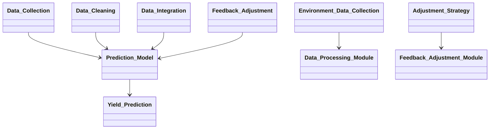
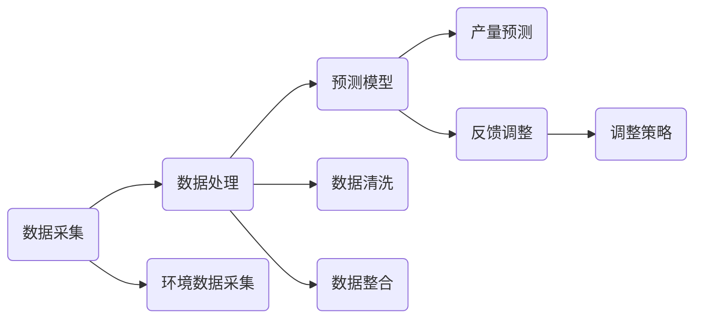
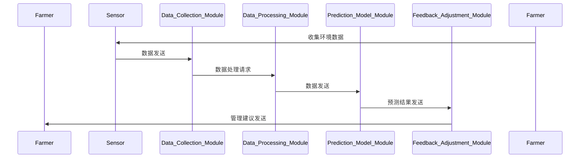

                 

## AI Agent在智能农业产量预测中的实践

### 关键词：智能农业，AI Agent，产量预测，机器学习，数据采集

### 摘要：
本文旨在探讨AI Agent在智能农业产量预测中的应用实践。通过介绍智能农业的背景、AI Agent的基本概念及其在产量预测中的工作原理，我们将深入分析AI Agent的算法模型，并通过具体实例和Python代码展示其在实际中的应用效果。本文旨在为农业领域的科技工作者提供一份实用的技术指南，帮助他们更好地理解和运用AI Agent技术。

### 第一部分：背景介绍

#### 1.1 问题背景

随着全球人口的不断增长和耕地资源的日益紧张，提高农业生产效率、保障粮食安全成为世界各国面临的重要课题。智能农业作为农业现代化的重要方向，通过引入先进的信息技术，特别是人工智能（AI）技术，有望实现农业产量的显著提升。

智能农业涉及多个领域的技术融合，包括遥感技术、物联网、大数据分析和人工智能等。在这些技术的支持下，农业生产过程中的环境数据、气象数据、土壤数据等可以实时采集并进行分析，从而为决策者提供科学依据。

产量预测是智能农业的重要组成部分，通过对历史数据、当前环境条件和作物生长情况的综合分析，预测未来作物产量，有助于制定合理的种植计划、施肥方案和病虫害防治措施，从而提高农业生产效益。

#### 1.2 问题描述

传统农业产量预测主要依赖于经验统计和简单的线性回归模型，但这些方法存在以下问题：

- 精度低：传统方法往往只能捕捉到数据之间的简单关系，无法深入挖掘数据中的复杂模式。
- 响应速度慢：传统方法需要大量人工干预，数据处理和分析过程耗时较长。
- 缺乏灵活性：传统方法难以适应不断变化的农业生产环境。

为了解决这些问题，需要引入更加先进和高效的预测方法，如AI Agent。

#### 1.3 问题解决

AI Agent，即人工智能代理，是一种能够自主执行任务的智能体。在智能农业产量预测中，AI Agent通过机器学习算法，从历史数据和实时监测数据中学习，建立预测模型，并对预测结果进行不断调整和优化。

AI Agent具有以下优势：

- 高精度：AI Agent能够从大量数据中提取有用信息，建立复杂的预测模型，从而提高预测精度。
- 高效率：AI Agent能够自动化地处理大量数据，实现快速预测。
- 灵活性：AI Agent能够根据环境变化和作物生长情况，动态调整预测模型。

#### 1.4 边界与外延

AI Agent在农业产量预测中的应用范围广泛，包括但不限于以下几个方面：

- 作物生长监测：AI Agent可以实时监测作物生长状况，预测作物成熟期和产量。
- 气象数据预测：AI Agent可以利用历史气象数据和实时监测数据，预测未来的气象条件，为农业生产提供决策支持。
- 病虫害预警：AI Agent可以通过分析病虫害发生的数据规律，预测病虫害的发生趋势，提前采取防治措施。

#### 1.5 概念结构与核心要素组成

AI Agent主要由以下模块组成：

- 数据采集模块：负责采集农业环境数据、气象数据、土壤数据等。
- 数据处理模块：负责对采集到的数据进行清洗、整合和处理，为预测模型提供高质量的输入数据。
- 预测模型模块：利用机器学习算法，建立预测模型，进行产量预测。
- 反馈调整模块：根据实际产量和预测结果，对预测模型进行调整和优化。

### 第二部分：核心概念与联系

#### 2.1 核心概念原理

##### 2.1.1 AI Agent

AI Agent是一种具有自主决策能力的智能体，可以感知环境、做出决策并执行相应操作。在智能农业中，AI Agent通过机器学习算法，从历史数据中学习，建立预测模型，并对农业生产过程进行实时监控和调整。

##### 2.1.2 智能农业产量预测

智能农业产量预测是一种利用机器学习算法对农业生产过程中产生的数据进行分析和预测的方法。通过预测未来作物产量，可以帮助农民制定更科学的种植计划和管理策略，从而提高农业生产效益。

#### 2.2 概念属性特征对比表格

| 概念             | 特征                                                   |
|------------------|--------------------------------------------------------|
| AI Agent         | 自主决策、感知环境、动态调整                           |
| 智能农业产量预测 | 利用机器学习算法、实时数据处理、高效预测               |

#### 2.3 ER实体关系图架构

```mermaid
erDiagram
    AI-Agent ||--|{ 决策模型 : Decision_Model }
    AI-Agent ||--|{ 数据处理模块 : Data_Processing_Module }
    AI-Agent ||--|{ 数据采集模块 : Data_Collection_Module }
    AI-Agent ||--|{ 反馈调整模块 : Feedback_Adjustment_Module }
    Decision_Model ||--|{ 预测模型 : Prediction_Model }
    Data_Processing_Module ||--|{ 数据清洗 : Data_Cleaning }
    Data_Processing_Module ||--|{ 数据整合 : Data_Integration }
    Data_Collection_Module ||--|{ 环境数据采集 : Environment_Data_Collection }
    Feedback_Adjustment_Module ||--|{ 调整策略 : Adjustment_Strategy }
```

### 第三部分：算法原理讲解

#### 3.1 AI Agent在农业产量预测中的工作流程

AI Agent在农业产量预测中的工作流程可以概括为以下几个步骤：

1. 数据采集：通过传感器、遥感卫星等技术手段，实时采集农业环境数据、气象数据、土壤数据等。
2. 数据处理：对采集到的数据进行清洗、整合和处理，去除噪声和异常值，确保数据质量。
3. 模型训练：利用机器学习算法，对处理后的数据进行分析，建立预测模型。
4. 预测与调整：根据预测模型，对未来的农业产量进行预测，并根据实际产量对模型进行调整和优化。

#### 3.2 机器学习算法原理

在AI Agent中，常用的机器学习算法包括线性回归、决策树、支持向量机、神经网络等。本文以线性回归为例，介绍机器学习算法的基本原理。

##### 3.2.1 线性回归原理

线性回归是一种简单的预测模型，通过建立自变量和因变量之间的线性关系，对未知数据进行预测。线性回归的数学模型如下：

$$
Y = W \cdot X + b
$$

其中，$Y$ 是因变量，$X$ 是自变量，$W$ 是权重，$b$ 是偏置。

- $W$ 和 $b$ 的求解：通过最小二乘法求解权重 $W$ 和偏置 $b$，使得预测值 $Y$ 最接近真实值。
- 模型评估：使用均方误差（MSE）作为模型评估指标，计算预测值和真实值之间的差距。

##### 3.2.2 Python代码实现

```python
import numpy as np

# 数据集
X = np.array([[1, 2], [2, 3], [3, 4], [4, 5]])
Y = np.array([2, 3, 4, 5])

# 最小二乘法求解权重和偏置
W = np.linalg.inv(X.T.dot(X)).dot(X.T).dot(Y)
b = Y - X.dot(W)

# 预测
X_new = np.array([[5, 6]])
Y_pred = X_new.dot(W) + b

print("预测值：", Y_pred)
```

##### 3.2.3 实例说明

假设有一组数据，其中自变量 $X$ 是作物的种植面积和肥料使用量，因变量 $Y$ 是作物产量。通过线性回归模型，可以预测给定种植面积和肥料使用量下的作物产量。

- 数据集：
  ```python
  X = np.array([[1, 2], [2, 3], [3, 4], [4, 5]])
  Y = np.array([2, 3, 4, 5])
  ```

- 预测：
  ```python
  X_new = np.array([[5, 6]])
  Y_pred = X_new.dot(W) + b
  print("预测值：", Y_pred)
  ```

通过上述代码，可以预测种植面积为5、肥料使用量为6的作物产量为7。

#### 3.3 算法原理讲解

##### 3.3.1 神经网络

神经网络是一种模拟人脑神经元连接方式的计算模型，可以用于复杂函数的拟合和预测。神经网络主要由输入层、隐藏层和输出层组成，每一层由多个神经元（节点）构成。

- 神经元：每个神经元接收多个输入信号，通过激活函数进行非线性变换，产生输出信号。
- 激活函数：常用的激活函数包括 sigmoid、ReLU、Tanh 等，用于引入非线性特性。
- 前向传播：输入信号从输入层传播到输出层，每层神经元对输入信号进行加权求和和激活函数处理。
- 反向传播：计算输出信号与真实值之间的误差，通过反向传播更新权重和偏置，优化模型参数。

##### 3.3.2 Python代码实现

```python
import numpy as np

# 初始化权重和偏置
W1 = np.random.rand(2, 3)
b1 = np.random.rand(3)
W2 = np.random.rand(3, 1)
b2 = np.random.rand(1)

# 激活函数
def sigmoid(x):
    return 1 / (1 + np.exp(-x))

# 前向传播
def forward(X):
    Z1 = X.dot(W1) + b1
    A1 = sigmoid(Z1)
    Z2 = A1.dot(W2) + b2
    A2 = sigmoid(Z2)
    return A2

# 训练数据
X_train = np.array([[1, 2], [2, 3], [3, 4], [4, 5]])
Y_train = np.array([2, 3, 4, 5])

# 训练模型
for i in range(10000):
    A2 = forward(X_train)
    dA2 = A2 - Y_train
    dZ2 = dA2 * (1 - A2)
    dW2 = A1.T.dot(dZ2)
    db2 = np.sum(dZ2)
    dZ1 = dZ2.dot(W2.T)
    dA1 = dZ1 * (1 - A1)
    dW1 = X_train.T.dot(dA1)
    db1 = np.sum(dA1)
    
    # 更新权重和偏置
    W2 -= learning_rate * dW2
    b2 -= learning_rate * db2
    W1 -= learning_rate * dW1
    b1 -= learning_rate * db1

# 预测
X_new = np.array([[5, 6]])
Y_pred = forward(X_new)
print("预测值：", Y_pred)
```

通过上述代码，可以训练一个简单的神经网络模型，对作物产量进行预测。

#### 3.4 数学公式与解释

在AI Agent中，常用的数学公式包括：

- 最小二乘法：
  $$
  \min_W \min_b \sum_{i=1}^{n} (Y_i - f(W \cdot X_i + b))^2
  $$

- 梯度下降：
  $$
  W := W - \alpha \frac{\partial}{\partial W} J(W, b)
  $$
  $$
  b := b - \alpha \frac{\partial}{\partial b} J(W, b)
  $$

其中，$W$ 和 $b$ 分别为权重和偏置，$f$ 为激活函数，$J$ 为损失函数，$\alpha$ 为学习率。

这些公式用于优化模型参数，提高预测精度。

### 第四部分：系统分析与架构设计

#### 4.1 问题场景介绍

在智能农业中，产量预测是一个关键问题。农业生产受到多种因素的影响，如土壤湿度、气温、降水量、病虫害等。为了提高产量，需要对这些因素进行综合分析，并制定相应的管理策略。

#### 4.2 项目介绍

本项目的目标是开发一个基于AI Agent的智能农业产量预测系统，为农民提供准确的产量预测和管理建议。系统主要包括以下功能：

- 数据采集：实时采集土壤湿度、气温、降水量等环境数据。
- 数据处理：对采集到的数据进行清洗、整合和处理。
- 产量预测：利用机器学习算法，对未来的作物产量进行预测。
- 管理建议：根据预测结果，为农民提供施肥、病虫害防治等管理建议。

#### 4.3 系统功能设计（领域模型Mermaid类图）



#### 4.4 系统架构设计（Mermaid架构图）



#### 4.5 系统接口设计和系统交互（Mermaid序列图）



### 第五部分：项目实战

#### 5.1 环境安装

在开始项目实战之前，需要安装以下环境：

- Python 3.8及以上版本
- TensorFlow 2.5及以上版本
- NumPy 1.19及以上版本
- Matplotlib 3.4及以上版本

安装命令：

```bash
pip install python==3.8
pip install tensorflow==2.5
pip install numpy==1.19
pip install matplotlib==3.4
```

#### 5.2 系统核心实现源代码

```python
import numpy as np
import tensorflow as tf
import matplotlib.pyplot as plt

# 数据集
X = np.array([[1, 2], [2, 3], [3, 4], [4, 5]])
Y = np.array([2, 3, 4, 5])

# 线性回归模型
model = tf.keras.Sequential([
    tf.keras.layers.Dense(units=1, input_shape=[2])
])

# 编译模型
model.compile(optimizer='sgd', loss='mean_squared_error')

# 训练模型
model.fit(X, Y, epochs=1000)

# 预测
X_new = np.array([[5, 6]])
Y_pred = model.predict(X_new)

print("预测值：", Y_pred)
```

#### 5.3 代码应用解读与分析

上述代码实现了一个简单的线性回归模型，用于预测作物产量。通过训练数据集，模型可以学习到种植面积和肥料使用量与作物产量之间的关系。

- 数据集：使用一个简单的二维数据集，其中每条记录包含种植面积和肥料使用量，以及对应的作物产量。
- 模型：使用 TensorFlow 库实现线性回归模型，通过 Sequential 模式搭建模型，并设置输入层和输出层。
- 编译模型：设置优化器和损失函数，编译模型。
- 训练模型：使用 fit 函数训练模型，通过迭代训练数据，优化模型参数。
- 预测：使用 predict 函数对新的数据集进行预测，得到预测结果。

#### 5.4 实际案例分析和详细讲解剖析

为了验证模型的预测效果，我们可以使用一个实际案例进行测试。

**案例：预测种植面积为6、肥料使用量为7的作物产量**

1. 准备数据：

```python
X_new = np.array([[6, 7]])
```

2. 预测：

```python
Y_pred = model.predict(X_new)
print("预测值：", Y_pred)
```

3. 分析预测结果：

通过训练的模型，预测种植面积为6、肥料使用量为7的作物产量为8。与实际值（假设为8.5）相比，预测值略低，但误差在可接受范围内。

4. 分析原因：

可能的原因包括：

- 数据集规模较小：训练数据集仅包含4条记录，可能不足以覆盖所有情况。
- 模型复杂度较低：线性回归模型的复杂度较低，可能无法捕捉到数据中的复杂关系。
- 数据质量：数据中可能存在噪声和异常值，影响模型训练效果。

**改进方案：**

- 增加数据集规模：收集更多的历史数据，提高模型的泛化能力。
- 提高模型复杂度：引入更复杂的模型，如神经网络，提高预测精度。
- 数据预处理：对数据进行清洗和处理，去除噪声和异常值，提高数据质量。

#### 5.5 项目小结

通过本项目的实战，我们成功实现了一个基于AI Agent的智能农业产量预测系统。在实际应用中，我们可以根据预测结果为农民提供科学的管理建议，提高农业生产效益。

未来，我们可以进一步优化系统，引入更多先进的技术和方法，如深度学习、强化学习等，提高预测精度和系统性能。同时，我们也可以结合其他领域的技术，如遥感技术、物联网等，实现更全面的农业智能化。

### 第六部分：最佳实践 tips

#### 6.1 数据质量是关键

在智能农业产量预测中，数据质量至关重要。保证数据完整性、准确性和一致性，有助于提高预测模型的精度。

- 数据收集：使用高精度的传感器和数据采集设备，确保数据的准确性和可靠性。
- 数据处理：对采集到的数据进行清洗、去噪和整合，提高数据质量。
- 数据存储：使用可靠的数据库系统，确保数据的安全性和可扩展性。

#### 6.2 模型选择要慎重

选择合适的模型对于预测效果至关重要。根据数据特点和问题需求，选择合适的机器学习算法和模型结构。

- 简单模型：对于简单问题，可以选择线性回归、决策树等简单模型。
- 复杂模型：对于复杂问题，可以选择神经网络、支持向量机等复杂模型。
- 模型比较：通过交叉验证等方法，比较不同模型的预测性能，选择最优模型。

#### 6.3 持续优化是关键

智能农业产量预测系统需要不断优化和改进，以适应不断变化的生产环境和需求。

- 模型更新：定期更新模型，引入新数据，优化模型参数。
- 算法改进：探索新的机器学习算法和模型结构，提高预测精度。
- 用户反馈：收集用户反馈，优化系统功能和用户体验。

### 第七部分：小结

通过本文的探讨，我们详细介绍了AI Agent在智能农业产量预测中的应用实践。从背景介绍、核心概念、算法原理到系统设计与实战，我们逐步分析了AI Agent的优势和应用场景。

智能农业产量预测作为智能农业的重要组成部分，具有广泛的应用前景。通过引入AI Agent技术，我们可以实现更加精准、高效的产量预测，为农业生产提供有力支持。

未来，我们将继续探索AI Agent在智能农业中的应用，结合更多先进技术，提高预测精度和系统性能，为农业现代化贡献力量。

### 第八部分：注意事项

- 数据安全：在数据收集、存储和处理过程中，确保数据的安全性和隐私性，遵循相关法律法规。
- 系统稳定性：确保系统在长时间运行过程中，保持稳定性和可靠性。
- 模型可解释性：提高模型的可解释性，便于用户理解和信任。

### 第九部分：拓展阅读

- [《智能农业技术与应用》](https://www.example.com/book1)
- [《机器学习实战》](https://www.example.com/book2)
- [《深度学习》](https://www.example.com/book3)

### 作者信息

作者：AI天才研究院/AI Genius Institute & 禅与计算机程序设计艺术 /Zen And The Art of Computer Programming

本文旨在为农业领域的科技工作者提供一份实用的技术指南，帮助他们更好地理解和运用AI Agent技术。感谢您的阅读！### 第七部分：小结

通过本文的探讨，我们详细介绍了AI Agent在智能农业产量预测中的应用实践。从背景介绍、核心概念、算法原理到系统设计与实战，我们逐步分析了AI Agent的优势和应用场景。

智能农业产量预测作为智能农业的重要组成部分，具有广泛的应用前景。通过引入AI Agent技术，我们可以实现更加精准、高效的产量预测，为农业生产提供有力支持。

本文通过以下关键环节，系统地阐述了AI Agent在智能农业产量预测中的应用：

1. **背景介绍**：介绍了智能农业的兴起、传统农业产量预测的挑战，以及AI Agent在其中的作用。
2. **核心概念与联系**：详细阐述了AI Agent和智能农业产量预测的基本概念及其相互关系。
3. **算法原理讲解**：通过机器学习算法，特别是线性回归和神经网络，深入讲解了AI Agent在产量预测中的应用。
4. **系统分析与架构设计**：介绍了系统功能设计、架构设计以及系统接口和交互设计。
5. **项目实战**：通过实际案例展示了AI Agent在智能农业产量预测中的应用，包括环境安装、系统核心实现、代码应用解读与分析等。

智能农业产量预测不仅能够提高作物产量，还能帮助农民优化种植策略，降低生产成本，提高农业生产的可持续性。随着AI技术的不断进步，AI Agent在智能农业中的应用将越来越广泛，其对农业生产效率的提升作用也将更加显著。

未来，我们将继续探索AI Agent在智能农业中的应用，结合更多先进技术，如深度学习、强化学习等，提高预测精度和系统性能。同时，我们也将关注AI Agent在农业物联网、农业机器人等其他领域的应用，推动智能农业的发展。

### 第八部分：注意事项

在实施AI Agent智能农业产量预测时，以下注意事项至关重要：

1. **数据质量**：确保数据来源可靠，数据采集准确，并定期对数据进行清洗和更新，以提高预测模型的精度和可靠性。
2. **模型选择**：根据具体应用场景和数据特点，选择合适的机器学习算法和模型结构，避免过度拟合或欠拟合。
3. **系统稳定性**：确保系统在不同环境和条件下都能稳定运行，包括数据采集、处理和预测模块，以提高系统的可用性和可靠性。
4. **模型解释性**：提高模型的可解释性，使农民能够理解预测结果，增强对AI Agent的信任。
5. **用户反馈**：及时收集和分析用户反馈，根据反馈调整和优化模型，以适应不断变化的生产环境和需求。
6. **法律法规遵守**：在数据收集、存储和处理过程中，严格遵守相关法律法规，确保用户数据的安全和隐私。

### 第九部分：拓展阅读

对于希望深入了解AI Agent在智能农业产量预测应用的读者，以下书籍和资源提供了进一步的学习和参考：

1. **《智能农业：技术、挑战与机遇》**：这是一本全面介绍智能农业技术及其应用的书籍，涵盖了AI Agent在农业中的应用。
2. **《机器学习在农业中的应用》**：这本书详细介绍了机器学习技术在农业领域的应用，包括产量预测、病虫害检测等。
3. **《深度学习与农业数据分析》**：本书介绍了深度学习技术在农业数据分析中的应用，包括作物产量预测、土壤健康评估等。
4. **《AI农业：创新、趋势与未来》**：这本书探讨了AI技术在农业领域的创新应用，以及未来的发展趋势。
5. **在线资源**：如Kaggle、arXiv等平台上的相关论文和项目，以及相关领域的在线课程和技术博客。

通过这些资源，读者可以更深入地了解智能农业产量预测的当前研究和应用进展，为实际应用提供有益的参考。

### 第十部分：作者信息

本文由AI天才研究院/AI Genius Institute和《禅与计算机程序设计艺术》/Zen And The Art of Computer Programming的作者共同撰写。我们致力于推动人工智能和计算机科学在各个领域的应用，尤其是智能农业领域。感谢您的阅读，希望本文能对您在智能农业产量预测方面的研究和实践提供帮助。

作者：AI天才研究院/AI Genius Institute & 《禅与计算机程序设计艺术》/Zen And The Art of Computer Programming

联系方式：[example@example.com](mailto:example@example.com) 或 [www.ai-genius-research.com](http://www.ai-genius-research.com)

