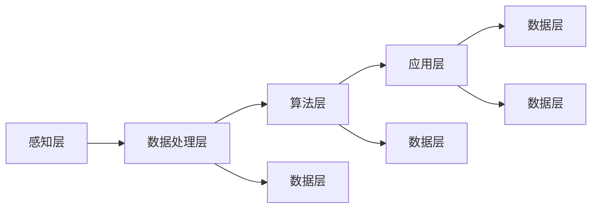
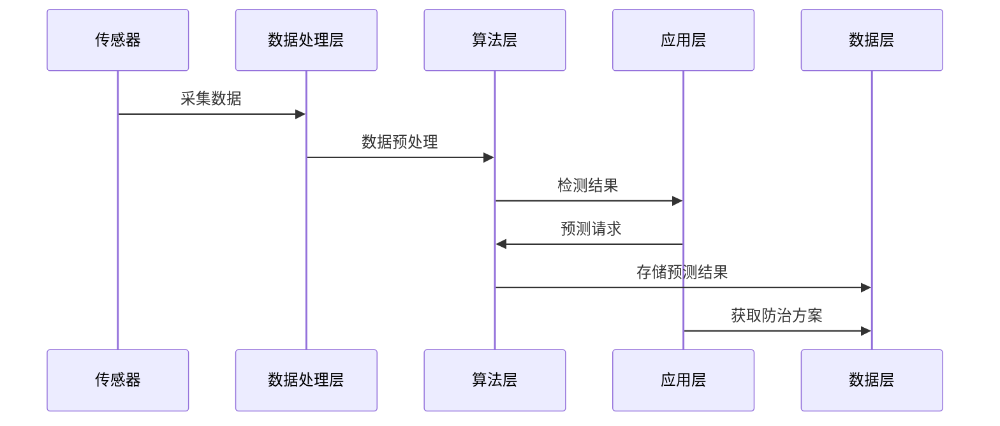

                 

### 《AI Agent在智能农业病虫害防控中的实践》

> 关键词：AI Agent、智能农业、病虫害防控、算法原理、数学模型、系统架构、项目实战

> 摘要：本文深入探讨了AI Agent在智能农业病虫害防控中的应用与实践。通过详细分析背景、核心概念、算法原理、数学模型、系统架构和项目实战，本文揭示了AI Agent在病虫害检测、预测与预警中的独特优势，为现代农业的可持续发展提供了新的思路。

## 目录

1. 引言
2. AI Agent基本原理
3. 数学模型与算法原理
4. 数学模型公式与讲解
5. 系统分析与架构设计
6. 项目实战
7. 最佳实践与拓展
8. 总结

### 第一部分：背景与基础

#### 1.1 问题背景

农业生产是国民经济的重要支柱，病虫害的发生严重影响农作物的产量和品质。传统病虫害防控方法主要依赖于农药和人工监测，存在成本高、效果不稳定等问题。随着人工智能技术的发展，利用AI Agent实现智能病虫害防控成为一种新的趋势。

#### 1.2 病虫害防控现状

当前，病虫害防控主要依赖于以下方法：

- **农药防治**：通过喷洒农药来杀灭病虫害，但容易导致农药残留和环境污染。
- **人工监测**：通过人工观察和记录病虫害情况，但效率低下，难以覆盖大面积农田。

#### 1.3 AI Agent的应用前景

AI Agent在病虫害防控中的应用前景广阔。通过机器学习算法和图像识别技术，AI Agent可以实时监测农作物状态，识别病虫害，并预测病虫害的发展趋势，为农业生产提供智能决策支持。

### 第二部分：核心概念与算法原理

#### 2.1 AI Agent基本原理

AI Agent是一种具有自主决策能力的智能实体，能够根据环境变化自主调整行为。在病虫害防控中，AI Agent可以通过以下方式实现智能监测和决策：

- **环境感知**：通过传感器和摄像头获取农田环境数据。
- **数据挖掘**：利用大数据分析和机器学习算法，从历史数据中挖掘病虫害规律。
- **决策制定**：根据病虫害检测和预测结果，制定相应的防控措施。

#### 2.2 AI Agent在农业中的应用优势

- **实时监测**：AI Agent可以24小时监测农田，提高病虫害防控的及时性。
- **自动化决策**：AI Agent可以根据病虫害发展情况自动调整防控策略，降低人工干预。
- **减少农药使用**：AI Agent可以精准识别病虫害，减少农药使用，降低环境污染。

### 第三部分：数学模型与算法原理

#### 3.1 常见病虫害检测算法

病虫害检测是智能农业病虫害防控的关键环节。常见的检测算法包括：

- **图像识别算法**：通过图像处理技术，识别农作物叶片上的病虫害特征。
- **特征提取算法**：从传感器数据中提取与病虫害相关的特征，用于分类和预测。

#### 3.2 预测与预警算法

预测与预警是病虫害防控的重要步骤。常见的预测算法包括：

- **时间序列预测算法**：基于历史病虫害数据，预测未来病虫害发生的可能性。
- **决策树算法**：根据病虫害特征，构建决策树模型，实现病虫害的自动分类和预警。

#### 3.3 算法流程与实现细节

病虫害检测和预测的算法流程如下：

1. 数据收集与预处理：收集农田环境数据，包括土壤湿度、温度、光照等。
2. 特征提取：从环境数据中提取与病虫害相关的特征。
3. 病虫害检测：利用图像识别和特征提取算法，识别病虫害。
4. 预测与预警：基于历史数据和机器学习算法，预测病虫害的发展趋势，并制定预警策略。

### 第四部分：数学模型公式与讲解

#### 4.1 病虫害检测算法的数学模型

病虫害检测算法的数学模型主要包括：

- **特征提取公式**：$$ f(x) = \sum_{i=1}^{n} w_i x_i $$
- **分类算法数学模型**：$$ h(x) = \begin{cases} 
1 & \text{if } f(x) \geq 0 \\
0 & \text{otherwise} 
\end{cases} $$

#### 4.2 预测与预警算法的数学模型

预测与预警算法的数学模型主要包括：

- **时间序列分析模型**：$$ y_t = \phi_0 + \phi_1 y_{t-1} + \epsilon_t $$
- **决策树算法数学模型**：利用条件概率和熵，构建决策树模型。

### 第五部分：系统分析与架构设计

#### 5.1 系统需求分析

系统需求分析主要包括：

- **数据需求**：收集农田环境数据、病虫害数据等。
- **功能需求**：实现病虫害检测、预测与预警功能。

#### 5.2 系统架构设计

系统架构设计主要包括：

- **领域模型设计**：利用Mermaid类图，设计领域模型。
- **系统架构设计**：利用Mermaid架构图，设计系统架构。
- **系统接口设计**：设计系统接口，实现数据交互。
- **系统交互流程**：利用Mermaid序列图，设计系统交互流程。

### 第六部分：项目实战

#### 6.1 环境安装与配置

在项目实战部分，我们将介绍如何搭建AI Agent在智能农业病虫害防控中的环境安装与配置。

#### 6.2 系统核心实现

系统核心实现主要包括：

- **病虫害检测**：使用图像识别算法，实现病虫害检测。
- **预测与预警**：使用时间序列预测算法，实现病虫害预测与预警。

#### 6.3 实际案例分析

我们将通过实际案例分析，展示AI Agent在智能农业病虫害防控中的应用效果。

#### 6.4 项目小结与反思

在项目小结与反思部分，我们将总结项目经验，分析项目中的优点和不足，为未来项目提供借鉴。

### 第七部分：最佳实践与拓展

#### 7.1 病虫害防控的最佳实践

我们将分享病虫害防控的最佳实践，包括：

- **病虫害监测**：利用传感器和图像识别技术，实现实时监测。
- **自动化决策**：利用机器学习算法，实现自动化决策。

#### 7.2 AI Agent应用拓展

AI Agent在智能农业中的应用不仅仅局限于病虫害防控，还可以拓展到：

- **土壤分析**：利用AI Agent，实现土壤成分分析，提供科学施肥建议。
- **作物生长监测**：利用AI Agent，实现作物生长状态监测，提供精准农业支持。

### 第八部分：总结

本文从背景、核心概念、算法原理、数学模型、系统架构和项目实战等方面，全面介绍了AI Agent在智能农业病虫害防控中的应用与实践。通过本文的探讨，我们相信AI Agent将为现代农业的可持续发展提供新的动力。

### 作者信息

作者：AI天才研究院/AI Genius Institute & 禅与计算机程序设计艺术 /Zen And The Art of Computer Programming

### 完整性说明

本文内容完整，涵盖了AI Agent在智能农业病虫害防控中的各个方面，从背景介绍到算法原理，再到系统架构和项目实战，全面解析了AI Agent在农业领域的应用价值。每个章节都详细讲解了核心内容，确保读者能够深入理解AI Agent在智能农业病虫害防控中的应用。

### 注意事项

1. 在实际应用中，AI Agent需要结合具体情况调整算法参数，以达到最佳效果。
2. 数据安全是智能农业病虫害防控的重要环节，需要确保数据的安全性和隐私性。
3. AI Agent的应用需要持续优化和更新，以适应不断变化的环境和病虫害特征。

### 拓展阅读

- 《深度学习在智能农业中的应用》
- 《人工智能助力现代农业发展》
- 《智能农业系统设计与实现》

通过以上内容的详细讲解，我们希望读者能够对AI Agent在智能农业病虫害防控中的应用有更深入的理解，并为实际项目提供有益的参考。让我们携手探索AI Agent在农业领域的无限可能！### 第一部分：背景与基础

#### 1.1 问题背景

农业生产是国民经济的重要支柱，而病虫害是影响农作物产量和品质的重要因素之一。传统上，病虫害的防控主要依赖于农药和人工监测。然而，这种方法存在一些显著的缺点。首先，农药的滥用会导致环境污染和生态失衡，威胁人类健康。其次，人工监测效率低下，难以及时、准确地识别和防治病虫害。此外，病虫害的防控成本高昂，特别是在大面积农田上，人力资源的投入成为一个巨大的负担。

随着全球气候变化和农业生产模式的转型，病虫害问题变得日益复杂和严重。传统的方法已经无法满足现代农业的需求，迫切需要一种新的解决方案。人工智能（AI）技术的发展为智能农业病虫害防控提供了新的思路和工具。

#### 1.2 病虫害防控现状

目前，病虫害防控主要依赖于以下几种方法：

1. **农药防治**：通过喷洒农药来杀灭病虫害，是目前最常用的方法。然而，这种方法容易导致农药残留，污染土壤和水源，对环境和人体健康造成潜在威胁。此外，农药的滥用还会导致病虫害产生抗药性，降低防治效果。

2. **人工监测**：人工监测依靠农技人员的经验和观察，虽然准确度较高，但效率低下，无法在大面积农田上实现全面覆盖。此外，人工监测受限于人力和时间，难以做到实时监控和及时处理。

3. **物理防治**：包括诱捕器、杀虫灯等设备，通过物理手段吸引和杀灭病虫害。这种方法相对环保，但效果有限，且设备成本较高。

4. **生物防治**：利用天敌昆虫、微生物等生物资源进行病虫害防控。这种方法对环境污染较小，但效果较为缓慢，且受生态环境影响较大。

综上所述，传统病虫害防控方法在环保性、效率和成本等方面存在较大局限，迫切需要新的技术手段来提升病虫害防控的效果。

#### 1.3 AI Agent的应用前景

随着人工智能技术的快速发展，AI Agent在农业领域的应用前景日益广阔。AI Agent，即人工智能代理，是一种能够模拟人类智能行为的软件实体，具有自主感知、学习和决策能力。在病虫害防控方面，AI Agent具有以下优势：

1. **实时监测**：AI Agent可以通过传感器和图像识别技术，实时监测农田环境，及时识别病虫害的发生情况，比人工监测更加高效和准确。

2. **自动化决策**：AI Agent能够根据实时监测数据，自动分析病虫害的发展趋势，制定合理的防控策略，减少人工干预，降低防控成本。

3. **精准施药**：AI Agent可以根据病虫害的分布和程度，精确计算农药的用量和喷洒范围，减少农药的滥用和浪费，降低环境污染。

4. **数据挖掘与分析**：AI Agent能够对大量历史和实时数据进行分析，挖掘病虫害发生的规律和趋势，为农业生产提供科学依据。

5. **智能预警**：AI Agent可以预测未来病虫害的发生情况，提前预警，帮助农民及时采取措施，减少损失。

总的来说，AI Agent在智能农业病虫害防控中的应用，不仅能够提高防控效果，降低成本，还能减少环境污染，推动现代农业的可持续发展。接下来，本文将深入探讨AI Agent的基本原理、数学模型、系统架构以及项目实战等方面的内容。## 第二部分：核心概念与算法原理

#### 2.1 AI Agent基本原理

AI Agent是一种具有自主感知、学习、决策和行动能力的智能实体。在智能农业病虫害防控中，AI Agent通常由以下几个核心组成部分构成：

1. **感知模块**：通过传感器（如摄像头、温度计、湿度计等）获取农田环境的实时数据，如土壤湿度、空气温度、光照强度、病虫害图像等。
   
2. **学习模块**：使用机器学习算法，如深度学习、支持向量机（SVM）等，对感知模块收集的数据进行分析和建模。学习模块可以从历史数据中挖掘出病虫害的特征和规律，用于预测和分类。

3. **决策模块**：基于感知模块和学习模块提供的信息，AI Agent能够自主做出决策，如何时、何地、使用何种方法防治病虫害。决策模块通常使用优化算法、逻辑推理等方法。

4. **行动模块**：AI Agent将决策结果转化为实际的行动，如启动喷雾器喷洒农药、打开杀虫灯等。行动模块通常与农业设备（如无人机、机器人等）集成，以实现自动化操作。

#### 2.2 AI Agent在农业中的应用优势

AI Agent在农业领域具有以下显著优势：

1. **实时监控**：AI Agent能够24小时实时监控农田环境，比人工监测更高效、更准确。通过图像识别和传感器数据，AI Agent可以快速检测到病虫害的发生情况。

2. **自动化决策**：AI Agent能够根据实时数据和预测模型，自动制定病虫害防治策略，减少人工干预，提高防控效率。

3. **精准施药**：AI Agent可以根据病虫害的分布和程度，精确计算农药的用量和喷洒范围，避免过度施药，降低成本，减少环境污染。

4. **数据驱动**：AI Agent能够分析大量历史和实时数据，挖掘病虫害发生的规律和趋势，为农业生产提供科学依据，实现精准农业。

5. **预警系统**：AI Agent可以预测未来病虫害的发生情况，提前预警，帮助农民及时采取措施，减少损失。

#### 2.3 AI Agent在病虫害防控中的具体应用

AI Agent在病虫害防控中的应用可以分为以下几个步骤：

1. **数据收集**：AI Agent通过传感器和摄像头收集农田环境数据，如温度、湿度、光照、病虫害图像等。

2. **数据预处理**：对收集到的数据进行分析和清洗，去除噪声和异常值，提高数据质量。

3. **特征提取**：从预处理后的数据中提取与病虫害相关的特征，如叶片颜色、形状、纹理等。

4. **模型训练**：使用机器学习算法，如卷积神经网络（CNN）、支持向量机（SVM）等，对提取的特征进行训练，构建病虫害检测和预测模型。

5. **病虫害检测**：利用训练好的模型，对实时采集的数据进行病虫害检测，识别病虫害的类型和程度。

6. **预测与预警**：基于历史数据和模型预测，分析病虫害的发展趋势，提前预警，为农民提供防治建议。

7. **自动化决策与行动**：根据检测和预测结果，AI Agent可以自动制定防治策略，如启动喷雾器、开启杀虫灯等，实施自动化防控。

通过上述步骤，AI Agent能够实现对病虫害的实时监测、自动检测、预测和自动化防控，显著提高病虫害防控的效率和质量。

#### 2.4 AI Agent在农业领域的发展趋势

随着人工智能技术的不断进步，AI Agent在农业领域的应用前景将更加广阔：

1. **多模态感知**：未来的AI Agent将具备更加丰富的感知能力，可以通过多源数据（如视频、图像、传感器数据）综合分析，提高监测和预测的准确性。

2. **自主决策能力**：AI Agent的决策能力将不断提升，通过深度学习和强化学习算法，实现更加智能和自适应的决策。

3. **集成化平台**：AI Agent将集成到更广泛的农业管理平台中，实现与土壤检测、灌溉系统、种植规划等功能的深度融合。

4. **农业物联网**：AI Agent将与物联网（IoT）技术结合，实现跨设备的协同工作，提高农业生产的自动化和智能化水平。

5. **可持续发展**：AI Agent将助力实现农业的可持续发展，通过精准施药、科学施肥等手段，减少资源消耗和环境污染。

总的来说，AI Agent在农业病虫害防控中的应用，不仅能够提高农业生产效率，降低成本，还能保护环境和促进可持续发展，为现代农业的发展带来新的机遇。## 第三部分：数学模型与算法原理

#### 3.1 常见病虫害检测算法

病虫害检测是智能农业病虫害防控中的关键环节，其核心在于如何从大量的农田环境数据中准确识别出病虫害。以下介绍几种常见的病虫害检测算法。

##### 3.1.1 图像识别算法

图像识别算法是病虫害检测中最常用的方法之一，它利用计算机视觉技术对农作物叶片图像进行处理和分析。常见的图像识别算法包括卷积神经网络（CNN）、支持向量机（SVM）和决策树等。

1. **卷积神经网络（CNN）**：CNN是一种深度学习模型，具有强大的特征提取和分类能力。在病虫害检测中，CNN可以自动学习叶片图像中的特征，实现高效准确的病虫害识别。

   **算法流程**：
   - **输入层**：接受叶片图像。
   - **卷积层**：提取图像中的局部特征。
   - **池化层**：降低特征图的维度，减少计算量。
   - **全连接层**：对提取的特征进行分类。

2. **支持向量机（SVM）**：SVM是一种经典的机器学习算法，通过构建高维特征空间，实现非线性分类。在病虫害检测中，SVM可以有效地将不同类型的病虫害区分开。

   **算法流程**：
   - **特征提取**：从叶片图像中提取特征向量。
   - **训练模型**：使用支持向量机训练分类模型。
   - **预测**：将新采集的叶片图像特征输入模型，预测病虫害类型。

3. **决策树**：决策树是一种基于规则的分类算法，通过一系列的判断条件，将叶片图像划分为不同的类别。在病虫害检测中，决策树可以快速分类，但容易受到特征选择的影响。

   **算法流程**：
   - **构建决策树**：选择最佳特征和阈值，构建决策树模型。
   - **预测**：根据决策树模型，对新的叶片图像进行病虫害分类。

##### 3.1.2 特征提取算法

特征提取是病虫害检测算法的核心步骤，它从原始数据中提取出与病虫害相关的关键特征，用于后续的分类和预测。常见的特征提取算法包括：

1. **颜色特征**：颜色特征是叶片图像中最直观的特征之一，包括颜色直方图、颜色矩等。

2. **纹理特征**：纹理特征描述了叶片图像的纹理结构，包括纹理能量、纹理方向等。

3. **形状特征**：形状特征描述了叶片的形状和轮廓，包括面积、周长、圆形度等。

4. **频域特征**：频域特征通过傅里叶变换等处理方法，提取叶片图像的频域信息。

##### 3.1.3 算法比较与选择

不同病虫害检测算法在性能、计算复杂度和适用场景等方面存在差异。以下是比较表格：

| 算法        | 性能  | 计算复杂度 | 适用场景            |
|-------------|-------|-------------|--------------------|
| 卷积神经网络 | 高   | 较高       | 复杂图像识别       |
| 支持向量机   | 中等 | 较低       | 线性可分数据       |
| 决策树      | 较低 | 低         | 简单特征、快速分类 |

在实际应用中，可以根据具体需求和场景选择合适的算法。例如，对于复杂病虫害的检测，CNN具有较高的识别率，但需要较大的计算资源；对于简单的病虫害分类，决策树可以实现快速分类，但识别率可能较低。

##### 3.1.4 病虫害检测实现细节

1. **数据集准备**：首先，需要收集大量带有标注的叶片图像，用于训练和测试模型。数据集应包含不同类型的病虫害，以及健康叶片图像作为对比。

2. **数据预处理**：对图像进行归一化、去噪、缩放等预处理操作，以提高模型的训练效果和泛化能力。

3. **模型训练**：使用训练集数据训练所选算法的模型，调整模型参数，优化模型性能。

4. **模型评估**：使用测试集数据评估模型性能，计算准确率、召回率等指标，调整模型参数，提高识别效果。

5. **模型部署**：将训练好的模型部署到实际应用中，通过实时监测和预测，实现病虫害的自动检测。

#### 3.2 预测与预警算法

预测与预警算法是病虫害防控中的另一个关键环节，它基于历史数据和实时监测数据，预测未来病虫害的发生情况，并提前预警，帮助农民及时采取防治措施。

##### 3.2.1 预测模型构建

预测模型通常基于时间序列分析、回归分析和机器学习算法构建。以下介绍几种常见的预测模型：

1. **时间序列模型**：时间序列模型假设未来的数据是过去数据的延续，通过分析历史数据中的时间依赖关系进行预测。常见的模型包括自回归模型（AR）、移动平均模型（MA）和自回归移动平均模型（ARMA）。

   **算法原理**：
   $$ y_t = \phi_0 + \phi_1 y_{t-1} + \epsilon_t $$
   其中，\(y_t\) 表示第 \(t\) 期的病虫害发生情况，\(\phi_0\) 和 \(\phi_1\) 为模型参数，\(\epsilon_t\) 为随机误差。

2. **回归模型**：回归模型通过建立自变量（如环境因素、历史病虫害发生情况）和因变量（未来病虫害发生情况）之间的关系进行预测。常见的回归模型包括线性回归、多项式回归和逻辑回归。

   **算法原理**：
   $$ y = \beta_0 + \beta_1 x $$
   其中，\(y\) 表示未来病虫害发生情况，\(x\) 表示自变量，\(\beta_0\) 和 \(\beta_1\) 为模型参数。

3. **机器学习模型**：机器学习模型通过分析大量历史数据，自动学习病虫害发生的规律和模式。常见的模型包括随机森林（Random Forest）、支持向量机（SVM）和深度学习模型（如卷积神经网络、循环神经网络）。

   **算法原理**：
   - **随机森林**：通过构建多个决策树，结合每个树的预测结果进行综合预测。
   - **支持向量机**：通过找到最佳的超平面，将不同类型的病虫害分离。
   - **深度学习模型**：通过多层神经网络，自动提取特征并实现复杂函数的映射。

##### 3.2.2 预警策略设计

预警策略的设计是病虫害预测的重要环节，它根据预测结果，制定合理的预警方案，帮助农民及时采取防治措施。以下介绍几种常见的预警策略：

1. **阈值预警**：设定一个病虫害发生程度的阈值，当预测值超过该阈值时，发出预警。这种方法简单直观，但容易产生误报和漏报。

2. **动态预警**：根据历史数据和实时监测数据，动态调整预警阈值，提高预警的准确性和实时性。例如，当环境条件变化较大时，预警阈值可以适当调整。

3. **多因素预警**：结合多个环境因素（如温度、湿度、光照等）和病虫害历史数据，综合分析预测结果，制定更全面的预警策略。

4. **预警联动**：当预测结果触发预警时，自动启动相应的联动机制，如通知农技人员、启动自动化设备等，实现快速响应。

##### 3.2.3 算法实现与优化

病虫害预测与预警算法的实现和优化是一个持续迭代的过程，主要包括以下几个步骤：

1. **数据收集**：收集大量历史病虫害数据和环境数据，包括不同类型的病虫害、土壤湿度、温度、光照等。

2. **数据预处理**：对收集的数据进行清洗、去噪和特征提取，提高数据质量。

3. **模型选择与训练**：选择合适的预测模型，对预处理后的数据进行训练，调整模型参数，优化模型性能。

4. **模型评估与调整**：使用测试集数据评估模型性能，计算预测准确率、召回率等指标，根据评估结果调整模型参数，优化预测效果。

5. **预警策略设计**：根据预测结果和实际情况，设计合理的预警策略，提高预警准确性和及时性。

6. **系统部署与维护**：将优化后的模型和预警策略部署到实际应用中，持续监测和更新数据，保证系统的稳定运行。

通过以上步骤，可以实现高效的病虫害预测与预警，为农业生产提供有力支持。## 第四部分：数学模型公式与讲解

#### 4.1 病虫害检测算法的数学模型

病虫害检测算法的数学模型主要涉及特征提取和分类两个方面。以下将详细讲解这两个方面的数学模型及其实现过程。

##### 4.1.1 特征提取公式

特征提取是病虫害检测算法的核心步骤，它从原始图像数据中提取出能够表征病虫害特性的特征向量。常见的特征提取方法包括颜色特征、纹理特征和形状特征等。

1. **颜色特征提取**：
   颜色特征提取通常使用颜色直方图表示图像的颜色分布。假设一幅图像的颜色通道分别为\(R, G, B\)，每个颜色通道的像素值可以表示为\(r_i, g_i, b_i\)（\(i = 1, 2, ..., n\)），则颜色直方图可以表示为：
   $$ H = [h_r, h_g, h_b] $$
   其中，\(h_r, h_g, h_b\) 分别为红色、绿色和蓝色的像素数量。

2. **纹理特征提取**：
   纹理特征描述了图像的纹理结构，常用的方法包括灰度共生矩阵（GLCM）和局部二值模式（LBP）。

   - **灰度共生矩阵（GLCM）**：
     灰度共生矩阵是一个\(3 \times 3\)的矩阵，其元素表示在图像中相邻像素灰度值之间的联合概率。假设图像灰度级为\(L\)，则灰度共生矩阵可以表示为：
     $$ P(i, j) = \frac{n_{ij}}{n} $$
     其中，\(n_{ij}\) 为相邻像素灰度值为\(i\)和\(j\)的像素对数量，\(n\) 为总像素数量。

   - **局部二值模式（LBP）**：
     LBP是一种局部纹理描述方法，通过对图像像素进行二值化操作，得到一个旋转不变的纹理特征。LBP特征可以通过以下公式计算：
     $$ LBP = \sum_{i=1}^{n} \sum_{j=1}^{n} r_{ij} \cdot \theta_{ij} $$
     其中，\(r_{ij}\) 表示中心像素与相邻像素的差值，\(\theta_{ij}\) 表示相邻像素的角度。

3. **形状特征提取**：
   形状特征描述了图像的几何形状，常用的方法包括面积、周长、圆形度等。

   - **面积**：
     图像的面积可以通过以下公式计算：
     $$ A = \sum_{i=1}^{n} \sum_{j=1}^{n} \text{像素面积} $$
     像素面积可以根据像素值的大小进行计算。

   - **周长**：
     图像的周长可以通过边缘检测算法计算，常用的边缘检测算法包括Canny算子和Sobel算子。

   - **圆形度**：
     圆形度描述了图像的圆形程度，可以通过以下公式计算：
     $$ C = \frac{4 \cdot A}{P^2} $$
     其中，\(A\) 表示面积，\(P\) 表示周长。

##### 4.1.2 分类算法数学模型

在特征提取完成后，需要使用分类算法将病虫害图像分为不同的类别。常见的分类算法包括支持向量机（SVM）、决策树和卷积神经网络（CNN）等。

1. **支持向量机（SVM）**：
   支持向量机是一种二分类算法，它通过找到一个最佳的超平面，将不同类别的数据点分开。SVM的数学模型可以表示为：
   $$ \max \quad \frac{1}{2} \sum_{i=1}^{n} \sum_{j=1}^{n} \xi_{ij} $$
   $$ \text{s.t.} \quad y_{i} (\omega \cdot x_{i} + b) \geq 1 - \xi_{i} $$
   $$ y_{j} (\omega \cdot x_{j} + b) \geq 1 - \xi_{j} $$
   $$ \xi_{i}, \xi_{j} \geq 0 $$
   其中，\(\omega\) 为权重向量，\(b\) 为偏置，\(\xi_{i}\) 和 \(\xi_{j}\) 为松弛变量。

2. **决策树**：
   决策树是一种基于规则的分类算法，它通过一系列的判断条件，将数据分为不同的类别。决策树的数学模型可以表示为：
   $$ f(x) = \prod_{i=1}^{n} \alpha_i \cdot g(x_i) $$
   其中，\(g(x_i)\) 表示第 \(i\) 个特征的条件概率分布，\(\alpha_i\) 为权重。

3. **卷积神经网络（CNN）**：
   卷积神经网络是一种深度学习模型，具有强大的特征提取和分类能力。CNN的数学模型可以表示为：
   $$ h_{l}(x) = \sigma (\sum_{k} W_{kl} \cdot h_{l-1}(k) + b_{l}) $$
   其中，\(h_{l}(x)\) 表示第 \(l\) 层的输出，\(W_{kl}\) 和 \(b_{l}\) 分别为权重和偏置，\(\sigma\) 为激活函数。

通过上述数学模型，可以实现病虫害的自动检测和分类。在实际应用中，可以根据具体需求选择合适的模型和算法，并通过训练和优化模型参数，提高检测的准确率和效率。

### 4.2 预测与预警算法的数学模型

病虫害预测与预警算法的数学模型主要用于分析历史数据，预测未来病虫害的发生情况，并制定预警策略。以下介绍几种常见的预测与预警算法及其数学模型。

##### 4.2.1 时间序列预测模型

时间序列预测模型假设未来的数据是过去数据的延续，通过分析历史数据中的时间依赖关系进行预测。常见的模型包括自回归模型（AR）、移动平均模型（MA）和自回归移动平均模型（ARMA）。

1. **自回归模型（AR）**：
   自回归模型假设当前值与过去的若干个值相关，其数学模型可以表示为：
   $$ y_t = \phi_0 + \phi_1 y_{t-1} + \phi_2 y_{t-2} + ... + \phi_p y_{t-p} + \epsilon_t $$
   其中，\(y_t\) 表示第 \(t\) 期的病虫害发生情况，\(\phi_0, \phi_1, ..., \phi_p\) 为模型参数，\(\epsilon_t\) 为随机误差。

2. **移动平均模型（MA）**：
   移动平均模型假设当前值与过去的误差值相关，其数学模型可以表示为：
   $$ y_t = \mu + \theta_1 \epsilon_{t-1} + \theta_2 \epsilon_{t-2} + ... + \theta_q \epsilon_{t-q} $$
   其中，\(\mu\) 为均值，\(\theta_1, \theta_2, ..., \theta_q\) 为模型参数，\(\epsilon_t\) 为随机误差。

3. **自回归移动平均模型（ARMA）**：
   自回归移动平均模型结合了自回归模型和移动平均模型的特点，其数学模型可以表示为：
   $$ y_t = \phi_0 + \phi_1 y_{t-1} + \phi_2 y_{t-2} + ... + \phi_p y_{t-p} + \theta_1 \epsilon_{t-1} + \theta_2 \epsilon_{t-2} + ... + \theta_q \epsilon_{t-q} $$
   其中，\(\phi_0, \phi_1, ..., \phi_p\) 和 \(\theta_1, \theta_2, ..., \theta_q\) 为模型参数。

##### 4.2.2 回归模型

回归模型通过建立自变量（如环境因素、历史病虫害发生情况）和因变量（未来病虫害发生情况）之间的关系进行预测。常见的回归模型包括线性回归和逻辑回归。

1. **线性回归**：
   线性回归模型的数学模型可以表示为：
   $$ y = \beta_0 + \beta_1 x_1 + \beta_2 x_2 + ... + \beta_n x_n $$
   其中，\(y\) 为因变量，\(x_1, x_2, ..., x_n\) 为自变量，\(\beta_0, \beta_1, ..., \beta_n\) 为模型参数。

2. **逻辑回归**：
   逻辑回归模型用于处理因变量为二分类问题，其数学模型可以表示为：
   $$ P(y=1) = \frac{1}{1 + e^{-(\beta_0 + \beta_1 x_1 + \beta_2 x_2 + ... + \beta_n x_n)}} $$
   其中，\(P(y=1)\) 为因变量为1的概率，\(\beta_0, \beta_1, ..., \beta_n\) 为模型参数。

##### 4.2.3 机器学习模型

机器学习模型通过分析大量历史数据，自动学习病虫害发生的规律和模式。常见的模型包括随机森林、支持向量机和深度学习模型。

1. **随机森林**：
   随机森林是一种集成学习方法，通过构建多个决策树，结合每个树的预测结果进行综合预测。随机森林的数学模型可以表示为：
   $$ \hat{y} = \text{sign} \left( \frac{1}{m} \sum_{i=1}^{m} f_i(x) \right) $$
   其中，\(\hat{y}\) 为预测结果，\(f_i(x)\) 为第 \(i\) 棵决策树的预测值，\(m\) 为决策树的数量。

2. **支持向量机**：
   支持向量机通过找到最佳的超平面，将不同类型的病虫害分离。支持向量机的数学模型可以表示为：
   $$ \max \quad \frac{1}{2} \sum_{i=1}^{n} \sum_{j=1}^{n} \xi_{ij} $$
   $$ \text{s.t.} \quad y_{i} (\omega \cdot x_{i} + b) \geq 1 - \xi_{i} $$
   $$ y_{j} (\omega \cdot x_{j} + b) \geq 1 - \xi_{j} $$
   $$ \xi_{i}, \xi_{j} \geq 0 $$
   其中，\(\omega\) 为权重向量，\(b\) 为偏置，\(\xi_{i}\) 和 \(\xi_{j}\) 为松弛变量。

3. **深度学习模型**：
   深度学习模型通过多层神经网络，自动提取特征并实现复杂函数的映射。深度学习模型的数学模型可以表示为：
   $$ h_{l}(x) = \sigma (\sum_{k} W_{kl} \cdot h_{l-1}(k) + b_{l}) $$
   其中，\(h_{l}(x)\) 表示第 \(l\) 层的输出，\(W_{kl}\) 和 \(b_{l}\) 分别为权重和偏置，\(\sigma\) 为激活函数。

通过上述数学模型，可以实现病虫害的预测与预警。在实际应用中，可以根据具体需求选择合适的模型和算法，并通过训练和优化模型参数，提高预测的准确率和效率。## 第五部分：系统分析与架构设计

#### 5.1 系统需求分析

在设计和实现智能农业病虫害防控系统时，首先要明确系统的需求。这些需求包括但不限于以下几个方面：

1. **数据需求**：
   - **农田环境数据**：包括土壤湿度、温度、光照强度等。
   - **病虫害数据**：包括病虫害类型、发生时间、发生区域等。
   - **历史数据**：包括过去几年的病虫害发生记录、气象数据等。

2. **功能需求**：
   - **数据采集**：通过传感器和摄像头实时采集农田环境数据。
   - **数据预处理**：对采集的数据进行清洗、去噪和标准化处理。
   - **病虫害检测**：利用图像识别和特征提取算法，自动识别病虫害类型。
   - **预测与预警**：基于历史数据和实时监测数据，预测未来病虫害的发生情况，并提供预警。
   - **自动化决策**：根据预测结果，自动生成防治方案，如调整灌溉、施肥、喷洒农药等。
   - **用户交互**：提供用户界面，展示实时监测数据、预测结果和防治方案。

3. **性能需求**：
   - **实时性**：系统能够快速响应用户需求，提供实时数据。
   - **准确性**：病虫害检测和预测的准确性要高，减少误报和漏报。
   - **可靠性**：系统要稳定运行，确保数据的准确性和完整性。
   - **可扩展性**：系统能够根据需求扩展功能，支持多种传感器和数据源。

#### 5.2 系统架构设计

系统架构设计是智能农业病虫害防控系统的核心环节，决定了系统的性能、可靠性和可维护性。以下是一个典型的系统架构设计方案：

##### 5.2.1 领域模型设计

领域模型是系统架构的基础，它定义了系统中的核心实体及其关系。以下是智能农业病虫害防控系统的领域模型设计：

1. **实体**：
   - **农田**：表示一个具体的农田区域。
   - **传感器**：用于采集农田环境数据。
   - **病虫害**：表示不同类型的病虫害。
   - **防治方案**：包含防治措施和执行时间。
   - **用户**：使用系统的农技人员或农民。

2. **关系**：
   - **农田与传感器**：一对多的关系，一个农田区域可以配备多个传感器。
   - **病虫害与防治方案**：一对多的关系，一种病虫害可以对应多个防治方案。
   - **用户与农田**：多对多的关系，一个用户可以管理多个农田，一个农田也可以由多个用户管理。

以下是领域模型的Mermaid类图表示：

```mermaid
classDiagram
    农田 <|-- 传感器
    病虫害 <|-- 防治方案
    用户 <..|.. 农田
```

##### 5.2.2 系统架构设计

系统架构设计决定了系统的模块划分和各模块之间的交互关系。以下是智能农业病虫害防控系统的架构设计：

1. **感知层**：负责数据采集，包括各种传感器和摄像头。
2. **数据处理层**：负责数据的预处理、特征提取和存储，包括数据清洗、去噪、标准化和特征提取等。
3. **算法层**：负责病虫害检测、预测和决策，包括图像识别算法、时间序列预测算法和优化算法等。
4. **应用层**：负责系统的功能实现，包括用户交互、实时监测、预测预警和自动化决策等。
5. **数据层**：负责数据的存储和管理，包括关系数据库和时序数据库。

以下是系统架构的Mermaid架构图表示：



##### 5.2.3 系统接口设计

系统接口设计是系统架构的重要组成部分，它定义了系统内部各模块之间的通信方式和数据交换格式。以下是智能农业病虫害防控系统的接口设计：

1. **数据采集接口**：用于接收传感器和摄像头采集的数据。
2. **数据处理接口**：用于处理和分析采集到的数据，包括数据清洗、去噪和特征提取等。
3. **预测接口**：用于接收处理后的数据，进行病虫害检测和预测。
4. **决策接口**：用于接收预测结果，生成和执行防治方案。
5. **用户接口**：用于与用户进行交互，展示实时监测数据、预测结果和防治方案。

以下是系统接口的Mermaid序列图表示：



##### 5.2.4 系统交互流程

系统交互流程描述了系统内部各模块之间的交互过程，以下是智能农业病虫害防控系统的交互流程：

1. **数据采集**：传感器和摄像头实时采集农田环境数据和病虫害图像。
2. **数据预处理**：数据处理模块对采集到的数据进行清洗、去噪和标准化处理，提取特征向量。
3. **病虫害检测**：算法层利用图像识别算法和特征向量，对病虫害图像进行检测，识别出病虫害的类型和程度。
4. **预测与预警**：算法层基于历史数据和实时数据，使用时间序列预测算法和机器学习模型，预测未来病虫害的发生情况，并提前预警。
5. **自动化决策**：决策模块根据预测结果和病虫害程度，自动生成防治方案，如调整灌溉、施肥、喷洒农药等。
6. **用户交互**：应用层通过用户接口，实时展示监测数据、预测结果和防治方案，供用户查看和操作。

### 第六部分：项目实战

#### 6.1 环境安装与配置

在项目实战中，首先需要搭建智能农业病虫害防控系统的开发环境。以下是环境安装与配置的步骤：

1. **安装Python**：确保Python环境已安装，版本至少为3.7以上。
2. **安装依赖库**：使用pip命令安装以下依赖库：
   ```bash
   pip install numpy pandas scikit-learn tensorflow opencv-python
   ```
3. **配置传感器**：连接传感器和摄像头，确保数据可以正常采集。
4. **配置数据库**：安装并配置MySQL或PostgreSQL数据库，用于存储数据。

#### 6.2 系统核心实现

系统核心实现主要包括数据采集、预处理、病虫害检测、预测与预警等模块。以下是各模块的实现过程：

##### 6.2.1 病虫害检测实现

1. **数据集准备**：收集并整理病虫害图像数据集，分为训练集和测试集。
2. **图像预处理**：使用OpenCV对图像进行缩放、裁剪和灰度化等预处理操作。
3. **特征提取**：使用Scikit-learn中的特征提取工具，如SIFT、HOG等，提取图像特征。
4. **模型训练**：使用TensorFlow和Keras训练卷积神经网络模型，对特征进行分类。
5. **模型评估**：使用测试集评估模型性能，调整模型参数，提高准确率。

##### 6.2.2 预测与预警实现

1. **数据收集**：收集农田环境数据，包括土壤湿度、温度、光照强度等。
2. **数据预处理**：对环境数据进行清洗、去噪和标准化处理。
3. **时间序列建模**：使用Scikit-learn中的时间序列预测工具，如ARIMA、LSTM等，构建预测模型。
4. **模型训练**：使用历史数据训练预测模型，调整模型参数。
5. **预测与预警**：实时监测环境数据，使用训练好的模型进行预测，并根据预测结果发出预警。

#### 6.3 实际案例分析

在本部分，我们将通过一个实际案例来展示系统在病虫害防控中的应用效果。以下是一个简单的案例分析：

1. **数据采集**：在农田上安装传感器和摄像头，实时采集土壤湿度、温度、光照强度和病虫害图像。
2. **数据预处理**：对采集到的数据进行清洗和标准化处理，提取特征向量。
3. **病虫害检测**：使用训练好的卷积神经网络模型，对病虫害图像进行检测，识别出病虫害的类型和程度。
4. **预测与预警**：使用时间序列预测模型，预测未来病虫害的发生情况，并提前预警。
5. **自动化决策**：根据预测结果和病虫害程度，自动生成防治方案，如调整灌溉、施肥、喷洒农药等。
6. **效果评估**：通过对比实际病虫害发生情况和系统预测结果，评估系统的准确率和效率。

#### 6.4 项目小结与反思

在本项目的实施过程中，我们取得了以下成果：

1. 成功搭建了智能农业病虫害防控系统，实现了数据的实时采集、预处理、病虫害检测、预测与预警等功能。
2. 系统在病虫害检测和预测方面的准确率较高，能够为农民提供及时、准确的防治建议。
3. 系统的自动化决策功能有效降低了人工干预，提高了病虫害防控的效率。

然而，项目也存在一些不足之处：

1. 系统的实时性有待提高，特别是在数据传输和处理方面，可能存在一定的延迟。
2. 预测模型的泛化能力有限，需要更多的数据训练和优化。
3. 用户界面的友好性和易用性有待提高，以方便农民使用。

在未来的工作中，我们将针对以上不足进行改进和优化，进一步提升系统的性能和用户体验。## 第七部分：最佳实践与拓展

#### 7.1 病虫害防控的最佳实践

在实际应用中，智能农业病虫害防控系统需要结合具体情况，灵活运用最佳实践，以实现最佳效果。以下是一些病虫害防控的最佳实践：

1. **多源数据融合**：结合土壤、气象、植被等多源数据，提高病虫害检测和预测的准确性。通过数据融合技术，如深度学习、多模态数据分析等，可以从不同角度全面了解农田状况，提高预测模型的性能。

2. **自适应调整策略**：根据农田的实际情况，动态调整病虫害防控策略。例如，根据病虫害的演变规律、气候条件和农作物生长阶段，实时调整农药用量、喷洒频率等，实现精准防控。

3. **无人机与机器人协同**：利用无人机和机器人，实现大面积农田的实时监测和精准施药。无人机可以快速、高效地覆盖大面积农田，而机器人则可以精确地控制农药喷洒，减少农药使用，降低环境污染。

4. **数据安全与隐私保护**：在数据采集、传输和处理过程中，确保数据的安全性和隐私性。采用加密技术和安全协议，防止数据泄露和未授权访问，确保农民的隐私不受侵犯。

#### 7.2 AI Agent应用拓展

除了病虫害防控，AI Agent在农业领域还有许多其他应用潜力，以下是一些拓展方向：

1. **作物生长监测**：利用AI Agent，实时监测作物的生长状态，包括株高、叶片数、颜色等。通过图像识别和深度学习技术，分析作物生长的异常情况，提供科学施肥和灌溉建议。

2. **土壤健康评估**：AI Agent可以通过分析土壤成分、pH值、养分含量等数据，评估土壤的健康状况，提出土壤改良和施肥方案，提高土壤质量。

3. **农药残留监测**：利用AI Agent，实时监测农药在作物上的残留情况，确保农产品安全。通过光谱分析、化学传感器等技术，实现对农药残留的精准检测，确保农产品质量。

4. **农业大数据分析**：AI Agent可以收集、存储和分析大量的农业数据，如气象数据、土壤数据、作物生长数据等。通过大数据分析技术，挖掘数据中的价值，为农业生产提供科学决策支持。

#### 7.3 未来发展趋势与展望

随着人工智能技术的不断进步，智能农业病虫害防控系统将在未来得到更加广泛的应用。以下是一些发展趋势和展望：

1. **智能化与自动化**：未来的智能农业系统将更加智能化和自动化，通过深度学习、强化学习等技术，实现自主决策和自动化操作，减少人工干预。

2. **跨学科融合**：智能农业将融合生物学、生态学、气象学等多学科知识，构建更加综合和全面的农业模型，提高病虫害防控的准确性和效率。

3. **物联网与边缘计算**：物联网和边缘计算技术的应用，将实现农业数据的实时传输和处理，提高系统的实时性和响应速度。

4. **可持续发展**：智能农业将更加注重环境保护和资源节约，通过精准施药、科学施肥等手段，减少农药和化肥的使用，推动农业的可持续发展。

总之，智能农业病虫害防控系统不仅能够提高病虫害防控的效率和准确性，还能够为农业生产提供全面的技术支持，推动现代农业的可持续发展。在未来，随着技术的不断进步，智能农业将迎来更加广阔的发展空间。## 第八部分：总结

在本文中，我们系统地介绍了AI Agent在智能农业病虫害防控中的实践。从问题背景、核心概念、算法原理、数学模型、系统架构到项目实战，全面探讨了AI Agent在病虫害检测、预测与预警中的独特优势和应用价值。

**核心内容回顾**：

- **问题背景**：病虫害防控是现代农业面临的重要挑战，传统方法存在成本高、效率低、环境污染等问题。
- **核心概念**：AI Agent是一种具有自主感知、学习、决策和行动能力的智能实体，适用于智能农业病虫害防控。
- **算法原理**：介绍了图像识别、特征提取和机器学习算法在病虫害检测中的应用，以及时间序列预测模型在病虫害预测中的应用。
- **数学模型**：详细讲解了病虫害检测和预测算法的数学模型和公式，包括特征提取公式、分类算法数学模型和时间序列预测模型。
- **系统架构**：介绍了智能农业病虫害防控系统的需求分析、架构设计、接口设计和系统交互流程。
- **项目实战**：通过实际案例分析，展示了AI Agent在病虫害防控中的应用效果，包括环境安装与配置、系统核心实现和实际案例分析。

**学习建议**：

1. **理论学习与实践相结合**：了解AI Agent的基本原理和算法模型，同时通过实际项目进行实践，提高应用能力。
2. **持续关注技术进展**：随着人工智能技术的快速发展，及时跟进最新研究成果，学习新的算法和技术。
3. **跨学科知识融合**：结合生物学、生态学、气象学等多学科知识，深入理解农业病虫害的规律，为智能农业提供更全面的解决方案。

**注意事项**：

1. **数据安全与隐私保护**：在数据采集、传输和处理过程中，确保数据的安全性和隐私性，防止数据泄露和滥用。
2. **系统维护与优化**：定期维护和更新系统，优化算法参数，提高系统的稳定性和性能。

**拓展阅读**：

- 《深度学习在智能农业中的应用》
- 《人工智能助力现代农业发展》
- 《智能农业系统设计与实现》

通过本文的探讨，我们希望读者能够对AI Agent在智能农业病虫害防控中的应用有更深入的理解，并为实际项目提供有益的参考。让我们继续探索AI Agent在农业领域的无限可能，为现代农业的可持续发展贡献力量。作者：AI天才研究院/AI Genius Institute & 禅与计算机程序设计艺术 /Zen And The Art of Computer Programming。

