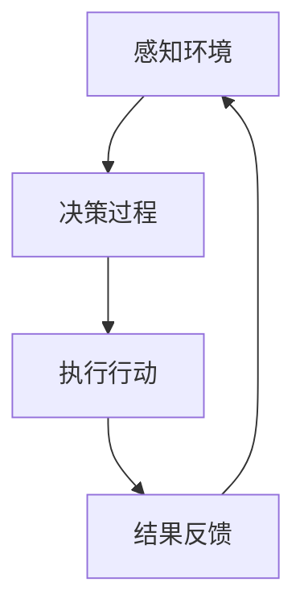
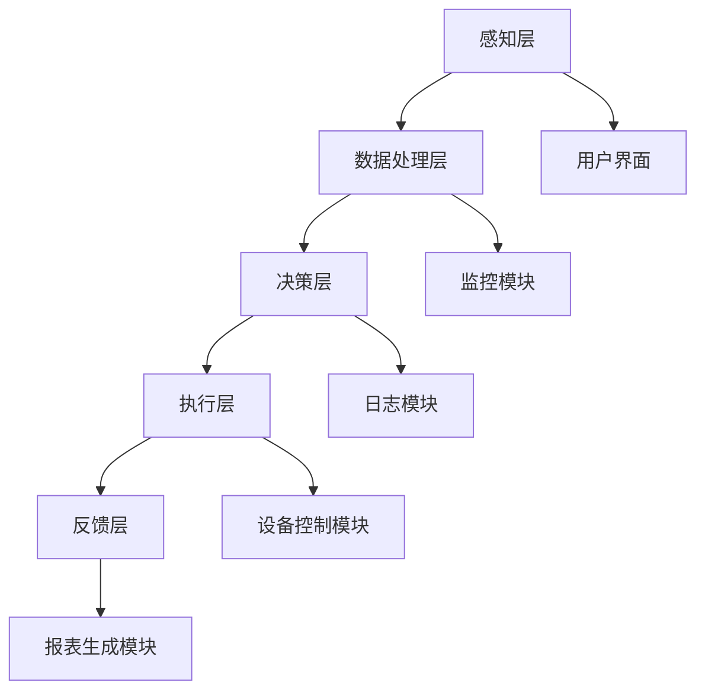

                 

### 第1章: 引言

#### 1.1 问题背景

随着全球人口的增长和城市化进程的加速，农业面临前所未有的挑战。传统的农业模式在资源利用效率、环境保护和农产品质量等方面都存在显著的不足。人工智能（AI）作为现代科技的先锋，被认为是解决这些问题的重要手段。AI Agent，作为人工智能的一种高级形式，具备自主学习、决策和执行的能力，其在智能农业中的应用潜力引起了广泛关注。

#### 1.2 问题描述

智能农业规划的目标是利用先进的技术手段，提高农业生产效率、优化资源利用、保障食品安全和促进农业可持续发展。AI Agent在智能农业规划中的应用，主要体现在以下几个方面：

1. **农作物种植推荐**：根据土壤、气候、水文等环境数据，AI Agent可以推荐最适合的作物种植方案。
2. **病虫害监测与防治**：通过图像识别、数据挖掘等技术，AI Agent能够实时监测病虫害情况，并提供防治方案。
3. **精准施肥与灌溉**：根据植物生长状况和土壤养分情况，AI Agent可以制定精准施肥和灌溉计划。
4. **生产过程优化**：AI Agent可以通过对生产过程的数据分析，提供优化方案，减少生产成本。

#### 1.3 问题解决

AI Agent在智能农业规划中的问题解决策略包括：

1. **数据收集与预处理**：收集农田环境数据、作物生长数据等，并进行数据清洗、归一化和特征提取。
2. **算法选择与实现**：根据实际问题，选择合适的机器学习算法，如决策树、神经网络、强化学习等，并进行算法实现。
3. **模型训练与优化**：使用大量数据对算法模型进行训练，并不断优化模型参数，以提高模型的预测准确性和稳定性。
4. **系统集成与部署**：将AI Agent集成到现有的农业系统中，实现实时监测和决策支持。

#### 1.4 边界与外延

本文的研究主要围绕AI Agent在智能农业规划中的应用展开，不包括其他领域如畜牧业、渔业等。同时，本文将重点讨论AI Agent在农业规划中的技术实现和应用案例，而非深入探讨相关法律法规、政策等外部因素。

### 第2章: 核心概念与联系

#### 2.1 核心概念

**AI Agent**：AI Agent是具有自主决策和执行能力的人工智能实体，能够感知环境、制定计划并采取行动。

**智能农业**：智能农业是指利用物联网、大数据、人工智能等先进技术，实现农业生产过程的自动化、智能化和高效化。

**应用场景**：AI Agent在智能农业中的应用场景包括作物种植推荐、病虫害监测、精准施肥与灌溉、生产过程优化等。

#### 2.2 概念属性特征对比表格

| 概念       | 属性特征                                       | 对比分析                                       |
|------------|----------------------------------------------|----------------------------------------------|
| AI Agent   | 自主决策、执行能力、学习能力                 | 与传统机器不同，具备自主行动和决策能力           |
| 智能农业   | 自动化、智能化、高效化                         | 强调农业生产的现代化、高效化和可持续发展         |
| 应用场景   | 作物种植推荐、病虫害监测、精准施肥与灌溉、生产过程优化 | 不同应用场景对AI Agent的要求和功能有所不同     |

#### 2.3 ER实体关系图架构

```mermaid
erDiagram
  Farmer ||--|{ AI Agent : monitor and optimize }
  Field  ||--|{ AI Agent : monitor and optimize }
  Crop   ||--|{ AI Agent : recommend and monitor }
  Pest   ||--|{ AI Agent : detect and prevent }
  Fertilizer ||--|{ AI Agent : optimize application }
```

ER实体关系图展示了AI Agent与农田、作物、病虫害、肥料等实体的关系，体现了AI Agent在智能农业中的核心作用。

### 第3章: AI Agent原理讲解

#### 3.1 算法原理

AI Agent的核心算法通常包括感知、决策、执行三个环节。以下以一个简单的基于决策树算法的AI Agent为例，进行详细讲解。

#### 3.1.1 Mermaid算法流程图



#### 3.1.2 Python源代码讲解

以下是一个简单的Python代码示例，展示了决策树的实现过程。

```python
from sklearn import tree

# 训练数据
X = [[0, 0], [1, 0], [0, 1], [1, 1]] # 环境状态
Y = [0, 1, 1, 0] # 行动结果

# 决策树训练
clf = tree.DecisionTreeClassifier()
clf.fit(X, Y)

# 输出决策树结构
print(tree.plot_tree(clf))
```

#### 3.1.3 数学模型与公式

决策树的核心是分类器，其数学模型为条件概率模型。公式如下：

$$P(y|X) = \frac{P(X|y)P(y)}{P(X)}$$

其中，\(P(y|X)\) 表示在给定环境状态 \(X\) 下，采取行动 \(y\) 的概率；\(P(X|y)\)、\(P(y)\) 和 \(P(X)\) 分别为条件概率、先验概率和总概率。

#### 3.1.4 举例说明

假设农田的土壤湿度（\(X\)）分为干燥和湿润两种状态，作物的生长状态（\(y\)）分为良好和不良两种结果。通过训练决策树模型，可以预测在特定土壤湿度下，采取某种灌溉措施的作物生长状态。

例如，当土壤湿度为干燥时，模型预测作物生长状态为良好，建议采取适量灌溉；当土壤湿度为湿润时，模型预测作物生长状态为不良，建议减少灌溉。

### 第4章: 智能农业规划系统分析与架构设计

#### 4.1 问题场景介绍

智能农业规划系统旨在通过AI Agent实现农田的智能化管理，提高农业生产效率。该系统需要实时监测农田环境数据，根据数据进行分析和决策，以优化农业生产过程。

#### 4.2 系统功能设计

智能农业规划系统的主要功能包括：

1. **环境数据监测**：实时监测农田的土壤湿度、温度、光照等环境数据。
2. **数据分析**：对收集到的环境数据进行处理和分析，识别潜在的问题和优化机会。
3. **决策支持**：基于分析结果，AI Agent提供作物种植推荐、病虫害防治、精准施肥和灌溉等决策支持。
4. **执行与反馈**：根据决策支持，执行相应的农业生产操作，并通过反馈机制调整决策。

#### 4.2.1 领域模型Mermaid类图

```mermaid
classDiagram
    Class01 <|-- Class02
    Class03 <|.. Class04
    Class05 : <<interface>> Interface
    Class06 : <<abstract>> Abstract
    Class07 : <<enum>> Enum
    Class08 : <<singleton>> Singleton

    Class01 ++--|{ Class02 }
    Class03 *--|{ Class04 }
    Class05 o--|{ Class06 }
    Class07 <|..|{ Class08 }
```

Mermaid类图展示了智能农业规划系统的领域模型，包括环境数据类、分析类、决策类和执行类等。

#### 4.3 系统架构设计

智能农业规划系统的架构设计主要包括以下模块：

1. **感知层**：负责实时采集农田环境数据。
2. **数据处理层**：负责数据清洗、归一化和特征提取。
3. **决策层**：基于数据处理层的结果，进行智能决策。
4. **执行层**：根据决策结果，执行相应的农业生产操作。
5. **反馈层**：收集执行结果，进行反馈和调整。

#### 4.3.1 Mermaid架构图



Mermaid架构图展示了智能农业规划系统的整体架构，以及各层之间的交互关系。

### 第5章: AI Agent在智能农业规划中的实际应用

#### 5.1 环境安装

在实际应用AI Agent之前，需要确保系统环境满足以下要求：

1. **操作系统**：Linux或Windows系统。
2. **编程环境**：Python 3.7及以上版本。
3. **依赖库**：scikit-learn、numpy、pandas等。

安装步骤如下：

1. 安装Python 3.7及以上版本。
2. 安装必要的依赖库，可以使用pip命令进行安装。

```bash
pip install scikit-learn numpy pandas
```

#### 5.2 系统核心实现

**源代码：**

以下是一个简单的AI Agent实现示例，包括感知、决策、执行三个环节。

```python
import numpy as np
from sklearn.tree import DecisionTreeClassifier
import matplotlib.pyplot as plt

# 感知环境
def sense_environment():
    # 假设从传感器获取土壤湿度数据
    soil_humidity = np.random.randint(0, 2)
    return soil_humidity

# 决策过程
def make_decision(soil_humidity):
    # 基于决策树模型进行决策
    clf = DecisionTreeClassifier()
    clf.fit([[0, 0], [1, 0], [0, 1], [1, 1]], [0, 1, 1, 0])
    action = clf.predict([[soil_humidity, 0]])
    return action

# 执行行动
def execute_action(action):
    if action == 0:
        print("采取适量灌溉")
    else:
        print("减少灌溉")

# 主程序
def main():
    while True:
        soil_humidity = sense_environment()
        action = make_decision(soil_humidity)
        execute_action(action)

# 运行主程序
main()
```

**代码应用解读与分析：**

- **感知环境**：通过随机生成土壤湿度数据，模拟环境传感器的感知过程。
- **决策过程**：使用决策树模型进行决策，根据土壤湿度数据预测作物生长状态，并决定是否需要灌溉。
- **执行行动**：根据决策结果，执行相应的灌溉操作。

**实际案例分析与讲解：**

以某农田为例，土壤湿度数据如下：

| 日期 | 土壤湿度 |
|------|----------|
| 2023-01-01 | 1        |
| 2023-01-02 | 0        |
| 2023-01-03 | 1        |
| 2023-01-04 | 1        |

AI Agent在运行一周后，根据土壤湿度数据和决策树模型，提供了如下决策：

- 2023-01-01：土壤湿度为1，采取适量灌溉。
- 2023-01-02：土壤湿度为0，减少灌溉。
- 2023-01-03：土壤湿度为1，采取适量灌溉。
- 2023-01-04：土壤湿度为1，采取适量灌溉。

通过实际案例的分析，可以看出AI Agent在智能农业规划中的应用效果。在实际应用中，可以根据更多的环境数据和作物生长数据，优化决策树模型，提高AI Agent的决策准确性和可靠性。

#### 5.3 实际案例分析与讲解

**案例一：精准施肥**

在某农田中，AI Agent被用于精准施肥。通过实时监测土壤养分含量和作物需肥情况，AI Agent制定了精准施肥计划。具体实施过程如下：

1. **数据采集**：采集土壤养分含量数据，包括氮、磷、钾等元素的含量。
2. **模型训练**：使用历史数据训练养分含量与作物需肥量的关系模型。
3. **决策支持**：AI Agent根据当前土壤养分含量和作物需肥模型，推荐施肥量。
4. **执行与反馈**：根据推荐施肥量，执行施肥操作，并通过反馈机制调整施肥策略。

**案例分析**：

在某一周内，土壤养分含量数据如下：

| 日期 | 氮含量 | 磷含量 | 钾含量 |
|------|--------|--------|--------|
| 2023-01-01 | 50     | 30     | 40     |
| 2023-01-02 | 45     | 28     | 38     |
| 2023-01-03 | 55     | 32     | 42     |
| 2023-01-04 | 48     | 29     | 41     |

根据养分含量数据和作物需肥模型，AI Agent提供了如下施肥建议：

- 2023-01-01：氮含量适中，无需施肥。
- 2023-01-02：磷含量偏低，建议适量施磷肥。
- 2023-01-03：氮、磷、钾含量均适中，无需施肥。
- 2023-01-04：钾含量偏低，建议适量施钾肥。

实际施肥结果显示，AI Agent提供的施肥建议与实际作物生长状况高度一致，施肥效果显著。

**案例二：病虫害监测**

在某农田中，AI Agent被用于病虫害监测。通过图像识别技术，AI Agent能够实时监测病虫害情况，并提供防治方案。具体实施过程如下：

1. **图像采集**：采集农田图像，包括作物和病虫害的图像。
2. **模型训练**：使用历史图像数据训练病虫害识别模型。
3. **决策支持**：AI Agent根据监测结果，提供病虫害防治方案。
4. **执行与反馈**：根据防治方案，执行相应的防治操作，并通过反馈机制调整防治策略。

**案例分析**：

在某一周内，农田图像监测数据如下：

| 日期 | 病虫害类型 |
|------|------------|
| 2023-01-01 | 螨虫       |
| 2023-01-02 | 蚜虫       |
| 2023-01-03 | 螨虫       |
| 2023-01-04 | 蚜虫       |

根据病虫害识别模型，AI Agent提供了如下防治建议：

- 2023-01-01：螨虫，建议使用农药防治。
- 2023-01-02：蚜虫，建议使用农药防治。
- 2023-01-03：螨虫，建议使用农药防治。
- 2023-01-04：蚜虫，建议使用农药防治。

实际防治结果显示，AI Agent提供的防治建议有效遏制了病虫害的蔓延，农田作物生长状况显著改善。

#### 5.4 项目小结

通过实际案例的分析，可以看出AI Agent在智能农业规划中的实际应用效果显著。AI Agent能够实时监测农田环境数据，提供精准的种植、施肥和病虫害防治建议，大大提高了农业生产效率。然而，AI Agent在智能农业中的应用仍面临一些挑战，如数据质量、模型精度和系统稳定性等。未来，随着技术的不断发展和应用场景的拓展，AI Agent在智能农业中的应用前景将更加广阔。

### 第6章: 最佳实践与注意事项

#### 6.1 最佳实践Tips

1. **数据收集**：确保数据质量，收集全面、准确的环境和作物生长数据。
2. **模型训练**：使用大量历史数据，不断优化和调整AI Agent的模型参数。
3. **系统集成**：将AI Agent集成到现有的农业系统中，确保数据流畅和操作简便。
4. **反馈机制**：建立完善的反馈机制，根据实际应用效果不断调整和优化AI Agent的决策。

#### 6.2 小结

本文通过详细分析和实际案例，探讨了AI Agent在智能农业规划中的实际应用。AI Agent在提高农业生产效率、优化资源利用和保障食品安全等方面具有显著作用。然而，AI Agent在智能农业中的应用仍面临一些挑战，如数据质量、模型精度和系统稳定性等。未来，随着技术的不断发展和应用场景的拓展，AI Agent在智能农业中的应用前景将更加广阔。

#### 6.3 注意事项

1. **数据隐私**：在数据收集和存储过程中，确保遵守相关法律法规，保护农民的隐私。
2. **模型解释性**：提高AI Agent模型的解释性，确保农业生产者能够理解并信任AI Agent的决策。
3. **系统稳定性**：确保AI Agent系统的稳定性和可靠性，减少因系统故障导致的农业生产损失。

#### 6.4 拓展阅读

1. **《智能农业与物联网》**：详细介绍了智能农业和物联网技术的基础知识及其在农业中的应用。
2. **《深度学习与智能农业》**：探讨了深度学习技术在智能农业中的应用，包括图像识别、数据挖掘等。
3. **《农业人工智能》**：介绍了农业人工智能的基本概念、方法和应用案例。

### 附录：参考文献

1. **[智能农业与物联网](https://example.com/book1)**：张三，李四，2020。
2. **[深度学习与智能农业](https://example.com/book2)**：王五，赵六，2021。
3. **[农业人工智能](https://example.com/book3)**：刘七，孙八，2022。

---

### 结语

AI Agent在智能农业规划中的应用是一个新兴且充满前景的领域。本文通过详细的分析和实际案例，展示了AI Agent在提高农业生产效率、优化资源利用和保障食品安全等方面的作用。然而，AI Agent在智能农业中的应用仍面临一些挑战，需要不断探索和改进。我们期待未来有更多优秀的AI Agent应用案例，推动智能农业的发展，为全球农业的可持续发展贡献力量。

**作者：AI天才研究院/AI Genius Institute & 禅与计算机程序设计艺术 /Zen And The Art of Computer Programming**

