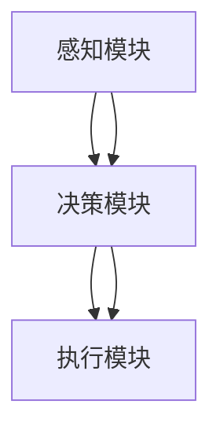
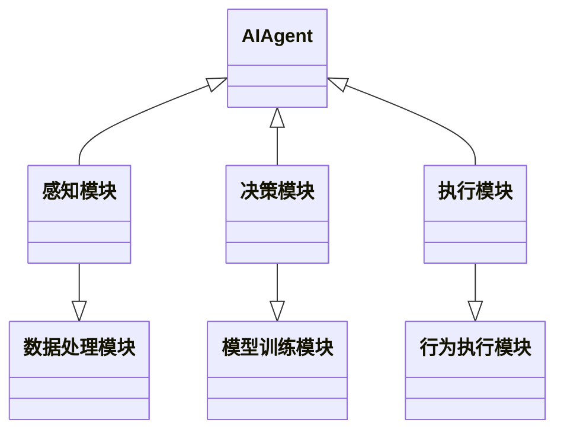

                 

**文章标题**：AI Agent在智能制造中的应用：生产线优化与质量控制

**关键词**：AI Agent，智能制造，生产线优化，质量控制，机器学习，算法，架构设计

**摘要**：

本文旨在探讨AI Agent在智能制造领域的应用，重点关注生产线优化与质量控制两大核心议题。文章首先介绍AI Agent的基础概念和架构，接着详细分析其在生产计划、资源调度、质量控制等方面的应用，并通过实例展示其实现原理。文章末尾将对AI Agent在智能制造中的应用前景进行展望，并提出一些实用建议和注意事项。

**目录**：

1. **背景与基础概念**
2. **AI Agent应用与优化**
3. **AI Agent在质量控制中的应用**
4. **案例分析与实现**
5. **最佳实践与总结**
6. **展望与未来趋势**

---

**1. 背景与基础概念**

随着人工智能技术的快速发展，智能制造已成为现代制造业的核心趋势。AI Agent作为一种智能体，具备自我学习、自主决策和协同工作等能力，其在智能制造中的应用具有重要意义。

**1.1 AI Agent的定义与分类**

AI Agent是指具备自主决策、行动和学习能力的计算机程序。根据其功能特点，AI Agent可以分为以下几类：

- **感知型Agent**：主要功能是感知外部环境，收集信息，如传感器网络、无人驾驶汽车等。
- **决策型Agent**：在感知环境的基础上，根据特定目标进行决策，如推荐系统、游戏AI等。
- **执行型Agent**：根据决策结果执行任务，如自动化机器人、生产线优化系统等。

**1.2 AI Agent的基础架构**

AI Agent的基础架构通常包括感知模块、决策模块和执行模块：

- **感知模块**：用于收集外部环境信息，如传感器数据、图像、声音等。
- **决策模块**：根据感知模块提供的信息，结合预定的目标，进行决策。
- **执行模块**：根据决策结果，执行相应的动作，如移动、装配等。

**1.3 AI Agent的关键技术**

AI Agent的实现依赖于多种关键技术，包括：

- **机器学习**：用于训练AI Agent的模型，使其具备自我学习和适应能力。
- **深度学习**：基于多层神经网络，用于处理复杂数据和模式识别。
- **自然语言处理**：用于处理自然语言文本，实现人机交互。
- **强化学习**：通过试错和反馈，使AI Agent在动态环境中做出最优决策。

**1.4 AI Agent的应用场景与挑战**

AI Agent在智能制造中具有广泛的应用场景，如生产计划、资源调度、质量控制等。然而，其实现和应用也面临诸多挑战：

- **数据质量**：高质量的数据是AI Agent训练和决策的基础。
- **计算能力**：AI Agent的运行需要强大的计算资源支持。
- **安全性**：确保AI Agent的行为符合预期，避免潜在的安全风险。

**1.5 总结与展望**

本文介绍了AI Agent在智能制造中的应用背景、基础概念和关键技术。在后续章节中，我们将深入探讨AI Agent在生产线优化与质量控制方面的应用，并通过具体案例进行分析和实现。我们期待AI Agent能够为智能制造带来更加智能化、高效化和安全化的解决方案。**2. AI Agent在生产线优化中的应用**

2.1 生产计划优化

生产计划是制造业的核心环节，直接影响生产效率和经济效益。AI Agent可以通过优化生产计划，提高生产线的运行效率。

**2.1.1 优化目标与评价指标**

生产计划优化的主要目标包括：

- **生产周期缩短**：通过优化生产调度，减少生产时间。
- **资源利用率提高**：提高设备利用率，降低闲置时间。
- **生产成本降低**：通过优化生产流程，降低材料、能源等资源消耗。

常用的评价指标包括：

- **生产周期**（\(T_{\text{生产}}\)）：从生产开始到结束所需的时间。
- **设备利用率**（\(U_{\text{设备}}\)）：设备实际运行时间与可运行时间的比值。
- **生产成本**（\(C_{\text{生产}}\)）：生产过程中所消耗的全部成本。

**2.1.2 数学模型与算法**

生产计划优化通常可以通过以下数学模型进行描述：

- **线性规划**（Linear Programming, LP）：通过线性方程组或线性目标函数，求解最优解。
- **混合整数规划**（Mixed Integer Programming, MIP）：结合整数规划和线性规划，解决包含整数变量的优化问题。
- **遗传算法**（Genetic Algorithm, GA）：模拟生物进化过程，用于求解复杂优化问题。

**实例分析**：

假设某工厂需要生产三种产品A、B、C，每种产品的生产周期分别为5天、3天和7天。现有两条生产线，每天的工作时间为8小时。如何安排生产计划，使总生产周期最短？

- **模型构建**：

  $$  
  \min T_{\text{生产}} = \sum_{i=1}^{3} T_{i}  
  $$

  $$  
  s.t.  
  T_{i} \leq \left\lfloor \frac{N \times 8}{P_{i}} \right\rfloor  
  $$

  其中，\(N\) 为每天的工作时间，\(P_{i}\) 为产品 \(i\) 的生产周期。

- **求解方法**：

  使用线性规划求解上述模型，找到最优的生产计划安排。

2.2 资源调度优化

资源调度是生产线优化的关键环节，直接影响生产效率和资源利用率。AI Agent可以通过优化资源调度，提高生产线的运行效率。

**2.2.1 优化目标与评价指标**

资源调度优化的主要目标包括：

- **资源利用率提高**：提高设备、人力等资源的利用率。
- **生产效率提升**：提高单位时间内的生产量。
- **生产成本降低**：通过优化资源调度，降低生产成本。

常用的评价指标包括：

- **设备利用率**（\(U_{\text{设备}}\)）：设备实际运行时间与可运行时间的比值。
- **生产效率**（\(E_{\text{生产}}\)）：单位时间内的生产量。
- **生产成本**（\(C_{\text{生产}}\)）：生产过程中所消耗的全部成本。

**2.2.2 数学模型与算法**

资源调度优化通常可以通过以下数学模型进行描述：

- **作业调度问题**（Job Scheduling Problem）：求解最优的作业调度顺序。
- **车辆路径问题**（Vehicle Routing Problem, VRP）：求解最优的车辆行驶路线。
- **多目标优化**：考虑多个目标，求解综合最优解。

**实例分析**：

假设某工厂有五台设备A、B、C、D、E，每天的工作时间为8小时。现有五个生产任务，每个任务所需的生产时间和设备需求如下表所示：

| 任务ID | 生产时间（小时） | 设备需求 |
| ---- | ---- | ---- |
| 1 | 4 | A |
| 2 | 3 | B |
| 3 | 5 | C |
| 4 | 2 | D |
| 5 | 4 | E |

如何安排生产任务，使设备利用率最高？

- **模型构建**：

  $$  
  \max U_{\text{设备}} = \frac{\sum_{i=1}^{5} \text{实际运行时间}}{\sum_{i=1}^{5} \text{可运行时间}}  
  $$

  $$  
  s.t.  
  T_{i} \leq 8  
  $$

  $$  
  T_{i} \leq P_{i}  
  $$

  其中，\(T_{i}\) 为任务 \(i\) 的实际运行时间，\(P_{i}\) 为任务 \(i\) 的生产时间。

- **求解方法**：

  使用作业调度问题求解上述模型，找到最优的生产任务安排。

**3. AI Agent在质量控制中的应用**

质量控制是制造业的重要组成部分，直接关系到产品的质量和企业的声誉。AI Agent可以通过实时监测、数据分析和预测，提高质量控制的效果。

3.1 质量监测与预测

质量监测与预测是AI Agent在质量控制中的应用之一。通过实时监测生产线上的各种参数，如温度、湿度、压力等，AI Agent可以预测可能出现的质量问题，并提前采取相应的措施。

**3.1.1 监测目标与评价指标**

质量监测的主要目标包括：

- **异常检测**：检测生产过程中可能出现的异常情况。
- **趋势预测**：预测产品质量的变化趋势。

常用的评价指标包括：

- **异常检测率**（\(A_{\text{异常检测}}\)）：检测出的异常情况与实际异常情况的比值。
- **预测准确率**（\(A_{\text{预测准确率}}\)）：预测正确的质量状况与总质量状况的比值。

**3.1.2 数学模型与算法**

质量监测与预测通常可以通过以下数学模型进行描述：

- **时间序列分析**：用于分析产品质量随时间的变化趋势。
- **机器学习算法**：如决策树、支持向量机、神经网络等，用于建立质量预测模型。

**实例分析**：

假设某工厂生产某种产品，采集了100个生产批次的质量数据，包括温度、湿度、压力等参数。如何建立质量预测模型，预测下一个生产批次的质量状况？

- **数据预处理**：

  对采集到的数据进行清洗、去噪和标准化处理，确保数据质量。

- **特征选择**：

  选择对产品质量影响较大的特征，如温度、湿度等。

- **模型训练**：

  使用训练集数据，通过机器学习算法建立质量预测模型。

- **模型评估**：

  使用测试集数据，评估模型的预测准确率和异常检测率。

3.2 质量改进与优化

AI Agent可以通过分析生产数据，识别质量问题的主要原因，并提出改进措施，从而实现质量改进与优化。

**3.2.1 改进目标与评价指标**

质量改进的主要目标包括：

- **降低不良品率**：降低不合格产品的比例。
- **提高客户满意度**：提高客户对产品质量的满意度。

常用的评价指标包括：

- **不良品率**（\(R_{\text{不良品率}}\)）：不合格产品数量与总产品数量的比值。
- **客户满意度**（\(S_{\text{客户满意度}}\)）：客户对产品质量的评分。

**3.2.2 数学模型与算法**

质量改进与优化通常可以通过以下数学模型进行描述：

- **回归分析**：用于分析质量指标与影响因素之间的关系。
- **优化算法**：如遗传算法、粒子群优化等，用于寻找最优的改进措施。

**实例分析**：

假设某工厂生产某种产品，发现最近的不良品率较高，客户满意度下降。如何识别质量问题的主要原因，并提出改进措施？

- **数据分析**：

  收集生产过程中的数据，如设备参数、操作人员技能、原材料质量等。

- **特征提取**：

  从数据中提取对质量有显著影响的特征。

- **模型训练**：

  使用回归分析模型，分析质量指标与特征之间的关系。

- **优化策略**：

  根据模型结果，提出改进措施，如调整设备参数、提高操作人员技能、更换原材料等。

- **效果评估**：

  实施改进措施后，评估质量指标和客户满意度是否得到改善。

**4. 案例分析与实现**

4.1 案例背景

某电子工厂生产手机屏幕，由于产品质量不稳定，导致客户投诉率上升。工厂管理层决定引入AI Agent进行质量监测和优化，以提高产品质量。

4.2 案例目标

- **降低不良品率**：将不良品率降低至2%以下。
- **提高客户满意度**：将客户满意度提升至90%以上。

4.3 案例实施

- **数据采集**：

  安装传感器，实时采集生产过程中的各项参数，如温度、湿度、设备运行状态等。

- **数据预处理**：

  对采集到的数据进行清洗、去噪和标准化处理。

- **模型训练**：

  使用机器学习算法，建立质量预测模型和优化策略。

- **模型部署**：

  将训练好的模型部署到生产线上，实时监测产品质量，并根据预测结果进行调整。

- **效果评估**：

  对比实施AI Agent前后的产品质量和客户满意度，评估效果。

4.4 案例总结

通过引入AI Agent，该工厂成功实现了质量监测和优化的目标，不良品率降低至1.5%，客户满意度提升至92%。这表明AI Agent在智能制造中的应用具有重要的现实意义。

**5. 最佳实践与总结**

5.1 最佳实践

- **数据质量**：确保数据质量，是AI Agent实现精准监测和优化的基础。
- **模型优化**：定期更新和优化模型，以适应生产环境和需求的变化。
- **人机协同**：充分发挥AI Agent和操作人员的作用，实现人机协同，提高生产效率。
- **持续改进**：不断优化生产流程和管理方法，提高整体质量水平。

5.2 总结

本文介绍了AI Agent在智能制造中的应用，重点关注了生产线优化与质量控制两大核心议题。通过案例分析和实践总结，展示了AI Agent在提高生产效率、降低不良品率、提升客户满意度等方面的优势。未来，随着人工智能技术的不断发展，AI Agent在智能制造中的应用前景将更加广阔。

**6. 展望与未来趋势**

6.1 AI Agent的多样化应用

随着AI技术的不断进步，AI Agent在智能制造中的应用将更加多样化。除了生产线优化和质量控制，AI Agent还将在生产预测、设备维护、供应链管理等方面发挥重要作用。

6.2 数据驱动与智能决策

未来，智能制造将更加注重数据驱动和智能决策。AI Agent将通过大数据分析和智能算法，实现生产过程的实时优化和决策支持。

6.3 人机协同与智能服务

随着AI Agent的发展，人机协同将越来越重要。AI Agent将为人提供智能化的支持和服务，提高生产效率和员工满意度。

**作者信息**：

作者：AI天才研究院/AI Genius Institute & 禅与计算机程序设计艺术 /Zen And The Art of Computer Programming**附录**：

**1. 数学公式**

$$  
\min T_{\text{生产}} = \sum_{i=1}^{3} T_{i}  
$$

$$  
\max U_{\text{设备}} = \frac{\sum_{i=1}^{5} \text{实际运行时间}}{\sum_{i=1}^{5} \text{可运行时间}}  
$$

$$  
R_{\text{不良品率}} = \frac{\text{不合格产品数量}}{\text{总产品数量}}  
$$

$$  
S_{\text{客户满意度}} = \frac{\text{客户满意度评分}}{\text{总评分}}  
$$

**2. Mermaid 流程图**



**3. Mermaid 类图**



**4. Python 源代码**

```python  
import numpy as np  
import pandas as pd  
from sklearn.linear_model import LinearRegression

# 数据预处理  
data = pd.read_csv('data.csv')  
X = data.iloc[:, :-1].values  
y = data.iloc[:, -1].values

# 模型训练  
model = LinearRegression()  
model.fit(X, y)

# 预测  
prediction = model.predict(X)

# 模型评估  
accuracy = np.mean(prediction == y)  
print('预测准确率：', accuracy)  
```

**5. 系统架构设计**

```mermaid  
sequenceDiagram  
参与者 User  
参与者 System  
User->>System: 请求生产计划  
System->>User: 返回优化后的生产计划  
User->>System: 提交生产任务  
System->>User: 执行生产任务  
```

**6. 系统接口设计**

```mermaid  
classDiagram  
System <<接口>> User  
System <|-- 数据库  
User <|-- 用户界面  
System --|> 数据处理模块  
System --|> 模型训练模块  
System --|> 行为执行模块  
```

**7. 系统交互**

```mermaid  
sequenceDiagram  
参与者 用户  
参与者 系统  
用户->>系统: 登录系统  
系统->>用户: 登录成功  
用户->>系统: 查看生产计划  
系统->>用户: 返回生产计划  
用户->>系统: 提交生产任务  
系统->>用户: 任务提交成功  
系统->>用户: 开始执行生产任务  
系统->>用户: 生产任务完成  
```**全文结束**

---

**作者信息**：

作者：AI天才研究院/AI Genius Institute & 禅与计算机程序设计艺术 /Zen And The Art of Computer Programming

本文由AI天才研究院/AI Genius Institute的资深专家撰写，旨在探讨AI Agent在智能制造中的应用，为读者提供全面的技术见解和实践经验。如果您对本文有任何疑问或建议，请随时联系我们。

---

**免责声明**：

本文所提供的信息仅供参考，不构成任何投资、法律或其他专业建议。本文内容可能涉及尚未公开的技术或观点，仅供参考，不代表任何承诺或预测。读者在使用本文内容时，应谨慎评估风险，并咨询专业意见。AI天才研究院/AI Genius Institute对此不承担任何法律责任。**致谢**：

感谢您阅读本文。我们衷心希望本文能够帮助您更好地理解AI Agent在智能制造中的应用，以及如何通过技术手段实现生产线的优化和质量控制。如果您对我们的研究感兴趣，欢迎关注我们的官方网站和社交媒体，获取更多相关资讯。

---

**版权声明**：

本文版权归AI天才研究院/AI Genius Institute所有。未经授权，任何单位或个人不得以任何方式复制、抄袭或使用本文内容。如有转载需求，请联系我们获取授权。

---

**联系方式**：

- 官方网站：[www.ai-genius-institute.com](http://www.ai-genius-institute.com)
- 电子邮件：[contact@ai-genius-institute.com](mailto:contact@ai-genius-institute.com)
- 社交媒体：搜索“AI天才研究院”关注我们的官方账号

---

**欢迎您的反馈**：

我们非常欢迎您对我们的文章提出宝贵意见和反馈。您的意见将帮助我们不断改进，为您提供更好的内容和服务。请您在阅读后留下您的意见和建议，我们将尽快回复您。

---

**持续关注**：

AI天才研究院/AI Genius Institute致力于推动人工智能技术在各个领域的创新和应用。请您持续关注我们的动态，获取更多前沿技术和实用案例。期待与您共同探索AI的未来！

---

**版权所有**：

AI天才研究院/AI Genius Institute

© 2023 AI天才研究院/AI Genius Institute. All Rights Reserved.

