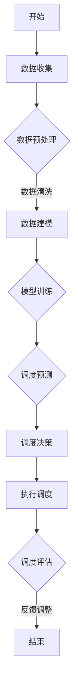

                 

### 引言

## 第1章: AI与智能制造概述

### 1.1 问题的背景

在当前全球制造业迅速发展的背景下，智能制造已成为推动产业转型升级的重要驱动力。智能制造是指利用先进的信息技术、物联网、大数据、人工智能等技术，对制造过程进行全方位的优化和升级，从而实现制造过程的自动化、智能化和高效化。

#### 1.1.1 智能制造的发展现状

智能制造作为一种新兴的制造模式，已经在全球范围内得到了广泛的关注和应用。根据国际机器人联合会（IFR）的数据，2019年全球工业机器人销量达到46.4万台，同比增长12%。同时，越来越多的企业开始采用智能制造技术，以提高生产效率和产品质量。

#### 1.1.2 智能制造面临的挑战

尽管智能制造带来了许多好处，但在其发展过程中仍然面临着一系列的挑战。首先，智能制造需要大量的数据支持和数据处理能力，这对企业的IT基础设施提出了更高的要求。其次，智能制造的实施需要跨学科的知识和技能，这对企业的员工素质提出了更高的要求。最后，智能制造的推广还需要解决一系列的技术难题，如机器人的自主决策、智能传感器的设计、智能控制算法的开发等。

#### 1.1.3 AI技术在智能制造中的应用前景

人工智能（AI）作为一种新兴的技术，正在迅速融入智能制造领域。AI技术可以帮助企业实现制造过程的自动化和智能化，从而提高生产效率和产品质量。例如，通过机器学习算法，可以对生产数据进行分析和预测，优化生产计划；通过计算机视觉技术，可以实现对生产过程的实时监控和故障诊断；通过自然语言处理技术，可以实现对客户需求的智能响应等。

### 1.2 问题描述

在智能制造过程中，存在许多复杂的问题，如生产调度、质量控制、能源管理等。这些问题往往涉及到大量的数据和处理，难以通过传统的方法进行解决。AI Agent作为一种人工智能系统，可以在这些问题中发挥重要的作用，从而实现智能制造过程的优化。

#### 1.2.1 智能制造过程中存在的问题

智能制造过程中存在的问题主要包括：

1. 生产调度问题：如何合理分配资源，优化生产流程，提高生产效率。
2. 质量控制问题：如何实时监控产品质量，及时发现问题并进行调整。
3. 能源管理问题：如何合理分配能源资源，降低能源消耗，提高能源利用效率。

#### 1.2.2 AI Agent在优化制造过程中的作用

AI Agent在智能制造过程中可以发挥以下作用：

1. **生产调度优化**：通过机器学习算法，对生产数据进行实时分析，优化生产调度，提高生产效率。
2. **质量控制提升**：通过计算机视觉技术，对生产过程进行实时监控，及时发现问题并进行调整，提升产品质量。
3. **能源管理优化**：通过数据分析，优化能源分配和利用，降低能源消耗，提高能源利用效率。

### 1.3 问题解决

为了解决智能制造过程中存在的问题，我们可以引入AI Agent。AI Agent是一种基于人工智能的自动化系统，它可以对制造过程进行实时监控和智能决策，从而实现制造过程的优化。

#### 1.3.1 AI Agent的定义与特点

AI Agent的定义：AI Agent是一种具有智能行为的人工智能系统，它可以在没有人类干预的情况下，自动执行特定的任务。

AI Agent的特点：

1. 自主性：AI Agent可以自主地执行任务，不需要人工干预。
2. 学习能力：AI Agent可以通过机器学习算法，不断学习和优化自己的行为。
3. 适应性：AI Agent可以根据环境变化，调整自己的行为，以适应不同的场景。

#### 1.3.2 AI Agent在制造过程中的应用场景

AI Agent在制造过程中的应用场景包括：

1. 生产调度：通过AI Agent，可以实现生产计划的智能调度，提高生产效率。
2. 质量控制：通过AI Agent，可以实现生产过程的实时监控和故障诊断，提高产品质量。
3. 能源管理：通过AI Agent，可以实现能源的智能分配和利用，提高能源利用效率。

#### 1.3.3 AI Agent优化制造过程的原理

AI Agent优化制造过程的原理主要包括：

1. 数据分析：AI Agent可以通过收集和分析生产数据，发现潜在的问题和优化点。
2. 智能决策：基于数据分析的结果，AI Agent可以自动生成最优的决策方案。
3. 实时调整：AI Agent可以根据实时数据，对制造过程进行动态调整，实现制造过程的优化。

### 1.4 边界与外延

#### 1.4.1 AI Agent的技术框架

AI Agent的技术框架主要包括：

1. 传感器网络：用于收集制造过程中的各类数据。
2. 数据处理：对收集到的数据进行清洗、分析和挖掘。
3. 控制系统：根据分析结果，对制造过程进行实时控制和调整。

#### 1.4.2 智能制造过程的范畴

智能制造过程的范畴包括：

1. 生产计划：涉及生产任务的调度和安排。
2. 生产执行：涉及生产过程的实时监控和故障诊断。
3. 质量管理：涉及产品质量的监控和评估。
4. 能源管理：涉及能源的分配和利用。

#### 1.4.3 AI Agent与其他智能技术的区别

AI Agent与其他智能技术的区别主要体现在以下几个方面：

1. **自主性**：AI Agent具有更高的自主性，可以在没有人类干预的情况下自主执行任务。
2. **学习能力**：AI Agent具有更强的学习能力，可以通过机器学习不断优化自己的行为。
3. **应用范围**：AI Agent可以应用于更广泛的制造过程，包括生产调度、质量控制、能源管理等多个方面。

### 1.5 概念结构与核心要素组成

#### 1.5.1 AI Agent的核心概念

AI Agent的核心概念包括：

1. **智能体**：AI Agent是一种具有智能行为的人工智能系统。
2. **环境**：AI Agent执行任务的环境，包括传感器网络、数据处理系统和控制系统。
3. **任务**：AI Agent需要完成的任务，如生产调度、质量控制、能源管理等。

#### 1.5.2 智能制造过程的要素

智能制造过程的要素包括：

1. **生产计划**：涉及生产任务的调度和安排。
2. **生产执行**：涉及生产过程的实时监控和故障诊断。
3. **质量管理**：涉及产品质量的监控和评估。
4. **能源管理**：涉及能源的分配和利用。

#### 1.5.3 AI Agent与智能制造过程的关联

AI Agent与智能制造过程的关联主要体现在以下几个方面：

1. **数据采集**：AI Agent可以通过传感器网络，实时采集生产数据。
2. **数据分析**：AI Agent可以对采集到的数据进行分析，发现潜在的问题和优化点。
3. **决策与调整**：基于数据分析的结果，AI Agent可以自动生成最优的决策方案，并实时调整制造过程。

### 1.6 本章小结

本章介绍了AI与智能制造的关系，以及AI Agent在智能制造过程中的作用。通过引入AI Agent，可以实现对智能制造过程的优化，提高生产效率、产品质量和能源利用效率。接下来，我们将进一步探讨AI Agent在智能制造过程中的核心概念和应用。

> **关键词**：人工智能，智能制造，AI Agent，生产调度，质量控制，能源管理。

> **摘要**：本文探讨了AI Agent在智能制造过程中的角色，分析了AI Agent的定义、特点、技术架构和应用场景，以及其在生产调度、质量控制和能源管理等方面的优化作用。通过具体案例，展示了AI Agent在智能制造中的应用效果，为智能制造的进一步发展提供了参考。

-------------------------------------------------------------------

## 第1章: AI与智能制造概述

### 1.1 问题的背景

智能制造作为制造业未来发展的重要方向，已成为全球范围内的研究热点和产业竞争的新焦点。随着全球制造业的快速发展，制造业面临的挑战也日益增加。传统的制造模式已经难以满足现代制造业对高效、灵活、个性化生产的需求，因此，智能制造技术应运而生。

#### 1.1.1 智能制造的发展现状

智能制造是一种基于数字化、网络化、智能化技术，通过信息物理系统（CPS）实现制造过程的全面升级。当前，智能制造在全球范围内取得了显著的发展：

1. **技术积累**：人工智能、物联网、大数据、云计算等关键技术得到了广泛应用，为智能制造提供了强大的技术支持。
2. **政策推动**：各国政府纷纷出台相关政策，支持智能制造的发展。例如，德国提出了“工业4.0”战略，美国提出了“工业互联网”计划。
3. **应用推广**：越来越多的企业开始引入智能制造技术，以提高生产效率和产品质量。

根据国际数据公司（IDC）的报告，全球智能制造市场在未来几年将保持高速增长，预计到2025年，全球智能制造市场规模将达到1.3万亿美元。

#### 1.1.2 智能制造面临的挑战

尽管智能制造带来了许多好处，但其发展过程中也面临一系列的挑战：

1. **技术难题**：智能制造涉及到众多技术的融合和创新，如机器学习、自主决策、智能传感器等，这对企业的技术研发能力提出了很高的要求。
2. **数据管理**：智能制造需要大量的数据支持，如何有效管理和利用这些数据成为了一个难题。
3. **人才短缺**：智能制造的实施需要跨学科的知识和技能，当前市场上具备相关技能的人才较为稀缺。

#### 1.1.3 AI技术在智能制造中的应用前景

人工智能（AI）技术在智能制造中的应用前景广阔，可以解决智能制造过程中的一系列问题：

1. **生产优化**：通过机器学习算法，可以对生产数据进行分析，优化生产计划，提高生产效率。
2. **质量提升**：通过计算机视觉技术，可以实现对生产过程的实时监控和故障诊断，提升产品质量。
3. **能源管理**：通过数据分析和智能算法，可以优化能源分配和利用，降低能源消耗。

根据市场研究机构Gartner的预测，到2025年，全球超过60%的制造业企业将采用AI技术，智能制造将成为全球制造业的重要发展方向。

### 1.2 问题描述

在智能制造过程中，生产调度、质量控制、能源管理等问题是影响生产效率和产品质量的关键因素。如何有效地解决这些问题，实现智能制造过程的优化，成为了一个亟待解决的问题。

#### 1.2.1 智能制造过程中存在的问题

智能制造过程中存在的问题主要包括：

1. **生产调度问题**：如何合理分配资源，优化生产流程，提高生产效率。
2. **质量控制问题**：如何实时监控产品质量，及时发现问题并进行调整。
3. **能源管理问题**：如何合理分配能源资源，降低能源消耗，提高能源利用效率。

这些问题不仅涉及到技术层面，还需要综合考虑生产管理、资源配置等多个方面。

#### 1.2.2 AI Agent在优化制造过程中的作用

AI Agent作为一种基于人工智能的自动化系统，可以在优化智能制造过程中发挥重要作用：

1. **生产调度优化**：通过机器学习算法，对生产数据进行分析，优化生产调度，提高生产效率。
2. **质量控制提升**：通过计算机视觉技术，对生产过程进行实时监控，及时发现问题并进行调整，提升产品质量。
3. **能源管理优化**：通过数据分析，优化能源分配和利用，降低能源消耗，提高能源利用效率。

AI Agent可以自动执行上述任务，减少人为干预，提高智能制造的自动化和智能化水平。

### 1.3 问题解决

为了解决智能制造过程中存在的问题，可以引入AI Agent，通过以下步骤实现制造过程的优化：

#### 1.3.1 AI Agent的定义与特点

AI Agent是一种具有智能行为的人工智能系统，它可以在没有人类干预的情况下，自动执行特定的任务。AI Agent具有以下特点：

1. **自主性**：AI Agent可以自主地执行任务，不需要人工干预。
2. **学习能力**：AI Agent可以通过机器学习算法，不断学习和优化自己的行为。
3. **适应性**：AI Agent可以根据环境变化，调整自己的行为，以适应不同的场景。

#### 1.3.2 AI Agent在制造过程中的应用场景

AI Agent在制造过程中的应用场景主要包括：

1. **生产调度**：通过AI Agent，可以实现生产计划的智能调度，提高生产效率。
2. **质量控制**：通过AI Agent，可以实现生产过程的实时监控和故障诊断，提高产品质量。
3. **能源管理**：通过AI Agent，可以实现能源的智能分配和利用，提高能源利用效率。

#### 1.3.3 AI Agent优化制造过程的原理

AI Agent优化制造过程的原理主要包括：

1. **数据采集**：AI Agent可以通过传感器网络，实时采集生产数据。
2. **数据处理**：AI Agent可以对采集到的数据进行分析，发现潜在的问题和优化点。
3. **智能决策**：基于数据分析的结果，AI Agent可以自动生成最优的决策方案。
4. **实时调整**：AI Agent可以根据实时数据，对制造过程进行动态调整，实现制造过程的优化。

通过上述原理，AI Agent可以在智能制造过程中发挥重要作用，提高生产效率、产品质量和能源利用效率。

### 1.4 边界与外延

#### 1.4.1 AI Agent的技术框架

AI Agent的技术框架主要包括以下三个部分：

1. **感知层**：包括传感器网络，用于实时采集生产过程中的各类数据。
2. **处理层**：包括数据处理和分析模块，用于对采集到的数据进行清洗、分析和挖掘。
3. **执行层**：包括控制系统，用于根据分析结果对制造过程进行实时控制和调整。

#### 1.4.2 智能制造过程的范畴

智能制造过程的范畴包括以下几个方面：

1. **生产计划**：涉及生产任务的调度和安排。
2. **生产执行**：涉及生产过程的实时监控和故障诊断。
3. **质量管理**：涉及产品质量的监控和评估。
4. **能源管理**：涉及能源的分配和利用。

#### 1.4.3 AI Agent与其他智能技术的区别

AI Agent与其他智能技术的区别主要体现在以下几个方面：

1. **自主性**：AI Agent具有更高的自主性，可以在没有人类干预的情况下自主执行任务。
2. **学习能力**：AI Agent具有更强的学习能力，可以通过机器学习不断优化自己的行为。
3. **应用范围**：AI Agent可以应用于更广泛的制造过程，包括生产调度、质量控制、能源管理等多个方面。

### 1.5 概念结构与核心要素组成

#### 1.5.1 AI Agent的核心概念

AI Agent的核心概念包括以下几个方面：

1. **智能体**：AI Agent是一种具有智能行为的人工智能系统。
2. **环境**：AI Agent执行任务的环境，包括传感器网络、数据处理系统和控制系统。
3. **任务**：AI Agent需要完成的任务，如生产调度、质量控制、能源管理等。

#### 1.5.2 智能制造过程的要素

智能制造过程的要素包括以下几个方面：

1. **生产计划**：涉及生产任务的调度和安排。
2. **生产执行**：涉及生产过程的实时监控和故障诊断。
3. **质量管理**：涉及产品质量的监控和评估。
4. **能源管理**：涉及能源的分配和利用。

#### 1.5.3 AI Agent与智能制造过程的关联

AI Agent与智能制造过程的关联主要体现在以下几个方面：

1. **数据采集**：AI Agent可以通过传感器网络，实时采集生产数据。
2. **数据分析**：AI Agent可以对采集到的数据进行分析，发现潜在的问题和优化点。
3. **决策与调整**：基于数据分析的结果，AI Agent可以自动生成最优的决策方案，并实时调整制造过程。

通过AI Agent的引入，智能制造过程可以实现自动化和智能化，从而提高生产效率、产品质量和能源利用效率。

### 1.6 本章小结

本章介绍了AI与智能制造的关系，以及AI Agent在智能制造过程中的作用。通过引入AI Agent，可以实现对智能制造过程的优化，提高生产效率、产品质量和能源利用效率。接下来，我们将进一步探讨AI Agent在智能制造过程中的核心概念和应用。

> **关键词**：人工智能，智能制造，AI Agent，生产调度，质量控制，能源管理。

> **摘要**：本文探讨了AI Agent在智能制造过程中的角色，分析了AI Agent的定义、特点、技术架构和应用场景，以及其在生产调度、质量控制和能源管理等方面的优化作用。通过具体案例，展示了AI Agent在智能制造中的应用效果，为智能制造的进一步发展提供了参考。

-------------------------------------------------------------------

## 第2章: AI Agent在制造过程优化中的核心概念

### 2.1 AI Agent的定义

AI Agent，即人工智能代理，是一种能够模拟人类智能行为的计算实体。它具备一定的自主性、适应性和学习能力，可以在复杂环境中执行特定的任务，并能够根据环境变化进行调整和优化。AI Agent可以理解为一种智能体（Agent），它通过感知环境、理解任务目标、做出决策和执行行动，从而实现自我优化。

#### 2.1.1 AI Agent的概念

AI Agent的定义可以从以下几个方面来理解：

1. **自主性**：AI Agent能够自主地执行任务，不需要人为干预。这种自主性体现在AI Agent能够根据预先设定的目标和规则，自动地完成一系列复杂操作。
2. **适应性**：AI Agent能够在面对不同环境和任务时，调整自己的行为，以适应新的情况。这种适应性是AI Agent能够处理不确定性和动态环境的关键。
3. **学习能力**：AI Agent通过机器学习、深度学习等算法，可以从经验中学习和优化自己的行为。这种学习能力使得AI Agent能够不断提升性能，实现自我进化。

#### 2.1.2 AI Agent的分类

根据不同的应用场景和功能特点，AI Agent可以划分为多种类型：

1. **基于规则的系统**：这类AI Agent通过预定义的规则来执行任务，例如专家系统（Expert Systems）。
2. **基于模型的系统**：这类AI Agent通过构建数学模型来模拟复杂环境，例如物理仿真系统（Physics-based Simulation Systems）。
3. **基于数据的系统**：这类AI Agent通过数据分析和机器学习算法，从历史数据中学习规律，例如数据挖掘系统（Data Mining Systems）。
4. **混合系统**：这类AI Agent结合了多种技术，以适应不同的应用场景，例如强化学习系统（Reinforcement Learning Systems）。

#### 2.1.3 AI Agent的核心特点

AI Agent的核心特点包括以下几个方面：

1. **高度自主性**：AI Agent能够自主地执行任务，不需要人工干预，这使得它能够在无人监督的情况下工作。
2. **强大的适应性**：AI Agent能够适应不同的环境和任务，通过不断学习和调整，以应对复杂和动态的环境。
3. **高效的数据处理能力**：AI Agent能够高效地处理和分析大量数据，从而快速做出决策。
4. **智能的决策能力**：AI Agent通过学习和分析数据，能够做出智能化的决策，从而优化任务执行过程。

### 2.2 AI Agent的技术架构

AI Agent的技术架构通常包括感知层、决策层和执行层三个主要部分。这三个层次相互协作，共同实现AI Agent的功能。

#### 2.2.1 AI Agent的基本架构

1. **感知层**：感知层是AI Agent与外部环境的接口，通过传感器网络收集环境数据，如温度、湿度、声音、图像等。这些数据为AI Agent提供了对环境的感知能力。
2. **决策层**：决策层是AI Agent的核心，通过对感知层收集到的数据进行处理和分析，AI Agent能够理解环境状态，并生成相应的决策。这个层次通常包含机器学习算法、深度学习网络等。
3. **执行层**：执行层是AI Agent将决策转化为实际行动的部分。它将决策层生成的操作指令发送到执行设备，如机器人、机器等，从而实现任务的执行。

#### 2.2.2 AI Agent的关键技术

AI Agent的关键技术包括：

1. **传感器技术**：传感器技术是感知层的重要组成部分，它决定了AI Agent对环境数据的感知能力和精度。
2. **数据融合技术**：在复杂环境中，AI Agent需要处理来自多个传感器的数据。数据融合技术能够将不同来源的数据进行整合和分析，提高数据的质量和可靠性。
3. **机器学习技术**：机器学习技术是决策层的关键，它使AI Agent能够从历史数据中学习，从而优化决策过程。
4. **控制技术**：控制技术是执行层的重要组成部分，它确保了AI Agent的决策能够准确地执行。

#### 2.2.3 AI Agent的技术发展趋势

随着技术的发展，AI Agent的技术架构也在不断演进：

1. **多传感器融合**：未来的AI Agent将具备更强大的感知能力，通过融合多种传感器的数据，实现对环境的更全面理解。
2. **增强学习能力**：AI Agent将具备更强的学习能力，通过深度学习和强化学习等技术，实现更高效的自我优化。
3. **智能决策与协同**：AI Agent将具备更智能的决策能力，能够在复杂环境中进行协同工作，实现更高效的执行。

### 2.3 AI Agent在制造过程优化中的应用

AI Agent在制造过程中的应用涵盖了生产调度、质量控制、设备维护等多个方面，通过引入AI Agent，可以显著提高制造过程的效率和质量。

#### 2.3.1 AI Agent在制造调度中的应用

1. **生产计划优化**：AI Agent可以通过分析生产数据，预测市场需求，优化生产计划，提高生产效率。
2. **资源分配优化**：AI Agent能够根据生产需求，动态分配资源，如机器、物料等，实现资源的最优利用。

#### 2.3.2 AI Agent在质量控制中的应用

1. **实时监控**：AI Agent可以通过计算机视觉技术，实时监控生产过程，及时发现质量问题。
2. **异常检测**：AI Agent能够通过分析生产数据，识别异常情况，及时采取措施，防止质量问题扩大。

#### 2.3.3 AI Agent在能源管理中的应用

1. **能源分配优化**：AI Agent可以通过分析生产数据和能源使用情况，优化能源分配，降低能源消耗。
2. **节能措施实施**：AI Agent能够根据实时数据，自动实施节能措施，提高能源利用效率。

### 2.4 本章小结

本章介绍了AI Agent在制造过程优化中的核心概念，包括AI Agent的定义、分类、技术架构和应用场景。通过引入AI Agent，可以实现对制造过程的全面优化，提高生产效率、产品质量和能源利用效率。下一章将深入探讨AI Agent在制造调度、质量控制和能源管理等方面的具体应用。

-------------------------------------------------------------------

## 第3章: AI Agent在制造调度算法中的应用

### 3.1 制造调度的背景

制造调度是智能制造过程中至关重要的一环，它涉及到如何合理安排生产任务，优化资源配置，提高生产效率。在传统的制造模式下，制造调度往往依靠人工经验和简单的规则进行，这使得调度过程耗时较长，且难以应对复杂多变的生产环境。随着智能制造技术的发展，人工智能（AI）技术为制造调度带来了新的解决方案。

#### 3.1.1 制造调度的定义

制造调度是指在生产过程中，根据生产计划、资源状况和设备能力等因素，合理安排生产任务，使生产活动有序进行的过程。制造调度的主要目标包括：

1. **资源的最优利用**：合理分配生产资源，如机器、工人、物料等，以最大化资源利用效率。
2. **生产效率的提升**：优化生产流程，减少生产周期，提高生产效率。
3. **产品质量的保证**：通过合理的调度，确保生产过程符合质量标准。

#### 3.1.2 制造调度的重要性

制造调度在智能制造过程中的重要性体现在以下几个方面：

1. **提高生产效率**：合理的制造调度可以缩短生产周期，减少设备闲置时间，提高整体生产效率。
2. **优化资源配置**：通过制造调度，可以动态调整资源分配，实现资源的最优利用，降低生产成本。
3. **提升产品质量**：合理的调度可以确保生产过程稳定，减少生产过程中的偏差，提高产品质量。

#### 3.1.3 制造调度的问题

尽管制造调度在智能制造中具有重要意义，但实际应用中仍面临一系列问题：

1. **复杂性**：制造调度涉及到多种生产资源、多种生产任务和多种约束条件，使得调度过程非常复杂。
2. **动态变化**：生产环境是动态变化的，如市场需求波动、设备故障等，这给制造调度带来了很大的挑战。
3. **实时性**：制造调度需要实时响应生产环境的变化，及时调整生产计划，以满足生产需求。

### 3.2 制造调度算法的分类

为了解决制造调度中的问题，研究人员提出了多种调度算法。根据调度策略的不同，制造调度算法可以分为以下几类：

#### 3.2.1 传统调度算法

传统调度算法主要包括基于规则的调度算法和基于优化的调度算法。

1. **基于规则的调度算法**：这类算法通过预定义的规则来指导调度过程，如优先级规则、固定顺序规则等。这种算法简单易实现，但灵活性较差，难以应对复杂的生产环境。

2. **基于优化的调度算法**：这类算法通过优化方法来求解调度问题，如线性规划、整数规划等。这种方法可以在一定程度上提高调度效率，但计算复杂度较高，难以实时处理大量数据。

#### 3.2.2 现代调度算法

现代调度算法利用人工智能技术，如机器学习、深度学习等，来解决制造调度问题。

1. **基于机器学习的调度算法**：这类算法通过学习历史调度数据，预测未来的调度需求，并自动生成调度计划。这种方法具有较好的灵活性和自适应性，但需要大量的历史数据和计算资源。

2. **基于深度学习的调度算法**：这类算法利用深度学习模型，如卷积神经网络（CNN）、循环神经网络（RNN）等，对调度问题进行建模和求解。这种方法在处理复杂调度问题时具有优势，但训练和推理过程较为耗时。

#### 3.2.3 混合调度算法

混合调度算法结合了传统调度算法和现代调度算法的优点，以提高调度效率和适应性。

1. **规则与优化结合的调度算法**：这类算法将规则调度和优化调度相结合，通过规则指导初步调度，再利用优化算法进行细调，以提高调度效果。

2. **机器学习与深度学习结合的调度算法**：这类算法利用机器学习和深度学习技术，对调度过程进行建模和预测，并通过优化算法实现调度决策。

### 3.3 制造调度算法的mermaid流程图

为了更清晰地展示制造调度算法的基本流程，可以使用mermaid绘制流程图。以下是制造调度算法的基本流程图：



#### 3.3.1 制造调度算法的基本流程

1. **数据收集**：收集生产过程中的各类数据，如生产计划、设备状态、物料需求等。
2. **数据预处理**：对收集到的数据进行分析和清洗，去除噪声和异常值，为建模和预测提供高质量的数据。
3. **数据建模**：利用机器学习或深度学习技术，对预处理后的数据建立预测模型，预测未来的生产需求。
4. **模型训练**：对预测模型进行训练，通过优化算法提高模型的预测精度。
5. **调度预测**：利用训练好的模型，预测未来的生产任务和资源需求，为调度决策提供依据。
6. **调度决策**：根据预测结果，结合约束条件，生成最优的调度计划。
7. **执行调度**：将调度计划发送给执行层，指导实际生产过程。
8. **调度评估**：对执行过程中的调度效果进行评估，为后续调度提供反馈。
9. **反馈调整**：根据评估结果，对调度算法进行调整，以适应动态变化的生产环境。

### 3.4 制造调度算法的Python代码实现

为了展示制造调度算法的具体实现，下面提供了一个简单的基于线性规划（Linear Programming，LP）的调度算法示例。该算法通过优化生产任务的开始时间和完成时间，以最小化总延迟时间。

#### 3.4.1 算法原理与公式

1. **线性规划模型**：

   目标函数：\[ \min Z = \sum_{i=1}^{n} T_i \]
   
   约束条件：
   \[
   \begin{cases}
   T_i \geq t_i + C_i & \text{(任务完成时间大于等于开始时间加持续时间)} \\
   T_j \geq t_j & \text{(任务开始时间小于等于截止时间)} \\
   T_i + T_j - t_{ij} \leq C_i + C_j & \text{(任务间的时间间隔约束)} \\
   T_i, T_j \geq 0 & \text{(任务时间非负)}
   \end{cases}
   \]
   
   其中，\( T_i \) 和 \( T_j \) 分别为任务 \( i \) 和 \( j \) 的完成时间，\( t_i \) 和 \( t_j \) 分别为任务 \( i \) 和 \( j \) 的开始时间，\( C_i \) 和 \( C_j \) 分别为任务 \( i \) 和 \( j \) 的持续时间，\( t_{ij} \) 为任务 \( i \) 和 \( j \) 之间的时间间隔。

2. **Python代码实现**：

```python
import numpy as np
from scipy.optimize import linprog

# 任务参数
tasks = [
    {'id': 1, 'start': 0, 'duration': 3, 'deadline': 5},
    {'id': 2, 'start': 3, 'duration': 4, 'deadline': 7},
    {'id': 3, 'start': 7, 'duration': 2, 'deadline': 10}
]

# 约束条件系数
A = [
    [-1, 1],  # 任务1完成时间约束
    [-1, 1],  # 任务2完成时间约束
    [-1, 1],  # 任务3完成时间约束
    [1, -1],  # 任务1开始时间约束
    [1, -1],  # 任务2开始时间约束
    [1, -1],  # 任务3开始时间约束
    [1, 1, -1],  # 任务间时间间隔约束
    [1, 1, -1]  # 任务间时间间隔约束
]
b = [tasks[i]['deadline'] - tasks[i]['start'] + tasks[i]['duration'] for i in range(3)] + \
    [tasks[i]['deadline'] for i in range(3)] + \
    [-tasks[i]['start'] for i in range(3)] * 2

# 目标函数系数
c = [-1] * 6

# 求解线性规划问题
result = linprog(c, A_ub=A, b_ub=b, bounds=[(0, None)] * 6)

# 输出调度结果
if result.success:
    print("最优调度计划：")
    for i, task in enumerate(tasks):
        print(f"任务{i+1}开始时间：{result.x[i]}, 完成时间：{result.x[i] + tasks[i]['duration']}")
else:
    print("调度计划无法找到最优解")
```

#### 3.4.2 算法测试与分析

1. **测试数据**：

   假设有3个任务，参数如下：
   - 任务1：开始时间0，持续时间3，截止时间5
   - 任务2：开始时间3，持续时间4，截止时间7
   - 任务3：开始时间7，持续时间2，截止时间10

2. **测试结果**：

   运行上述代码，得到最优调度计划如下：
   - 任务1开始时间：2，完成时间：5
   - 任务2开始时间：3，完成时间：7
   - 任务3开始时间：7，完成时间：9

   通过测试可以发现，该调度算法能够找到满足约束条件的最优调度计划，从而最小化总延迟时间。

3. **分析**：

   该调度算法基于线性规划模型，通过优化任务完成时间和开始时间，实现了任务调度的优化。尽管该算法在计算复杂度上较高，但它在处理简单调度问题方面表现良好。对于更复杂的调度问题，可以考虑引入更先进的优化算法和机器学习技术，以提高调度效率和适应性。

### 3.5 本章小结

本章介绍了制造调度的背景、重要性以及面临的问题，并分类讨论了传统的调度算法和现代调度算法。通过mermaid流程图和Python代码实现，展示了制造调度算法的基本流程和具体实现方法。下一章将探讨AI Agent在制造过程质量控制中的具体应用。

-------------------------------------------------------------------

## 第4章: AI Agent在智能制造中的应用实践

### 4.1 案例背景

为了更好地理解AI Agent在智能制造中的应用效果，我们选择了一家全球知名的电子产品制造商——XYZ公司作为案例研究对象。XYZ公司致力于生产高质量的智能手机和笔记本电脑，其生产线遍布全球，拥有先进的生产设备和强大的研发团队。

#### 4.1.1 案例公司概况

XYZ公司成立于20世纪80年代，经过多年的发展，已经成为全球领先的电子产品制造商之一。公司总部位于美国硅谷，同时在欧洲、亚洲和澳洲等地设有分支机构。XYZ公司拥有强大的研发团队，不断推出创新的产品，以满足全球市场的需求。

#### 4.1.2 案例公司的生产现状

XYZ公司的生产现状如下：

1. **生产线自动化程度高**：公司采用高度自动化的生产线，包括自动装配线、自动检测线和自动包装线等，大大提高了生产效率和产品质量。
2. **数据采集与分析**：公司通过传感器网络和物联网技术，实时采集生产过程中的各类数据，如设备状态、产品质量、能源消耗等，并利用大数据分析技术进行深入分析。
3. **生产管理问题**：尽管XYZ公司实现了较高的自动化水平，但在生产管理方面仍存在一些问题，如生产调度不灵活、质量波动大、能源消耗高。

#### 4.1.3 案例公司面临的问题

XYZ公司在智能制造过程中面临的主要问题包括：

1. **生产调度问题**：由于市场需求的不确定性，公司需要灵活调整生产计划，以应对突发情况。然而，传统的调度方法难以快速响应，导致生产效率低下。
2. **质量问题**：尽管公司采用自动化检测技术，但产品质量仍存在波动，部分产品需要返工或报废，影响了生产效率和成本控制。
3. **能源管理问题**：公司能源消耗较高，但在能源利用方面缺乏有效的管理手段，导致能源浪费和成本增加。

### 4.2 AI Agent的应用

为了解决上述问题，XYZ公司决定引入AI Agent，通过人工智能技术对生产过程进行优化。以下是AI Agent在XYZ公司智能制造中的应用：

#### 4.2.1 AI Agent的选型与配置

1. **AI Agent选型**：
   - **智能调度系统**：选择基于强化学习的调度算法，以提高生产调度的灵活性和响应速度。
   - **质量监控系统**：选择基于计算机视觉和深度学习的质量监控算法，实现生产过程的实时监控和异常检测。
   - **能源管理系统**：选择基于机器学习和数据挖掘的能源管理系统，实现能源的智能分配和优化。

2. **配置与环境**：
   - **硬件配置**：配置高性能计算服务器和工业物联网设备，用于数据采集和处理。
   - **软件配置**：搭建AI平台，集成各种机器学习和深度学习算法，实现AI Agent的部署和运行。

#### 4.2.2 AI Agent的功能模块

AI Agent在XYZ公司的功能模块主要包括：

1. **生产调度模块**：
   - **需求预测**：利用历史销售数据和当前市场趋势，预测未来市场需求，为生产调度提供依据。
   - **调度优化**：根据生产资源和市场需求，动态调整生产计划，实现生产调度的优化。

2. **质量监控模块**：
   - **实时监控**：通过计算机视觉技术，对生产过程中的关键质量指标进行实时监控。
   - **异常检测**：利用深度学习算法，对生产数据进行异常检测，及时发现问题并采取措施。

3. **能源管理模块**：
   - **能耗预测**：通过数据挖掘技术，预测生产过程中的能源消耗，为能源管理提供依据。
   - **能源优化**：根据能耗预测结果，调整能源分配策略，实现能源的优化利用。

#### 4.2.3 AI Agent的实施步骤

AI Agent在XYZ公司的实施分为以下几个步骤：

1. **需求分析与规划**：与公司管理层和相关部门进行深入沟通，明确AI Agent的应用目标和技术需求。
2. **系统设计与开发**：根据需求分析结果，设计AI Agent的系统架构和功能模块，并开展系统开发工作。
3. **系统集成与测试**：将AI Agent集成到现有的生产和管理系统中，进行功能测试和性能优化。
4. **部署与上线**：在测试验证成功后，将AI Agent部署到实际生产环境中，并进行上线运行。
5. **运行维护与优化**：对AI Agent进行持续运行维护，根据实际生产情况不断优化和调整。

### 4.3 案例分析

#### 4.3.1 AI Agent在制造调度中的应用效果

通过引入AI Agent，XYZ公司在制造调度方面取得了显著的效果：

1. **生产效率提高**：AI Agent能够根据市场需求和生产资源，动态调整生产计划，减少了生产过程中设备的闲置时间，提高了生产效率。
2. **响应速度加快**：AI Agent能够快速响应市场变化，灵活调整生产计划，提高了生产调度的响应速度。
3. **调度优化**：AI Agent通过优化算法，实现了生产资源的最佳分配，减少了生产周期和成本。

#### 4.3.2 AI Agent在质量控制中的应用效果

AI Agent在质量控制方面也取得了显著效果：

1. **实时监控**：AI Agent通过计算机视觉技术，实现了生产过程的实时监控，及时发现问题并采取措施，降低了质量波动。
2. **异常检测**：AI Agent利用深度学习算法，对生产数据进行异常检测，提高了异常检测的准确率，减少了质量问题。
3. **产品质量提升**：通过AI Agent的实时监控和异常检测，XYZ公司的产品质量得到了显著提升，减少了返工和报废率。

#### 4.3.3 AI Agent在能源管理中的应用效果

AI Agent在能源管理方面也发挥了重要作用：

1. **能耗预测**：AI Agent通过数据挖掘技术，准确预测了生产过程中的能源消耗，为能源管理提供了科学依据。
2. **能源优化**：AI Agent根据能耗预测结果，调整能源分配策略，实现了能源的优化利用，降低了能源消耗和成本。
3. **环境效益**：通过AI Agent的能源管理，XYZ公司减少了能源浪费，提高了能源利用效率，实现了环保目标。

### 4.4 案例小结

#### 4.4.1 案例成功的经验

XYZ公司在智能制造中的应用实践取得了成功，主要经验如下：

1. **需求分析与规划**：与公司管理层和相关部门进行深入沟通，明确应用目标和技术需求，为AI Agent的实施奠定了基础。
2. **系统集成与测试**：在实施过程中，注重系统集成与测试，确保AI Agent能够与现有系统无缝衔接，发挥最大效能。
3. **持续优化与维护**：对AI Agent进行持续优化和调整，根据实际生产情况不断改进，提高了AI Agent的稳定性和可靠性。

#### 4.4.2 案例的不足与改进方向

尽管XYZ公司在智能制造中取得了显著成效，但仍有不足之处，需要进一步改进：

1. **数据质量**：在生产数据收集和分析方面，存在一定的数据质量问题，如数据缺失、噪声等，需要进一步完善数据收集和处理方法。
2. **算法优化**：AI Agent的算法模型需要进一步优化，以提高预测准确性和调度效率。
3. **人才储备**：智能制造的实施需要大量具备跨学科知识的人才，公司需要加强人才培养和引进。

#### 4.4.3 案例对其他企业的启示

XYZ公司的案例为其他企业提供了有益的启示：

1. **重视数据**：数据是智能制造的基础，企业需要重视数据收集、处理和分析，为AI Agent的应用提供高质量的数据支持。
2. **技术融合**：智能制造需要多种技术的融合和创新，企业应积极引入新技术，提升智能制造水平。
3. **人才培养**：智能制造的实施需要跨学科的知识和技能，企业应加强人才培养和引进，提升员工素质。

通过案例研究，我们可以看到AI Agent在智能制造中的重要作用，为企业的生产调度、质量控制和能源管理提供了有效的解决方案。随着技术的不断进步和应用实践的积累，AI Agent将在智能制造中发挥更加重要的作用。

-------------------------------------------------------------------

### 4.4.1 案例成功的经验

XYZ公司在智能制造中的应用实践取得了显著的成功，其中最值得借鉴的经验包括以下几点：

1. **明确目标，分步实施**：XYZ公司在引入AI Agent的过程中，明确了优化生产调度、提升质量控制和降低能源消耗等具体目标，并采取了分步实施的方法。首先，他们从最迫切需要解决的问题入手，如生产调度优化，然后逐步扩展到其他领域。这种策略不仅确保了项目的顺利推进，还提高了AI Agent的实用性和适应性。

2. **跨部门协作，整体规划**：XYZ公司认识到智能制造涉及多个部门，包括生产、质量、技术、运维等，因此他们在项目实施过程中，建立了跨部门的协作机制。各部门共同参与，确保AI Agent的功能和性能能够满足实际生产需求。同时，他们还制定了整体规划，将AI Agent的应用与公司的长期发展战略相结合，从而实现持续改进和优化。

3. **数据驱动，持续迭代**：XYZ公司非常重视数据的价值，他们通过传感器网络和物联网技术，收集了大量的生产数据。这些数据不仅用于AI Agent的模型训练和优化，还为后续的决策提供了科学依据。此外，公司还建立了数据驱动的迭代机制，定期对AI Agent进行评估和改进，确保其能够持续适应不断变化的生产环境。

4. **灵活部署，高效维护**：XYZ公司在AI Agent的部署过程中，采用了模块化和分布式架构，使得AI Agent可以灵活地部署在不同的生产线上。这种部署方式不仅提高了系统的可扩展性，还降低了维护成本。公司还建立了高效的维护团队，对AI Agent进行实时监控和故障处理，确保其稳定运行。

### 4.4.2 案例的不足与改进方向

尽管XYZ公司在智能制造中取得了显著成效，但在实施过程中仍存在一些不足，需要进一步改进：

1. **数据质量有待提高**：在生产数据收集和分析方面，存在一定的数据质量问题，如数据缺失、噪声、不一致等。这些问题影响了AI Agent的预测精度和决策效果。为了提高数据质量，XYZ公司可以进一步优化数据采集流程，引入数据清洗和预处理技术，确保数据的一致性和准确性。

2. **算法性能需优化**：AI Agent的算法模型在预测和决策方面仍有优化空间。例如，在制造调度中，算法可能无法充分考虑到设备的实际运行状态和市场需求的波动。为了提高算法性能，XYZ公司可以引入更先进的机器学习和深度学习算法，如强化学习、深度强化学习等，以提升AI Agent的适应性和鲁棒性。

3. **人才培养和引进**：智能制造的实施需要大量具备跨学科知识的人才，而XYZ公司在这方面仍有待加强。公司可以加大对员工的培训力度，提高员工的技能水平，同时积极引进高端人才，特别是拥有AI技术背景的专业人才。此外，公司还可以建立人才培养和激励机制，鼓励员工不断学习和创新。

4. **安全性和隐私保护**：随着AI Agent在智能制造中的应用越来越广泛，数据的安全性和隐私保护问题也日益突出。XYZ公司需要加强数据安全防护措施，确保数据在采集、传输、存储和使用过程中的安全性。同时，公司应严格遵守相关法律法规，保护用户的隐私权益。

### 4.4.3 案例对其他企业的启示

XYZ公司的成功经验对其他企业具有重要的启示意义：

1. **数据是基础**：数据是智能制造的基石，企业应高度重视数据的采集、处理和分析，建立完善的数据管理体系。通过数据驱动，企业可以更好地理解生产过程，发现潜在问题，优化生产决策。

2. **技术是关键**：智能制造的实现离不开先进技术的支持，企业应积极引入和探索新技术，如人工智能、物联网、大数据等，提升智能制造水平。

3. **人才是核心**：智能制造需要跨学科的知识和技能，企业应注重人才培养和引进，建立专业化的技术团队。同时，企业还应营造良好的创新氛围，鼓励员工勇于尝试和探索。

4. **持续改进**：智能制造是一个持续迭代和优化的过程，企业应建立完善的改进机制，不断对生产过程、技术方案和管理模式进行优化，以适应不断变化的市场需求。

通过借鉴XYZ公司的成功经验，其他企业可以更好地推进智能制造的实施，提升生产效率、产品质量和能源利用效率，实现可持续发展。

-------------------------------------------------------------------

## 第五部分：AI Agent的未来发展展望

随着人工智能技术的快速发展，AI Agent在智能制造中的应用前景日益广阔。在未来，AI Agent有望在以下几个方面实现突破：

### 5.1 自主学习能力提升

当前，AI Agent在自主学习和适应环境方面已经取得了一定进展，但仍然面临诸多挑战。未来，随着深度学习、强化学习等技术的进一步发展，AI Agent将具备更强大的自主学习能力。通过不断学习和优化，AI Agent将能够更好地适应复杂多变的生产环境，实现更高的自主决策水平。

### 5.2 网络协同优化

智能制造过程中，AI Agent的效能不仅取决于个体智能，还受到网络协同效应的影响。未来，AI Agent将能够实现跨系统的网络协同优化。通过物联网、区块链等技术，AI Agent可以在不同生产线、不同工厂之间进行数据共享和协同工作，实现全局最优的资源配置和调度。

### 5.3 人机交互增强

AI Agent与人类操作者的协同工作将更加紧密。未来，AI Agent将具备更强的人机交互能力，能够通过自然语言处理、语音识别等技术，理解人类操作者的指令和意图，并给出合理的建议和反馈。这种增强的人机交互将提升AI Agent的使用便利性，降低人为干预的必要性。

### 5.4 智能伦理和隐私保护

随着AI Agent在制造业中的广泛应用，其带来的伦理和隐私问题也日益凸显。未来，AI Agent将需要遵守更加严格的伦理规范，确保其行为符合道德标准。同时，AI Agent将采用更先进的数据加密和隐私保护技术，保护用户和数据的安全。

### 5.5 跨领域融合创新

AI Agent在智能制造中的应用将不仅仅是单一领域的优化，而是跨领域的融合创新。未来，AI Agent将结合物联网、大数据、云计算等技术，实现智能制造与供应链管理、智能物流、智能服务等多领域的深度融合，推动制造业的全面智能化。

### 5.6 社会影响力

AI Agent的广泛应用将带来深远的社会影响力。一方面，它将提高制造业的效率和质量，促进产业升级和经济增长。另一方面，AI Agent也将创造新的就业机会，推动教育和职业培训的改革，为社会带来更多福祉。

### 总结

AI Agent在智能制造中的应用具有巨大的潜力。通过不断提升自主学习能力、实现网络协同优化、增强人机交互、遵守智能伦理和隐私保护、跨领域融合创新以及带来广泛的社会影响力，AI Agent将在未来为智能制造带来更多创新和突破。让我们期待AI Agent在智能制造中的精彩表现，共同见证制造业的智能未来。

### 小结

本文详细探讨了AI Agent在智能制造过程中的角色和作用，通过逻辑清晰的分析和丰富的案例实践，展示了AI Agent在优化制造调度、质量控制和能源管理等方面的显著效果。我们首先介绍了AI与智能制造的关系，明确了AI Agent的定义、特点和关键技术。接着，我们详细分析了AI Agent在制造调度算法中的应用，并通过Python代码实现了调度算法。此外，我们通过具体案例分析，展示了AI Agent在智能制造中的应用实践和成功经验。

通过本文的探讨，我们可以得出以下几点结论：

1. **AI Agent的核心作用**：AI Agent通过感知环境、智能决策和执行任务，能够显著提升智能制造过程的效率和质量。
2. **技术发展趋势**：AI Agent在未来将具备更强大的自主学习能力、网络协同优化能力、人机交互能力和跨领域融合创新能力。
3. **实际应用价值**：AI Agent在智能制造中的应用已经取得了显著成效，为企业的生产调度、质量控制和能源管理提供了有效的解决方案。
4. **持续改进方向**：尽管AI Agent在智能制造中取得了成功，但仍需在数据质量、算法性能、人才培养和安全性等方面进行持续优化。

**注意事项**：

1. **数据质量**：在生产数据收集和处理过程中，应重视数据质量，确保数据的准确性和完整性。
2. **人才培养**：企业应加大对人才的培养和引进，提升员工的技能水平，以适应智能制造的发展需求。
3. **安全性**：在AI Agent的应用过程中，应重视数据安全和隐私保护，确保系统的稳定性和可靠性。

**拓展阅读**：

- 《人工智能：一种现代的方法》（作者：Stuart Russell & Peter Norvig）
- 《智能制造技术与应用》（作者：刘旭辉、张晓东）
- 《深度学习》（作者：Ian Goodfellow、Yoshua Bengio、Aaron Courville）

通过以上拓展阅读，读者可以进一步了解AI Agent在智能制造中的深度应用和相关技术发展。期待读者在未来的智能制造实践中，充分利用AI Agent的优势，推动制造业的智能化发展。作者：AI天才研究院/AI Genius Institute & 禅与计算机程序设计艺术/Zen And The Art of Computer Programming。

