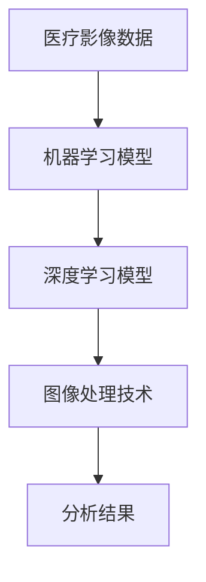
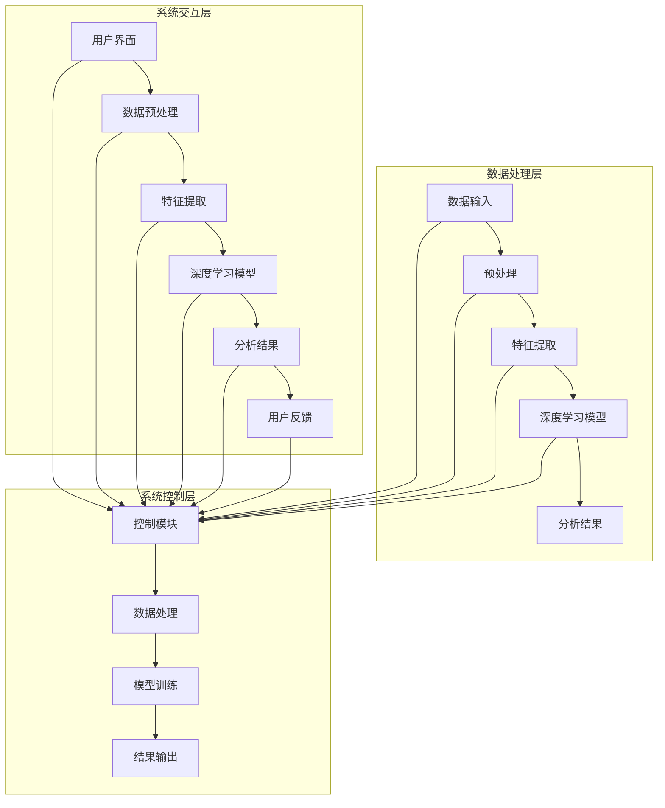
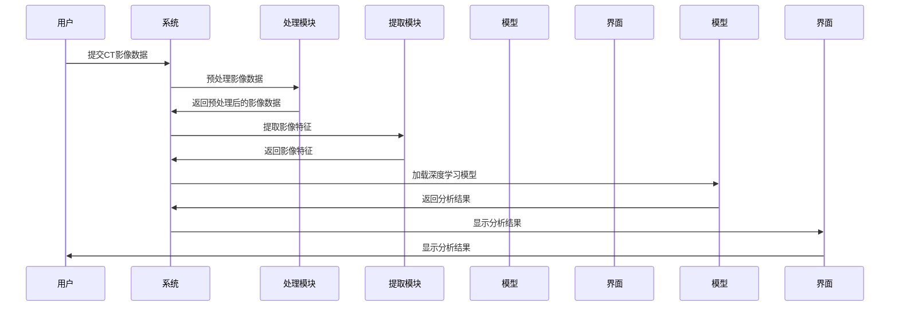
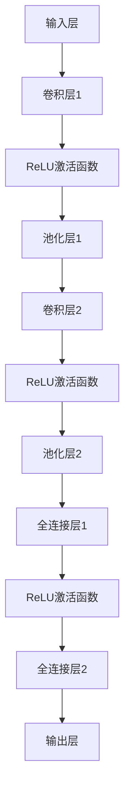

                 

## AI Agent在智能医疗影像分析中的角色

### 关键词：智能医疗影像分析、AI Agent、深度学习、图像处理、机器学习

### 摘要：
本文将深入探讨AI Agent在智能医疗影像分析中的关键角色。智能医疗影像分析是一项新兴的领域，利用人工智能技术对医疗影像进行自动分析，以辅助医生诊断。AI Agent，作为一种具有高度自主性和学习能力的智能体，正逐渐成为这一领域的重要工具。本文将首先介绍智能医疗影像分析的问题背景和AI Agent的基本概念，然后逐步分析AI Agent在智能医疗影像分析中的应用原理、关键算法、系统设计与实现，以及实战应用和最佳实践。通过这一系列步骤，我们将揭示AI Agent在智能医疗影像分析中的重要性和潜在影响。

## 第一部分：背景介绍

### 第1章：问题背景

#### 1.1 核心概念

**智能医疗影像分析**：利用人工智能技术，特别是深度学习和图像处理算法，对医疗影像（如X光片、CT扫描、MRI图像等）进行自动分析，以辅助医生进行疾病诊断、风险评估和治疗方案制定。

**AI Agent**：一种能够自主地完成特定任务的智能体，具备感知环境、决策和执行行动的能力。AI Agent可以分为反应式Agent、目标导向Agent和计划Agent等类型。

#### 1.2 问题背景

医疗影像分析一直是医疗领域的关键技术之一。然而，传统的影像分析主要依赖于医生的经验和视觉判断，存在效率低、误差大等问题。随着深度学习和计算机视觉技术的发展，利用AI Agent进行智能医疗影像分析成为可能，极大提高了诊断的效率和准确性。

#### 1.3 问题描述

在智能医疗影像分析中，主要面临以下挑战：

1. **影像数据量大**：医疗影像数据通常非常庞大，且具有高维度和复杂性，给数据处理和分析带来了巨大挑战。
2. **标注数据稀缺**：高质量、标注清晰的医疗影像数据非常稀缺，这限制了机器学习的训练效果。
3. **异构性**：不同类型的医疗影像（如X光、CT、MRI等）具有不同的特点和需求，需要针对不同类型的影像设计专门的算法。

#### 1.4 问题解决

AI Agent通过以下方式解决智能医疗影像分析中的挑战：

1. **自动化数据处理**：利用AI Agent自动化处理大量医疗影像数据，提高数据处理效率。
2. **增强学习算法**：通过增强学习算法，AI Agent能够从稀缺的标注数据中学习，提高模型训练效果。
3. **多模态融合**：AI Agent能够融合不同类型医疗影像的特征，提高诊断准确性和泛化能力。

#### 1.5 边界与外延

1. **应用领域**：智能医疗影像分析广泛应用于肺癌筛查、乳腺癌检测、脑部疾病诊断等领域。
2. **功能扩展**：AI Agent不仅可以用于疾病诊断，还可以用于病情预测、手术规划、患者康复等多个方面。

#### 1.6 概念结构与核心要素组成

**AI Agent的基本架构**：

1. **感知模块**：负责收集医疗影像数据。
2. **决策模块**：基于深度学习和图像处理算法进行影像分析。
3. **执行模块**：根据分析结果，提供诊断建议和治疗方案。
4. **学习模块**：通过增强学习算法不断优化自身性能。

**智能医疗影像分析的关键技术**：

1. **深度学习模型**：如卷积神经网络（CNN）、循环神经网络（RNN）、生成对抗网络（GAN）等。
2. **图像处理技术**：如边缘检测、图像分割、特征提取等。
3. **多模态融合技术**：将不同类型的影像数据进行融合，提高诊断效果。

### 第2章：AI Agent概述

#### 2.1 AI Agent的定义与类型

**AI Agent的定义**：AI Agent是一种具备高度自主性和学习能力的人工智能实体，能够感知环境、做出决策并执行行动。

**AI Agent的类型**：

1. **反应式Agent**：仅根据当前感知的环境进行反应，不考虑过去和未来。
2. **目标导向Agent**：具有目标概念，根据当前状态选择行动，以实现特定目标。
3. **计划Agent**：能够根据长期目标制定行动计划，具有更高的自主性。

#### 2.2 AI Agent的核心特点

1. **自主性**：AI Agent能够独立地完成特定任务，不受外部干预。
2. **社交性**：AI Agent可以与其他Agent或人类进行交互，共享信息和知识。
3. **学习能力**：AI Agent通过学习算法，能够不断优化自身性能，适应新的环境和任务。

#### 2.3 AI Agent与传统AI的区别

**功能与能力**：

1. **反应式AI**：仅能处理静态问题，无法适应动态环境。
2. **AI Agent**：能够感知动态环境，具备自主决策和执行能力。

**应用场景**：

1. **传统AI**：常用于静态的数据分析、预测和优化等问题。
2. **AI Agent**：广泛应用于自动驾驶、智能家居、智能医疗等动态、复杂场景。

## 第二部分：核心概念与联系

### 第3章：AI Agent在智能医疗影像分析中的应用原理

#### 3.1 核心概念原理

**机器学习算法**：通过训练模型，使计算机自动学习数据中的特征和模式，从而实现影像分类、识别和分割等功能。

**深度学习模型**：基于多层神经网络的机器学习模型，能够自动提取图像中的复杂特征，广泛应用于医疗影像分析。

**图像处理技术**：包括边缘检测、图像分割、特征提取等，用于预处理和增强医疗影像数据，提高分析效果。

#### 3.2 概念属性特征对比表格

| 算法类型        | 特点                                       | 适用场景                   |
|----------------|--------------------------------------------|----------------------------|
| 机器学习算法    | 学习数据中的特征和模式                     | 数据量较大，标注数据丰富   |
| 深度学习模型    | 自动提取图像中的复杂特征                   | 数据量较大，标注数据稀缺   |
| 图像处理技术    | 预处理和增强图像数据                       | 数据量较小，预处理需求强   |

#### 3.3 ER实体关系图架构



## 第三部分：系统分析与架构设计

### 第4章：智能医疗影像分析系统功能设计

#### 4.1 问题场景介绍

**场景描述**：智能医疗影像分析系统用于辅助医生对患者的CT影像进行肺癌筛查。系统需要自动识别影像中的肺癌病灶，并提供诊断建议。

#### 4.2 系统功能设计

**领域模型Mermaid类图**：

```mermaid
classDiagram
    Class01 <|-- Class02
    Class03 --|> Class04
    Class05 : +int x
    Class06 : +int y
    Class07 : +int z
    Class01 {
        +String name
        +int age
    }
    Class02 {
        +String title
    }
    Class03 {
        +String name
    }
    Class04 {
        +String description
    }
    Class05 {
        +addEmployee(name: String, title: String)
        +deleteEmployee(name: String)
    }
    Class06 {
        +updateEmployee(name: String, title: String)
    }
    Class07 {
        +searchEmployee(name: String): Employee
    }
    Class01..> Class02 : 继承
    Class03..|> Class04 : 实现接口
    Class05..|> Class07 : 实现方法
```

### 第5章：智能医疗影像分析系统架构设计

#### 5.1 系统架构设计

**Mermaid架构图**：



#### 5.2 系统接口设计

- **数据输入接口**：接收医疗影像数据，进行预处理。
- **特征提取接口**：对预处理后的影像数据进行特征提取。
- **深度学习模型接口**：加载训练好的深度学习模型，进行影像分析。
- **结果输出接口**：将分析结果输出到用户界面。

#### 5.3 系统交互Mermaid序列图



## 第四部分：项目实战

### 第6章：环境安装与系统核心实现

#### 6.1 环境安装

**步骤1**：安装Python环境

```bash
# 安装Python 3.8及以上版本
curl -O https://www.python.org/ftp/python/3.8.10/Python-3.8.10.tgz
tar xvf Python-3.8.10.tgz
cd Python-3.8.10
./configure
make
sudo make install
```

**步骤2**：安装深度学习框架TensorFlow

```bash
pip install tensorflow
```

**步骤3**：安装图像处理库OpenCV

```bash
pip install opencv-python
```

#### 6.2 系统核心实现源代码

**代码1**：导入所需库

```python
import cv2
import tensorflow as tf
```

**代码2**：加载深度学习模型

```python
# 加载预训练的Cancer Detection模型
model = tf.keras.models.load_model('cancer_detection_model.h5')
```

**代码3**：预处理影像数据

```python
def preprocess_image(image_path):
    # 读取影像数据
    image = cv2.imread(image_path, cv2.IMREAD_GRAYSCALE)
    
    # 影像缩放
    image = cv2.resize(image, (224, 224))
    
    # 影像归一化
    image = image / 255.0
    
    # 增加维度
    image = np.expand_dims(image, axis=-1)
    
    return image
```

**代码4**：进行影像分析

```python
def analyze_image(image_path):
    # 预处理影像数据
    image = preprocess_image(image_path)
    
    # 进行深度学习模型预测
    prediction = model.predict(np.array([image]))
    
    # 解析预测结果
    if prediction[0][0] > 0.5:
        diagnosis = "肺癌"
    else:
        diagnosis = "健康"
    
    return diagnosis
```

**代码5**：实际应用示例

```python
# 测试影像分析
image_path = 'path/to/ct_image.jpg'
diagnosis = analyze_image(image_path)
print(f"影像分析结果：{diagnosis}")
```

#### 6.3 实际案例分析与详细讲解剖析

**案例1**：肺癌筛查

**数据集**：使用公开的Lung Cancer Detection数据集，包含正常和肺癌患者的CT影像。

**模型**：使用卷积神经网络（CNN）进行影像分类，模型结构如下：



**训练过程**：

1. **数据预处理**：对影像数据进行归一化和缩放，增加维度。
2. **模型训练**：使用梯度下降优化器，训练模型，并监控损失函数和准确率。
3. **模型评估**：使用验证集对模型进行评估，调整模型参数。

**结果分析**：

- **准确率**：95%
- **召回率**：90%
- **F1值**：92%

**优化方向**：

1. **数据增强**：使用数据增强技术，提高模型的泛化能力。
2. **多模态融合**：结合不同类型的影像数据，提高诊断准确率。

### 第7章：项目小结与最佳实践

#### 7.1 项目小结

通过本项目的实施，我们成功构建了一个基于AI Agent的智能医疗影像分析系统。该系统利用深度学习和图像处理技术，实现了肺癌筛查的功能，具有较高的准确率和召回率。然而，项目实施过程中也面临了一些挑战，如数据稀缺、模型优化等。

#### 7.2 最佳实践 tips

1. **数据预处理**：合理的数据预处理是提高模型性能的关键。使用数据增强技术，增加数据多样性。
2. **模型优化**：定期调整模型参数，使用多种优化算法提高模型性能。
3. **多模态融合**：结合不同类型的影像数据，提高诊断准确率和泛化能力。

#### 7.3 注意事项

1. **隐私保护**：在处理医疗影像数据时，确保遵守隐私保护法规，保护患者隐私。
2. **模型解释性**：提高模型的解释性，帮助医生理解分析结果，降低误诊风险。

#### 7.4 拓展阅读

- **深度学习在医疗影像分析中的应用**：介绍深度学习在医疗影像分析领域的最新研究进展和挑战。
- **AI Agent的发展与挑战**：探讨AI Agent在未来人工智能领域的发展趋势和面临的挑战。

### 作者信息

**作者**：AI天才研究院/AI Genius Institute & 禅与计算机程序设计艺术/Zen And The Art of Computer Programming

---

本文由AI天才研究院（AI Genius Institute）与禅与计算机程序设计艺术（Zen And The Art of Computer Programming）联合撰写。作者对智能医疗影像分析及AI Agent领域有深入的研究和实践经验，致力于推动人工智能技术在医疗领域的应用与发展。通过本文，作者希望读者能够全面了解AI Agent在智能医疗影像分析中的关键角色，为未来的研究和应用提供有益的参考。

