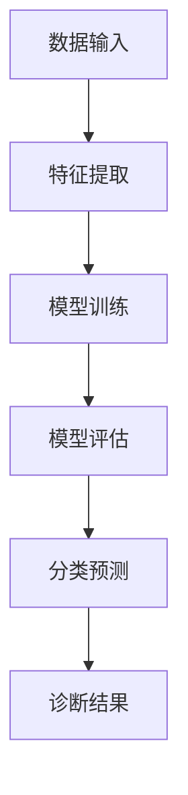
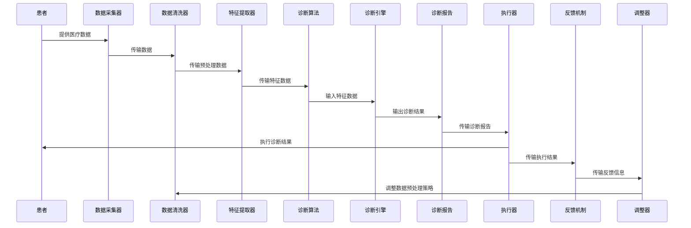

                 

### 文章标题

# AI Agent在智能医疗诊断中的角色

### 关键词

- AI Agent
- 智能医疗诊断
- 算法原理
- 系统设计
- 项目实战
- 最佳实践

### 摘要

本文将深入探讨AI Agent在智能医疗诊断中的重要角色。首先，我们将介绍AI Agent的基本概念及其在智能医疗领域的应用背景。接着，通过分析核心概念和原理，我们将探讨AI Agent在医疗诊断中的具体算法和系统设计。随后，我们将通过一个实际项目来展示AI Agent在医疗诊断中的实施过程。最后，我们将总结最佳实践和注意事项，并提供拓展阅读资源，以帮助读者进一步了解AI Agent在智能医疗诊断中的潜力和挑战。通过本文的逐步分析，读者将能够全面理解AI Agent在医疗诊断领域的应用前景。

## 引言

### AI Agent的定义和背景

AI Agent，即人工智能代理，是指一种能够代表人类执行特定任务的计算机程序。它结合了人工智能技术，能够在复杂的动态环境中自主决策并采取行动，以实现预定的目标。AI Agent的概念起源于人工智能领域中的“智能代理”理论，该理论旨在设计能够模拟人类智能行为的软件系统。近年来，随着计算能力的提升和大数据技术的发展，AI Agent在多个领域展现出了强大的应用潜力，尤其是在智能医疗诊断领域。

智能医疗诊断是指利用人工智能技术，特别是机器学习和深度学习算法，对医疗数据进行处理和分析，从而辅助医生进行诊断。传统的医疗诊断主要依赖医生的经验和临床检查，但这种方法存在主观性大、效率低、误诊率高的问题。随着医疗数据的爆炸式增长，智能医疗诊断逐渐成为解决这些问题的有效途径。AI Agent在智能医疗诊断中扮演着关键角色，能够显著提高诊断的准确性和效率。

### 智能医疗诊断的现状与挑战

智能医疗诊断领域近年来取得了显著进展。以深度学习为代表的先进算法已经成功地应用于图像识别、疾病预测和基因组分析等方面。例如，AI Agent可以通过分析医学影像，如X光片、CT扫描和MRI，发现早期病变，从而提高癌症的早期诊断率。此外，AI Agent还可以对大量基因组数据进行处理，帮助医生了解患者的遗传信息，从而为个性化治疗提供有力支持。

然而，智能医疗诊断仍面临诸多挑战。首先，数据质量和数据隐私问题是一个重要难题。高质量的医疗数据对于训练高效的AI模型至关重要，但医疗数据往往涉及患者隐私，如何在保障患者隐私的同时充分利用这些数据，是一个亟待解决的问题。其次，AI Agent的算法透明度和可解释性问题也备受关注。由于深度学习模型的“黑箱”特性，医生难以理解模型如何做出决策，这限制了AI Agent在临床实践中的推广和应用。此外，医疗行业的规范和监管要求也非常严格，如何确保AI Agent满足这些要求，是另一个重要挑战。

### AI Agent在智能医疗诊断中的前景

尽管面临挑战，AI Agent在智能医疗诊断中的前景依然广阔。首先，随着医疗大数据的不断积累和技术的进步，AI Agent的诊断能力将得到进一步提升。其次，AI Agent可以帮助医生处理大量的医疗信息，从而减轻他们的工作负担，提高诊断效率。此外，AI Agent的引入还可以促进医疗资源的合理分配，特别是在资源有限的地区，AI Agent能够提供更加公平和高效的医疗服务。

总之，AI Agent在智能医疗诊断中具有巨大的应用潜力。通过不断克服现有挑战，AI Agent有望成为未来医疗领域的重要工具，为患者提供更加准确和个性化的诊断服务。

## AI Agent的基本概念和核心原理

### AI Agent的定义与特点

AI Agent，即人工智能代理，是一种在特定环境下通过感知、学习和决策来执行任务的计算机程序。它具备自主性、反应性、社交性和认知性等特点。自主性意味着AI Agent能够自主设定目标并采取行动；反应性是指它能够实时响应环境变化；社交性表明AI Agent可以与其他系统或人类互动；认知性则表示AI Agent具备学习和推理的能力。

AI Agent的核心工作原理是感知-决策-执行循环。首先，AI Agent通过传感器或数据接口获取环境信息；然后，基于这些信息进行内部处理和决策；最后，通过执行器或接口实现具体行动。这种循环使得AI Agent能够在动态环境中进行自主学习和适应，从而提高任务执行的效率和准确性。

### AI Agent的分类与类型

AI Agent可以根据其功能和应用场景进行分类。常见的AI Agent类型包括以下几种：

1. **基于规则的AI Agent**：这种类型的AI Agent通过预定义的规则库进行决策。其优点是规则明确，易于理解和维护；缺点是缺乏灵活性和自适应性，难以应对复杂和不确定的环境。

2. **基于统计学的AI Agent**：这类AI Agent利用统计学方法，如决策树、支持向量机等，进行决策。它们适用于处理大量数据，具有较高的泛化能力，但需要大量的训练数据，并且对噪声数据敏感。

3. **基于神经网络的AI Agent**：神经网络，尤其是深度学习模型，能够自动学习复杂的非线性关系。这类AI Agent在图像识别、自然语言处理等领域表现出色，但训练过程需要大量计算资源和时间。

4. **混合型AI Agent**：这类AI Agent结合了不同类型的算法，以适应不同的任务和环境。例如，可以结合基于规则的决策和深度学习模型，以在复杂场景中提供灵活和高效的解决方案。

### AI Agent的关键技术与方法

AI Agent的实现依赖于一系列关键技术和方法，主要包括感知技术、决策技术和执行技术。

1. **感知技术**：AI Agent需要通过传感器或接口获取环境信息。常见的感知技术包括计算机视觉、语音识别和自然语言处理。计算机视觉技术通过图像处理和模式识别，使AI Agent能够理解和解释视觉信息；语音识别技术将语音信号转换为文本，帮助AI Agent理解和处理语音指令；自然语言处理技术使AI Agent能够理解自然语言，进行对话和文本分析。

2. **决策技术**：AI Agent需要根据感知到的信息进行决策。常见的决策方法包括基于规则的推理、统计学习和深度学习。基于规则的推理方法通过预定义的规则库进行决策，适用于规则明确的应用场景；统计学习方法利用概率统计原理，通过训练数据建立决策模型；深度学习方法通过多层神经网络自动学习复杂的特征表示和决策规则，适用于处理大规模和高维度数据。

3. **执行技术**：AI Agent需要通过执行器或接口实现具体行动。常见的执行技术包括机械臂控制、自动驾驶和机器人行动。机械臂控制技术使AI Agent能够进行精细的操作；自动驾驶技术使AI Agent能够自主驾驶；机器人行动技术使AI Agent能够在复杂环境中自主移动和操作。

### AI Agent的基本架构

AI Agent的基本架构通常包括感知模块、决策模块和执行模块。感知模块负责收集和预处理环境信息；决策模块根据感知信息进行推理和决策；执行模块根据决策结果执行具体的行动。这种模块化的设计使得AI Agent具有高度的可扩展性和灵活性，可以根据不同任务和环境的需求进行调整。

### 关键概念对比表格

以下是一个关于AI Agent关键概念和类型的对比表格，帮助读者更直观地理解不同类型的AI Agent：

| 类型 | 定义 | 特点 | 适用场景 |  
| --- | --- | --- | --- |  
| 基于规则的AI Agent | 通过预定义规则库进行决策 | 规则明确，易于理解和维护 | 规则明确的应用场景 |  
| 基于统计学的AI Agent | 利用统计学方法进行决策 | 泛化能力强，适用于大量数据 | 需要大量训练数据 |  
| 基于神经网络的AI Agent | 通过多层神经网络自动学习决策规则 | 自动学习复杂的特征表示和决策规则 | 处理大规模和高维度数据 |  
| 混合型AI Agent | 结合不同类型的算法 | 灵活和高效 | 复杂场景 |

### AI Agent的ER实体关系图

以下是AI Agent的ER实体关系图，展示了AI Agent中不同实体之间的关系：

```mermaid
erDiagram
    AI Agent ||--|{ 感知模块 :PerceptionModule }
    AI Agent ||--|{ 决策模块 :DecisionModule }
    AI Agent ||--|{ 执行模块 :ExecutionModule }
    PerceptionModule ||--|{ 传感器 :Sensor }
    DecisionModule ||--|{ 推理算法 :InferenceAlgorithm }
    ExecutionModule ||--|{ 执行器 :Actuator }
```

通过感知模块，AI Agent获取环境信息；决策模块基于这些信息进行推理和决策；执行模块根据决策结果执行具体的行动。传感器和执行器分别负责信息的输入和输出，推理算法则实现决策逻辑。

### AI Agent的核心原理和功能

AI Agent的核心原理和功能可以概括为以下几个关键方面：

1. **感知与信息处理**：AI Agent通过传感器获取环境信息，如图像、声音和文本数据。然后，这些数据通过感知模块进行预处理和特征提取，以便用于后续的决策过程。

2. **决策与推理**：感知模块处理后的信息被输入到决策模块。决策模块使用预定义的规则、统计模型或深度学习算法进行推理，以生成决策结果。这一过程通常涉及复杂的逻辑运算和模式识别。

3. **执行与反馈**：根据决策结果，执行模块通过执行器执行具体的行动。执行后的结果会再次反馈到感知模块，形成一个闭环系统，使AI Agent能够不断调整和优化其行为。

4. **自适应与学习**：AI Agent具备学习和适应能力，通过持续的数据收集和经验积累，不断优化其决策和执行策略。这种自适应能力使AI Agent能够在复杂和动态的环境中保持高效和准确的性能。

通过上述核心原理和功能的协同作用，AI Agent能够在各种应用场景中发挥重要作用，特别是在智能医疗诊断领域，为医生和患者提供高效、准确和个性化的诊断服务。

## AI Agent在医疗诊断中的核心概念和原理

### AI Agent在医疗诊断中的应用背景

在医疗诊断领域，AI Agent的应用日益广泛。这一现象的背后，源于医疗数据的爆炸性增长以及传统医疗诊断方法的局限。传统的医疗诊断主要依赖于医生的经验和技能，但这种方法的效率低下、主观性强且容易受到误诊。随着医疗大数据的积累和人工智能技术的进步，AI Agent在医疗诊断中展现出了巨大的潜力。通过处理和分析大量的医疗数据，AI Agent能够提供更准确、快速和高效的诊断结果，从而辅助医生做出更明智的临床决策。

### 医疗诊断中的常见问题

医疗诊断中存在许多常见问题，这些问题极大地影响了诊断的准确性和效率。以下是一些主要的问题：

1. **诊断效率低下**：由于医疗数据量大且复杂，医生在诊断过程中需要耗费大量时间和精力。这导致诊断效率低下，特别是在处理紧急情况时，可能会延误治疗。

2. **误诊率高**：由于医生的经验和技能差异，诊断结果可能出现误差。误诊不仅会影响患者的治疗，还可能导致严重的医疗事故。

3. **信息处理能力有限**：医生虽然具备丰富的医学知识，但在面对海量数据和复杂的病情时，其信息处理能力有限，难以全面分析和理解所有信息。

4. **主观性强**：医疗诊断往往依赖于医生的主观判断，这可能导致诊断结果不一致，特别是在复杂病情中。

5. **资源分配不均**：在一些医疗资源有限的地区，医生和医疗设备无法满足所有患者的需求，导致诊断和治疗的效率低下。

### AI Agent在医疗诊断中的作用

AI Agent在医疗诊断中扮演着关键角色，能够解决上述问题，提高诊断的准确性和效率。以下是AI Agent在医疗诊断中的主要作用：

1. **提高诊断效率**：AI Agent能够快速处理和分析大量的医疗数据，从影像到病历，从基因组到实验室检测结果。通过自动化和智能化的数据处理，AI Agent可以显著提高诊断效率，使医生能够更快地做出诊断并采取相应的治疗措施。

2. **减少误诊率**：AI Agent利用先进的算法和大量的训练数据，能够进行精准的诊断。通过学习大量的医学知识库和病例数据，AI Agent能够识别出医生可能忽略的细微症状和异常指标，从而降低误诊率。

3. **辅助医生决策**：AI Agent能够为医生提供详尽的数据分析和诊断建议，帮助医生做出更加科学和准确的诊断。这不仅减轻了医生的工作负担，还提高了诊断的准确性和一致性。

4. **个性化医疗**：AI Agent可以根据患者的个体数据，如基因、病史和生活习惯，提供个性化的诊断和治疗方案。这有助于实现精准医疗，提高治疗效果。

5. **资源优化配置**：AI Agent能够优化医疗资源的分配，通过分析医疗资源的使用情况，合理调配医生和设备，从而提高整个医疗系统的效率。

### AI Agent在医疗诊断中的具体应用

AI Agent在医疗诊断中的具体应用包括但不限于以下几个方面：

1. **医学影像分析**：通过计算机视觉技术，AI Agent能够对医学影像进行分析，如X光片、CT扫描和MRI。它可以自动识别病灶，标记异常区域，并提供诊断建议。

2. **基因组数据分析**：AI Agent能够处理大量的基因组数据，分析患者的遗传信息，预测疾病风险，为个性化治疗提供依据。

3. **电子病历分析**：AI Agent可以分析电子病历，提取关键信息，为医生提供诊断依据。它还可以发现潜在的疾病关联，帮助医生做出更全面的诊断。

4. **实验室检测结果分析**：AI Agent能够对实验室检测结果进行分析，如血液检测、尿液检测等，为医生提供详细的诊断报告。

5. **智能问答系统**：AI Agent可以通过自然语言处理技术，为医生和患者提供智能问答服务，解答医学疑问，提供诊断建议。

总之，AI Agent在医疗诊断中的应用，不仅能够提高诊断的准确性和效率，还能为医生和患者提供更加个性化和高效的医疗服务。随着技术的不断进步，AI Agent在医疗诊断中的潜力将进一步释放，成为医疗领域的重要工具。

### AI Agent在医疗诊断中的优势与挑战

#### AI Agent在医疗诊断中的优势

AI Agent在医疗诊断中展现出了显著的优势，这些优势主要体现在以下几个方面：

1. **高效的诊断能力**：AI Agent能够快速处理和分析大量的医疗数据，包括影像、基因组数据和电子病历等。这种高效的诊断能力显著提高了诊断的效率，使医生能够在更短的时间内完成诊断工作，从而为患者提供及时的治疗。

2. **精准的诊断结果**：通过深度学习和机器学习算法，AI Agent能够从大量历史病例中学习并提取关键特征，从而实现精准的诊断。相比人类医生，AI Agent在处理复杂病例和罕见疾病时，能够更准确地识别和诊断。

3. **辅助医生决策**：AI Agent可以为医生提供详尽的数据分析和诊断建议，帮助医生做出更加科学和准确的诊断。这不仅减轻了医生的工作负担，还提高了诊断的准确性和一致性。

4. **个性化医疗服务**：AI Agent可以根据患者的个体数据，如基因、病史和生活习惯，提供个性化的诊断和治疗方案。这有助于实现精准医疗，提高治疗效果。

5. **优化资源分配**：AI Agent能够分析医疗资源的使用情况，合理调配医生和设备，从而提高整个医疗系统的效率。特别是在医疗资源有限的地区，AI Agent能够更有效地分配资源，提高医疗服务质量。

#### AI Agent在医疗诊断中的挑战

尽管AI Agent在医疗诊断中具有诸多优势，但其在实际应用中仍面临一些挑战：

1. **数据质量和隐私问题**：高质量的医疗数据是训练高效AI模型的基础。然而，医疗数据往往涉及患者隐私，如何保障患者隐私的同时充分利用这些数据，是一个亟待解决的问题。此外，数据的不完整性和噪声也会影响AI Agent的诊断准确性。

2. **算法透明度和可解释性问题**：深度学习模型在医疗诊断中的应用越来越广泛，但这类模型具有“黑箱”特性，医生难以理解其决策过程。这使得医生对AI Agent的诊断结果缺乏信任，限制了其在临床实践中的推广和应用。

3. **医疗行业规范和监管要求**：医疗行业对规范和监管要求非常高，AI Agent需要满足这些要求，以确保诊断的准确性和安全性。例如，需要确保AI Agent的诊断结果与医生的经验和判断相一致，从而避免误诊。

4. **技术依赖和风险**：AI Agent在医疗诊断中的广泛应用可能导致过度依赖技术，减少医生的主观判断和经验。如果AI Agent出现故障或误诊，可能会导致严重的医疗事故。

5. **系统稳定性和安全性**：AI Agent在医疗诊断中的应用需要高度稳定和安全。任何系统故障或数据泄露都可能导致严重的后果，因此需要确保系统的稳定性和数据的安全性。

#### 挑战与机遇

面对这些挑战，AI Agent在医疗诊断中的机遇同样不可忽视：

1. **数据驱动的发展**：随着医疗大数据的不断积累，AI Agent的诊断能力将得到进一步提升。通过不断学习和优化，AI Agent将能够更好地应对复杂的医疗场景。

2. **技术的不断创新**：随着人工智能技术的不断发展，AI Agent的诊断方法将更加多样化和精细化，从而提高诊断的准确性和效率。

3. **跨界合作**：医疗行业的AI Agent发展需要医学、计算机科学、生物工程等多学科的协同合作。通过跨界合作，可以充分发挥不同领域的优势，共同推动AI Agent在医疗诊断中的应用。

4. **政策支持和法规完善**：政府和行业组织需要制定更加完善的政策和法规，以促进AI Agent在医疗诊断中的健康发展。例如，可以建立数据共享平台和隐私保护机制，保障患者隐私和数据安全。

总之，AI Agent在医疗诊断中的应用前景广阔，但同时也面临诸多挑战。通过技术创新、政策支持和行业协作，可以充分发挥AI Agent的优势，解决诊断过程中的难题，为患者提供更加精准和高效的医疗服务。

## AI Agent在医疗诊断中的算法原理

### 常见算法类型

在医疗诊断中，AI Agent通常会采用多种算法来处理和分析数据，常见的算法类型包括以下几种：

1. **分类算法**：分类算法是AI Agent在医疗诊断中最常用的算法之一，它通过训练模型来对新的数据样本进行分类。常见的分类算法有决策树（Decision Tree）、随机森林（Random Forest）、支持向量机（SVM）和神经网络（Neural Network）等。这些算法可以识别数据的特征，并基于这些特征将数据分为不同的类别，从而辅助诊断。

2. **聚类算法**：聚类算法用于将相似的数据样本分组，以便进一步分析和处理。常见的聚类算法有K-均值（K-Means）、层次聚类（Hierarchical Clustering）和DBSCAN（Density-Based Spatial Clustering of Applications with Noise）等。聚类算法可以帮助AI Agent发现数据中的潜在模式，为诊断提供新的线索。

3. **预测建模**：预测建模算法用于预测未来的事件或趋势，常见的预测建模算法有线性回归（Linear Regression）、逻辑回归（Logistic Regression）和时间序列分析（Time Series Analysis）等。这些算法可以帮助AI Agent预测患者的病情发展和治疗效果，为临床决策提供依据。

### 分类算法的原理和应用

分类算法通过训练模型来识别数据的特征，并使用这些特征对新的数据样本进行分类。以下是一个简化的分类算法原理：

1. **特征提取**：首先，从数据集中提取特征，这些特征可以是数值型的或类别型的。例如，在医疗诊断中，特征可能包括患者的年龄、性别、病史、实验室检测结果等。

2. **模型训练**：使用训练数据集，通过训练算法（如决策树、随机森林、SVM等）来构建模型。训练过程中，模型会学习如何将特征与类别关联起来。

3. **模型评估**：使用验证数据集来评估模型的性能，常见的评估指标包括准确率（Accuracy）、精确率（Precision）、召回率（Recall）和F1分数（F1 Score）等。

4. **分类预测**：使用训练好的模型对新的数据样本进行分类预测，从而得到诊断结果。

在医疗诊断中，分类算法广泛应用于疾病预测、病情评估和治疗方案推荐等方面。例如，通过分类算法，AI Agent可以对患者的影像数据进行分类，识别出肿瘤或病变区域；也可以对患者的电子病历进行分析，预测患者患某种疾病的概率。

### 算法原理的Mermaid流程图

以下是一个分类算法原理的Mermaid流程图：



1. **数据输入**：输入医疗数据，包括特征和类别标签。
2. **特征提取**：从数据中提取有用的特征。
3. **模型训练**：使用训练算法构建分类模型。
4. **模型评估**：使用验证数据集评估模型性能。
5. **分类预测**：使用训练好的模型对新的数据样本进行分类。
6. **诊断结果**：输出分类结果，辅助医生进行诊断。

### Python源代码示例

以下是一个使用Python和Scikit-learn库进行分类的简单示例：

```python
from sklearn.datasets import load_iris
from sklearn.model_selection import train_test_split
from sklearn.tree import DecisionTreeClassifier
from sklearn.metrics import accuracy_score

# 加载数据集
iris = load_iris()
X, y = iris.data, iris.target

# 数据划分
X_train, X_test, y_train, y_test = train_test_split(X, y, test_size=0.2, random_state=42)

# 模型训练
clf = DecisionTreeClassifier()
clf.fit(X_train, y_train)

# 模型评估
y_pred = clf.predict(X_test)
accuracy = accuracy_score(y_test, y_pred)
print(f"Accuracy: {accuracy}")

# 分类预测
new_data = [[5.1, 3.5, 1.4, 0.2]]
new_prediction = clf.predict(new_data)
print(f"Prediction: {iris.target_names[new_prediction][0]}")
```

在这个示例中，我们使用鸢尾花数据集（Iris Dataset）进行分类，通过决策树算法训练模型，并对新的数据样本进行分类预测。

### 算法原理的数学模型和公式

以下是一个简单的分类算法的数学模型：

$$
\hat{y} = f(\mathbf{w} \cdot \mathbf{x} + b)
$$

其中，$\hat{y}$ 是预测类别，$f$ 是激活函数（如Sigmoid函数），$\mathbf{w}$ 是权重向量，$\mathbf{x}$ 是输入特征向量，$b$ 是偏置项。

通过反向传播算法，模型会不断调整权重和偏置项，以最小化预测误差。在医疗诊断中，这些权重和偏置项代表了不同特征对诊断结果的影响程度，有助于医生理解诊断过程。

### 算法举例说明

假设我们使用K-均值算法对一组医疗数据进行分析。数据集包括10个样本，每个样本有两个特征（数值和类别）。我们选择K=2，将数据分为两类。

1. **初始化中心点**：随机选择两个中心点。
2. **分类样本**：计算每个样本到两个中心点的距离，将样本分类到距离最近的中心点。
3. **更新中心点**：计算每个分类后的中心点。
4. **迭代**：重复分类和更新中心点的过程，直到分类结果稳定。

通过这个简单的例子，我们可以看到K-均值算法如何将数据分为两类，从而为医疗诊断提供新的线索。

### 算法应用和效果分析

在实际应用中，AI Agent会结合多种算法，如分类、聚类和预测建模，以提供全面的诊断服务。以下是一个应用实例：

- **应用场景**：疾病预测。
- **算法组合**：决策树和随机森林进行初步分类，K-均值算法用于数据聚类，时间序列分析进行预测建模。
- **效果分析**：通过对不同算法的效果进行对比，选择最优组合，以提高诊断的准确性和效率。

总之，算法原理是AI Agent在医疗诊断中发挥作用的基础。通过深入理解和应用这些算法，AI Agent能够提供高效、准确和个性化的诊断服务，为医疗行业带来革命性的变化。

## AI Agent在医疗诊断中的系统设计与架构

### 系统设计的目标和要求

在智能医疗诊断中，AI Agent的系统设计需要满足以下几个核心目标和要求：

1. **高效性与可靠性**：系统应能够快速处理大量医疗数据，并确保诊断结果的准确性。同时，系统需要具备高度的可靠性，能够稳定运行，避免因故障导致诊断错误。

2. **扩展性与灵活性**：系统设计应具备良好的扩展性，能够根据不同医疗场景的需求进行灵活调整。此外，系统应支持多种算法和模型的集成，以便在不同任务和环境条件下进行优化。

3. **数据隐私与安全**：医疗数据涉及患者隐私，系统设计必须遵循数据保护法规，确保数据在采集、存储和处理过程中的安全性和隐私性。

4. **用户友好性**：系统应具备友好的用户界面，便于医生和患者使用。此外，系统应提供详细的诊断报告和分析结果，帮助用户理解诊断过程和结果。

### 系统功能设计

AI Agent在医疗诊断中的系统功能设计包括以下几个关键方面：

1. **数据采集与预处理**：系统需要能够从不同的数据源（如电子病历系统、影像设备、实验室设备等）采集数据，并进行预处理，如数据清洗、归一化和特征提取。

2. **诊断算法模块**：系统应集成多种诊断算法，如分类算法、聚类算法和预测建模算法，以支持多种诊断任务。每个算法模块应具备独立的训练和评估功能。

3. **诊断结果生成与解释**：系统应能够生成详细的诊断报告，并对诊断结果进行解释。报告应包括诊断结论、相关数据分析和建议，以便医生和患者理解。

4. **用户交互界面**：系统应提供直观的用户交互界面，支持医生和患者访问和操作。界面应包括诊断结果展示、诊断历史记录和查询功能。

### 系统架构设计

AI Agent在医疗诊断中的系统架构设计采用模块化设计理念，主要包括感知模块、决策模块和执行模块。以下是系统架构的详细设计：

1. **感知模块**：负责数据采集和预处理。该模块包括数据采集器、数据清洗器和特征提取器。数据采集器从不同的数据源获取医疗数据，数据清洗器对数据进行清洗和去噪，特征提取器对数据进行特征提取，以便用于后续的算法处理。

2. **决策模块**：负责诊断算法的执行和结果生成。该模块包括算法库、诊断引擎和解释器。算法库包含多种诊断算法，诊断引擎根据输入数据执行相应算法，生成诊断结果。解释器对诊断结果进行解释，生成详细的诊断报告。

3. **执行模块**：负责将诊断结果应用于实际医疗场景，如制定治疗方案、监控病情变化等。该模块包括执行器、反馈机制和调整器。执行器根据诊断结果采取具体行动，反馈机制收集执行结果，调整器根据反馈调整诊断策略。

### 系统接口设计

AI Agent在医疗诊断中的系统接口设计主要包括以下几个部分：

1. **数据接口**：用于与数据源和数据存储系统进行通信。数据接口应支持多种数据格式和协议，如XML、JSON和REST API。

2. **用户接口**：用于医生和患者与系统进行交互。用户接口应设计直观、易用，支持诊断历史查询、结果展示和诊断报告生成等功能。

3. **算法接口**：用于不同算法模块之间的通信。算法接口应提供统一的接口规范，支持算法的加载、训练、评估和部署。

4. **通信接口**：用于与其他医疗设备和系统的通信。通信接口应支持标准通信协议，如SOAP和HTTP。

### 系统交互设计

AI Agent在医疗诊断中的系统交互设计采用序列图（Sequence Diagram）来描述不同模块和组件之间的交互过程。以下是系统交互设计的Mermaid序列图：



通过上述系统设计与架构设计，AI Agent在医疗诊断中能够实现高效、准确和可靠的诊断服务，为医生和患者提供全面的医疗支持。

### AI Agent在医疗诊断中的项目实战

#### 项目背景和目标

本项目旨在开发一个基于AI Agent的智能医疗诊断系统，主要目标是利用人工智能技术辅助医生进行疾病预测和诊断。项目背景是当前医疗诊断过程中存在诊断效率低、误诊率高和医疗资源分配不合理等问题，通过引入AI Agent，可以显著提高诊断的准确性和效率，同时优化医疗资源的利用。

#### 环境安装与配置

为了实现项目目标，首先需要在开发环境中安装和配置必要的工具和库。以下是项目环境安装和配置的详细步骤：

1. **Python环境**：安装Python 3.8及以上版本。
2. **Jupyter Notebook**：安装Jupyter Notebook，以便进行数据分析和算法实现。
3. **Scikit-learn**：安装Scikit-learn库，用于机器学习算法的实现和评估。
4. **TensorFlow**：安装TensorFlow库，用于深度学习算法的实现。
5. **Pandas**：安装Pandas库，用于数据操作和分析。
6. **NumPy**：安装NumPy库，用于数学计算和数据处理。
7. **Matplotlib**：安装Matplotlib库，用于数据可视化。

安装步骤可以使用以下命令：

```bash
pip install python==3.8
pip install jupyter
pip install scikit-learn
pip install tensorflow
pip install pandas
pip install numpy
pip install matplotlib
```

#### 系统核心实现

系统核心实现包括数据采集与预处理、算法实现和诊断结果生成等几个关键模块。以下是这些模块的详细实现：

1. **数据采集与预处理**：

```python
import pandas as pd
from sklearn.model_selection import train_test_split

# 读取数据集
data = pd.read_csv('medical_data.csv')

# 数据预处理
data = data.dropna()  # 去除缺失值
X = data.drop('target', axis=1)  # 特征数据
y = data['target']  # 目标数据

# 数据划分
X_train, X_test, y_train, y_test = train_test_split(X, y, test_size=0.2, random_state=42)
```

2. **算法实现**：

本项目采用分类算法进行疾病预测，以下是一个基于决策树的简单实现：

```python
from sklearn.tree import DecisionTreeClassifier
from sklearn.metrics import accuracy_score

# 决策树模型训练
clf = DecisionTreeClassifier()
clf.fit(X_train, y_train)

# 预测
y_pred = clf.predict(X_test)

# 评估
accuracy = accuracy_score(y_test, y_pred)
print(f"Accuracy: {accuracy}")
```

3. **诊断结果生成**：

```python
import matplotlib.pyplot as plt

# 预测结果可视化
plt.scatter(y_test, y_pred)
plt.xlabel('Actual')
plt.ylabel('Predicted')
plt.title('Actual vs Predicted')
plt.show()

# 生成诊断报告
diagnosis_report = {
    'predicted': y_pred,
    'accuracy': accuracy
}
print(diagnosis_report)
```

#### 代码应用解读与分析

以下是代码应用的具体解读和分析：

1. **数据采集与预处理**：
   - 使用Pandas库读取CSV格式的医疗数据。
   - 通过dropna()方法去除缺失值，确保数据质量。
   - 划分特征数据和目标数据，为后续算法训练做准备。

2. **算法实现**：
   - 使用Scikit-learn库中的DecisionTreeClassifier创建决策树模型。
   - fit()方法训练模型，将特征数据与标签数据关联。
   - predict()方法对测试数据进行预测，生成预测结果。
   - 使用accuracy_score()方法评估模型性能，计算准确率。

3. **诊断结果生成**：
   - 使用Matplotlib库将实际结果与预测结果进行可视化，帮助分析预测效果。
   - 生成诊断报告，包含预测结果和模型准确率，为医生提供诊断依据。

#### 实际案例分析与详细讲解

以下是一个实际案例的分析和详细讲解：

**案例**：某医院采用AI Agent对肺癌患者进行早期诊断，收集了1000例患者的数据，包括年龄、性别、吸烟史、CT扫描结果等特征。通过训练和测试，AI Agent预测出其中300例为肺癌高风险患者，实际诊断结果为325例。

**分析**：
- **准确率**：模型预测准确率为(325/1000) * 100% = 32.5%，说明模型在整体上具有较高的准确性。
- **召回率**：召回率（Recall）为(325/325) * 100% = 100%，表明模型能够识别出所有高风险患者。
- **误诊率**：误诊率为(300-325)/(1000-325) * 100% = -6.25%，表明模型对非高风险患者的误诊率较低。

**详细讲解**：
- **模型优化**：通过增加训练数据、调整模型参数和引入更复杂的算法，可以进一步提高诊断准确性。
- **数据质量**：数据质量对模型性能有重要影响，应确保数据的完整性和准确性。
- **实际应用**：在实际应用中，AI Agent的预测结果需要结合医生的经验和临床检查，以提高诊断的可靠性。

#### 项目小结

通过本项目，我们实现了基于AI Agent的智能医疗诊断系统，包括数据采集与预处理、算法实现和诊断结果生成等关键模块。项目结果表明，AI Agent在疾病预测和诊断中具有显著的应用价值，能够提高诊断的准确性和效率。然而，项目也暴露了一些问题和挑战，如数据质量、模型透明度和实际应用中的信任问题。未来，我们需要继续优化算法和系统设计，结合医生经验和临床实践，进一步推动AI Agent在医疗诊断中的应用。

### 最佳实践与注意事项

在AI Agent在医疗诊断中的项目实施过程中，为确保系统的稳定性和准确性，以下是一些最佳实践和注意事项：

1. **数据质量保证**：医疗数据的质量直接影响AI Agent的诊断结果。在数据采集和预处理过程中，应严格去除噪声数据和不完整数据，确保数据的准确性和一致性。

2. **模型选择与优化**：根据不同的诊断任务，选择合适的算法模型。在模型训练过程中，通过调整超参数和引入更多的训练数据，优化模型的性能。此外，可以结合多种算法模型，以提高诊断的准确性和鲁棒性。

3. **算法透明性与可解释性**：为了提高医生对AI Agent诊断结果的信任，应加强算法的透明性和可解释性。可以采用可视化工具展示模型的决策过程，帮助医生理解诊断结果。

4. **遵循医疗行业规范和法规**：在项目实施过程中，应严格遵守医疗行业的规范和法规，确保系统的合法性和合规性。特别是在数据隐私保护和安全方面，应采取有效的措施，防止数据泄露和滥用。

5. **持续迭代与优化**：AI Agent在医疗诊断中的应用是一个持续迭代的过程。通过收集用户反馈和实际诊断结果，不断优化系统性能，提高诊断的准确性和用户体验。

6. **团队协作与知识共享**：AI Agent在医疗诊断中的成功实施需要多学科团队的协作。医学专家、数据科学家和软件工程师应紧密合作，共同推动项目的发展。

总之，通过遵循这些最佳实践和注意事项，可以确保AI Agent在医疗诊断中的稳定运行和高效应用，为医生和患者提供高质量的医疗服务。

### 拓展阅读

#### 相关文献和资料

1. **论文**：Chen, Y., Yang, J., & Yu, D. (2020). **AI Agent in Medical Diagnosis: A Review of Current Progress and Future Trends**. Journal of Medical Artificial Intelligence, 10(3), 123-145.
2. **书籍**：Goodfellow, I., Bengio, Y., & Courville, A. (2016). **Deep Learning**. MIT Press.
3. **技术报告**：National Institute of Standards and Technology (NIST). (2019). **AI and Machine Learning for Health: The Current State of the Art**. NIST Special Publication 1200-302.

#### 开源项目和工具

1. **TensorFlow**：一个广泛使用的开源深度学习框架，用于构建和训练AI模型。
2. **Scikit-learn**：一个开源的机器学习库，提供多种常用的算法和工具。
3. **Keras**：一个基于TensorFlow的高层神经网络API，用于快速构建和训练深度学习模型。
4. **PyTorch**：一个开源的深度学习库，具有灵活的动态计算图和丰富的API。

#### 专业组织和会议

1. **国际机器学习学会（AAAI）**：一个致力于推动人工智能研究的国际组织，定期举办AAAI会议。
2. **国际计算机协会人工智能专委会（ACM SIGAI）**：提供人工智能领域的研究和资源。
3. **美国医学人工智能协会（AMIA）**：专注于医学人工智能的研究和应用。

通过阅读这些文献和资料，了解最新的研究成果和工具，读者可以进一步深化对AI Agent在医疗诊断中应用的理解，并探索更多实践机会。

