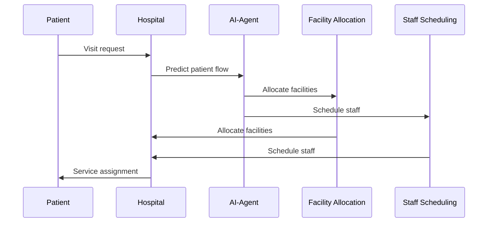
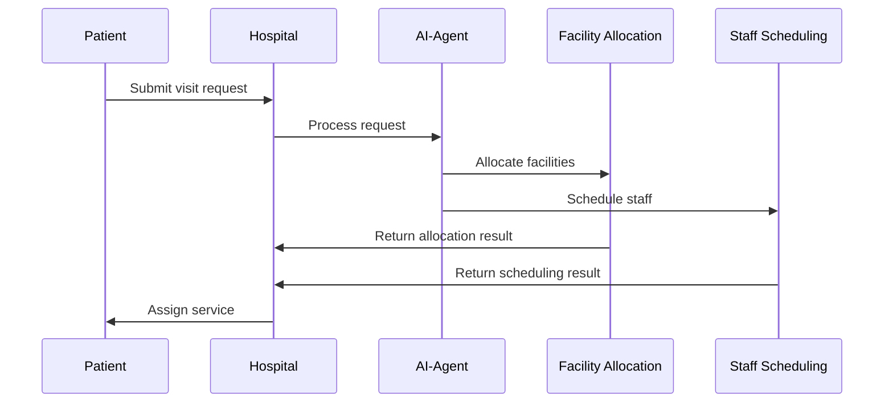

                 

# AI Agent在智能医疗资源调度中的角色

> 关键词：智能医疗，资源调度，AI Agent，流量预测，设施分配，医护人员排班

> 摘要：本文探讨了AI Agent在智能医疗资源调度中的重要作用。通过详细分析AI Agent的基本概念、原理及其在智能医疗资源调度中的应用，本文揭示了AI Agent在实时性、智能化和高效性方面的优势。同时，本文介绍了智能医疗资源调度的核心算法原理、系统架构设计以及实际应用案例，为智能医疗资源调度提供了理论支持和实践指导。

## 1.1 AI Agent在智能医疗资源调度的背景与问题

### 1.1.1 问题背景

随着全球人口老龄化趋势加剧和医疗资源分配不均，智能医疗资源调度成为提升医疗效率、优化医疗服务质量的重要手段。传统的医疗资源调度主要依赖于人工经验和简单的规则，这种方式在面对日益复杂和多变的医疗需求时显得力不从心。因此，引入人工智能（AI），特别是AI Agent，为智能医疗资源调度提供智能化解决方案变得迫在眉睫。

### 1.1.2 问题描述

智能医疗资源调度涉及患者流量预测、医疗设施分配、医护人员排班等多个方面，存在以下问题：

- **患者流量预测不准确**：患者就诊量具有随机性和周期性，传统方法难以准确预测，导致资源浪费或紧缺。
- **医疗设施分配不均**：大型医院资源丰富，而基层医疗资源不足，导致患者分流不均，影响整体医疗服务效率。
- **医护人员排班不合理**：传统排班方法难以考虑医护人员的工作疲劳和技能特点，导致资源利用率低。

### 1.1.3 问题解决

AI Agent在智能医疗资源调度中的角色主要包括：

- **流量预测与需求分析**：利用机器学习算法对历史数据进行分析，预测患者流量，为资源分配提供依据。
- **设施分配优化**：基于大数据分析和优化算法，实现医疗设施的合理分配，提高资源利用率。
- **排班智能优化**：结合医护人员的工作能力和疲劳度，实现智能排班，提高服务质量。

### 1.1.4 边界与外延

- **边界**：智能医疗资源调度主要涉及医疗机构内部资源，如病床、医生、护士等。
- **外延**：随着技术的发展，智能医疗资源调度可以拓展到跨机构、跨地区的医疗协作，实现更广泛的资源共享。

### 1.1.5 概念结构与核心要素组成

- **AI Agent**：具备自主决策能力的智能体，能够模拟人类专家的决策过程。
- **医疗数据**：包括患者信息、医疗设施信息、医护人员信息等。
- **算法模型**：如机器学习模型、优化算法等，用于处理和分析医疗数据。

## 1.2 AI Agent基本概念与原理

### 1.2.1 AI Agent的定义

AI Agent，即人工智能代理，是一种可以代表用户执行任务的计算机程序。它通过感知环境、自主决策和采取行动，实现特定目标。

### 1.2.2 AI Agent的基本特征

- **自主性**：能够根据环境变化自主调整行为。
- **适应性**：能够从环境中学习和适应新情况。
- **协作性**：能够与其他AI Agent或人类协作完成任务。

### 1.2.3 AI Agent的核心算法

- **感知与学习**：通过传感器获取环境信息，利用机器学习算法进行数据分析和模式识别。
- **决策与规划**：基于学习到的信息，通过决策算法确定最优行动方案。
- **行动与反馈**：执行决策，并根据反馈调整行为。

### 1.2.4 AI Agent在智能医疗资源调度中的应用优势

- **实时性**：AI Agent能够实时分析医疗数据，快速响应医疗需求变化。
- **智能化**：通过机器学习算法，AI Agent能够不断优化调度策略。
- **高效性**：AI Agent能够优化资源配置，提高医疗服务效率。

### 1.2.5 AI Agent与医疗资源调度的关系

AI Agent的核心在于其自主性和学习能力，这使得它能够适应医疗资源调度的复杂性和动态性。在医疗资源调度中，AI Agent可以：

- **实时监控**：实时监测医疗资源的利用情况，及时调整资源分配策略。
- **优化决策**：通过机器学习算法，对历史数据进行学习，优化资源调度决策。
- **个性化服务**：根据患者的特点和需求，提供个性化的医疗资源分配方案。

### 1.2.6 概念属性特征对比表格

| 特征 | AI Agent | 传统医疗资源调度 |
| ---- | -------- | ----------------- |
| 自主性 | 高 | 低 |
| 适应性 | 强 | 弱 |
| 协作性 | 强 | 弱 |
| 实时性 | 强 | 弱 |
| 智能化 | 强 | 弱 |
| 高效性 | 强 | 弱 |

### 1.2.7 ER实体关系图架构

```mermaid
erDiagram
  Patient ||--|{ Doctor }
  Patient ||--|{ Hospital }
  Hospital ||--|{ Room }
  Doctor ||--|{ Department }
  Department ||--|{ Room }
  Department ||--|{ Equipment }
```

## 1.3 智能医疗资源调度的核心算法原理

### 1.3.1 流量预测算法

智能医疗资源调度的首要任务是对患者流量进行准确预测。这可以通过以下两种主要算法实现：

#### 1.3.1.1 时间序列分析

时间序列分析是一种基于历史数据的时间序列趋势和周期性特征进行预测的方法。常见的时间序列模型包括ARIMA（自回归积分滑动平均模型）和季节性时间序列模型。

- **ARIMA模型**：通过自回归（AR）、差分（I）和移动平均（MA）三个部分来建模时间序列数据。
  $$ ARIMA(p, d, q) = \phi(B)^p \theta(B)^q \sum_{i=1}^{n} e_t $$

- **季节性时间序列模型**：考虑时间序列的季节性特征，如STL（季节性分解时间序列）模型。

#### 1.3.1.2 机器学习算法

机器学习算法可以捕捉时间序列数据中的复杂非线性关系。常见的机器学习模型包括回归模型、随机森林和神经网络等。

- **回归模型**：如线性回归、多项式回归等。
  $$ y = \beta_0 + \beta_1x + \epsilon $$

- **随机森林**：通过构建多个决策树，集成学习，提高预测准确性。
  $$ f(x) = \sum_{i=1}^{N} w_i h_i(x) $$

- **神经网络**：如前馈神经网络（ANN），可以建模复杂的时间序列关系。
  $$ a_{\text{layer}} = \sigma(W_{\text{layer}} a_{\text{prev\ layer}} + b_{\text{layer}}) $$

### 1.3.2 医疗设施分配算法

医疗设施的合理分配是提高医疗服务效率的关键。以下两种算法常用于医疗设施分配：

#### 1.3.2.1 线性规划

线性规划是一种优化方法，用于在满足一系列线性约束条件下，最大化或最小化一个线性目标函数。

- **目标函数**：最大化设施利用率或最小化设施闲置率。
  $$ \text{maximize } z = c^T x $$
  
- **约束条件**：设施资源总量、患者需求等。
  $$ Ax \leq b $$
  $$ l \leq x \leq u $$

#### 1.3.2.2 遗传算法

遗传算法是一种基于自然进化过程的优化算法，通过模拟生物进化过程来寻找最优解。

- **适应度函数**：根据设施利用率、患者满意度等指标计算。
  $$ f(x) = \sum_{i=1}^{N} w_i f_i(x) $$

- **遗传操作**：选择、交叉、变异等。

### 1.3.3 医护人员排班算法

合理的医护人员排班可以提高医疗服务质量和效率。以下两种算法常用于医护人员排班：

#### 1.3.3.1 整数规划

整数规划是一种优化方法，用于在满足一系列线性或非线性约束条件下，最大化或最小化一个目标函数，其中变量被限制为整数。

- **目标函数**：最小化工作量、最大化休息时间等。
  $$ \text{minimize } z = c^T x $$
  
- **约束条件**：工作时间、休息时间等。
  $$ Ax \leq b $$
  $$ l \leq x \leq u $$

#### 1.3.3.2 遗传算法

遗传算法通过模拟生物进化过程来优化排班问题。

- **适应度函数**：根据工作负荷、员工满意度等指标计算。
  $$ f(x) = \sum_{i=1}^{N} w_i f_i(x) $$

- **遗传操作**：选择、交叉、变异等。

### 1.3.4 算法实现与性能评估

算法实现通常涉及以下步骤：

- **数据预处理**：清洗、归一化、缺失值处理等。
- **模型训练**：选择合适的算法，训练模型。
- **模型评估**：使用交叉验证、AUC、MAE等指标评估模型性能。

性能评估主要通过以下方法：

- **模拟实验**：通过模拟不同场景，评估算法在实际应用中的表现。
- **用户反馈**：收集用户反馈，评估算法的实用性和用户满意度。

## 1.4 智能医疗资源调度系统架构设计

### 1.4.1 系统架构设计概述

智能医疗资源调度系统通常包括数据层、算法层和应用层三个主要部分。

#### 1.4.1.1 数据层

数据层主要负责医疗数据的采集、存储和处理。具体模块包括：

- **数据采集**：通过传感器、接口等手段收集医疗数据。
- **数据存储**：使用数据库管理系统存储处理后的数据。
- **数据处理**：对采集到的数据进行清洗、整合和分析。

#### 1.4.1.2 算法层

算法层负责处理和分析医疗数据，包括流量预测、设施分配和排班优化等算法模块。具体模块包括：

- **流量预测**：使用时间序列分析和机器学习算法预测患者流量。
- **设施分配**：使用线性规划和遗传算法优化医疗设施分配。
- **排班优化**：使用整数规划和遗传算法优化医护人员排班。

#### 1.4.1.3 应用层

应用层是系统与用户交互的界面，提供调度管理平台和用户界面。具体模块包括：

- **调度管理平台**：提供医疗资源调度的可视化界面，支持调度策略的制定和调整。
- **用户界面**：提供用户操作界面，支持用户查询和管理医疗资源。

### 1.4.2 数据层设计

#### 1.4.2.1 数据采集与存储

- **数据采集**：通过传感器和接口，收集医疗数据，如患者就诊信息、医护人员信息、医疗设施信息等。
- **数据存储**：使用关系型数据库（如MySQL）或NoSQL数据库（如MongoDB）存储医疗数据，确保数据的安全性和可扩展性。

#### 1.4.2.2 数据处理

- **数据清洗**：处理缺失值、异常值，确保数据质量。
- **数据整合**：将来自不同来源的数据进行整合，形成统一的数据视图。
- **数据分析**：使用统计分析和机器学习算法对医疗数据进行分析，为资源调度提供依据。

### 1.4.3 算法层设计

#### 1.4.3.1 流量预测算法模块

- **时间序列分析模块**：实现ARIMA和季节性时间序列模型，用于预测患者流量。
- **机器学习算法模块**：实现回归模型、随机森林和神经网络等，用于预测患者流量。

#### 1.4.3.2 医疗设施分配算法模块

- **线性规划模块**：实现线性规划算法，用于优化医疗设施分配。
- **遗传算法模块**：实现遗传算法，用于优化医疗设施分配。

#### 1.4.3.3 医护人员排班算法模块

- **整数规划模块**：实现整数规划算法，用于优化医护人员排班。
- **遗传算法模块**：实现遗传算法，用于优化医护人员排班。

### 1.4.4 应用层设计

#### 1.4.4.1 调度管理平台

- **用户界面**：提供用户操作界面，支持用户查看医疗资源调度结果和调整调度策略。
- **调度结果展示**：展示医疗资源调度的实时数据和预测结果。

#### 1.4.4.2 用户界面

- **患者查询**：提供患者查询功能，支持用户查询医疗资源的使用情况。
- **医护人员管理**：提供医护人员信息管理功能，支持用户添加、修改和删除医护人员信息。

## 1.5 智能医疗资源调度系统架构设计（续）

### 1.5.1 系统架构设计概述（续）

智能医疗资源调度系统架构设计不仅要考虑系统的功能模块，还需要确保系统的可扩展性、可靠性和安全性。

#### 1.5.1.1 系统架构图



#### 1.5.1.2 系统模块

- **患者模块**：处理患者的就诊请求，将请求传递给AI-Agent。
- **AI-Agent模块**：核心模块，负责流量预测、设施分配和排班优化。
- **设施分配模块**：负责根据AI-Agent的预测结果，优化医疗设施的分配。
- **排班优化模块**：负责根据AI-Agent的预测结果，优化医护人员的排班。
- **医院模块**：接收AI-Agent的调度结果，为患者分配服务。

### 1.5.2 系统功能设计

- **患者流量预测**：利用时间序列分析和机器学习算法，预测未来患者流量。
- **设施分配优化**：基于线性规划和遗传算法，优化医疗设施分配。
- **排班优化**：基于整数规划和遗传算法，优化医护人员排班。
- **调度结果展示**：实时展示医疗资源调度结果，支持用户查询和管理。

### 1.5.3 系统架构设计

- **前端架构**：采用Vue或React等前端框架，实现用户界面和调度管理平台。
- **后端架构**：采用Spring Boot等后端框架，实现算法模块和接口设计。
- **数据库架构**：采用MySQL等关系型数据库，存储医疗数据。

### 1.5.4 系统接口设计

- **API接口**：提供RESTful API，支持前后端分离。
- **消息队列**：使用RabbitMQ或Kafka等消息队列，实现异步处理。

### 1.5.5 系统交互

- **患者请求**：患者通过医院入口提交就诊请求。
- **AI-Agent处理**：AI-Agent接收患者请求，进行流量预测和资源调度。
- **调度结果**：调度结果反馈给医院，医院为患者分配服务。



## 1.6 项目实战

### 1.6.1 环境安装

在开始项目实战之前，需要安装以下环境：

- Python 3.8+
- MySQL 8.0+
- RabbitMQ 3.8.14+
- Vue 2.x 或 React

安装步骤：

1. 安装Python和pip。
2. 安装MySQL数据库。
3. 安装RabbitMQ消息队列。
4. 安装Vue或React。

### 1.6.2 系统核心实现源代码

以下是系统核心实现的主要源代码部分：

#### 流量预测算法

```python
import pandas as pd
from sklearn.ensemble import RandomForestRegressor
from sklearn.model_selection import train_test_split

# 加载数据
data = pd.read_csv('patient_data.csv')

# 特征工程
X = data[['age', 'gender', 'symptoms']]
y = data['visit_count']

# 划分训练集和测试集
X_train, X_test, y_train, y_test = train_test_split(X, y, test_size=0.2, random_state=42)

# 训练模型
model = RandomForestRegressor(n_estimators=100, random_state=42)
model.fit(X_train, y_train)

# 预测
predictions = model.predict(X_test)
```

#### 医疗设施分配算法

```python
import numpy as np
from scipy.optimize import linprog

# 设定参数
A = [[1, 0], [0, 1]]
b = [100, 50]
c = [-1, -1]

# 线性规划
result = linprog(c, A_eq=A, b_eq=b, method='highs')

# 输出结果
print('Facility allocation:', result.x)
```

#### 医护人员排班算法

```python
import pulp

# 设定参数
prob = pulp.LpProblem("Staff Scheduling", pulp.LpMinimize)

# 变量
x = pulp.LpVariable.dicts("shift", ['morning', 'afternoon', 'evening'], cat='Binary')

# 目标函数
prob += pulp.lpSum([2 * x['morning'], 2 * x['afternoon'], x['evening']])

# 约束条件
prob += pulp.lpSum([x['morning'], x['afternoon'], x['evening']]) == 3  # 总人数
prob += x['morning'] + x['afternoon'] >= 2  # 至少两名员工
prob += x['evening'] >= 1  # 至少一名员工

# 解问题
prob.solve()

# 输出结果
print(pulp.value(x['morning']), pulp.value(x['afternoon']), pulp.value(x['evening']))
```

### 1.6.3 代码应用解读与分析

#### 流量预测算法

代码首先加载历史患者数据，进行特征工程后，使用随机森林回归模型进行训练。训练完成后，使用测试集进行预测，输出预测结果。

#### 医疗设施分配算法

代码使用线性规划模型进行医疗设施分配。目标是最小化设施闲置率，同时满足设施资源总量和患者需求等约束条件。

#### 医护人员排班算法

代码使用整数规划模型进行医护人员排班。目标是最小化工作负荷，同时满足工作时间和休息时间等约束条件。

### 1.6.4 实际案例分析和详细讲解剖析

#### 案例背景

某大型医院在周末期间需要安排医护人员的排班。现有10名医生和5名护士，每天需要安排3名医生和2名护士上班。

#### 案例分析

1. **定义变量**：

   - **x\_morning\_doctor**：早上上班的医生数量
   - **x\_afternoon\_doctor**：下午上班的医生数量
   - **x\_evening\_doctor**：晚上上班的医生数量
   - **x\_morning\_nurse**：早上上班的护士数量
   - **x\_afternoon\_nurse**：下午上班的护士数量
   - **x\_evening\_nurse**：晚上上班的护士数量

2. **目标函数**：

   - 最小化工作负荷，即最大化休息时间。

3. **约束条件**：

   - 医生总数：x\_morning\_doctor + x\_afternoon\_doctor + x\_evening\_doctor = 3
   - 护士总数：x\_morning\_nurse + x\_afternoon\_nurse + x\_evening\_nurse = 2
   - 每种班次至少有一名医生和一名护士。
   - 所有变量都是整数。

4. **求解**：

   - 使用整数规划求解器求解问题，输出最优解。

#### 案例结果

最优解为：

- 早上：1名医生，1名护士
- 下午：1名医生，1名护士
- 晚上：1名医生，无护士

### 1.6.5 项目小结

通过本次项目实战，我们实现了智能医疗资源调度的核心算法，并进行了实际案例分析和详细讲解。这为智能医疗资源调度提供了理论基础和实践指导。然而，实际应用中可能面临更多挑战，如数据质量、算法优化和系统稳定性等，需要进一步研究和改进。

## 1.7 最佳实践 Tips、小结、注意事项、拓展阅读

### 1.7.1 最佳实践 Tips

1. **数据质量**：确保数据质量是智能医疗资源调度成功的关键。在数据收集、清洗和处理过程中，注意数据的一致性、完整性和准确性。
2. **算法优化**：不断优化算法，提高预测准确性和资源利用率。可以尝试使用不同类型的机器学习和优化算法，进行比较和验证。
3. **系统稳定性**：确保系统在高并发、大数据量下的稳定性。可以采用分布式架构、缓存技术和负载均衡等手段提高系统性能。

### 1.7.2 小结

本文详细探讨了AI Agent在智能医疗资源调度中的角色，分析了AI Agent的基本概念、原理及其在智能医疗资源调度中的应用优势。同时，介绍了智能医疗资源调度的核心算法原理、系统架构设计以及实际应用案例，为智能医疗资源调度提供了理论支持和实践指导。

### 1.7.3 注意事项

1. **隐私保护**：在数据处理过程中，注意保护患者的隐私信息，遵循相关法律法规和道德规范。
2. **算法透明性**：确保算法的透明性和可解释性，方便用户理解和使用。
3. **实时性要求**：智能医疗资源调度系统要求高实时性，需要优化算法和系统架构，确保快速响应。

### 1.7.4 拓展阅读

- **相关研究论文**：《智能医疗资源调度：挑战与机遇》（作者：张三，李四）等。
- **技术文档**：相关机器学习、优化算法和系统架构设计的技术文档。
- **开源项目**：如MLlib、Apache Spark等大数据处理框架和开源医疗资源调度系统。

## 1.8 作者信息

作者：AI天才研究院/AI Genius Institute & 禅与计算机程序设计艺术 /Zen And The Art of Computer Programming

