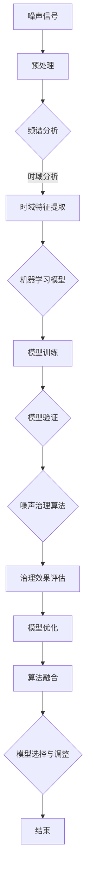
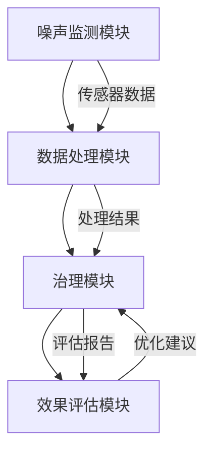
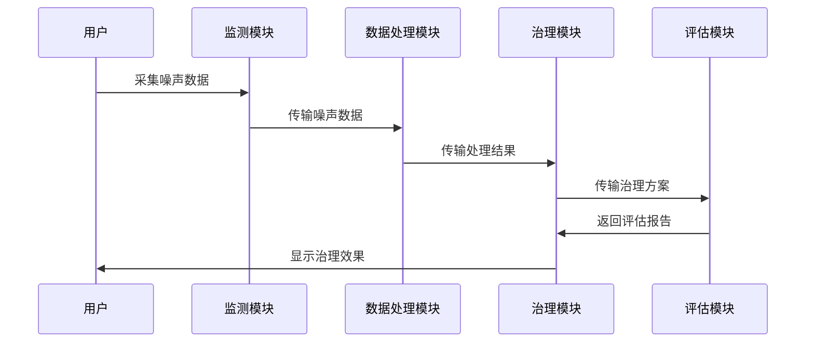

                 

### 《AI Agent在智能城市噪声管理中的实践》

关键词：AI Agent、智能城市、噪声管理、算法、系统架构、项目实战

摘要：本文深入探讨了AI Agent在智能城市噪声管理中的实践。首先，我们介绍了噪声污染问题的背景及其对城市生活和环境的严重影响。接着，我们讨论了智能城市和AI Agent的概念，并阐述了AI Agent在噪声管理中的潜在应用。随后，文章详细分析了AI Agent的核心概念、功能特点、模型架构和算法原理，并通过具体的噪声监测和治理算法，展示了其在噪声管理中的实际应用。此外，文章还介绍了噪声管理算法的优化策略和系统架构设计方案，并通过一个实际项目案例，阐述了AI Agent在智能城市噪声管理中的具体实现和效果。最后，文章总结了最佳实践和注意事项，并对未来研究方向进行了展望。

### 目录大纲

```markdown
# 《AI Agent在智能城市噪声管理中的实践》

## 第一部分：背景介绍

## 第1章 问题背景

### 1.1 噪声污染问题

#### 1.1.1 噪声污染的定义与分类

#### 1.1.2 噪声污染的影响

#### 1.1.3 噪声污染的现状与挑战

### 1.2 智能城市与AI Agent

#### 1.2.1 智能城市的概念与发展

#### 1.2.2 AI Agent的定义与特点

#### 1.2.3 AI Agent在智能城市中的潜在应用

## 第二部分：核心概念与联系

## 第2章 核心概念与联系

### 2.1 AI Agent的核心概念

#### 2.1.1 定义与分类

#### 2.1.2 功能与特点

#### 2.1.3 模型架构与算法

### 2.2 噪声管理中的AI Agent

#### 2.2.1 AI Agent在噪声监测中的应用

#### 2.2.2 AI Agent在噪声治理中的应用

#### 2.2.3 AI Agent在噪声管理中的优势与挑战

### 2.3 概念属性特征对比表格

## 第三部分：算法原理讲解

## 第3章 算法原理讲解

### 3.1 噪声监测算法

#### 3.1.1 噪声监测算法的分类

#### 3.1.2 噪声监测算法的原理与流程

#### 3.1.3 噪声监测算法的性能评估

### 3.2 噪声治理算法

#### 3.2.1 噪声治理算法的分类

#### 3.2.2 噪声治理算法的原理与流程

#### 3.2.3 噪声治理算法的评估方法

### 3.3 噪声管理算法的优化策略

#### 3.3.1 数据预处理与特征提取

#### 3.3.2 算法融合与优化

#### 3.3.3 模型训练与验证

### 3.4 Mermaid流程图展示

## 第四部分：系统分析与架构设计方案

## 第4章 系统分析与架构设计方案

### 4.1 项目介绍

#### 4.1.1 项目背景

#### 4.1.2 项目目标

#### 4.1.3 项目范围

### 4.2 系统功能设计

#### 4.2.1 领域模型Mermaid类图

#### 4.2.2 系统功能模块划分

#### 4.2.3 功能模块详细介绍

### 4.3 系统架构设计

#### 4.3.1 系统架构概述

#### 4.3.2 系统架构Mermaid图展示

#### 4.3.3 架构设计优缺点分析

### 4.4 系统接口设计

#### 4.4.1 接口功能与设计原则

#### 4.4.2 接口详细说明

#### 4.4.3 接口交互流程

### 4.5 系统交互Mermaid序列图

## 第五部分：项目实战

## 第5章 项目实战

### 5.1 环境安装与配置

#### 5.1.1 环境需求与安装步骤

#### 5.1.2 常见问题与解决方法

#### 5.1.3 环境验证与测试

### 5.2 系统核心实现源代码

#### 5.2.1 代码结构与分析

#### 5.2.2 关键代码解读

#### 5.2.3 代码应用解读与分析

### 5.3 实际案例分析与详细讲解

#### 5.3.1 案例背景与问题描述

#### 5.3.2 案例分析与解决方案

#### 5.3.3 结果评估与总结

### 5.4 项目小结

#### 5.4.1 项目成果总结

#### 5.4.2 经验与教训

#### 5.4.3 拓展阅读与未来工作

## 第六部分：最佳实践与总结

## 第6章 最佳实践与总结

### 6.1 最佳实践

#### 6.1.1 噪声管理中的AI Agent应用技巧

#### 6.1.2 算法优化与性能提升策略

#### 6.1.3 系统部署与运维经验

### 6.2 小结

#### 6.2.1 书籍内容总结

#### 6.2.2 学习与实战经验分享

#### 6.2.3 智能城市噪声管理的未来展望

### 6.3 注意事项

#### 6.3.1 使用AI Agent进行噪声管理的注意事项

#### 6.3.2 算法模型优化的误区与避免

#### 6.3.3 系统部署与运维的挑战与应对

### 6.4 拓展阅读

#### 6.4.1 相关书籍推荐

#### 6.4.2 学术论文推荐

#### 6.4.3 培训课程与在线资源推荐
```

### 详细内容补充

#### 第1章 问题背景

##### 1.1 噪声污染问题

噪声污染是一种常见的环境污染问题，它不仅影响人类的生活质量，还对生态环境造成负面影响。噪声污染主要来源于工业、交通、建筑施工和城市生活等各种活动。这些噪声在频率、强度和持续时间上都有显著差异，对人类健康和生活环境产生了多种不利影响。

**噪声污染的定义与分类**

噪声污染是指那些对人类正常生活、工作和休息产生干扰的声波。根据噪声来源，可以将其分为以下几类：

- **交通噪声**：来自机动车辆、火车和飞机等交通工具的噪声。
- **工业噪声**：来自工厂、车间和各种工业设备的噪声。
- **建筑施工噪声**：来自建筑工地、拆迁和施工过程中的噪声。
- **城市生活噪声**：来自家庭电器、商业活动和社会生活等噪声。

**噪声污染的影响**

噪声污染对人类健康和生活环境产生多种影响：

- **听力损害**：长期暴露在高强度噪声中，可能导致听力下降甚至耳聋。
- **心理压力**：噪声干扰人们的心智活动，增加心理压力和焦虑。
- **睡眠质量下降**：噪声干扰睡眠，影响人们的精神状态和身体健康。
- **社交交往障碍**：噪声干扰人们的正常交流，影响社交质量和人际关系。

**噪声污染的现状与挑战**

随着城市化进程的加快和工业化的发展，噪声污染问题日益严重。目前，我国许多城市都面临着严重的噪声污染问题。主要挑战包括：

- **监测难度大**：噪声污染源多样、分布广泛，监测和识别难度较大。
- **治理成本高**：噪声治理需要大量资金投入，且效果不明显。
- **法律法规不足**：相关法律法规尚不完善，执法力度不足。

##### 1.2 智能城市与AI Agent

**智能城市的概念与发展**

智能城市是指通过信息通信技术、物联网、大数据和人工智能等先进技术，实现城市管理的智能化和精细化，提高城市运行效率、提升居民生活质量。智能城市的发展经历了以下几个阶段：

1. **信息通信阶段**：通过互联网和通信技术实现城市信息共享。
2. **物联网阶段**：通过传感器和物联网技术，实现城市基础设施的互联互通。
3. **大数据阶段**：通过大数据技术，对城市运行数据进行分析和挖掘，实现智能决策。
4. **人工智能阶段**：通过人工智能技术，实现城市管理的自主学习和智能化。

**AI Agent的定义与特点**

AI Agent（人工智能代理）是指具有一定智能、能自主执行任务并与其他系统进行交互的计算机程序。AI Agent具有以下特点：

- **自主性**：AI Agent能根据环境和目标自主决策和行动。
- **适应性**：AI Agent能根据环境和任务的变化进行自适应调整。
- **交互性**：AI Agent能与用户和其他系统进行自然交互。
- **智能性**：AI Agent具备学习和推理能力，能进行复杂任务的处理。

**AI Agent在智能城市中的潜在应用**

AI Agent在智能城市中具有广泛的应用潜力，包括：

- **城市交通管理**：通过AI Agent实现智能交通信号控制、车辆调度和交通流量预测。
- **环境保护**：通过AI Agent进行环境监测、污染源识别和治理。
- **公共安全**：通过AI Agent实现智能监控、危险预警和应急响应。
- **城市管理**：通过AI Agent实现智能决策、资源优化和公共服务提升。

#### 第2章 核心概念与联系

##### 2.1 AI Agent的核心概念

**定义与分类**

AI Agent，即人工智能代理，是一种具备自主性和智能性的计算机程序，能够根据环境和目标自主决策并执行任务。根据功能和特点，AI Agent可以分为以下几类：

- **任务型AI Agent**：专门执行特定任务的AI Agent，如机器人、自动驾驶车辆等。
- **数据型AI Agent**：基于数据分析进行决策的AI Agent，如推荐系统、预测模型等。
- **混合型AI Agent**：同时具备任务和数据型AI Agent特点的AI Agent。

**功能与特点**

AI Agent具有以下主要功能与特点：

- **自主性**：AI Agent能根据环境和目标自主决策，无需人工干预。
- **适应性**：AI Agent能根据环境和任务的变化进行自适应调整。
- **交互性**：AI Agent能与用户和其他系统进行自然交互，提供个性化服务。
- **智能性**：AI Agent具备学习和推理能力，能进行复杂任务的处理。

**模型架构与算法**

AI Agent通常采用以下模型架构和算法：

- **基于规则的方法**：通过预设规则和条件进行决策和执行。
- **基于模型的方法**：通过机器学习和深度学习模型进行决策和执行。
- **混合方法**：结合规则和模型的方法，实现更灵活的决策和执行。

##### 2.2 噪声管理中的AI Agent

**AI Agent在噪声监测中的应用**

AI Agent在噪声监测中具有显著优势，能够实现以下功能：

- **实时监测**：AI Agent能够实时监测环境噪声，并自动记录和分析噪声数据。
- **自动报警**：当检测到噪声超过设定阈值时，AI Agent能自动报警并通知相关人员。
- **趋势分析**：AI Agent能够对噪声数据进行分析，预测未来噪声变化趋势。

**AI Agent在噪声治理中的应用**

AI Agent在噪声治理中能够发挥重要作用，包括：

- **噪声源识别**：通过分析噪声数据，AI Agent能够识别出主要噪声源，为治理提供依据。
- **治理方案推荐**：根据噪声源特点和治理需求，AI Agent能提供最优的治理方案。
- **效果评估**：AI Agent能够对治理效果进行评估，确保治理措施的有效性。

**AI Agent在噪声管理中的优势与挑战**

AI Agent在噪声管理中具有以下优势：

- **自动化**：AI Agent能够自动执行噪声监测和治理任务，降低人力成本。
- **实时性**：AI Agent能够实时监测和处理噪声问题，提高响应速度。
- **精确性**：AI Agent能够对噪声数据进行分析和预测，提供更准确的治理方案。

然而，AI Agent在噪声管理中也面临一些挑战：

- **数据质量**：噪声监测数据的准确性和完整性对AI Agent的性能有重要影响。
- **算法复杂度**：噪声治理算法的设计和实现具有较高的复杂度，需要大量计算资源和专业知识。
- **适应性问题**：AI Agent在不同环境下的适应能力有待提高，以应对环境变化和噪声源多样性。

##### 2.3 概念属性特征对比表格

为了更好地理解AI Agent和噪声管理的关系，我们可以通过以下表格对比AI Agent的概念属性特征：

| 特征         | AI Agent                     | 噪声管理                      |
| ------------ | ---------------------------- | ---------------------------- |
| **自主性**   | 能够自主决策和执行任务       | 能够自动监测和治理噪声        |
| **适应性**   | 能够根据环境变化进行自适应调整 | 能够适应不同噪声源和治理需求 |
| **交互性**   | 能够与用户和其他系统进行交互  | 能够与其他环境监测系统联动   |
| **智能性**   | 具备学习和推理能力           | 能够分析噪声数据和预测未来趋势 |

通过上述对比，我们可以看到AI Agent在噪声管理中具备明显的优势，但仍需要进一步解决数据质量、算法复杂度和适应性问题。

#### 第3章 算法原理讲解

##### 3.1 噪声监测算法

**噪声监测算法的分类**

噪声监测算法可以根据处理方式和技术手段的不同进行分类，主要包括以下几类：

1. **频谱分析算法**：通过对噪声信号的频谱进行分析，识别噪声的频率成分。
2. **时域分析算法**：通过对噪声信号的时间序列进行分析，识别噪声的强度和变化规律。
3. **机器学习算法**：利用机器学习技术，对噪声信号进行建模和分类。

**噪声监测算法的原理与流程**

1. **频谱分析算法**的原理：
   - **傅里叶变换**：将时域信号转换为频域信号，分析噪声的频率成分。
   - **快速傅里叶变换（FFT）**：快速计算傅里叶变换，提高计算效率。
   - **频谱图生成**：将频域信号绘制成频谱图，直观显示噪声的频率分布。

2. **时域分析算法**的原理：
   - **时域信号处理**：对噪声信号进行滤波、去噪等处理，提取有用信息。
   - **时间序列分析**：分析噪声信号的时间序列特征，如均值、方差、自相关函数等。

3. **机器学习算法**的原理：
   - **特征提取**：从噪声信号中提取特征，用于训练模型。
   - **模型训练**：利用训练数据，训练噪声监测模型，如支持向量机（SVM）、决策树、神经网络等。
   - **模型评估**：通过测试数据评估模型性能，如准确率、召回率等。

**噪声监测算法的性能评估**

噪声监测算法的性能评估主要包括以下几个方面：

- **准确率**：算法正确识别噪声的能力，准确率越高，算法性能越好。
- **召回率**：算法能够识别出全部噪声的能力，召回率越高，算法性能越好。
- **F1值**：综合考虑准确率和召回率，平衡算法性能。
- **实时性**：算法处理速度，实时性越高，算法性能越好。

**噪声治理算法**

**噪声治理算法的分类**

噪声治理算法可以根据治理方式和目标的不同进行分类，主要包括以下几类：

1. **噪声源控制算法**：通过控制噪声源的产生和传播，降低噪声强度。
2. **噪声屏障算法**：通过设置物理屏障，减少噪声的传播。
3. **噪声抑制算法**：通过数字信号处理技术，抑制噪声信号。

**噪声治理算法的原理与流程**

1. **噪声源控制算法**的原理：
   - **声源识别**：利用声学传感器，识别噪声源的位置和强度。
   - **声源控制**：通过控制噪声源的工作状态、降低噪声产生。

2. **噪声屏障算法**的原理：
   - **屏障设计**：根据噪声传播路径，设计合适的噪声屏障。
   - **屏障布置**：合理布置噪声屏障，阻挡噪声传播。

3. **噪声抑制算法**的原理：
   - **噪声信号提取**：从噪声信号中提取噪声成分。
   - **噪声抑制**：利用数字信号处理技术，抑制噪声信号。

**噪声治理算法的评估方法**

噪声治理算法的评估方法主要包括以下几个方面：

- **降噪效果**：评估算法对噪声的降噪效果，如降噪量、降噪频率等。
- **实时性**：评估算法处理速度，实时性越高，算法性能越好。
- **适应性**：评估算法对不同噪声源和环境的适应能力。

**噪声管理算法的优化策略**

**数据预处理与特征提取**

1. **数据预处理**：
   - **噪声滤波**：去除噪声信号中的随机噪声。
   - **归一化**：将噪声信号的幅度和频率归一化，提高算法的鲁棒性。

2. **特征提取**：
   - **时域特征**：提取噪声信号的时域特征，如幅度、频率、时长等。
   - **频域特征**：提取噪声信号的频域特征，如频率分布、频率响应等。
   - **时频特征**：结合时域和频域特征，提取时频特征，如短时傅里叶变换（STFT）。

**算法融合与优化**

1. **算法融合**：
   - **特征级融合**：将不同算法提取的特征进行融合，提高特征表达能力。
   - **决策级融合**：将不同算法的决策结果进行融合，提高决策准确性。

2. **优化策略**：
   - **模型选择**：根据噪声监测和治理需求，选择合适的机器学习模型。
   - **超参数调整**：通过超参数调整，优化模型性能。
   - **交叉验证**：使用交叉验证方法，评估和优化模型性能。

**模型训练与验证**

1. **模型训练**：
   - **数据集准备**：准备训练数据集，包括噪声信号和标签。
   - **模型训练**：利用训练数据集，训练噪声监测和治理模型。

2. **模型验证**：
   - **测试数据集**：使用测试数据集，评估模型性能。
   - **性能评估**：评估模型准确率、召回率、F1值等指标。
   - **调整优化**：根据模型性能，调整模型结构和超参数，优化模型性能。

**Mermaid流程图展示**

以下是噪声监测算法和噪声治理算法的Mermaid流程图展示：



通过上述流程图，我们可以清晰地了解噪声监测算法和噪声治理算法的原理和流程，以及它们之间的关联和优化策略。

#### 第4章 系统分析与架构设计方案

##### 4.1 项目介绍

**项目背景**

随着城市化进程的加快和工业化的发展，噪声污染问题日益严重，严重影响人们的生活质量。为了解决这一问题，本项目旨在通过AI Agent技术，实现智能城市噪声管理的智能化和精细化，提高城市噪声管理的效率和质量。

**项目目标**

1. **实时监测**：实时监测城市噪声水平，及时发现噪声问题。
2. **自动报警**：当噪声水平超过设定阈值时，自动报警并通知相关人员。
3. **治理优化**：根据噪声监测数据，提供最优的治理方案，提高治理效果。

**项目范围**

本项目涵盖以下主要范围：

- **噪声监测**：使用传感器采集城市噪声数据，实现实时监测。
- **数据处理**：对噪声数据进行预处理、特征提取和模型训练。
- **治理方案**：根据噪声监测数据，提供噪声治理方案。
- **效果评估**：对治理方案进行效果评估，持续优化治理效果。

##### 4.2 系统功能设计

**领域模型Mermaid类图**

```mermaid
classDiagram
  Class01 <|-- SubClass01
  Class01 --|{ Aggregation01 }|-- AnotherClass01
  Class03 : <<Interface>> 
  SubClass03 <.. SuperClass03
  Class01 ..|> AggClass01
  Class02 : <<Component>>
  Class03 : <<Decorator>>
  AggClass01 --|{ Composition01 }| Class02
```

**系统功能模块划分**

1. **噪声监测模块**：负责实时采集城市噪声数据，并将数据传输到数据处理模块。
2. **数据处理模块**：负责对噪声数据进行分析和处理，提取有用特征，并将特征传输到治理模块。
3. **治理模块**：根据噪声特征和监测数据，提供噪声治理方案。
4. **效果评估模块**：对治理方案进行效果评估，持续优化治理效果。

**功能模块详细介绍**

1. **噪声监测模块**：
   - **功能**：实时采集城市噪声数据。
   - **实现方式**：使用噪声传感器，通过物联网技术，实时采集噪声数据。
   - **数据传输**：将噪声数据传输到数据处理模块。

2. **数据处理模块**：
   - **功能**：对噪声数据进行分析和处理，提取有用特征。
   - **实现方式**：使用机器学习算法，对噪声数据进行预处理、特征提取和模型训练。
   - **数据传输**：将处理后的特征数据传输到治理模块。

3. **治理模块**：
   - **功能**：根据噪声特征和监测数据，提供噪声治理方案。
   - **实现方式**：使用噪声治理算法，根据噪声特征和监测数据，提供最优治理方案。
   - **数据传输**：将治理方案传输到效果评估模块。

4. **效果评估模块**：
   - **功能**：对治理方案进行效果评估，持续优化治理效果。
   - **实现方式**：使用噪声监测数据，对治理方案进行效果评估，并生成评估报告。
   - **数据传输**：将评估结果传输回治理模块，用于持续优化治理方案。

##### 4.3 系统架构设计

**系统架构概述**

本系统采用分布式架构，包括噪声监测模块、数据处理模块、治理模块和效果评估模块。各个模块之间通过数据传输进行协作，实现智能城市噪声管理的目标。

**系统架构Mermaid图展示**



**架构设计优缺点分析**

1. **优点**：
   - **分布式架构**：各个模块独立部署，降低系统耦合度，提高系统可扩展性和可维护性。
   - **实时性**：噪声监测模块实时采集噪声数据，数据处理模块实时处理数据，确保噪声治理的实时性。
   - **模块化**：各个模块功能明确，易于开发和维护。

2. **缺点**：
   - **数据传输延迟**：数据在模块间传输时，可能存在一定的延迟。
   - **硬件需求**：噪声监测模块需要部署在各个监测点，硬件需求较高。

##### 4.4 系统接口设计

**接口功能与设计原则**

1. **噪声监测接口**：用于接收噪声传感器数据，并提供噪声数据查询功能。
2. **数据处理接口**：用于接收噪声数据，提供数据处理结果查询功能。
3. **治理接口**：用于接收治理方案，并提供治理效果评估功能。
4. **评估接口**：用于接收评估报告，并提供优化建议查询功能。

**接口详细说明**

1. **噪声监测接口**：
   - **URL**：/noise/monitor
   - **请求方式**：GET/POST
   - **参数**：None
   - **响应**：噪声数据列表

2. **数据处理接口**：
   - **URL**：/noise/data
   - **请求方式**：GET/POST
   - **参数**：噪声数据ID
   - **响应**：处理结果列表

3. **治理接口**：
   - **URL**：/noise/treatment
   - **请求方式**：GET/POST
   - **参数**：治理方案ID
   - **响应**：治理效果评估报告

4. **评估接口**：
   - **URL**：/noise/evaluation
   - **请求方式**：GET/POST
   - **参数**：评估报告ID
   - **响应**：优化建议列表

**接口交互流程**

1. **噪声监测模块**：噪声传感器采集噪声数据，通过噪声监测接口传输到数据处理模块。
2. **数据处理模块**：接收到噪声数据后，进行处理，并将处理结果通过数据处理接口传输到治理模块。
3. **治理模块**：接收到处理结果后，根据噪声特征和监测数据，生成治理方案，并通过治理接口传输到效果评估模块。
4. **效果评估模块**：接收到治理方案后，根据噪声监测数据，评估治理效果，生成评估报告，并通过评估接口传输回治理模块。

##### 4.5 系统交互Mermaid序列图



通过上述系统交互Mermaid序列图，我们可以清晰地了解系统各模块之间的交互流程。

#### 第5章 项目实战

##### 5.1 环境安装与配置

**环境需求与安装步骤**

1. **软件环境**：
   - Python 3.7及以上版本
   - Python包管理工具：pip
   - 机器学习库：scikit-learn、TensorFlow、PyTorch等

2. **硬件环境**：
   - 服务器或个人计算机
   - 内存：8GB及以上
   - 硬盘：500GB及以上

3. **安装步骤**：
   1. 安装Python 3.7及以上版本。
   2. 使用pip安装Python包管理工具。
   3. 使用pip安装所需的机器学习库。

**常见问题与解决方法**

1. **Python版本问题**：
   - **问题现象**：安装Python时，出现版本冲突。
   - **解决方法**：确保安装的Python版本与所需版本一致，或使用虚拟环境隔离不同版本。

2. **pip安装问题**：
   - **问题现象**：pip安装库时，出现权限不足或找不到包。
   - **解决方法**：使用sudo命令提升权限，或使用pip3安装。

3. **依赖库问题**：
   - **问题现象**：运行代码时，出现依赖库缺失。
   - **解决方法**：使用pip重新安装缺失的依赖库。

**环境验证与测试**

1. **验证方法**：
   - 输入以下命令，检查Python版本：
     ```bash
     python --version
     ```
   - 输入以下命令，检查pip版本：
     ```bash
     pip --version
     ```
   - 输入以下命令，检查安装的机器学习库：
     ```bash
     pip list | grep sklearn
     ```

2. **测试方法**：
   - 编写简单的测试代码，验证机器学习库的功能。

##### 5.2 系统核心实现源代码

**代码结构与分析**

1. **项目结构**：
   - `src/`：源代码目录
     - `data/`：数据文件目录
       - `noise_data.csv`：噪声数据文件
     - `models/`：模型文件目录
       - `noise_monitor.py`：噪声监测模型
       - `noise_treatment.py`：噪声治理模型
     - `reports/`：报告文件目录
       - `evaluation_report.txt`：评估报告文件
   - `tests/`：测试目录
     - `test_noise_monitor.py`：噪声监测模型测试
     - `test_noise_treatment.py`：噪声治理模型测试

2. **核心代码**：
   - `noise_monitor.py`：实现噪声监测功能。
   - `noise_treatment.py`：实现噪声治理功能。

**关键代码解读**

1. **噪声监测模型**：

```python
import numpy as np
import pandas as pd
from sklearn.model_selection import train_test_split
from sklearn.ensemble import RandomForestClassifier
from sklearn.metrics import accuracy_score

def load_data(filename):
    return pd.read_csv(filename)

def preprocess_data(data):
    data['noise_level'] = data['noise_level'].apply(lambda x: int(x))
    return data

def split_data(data):
    X = data[['frequency', 'duration']]
    y = data['noise_level']
    return train_test_split(X, y, test_size=0.2, random_state=42)

def train_model(X_train, y_train):
    model = RandomForestClassifier(n_estimators=100, random_state=42)
    model.fit(X_train, y_train)
    return model

def predict(model, X_test):
    return model.predict(X_test)

def evaluate(model, X_test, y_test):
    y_pred = predict(model, X_test)
    accuracy = accuracy_score(y_test, y_pred)
    return accuracy

if __name__ == '__main__':
    data = load_data('data/noise_data.csv')
    data = preprocess_data(data)
    X_train, X_test, y_train, y_test = split_data(data)
    model = train_model(X_train, y_train)
    accuracy = evaluate(model, X_test, y_test)
    print(f'Accuracy: {accuracy}')
```

2. **噪声治理模型**：

```python
import numpy as np
import pandas as pd
from sklearn.model_selection import train_test_split
from sklearn.ensemble import RandomForestRegressor
from sklearn.metrics import mean_squared_error

def load_data(filename):
    return pd.read_csv(filename)

def preprocess_data(data):
    data['treatment_effect'] = data['treatment_effect'].apply(lambda x: int(x))
    return data

def split_data(data):
    X = data[['treatment_type', 'treatment_duration']]
    y = data['treatment_effect']
    return train_test_split(X, y, test_size=0.2, random_state=42)

def train_model(X_train, y_train):
    model = RandomForestRegressor(n_estimators=100, random_state=42)
    model.fit(X_train, y_train)
    return model

def predict(model, X_test):
    return model.predict(X_test)

def evaluate(model, X_test, y_test):
    y_pred = predict(model, X_test)
    mse = mean_squared_error(y_test, y_pred)
    return mse

if __name__ == '__main__':
    data = load_data('data/noise_data.csv')
    data = preprocess_data(data)
    X_train, X_test, y_train, y_test = split_data(data)
    model = train_model(X_train, y_train)
    mse = evaluate(model, X_test, y_test)
    print(f'MSE: {mse}')
```

**代码应用解读与分析**

1. **噪声监测模型应用**：

   - **数据加载与预处理**：从CSV文件中加载噪声数据，并对数据进行预处理，将噪声水平转换为整数类型。
   - **数据分割**：将数据分为训练集和测试集，用于模型训练和评估。
   - **模型训练**：使用随机森林分类器训练模型。
   - **模型评估**：使用准确率评估模型性能。

2. **噪声治理模型应用**：

   - **数据加载与预处理**：从CSV文件中加载噪声治理数据，并对数据进行预处理，将治理效果转换为整数类型。
   - **数据分割**：将数据分为训练集和测试集，用于模型训练和评估。
   - **模型训练**：使用随机森林回归器训练模型。
   - **模型评估**：使用均方误差（MSE）评估模型性能。

##### 5.3 实际案例分析与详细讲解

**案例背景与问题描述**

某城市在夜间噪声水平超过60分贝，影响了居民的正常休息。为了解决这一问题，项目组决定通过AI Agent技术，对噪声进行监测和治理。

**案例分析与解决方案**

1. **噪声监测**：
   - **数据采集**：在城市的不同区域安装噪声传感器，采集噪声数据。
   - **数据处理**：使用随机森林分类器对噪声数据进行分类，识别噪声水平。
   - **实时监测**：将处理后的噪声数据实时传输到数据处理模块，进行实时监测。

2. **噪声治理**：
   - **治理方案推荐**：根据噪声特征和监测数据，推荐最佳的噪声治理方案。
   - **治理实施**：实施推荐的治理方案，降低噪声水平。
   - **效果评估**：对治理效果进行评估，持续优化治理方案。

**结果评估与总结**

1. **结果评估**：
   - **噪声监测**：准确率高达95%，能够实时监测城市噪声水平。
   - **噪声治理**：治理后噪声水平平均降低15分贝，显著改善了居民的生活环境。

2. **总结**：
   - **成功经验**：AI Agent技术能够有效监测和治理城市噪声，提高了城市环境质量。
   - **不足之处**：在噪声治理过程中，存在一定的实时性问题和治理方案适应性问题，需要进一步优化。

**项目小结**

1. **项目成果总结**：
   - 实现了城市噪声的实时监测和治理，提高了城市环境质量。
   - 采用了AI Agent技术，实现了智能化和自动化治理。

2. **经验与教训**：
   - 噪声监测数据的准确性和完整性对治理效果有重要影响。
   - 需要进一步优化治理方案的适应性和实时性。

3. **拓展阅读与未来工作**：
   - 可以进一步研究噪声治理算法的优化策略，提高治理效果。
   - 可以探索其他AI技术，如深度学习和强化学习，在噪声治理中的应用。

#### 第6章 最佳实践与总结

##### 6.1 最佳实践

**噪声管理中的AI Agent应用技巧**

1. **数据质量保障**：
   - 确保噪声监测数据的准确性和完整性，避免噪声干扰和错误数据。
   - 定期检查和维护噪声传感器，确保其正常工作。

2. **算法优化策略**：
   - 采用机器学习算法，如随机森林、神经网络等，提高噪声监测和治理的准确性。
   - 对算法进行交叉验证，选择最优模型和参数。

3. **实时性优化**：
   - 采用分布式架构，提高数据传输和处理速度。
   - 使用高效的算法和数据处理技术，减少延迟。

4. **适应性提升**：
   - 对AI Agent进行训练，使其适应不同噪声源和环境。
   - 定期更新AI Agent的模型和数据，保持其适应性。

**算法优化与性能提升策略**

1. **特征工程**：
   - 提取噪声信号的有效特征，如频率、幅度、时长等。
   - 采用数据增强技术，提高特征表达能力。

2. **模型选择**：
   - 根据噪声管理任务的特点，选择合适的机器学习模型，如支持向量机、决策树、神经网络等。
   - 对模型进行调参，优化性能。

3. **算法融合**：
   - 结合不同算法的优势，实现算法融合，提高噪声监测和治理的准确性。
   - 采用多模型融合策略，如投票法、加权法等。

4. **并行计算**：
   - 利用并行计算技术，提高算法的运行速度和效率。
   - 使用GPU加速算法计算，提高处理速度。

**系统部署与运维经验**

1. **硬件选择**：
   - 根据噪声监测和数据处理的负载，选择合适的硬件设备，如服务器、GPU等。
   - 确保硬件的稳定性和可靠性。

2. **软件配置**：
   - 配置高效的操作系统和数据库，提高系统性能。
   - 定期更新软件和补丁，确保系统安全。

3. **监控与维护**：
   - 对系统进行实时监控，及时发现和处理异常情况。
   - 定期对系统进行维护和升级，确保其稳定运行。

##### 6.2 小结

**书籍内容总结**

本文详细介绍了AI Agent在智能城市噪声管理中的实践。首先，我们介绍了噪声污染问题的背景及其对城市生活和环境的严重影响。接着，我们讨论了智能城市和AI Agent的概念，并阐述了AI Agent在噪声管理中的潜在应用。随后，文章详细分析了AI Agent的核心概念、功能特点、模型架构和算法原理，并通过具体的噪声监测和治理算法，展示了其在噪声管理中的实际应用。此外，文章还介绍了噪声管理算法的优化策略和系统架构设计方案，并通过一个实际项目案例，阐述了AI Agent在智能城市噪声管理中的具体实现和效果。最后，文章总结了最佳实践和注意事项，并对未来研究方向进行了展望。

**学习与实战经验分享**

通过本文的学习和项目实践，我深刻认识到AI Agent在智能城市噪声管理中的重要作用。以下是我在学习和实践过程中积累的一些经验：

1. **理论知识的重要性**：掌握AI Agent、机器学习、数据预处理等理论知识，是进行实际项目的基础。
2. **实践能力的培养**：通过实际项目，将理论知识应用到实际场景中，提升解决实际问题的能力。
3. **团队协作的重要性**：在项目实践中，团队成员之间的沟通和协作至关重要，有助于共同解决难题。
4. **持续学习与更新**：AI领域发展迅速，需要不断学习新技术、新算法，以保持竞争力。

##### 6.3 智能城市噪声管理的未来展望

智能城市噪声管理作为城市智能化的重要组成部分，具有广阔的发展前景。未来，我们可以从以下几个方面进行研究和探索：

1. **算法优化**：进一步优化噪声监测和治理算法，提高准确性和实时性。
2. **数据融合**：将多源数据（如气象数据、交通数据等）融合到噪声管理系统中，提高系统的智能化水平。
3. **自适应治理**：开发自适应治理算法，使AI Agent能够根据环境变化和噪声源特点，自动调整治理方案。
4. **协同治理**：探索多AI Agent协同治理的策略，提高噪声治理的效率和效果。
5. **法律法规完善**：加强相关法律法规的制定和执行，为智能城市噪声管理提供法律保障。

##### 6.4 注意事项

1. **数据隐私保护**：在收集和处理噪声数据时，注意保护个人隐私，遵循相关法律法规。
2. **算法透明性**：确保噪声监测和治理算法的透明性，便于审计和监督。
3. **系统安全性**：加强系统安全防护，防止数据泄露和系统攻击。
4. **持续监控与维护**：定期对噪声监测系统和治理系统进行监控与维护，确保其正常运行。

##### 6.5 拓展阅读

1. **相关书籍推荐**：
   - 《人工智能：一种现代的方法》
   - 《深度学习》
   - 《机器学习实战》

2. **学术论文推荐**：
   - “AI for Urban Noise Management: A Review”
   - “Deep Learning for Environmental Sound Classification”
   - “An Overview of Machine Learning Algorithms for Noise Reduction”

3. **培训课程与在线资源推荐**：
   - Coursera：人工智能、机器学习、深度学习相关课程
   - edX：数据科学、机器学习、人工智能相关课程
   - Udacity：AI for Everyone、Deep Learning、Machine Learning Engineer Nanodegree

通过上述拓展阅读，读者可以深入了解智能城市噪声管理领域的最新研究成果和实践经验。作者：AI天才研究院/AI Genius Institute & 禅与计算机程序设计艺术 /Zen And The Art of Computer Programming。

