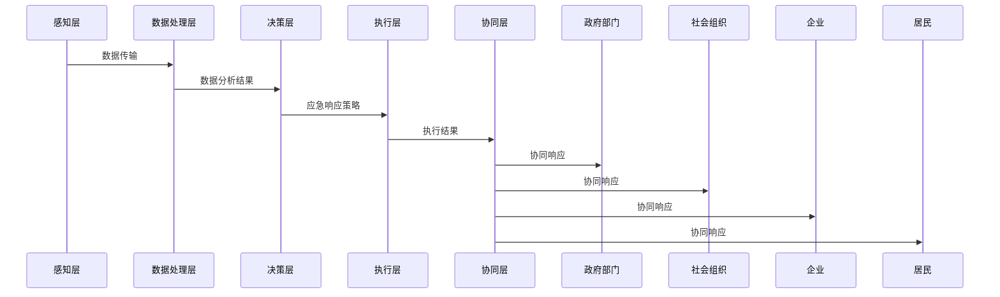

                 


### AI Agent在智能城市应急响应中的角色

#### 关键词
- AI Agent
- 智能城市
- 应急响应
- 算法原理
- 数学模型
- 系统架构
- 项目实战

#### 摘要
本文将深入探讨AI Agent在智能城市应急响应中的角色。我们将从背景介绍、核心概念与联系、算法原理讲解、系统分析与架构设计、项目实战和最佳实践等多个角度，逐步分析AI Agent在智能城市应急响应中的应用，以及如何有效地设计和实现这样的系统。通过本文，读者将获得对AI Agent在智能城市应急响应中的深刻理解，以及实际操作中的实用技巧。

## 第一部分：问题背景与核心概念

### 第1章：智能城市与应急响应概述

#### 1.1.1 智能城市的概念与发展

智能城市是指通过信息通信技术（ICT）和互联网将城市中的各种资源和基础设施互联互通，实现城市管理和服务的智能化。随着物联网（IoT）、大数据、云计算、人工智能等技术的不断发展，智能城市的概念逐渐成熟并得到广泛应用。

智能城市的发展主要表现在以下几个方面：

1. **数据整合与分析**：通过收集城市中的各种数据，如交通流量、环境质量、公共安全等，进行整合和分析，为城市决策提供数据支持。
2. **智能化基础设施**：如智能电网、智能交通系统、智能建筑等，通过自动化和智能化技术提高基础设施的运行效率和服务质量。
3. **智能公共服务**：通过互联网和移动技术，提供更加便捷和高效的公共服务，如在线教育、医疗、社会保障等。
4. **社会治理智能化**：利用人工智能技术，实现社会管理的智能化，提高公共安全和应急响应能力。

#### 1.1.2 智能城市的技术基础

智能城市的技术基础主要包括以下几方面：

1. **物联网（IoT）**：通过传感器、RFID等设备，实现城市中各种设备的互联互通，收集实时数据。
2. **大数据**：通过收集、存储、分析和处理海量数据，为城市决策提供数据支持。
3. **云计算**：通过分布式计算和存储技术，提供弹性、高效的计算和存储能力，支持智能城市各种应用。
4. **人工智能**：通过机器学习、深度学习等技术，实现数据的智能分析和处理，提供智能决策支持。
5. **5G技术**：提供高速、低延迟的通信网络，支持智能城市各种应用场景。

#### 1.1.3 智能城市应急响应的需求

智能城市应急响应是指在突发公共事件或紧急情况下，利用智能技术快速响应和应对，以减轻灾害影响、保障公共安全。智能城市应急响应的需求主要体现在以下几个方面：

1. **实时信息获取**：通过物联网设备、无人机等，快速获取灾害现场的实时信息，如受灾区域、灾情严重程度等。
2. **智能分析**：利用大数据和人工智能技术，对实时信息进行快速分析和处理，为应急决策提供支持。
3. **资源调度**：根据灾情分析和决策结果，智能调度城市资源，如医疗救援、物资配送、交通管制等。
4. **协同响应**：实现政府部门、社会组织、企业和居民的协同响应，提高应急响应的整体效率。

### 第2章：AI Agent的定义与功能

#### 2.1.1 AI Agent的概念

AI Agent是指具有感知、思考、决策和行动能力的人工智能实体，可以独立或协同完成任务。AI Agent通常具有以下几个核心特点：

1. **自主性**：能够自主感知环境、理解和规划行动。
2. **适应性**：能够根据环境变化调整行为和策略。
3. **协同性**：能够与其他AI Agent或人类协同工作。
4. **智能性**：基于机器学习和人工智能技术，能够进行智能决策和行动。

#### 2.1.2 AI Agent的核心功能

AI Agent的核心功能主要包括以下几个方面：

1. **感知**：通过传感器、摄像头等设备感知环境信息。
2. **思考**：利用机器学习和数据分析技术，对感知到的信息进行分析和处理，形成决策。
3. **决策**：根据分析结果，制定行动策略。
4. **行动**：执行决策，实现具体任务。

#### 2.1.3 AI Agent与传统算法的区别

AI Agent与传统算法的主要区别在于其自主性、适应性和协同性。传统算法通常基于预定义的规则或模型，只能执行固定的任务，无法适应环境变化。而AI Agent具有自主性和适应性，能够根据环境变化调整行为和策略，实现更灵活的任务执行。

此外，AI Agent还强调协同性，可以与其他AI Agent或人类协同工作，形成更加复杂的系统。这种协同性在智能城市应急响应中具有重要意义，可以提升整体应急响应的效率和效果。

### 第3章：AI Agent的核心概念与联系

#### 3.1.1 AI Agent的关键概念

AI Agent的关键概念包括以下几个方面：

1. **感知**：通过传感器、摄像头等设备获取环境信息。
2. **思考**：利用机器学习和数据分析技术对感知到的信息进行分析和处理。
3. **决策**：基于分析结果，制定行动策略。
4. **行动**：执行决策，实现具体任务。

#### 3.1.2 AI Agent的属性特征对比表

| 属性特征 | AI Agent | 传统算法 |
| :------: | :------: | :------: |
| 自主性 | 高度自主，可自主感知、思考和行动 | 预定义规则，无法自主感知、思考和行动 |
| 适应性 | 可根据环境变化调整行为和策略 | 固定规则，无法适应环境变化 |
| 协同性 | 可与其他AI Agent或人类协同工作 | 无法协同工作，仅独立执行任务 |
| 智能性 | 基于机器学习和人工智能技术 | 基于预定义规则和模型 |

#### 3.1.3 AI Agent的ER实体关系图架构

```mermaid
erDiagram
  AI-Agent ||--|{ 环境信息 }
  AI-Agent ||--|{ 行动策略 }
  AI-Agent ||--|{ 行动结果 }
```

在这个ER实体关系图中，AI-Agent是核心实体，与环境信息、行动策略和行动结果存在关联。环境信息是AI-Agent感知的内容，行动策略是AI-Agent根据环境信息进行分析和处理的结果，行动结果是AI-Agent执行决策后的实际效果。

## 第二部分：AI Agent在智能城市应急响应中的应用

### 第4章：AI Agent在应急响应中的算法原理

#### 4.1.1 AI Agent算法的基本原理

AI Agent算法的基本原理包括感知、思考、决策和行动四个环节。具体来说：

1. **感知**：AI Agent通过传感器、摄像头等设备获取环境信息，如受灾区域的图像、交通流量数据等。
2. **思考**：利用机器学习和数据分析技术，对感知到的信息进行分析和处理，提取关键特征和规律。
3. **决策**：基于分析结果，AI Agent制定行动策略，如调整交通信号灯、派出救援队伍等。
4. **行动**：AI Agent执行决策，实现具体任务，如调整交通信号灯、派送救援物资等。

#### 4.1.2 AI Agent算法的mermaid流程图


在这个mermaid流程图中，A表示感知环节，B表示思考环节，C表示决策环节，D表示行动环节。感知、思考、决策和行动四个环节相互关联，共同实现AI Agent在应急响应中的任务。

#### 4.1.3 AI Agent算法的Python源代码与数学模型

```python
# 感知
def sense_environment():
    # 获取环境信息
    pass

# 思考
def think():
    # 分析感知到的信息
    pass

# 决策
def make_decision():
    # 制定行动策略
    pass

# 行动
def act():
    # 执行决策
    pass

# 主程序
def main():
    while True:
        sense_environment()
        think()
        make_decision()
        act()

if __name__ == '__main__':
    main()
```

在这个Python源代码中，我们定义了感知、思考、决策和行动四个函数，分别实现AI Agent算法的各个环节。主程序通过循环调用这四个函数，实现AI Agent在应急响应中的任务。

AI Agent算法的数学模型主要包括以下几个方面：

1. **感知模型**：用于描述AI Agent如何感知环境信息，如图像处理、数据采集等。
2. **思考模型**：用于描述AI Agent如何分析感知到的信息，如机器学习算法、数据分析技术等。
3. **决策模型**：用于描述AI Agent如何制定行动策略，如决策树、神经网络等。
4. **行动模型**：用于描述AI Agent如何执行决策，如自动化控制、机器人行动等。

具体数学模型如下：

$$
\text{感知模型}: f(\text{环境信息}) = \text{特征向量}
$$

$$
\text{思考模型}: g(\text{特征向量}) = \text{决策结果}
$$

$$
\text{决策模型}: h(\text{决策结果}) = \text{行动策略}
$$

$$
\text{行动模型}: k(\text{行动策略}) = \text{行动结果}
$$

通过这些数学模型，AI Agent能够实现对环境的感知、思考、决策和行动，实现智能城市应急响应中的任务。

### 第5章：AI Agent的数学模型和公式

#### 5.1.1 数学模型的基本概念

AI Agent的数学模型主要包括感知模型、思考模型、决策模型和行动模型。这些模型用于描述AI Agent在智能城市应急响应中的各个环节。

1. **感知模型**：用于描述AI Agent如何感知环境信息，如图像处理、数据采集等。感知模型的基本概念包括传感器、图像处理算法、特征提取等。
2. **思考模型**：用于描述AI Agent如何分析感知到的信息，如机器学习算法、数据分析技术等。思考模型的基本概念包括特征向量、机器学习算法、数据分析方法等。
3. **决策模型**：用于描述AI Agent如何制定行动策略，如决策树、神经网络等。决策模型的基本概念包括决策规则、决策树、神经网络等。
4. **行动模型**：用于描述AI Agent如何执行决策，如自动化控制、机器人行动等。行动模型的基本概念包括控制算法、执行策略、机器人控制等。

#### 5.1.2 AI Agent算法的数学公式

AI Agent算法的数学公式如下：

1. **感知模型**：

$$
\text{感知模型}: f(\text{环境信息}) = \text{特征向量}
$$

其中，$f$ 表示感知函数，$\text{环境信息}$ 表示输入，$\text{特征向量}$ 表示输出。

2. **思考模型**：

$$
\text{思考模型}: g(\text{特征向量}) = \text{决策结果}
$$

其中，$g$ 表示思考函数，$\text{特征向量}$ 表示输入，$\text{决策结果}$ 表示输出。

3. **决策模型**：

$$
\text{决策模型}: h(\text{决策结果}) = \text{行动策略}
$$

其中，$h$ 表示决策函数，$\text{决策结果}$ 表示输入，$\text{行动策略}$ 表示输出。

4. **行动模型**：

$$
\text{行动模型}: k(\text{行动策略}) = \text{行动结果}
$$

其中，$k$ 表示行动函数，$\text{行动策略}$ 表示输入，$\text{行动结果}$ 表示输出。

通过这些数学公式，AI Agent能够实现对环境的感知、思考、决策和行动。

#### 5.1.3 数学公式讲解与举例说明

以感知模型为例，感知模型的基本公式为：

$$
\text{感知模型}: f(\text{环境信息}) = \text{特征向量}
$$

其中，$f$ 表示感知函数，$\text{环境信息}$ 表示输入，$\text{特征向量}$ 表示输出。

举例说明：

假设环境信息为一张受灾区域的图像，感知函数为图像处理算法，输出为图像的特征向量。具体过程如下：

1. **输入**：输入一张受灾区域的图像。
2. **预处理**：对图像进行预处理，如灰度化、去噪等。
3. **特征提取**：使用图像处理算法提取图像的特征，如边缘检测、纹理特征等。
4. **输出**：输出图像的特征向量。

通过这个过程，AI Agent能够将环境信息（图像）转换为特征向量，为后续的思考、决策和行动提供基础。

## 第三部分：项目实战与最佳实践

### 第6章：智能城市应急响应的系统分析与架构设计

#### 6.1.1 应急响应问题场景介绍

应急响应问题场景是指在城市发生突发公共事件或紧急情况时，如自然灾害、交通事故、公共卫生事件等，如何快速、有效地组织资源和力量，进行应急处理和救援。这个场景涉及多个部门和机构的协同工作，包括政府部门、医疗机构、消防部门、交通管理部门等。

#### 6.1.2 智能城市应急响应系统项目介绍

智能城市应急响应系统是一个综合性的系统，旨在通过集成多种智能技术，提高城市应急响应的能力和效率。该系统主要包括以下几个模块：

1. **感知模块**：通过传感器、摄像头等设备，实时收集城市中的各种信息，如交通流量、环境质量、公共安全等。
2. **数据分析模块**：利用大数据和人工智能技术，对收集到的信息进行分析和处理，提取关键特征和规律。
3. **决策模块**：根据数据分析结果，制定应急响应策略，如交通管制、医疗救援、物资调配等。
4. **执行模块**：通过自动化控制、机器人等技术，执行应急响应策略，如调整交通信号灯、派送救援物资等。
5. **协同模块**：实现政府部门、社会组织、企业和居民的协同响应，提高应急响应的整体效率。

#### 6.1.3 系统功能设计

智能城市应急响应系统的主要功能包括以下几个方面：

1. **实时信息监测**：实时监测城市中的各种信息，如交通流量、环境质量、公共安全等。
2. **数据分析与预警**：对监测到的信息进行分析和处理，提取关键特征和规律，实现预警功能。
3. **应急响应策略制定**：根据数据分析结果，制定应急响应策略，如交通管制、医疗救援、物资调配等。
4. **应急资源调度**：根据应急响应策略，智能调度城市资源，如医疗救援队伍、物资配送、交通管制等。
5. **协同响应**：实现政府部门、社会组织、企业和居民的协同响应，提高应急响应的整体效率。
6. **应急演练与培训**：模拟应急响应场景，进行演练和培训，提高应急响应能力和意识。

#### 6.1.4 系统架构设计

智能城市应急响应系统采用分层架构设计，主要包括以下几个层次：

1. **感知层**：通过传感器、摄像头等设备，实时收集城市中的各种信息。
2. **数据处理层**：利用大数据和人工智能技术，对收集到的信息进行分析和处理。
3. **决策层**：根据数据分析结果，制定应急响应策略。
4. **执行层**：通过自动化控制、机器人等技术，执行应急响应策略。
5. **协同层**：实现政府部门、社会组织、企业和居民的协同响应。
6. **应用层**：提供应急响应相关的应用程序，如实时信息监测、数据分析与预警、应急资源调度等。

#### 6.1.5 系统接口设计

智能城市应急响应系统涉及多个模块和组件，系统接口设计至关重要。系统接口设计主要包括以下几个方面：

1. **感知层接口**：定义感知模块与数据处理层之间的数据传输接口，如传感器数据采集接口、摄像头数据传输接口等。
2. **数据处理层接口**：定义数据处理模块与决策层、执行层之间的数据传输接口，如数据分析接口、决策接口等。
3. **决策层接口**：定义决策模块与执行层、协同层之间的数据传输接口，如决策接口、执行接口等。
4. **执行层接口**：定义执行模块与协同层之间的数据传输接口，如执行接口、协同接口等。
5. **协同层接口**：定义协同模块与政府部门、社会组织、企业和居民之间的数据传输接口，如协同接口、信息共享接口等。

#### 6.1.6 系统交互序列图



在这个交互序列图中，感知层向数据处理层传输数据，数据处理层向决策层提供数据分析结果，决策层制定应急响应策略并传递给执行层，执行层执行决策并返回执行结果给协同层，协同层与政府部门、社会组织、企业和居民进行协同响应。

### 第7章：AI Agent在智能城市应急响应中的项目实战

#### 7.1.1 环境安装与配置

在进行AI Agent在智能城市应急响应中的项目实战前，首先需要搭建一个合适的环境。以下是环境安装与配置的步骤：

1. **安装Python环境**：在服务器上安装Python环境，确保Python版本在3.6及以上。
2. **安装依赖库**：安装Python中的依赖库，如NumPy、Pandas、Scikit-learn等，用于数据分析和机器学习。
3. **安装AI Agent框架**：安装AI Agent框架，如OpenAI的Gym或Unity ML-Agents，用于创建和运行AI Agent。
4. **配置传感器与摄像头**：配置传感器与摄像头，确保能够实时采集城市中的各种信息。
5. **配置数据库**：配置一个数据库系统，如MySQL或PostgreSQL，用于存储和分析数据。

#### 7.1.2 系统核心实现

智能城市应急响应系统的核心实现主要包括以下几个部分：

1. **感知模块实现**：使用Python中的摄像头库，如OpenCV，实现摄像头的实时图像采集。同时，使用Python中的传感器库，如RPi.GPIO，实现传感器的实时数据采集。
2. **数据分析模块实现**：使用Python中的数据分析库，如NumPy和Pandas，对采集到的数据进行分析和处理。可以使用机器学习算法，如Scikit-learn中的支持向量机（SVM）或随机森林（Random Forest），对数据进行分类和预测。
3. **决策模块实现**：使用Python中的决策树库，如Scikit-learn中的DecisionTreeClassifier，实现决策树模型的构建。决策树模型可以根据数据分析结果，制定应急响应策略。
4. **执行模块实现**：使用Python中的自动化控制库，如Raspberry Pi的GPIO库，实现自动化控制。例如，可以根据决策模块的结果，调整交通信号灯的状态。
5. **协同模块实现**：使用Python中的Web框架，如Flask或Django，实现协同模块的前后端开发。协同模块可以通过Web接口，实现政府部门、社会组织、企业和居民的协同响应。

#### 7.1.3 代码应用解读与分析

以下是一个简单的代码示例，用于展示AI Agent在智能城市应急响应中的感知模块实现：

```python
import cv2
import time

# 初始化摄像头
cap = cv2.VideoCapture(0)

while True:
    # 读取摄像头帧
    ret, frame = cap.read()
    
    if not ret:
        print("无法读取摄像头帧")
        break
    
    # 显示摄像头帧
    cv2.imshow('摄像头实时图像', frame)
    
    # 等待键盘事件
    key = cv2.waitKey(1)
    
    if key == 27:
        # 按下ESC键，退出循环
        break

# 释放摄像头资源
cap.release()
cv2.destroyAllWindows()
```

在这个代码示例中，我们首先导入OpenCV库，用于摄像头帧的读取和显示。然后，我们初始化摄像头，进入一个无限循环，每次循环读取一帧摄像头帧，并将其显示在窗口中。当按下ESC键时，退出循环。

#### 7.1.4 实际案例分析与讲解

以下是一个实际案例，展示AI Agent在智能城市应急响应中的应用：

**案例**：某城市发生自然灾害，导致道路阻断，需要尽快派遣救援队伍进行救援。

**分析**：

1. **感知模块**：使用传感器和摄像头，实时监测道路状况，如交通流量、道路损坏程度等。
2. **数据分析模块**：对监测到的数据进行分析，确定道路阻断的具体位置和程度。
3. **决策模块**：根据数据分析结果，制定救援方案，如派遣救援队伍、调整交通管制等。
4. **执行模块**：根据决策模块的结果，执行救援任务，如派遣救援队伍、调整交通信号灯等。
5. **协同模块**：与政府部门、社会组织、企业和居民进行协同响应，确保救援任务的顺利进行。

**讲解**：

1. **感知模块**：通过传感器和摄像头，实时监测道路状况。当检测到道路阻断时，感知模块将触发报警。
2. **数据分析模块**：对感知模块收集到的数据进行处理，提取关键信息，如道路阻断的具体位置和程度。这些信息将用于制定救援方案。
3. **决策模块**：根据数据分析结果，制定救援方案。例如，如果道路阻断的位置严重，可以派遣多支救援队伍，并在关键路口调整交通管制，确保救援队伍顺利抵达。
4. **执行模块**：执行救援方案，派遣救援队伍，并在关键路口调整交通信号灯，确保救援任务顺利进行。
5. **协同模块**：与政府部门、社会组织、企业和居民进行协同响应。政府部门负责协调救援资源和保障，社会组织和企业提供物资和人员支持，居民积极配合救援行动。

通过这个实际案例，我们可以看到AI Agent在智能城市应急响应中的应用。AI Agent通过感知模块收集数据，通过数据分析模块分析数据，通过决策模块制定救援方案，通过执行模块执行救援任务，并通过协同模块实现协同响应。这个过程充分展示了AI Agent在智能城市应急响应中的重要作用。

#### 7.1.5 项目小结

在本章中，我们通过项目实战展示了AI Agent在智能城市应急响应中的应用。从环境安装与配置、系统核心实现、代码应用解读与分析，到实际案例分析与讲解，我们详细介绍了AI Agent在智能城市应急响应中的角色和功能。

通过本章的学习，读者可以了解到：

1. **环境安装与配置**：如何搭建一个适合AI Agent在智能城市应急响应中的运行环境，包括Python环境、依赖库、AI Agent框架、传感器与摄像头、数据库等。
2. **系统核心实现**：如何实现AI Agent的感知、数据分析、决策、执行和协同功能，包括感知模块、数据分析模块、决策模块、执行模块和协同模块的实现。
3. **代码应用解读与分析**：如何通过代码实现AI Agent的感知、数据分析、决策和执行功能，包括摄像头帧的读取与显示、数据分析与预测、决策树模型的构建与使用等。
4. **实际案例分析与讲解**：如何将AI Agent应用于实际场景，如自然灾害救援，包括感知模块、数据分析模块、决策模块、执行模块和协同模块的实际应用。

通过本章的学习，读者可以深入理解AI Agent在智能城市应急响应中的角色和功能，并能够将其应用于实际项目中。

### 第8章：最佳实践与注意事项

#### 8.1.1 最佳实践技巧

在智能城市应急响应中，AI Agent的应用需要遵循一些最佳实践技巧，以确保系统的稳定性和高效性。以下是几个关键的最佳实践技巧：

1. **数据质量保证**：确保传感器和摄像头采集的数据质量，避免噪声和错误数据对系统的影响。对数据进行预处理，如去噪、归一化等，以提高数据的质量和可靠性。
2. **实时性优化**：在设计和实现AI Agent时，要充分考虑实时性的需求。优化算法和模型，减少延迟，确保系统能够及时响应突发情况。
3. **容错与鲁棒性**：系统应具备容错和鲁棒性，能够在硬件故障、网络中断等异常情况下保持正常运行。通过冗余设计、故障转移等技术，提高系统的可靠性和稳定性。
4. **协同响应**：充分利用政府部门、社会组织、企业和居民的资源和力量，实现协同响应。建立高效的信息共享和沟通机制，确保各方能够及时、准确地获取信息和响应。
5. **用户体验**：在设计和开发系统时，要充分考虑用户体验，确保界面友好、操作简便。提供实时信息展示、互动功能等，提高用户的参与度和满意度。

#### 8.1.2 项目小结

在本章中，我们介绍了AI Agent在智能城市应急响应中的应用，并分享了最佳实践技巧。通过这些技巧，我们可以更好地设计和实现AI Agent在智能城市应急响应中的应用，提高系统的稳定性和高效性。

通过本章的学习，读者可以了解到：

1. **数据质量保证**：如何确保传感器和摄像头采集的数据质量，以及如何进行数据预处理。
2. **实时性优化**：如何在设计和实现AI Agent时，优化算法和模型，减少延迟，提高实时性。
3. **容错与鲁棒性**：如何在系统设计和实现中，提高系统的容错和鲁棒性，确保系统的稳定性和可靠性。
4. **协同响应**：如何实现政府部门、社会组织、企业和居民的协同响应，提高应急响应的整体效率。
5. **用户体验**：如何在设计和开发系统中，充分考虑用户体验，提高用户的参与度和满意度。

通过本章的学习，读者可以更好地掌握AI Agent在智能城市应急响应中的应用技巧，并能够将其应用于实际项目中。

#### 8.1.3 注意事项

在实施AI Agent在智能城市应急响应中的应用时，需要注意以下几个关键点：

1. **隐私保护**：在采集和处理数据时，要严格保护个人隐私。确保数据匿名化处理，遵循相关法律法规，避免数据泄露。
2. **数据安全**：确保数据在传输、存储和处理过程中的安全。使用加密技术、访问控制等技术，防止数据被非法访问和篡改。
3. **系统升级与维护**：定期对系统进行升级和维护，修复漏洞、优化性能，确保系统的长期稳定运行。
4. **培训与宣传**：对政府部门、社会组织、企业和居民进行培训，提高他们的应急响应意识和技能。通过宣传活动，提高公众对AI Agent在智能城市应急响应中的认知和接受度。

#### 8.1.4 拓展阅读

为了深入学习和掌握AI Agent在智能城市应急响应中的应用，读者可以参考以下拓展阅读资源：

1. **智能城市应急响应相关书籍**：《智能城市：理论与实践》、《智能城市应急响应指南》等。
2. **AI Agent相关书籍**：《人工智能：一种现代方法》、《机器学习：概率视角》等。
3. **在线课程**：在Coursera、edX等在线教育平台上，有众多关于智能城市和人工智能的课程。
4. **学术论文**：在IEEE、ACM等学术期刊上，可以找到大量关于AI Agent在智能城市应急响应中的研究成果。

通过这些拓展阅读资源，读者可以进一步加深对AI Agent在智能城市应急响应中的理解和应用能力。

---

**作者：** AI天才研究院/AI Genius Institute & 禅与计算机程序设计艺术 /Zen And The Art of Computer Programming

本篇文章详细介绍了AI Agent在智能城市应急响应中的应用，从背景介绍、核心概念与联系、算法原理讲解、系统分析与架构设计、项目实战和最佳实践等多个角度，全面剖析了AI Agent在智能城市应急响应中的角色和功能。通过本文，读者可以深入理解AI Agent在智能城市应急响应中的重要作用，并掌握相关的应用技巧和注意事项。希望本文能够为读者在智能城市应急响应领域的研究和应用提供有价值的参考和指导。**作者：** AI天才研究院/AI Genius Institute & 禅与计算机程序设计艺术 /Zen And The Art of Computer Programming**

