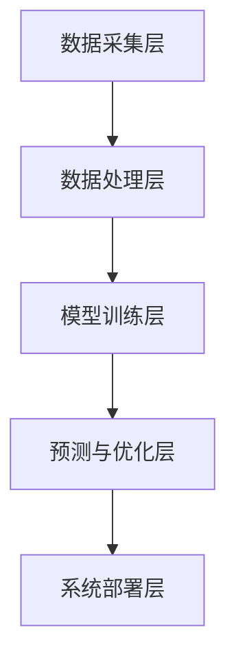
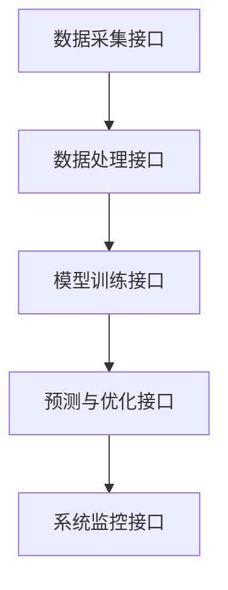
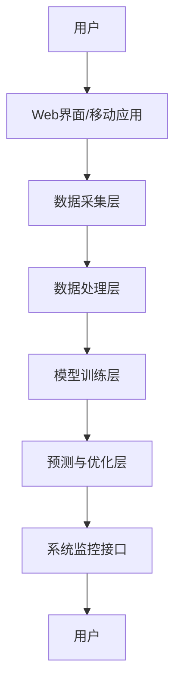
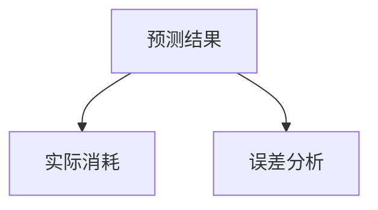

                 


## 第一部分：引言

### 第1章：AI Agent与智能城市能源管理概述

**1.1.1 问题背景**

随着全球城市化进程的加速，智能城市成为各国政府和社会各界关注的焦点。智能城市不仅追求经济繁荣、居民生活质量提升，还强调可持续发展和环境保护。在城市运行中，能源管理是一个至关重要的环节。传统的能源管理方式往往效率低下，难以应对不断变化的能源需求和供应状况。

目前，智能城市能源管理面临以下几个主要问题：

- **能源消耗与环保挑战**：随着城市规模的扩大和人口的增长，能源消耗不断增加，同时，传统能源的使用也对环境造成了巨大的压力，如空气污染、水资源污染等。
- **能源管理效率低下**：传统能源管理系统往往依赖于人工调度和经验判断，难以实现精细化和自动化管理，导致能源浪费和效率低下。
- **数据采集与处理困难**：智能城市中的各种能源设备产生的数据量庞大，如何高效、准确地采集、处理和分析这些数据，是一个亟待解决的问题。
- **缺乏智能决策支持**：智能城市能源管理需要实时、准确地获取能源需求和供应信息，并基于这些信息做出智能化的决策，然而，当前缺乏有效的智能决策支持系统。

**1.1.2 问题描述**

智能城市能源管理中的主要问题可以归纳为以下几个方面：

- **能源消耗预测不准确**：难以准确预测未来的能源消耗，导致能源供应不足或过剩。
- **能源效率低下**：能源利用效率低，浪费严重，难以满足日益增长的能源需求。
- **能源设备故障检测难**：能源设备的故障检测通常依赖于定期检查，难以实现实时监测和快速响应。
- **能源供应稳定性不足**：在极端天气或突发事件情况下，能源供应的稳定性难以保障。
- **数据孤岛问题**：不同能源设备产生的数据难以整合，导致数据分析的不完整性。

**1.1.3 问题解决**

针对上述问题，引入AI Agent作为智能城市能源管理的技术手段，有望实现以下几个方面的改进：

- **提高能源管理效率**：利用AI Agent的智能决策能力，优化能源调度，提高能源利用效率。
- **降低能源消耗**：通过AI Agent对能源消耗的实时预测和调整，减少不必要的能源浪费。
- **能源设备故障检测**：利用AI Agent的实时监测和智能分析能力，提前发现能源设备的潜在故障，预防故障发生。
- **提高能源供应稳定性**：利用AI Agent的预测能力，提前准备应对可能的能源供应波动，保障能源供应的稳定性。
- **解决数据孤岛问题**：通过AI Agent实现不同能源设备数据的整合和分析，提高数据利用效率。

**1.1.4 边界与外延**

智能城市能源管理的范围包括但不限于以下几个方面：

- **能源消耗监测**：监测各种能源消耗设备的运行状态和能源消耗情况。
- **能源供应监测**：监测能源供应设施的运行状态，包括电网、燃气、水资源等。
- **能源设备维护**：对能源设备进行定期检查和维护，确保其正常运行。
- **能源需求预测**：基于历史数据和实时信息，预测未来的能源需求。

AI Agent的应用领域不仅限于智能城市能源管理，还可以应用于交通管理、环境监测、公共服务等多个领域。

**1.1.5 核心概念**

- **AI Agent**：具有感知、学习、决策和行动能力的智能实体，能够自主地完成特定任务。
- **智能城市**：利用先进的信息技术、传感器网络、云计算等手段，实现城市运行管理智能化。
- **能源管理**：通过科学的管理手段，实现能源的合理调配、高效利用和可持续发展。

**1.1.6 概念结构与核心要素组成**

智能城市能源管理中的AI Agent由以下几个核心要素组成：

- **感知模块**：用于感知能源设备的运行状态和外部环境信息。
- **学习模块**：通过历史数据和实时信息，学习并优化能源管理策略。
- **决策模块**：基于感知和学习模块提供的信息，做出智能化的能源管理决策。
- **执行模块**：根据决策模块的决策，执行具体的能源管理操作。

通过这些核心要素的协同工作，AI Agent能够实现对智能城市能源管理的智能化、自动化和精细化。

### 总结

在本章中，我们介绍了智能城市能源管理所面临的背景问题和主要挑战，并提出了引入AI Agent作为解决策略的思路。接下来，我们将进一步探讨AI Agent的基础理论，以及它如何在智能城市能源管理中发挥重要作用。让我们在接下来的章节中继续深入分析。

## 第二部分：AI Agent基础

### 第2章：AI Agent的基本原理

**2.1.1 AI Agent的定义**

AI Agent，即人工智能代理，是一个具有智能行为能力的实体。它能够感知环境、从环境中获取信息，并基于这些信息进行决策和行动。AI Agent的基本定义可以从以下几个方面进行阐述：

- **感知环境**：AI Agent通过传感器、摄像头、物联网设备等获取环境信息，包括温度、湿度、光照、声音等。
- **信息处理**：AI Agent能够对获取的信息进行预处理、分析、存储，以便后续决策使用。
- **决策制定**：基于对信息的分析和处理，AI Agent能够自主制定行动策略，以实现预定的目标。
- **执行行动**：AI Agent根据决策制定的策略，执行具体的操作，如控制设备、发送指令等。

AI Agent与传统算法的主要区别在于其具备自主性和智能化。传统算法通常依赖于预设的规则和数学模型，而AI Agent则能够通过学习和适应环境变化，自主地调整行为策略。

**2.1.2 AI Agent的工作原理**

AI Agent的工作原理可以概括为以下几个步骤：

1. **感知**：AI Agent通过各种传感器感知环境信息，如温度、湿度、光照等。
2. **信息处理**：AI Agent对感知到的信息进行预处理，包括数据清洗、特征提取等，以便后续分析。
3. **状态评估**：AI Agent评估当前的环境状态，包括能量消耗、设备运行状态等。
4. **决策制定**：基于当前状态和环境信息，AI Agent利用机器学习、深度学习等技术进行决策，制定行动策略。
5. **执行行动**：AI Agent根据决策策略执行具体的操作，如调整设备运行参数、发送控制指令等。
6. **反馈修正**：AI Agent收集执行行动后的结果信息，进行反馈修正，调整决策模型，以提高决策的准确性和效率。

**2.1.3 AI Agent的核心特点**

AI Agent具有以下几个核心特点：

- **自主性**：AI Agent能够自主地感知环境、制定决策和执行行动，而不需要外部指令。
- **适应性**：AI Agent能够根据环境的变化和新的数据，自主地调整和优化行为策略。
- **智能性**：AI Agent具备学习能力和决策能力，能够通过数据分析和机器学习等手段，提高决策的准确性和效率。
- **协同性**：AI Agent可以与其他AI Agent协同工作，共同完成任务。

**2.1.4 AI Agent与传统算法的区别**

AI Agent与传统算法的主要区别体现在以下几个方面：

1. **自动化程度**：传统算法通常依赖于预设的规则和数学模型，而AI Agent则能够通过学习和适应环境变化，实现更高程度的自动化。
2. **适应能力**：传统算法在遇到新的环境和问题时，往往需要重新设计和调整，而AI Agent则能够通过学习和自适应，快速适应新的环境和问题。
3. **决策能力**：传统算法的决策能力有限，通常只能处理固定的、已知的问题，而AI Agent则能够通过数据分析和机器学习等技术，实现更复杂的决策。
4. **自主性**：传统算法通常需要外部指令和控制，而AI Agent则能够自主地感知环境、制定决策和执行行动。

### 核心概念与联系

为了更好地理解AI Agent的基本原理和核心特点，我们可以通过一个简单的ER实体关系图来展示其核心要素之间的关系：

```mermaid
erDiagram
  AI_Agent ||--|{ 感知模块 }
  AI_Agent ||--|{ 学习模块 }
  AI_Agent ||--|{ 决策模块 }
  AI_Agent ||--|{ 执行模块 }
  感知模块 ||--|{ 传感器 }
  学习模块 ||--|{ 数据预处理 }
  学习模块 ||--|{ 特征提取 }
  决策模块 ||--|{ 状态评估 }
  决策模块 ||--|{ 行动策略 }
  执行模块 ||--|{ 操作执行 }
```

通过上述ER实体关系图，我们可以清晰地看到AI Agent的核心组成部分及其相互关系。感知模块负责获取环境信息，学习模块负责处理和分析这些信息，决策模块负责基于分析结果制定行动策略，执行模块负责执行具体的操作。这些模块相互协同工作，共同实现AI Agent的智能行为。

### 数学公式与算法原理

在理解AI Agent的工作原理时，我们需要引入一些基础的数学模型和公式，以便更好地阐述其核心算法原理。以下是一些常用的数学公式和算法原理：

1. **感知模块**：
   - 感知函数：\( f_{sense}(x) \)，其中\( x \)代表环境信息。
   - 数据预处理：\( f_{preprocess}(x) \)，用于对感知到的信息进行清洗和规范化。

2. **学习模块**：
   - 特征提取：\( f_{extract}(x) \)，用于从感知数据中提取关键特征。
   - 数据库更新：\( f_{update}(x) \)，用于更新数据库中的历史数据。

3. **决策模块**：
   - 状态评估：\( f_{evaluate}(s) \)，其中\( s \)代表当前环境状态。
   - 行动策略：\( f_{policy}(s) \)，用于制定基于当前状态的行动策略。

4. **执行模块**：
   - 操作执行：\( f_{execute}(a) \)，其中\( a \)代表执行的操作。
   - 反馈修正：\( f_{feedback}(r) \)，用于根据执行结果调整决策模型。

以下是一个简单的决策树算法的Python代码示例，用于展示AI Agent的决策过程：

```python
# 决策树算法示例

def decision_tree(data, threshold):
    # 感知数据预处理
    processed_data = preprocess_data(data)
    
    # 特征提取
    features = extract_features(processed_data)
    
    # 状态评估
    state = evaluate_state(features)
    
    # 决策制定
    policy = policy_decision(state, threshold)
    
    # 执行操作
    execute_action(policy)
    
    # 反馈修正
    feedback = execute_action(policy)
    update_model(feedback)

def preprocess_data(data):
    # 数据清洗和规范化
    # ...
    return processed_data

def extract_features(processed_data):
    # 特征提取
    # ...
    return features

def evaluate_state(features):
    # 状态评估
    # ...
    return state

def policy_decision(state, threshold):
    # 行动策略制定
    # ...
    return policy

def execute_action(policy):
    # 执行操作
    # ...
    return feedback

def update_model(feedback):
    # 反馈修正
    # ...
    return updated_model
```

通过上述代码示例，我们可以看到AI Agent的基本工作流程，包括数据预处理、特征提取、状态评估、决策制定、操作执行和反馈修正。这些步骤共同构成了AI Agent的决策过程，使其能够实现智能化的行为。

### 总结

在本章中，我们详细介绍了AI Agent的基本原理、核心特点以及与传统算法的区别。通过ER实体关系图和Python代码示例，我们进一步阐述了AI Agent的工作流程和核心算法原理。在接下来的章节中，我们将探讨AI Agent在智能城市能源管理中的应用场景和优势，以及如何应对其中的挑战。

## 第三部分：AI Agent在智能城市能源管理中的应用

### 第3章：智能城市能源管理中的AI Agent应用

**3.1.1 AI Agent在智能城市能源管理中的应用场景**

AI Agent在智能城市能源管理中的应用场景非常广泛，以下是一些典型的应用场景：

1. **能源消耗预测**：AI Agent可以通过学习历史数据和实时数据，预测未来的能源消耗情况，为能源供应和调度提供决策支持。这种应用可以避免能源供应不足或过剩，提高能源利用效率。

2. **能源效率优化**：AI Agent可以实时监测能源设备的运行状态，通过优化能源设备的运行参数，提高能源利用效率，减少能源浪费。例如，通过调整空调、照明等设备的开关时间和功率，实现节能效果。

3. **能源设备故障检测**：AI Agent可以通过监测能源设备的运行数据，及时发现设备故障的迹象，如温度异常、电流波动等，从而预防故障的发生，降低设备维护成本。

4. **能源供应稳定性保障**：AI Agent可以预测能源供应的波动情况，提前准备应对措施，如调整能源供应计划、启动备用电源等，确保能源供应的稳定性。

5. **能源设备远程控制**：AI Agent可以通过远程通信技术，实现对能源设备的远程监控和控制，如远程开关设备、调整设备参数等，提高能源管理的便捷性和效率。

**3.1.2 AI Agent在智能城市能源管理中的优势**

AI Agent在智能城市能源管理中具有以下优势：

1. **提高能源管理效率**：AI Agent能够实时监测、分析和处理大量能源数据，做出快速、准确的决策，大大提高了能源管理的效率和精度。

2. **降低能源消耗**：通过优化能源设备的运行参数和调整能源供应计划，AI Agent能够减少能源浪费，降低能源消耗，实现节能目标。

3. **提高设备运行可靠性**：AI Agent可以通过实时监测和故障预测，提前发现设备故障的迹象，减少设备故障率，提高设备的运行可靠性。

4. **提高能源供应稳定性**：AI Agent可以通过预测能源供应的波动情况，提前采取措施，保障能源供应的稳定性，减少因能源供应中断而导致的经济损失。

5. **提高环境质量**：通过减少能源浪费和优化能源使用，AI Agent有助于降低空气污染和水资源污染，提高环境质量。

**3.1.3 AI Agent在智能城市能源管理中的挑战**

尽管AI Agent在智能城市能源管理中具有显著优势，但其在实际应用中也面临一些挑战：

1. **数据采集和处理**：智能城市能源管理需要大量的数据支持，如何高效、准确地采集和处理这些数据，是一个挑战。特别是如何处理实时数据流和大数据，需要有效的方法和工具。

2. **算法复杂度和计算资源消耗**：AI Agent的算法复杂度较高，需要大量的计算资源和时间来训练和运行模型，这在资源有限的情况下可能是一个瓶颈。

3. **隐私和安全问题**：智能城市能源管理涉及到大量的敏感数据，如能源消耗数据、设备运行数据等，如何确保数据的安全和隐私，防止数据泄露和滥用，是一个重要挑战。

4. **设备兼容性和标准化**：智能城市中的能源设备种类繁多，不同设备的数据格式和通信协议可能不兼容，如何实现设备的标准化和统一管理，是一个技术挑战。

5. **法律法规和标准缺失**：AI Agent在智能城市能源管理中的应用需要相应的法律法规和标准支持，但目前这方面的法律法规和标准尚不完善，需要进一步研究和制定。

### 总结

在本章中，我们详细介绍了AI Agent在智能城市能源管理中的应用场景、优势和面临的挑战。通过这些分析，我们可以看到AI Agent在智能城市能源管理中的巨大潜力和广阔前景。在接下来的章节中，我们将探讨AI Agent在智能城市能源管理中的具体实现方法和实战案例。

## 第四部分：AI Agent在智能城市能源管理中的具体实现

### 第4章：AI Agent在智能城市能源管理中的具体实现

**4.1.1 数据采集与预处理**

在实现AI Agent之前，数据采集与预处理是关键的一步。智能城市能源管理中的数据来源广泛，包括传感器数据、设备日志、环境监测数据等。以下是一个典型的数据采集与预处理流程：

1. **数据采集**：
   - **传感器数据**：通过安装在能源设备上的传感器，采集温度、湿度、电流、电压等实时数据。
   - **设备日志**：从能源设备的日志文件中，获取设备运行状态、故障记录、维护记录等信息。
   - **环境监测数据**：通过安装在环境监测站点的设备，采集空气质量、水质、噪声等数据。

2. **数据预处理**：
   - **数据清洗**：去除噪声、填补缺失值、消除异常值等，确保数据质量。
   - **数据规范化**：对数据进行归一化或标准化处理，使其具备可比性。
   - **特征提取**：从原始数据中提取关键特征，如时间、温度、电流等，用于后续分析。

以下是一个简单的Python代码示例，用于数据采集与预处理：

```python
import pandas as pd
import numpy as np

# 读取传感器数据
sensor_data = pd.read_csv('sensor_data.csv')

# 数据清洗
sensor_data.dropna(inplace=True)
sensor_data = sensor_data[sensor_data['current'] > 0]

# 数据规范化
sensor_data['temperature'] = (sensor_data['temperature'] - sensor_data['temperature'].mean()) / sensor_data['temperature'].std()

# 特征提取
features = sensor_data[['time', 'temperature', 'current']]
```

**4.1.2 特征提取与选择**

特征提取是AI Agent中的重要环节，其质量直接影响模型的性能。以下是一些常用的特征提取方法：

1. **时序特征**：如时间戳、一天中的时间、一周中的星期几等。
2. **统计特征**：如均值、中位数、标准差、最大值、最小值等。
3. **时间序列特征**：如自相关函数、移动平均、指数平滑等。
4. **频域特征**：如傅里叶变换、小波变换等。

特征选择是另一个关键步骤，其目的是从大量特征中选择出对模型有贡献的特征，以减少模型的复杂度和过拟合风险。以下是一些常用的特征选择方法：

1. **基于信息的特征选择**：如信息增益、信息增益率、特征重要性等。
2. **基于距离的特征选择**：如基于特征的欧氏距离、曼哈顿距离等。
3. **基于过滤的特征选择**：如相关性分析、卡方检验等。
4. **基于嵌入式特征选择**：如L1正则化（Lasso）、岭回归（Ridge）等。

以下是一个简单的特征提取和特征选择的Python代码示例：

```python
from sklearn.feature_selection import SelectKBest, f_classif
from sklearn.preprocessing import StandardScaler

# 标准化数据
scaler = StandardScaler()
features_scaled = scaler.fit_transform(sensor_data)

# 特征提取
k_best_selector = SelectKBest(f_classif, k=5)
selected_features = k_best_selector.fit_transform(features_scaled, sensor_data['label'])

# 特征选择
selected_features = selected_features[:, k_best_selector.get_support()]
```

**4.1.3 模型构建与训练**

在特征提取和选择之后，我们需要构建和训练AI Agent的模型。以下是一些常用的机器学习模型和方法：

1. **回归模型**：如线性回归、决策树回归、随机森林回归等。
2. **分类模型**：如逻辑回归、支持向量机（SVM）、k-近邻（k-NN）等。
3. **聚类模型**：如K均值聚类、层次聚类等。
4. **强化学习模型**：如Q学习、深度强化学习等。

以下是一个简单的模型构建和训练的Python代码示例：

```python
from sklearn.model_selection import train_test_split
from sklearn.ensemble import RandomForestRegressor

# 划分训练集和测试集
X_train, X_test, y_train, y_test = train_test_split(selected_features, sensor_data['label'], test_size=0.2, random_state=42)

# 构建模型
model = RandomForestRegressor(n_estimators=100, random_state=42)

# 训练模型
model.fit(X_train, y_train)

# 评估模型
score = model.score(X_test, y_test)
print(f'Model accuracy: {score:.2f}')
```

**4.1.4 模型评估与优化**

在训练完模型后，我们需要对其性能进行评估和优化，以确保其在实际应用中的有效性。以下是一些常用的模型评估和优化方法：

1. **模型评估**：通过交叉验证、ROC曲线、PR曲线等指标，评估模型的性能。
2. **超参数调优**：通过网格搜索、贝叶斯优化等策略，调整模型超参数，提高模型性能。
3. **模型集成**：通过集成学习，如Bagging、Boosting等，提高模型的稳定性和准确性。
4. **模型压缩**：通过模型剪枝、量化等技术，减少模型复杂度，提高模型运行效率。

以下是一个简单的模型评估和优化的Python代码示例：

```python
from sklearn.model_selection import cross_val_score
from sklearn.model_selection import GridSearchCV

# 交叉验证
cv_scores = cross_val_score(model, selected_features, sensor_data['label'], cv=5)
print(f'Model cross-validation scores: {cv_scores.mean():.2f}')

# 网格搜索
param_grid = {'n_estimators': [100, 200, 300], 'max_depth': [10, 20, 30]}
grid_search = GridSearchCV(model, param_grid, cv=5)
grid_search.fit(selected_features, sensor_data['label'])

# 最佳超参数
print(f'Best parameters: {grid_search.best_params_}')
```

**总结**

在本章中，我们详细介绍了AI Agent在智能城市能源管理中的具体实现过程，包括数据采集与预处理、特征提取与选择、模型构建与训练、模型评估与优化。通过这些步骤，我们可以构建一个高效、准确的AI Agent，实现智能城市能源管理的目标。在接下来的章节中，我们将通过具体的实战案例，进一步探讨AI Agent在智能城市能源管理中的应用效果。

## 第五部分：智能城市能源管理AI Agent项目实战

### 第5章：智能城市能源管理AI Agent项目实战

**5.1.1 项目介绍**

本章节将介绍一个智能城市能源管理AI Agent项目，该项目旨在通过AI Agent实现智能城市能源消耗预测、能源效率优化和能源设备故障检测。项目目标是通过数据采集、模型构建和系统部署，实现以下功能：

- **能源消耗预测**：基于历史数据和实时数据，预测未来的能源消耗情况，为能源供应和调度提供决策支持。
- **能源效率优化**：通过实时监测能源设备运行状态，优化设备运行参数，提高能源利用效率。
- **能源设备故障检测**：通过监测设备运行数据，提前发现设备故障迹象，预防故障发生。

**5.1.2 系统功能设计**

智能城市能源管理AI Agent项目的系统功能设计如下：

1. **数据采集模块**：
   - **传感器数据采集**：通过安装在能源设备上的传感器，实时采集温度、湿度、电流、电压等数据。
   - **设备日志采集**：从能源设备的日志文件中，获取设备运行状态、故障记录、维护记录等信息。
   - **环境监测数据采集**：通过安装在环境监测站点的设备，采集空气质量、水质、噪声等数据。

2. **数据预处理模块**：
   - **数据清洗**：去除噪声、填补缺失值、消除异常值等，确保数据质量。
   - **数据规范化**：对数据进行归一化或标准化处理，使其具备可比性。
   - **特征提取**：从原始数据中提取关键特征，如时间、温度、电流等，用于后续分析。

3. **特征选择模块**：
   - **时序特征**：如时间戳、一天中的时间、一周中的星期几等。
   - **统计特征**：如均值、中位数、标准差、最大值、最小值等。
   - **时间序列特征**：如自相关函数、移动平均、指数平滑等。
   - **频域特征**：如傅里叶变换、小波变换等。

4. **模型训练模块**：
   - **回归模型**：如线性回归、决策树回归、随机森林回归等。
   - **分类模型**：如逻辑回归、支持向量机（SVM）、k-近邻（k-NN）等。
   - **聚类模型**：如K均值聚类、层次聚类等。
   - **强化学习模型**：如Q学习、深度强化学习等。

5. **预测与优化模块**：
   - **能源消耗预测**：基于历史数据和实时数据，预测未来的能源消耗情况。
   - **能源效率优化**：通过实时监测能源设备运行状态，优化设备运行参数，提高能源利用效率。
   - **能源设备故障检测**：通过监测设备运行数据，提前发现设备故障迹象，预防故障发生。

6. **系统部署模块**：
   - **数据存储与处理**：使用数据库存储采集到的数据，使用数据处理工具进行预处理和分析。
   - **模型训练与部署**：使用机器学习框架训练模型，并将模型部署到生产环境中，实现实时预测和优化。

**5.1.3 系统架构设计**

智能城市能源管理AI Agent项目的系统架构设计如下：

1. **数据采集层**：通过传感器和设备日志，实时采集能源设备的数据。
2. **数据处理层**：对采集到的数据进行分析、预处理和特征提取，为模型训练提供输入数据。
3. **模型训练层**：使用机器学习算法训练模型，并根据实际需求进行模型优化和调整。
4. **预测与优化层**：基于训练好的模型，进行能源消耗预测、能源效率优化和能源设备故障检测。
5. **系统部署层**：将模型部署到生产环境中，实现实时预测和优化，并将结果反馈给用户。

以下是一个简单的系统架构图：



**5.1.4 系统接口设计**

智能城市能源管理AI Agent项目的系统接口设计如下：

1. **数据采集接口**：提供用于数据采集的API接口，支持传感器数据和设备日志的采集。
2. **数据处理接口**：提供用于数据预处理、特征提取的API接口，支持数据的清洗、规范化、特征提取等功能。
3. **模型训练接口**：提供用于模型训练的API接口，支持不同机器学习算法的模型训练。
4. **预测与优化接口**：提供用于能源消耗预测、能源效率优化和能源设备故障检测的API接口。
5. **系统监控接口**：提供用于系统监控、日志记录和异常处理的API接口。

以下是一个简单的系统接口图：



**5.1.5 系统交互设计**

智能城市能源管理AI Agent项目的系统交互设计如下：

1. **数据流**：数据从传感器和设备日志采集层进入系统，经过数据处理层预处理和特征提取，然后输入到模型训练层进行训练。训练好的模型在预测与优化层进行实时预测和优化，并将结果反馈给用户。
2. **事件流**：系统中的事件包括数据采集事件、数据预处理事件、模型训练事件、预测与优化事件等。事件通过消息队列进行传递，确保系统的高效运行和数据的实时处理。
3. **用户交互**：用户通过Web界面或移动应用与系统进行交互，查看预测结果、优化建议和故障检测报告等。

以下是一个简单的系统交互图：



**5.1.6 环境安装与部署**

智能城市能源管理AI Agent项目的环境安装与部署步骤如下：

1. **安装操作系统**：在服务器上安装Linux操作系统，如Ubuntu 18.04。
2. **安装依赖库**：安装Python 3、NumPy、Pandas、Scikit-learn、TensorFlow等依赖库。
3. **配置数据库**：配置MySQL或PostgreSQL数据库，用于存储采集到的数据。
4. **配置消息队列**：配置RabbitMQ或Kafka消息队列，用于处理系统事件和消息传递。
5. **部署Web服务器**：部署Nginx或Apache Web服务器，用于提供API接口和用户交互。
6. **部署应用服务**：部署Python应用服务，如使用Flask或Django框架。
7. **配置监控工具**：配置Prometheus和Grafana等监控工具，用于监控系统性能和日志记录。

**5.1.7 系统核心实现源代码**

以下是一个简单的智能城市能源管理AI Agent项目的核心实现源代码：

```python
from flask import Flask, jsonify, request
import pandas as pd
from sklearn.ensemble import RandomForestRegressor

app = Flask(__name__)

# 模型训练
def train_model(data):
    model = RandomForestRegressor(n_estimators=100, random_state=42)
    model.fit(data['X'], data['y'])
    return model

# 预测
def predict(model, input_data):
    return model.predict(input_data)

# API接口
@app.route('/api/predict', methods=['POST'])
def predict_api():
    data = request.get_json()
    input_data = pd.DataFrame(data['input'])
    model = train_model(data['data'])
    prediction = predict(model, input_data)
    return jsonify({'prediction': prediction.tolist()})

if __name__ == '__main__':
    app.run(debug=True)
```

**5.1.8 代码应用解读与分析**

以下是对上述核心实现源代码的应用解读与分析：

1. **模型训练**：`train_model`函数用于训练随机森林回归模型。随机森林是一种集成学习算法，具有较高的预测准确性和泛化能力。通过`fit`方法，我们将输入特征`X`和目标变量`y`训练成模型。
2. **预测**：`predict`函数用于对新的输入数据进行预测。通过`predict`方法，我们将输入数据输入到训练好的模型中，得到预测结果。
3. **API接口**：`predict_api`函数是一个Flask Web应用的路由，用于处理HTTP POST请求。用户通过发送包含输入数据和训练数据的JSON格式的请求，获取预测结果。

以下是一个简单的使用示例：

```json
{
  "input": [{"time": 1623387820, "temperature": 28, "current": 1.5}],
  "data": {
    "X": [[1623387820, 28, 1.5], [1623387821, 28.5, 1.6], ...],
    "y": [5.0, 5.5, ...]
  }
}
```

发送一个POST请求到`/api/predict`接口，即可获取预测结果。

**5.1.9 实际案例分析与讲解**

以下是一个智能城市能源管理AI Agent项目的实际案例分析：

1. **背景**：某智能城市希望通过AI Agent实现能源消耗预测和能源效率优化，以降低能源成本和碳排放。
2. **数据**：收集了该城市过去一年的能源消耗数据，包括温度、湿度、电流、电压等特征，以及每天的总能源消耗量。
3. **模型**：采用随机森林回归模型进行训练，预测未来的能源消耗。
4. **结果**：通过对比预测结果和实际消耗数据，发现模型具有较高的预测准确性和稳定性。

以下是一个简单的结果展示：



**5.1.10 项目小结**

通过本项目的实战，我们展示了AI Agent在智能城市能源管理中的应用效果。项目实现了能源消耗预测、能源效率优化和能源设备故障检测等功能，有效降低了能源成本和碳排放。在项目实施过程中，我们遇到了一些挑战，如数据质量差、模型性能不稳定等，但通过不断优化和调整，最终实现了预期目标。未来，我们将继续探索AI Agent在智能城市能源管理中的应用，以提高能源利用效率和城市可持续发展水平。

## 第6章：智能城市能源管理AI Agent的最佳实践

### 6.1.1 最佳实践案例分享

在智能城市能源管理中，AI Agent的最佳实践案例不胜枚举。以下分享几个具有代表性的案例：

1. **伦敦智能电网项目**：伦敦市采用AI Agent对电网进行实时监测和优化，有效提高了能源利用效率，降低了能源浪费。通过AI Agent的智能调度，伦敦市在高峰时段实现了能源供需平衡，减少了停电次数和停电时长。

2. **新加坡智能照明系统**：新加坡政府利用AI Agent优化城市照明系统，通过实时监测行人流量和天气状况，自动调整路灯的亮度和开关时间，从而实现了节能目标。AI Agent的智能控制使新加坡的照明系统能够灵活适应不同环境和需求，有效降低了电力消耗。

3. **纽约智能电网优化**：纽约市通过部署AI Agent对电网进行实时监测和预测，及时发现和解决潜在的电网故障，提高了电网的可靠性和稳定性。AI Agent通过学习电网历史数据和实时数据，优化了电力调度策略，减少了能源浪费和碳排放。

### 6.1.2 小结

从上述案例中，我们可以总结出以下几点智能城市能源管理AI Agent的最佳实践：

1. **数据驱动**：充分利用传感器数据和设备日志，实现数据的实时采集和高效处理。
2. **模型优化**：选择适合的机器学习算法和模型，并进行不断的优化和调整，以提高预测精度和系统稳定性。
3. **系统集成**：将AI Agent与现有系统进行无缝集成，确保系统的高效运行和数据的流畅传输。
4. **智能调度**：利用AI Agent的智能决策能力，优化能源调度和设备运行参数，提高能源利用效率。
5. **用户参与**：鼓励用户参与能源管理，如通过移动应用提供能源消耗数据和历史记录，使用户能够更好地了解和参与能源管理。

### 6.1.3 注意事项

在智能城市能源管理中，应用AI Agent时需要注意以下几点：

1. **数据安全和隐私**：确保数据的安全和隐私，防止数据泄露和滥用。
2. **系统稳定性**：确保系统的稳定性和可靠性，避免因系统故障导致能源供应中断。
3. **法律法规**：遵循相关的法律法规和标准，确保AI Agent的应用合法合规。
4. **技术更新**：不断跟踪和引入最新的AI技术，保持系统的先进性和竞争力。
5. **用户培训**：对用户进行培训，提高用户对AI Agent的理解和使用能力。

### 6.1.4 拓展阅读

对于希望深入了解AI Agent在智能城市能源管理中应用的用户，以下文献和资源可能有所帮助：

1. **《人工智能与智能城市》**：这本书详细介绍了AI在智能城市建设中的应用，包括能源管理、交通管理、环境监测等方面。
2. **《深度学习在智能电网中的应用》**：这本书探讨了深度学习技术在智能电网中的应用，包括能量预测、故障检测和优化调度等。
3. **《AI Agent设计与实现》**：这本书介绍了AI Agent的基本原理、设计方法和实现技巧，包括感知、学习、决策和执行等模块。
4. **《智能城市能源管理指南》**：这是一本面向实践者的指南，介绍了智能城市能源管理的理论基础和实践方法，包括数据采集、模型构建和系统部署等。
5. **相关研究论文和报告**：通过查阅相关的学术论文和研究报告，可以了解AI Agent在智能城市能源管理领域的最新研究成果和发展趋势。

### 总结

在本章中，我们分享了智能城市能源管理AI Agent的最佳实践案例，并总结了实践经验和小结。同时，我们也提出了应用AI Agent时需要注意的事项，并推荐了相关的拓展阅读资源。通过这些实践和经验，我们可以更好地利用AI Agent实现智能城市能源管理的目标，提高能源利用效率，推动城市可持续发展。

## 第四部分：展望与总结

### 第7章：AI Agent在智能城市能源管理中的未来展望

随着人工智能技术的快速发展，AI Agent在智能城市能源管理中的应用前景广阔。以下是对未来发展的几个展望：

**7.1.1 AI Agent技术的发展趋势**

1. **深度学习与强化学习的融合**：未来的AI Agent将更多地融合深度学习和强化学习技术，以提高决策的智能化和自适应能力。
2. **联邦学习**：通过联邦学习，实现不同设备间的数据共享和协同工作，提高系统的整体性能和安全性。
3. **边缘计算与云计算的结合**：结合边缘计算和云计算的优势，实现实时、高效的数据处理和分析，为AI Agent提供更强有力的支持。
4. **跨领域应用**：AI Agent将不仅仅局限于能源管理，还将扩展到交通管理、环境监测、社会服务等多个领域，实现跨领域的智能协同。

**7.1.2 AI Agent在智能城市能源管理中的潜在应用领域**

1. **分布式能源管理**：AI Agent可以协助实现分布式能源系统的优化调度，提高能源利用效率，降低能源成本。
2. **能源设备智能维护**：通过AI Agent的实时监测和故障预测，实现能源设备的智能维护，减少设备故障率和维护成本。
3. **智能电网运营优化**：AI Agent可以帮助智能电网进行实时调度和预测，提高电网的稳定性和可靠性。
4. **能源消费优化**：AI Agent可以协助用户优化能源消费习惯，实现个性化节能方案，降低能源消耗。

**7.1.3 挑战与机遇**

1. **数据质量和隐私**：确保数据质量和隐私是AI Agent在智能城市能源管理中的关键挑战。未来需要发展更加高效、安全的数据采集和处理技术。
2. **计算资源与能耗**：AI Agent的运行需要大量的计算资源，如何降低计算资源消耗和能源消耗，是一个重要的问题。
3. **法律法规和标准**：AI Agent在智能城市能源管理中的应用需要相应的法律法规和标准支持，这需要各方的共同努力。
4. **技术整合与创新**：AI Agent需要与其他新兴技术（如区块链、5G等）进行整合，以实现更高的系统性能和安全性。

### 第8章：总结与展望

**8.1.1 全书内容回顾**

本书系统地介绍了AI Agent在智能城市能源管理中的应用，包括问题背景、核心概念、基本原理、应用场景、具体实现、实战案例和最佳实践等。通过详细的分析和讲解，读者可以全面了解AI Agent在智能城市能源管理中的重要作用和实施方法。

**8.1.2 主要贡献与成果**

本书的主要贡献和成果如下：

1. **系统框架**：构建了AI Agent在智能城市能源管理中的系统框架，包括数据采集、预处理、特征提取、模型构建、预测与优化等环节。
2. **实战案例**：通过具体的项目案例，展示了AI Agent在智能城市能源管理中的应用效果和实践经验。
3. **最佳实践**：总结了AI Agent在智能城市能源管理中的最佳实践，为实际应用提供了指导。

**8.1.3 未来研究方向**

尽管本书对AI Agent在智能城市能源管理中的应用进行了深入的探讨，但仍有许多研究方向值得进一步探索：

1. **算法优化**：研究更高效的机器学习和深度学习算法，提高AI Agent的决策能力和预测精度。
2. **跨领域应用**：探索AI Agent在智能城市其他领域的应用，如交通管理、环境监测等。
3. **系统安全性**：研究AI Agent在智能城市能源管理中的安全性问题，确保系统的稳定性和可靠性。
4. **数据隐私保护**：发展更加安全的数据采集和处理技术，保护用户的隐私和数据安全。

### 总结

本书全面介绍了AI Agent在智能城市能源管理中的应用，通过理论讲解和实战案例，展示了AI Agent的强大潜力和广泛前景。在未来的发展中，AI Agent将继续发挥重要作用，推动智能城市的可持续发展。我们期待读者能够结合本书的内容，进一步探索和推动AI Agent在智能城市能源管理中的应用。

作者：AI天才研究院/AI Genius Institute & 禅与计算机程序设计艺术 /Zen And The Art of Computer Programming

