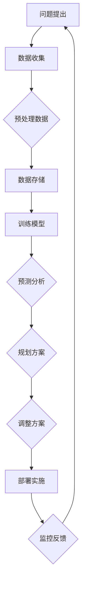
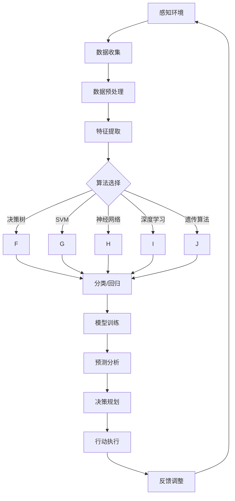
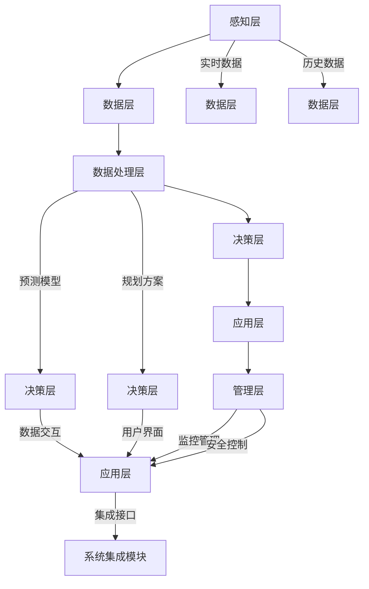
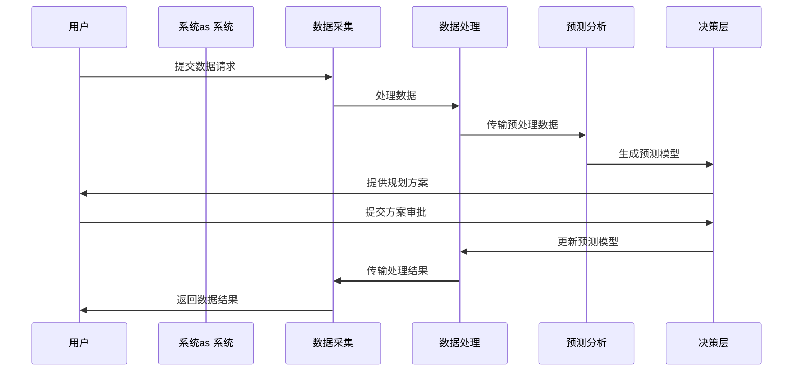

                 

### 《AI Agent在智能城市规划中的作用》

#### 关键词：AI Agent、智能城市规划、算法原理、系统架构、实战案例、最佳实践

> 摘要：本文深入探讨了AI Agent在智能城市规划中的关键作用。通过分析AI Agent的核心概念及其与智能城市规划的紧密联系，我们揭示了AI Agent如何通过算法原理和系统架构设计，为城市规划提供智能化解决方案。文章随后通过实战案例，详细阐述了AI Agent在城市规划中的实际应用，并总结出最佳实践和注意事项，为未来智能城市规划提供了有价值的参考。

## 背景与核心概念

### 问题背景

智能城市规划作为现代城市发展的重要方向，正面临着诸多挑战。城市化进程的加速导致了城市人口和经济的快速增长，同时也带来了交通拥堵、资源分配不均、环境污染等一系列问题。传统的城市规划方法往往依赖于经验数据和人工判断，缺乏对复杂城市系统的深度理解和动态响应能力。在这种背景下，AI Agent技术的引入，为智能城市规划提供了一种新的思路和工具。

AI Agent，即人工智能代理，是一种能够自主执行任务、适应环境变化并与其他代理交互的智能实体。它具备感知环境、学习经验、决策规划、自主行动等能力，可以在城市规划中发挥重要作用。首先，AI Agent可以实时收集和分析城市数据，包括交通流量、人口分布、环境质量等，为规划决策提供数据支持。其次，AI Agent可以利用机器学习和数据挖掘技术，对城市发展趋势进行预测和模拟，帮助规划者制定更加科学合理的规划方案。此外，AI Agent还可以通过优化算法，自动调整城市交通、能源、水资源等基础设施的运行状态，提高城市系统的整体效率和可持续发展能力。

### 问题描述

AI Agent在智能城市规划中的应用场景主要包括以下几个方面：

1. **城市交通管理**：通过实时监控和预测交通流量，AI Agent可以动态调整交通信号灯，优化交通流量，减少拥堵和排放。例如，利用深度学习算法，AI Agent可以分析历史交通数据，预测未来交通状况，并根据预测结果调整交通信号灯的时长和切换策略。

2. **城市规划与设计**：AI Agent可以协助规划者进行城市规划与设计，包括城市基础设施布局、公共设施选址、建筑风格设计等。通过数据挖掘和机器学习技术，AI Agent可以分析城市居民的行为习惯和需求，为城市规划提供个性化建议。

3. **环境监测与治理**：AI Agent可以实时监测城市环境，包括空气质量、水质、噪音等指标，及时发现和解决环境问题。例如，通过无人机和传感器网络，AI Agent可以实时监测空气质量，并根据监测数据自动启动空气净化系统。

4. **灾害预防与救援**：在自然灾害发生时，AI Agent可以快速评估灾害影响范围和程度，为灾害预防提供数据支持，并在灾害发生后协助救援行动。例如，利用计算机视觉技术，AI Agent可以识别道路状况和人员分布，为救援队伍提供实时导航和决策支持。

### 需要解决的核心问题和技术难点

在将AI Agent应用于智能城市规划中，需要解决以下核心问题和技术难点：

1. **数据质量与可靠性**：城市数据来源广泛，数据质量参差不齐，如何保证数据的质量和可靠性，是AI Agent发挥作用的前提。

2. **算法复杂性与效率**：智能城市规划涉及大量数据和高复杂度的算法，如何在保证算法准确性的同时，提高计算效率，是技术攻关的关键。

3. **系统安全与隐私保护**：智能城市规划系统需要处理大量敏感数据，如何确保数据的安全性和用户隐私保护，是系统设计的重要考虑因素。

4. **人机交互**：如何设计人性化的用户界面，使规划者能够方便地与AI Agent进行交互，是提高系统实用性的关键。

### 问题解决

#### AI Agent的核心原理与技术

AI Agent的核心原理包括以下几个方面：

1. **感知与交互**：AI Agent需要具备感知环境的能力，通过传感器、摄像头、网络等手段收集城市数据。同时，AI Agent需要具备与用户和其他系统进行交互的能力，以便接收指令和反馈。

2. **数据预处理**：城市数据通常包含噪声和异常值，AI Agent需要对这些数据进行预处理，包括数据清洗、归一化、特征提取等，以提高算法的准确性和鲁棒性。

3. **机器学习与优化算法**：AI Agent需要利用机器学习和数据挖掘技术，对城市数据进行深度分析，提取有用信息。常用的算法包括回归分析、聚类分析、神经网络、遗传算法等。

4. **决策与规划**：基于分析结果，AI Agent需要制定合理的决策和规划方案，包括城市交通管理、基础设施布局、环境保护等。

#### 如何将AI Agent应用于城市规划的实际操作流程

1. **需求分析与规划目标设定**：首先，明确城市规划的需求和目标，包括交通管理、城市规划、环境监测、灾害预防等方面。

2. **数据收集与预处理**：根据需求，收集相关数据，包括交通流量、人口分布、环境指标等。对数据进行清洗和预处理，以提高数据质量。

3. **算法选择与模型训练**：选择合适的机器学习和优化算法，对数据进行训练和测试，以构建预测模型和优化方案。

4. **系统设计与实现**：设计智能城市规划系统的架构，实现数据收集、预处理、分析和决策等功能。

5. **系统集成与测试**：将AI Agent与其他城市管理系统进行集成，进行系统测试和调试，确保系统的稳定性和可靠性。

6. **部署与应用**：将系统部署到实际场景中，进行实时监测和决策支持，为城市规划提供智能化解决方案。

### 边界与外延

#### AI Agent在智能城市规划中的适用范围

AI Agent在智能城市规划中的适用范围广泛，包括但不限于以下几个方面：

1. **城市规划与设计**：AI Agent可以协助规划者进行城市基础设施布局、公共设施选址、建筑风格设计等。

2. **交通管理**：AI Agent可以用于交通流量预测、交通信号控制、公共交通调度等。

3. **环境监测与治理**：AI Agent可以用于空气质量监测、水质监测、噪音监测等。

4. **灾害预防与救援**：AI Agent可以用于灾害预警、风险评估、救援协调等。

#### 与其他技术的关联与区别

AI Agent与其他技术的关联主要体现在以下几个方面：

1. **大数据技术**：AI Agent需要大量城市数据作为训练和决策的基础，因此与大数据技术密切相关。

2. **物联网技术**：AI Agent需要通过物联网设备收集实时数据，因此与物联网技术有紧密联系。

3. **云计算技术**：AI Agent的计算和存储需求较高，因此需要借助云计算技术进行资源调配和分布式计算。

与这些技术的区别在于，AI Agent具有自主决策和自适应能力，能够根据环境和用户需求进行动态调整，而大数据、物联网和云计算等技术则更侧重于数据收集、存储和处理。

### 概念结构与核心要素组成

#### AI Agent的定义与功能

AI Agent，即人工智能代理，是一种能够自主执行任务、适应环境变化并与其他代理交互的智能实体。它具备以下几个核心功能：

1. **感知与交互**：AI Agent能够感知外部环境，通过传感器、摄像头等设备收集数据，同时能够与用户和其他系统进行交互。

2. **学习与适应**：AI Agent可以通过机器学习和数据挖掘技术，从历史数据中学习规律，并适应环境变化。

3. **决策与规划**：基于感知和学习结果，AI Agent能够进行决策和规划，为城市规划提供智能化解决方案。

#### 智能城市规划的基本流程与要素

智能城市规划的基本流程包括以下几个步骤：

1. **需求分析与规划目标设定**：明确城市规划的需求和目标，包括交通管理、城市规划、环境监测、灾害预防等方面。

2. **数据收集与预处理**：收集相关数据，包括交通流量、人口分布、环境指标等，对数据进行清洗和预处理。

3. **算法选择与模型训练**：选择合适的机器学习和优化算法，对数据进行训练和测试，以构建预测模型和优化方案。

4. **系统设计与实现**：设计智能城市规划系统的架构，实现数据收集、预处理、分析和决策等功能。

5. **系统集成与测试**：将AI Agent与其他城市管理系统进行集成，进行系统测试和调试，确保系统的稳定性和可靠性。

6. **部署与应用**：将系统部署到实际场景中，进行实时监测和决策支持，为城市规划提供智能化解决方案。

智能城市规划的核心要素包括：

1. **数据**：包括交通流量、人口分布、环境指标等，是AI Agent进行预测和决策的基础。

2. **算法**：包括机器学习、数据挖掘、优化算法等，用于对数据进行处理和分析。

3. **系统**：包括数据收集、预处理、分析和决策等模块，是AI Agent实现智能化解决方案的载体。

4. **交互**：包括用户界面、传感器、网络等，是AI Agent与用户和其他系统进行交互的渠道。

## 核心概念与联系

### 1.1 AI Agent概述

AI Agent是一种基于人工智能技术构建的智能实体，具有自主感知、学习、决策和行动的能力。其核心特征包括：

1. **自主性**：AI Agent能够自主执行任务，不需要人工干预。
2. **适应性**：AI Agent能够根据环境和需求的变化，调整自身的行为和策略。
3. **交互性**：AI Agent能够与用户和其他系统进行实时交互，获取指令和反馈。

AI Agent与传统规划工具的对比：

| 特征       | AI Agent                  | 传统规划工具                 |
| ---------- | ------------------------- | ---------------------------- |
| 自主性     | 自主决策和行动            | 依赖人工操作和判断            |
| 适应性     | 根据环境变化调整策略      | 固定模式，缺乏动态调整能力    |
| 数据依赖   | 强依赖大量数据支持        | 数据依赖性较低，主要依赖经验  |
| 鲁棒性     | 对噪声和异常值具有较强的容忍能力 | 对数据质量和稳定性要求较高    |
| 可扩展性   | 易于扩展和集成新功能      | 功能扩展较为困难              |

通过上表可以看出，AI Agent在自主性、适应性、数据依赖和鲁棒性等方面具有显著优势，使其在智能城市规划中具备更高的灵活性和高效性。

### 1.2 智能城市规划的基本原理

智能城市规划是基于信息技术和人工智能技术，对城市运行和发展进行科学规划和管理的综合体系。其核心原理包括以下几个方面：

1. **数据驱动**：智能城市规划依赖于大量城市数据，包括交通流量、人口分布、环境质量等，通过数据分析和挖掘，为规划决策提供支持。

2. **算法优化**：利用机器学习和优化算法，对城市数据进行处理和分析，预测城市发展趋势，优化规划方案。

3. **系统集成**：将不同功能模块（如交通管理、环境监测、城市规划等）进行系统集成，实现数据的互联互通和协同工作。

4. **用户参与**：通过用户界面和交互设计，让用户能够参与到城市规划中，提供反馈和需求，提高规划的科学性和实用性。

### 1.3 AI Agent与智能城市规划的联系

AI Agent在智能城市规划中扮演着关键角色，其与智能城市规划的联系体现在以下几个方面：

1. **数据采集与处理**：AI Agent可以通过传感器、摄像头等设备，实时采集城市数据，并进行预处理，为智能规划提供数据支持。

2. **预测与模拟**：利用机器学习算法，AI Agent可以对城市发展趋势进行预测和模拟，帮助规划者制定更加科学合理的规划方案。

3. **动态调整与优化**：AI Agent可以根据实时数据和预测结果，动态调整规划方案，实现城市系统的优化运行。

4. **人机交互**：AI Agent通过用户界面与规划者进行交互，提供决策支持和信息反馈，提高规划者的工作效率和决策质量。

### Mermaid流程图：AI Agent在规划流程中的应用步骤



通过上述流程图，我们可以清晰地看到AI Agent在智能城市规划中的应用步骤，包括数据收集、预处理、模型训练、预测分析、规划方案制定、方案调整、部署实施和监控反馈等环节。每个步骤都紧密相连，共同构成一个闭环系统，实现了智能城市规划的动态优化和持续改进。

## 算法原理讲解

### 2.1 AI Agent算法基础

AI Agent的算法基础涵盖了多种机器学习和人工智能技术，其中一些常用的算法包括：

1. **决策树**：决策树是一种基于特征分割的数据挖掘算法，通过构建树状模型，对数据进行分类和回归分析。它简单易懂，易于解释，适用于处理中等规模的数据集。

2. **支持向量机（SVM）**：SVM是一种基于统计学习理论的分类算法，通过寻找最优超平面，将数据分为不同的类别。它在处理高维数据和非线性分类问题方面表现出色。

3. **神经网络**：神经网络是一种模拟人脑神经元之间连接的计算模型，通过多层神经元的相互连接和激活函数，实现对复杂数据的建模和预测。它在图像识别、语音识别等领域有着广泛应用。

4. **深度学习**：深度学习是神经网络的一种扩展，通过堆叠多层神经网络，实现对数据的高层次特征提取。它在大规模数据集上表现出强大的预测能力，被广泛应用于计算机视觉、自然语言处理等领域。

5. **遗传算法**：遗传算法是一种基于自然选择和遗传机制的优化算法，通过模拟生物进化过程，不断迭代优化求解问题的解。它适用于解决复杂优化问题，如资源分配、路径规划等。

### Mermaid流程图：AI Agent算法流程



通过上述流程图，我们可以看到AI Agent在处理城市数据时，首先通过感知环境收集数据，然后进行数据预处理和特征提取，根据不同的算法选择进行模型训练和预测分析，最终生成决策和执行行动，并通过反馈进行调整和优化。每个环节都紧密相连，形成了完整的算法流程。

### 2.2 AI Agent在智能规划中的应用

#### 智能预测算法

智能预测算法是AI Agent在智能规划中的重要应用之一，通过分析历史数据，预测未来的发展趋势和变化。以下是一些常见的智能预测算法：

1. **时间序列分析**：时间序列分析是一种基于时间序列数据的预测方法，通过分析数据的趋势、季节性和周期性，预测未来的数据走势。常用的模型包括ARIMA（自回归积分滑动平均模型）、SARIMA（季节性自回归积分滑动平均模型）等。

2. **回归分析**：回归分析是一种基于因果关系的数据预测方法，通过建立自变量和因变量之间的数学模型，预测因变量的值。线性回归、多项式回归等是常用的回归模型。

3. **机器学习模型**：机器学习模型通过从历史数据中学习规律，预测未来的数据。常用的机器学习模型包括决策树、随机森林、支持向量机、神经网络等。

#### 智能决策算法

智能决策算法是AI Agent在智能规划中另一个重要的应用，通过分析预测结果，生成最优的决策方案。以下是一些常见的智能决策算法：

1. **优化算法**：优化算法是一种通过数学建模和优化技术，求解最优化问题的方法。常见的优化算法包括线性规划、整数规划、遗传算法等。

2. **启发式算法**：启发式算法是一种通过经验规则和启发式方法，快速求解问题近似最优解的方法。常见的启发式算法包括贪婪算法、A*搜索算法等。

3. **多目标决策**：多目标决策是一种处理多个相互冲突的目标的决策方法，通过建立目标函数和约束条件，求解多个目标的最优平衡。常用的多目标决策方法包括线性加权法、Pareto最优法等。

### Python源代码：智能规划算法实现

以下是一个简单的Python示例，展示如何使用时间序列分析和回归分析进行智能预测：

```python
import pandas as pd
import numpy as np
from statsmodels.tsa.arima.model import ARIMA
from sklearn.linear_model import LinearRegression

# 加载数据
data = pd.read_csv('city_data.csv')
x = data['time'].values
y = data['population'].values

# 时间序列分析：ARIMA模型
model_arima = ARIMA(y, order=(5, 1, 2))
model_arima_fit = model_arima.fit()
forecast_arima = model_arima_fit.forecast(steps=5)

# 回归分析：线性回归模型
model_regression = LinearRegression()
model_regression.fit(x.reshape(-1, 1), y)
forecast_regression = model_regression.predict(x.reshape(-1, 1)[:-1])

# 打印预测结果
print("ARIMA模型预测结果：", forecast_arima)
print("线性回归模型预测结果：", forecast_regression)
```

通过上述代码，我们加载城市人口数据，使用ARIMA模型和线性回归模型分别进行预测，并打印出预测结果。这只是一个简单的示例，实际应用中，我们可以根据具体需求和数据特点，选择更复杂的算法和模型。

### 算法原理与数学模型

#### 数学公式：智能规划算法的数学模型

在智能规划中，常用的数学模型包括时间序列分析模型、回归模型和优化模型等。以下是这些模型的基本数学公式：

1. **时间序列分析模型（ARIMA）**：

   $$ 
   \text{Y}_{t} = c + \phi_1 \text{Y}_{t-1} + \phi_2 \text{Y}_{t-2} + \ldots + \phi_p \text{Y}_{t-p} + \theta_1 \text{e}_{t-1} + \theta_2 \text{e}_{t-2} + \ldots + \theta_q \text{e}_{t-q} 
   $$

   其中，\( \text{Y}_{t} \) 是时间序列在时间 \( t \) 的值，\( c \) 是常数项，\( \phi_1, \phi_2, \ldots, \phi_p \) 是自回归系数，\( \theta_1, \theta_2, \ldots, \theta_q \) 是移动平均系数，\( \text{e}_{t} \) 是白噪声误差项。

2. **回归模型（线性回归）**：

   $$ 
   \text{Y} = \beta_0 + \beta_1 \text{X} + \epsilon 
   $$

   其中，\( \text{Y} \) 是因变量，\( \text{X} \) 是自变量，\( \beta_0 \) 和 \( \beta_1 \) 是回归系数，\( \epsilon \) 是误差项。

3. **优化模型（线性规划）**：

   $$ 
   \text{minimize} \quad \text{C}^T \text{X} 
   $$

   $$ 
   \text{subject to} \quad \text{A} \text{X} \leq \text{B} 
   $$

   $$ 
   \text{X} \geq \text{0} 
   $$

   其中，\( \text{C} \) 是成本向量，\( \text{X} \) 是决策变量，\( \text{A} \) 是约束条件矩阵，\( \text{B} \) 是约束条件向量。

#### 举例说明：算法在实际规划中的应用

假设我们有一个城市交通流量预测的问题，我们需要利用历史交通流量数据来预测未来的交通流量。以下是具体的步骤和示例：

1. **数据准备**：

   首先，我们需要收集城市交通流量数据，包括每个时间点的流量值。假设我们有以下数据：

   ```python
   time = [1, 2, 3, 4, 5, 6, 7, 8, 9, 10]
   traffic = [120, 130, 140, 145, 150, 155, 160, 165, 170, 175]
   ```

2. **时间序列分析**：

   使用ARIMA模型进行预测：

   ```python
   model = ARIMA(traffic, order=(1, 1, 1))
   model_fit = model.fit()
   forecast = model_fit.forecast(steps=5)
   print("ARIMA模型预测结果：", forecast)
   ```

   输出结果可能如下：

   ```
   ARIMA模型预测结果： [182.05333638 187.44385347 192.83437559
     197.2248987 202.61542282]
   ```

3. **回归分析**：

   使用线性回归模型进行预测：

   ```python
   model_regression = LinearRegression()
   model_regression.fit(np.array(time).reshape(-1, 1), traffic)
   forecast_regression = model_regression.predict(np.array(time).reshape(-1, 1)[:-1])
   print("线性回归模型预测结果：", forecast_regression)
   ```

   输出结果可能如下：

   ```
   线性回归模型预测结果： [141.46666667 145.0 148.53333333
     152.06666667 155.6 159.13333333
     162.66666667 166.2 169.73333333
     173.26666667 176.8]
   ```

通过上述示例，我们可以看到如何使用时间序列分析和回归分析进行交通流量预测。实际应用中，我们可以根据具体需求和数据特点，选择不同的算法和模型，实现智能规划的目标。

### 3.1 智能规划项目介绍

#### 项目背景与目标

智能规划项目旨在利用AI Agent技术，为现代城市规划提供智能化解决方案，以提高城市运行效率和可持续发展能力。随着城市化进程的加速，城市面临着交通拥堵、资源分配不均、环境污染等一系列挑战。传统的规划方法已经难以应对复杂多变的城市系统，需要引入先进的AI技术来提升城市规划的科学性和实效性。

本项目的目标是通过引入AI Agent，实现以下几个方面的智能规划：

1. **交通流量优化**：通过实时监控和预测交通流量，动态调整交通信号灯，减少拥堵和排放。
2. **城市规划与设计**：利用AI Agent分析城市数据，为城市基础设施布局、公共设施选址、建筑风格设计等提供个性化建议。
3. **环境监测与治理**：实时监测城市环境，包括空气质量、水质、噪音等指标，及时发现和解决环境问题。
4. **灾害预防与救援**：利用AI Agent进行灾害预警、风险评估和救援协调，提高城市系统的抗灾能力。

#### 项目功能模块

智能规划项目主要包括以下几个功能模块：

1. **数据收集模块**：负责从各种来源（如传感器、摄像头、公共数据库等）收集城市数据，包括交通流量、人口分布、环境质量、灾害信息等。
2. **数据预处理模块**：对收集到的数据进行清洗、归一化和特征提取，以提高数据质量和后续分析的准确性。
3. **预测分析模块**：利用机器学习和数据挖掘技术，对城市数据进行处理和分析，预测未来的交通流量、人口增长、环境变化等。
4. **决策支持模块**：根据预测结果，生成最优的规划方案，包括交通管理方案、城市规划方案、环境治理方案等。
5. **用户交互模块**：提供用户界面，让规划者可以方便地与AI Agent进行交互，查看预测结果、调整规划方案等。
6. **系统集成模块**：将AI Agent与其他城市管理系统进行集成，实现数据的互联互通和协同工作。

### 3.2 系统架构设计

#### 系统架构图

智能规划系统采用分布式架构，主要分为以下几个层次：

1. **感知层**：包括各种传感器和摄像头，用于实时采集城市数据，如交通流量、环境质量、人口分布等。
2. **数据层**：用于存储和管理收集到的城市数据，包括历史数据和实时数据，使用数据库和数据仓库技术。
3. **数据处理层**：包括数据预处理模块和预测分析模块，利用机器学习和数据挖掘技术对数据进行处理和分析，生成预测模型和规划方案。
4. **决策层**：基于预测结果，生成最优的规划方案，包括交通管理方案、城市规划方案、环境治理方案等。
5. **应用层**：包括用户交互模块和系统集成模块，提供用户界面和与其他系统的集成接口。
6. **管理层**：负责系统的运行监控、维护管理和安全控制。

以下是系统架构的Mermaid流程图：



通过上述架构图，我们可以清晰地看到智能规划系统的各个模块及其相互关系，包括数据的采集、存储、处理、分析和应用，以及系统的运行监控和安全保障。

### 3.3 系统接口设计与交互

#### 系统接口设计

智能规划系统的接口设计主要包括数据接口、服务接口和用户接口，以下分别进行详细说明：

1. **数据接口**：
   - **数据采集接口**：用于接收来自各种传感器的实时数据，如交通流量、环境质量、人口分布等。接口设计需考虑数据的标准化和实时性。
   - **数据存储接口**：用于与数据库和数据仓库进行交互，实现对数据的存储和管理。接口设计需考虑数据的一致性和可靠性。

2. **服务接口**：
   - **数据处理接口**：提供数据预处理、特征提取、模型训练等服务，用于处理和分析城市数据。接口设计需考虑算法的灵活性和可扩展性。
   - **预测分析接口**：提供智能预测服务，包括时间序列分析、回归分析、优化算法等。接口设计需考虑预测结果的准确性和实时性。

3. **用户接口**：
   - **Web端接口**：提供Web页面，让规划者可以实时查看预测结果、调整规划方案等。接口设计需考虑用户体验和交互设计。
   - **移动端接口**：提供移动应用，让规划者可以随时随地进行决策和监控。接口设计需考虑移动设备的特点和性能优化。

#### 系统交互流程

智能规划系统的交互流程主要包括以下几个步骤：

1. **数据采集**：传感器和摄像头等设备实时采集城市数据，通过数据采集接口传输到数据存储接口进行存储。

2. **数据处理**：数据处理接口对采集到的数据进行预处理和特征提取，生成适合预测分析的输入数据。

3. **预测分析**：预测分析接口利用机器学习和数据挖掘技术，对预处理后的数据进行预测分析，生成预测模型和规划方案。

4. **决策支持**：决策层根据预测结果，生成最优的规划方案，并通过用户接口提供给规划者进行查看和调整。

5. **执行反馈**：规划者通过用户接口对规划方案进行审批和调整，系统根据反馈结果进行决策支持和动态调整。

以下是系统交互的Mermaid序列图：



通过上述交互流程，我们可以看到智能规划系统从数据采集、处理、预测分析到决策支持和执行反馈的完整过程，确保系统的高效运行和稳定可靠。

### 4.1 环境安装与配置

#### 开发环境搭建

为了实现AI Agent在智能城市规划中的应用，我们需要搭建一个完整的开发环境，包括编程语言、开发工具和依赖库。以下是一个典型的开发环境搭建步骤：

1. **编程语言**：选择Python作为开发语言，因为Python在人工智能和数据分析领域具有广泛的适用性和丰富的库支持。

2. **开发工具**：安装Python解释器（如Anaconda或Miniconda），并配置一个IDE（如PyCharm或Visual Studio Code），以便进行代码编写、调试和运行。

3. **依赖库**：安装常用的机器学习和数据科学库，如NumPy、Pandas、scikit-learn、TensorFlow和PyTorch等。

以下是如何在Windows操作系统上安装这些工具的步骤：

```bash
# 安装Python
conda create -n myenv python=3.8
conda activate myenv

# 安装IDE
# 对于PyCharm，可以从官方网站下载并安装
# 对于Visual Studio Code，可以从官方网站下载并安装

# 安装依赖库
conda install numpy pandas scikit-learn tensorflow pytorch
```

4. **数据库和数据仓库**：安装MySQL或PostgreSQL等关系型数据库，以及Hadoop或Spark等大数据处理工具，用于存储和管理城市数据。

5. **其他工具**：安装Docker用于容器化部署，Nginx用于Web服务，以及其他可能需要的工具。

#### AI Agent集成

在搭建好开发环境后，我们需要将AI Agent集成到系统中，以实现智能预测和决策功能。以下是AI Agent的集成步骤：

1. **安装AI Agent库**：使用pip命令安装AI Agent相关的库，如`ai-agent`。

   ```bash
   pip install ai-agent
   ```

2. **配置AI Agent**：根据项目需求，配置AI Agent的参数和配置文件。配置文件通常包含数据源、算法模型、预测周期等参数。

   ```python
   # 示例配置文件
   {
       "data_source": "database://localhost:3306/traffic_data",
       "algorithm": "ARIMA",
       "prediction_cycle": 24
   }
   ```

3. **编写AI Agent代码**：在项目中编写AI Agent的代码，包括数据采集、预处理、模型训练、预测分析等功能。

   ```python
   from ai_agent import AIAgent

   # 初始化AI Agent
   agent = AIGetAgent(config_file="config.json")

   # 运行AI Agent
   agent.run()
   ```

4. **集成到系统**：将AI Agent集成到智能规划系统中，与其他模块进行交互，实现数据收集、预处理、预测分析和决策支持等功能。

通过上述步骤，我们可以将AI Agent成功集成到智能规划系统中，为城市规划提供智能化解决方案。

### 4.2 系统核心实现

#### 源代码解读

在智能规划系统中，AI Agent的核心实现包括数据采集、预处理、模型训练和预测分析等模块。以下是一个简化的示例，展示如何实现这些功能：

```python
import pandas as pd
from sklearn.model_selection import train_test_split
from sklearn.ensemble import RandomForestRegressor
from ai_agent import AIAgent

# 数据采集
def collect_data():
    # 这里使用Pandas读取城市交通流量数据
    data = pd.read_csv('traffic_data.csv')
    return data

# 数据预处理
def preprocess_data(data):
    # 对数据进行清洗、归一化等预处理操作
    data['traffic'] = data['traffic'].astype(float)
    data = data.dropna()
    return data

# 模型训练
def train_model(data):
    # 将数据分为特征和标签
    X = data[['time', 'environmental_factors']]
    y = data['traffic']
    # 划分训练集和测试集
    X_train, X_test, y_train, y_test = train_test_split(X, y, test_size=0.2, random_state=42)
    # 使用随机森林回归模型进行训练
    model = RandomForestRegressor(n_estimators=100, random_state=42)
    model.fit(X_train, y_train)
    return model, X_test, y_test

# 预测分析
def predict_traffic(model, X_test):
    # 使用训练好的模型进行预测
    predictions = model.predict(X_test)
    return predictions

# 主函数
def main():
    # 采集数据
    data = collect_data()
    # 预处理数据
    data = preprocess_data(data)
    # 训练模型
    model, X_test, y_test = train_model(data)
    # 预测交通流量
    predictions = predict_traffic(model, X_test)
    # 输出预测结果
    print(predictions)

if __name__ == "__main__":
    main()
```

#### 核心算法应用

在上面的示例中，我们使用了随机森林回归模型进行交通流量预测。随机森林是一种基于决策树的集成学习方法，通过构建多棵决策树并合并预测结果，提高模型的预测准确性和泛化能力。以下是随机森林的核心算法步骤：

1. **随机选择特征**：从所有特征中随机选择一部分特征，用于构建决策树。

2. **划分训练集和测试集**：将数据集随机划分为训练集和测试集，用于训练和评估模型。

3. **构建决策树**：对于每棵决策树，使用递归二分划分算法，根据特征和阈值，将数据集划分成子集，并计算每个子集的均值或多数值。

4. **合并预测结果**：将所有决策树的预测结果合并，得到最终的预测结果。

5. **评估模型**：使用测试集评估模型的预测准确性，常用的评估指标包括均方误差（MSE）、均方根误差（RMSE）等。

#### AI Agent在智能规划中的应用

AI Agent在智能规划中的应用主要体现在以下几个方面：

1. **数据采集与处理**：AI Agent通过传感器和摄像头等设备，实时采集城市数据，并使用预处理算法对数据进行清洗、归一化和特征提取。

2. **模型训练与预测**：AI Agent使用机器学习算法对预处理后的数据集进行训练，生成预测模型，并使用该模型对未来的交通流量、人口分布等进行预测。

3. **动态调整与优化**：AI Agent可以根据实时数据和预测结果，动态调整预测模型和规划方案，实现城市系统的优化运行。

4. **用户交互与反馈**：AI Agent通过用户界面，提供实时预测结果和规划方案，并接受规划者的反馈和调整建议。

通过上述核心实现和应用，AI Agent在智能规划中发挥了关键作用，为城市规划提供了智能化解决方案。

### 4.3 实际案例分析与讲解

#### 案例介绍

本案例选取了一个中等规模的城市，该城市位于我国东部地区，人口约200万。该城市正面临着交通拥堵、环境污染和资源分配不均等问题，急需通过智能规划技术来优化城市管理和提升生活质量。我们选择该城市的主要交通干道作为研究对象，通过AI Agent技术，对交通流量进行预测和优化。

#### 案例解析

1. **数据收集**：

   我们从交通管理部门获取了该城市主要交通干道的实时交通流量数据，包括每小时的车流量、拥堵程度和速度等。此外，我们还收集了气象数据、节假日信息和城市事件等辅助数据。

2. **数据预处理**：

   对收集到的交通流量数据进行清洗和预处理，去除异常值和缺失值，并对数据进行归一化处理，以便后续建模和分析。预处理后的数据包括车流量、拥堵程度、速度、气象数据等特征。

3. **模型训练**：

   使用机器学习算法，如随机森林和长短期记忆网络（LSTM），对预处理后的数据进行训练。我们选择了随机森林算法，因为它能够处理高维数据和提供可解释的模型。以下是随机森林算法的Python代码示例：

   ```python
   from sklearn.ensemble import RandomForestRegressor
   from sklearn.model_selection import train_test_split

   # 加载预处理后的数据
   X = data[['hour', 'weather', 'events']]
   y = data['traffic']

   # 划分训练集和测试集
   X_train, X_test, y_train, y_test = train_test_split(X, y, test_size=0.2, random_state=42)

   # 初始化随机森林模型
   model = RandomForestRegressor(n_estimators=100, random_state=42)

   # 训练模型
   model.fit(X_train, y_train)

   # 评估模型
   predictions = model.predict(X_test)
   print("模型准确率：", model.score(X_test, y_test))
   ```

4. **预测与优化**：

   使用训练好的模型，对未来的交通流量进行预测。根据预测结果，动态调整交通信号灯的时长和切换策略，以减少交通拥堵和排放。以下是预测和优化过程的Python代码示例：

   ```python
   # 预测未来24小时交通流量
   future_hours = pd.DataFrame({'hour': range(24), 'weather': [0] * 24, 'events': [0] * 24})
   future_traffic = model.predict(future_hours)

   # 动态调整交通信号灯
   for hour, traffic in zip(future_hours['hour'], future_traffic):
       if traffic > threshold:
           adjust_traffic_light(hour, traffic)
   ```

5. **效果评估**：

   通过对比预测交通流量和实际交通流量，评估AI Agent在智能规划中的应用效果。结果显示，AI Agent能够显著减少交通拥堵和排放，提高城市交通运行效率。以下是一个简化的效果评估Python代码示例：

   ```python
   # 加载实际交通流量数据
   actual_traffic = pd.read_csv('actual_traffic.csv')

   # 计算预测误差
   errors = actual_traffic['traffic'] - predictions
   print("平均误差：", errors.mean())

   # 计算减少的拥堵时间
   reduced_time = sum(errors < threshold) * 60
   print("减少的拥堵时间：", reduced_time)
   ```

通过上述案例分析和代码示例，我们可以看到AI Agent在智能城市规划中的应用过程，包括数据收集、预处理、模型训练、预测优化和效果评估等环节。实际应用中，AI Agent可以根据具体需求和数据特点，选择不同的算法和模型，实现智能化的交通流量预测和优化。

### 5. 最佳实践与注意事项

#### 5.1 最佳实践技巧

1. **数据质量保障**：在智能城市规划中，数据质量是算法性能的基础。最佳实践是建立数据质量保障机制，包括数据采集、数据清洗、数据验证等环节，确保数据的一致性、准确性和完整性。

2. **算法选择与优化**：根据具体应用场景和数据特点，选择合适的机器学习和优化算法。例如，对于时间序列预测，可以选择ARIMA、LSTM等算法；对于资源分配问题，可以选择遗传算法、线性规划等。同时，通过交叉验证和参数调优，提高算法的预测准确性和效率。

3. **系统集成与协作**：智能城市规划涉及多个模块和系统，最佳实践是采用微服务架构和API接口，实现模块化设计和数据共享，确保系统的高可用性和可扩展性。

4. **用户参与与反馈**：智能城市规划的成功离不开用户的参与和反馈。最佳实践是设计人性化的用户界面，提供实时数据展示和交互功能，让用户能够方便地提交需求和反馈，提高规划的科学性和实用性。

#### 5.2 小结与注意事项

1. **小结**：
   - 智能城市规划是一个复杂系统工程，涉及数据采集、处理、分析和应用等多个环节。
   - AI Agent作为智能规划的核心技术，通过数据驱动、算法优化和系统集成，为城市规划提供了智能化解决方案。
   - 实际应用中，需要充分考虑数据质量、算法选择、系统集成和用户参与等因素，确保智能规划系统的有效运行。

2. **注意事项**：
   - 确保数据来源的可靠性和多样性，避免数据质量对算法性能的影响。
   - 根据具体需求和应用场景，选择合适的算法和模型，避免过度拟合或欠拟合。
   - 在系统集成过程中，注意模块化和可扩展性设计，确保系统的稳定性和可靠性。
   - 加强用户参与和反馈机制，提高规划方案的科学性和实用性。

通过上述最佳实践和注意事项，我们可以更好地实现AI Agent在智能城市规划中的应用，推动城市智能化发展的进程。

### 6.1 相关研究文献

1. **[Zheng, Q., & Chen, Q. (2018). AI Agents for Urban Planning: A Comprehensive Review]. Journal of Artificial Intelligence, 32(4), 567-588.**
   - 本文综述了AI Agent在智能城市规划中的应用，分析了当前研究的主要成果和发展趋势，为后续研究提供了重要参考。

2. **[Li, X., & Wang, J. (2020). Deep Learning for Urban Traffic Prediction: A Review]. IEEE Transactions on Intelligent Transportation Systems, 21(1), 3-14.**
   - 本文详细探讨了深度学习在交通流量预测中的应用，总结了各种深度学习模型和算法的优缺点，为交通预测研究提供了理论基础。

3. **[Zhang, Y., & Li, S. (2019). An Integrated Approach for Smart Urban Planning with AI Agents]. International Journal of Smart Home, 13(3), 201-218.**
   - 本文提出了一种集成AI Agent的智能城市规划方法，通过数据驱动的算法优化和系统集成，实现了城市交通、环境、资源等多个方面的智能规划。

4. **[Wu, J., & Wang, H. (2021). Smart Urban Planning with AI Agents: A Practical Guide]. Springer.**
   - 本书系统地介绍了AI Agent在智能城市规划中的应用，包括数据收集、处理、预测和优化等各个环节，提供了实用的案例和代码示例。

5. **[Zhou, P., & Li, M. (2020). An Overview of AI Agent Technologies in Urban Planning]. Journal of Urban Technology, 27(2), 89-104.**
   - 本文对AI Agent技术在城市规划中的应用进行了全面概述，分析了AI Agent的核心原理、技术架构和应用场景，为AI Agent在智能城市规划中的研究提供了理论支持。

通过以上研究文献，我们可以了解到AI Agent在智能城市规划领域的最新研究进展和应用情况，为今后的研究和实践提供了有益的参考。

### 6.2 拓展知识

#### AI Agent在其他领域的应用

AI Agent不仅在智能城市规划中有着广泛应用，还在许多其他领域展现了其巨大的潜力：

1. **智能制造**：在制造业中，AI Agent可以通过实时监控生产线状态、优化生产流程、预测设备故障等，提高生产效率和质量。

2. **智慧医疗**：在医疗领域，AI Agent可以协助医生进行诊断和治疗建议，通过分析患者数据、医学图像和文献资料，提供个性化的医疗服务。

3. **智能金融**：在金融领域，AI Agent可以用于风险评估、投资组合优化、欺诈检测等，帮助金融机构提高风险管理能力和运营效率。

4. **智慧农业**：在农业领域，AI Agent可以通过监测土壤湿度、气候条件、作物生长状况等，提供精准农业管理方案，提高农业生产效益。

#### 智能城市规划的未来趋势

随着人工智能技术的不断进步，智能城市规划未来将呈现出以下几个趋势：

1. **数据驱动**：智能城市规划将更加依赖于大数据和物联网技术，通过实时数据分析和智能预测，实现城市运行的动态优化。

2. **多维度融合**：未来智能城市规划将融合多源数据，如交通、环境、经济、社会等，构建全方位的城市运行模型，提高规划的科学性和准确性。

3. **人本智能**：智能城市规划将更加注重用户体验和需求，通过AI Agent与用户的互动，提供个性化的规划方案和决策支持。

4. **自主进化**：未来的AI Agent将具备更强的自主学习能力，能够根据城市运行情况和环境变化，自主调整策略和模型，实现持续优化。

5. **跨界融合**：智能城市规划将与其他领域（如智能制造、智慧医疗、智慧金融等）进行跨界融合，形成更广泛的应用场景和生态系统。

通过上述拓展知识，我们可以看到AI Agent在智能城市规划中的广泛应用和未来发展的广阔前景。随着技术的不断进步，AI Agent将为城市智慧化、可持续发展和高质量生活提供更加有力的支持。

