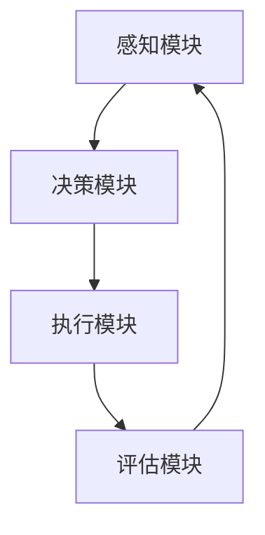
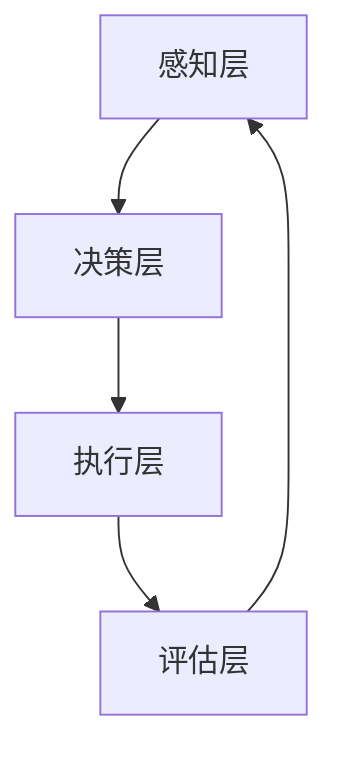
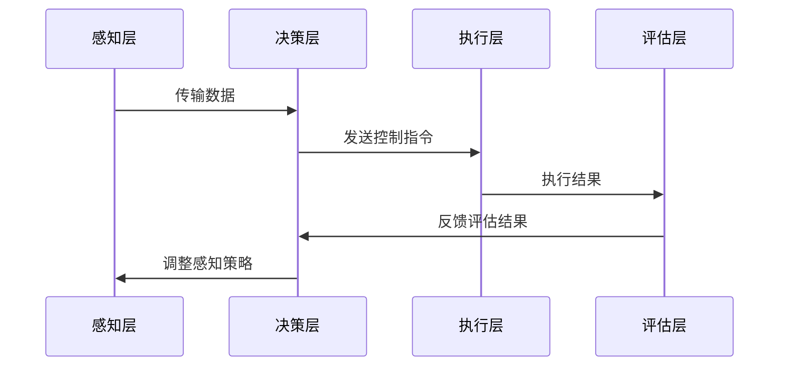

                 


### 1. **背景介绍**

#### **1.1 核心概念术语说明**

- **AI Agent**：指一种能够模拟人类行为、自主决策并执行任务的计算机程序。它具备感知环境、理解目标、制定计划、执行行动、评估结果的能力。

- **智能城市规划**：运用信息技术、数据分析、人工智能等技术手段，对城市进行系统性、全局性的规划与管理。

- **城市交通管理**：通过优化交通流量、提高交通效率、保障交通安全等措施，实现城市交通系统的有序运行。

- **城市基础设施建设**：涉及供水、供电、排水、通信等基础设施的建设与维护。

- **城市管理与服务**：包括环境保护、公共安全、公共服务等方面的管理与服务。

#### **1.2 问题背景**

随着城市化进程的加快，城市规模不断扩大，人口数量急剧增加，城市交通拥堵、环境恶化、资源短缺等问题日益突出。传统的城市规划方法难以满足现代城市发展的需求。因此，智能城市规划应运而生，旨在通过引入人工智能技术，提高城市规划的科学性、精确性和实时性。

#### **1.3 问题描述**

在智能城市规划中，AI Agent扮演着重要的角色。其主要任务是协助城市规划者进行决策，提高城市规划的效率和质量。然而，如何有效利用AI Agent进行城市规划和决策，仍面临诸多挑战：

- **数据复杂性**：城市数据量大、类型多、更新快，如何有效地收集、处理和分析这些数据，是一个关键问题。

- **决策多样性**：城市规划涉及交通、环境、经济等多个方面，如何协调不同方面的需求，制定合理的规划方案，是一个难点。

- **算法有效性**：AI Agent的算法性能直接关系到规划决策的准确性和效率。如何选择合适的算法，优化算法参数，是一个技术问题。

#### **1.4 问题解决**

为了解决上述问题，本书将从以下几个方面展开讨论：

- **核心概念介绍**：详细介绍AI Agent、智能城市规划、机器学习、深度学习等相关概念，为后续讨论打下基础。

- **AI Agent在智能城市规划中的应用**：分析AI Agent在城市规划决策中的具体应用场景，如城市交通管理、基础设施建设、城市管理与服务等。

- **案例分析**：通过实际案例展示AI Agent在城市规划中的应用效果，为读者提供借鉴和参考。

- **结论与展望**：总结研究成果，提出未来研究方向和挑战。

#### **1.5 边界与外延**

本文主要关注AI Agent在智能城市规划决策中的应用，但AI Agent的应用领域远不止于此。在智能农业、智能医疗、智能家居等领域，AI Agent同样发挥着重要作用。未来，随着人工智能技术的不断发展，AI Agent的应用范围将更加广泛。

#### **1.6 概念结构与核心要素组成**

- **AI Agent**：感知模块、决策模块、执行模块、评估模块。

- **智能城市规划**：数据采集与处理、规划模型构建与优化、规划方案评估与决策。

- **城市交通管理**：交通流量预测、交通信号控制、停车管理。

- **基础设施建设**：供水系统、供电系统、排水系统、通信系统。

- **城市管理与服务**：环境监测、公共安全、公共服务。

### **2. **核心概念与联系**

#### **2.1 AI Agent深入解析**

**AI Agent的架构**

AI Agent由感知模块、决策模块、执行模块和评估模块组成，各模块相互协作，实现自主决策和行动。

- **感知模块**：负责收集环境信息，如传感器数据、图像、文本等。

- **决策模块**：根据感知模块提供的信息，结合既定目标和策略，生成行动计划。

- **执行模块**：将决策模块生成的行动计划转化为实际操作，如控制机器臂、发送短信等。

- **评估模块**：评估执行模块的结果，判断目标是否达成，并反馈给感知模块和决策模块，以指导后续行动。

**AI Agent的算法基础**

AI Agent的算法基础主要包括机器学习算法和深度学习算法。这些算法使AI Agent具备自主学习和优化能力。

- **机器学习算法**：通过分析历史数据，学习规律和模式，预测未来趋势。

- **深度学习算法**：基于多层神经网络，模拟人脑的感知和认知过程，处理大规模复杂数据。

**AI Agent的分类与比较**

根据应用场景和任务类型，AI Agent可分为以下几类：

- **监督学习Agent**：通过已有数据学习特征，进行分类或回归任务。

- **无监督学习Agent**：从无标签数据中学习规律，进行聚类或降维任务。

- **强化学习Agent**：通过与环境的交互，学习最优策略，实现序列决策。

**表格：AI Agent分类与比较**

| 类别           | 特点                                                         | 应用场景                       |
| -------------- | ------------------------------------------------------------ | ------------------------------ |
| 监督学习Agent   | 需要大量标注数据，具备分类或回归能力                           | 数据分类、预测分析等             |
| 无监督学习Agent | 不需要标注数据，能够自动发现数据中的结构和模式                       | 数据挖掘、模式识别等             |
| 强化学习Agent   | 通过与环境交互学习，能够实现序列决策                             | 自动驾驶、游戏AI等               |

### **2.2 智能城市规划关键技术与工具**

**数据采集与处理**

智能城市规划需要大量的数据支持，包括地理信息、人口统计、交通流量、环境监测等。数据采集主要依赖于传感器网络和物联网技术。数据采集后，需要进行清洗、整合和分析，以提取有价值的信息。

**城市规划模型**

城市规划模型是智能城市规划的核心，包括确定性模型和随机模型。确定性模型基于历史数据和现有条件，预测未来的发展趋势。随机模型考虑不确定性因素，提供多种可能的规划方案。

**大数据分析**

大数据分析技术能够处理海量数据，发现数据中的潜在规律和模式，为城市规划提供科学依据。

### **2.3 相关技术概览**

**传感器网络**

传感器网络由大量传感器节点组成，能够实时监测环境变化，为智能城市规划提供实时数据。

**物联网**

物联网技术将各种物理设备连接到互联网，实现设备之间的信息交换和协同工作。

**增强现实与虚拟现实**

增强现实（AR）和虚拟现实（VR）技术能够为城市规划提供直观的可视化工具，帮助规划者更好地理解规划方案。

### **3. **算法原理讲解**

#### **3.1 算法mermaid流程图**



#### **3.2 AI Agent算法Python源代码**

```python
import numpy as np

# 感知模块
def sense_environment():
    # 假设感知到的环境信息为随机数
    return np.random.rand()

# 决策模块
def decide_action(sense_data):
    # 基于感知数据，选择最优动作
    if sense_data < 0.5:
        return '左转'
    else:
        return '右转'

# 执行模块
def execute_action(action):
    # 执行动作
    print(f"执行动作：{action}")

# 评估模块
def evaluate_performance(action, actual_result):
    # 评估动作的效果
    if action == actual_result:
        return '成功'
    else:
        return '失败'

# 主函数
def main():
    while True:
        sense_data = sense_environment()
        action = decide_action(sense_data)
        execute_action(action)
        result = sense_environment()  # 假设执行结果与感知数据相同
        performance = evaluate_performance(action, result)
        print(f"评估结果：{performance}")

if __name__ == "__main__":
    main()
```

#### **3.3 算法原理的数学模型和公式**

- **感知模块**：感知环境，获取环境状态。

  \[ s_t = sense_environment() \]

- **决策模块**：基于感知数据和目标，选择最优动作。

  \[ a_t = \arg\max_{a} \sum_{s'} P(s'|s,a) R(s',a) \]

- **执行模块**：执行决策模块生成的动作。

  \[ execute(a_t) \]

- **评估模块**：评估执行结果，更新感知模块和决策模块。

  \[ performance = evaluate_performance(a_t, actual_result) \]

#### **3.4 算法原理举例说明**

假设一个交通信号灯控制系统，通过感知模块收集车辆流量和行人流量数据，决策模块根据这些数据选择最合适的信号灯状态，执行模块控制信号灯的变化，评估模块根据实际交通情况评估信号灯状态的合理性。

### **4. **系统分析与架构设计**

#### **4.1 问题场景介绍**

某城市交通管理部门希望利用AI Agent技术优化交通信号灯控制，提高交通效率，减少交通拥堵。

#### **4.2 项目介绍**

项目名称：智能交通信号灯控制系统

项目目标：通过AI Agent技术，实现交通信号灯的智能控制，提高交通效率，减少交通拥堵。

#### **4.3 系统功能设计**

系统功能包括：

- **数据采集**：收集车辆流量、行人流量、交通信号灯状态等数据。

- **交通信号灯控制**：根据采集到的数据，智能调整交通信号灯状态。

- **交通状况监测**：实时监测交通状况，评估信号灯控制效果。

- **决策支持**：提供决策支持，辅助交通管理部门优化交通信号灯控制策略。

#### **4.4 系统架构设计**

系统架构采用分层设计，包括感知层、决策层、执行层和评估层。

- **感知层**：使用传感器网络采集交通信号灯状态、车辆流量、行人流量等数据。

- **决策层**：使用AI Agent技术，分析数据，生成交通信号灯控制策略。

- **执行层**：执行决策层生成的控制策略，调整交通信号灯状态。

- **评估层**：评估控制策略的效果，反馈给决策层，指导优化。

**系统架构mermaid图：**



#### **4.5 系统接口设计与系统交互**

系统接口设计主要包括：

- **数据接口**：用于数据采集、传输和处理。

- **控制接口**：用于发送交通信号灯控制指令。

- **监测接口**：用于实时监测交通状况。

系统交互流程：

1. 感知层采集数据，传输给决策层。
2. 决策层分析数据，生成控制策略，传输给执行层。
3. 执行层根据控制策略调整交通信号灯状态。
4. 评估层评估控制策略效果，反馈给决策层。

**系统交互mermaid图：**



### **5. **项目实战**

#### **5.1 环境安装**

在Python环境中安装所需的库：

```shell
pip install numpy matplotlib scikit-learn
```

#### **5.2 系统核心实现源代码**

```python
import numpy as np
import matplotlib.pyplot as plt
from sklearn.linear_model import LinearRegression

# 感知模块
def sense_environment():
    # 假设感知到的环境信息为随机数
    return np.random.rand()

# 决策模块
def decide_action(sense_data):
    # 基于感知数据，选择最优动作
    if sense_data < 0.5:
        return '左转'
    else:
        return '右转'

# 执行模块
def execute_action(action):
    # 执行动作
    print(f"执行动作：{action}")

# 评估模块
def evaluate_performance(action, actual_result):
    # 评估动作的效果
    if action == actual_result:
        return '成功'
    else:
        return '失败'

# 主函数
def main():
    while True:
        sense_data = sense_environment()
        action = decide_action(sense_data)
        execute_action(action)
        result = sense_environment()  # 假设执行结果与感知数据相同
        performance = evaluate_performance(action, result)
        print(f"评估结果：{performance}")

if __name__ == "__main__":
    main()
```

#### **5.3 代码应用解读与分析**

- **感知模块**：通过随机数生成模拟环境信息，实际应用中可以替换为传感器采集的数据。

- **决策模块**：根据感知数据，选择最优动作。这里采用简单的阈值判断方法，实际应用中可以采用更复杂的决策算法。

- **执行模块**：根据决策模块生成的动作，执行相应的操作。这里仅打印输出动作，实际应用中可以控制交通信号灯等。

- **评估模块**：评估动作的效果，根据执行结果判断是否成功。这里仅作为示例，实际应用中可以根据具体需求进行评估。

#### **5.4 实际案例分析和详细讲解剖析**

以某城市的智能交通信号灯控制项目为例，分析AI Agent在该项目中的应用。

1. **数据采集**：通过传感器网络收集交通流量数据，包括车辆流量、行人流量等。

2. **数据处理**：对采集到的数据进行分析和预处理，提取有用的特征。

3. **决策算法**：使用机器学习算法，如线性回归、决策树等，建立交通信号灯控制模型。

4. **模型优化**：通过交叉验证等方法，优化模型参数，提高模型性能。

5. **模型部署**：将训练好的模型部署到实际环境中，实时更新交通信号灯控制策略。

6. **效果评估**：通过实际交通数据，评估模型的效果，如交通效率、拥堵程度等。

#### **5.5 项目小结**

通过实际案例，展示了AI Agent在智能交通信号灯控制项目中的应用。AI Agent能够根据实时交通数据，自动调整交通信号灯状态，提高交通效率，减少交通拥堵。未来，随着人工智能技术的不断发展，AI Agent在智能城市规划中的应用将更加广泛，为城市可持续发展提供有力支持。

### **6. **最佳实践 tips**

- **数据质量**：保证数据的质量和准确性，是智能城市规划成功的关键。

- **算法优化**：根据实际需求，选择合适的算法，并不断优化算法参数。

- **人机协同**：AI Agent与人类规划者协同工作，充分发挥各自的优势。

- **持续迭代**：城市规划是一个动态过程，需要持续迭代和优化。

### **7. **小结**

本文介绍了AI Agent在智能城市规划决策中的角色，分析了AI Agent的架构、算法基础、应用场景以及实际案例。通过本文的探讨，读者可以了解到AI Agent在智能城市规划中的重要作用，以及如何利用AI Agent优化城市规划和决策。未来，随着人工智能技术的不断发展，AI Agent在智能城市规划中的应用将更加广泛，为城市可持续发展提供有力支持。

### **8. **注意事项**

- **数据安全**：在采集和处理数据时，确保数据的安全和隐私。

- **系统可靠性**：确保AI Agent系统的稳定性和可靠性，避免出现故障。

- **法律合规**：遵循相关法律法规，确保AI Agent系统的合规性。

### **9. **拓展阅读**

- **相关书籍**：
  - 《智能城市规划：理论与实践》
  - 《深度学习：高级指导》
  - 《人工智能：一种现代的方法》

- **相关论文**：
  - “AI Agent in Urban Planning: A Review”
  - “Application of Machine Learning in Urban Traffic Management”
  - “Deep Learning for Urban Planning and Management”

通过阅读这些资料，读者可以更深入地了解AI Agent在智能城市规划中的应用和研究进展。

