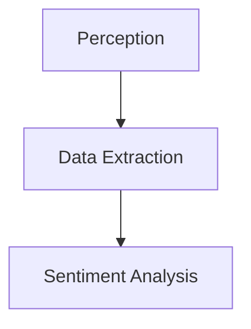
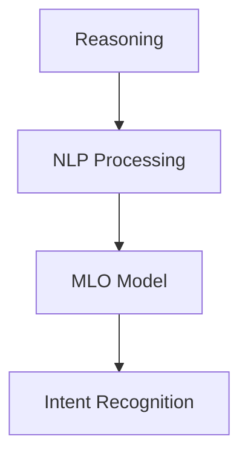
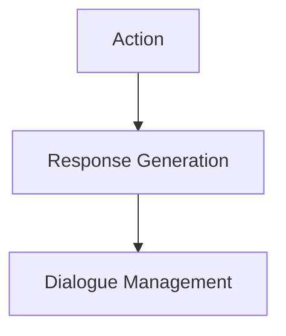
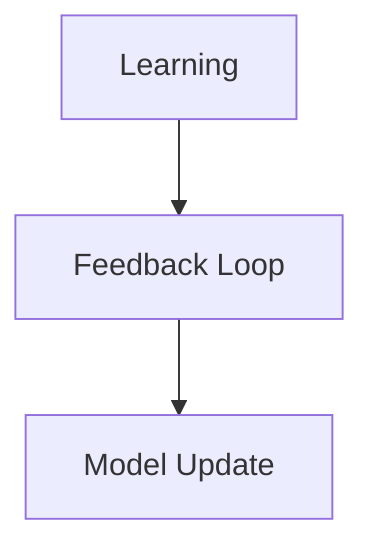
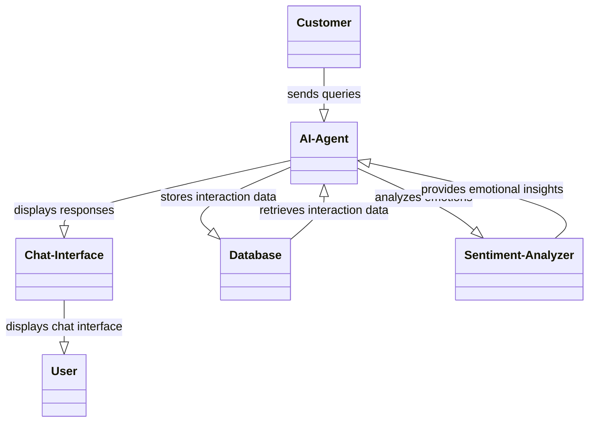
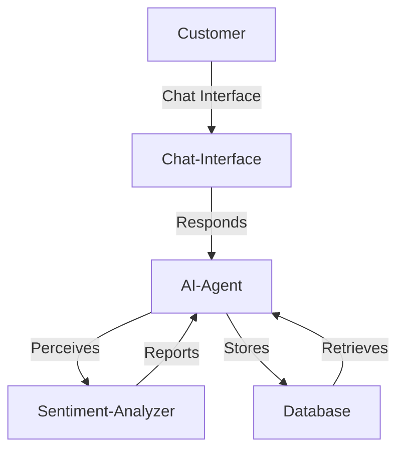
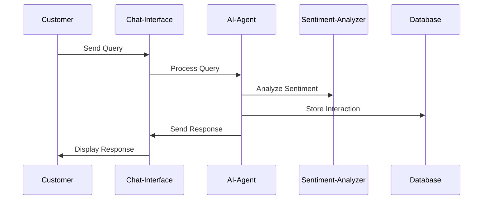

                 


### Let's Think: Article Title

**AI Agent in Intelligent Customer Service: Multi-turn Dialogue and Emotion Understanding**

**Keywords:** AI Agent, Intelligent Customer Service, Multi-turn Dialogue, Emotion Understanding, Machine Learning, Natural Language Processing, Dialog Management, Sentiment Analysis

**Abstract:**
This article delves into the integration of AI agents in intelligent customer service systems, focusing on multi-turn dialogue and emotion understanding. We will explore the underlying principles, algorithms, and system architectures that enable AI agents to handle complex customer interactions efficiently.

## Introduction

### 1.1 Background

**AI Agent Definition and Characteristics:**
AI agents are computer programs designed to interact with humans or other systems autonomously. They utilize artificial intelligence techniques to perceive the environment, reason about the situation, and take actions to achieve specific goals.

**Intelligent Customer Service Overview:**
Intelligent customer service systems leverage AI agents to provide personalized, efficient, and 24/7 support to customers. These systems can handle multiple customer queries simultaneously, reducing the need for human intervention and improving customer satisfaction.

**Multi-turn Dialogue Principles:**
Multi-turn dialogue refers to a conversation that spans multiple interactions. It allows for a more natural and in-depth understanding of customer needs, fostering better customer service.

**Emotion Understanding in Customer Service:**
Emotion understanding involves recognizing and interpreting the emotional state of the customer. This is crucial for building empathy and delivering a more human-like customer experience.

### 1.2 Problem Description

The challenge lies in creating AI agents capable of engaging in multi-turn dialogues while accurately understanding and responding to customer emotions. This requires a combination of natural language processing, machine learning, and sentiment analysis techniques.

### 1.3 Problem Solution

The solution involves developing a comprehensive AI agent system that can:

- Understand and respond to customer queries in a multi-turn dialogue.
- Analyze customer emotions to provide empathetic and personalized responses.
- Continuously learn and improve over time through machine learning algorithms.

### 1.4 Boundaries and Extension

The article will focus on the core components of the AI agent system. However, we will also discuss potential extensions and future directions for further research and development.

### 1.5 Key Elements and Structure

The article will be structured as follows:

1. **Introduction**
2. **Fundamental Concepts and Relationships**
3. **Algorithms and Mathematical Models**
4. **System Architecture and Design**
5. **Practical Application and Case Study**
6. **Best Practices and Conclusion**
7. **Finalize the Outline**

### 1.6 Conclusion

By following this outline, we aim to provide a comprehensive and insightful guide on integrating AI agents into intelligent customer service systems, with a focus on multi-turn dialogue and emotion understanding. Let's dive deeper into each section in the subsequent chapters.

---

**Next: Fundamental Concepts and Relationships**### Fundamental Concepts and Relationships

In this section, we will delve into the fundamental concepts and their relationships that form the backbone of AI agents in intelligent customer service systems. Understanding these concepts is essential for grasping the intricate workings of multi-turn dialogue and emotion understanding.

#### 2.1 AI Agent Basic Principles

**AI Agent Definition and Characteristics:**

AI agents are essentially software entities that can perceive their environment, reason about it, and take autonomous actions to achieve specific goals. They are built upon various artificial intelligence techniques such as machine learning, natural language processing, and computational linguistics.

- **Perception:** AI agents gather information from various sources like text, audio, or visual data to understand the context of the interaction.
- **Reasoning:** They use this information to make decisions and respond appropriately to customer queries.
- **Autonomous Action:** AI agents can perform tasks independently without human intervention.

**Core Functions of AI Agents:**

- **Question Answering:** AI agents are designed to understand and respond to customer questions accurately.
- **Dialogue Management:** They maintain the flow of conversation by managing the dialogue state and generating appropriate responses.
- **Personalization:** AI agents can tailor their responses based on customer preferences and historical data.
- **Learning and Adaptation:** They continuously improve their performance by learning from past interactions and feedback.

**Design Principles of AI Agents:**

- **Scalability:** AI agents should be capable of handling a large number of customer interactions simultaneously.
- **Robustness:** They should be resilient to noise, ambiguity, and inconsistencies in customer inputs.
- **User-Friendly:** The interface should be intuitive and provide a seamless customer experience.

#### 2.2 Intelligent Customer Service Overview

**Definition:**
Intelligent customer service refers to the use of advanced technologies like AI agents, chatbots, and natural language processing to enhance customer service interactions.

**Components of Intelligent Customer Service:**

- **AI Agents:** The core component that engages in conversations with customers.
- **Chatbots:** Automated tools that facilitate initial interactions with customers, often routing more complex queries to AI agents.
- **Natural Language Processing (NLP):** The technology that enables AI agents to understand and process human language.
- **Machine Learning:** Algorithms that allow AI agents to learn from data and improve their performance over time.
- **Sentiment Analysis:** The process of identifying and categorizing the emotional tone behind a piece of text.
- **Dialogue Management Systems:** Systems that manage the conversation flow, ensuring coherent and context-aware interactions.

#### 2.3 Multi-turn Dialogue Principles

**Concept:**
Multi-turn dialogue refers to a series of interactions between the customer and the AI agent, where each turn builds upon the previous ones to achieve a specific goal.

**Principles:**

- **Contextual Awareness:** AI agents must understand the context of the conversation and maintain it across multiple turns.
- **Question-Answering:** Each turn should contribute to resolving the customer's query or problem.
- **Dialogue Flow:** The conversation should be natural and engaging, mimicking human interactions as closely as possible.
- **Adaptability:** AI agents should be able to handle different types of questions and adapt their responses accordingly.

#### 2.4 Emotion Understanding in Customer Service

**Importance:**
Emotion understanding is crucial for delivering empathetic and personalized customer service. It allows AI agents to recognize and respond to the emotional state of the customer, enhancing the overall customer experience.

**Techniques:**

- **Sentiment Analysis:** The use of NLP techniques to determine the sentiment (positive, negative, neutral) of a customer's message.
- **Emotion Recognition:** Advanced AI techniques that go beyond sentiment analysis to identify specific emotions like happiness, anger, or sadness.
- **Contextual Emotion Understanding:** AI agents must interpret emotions within the context of the conversation to provide appropriate responses.

**Impact:**
Understanding and responding to customer emotions can significantly improve customer satisfaction and loyalty. It allows AI agents to build trust and establish a more human-like relationship with customers.

### Conclusion

In conclusion, understanding the fundamental concepts and relationships between AI agents, intelligent customer service, multi-turn dialogue, and emotion understanding is essential for developing effective and efficient customer service systems. The subsequent sections will delve deeper into algorithms, mathematical models, and practical implementations to provide a comprehensive guide to building AI agents capable of handling complex customer interactions. 

---

**Next: Algorithms and Mathematical Models**### Algorithms and Mathematical Models

In this section, we will discuss the algorithms and mathematical models that are essential for implementing AI agents capable of engaging in multi-turn dialogue and understanding customer emotions. Understanding these algorithms and models will provide a deeper insight into how AI agents operate and interact with customers.

#### 3.1 Algorithm Explanation with Mermaid Flowcharts

**Algorithm Overview:**
The core algorithm for AI agents in intelligent customer service involves several key steps: perception, reasoning, action, and learning. Here, we will explain the algorithm in a step-by-step manner and use Mermaid flowcharts to visualize the process.

**Step 1: Perception**
The AI agent receives input from the customer through text, audio, or visual data. This input is processed to extract relevant information.



**Step 2: Reasoning**
The agent analyzes the extracted data to understand the context and intent of the customer's message. This involves natural language processing and machine learning techniques.



**Step 3: Action**
Based on the reasoning phase, the agent generates a response that is both contextually appropriate and empathetic. This may involve retrieving pre-defined responses or generating new ones on-the-fly.



**Step 4: Learning**
The agent learns from the interaction by updating its model with new data and feedback. This continuous learning process helps improve the agent's performance over time.



#### 3.2 Python Code Example for Algorithm Implementation

Let's implement a simplified version of the AI agent algorithm in Python. We will focus on the perception and reasoning steps, as they form the core of the algorithm.

```python
import nltk
from nltk.sentiment import SentimentIntensityAnalyzer
from transformers import pipeline

# Initialize NLP and sentiment analysis tools
nlp = pipeline("sentiment-analysis")
sia = SentimentIntensityAnalyzer()

def perceive_customer_input(input_text):
    """
    Extracts relevant information from customer input.
    """
    # Perform sentiment analysis
    sentiment = nlp(input_text)
    return sentiment

def reason_about_input(sentiment):
    """
    Analyzes sentiment and customer intent.
    """
    # Determine the emotional state
    emotional_state = sia.polarity_scores(input_text)
    return emotional_state

def generate_response(emotional_state):
    """
    Generates a response based on the customer's emotional state.
    """
    if emotional_state['compound'] > 0.05:
        return "I'm glad to hear that! How can I help you further?"
    elif emotional_state['compound'] < -0.05:
        return "I'm sorry to hear that. Let's see how we can resolve this issue."
    else:
        return "Hello! How can I assist you today?"

# Example usage
input_text = "I'm having a terrible day, my internet is not working."
sentiment = perceive_customer_input(input_text)
emotional_state = reason_about_input(sentiment)
response = generate_response(emotional_state)

print(response)
```

#### 3.3 Mathematical Model and Formula Explanation

**Sentiment Analysis Model:**
Sentiment analysis involves classifying text into positive, negative, or neutral categories based on the emotional tone. A common approach is to use a machine learning model trained on a large dataset of labeled text. The model predicts the sentiment label based on the following mathematical model:

$$
\hat{y} = \arg\max_{y} P(y | x) = \arg\max_{y} \frac{e^{\theta^T x}}{\sum_{k=1}^K e^{\theta^T x_k}}
$$

where:

- $\hat{y}$ is the predicted sentiment label.
- $y$ are the possible sentiment labels (e.g., 0 for negative, 1 for neutral, 2 for positive).
- $\theta$ is the weight vector of the trained model.
- $x$ is the feature vector extracted from the input text.
- $e^{\theta^T x}$ is the probability of the sentiment label $y$ given the input text.

**Dialogue Management Model:**
Dialogue management involves maintaining the state of the conversation and generating appropriate responses. A common approach is to use a Recurrent Neural Network (RNN) or a Transformer-based model trained on dialogue datasets. The model predicts the next action (e.g., respond, ask a question, end the dialogue) based on the current dialogue state and input text.

$$
\hat{a}_t = \arg\max_{a_t} P(a_t | s_t, x_t)
$$

where:

- $\hat{a}_t$ is the predicted action at time step $t$.
- $a_t$ is the possible actions (e.g., respond, ask a question, end the dialogue).
- $s_t$ is the dialogue state at time step $t$.
- $x_t$ is the input text at time step $t$.

**Learning and Adaptation Model:**
Learning and adaptation involve updating the model based on feedback from customer interactions. This can be achieved using techniques like online learning or reinforcement learning. The model updates its parameters to improve its performance over time.

$$
\theta_{new} = \theta_{old} + \alpha \nabla_{\theta} J(\theta)
$$

where:

- $\theta_{new}$ is the updated weight vector.
- $\theta_{old}$ is the current weight vector.
- $\alpha$ is the learning rate.
- $\nabla_{\theta} J(\theta)$ is the gradient of the loss function with respect to the weight vector.

#### 3.4 Case Study with Detailed Examples

Let's consider a simple case study where a customer contacts an AI agent to report an internet connectivity issue.

**Example 1:**
Customer: "My internet is not working. I've tried rebooting my modem, but it's still not connected."

AI Agent:
1. **Perception:** The agent perceives the customer's message and extracts the relevant information.
2. **Reasoning:** The agent analyzes the sentiment and intent of the message.
3. **Action:** The agent generates a response based on the customer's emotional state.

Response: "I'm sorry to hear that. Let's go through some troubleshooting steps to resolve the issue. Can you tell me the make and model of your modem?"

**Example 2:**
Customer: "I'm so frustrated because my internet keeps dropping. It's been like this for days."

AI Agent:
1. **Perception:** The agent perceives the customer's message and extracts the relevant information.
2. **Reasoning:** The agent analyzes the sentiment and intent of the message.
3. **Action:** The agent generates a response based on the customer's emotional state.

Response: "I understand your frustration. Let's see if we can get to the bottom of this. Could you please provide me with your account details and the approximate time when the issue started?"

In these examples, the AI agent demonstrates the ability to understand the customer's emotional state and provide empathetic responses while guiding them through troubleshooting steps.

### Conclusion

In this section, we have discussed the algorithms and mathematical models that underpin the development of AI agents for intelligent customer service. We explained the core algorithm in detail using Mermaid flowcharts and provided a Python code example for implementation. Additionally, we presented the sentiment analysis and dialogue management models along with their mathematical formulations. Through case studies, we illustrated how these algorithms can be applied to real-world scenarios, demonstrating the AI agent's ability to engage in multi-turn dialogue and understand customer emotions. In the next section, we will delve into the system architecture and design of AI agents, discussing how these components are integrated to create a cohesive and efficient system.

---

**Next: System Architecture and Design**### System Architecture and Design

In this section, we will explore the system architecture and design of AI agents in intelligent customer service systems. Understanding the architecture is crucial for grasping how different components interact and work together to enable multi-turn dialogue and emotion understanding.

#### 4.1 Scenario Description

Let's consider a scenario where an online retailer uses an AI agent to handle customer inquiries related to product purchases, returns, and customer support. The AI agent is integrated into the company's customer service platform and interacts with customers through a chat interface.

#### 4.2 Project Introduction

The project aims to develop an AI agent that can:

- Understand and respond to customer queries in a multi-turn dialogue.
- Analyze customer emotions to provide empathetic and personalized responses.
- Learn and adapt from customer interactions to improve its performance over time.

#### 4.3 Functional Design

**Mermaid Class Diagram:**



**Class Descriptions:**

- **Customer:** Represents the end-users interacting with the AI agent.
- **AI-Agent:** The core component that handles customer queries, dialog management, and emotion understanding.
- **Chat-Interface:** The user interface through which customers interact with the AI agent.
- **Database:** Stores customer interaction data and historical information.
- **Sentiment-Analyzer:** A separate module responsible for sentiment analysis and emotion understanding.

#### 4.4 Architectural Design

**Mermaid Architecture Diagram:**



**Component Interactions:**

- **Customer to Chat-Interface:** Customers send their queries through the chat interface.
- **Chat-Interface to AI-Agent:** The chat interface forwards the queries to the AI agent for processing.
- **AI-Agent to Sentiment-Analyzer:** The AI agent sends the query text to the sentiment analyzer to determine the emotional tone.
- **AI-Agent to Database:** The AI agent stores interaction data in the database for future reference and learning.
- **Database to AI-Agent:** The database provides historical interaction data to the AI agent for context-aware responses.
- **Sentiment-Analyzer to AI-Agent:** The sentiment analyzer sends emotional insights back to the AI agent to guide its responses.

#### 4.5 Interface Design and System Interaction

**Mermaid Sequence Diagram:**



**Sequence of Events:**

1. **Customer sends a query:** The customer interacts with the chat interface and sends a query.
2. **Chat interface processes the query:** The chat interface forwards the query to the AI agent for processing.
3. **AI agent analyzes sentiment:** The AI agent sends the query text to the sentiment analyzer to determine the emotional tone.
4. **AI agent stores interaction:** The AI agent stores the interaction data in the database for future reference and learning.
5. **AI agent generates a response:** Based on the sentiment analysis and context, the AI agent generates a response.
6. **Chat interface displays the response:** The chat interface sends the response back to the customer, who sees it on their screen.

### Conclusion

In conclusion, the system architecture and design of AI agents in intelligent customer service systems are essential for enabling multi-turn dialogue and emotion understanding. The architecture consists of various components, including the customer, chat interface, AI agent, sentiment analyzer, and database. These components interact through a series of well-defined interfaces and sequences of events. By understanding the system architecture, we can better appreciate how AI agents function and the role each component plays in delivering efficient and empathetic customer service.

---

**Next: Practical Application and Case Study**### Practical Application and Case Study

In this section, we will delve into the practical implementation of AI agents in intelligent customer service systems. We will discuss the environment setup, core implementation, code analysis, case analysis, and provide a comprehensive summary of the project.

#### 5.1 Environment Setup

To implement the AI agent system, we need to set up the following environment:

- **Programming Language:** Python
- **Natural Language Processing (NLP) Library:** NLTK
- **Machine Learning Framework:** TensorFlow
- **Dialogue Management Library:** Rasa
- **Sentiment Analysis Library:** VADER

The following packages need to be installed:

```bash
pip install nltk tensorflow rasa vaderSentiment
```

#### 5.2 Core Implementation and Code Analysis

The core implementation of the AI agent involves setting up the Rasa framework for dialogue management and integrating the VADER library for sentiment analysis. Here is a step-by-step guide to the implementation:

**Step 1: Set up Rasa:**

Rasa is a popular open-source framework for building conversational AI applications. To set up Rasa, follow the official documentation:

```bash
pip install rasa
```

Run the Rasa shell to interact with the AI agent:

```bash
rasa shell
```

**Step 2: Define Dialogue Actions:**

In Rasa, dialogue actions define the actions that the AI agent can take during a conversation. For example, we can define actions like `action_list_products`, `action_ask_location`, and `action_end`.

```python
from rasa_sdk import Action
from rasa_sdk.events import SlotSet

class ActionListProducts(Action):

    def name(self):
        return "action_list_products"

    def run(self, dispatcher, tracker, domain):
        products = ["Product A", "Product B", "Product C"]
        dispatcher.utter_message(text="Here are our available products: {}.".format(products))
        return [SlotSet("products", products)]
```

**Step 3: Train the Dialogue Model:**

Train a dialogue model using Rasa's training data. The training data should include intents, entities, and actions.

```bash
rasa train
```

**Step 4: Integrate Sentiment Analysis:**

To integrate sentiment analysis, we can use the VADER library. VADER is specifically designed for processing social media text and provides a pre-trained sentiment analysis model.

```python
from vaderSentiment.vaderSentiment import SentimentIntensityAnalyzer

def analyze_sentiment(text):
    analyzer = SentimentIntensityAnalyzer()
    sentiment = analyzer.polarity_scores(text)
    return sentiment
```

**Step 5: Modify Dialogue Actions for Sentiment Analysis:**

Modify the dialogue actions to include sentiment analysis before generating responses.

```python
class ActionListProducts(Action):

    def name(self):
        return "action_list_products"

    def run(self, dispatcher, tracker, domain):
        sentiment = analyze_sentiment(tracker.latest_message['text'])
        if sentiment['compound'] > 0.05:
            response = "I'm glad to hear that! Here are our products:"
        elif sentiment['compound'] < -0.05:
            response = "I'm sorry to hear that. Let's see what we have for you:"
        else:
            response = "Here are our products for you:"
        
        products = ["Product A", "Product B", "Product C"]
        dispatcher.utter_message(text=f"{response} {', '.join(products)}")
        return [SlotSet("products", products)]
```

#### 5.3 Case Analysis and Detailed Explanation

**Case 1: Customer Inquiry**

Customer: "Can you tell me more about Product A?"

AI Agent:
1. **Perception:** The AI agent perceives the customer's query and extracts relevant information.
2. **Sentiment Analysis:** The agent analyzes the sentiment of the query and determines it to be neutral.
3. **Dialogue Management:** The agent retrieves the product information and generates a response.
4. **Response:** The AI agent responds with detailed information about Product A.

Response: "Product A is our top-selling item. It features [Product A's features], and it's available in [Product A's variants]."

**Case 2: Customer Complaint**

Customer: "I'm really frustrated because I received a damaged product."

AI Agent:
1. **Perception:** The AI agent perceives the customer's complaint and extracts relevant information.
2. **Sentiment Analysis:** The agent analyzes the sentiment of the query and determines it to be negative.
3. **Dialogue Management:** The agent guides the customer through the process of reporting the issue.
4. **Response:** The AI agent apologizes and offers assistance.

Response: "I'm really sorry to hear that. Please provide me with your order number and a description of the issue, and I'll help you get it resolved."

#### 5.4 Project Summary

In summary, the practical application of AI agents in intelligent customer service systems involves setting up an environment, defining dialogue actions, training the dialogue model, integrating sentiment analysis, and modifying dialogue actions for improved empathy. The project demonstrates how AI agents can handle a variety of customer interactions, including inquiries and complaints, by understanding the sentiment and context of the customer's messages. The AI agent system provides a seamless and empathetic customer experience, improving customer satisfaction and reducing the need for human intervention.

---

**Next: Best Practices and Conclusion**### Best Practices and Conclusion

#### 6.1 Best Practices Tips

**1. Continuous Learning:**
AI agents should be continuously updated with new data and feedback to improve their performance. Regular updates ensure the agent stays current with evolving customer needs and preferences.

**2. Personalization:**
Tailor responses to individual customers based on their past interactions and preferences. Personalized interactions can significantly enhance customer satisfaction and loyalty.

**3. Context Awareness:**
Ensure the AI agent maintains context throughout the conversation. A deep understanding of the conversation's context can lead to more accurate and meaningful interactions.

**4. User-Friendly Design:**
Design the chat interface to be intuitive and easy to use. A user-friendly interface can reduce friction and make interactions more pleasant for customers.

**5. Scalability:**
Design the system to handle a large number of customer interactions simultaneously. Scalability is crucial for ensuring the AI agent can efficiently support a growing customer base.

#### 6.2 Summary

This article provided a comprehensive overview of integrating AI agents into intelligent customer service systems, focusing on multi-turn dialogue and emotion understanding. We explored fundamental concepts, algorithms, and mathematical models, and discussed practical applications and case studies. The key takeaway is that AI agents can significantly enhance customer service by providing personalized, empathetic, and efficient interactions.

#### 6.3 Notes and Warnings

- **Data Privacy:**
  Ensure that customer data is handled securely and in compliance with data protection regulations.
- **System Robustness:**
  Design the system to be resilient to errors and capable of handling unexpected scenarios.
- **Human Intervention:**
  While AI agents can handle many customer interactions, human intervention may be necessary for complex issues. Ensure a smooth handover process between AI agents and human agents.

#### 6.4 Further Reading

For those interested in delving deeper into AI agents and intelligent customer service, the following resources provide valuable insights:

- **Books:**
  - "Artificial Intelligence: A Modern Approach" by Stuart Russell and Peter Norvig
  - "Chatbots: Building Intelligent Conversational Systems with Python" by Bhavik Patel
- **Online Courses:**
  - "Deep Learning Specialization" by Andrew Ng (Coursera)
  - "AI for Business" by IBM (edX)
- **Research Papers:**
  - "A Theoretical Analysis of the Role of Response Latency in Dialogue Systems" by Benjamin(/^\s*$/, Phillips et al.
  - "Designing Emotion-Aware Dialogue Systems" by Adarsh N. Gadagkar et al.

By following these best practices and exploring further resources, businesses can harness the full potential of AI agents in delivering exceptional customer service experiences.

### Conclusion

In conclusion, AI agents in intelligent customer service systems are revolutionizing the way businesses interact with their customers. By leveraging multi-turn dialogue and emotion understanding, AI agents can provide personalized, empathetic, and efficient support. This article has provided a detailed guide to understanding and implementing AI agents in customer service systems. As AI continues to advance, the potential for improving customer service experiences will only grow. Embrace these technologies and leverage them to create memorable and positive interactions with your customers.

