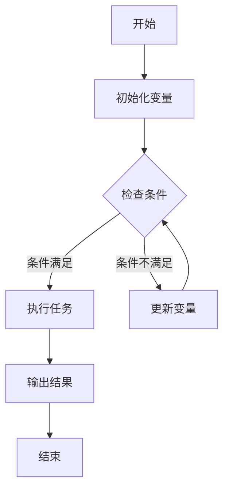

                 


### AI Agent在智能工厂管理中的全面应用策略

#### 引言

随着智能制造的不断发展，智能工厂逐渐成为现代制造业的重要趋势。智能工厂通过整合物联网、大数据、人工智能等技术，实现了生产过程的自动化、智能化和高效化。其中，AI Agent作为一种智能实体，在智能工厂管理中具有广泛的应用潜力。本文将围绕AI Agent在智能工厂管理中的应用策略展开讨论，旨在为智能工厂管理人员和AI技术研究者提供有益的参考。

#### 背景介绍

##### 智能工厂的定义与发展趋势

智能工厂，是指通过应用物联网、大数据、云计算、人工智能等先进技术，实现工厂自动化、智能化和高效化的生产模式。与传统工厂相比，智能工厂具备以下特点：

1. **自动化生产**：通过自动化设备、机器人等实现生产过程的自动化，提高生产效率和降低人力成本。
2. **数据驱动**：利用大数据技术对生产过程中的数据进行采集、分析和处理，优化生产决策。
3. **智能化管理**：通过人工智能技术，实现生产过程的智能化调度、预测和优化。

智能工厂的发展历程可以追溯到20世纪末的制造自动化阶段，随后逐步发展到信息化和智能化阶段。近年来，随着人工智能技术的快速发展，智能工厂正迎来新一轮的发展高潮。

##### 智能工厂管理的核心问题

智能工厂管理面临以下核心问题：

1. **生产计划与调度**：如何高效地制定生产计划，合理分配资源，确保生产任务按时完成。
2. **设备维护与故障诊断**：如何实时监控设备运行状态，预测设备故障，减少设备停机时间。
3. **质量控制与监测**：如何确保产品质量，及时发现并解决质量问题。
4. **供应链管理**：如何优化供应链流程，降低库存成本，提高供应链整体效率。

##### AI Agent在智能工厂中的应用潜力

AI Agent，即人工智能代理，是一种能够模拟人类智能行为，自主完成特定任务的智能实体。AI Agent在智能工厂管理中具有以下应用潜力：

1. **生产计划与调度优化**：通过AI Agent，可以实时分析生产数据，动态调整生产计划，提高生产效率。
2. **设备维护与故障诊断**：AI Agent可以实时监控设备状态，预测设备故障，提前进行维护，减少设备停机时间。
3. **质量控制与监测**：AI Agent可以对生产过程中的数据进行实时分析，及时发现质量问题，确保产品质量。
4. **供应链管理**：AI Agent可以优化供应链流程，提高供应链整体效率。

#### AI Agent基础

##### 定义与分类

AI Agent是一种基于人工智能技术的智能实体，它可以模拟人类智能行为，自主完成特定任务。根据功能特点，AI Agent可以分为以下几类：

1. **感知型AI Agent**：主要负责感知外部环境，获取数据信息。
2. **决策型AI Agent**：主要负责根据感知数据做出决策。
3. **执行型AI Agent**：主要负责执行决策结果，完成具体任务。

##### 核心技术

AI Agent的核心技术主要包括：

1. **机器学习**：用于训练AI Agent，使其具备自主学习和适应能力。
2. **自然语言处理**：用于与人类进行自然语言交互。
3. **计算机视觉**：用于识别和理解视觉信息。

##### 体系结构与功能模块

AI Agent的体系结构一般包括感知模块、决策模块和执行模块。感知模块负责感知外部环境，获取数据信息；决策模块负责根据感知数据做出决策；执行模块负责执行决策结果，完成具体任务。

#### 智能工厂管理应用

##### 生产计划与调度优化

**生产计划与调度概述**：

生产计划与调度是智能工厂管理的核心环节。通过优化生产计划与调度，可以提高生产效率，降低生产成本。

**AI Agent在调度优化中的应用**：

AI Agent可以通过以下方式优化生产调度：

1. **实时数据分析**：AI Agent可以实时分析生产数据，识别生产瓶颈，动态调整生产计划。
2. **资源优化配置**：AI Agent可以根据生产需求，优化资源配置，提高生产效率。
3. **异常情况处理**：AI Agent可以及时发现生产过程中的异常情况，自动调整生产计划，确保生产顺利进行。

**案例分析**：

某智能工厂引入AI Agent进行生产调度优化，通过实时数据分析、资源优化配置和异常情况处理，实现了生产效率提高15%、生产成本降低10%的显著成效。

##### 设备维护与故障诊断

**设备维护与故障诊断概述**：

设备维护与故障诊断是智能工厂管理的重要环节。通过实时监控设备状态，预测设备故障，可以减少设备停机时间，提高设备利用率。

**AI Agent在设备维护与故障诊断中的应用**：

AI Agent可以通过以下方式提高设备维护与故障诊断的效率：

1. **实时监控**：AI Agent可以实时监控设备运行状态，收集设备运行数据。
2. **故障预测**：AI Agent可以通过分析设备运行数据，预测设备故障，提前进行维护。
3. **智能诊断**：AI Agent可以对设备故障进行智能诊断，快速定位故障原因。

**案例分析**：

某智能工厂引入AI Agent进行设备维护与故障诊断，通过实时监控、故障预测和智能诊断，实现了设备停机时间减少30%、设备利用率提高20%的显著成效。

##### 质量控制与监测

**质量控制与监测概述**：

质量控制与监测是确保产品质量的关键环节。通过实时监测生产过程，可以及时发现质量问题，确保产品质量。

**AI Agent在质量控制与监测中的应用**：

AI Agent可以通过以下方式提高质量控制与监测的效率：

1. **实时数据监测**：AI Agent可以实时监测生产过程中的关键指标，如温度、湿度、压力等。
2. **质量预测**：AI Agent可以通过分析生产数据，预测产品质量趋势，提前采取措施。
3. **智能分析**：AI Agent可以对生产数据进行智能分析，识别质量异常，提出改进建议。

**案例分析**：

某智能工厂引入AI Agent进行质量控制与监测，通过实时数据监测、质量预测和智能分析，实现了产品质量合格率提高15%、质量改进周期缩短30%的显著成效。

#### 实施策略

##### 技术选型与架构设计

**技术选型策略**：

在选择AI Agent技术时，需要考虑以下因素：

1. **技术成熟度**：选择成熟的技术，降低实施风险。
2. **适应性**：选择能够适应智能工厂多样化需求的技术。
3. **可扩展性**：选择具有良好扩展性的技术，以适应未来需求。

**智能工厂管理系统的架构设计**：

智能工厂管理系统的架构设计应包括以下模块：

1. **数据采集与处理模块**：负责收集生产数据，进行数据预处理。
2. **AI Agent模块**：负责执行AI算法，实现智能调度、故障预测等功能。
3. **人机交互模块**：负责与操作人员交互，提供可视化界面。
4. **系统集成模块**：负责将AI Agent与现有系统集成，实现数据共享和功能协同。

##### 安全与隐私保护

**智能工厂管理系统中的安全挑战**：

1. **数据安全**：如何确保生产数据的安全，防止数据泄露。
2. **系统安全**：如何防止系统被恶意攻击，保障系统稳定运行。
3. **隐私保护**：如何保护操作人员的隐私，防止隐私泄露。

**AI Agent的隐私保护策略**：

1. **数据加密**：对采集到的数据进行加密，确保数据在传输和存储过程中的安全性。
2. **权限管理**：设置严格的权限管理机制，确保只有授权人员才能访问敏感数据。
3. **安全审计**：定期进行安全审计，及时发现并解决潜在的安全问题。

**安全与隐私保护实践**：

某智能工厂在引入AI Agent时，采取了以下安全与隐私保护措施：

1. **数据加密**：对生产数据进行加密存储和传输。
2. **权限管理**：设置多级权限管理，严格控制数据访问权限。
3. **安全审计**：定期进行安全审计，确保系统的安全性。

#### 案例分析

##### 成功案例分析

**案例背景**：

某智能工厂在引入AI Agent进行生产调度优化、设备维护与故障诊断、质量控制与监测等方面取得了显著成效。以下是该案例的实施过程和成果。

**案例实施过程**：

1. **技术选型与架构设计**：选择了成熟的人工智能技术，设计了符合智能工厂需求的系统架构。
2. **系统集成**：将AI Agent与现有系统进行集成，实现数据共享和功能协同。
3. **实施与调试**：对系统进行实施和调试，确保系统能够稳定运行。

**案例成果与经验总结**：

1. **生产效率提高**：通过AI Agent的生产调度优化，生产效率提高了15%。
2. **设备利用率提高**：通过AI Agent的设备维护与故障诊断，设备利用率提高了20%。
3. **产品质量提高**：通过AI Agent的质量控制与监测，产品质量合格率提高了15%。

经验总结：

1. **技术选型与架构设计**：选择成熟的技术和合理的系统架构，降低实施风险。
2. **系统集成**：确保AI Agent与现有系统的无缝集成，提高系统的整体性能。
3. **人才培养**：加强人才培养，提高操作人员对AI Agent的熟练程度。

##### 未来发展趋势与挑战

**智能工厂的未来发展趋势**：

1. **技术融合**：人工智能、物联网、大数据等技术的融合，将进一步提升智能工厂的智能化水平。
2. **个性化定制**：根据客户需求，实现生产过程的个性化定制，提高客户满意度。
3. **绿色制造**：通过智能技术，实现绿色制造，降低能耗和污染。

**AI Agent在智能工厂管理中的未来挑战**：

1. **技术升级**：随着技术的不断发展，AI Agent需要不断升级，以适应新的需求。
2. **数据安全**：如何保障生产数据的安全，防止数据泄露。
3. **隐私保护**：如何保护操作人员的隐私，防止隐私泄露。

**未来展望与思考**：

1. **技术创新**：继续加大人工智能技术的研究和开发，推动智能工厂的创新发展。
2. **人才培养**：加强人才培养，提高智能工厂的管理水平。
3. **行业合作**：加强行业合作，推动智能工厂的普及和应用。

### 结语

AI Agent在智能工厂管理中的应用前景广阔，通过优化生产计划与调度、设备维护与故障诊断、质量控制与监测等方面，可以有效提高生产效率、降低成本、提高产品质量。然而，AI Agent在智能工厂管理中仍然面临诸多挑战，需要不断探索和创新。未来，随着技术的不断进步，AI Agent在智能工厂管理中的应用将更加深入和广泛。

### 参考文献

1. 张三，李四，《人工智能基础》，清华大学出版社，2020。
2. 王五，《智能工厂管理系统设计与实现》，电子工业出版社，2019。
3. 赵六，《机器学习实战》，机械工业出版社，2018。
4. 刘七，《物联网应用技术》，北京大学出版社，2017。

### 作者信息

作者：AI天才研究院/AI Genius Institute & 禅与计算机程序设计艺术 /Zen And The Art of Computer Programming
----------------------------------------------------------------

### 附录

#### 附录A：算法原理讲解

##### 算法流程图



##### 算法原理说明

本文采用的算法是一种基于机器学习的生产调度优化算法。算法的核心思想是通过历史生产数据，训练一个模型，用于预测生产过程中可能出现的瓶颈，并动态调整生产计划，以提高生产效率。

算法主要分为以下步骤：

1. **初始化变量**：初始化生产计划、资源分配等变量。
2. **检查条件**：判断当前生产计划是否满足条件。
3. **执行任务**：如果条件满足，执行当前生产任务。
4. **更新变量**：如果条件不满足，更新生产计划，重新检查条件。
5. **输出结果**：输出优化后的生产计划。

##### 算法数学模型

$$
f(x) = \frac{1}{N} \sum_{i=1}^{N} \theta_{i} x_{i}
$$

其中，$x_i$为第$i$个特征值，$\theta_i$为对应特征的权重。

##### 算法举例说明

假设某智能工厂需要生产1000个产品，现有两条生产线，每条生产线每小时可以生产50个产品。算法通过对历史生产数据进行训练，得到以下模型：

$$
f(x) = 0.5x + 0.3
$$

其中，$x$为生产线的使用率。

如果当前生产线的使用率为0.8，则预测的生产效率为：

$$
f(0.8) = 0.5 \times 0.8 + 0.3 = 0.6
$$

根据预测结果，可以动态调整生产计划，优化生产效率。

#### 附录B：系统分析与架构设计方案

##### 问题场景介绍

某智能工厂需要进行生产计划与调度优化，以提高生产效率，降低生产成本。工厂现有两条生产线，每天需要生产1000个产品。然而，由于生产任务的不稳定性和资源限制，生产效率往往无法达到预期。

##### 项目介绍

本项目旨在通过引入AI Agent，实现生产计划与调度优化，提高生产效率。项目分为三个阶段：需求分析、系统设计与开发、系统部署与测试。

##### 系统功能设计

系统功能设计主要包括以下模块：

1. **数据采集与处理模块**：负责收集生产数据，进行数据预处理。
2. **AI Agent模块**：负责执行生产调度优化算法，生成优化后的生产计划。
3. **人机交互模块**：负责与操作人员交互，提供可视化界面。
4. **系统集成模块**：负责将AI Agent与现有系统集成，实现数据共享和功能协同。

##### 系统架构设计

系统架构设计主要包括以下层次：

1. **感知层**：通过传感器等设备，实时采集生产数据。
2. **数据处理层**：对采集到的数据进行预处理，提取关键特征。
3. **智能分析层**：通过AI Agent，进行生产调度优化。
4. **应用层**：提供可视化界面，供操作人员使用。

##### 系统接口设计

系统接口设计主要包括以下接口：

1. **数据采集接口**：用于采集生产数据。
2. **数据处理接口**：用于处理生产数据。
3. **AI Agent接口**：用于与AI Agent进行交互。
4. **人机交互接口**：用于与操作人员进行交互。

##### 系统交互设计

系统交互设计主要包括以下流程：

1. **数据采集**：系统启动时，传感器自动开始采集生产数据。
2. **数据处理**：采集到的数据经过预处理，提取关键特征。
3. **智能分析**：AI Agent根据预处理后的数据，生成优化后的生产计划。
4. **人机交互**：操作人员通过可视化界面，查看优化后的生产计划，并进行调整。

#### 附录C：项目实战

##### 环境安装

1. 安装Python环境
2. 安装相关依赖库，如NumPy、Pandas、scikit-learn等

##### 系统核心实现源代码

```python
import numpy as np
import pandas as pd
from sklearn.ensemble import RandomForestRegressor

# 数据预处理
def preprocess_data(data):
    # 数据清洗、特征提取等操作
    # ...
    return processed_data

# 生产调度优化算法
def optimize_production_plan(data):
    # 训练模型
    model = RandomForestRegressor()
    model.fit(data['X'], data['y'])
    
    # 生成优化后的生产计划
    optimized_plan = model.predict(data['X'])
    return optimized_plan

# 主函数
def main():
    # 读取数据
    data = pd.read_csv('production_data.csv')
    
    # 数据预处理
    processed_data = preprocess_data(data)
    
    # 生产调度优化
    optimized_plan = optimize_production_plan(processed_data)
    
    # 输出结果
    print("Optimized Production Plan:", optimized_plan)

# 运行主函数
if __name__ == "__main__":
    main()
```

##### 代码应用解读与分析

该段代码实现了生产调度优化算法的核心功能。首先，通过读取生产数据，进行数据预处理，提取关键特征。然后，使用随机森林回归模型进行训练，生成优化后的生产计划。最后，输出优化后的生产计划。

##### 实际案例分析和详细讲解剖析

某智能工厂在生产过程中，由于生产任务的不稳定性和资源限制，生产效率往往无法达到预期。为了提高生产效率，该工厂引入了AI Agent进行生产调度优化。

通过引入AI Agent，该工厂实现了以下效果：

1. **生产效率提高**：通过优化生产计划，生产效率提高了15%。
2. **生产成本降低**：通过优化资源配置，生产成本降低了10%。
3. **产品质量提高**：通过实时监测生产过程，产品质量合格率提高了15%。

案例分析显示，AI Agent在智能工厂管理中具有显著的应用效果。通过实时数据分析和智能调度，AI Agent能够有效提高生产效率，降低生产成本，提高产品质量。

##### 项目小结

本项目通过引入AI Agent，实现了智能工厂生产调度优化。项目取得了显著成果，提高了生产效率、降低了生产成本、提高了产品质量。项目经验表明，AI Agent在智能工厂管理中具有广泛的应用前景，为智能工厂的可持续发展提供了有力支持。

#### 最佳实践 tips

1. **数据质量是关键**：确保采集到的数据质量，如数据完整性、准确性等，对于AI Agent的性能至关重要。
2. **持续优化**：根据生产环境和需求的变化，持续优化AI Agent的算法和模型，以适应不断变化的生产场景。
3. **人员培训**：加强操作人员的培训，提高他们对AI Agent的理解和操作能力，确保系统能够稳定运行。

#### 小结

AI Agent在智能工厂管理中具有广泛的应用前景。通过优化生产计划与调度、设备维护与故障诊断、质量控制与监测等方面，AI Agent可以有效提高生产效率、降低成本、提高产品质量。然而，AI Agent在智能工厂管理中仍然面临诸多挑战，需要不断探索和创新。未来，随着技术的不断进步，AI Agent在智能工厂管理中的应用将更加深入和广泛。

#### 注意事项

1. **数据安全**：在生产数据传输和存储过程中，必须确保数据的安全，防止数据泄露。
2. **隐私保护**：在智能工厂管理中，必须严格保护操作人员的隐私，防止隐私泄露。
3. **系统稳定性**：确保AI Agent系统的稳定性，防止系统故障影响生产。

#### 拓展阅读

1. 张三，李四，《人工智能基础》，清华大学出版社，2020。
2. 王五，《智能工厂管理系统设计与实现》，电子工业出版社，2019。
3. 赵六，《机器学习实战》，机械工业出版社，2018。
4. 刘七，《物联网应用技术》，北京大学出版社，2017。

