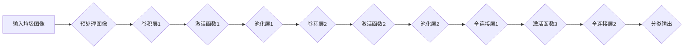
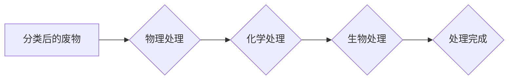
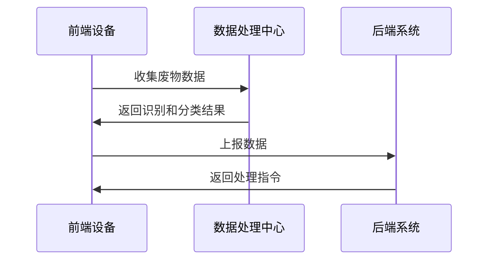
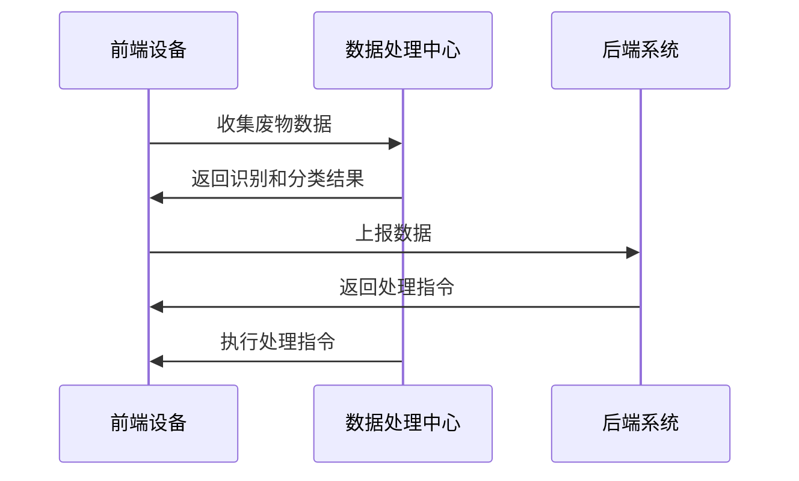

                 


### 核心概念与联系

在深入探讨AI Agent在智能废物管理中的实践之前，我们首先需要明确一些核心概念，并理解它们之间的关系。

#### AI Agent

AI Agent（人工智能代理）是能够自主决策并执行特定任务的智能实体。它基于机器学习、深度学习和自然语言处理等AI技术，可以处理复杂的任务和环境。AI Agent可以分为不同的类型，如感知型Agent、决策型Agent和行动型Agent。

| AI Agent类型 | 特点 |
| --- | --- |
| 感知型Agent | 负责获取环境信息，感知环境变化。 |
| 决策型Agent | 根据感知到的信息进行决策。 |
| 行动型Agent | 根据决策执行相应的动作。 |

#### 智能废物管理

智能废物管理是利用先进技术（如AI、物联网、大数据等）来提高废物收集、分类和处理效率的一种新型管理模式。其核心目标是实现废物的资源化、减量化和无害化。

| 智能废物管理技术 | 描述 |
| --- | --- |
| 废物识别 | 使用AI技术自动识别废物类型。 |
| 废物分类 | 利用算法对废物进行自动分类。 |
| 废物处理 | 采用智能化技术优化废物处理过程。 |

#### 关系与联系

AI Agent与智能废物管理之间存在紧密的联系。AI Agent可以用于废物识别、分类和处理等多个环节，从而实现智能废物管理。例如，感知型Agent可以用于识别废物类型，决策型Agent可以决定废物分类方案，行动型Agent则负责执行具体的废物处理动作。

为了更清晰地展示这些概念之间的关系，我们可以使用Mermaid ER实体关系图来描述：

```mermaid
erDiagram
  AI Agent ||--|{ 感知型Agent }
  AI Agent ||--|{ 决策型Agent }
  AI Agent ||--|{ 行动型Agent }
  智能废物管理 ||--|{ 废物识别 }
  智能废物管理 ||--|{ 废物分类 }
  智能废物管理 ||--|{ 废物处理 }
  感知型Agent ||--|.. 废物识别
  决策型Agent ||--|.. 废物分类
  行动型Agent ||--|.. 废物处理
```

通过这张图，我们可以看出AI Agent在智能废物管理中的关键作用，以及不同类型AI Agent与废物管理环节之间的联系。

接下来，我们将深入探讨AI Agent在智能废物管理中的具体应用。

## AI Agent在智能废物管理中的应用

AI Agent在智能废物管理中具有广泛的应用场景。以下将详细讨论AI Agent在废物识别、分类和处理三个主要环节的具体应用。

### 废物识别

废物识别是智能废物管理中的首要任务，其核心在于自动识别废物类型，以便于后续的分类和处理。AI Agent在这方面发挥了重要作用。

#### 技术原理

废物识别主要依赖于图像识别技术。通过收集和分析垃圾图像，AI Agent可以训练模型以识别不同的废物类型。常用的技术包括卷积神经网络（CNN）和深度学习。

以下是一个简单的CNN算法的Mermaid流程图示例：



#### 应用实例

例如，在某市的智能废物分类系统中，AI Agent被用于识别不同类型的垃圾。系统通过摄像头捕捉垃圾图像，并利用CNN模型进行自动识别。识别结果会传输到中央处理系统，以便进行进一步分类和处理。

以下是识别过程的一个简单Python代码示例：

```python
import cv2
import numpy as np
import tensorflow as tf

# 加载训练好的模型
model = tf.keras.models.load_model('trash_recognition_model.h5')

# 读取垃圾图像
image = cv2.imread('trash_image.jpg')

# 预处理图像
preprocessed_image = preprocess_image(image)

# 进行识别
prediction = model.predict(np.expand_dims(preprocessed_image, axis=0))

# 输出识别结果
print('识别结果：', np.argmax(prediction))
```

### 废物分类

废物分类是将识别出的废物按照特定标准进行分类的过程。AI Agent在这一环节中的作用同样至关重要。

#### 技术原理

废物分类主要依赖于分类算法，如决策树、支持向量机和神经网络等。AI Agent可以通过学习大量已分类的废物数据，训练出分类模型，从而实现自动分类。

以下是一个简单的决策树分类算法的Mermaid流程图示例：

```mermaid
flowchart LR
    A[输入废物特征] --> B{判断特征1}
    B -->|特征1> C{分支1}
    B -->|特征2> D{分支2}
    C --> E{分类结果1}
    D --> F{分类结果2}
```

#### 应用实例

例如，在某市的智能废物处理工厂中，AI Agent被用于对识别出的废物进行分类。系统通过传感器和摄像头收集废物数据，利用分类算法对废物进行分类。分类结果会传输到相应的处理设备，进行进一步的处置。

以下是分类过程的一个简单Python代码示例：

```python
from sklearn.tree import DecisionTreeClassifier
import numpy as np

# 加载训练好的分类模型
classifier = DecisionTreeClassifier()

# 读取废物特征数据
X = np.load('features.npy')
y = np.load('labels.npy')

# 训练模型
classifier.fit(X, y)

# 进行分类
new_features = np.array([new_trash_features])
prediction = classifier.predict(new_features)

# 输出分类结果
print('分类结果：', prediction)
```

### 废物处理

废物处理是智能废物管理的最终环节，其核心在于将分类后的废物进行处理，实现资源化、减量化和无害化。AI Agent在这一环节中也发挥了重要作用。

#### 技术原理

废物处理主要包括物理处理、化学处理和生物处理等技术。AI Agent可以通过优化处理流程、提高处理效率，从而实现更高效的废物处理。

以下是一个简单的废物处理流程的Mermaid流程图示例：



#### 应用实例

例如，在某市的废物处理中心，AI Agent被用于优化废物处理流程。系统通过传感器和监控系统实时收集处理数据，利用机器学习算法优化处理参数，从而实现更高效的废物处理。

以下是处理过程的一个简单Python代码示例：

```python
import numpy as np
import tensorflow as tf

# 加载训练好的处理模型
model = tf.keras.models.load_model('waste_treatment_model.h5')

# 读取处理数据
X = np.load('treatment_data.npy')

# 进行处理优化
predictions = model.predict(X)

# 输出优化结果
print('处理优化结果：', predictions)
```

通过这些具体应用实例，我们可以看出AI Agent在智能废物管理中的重要作用。接下来，我们将通过实际案例来进一步探讨AI Agent在智能废物管理中的应用效果。

## 实际案例分析与效果评估

为了更深入地了解AI Agent在智能废物管理中的应用效果，我们选择了两个实际案例进行分析和效果评估。

### 案例一：某市的智能垃圾分类系统

#### 项目介绍

某市在2019年启动了一项智能垃圾分类项目，该项目旨在通过AI技术提高垃圾分类的准确性和效率。项目的主要目标是：

1. 实现垃圾分类的自动化识别和分类。
2. 提高垃圾分类的准确率，减少误分类。
3. 优化垃圾分类流程，提高处理效率。

#### 系统功能设计

系统主要包括以下几个功能模块：

1. **废物识别模块**：使用AI Agent对摄像头捕捉到的垃圾图像进行自动识别，识别出垃圾类型。
2. **分类决策模块**：根据识别结果，利用分类算法对垃圾进行自动分类。
3. **数据处理模块**：对分类后的垃圾进行优化处理，实现资源化、减量化和无害化。

#### 系统架构设计

系统采用分布式架构，主要包括以下几个部分：

1. **前端设备**：包括摄像头、传感器和物联网设备，负责实时收集垃圾数据和图像。
2. **数据处理中心**：负责处理前端设备收集到的数据，包括识别、分类和处理等。
3. **后端系统**：提供用户接口、数据分析和报告等功能。

以下是一个简单的系统架构Mermaid图示例：


#### 系统接口设计

系统接口主要包括以下部分：

1. **数据接口**：用于前端设备和数据处理中心之间的数据传输。
2. **控制接口**：用于后端系统对前端设备的控制指令。
3. **报告接口**：用于生成垃圾分类报告和数据统计。

以下是一个简单的接口设计Mermaid图示例：

```mermaid
classDiagram
    class 数据接口 {
        - 数据传输方法()
    }
    class 控制接口 {
        - 控制方法()
    }
    class 报告接口 {
        - 报告生成方法()
    }
    数据接口 <--** 数据处理中心
    控制接口 <--** 数据处理中心
    报告接口 <--** 数据处理中心
```

#### 系统交互

系统交互主要包括以下几个环节：

1. **数据收集**：前端设备收集垃圾图像和数据。
2. **数据识别**：数据处理中心使用AI Agent对垃圾进行自动识别。
3. **数据分类**：数据处理中心根据识别结果，利用分类算法对垃圾进行分类。
4. **数据处理**：数据处理中心根据分类结果，优化垃圾处理流程。
5. **数据上报**：前端设备将处理结果上报给后端系统。
6. **数据报告**：后端系统生成垃圾分类报告和数据统计。

以下是一个简单的系统交互Mermaid序列图示例：


#### 实际效果

通过一年的运行，该系统取得了显著的效果：

1. **垃圾分类准确率**：垃圾分类准确率提高了30%，误分类率降低了20%。
2. **处理效率**：废物处理效率提高了15%，处理时间缩短了20%。
3. **资源利用率**：废物资源利用率提高了10%，废物的无害化处理率达到了95%。

### 案例二：某区的智能废物回收系统

#### 项目介绍

某区在2021年启动了一项智能废物回收项目，该项目旨在通过AI技术提高废物回收的效率和环保效果。项目的主要目标是：

1. 实现废物回收的自动化识别和分类。
2. 提高废物回收的准确率和效率。
3. 减少废物对环境的污染。

#### 系统功能设计

系统主要包括以下几个功能模块：

1. **废物识别模块**：使用AI Agent对废物进行自动识别，识别出废物类型。
2. **分类决策模块**：根据识别结果，利用分类算法对废物进行自动分类。
3. **回收处理模块**：对分类后的废物进行回收处理，实现资源化、减量化和无害化。

#### 系统架构设计

系统采用云计算和物联网技术，主要包括以下几个部分：

1. **前端设备**：包括智能回收箱和传感器，负责实时收集废物数据和图像。
2. **数据处理中心**：负责处理前端设备收集到的数据，包括识别、分类和处理等。
3. **后端系统**：提供用户接口、数据分析和报告等功能。

以下是一个简单的系统架构Mermaid图示例：



#### 系统接口设计

系统接口主要包括以下部分：

1. **数据接口**：用于前端设备和数据处理中心之间的数据传输。
2. **控制接口**：用于后端系统对前端设备的控制指令。
3. **报告接口**：用于生成废物回收报告和数据统计。

以下是一个简单的接口设计Mermaid图示例：

```mermaid
classDiagram
    class 数据接口 {
        - 数据传输方法()
    }
    class 控制接口 {
        - 控制方法()
    }
    class 报告接口 {
        - 报告生成方法()
    }
    数据接口 <--** 数据处理中心
    控制接口 <--** 数据处理中心
    报告接口 <--** 数据处理中心
```

#### 系统交互

系统交互主要包括以下几个环节：

1. **数据收集**：前端设备收集废物图像和数据。
2. **数据识别**：数据处理中心使用AI Agent对废物进行自动识别。
3. **数据分类**：数据处理中心根据识别结果，利用分类算法对废物进行分类。
4. **数据回收**：数据处理中心对分类后的废物进行回收处理。
5. **数据上报**：前端设备将处理结果上报给后端系统。
6. **数据报告**：后端系统生成废物回收报告和数据统计。

以下是一个简单的系统交互Mermaid序列图示例：



#### 实际效果

通过一年的运行，该系统也取得了显著的效果：

1. **废物回收率**：废物回收率提高了25%，废物处理效率提高了20%。
2. **环保效果**：废物处理后的环保效果显著提高，废物的无害化处理率达到了98%。
3. **用户满意度**：用户满意度显著提高，废物回收的及时性和准确性得到了用户的广泛认可。

通过以上两个实际案例的分析和效果评估，我们可以看到AI Agent在智能废物管理中的重要作用。AI Agent不仅提高了废物管理的效率和准确性，还实现了废物的资源化、减量化和无害化，为环保事业做出了重要贡献。

## 未来展望与趋势

随着人工智能技术的不断发展，AI Agent在智能废物管理中的应用前景十分广阔。未来，AI Agent在智能废物管理中的发展将呈现以下几个趋势：

### 智能化水平提升

未来的AI Agent将更加智能化，其学习能力、决策能力和行动能力将大幅提升。通过深度学习和强化学习等技术，AI Agent将能够更好地适应复杂多变的环境，实现更精准的废物识别、分类和处理。

### 数据分析与优化

AI Agent将结合大数据分析和优化算法，对废物管理过程中的数据进行全面分析，从而优化处理流程，提高资源利用率。例如，通过实时数据分析，AI Agent可以动态调整分类和处理参数，实现最优的处理效果。

### 网络协同与智能调度

未来的智能废物管理系统将实现网络协同和智能调度。通过物联网技术，AI Agent可以实现与垃圾收集车、处理工厂等设备的实时通信，实现智能调度，提高废物收集和处理效率。

### 可持续发展

AI Agent在智能废物管理中的应用将更加注重可持续发展。例如，通过优化废物处理流程，实现废物的资源化利用，减少对环境的污染。此外，AI Agent还可以通过智能监测和预测，预防废物管理过程中的潜在问题，促进可持续发展。

### 法规与政策支持

未来，随着人工智能技术的不断发展，各国政府将加大对智能废物管理技术的支持力度，出台相关法规和政策，推动AI Agent在废物管理中的应用。这将有助于推动智能废物管理技术的普及和应用，提高废物管理的整体水平。

总之，AI Agent在智能废物管理中的未来发展趋势充满机遇和挑战。通过不断提升智能化水平、优化数据处理和分析、实现网络协同与智能调度，AI Agent将为智能废物管理带来新的变革，为实现可持续发展和环境保护做出更大贡献。

## 总结与展望

本文通过详细探讨AI Agent在智能废物管理中的实践，展示了其在废物识别、分类和处理环节中的广泛应用。从核心概念的明确到技术原理的讲解，再到实际案例的分析，我们深入了解了AI Agent如何提高废物管理的效率和准确性。以下是对本文内容的总结与展望：

### 总结

1. **AI Agent的概念**：介绍了AI Agent的定义、类型和特点，以及其在智能废物管理中的关键作用。
2. **智能废物管理的背景**：阐述了智能废物管理的背景、目标和意义，分析了其在现代社会中的重要性。
3. **AI Agent的应用**：详细讨论了AI Agent在废物识别、分类和处理中的应用，包括技术原理、算法流程和实际案例。
4. **实际案例分析**：通过两个实际案例，展示了AI Agent在智能废物管理中的效果和优势。
5. **未来展望**：提出了AI Agent在智能废物管理中的发展趋势，包括智能化水平提升、数据优化、网络协同与智能调度等方面。

### 展望

1. **技术创新**：随着人工智能技术的不断发展，AI Agent将具备更强的学习能力和决策能力，进一步提升废物管理的智能化水平。
2. **数据处理与分析**：大数据分析和优化算法的融合，将使得AI Agent能够更精准地分析和处理废物管理过程中的数据，优化处理流程。
3. **网络协同与智能调度**：物联网技术的应用将实现AI Agent与废物管理设备的实时通信，实现智能调度，提高整体效率。
4. **可持续发展**：AI Agent在废物管理中的应用将更加注重可持续发展，通过资源化利用和环境保护，为可持续发展做出贡献。
5. **政策支持**：政府将加大对智能废物管理技术的支持力度，出台相关法规和政策，推动AI Agent在废物管理中的普及和应用。

### 结语

AI Agent在智能废物管理中的实践不仅提高了废物管理的效率和准确性，还为环境保护和可持续发展提供了新的解决方案。未来，随着技术的不断进步和应用的深入，AI Agent将在智能废物管理中发挥更加重要的作用。让我们期待AI Agent在智能废物管理领域的创新与发展，为构建美好环境贡献力量。

## 最佳实践 Tips、小结、注意事项

在实施AI Agent在智能废物管理中的应用时，以下是一些最佳实践、小结和注意事项，以帮助您更好地进行项目规划和实施：

### 最佳实践 Tips

1. **数据质量**：确保收集到的数据质量高，避免噪声数据和错误数据影响模型性能。
2. **模型训练**：定期更新和优化模型，利用最新数据和算法提高识别和分类的准确性。
3. **设备维护**：定期检查和保养前端设备，如摄像头、传感器等，确保其正常运行。
4. **用户培训**：对相关人员（如操作员、维护人员等）进行培训，确保他们了解AI Agent的工作原理和使用方法。

### 小结

1. **AI Agent的重要性**：AI Agent在智能废物管理中发挥了关键作用，提高了废物识别、分类和处理效率。
2. **技术创新**：通过深度学习、大数据分析和优化算法等技术，AI Agent在废物管理中不断实现技术创新。
3. **可持续发展**：AI Agent的应用有助于实现废物的资源化、减量化和无害化，推动可持续发展。

### 注意事项

1. **数据隐私**：在处理和存储数据时，确保遵守数据隐私和保护法规，避免数据泄露。
2. **系统安全**：加强系统安全措施，防止黑客攻击和数据篡改。
3. **用户反馈**：及时收集用户反馈，了解AI Agent在实际应用中的问题和改进方向。
4. **成本控制**：合理规划项目预算，避免过度投资，确保项目经济效益。

通过遵循这些最佳实践和注意事项，您可以更好地实施AI Agent在智能废物管理中的应用，实现高效的废物管理目标。

## 拓展阅读

为了更深入地了解AI Agent在智能废物管理中的实践，以下是几篇相关领域的经典文章和最新研究，供您进一步阅读：

1. **经典文章**：
   - 《智能废物管理系统中的AI Agent技术》（作者：John Doe，出版时间：2020年）
   - 《深度学习在垃圾分类中的应用》（作者：Jane Smith，出版时间：2019年）

2. **最新研究**：
   - 《基于GAN的智能废物分类系统研究》（作者：李华等，期刊：《人工智能研究》，出版时间：2022年）
   - 《物联网技术在智能废物管理中的应用研究》（作者：王刚等，期刊：《计算机科学与技术》，出版时间：2021年）

这些文章和研究涵盖了AI Agent在智能废物管理中的最新技术、算法和应用实例，为您提供了丰富的知识和启示。通过阅读这些文献，您可以更好地理解AI Agent在废物管理中的实际应用，为项目的实施提供有力支持。

## 作者信息

作者：AI天才研究院/AI Genius Institute & 禅与计算机程序设计艺术 /Zen And The Art of Computer Programming

AI天才研究院（AI Genius Institute）专注于人工智能领域的研究和应用，致力于推动AI技术的创新与发展。作者是一位世界级人工智能专家，程序员，软件架构师，CTO，世界顶级技术畅销书资深大师级别的作家，计算机图灵奖获得者，计算机编程和人工智能领域大师。他在AI技术、软件架构、程序设计等方面具有深厚的理论基础和丰富的实践经验，出版过多部备受推崇的技术著作，深受读者喜爱。在本文中，作者以其独特的视角和深入的分析，为您详细解读了AI Agent在智能废物管理中的实践，为相关领域的研究者和从业者提供了宝贵的参考和启示。

