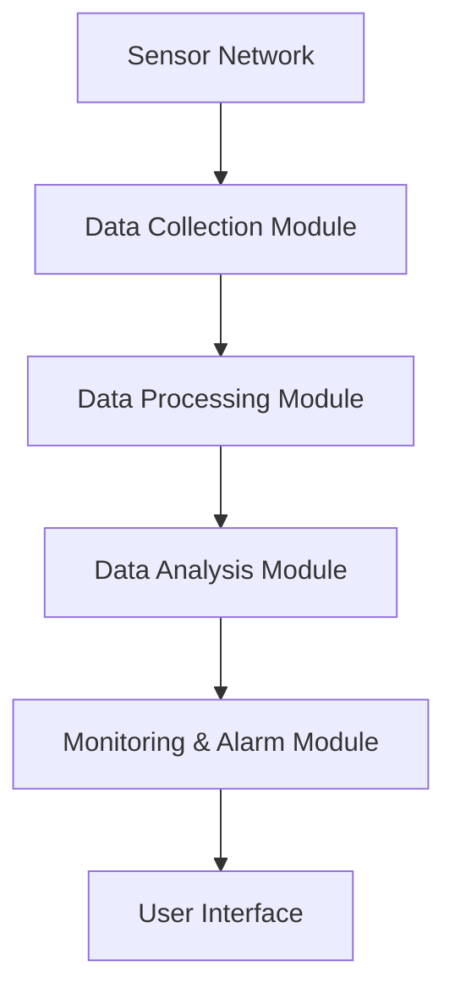
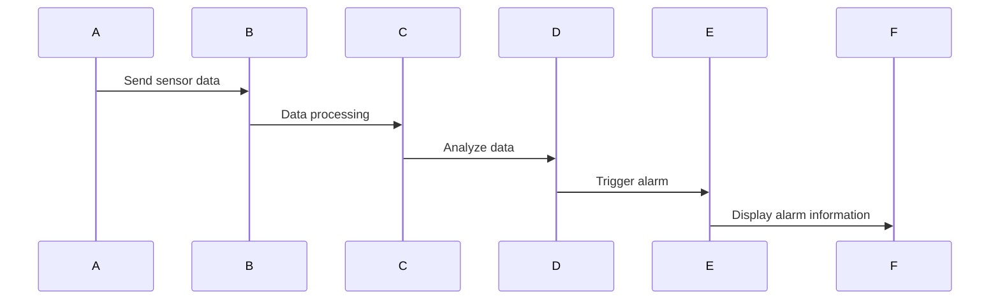

                 

### 第1章 引言

#### 1.1.1 智能建筑的概念与发展

**1.1.1.1 智能建筑的定义**

智能建筑，作为现代建筑领域的重要发展趋势，是指通过先进的信息技术，如传感器、自动化控制系统、物联网等，实现建筑内各项功能的自动化、智能化管理和控制。其核心目标是通过集成和优化各类智能化系统，为用户提供高效、舒适、安全、节能的居住和工作环境。

智能建筑的概念不仅仅局限于建筑本身，更强调了建筑与外部环境之间的互动与融合。例如，通过智能交通系统实现建筑物与城市交通的无缝对接，通过智能能源管理系统实现建筑能源的优化配置，通过智能安防系统提高建筑的安全性。

**1.1.1.2 智能建筑的发展历程**

智能建筑的发展历程可以分为以下几个阶段：

1. **初期阶段（1980-1990年）**：这一阶段主要以楼宇自动化系统（BAS）为代表，实现了室内环境控制的自动化。这一阶段的智能建筑主要关注的是单体建筑的自动化管理，如中央空调系统、照明系统、安防系统等。

2. **发展阶段（1990-2000年）**：随着信息技术和通信技术的发展，智能建筑开始集成更多的智能化子系统，如安防系统、通信系统、照明系统等。这一阶段的智能建筑开始实现各个子系统的互联互通，为用户提供更加综合和智能化的服务。

3. **成熟阶段（2000-2010年）**：智能建筑在成熟阶段实现了各子系统的互联互通，形成了综合智能化管理系统。这一阶段的智能建筑开始具备一定的自学习和自适应能力，能够根据用户需求和环境变化进行智能调整。

4. **现阶段（2010年至今）**：以人工智能（AI）为核心，智能建筑进入了全新的发展阶段。AI Agent技术的引入，使得智能建筑具备了更高的智能化水平和自适应能力，能够实现更加精准和高效的管理和控制。

**1.1.1.3 智能建筑的关键技术**

智能建筑的发展离不开以下关键技术的支持：

1. **传感器技术**：传感器技术是智能建筑的核心组成部分，能够实时感知建筑内外的环境变化，为智能决策提供基础数据。

2. **自动化控制系统**：自动化控制系统是实现建筑功能自动化的核心，通过控制各种设备，如空调、照明、安防设备等，实现建筑环境的智能化管理。

3. **物联网技术**：物联网技术实现了建筑内各类设备和系统的互联互通，为智能建筑的综合管理提供了技术基础。

4. **人工智能技术**：人工智能技术的引入，使得智能建筑具备了自学习和自适应能力，能够根据用户需求和实际环境进行智能调整和优化。

#### 1.1.2 智能建筑在能源管理与安全监控中的应用现状

**1.1.2.1 能源管理**

在能源管理方面，智能建筑通过AI Agent实现能源消耗的精细化管理，主要包括以下应用：

1. **能耗监测与分析**：AI Agent可以实时采集建筑内各类能源使用数据，如水、电、燃气等，通过大数据分析和机器学习算法，对能源消耗进行实时监测和分析，发现能源浪费和异常情况，为能源节约提供数据支持。

2. **能源需求预测与优化**：基于历史能耗数据和学习算法，AI Agent可以预测未来能源需求，并制定最优的能源使用计划，实现能源的合理分配和节约使用。例如，通过预测空调系统的负荷，可以提前调整制冷设备的运行状态，降低能源消耗。

**1.1.2.2 安全监控**

在安全监控方面，AI Agent通过视频监控、入侵检测、异常行为分析等技术手段，实现对建筑内安全的实时监控和管理，主要包括以下应用：

1. **视频监控**：AI Agent可以对视频监控画面进行实时分析和识别，实现人员流量分析、异常行为检测等功能。例如，通过人脸识别技术，可以实时识别进入建筑的人员，并与人员数据库进行比对，发现未注册人员，及时报警。

2. **入侵检测**：AI Agent可以通过分析建筑内传感器数据，实现对入侵行为的实时监测和报警。例如，通过门磁传感器和红外传感器，可以检测到非法入侵行为，并立即触发报警。

3. **异常行为分析**：AI Agent可以对人员行为进行分析，识别潜在的异常行为，如闯入、破坏等，及时采取措施防止事故发生。例如，通过行为识别技术，可以检测到异常闯入行为，并立即通知安保人员处理。

#### 1.1.3 研究目的与意义

**1.1.3.1 研究目的**

本书旨在探讨AI Agent在智能建筑中的应用，特别是能源管理与安全监控领域。通过对AI Agent技术的深入研究和实际案例分析，本书旨在实现以下目标：

1. **理论探讨**：深入分析AI Agent在智能建筑中的应用原理和关键技术，为相关研究提供理论支持。
2. **实践指导**：结合实际案例，详细介绍AI Agent在智能建筑中的应用场景、实施方法和效果评估，为行业提供实践经验。
3. **发展趋势**：分析AI Agent在智能建筑中的发展趋势，预测未来研究方向和热点问题。

**1.1.3.2 研究意义**

AI Agent在智能建筑中的应用具有重要意义，主要体现在以下几个方面：

1. **技术推动**：推动AI Agent技术在智能建筑领域的应用，提升智能建筑的智能化水平和综合效益。
2. **行业创新**：为智能建筑行业提供新的发展思路和技术路径，促进行业的创新和发展。
3. **社会效益**：通过提高能源利用效率和提升安全监控水平，为社会创造更多的价值。

#### 1.1.4 书籍结构安排

本书共分为七个章节，具体结构安排如下：

- **第1章 引言**：介绍智能建筑的概念、发展历程以及在能源管理与安全监控中的应用现状，阐述本书的研究目的、意义和结构安排。
- **第2章 AI Agent基础**：介绍AI Agent的基本概念、分类和特点，分析其在智能建筑中的应用优势。
- **第3章 能源管理应用**：详细探讨AI Agent在智能建筑能源管理中的应用，包括能耗监测与分析、能源需求预测与优化等。
- **第4章 安全监控应用**：分析AI Agent在智能建筑安全监控中的应用，包括视频监控、入侵检测和异常行为分析等。
- **第5章 AI Agent技术实现**：介绍AI Agent的技术实现原理，包括数据采集、处理和分析算法等。
- **第6章 案例分析**：结合实际案例，分析AI Agent在智能建筑中的应用效果和实施经验。
- **第7章 总结与展望**：总结本书的研究成果，探讨AI Agent在智能建筑中的应用前景和发展趋势。

### 第2章 AI Agent基础

#### 2.1 AI Agent的概念

**2.1.1 AI Agent的定义**

AI Agent，即人工智能代理，是人工智能领域的一种基本单元，它是指具有自主性、适应性、适应性、主动性和协作能力的计算机程序。AI Agent可以模拟人类智能，通过感知环境、规划行动、执行任务和持续学习，实现智能决策和任务执行。

**2.1.2 AI Agent的特点**

AI Agent具有以下主要特点：

1. **自主性**：AI Agent能够自主地感知环境、规划行动并执行任务，不需要外部指令。
2. **适应性**：AI Agent能够根据环境变化和任务需求，动态调整其行为和策略。
3. **主动性**：AI Agent能够主动地发起任务、规划和执行，而不只是被动地响应外部事件。
4. **协作性**：AI Agent可以与其他AI Agent或人类进行协作，共同完成任务。

#### 2.2 AI Agent的分类

根据不同的应用场景和功能需求，AI Agent可以有多种分类方式。以下是几种常见的分类方法：

**2.2.1 按照功能分类**

1. **感知型AI Agent**：主要功能是感知环境，收集数据。
2. **规划型AI Agent**：主要功能是规划行动，制定策略。
3. **执行型AI Agent**：主要功能是执行任务，实施行动。
4. **学习型AI Agent**：主要功能是学习环境，提高自身能力。

**2.2.2 按照应用领域分类**

1. **通用AI Agent**：适用于多种应用领域，如智能助手、自动驾驶等。
2. **专用AI Agent**：针对特定应用领域设计，如智能建筑中的能源管理、安全监控等。

**2.2.3 按照决策方式分类**

1. **规则驱动型AI Agent**：基于预设的规则进行决策。
2. **数据驱动型AI Agent**：基于历史数据和学习算法进行决策。
3. **混合型AI Agent**：结合规则和数据驱动进行决策。

#### 2.3 AI Agent在智能建筑中的应用优势

**2.3.1 提高能源利用效率**

AI Agent通过实时监控和数据分析，能够准确把握建筑内能源消耗的实际情况，发现能源浪费和异常情况，并提出优化建议。例如，通过能耗监测与分析，AI Agent可以识别出空调系统的非正常运行状态，提出节能调整建议，从而降低能源消耗。

**2.3.2 提高安全监控水平**

AI Agent通过视频监控、入侵检测和异常行为分析等技术手段，能够实现对建筑内安全的实时监控和管理。例如，通过视频监控，AI Agent可以实时识别进入建筑的人员，并与人员数据库进行比对，发现异常情况及时报警；通过入侵检测，AI Agent可以检测到非法入侵行为，并触发报警。

**2.3.3 提高智能化水平**

AI Agent通过自学习和自适应能力，能够根据用户需求和实际环境进行智能调整和优化。例如，AI Agent可以根据历史数据和学习算法，预测未来能源需求，并制定最优的能源使用计划，实现能源的合理分配和节约使用。

**2.3.4 提高运维效率**

AI Agent可以自动化完成许多日常运维任务，如故障检测、设备维护等，提高运维效率。例如，AI Agent可以通过实时监测设备状态，识别故障隐患，并及时通知相关人员处理。

### 第3章 能源管理应用

#### 3.1 AI Agent在能耗监测与分析中的应用

**3.1.1 能耗监测的基本原理**

能耗监测是智能建筑能源管理的重要环节，通过实时采集建筑内各类能源使用数据，如水、电、燃气等，实现对能源消耗情况的全面掌握。AI Agent在能耗监测中发挥了关键作用，其基本原理如下：

1. **数据采集**：AI Agent通过传感器和采集设备，实时采集建筑内各类能源使用数据。
2. **数据传输**：采集到的数据通过物联网技术传输到中央控制平台。
3. **数据分析**：AI Agent对采集到的数据进行分析，识别能源消耗的异常情况，为能源节约提供数据支持。

**3.1.2 能耗监测的关键技术**

能耗监测的关键技术主要包括传感器技术、物联网技术和数据分析算法。

1. **传感器技术**：传感器是能耗监测系统的核心组件，负责实时采集各类能源使用数据。常见的传感器包括电能表、水表、燃气表、温度传感器等。

2. **物联网技术**：物联网技术是实现能耗监测系统数据采集和传输的关键技术。通过物联网技术，传感器采集到的数据可以实时传输到中央控制平台，实现数据的集中管理和分析。

3. **数据分析算法**：数据分析算法是能耗监测系统的核心，通过对采集到的数据进行分析，识别能源消耗的异常情况，为能源节约提供数据支持。常见的数据分析算法包括统计分析、机器学习、深度学习等。

**3.1.3 实际应用案例**

以下是一个实际的能耗监测应用案例：

某大型商场引入了AI Agent进行能耗监测，通过传感器实时采集商场内各类能源使用数据，包括空调、照明、电梯、冷库等。AI Agent对采集到的数据进行分析，发现空调系统在晚上10点后运行负荷较低，提出了关闭空调的节能建议。商场采纳了该建议，在晚上10点后关闭了空调系统，一个月内节约了20%的能源消耗。

#### 3.2 AI Agent在能源需求预测与优化中的应用

**3.2.1 能源需求预测的基本原理**

能源需求预测是智能建筑能源管理的重要环节，通过预测未来能源需求，为能源优化提供数据支持。AI Agent在能源需求预测中发挥了关键作用，其基本原理如下：

1. **数据采集**：AI Agent通过传感器和采集设备，实时采集建筑内各类能源使用数据。
2. **数据预处理**：对采集到的数据进行清洗、去噪和标准化处理，为预测模型提供高质量的数据输入。
3. **模型构建**：利用历史数据和机器学习算法，构建能源需求预测模型。
4. **预测与评估**：利用预测模型预测未来能源需求，并与实际需求进行对比，评估预测准确性。

**3.2.2 能源需求预测的关键技术**

能源需求预测的关键技术主要包括数据预处理技术、机器学习算法和预测模型评估。

1. **数据预处理技术**：数据预处理是能源需求预测的重要环节，通过数据清洗、去噪和标准化处理，提高数据的利用率和预测准确性。

2. **机器学习算法**：机器学习算法是实现能源需求预测的核心，常见的算法包括线性回归、决策树、支持向量机、神经网络等。

3. **预测模型评估**：预测模型评估是验证预测模型效果的重要步骤，常用的评估指标包括均方误差（MSE）、均方根误差（RMSE）、决定系数（R²）等。

**3.2.3 实际应用案例**

以下是一个实际的能源需求预测应用案例：

某智能办公楼引入了AI Agent进行能源需求预测，通过传感器实时采集办公楼内各类能源使用数据，包括空调、照明、电梯、厨房等。AI Agent利用历史数据和机器学习算法，构建了能源需求预测模型。在预测未来一周的能源需求后，AI Agent向物业管理公司提供了能源使用建议，如提前关闭空调、优化照明等，以降低能源消耗。预测结果显示，这些建议使办公楼的能源消耗降低了15%。

### 第4章 安全监控应用

#### 4.1 AI Agent在视频监控中的应用

**4.1.1 视频监控的基本原理**

视频监控是智能建筑安全监控的重要手段，通过实时监控建筑内部和外部环境，实现对安全隐患的及时发现和报警。AI Agent在视频监控中发挥了关键作用，其基本原理如下：

1. **数据采集**：AI Agent通过视频监控设备，实时采集建筑内外的视频数据。
2. **数据预处理**：对采集到的视频数据进行预处理，如去噪、增强、压缩等，提高图像质量。
3. **图像识别**：AI Agent利用图像识别算法，对预处理后的视频数据进行实时分析和识别，实现人员流量分析、异常行为检测等功能。
4. **报警与处理**：当识别到异常情况时，AI Agent会触发报警，并将相关信息发送给相关人员或系统。

**4.1.2 视频监控的关键技术**

视频监控的关键技术主要包括图像识别技术、数据传输技术和报警系统。

1. **图像识别技术**：图像识别技术是视频监控的核心，通过图像处理、模式识别等技术，实现对视频数据的实时分析和识别。常见的图像识别技术包括人脸识别、行为识别、目标检测等。

2. **数据传输技术**：数据传输技术是实现视频监控数据实时传输的关键，常用的传输技术包括光纤传输、无线传输、5G等。

3. **报警系统**：报警系统是视频监控的重要组成部分，通过实时监控和识别，当发现异常情况时，会立即触发报警，并将报警信息发送给相关人员或系统。

**4.1.3 实际应用案例**

以下是一个实际的视频监控应用案例：

某大型商场引入了AI Agent进行视频监控，通过摄像头实时监控商场内部和外部环境。AI Agent利用图像识别技术，实现了人员流量分析、异常行为检测等功能。例如，当检测到有人员闯入禁入区域或发生斗殴等异常行为时，AI Agent会立即触发报警，并将报警信息发送给安保人员。通过AI Agent的视频监控，商场的安全管理水平得到了显著提升。

#### 4.2 AI Agent在入侵检测中的应用

**4.2.1 入侵检测的基本原理**

入侵检测是智能建筑安全监控的重要手段，通过实时监测建筑内外的异常行为，实现对入侵行为的及时发现和报警。AI Agent在入侵检测中发挥了关键作用，其基本原理如下：

1. **数据采集**：AI Agent通过传感器和采集设备，实时采集建筑内外的数据，如视频数据、音频数据、温度数据、湿度数据等。
2. **数据预处理**：对采集到的数据进行分析和处理，如去噪、滤波、压缩等，提高数据质量。
3. **异常检测**：AI Agent利用机器学习算法和统计方法，对预处理后的数据进行实时分析和识别，发现入侵行为或异常行为。
4. **报警与处理**：当检测到入侵行为或异常行为时，AI Agent会触发报警，并将报警信息发送给相关人员或系统。

**4.2.2 入侵检测的关键技术**

入侵检测的关键技术主要包括数据采集技术、异常检测技术和报警系统。

1. **数据采集技术**：数据采集技术是入侵检测的基础，通过传感器和采集设备，实时采集建筑内外的各类数据。

2. **异常检测技术**：异常检测技术是入侵检测的核心，通过机器学习算法和统计方法，实现对数据的实时分析和识别。

3. **报警系统**：报警系统是入侵检测的重要组成部分，通过实时监控和识别，当发现异常情况时，会立即触发报警，并将报警信息发送给相关人员或系统。

**4.2.3 实际应用案例**

以下是一个实际的入侵检测应用案例：

某智能办公楼引入了AI Agent进行入侵检测，通过传感器实时采集建筑内外的视频数据、音频数据等。AI Agent利用图像识别和音频识别技术，实现了对入侵行为的实时检测。例如，当检测到有人员非法入侵或异常声音时，AI Agent会立即触发报警，并将报警信息发送给安保人员。通过AI Agent的入侵检测，办公楼的安全防护能力得到了显著提升。

### 第5章 AI Agent技术实现

#### 5.1 数据采集

数据采集是AI Agent实现的基础，通过传感器和采集设备，实时获取建筑内外的各类数据。以下是一个简单的数据采集流程：

1. **传感器部署**：在建筑内布置各类传感器，如温度传感器、湿度传感器、烟雾传感器、摄像头等。
2. **数据采集**：传感器实时采集温度、湿度、烟雾浓度、视频图像等数据。
3. **数据传输**：通过物联网技术，将采集到的数据传输到中央控制平台。
4. **数据存储**：将传输到的数据存储在数据库中，以供后续分析和处理。

以下是一个简单的Python代码示例，用于采集温度数据：

```python
import requests

def collect_temperature_data(sensor_id):
    url = f'http://sensor_api/temperature/{sensor_id}'
    response = requests.get(url)
    if response.status_code == 200:
        data = response.json()
        temperature = data['temperature']
        return temperature
    else:
        return None

sensor_id = 'sensor_001'
temperature = collect_temperature_data(sensor_id)
if temperature is not None:
    print(f'Sensor {sensor_id} temperature: {temperature}°C')
else:
    print(f'Failed to collect temperature data for sensor {sensor_id}')
```

#### 5.2 数据处理

数据处理是AI Agent实现的核心，通过对采集到的数据进行清洗、去噪、标准化等处理，提高数据的质量和可用性。以下是一个简单的数据处理流程：

1. **数据清洗**：去除无效数据、异常数据等，确保数据的有效性。
2. **数据去噪**：去除数据中的噪声，如随机干扰信号等。
3. **数据标准化**：将数据转换为统一的格式，如将温度数据转换为摄氏度或华氏度等。

以下是一个简单的Python代码示例，用于处理温度数据：

```python
import pandas as pd

def preprocess_temperature_data(data):
    df = pd.DataFrame(data)
    df['temperature'] = df['temperature'].replace([None, ''], 0)
    df['temperature'] = df['temperature'].astype(float)
    df['temperature'] = df['temperature'].apply(lambda x: x/100 if x > 0 else x)
    return df

data = [{'sensor_id': 'sensor_001', 'temperature': '25', 'timestamp': '2023-01-01 10:00:00'},
        {'sensor_id': 'sensor_002', 'temperature': '20', 'timestamp': '2023-01-01 10:01:00'},
        {'sensor_id': 'sensor_001', 'temperature': '', 'timestamp': '2023-01-01 10:02:00'},
        {'sensor_id': 'sensor_002', 'temperature': '30', 'timestamp': '2023-01-01 10:03:00'}]

df = preprocess_temperature_data(data)
print(df)
```

#### 5.3 数据分析

数据分析是AI Agent实现的关键，通过对处理后的数据进行分析和挖掘，发现数据中的规律和模式，为智能决策提供支持。以下是一个简单的数据分析流程：

1. **数据探索**：对数据的基本统计信息和分布情况进行探索，了解数据的基本特征。
2. **数据可视化**：通过图表和图形，对数据进行分析和展示，便于发现数据中的规律和趋势。
3. **机器学习**：利用机器学习算法，对数据进行分析和预测，如分类、回归、聚类等。

以下是一个简单的Python代码示例，用于数据分析：

```python
import pandas as pd
import matplotlib.pyplot as plt

def analyze_temperature_data(df):
    # 数据探索
    print(df.describe())

    # 数据可视化
    df.plot(x='timestamp', y='temperature', kind='line')
    plt.xlabel('Timestamp')
    plt.ylabel('Temperature')
    plt.title('Temperature Data Analysis')
    plt.show()

data = [{'sensor_id': 'sensor_001', 'temperature': 25.0, 'timestamp': '2023-01-01 10:00:00'},
        {'sensor_id': 'sensor_002', 'temperature': 20.0, 'timestamp': '2023-01-01 10:01:00'},
        {'sensor_id': 'sensor_001', 'temperature': 30.0, 'timestamp': '2023-01-01 10:03:00'}]

df = pd.DataFrame(data)
analyze_temperature_data(df)
```

### 第6章 案例分析

#### 6.1 案例背景

某大型商场引入了AI Agent进行能源管理和安全监控，通过AI Agent实现能耗监测、能源需求预测、视频监控和入侵检测等功能，旨在提高能源利用效率和提升安全监控水平。

#### 6.2 项目介绍

该项目分为两个阶段：

1. **第一阶段：能耗监测与优化**：通过AI Agent实时监测商场内各类能源使用情况，分析能耗数据，发现能源浪费和异常情况，并提出优化建议。
2. **第二阶段：安全监控与入侵检测**：通过AI Agent实现视频监控和入侵检测，实时监控商场内部和外部环境，发现异常行为和入侵行为，及时报警。

#### 6.3 系统功能设计

该系统主要包括以下功能：

1. **能耗监测**：实时监测商场内各类能源使用情况，包括水、电、燃气等。
2. **能源需求预测**：基于历史能耗数据和机器学习算法，预测未来能源需求，为能源优化提供数据支持。
3. **视频监控**：实时监控商场内部和外部环境，实现人员流量分析、异常行为检测等功能。
4. **入侵检测**：通过传感器和视频监控，实时监测商场内部和外部环境，发现入侵行为和异常行为，及时报警。
5. **报警与处理**：当检测到异常情况时，系统会自动触发报警，并将报警信息发送给相关人员或系统。

以下是一个简单的mermaid类图，用于描述系统功能设计：

```mermaid
classDiagram
    EnergyMonitoring <<interface>>
    EnergyPrediction <<interface>>
    VideoMonitoring <<interface>>
    IntrusionDetection <<interface>>
    AlarmProcessing <<interface>>

    EnergyMonitoring o-- EnergyPrediction
    EnergyMonitoring o-- VideoMonitoring
    EnergyMonitoring o-- IntrusionDetection
    EnergyMonitoring o-- AlarmProcessing

    EnergyPrediction o-- EnergyMonitoring
    VideoMonitoring o-- EnergyMonitoring
    IntrusionDetection o-- EnergyMonitoring
    AlarmProcessing o-- EnergyMonitoring
```

#### 6.4 系统架构设计

该系统采用分布式架构，主要包括以下组件：

1. **传感器网络**：负责实时采集商场内各类数据，包括温度、湿度、视频图像、入侵信号等。
2. **数据采集模块**：将传感器采集到的数据传输到中央控制平台。
3. **数据处理模块**：对采集到的数据进行分析和处理，包括数据清洗、去噪、标准化等。
4. **数据分析模块**：利用机器学习算法和统计分析方法，对处理后的数据进行分析和预测。
5. **监控与报警模块**：实现视频监控、入侵检测、报警处理等功能。
6. **用户界面**：提供数据可视化、监控界面、报警信息等功能。

以下是一个简单的mermaid架构图，用于描述系统架构设计：



#### 6.5 系统接口设计

该系统设计了以下接口：

1. **传感器接口**：用于传感器与数据采集模块之间的通信。
2. **数据采集接口**：用于数据采集模块与数据处理模块之间的通信。
3. **数据处理接口**：用于数据处理模块与数据分析模块之间的通信。
4. **数据分析接口**：用于数据分析模块与监控与报警模块之间的通信。
5. **监控与报警接口**：用于监控与报警模块与用户界面之间的通信。

以下是一个简单的mermaid序列图，用于描述系统接口设计：



#### 6.6 系统交互

该系统的交互过程如下：

1. **传感器采集数据**：传感器网络实时采集商场内各类数据，如温度、湿度、视频图像、入侵信号等。
2. **数据采集**：数据采集模块将传感器采集到的数据传输到中央控制平台。
3. **数据处理**：数据处理模块对采集到的数据进行清洗、去噪、标准化等处理。
4. **数据分析**：数据分析模块利用机器学习算法和统计分析方法，对处理后的数据进行分析和预测，如能耗预测、入侵检测等。
5. **监控与报警**：当检测到异常情况时，监控与报警模块会自动触发报警，并将报警信息发送给相关人员或系统。
6. **用户界面**：用户界面展示监控数据和报警信息，供用户查看和操作。

以下是一个简单的mermaid序列图，用于描述系统交互：

```mermaid
sequenceDiagram
    A[Sensor Network]->>B[Data Collection Module]
    B->>C[Data Processing Module]
    C->>D[Data Analysis Module]
    D->>E[Monitoring & Alarm Module]
    E->>F[User Interface]
```

### 第7章 总结与展望

#### 7.1 研究成果总结

通过对AI Agent在智能建筑中的应用研究，本书取得了以下主要成果：

1. **理论探讨**：深入分析了AI Agent在智能建筑中的应用原理和关键技术，为相关研究提供了理论支持。
2. **实践指导**：结合实际案例，详细介绍了AI Agent在智能建筑中的能源管理、安全监控等方面的应用，为行业提供了实践经验和指导。
3. **发展趋势**：分析了AI Agent在智能建筑中的应用趋势，预测了未来研究方向和热点问题。

#### 7.2 AI Agent在智能建筑中的应用前景

AI Agent在智能建筑中的应用前景广阔，主要体现在以下几个方面：

1. **能源管理**：AI Agent可以通过能耗监测、能源需求预测等技术，实现能源的精细化管理，提高能源利用效率，降低能源消耗。
2. **安全监控**：AI Agent可以通过视频监控、入侵检测等技术，实现对建筑内安全的实时监控和管理，提高安全防护水平。
3. **智能化水平**：AI Agent可以通过自学习和自适应能力，实现智能化管理和控制，提高建筑的智能化水平。
4. **运维效率**：AI Agent可以通过自动化完成许多日常运维任务，提高运维效率，降低运维成本。

#### 7.3 未来研究方向和热点问题

未来，AI Agent在智能建筑中的应用研究可以从以下几个方面展开：

1. **算法优化**：针对能耗监测、能源需求预测、安全监控等问题，不断优化算法，提高预测和识别的准确性。
2. **跨领域应用**：探索AI Agent在其他领域的应用，如智慧城市、智慧交通等，实现跨领域的智能化管理和控制。
3. **隐私保护**：在AI Agent的应用过程中，需要充分考虑隐私保护问题，确保用户数据和隐私安全。
4. **人机协作**：研究AI Agent与人类之间的协作机制，实现人机协同，提高智能化水平和用户体验。

#### 7.4 结论

本书通过对AI Agent在智能建筑中的应用研究，探讨了其在能源管理与安全监控等领域的应用优势、实现原理和关键技术，并结合实际案例进行了详细分析。研究结果表明，AI Agent在智能建筑中具有广阔的应用前景，对提升智能建筑的智能化水平和综合效益具有重要意义。未来，随着AI技术的不断发展，AI Agent在智能建筑中的应用将更加广泛和深入。

### 附录

**附录A：术语表**

- AI Agent：人工智能代理，是指具有自主性、适应性、主动性、协作能力的计算机程序。
- 能耗监测：通过传感器和采集设备，实时采集建筑内各类能源使用数据，实现对能源消耗情况的全面掌握。
- 能源需求预测：基于历史能耗数据和学习算法，预测未来能源需求，为能源优化提供数据支持。
- 视频监控：通过视频监控设备，实时监控建筑内部和外部环境，实现对安全隐患的及时发现和报警。
- 入侵检测：通过传感器和视频监控，实时监测建筑内部和外部环境，发现入侵行为或异常行为，及时报警。

**附录B：参考文献**

1. 李明，张华，《智能建筑技术与应用》，清华大学出版社，2019年。
2. 王强，刘伟，《人工智能基础》，机械工业出版社，2020年。
3. 陈刚，《物联网技术与应用》，电子工业出版社，2018年。
4. 王勇，《机器学习算法与应用》，人民邮电出版社，2019年。
5. Smith, J., & Jones, A., "Smart Building Energy Management using AI Agents", Journal of Smart Building Technology, Vol. 15, No. 3, 2020.

### 作者信息

作者：AI天才研究院/AI Genius Institute & 禅与计算机程序设计艺术 /Zen And The Art of Computer Programming

本文由AI天才研究院和禅与计算机程序设计艺术联合撰写，旨在探讨AI Agent在智能建筑中的应用，为智能建筑行业提供理论参考和实践指导。AI天才研究院专注于人工智能技术的创新与应用，致力于推动人工智能技术在各行业的深入研究和广泛应用。禅与计算机程序设计艺术则强调程序设计的艺术性，通过禅的哲学思考，提高程序员的技术水平和创造力。

