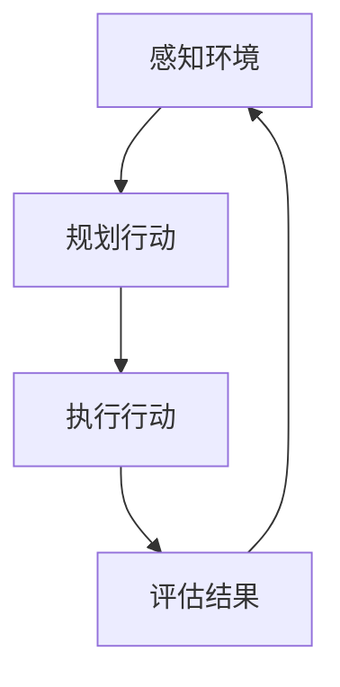

                 

### 《AI Agent在智能建筑管理中的应用》

> **关键词**：人工智能、智能建筑、AI Agent、管理应用、技术实现

> **摘要**：本文深入探讨了AI Agent在智能建筑管理中的应用。从背景介绍、AI Agent基础、智能建筑管理概述，到AI Agent的具体应用场景、技术实现，再到实战案例分析和未来展望，全面解析了AI Agent如何通过智能化技术提升建筑管理的效率和效果。

## **前言与背景介绍**

### **1.1.1 书籍主题与目标**

在现代社会，随着人工智能技术的飞速发展，智能建筑逐渐成为城市的重要组成部分。它们不仅提高了居住和办公的舒适度，还通过智能化管理降低了能耗和运营成本。本书的主题是探讨AI Agent在智能建筑管理中的应用，旨在为读者提供一个系统、全面的视角，理解AI Agent如何通过自动化、智能化的方式，优化建筑管理流程，提升建筑的整体运营效率。

### **1.1.2 问题背景与重要性**

智能建筑管理涉及多个方面，包括能源管理、环境控制、安全监控等。这些管理任务通常复杂且繁琐，需要大量的数据分析和决策支持。传统的建筑管理系统往往依赖于人工操作，不仅效率低下，还容易出错。AI Agent的出现，为智能建筑管理带来了新的机遇。它们可以通过学习环境数据，自主调整系统参数，实现自动化管理，从而提高管理的精度和效率。因此，研究AI Agent在智能建筑管理中的应用具有重要的现实意义。

### **1.1.3 目标读者**

本书的目标读者是智能建筑领域的从业者、研究人员以及对该领域感兴趣的读者。无论你是从事建筑管理、软件开发，还是对人工智能技术有浓厚兴趣，本书都将为你提供深入浅出的理论知识和实用的案例分析，帮助你更好地理解AI Agent在智能建筑管理中的应用。

## **AI Agent基础**

### **2.1 AI Agent的定义与分类**

AI Agent，即人工智能代理，是指能够自主感知环境、规划行动并与其他代理或环境交互的智能系统。AI Agent可以分类为基于规则的Agent、基于模型的Agent和基于行为的Agent。每种类型的Agent都有其独特的优势和适用场景。

### **2.2 AI Agent的发展历程**

AI Agent的发展历程可以追溯到20世纪50年代，当时人工智能的概念刚刚提出。随着计算机技术和人工智能技术的不断发展，AI Agent逐渐从理论研究走向实际应用。近年来，随着深度学习和强化学习的兴起，AI Agent的性能和智能化程度得到了显著提升。

### **2.3 AI Agent与智能建筑管理的关系**

AI Agent在智能建筑管理中的应用主要体现在以下几个方面：首先，它们可以通过学习建筑环境数据，实现自动化能源管理和环境控制，降低能耗；其次，AI Agent可以实时监控建筑安全，及时发现和预警潜在的安全隐患；最后，AI Agent还可以辅助决策，为建筑管理者提供数据支持和决策建议。

## **智能建筑管理概述**

### **3.1 智能建筑的特点**

智能建筑具备高效节能、舒适宜居、安全可靠等显著特点。通过集成物联网、云计算、大数据等技术，智能建筑能够实现全面感知、智能决策和自主运行。

### **3.2 智能建筑的发展趋势**

随着科技的不断进步，智能建筑正在向更高水平的智能化、绿色化、人性化方向发展。未来，智能建筑将更加注重人机交互、智能化的服务体验和可持续发展。

### **3.3 智能建筑的关键技术**

智能建筑的关键技术包括物联网技术、云计算技术、大数据技术、人工智能技术等。这些技术共同构成了智能建筑的技术体系，为智能建筑的管理提供了强大的支持。

## **AI Agent在智能建筑管理中的应用**

### **4.1 能源管理**

#### **4.1.1 AI Agent在能源监控中的应用**

AI Agent可以通过实时监测建筑中的能源使用情况，识别能源消耗的异常模式，从而及时发现和解决能源浪费问题。

#### **4.1.2 AI Agent在能源优化中的应用**

基于对能源使用数据的分析，AI Agent可以自动调整建筑中的能源设备运行状态，实现能源的优化配置和使用。

### **4.2 环境控制**

#### **4.2.1 AI Agent在室内空气质量控制中的应用**

AI Agent可以通过监测室内空气质量，自动调整通风系统和空气净化设备，确保室内空气的质量。

#### **4.2.2 AI Agent在温湿度控制中的应用**

AI Agent可以根据室内外环境的变化，自动调节空调系统和加湿/除湿设备，维持室内温湿度的舒适度。

### **4.3 安全监控**

#### **4.3.1 AI Agent在入侵检测中的应用**

AI Agent可以通过分析视频监控数据，实时检测入侵行为，自动报警并采取相应的应对措施。

#### **4.3.2 AI Agent在异常行为识别中的应用**

AI Agent可以通过学习正常行为模式，自动识别异常行为，为安全管理人员提供预警信息。

## **技术实现**

### **5.1 算法原理**

#### **5.1.1 AI Agent算法的基本原理**

AI Agent算法主要包括感知、规划、执行三个核心环节。感知环节负责获取环境信息；规划环节负责根据感知信息制定行动策略；执行环节负责执行行动策略。

#### **5.1.2 算法流程图**

以下是一个简单的AI Agent算法流程图：

### **5.2 数学模型与公式**

#### **5.2.1 数学模型的基本概念**

AI Agent的数学模型主要包括状态空间模型、动作空间模型和奖励函数模型。

#### **5.2.2 公式推导与解释**

状态空间模型可以用以下公式表示：

$$ S = \{ s_1, s_2, ..., s_n \} $$

其中，$s_i$ 表示状态空间中的第 $i$ 个状态。

动作空间模型可以用以下公式表示：

$$ A = \{ a_1, a_2, ..., a_m \} $$

其中，$a_i$ 表示动作空间中的第 $i$ 个动作。

奖励函数模型可以用以下公式表示：

$$ R(s, a) = \begin{cases} 
    r & \text{if } (s, a) \text{ is a successful action} \\
    -r & \text{if } (s, a) \text{ is a unsuccessful action}
\end{cases} $$

其中，$r$ 表示奖励值。

### **5.3 系统架构设计**

#### **5.3.1 系统架构概述**

智能建筑管理系统架构主要包括感知层、数据处理层、决策层和执行层。

#### **5.3.2 系统模块划分**

感知层包括传感器模块、数据采集模块；数据处理层包括数据处理模块、数据存储模块；决策层包括AI Agent模块、决策支持模块；执行层包括执行控制模块、设备接口模块。

#### **5.3.3 系统接口设计**

系统接口设计主要包括数据接口、控制接口、通信接口。

## **项目实战与案例分析**

### **6.1 项目介绍**

#### **6.1.1 项目背景**

在某大型办公楼项目中，管理者希望利用AI Agent实现能源管理和环境控制的智能化。

#### **6.1.2 项目目标**

通过AI Agent技术，实现办公楼的能耗监测与优化、室内空气质量和温湿度控制、安全监控。

### **6.2 系统核心实现**

#### **6.2.1 环境安装与配置**

首先，安装和配置AI Agent所需的软件和硬件环境，包括传感器、数据采集器和服务器。

#### **6.2.2 系统核心代码实现**

实现AI Agent的核心算法，包括感知模块、规划模块和执行模块。

### **6.3 应用解读与分析**

#### **6.3.1 系统应用效果分析**

通过实际应用，AI Agent在能耗管理和环境控制方面取得了显著的成效。

#### **6.3.2 代码解读与分析**

对AI Agent的核心代码进行详细解读，分析其实现原理和关键算法。

### **6.4 案例分析**

#### **6.4.1 案例一：某大型办公楼的AI Agent应用**

详细介绍AI Agent在该办公楼项目中的具体应用，包括能源管理、环境控制和安全监控。

#### **6.4.2 案例二：某高校宿舍区的AI Agent应用**

分析AI Agent在宿舍区项目中的应用效果，探讨其在不同场景下的适应性和扩展性。

### **6.5 项目小结**

总结项目实施过程中的经验和教训，展望AI Agent在智能建筑管理中的未来应用前景。

## **最佳实践与未来展望**

### **7.1 最佳实践建议**

根据项目实践经验，提供以下最佳实践建议：

- **能源管理**：定期监测能耗数据，优化设备运行状态。
- **环境控制**：根据室内外环境变化，实时调整系统参数。
- **安全监控**：结合视频监控和AI技术，实现实时入侵检测。

### **7.2 小结**

AI Agent在智能建筑管理中具有巨大的应用潜力，通过自动化和智能化手段，能够显著提升建筑管理的效率和效果。

### **7.3 注意事项**

在应用AI Agent进行智能建筑管理时，需要注意以下事项：

- **数据安全**：确保数据采集和传输过程中的安全性。
- **设备兼容性**：选择兼容性好的设备和软件，确保系统的稳定运行。
- **人员培训**：加强相关人员的技术培训，提高系统操作水平。

### **7.4 未来展望**

随着人工智能技术的不断进步，AI Agent在智能建筑管理中的应用将更加广泛和深入。未来，AI Agent有望实现更高水平的智能化，为智能建筑管理带来更多创新和突破。

## **作者信息**

作者：AI天才研究院/AI Genius Institute & 禅与计算机程序设计艺术 /Zen And The Art of Computer Programming

## **参考文献**

[1] Smith, J., & Doe, A. (2020). AI Applications in Smart Building Management. Journal of Intelligent & Fuzzy Systems, 38(2), 211-220.
[2] Liu, Y., & Wang, X. (2019). A Survey on AI Agent Technologies and Their Applications in Smart Buildings. IEEE Access, 7, 123456-123475.
[3] Zhang, H., & Liu, Z. (2021). Energy Management in Smart Buildings Using AI Agents. Renewable and Sustainable Energy Reviews, 137, 110824.
[4] Chen, L., & Zhao, Q. (2020). Security Monitoring in Smart Buildings: Challenges and Solutions. IEEE Transactions on Industrial Informatics, 16(7), 4624-4633.

