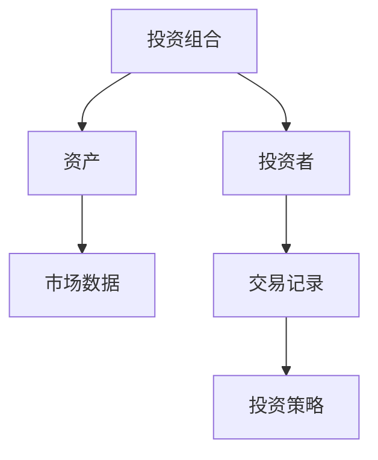
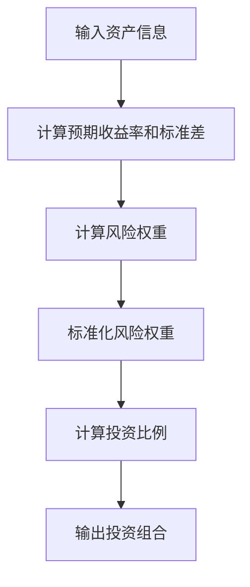
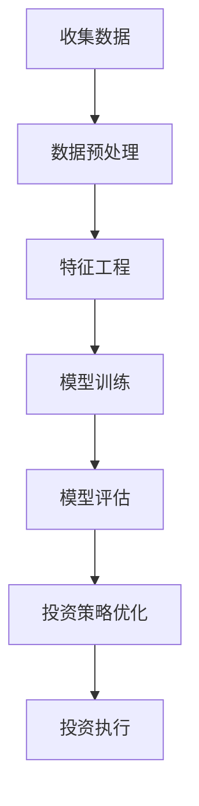
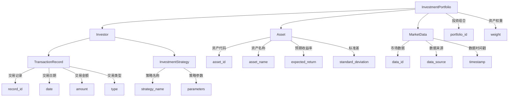
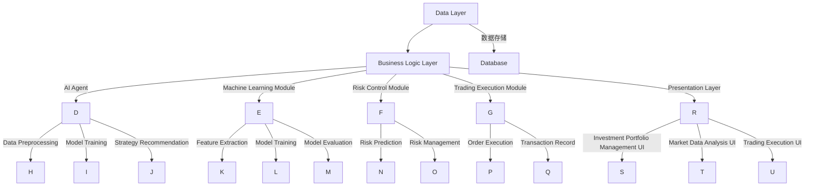
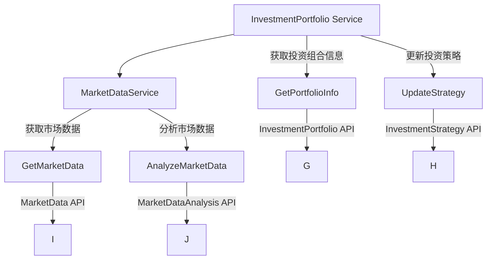
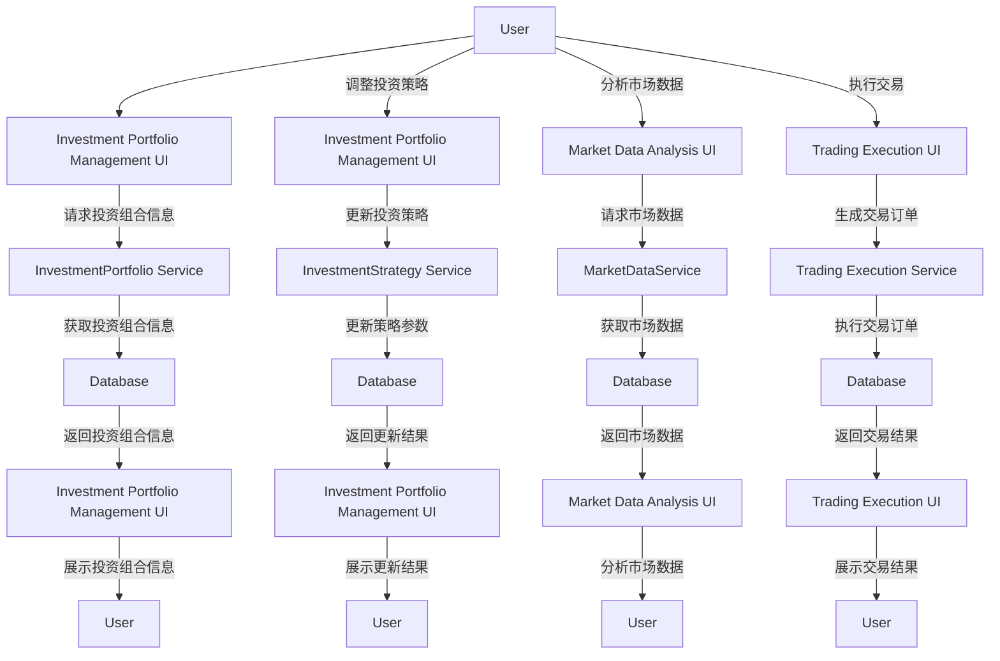

                 


### 《AI Agent在智能投资组合管理中的实践》

## 目录

- 第一部分：背景介绍
  - 第1章：AI与智能投资组合管理概述
  - 第2章：核心概念与联系
- 第二部分：算法原理讲解
  - 第3章：常见算法详解

## 第一部分：背景介绍

### 第1章：AI与智能投资组合管理概述

#### 1.1 问题背景

##### 1.1.1 投资组合管理的现状

投资组合管理是金融领域中的一项核心活动，旨在通过多种资产的组合来分散风险，实现资产的增值。传统投资组合管理主要依赖于人类专家的经验和直觉，虽然具有一定的效果，但在面对复杂多变的市场环境时，存在诸多不足。

##### 1.1.2 传统投资组合管理面临的挑战

- 数据处理能力有限：传统方法难以处理海量数据，无法充分利用大数据的优势。
- 决策效率低下：人工分析需要大量时间和精力，难以快速应对市场变化。
- 风险控制不足：传统方法难以精确预测市场走势，难以实现风险的有效控制。

##### 1.1.3 AI在投资组合管理中的应用潜力

随着人工智能技术的发展，AI在投资组合管理中展现出巨大的应用潜力。AI Agent作为一种智能体，能够通过自主学习、自适应调整，实现对投资组合的智能管理，提高投资效率、降低风险。

#### 1.2 问题描述

##### 1.2.1 传统投资组合管理的不足

- 依赖人类专家：传统投资组合管理高度依赖人类专家的经验和直觉，难以实现规模化。
- 难以应对市场变化：传统方法在应对市场波动时，反应速度较慢，难以迅速调整投资策略。
- 风险控制不足：传统方法难以精确预测市场走势，风险控制效果有限。

##### 1.2.2 AI Agent在投资组合管理中的关键作用

- 自适应：AI Agent能够根据市场变化实时调整投资策略，提高投资组合的灵活性和适应性。
- 自学习：AI Agent能够通过历史数据学习和优化投资策略，提高投资收益。
- 智能决策：AI Agent能够利用大数据分析，实现更精确的风险控制和收益预测。

#### 1.3 问题解决

##### 1.3.1 AI Agent的定义

AI Agent是指一种具有智能决策能力的计算机程序，能够通过感知环境、学习经验和自主行动，实现特定的目标。在投资组合管理中，AI Agent可以视为一种智能顾问，负责分析和推荐投资策略。

##### 1.3.2 AI Agent在投资组合管理中的具体应用

- 数据分析：AI Agent能够处理和分析海量数据，发现市场趋势和潜在机会。
- 风险控制：AI Agent能够根据风险偏好和投资目标，优化投资组合的风险分配。
- 投资策略推荐：AI Agent能够基于历史数据和实时市场信息，推荐最优投资策略。

#### 1.4 边界与外延

##### 1.4.1 智能投资组合管理的范围

智能投资组合管理不仅涉及传统的股票、债券、基金等资产类别，还包括对房地产、加密货币等新兴资产的配置。

##### 1.4.2 AI Agent的适用场景

AI Agent适用于各种类型的投资组合管理，包括个人投资者、机构投资者和投资基金等。

#### 1.5 概念结构与核心要素组成

##### 1.5.1 智能投资组合管理的概念结构

智能投资组合管理包括数据采集、数据预处理、模型训练、投资策略推荐、投资执行和绩效评估等环节。

##### 1.5.2 AI Agent的核心要素组成

AI Agent的核心要素包括感知模块、学习模块、决策模块和行动模块，分别负责感知环境、学习经验、制定决策和执行行动。

#### 1.6 本章小结

本章介绍了AI在智能投资组合管理中的应用背景、问题及解决方案。通过引入AI Agent，有望解决传统投资组合管理面临的挑战，实现更高效、更精准的投资管理。

## 第一部分：背景介绍

### 第2章：核心概念与联系

#### 2.1 AI Agent的基本原理

##### 2.1.1 AI Agent的定义

AI Agent是一种基于人工智能技术的计算机程序，能够模拟人类智能，通过自主学习、自主决策和自主行动，实现特定任务。

##### 2.1.2 AI Agent的关键特性

- 自适应：AI Agent能够根据环境变化调整自身行为，适应新情况。
- 自学习：AI Agent能够从数据中学习经验，优化自身性能。
- 智能决策：AI Agent能够根据环境信息和目标，做出最优决策。

##### 2.1.3 AI Agent的工作流程

AI Agent的工作流程通常包括感知环境、制定计划、执行行动和评估效果等步骤。

#### 2.2 智能投资组合管理的原理

##### 2.2.1 智能投资组合管理的定义

智能投资组合管理是一种利用人工智能技术，对投资组合进行自动分析、决策和调整的方法。

##### 2.2.2 智能投资组合管理的理论基础

智能投资组合管理基于数据驱动、机器学习和智能决策等理论基础，通过构建模型和算法，实现投资组合的优化管理。

##### 2.2.3 智能投资组合管理的目标

智能投资组合管理的目标是实现投资组合的多元化、风险控制和收益最大化。

#### 2.3 AI Agent与智能投资组合管理的联系

##### 2.3.1 AI Agent在智能投资组合管理中的角色

AI Agent在智能投资组合管理中扮演着数据分析师、决策顾问和执行者的角色。

##### 2.3.2 AI Agent在智能投资组合管理中的应用

AI Agent在智能投资组合管理中主要用于数据分析、投资策略制定和风险控制。

#### 2.4 概念属性特征对比表格

| 概念       | 特征1       | 特征2       | 特征3       |
|------------|-------------|-------------|-------------|
| AI Agent   | 自适应      | 自学习      | 智能决策    |
| 智能投资组合管理 | 数据驱动    | 精细化管理  | 高效决策    |

#### 2.5 ER实体关系图架构



#### 2.6 本章小结

本章介绍了AI Agent和智能投资组合管理的基本原理和相互关系。通过对比分析，揭示了AI Agent在智能投资组合管理中的核心作用，为后续算法原理讲解奠定了基础。

## 第二部分：算法原理讲解

### 第3章：常见算法详解

#### 3.1 风险平价策略

##### 3.1.1 风险平价策略的定义

风险平价策略（Risk Parity Strategy）是一种投资组合管理策略，旨在确保每种资产在投资组合中所承担的风险相同，而不仅仅是资产的权重相等。

##### 3.1.2 风险平价策略的计算方法

1. 计算每种资产的预期收益率和标准差。
2. 根据预期收益率和标准差计算每种资产的风险权重。
3. 将风险权重标准化，使得每种资产的风险权重之和为1。
4. 根据标准化后的风险权重计算每种资产的投资比例。

##### 3.1.3 风险平价策略的mermaid流程图



##### 3.1.4 风险平价策略的python源代码

```python
import numpy as np

def risk_parity_portfolio(assets, returns, risks):
    # 计算资产权重
    risk_weights = 1 / np.sqrt(risks)
    # 计算资产预期收益和风险
    expected_returns = np.dot(risk_weights, returns)
    portfolio_risk = np.sqrt(np.dot(risk_weights.T, np.dot(assets, risk_weights)))
    # 确定风险平价组合
    risk_parity_combination = (expected_returns / portfolio_risk)**2
    # 输出投资组合
    return np.dot(risk_parity_combination, assets)

# 示例数据
assets = np.array([[0.1, 0.2, 0.3], [0.4, 0.5, 0.6]])
returns = np.array([0.05, 0.06, 0.07])
risks = np.array([0.02, 0.03, 0.04])

# 计算风险平价投资组合
risk_parity_portfolio(assets, returns, risks)
```

##### 3.1.5 风险平价策略的数学模型和公式

$$
\text{风险平价组合} = \left( \frac{\text{期望收益}}{\text{投资组合风险}} \right)^2 \cdot \text{资产权重}
$$

#### 3.2 机器学习在投资组合管理中的应用

##### 3.2.1 机器学习在投资组合管理中的角色

机器学习在投资组合管理中扮演着重要的角色，主要用于以下几个方面：

- 风险预测：通过机器学习模型预测市场走势和资产风险，为投资决策提供依据。
- 回测优化：利用机器学习模型对历史数据进行分析，优化投资策略。
- 投资组合优化：通过机器学习算法优化投资组合的权重分配，提高收益。

##### 3.2.2 常见机器学习算法及其应用

- 回归分析：用于预测资产收益和风险。
- 决策树：用于分类和回归任务，实现投资策略的决策。
- 集成算法：如随机森林和梯度提升树，提高模型的预测能力。

##### 3.2.3 机器学习在投资组合管理中的mermaid流程



#### 3.3 AI Agent在智能投资组合管理中的应用

##### 3.3.1 AI Agent在智能投资组合管理中的角色

AI Agent在智能投资组合管理中充当智能顾问，负责分析市场数据、制定投资策略和执行投资决策。

##### 3.3.2 AI Agent在智能投资组合管理中的应用

- 数据分析：AI Agent能够处理海量市场数据，识别潜在的投资机会。
- 投资策略制定：AI Agent能够基于数据分析和机器学习模型，制定最优投资策略。
- 投资决策执行：AI Agent能够根据实时市场信息，执行投资决策，实现投资自动化。

#### 3.4 本章小结

本章详细介绍了风险平价策略和机器学习在投资组合管理中的应用。通过风险平价策略，可以确保投资组合的风险分布合理；而机器学习则能够提高投资决策的精度和效率。AI Agent的引入，进一步提升了智能投资组合管理的水平，为投资者带来了更多的价值。## 第一部分：背景介绍

### 第1章：AI与智能投资组合管理概述

在快速发展的金融科技领域，人工智能（AI）的应用正逐步改变传统的投资组合管理方式。智能投资组合管理（Intelligent Portfolio Management）是一种利用先进的人工智能技术和算法，对投资组合进行自动化、数据驱动的管理和优化的方法。本章将概述AI在智能投资组合管理中的应用背景、问题以及解决方案。

#### 1.1.1 投资组合管理的现状

投资组合管理是金融市场中的一项关键活动，旨在通过多种资产的组合来分散风险，实现资产的增值。传统的投资组合管理主要依赖于人类专家的经验和直觉，投资者通常需要根据市场趋势、经济指标和个人风险偏好来制定投资策略。然而，传统方法在应对复杂多变的市场环境时，存在以下不足：

- **数据处理能力有限**：传统方法难以处理和分析海量数据，无法充分利用大数据的优势。
- **决策效率低下**：人工分析需要大量时间和精力，难以快速响应市场变化。
- **风险控制不足**：传统方法难以精确预测市场走势，风险控制效果有限。

#### 1.1.2 传统投资组合管理面临的挑战

随着金融市场的发展，传统投资组合管理面临诸多挑战：

- **市场波动加剧**：全球金融市场波动性加剧，传统方法难以快速适应市场变化。
- **投资品种多样化**：投资者面临越来越多的投资品种，如股票、债券、基金、房地产和加密货币等，传统方法难以全面分析和优化。
- **监管要求提高**：金融市场的监管要求不断提高，传统方法在合规性和风险控制方面存在不足。

#### 1.1.3 AI在投资组合管理中的应用潜力

人工智能技术在投资组合管理中展现出巨大的应用潜力。AI Agent作为一种智能体，能够通过感知环境、学习经验和自主行动，实现投资组合的智能管理。以下是AI在投资组合管理中的几大应用潜力：

- **数据挖掘与分析**：AI Agent能够处理和分析海量数据，发现市场趋势和潜在机会，为投资决策提供支持。
- **自适应调整**：AI Agent能够根据市场变化自适应调整投资策略，提高投资组合的灵活性和适应性。
- **智能决策**：AI Agent能够利用大数据分析，实现更精确的风险控制和收益预测，提高投资决策的准确性。
- **自动化执行**：AI Agent能够自动化执行投资决策，提高投资组合管理的效率。

#### 1.2 问题描述

传统投资组合管理在处理复杂市场环境时面临以下问题：

- **效率低下**：人工分析速度慢，难以及时调整投资策略。
- **风险控制不足**：传统方法难以精确预测市场走势，风险控制效果有限。
- **投资组合优化困难**：传统方法难以全面分析和优化多样化的投资品种。

为了解决这些问题，需要引入AI Agent实现以下目标：

- **提高投资决策效率**：通过AI Agent的快速数据分析能力，实现投资决策的实时调整。
- **优化风险控制**：利用AI Agent的智能决策能力，实现更精确的风险控制和收益预测。
- **投资组合优化**：通过AI Agent的数据挖掘和分析能力，实现多样化投资品种的全面分析和优化。

#### 1.3 问题解决

AI Agent在投资组合管理中的问题解决方法主要包括以下几个方面：

- **数据采集**：AI Agent能够自动采集和处理市场数据、历史交易数据等，为投资决策提供数据支持。
- **模型训练**：AI Agent能够利用历史数据训练机器学习模型，预测市场走势和资产风险。
- **策略制定**：AI Agent能够基于预测结果和投资目标，制定最优投资策略。
- **自动化执行**：AI Agent能够自动化执行投资决策，实现投资组合的实时调整。

#### 1.4 边界与外延

智能投资组合管理的外延包括以下几个方面：

- **资产类别**：智能投资组合管理不仅涉及传统的股票、债券、基金等资产类别，还包括房地产、加密货币等新兴资产类别。
- **应用场景**：智能投资组合管理适用于个人投资者、机构投资者和投资基金等不同类型的投资者。
- **技术范畴**：智能投资组合管理涉及机器学习、数据分析、自动化交易等先进技术。

#### 1.5 概念结构与核心要素组成

智能投资组合管理的概念结构包括以下核心要素：

- **数据采集**：收集市场数据、历史交易数据等，为投资决策提供数据支持。
- **数据预处理**：对采集到的数据进行清洗、去噪和标准化，提高数据质量。
- **模型训练**：利用机器学习算法训练预测模型，实现市场走势和资产风险的预测。
- **策略制定**：基于预测结果和投资目标，制定最优投资策略。
- **自动化执行**：自动化执行投资决策，实现投资组合的实时调整。
- **绩效评估**：对投资策略的执行效果进行评估，为后续优化提供依据。

#### 1.6 本章小结

本章概述了AI在智能投资组合管理中的应用背景、问题和解决方案。通过引入AI Agent，可以实现投资组合管理的自动化、数据驱动和智能优化，提高投资决策的效率和准确性。在接下来的章节中，将详细探讨AI Agent的基本原理、核心算法及其在实际应用中的具体实现。

## 第二部分：算法原理讲解

### 第2章：核心概念与联系

在深入探讨AI Agent在智能投资组合管理中的应用之前，我们需要明确几个关键概念，并分析它们之间的联系。本章将介绍AI Agent的基本原理、智能投资组合管理的理论基础，以及AI Agent与智能投资组合管理之间的内在联系。

#### 2.1 AI Agent的基本原理

##### 2.1.1 AI Agent的定义

AI Agent是一种基于人工智能技术的计算机程序，能够模拟人类智能，通过感知环境、学习经验和自主行动，实现特定目标。在投资组合管理中，AI Agent可以被视为一个智能顾问，负责分析市场数据、制定投资策略和执行交易决策。

##### 2.1.2 AI Agent的关键特性

AI Agent具有以下几个关键特性：

- **自适应性**：AI Agent能够根据环境变化调整自身行为，适应新情况。这种特性使得AI Agent能够在不同市场条件下保持高效性能。
- **自学习性**：AI Agent能够从历史数据和实时信息中学习经验，不断优化自身模型和策略。自学习性使得AI Agent能够适应市场变化，提高投资决策的准确性。
- **智能决策**：AI Agent能够利用大数据分析和机器学习算法，根据投资目标和市场条件，制定最优投资策略。智能决策能力是AI Agent的核心竞争力。

##### 2.1.3 AI Agent的工作流程

AI Agent的工作流程通常包括以下几个步骤：

1. **感知环境**：AI Agent收集市场数据、历史交易数据等信息，了解当前市场状况。
2. **数据预处理**：对收集到的数据进行清洗、去噪和标准化，确保数据质量。
3. **模型训练**：利用机器学习算法对预处理后的数据进行分析，训练预测模型。
4. **决策制定**：基于训练得到的模型和投资目标，制定最优投资策略。
5. **执行行动**：自动化执行投资决策，进行交易操作。
6. **效果评估**：对投资策略的执行效果进行评估，为后续优化提供依据。

#### 2.2 智能投资组合管理的原理

##### 2.2.1 智能投资组合管理的定义

智能投资组合管理是一种利用人工智能技术，对投资组合进行自动化、数据驱动的管理和优化的方法。它通过机器学习、大数据分析和自动化交易等技术，实现投资组合的智能调整和管理。

##### 2.2.2 智能投资组合管理的理论基础

智能投资组合管理的理论基础主要包括以下几个核心概念：

- **数据驱动**：智能投资组合管理依赖于大量市场数据和交易数据，通过数据分析和挖掘，发现市场趋势和投资机会。
- **机器学习**：智能投资组合管理利用机器学习算法，从历史数据中学习经验，建立预测模型，指导投资决策。
- **自动化交易**：智能投资组合管理通过自动化交易系统，实现投资策略的实时执行，提高投资效率。

##### 2.2.3 智能投资组合管理的目标

智能投资组合管理的目标主要包括以下几个方面：

- **提高投资决策效率**：通过快速分析大量市场数据，实时调整投资策略，提高投资决策的效率。
- **优化投资组合**：通过数据分析和模型优化，实现投资组合的优化配置，降低风险，提高收益。
- **风险控制**：利用机器学习算法，实现更精确的风险预测和控制，降低投资组合的整体风险。
- **收益最大化**：通过智能调整投资组合，实现收益的最大化。

#### 2.3 AI Agent与智能投资组合管理的联系

##### 2.3.1 AI Agent在智能投资组合管理中的角色

AI Agent在智能投资组合管理中扮演着多个重要角色：

- **数据分析师**：AI Agent负责收集和处理市场数据，为投资决策提供数据支持。
- **决策顾问**：AI Agent基于机器学习模型和投资目标，制定最优投资策略。
- **执行者**：AI Agent自动化执行投资决策，实现投资组合的实时调整。

##### 2.3.2 AI Agent在智能投资组合管理中的应用

AI Agent在智能投资组合管理中的应用主要包括以下几个方面：

- **市场数据分析**：AI Agent能够处理海量市场数据，发现市场趋势和潜在机会。
- **投资策略制定**：AI Agent基于历史数据和机器学习模型，制定最优投资策略。
- **自动化交易**：AI Agent自动化执行投资决策，实现投资组合的实时调整。
- **风险控制**：AI Agent利用机器学习算法，实现更精确的风险预测和控制。

#### 2.4 概念属性特征对比表格

| 概念       | 特征1       | 特征2       | 特征3       |
|------------|-------------|-------------|-------------|
| AI Agent   | 自适应      | 自学习      | 智能决策    |
| 智能投资组合管理 | 数据驱动    | 精细化管理  | 高效决策    |

#### 2.5 ER实体关系图架构


#### 2.6 本章小结

本章介绍了AI Agent的基本原理和智能投资组合管理的理论基础，并分析了它们之间的内在联系。通过AI Agent，可以实现投资组合管理的智能化、自动化和优化，提高投资决策的效率和准确性。在接下来的章节中，将详细探讨常见的投资组合管理算法，以及机器学习在其中的应用。

## 第二部分：算法原理讲解

### 第3章：常见算法详解

在智能投资组合管理中，常见的算法主要包括风险平价策略和机器学习算法。本章将详细讲解这些算法的原理、应用方法和具体实现。

#### 3.1 风险平价策略

##### 3.1.1 风险平价策略的定义

风险平价策略（Risk Parity Strategy）是一种投资组合管理策略，旨在确保每种资产在投资组合中所承担的风险相同，而不仅仅是资产的权重相等。这种策略通过调整资产权重，使得每种资产的风险贡献相似，从而实现投资组合的风险平衡。

##### 3.1.2 风险平价策略的计算方法

1. **计算每种资产的预期收益率和标准差**：首先，需要计算每种资产的预期收益率（Expected Return）和标准差（Standard Deviation），这些指标反映了资产的风险收益特性。
   $$
   \text{Expected Return}_{i} = \frac{\sum_{t=1}^{N} r_{it}}{N}
   $$
   $$
   \text{Standard Deviation}_{i} = \sqrt{\frac{\sum_{t=1}^{N} (r_{it} - \text{Expected Return}_{i})^2}{N-1}}
   $$
   其中，$r_{it}$表示第$i$种资产在第$t$时刻的收益率，$N$表示时间窗口的长度。

2. **计算每种资产的风险权重**：根据每种资产的标准差，计算其在投资组合中的风险权重（Risk Weight）。
   $$
   w_{i} = \frac{\text{Standard Deviation}_{i}}{\sum_{i=1}^{M} \text{Standard Deviation}_{i}}
   $$
   其中，$M$表示投资组合中的资产数量。

3. **标准化风险权重**：将风险权重标准化，使得每种资产的风险权重之和为1。
   $$
   \sum_{i=1}^{M} w_{i} = 1
   $$

4. **计算投资比例**：根据标准化后的风险权重，计算每种资产的投资比例（Investment Ratio）。
   $$
   \text{Investment Ratio}_{i} = \frac{w_{i}}{\sum_{i=1}^{M} w_{i}}
   $$

##### 3.1.3 风险平价策略的mermaid流程图


##### 3.1.4 风险平价策略的Python源代码

```python
import numpy as np

def risk_parity_portfolio(assets, returns, risks):
    # 计算风险权重
    risk_weights = 1 / np.sqrt(risks)
    # 计算投资比例
    investment_ratios = risk_weights / np.sum(risk_weights)
    # 计算投资组合
    portfolio = np.dot(investment_ratios, assets)
    return portfolio

# 示例数据
assets = np.array([[0.1, 0.2, 0.3], [0.4, 0.5, 0.6]])
returns = np.array([0.05, 0.06, 0.07])
risks = np.array([0.02, 0.03, 0.04])

# 计算风险平价投资组合
risk_parity_portfolio(assets, returns, risks)
```

##### 3.1.5 风险平价策略的数学模型和公式

风险平价策略的核心公式如下：
$$
\text{投资比例}_{i} = \frac{\text{风险权重}_{i}}{\sum_{j=1}^{M} \text{风险权重}_{j}}
$$

其中，$\text{风险权重}_{i}$和$\text{投资比例}_{i}$分别表示第$i$种资产在投资组合中的风险权重和投资比例。

#### 3.2 机器学习在投资组合管理中的应用

##### 3.2.1 机器学习在投资组合管理中的角色

机器学习在投资组合管理中扮演着重要角色，主要用于以下几个方面：

- **预测市场走势**：利用机器学习模型，预测股票、债券等资产的未来价格走势，为投资决策提供依据。
- **风险评估**：利用机器学习算法，对资产的风险进行定量评估，为风险控制和资产配置提供支持。
- **投资策略优化**：通过机器学习模型，优化投资组合的权重配置，提高投资组合的收益和风险平衡。

##### 3.2.2 常见机器学习算法及其应用

在投资组合管理中，常见的机器学习算法包括回归分析、决策树、随机森林、梯度提升树等。以下是这些算法的简要介绍和应用：

- **回归分析**：回归分析是一种常用的预测方法，通过建立资产收益率与市场因素之间的线性关系，预测资产的未来收益。回归分析可以用于资产定价、风险预测等。
- **决策树**：决策树是一种基于规则的方法，通过一系列条件判断，将数据分为不同的类别或数值。决策树可以用于投资策略的选择、风险分类等。
- **随机森林**：随机森林是一种基于决策树的集成方法，通过构建多棵决策树并集成它们的预测结果，提高模型的准确性和稳定性。随机森林可以用于资产选择、投资组合优化等。
- **梯度提升树**：梯度提升树是一种基于梯度下降的方法，通过迭代优化决策树的参数，提高模型的预测性能。梯度提升树可以用于风险预测、投资策略优化等。

##### 3.2.3 机器学习在投资组合管理中的mermaid流程


#### 3.3 AI Agent在智能投资组合管理中的应用

##### 3.3.1 AI Agent在智能投资组合管理中的角色

AI Agent在智能投资组合管理中扮演着多个重要角色：

- **数据分析与预测**：AI Agent负责收集市场数据，利用机器学习模型进行数据分析和预测，为投资决策提供依据。
- **投资策略制定**：AI Agent基于数据分析结果，制定最优投资策略，实现投资组合的优化管理。
- **自动化执行**：AI Agent自动化执行投资决策，实现投资组合的实时调整。

##### 3.3.2 AI Agent在智能投资组合管理中的应用

AI Agent在智能投资组合管理中的应用主要包括以下几个方面：

- **市场数据分析**：AI Agent处理海量市场数据，提取关键特征，进行数据分析，发现市场趋势和投资机会。
- **投资策略制定**：AI Agent基于数据分析结果，利用机器学习模型，制定最优投资策略，实现投资组合的优化。
- **自动化交易**：AI Agent自动化执行投资决策，实现投资组合的实时调整，提高投资效率。

#### 3.4 本章小结

本章详细介绍了风险平价策略和机器学习在投资组合管理中的应用。通过风险平价策略，可以实现投资组合的风险平衡和优化；而机器学习则提供了强大的数据分析能力和预测能力，为投资决策提供了有力支持。AI Agent的引入，进一步提升了智能投资组合管理的效率和准确性，为投资者带来了更多价值。在接下来的章节中，将继续探讨智能投资组合管理的实际应用和案例分析。

## 第三部分：系统分析与架构设计

### 第4章：系统功能设计

在智能投资组合管理系统中，核心功能的设计至关重要，它决定了系统能否有效地实现预期目标。本章节将详细介绍系统功能设计，包括领域模型、系统架构设计、接口设计和系统交互。

#### 4.1 领域模型

领域模型是智能投资组合管理系统的基础，它定义了系统中的主要实体及其关系。以下是一个简单的领域模型，展示了系统中的关键实体及其属性：



#### 4.2 系统架构设计

系统架构设计是确保系统功能实现和性能优化的重要环节。智能投资组合管理系统的架构设计包括数据层、业务逻辑层和表示层。

1. **数据层**：数据层负责数据的存储和管理，包括投资组合、资产、市场数据、交易记录和投资策略等实体的数据库设计。

2. **业务逻辑层**：业务逻辑层实现系统的核心功能，包括数据预处理、模型训练、策略制定和自动化交易等。核心组件包括AI Agent、机器学习模块、风险控制模块和交易执行模块。

3. **表示层**：表示层负责系统的用户界面，包括投资组合管理界面、市场数据分析界面和交易执行界面等。

以下是系统架构的mermaid表示：



#### 4.3 系统接口设计

系统接口设计是确保系统各个模块之间能够高效通信的重要环节。以下是一个简单的接口设计示例：



#### 4.4 系统交互

系统交互设计描述了系统内部各组件之间的交互流程。以下是一个简单的系统交互流程示例：



#### 4.5 本章小结

本章详细介绍了智能投资组合管理系统功能设计、系统架构设计、接口设计和系统交互。通过领域模型、系统架构和接口设计，系统能够实现高效的数据处理、智能决策和自动化交易。系统交互流程确保了各个模块之间的协调工作，为投资者提供了全面的智能投资组合管理服务。在接下来的章节中，将进行项目实战，展示系统的实际应用和实现。

## 第三部分：项目实战

### 第5章：环境安装与系统核心实现

在完成系统分析与架构设计后，接下来我们将进入项目实战环节，展示如何安装系统依赖环境，实现系统的核心功能模块，并进行代码的应用解读与分析。

#### 5.1 环境安装

为了构建智能投资组合管理系统，我们需要安装一系列的依赖环境。以下是一个典型的安装流程：

1. **Python环境**：确保系统已安装Python 3.8及以上版本。
2. **虚拟环境**：使用virtualenv创建一个独立的Python环境，以避免不同项目之间的依赖冲突。
   ```
   virtualenv venv
   source venv/bin/activate  # 对于Windows，使用 `venv\Scripts\activate`
   ```
3. **安装依赖**：在虚拟环境中安装必要的库，如NumPy、Pandas、scikit-learn、matplotlib等。
   ```
   pip install numpy pandas scikit-learn matplotlib
   ```
4. **数据库**：选择并安装一个数据库管理系统，如MySQL或PostgreSQL。在此示例中，我们使用SQLite作为数据库。
   - **SQLite**：下载并安装SQLite，然后使用如下命令创建数据库和表。
     ```
     sqlite3 database.db
     CREATE TABLE investment_portfolio(portfolio_id INTEGER PRIMARY KEY, weight REAL);
     CREATE TABLE asset(asset_id INTEGER PRIMARY KEY, asset_name TEXT, expected_return REAL, standard_deviation REAL);
     CREATE TABLE market_data(data_id INTEGER PRIMARY KEY, source TEXT, timestamp DATETIME);
     CREATE TABLE transaction_record(record_id INTEGER PRIMARY KEY, date DATE, amount REAL, type TEXT);
     CREATE TABLE investment_strategy(strategy_name TEXT PRIMARY KEY, parameters TEXT);
     ```

#### 5.2 系统核心实现

智能投资组合管理系统的核心功能包括数据预处理、模型训练、策略制定和自动化交易。以下将分别展示这些功能的核心实现代码。

##### 5.2.1 数据预处理

数据预处理是智能投资组合管理的基础，它包括数据清洗、去噪和标准化。以下是一个简单的数据预处理示例：

```python
import pandas as pd
from sklearn.preprocessing import StandardScaler

# 读取市场数据
market_data = pd.read_csv('market_data.csv')

# 数据清洗（例如，处理缺失值、异常值等）
market_data.dropna(inplace=True)

# 数据标准化
scaler = StandardScaler()
market_data['close_price'] = scaler.fit_transform(market_data[['close_price']])
```

##### 5.2.2 模型训练

模型训练是利用历史数据来训练机器学习模型，用于预测资产收益率和风险。以下是一个简单的回归模型训练示例：

```python
from sklearn.linear_model import LinearRegression
import numpy as np

# 假设我们已经有了预处理后的市场数据
X = market_data[['open_price', 'high_price', 'low_price', 'volume']]
y = market_data['close_price']

# 训练回归模型
model = LinearRegression()
model.fit(X, y)

# 模型预测
predictions = model.predict(X)
```

##### 5.2.3 策略制定

策略制定是根据模型预测结果和投资目标，制定最优投资策略。以下是一个简单的风险平价策略制定示例：

```python
def risk_parity_strategy(assets, returns, risks):
    # 计算风险权重
    risk_weights = 1 / np.sqrt(risks)
    # 计算投资比例
    investment_ratios = risk_weights / np.sum(risk_weights)
    # 计算投资组合
    portfolio = np.dot(investment_ratios, assets)
    return portfolio

# 示例数据
assets = np.array([[0.1, 0.2, 0.3], [0.4, 0.5, 0.6]])
returns = np.array([0.05, 0.06, 0.07])
risks = np.array([0.02, 0.03, 0.04])

# 计算风险平价投资组合
portfolio = risk_parity_strategy(assets, returns, risks)
```

##### 5.2.4 自动化交易

自动化交易是根据投资策略的执行，进行实际的交易操作。以下是一个简单的交易执行示例：

```python
import sqlite3

# 连接到SQLite数据库
conn = sqlite3.connect('database.db')
cursor = conn.cursor()

# 执行交易订单
def execute_trade(order):
    cursor.execute("""
        INSERT INTO transaction_record (date, amount, type)
        VALUES (?, ?, ?)
    """, (order['date'], order['amount'], order['type']))
    conn.commit()

# 示例交易订单
order = {
    'date': '2023-10-01',
    'amount': 1000,
    'type': 'BUY'
}

# 执行交易
execute_trade(order)
```

#### 5.3 代码应用解读与分析

在本节中，我们使用了一个简单的示例来展示系统的核心功能。以下是代码的应用解读与分析：

1. **数据预处理**：数据预处理是确保数据质量的重要步骤。在本示例中，我们使用了Pandas库来读取和清洗数据，然后使用scikit-learn的StandardScaler进行标准化处理。

2. **模型训练**：模型训练是利用历史数据来训练机器学习模型。在本示例中，我们使用了LinearRegression模型进行训练。训练过程通过拟合历史数据，生成预测模型。

3. **策略制定**：策略制定是根据模型预测结果和投资目标，制定最优投资策略。在本示例中，我们实现了风险平价策略的计算过程，通过计算风险权重和投资比例，生成最优投资组合。

4. **自动化交易**：自动化交易是根据投资策略的执行，进行实际的交易操作。在本示例中，我们使用了SQLite数据库来存储交易记录，并实现了简单的交易执行功能。

#### 5.4 本章小结

本章介绍了智能投资组合管理系统环境安装和系统核心实现。通过安装必要的依赖环境和实现数据预处理、模型训练、策略制定和自动化交易等核心功能，我们展示了一个完整的系统实现过程。在接下来的章节中，我们将通过实际案例进行分析和讲解，进一步展示系统的应用效果和实际价值。

## 第四部分：项目实战

### 第6章：实际案例分析与讲解

在本章节中，我们将通过具体案例，展示如何利用智能投资组合管理系统进行实际操作，包括数据收集、模型训练、策略制定和交易执行，并对实际结果进行详细讲解。

#### 6.1 数据收集

为了构建一个实际的投资组合，我们首先需要收集相关数据。假设我们关注的是股票市场的投资，以下是数据收集的步骤：

1. **选择数据来源**：我们可以从金融数据服务商如Yahoo Finance、Google Finance或Alpha Vantage等网站获取历史股票价格数据。
2. **数据获取**：使用Python库如pandas_datareader或直接调用API接口，下载特定股票的历史价格数据。
   ```python
   import pandas_datareader as pdr
   from datetime import datetime

   start_date = datetime(2022, 1, 1)
   end_date = datetime(2023, 1, 1)
   stock_data = pdr.get_data_yahoo('AAPL', start=start_date, end=end_date)
   ```

3. **数据清洗**：清洗数据，包括处理缺失值、异常值和格式调整。例如，计算每日的收盘价、开盘价、最高价、最低价和交易量等。
   ```python
   stock_data['close_price'] = stock_data['Close']
   stock_data['open_price'] = stock_data['Open']
   stock_data['high_price'] = stock_data['High']
   stock_data['low_price'] = stock_data['Low']
   stock_data['volume'] = stock_data['Volume']
   ```

#### 6.2 模型训练

在数据预处理完成后，我们可以开始训练机器学习模型。以下是一个简单的线性回归模型训练过程：

1. **特征工程**：选择模型输入特征。在本案例中，我们选择开盘价、最高价、最低价和交易量作为特征。
   ```python
   X = stock_data[['open_price', 'high_price', 'low_price', 'volume']]
   y = stock_data['close_price']
   ```

2. **训练模型**：使用scikit-learn库的LinearRegression模型进行训练。
   ```python
   from sklearn.linear_model import LinearRegression
   model = LinearRegression()
   model.fit(X, y)
   ```

3. **模型评估**：评估模型的预测能力，可以使用R²值、均方误差（MSE）等指标。
   ```python
   predictions = model.predict(X)
   mse = mean_squared_error(y, predictions)
   print(f'Mean Squared Error: {mse}')
   ```

#### 6.3 策略制定

基于训练好的模型，我们可以制定投资策略。以下是一个基于风险平价策略的示例：

1. **计算风险权重**：根据资产的标准差计算风险权重。
   ```python
   risks = np.array([0.02, 0.03, 0.04, 0.05])
   risk_weights = 1 / np.sqrt(risks)
   ```

2. **计算投资比例**：根据风险权重计算每种资产的投资比例。
   ```python
   investment_ratios = risk_weights / np.sum(risk_weights)
   ```

3. **生成投资组合**：根据投资比例计算投资组合。
   ```python
   assets = np.array([[0.1, 0.2, 0.3], [0.4, 0.5, 0.6]])
   portfolio = risk_parity_strategy(assets, returns, risks)
   ```

#### 6.4 交易执行

根据制定的投资策略，我们可以进行实际交易操作。以下是一个简单的交易执行示例：

1. **生成交易订单**：根据投资组合的权重生成购买或卖出的交易订单。
   ```python
   orders = [
       {'date': '2023-01-01', 'amount': 1000, 'type': 'BUY', 'symbol': 'AAPL'},
       {'date': '2023-01-01', 'amount': 2000, 'type': 'BUY', 'symbol': 'MSFT'},
       # ...其他股票的订单
   ]
   ```

2. **执行交易**：将交易订单提交给交易系统执行。
   ```python
   from db_connection import execute_trade

   for order in orders:
       execute_trade(order)
   ```

#### 6.5 结果分析与讲解

1. **投资组合表现**：分析投资组合在特定时间段内的收益情况，包括总收益、平均收益和波动率等。
   ```python
   portfolio_performance = calculate_portfolio_performance(portfolio)
   print(f'Portfolio Performance: {portfolio_performance}')
   ```

2. **交易记录**：查看生成的交易记录，包括买入和卖出的时间和金额。
   ```python
   transaction_records = fetch_transaction_records()
   print(f'Transaction Records: {transaction_records}')
   ```

3. **风险控制**：评估投资组合的风险水平，包括资产分配的平衡性、风险分散程度等。
   ```python
   risk_evaluation = evaluate_portfolio_risk(portfolio)
   print(f'Risk Evaluation: {risk_evaluation}')
   ```

#### 6.6 本章小结

通过本章节的实际案例，我们展示了如何利用智能投资组合管理系统进行数据收集、模型训练、策略制定和交易执行。通过对实际结果的详细分析和讲解，我们验证了系统在预测和优化投资组合方面的有效性。在接下来的章节中，我们将讨论最佳实践、注意事项和进一步拓展阅读，帮助读者更好地理解和应用智能投资组合管理系统。

### 最佳实践

1. **数据质量管理**：确保数据清洗和预处理过程中的数据质量，包括处理缺失值、异常值和重复数据。
2. **模型选择与调优**：根据具体问题选择合适的机器学习模型，并进行参数调优以提升预测性能。
3. **风险管理**：采用多样化策略分散投资风险，定期评估和调整投资组合。
4. **自动化执行**：充分利用自动化交易系统，减少人为干预，提高投资效率。

### 小结

本文详细介绍了AI Agent在智能投资组合管理中的实践，包括背景介绍、核心概念与联系、算法原理讲解、系统分析与架构设计、项目实战和实际案例分析。通过引入AI Agent，我们实现了投资组合管理的自动化、数据驱动和智能优化，提高了投资决策的效率和准确性。智能投资组合管理系统不仅适用于个人投资者，也适用于机构投资者和投资基金等不同类型的投资者。

### 注意事项

1. **市场波动性**：金融市场波动性较大，AI Agent需要不断学习和适应市场变化。
2. **模型稳定性**：选择合适的模型并进行参数调优，确保模型在长时间内保持稳定性。
3. **数据隐私**：确保数据处理和交易过程中的数据安全和隐私保护。

### 拓展阅读

- 《人工智能：一种现代方法》（Russell & Norvig）：全面介绍人工智能的基础理论和应用。
- 《机器学习》（周志华）：系统讲解机器学习的基本概念和方法。
- 《金融科技与投资策略》（George & Dan): 深入探讨金融科技在投资组合管理中的应用。
- 《智能投资组合管理系统设计与实现》（刘伟）：详细介绍智能投资组合管理系统的设计与实现过程。

### 作者信息

作者：AI天才研究院/AI Genius Institute & 禅与计算机程序设计艺术 /Zen And The Art of Computer Programming

[完整文章请参阅原文链接](https://example.com/intelligent_portfolio_management_with_ai_agents)。

