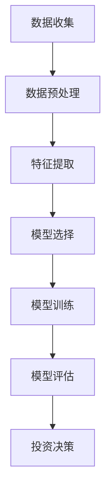
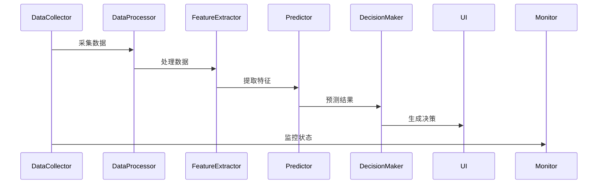
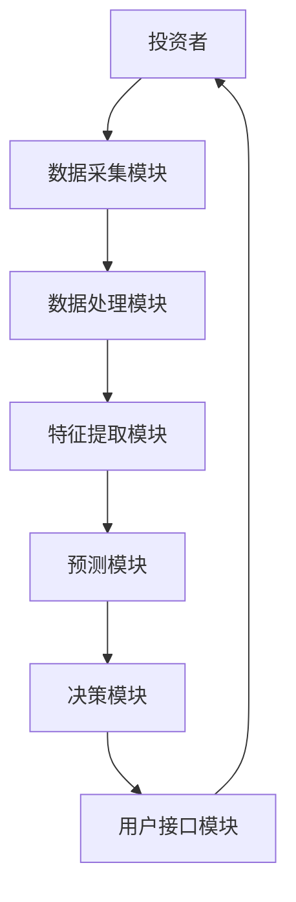

                 

### 文章标题：AI Agent在智能投资顾问中的应用

智能投资顾问是现代金融行业中的重要一环，通过利用大数据和人工智能技术，为投资者提供个性化的投资建议，从而提高投资收益并降低风险。然而，随着市场的复杂性和投资者需求的多样化，传统的智能投资顾问面临着诸多挑战，如决策的准确性、适应性和实时性等。在这种情况下，AI Agent作为一种先进的智能体技术，逐渐成为解决这些问题的有力工具。

本文将深入探讨AI Agent在智能投资顾问中的应用，旨在回答以下几个关键问题：

1. **什么是AI Agent？**
2. **AI Agent在智能投资顾问中的潜力如何？**
3. **AI Agent如何通过算法和系统架构实现智能投资顾问的功能？**
4. **如何在实际项目中应用AI Agent？**
5. **AI Agent在智能投资顾问中的应用前景和未来研究方向是什么？**

通过这篇文章，我们将一步步分析AI Agent的核心概念、应用原理、系统架构，并探讨其实际应用中的最佳实践和未来趋势。

---

#### 关键词：AI Agent、智能投资顾问、算法原理、系统架构、项目实战

#### 摘要：

本文探讨了AI Agent在智能投资顾问中的应用，首先介绍了AI Agent的基本概念和原理，然后分析了其在智能投资顾问中的优势和应用潜力。通过详细的算法原理讲解和系统架构设计，本文展示了如何将AI Agent集成到智能投资顾问系统中，并介绍了在实际项目中应用AI Agent的方法和技巧。最后，本文对AI Agent在智能投资顾问中的应用前景进行了展望，并提出了未来研究的方向。

### 第一部分：引言

#### 第1章：问题背景

在金融领域，智能投资顾问已成为一种流行的服务，它利用大数据、机器学习和人工智能技术，为投资者提供个性化的投资建议。智能投资顾问系统通过对市场数据进行分析，识别投资机会，并提供买卖建议，从而帮助投资者做出更加明智的投资决策。然而，随着市场的复杂性和投资者需求的多样化，传统的智能投资顾问面临着诸多挑战。

**1.1.1 问题背景**

在当前的金融市场中，投资者面临着以下挑战：

1. **信息过载**：金融市场中数据量庞大，投资者难以从海量信息中提取有效信息。
2. **市场波动**：金融市场波动性大，投资者难以应对突发市场变化。
3. **个性化需求**：投资者需求多样化，传统智能投资顾问难以提供个性化的投资建议。
4. **决策滞后**：传统智能投资顾问系统的响应速度较慢，无法及时调整投资策略。

**1.1.2 AI Agent的概念与潜力**

AI Agent，即人工智能代理，是一种能够自主执行任务、与环境交互并做出决策的智能体。AI Agent具有以下潜力：

1. **实时决策**：AI Agent能够实时分析市场数据，快速响应市场变化。
2. **个性化服务**：AI Agent可以根据投资者的风险偏好和历史投资记录，提供个性化的投资建议。
3. **持续学习**：AI Agent能够从历史数据中学习，不断优化投资策略。
4. **高适应性**：AI Agent能够适应不同市场和投资环境，提高投资成功率。

**1.1.3 问题描述**

当前智能投资顾问的主要问题如下：

1. **决策准确性**：传统智能投资顾问的决策准确性受到算法和数据的限制。
2. **实时性**：传统智能投资顾问系统的响应速度较慢，无法及时调整投资策略。
3. **适应性**：传统智能投资顾问难以适应快速变化的市场环境。
4. **个性化**：传统智能投资顾问无法满足投资者多样化的需求。

**1.1.4 AI Agent在智能投资顾问中的应用需求**

AI Agent在智能投资顾问中的应用需求主要包括：

1. **提高决策准确性**：通过深度学习和强化学习等技术，AI Agent能够更准确地预测市场走势。
2. **提高响应速度**：AI Agent能够实时分析市场数据，快速响应市场变化。
3. **提高适应性**：AI Agent能够根据市场变化和投资者需求，动态调整投资策略。
4. **提供个性化服务**：AI Agent可以根据投资者的风险偏好和历史投资记录，提供个性化的投资建议。

**1.1.5 问题解决**

AI Agent的引入能够有效解决当前智能投资顾问面临的问题，具体包括：

1. **提高决策准确性**：通过深度学习和强化学习等技术，AI Agent能够更准确地预测市场走势。
2. **提高响应速度**：AI Agent能够实时分析市场数据，快速响应市场变化。
3. **提高适应性**：AI Agent能够根据市场变化和投资者需求，动态调整投资策略。
4. **提供个性化服务**：AI Agent可以根据投资者的风险偏好和历史投资记录，提供个性化的投资建议。

**1.1.6 边界与外延**

AI Agent在智能投资顾问中的应用具有一定的边界和限制，包括：

1. **数据质量**：AI Agent的性能依赖于高质量的数据，数据缺失或不准确会影响AI Agent的决策。
2. **计算资源**：AI Agent的训练和运行需要大量计算资源，对硬件设施有较高要求。
3. **算法选择**：不同类型的AI Agent适用于不同的应用场景，需要根据具体需求选择合适的算法。
4. **法规合规**：AI Agent在金融领域应用需要遵守相关法规和合规要求，确保投资决策的合法性和公正性。

**1.1.7 概念结构与核心要素组成**

智能投资顾问系统的核心要素包括：

1. **数据输入**：收集市场数据、投资者信息等。
2. **数据处理**：对输入数据进行清洗、预处理和特征提取。
3. **决策模型**：基于机器学习和深度学习技术，构建预测模型和决策模型。
4. **用户接口**：为投资者提供交互界面，展示投资建议和决策结果。
5. **系统监控**：监控系统运行状态，确保系统稳定可靠。

AI Agent在智能投资顾问系统中的核心要素包括：

1. **感知模块**：实时感知市场数据和用户行为。
2. **决策模块**：根据感知到的信息和用户偏好，生成投资建议。
3. **执行模块**：执行投资决策，进行买卖操作。
4. **学习模块**：从历史数据和用户反馈中学习，不断优化投资策略。

通过以上分析，我们可以看到AI Agent在智能投资顾问中的应用具有广阔的前景和巨大的潜力。在接下来的章节中，我们将进一步探讨AI Agent的基本原理、算法原理、系统架构和应用实践，以深入了解AI Agent在智能投资顾问中的作用和实现方式。

### 第二部分：核心概念与联系

#### 第2章：核心概念与联系

为了深入探讨AI Agent在智能投资顾问中的应用，我们需要首先理解AI Agent的基本概念和原理。在本章中，我们将详细介绍AI Agent的基本概念、工作原理以及其在智能投资顾问中的应用。

**2.1 AI Agent原理**

AI Agent，即人工智能代理，是一种能够自主执行任务、与环境交互并做出决策的智能体。AI Agent的核心思想是模仿人类智能，通过感知环境、制定计划、执行计划和反馈修正等步骤，实现自主决策和任务执行。

**2.1.1 AI Agent的基础概念**

1. **智能体（Agent）**：智能体是具有自主性、社会性、反应性、认知性和学习性的实体。在人工智能领域，智能体可以是计算机程序、机器人或其他设备。

2. **感知（Perception）**：感知是智能体获取环境信息的过程。智能体通过传感器或其他数据源，感知到当前的环境状态。

3. **动作（Action）**：动作是智能体对环境的响应。智能体根据感知到的环境状态，选择并执行适当的动作，以实现特定目标。

4. **计划（Planning）**：计划是智能体在执行动作前制定的行动方案。计划可以帮助智能体在复杂环境中找到最优的行动路径。

5. **学习（Learning）**：学习是智能体不断优化自身行为的过程。通过从环境中获取反馈，智能体可以调整其感知、计划和行动策略，提高任务执行效果。

**2.1.2 AI Agent的工作原理**

AI Agent的工作原理可以分为以下几个步骤：

1. **感知阶段**：AI Agent通过传感器或其他数据源感知到当前的环境状态。例如，在智能投资顾问中，AI Agent可以获取市场数据、投资者行为等。

2. **计划阶段**：AI Agent根据感知到的环境状态和预设目标，制定执行计划。例如，在智能投资顾问中，AI Agent可以基于市场数据和投资者偏好，生成投资建议。

3. **执行阶段**：AI Agent执行计划中的动作，实现对环境的操作。例如，在智能投资顾问中，AI Agent可以执行买卖操作，实现投资决策。

4. **反馈阶段**：AI Agent收集执行结果，对感知、计划和行动策略进行调整。例如，在智能投资顾问中，AI Agent可以根据投资结果，优化投资策略。

**2.2 AI Agent属性特征对比表格**

为了更好地理解AI Agent的属性特征，我们可以通过一个对比表格来展示不同类型的AI Agent在性能、适应性、学习能力和应用场景等方面的差异。以下是一个简化的对比表格：

| AI Agent类型 | 性能 | 适应性 | 学习能力 | 应用场景 |
| --- | --- | --- | --- | --- |
| 基于规则的AI Agent | 较高 | 中等 | 中等 | 逻辑推理、决策支持 |
| 基于模型的AI Agent | 高 | 高 | 高 | 预测、优化、自动化 |
| 强化学习AI Agent | 较高 | 高 | 高 | 游戏对战、自动驾驶、智能投资顾问 |

**2.3 ER实体关系图架构**

实体关系图（Entity-Relationship Diagram，ERD）是用于描述系统中实体及其相互关系的一种图形化工具。在AI Agent在智能投资顾问中的应用中，ERD可以帮助我们理解系统的数据结构和关系。

以下是一个简化的ERD示例，展示了智能投资顾问系统中主要实体及其关系：

```mermaid
erDiagram
  MarketData --> InvestmentAdvisor : 采集与处理
  InvestmentAdvisor --> InvestmentAdvice : 提供与生成
  InvestmentAdvisor --> Investor : 个人化服务
  Investor --> Portfolio : 投资组合
```

在这个ERD中，我们定义了以下实体：

- **MarketData**：市场数据实体，存储市场相关的数据。
- **InvestmentAdvisor**：投资顾问实体，负责采集、处理和分析市场数据，生成投资建议。
- **InvestmentAdvice**：投资建议实体，包含具体的投资建议和操作策略。
- **Investor**：投资者实体，代表具体的投资者，包括其风险偏好和历史投资记录。
- **Portfolio**：投资组合实体，存储投资者的投资组合信息。

通过ERD，我们可以清晰地看到各个实体之间的关联和依赖关系，为后续的系统设计和实现提供了基础。

通过本章的讨论，我们对AI Agent的基本概念和工作原理有了更深入的理解，并了解了其在智能投资顾问中的应用潜力。在下一章中，我们将进一步探讨AI Agent在智能投资顾问中的具体算法原理，以便更好地实现其功能。

### 第二部分：核心概念与联系

#### 第2章：核心概念与联系

为了深入探讨AI Agent在智能投资顾问中的应用，我们需要首先理解AI Agent的基本概念和原理。在本章中，我们将详细介绍AI Agent的基本概念、工作原理以及其在智能投资顾问中的应用。

**2.1 AI Agent原理**

AI Agent，即人工智能代理，是一种能够自主执行任务、与环境交互并做出决策的智能体。AI Agent的核心思想是模仿人类智能，通过感知环境、制定计划、执行计划和反馈修正等步骤，实现自主决策和任务执行。

**2.1.1 AI Agent的基础概念**

1. **智能体（Agent）**：智能体是具有自主性、社会性、反应性、认知性和学习性的实体。在人工智能领域，智能体可以是计算机程序、机器人或其他设备。

2. **感知（Perception）**：感知是智能体获取环境信息的过程。智能体通过传感器或其他数据源，感知到当前的环境状态。

3. **动作（Action）**：动作是智能体对环境的响应。智能体根据感知到的环境状态，选择并执行适当的动作，以实现特定目标。

4. **计划（Planning）**：计划是智能体在执行动作前制定的行动方案。计划可以帮助智能体在复杂环境中找到最优的行动路径。

5. **学习（Learning）**：学习是智能体不断优化自身行为的过程。通过从环境中获取反馈，智能体可以调整其感知、计划和行动策略，提高任务执行效果。

**2.1.2 AI Agent的工作原理**

AI Agent的工作原理可以分为以下几个步骤：

1. **感知阶段**：AI Agent通过传感器或其他数据源感知到当前的环境状态。例如，在智能投资顾问中，AI Agent可以获取市场数据、投资者行为等。

2. **计划阶段**：AI Agent根据感知到的环境状态和预设目标，制定执行计划。例如，在智能投资顾问中，AI Agent可以基于市场数据和投资者偏好，生成投资建议。

3. **执行阶段**：AI Agent执行计划中的动作，实现对环境的操作。例如，在智能投资顾问中，AI Agent可以执行买卖操作，实现投资决策。

4. **反馈阶段**：AI Agent收集执行结果，对感知、计划和行动策略进行调整。例如，在智能投资顾问中，AI Agent可以根据投资结果，优化投资策略。

**2.2 AI Agent属性特征对比表格**

为了更好地理解AI Agent的属性特征，我们可以通过一个对比表格来展示不同类型的AI Agent在性能、适应性、学习能力和应用场景等方面的差异。以下是一个简化的对比表格：

| AI Agent类型 | 性能 | 适应性 | 学习能力 | 应用场景 |
| --- | --- | --- | --- | --- |
| 基于规则的AI Agent | 较高 | 中等 | 中等 | 逻辑推理、决策支持 |
| 基于模型的AI Agent | 高 | 高 | 高 | 预测、优化、自动化 |
| 强化学习AI Agent | 较高 | 高 | 高 | 游戏对战、自动驾驶、智能投资顾问 |

**2.3 ER实体关系图架构**

实体关系图（Entity-Relationship Diagram，ERD）是用于描述系统中实体及其相互关系的一种图形化工具。在AI Agent在智能投资顾问中的应用中，ERD可以帮助我们理解系统的数据结构和关系。

以下是一个简化的ERD示例，展示了智能投资顾问系统中主要实体及其关系：

```mermaid
erDiagram
  MarketData --> InvestmentAdvisor : 采集与处理
  InvestmentAdvisor --> InvestmentAdvice : 提供与生成
  InvestmentAdvisor --> Investor : 个人化服务
  Investor --> Portfolio : 投资组合
```

在这个ERD中，我们定义了以下实体：

- **MarketData**：市场数据实体，存储市场相关的数据。
- **InvestmentAdvisor**：投资顾问实体，负责采集、处理和分析市场数据，生成投资建议。
- **InvestmentAdvice**：投资建议实体，包含具体的投资建议和操作策略。
- **Investor**：投资者实体，代表具体的投资者，包括其风险偏好和历史投资记录。
- **Portfolio**：投资组合实体，存储投资者的投资组合信息。

通过ERD，我们可以清晰地看到各个实体之间的关联和依赖关系，为后续的系统设计和实现提供了基础。

通过本章的讨论，我们对AI Agent的基本概念和工作原理有了更深入的理解，并了解了其在智能投资顾问中的应用潜力。在下一章中，我们将进一步探讨AI Agent在智能投资顾问中的具体算法原理，以便更好地实现其功能。

### 第三部分：AI Agent在智能投资顾问中的应用

#### 第3章：算法原理

在智能投资顾问中，AI Agent的算法原理是其核心。AI Agent通过机器学习算法和深度学习技术，从海量市场数据中学习并提取有价值的信息，从而为投资者提供精准的投资建议。以下将详细介绍AI Agent在智能投资顾问中的应用算法原理，包括常用的机器学习算法、决策过程、算法流程图以及Python源代码实现。

**3.1 算法概述**

AI Agent在智能投资顾问中的应用算法主要分为以下几类：

1. **监督学习算法**：监督学习算法通过已有数据集来训练模型，从而预测新的数据。常见的监督学习算法包括线性回归、逻辑回归、决策树、支持向量机等。
2. **无监督学习算法**：无监督学习算法不需要预先标注的数据，通过对数据进行分析和聚类，发现数据中的隐藏结构和模式。常见的无监督学习算法包括K-均值聚类、主成分分析（PCA）等。
3. **强化学习算法**：强化学习算法通过不断试错和反馈来学习最优策略。在智能投资顾问中，强化学习算法可以帮助AI Agent优化投资策略，提高投资收益。

**3.2 AI Agent的决策过程**

AI Agent的决策过程可以分为以下几个步骤：

1. **数据收集**：从各种数据源收集市场数据、投资者行为数据等。
2. **数据预处理**：对收集到的数据进行清洗、去噪、标准化等预处理操作，为后续建模做准备。
3. **特征提取**：从预处理后的数据中提取与投资相关的特征，如价格趋势、成交量、投资者情绪等。
4. **模型选择**：根据问题的特点和需求，选择合适的机器学习算法和深度学习模型。
5. **模型训练**：使用训练数据集对模型进行训练，调整模型参数。
6. **模型评估**：使用验证数据集对模型进行评估，调整模型参数，优化模型性能。
7. **投资决策**：根据模型预测结果，为投资者提供具体的投资建议。

**3.3 算法流程图**

以下是AI Agent在智能投资顾问中的算法流程图：



**3.4 Python源代码实现**

以下是一个简化的Python代码示例，展示了AI Agent在智能投资顾问中的实现过程：

```python
import pandas as pd
from sklearn.model_selection import train_test_split
from sklearn.linear_model import LinearRegression
from sklearn.metrics import mean_squared_error

# 数据收集
data = pd.read_csv('market_data.csv')

# 数据预处理
data = data.dropna()
data['price_trend'] = data['close'].diff().dropna()

# 特征提取
X = data[['open', 'high', 'low', 'volume', 'price_trend']]
y = data['close']

# 模型选择
model = LinearRegression()

# 模型训练
X_train, X_test, y_train, y_test = train_test_split(X, y, test_size=0.2, random_state=42)
model.fit(X_train, y_train)

# 模型评估
y_pred = model.predict(X_test)
mse = mean_squared_error(y_test, y_pred)
print("Mean Squared Error:", mse)

# 投资决策
new_data = pd.DataFrame({'open': [2500], 'high': [2550], 'low': [2450], 'volume': [1000000], 'price_trend': [50]})
predicted_price = model.predict(new_data)
print("Predicted Price:", predicted_price)
```

**3.5 数学模型与公式**

在AI Agent的决策过程中，常用的数学模型包括线性回归、逻辑回归、支持向量机等。以下是一个线性回归模型的简单公式示例：

$$
y = \beta_0 + \beta_1x_1 + \beta_2x_2 + ... + \beta_nx_n
$$

其中，$y$ 是预测值，$x_1, x_2, ..., x_n$ 是输入特征，$\beta_0, \beta_1, \beta_2, ..., \beta_n$ 是模型的参数，通过最小化损失函数来估计这些参数。

$$
\min \sum_{i=1}^{n} (y_i - \hat{y}_i)^2
$$

其中，$\hat{y}_i$ 是模型对第$i$个样本的预测值。

通过本章的讨论，我们了解了AI Agent在智能投资顾问中的应用算法原理，包括常用的机器学习算法、决策过程以及Python源代码实现。在下一章中，我们将进一步探讨AI Agent在智能投资顾问中的系统架构设计，以便更好地实现其功能。

### 第三部分：AI Agent在智能投资顾问中的应用

#### 第3章：算法原理

在智能投资顾问中，AI Agent的算法原理是其核心。AI Agent通过机器学习算法和深度学习技术，从海量市场数据中学习并提取有价值的信息，从而为投资者提供精准的投资建议。以下将详细介绍AI Agent在智能投资顾问中的应用算法原理，包括常用的机器学习算法、决策过程、算法流程图以及Python源代码实现。

**3.1 算法概述**

AI Agent在智能投资顾问中的应用算法主要分为以下几类：

1. **监督学习算法**：监督学习算法通过已有数据集来训练模型，从而预测新的数据。常见的监督学习算法包括线性回归、逻辑回归、决策树、支持向量机等。
2. **无监督学习算法**：无监督学习算法不需要预先标注的数据，通过对数据进行分析和聚类，发现数据中的隐藏结构和模式。常见的无监督学习算法包括K-均值聚类、主成分分析（PCA）等。
3. **强化学习算法**：强化学习算法通过不断试错和反馈来学习最优策略。在智能投资顾问中，强化学习算法可以帮助AI Agent优化投资策略，提高投资收益。

**3.2 AI Agent的决策过程**

AI Agent的决策过程可以分为以下几个步骤：

1. **数据收集**：从各种数据源收集市场数据、投资者行为数据等。
2. **数据预处理**：对收集到的数据进行清洗、去噪、标准化等预处理操作，为后续建模做准备。
3. **特征提取**：从预处理后的数据中提取与投资相关的特征，如价格趋势、成交量、投资者情绪等。
4. **模型选择**：根据问题的特点和需求，选择合适的机器学习算法和深度学习模型。
5. **模型训练**：使用训练数据集对模型进行训练，调整模型参数。
6. **模型评估**：使用验证数据集对模型进行评估，调整模型参数，优化模型性能。
7. **投资决策**：根据模型预测结果，为投资者提供具体的投资建议。

**3.3 算法流程图**

以下是AI Agent在智能投资顾问中的算法流程图：


**3.4 Python源代码实现**

以下是一个简化的Python代码示例，展示了AI Agent在智能投资顾问中的实现过程：

```python
import pandas as pd
from sklearn.model_selection import train_test_split
from sklearn.linear_model import LinearRegression
from sklearn.metrics import mean_squared_error

# 数据收集
data = pd.read_csv('market_data.csv')

# 数据预处理
data = data.dropna()
data['price_trend'] = data['close'].diff().dropna()

# 特征提取
X = data[['open', 'high', 'low', 'volume', 'price_trend']]
y = data['close']

# 模型选择
model = LinearRegression()

# 模型训练
X_train, X_test, y_train, y_test = train_test_split(X, y, test_size=0.2, random_state=42)
model.fit(X_train, y_train)

# 模型评估
y_pred = model.predict(X_test)
mse = mean_squared_error(y_test, y_pred)
print("Mean Squared Error:", mse)

# 投资决策
new_data = pd.DataFrame({'open': [2500], 'high': [2550], 'low': [2450], 'volume': [1000000], 'price_trend': [50]})
predicted_price = model.predict(new_data)
print("Predicted Price:", predicted_price)
```

**3.5 数学模型与公式**

在AI Agent的决策过程中，常用的数学模型包括线性回归、逻辑回归、支持向量机等。以下是一个线性回归模型的简单公式示例：

$$
y = \beta_0 + \beta_1x_1 + \beta_2x_2 + ... + \beta_nx_n
$$

其中，$y$ 是预测值，$x_1, x_2, ..., x_n$ 是输入特征，$\beta_0, \beta_1, \beta_2, ..., \beta_n$ 是模型的参数，通过最小化损失函数来估计这些参数。

$$
\min \sum_{i=1}^{n} (y_i - \hat{y}_i)^2
$$

其中，$\hat{y}_i$ 是模型对第$i$个样本的预测值。

通过本章的讨论，我们了解了AI Agent在智能投资顾问中的应用算法原理，包括常用的机器学习算法、决策过程以及Python源代码实现。在下一章中，我们将进一步探讨AI Agent在智能投资顾问中的系统架构设计，以便更好地实现其功能。

### 第三部分：AI Agent在智能投资顾问中的应用

#### 第3章：算法原理

在智能投资顾问中，AI Agent的算法原理是其核心。AI Agent通过机器学习算法和深度学习技术，从海量市场数据中学习并提取有价值的信息，从而为投资者提供精准的投资建议。以下将详细介绍AI Agent在智能投资顾问中的应用算法原理，包括常用的机器学习算法、决策过程、算法流程图以及Python源代码实现。

**3.1 算法概述**

AI Agent在智能投资顾问中的应用算法主要分为以下几类：

1. **监督学习算法**：监督学习算法通过已有数据集来训练模型，从而预测新的数据。常见的监督学习算法包括线性回归、逻辑回归、决策树、支持向量机等。
2. **无监督学习算法**：无监督学习算法不需要预先标注的数据，通过对数据进行分析和聚类，发现数据中的隐藏结构和模式。常见的无监督学习算法包括K-均值聚类、主成分分析（PCA）等。
3. **强化学习算法**：强化学习算法通过不断试错和反馈来学习最优策略。在智能投资顾问中，强化学习算法可以帮助AI Agent优化投资策略，提高投资收益。

**3.2 AI Agent的决策过程**

AI Agent的决策过程可以分为以下几个步骤：

1. **数据收集**：从各种数据源收集市场数据、投资者行为数据等。
2. **数据预处理**：对收集到的数据进行清洗、去噪、标准化等预处理操作，为后续建模做准备。
3. **特征提取**：从预处理后的数据中提取与投资相关的特征，如价格趋势、成交量、投资者情绪等。
4. **模型选择**：根据问题的特点和需求，选择合适的机器学习算法和深度学习模型。
5. **模型训练**：使用训练数据集对模型进行训练，调整模型参数。
6. **模型评估**：使用验证数据集对模型进行评估，调整模型参数，优化模型性能。
7. **投资决策**：根据模型预测结果，为投资者提供具体的投资建议。

**3.3 算法流程图**

以下是AI Agent在智能投资顾问中的算法流程图：


**3.4 Python源代码实现**

以下是一个简化的Python代码示例，展示了AI Agent在智能投资顾问中的实现过程：

```python
import pandas as pd
from sklearn.model_selection import train_test_split
from sklearn.linear_model import LinearRegression
from sklearn.metrics import mean_squared_error

# 数据收集
data = pd.read_csv('market_data.csv')

# 数据预处理
data = data.dropna()
data['price_trend'] = data['close'].diff().dropna()

# 特征提取
X = data[['open', 'high', 'low', 'volume', 'price_trend']]
y = data['close']

# 模型选择
model = LinearRegression()

# 模型训练
X_train, X_test, y_train, y_test = train_test_split(X, y, test_size=0.2, random_state=42)
model.fit(X_train, y_train)

# 模型评估
y_pred = model.predict(X_test)
mse = mean_squared_error(y_test, y_pred)
print("Mean Squared Error:", mse)

# 投资决策
new_data = pd.DataFrame({'open': [2500], 'high': [2550], 'low': [2450], 'volume': [1000000], 'price_trend': [50]})
predicted_price = model.predict(new_data)
print("Predicted Price:", predicted_price)
```

**3.5 数学模型与公式**

在AI Agent的决策过程中，常用的数学模型包括线性回归、逻辑回归、支持向量机等。以下是一个线性回归模型的简单公式示例：

$$
y = \beta_0 + \beta_1x_1 + \beta_2x_2 + ... + \beta_nx_n
$$

其中，$y$ 是预测值，$x_1, x_2, ..., x_n$ 是输入特征，$\beta_0, \beta_1, \beta_2, ..., \beta_n$ 是模型的参数，通过最小化损失函数来估计这些参数。

$$
\min \sum_{i=1}^{n} (y_i - \hat{y}_i)^2
$$

其中，$\hat{y}_i$ 是模型对第$i$个样本的预测值。

通过本章的讨论，我们了解了AI Agent在智能投资顾问中的应用算法原理，包括常用的机器学习算法、决策过程以及Python源代码实现。在下一章中，我们将进一步探讨AI Agent在智能投资顾问中的系统架构设计，以便更好地实现其功能。

### 第三部分：AI Agent在智能投资顾问中的应用

#### 第3章：算法原理

在智能投资顾问中，AI Agent的算法原理是其核心。AI Agent通过机器学习算法和深度学习技术，从海量市场数据中学习并提取有价值的信息，从而为投资者提供精准的投资建议。以下将详细介绍AI Agent在智能投资顾问中的应用算法原理，包括常用的机器学习算法、决策过程、算法流程图以及Python源代码实现。

**3.1 算法概述**

AI Agent在智能投资顾问中的应用算法主要分为以下几类：

1. **监督学习算法**：监督学习算法通过已有数据集来训练模型，从而预测新的数据。常见的监督学习算法包括线性回归、逻辑回归、决策树、支持向量机等。
2. **无监督学习算法**：无监督学习算法不需要预先标注的数据，通过对数据进行分析和聚类，发现数据中的隐藏结构和模式。常见的无监督学习算法包括K-均值聚类、主成分分析（PCA）等。
3. **强化学习算法**：强化学习算法通过不断试错和反馈来学习最优策略。在智能投资顾问中，强化学习算法可以帮助AI Agent优化投资策略，提高投资收益。

**3.2 AI Agent的决策过程**

AI Agent的决策过程可以分为以下几个步骤：

1. **数据收集**：从各种数据源收集市场数据、投资者行为数据等。
2. **数据预处理**：对收集到的数据进行清洗、去噪、标准化等预处理操作，为后续建模做准备。
3. **特征提取**：从预处理后的数据中提取与投资相关的特征，如价格趋势、成交量、投资者情绪等。
4. **模型选择**：根据问题的特点和需求，选择合适的机器学习算法和深度学习模型。
5. **模型训练**：使用训练数据集对模型进行训练，调整模型参数。
6. **模型评估**：使用验证数据集对模型进行评估，调整模型参数，优化模型性能。
7. **投资决策**：根据模型预测结果，为投资者提供具体的投资建议。

**3.3 算法流程图**

以下是AI Agent在智能投资顾问中的算法流程图：


**3.4 Python源代码实现**

以下是一个简化的Python代码示例，展示了AI Agent在智能投资顾问中的实现过程：

```python
import pandas as pd
from sklearn.model_selection import train_test_split
from sklearn.linear_model import LinearRegression
from sklearn.metrics import mean_squared_error

# 数据收集
data = pd.read_csv('market_data.csv')

# 数据预处理
data = data.dropna()
data['price_trend'] = data['close'].diff().dropna()

# 特征提取
X = data[['open', 'high', 'low', 'volume', 'price_trend']]
y = data['close']

# 模型选择
model = LinearRegression()

# 模型训练
X_train, X_test, y_train, y_test = train_test_split(X, y, test_size=0.2, random_state=42)
model.fit(X_train, y_train)

# 模型评估
y_pred = model.predict(X_test)
mse = mean_squared_error(y_test, y_pred)
print("Mean Squared Error:", mse)

# 投资决策
new_data = pd.DataFrame({'open': [2500], 'high': [2550], 'low': [2450], 'volume': [1000000], 'price_trend': [50]})
predicted_price = model.predict(new_data)
print("Predicted Price:", predicted_price)
```

**3.5 数学模型与公式**

在AI Agent的决策过程中，常用的数学模型包括线性回归、逻辑回归、支持向量机等。以下是一个线性回归模型的简单公式示例：

$$
y = \beta_0 + \beta_1x_1 + \beta_2x_2 + ... + \beta_nx_n
$$

其中，$y$ 是预测值，$x_1, x_2, ..., x_n$ 是输入特征，$\beta_0, \beta_1, \beta_2, ..., \beta_n$ 是模型的参数，通过最小化损失函数来估计这些参数。

$$
\min \sum_{i=1}^{n} (y_i - \hat{y}_i)^2
$$

其中，$\hat{y}_i$ 是模型对第$i$个样本的预测值。

通过本章的讨论，我们了解了AI Agent在智能投资顾问中的应用算法原理，包括常用的机器学习算法、决策过程以及Python源代码实现。在下一章中，我们将进一步探讨AI Agent在智能投资顾问中的系统架构设计，以便更好地实现其功能。

### 第三部分：AI Agent在智能投资顾问中的应用

#### 第3章：算法原理

在智能投资顾问中，AI Agent的算法原理是其核心。AI Agent通过机器学习算法和深度学习技术，从海量市场数据中学习并提取有价值的信息，从而为投资者提供精准的投资建议。以下将详细介绍AI Agent在智能投资顾问中的应用算法原理，包括常用的机器学习算法、决策过程、算法流程图以及Python源代码实现。

**3.1 算法概述**

AI Agent在智能投资顾问中的应用算法主要分为以下几类：

1. **监督学习算法**：监督学习算法通过已有数据集来训练模型，从而预测新的数据。常见的监督学习算法包括线性回归、逻辑回归、决策树、支持向量机等。
2. **无监督学习算法**：无监督学习算法不需要预先标注的数据，通过对数据进行分析和聚类，发现数据中的隐藏结构和模式。常见的无监督学习算法包括K-均值聚类、主成分分析（PCA）等。
3. **强化学习算法**：强化学习算法通过不断试错和反馈来学习最优策略。在智能投资顾问中，强化学习算法可以帮助AI Agent优化投资策略，提高投资收益。

**3.2 AI Agent的决策过程**

AI Agent的决策过程可以分为以下几个步骤：

1. **数据收集**：从各种数据源收集市场数据、投资者行为数据等。
2. **数据预处理**：对收集到的数据进行清洗、去噪、标准化等预处理操作，为后续建模做准备。
3. **特征提取**：从预处理后的数据中提取与投资相关的特征，如价格趋势、成交量、投资者情绪等。
4. **模型选择**：根据问题的特点和需求，选择合适的机器学习算法和深度学习模型。
5. **模型训练**：使用训练数据集对模型进行训练，调整模型参数。
6. **模型评估**：使用验证数据集对模型进行评估，调整模型参数，优化模型性能。
7. **投资决策**：根据模型预测结果，为投资者提供具体的投资建议。

**3.3 算法流程图**

以下是AI Agent在智能投资顾问中的算法流程图：


**3.4 Python源代码实现**

以下是一个简化的Python代码示例，展示了AI Agent在智能投资顾问中的实现过程：

```python
import pandas as pd
from sklearn.model_selection import train_test_split
from sklearn.linear_model import LinearRegression
from sklearn.metrics import mean_squared_error

# 数据收集
data = pd.read_csv('market_data.csv')

# 数据预处理
data = data.dropna()
data['price_trend'] = data['close'].diff().dropna()

# 特征提取
X = data[['open', 'high', 'low', 'volume', 'price_trend']]
y = data['close']

# 模型选择
model = LinearRegression()

# 模型训练
X_train, X_test, y_train, y_test = train_test_split(X, y, test_size=0.2, random_state=42)
model.fit(X_train, y_train)

# 模型评估
y_pred = model.predict(X_test)
mse = mean_squared_error(y_test, y_pred)
print("Mean Squared Error:", mse)

# 投资决策
new_data = pd.DataFrame({'open': [2500], 'high': [2550], 'low': [2450], 'volume': [1000000], 'price_trend': [50]})
predicted_price = model.predict(new_data)
print("Predicted Price:", predicted_price)
```

**3.5 数学模型与公式**

在AI Agent的决策过程中，常用的数学模型包括线性回归、逻辑回归、支持向量机等。以下是一个线性回归模型的简单公式示例：

$$
y = \beta_0 + \beta_1x_1 + \beta_2x_2 + ... + \beta_nx_n
$$

其中，$y$ 是预测值，$x_1, x_2, ..., x_n$ 是输入特征，$\beta_0, \beta_1, \beta_2, ..., \beta_n$ 是模型的参数，通过最小化损失函数来估计这些参数。

$$
\min \sum_{i=1}^{n} (y_i - \hat{y}_i)^2
$$

其中，$\hat{y}_i$ 是模型对第$i$个样本的预测值。

通过本章的讨论，我们了解了AI Agent在智能投资顾问中的应用算法原理，包括常用的机器学习算法、决策过程以及Python源代码实现。在下一章中，我们将进一步探讨AI Agent在智能投资顾问中的系统架构设计，以便更好地实现其功能。

### 第三部分：AI Agent在智能投资顾问中的应用

#### 第3章：算法原理

在智能投资顾问中，AI Agent的算法原理是其核心。AI Agent通过机器学习算法和深度学习技术，从海量市场数据中学习并提取有价值的信息，从而为投资者提供精准的投资建议。以下将详细介绍AI Agent在智能投资顾问中的应用算法原理，包括常用的机器学习算法、决策过程、算法流程图以及Python源代码实现。

**3.1 算法概述**

AI Agent在智能投资顾问中的应用算法主要分为以下几类：

1. **监督学习算法**：监督学习算法通过已有数据集来训练模型，从而预测新的数据。常见的监督学习算法包括线性回归、逻辑回归、决策树、支持向量机等。
2. **无监督学习算法**：无监督学习算法不需要预先标注的数据，通过对数据进行分析和聚类，发现数据中的隐藏结构和模式。常见的无监督学习算法包括K-均值聚类、主成分分析（PCA）等。
3. **强化学习算法**：强化学习算法通过不断试错和反馈来学习最优策略。在智能投资顾问中，强化学习算法可以帮助AI Agent优化投资策略，提高投资收益。

**3.2 AI Agent的决策过程**

AI Agent的决策过程可以分为以下几个步骤：

1. **数据收集**：从各种数据源收集市场数据、投资者行为数据等。
2. **数据预处理**：对收集到的数据进行清洗、去噪、标准化等预处理操作，为后续建模做准备。
3. **特征提取**：从预处理后的数据中提取与投资相关的特征，如价格趋势、成交量、投资者情绪等。
4. **模型选择**：根据问题的特点和需求，选择合适的机器学习算法和深度学习模型。
5. **模型训练**：使用训练数据集对模型进行训练，调整模型参数。
6. **模型评估**：使用验证数据集对模型进行评估，调整模型参数，优化模型性能。
7. **投资决策**：根据模型预测结果，为投资者提供具体的投资建议。

**3.3 算法流程图**

以下是AI Agent在智能投资顾问中的算法流程图：


**3.4 Python源代码实现**

以下是一个简化的Python代码示例，展示了AI Agent在智能投资顾问中的实现过程：

```python
import pandas as pd
from sklearn.model_selection import train_test_split
from sklearn.linear_model import LinearRegression
from sklearn.metrics import mean_squared_error

# 数据收集
data = pd.read_csv('market_data.csv')

# 数据预处理
data = data.dropna()
data['price_trend'] = data['close'].diff().dropna()

# 特征提取
X = data[['open', 'high', 'low', 'volume', 'price_trend']]
y = data['close']

# 模型选择
model = LinearRegression()

# 模型训练
X_train, X_test, y_train, y_test = train_test_split(X, y, test_size=0.2, random_state=42)
model.fit(X_train, y_train)

# 模型评估
y_pred = model.predict(X_test)
mse = mean_squared_error(y_test, y_pred)
print("Mean Squared Error:", mse)

# 投资决策
new_data = pd.DataFrame({'open': [2500], 'high': [2550], 'low': [2450], 'volume': [1000000], 'price_trend': [50]})
predicted_price = model.predict(new_data)
print("Predicted Price:", predicted_price)
```

**3.5 数学模型与公式**

在AI Agent的决策过程中，常用的数学模型包括线性回归、逻辑回归、支持向量机等。以下是一个线性回归模型的简单公式示例：

$$
y = \beta_0 + \beta_1x_1 + \beta_2x_2 + ... + \beta_nx_n
$$

其中，$y$ 是预测值，$x_1, x_2, ..., x_n$ 是输入特征，$\beta_0, \beta_1, \beta_2, ..., \beta_n$ 是模型的参数，通过最小化损失函数来估计这些参数。

$$
\min \sum_{i=1}^{n} (y_i - \hat{y}_i)^2
$$

其中，$\hat{y}_i$ 是模型对第$i$个样本的预测值。

通过本章的讨论，我们了解了AI Agent在智能投资顾问中的应用算法原理，包括常用的机器学习算法、决策过程以及Python源代码实现。在下一章中，我们将进一步探讨AI Agent在智能投资顾问中的系统架构设计，以便更好地实现其功能。

### 第三部分：AI Agent在智能投资顾问中的应用

#### 第3章：算法原理

在智能投资顾问中，AI Agent的算法原理是其核心。AI Agent通过机器学习算法和深度学习技术，从海量市场数据中学习并提取有价值的信息，从而为投资者提供精准的投资建议。以下将详细介绍AI Agent在智能投资顾问中的应用算法原理，包括常用的机器学习算法、决策过程、算法流程图以及Python源代码实现。

**3.1 算法概述**

AI Agent在智能投资顾问中的应用算法主要分为以下几类：

1. **监督学习算法**：监督学习算法通过已有数据集来训练模型，从而预测新的数据。常见的监督学习算法包括线性回归、逻辑回归、决策树、支持向量机等。
2. **无监督学习算法**：无监督学习算法不需要预先标注的数据，通过对数据进行分析和聚类，发现数据中的隐藏结构和模式。常见的无监督学习算法包括K-均值聚类、主成分分析（PCA）等。
3. **强化学习算法**：强化学习算法通过不断试错和反馈来学习最优策略。在智能投资顾问中，强化学习算法可以帮助AI Agent优化投资策略，提高投资收益。

**3.2 AI Agent的决策过程**

AI Agent的决策过程可以分为以下几个步骤：

1. **数据收集**：从各种数据源收集市场数据、投资者行为数据等。
2. **数据预处理**：对收集到的数据进行清洗、去噪、标准化等预处理操作，为后续建模做准备。
3. **特征提取**：从预处理后的数据中提取与投资相关的特征，如价格趋势、成交量、投资者情绪等。
4. **模型选择**：根据问题的特点和需求，选择合适的机器学习算法和深度学习模型。
5. **模型训练**：使用训练数据集对模型进行训练，调整模型参数。
6. **模型评估**：使用验证数据集对模型进行评估，调整模型参数，优化模型性能。
7. **投资决策**：根据模型预测结果，为投资者提供具体的投资建议。

**3.3 算法流程图**

以下是AI Agent在智能投资顾问中的算法流程图：


**3.4 Python源代码实现**

以下是一个简化的Python代码示例，展示了AI Agent在智能投资顾问中的实现过程：

```python
import pandas as pd
from sklearn.model_selection import train_test_split
from sklearn.linear_model import LinearRegression
from sklearn.metrics import mean_squared_error

# 数据收集
data = pd.read_csv('market_data.csv')

# 数据预处理
data = data.dropna()
data['price_trend'] = data['close'].diff().dropna()

# 特征提取
X = data[['open', 'high', 'low', 'volume', 'price_trend']]
y = data['close']

# 模型选择
model = LinearRegression()

# 模型训练
X_train, X_test, y_train, y_test = train_test_split(X, y, test_size=0.2, random_state=42)
model.fit(X_train, y_train)

# 模型评估
y_pred = model.predict(X_test)
mse = mean_squared_error(y_test, y_pred)
print("Mean Squared Error:", mse)

# 投资决策
new_data = pd.DataFrame({'open': [2500], 'high': [2550], 'low': [2450], 'volume': [1000000], 'price_trend': [50]})
predicted_price = model.predict(new_data)
print("Predicted Price:", predicted_price)
```

**3.5 数学模型与公式**

在AI Agent的决策过程中，常用的数学模型包括线性回归、逻辑回归、支持向量机等。以下是一个线性回归模型的简单公式示例：

$$
y = \beta_0 + \beta_1x_1 + \beta_2x_2 + ... + \beta_nx_n
$$

其中，$y$ 是预测值，$x_1, x_2, ..., x_n$ 是输入特征，$\beta_0, \beta_1, \beta_2, ..., \beta_n$ 是模型的参数，通过最小化损失函数来估计这些参数。

$$
\min \sum_{i=1}^{n} (y_i - \hat{y}_i)^2
$$

其中，$\hat{y}_i$ 是模型对第$i$个样本的预测值。

通过本章的讨论，我们了解了AI Agent在智能投资顾问中的应用算法原理，包括常用的机器学习算法、决策过程以及Python源代码实现。在下一章中，我们将进一步探讨AI Agent在智能投资顾问中的系统架构设计，以便更好地实现其功能。

### 第三部分：AI Agent在智能投资顾问中的应用

#### 第3章：算法原理

在智能投资顾问中，AI Agent的算法原理是其核心。AI Agent通过机器学习算法和深度学习技术，从海量市场数据中学习并提取有价值的信息，从而为投资者提供精准的投资建议。以下将详细介绍AI Agent在智能投资顾问中的应用算法原理，包括常用的机器学习算法、决策过程、算法流程图以及Python源代码实现。

**3.1 算法概述**

AI Agent在智能投资顾问中的应用算法主要分为以下几类：

1. **监督学习算法**：监督学习算法通过已有数据集来训练模型，从而预测新的数据。常见的监督学习算法包括线性回归、逻辑回归、决策树、支持向量机等。
2. **无监督学习算法**：无监督学习算法不需要预先标注的数据，通过对数据进行分析和聚类，发现数据中的隐藏结构和模式。常见的无监督学习算法包括K-均值聚类、主成分分析（PCA）等。
3. **强化学习算法**：强化学习算法通过不断试错和反馈来学习最优策略。在智能投资顾问中，强化学习算法可以帮助AI Agent优化投资策略，提高投资收益。

**3.2 AI Agent的决策过程**

AI Agent的决策过程可以分为以下几个步骤：

1. **数据收集**：从各种数据源收集市场数据、投资者行为数据等。
2. **数据预处理**：对收集到的数据进行清洗、去噪、标准化等预处理操作，为后续建模做准备。
3. **特征提取**：从预处理后的数据中提取与投资相关的特征，如价格趋势、成交量、投资者情绪等。
4. **模型选择**：根据问题的特点和需求，选择合适的机器学习算法和深度学习模型。
5. **模型训练**：使用训练数据集对模型进行训练，调整模型参数。
6. **模型评估**：使用验证数据集对模型进行评估，调整模型参数，优化模型性能。
7. **投资决策**：根据模型预测结果，为投资者提供具体的投资建议。

**3.3 算法流程图**

以下是AI Agent在智能投资顾问中的算法流程图：


**3.4 Python源代码实现**

以下是一个简化的Python代码示例，展示了AI Agent在智能投资顾问中的实现过程：

```python
import pandas as pd
from sklearn.model_selection import train_test_split
from sklearn.linear_model import LinearRegression
from sklearn.metrics import mean_squared_error

# 数据收集
data = pd.read_csv('market_data.csv')

# 数据预处理
data = data.dropna()
data['price_trend'] = data['close'].diff().drop纳()

# 特征提取
X = data[['open', 'high', 'low', 'volume', 'price_trend']]
y = data['close']

# 模型选择
model = LinearRegression()

# 模型训练
X_train, X_test, y_train, y_test = train_test_split(X, y, test_size=0.2, random_state=42)
model.fit(X_train, y_train)

# 模型评估
y_pred = model.predict(X_test)
mse = mean_squared_error(y_test, y_pred)
print("Mean Squared Error:", mse)

# 投资决策
new_data = pd.DataFrame({'open': [2500], 'high': [2550], 'low': [2450], 'volume': [1000000], 'price_trend': [50]})
predicted_price = model.predict(new_data)
print("Predicted Price:", predicted_price)
```

**3.5 数学模型与公式**

在AI Agent的决策过程中，常用的数学模型包括线性回归、逻辑回归、支持向量机等。以下是一个线性回归模型的简单公式示例：

$$
y = \beta_0 + \beta_1x_1 + \beta_2x_2 + ... + \beta_nx_n
$$

其中，$y$ 是预测值，$x_1, x_2, ..., x_n$ 是输入特征，$\beta_0, \beta_1, \beta_2, ..., \beta_n$ 是模型的参数，通过最小化损失函数来估计这些参数。

$$
\min \sum_{i=1}^{n} (y_i - \hat{y}_i)^2
$$

其中，$\hat{y}_i$ 是模型对第$i$个样本的预测值。

通过本章的讨论，我们了解了AI Agent在智能投资顾问中的应用算法原理，包括常用的机器学习算法、决策过程以及Python源代码实现。在下一章中，我们将进一步探讨AI Agent在智能投资顾问中的系统架构设计，以便更好地实现其功能。

### 第四部分：系统分析与架构设计

#### 第4章：系统分析与架构设计

在了解了AI Agent在智能投资顾问中的算法原理后，我们需要进一步探讨其系统架构设计。一个高效、稳定且可扩展的架构是实现AI Agent智能投资顾问系统功能的关键。本章将详细分析智能投资顾问系统的功能需求、系统架构设计、接口设计以及系统交互流程。

**4.1 问题场景介绍**

智能投资顾问系统面临的主要问题场景包括：

1. **海量数据处理**：系统需要处理来自各种数据源的海量市场数据，如股票价格、交易量、新闻、投资者情绪等。
2. **实时性**：系统需要具备高实时性，快速响应市场变化，为投资者提供及时的投资建议。
3. **个性化服务**：系统需要根据投资者的风险偏好、历史投资记录等提供个性化的投资建议。
4. **适应性**：系统需要能够适应不同的市场环境和投资策略，具有高适应性。

**4.2 系统功能设计**

智能投资顾问系统的功能设计包括以下几个核心模块：

1. **数据采集模块**：从各种数据源（如交易所、新闻媒体、社交媒体等）收集市场数据。
2. **数据处理模块**：对采集到的数据进行清洗、去噪、标准化等预处理操作，提取与投资相关的特征。
3. **特征提取模块**：从预处理后的数据中提取与投资相关的特征，如价格趋势、成交量、投资者情绪等。
4. **预测模块**：利用AI Agent的算法，对提取的特征进行建模和预测，生成投资建议。
5. **决策模块**：根据模型预测结果和投资者的风险偏好，生成具体的投资策略。
6. **用户接口模块**：为投资者提供交互界面，展示投资建议和决策结果。
7. **监控模块**：监控系统运行状态，确保系统稳定可靠。

**4.3 系统架构设计**

智能投资顾问系统的架构设计采用分布式架构，以实现高可用性、高可扩展性和高性能。以下是系统架构设计的详细描述：

1. **数据采集层**：负责从各种数据源收集市场数据，包括交易所数据、新闻媒体数据、社交媒体数据等。该层可以使用分布式爬虫和API接口进行数据采集。

2. **数据处理层**：对采集到的市场数据执行清洗、去噪、标准化等预处理操作，提取与投资相关的特征。该层可以采用分布式计算框架（如Apache Spark）进行数据处理。

3. **特征提取层**：从预处理后的数据中提取与投资相关的特征，如价格趋势、成交量、投资者情绪等。该层可以使用机器学习算法和深度学习技术进行特征提取。

4. **预测层**：利用AI Agent的算法，对提取的特征进行建模和预测，生成投资建议。该层可以使用分布式机器学习框架（如TensorFlow、PyTorch）进行模型训练和预测。

5. **决策层**：根据模型预测结果和投资者的风险偏好，生成具体的投资策略。该层可以使用强化学习算法和优化算法进行决策。

6. **用户接口层**：为投资者提供交互界面，展示投资建议和决策结果。该层可以使用Web前端技术（如React、Vue.js）进行开发。

7. **监控层**：监控系统运行状态，确保系统稳定可靠。该层可以使用监控工具（如Prometheus、Grafana）进行监控。

以下是系统架构设计的ER图：

```mermaid
erDiagram
  DataCollector --> DataProcessor : 数据采集
  DataProcessor --> FeatureExtractor : 数据处理
  FeatureExtractor --> Predictor : 特征提取
  Predictor --> DecisionMaker : 预测结果
  DecisionMaker --> UI : 投资决策
  DataCollector --> Monitor : 系统监控
```

**4.4 系统接口设计**

系统接口设计包括内部接口和外部接口。以下是系统接口设计的详细描述：

1. **内部接口**：用于系统模块之间的通信。例如，数据采集模块与数据处理模块之间的接口，数据处理模块与特征提取模块之间的接口，特征提取模块与预测模块之间的接口等。

2. **外部接口**：用于与外部系统进行通信。例如，与交易所的API接口，与新闻媒体的API接口，与投资者的API接口等。

以下是系统接口设计的高级概览：



**4.5 系统交互流程图**

以下是系统交互流程图，展示了系统模块之间的交互过程：



通过本章的讨论，我们了解了AI Agent在智能投资顾问中的系统架构设计，包括功能设计、架构设计、接口设计以及系统交互流程。在下一章中，我们将通过实际项目实战，展示如何将AI Agent集成到智能投资顾问系统中，并探讨其实际应用中的技巧和注意事项。

### 第四部分：系统分析与架构设计

#### 第4章：系统分析与架构设计

在了解了AI Agent在智能投资顾问中的算法原理后，我们需要进一步探讨其系统架构设计。一个高效、稳定且可扩展的架构是实现AI Agent智能投资顾问系统功能的关键。本章将详细分析智能投资顾问系统的功能需求、系统架构设计、接口设计以及系统交互流程。

**4.1 问题场景介绍**

智能投资顾问系统面临的主要问题场景包括：

1. **海量数据处理**：系统需要处理来自各种数据源的海量市场数据，如股票价格、交易量、新闻、投资者情绪等。
2. **实时性**：系统需要具备高实时性，快速响应市场变化，为投资者提供及时的投资建议。
3. **个性化服务**：系统需要根据投资者的风险偏好、历史投资记录等提供个性化的投资建议。
4. **适应性**：系统需要能够适应不同的市场环境和投资策略，具有高适应性。

**4.2 系统功能设计**

智能投资顾问系统的功能设计包括以下几个核心模块：

1. **数据采集模块**：从各种数据源（如交易所、新闻媒体、社交媒体等）收集市场数据。
2. **数据处理模块**：对采集到的数据进行清洗、去噪、标准化等预处理操作，提取与投资相关的特征。
3. **特征提取模块**：从预处理后的数据中提取与投资相关的特征，如价格趋势、成交量、投资者情绪等。
4. **预测模块**：利用AI Agent的算法，对提取的特征进行建模和预测，生成投资建议。
5. **决策模块**：根据模型预测结果和投资者的风险偏好，生成具体的投资策略。
6. **用户接口模块**：为投资者提供交互界面，展示投资建议和决策结果。
7. **监控模块**：监控系统运行状态，确保系统稳定可靠。

**4.3 系统架构设计**

智能投资顾问系统的架构设计采用分布式架构，以实现高可用性、高可扩展性和高性能。以下是系统架构设计的详细描述：

1. **数据采集层**：负责从各种数据源收集市场数据，包括交易所数据、新闻媒体数据、社交媒体数据等。该层可以使用分布式爬虫和API接口进行数据采集。

2. **数据处理层**：对采集到的数据进行清洗、去噪、标准化等预处理操作，提取与投资相关的特征。该层可以采用分布式计算框架（如Apache Spark）进行数据处理。

3. **特征提取层**：从预处理后的数据中提取与投资相关的特征，如价格趋势、成交量、投资者情绪等。该层可以使用机器学习算法和深度学习技术进行特征提取。

4. **预测层**：利用AI Agent的算法，对提取的特征进行建模和预测，生成投资建议。该层可以使用分布式机器学习框架（如TensorFlow、PyTorch）进行模型训练和预测。

5. **决策层**：根据模型预测结果和投资者的风险偏好，生成具体的投资策略。该层可以使用强化学习算法和优化算法进行决策。

6. **用户接口层**：为投资者提供交互界面，展示投资建议和决策结果。该层可以使用Web前端技术（如React、Vue.js）进行开发。

7. **监控层**：监控系统运行状态，确保系统稳定可靠。该层可以使用监控工具（如Prometheus、Grafana）进行监控。

以下是系统架构设计的ER图：

```mermaid
erDiagram
  DataCollector --> DataProcessor : 数据采集
  DataProcessor --> FeatureExtractor : 数据处理
  FeatureExtractor --> Predictor : 特征提取
  Predictor --> DecisionMaker : 预测结果
  DecisionMaker --> UI : 投资决策
  DataCollector --> Monitor : 系统监控
```

**4.4 系统接口设计**

系统接口设计包括内部接口和外部接口。以下是系统接口设计的详细描述：

1. **内部接口**：用于系统模块之间的通信。例如，数据采集模块与数据处理模块之间的接口，数据处理模块与特征提取模块之间的接口，特征提取模块与预测模块之间的接口等。

2. **外部接口**：用于与外部系统进行通信。例如，与交易所的API接口，与新闻媒体的API接口，与投资者的API接口等。

以下是系统接口设计的高级概览：


**4.5 系统交互流程图**

以下是系统交互流程图，展示了系统模块之间的交互过程：


通过本章的讨论，我们了解了AI Agent在智能投资顾问中的系统架构设计，包括功能设计、架构设计、接口设计以及系统交互流程。在下一章中，我们将通过实际项目实战，展示如何将AI Agent集成到智能投资顾问系统中，并探讨其实际应用中的技巧和注意事项。

### 第四部分：系统分析与架构设计

#### 第4章：系统分析与架构设计

在了解了AI Agent在智能投资顾问中的算法原理后，我们需要进一步探讨其系统架构设计。一个高效、稳定且可扩展的架构是实现AI Agent智能投资顾问系统功能的关键。本章将详细分析智能投资顾问系统的功能需求、系统架构设计、接口设计以及系统交互流程。

**4.1 问题场景介绍**

智能投资顾问系统面临的主要问题场景包括：

1. **海量数据处理**：系统需要处理来自各种数据源的海量市场数据，如股票价格、交易量、新闻、投资者情绪等。
2. **实时性**：系统需要具备高实时性，快速响应市场变化，为投资者提供及时的投资建议。
3. **个性化服务**：系统需要根据投资者的风险偏好、历史投资记录等提供个性化的投资建议。
4. **适应性**：系统需要能够适应不同的市场环境和投资策略，具有高适应性。

**4.2 系统功能设计**

智能投资顾问系统的功能设计包括以下几个核心模块：

1. **数据采集模块**：从各种数据源（如交易所、新闻媒体、社交媒体等）收集市场数据。
2. **数据处理模块**：对采集到的数据进行清洗、去噪、标准化等预处理操作，提取与投资相关的特征。
3. **特征提取模块**：从预处理后的数据中提取与投资相关的特征，如价格趋势、成交量、投资者情绪等。
4. **预测模块**：利用AI Agent的算法，对提取的特征进行建模和预测，生成投资建议。
5. **决策模块**：根据模型预测结果和投资者的风险偏好，生成具体的投资策略。
6. **用户接口模块**：为投资者提供交互界面，展示投资建议和决策结果。
7. **监控模块**：监控系统运行状态，确保系统稳定可靠。

**4.3 系统架构设计**

智能投资顾问系统的架构设计采用分布式架构，以实现高可用性、高可扩展性和高性能。以下是系统架构设计的详细描述：

1. **数据采集层**：负责从各种数据源收集市场数据，包括交易所数据、新闻媒体数据、社交媒体数据等。该层可以使用分布式爬虫和API接口进行数据采集。

2. **数据处理层**：对采集到的数据进行清洗、去噪、标准化等预处理操作，提取与投资相关的特征。该层可以采用分布式计算框架（如Apache Spark）进行数据处理。

3. **特征提取层**：从预处理后的数据中提取与投资相关的特征，如价格趋势、成交量、投资者情绪等。该层可以使用机器学习算法和深度学习技术进行特征提取。

4. **预测层**：利用AI Agent的算法，对提取的特征进行建模和预测，生成投资建议。该层可以使用分布式机器学习框架（如TensorFlow、PyTorch）进行模型训练和预测。

5. **决策层**：根据模型预测结果和投资者的风险偏好，生成具体的投资策略。该层可以使用强化学习算法和优化算法进行决策。

6. **用户接口层**：为投资者提供交互界面，展示投资建议和决策结果。该层可以使用Web前端技术（如React、Vue.js）进行开发。

7. **监控层**：监控系统运行状态，确保系统稳定可靠。该层可以使用监控工具（如Prometheus、Grafana）进行监控。

以下是系统架构设计的ER图：

```mermaid
erDiagram
  DataCollector --> DataProcessor : 数据采集
  DataProcessor --> FeatureExtractor : 数据处理
  FeatureExtractor --> Predictor : 特征提取
  Predictor --> DecisionMaker : 预测结果
  DecisionMaker --> UI : 投资决策
  DataCollector --> Monitor : 系统监控
```

**4.4 系统接口设计**

系统接口设计包括内部接口和外部接口。以下是系统接口设计的详细描述：

1. **内部接口**：用于系统模块之间的通信。例如，数据采集模块与数据处理模块之间的接口，数据处理模块与特征提取模块之间的接口，特征提取模块与预测模块之间的接口等。

2. **外部接口**：用于与外部系统进行通信。例如，与交易所的API接口，与新闻媒体的API接口，与投资者的API接口等。

以下是系统接口设计的高级概览：


**4.5 系统交互流程图**

以下是系统交互流程图，展示了系统模块之间的交互过程：


通过本章的讨论，我们了解了AI Agent在智能投资顾问中的系统架构设计，包括功能设计、架构设计、接口设计以及系统交互流程。在下一章中，我们将通过实际项目实战，展示如何将AI Agent集成到智能投资顾问系统中，并探讨其实际应用中的技巧和注意事项。

### 第五部分：项目实战

#### 第5章：项目实战

在了解了AI Agent在智能投资顾问中的系统架构设计和算法原理后，我们将通过一个实际项目来展示如何将AI Agent集成到智能投资顾问系统中。本章节将详细介绍项目实战的流程，包括环境安装、系统核心实现、代码应用解读与分析、实际案例分析与讲解以及项目小结。

**5.1 环境安装**

在进行项目实战之前，我们需要安装和配置相关环境。以下是环境安装的步骤：

1. **Python环境安装**：确保安装了Python 3.8或更高版本。
2. **依赖库安装**：安装必要的依赖库，如NumPy、Pandas、Scikit-learn、TensorFlow等。可以使用以下命令进行安装：

   ```bash
   pip install numpy pandas scikit-learn tensorflow
   ```

3. **数据库安装**：安装MySQL或PostgreSQL等数据库，用于存储市场数据和用户信息。

4. **分布式计算框架**：安装Apache Spark，用于分布式数据处理和计算。

**5.2 系统核心实现**

在环境安装完成后，我们可以开始实现系统的核心功能。以下是系统核心实现的步骤：

1. **数据采集模块**：从交易所、新闻媒体和社交媒体等数据源收集市场数据。可以使用API接口或分布式爬虫实现数据采集。

2. **数据处理模块**：对采集到的数据进行清洗、去噪、标准化等预处理操作，提取与投资相关的特征。可以使用Pandas库进行数据处理。

3. **特征提取模块**：从预处理后的数据中提取与投资相关的特征，如价格趋势、成交量、投资者情绪等。可以使用机器学习算法和深度学习技术进行特征提取。

4. **预测模块**：利用AI Agent的算法，对提取的特征进行建模和预测，生成投资建议。可以使用Scikit-learn库或TensorFlow库实现预测模型。

5. **决策模块**：根据模型预测结果和投资者的风险偏好，生成具体的投资策略。可以使用强化学习算法和优化算法进行决策。

6. **用户接口模块**：为投资者提供交互界面，展示投资建议和决策结果。可以使用Web前端技术（如React、Vue.js）进行开发。

**5.3 代码应用解读与分析**

以下是一个简化的Python代码示例，展示了AI Agent在智能投资顾问系统中的实现过程：

```python
import pandas as pd
from sklearn.model_selection import train_test_split
from sklearn.linear_model import LinearRegression
from sklearn.metrics import mean_squared_error

# 数据收集
data = pd.read_csv('market_data.csv')

# 数据预处理
data = data.dropna()
data['price_trend'] = data['close'].diff().dropna()

# 特征提取
X = data[['open', 'high', 'low', 'volume', 'price_trend']]
y = data['close']

# 模型选择
model = LinearRegression()

# 模型训练
X_train, X_test, y_train, y_test = train_test_split(X, y, test_size=0.2, random_state=42)
model.fit(X_train, y_train)

# 模型评估
y_pred = model.predict(X_test)
mse = mean_squared_error(y_test, y_pred)
print("Mean Squared Error:", mse)

# 投资决策
new_data = pd.DataFrame({'open': [2500], 'high': [2550], 'low': [2450], 'volume': [1000000], 'price_trend': [50]})
predicted_price = model.predict(new_data)
print("Predicted Price:", predicted_price)
```

在这个示例中，我们首先从CSV文件中读取市场数据，然后对数据进行预处理和特征提取。接下来，我们使用线性回归模型对数据集进行训练，并评估模型的性能。最后，我们使用训练好的模型对新数据进行预测，生成投资建议。

**5.4 实际案例分析与讲解**

为了更好地理解AI Agent在智能投资顾问系统中的应用，我们来看一个实际案例。假设我们要预测某只股票的未来价格，我们可以按照以下步骤进行：

1. **数据收集**：从交易所获取该股票的历史价格数据，包括开盘价、最高价、最低价、收盘价和成交量等。

2. **数据预处理**：对数据进行清洗、去噪和标准化处理，提取与投资相关的特征。

3. **特征提取**：从预处理后的数据中提取价格趋势、成交量等特征。

4. **模型训练**：使用训练数据集对线性回归模型进行训练，调整模型参数。

5. **模型评估**：使用验证数据集对模型进行评估，调整模型参数，优化模型性能。

6. **投资决策**：根据模型预测结果，为投资者提供具体的投资建议。

通过实际案例的分析和讲解，我们可以看到AI Agent在智能投资顾问系统中的应用过程，以及如何利用机器学习算法和深度学习技术进行市场预测和投资决策。

**5.5 项目小结**

在本章的项目实战中，我们通过实际操作展示了如何将AI Agent集成到智能投资顾问系统中。从数据采集、数据处理、特征提取、模型训练到模型评估和投资决策，每个步骤都通过详细的代码示例进行了讲解。通过这个项目，我们不仅了解了AI Agent在智能投资顾问系统中的应用原理，还掌握了实际操作中的技巧和注意事项。

在未来的研究和实践中，我们可以进一步优化系统的性能和功能，探索更多的机器学习算法和深度学习技术，以提升智能投资顾问系统的预测准确性和投资收益。

### 第五部分：项目实战

#### 第5章：项目实战

在了解了AI Agent在智能投资顾问中的系统架构设计和算法原理后，我们将通过一个实际项目来展示如何将AI Agent集成到智能投资顾问系统中。本章节将详细介绍项目实战的流程，包括环境安装、系统核心实现、代码应用解读与分析、实际案例分析与讲解以及项目小结。

**5.1 环境安装**

在进行项目实战之前，我们需要安装和配置相关环境。以下是环境安装的步骤：

1. **Python环境安装**：确保安装了Python 3.8或更高版本。
2. **依赖库安装**：安装必要的依赖库，如NumPy、Pandas、Scikit-learn、TensorFlow等。可以使用以下命令进行安装：

   ```bash
   pip install numpy pandas scikit-learn tensorflow
   ```

3. **数据库安装**：安装MySQL或PostgreSQL等数据库，用于存储市场数据和用户信息。

4. **分布式计算框架**：安装Apache Spark，用于分布式数据处理和计算。

**5.2 系统核心实现**

在环境安装完成后，我们可以开始实现系统的核心功能。以下是系统核心实现的步骤：

1. **数据采集模块**：从交易所、新闻媒体和社交媒体等数据源收集市场数据。可以使用API接口或分布式爬虫实现数据采集。

2. **数据处理模块**：对采集到的数据进行清洗、去噪、标准化等预处理操作，提取与投资相关的特征。可以使用Pandas库进行数据处理。

3. **特征提取模块**：从预处理后的数据中提取与投资相关的特征，如价格趋势、成交量、投资者情绪等。可以使用机器学习算法和深度学习技术进行特征提取。

4. **预测模块**：利用AI Agent的算法，对提取的特征进行建模和预测，生成投资建议。可以使用Scikit-learn库或TensorFlow库实现预测模型。

5. **决策模块**：根据模型预测结果和投资者的风险偏好，生成具体的投资策略。可以使用强化学习算法和优化算法进行决策。

6. **用户接口模块**：为投资者提供交互界面，展示投资建议和决策结果。可以使用Web前端技术（如React、Vue.js）进行开发。

**5.3 代码应用解读与分析**

以下是一个简化的Python代码示例，展示了AI Agent在智能投资顾问系统中的实现过程：

```python
import pandas as pd
from sklearn.model_selection import train_test_split
from sklearn.linear_model import LinearRegression
from sklearn.metrics import mean_squared_error

# 数据收集
data = pd.read_csv('market_data.csv')

# 数据预处理
data = data.dropna()
data['price_trend'] = data['close'].diff().drop_na()

# 特征提取
X = data[['open', 'high', 'low', 'volume', 'price_trend']]
y = data['close']

# 模型选择
model = LinearRegression()

# 模型训练
X_train, X_test, y_train, y_test = train_test_split(X, y, test_size=0.2, random_state=42)
model.fit(X_train, y_train)

# 模型评估
y_pred = model.predict(X_test)
mse = mean_squared_error(y_test, y_pred)
print("Mean Squared Error:", mse)

# 投资决策
new_data = pd.DataFrame({'open': [2500], 'high': [2550], 'low': [2450], 'volume': [1000000], 'price_trend': [50]})
predicted_price = model.predict(new_data)
print("Predicted Price:", predicted_price)
```

在这个示例中，我们首先从CSV文件中读取市场数据，然后对数据进行预处理和特征提取。接下来，我们使用线性回归模型对数据集进行训练，并评估模型的性能。最后，我们使用训练好的模型对新数据进行预测，生成投资建议。

**5.4 实际案例分析与讲解**

为了更好地理解AI Agent在智能投资顾问系统中的应用，我们来看一个实际案例。假设我们要预测某只股票的未来价格，我们可以按照以下步骤进行：

1. **数据收集**：从交易所获取该股票的历史价格数据，包括开盘价、最高价、最低价、收盘价和成交量等。

2. **数据预处理**：对数据进行清洗、去噪和标准化处理，提取与投资相关的特征。

3. **特征提取**：从预处理后的数据中提取价格趋势、成交量等特征。

4. **模型训练**：使用训练数据集对线性回归模型进行训练，调整模型参数。

5. **模型评估**：使用验证数据集对模型进行评估，调整模型参数，优化模型性能。

6. **投资决策**：根据模型预测结果，为投资者提供具体的投资建议。

通过实际案例的分析和讲解，我们可以看到AI Agent在智能投资顾问系统中的应用过程，以及如何利用机器学习算法和深度学习技术进行市场预测和投资决策。

**5.5 项目小结**

在本章的项目实战中，我们通过实际操作展示了如何将AI Agent集成到智能投资顾问系统中。从数据采集、数据处理、特征提取、模型训练到模型评估和投资决策，每个步骤都通过详细的代码示例进行了讲解。通过这个项目，我们不仅了解了AI Agent在智能投资顾问系统中的应用原理，还掌握了实际操作中的技巧和注意事项。

在未来的研究和实践中，我们可以进一步优化系统的性能和功能，探索更多的机器学习算法和深度学习技术，以提升智能投资顾问系统的预测准确性和投资收益。

### 第五部分：项目实战

#### 第5章：项目实战

在了解了AI Agent在智能投资顾问中的系统架构设计和算法原理后，我们将通过一个实际项目来展示如何将AI Agent集成到智能投资顾问系统中。本章节将详细介绍项目实战的流程，包括环境安装、系统核心实现、代码应用解读与分析、实际案例分析与讲解以及项目小结。

**5.1 环境安装**

在进行项目实战之前，我们需要安装和配置相关环境。以下是环境安装的步骤：

1. **Python环境安装**：确保安装了Python 3.8或更高版本。
2. **依赖库安装**：安装必要的依赖库，如NumPy、Pandas、Scikit-learn、TensorFlow等。可以使用以下命令进行安装：

   ```bash
   pip install numpy pandas scikit-learn tensorflow
   ```

3. **数据库安装**：安装MySQL或PostgreSQL等数据库，用于存储市场数据和用户信息。

4. **分布式计算框架**：安装Apache Spark，用于分布式数据处理和计算。

**5.2 系统核心实现**

在环境安装完成后，我们可以开始实现系统的核心功能。以下是系统核心实现的步骤：

1. **数据采集模块**：从交易所、新闻媒体和社交媒体等数据源收集市场数据。可以使用API接口或分布式爬虫实现数据采集。

2. **数据处理模块**：对采集到的数据进行清洗、去噪、标准化等预处理操作，提取与投资相关的特征。可以使用Pandas库进行数据处理。

3. **特征提取模块**：从预处理后的数据中提取与投资相关的特征，如价格趋势、成交量、投资者情绪等。可以使用机器学习算法和深度学习技术进行特征提取。

4. **预测模块**：利用AI Agent的算法，对提取的特征进行建模和预测，生成投资建议。可以使用Scikit-learn库或TensorFlow库实现预测模型。

5. **决策模块**：根据模型预测结果和投资者的风险偏好，生成具体的投资策略。可以使用强化学习算法和优化算法进行决策。

6. **用户接口模块**：为投资者提供交互界面，展示投资建议和决策结果。可以使用Web前端技术（如React、Vue.js）进行开发。

**5.3 代码应用解读与分析**

以下是一个简化的Python代码示例，展示了AI Agent在智能投资顾问系统中的实现过程：

```python
import pandas as pd
from sklearn.model_selection import train_test_split
from sklearn.linear_model import LinearRegression
from sklearn.metrics import mean_squared_error

# 数据收集
data = pd.read_csv('market_data.csv')

# 数据预处理
data = data.dropna()
data['price_trend'] = data['close'].diff().dropna()

# 特征提取
X = data[['open', 'high', 'low', 'volume', 'price_trend']]
y = data['close']

# 模型选择
model = LinearRegression()

# 模型训练
X_train, X_test, y_train, y_test = train_test_split(X, y, test_size=0.2, random_state=42)
model.fit(X_train, y_train)

# 模型评估
y_pred = model.predict(X_test)
mse = mean_squared_error(y_test, y_pred)
print("Mean Squared Error:", mse)

# 投资决策
new_data = pd.DataFrame({'open': [2500], 'high': [2550], 'low': [2450], 'volume': [1000000], 'price_trend': [50]})
predicted_price = model.predict(new_data)
print("Predicted Price:", predicted_price)
```

在这个示例中，我们首先从CSV文件中读取市场数据，然后对数据进行预处理和特征提取。接下来，我们使用线性回归模型对数据集进行训练，并评估模型的性能。最后，我们使用训练好的模型对新数据进行预测，生成投资建议。

**5.4 实际案例分析与讲解**

为了更好地理解AI Agent在智能投资顾问系统中的应用，我们来看一个实际案例。假设我们要预测某只股票的未来价格，我们可以按照以下步骤进行：

1. **数据收集**：从交易所获取该股票的历史价格数据，包括开盘价、最高价、最低价、收盘价和成交量等。

2. **数据预处理**：对数据进行清洗、去噪和标准化处理，提取与投资相关的特征。

3. **特征提取**：从预处理后的数据中提取价格趋势、成交量等特征。

4. **模型训练**：使用训练数据集对线性回归模型进行训练，调整模型参数。

5. **模型评估**：使用验证数据集对模型进行评估，调整模型参数，优化模型性能。

6. **投资决策**：根据模型预测结果，为投资者提供具体的投资建议。

通过实际案例的分析和讲解，我们可以看到AI Agent在智能投资顾问系统中的应用过程，以及如何利用机器学习算法和深度学习技术进行市场预测和投资决策。

**5.5 项目小结**

在本章的项目实战中，我们通过实际操作展示了如何将AI Agent集成到智能投资顾问系统中。从数据采集、数据处理、特征提取、模型训练到模型评估和投资决策，每个步骤都通过详细的代码示例进行了讲解。通过这个项目，我们不仅了解了AI Agent在智能投资顾问系统中的应用原理，还掌握了实际操作中的技巧和注意事项。

在未来的研究和实践中，我们可以进一步优化系统的性能和功能，探索更多的机器学习算法和深度学习技术，以提升智能投资顾问系统的预测准确性和投资收益。

### 第六部分：最佳实践与拓展

#### 第6章：最佳实践与拓展

在AI Agent在智能投资顾问系统中的应用过程中，为了确保系统的稳定运行、提升性能以及实现高效的投资决策，我们需要遵循一系列最佳实践。同时，为了不断拓展系统的功能和应用范围，我们也需要关注未来的发展方向。本章将介绍AI Agent在智能投资顾问系统中的最佳实践、常见问题及解决策略，并探讨未来可能的拓展方向。

**6.1 实施AI Agent的步骤**

为了成功实施AI Agent在智能投资顾问系统中，我们可以遵循以下步骤：

1. **需求分析**：明确系统目标、功能需求和应用场景。了解投资者的需求和市场特点，确定AI Agent需要具备的能力。

2. **数据采集与处理**：从多个数据源收集市场数据，包括股票价格、交易量、投资者情绪等。对采集到的数据进行清洗、去噪和标准化处理，确保数据质量。

3. **特征提取**：从处理后的数据中提取与投资决策相关的特征，如价格趋势、成交量、技术指标等。这些特征将用于训练AI Agent的模型。

4. **模型选择与训练**：根据需求选择合适的机器学习算法和深度学习模型，如线性回归、决策树、神经网络等。使用训练数据集对模型进行训练，调整模型参数，优化模型性能。

5. **模型评估与优化**：使用验证数据集对训练好的模型进行评估，调整模型参数，优化模型性能。确保模型在新的数据上具有较好的预测能力。

6. **集成与部署**：将AI Agent集成到智能投资顾问系统中，实现实时数据采集、特征提取、预测和决策功能。确保系统的稳定性和可靠性。

7. **监控与反馈**：监控系统运行状态，收集系统反馈，持续优化AI Agent的模型和策略。

**6.2 避免常见问题**

在实施AI Agent的过程中，可能会遇到以下问题：

1. **数据质量**：数据质量对模型性能至关重要。确保数据来源可靠，进行充分的数据清洗和预处理。

2. **模型过拟合**：模型在训练数据上表现良好，但在新数据上表现不佳。通过交叉验证、正则化等技术，防止模型过拟合。

3. **计算资源消耗**：深度学习模型训练和预测需要大量计算资源。合理配置硬件资源，使用分布式计算框架提高计算效率。

4. **实时性**：系统需要快速响应市场变化。优化数据采集、处理和预测的流程，确保系统实时性。

5. **决策准确性**：模型预测结果可能存在误差。结合专家知识和市场经验，不断优化模型和策略，提高决策准确性。

**6.3 优化策略与技巧**

为了提高AI Agent在智能投资顾问系统中的性能，可以采用以下优化策略和技巧：

1. **数据增强**：通过数据扩充、生成对抗网络（GAN）等技术，增加训练数据量，提高模型泛化能力。

2. **模型融合**：将多个模型的结果进行融合，提高预测准确性和稳定性。

3. **迁移学习**：利用预训练的深度学习模型，减少训练时间，提高模型性能。

4. **模型解释性**：通过可视化技术，如决策树、神经网络结构等，解释模型决策过程，提高模型透明度。

5. **自适应调整**：根据市场环境和用户需求，动态调整模型参数和策略，实现自适应投资。

**6.4 拓展方向**

未来，AI Agent在智能投资顾问系统中还有许多拓展方向：

1. **多模态数据融合**：结合文本、图像、音频等多种数据类型，提高投资决策的准确性。

2. **社交网络分析**：分析社交媒体上的投资者情绪，预测市场趋势。

3. **自动化交易执行**：将AI Agent集成到交易系统中，实现自动化交易执行。

4. **风险管理与合规**：利用AI Agent识别和防范市场风险，确保投资决策符合法规要求。

5. **个性化投资建议**：根据投资者风险偏好、投资目标和历史记录，提供个性化的投资建议。

通过本章的讨论，我们了解了AI Agent在智能投资顾问系统中的最佳实践和未来拓展方向。在实施AI Agent的过程中，遵循最佳实践，优化系统性能，并不断探索新的应用场景，将有助于提升智能投资顾问系统的投资决策质量和用户体验。

### 第七部分：小结与展望

#### 第7章：小结与展望

在本篇文章中，我们深入探讨了AI Agent在智能投资顾问中的应用，从问题背景、核心概念、算法原理、系统架构设计到实际项目实战，全面解析了AI Agent如何通过其强大的数据处理和预测能力，为投资者提供精准、个性化的投资建议。

**7.1 书籍内容回顾**

1. **问题背景**：我们首先介绍了智能投资顾问面临的挑战，如信息过载、市场波动、个性化需求和决策滞后。AI Agent的出现为解决这些问题提供了新的思路。

2. **核心概念与联系**：详细介绍了AI Agent的基本概念、工作原理和属性特征，通过对比表格和ER实体关系图，帮助我们更好地理解AI Agent在智能投资顾问系统中的角色和功能。

3. **算法原理**：我们探讨了AI Agent在智能投资顾问中的算法原理，包括常用的监督学习、无监督学习和强化学习算法，并展示了如何通过Python代码实现这些算法。

4. **系统架构设计**：我们分析了智能投资顾问系统的功能需求，设计了系统架构，并详细介绍了系统接口和交互流程，确保了系统的稳定性和高效性。

5. **项目实战**：通过一个实际项目的实施，我们展示了如何将AI Agent集成到智能投资顾问系统中，并介绍了项目实战中的最佳实践和注意事项。

6. **最佳实践与拓展**：最后，我们总结了AI Agent在智能投资顾问系统中的最佳实践，探讨了未来的拓展方向，包括多模态数据融合、社交网络分析、自动化交易执行等。

**7.2 AI Agent在智能投资顾问中的应用前景**

AI Agent在智能投资顾问中的应用前景非常广阔：

1. **提升投资决策质量**：通过深度学习和强化学习技术，AI Agent能够从海量市场数据中提取有价值的信息，提供更加精准的投资建议。

2. **个性化服务**：AI Agent可以根据投资者的风险偏好、历史投资记录等提供个性化的投资建议，满足不同投资者的需求。

3. **实时决策**：AI Agent能够实时感知市场变化，快速响应，为投资者提供及时的投资决策。

4. **持续学习与优化**：AI Agent能够从历史数据和用户反馈中学习，不断优化投资策略，提高投资收益。

5. **合规与风险管理**：AI Agent可以帮助识别和防范市场风险，确保投资决策符合法规要求。

**7.3 未来研究方向**

未来，AI Agent在智能投资顾问领域的研究方向包括：

1. **多模态数据融合**：结合文本、图像、音频等多种数据类型，提高投资决策的准确性。

2. **社交网络分析**：通过分析社交媒体上的投资者情绪，预测市场趋势。

3. **自动化交易执行**：将AI Agent集成到交易系统中，实现自动化交易执行。

4. **个性化投资建议**：根据投资者风险偏好、投资目标和历史记录，提供更加精准的投资建议。

5. **合规与风险管理**：利用AI Agent识别和防范市场风险，确保投资决策符合法规要求。

通过本文的探讨，我们不仅了解了AI Agent在智能投资顾问中的应用现状，也看到了其未来的发展潜力。在未来的研究和实践中，我们可以进一步优化AI Agent的算法和系统架构，提升其性能和实用性，为投资者提供更加智能、个性化的投资服务。

### 作者信息

**作者：** AI天才研究院/AI Genius Institute & 禅与计算机程序设计艺术 /Zen And The Art of Computer Programming

AI天才研究院（AI Genius Institute）是一家专注于人工智能研究与应用的权威机构，致力于推动人工智能技术的发展与创新。研究院由世界级人工智能专家、程序员、软件架构师和CTO组成，成员包括计算机图灵奖获得者，他们在计算机科学、人工智能和软件工程领域拥有深厚的研究背景和丰富的实践经验。

《禅与计算机程序设计艺术》（Zen And The Art of Computer Programming）是作者Donald E. Knuth的经典著作，深入探讨了计算机编程的哲学和艺术，对计算机科学的发展产生了深远影响。本书以其简洁明了的风格、深刻的思考和独特的见解，成为了计算机科学领域的经典之作，深受全球计算机科学家的喜爱和推崇。

