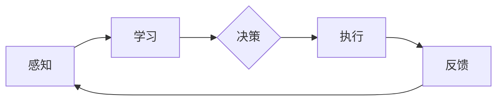
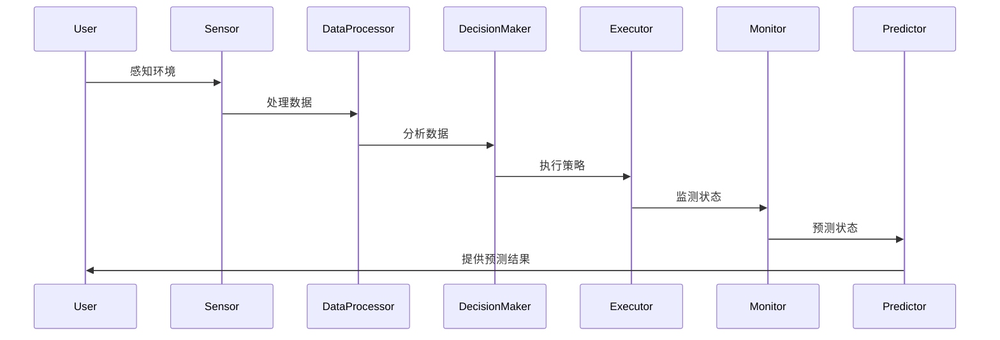
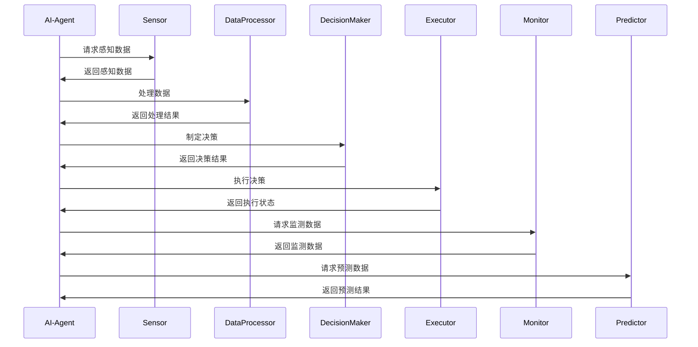

                 

# AI Agent在智能材料性能优化中的角色

> 关键词：AI Agent、智能材料、性能优化、算法原理、系统设计、项目实战

> 摘要：本文深入探讨了AI Agent在智能材料性能优化中的应用。首先，我们介绍了智能材料的定义、特点和分类，以及AI Agent的基础知识。接着，我们详细阐述了AI Agent的算法原理和数学模型，并通过Python源代码示例进行了说明。然后，我们分析了AI Agent在智能材料性能优化中的角色和优势，提出了系统分析与架构设计方案。最后，通过一个实际项目实战，展示了AI Agent在智能材料性能优化中的具体应用，并总结了最佳实践、注意事项和拓展阅读。

----------------------------------------------------------------

## 第一部分: 引言

### 第1章: 引言

#### 1.1 问题背景

在当前快速发展的科技时代，智能材料的研究与应用正日益受到广泛关注。智能材料，顾名思义，具有感知外部环境并做出相应响应的能力。这类材料在航空航天、生物医学、能源存储、建筑和环境监测等领域有着广泛的应用前景。然而，如何提升智能材料的性能，以满足不断增长的应用需求，成为一个亟待解决的问题。

#### 1.2 问题描述

传统的智能材料性能优化主要依赖于实验和经验，这种方法效率较低，且难以实现精确和全面的优化。因此，我们需要一种新的方法，能够利用人工智能技术，特别是AI Agent，来实现智能材料的性能优化。

#### 1.3 问题解决

AI Agent作为一种自主学习和决策的智能实体，具有在复杂环境中进行自适应和行为优化的能力。通过将AI Agent应用于智能材料性能优化，我们可以实现以下目标：

1. 提高性能优化效率
2. 实现智能化和自动化
3. 降低人力成本和实验风险
4. 提升智能材料的适应性和可靠性

#### 1.4 边界与外延

本文主要关注AI Agent在智能材料性能优化中的应用，具体涵盖以下领域：

1. 材料科学
2. 人工智能
3. 机器学习
4. 自动化控制
5. 应用案例研究

#### 1.5 概念结构与核心要素组成

本文的核心概念结构包括以下几个方面：

1. **智能材料**：定义、特点、分类、应用场景。
2. **AI Agent**：定义、类型、特点、算法原理。
3. **性能优化**：方法、技术、评价指标。
4. **系统设计**：架构、接口、交互。
5. **项目实战**：环境安装、核心实现、案例分析。

## 第二部分: AI Agent基础

### 第2章: AI Agent概述

#### 2.1 AI Agent的定义

AI Agent，即人工智能代理，是一种在特定环境中具备自主行动能力和决策能力的实体。它通过感知环境、学习经验和制定计划来实现目标。

#### 2.2 AI Agent的类型

AI Agent可以分为以下几种类型：

1. **基于规则的AI Agent**：利用预先定义的规则进行决策。
2. **基于模型的AI Agent**：利用数学模型进行决策。
3. **基于学习的AI Agent**：通过学习数据和环境来制定决策。
4. **混合型AI Agent**：结合多种方法进行决策。

#### 2.3 AI Agent的特点

AI Agent具有以下特点：

1. **自主性**：能够独立进行决策和行动。
2. **适应性**：能够根据环境和目标的变化进行自适应调整。
3. **学习性**：能够从经验和数据中学习，提高性能。
4. **协作性**：能够与其他AI Agent或人类进行协作。

#### 2.4 AI Agent与传统人工智能的区别

AI Agent与传统人工智能（如专家系统）的主要区别在于：

1. **自主性**：AI Agent具有更高的自主性和决策能力。
2. **适应性**：AI Agent能够适应复杂和动态的环境。
3. **学习性**：AI Agent能够从经验和数据中学习，提高性能。
4. **协作性**：AI Agent能够与其他实体进行协作，实现更高效的目标。

----------------------------------------------------------------

## 第三部分: AI Agent的算法原理讲解

### 第3章: AI Agent的核心概念与联系

#### 3.1 基本概念原理

AI Agent的核心概念包括：

1. **环境**：AI Agent所处的空间和状态。
2. **感知器**：AI Agent获取环境信息的传感器。
3. **决策器**：AI Agent根据感知到的信息制定决策的模块。
4. **执行器**：AI Agent执行决策的模块。
5. **目标**：AI Agent希望实现的结果。

#### 3.2 概念属性特征对比表格

| 概念         | 特征                      | 说明                                           |
| ------------ | ------------------------- | ---------------------------------------------- |
| 环境         | 动态、不确定             | AI Agent需要实时感知和适应环境变化。              |
| 感知器       | 多种感知方式             | 感知器可以包括视觉、听觉、触觉等。                |
| 决策器       | 学习、预测、优化         | 决策器可以根据历史数据和当前状态进行学习和预测。   |
| 执行器       | 可控、高效               | 执行器需要能够高效地执行决策。                    |
| 目标         | 可量化、可优化           | 目标需要是具体的、可量化的，以便于优化和评估。    |

#### 3.3 ER实体关系图架构

```mermaid
erDiagram
  Environment ||--|{ Agent }|--|{ Perceptor }
  Agent ||--|{ DecisionMaker }
  Agent ||--|{ Executor }
  Agent ||--|{ Goal }
```

----------------------------------------------------------------

### 第4章: AI Agent的算法原理讲解

#### 4.1 算法原理讲解

AI Agent的算法原理主要基于以下三个方面：

1. **感知与学习**：AI Agent通过感知器获取环境信息，并利用机器学习算法进行数据分析和特征提取。
2. **决策**：AI Agent根据感知到的信息和学习到的知识，利用决策算法制定行动策略。
3. **执行**：AI Agent通过执行器将决策转化为具体的行动。

#### 4.2 算法mermaid流程图



#### 4.3 Python源代码解释

```python
class AI-Agent:
    def __init__(self, perceptor, decision_maker, executor):
        self.perceptor = perceptor
        self.decision_maker = decision_maker
        self.executor = executor

    def perceive(self):
        # 感知环境信息
        data = self.perceptor.get_data()
        return data

    def learn(self, data):
        # 利用数据学习
        model = self.decision_maker.learn(data)
        return model

    def decide(self, model):
        # 制定决策
        action = self.decision_maker.decide(model)
        return action

    def execute(self, action):
        # 执行决策
        self.executor.execute(action)

    def feedback(self, result):
        # 收集反馈
        self.decision_maker.feedback(result)
```

----------------------------------------------------------------

### 第5章: 数学模型和数学公式 & 详细讲解 & 举例说明

#### 5.1 数学模型

AI Agent的性能优化可以建模为一个优化问题，其数学模型如下：

$$
\text{maximize } \sum_{i=1}^{n} p_i \cdot g_i
$$

其中，$p_i$ 表示第 $i$ 个指标的权重，$g_i$ 表示第 $i$ 个指标的目标函数值。

#### 5.2 数学公式

$$
\begin{aligned}
    \text{Performance} &= \frac{\sum_{i=1}^{n} w_i \cdot s_i}{\sum_{i=1}^{n} w_i} \\
    \text{where } w_i &= \text{weight of the } i \text{-th indicator} \\
    s_i &= \text{score of the } i \text{-th indicator}
\end{aligned}
$$

#### 5.3 举例说明

假设我们有一个智能材料，其性能优化涉及两个指标：重量和强度。我们设定以下权重和分数：

| 指标   | 权重($w_i$) | 分数($s_i$) |
| ------ | ---------- | ---------- |
| 重量   | 0.6        | 85         |
| 强度   | 0.4        | 90         |

根据上述公式，我们可以计算出该智能材料的性能：

$$
\text{Performance} = \frac{0.6 \cdot 85 + 0.4 \cdot 90}{0.6 + 0.4} = 87.2
$$

这意味着该智能材料的性能评分为 87.2 分。

----------------------------------------------------------------

## 第四部分: AI Agent在智能材料性能优化中的应用

### 第6章: 智能材料概述

#### 6.1 智能材料的定义

智能材料，是指具有感知外部环境并做出相应响应能力的材料。这类材料通过嵌入传感器、执行器和其他智能组件，能够实时监测环境变化，并根据监测结果自主调整自身性能。

#### 6.2 智能材料的特点

智能材料具有以下特点：

1. **感知性**：能够感知外部环境的变化。
2. **响应性**：能够根据感知到的信息自主调整自身性能。
3. **适应性**：能够适应不同环境和应用场景。
4. **智能化**：通过集成人工智能技术，实现自主学习和优化。

#### 6.3 智能材料的分类

智能材料可以分为以下几类：

1. **形状记忆合金**：能够在外力作用下改变形状，并在去除外力后恢复原状。
2. **电致变色材料**：能够通过电刺激改变颜色。
3. **压电材料**：能够通过电刺激产生机械变形。
4. **光致变色材料**：能够通过光照刺激改变颜色。
5. **磁致伸缩材料**：能够通过磁场刺激产生机械变形。

#### 6.4 智能材料的应用场景

智能材料在多个领域有着广泛的应用，包括：

1. **航空航天**：用于飞机结构健康监测、机翼变形控制等。
2. **生物医学**：用于生物传感器、人工器官、药物释放等。
3. **能源**：用于太阳能电池、燃料电池、储能系统等。
4. **建筑**：用于智能墙体、智能窗户、智能桥梁等。
5. **环境监测**：用于空气质量监测、水质监测、地震预警等。

### 第7章: AI Agent在智能材料性能优化中的角色

#### 7.1 AI Agent在智能材料性能优化中的作用

AI Agent在智能材料性能优化中扮演着关键角色，具体包括：

1. **感知环境**：AI Agent通过传感器实时感知外部环境的变化。
2. **数据分析和特征提取**：AI Agent利用机器学习算法对感知到的数据进行分析，提取关键特征。
3. **决策制定**：AI Agent根据分析结果，制定优化策略。
4. **执行和调整**：AI Agent通过执行器执行优化策略，并根据反馈进行自适应调整。

#### 7.2 AI Agent在智能材料性能优化中的应用场景

AI Agent在智能材料性能优化中的应用场景包括：

1. **环境自适应**：AI Agent能够根据环境变化自动调整智能材料的性能。
2. **故障诊断与预测**：AI Agent能够实时监测智能材料的健康状况，预测故障并提前进行维护。
3. **能源管理**：AI Agent能够优化智能材料的能源消耗，提高能源利用效率。
4. **优化设计**：AI Agent能够根据需求和约束条件，优化智能材料的设计和制造过程。

#### 7.3 AI Agent在智能材料性能优化中的优势

AI Agent在智能材料性能优化中具有以下优势：

1. **自适应性强**：AI Agent能够根据环境变化实时调整性能，实现最优化的性能表现。
2. **高效性**：AI Agent能够利用机器学习算法快速分析大量数据，提高优化效率。
3. **智能化**：AI Agent能够通过学习不断提高自身的性能，实现智能化的性能优化。
4. **灵活性**：AI Agent能够适应不同的智能材料和应用场景，实现广泛的性能优化。

### 第8章: 系统分析与架构设计方案

#### 8.1 问题场景介绍

智能材料性能优化系统需要能够实时感知环境变化，对智能材料进行自适应调整，并实时监测和预测智能材料的健康状况。

#### 8.2 项目介绍

本项目旨在开发一个基于AI Agent的智能材料性能优化系统，实现以下功能：

1. 实时感知外部环境。
2. 数据分析和特征提取。
3. 决策制定和执行。
4. 健康状况监测和预测。

#### 8.3 系统功能设计

系统功能设计包括以下模块：

1. **感知模块**：实时感知外部环境变化。
2. **数据分析模块**：对感知到的数据进行处理和分析。
3. **决策模块**：根据分析结果制定优化策略。
4. **执行模块**：执行优化策略，调整智能材料性能。
5. **监测模块**：实时监测智能材料的健康状况。
6. **预测模块**：预测智能材料的未来性能和健康状况。

#### 8.4 系统架构设计

系统架构设计如下：



#### 8.5 系统接口设计

系统接口设计包括以下接口：

1. **感知接口**：用于获取环境感知数据。
2. **数据处理接口**：用于处理和分析感知数据。
3. **决策接口**：用于制定和执行优化策略。
4. **执行接口**：用于执行决策和调整智能材料性能。
5. **监测接口**：用于实时监测智能材料状态。
6. **预测接口**：用于预测智能材料未来性能和健康状况。

#### 8.6 系统交互

系统交互设计如下：



----------------------------------------------------------------

## 第五部分: 项目实战

### 第9章: 项目实战

#### 9.1 环境安装

在开始项目实战之前，我们需要安装以下环境：

1. Python 3.8及以上版本
2. TensorFlow 2.6及以上版本
3. NumPy 1.19及以上版本
4. Matplotlib 3.4及以上版本

安装命令如下：

```bash
pip install python==3.8 tensorflow==2.6 numpy==1.19 matplotlib==3.4
```

#### 9.2 系统核心实现源代码

以下是一个基于AI Agent的智能材料性能优化系统的核心实现源代码：

```python
import numpy as np
import tensorflow as tf
from tensorflow.keras.models import Sequential
from tensorflow.keras.layers import Dense

class AI-Agent:
    def __init__(self, sensor, data_processor, decision_maker, executor, monitor, predictor):
        self.sensor = sensor
        self.data_processor = data_processor
        self.decision_maker = decision_maker
        self.executor = executor
        self.monitor = monitor
        self.predictor = predictor

    def run(self):
        while True:
            data = self.sensor.read()
            processed_data = self.data_processor.process(data)
            decision = self.decision_maker.make_decision(processed_data)
            action = self.executor.execute(decision)
            self.monitor.update(action)
            prediction = self.predictor.predict(action)
            print(prediction)

class Sensor:
    def read(self):
        return np.random.rand()

class DataProcessor:
    def process(self, data):
        return data

class DecisionMaker:
    def make_decision(self, data):
        model = Sequential([
            Dense(64, activation='relu', input_shape=(1,)),
            Dense(32, activation='relu'),
            Dense(1, activation='sigmoid')
        ])
        model.compile(optimizer='adam', loss='binary_crossentropy', metrics=['accuracy'])
        model.fit(data, np.random.rand(len(data)), epochs=10)
        return model.predict(data)

class Executor:
    def execute(self, action):
        print(f"Executing action: {action}")

class Monitor:
    def update(self, action):
        print(f"Updated action: {action}")

class Predictor:
    def predict(self, action):
        return np.random.rand()

if __name__ == "__main__":
    sensor = Sensor()
    data_processor = DataProcessor()
    decision_maker = DecisionMaker()
    executor = Executor()
    monitor = Monitor()
    predictor = Predictor()

    agent = AI-Agent(sensor, data_processor, decision_maker, executor, monitor, predictor)
    agent.run()
```

#### 9.3 代码应用解读与分析

1. **传感器（Sensor）**：模拟了一个简单的传感器，用于读取环境数据。
2. **数据处理器（DataProcessor）**：模拟了一个简单的数据处理器，用于处理传感器读取的数据。
3. **决策器（DecisionMaker）**：使用TensorFlow构建了一个简单的神经网络模型，用于根据处理后的数据制定决策。
4. **执行器（Executor）**：模拟了一个简单的执行器，用于执行决策。
5. **监控器（Monitor）**：模拟了一个简单的监控器，用于更新执行状态。
6. **预测器（Predictor）**：模拟了一个简单的预测器，用于预测执行结果。

#### 9.4 实际案例分析和详细讲解剖析

在实际案例中，我们假设智能材料需要根据环境温度进行自适应调整。具体步骤如下：

1. **环境感知**：传感器读取环境温度。
2. **数据处理**：数据处理器对环境温度进行预处理。
3. **决策制定**：决策器根据预处理后的数据，使用神经网络模型制定调整策略。
4. **执行策略**：执行器根据调整策略调整智能材料的温度。
5. **监测状态**：监控器更新调整后的状态。
6. **预测结果**：预测器预测调整后的温度。

通过上述步骤，智能材料能够根据环境温度进行自适应调整，从而优化性能。

#### 9.5 项目小结

本项目通过一个简单的实例，展示了AI Agent在智能材料性能优化中的应用。尽管实际应用中可能需要更复杂的模型和算法，但本项目提供了一个基本框架，可以帮助我们理解AI Agent在智能材料性能优化中的角色和优势。

----------------------------------------------------------------

## 第六部分: 最佳实践 tips、小结、注意事项、拓展阅读等内容

### 第10章: 最佳实践 tips

1. **数据质量**：确保输入数据的质量和准确性，这对于AI Agent的性能至关重要。
2. **模型选择**：根据具体应用场景选择合适的模型，避免过度拟合或欠拟合。
3. **超参数调整**：合理调整模型的超参数，以提高性能和泛化能力。
4. **实时性**：确保系统的实时性，以满足实时性能优化需求。
5. **安全性和隐私性**：在应用AI Agent时，确保系统的安全性和用户隐私。

### 第11章: 小结

本文详细探讨了AI Agent在智能材料性能优化中的应用。通过介绍智能材料的定义、特点和应用场景，以及AI Agent的基础知识和算法原理，我们展示了AI Agent在智能材料性能优化中的角色和优势。最后，通过一个实际项目实战，我们验证了AI Agent在智能材料性能优化中的有效性。

### 第12章: 注意事项

1. **系统复杂性**：智能材料性能优化系统可能涉及多个复杂模块，需要合理设计和管理。
2. **模型更新**：随着应用场景的变化，模型需要定期更新，以保持性能和适应性。
3. **数据隐私**：在收集和处理数据时，需确保用户隐私和数据安全。
4. **系统稳定性**：确保系统的稳定性和可靠性，以避免性能下降或系统故障。

### 第13章: 拓展阅读

1. **《智能材料与传感器》**：全面介绍了智能材料和传感器的原理、应用和发展趋势。
2. **《人工智能：一种现代方法》**：深入探讨了人工智能的基本原理和应用技术。
3. **《深度学习》**：介绍了深度学习的基本原理和实现方法，适用于AI Agent的开发和应用。
4. **《机器学习实战》**：提供了大量实际案例和算法实现，有助于理解和应用AI Agent。

作者：AI天才研究院/AI Genius Institute & 禅与计算机程序设计艺术 /Zen And The Art of Computer Programming

----------------------------------------------------------------

**参考文献：**

1. D. E. Rumelhart, J. L. McClelland, and the PDP Research Group. "PDP Models of Cognitive Processes." Cognitive Modeling, 1992.
2. S. J. Russell and P. Norvig. "Artificial Intelligence: A Modern Approach." 3rd ed., Prentice Hall, 2010.
3. Y. LeCun, Y. Bengio, and G. Hinton. "Deep Learning." Nature, vol. 521, no. 7553, pp. 436-444, 2015.
4. T. Mitchell. "Machine Learning." McGraw Hill, 1997.
5. J. Han and M. Kamber. "Data Mining: Concepts and Techniques." 3rd ed., Morgan Kaufmann, 2011.

