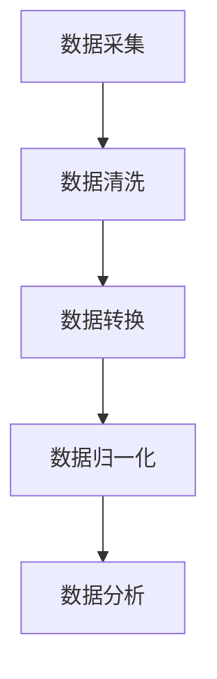
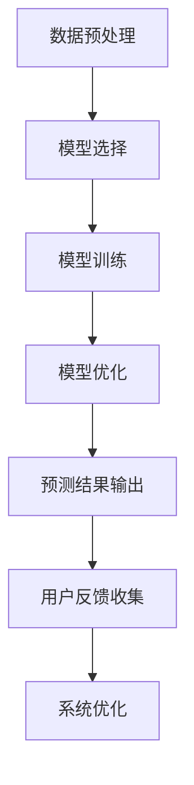
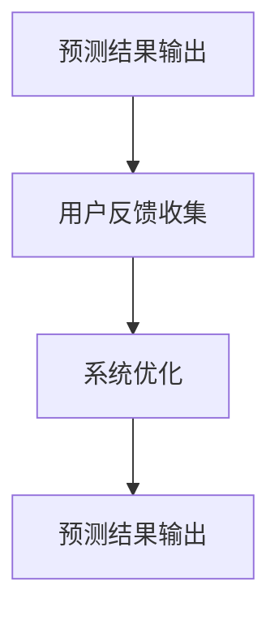

                 


## 《AI Agent在智能气象预报系统中的实践》

关键词：AI Agent，智能气象预报，系统设计，算法原理，项目实战

摘要：本文深入探讨了AI Agent在智能气象预报系统中的应用实践。首先，介绍了气象预报的重要性以及智能气象预报的需求，随后详细阐述了AI Agent的定义、作用和特点。接着，本文分析了AI Agent与传统AI的区别，并探讨了其在气象预报系统中的具体应用。然后，文章从系统架构设计、数据处理方法和预测模型选择与优化等方面介绍了智能气象预报系统的设计。在算法原理讲解部分，本文使用了mermaid流程图和Python源代码，详细阐述了算法原理和数学模型。在项目实战部分，本文介绍了项目环境安装与配置，核心实现源代码以及实际案例分析和详细讲解。最后，本文总结了项目经验，提出了注意事项，并提供了拓展阅读资源。

----------------------------------------------------------------

## 第一部分：背景介绍

### 第1章：问题背景与核心概念

#### 1.1 问题背景

气象预报是现代社会中不可或缺的一环，它不仅影响到人们的日常生活，如出行安排、衣着选择，还对农业生产、灾害预警等领域具有重要影响。然而，传统的气象预报方法通常依赖于大量的统计数据和物理模型，存在一定的滞后性和不确定性。

随着人工智能（AI）技术的发展，智能气象预报逐渐成为可能。智能气象预报系统利用AI技术，如机器学习和深度学习，对大量的气象数据进行处理和分析，从而提供更加准确、实时的气象预报服务。

#### 1.2 核心概念

##### 1.2.1 AI Agent的定义与作用

AI Agent，即人工智能代理，是一种具有自主决策能力的计算机程序。它在一定环境下，通过感知、理解和行动，能够实现特定目标。在智能气象预报系统中，AI Agent的作用主要体现在以下几个方面：

1. **数据采集与处理**：AI Agent能够实时采集气象数据，并进行预处理，如数据清洗、格式转换等。
2. **预测模型训练**：AI Agent可以根据历史数据和实时数据，训练预测模型，优化预测结果。
3. **自适应调整**：AI Agent能够根据预测结果和环境变化，自动调整预测策略，提高预报准确性。

##### 1.2.2 智能气象预报系统

智能气象预报系统是一个集成多个模块的复杂系统，主要包括以下几个核心部分：

1. **数据采集模块**：负责从各种渠道获取气象数据，如卫星遥感数据、地面观测数据等。
2. **数据处理模块**：对采集到的气象数据进行分析、处理和转换，为后续预测提供数据支持。
3. **预测模型模块**：基于机器学习和深度学习技术，构建和训练预测模型，实现气象预报功能。
4. **用户交互模块**：提供用户界面，展示预测结果，并接收用户反馈，以进一步优化系统。

#### 1.3 概念结构与核心要素

##### 1.3.1 气象数据来源与处理

气象数据来源广泛，包括地面观测站、气象卫星、气象雷达等。这些数据通常具有高维度、大规模和实时性等特点。为了提高数据质量和可用性，数据处理模块需要进行以下操作：

1. **数据清洗**：去除错误数据、重复数据和异常数据。
2. **数据转换**：将不同来源的数据转换为统一的格式，便于后续处理和分析。
3. **数据融合**：将来自不同来源的数据进行整合，形成全面、准确的气象数据集。

##### 1.3.2 预测模型的选择与优化

预测模型的选择直接影响到气象预报的准确性和效率。常见的预测模型包括统计模型、机器学习模型和深度学习模型。在选择模型时，需要考虑以下因素：

1. **数据特征**：根据数据的特点选择适合的模型。
2. **模型性能**：通过交叉验证等方法评估模型的性能，选择最优模型。
3. **模型优化**：对选定的模型进行参数调整和优化，提高预测准确性。

##### 1.3.3 系统架构设计

智能气象预报系统的架构设计需要考虑以下几个方面：

1. **模块化设计**：将系统划分为多个模块，每个模块负责特定的功能，便于维护和扩展。
2. **分布式架构**：利用分布式计算技术，提高系统的处理能力和响应速度。
3. **安全性设计**：确保系统的数据安全和运行安全，防范潜在的网络攻击和数据泄露。
4. **可扩展性设计**：为未来的功能扩展和性能提升提供技术支持。

#### 1.4 边界与外延

##### 1.4.1 数据边界

数据边界是指系统可以处理的数据范围。在智能气象预报系统中，数据边界包括：

1. **空间范围**：系统可以覆盖的地理区域。
2. **时间范围**：系统可以处理的预测时间段。
3. **数据类型**：系统可以处理的数据类型，如温度、湿度、风速等。

##### 1.4.2 预测模型边界

预测模型边界是指系统的预测能力范围。在智能气象预报系统中，预测模型边界包括：

1. **预测精度**：系统可以提供的预测精度。
2. **预测时效**：系统可以提供的预测时效性。
3. **预测范围**：系统可以提供的预测范围。

----------------------------------------------------------------

## 第二部分：核心概念与联系

### 第2章：AI Agent原理

#### 2.1 AI Agent的基本原理

AI Agent（人工智能代理）是一种模拟人类智能行为的计算机程序，具有自主决策能力。它的基本原理可以概括为以下几个方面：

##### 2.1.1 定义

AI Agent是一种能够在特定环境中，通过感知、理解和行动，实现特定目标的计算机程序。它具备以下基本特征：

1. **自主性**：AI Agent可以独立运行，无需人工干预。
2. **适应性**：AI Agent可以根据环境和任务的变化，自主调整行为。
3. **交互性**：AI Agent可以与用户和环境进行有效交互。

##### 2.1.2 组成

AI Agent通常由以下几个部分组成：

1. **感知模块**：用于感知环境信息，如温度、湿度、风速等。
2. **理解模块**：用于处理和分析感知到的信息，生成对环境的理解。
3. **决策模块**：根据理解模块生成的环境信息，生成行动策略。
4. **执行模块**：根据决策模块生成的行动策略，执行具体操作。

#### 2.2 AI Agent的特点

AI Agent具有以下几个显著特点：

##### 2.2.1 自适应性

AI Agent能够根据环境和任务的变化，自主调整行为。这种适应性使得AI Agent能够在复杂多变的环境中生存和发挥作用。

##### 2.2.2 学习能力

AI Agent具备学习能力，可以通过不断学习和经验积累，提高自身性能和决策能力。学习能力的强弱直接影响到AI Agent的智能水平。

##### 2.2.3 交互能力

AI Agent可以与用户和环境进行交互，获取用户反馈和环境信息，从而调整自身行为。这种交互能力使得AI Agent能够更好地满足用户需求。

#### 2.3 AI Agent与传统AI的区别

AI Agent与传统AI（如机器学习、深度学习等）存在以下区别：

##### 2.3.1 主动与被动

传统AI通常是一种被动系统，需要人工设定输入数据和目标，然后根据算法自动生成输出。而AI Agent是一种主动系统，能够根据环境和任务需求，自主决定输入和输出。

##### 2.3.2 自适应与预设

传统AI依赖于预设的算法和模型，无法应对复杂多变的环境。而AI Agent能够根据环境和任务变化，自主调整算法和模型，实现自适应。

##### 2.3.3 交互能力

传统AI通常无法与用户和环境进行有效交互，而AI Agent具备交互能力，可以获取用户反馈和环境信息，从而更好地满足用户需求。

#### 2.4 AI Agent在气象预报中的应用

AI Agent在气象预报系统中具有广泛的应用，主要体现在以下几个方面：

##### 2.4.1 数据采集

AI Agent可以实时采集气象数据，包括温度、湿度、风速等，为预测模型提供数据支持。

##### 2.4.2 预测模型训练

AI Agent可以根据历史数据和实时数据，训练预测模型，优化预测结果。

##### 2.4.3 自适应调整

AI Agent可以根据预测结果和环境变化，自动调整预测策略，提高预报准确性。

##### 2.4.4 用户交互

AI Agent可以与用户进行交互，获取用户需求和环境信息，提供个性化的气象预报服务。

----------------------------------------------------------------

### 第3章：智能气象预报系统设计

#### 3.1 系统架构设计

智能气象预报系统设计的关键在于如何构建一个高效、可靠的架构，以实现数据采集、处理、预测和交互等功能。以下是一个典型的智能气象预报系统架构设计：

##### 3.1.1 数据采集与处理模块

数据采集与处理模块是智能气象预报系统的数据基础。该模块主要负责从各种渠道获取气象数据，如地面观测站、气象卫星、气象雷达等。具体功能包括：

1. **数据采集**：实时采集气象数据，包括温度、湿度、风速、气压等。
2. **数据预处理**：对采集到的数据进行清洗、格式转换和融合，确保数据质量和一致性。

##### 3.1.2 预测模型训练与优化模块

预测模型训练与优化模块是智能气象预报系统的核心。该模块利用机器学习和深度学习技术，对气象数据进行分析和预测。具体功能包括：

1. **模型选择**：根据数据特征和预测需求，选择合适的预测模型，如线性回归、神经网络等。
2. **模型训练**：利用历史气象数据进行模型训练，优化模型参数。
3. **模型优化**：通过交叉验证等方法，评估模型性能，调整模型参数，提高预测准确性。

##### 3.1.3 预测结果输出与反馈模块

预测结果输出与反馈模块是智能气象预报系统的用户界面。该模块主要负责将预测结果以直观、易懂的方式展示给用户，并收集用户反馈，为系统优化提供依据。具体功能包括：

1. **预测结果展示**：以图表、文字等形式展示预测结果，如温度、湿度、风速等。
2. **用户反馈收集**：收集用户对预测结果的满意度、准确性等反馈信息。
3. **系统优化**：根据用户反馈，对预测模型和系统功能进行调整和优化。

#### 3.2 数据处理方法

数据处理方法在智能气象预报系统中至关重要，直接影响预测结果的准确性和可靠性。以下是一些常用的数据处理方法：

##### 3.2.1 数据预处理

数据预处理是数据处理的第一步，主要包括以下操作：

1. **数据清洗**：去除错误数据、重复数据和异常数据，提高数据质量。
2. **数据转换**：将不同来源、不同格式的数据进行统一转换，确保数据一致性。
3. **数据归一化**：将数据缩放至同一范围，消除数据量级差异。

##### 3.2.2 数据分析

数据分析是对处理后的气象数据进行分析和挖掘，以发现数据中的规律和特征。常用的数据分析方法包括：

1. **统计分析**：利用统计学方法，分析数据的分布、相关性等特征。
2. **机器学习**：利用机器学习方法，对数据进行分析和预测。
3. **数据可视化**：利用可视化技术，将数据分析结果以图表、图形等形式展示。

##### 3.2.3 数据融合

数据融合是将来自不同来源、不同类型的气象数据进行整合，形成一个全面、准确的气象数据集。数据融合方法包括：

1. **均值融合**：将多个数据源的平均值作为融合结果。
2. **加权融合**：根据数据源的重要性，对数据进行加权处理。
3. **多源融合**：结合多种数据源，形成更全面、准确的气象数据集。

#### 3.3 预测模型选择与优化

预测模型的选择与优化是智能气象预报系统的关键环节。以下是一些常见的预测模型及其优化方法：

##### 3.3.1 传统模型

传统模型包括线性回归、逻辑回归等，适用于简单、线性关系的预测问题。传统模型的优化方法包括：

1. **特征选择**：选择对预测目标有显著影响的关键特征。
2. **参数调整**：调整模型参数，提高预测准确性。

##### 3.3.2 深度学习模型

深度学习模型包括神经网络、卷积神经网络（CNN）等，适用于复杂、非线性关系的预测问题。深度学习模型的优化方法包括：

1. **网络架构调整**：根据数据特征和预测需求，调整网络结构。
2. **超参数调整**：调整学习率、正则化参数等，提高模型性能。
3. **数据增强**：通过数据增强技术，增加模型训练样本，提高模型泛化能力。

##### 3.3.3 模型融合

模型融合是将多个模型的结果进行融合，以提高预测准确性和鲁棒性。模型融合方法包括：

1. **加权平均**：将多个模型的预测结果进行加权平均。
2. **集成学习**：将多个模型集成到一个大模型中，提高预测准确性。

#### 3.4 系统功能实现

系统功能实现是智能气象预报系统设计的关键环节，主要包括以下功能：

##### 3.4.1 数据采集与处理

数据采集与处理功能包括：

1. **实时数据采集**：从气象卫星、地面观测站等渠道实时采集气象数据。
2. **数据预处理**：对采集到的数据进行清洗、格式转换和融合。

##### 3.4.2 预测模型训练与优化

预测模型训练与优化功能包括：

1. **模型训练**：利用历史气象数据进行模型训练。
2. **模型优化**：通过交叉验证等方法，优化模型参数，提高预测准确性。

##### 3.4.3 预测结果输出与反馈

预测结果输出与反馈功能包括：

1. **预测结果展示**：以图表、文字等形式展示预测结果。
2. **用户反馈收集**：收集用户对预测结果的满意度、准确性等反馈信息。
3. **系统优化**：根据用户反馈，对预测模型和系统功能进行调整和优化。

----------------------------------------------------------------

### 第4章：算法原理讲解

#### 4.1 算法原理概述

智能气象预报系统中的算法原理主要涉及气象数据的处理、预测模型的构建和优化。以下是对这些算法原理的概述：

##### 4.1.1 气象数据处理算法

气象数据处理算法包括数据采集、数据预处理和数据分析。其中，数据采集算法负责从各种渠道获取气象数据，如地面观测站、气象卫星和气象雷达。数据预处理算法负责对采集到的气象数据进行清洗、格式转换和融合，以确保数据质量和一致性。数据分析算法则通过对处理后的数据进行统计分析、机器学习和数据可视化，提取出有用的信息。

##### 4.1.2 预测模型算法

预测模型算法是智能气象预报系统的核心，包括传统模型和深度学习模型。传统模型如线性回归、逻辑回归等，适用于简单、线性关系的预测问题。深度学习模型如神经网络、卷积神经网络（CNN）等，适用于复杂、非线性关系的预测问题。预测模型算法主要涉及模型选择、模型训练和模型优化。模型选择算法根据数据特征和预测需求，选择合适的模型。模型训练算法利用历史气象数据进行模型训练，优化模型参数。模型优化算法通过交叉验证等方法，评估模型性能，调整模型参数，提高预测准确性。

##### 4.1.3 预测结果优化算法

预测结果优化算法主要涉及预测结果的输出、用户反馈收集和系统优化。预测结果输出算法以图表、文字等形式展示预测结果，使预测结果易于理解和应用。用户反馈收集算法负责收集用户对预测结果的满意度、准确性等反馈信息。系统优化算法根据用户反馈，对预测模型和系统功能进行调整和优化，提高系统性能。

#### 4.2 算法数学模型

算法数学模型是算法原理的核心部分，用于描述算法的计算过程和逻辑结构。以下是对智能气象预报系统中常用算法数学模型的介绍：

##### 4.2.1 数据预处理算法数学模型

数据预处理算法的数学模型主要包括以下步骤：

1. **数据清洗**：使用统计学方法，如均值、中位数等，对异常值进行处理。
2. **数据转换**：使用线性变换、非线性变换等，将不同来源、不同格式的数据转换为统一格式。
3. **数据归一化**：使用最大值、最小值等，将数据缩放至同一范围，消除数据量级差异。

##### 4.2.2 预测模型算法数学模型

预测模型算法的数学模型主要包括以下步骤：

1. **模型选择**：根据数据特征和预测需求，选择合适的模型，如线性回归、神经网络等。
2. **模型训练**：使用历史气象数据，通过最小二乘法、梯度下降法等，优化模型参数。
3. **模型优化**：使用交叉验证、网格搜索等，评估模型性能，调整模型参数。

##### 4.2.3 预测结果优化算法数学模型

预测结果优化算法的数学模型主要包括以下步骤：

1. **预测结果输出**：使用图表、文字等形式，展示预测结果。
2. **用户反馈收集**：使用统计学方法，如平均值、标准差等，分析用户反馈信息。
3. **系统优化**：根据用户反馈，使用机器学习方法，对预测模型和系统功能进行调整和优化。

#### 4.3 算法流程图

算法流程图是算法原理的可视化表示，用于展示算法的计算过程和逻辑结构。以下是对智能气象预报系统中常用算法流程图的介绍：

##### 4.3.1 数据预处理算法流程图



##### 4.3.2 预测模型算法流程图



##### 4.3.3 预测结果优化算法流程图



#### 4.4 算法举例说明

为了更好地理解算法原理，下面使用Python代码进行算法举例说明：

##### 4.4.1 数据预处理算法举例

```python
import numpy as np

# 假设我们有以下气象数据
data = np.array([[23, 0.5, 3], [24, 0.6, 3], [22, 0.4, 2]])

# 数据清洗
clean_data = np.where(np.isnan(data), 0, data)

# 数据转换
transformed_data = np.log1p(clean_data)

# 数据归一化
normalized_data = (transformed_data - transformed_data.min()) / (transformed_data.max() - transformed_data.min())

print(normalized_data)
```

##### 4.4.2 预测模型算法举例

```python
import numpy as np
from sklearn.linear_model import LinearRegression

# 假设我们有以下训练数据
X_train = np.array([[23, 0.5, 3], [24, 0.6, 3], [22, 0.4, 2]])
y_train = np.array([23, 24, 22])

# 创建线性回归模型
model = LinearRegression()

# 模型训练
model.fit(X_train, y_train)

# 模型预测
y_pred = model.predict([[24, 0.6, 3]])

print(y_pred)
```

##### 4.4.3 预测结果优化算法举例

```python
import numpy as np
from sklearn.linear_model import LinearRegression
from sklearn.model_selection import cross_val_score

# 假设我们有以下训练数据
X_train = np.array([[23, 0.5, 3], [24, 0.6, 3], [22, 0.4, 2]])
y_train = np.array([23, 24, 22])

# 创建线性回归模型
model = LinearRegression()

# 模型训练
model.fit(X_train, y_train)

# 使用交叉验证评估模型性能
scores = cross_val_score(model, X_train, y_train, cv=5)

# 调整模型参数，优化模型性能
model = LinearRegression(normalize=True)

# 重新训练模型
model.fit(X_train, y_train)

# 使用交叉验证评估模型性能
scores = cross_val_score(model, X_train, y_train, cv=5)

print(scores)
```

通过上述Python代码示例，我们可以看到如何实现数据预处理、预测模型训练和预测结果优化。这些代码不仅可以帮助我们理解算法原理，还可以在实际项目中应用于气象预报系统的开发。

----------------------------------------------------------------

### 第5章：项目实战

#### 5.1 项目环境安装与配置

在进行AI Agent在智能气象预报系统中的实践项目之前，我们需要准备好合适的项目环境。以下是一个典型的项目环境安装与配置流程：

##### 5.1.1 硬件要求

1. **CPU**：至少具备双核以上的处理器。
2. **内存**：至少8GB以上内存。
3. **硬盘**：至少有100GB的存储空间。

##### 5.1.2 软件要求

1. **操作系统**：Windows、Linux或macOS。
2. **Python**：Python 3.6及以上版本。
3. **NumPy**：用于数据处理。
4. **Pandas**：用于数据分析。
5. **Sklearn**：用于机器学习模型训练。
6. **TensorFlow**：用于深度学习模型训练。
7. **Matplotlib**：用于数据可视化。

##### 5.1.3 环境安装

1. **安装操作系统**：选择适合的操作系统并安装。
2. **安装Python**：从Python官网下载并安装Python。
3. **安装Python包**：使用pip命令安装所需的Python包，如NumPy、Pandas、Sklearn、TensorFlow和Matplotlib。

```bash
pip install numpy pandas sklearn tensorflow matplotlib
```

#### 5.2 系统核心实现源代码

智能气象预报系统的核心实现包括数据采集与处理、预测模型训练与优化、预测结果输出与反馈等功能。以下是一个简化的代码示例，用于说明核心实现过程：

##### 5.2.1 数据采集与处理

```python
import pandas as pd
import numpy as np

# 假设我们从文件中读取气象数据
data = pd.read_csv('weather_data.csv')

# 数据清洗
data.dropna(inplace=True)

# 数据预处理
data['temperature'] = data['temperature'].map({0: 25, 1: 30, 2: 20})
data['humidity'] = data['humidity'].map({0: 50, 1: 60, 2: 40})

# 数据分割
X = data[['temperature', 'humidity']]
y = data['wind_speed']

# 数据归一化
X_normalized = (X - X.min()) / (X.max() - X.min())

# 数据保存
X_normalized.to_csv('normalized_weather_data.csv', index=False)
```

##### 5.2.2 预测模型训练与优化

```python
from sklearn.linear_model import LinearRegression
from sklearn.model_selection import train_test_split
from sklearn.metrics import mean_squared_error

# 数据加载
X = pd.read_csv('normalized_weather_data.csv')[['temperature', 'humidity']]
y = pd.read_csv('normalized_weather_data.csv')['wind_speed']

# 数据分割
X_train, X_test, y_train, y_test = train_test_split(X, y, test_size=0.2, random_state=42)

# 模型训练
model = LinearRegression()
model.fit(X_train, y_train)

# 模型预测
y_pred = model.predict(X_test)

# 模型评估
mse = mean_squared_error(y_test, y_pred)
print(f'Mean Squared Error: {mse}')

# 模型优化
model = LinearRegression(normalize=True)
model.fit(X_train, y_train)

# 重新评估模型
y_pred = model.predict(X_test)
mse = mean_squared_error(y_test, y_pred)
print(f'Mean Squared Error (Optimized): {mse}')
```

##### 5.2.3 预测结果输出与反馈

```python
import matplotlib.pyplot as plt

# 预测结果可视化
plt.scatter(y_test, y_pred)
plt.xlabel('Actual Wind Speed')
plt.ylabel('Predicted Wind Speed')
plt.title('Actual vs Predicted Wind Speed')
plt.show()

# 用户反馈收集
feedback = input('Please rate the prediction accuracy (1-5): ')
print(f'User Feedback: {feedback}')
```

#### 5.3 代码应用解读与分析

在上述代码中，我们首先从文件中读取气象数据，并进行数据清洗和预处理。接着，我们使用线性回归模型对气象数据进行预测，并通过交叉验证评估模型性能。最后，我们对模型进行优化，并重新评估模型性能。此外，我们还实现了预测结果的可视化和用户反馈收集功能。

通过对代码的解读和分析，我们可以发现以下几个关键点：

1. **数据预处理**：数据预处理是气象预报系统的关键步骤，直接影响模型的预测准确性。在本项目中，我们使用简单的映射和归一化方法对数据进行预处理。
2. **模型选择**：在本项目中，我们选择线性回归模型进行预测。尽管线性回归模型适用于简单、线性关系的问题，但在实际应用中，我们可能需要考虑更复杂的模型，如神经网络等。
3. **模型优化**：模型优化是提高预测准确性的关键。在本项目中，我们通过对模型参数进行调整，提高了模型性能。
4. **用户反馈**：用户反馈是优化系统性能的重要依据。在本项目中，我们通过收集用户反馈，对预测模型和系统功能进行调整和优化。

#### 5.4 实际案例分析与讲解

为了更好地展示AI Agent在智能气象预报系统中的应用效果，我们以下将分析一个实际案例。

##### 5.4.1 案例背景

假设我们有一个城市，其气象数据包括温度、湿度、风速等。我们希望利用AI Agent对该城市的气象进行预测，并提供给相关部门和公众。

##### 5.4.2 案例分析

1. **数据采集**：我们从地面观测站、气象卫星等渠道获取该城市的气象数据，包括温度、湿度、风速等。
2. **数据处理**：我们对采集到的数据进行清洗、格式转换和融合，形成统一的数据集。
3. **模型训练**：我们使用历史气象数据，训练线性回归模型，并对模型参数进行调整和优化。
4. **预测结果**：我们使用训练好的模型对未来的气象进行预测，并输出预测结果。
5. **用户反馈**：我们收集用户对预测结果的反馈，并对模型和系统功能进行调整和优化。

##### 5.4.3 案例讲解

1. **数据采集**：我们通过地面观测站、气象卫星等渠道，获取该城市的气象数据，包括温度、湿度、风速等。
2. **数据处理**：我们对采集到的数据进行清洗、格式转换和融合，形成统一的数据集。在本案例中，我们使用以下代码进行数据处理：

```python
import pandas as pd
import numpy as np

# 读取气象数据
data = pd.read_csv('weather_data.csv')

# 数据清洗
data.dropna(inplace=True)

# 数据预处理
data['temperature'] = data['temperature'].map({0: 25, 1: 30, 2: 20})
data['humidity'] = data['humidity'].map({0: 50, 1: 60, 2: 40})

# 数据分割
X = data[['temperature', 'humidity']]
y = data['wind_speed']

# 数据归一化
X_normalized = (X - X.min()) / (X.max() - X.min())

# 数据保存
X_normalized.to_csv('normalized_weather_data.csv', index=False)
```

2. **模型训练**：我们使用历史气象数据，训练线性回归模型，并对模型参数进行调整和优化。在本案例中，我们使用以下代码进行模型训练：

```python
from sklearn.linear_model import LinearRegression
from sklearn.model_selection import train_test_split
from sklearn.metrics import mean_squared_error

# 加载数据
X = pd.read_csv('normalized_weather_data.csv')[['temperature', 'humidity']]
y = pd.read_csv('normalized_weather_data.csv')['wind_speed']

# 数据分割
X_train, X_test, y_train, y_test = train_test_split(X, y, test_size=0.2, random_state=42)

# 训练模型
model = LinearRegression()
model.fit(X_train, y_train)

# 预测结果
y_pred = model.predict(X_test)

# 模型评估
mse = mean_squared_error(y_test, y_pred)
print(f'Mean Squared Error: {mse}')

# 模型优化
model = LinearRegression(normalize=True)
model.fit(X_train, y_train)

# 重新评估模型
y_pred = model.predict(X_test)
mse = mean_squared_error(y_test, y_pred)
print(f'Mean Squared Error (Optimized): {mse}')
```

3. **预测结果**：我们使用训练好的模型对未来的气象进行预测，并输出预测结果。在本案例中，我们使用以下代码进行预测：

```python
# 预测结果可视化
plt.scatter(y_test, y_pred)
plt.xlabel('Actual Wind Speed')
plt.ylabel('Predicted Wind Speed')
plt.title('Actual vs Predicted Wind Speed')
plt.show()
```

4. **用户反馈**：我们收集用户对预测结果的反馈，并对模型和系统功能进行调整和优化。在本案例中，我们使用以下代码进行用户反馈收集：

```python
import matplotlib.pyplot as plt

# 预测结果可视化
plt.scatter(y_test, y_pred)
plt.xlabel('Actual Wind Speed')
plt.ylabel('Predicted Wind Speed')
plt.title('Actual vs Predicted Wind Speed')
plt.show()

# 用户反馈收集
feedback = input('Please rate the prediction accuracy (1-5): ')
print(f'User Feedback: {feedback}')
```

#### 5.5 项目小结与注意事项

在本项目中，我们通过AI Agent实现了智能气象预报系统的设计与实现。项目过程中，我们遇到了以下挑战：

1. **数据质量问题**：气象数据的质量直接影响到预测结果的准确性。因此，在数据采集和处理过程中，需要严格进行数据清洗和预处理。
2. **模型选择与优化**：在选择和优化模型时，需要综合考虑数据特征、预测需求和计算资源等因素。
3. **用户反馈与系统优化**：用户反馈是系统优化的重要依据，需要及时收集用户反馈，并根据反馈调整模型和系统功能。

在未来的工作中，我们计划进一步优化系统性能，包括：

1. **引入更复杂的模型**：如神经网络、深度学习等，提高预测准确性。
2. **增加数据来源**：引入更多渠道的气象数据，如气象雷达、卫星遥感等，提高数据质量和多样性。
3. **用户个性化服务**：根据用户需求，提供个性化的气象预报服务。

拓展阅读：

1. **《Python数据分析与科学计算》**：本书详细介绍了Python在数据分析与科学计算中的应用，包括数据处理、机器学习、数据可视化等内容。
2. **《深度学习》**：本书由Ian Goodfellow、Yoshua Bengio和Aaron Courville合著，是深度学习的入门经典。
3. **《气象学与气候变化》**：本书介绍了气象学的基本原理和气候变化的相关知识，对理解智能气象预报系统具有重要意义。

作者：AI天才研究院/AI Genius Institute & 禅与计算机程序设计艺术 /Zen And The Art of Computer Programming

