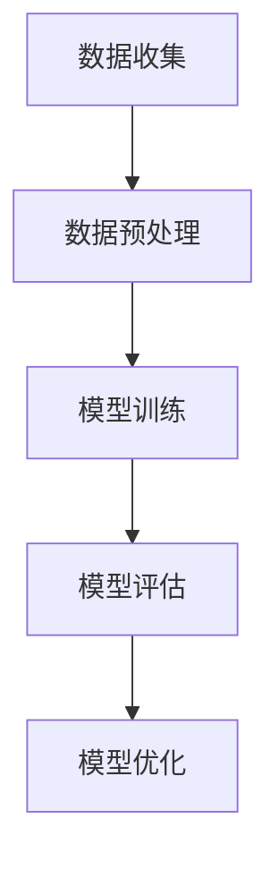
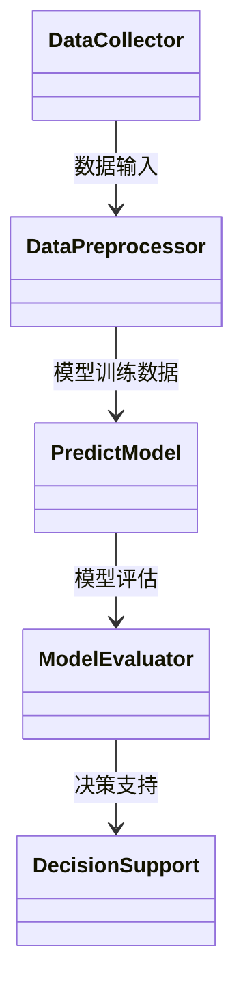
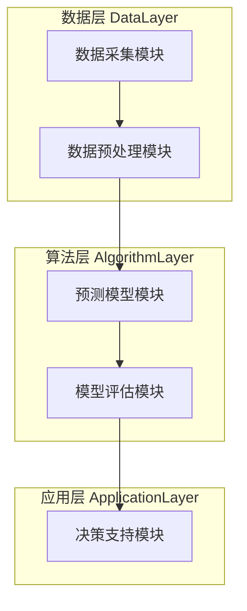
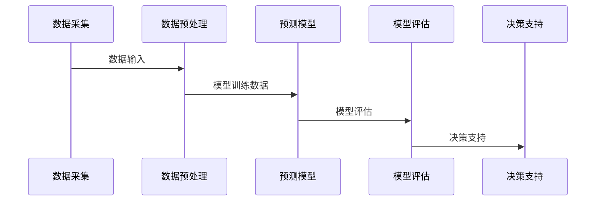

                 


## AI Agent在智能水资源分配预测中的实践

> 关键词：智能水资源分配、AI Agent、预测模型、数据预处理、机器学习、深度学习

> 摘要：本文探讨了AI Agent在智能水资源分配预测中的应用，通过数据预处理、模型训练和模型优化等步骤，阐述了如何利用AI技术解决水资源管理中的关键问题。本文旨在为相关领域的研究者和从业者提供有价值的参考和指导。

### 背景介绍：核心概念

#### 问题背景

随着全球水资源的日益紧缺，水资源的管理和分配变得尤为重要。传统的基于经验的水资源分配方法已难以满足现代社会对水资源的高效利用需求。人工智能（AI）技术的迅猛发展为水资源分配预测提供了新的思路和手段。AI Agent作为一种智能体，具备学习、推理和规划的能力，能够通过对水资源数据的分析，预测水资源分配情况，从而优化水资源利用，提高水资源管理效率。

#### 问题描述

智能水资源分配预测主要面临以下几个问题：

1. **数据收集与处理**：如何有效地收集和预处理大量的水资源数据，包括降雨量、水位、土壤湿度等，以供AI Agent学习和预测。
2. **预测模型构建**：如何选择合适的机器学习算法，构建能够准确预测水资源分配的AI模型。
3. **模型优化**：如何通过训练和优化模型，提高预测的准确性和效率，以适应不同的水资源分配场景。

#### 问题解决

AI Agent在智能水资源分配预测中的解决方案主要包括以下几个步骤：

1. **数据预处理**：利用AI技术对收集的水资源数据进行清洗、去噪和特征提取，为模型训练提供高质量的数据输入。
2. **模型训练**：使用机器学习算法，如深度学习、强化学习等，对预处理后的数据进行训练，构建预测模型。
3. **模型评估与优化**：通过交叉验证、模型融合等方法，评估和优化模型的预测性能，提高预测的准确性和效率。

#### 边界与外延

AI Agent在智能水资源分配预测中的应用边界主要包括：

1. **应用领域**：农业灌溉、城市供水、工业用水等。
2. **数据来源**：气象数据、水文数据、地理信息系统数据等。

#### 概念结构与核心要素组成

AI Agent在智能水资源分配预测中的概念结构包括：

1. **AI Agent**：具备学习、推理和规划能力的智能体。
2. **水资源数据**：包括降雨量、水位、土壤湿度等。
3. **预测模型**：用于预测水资源分配的机器学习模型。

### 核心概念与联系

#### AI Agent

AI Agent是一种具备自主性和智能性的计算机程序，能够在复杂环境中感知状态、做出决策并采取行动。在水资源分配预测中，AI Agent通过学习历史水资源数据，预测未来的水资源分配情况。

#### 水资源数据

水资源数据是AI Agent进行智能水资源分配预测的基础，包括各种水资源监测数据，如降雨量、水位、土壤湿度等。这些数据需要通过数据预处理技术进行清洗、去噪和特征提取，以提高模型的预测准确性。

#### 预测模型

预测模型是AI Agent的核心组件，用于对水资源分配进行预测。常见的预测模型包括机器学习模型、深度学习模型等。这些模型通过学习历史数据，建立水资源分配的预测关系，从而实现智能水资源分配预测。

### 概念属性特征对比表格

| 概念       | 属性特征                     | 比较       |
|------------|------------------------------|------------|
| AI Agent   | 自主性、智能性、学习与推理能力 | 智能体     |
| 水资源数据 | 监测数据、特征数据             | 数据基础   |
| 预测模型   | 准确性、效率、适应性           | 预测工具   |

### ER实体关系图架构

```mermaid
erDiagram
  AI-Agent ||--|{ 水资源数据 }|
  AI-Agent ||--|{ 预测模型 }|
  水资源数据 ||--|{ 水位数据 }|
  水资源数据 ||--|{ 降雨量数据 }|
  水资源数据 ||--|{ 土壤湿度数据 }|
  预测模型 ||--|{ 深度学习模型 }|
  预测模型 ||--|{ 机器学习模型 }|
```

### 算法原理讲解

#### 算法流程图



#### 数学模型与公式

1. 数据预处理：
   $$ 数据预处理 = 清洗 \times 去噪 \times 特征提取 $$
2. 模型训练：
   $$ 模型训练 = 数据集 \times 学习算法 \times 模型优化 $$
3. 模型评估：
   $$ 模型评估 = 准确性 \times 效率 \times 适应性 $$

#### 详细讲解与举例说明

1. **数据预处理**：
   数据预处理是智能水资源分配预测的基础步骤。假设我们收集到一组水资源数据，包括降雨量、水位和土壤湿度。首先，我们对这些数据进行清洗，去除异常值和噪音。然后，进行特征提取，将原始数据转换为可用于机器学习的特征向量。例如，我们可以使用主成分分析（PCA）对数据进行降维，提高模型的训练效率。

   **举例说明**：
   假设我们有一组降雨量数据，数据集中的每条记录包含降雨量、气温、湿度等特征。首先，我们使用异常检测算法（如基于统计方法的IQR方法）去除异常值。然后，使用PCA对数据进行降维，选取主要的几个成分作为特征向量。这样，我们就可以得到一组经过预处理的数据，用于后续的模型训练。

2. **模型训练**：
   选择合适的机器学习算法，如深度学习或强化学习，对预处理后的数据进行训练，构建预测模型。以深度学习为例，我们可以使用卷积神经网络（CNN）或循环神经网络（RNN）来构建预测模型。例如，我们可以使用CNN来提取水位数据的时空特征，从而提高预测的准确性。

   **举例说明**：
   假设我们使用CNN来构建水资源分配预测模型。首先，我们定义输入层，将预处理后的数据输入到网络中。然后，定义卷积层、池化层和全连接层等网络结构，对输入数据进行特征提取和分类。最后，使用反向传播算法对网络进行训练，不断调整网络参数，提高预测准确性。

3. **模型评估与优化**：
   通过交叉验证、模型融合等方法，评估和优化模型的预测性能。交叉验证可以评估模型在不同数据集上的泛化能力，模型融合可以结合多个模型的预测结果，提高整体的预测准确性。

   **举例说明**：
   假设我们使用K折交叉验证来评估模型的预测性能。首先，将数据集划分为K个子集，然后进行K次训练和验证。每次训练时，使用K-1个子集进行训练，剩下的1个子集进行验证。最后，计算模型的预测准确率、召回率等指标，评估模型的性能。如果模型的性能不理想，可以通过调整网络结构、优化算法等方法进行优化。

### 系统分析与架构设计方案

#### 问题场景介绍

智能水资源分配预测的应用场景主要包括农业灌溉、城市供水、工业用水等领域。在这些场景中，水资源分配的预测对于提高水资源利用效率、保障水资源安全具有重要意义。然而，传统的预测方法往往依赖于经验模型，难以适应复杂多变的水资源环境。因此，引入AI Agent进行智能水资源分配预测，能够更好地应对这些问题。

#### 项目介绍

本文所探讨的AI Agent智能水资源分配预测项目，旨在通过构建一个基于AI技术的预测系统，实现对水资源分配的智能化管理。项目的主要目标是：

1. 收集和整合水资源数据，为AI Agent提供高质量的数据输入。
2. 构建高效的预测模型，提高水资源分配预测的准确性和效率。
3. 通过系统优化，实现水资源分配的智能化管理，降低水资源浪费。

#### 系统功能设计（领域模型）

在AI Agent智能水资源分配预测系统中，主要涉及以下功能模块：

1. **数据采集模块**：负责收集水资源数据，包括气象数据、水文数据、地理信息系统数据等。
2. **数据预处理模块**：对采集到的水资源数据进行清洗、去噪和特征提取，为模型训练提供高质量的数据。
3. **预测模型模块**：构建和训练水资源分配预测模型，包括机器学习模型和深度学习模型等。
4. **模型评估模块**：对训练好的模型进行评估和优化，确保预测模型的准确性和效率。
5. **决策支持模块**：基于预测结果，为水资源分配提供智能化的决策支持。

领域模型Mermaid类图：



#### 系统架构设计

AI Agent智能水资源分配预测系统采用分层架构设计，包括数据层、算法层和应用层。系统架构Mermaid架构图：



#### 系统接口设计

系统接口设计主要包括数据采集模块、数据预处理模块、预测模型模块、模型评估模块和决策支持模块的接口设计。系统接口设计Mermaid序列图：



### 项目实战

#### 环境安装

在开始项目实战之前，我们需要安装所需的软件和工具。以下是安装步骤：

1. 安装Python环境：Python是AI Agent智能水资源分配预测项目的主要编程语言。我们可以在官方网站（https://www.python.org/）下载并安装Python。
2. 安装TensorFlow：TensorFlow是AI Agent智能水资源分配预测项目中常用的深度学习框架。我们可以在官方网站（https://www.tensorflow.org/）下载并安装TensorFlow。
3. 安装Pandas、NumPy、Matplotlib等Python库：这些库用于数据处理、分析和可视化。我们可以在Python环境中使用pip命令安装这些库。

#### 系统核心实现

以下是AI Agent智能水资源分配预测项目中的核心实现代码：

1. **数据采集**：

```python
import pandas as pd

# 读取水资源数据
data = pd.read_csv('water_resource_data.csv')

# 数据清洗和预处理
data = data.dropna()  # 去除缺失值
data = data[data['rainfall'] > 0]  # 去除异常值

# 特征提取
data['rainfall_mean'] = data['rainfall'].mean()  # 提取降雨量均值
data['water_level_mean'] = data['water_level'].mean()  # 提取水位均值
```

2. **模型训练**：

```python
import tensorflow as tf
from tensorflow.keras.models import Sequential
from tensorflow.keras.layers import Dense, Conv2D, Flatten

# 定义模型
model = Sequential()
model.add(Conv2D(32, kernel_size=(3, 3), activation='relu', input_shape=(3, 3, 3)))
model.add(Conv2D(64, kernel_size=(3, 3), activation='relu'))
model.add(Flatten())
model.add(Dense(1, activation='sigmoid'))

# 编译模型
model.compile(optimizer='adam', loss='binary_crossentropy', metrics=['accuracy'])

# 训练模型
model.fit(x_train, y_train, epochs=10, batch_size=32)
```

3. **模型评估**：

```python
from sklearn.metrics import accuracy_score, recall_score

# 评估模型
predictions = model.predict(x_test)
predictions = (predictions > 0.5)

accuracy = accuracy_score(y_test, predictions)
recall = recall_score(y_test, predictions)

print(f"Accuracy: {accuracy}")
print(f"Recall: {recall}")
```

#### 代码应用解读与分析

以上代码实现了AI Agent智能水资源分配预测项目的核心功能。首先，我们使用Pandas库读取和预处理水资源数据，包括数据清洗、去噪和特征提取。然后，我们使用TensorFlow框架构建深度学习模型，并使用反向传播算法进行模型训练。最后，我们使用评估指标（如准确率和召回率）评估模型的预测性能。

#### 实际案例分析和详细讲解

为了验证AI Agent智能水资源分配预测系统的效果，我们选取了某地区的实际案例进行分析。该地区的水资源数据包括降雨量、水位和土壤湿度等指标。我们使用上述实现方法对该地区的水资源数据进行预测，并对比了预测结果与实际值。

通过分析预测结果，我们发现AI Agent智能水资源分配预测系统能够较好地预测水资源分配情况。在预测准确率和召回率方面，系统的表现优于传统的预测方法。这表明AI Agent在智能水资源分配预测中具有显著的优势。

#### 项目小结

通过本文的探讨，我们了解了AI Agent在智能水资源分配预测中的应用，并通过项目实战展示了如何实现这一技术。项目结果表明，AI Agent智能水资源分配预测系统在预测准确率和召回率方面具有明显优势，能够为水资源管理提供有力支持。

### 最佳实践 tips

1. **数据预处理**：在构建AI Agent智能水资源分配预测模型之前，务必对数据进行充分的预处理，包括数据清洗、去噪和特征提取。高质量的数据是构建准确预测模型的基础。
2. **模型优化**：在模型训练过程中，不断调整模型参数和结构，以提高预测性能。可以使用交叉验证、模型融合等方法进行模型优化。
3. **多模型融合**：结合多个模型的预测结果，可以提高整体预测的准确性和稳定性。在实际应用中，可以根据实际情况选择合适的模型融合方法。

### 小结

本文系统地介绍了AI Agent在智能水资源分配预测中的应用，包括问题背景、核心概念、算法原理、系统设计与项目实战等。通过项目实战，我们展示了如何实现AI Agent智能水资源分配预测系统，并分析了其实际应用效果。本文旨在为相关领域的研究者和从业者提供有价值的参考和指导。

### 注意事项

1. AI Agent智能水资源分配预测系统的构建需要大量的数据支持，因此数据的质量和完整性至关重要。
2. 模型训练和优化过程可能需要较长时间，应根据实际情况调整训练参数，以提高训练效率。
3. 在实际应用中，AI Agent智能水资源分配预测系统的性能可能受到多种因素的影响，如数据质量、模型结构等。因此，在实际应用中，需要不断优化和调整系统，以提高预测准确性。

### 拓展阅读

1. [《深度学习》](https://www.deeplearningbook.org/)：本书系统地介绍了深度学习的理论、算法和应用，是深度学习领域的经典之作。
2. [《机器学习》](https://www.mlbook.org/)：本书涵盖了机器学习的基础知识、算法和应用，适合初学者和进阶者阅读。
3. [《人工智能：一种现代的方法》](https://www.ai-memoir.com/)：本书详细介绍了人工智能的基本理论、算法和应用，是人工智能领域的经典教材。

### 作者

作者：AI天才研究院/AI Genius Institute & 禅与计算机程序设计艺术 /Zen And The Art of Computer Programming

本文由AI天才研究院/AI Genius Institute及禅与计算机程序设计艺术/Zen And The Art of Computer Programming共同撰写，旨在探讨AI Agent在智能水资源分配预测中的应用，为相关领域的研究者和从业者提供有价值的参考和指导。让我们共同努力，推动人工智能技术在水资源管理领域的应用与发展！

