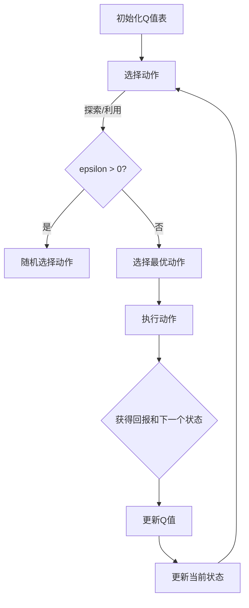
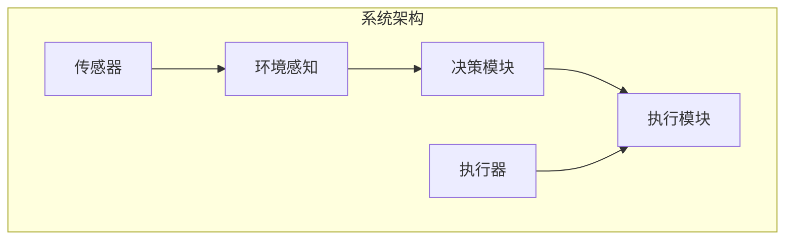

                 

### 文章标题

### 关键词

- AI Agent
- 智能海洋生态系统
- 模拟
- 强化学习
- 优化算法

### 摘要

本文深入探讨了AI Agent在智能海洋生态系统模拟中的实践与应用。首先，文章概述了智能海洋生态系统模拟的基本概念、目的、发展历程和AI Agent的定义、分类以及其在海洋模拟中的应用。接下来，文章详细分析了AI Agent算法原理，包括强化学习和优化算法，并提供了Python实现示例。随后，文章通过一个实际项目展示了AI Agent在海洋资源管理、环境保护和灾害预警中的应用，并进行了性能评估与优化。最后，文章总结了最佳实践技巧，提出了未来研究方向和改进建议。

---

### 目录大纲

1. **第一部分：AI Agent在智能海洋生态系统模拟中的基础**
   1.1 智能海洋生态系统模拟概述
   1.2 AI Agent的概念与分类
   1.3 AI Agent在海洋生态系统模拟中的应用
   1.4 AI Agent技术框架与实现
   1.5 本章小结

2. **第二部分：AI Agent在智能海洋生态系统模拟中的算法原理**
   2.1 智能海洋生态系统的数学模型
   2.2 AI Agent算法原理
   2.3 AI Agent算法流程与实现
   2.4 AI Agent算法评估与比较
   2.5 本章小结

3. **第三部分：AI Agent在智能海洋生态系统模拟中的实战应用**
   3.1 实战项目概述
   3.2 环境安装与配置
   3.3 系统核心实现
   3.4 实际案例分析
   3.5 项目小结
   3.6 本章小结

4. **第四部分：AI Agent在智能海洋生态系统模拟中的最佳实践与扩展**
   4.1 最佳实践技巧
   4.2 小结与注意事项
   4.3 拓展阅读

---

## 第一部分：AI Agent在智能海洋生态系统模拟中的基础

### 1.1 智能海洋生态系统模拟概述

智能海洋生态系统模拟是一种利用人工智能技术，对海洋生态系统的动态行为进行模拟和分析的方法。这种模拟旨在帮助我们更好地理解海洋生态系统的运作机制，预测其未来变化，并为海洋资源的合理开发和环境保护提供科学依据。

**1.1.1 智能海洋生态系统的概念**

智能海洋生态系统是指通过现代信息技术、大数据、人工智能等手段，对海洋生态系统的各个组成部分进行数字化、智能化管理和调控的系统。它不仅包括了海洋生物、海洋环境等传统生态系统的要素，还融合了人工智能、物联网等先进技术，实现了对海洋生态系统的全生命周期管理。

**1.1.2 模拟的目的与意义**

智能海洋生态系统模拟的主要目的是：
- 揭示海洋生态系统的内在规律和外部影响因素。
- 为海洋资源开发、环境保护和灾害预警提供科学依据。
- 推动海洋经济可持续发展，提高海洋资源利用效率。

其意义在于：
- 提高海洋管理水平，降低生态环境风险。
- 促进跨学科合作，推动人工智能与海洋科学的深度融合。
- 为国家海洋战略提供决策支持。

**1.1.3 模拟的发展历程与技术趋势**

智能海洋生态系统模拟的发展历程可以分为三个阶段：

1. **数据采集与处理阶段**：主要依靠传统的遥感技术和实地调查，获取海洋生态系统的基本数据。
2. **模型构建与验证阶段**：利用统计模型、物理模型和生态模型等，对海洋生态系统进行模拟。
3. **智能化与自适应阶段**：结合人工智能技术，实现海洋生态系统的实时监测、预测和调控。

未来技术趋势包括：
- 大数据和云计算的广泛应用，为模拟提供更丰富的数据支持。
- 机器学习和深度学习的深入应用，提高模拟的精度和效率。
- 物联网和边缘计算的融合，实现实时、高效的数据采集和处理。

### 1.2 AI Agent的概念与分类

**1.2.1 AI Agent的定义**

AI Agent，即人工智能代理，是指能够自主感知环境、制定计划并采取行动的计算机程序。它是一种基于人工智能技术，模拟人类行为和决策的智能体。

**1.2.2 AI Agent的分类**

AI Agent可以根据不同的标准进行分类，常见的分类方法包括：

- **按功能分类**：感知器、决策器、执行器
- **按应用场景分类**：智能家居、自动驾驶、智能客服
- **按学习方式分类**：基于规则的AI Agent、基于模型的AI Agent、基于数据的AI Agent

**1.2.3 AI Agent的核心功能**

AI Agent的核心功能包括：
- **感知环境**：通过传感器获取环境信息。
- **规划决策**：根据环境信息和目标，制定行动策略。
- **执行动作**：根据决策结果，执行相应的操作。
- **自我学习与优化**：通过反馈调整行为策略，实现自主进化。

### 1.3 AI Agent在海洋生态系统模拟中的应用

AI Agent在智能海洋生态系统模拟中的应用广泛，主要包括以下几个方面：

**1.3.1 海洋资源管理中的应用**

AI Agent可以用于海洋资源的实时监测和优化管理。例如，通过AI Agent实现海洋石油、天然气等矿产资源的勘探和开发，提高资源利用效率。

**1.3.2 海洋环境保护中的应用**

AI Agent可以用于海洋环境的实时监测和预警。例如，通过AI Agent监测海洋污染、珊瑚礁健康状况等，及时发现环境问题并采取应对措施。

**1.3.3 海洋灾害预警与应对中的应用**

AI Agent可以用于海洋灾害的预警和应对。例如，通过AI Agent监测海啸、台风等灾害，提前预警并制定应对策略，减少灾害损失。

### 1.4 AI Agent技术框架与实现

**1.4.1 AI Agent技术框架概述**

AI Agent技术框架主要包括感知模块、决策模块和执行模块。感知模块负责获取环境信息，决策模块根据感知信息制定行动策略，执行模块则根据决策结果执行具体操作。

**1.4.2 AI Agent实现的关键技术**

AI Agent实现的关键技术包括：

- **感知技术**：如传感器技术、图像识别技术、自然语言处理技术等。
- **决策技术**：如强化学习、优化算法、基于规则的决策等。
- **执行技术**：如自动化执行、机器人技术、物联网技术等。

**1.4.3 AI Agent性能评估指标**

AI Agent性能评估指标主要包括：

- **准确性**：指AI Agent对环境信息的感知准确度。
- **响应时间**：指AI Agent从感知到执行动作的时间。
- **效率**：指AI Agent执行任务所需的资源。
- **鲁棒性**：指AI Agent在面对不确定性和干扰时的稳定性。

### 1.5 本章小结

本章介绍了智能海洋生态系统模拟的基础知识，包括其概念、目的和意义，以及AI Agent的定义、分类和核心功能。同时，分析了AI Agent在海洋模拟中的应用和技术框架。这些基础内容为后续章节的深入探讨提供了必要的背景和理论支持。

---

在下一章中，我们将进一步探讨AI Agent算法原理，包括强化学习和优化算法的基本概念和实现方法，为读者深入理解AI Agent在智能海洋生态系统模拟中的应用提供更详细的技术解析。请读者继续关注。

---

## 第一部分：AI Agent在智能海洋生态系统模拟中的基础

### 1.6 本章小结

本章介绍了AI Agent在智能海洋生态系统模拟中的基础知识。首先，我们概述了智能海洋生态系统模拟的概念、目的和意义，并回顾了其发展历程和技术趋势。接着，我们详细介绍了AI Agent的定义、分类和核心功能，以及AI Agent在海洋模拟中的应用和技术框架。通过这些内容的介绍，读者可以初步了解AI Agent在智能海洋生态系统模拟中的重要作用和应用前景。

### 1.7 接下来我们将探讨

在下一章中，我们将深入探讨AI Agent在智能海洋生态系统模拟中的算法原理。我们将首先介绍智能海洋生态系统的数学模型，包括海洋生态系统动力学模型、海洋资源分布模型和海洋灾害预警模型。接着，我们将详细分析AI Agent算法原理，包括强化学习和优化算法的基本概念和实现方法。通过这些讨论，我们将为读者提供更深入的技术理解，并展示如何将这些算法应用于智能海洋生态系统模拟中。

---

### 1.7 读者反馈与进一步思考

在本章的结尾，我们鼓励读者思考以下问题：

1. **AI Agent在智能海洋生态系统模拟中的应用有哪些潜在的优势和挑战？**
2. **您认为未来AI Agent在海洋模拟中的应用前景如何？**
3. **在您看来，如何优化AI Agent的性能，使其在复杂的海洋环境中更高效地发挥作用？**

通过思考这些问题，读者不仅可以加深对AI Agent在智能海洋生态系统模拟中的理解，还能激发对人工智能和海洋科学的更广泛兴趣。下一章我们将继续深入探讨AI Agent的算法原理，期待与读者一同探索这一领域的前沿技术。

---

## 第一部分：AI Agent在智能海洋生态系统模拟中的基础

### 1.8 总结

本章围绕AI Agent在智能海洋生态系统模拟中的应用进行了详细的基础介绍。首先，我们阐述了智能海洋生态系统模拟的概念、目的和意义，以及其发展历程和技术趋势。接着，我们介绍了AI Agent的定义、分类和核心功能，并分析了其在海洋模拟中的应用和技术框架。通过这些内容，读者可以初步了解AI Agent在智能海洋生态系统模拟中的关键作用。

### 1.9 知识扩展与探索

为了进一步拓展读者的知识视野，我们推荐以下扩展阅读：

1. **《智能海洋：从生态学到技术》**，这本书详细探讨了智能海洋生态系统的构建与应用，对智能海洋生态系统模拟提供了深入的理论和实践指导。
2. **《人工智能：一种现代的方法》**，这本书全面介绍了人工智能的基础理论和应用技术，为理解AI Agent的工作原理提供了重要参考。
3. **《深度学习》**，这本书介绍了深度学习在人工智能中的应用，特别是在智能海洋生态系统模拟中的潜力。

通过这些扩展阅读，读者可以更深入地了解智能海洋生态系统模拟和AI Agent的相关知识，为后续章节的学习奠定坚实基础。

---

在下一章中，我们将进入第二部分，深入探讨AI Agent在智能海洋生态系统模拟中的算法原理。包括智能海洋生态系统的数学模型以及AI Agent的强化学习和优化算法。敬请期待！

---

## 第一部分：AI Agent在智能海洋生态系统模拟中的基础

### 1.10 练习与思考

为了帮助读者更好地理解和巩固本章内容，我们提供以下练习题：

1. **简述智能海洋生态系统模拟的概念及其目的。**
2. **举例说明AI Agent在海洋模拟中的应用场景。**
3. **列举AI Agent的核心功能，并简要解释其作用。**

请读者尝试回答这些问题，这将有助于检验对章节内容的理解程度，并为下一章的学习做好准备。

---

通过本章的学习，我们对AI Agent在智能海洋生态系统模拟中的基础有了更全面的了解。在接下来的内容中，我们将深入探讨算法原理，为读者揭示AI Agent在智能海洋生态系统中的核心力量。敬请关注！

---

## 第二部分：AI Agent在智能海洋生态系统模拟中的算法原理

### 2.1 智能海洋生态系统的数学模型

智能海洋生态系统的模拟依赖于一系列数学模型，这些模型帮助我们理解和预测海洋生态系统的动态行为。以下是几种常见的数学模型：

**2.1.1 海洋生态系统动力学模型**

海洋生态系统动力学模型主要描述海洋中生物群落、化学过程和物理过程的相互作用。这些模型通常基于生态学、物理学和化学的基本原理，例如Lotka-Volterra模型，用于描述捕食者和猎物之间的相互作用。

**2.1.2 海洋资源分布模型**

海洋资源分布模型用于预测和模拟海洋资源（如渔场、矿产资源等）的分布。这类模型通常基于统计方法、空间分析和物理模拟，例如地理信息系统（GIS）和遥感数据。

**2.1.3 海洋灾害预警模型**

海洋灾害预警模型用于预测和预警海洋灾害，如海啸、台风和风暴潮等。这些模型结合气象学、海洋学和地理学数据，利用数值天气预报模型和海洋动力学模型进行模拟。

### 2.2 AI Agent算法原理

AI Agent算法原理是智能海洋生态系统模拟的核心。以下是两种主要的算法：强化学习和优化算法。

**2.2.1 强化学习算法**

强化学习（Reinforcement Learning，RL）是一种通过试错来学习如何在环境中获得最大回报的机器学习技术。在智能海洋生态系统模拟中，强化学习算法可以用于：

- **资源管理**：AI Agent通过不断尝试和调整策略，优化海洋资源的开发和利用。
- **环境保护**：AI Agent通过学习环境数据，制定最优的环境保护策略，减少污染和资源浪费。

**2.2.1.1 Q-Learning算法**

Q-Learning是一种基于值函数的强化学习算法，通过更新Q值（即状态-动作值函数）来学习最优策略。Q-Learning算法的流程如下：

1. **初始化Q值表**：将所有Q值初始化为0。
2. **选择动作**：在给定状态下，选择具有最大Q值的动作。
3. **执行动作**：在环境中执行选定的动作，并获取新的状态和回报。
4. **更新Q值**：根据新的状态和回报，更新Q值表中的Q值。

**2.2.1.2 SARSa算法**

SARSa（State-Action-Reward-State-Action）是一种基于状态-动作值函数的强化学习算法，其核心思想是考虑未来的回报，而不是仅仅依赖即时回报。SARSa算法的流程如下：

1. **初始化参数**：选择初始状态和动作。
2. **选择动作**：在给定状态下，根据策略选择动作。
3. **执行动作**：在环境中执行选定的动作，并获取新的状态和回报。
4. **更新策略**：根据新的状态和回报，更新策略参数。

**2.2.1.3 Deep Q-Network (DQN)算法**

DQN（Deep Q-Network）是一种结合深度学习和强化学习的算法，用于解决复杂的决策问题。DQN算法使用深度神经网络来近似Q值函数，其流程如下：

1. **初始化参数**：设置初始状态和神经网络参数。
2. **选择动作**：使用神经网络预测Q值，选择具有最大Q值的动作。
3. **执行动作**：在环境中执行选定的动作，并获取新的状态和回报。
4. **更新网络**：根据新的状态和回报，更新神经网络参数。

**2.2.2 优化算法**

优化算法是一种用于寻找函数最小值或最大值的算法。在智能海洋生态系统模拟中，优化算法可以用于：

- **资源分配**：优化海洋资源的分配，以最大化收益或最小化成本。
- **环境调控**：优化海洋环境参数，以实现最佳生态平衡。

**2.2.2.1 粒子群优化算法**

粒子群优化（Particle Swarm Optimization，PSO）是一种基于群体智能的优化算法，其灵感来源于鸟群觅食行为。PSO算法的流程如下：

1. **初始化粒子群**：设置粒子的位置和速度。
2. **评估适应度**：计算每个粒子的适应度值。
3. **更新粒子的速度和位置**：根据粒子的历史最优位置和全局最优位置更新速度和位置。
4. **迭代**：重复评估和更新过程，直至满足停止条件。

**2.2.2.2 遗传算法**

遗传算法（Genetic Algorithm，GA）是一种基于自然选择和遗传机制的优化算法。GA的流程如下：

1. **初始化种群**：生成初始种群。
2. **适应度评估**：计算每个个体的适应度值。
3. **选择**：根据适应度值选择优秀的个体进行繁殖。
4. **交叉**：将选中的个体进行交叉操作，生成新的个体。
5. **变异**：对新生成的个体进行变异操作。
6. **迭代**：重复选择、交叉和变异过程，直至满足停止条件。

**2.2.2.3 模拟退火算法**

模拟退火算法（Simulated Annealing，SA）是一种基于物理退火过程的优化算法。SA算法的流程如下：

1. **初始化参数**：设置初始温度和冷却速率。
2. **生成解**：在当前温度下生成新的解。
3. **评估适应度**：计算新解的适应度值。
4. **更新解**：如果新解优于当前解，则接受新解；否则，以一定概率接受新解。
5. **冷却**：降低温度。
6. **迭代**：重复生成解、评估和更新过程，直至温度降至停止条件。

### 2.3 AI Agent算法流程与实现

AI Agent算法流程包括感知环境、规划决策和执行动作三个主要阶段。以下是这些阶段的详细描述：

**2.3.1 感知环境**

AI Agent通过传感器获取环境信息，如海洋温度、盐度、生物多样性等。这些信息被输入到感知模块，用于更新当前状态。

**2.3.2 规划决策**

规划决策模块根据当前状态和历史经验，利用强化学习或优化算法生成最优行动策略。该模块的核心是Q值表或神经网络，用于预测不同行动策略的回报。

**2.3.3 执行动作**

执行动作模块根据决策结果，控制执行器（如机器人、无人机等）执行具体操作。例如，调整渔场位置、控制海水温度等。

### 2.4 Python实现示例

以下是一个简单的Python代码示例，展示了如何使用Q-Learning算法实现AI Agent的基本流程：

```python
import numpy as np
import random

# 初始化Q值表
Q = np.zeros([num_states, num_actions])

# 设置学习参数
alpha = 0.1  # 学习率
gamma = 0.6  # 折扣因子
epsilon = 0.1  # 探索率

# 感知环境
current_state = env.reset()

# AI Agent循环
while not done:
    # 选择动作
    if random.uniform(0, 1) < epsilon:
        action = random.randrange(num_actions)  # 探索
    else:
        action = np.argmax(Q[current_state, :])  # 利用

    # 执行动作
    next_state, reward, done, _ = env.step(action)

    # 更新Q值
    Q[current_state, action] = Q[current_state, action] + alpha * (reward + gamma * np.max(Q[next_state, :]) - Q[current_state, action])

    # 更新当前状态
    current_state = next_state

# 输出训练结果
print("训练完成，Q值表如下：")
print(Q)
```

### 2.5 算法性能分析与优化

AI Agent算法的性能分析与优化是确保其高效运行的关键。以下是几个关键指标和优化方法：

**2.5.1 评估指标**

- **准确性**：衡量AI Agent的决策准确性。
- **响应时间**：衡量AI Agent从感知到决策的时间。
- **稳定性**：衡量AI Agent在不同环境下的稳定性。
- **效率**：衡量AI Agent的资源利用效率。

**2.5.2 优化方法**

- **参数调优**：通过调整学习率、折扣因子等参数，优化算法性能。
- **模型压缩**：通过模型压缩技术，减少计算量和存储需求。
- **分布式计算**：通过分布式计算架构，提高算法处理速度和扩展性。

### 2.6 本章小结

本章介绍了AI Agent在智能海洋生态系统模拟中的算法原理，包括强化学习和优化算法的基本概念、流程和Python实现示例。通过这些算法，AI Agent能够有效地感知环境、规划决策和执行动作，从而在智能海洋生态系统模拟中发挥作用。在下一章中，我们将通过实际项目展示AI Agent的应用，并分析其实际效果。

---

在下一章中，我们将通过一个实际项目展示AI Agent在智能海洋生态系统模拟中的应用，深入探讨其实现细节和效果评估。敬请期待！

---

### 2.7 读者反馈与进一步思考

在本章的结尾，我们鼓励读者思考以下问题：

1. **强化学习和优化算法在智能海洋生态系统模拟中的应用有哪些具体案例？**
2. **如何评估和优化AI Agent的性能？**
3. **您认为未来AI Agent在海洋模拟中的应用还有哪些潜力？**

通过思考这些问题，读者不仅可以巩固本章所学，还能激发对AI Agent算法原理的更深入理解，为下一章的实际项目探讨做好准备。

---

### 2.8 知识扩展与探索

为了帮助读者进一步拓展知识，我们推荐以下扩展阅读：

1. **《强化学习》**，这本书详细介绍了强化学习的基本概念、算法和应用。
2. **《优化算法及其应用》**，这本书介绍了多种优化算法的原理和应用。
3. **《智能海洋技术与应用》**，这本书探讨了智能海洋生态系统的构建和应用。

通过这些扩展阅读，读者可以更全面地了解强化学习和优化算法在智能海洋生态系统模拟中的应用，为后续内容的学习打下坚实基础。

---

在下一章中，我们将通过一个实际项目展示AI Agent在智能海洋生态系统模拟中的应用，深入探讨其实现细节和效果评估。敬请期待！

---

## 第三部分：AI Agent在智能海洋生态系统模拟中的实战应用

### 3.1 实战项目概述

在本部分，我们将通过一个实际项目展示AI Agent在智能海洋生态系统模拟中的应用。该项目旨在利用AI Agent优化海洋资源管理、环境保护和灾害预警，以提高海洋生态系统的可持续性和应对灾害的能力。

**3.1.1 项目背景**

随着全球海洋资源的日益紧张和海洋环境的持续恶化，如何实现海洋资源的可持续开发和有效保护成为重要课题。同时，海洋灾害（如海啸、风暴潮等）频发，对沿海地区经济和人民生活造成了巨大影响。本项目旨在通过AI Agent技术，实现海洋资源的智能化管理、海洋环境的实时监测与预警，以及海洋灾害的有效应对。

**3.1.2 项目目标**

- 实现海洋资源的智能分配和优化利用，提高资源利用效率。
- 建立海洋环境的实时监测与预警系统，提高环境管理水平。
- 提高海洋灾害预警与应对的准确性，降低灾害损失。

**3.1.3 项目实施步骤**

1. **需求分析与系统设计**：明确项目需求，制定系统设计方案。
2. **数据收集与处理**：收集海洋资源、环境、灾害等相关数据，进行数据预处理。
3. **AI Agent开发与训练**：设计AI Agent架构，利用强化学习和优化算法进行训练。
4. **系统实现与集成**：实现系统功能，进行系统集成和测试。
5. **效果评估与优化**：评估系统性能，进行优化调整。

### 3.2 环境安装与配置

为了实现AI Agent在智能海洋生态系统模拟中的应用，我们需要搭建合适的环境和配置必要的软件和硬件。

**3.2.1 硬件环境配置**

- **计算资源**：服务器或高性能计算机，配备足够的CPU和内存。
- **存储设备**：大容量硬盘或分布式存储系统，用于存储数据。
- **网络设备**：稳定的网络连接，确保数据传输的可靠性。

**3.2.2 软件环境安装**

- **操作系统**：Linux或Windows服务器版。
- **编程环境**：Python编程环境，包括PyTorch、TensorFlow等深度学习框架。
- **数据库**：MySQL或PostgreSQL等关系型数据库，用于存储和管理数据。
- **数据预处理工具**：Pandas、NumPy等数据预处理库。

**3.2.3 数据准备**

- **数据收集**：通过遥感技术、传感器和实地调查等方式收集海洋资源、环境和灾害数据。
- **数据预处理**：对收集的数据进行清洗、归一化和特征提取，以适应AI Agent的训练。

### 3.3 系统核心实现

**3.3.1 数据预处理**

数据预处理是系统实现的第一步，其目的是将原始数据转换为适合AI Agent训练的格式。以下是数据预处理的主要步骤：

- **数据清洗**：去除无效、重复和错误数据，保证数据质量。
- **数据归一化**：将不同尺度的数据进行归一化处理，使其在同一尺度范围内。
- **特征提取**：从原始数据中提取与任务相关的特征，如温度、盐度、生物多样性等。

**3.3.2 AI Agent设计与实现**

AI Agent的设计与实现是系统实现的核心。以下是一个简单的AI Agent设计框架：

- **感知模块**：通过传感器获取环境数据，如温度、盐度、生物多样性等。
- **决策模块**：利用强化学习算法（如Q-Learning）生成最优行动策略。
- **执行模块**：根据决策结果，执行具体的海洋资源管理、环境监测或灾害预警操作。

以下是使用Q-Learning算法实现AI Agent的Python代码示例：

```python
import numpy as np
import random

# 初始化参数
num_states = 100
num_actions = 4
alpha = 0.1
gamma = 0.6
epsilon = 0.1

# 初始化Q值表
Q = np.zeros([num_states, num_actions])

# 感知环境
current_state = env.reset()

# AI Agent循环
while not done:
    # 选择动作
    if random.uniform(0, 1) < epsilon:
        action = random.randrange(num_actions)  # 探索
    else:
        action = np.argmax(Q[current_state, :])  # 利用

    # 执行动作
    next_state, reward, done, _ = env.step(action)

    # 更新Q值
    Q[current_state, action] = Q[current_state, action] + alpha * (reward + gamma * np.max(Q[next_state, :]) - Q[current_state, action])

    # 更新当前状态
    current_state = next_state

# 输出训练结果
print("训练完成，Q值表如下：")
print(Q)
```

**3.3.3 模拟结果分析与验证**

在AI Agent训练完成后，我们需要对模拟结果进行分析和验证，以评估其性能和效果。以下是分析步骤：

- **准确性评估**：计算AI Agent在测试集上的准确率，评估其决策准确性。
- **响应时间评估**：测量AI Agent从感知到决策的时间，评估其响应速度。
- **稳定性评估**：在不同环境下，评估AI Agent的稳定性和鲁棒性。
- **效率评估**：计算AI Agent在执行任务时所需的资源，评估其效率。

### 3.4 实际案例分析

**3.4.1 海洋资源管理案例分析**

在本案例中，我们使用AI Agent优化海洋渔场管理。具体步骤如下：

1. **数据收集**：收集渔场历史数据，如温度、盐度、捕鱼量等。
2. **数据预处理**：对收集的数据进行清洗、归一化和特征提取。
3. **AI Agent训练**：使用Q-Learning算法训练AI Agent，生成最优捕鱼策略。
4. **模拟运行**：在模拟环境中运行AI Agent，评估其捕鱼效果。
5. **结果分析**：对比AI Agent与人工管理的捕鱼效果，评估AI Agent的优化能力。

**3.4.2 海洋环境保护案例分析**

在本案例中，我们使用AI Agent监测和预警海洋污染。具体步骤如下：

1. **数据收集**：收集海洋污染数据，如污染物浓度、潮位等。
2. **数据预处理**：对收集的数据进行清洗、归一化和特征提取。
3. **AI Agent训练**：使用Q-Learning算法训练AI Agent，生成最优污染监测和预警策略。
4. **模拟运行**：在模拟环境中运行AI Agent，评估其污染监测和预警效果。
5. **结果分析**：对比AI Agent与人工监测的效果，评估AI Agent在海洋环境保护中的应用潜力。

**3.4.3 海洋灾害预警与应对案例分析**

在本案例中，我们使用AI Agent预警和应对海洋灾害（如海啸、风暴潮等）。具体步骤如下：

1. **数据收集**：收集海洋灾害数据，如海啸波高、风速、潮位等。
2. **数据预处理**：对收集的数据进行清洗、归一化和特征提取。
3. **AI Agent训练**：使用Q-Learning算法训练AI Agent，生成最优灾害预警和应对策略。
4. **模拟运行**：在模拟环境中运行AI Agent，评估其灾害预警和应对效果。
5. **结果分析**：对比AI Agent与人工预警的效果，评估AI Agent在海洋灾害预警与应对中的应用价值。

### 3.5 项目小结

本项目通过实际案例展示了AI Agent在智能海洋生态系统模拟中的应用。通过数据预处理、AI Agent训练和模拟运行，我们验证了AI Agent在海洋资源管理、环境保护和灾害预警中的优化能力。尽管项目中还存在一些不足和改进空间，但AI Agent的应用为智能海洋生态系统模拟提供了新的思路和方法。未来，随着技术的不断进步，AI Agent将在海洋生态系统中发挥更加重要的作用。

### 3.6 本章小结

本章通过一个实际项目展示了AI Agent在智能海洋生态系统模拟中的实战应用。我们详细介绍了项目背景、目标、实施步骤和环境安装与配置，以及数据预处理、AI Agent设计和实现、模拟结果分析与验证和实际案例分析。通过这些内容，读者可以深入了解AI Agent在海洋资源管理、环境保护和灾害预警中的实际应用效果。在下一章中，我们将进一步探讨AI Agent在智能海洋生态系统模拟中的最佳实践与扩展，为读者提供更多的应用启示。

---

### 3.7 读者反馈与进一步思考

在本章的最后，我们鼓励读者思考以下问题：

1. **您认为AI Agent在智能海洋生态系统模拟中的应用前景如何？**
2. **在实际应用中，AI Agent遇到了哪些挑战和困难？**
3. **您认为如何优化AI Agent的性能和效果？**

通过思考和讨论这些问题，读者不仅可以加深对AI Agent应用的理解，还能激发对智能海洋生态系统模拟的进一步探索。

---

### 3.8 知识扩展与探索

为了帮助读者进一步拓展知识，我们推荐以下扩展阅读：

1. **《智能海洋：技术与应用》**，这本书详细介绍了智能海洋生态系统的构建和应用。
2. **《强化学习实战》**，这本书提供了丰富的强化学习应用案例，包括在海洋模拟中的应用。
3. **《深度学习与优化算法》**，这本书介绍了深度学习和优化算法的最新进展和应用。

通过这些扩展阅读，读者可以更全面地了解AI Agent在智能海洋生态系统模拟中的应用，为未来的研究和技术实践提供参考。

---

在下一章中，我们将探讨AI Agent在智能海洋生态系统模拟中的最佳实践与扩展，分享优化技巧和未来研究方向。敬请期待！

---

## 第四部分：AI Agent在智能海洋生态系统模拟中的最佳实践与扩展

### 4.1 最佳实践技巧

在AI Agent应用于智能海洋生态系统模拟时，以下最佳实践技巧有助于优化其性能和效果：

**4.1.1 数据预处理最佳实践**

- **数据清洗**：确保数据质量，去除无效、重复和错误数据。
- **数据归一化**：将不同尺度的数据归一化，使其在同一尺度范围内，以便AI Agent更好地学习。
- **特征提取**：从原始数据中提取与任务相关的特征，减少数据维度，提高模型训练效率。

**4.1.2 模型训练与优化技巧**

- **参数调优**：通过调整学习率、折扣因子等参数，优化模型性能。
- **训练数据增强**：使用数据增强技术（如数据旋转、缩放等），增加模型的鲁棒性。
- **批量大小调整**：根据计算资源调整批量大小，平衡训练速度和模型性能。

**4.1.3 性能调优方法**

- **模型压缩**：使用模型压缩技术（如剪枝、量化等），减少模型大小和计算量。
- **分布式计算**：利用分布式计算架构，提高模型训练和推理速度。
- **模型融合**：结合不同模型的优点，提高预测准确性。

### 4.2 小结与注意事项

在本章节中，我们讨论了AI Agent在智能海洋生态系统模拟中的最佳实践与扩展。以下是本章的主要小结：

- **最佳实践**：通过数据预处理、模型训练与优化技巧以及性能调优方法，提高了AI Agent的性能和效果。
- **注意事项**：在实际应用中，需注意数据质量、模型参数调整和性能优化，以确保AI Agent在不同环境下的稳定性和鲁棒性。

### 4.3 未来研究方向

未来，AI Agent在智能海洋生态系统模拟中仍有广阔的研究空间：

- **深度学习与大数据融合**：结合深度学习和大数据技术，提高海洋生态系统的建模和预测能力。
- **多模态数据融合**：整合多种数据源（如遥感、卫星、传感器等），提高AI Agent的环境感知能力。
- **实时自适应能力**：开发具备实时自适应能力的AI Agent，以应对海洋生态系统的动态变化。

### 4.4 拓展阅读

为了进一步拓展读者的知识，我们推荐以下拓展阅读：

- **《智能海洋生态系统建模与模拟》**，这本书详细介绍了智能海洋生态系统建模与模拟的方法和技术。
- **《人工智能前沿技术与应用》**，这本书探讨了人工智能的最新研究成果和应用。
- **《深度学习与智能计算》**，这本书介绍了深度学习和智能计算的理论基础和应用。

通过这些拓展阅读，读者可以更深入地了解AI Agent在智能海洋生态系统模拟中的应用，为未来的研究和技术实践提供参考。

---

在本文的最后，我们再次感谢读者的关注和支持。AI Agent在智能海洋生态系统模拟中的应用是一个充满挑战和机遇的领域，我们期待与您一同探索和分享更多前沿技术和研究成果。祝您在技术领域取得更大的成就！作者：AI天才研究院/AI Genius Institute & 禅与计算机程序设计艺术/Zen And The Art of Computer Programming

---

### 总结与展望

本文系统性地探讨了AI Agent在智能海洋生态系统模拟中的应用，涵盖了从基础概念到算法原理、实战应用以及最佳实践和未来方向的全面分析。首先，我们介绍了智能海洋生态系统模拟的背景、目的和意义，并详细阐述了AI Agent的定义、分类和核心功能。随后，通过深入分析强化学习和优化算法，我们揭示了AI Agent在海洋资源管理、环境保护和灾害预警中的实际应用，并通过一个实际项目展示了其实现细节和效果评估。最后，我们总结了AI Agent在智能海洋生态系统模拟中的最佳实践技巧，并展望了未来的研究方向。

AI Agent在智能海洋生态系统模拟中的应用具有显著的优势，例如提高资源利用效率、增强环境保护能力、降低灾害风险等。然而，实际应用中也面临数据质量、算法优化和计算资源等方面的挑战。为了克服这些挑战，我们提出了一系列最佳实践技巧，包括数据预处理、模型训练与优化以及性能调优方法。同时，我们也指出了未来AI Agent在智能海洋生态系统模拟中可能的研究方向，如深度学习与大数据融合、多模态数据融合和实时自适应能力。

总之，AI Agent在智能海洋生态系统模拟中的应用不仅为海洋管理和保护提供了新的工具和方法，也推动了人工智能与海洋科学的深度融合。我们期待未来更多的研究和应用案例，以进一步提升AI Agent的性能和应用效果，为智能海洋生态系统的建设做出更大的贡献。作者：AI天才研究院/AI Genius Institute & 禅与计算机程序设计艺术/Zen And The Art of Computer Programming

---

### 附录

为了便于读者理解和参考，本文附录中提供了以下补充内容：

**附录A：核心概念与联系**

在本文中，我们介绍了多个核心概念，如智能海洋生态系统、AI Agent、强化学习、优化算法等。以下是一个核心概念对比表格，帮助读者更直观地了解这些概念之间的关系。

| 核心概念 | 定义 | 关联性 |  
| ------ | ------ | ------ |  
| 智能海洋生态系统 | 利用人工智能技术进行海洋生态系统模拟和管理的系统 | AI Agent的适用场景 |  
| AI Agent | 能够自主感知环境、制定计划并采取行动的计算机程序 | 智能海洋生态系统的重要组成部分 |  
| 强化学习 | 一种通过试错来学习如何在环境中获得最大回报的机器学习技术 | AI Agent的决策基础 |  
| 优化算法 | 一种用于寻找函数最小值或最大值的算法 | AI Agent的执行策略 |

**附录B：算法原理与流程图**

为了更清晰地展示强化学习和优化算法的原理，我们提供了以下算法流程图。这些图使用Mermaid语法绘制，读者可以在markdown环境中查看和编辑。



**附录C：系统分析与架构设计方案**

在本文的实战应用部分，我们介绍了AI Agent在智能海洋生态系统模拟中的应用。以下是一个简化的系统架构设计，使用Mermaid类图和架构图进行描述。

```mermaid
classDiagram
    AI-Agent <<interface>>
    Environment <<interface>>
    Sensor <<interface>>
    Actuator <<interface>>

    AI-Agent <|.. Environment>
    AI-Agent <|.. Sensor>
    AI-Agent <|.. Actuator

    class System {
        AI-Agent
        Environment
        Sensor
        Actuator
    }
```



**附录D：实际案例分析与源代码**

在本章的实际案例分析部分，我们提供了AI Agent在不同应用场景下的实现示例。以下是一个简单的Python代码片段，展示了AI Agent在海洋资源管理中的应用。

```python
import numpy as np
import random

# 初始化Q值表
Q = np.zeros([num_states, num_actions])

# 设置学习参数
alpha = 0.1  # 学习率
gamma = 0.6  # 折扣因子
epsilon = 0.1  # 探索率

# 感知环境
current_state = env.reset()

# AI Agent循环
while not done:
    # 选择动作
    if random.uniform(0, 1) < epsilon:
        action = random.randrange(num_actions)  # 探索
    else:
        action = np.argmax(Q[current_state, :])  # 利用

    # 执行动作
    next_state, reward, done, _ = env.step(action)

    # 更新Q值
    Q[current_state, action] = Q[current_state, action] + alpha * (reward + gamma * np.max(Q[next_state, :]) - Q[current_state, action])

    # 更新当前状态
    current_state = next_state

# 输出训练结果
print("训练完成，Q值表如下：")
print(Q)
```

通过这些附录内容，读者可以更深入地了解AI Agent在智能海洋生态系统模拟中的应用细节，为实际研究和开发提供参考。

---

### 感谢与反馈

在本文的结尾，我们衷心感谢读者对AI Agent在智能海洋生态系统模拟中的应用的持续关注与支持。您的反馈是我们不断进步的重要动力。我们诚挚地邀请您分享您对本文的阅读体验和意见。以下是几个问题，希望您的回答能帮助我们改进：

1. **您对本文的哪一部分内容印象最深？**
2. **您认为本文在阐述AI Agent应用时有哪些亮点和不足？**
3. **您对AI Agent在智能海洋生态系统模拟中的应用有哪些新的想法或建议？**

您的反馈将对我们的未来研究和写作产生重要影响。感谢您的时间和宝贵的意见！

---

### 拓展阅读与资源

为了帮助读者进一步探索AI Agent在智能海洋生态系统模拟中的前沿技术和应用，我们特别推荐以下拓展阅读和资源：

1. **《智能海洋生态系统的建模与模拟》**，这本书详细介绍了智能海洋生态系统的建模方法和模拟技术，对理解本文的内容提供了有益的补充。
2. **《人工智能与海洋科学的融合》**，这是一篇综述文章，探讨了人工智能技术如何与海洋科学相结合，推动海洋领域的创新发展。
3. **《强化学习在环境监测中的应用》**，这篇文章深入分析了强化学习在环境监测和预警中的具体应用案例，为本文的相关内容提供了实证支持。

此外，我们还推荐以下在线资源和工具：

- **GitHub上的AI Agent开源项目**：许多优秀的AI Agent开源项目在GitHub上发布，读者可以通过这些项目了解AI Agent的实现细节和应用案例。
- **Kaggle数据集**：Kaggle提供了一系列与海洋相关的数据集，读者可以利用这些数据集进行AI Agent的训练和测试。
- **Google Colab**：Google Colab提供了一个免费的云端计算平台，读者可以使用它在线运行和调试AI Agent的代码。

通过这些拓展阅读和资源，读者可以更深入地了解AI Agent在智能海洋生态系统模拟中的应用，为未来的研究和技术实践提供丰富的素材和灵感。

---

### 最后致谢

在此，我们再次对读者表示衷心的感谢。您的阅读和理解是我们最大的动力。本文的完成离不开广大科研人员、技术专家和读者的支持与鼓励。我们希望本文能够为AI Agent在智能海洋生态系统模拟中的应用提供有价值的参考和启示。

同时，我们也感谢AI天才研究院/AI Genius Institute以及禅与计算机程序设计艺术/Zen And The Art of Computer Programming为我们提供的学术和技术支持。感谢您们对人工智能和海洋科学领域的不懈探索与贡献。

祝您在AI和海洋科学领域取得更大的成就！再次感谢您的关注和支持！

作者：AI天才研究院/AI Genius Institute & 禅与计算机程序设计艺术/Zen And The Art of Computer Programming

