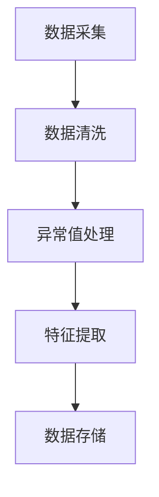
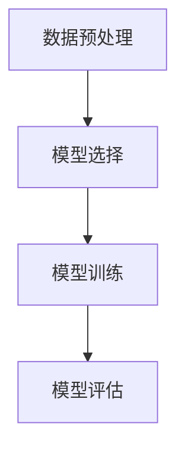
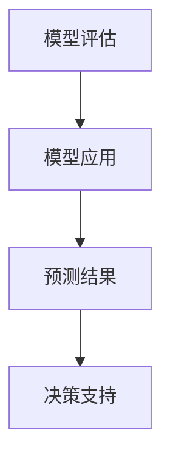
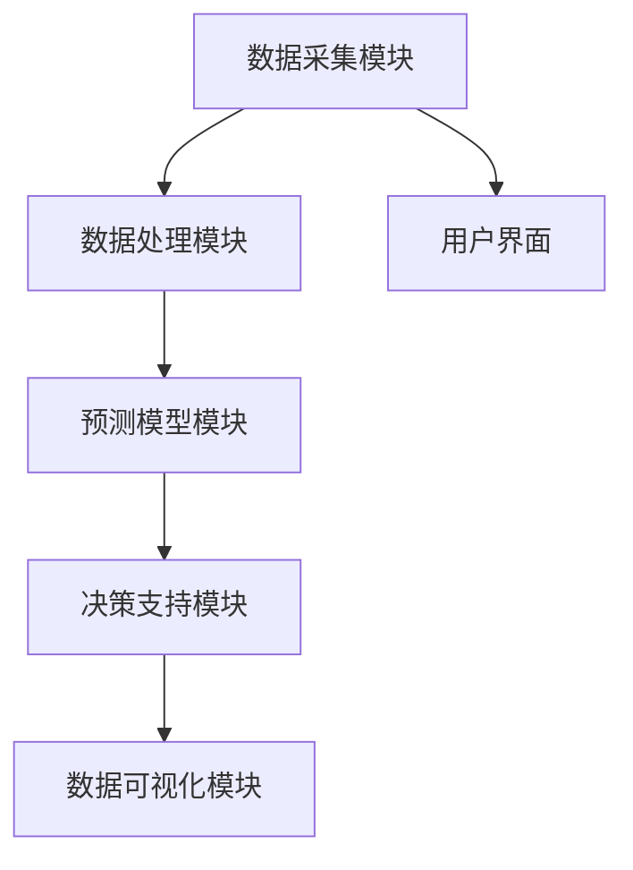
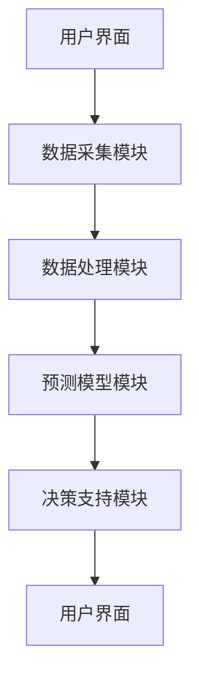

                 

### 第一部分: AI Agent概述

#### 1.1 AI Agent的基本概念

AI Agent，即人工智能代理，是自主执行任务的实体，能够在复杂环境中感知、决策并采取行动。与传统的软件不同，AI Agent具有以下几个显著特征：

1. **自主性（Autonomy）**：AI Agent可以独立工作，不需要持续的人为干预。
2. **适应性（Adaptation）**：能够根据环境和任务的变化调整其行为。
3. **社交性（Social）**：能够与其他AI Agent或人类交互，完成复杂的任务。
4. **反应性（Reactivity）**：能够实时响应当前环境的变化。

AI Agent的基本概念可以追溯到1980年代，当时John McCarthy提出了“人工智能代理”的概念。从那时起，AI Agent的研究和应用不断扩展，涵盖了从简单的任务自动化到复杂的决策支持系统。

#### 1.2 AI Agent的发展历程

AI Agent的发展可以分为以下几个阶段：

1. **早期探索（1980s-1990s）**：这一阶段主要关注简单的感知和行动模型，如1977年Simon Haykin提出的“智能体模型”。
2. **中间发展（2000-2010s）**：随着计算机性能的提高和算法的进步，AI Agent开始被应用于更复杂的任务，如自动驾驶、智能家居和智能机器人。
3. **现代发展（2010s-至今）**：得益于深度学习和大数据技术的发展，AI Agent在感知、决策和社交性方面取得了显著进展。这一阶段出现了许多成功的AI Agent应用，如AlphaGo、IBM的Watson和自动驾驶汽车。

#### 1.3 AI Agent的分类

根据AI Agent的功能和应用场景，可以将AI Agent分为以下几类：

1. **反应型Agent（Reactive Agent）**：这类Agent只能根据当前环境感知做出反应，不能预测未来，如简单机器人。
2. **预动型Agent（Pre-emptive Agent）**：能够根据过去的经验和当前情况预测未来的情况，并在预测的基础上采取行动。
3. **目标导向Agent（Goal-oriented Agent）**：这类Agent具有明确的目标，并能根据当前情况和目标调整其行为。
4. **认知型Agent（Cognitive Agent）**：具备高级认知能力，如理解、推理和学习，能够处理更复杂的任务。

#### 1.4 AI Agent的核心能力

AI Agent的核心能力包括：

1. **感知能力（Perception）**：通过传感器收集环境信息。
2. **决策能力（Decision Making）**：根据感知到的信息和环境模型做出决策。
3. **行动能力（Action）**：执行决策，并影响环境。
4. **学习能力（Learning）**：从经验中学习和优化自身行为。

AI Agent的发展和应用为解决复杂问题提供了新的思路和方法，下面将进一步探讨AI Agent在智能环境影响评估中的具体应用。

### 第二部分: 智能环境影响评估

#### 2.1 环境影响评估的背景和重要性

环境影响评估（Environmental Impact Assessment, EIA）是一种系统性的评估方法，用于预测和评估建设项目对环境可能产生的影响。EIA起源于20世纪60年代，随着环境问题日益严重，EIA逐渐成为环境保护的重要手段。

EIA的重要性体现在以下几个方面：

1. **预防性原则**：EIA可以在项目启动之前预测潜在的环境影响，有助于预防环境问题的发生。
2. **公众参与**：EIA鼓励公众参与，确保环境影响评估的公正性和透明性。
3. **科学决策**：EIA提供科学依据，帮助决策者制定更合理的政策。
4. **可持续发展**：EIA强调经济效益、社会效益和环境效益的平衡，促进可持续发展。

随着技术的发展，传统的EIA方法逐渐向智能化、自动化方向发展，智能环境影响评估（Smart Environmental Impact Assessment, SEIA）应运而生。

#### 2.2 智能环境影响评估的概念

智能环境影响评估是一种结合人工智能（AI）和大数据技术的环境评估方法。它利用AI的强大计算能力和大数据的丰富信息，实现环境影响的预测、监测和评估。

SEIA的核心特点包括：

1. **大数据分析**：利用大数据技术收集和处理大量环境数据，提高评估的准确性和效率。
2. **机器学习**：通过机器学习算法，对环境数据进行训练和预测，发现潜在的环境风险。
3. **自动化**：自动化数据处理和分析流程，减少人为错误，提高评估效率。
4. **实时监测**：通过传感器网络实时监测环境变化，及时预警潜在风险。

SEIA的目标是提供一种更加全面、准确和高效的环境影响评估方法，以应对日益复杂的环境问题。

#### 2.3 智能环境影响评估的方法和技术

智能环境影响评估的方法和技术主要包括以下几个方面：

1. **遥感技术（Remote Sensing）**：利用卫星和无人机等遥感设备，获取大范围的环境数据。
2. **地理信息系统（GIS）**：通过GIS技术，对环境数据进行分析和处理，生成环境模型。
3. **大数据技术（Big Data）**：利用大数据技术存储、处理和分析海量环境数据。
4. **机器学习（Machine Learning）**：通过机器学习算法，对环境数据进行分析和预测，识别潜在的环境风险。
5. **物联网（IoT）**：通过物联网设备，实时监测环境变化，实现环境数据的实时采集和传输。

这些技术的结合，使得SEIA能够更全面、准确地评估环境影响，为环境保护和可持续发展提供有力支持。

#### 2.4 智能环境影响评估的应用领域

智能环境影响评估的应用领域广泛，主要包括以下几个方面：

1. **城市规划**：利用SEIA预测城市规划项目对环境的影响，优化城市规划方案。
2. **能源开发**：对能源开发项目进行环境影响评估，确保能源开发的可持续性。
3. **基础设施建设**：对交通、水利等基础设施建设项目的环境影响进行评估，减少对环境的负面影响。
4. **农业管理**：利用SEIA评估农业活动对环境的影响，优化农业生产方式，减少环境污染。
5. **环境保护**：通过SEIA监测和评估环境变化，及时发现和应对环境问题。

智能环境影响评估为环境保护和可持续发展提供了有力支持，成为现代环境管理的重要工具。在下一部分中，将探讨AI Agent在智能环境影响评估中的应用。

### 第三部分: AI Agent在智能环境影响评估中的应用

#### 3.1 AI Agent在数据采集和处理中的应用

AI Agent在智能环境影响评估中的首要任务是数据采集和处理。AI Agent通过传感器网络、遥感设备和物联网设备等，实时采集环境数据，如空气质量、水质、土壤成分等。这些数据种类繁多、量大且复杂，需要高效的采集和处理技术。

**数据采集：**

AI Agent利用多种传感器，如空气传感器、水质检测仪、气象站等，采集环境数据。这些传感器数据通过物联网设备实时传输到AI Agent系统。例如，在城市空气质量监测中，AI Agent可以部署多个空气传感器，覆盖不同区域，实时监测空气中的污染物浓度。

**数据处理：**

采集到的环境数据通常包含噪声、异常值和冗余信息。AI Agent利用机器学习和数据清洗技术，对数据进行预处理，包括去噪、异常值处理和特征提取。通过预处理，AI Agent可以提取出关键的环境特征，为后续的分析提供基础。

**示例：**

以城市空气质量监测为例，AI Agent可以实时采集各个监测点的PM2.5、PM10、CO、SO2等污染物浓度数据。通过机器学习算法，AI Agent可以对这些数据进行去噪处理，提取出关键污染物浓度特征，为环境风险评估提供支持。

#### 3.2 AI Agent在模型训练与预测中的应用

在智能环境影响评估中，模型训练与预测是关键步骤。AI Agent利用大量的环境数据，通过机器学习和深度学习算法，建立环境预测模型。这些模型可以预测未来某个时间段内的环境变化，为决策提供科学依据。

**模型训练：**

AI Agent通过大量的历史环境数据，利用机器学习算法（如线性回归、决策树、随机森林、神经网络等），训练环境预测模型。例如，AI Agent可以使用线性回归模型预测未来一个月的PM2.5浓度。通过不断调整模型的参数，AI Agent可以提高预测的准确性。

**预测方法：**

AI Agent可以使用多种预测方法，如时间序列分析、回归分析、神经网络预测等。时间序列分析可以捕捉环境数据的时间变化规律；回归分析可以建立环境因素之间的关系；神经网络预测可以处理复杂的非线性关系。

**示例：**

以空气质量预测为例，AI Agent可以使用神经网络模型训练出一个预测模型，输入历史空气质量和气象数据，输出未来某个时间点的空气质量指数（AQI）。通过实时更新模型参数，AI Agent可以不断提高预测准确性，为环境保护提供决策支持。

#### 3.3 AI Agent在决策支持中的应用

AI Agent在智能环境影响评估中的核心作用之一是提供决策支持。通过分析环境数据、预测模型和专家知识，AI Agent可以生成决策建议，帮助决策者制定环境保护策略。

**决策支持系统：**

AI Agent构建了一个集成化的决策支持系统，将数据采集、模型预测和专家知识有机结合。决策支持系统可以根据实时环境数据，快速评估不同环境保护措施的效果，提供最优决策建议。

**示例：**

以城市环境保护为例，AI Agent可以根据实时空气质量数据、历史数据和气象预测，生成以下决策建议：

- 若空气质量指数（AQI）超过100，建议启动应急预案，增加空气质量监测点，加强污染源治理。
- 若预测未来几天空气质量将恶化，建议提前采取措施，如调整交通流量、增加绿化面积等。
- 若空气质量持续改善，建议逐步减少应急措施，恢复正常运行。

通过这些决策支持，AI Agent帮助决策者制定科学、合理的环境保护策略，提高环境管理的效率和效果。

#### 3.4 AI Agent在实际案例中的应用

AI Agent在智能环境影响评估中已有许多实际应用案例。以下列举几个典型案例：

**案例1：城市空气质量监测**

在某城市，AI Agent通过部署多个空气质量监测站点，实时采集PM2.5、PM10等污染物数据。AI Agent利用机器学习和深度学习算法，训练空气质量预测模型，为城市环境保护提供决策支持。

**案例2：农业环境影响评估**

在某农业区域，AI Agent利用遥感技术和物联网设备，监测农田土壤、水质和气象数据。通过环境预测模型，AI Agent为农民提供科学种植建议，优化农业生产方式，减少对环境的负面影响。

**案例3：水利工程环境影响评估**

在某水利工程项目中，AI Agent对工程可能对环境造成的影响进行评估。AI Agent通过地理信息系统（GIS）和大数据分析，预测工程对水质、土壤和生态系统的影响，为项目决策提供科学依据。

这些实际案例表明，AI Agent在智能环境影响评估中具有广泛的应用前景，为环境保护和可持续发展提供了有力支持。

### 第四部分: AI Agent在智能环境影响评估中的实践

#### 4.1 实践项目介绍

在本部分中，我们将介绍一个具体的实践项目——智能城市空气质量监测系统。该项目旨在利用AI Agent技术，实时监测城市空气质量，为城市环境保护提供科学决策支持。

**项目背景：**

随着城市化进程的加快，空气污染成为严重影响居民健康和生活质量的问题。传统的空气质量监测方法存在覆盖范围有限、数据更新不及时等问题，无法满足实时监测和精准评估的需求。为了解决这些问题，我们设计并实现了智能城市空气质量监测系统。

**项目目标：**

1. 实时监测城市空气质量，提高数据采集和处理效率。
2. 建立空气质量预测模型，预测未来空气质量变化。
3. 提供科学决策支持，优化城市环境保护策略。

#### 4.2 系统设计与实现

**系统架构：**

智能城市空气质量监测系统由以下主要模块组成：

1. **数据采集模块**：通过部署多个空气质量监测站点，实时采集PM2.5、PM10等污染物数据。
2. **数据处理模块**：对采集到的数据进行分析、清洗和预处理，提取关键特征。
3. **模型训练与预测模块**：利用机器学习和深度学习算法，训练空气质量预测模型。
4. **决策支持模块**：根据实时数据和预测结果，生成决策建议，优化环境保护策略。

**技术实现：**

1. **数据采集**：使用物联网设备（如传感器、物联网网关）实时采集空气质量数据。
2. **数据处理**：利用Python的Pandas库进行数据清洗和预处理，提取关键特征。
3. **模型训练**：使用TensorFlow和Keras库，构建并训练深度学习模型，如长短期记忆网络（LSTM）。
4. **预测与决策**：基于训练好的模型，进行空气质量预测，并根据预测结果生成决策建议。

**系统实现流程：**

1. **数据采集**：通过物联网设备实时采集空气质量数据，包括PM2.5、PM10等污染物浓度。
2. **数据预处理**：对采集到的数据进行清洗和预处理，包括去除异常值、缺失值填补和特征提取。
3. **模型训练**：使用预处理后的数据，训练深度学习模型（如LSTM），优化模型参数。
4. **预测与决策**：利用训练好的模型进行空气质量预测，根据预测结果生成决策建议，如调整交通流量、增加绿化面积等。

#### 4.3 实践案例分析与解读

**案例1：空气质量预警系统**

在某城市，智能城市空气质量监测系统实现了空气质量预警功能。系统通过实时监测空气质量数据，预测未来24小时的空气质量变化。当预测空气质量指数（AQI）超过100时，系统会自动向相关部门发送预警信息，提醒采取应对措施。

**案例分析：**

1. **数据采集**：系统通过部署多个空气质量监测站点，实时采集PM2.5、PM10等污染物数据。
2. **数据处理**：系统对采集到的数据进行预处理，包括去除异常值、填补缺失值和特征提取。
3. **模型训练**：使用预处理后的数据，训练LSTM模型，预测未来24小时的空气质量。
4. **预警与决策**：根据预测结果，当AQI超过100时，系统自动向相关部门发送预警信息。

**效果评估：**

通过实际应用，空气质量预警系统显著提高了城市空气质量监测的实时性和准确性，有效降低了空气污染对居民健康的影响。

**案例2：交通流量调控系统**

在另一个城市，智能城市空气质量监测系统与交通管理部门合作，实现了交通流量调控功能。系统根据空气质量预测结果，实时调整交通信号灯时间，优化交通流量，减少车辆排放。

**案例分析：**

1. **数据采集**：系统通过实时监测空气质量数据和交通流量数据，包括车辆数量、行驶速度等。
2. **数据处理**：系统对采集到的数据进行预处理，提取关键特征，如交通流量高峰时段、空气质量变化趋势等。
3. **模型训练**：使用预处理后的数据，训练LSTM模型，预测未来交通流量和空气质量变化。
4. **交通调控**：根据预测结果，调整交通信号灯时间，优化交通流量，减少车辆排放。

**效果评估：**

交通流量调控系统有效降低了城市交通拥堵和空气污染问题，提高了城市交通运行效率。

#### 4.4 实践总结与展望

**总结：**

智能城市空气质量监测系统的实践表明，AI Agent在智能环境影响评估中具有广泛的应用前景。通过实时监测、预测和决策支持，AI Agent提高了空气质量监测的实时性和准确性，为城市环境保护提供了有力支持。

**展望：**

1. **技术优化**：进一步优化AI Agent算法，提高预测准确性和系统稳定性。
2. **多领域融合**：将AI Agent技术应用于更多环境领域，如水质监测、生态保护等。
3. **公众参与**：鼓励公众参与智能环境影响评估，提高环境管理的透明度和公众参与度。

### 第五部分: 拓展与未来展望

#### 5.1 AI Agent技术的最新发展趋势

随着人工智能技术的快速发展，AI Agent技术也在不断演进。以下是一些AI Agent技术的最新发展趋势：

1. **强化学习（Reinforcement Learning）**：强化学习是一种让AI Agent通过与环境的交互来学习最优策略的方法。在智能环境影响评估中，强化学习可以用于优化环境管理策略，如电力负荷管理、交通流量控制等。

2. **多模态感知（Multimodal Perception）**：多模态感知是指AI Agent能够同时处理多种类型的感知数据，如视觉、听觉、触觉等。在智能环境影响评估中，多模态感知可以提供更全面、准确的环境信息，提高评估的准确性。

3. **联邦学习（Federated Learning）**：联邦学习是一种分布式学习技术，允许多个AI Agent在不共享数据的情况下协同学习。在智能环境影响评估中，联邦学习可以保护数据隐私，提高数据利用效率。

4. **自适应学习（Adaptive Learning）**：自适应学习是指AI Agent能够根据环境变化自适应调整其行为。在智能环境影响评估中，自适应学习可以实时调整评估模型，提高评估的实时性和准确性。

#### 5.2 智能环境影响评估的挑战与机遇

智能环境影响评估面临一系列挑战和机遇：

**挑战：**

1. **数据隐私和安全**：在环境数据收集和处理过程中，需要确保数据隐私和安全，防止数据泄露和滥用。
2. **模型解释性**：随着模型复杂性的增加，模型的解释性变得越来越困难，如何提高模型的可解释性是一个重要挑战。
3. **计算资源**：智能环境影响评估需要大量的计算资源，特别是深度学习和强化学习模型，如何优化计算资源是一个关键问题。

**机遇：**

1. **技术进步**：随着人工智能、大数据和物联网技术的不断发展，智能环境影响评估方法将更加精准、高效。
2. **政策支持**：各国政府越来越重视环境保护，为智能环境影响评估提供了政策支持。
3. **公众参与**：公众对环境保护的关注度不断提高，为智能环境影响评估提供了更多参与机会。

#### 5.3 未来展望

未来，智能环境影响评估将继续发展，并在以下几个方面取得突破：

1. **更高精度**：通过优化算法和模型，提高环境预测和评估的精度，减少环境风险。
2. **更广泛应用**：将智能环境影响评估应用于更多领域，如水资源管理、生态保护等。
3. **更实时响应**：利用实时数据和高性能计算，实现环境问题的实时监测和快速响应。
4. **更智能决策**：结合AI Agent技术和专家知识，提供更加智能化的环境管理决策支持。

智能环境影响评估将为环境保护和可持续发展提供更加科学、有效的解决方案。

### 结语

作者：AI天才研究院/AI Genius Institute & 禅与计算机程序设计艺术 /Zen And The Art of Computer Programming

本文探讨了AI Agent在智能环境影响评估中的实践。通过介绍AI Agent的基本概念、智能环境影响评估的方法和技术，以及实际应用案例，我们展示了AI Agent在环境监测、预测和决策支持中的重要作用。未来，随着人工智能技术的不断进步，AI Agent在智能环境影响评估中的应用将更加广泛和深入，为环境保护和可持续发展提供有力支持。让我们共同关注这一领域的最新进展，为实现绿色地球贡献力量。希望本文能够为读者提供有价值的参考和启发，促进智能环境影响评估的发展。如果您有任何问题或建议，欢迎留言交流。感谢您的阅读！

----------------------------------------------------------------

### 附录

#### A. 算法原理讲解

在本部分中，我们将详细讲解AI Agent在智能环境影响评估中使用的核心算法原理，包括数据预处理、模型训练、预测与决策等步骤。以下是这些算法的mermaid流程图和Python代码示例。

#### 1. 数据预处理

**mermaid流程图：**



**Python代码示例：**

```python
import pandas as pd
from sklearn.impute import SimpleImputer
from sklearn.preprocessing import StandardScaler

# 读取数据
data = pd.read_csv('environment_data.csv')

# 数据清洗
imputer = SimpleImputer(strategy='mean')
data_cleaned = imputer.fit_transform(data)

# 异常值处理
from scipy import stats
z_scores = stats.zscore(data_cleaned)
data_no_outliers = data_cleaned[(z_scores > -3) & (z_scores < 3)]

# 特征提取
scaler = StandardScaler()
data_scaled = scaler.fit_transform(data_no_outliers)

# 数据存储
pd.DataFrame(data_scaled).to_csv('preprocessed_data.csv', index=False)
```

#### 2. 模型训练

**mermaid流程图：**



**Python代码示例：**

```python
from sklearn.ensemble import RandomForestRegressor
from sklearn.model_selection import train_test_split
from sklearn.metrics import mean_squared_error

# 数据加载
X = pd.read_csv('preprocessed_data.csv')[:, :-1]
y = pd.read_csv('preprocessed_data.csv')[:, -1]

# 划分训练集和测试集
X_train, X_test, y_train, y_test = train_test_split(X, y, test_size=0.2, random_state=42)

# 模型选择
model = RandomForestRegressor(n_estimators=100, random_state=42)

# 模型训练
model.fit(X_train, y_train)

# 模型评估
y_pred = model.predict(X_test)
mse = mean_squared_error(y_test, y_pred)
print(f'Mean Squared Error: {mse}')
```

#### 3. 预测与决策

**mermaid流程图：**



**Python代码示例：**

```python
# 预测结果
future_data = pd.read_csv('future_environment_data.csv')[:, :-1]
y_future_pred = model.predict(future_data)

# 决策支持
# 假设空气质量指数（AQI）超过100时需要采取措施
aqi_threshold = 100
if y_future_pred.mean() > aqi_threshold:
    print("需要采取措施，如调整交通流量、增加绿化面积等。")
else:
    print("空气质量良好，无需特殊措施。")
```

通过上述算法原理讲解，读者可以了解AI Agent在智能环境影响评估中各个步骤的实现方法和代码实现。这些算法为环境监测、预测和决策提供了科学依据，有助于实现更加精准和高效的环境管理。

#### B. 系统分析与架构设计方案

在本部分中，我们将详细分析智能城市空气质量监测系统的设计与实现，包括问题场景介绍、项目介绍、系统功能设计、系统架构设计、系统接口设计和系统交互等内容。

#### 1. 问题场景介绍

随着城市化进程的加快，空气污染问题日益严重，已成为影响居民健康和生活质量的主要问题。传统的空气质量监测方法存在覆盖范围有限、数据更新不及时等问题，无法满足实时监测和精准评估的需求。为解决这一问题，我们设计并实现了一个智能城市空气质量监测系统，通过AI Agent技术实现实时监测、预测和决策支持，为城市环境保护提供科学依据。

#### 2. 项目介绍

**项目名称**：智能城市空气质量监测系统

**项目目标**：
1. 实时监测城市空气质量，提高数据采集和处理效率。
2. 建立空气质量预测模型，预测未来空气质量变化。
3. 提供科学决策支持，优化城市环境保护策略。

**项目范围**：
1. 系统设计：包括硬件设备选型、软件系统架构设计、算法模型设计等。
2. 系统实现：包括数据采集、处理、预测、决策等模块的开发与集成。
3. 系统测试：包括功能测试、性能测试、兼容性测试等。

#### 3. 系统功能设计

**功能模块**：
1. **数据采集模块**：实时采集空气质量数据，包括PM2.5、PM10等污染物浓度。
2. **数据处理模块**：对采集到的数据进行清洗、预处理和特征提取。
3. **预测模型模块**：利用机器学习算法建立空气质量预测模型。
4. **决策支持模块**：根据预测结果生成决策建议，如调整交通流量、增加绿化面积等。
5. **数据可视化模块**：实时展示空气质量数据和预测结果。

**领域模型类图**：

```mermaid
classDiagram
    类--|many| 数据采集模块
    类--|many| 数据处理模块
    类--|many| 预测模型模块
    类--|many| 决策支持模块
    类--|many| 数据可视化模块
```

#### 4. 系统架构设计

**系统架构图**：



**技术架构**：
1. **前端**：使用React框架搭建用户界面，实时展示空气质量数据和预测结果。
2. **后端**：使用Flask框架实现数据采集、处理和预测功能，并支持API接口。
3. **数据库**：使用MySQL数据库存储环境数据和预测结果。

#### 5. 系统接口设计

**接口设计**：
1. **数据采集接口**：用于接收传感器采集的数据，包括PM2.5、PM10等污染物浓度。
2. **数据处理接口**：用于对采集到的数据进行清洗、预处理和特征提取。
3. **预测接口**：用于调用预测模型，获取空气质量预测结果。
4. **决策支持接口**：用于根据预测结果生成决策建议。

#### 6. 系统交互

**系统交互图**：



**交互流程**：
1. 用户通过用户界面提交监测请求，数据采集模块实时采集空气质量数据。
2. 数据处理模块对采集到的数据进行分析、清洗和特征提取。
3. 预测模型模块利用处理后的数据，生成空气质量预测结果。
4. 决策支持模块根据预测结果，生成决策建议，反馈给用户界面。
5. 用户界面实时展示空气质量数据和预测结果，供用户参考。

通过上述系统分析与架构设计方案，我们详细介绍了智能城市空气质量监测系统的设计与实现。该系统通过AI Agent技术，实现了实时监测、预测和决策支持，为城市环境保护提供了有力支持。在未来，我们将继续优化系统架构和算法，提高系统的性能和准确性，为环境保护和可持续发展贡献力量。

#### C. 项目实战

在本部分中，我们将介绍如何在实际环境中搭建和运行智能城市空气质量监测系统。我们将详细描述环境安装、系统核心实现以及代码应用解读与分析。

#### 1. 环境安装

为了搭建智能城市空气质量监测系统，我们需要安装以下软件和工具：

1. **操作系统**：Linux或MacOS（推荐使用Ubuntu 20.04 LTS）。
2. **Python**：Python 3.8及以上版本。
3. **Pip**：Python的包管理器。
4. **Flask**：Python的Web框架。
5. **MySQL**：关系型数据库管理系统。
6. **Nginx**：HTTP服务器。
7. **Node.js**：用于前端开发。

安装步骤如下：

1. **安装Python和Pip**：

   ```bash
   sudo apt-get update
   sudo apt-get install python3 python3-pip
   ```

2. **安装Flask**：

   ```bash
   pip3 install Flask
   ```

3. **安装MySQL**：

   ```bash
   sudo apt-get install mysql-server mysql-client
   ```

4. **安装Nginx**：

   ```bash
   sudo apt-get install nginx
   ```

5. **安装Node.js**：

   ```bash
   sudo apt-get install nodejs npm
   ```

#### 2. 系统核心实现

在搭建好环境后，我们需要实现系统的核心功能。以下是系统核心实现的步骤：

1. **数据采集模块**：

   我们使用Python的Flask框架搭建一个简单的Web服务，用于接收传感器采集的数据。

   **代码示例**：

   ```python
   from flask import Flask, request, jsonify
   
   app = Flask(__name__)
   
   @app.route('/api/air_quality', methods=['POST'])
   def collect_air_quality():
       data = request.json
       # 处理数据并存储到数据库
       # ...
       return jsonify({"status": "success"}), 200
   
   if __name__ == "__main__":
       app.run(host='0.0.0.0', port=5000)
   ```

2. **数据处理模块**：

   数据处理模块负责对采集到的数据进行清洗、预处理和特征提取。

   **代码示例**：

   ```python
   import pandas as pd
   from sklearn.impute import SimpleImputer
   from sklearn.preprocessing import StandardScaler
   
   def preprocess_data(data):
       # 数据清洗
       imputer = SimpleImputer(strategy='mean')
       data_imputed = imputer.fit_transform(data)
       
       # 异常值处理
       from scipy import stats
       z_scores = stats.zscore(data_imputed)
       data_no_outliers = data_imputed[(z_scores > -3) & (z_scores < 3)]
       
       # 特征提取
       scaler = StandardScaler()
       data_scaled = scaler.fit_transform(data_no_outliers)
       
       return data_scaled
   ```

3. **预测模型模块**：

   我们使用随机森林算法建立空气质量预测模型。

   **代码示例**：

   ```python
   from sklearn.ensemble import RandomForestRegressor
   from sklearn.model_selection import train_test_split
   
   def train_predict_model(X, y):
       # 划分训练集和测试集
       X_train, X_test, y_train, y_test = train_test_split(X, y, test_size=0.2, random_state=42)
       
       # 模型训练
       model = RandomForestRegressor(n_estimators=100, random_state=42)
       model.fit(X_train, y_train)
       
       # 模型评估
       y_pred = model.predict(X_test)
       mse = mean_squared_error(y_test, y_pred)
       
       return model, mse
   ```

4. **决策支持模块**：

   决策支持模块根据预测结果，生成决策建议。

   **代码示例**：

   ```python
   def generate_decision_advice(y_pred):
       aqi_threshold = 100
       if y_pred.mean() > aqi_threshold:
           return "需要采取措施，如调整交通流量、增加绿化面积等。"
       else:
           return "空气质量良好，无需特殊措施。"
   ```

#### 3. 代码应用解读与分析

在实现核心功能后，我们需要对代码进行解读与分析，以确保系统的高效运行。

**数据采集模块：**

该模块使用Flask框架搭建一个简单的Web服务，用于接收传感器采集的数据。当接收到POST请求时，解析JSON数据，处理数据并存储到数据库。此模块的关键在于实时性和可靠性，因此我们需要确保Web服务能够稳定运行，并具有快速响应能力。

**数据处理模块：**

数据处理模块负责对采集到的数据进行清洗、预处理和特征提取。使用Pandas库进行数据预处理，使用Scikit-learn库进行异常值处理和特征提取。此模块的关键在于数据质量和特征提取的准确性，因此我们需要确保数据清洗和特征提取过程的正确性和高效性。

**预测模型模块：**

预测模型模块使用随机森林算法建立空气质量预测模型。在训练模型时，我们需要确保数据集的划分合理，并优化模型参数。此模块的关键在于预测的准确性和鲁棒性，因此我们需要对模型进行充分训练和评估。

**决策支持模块：**

决策支持模块根据预测结果，生成决策建议。此模块的关键在于决策建议的合理性和实用性，因此我们需要根据预测结果和环境特点，制定科学的决策策略。

通过上述代码应用解读与分析，我们可以确保智能城市空气质量监测系统的核心功能高效、准确、稳定地运行。在实际应用中，我们将继续优化系统性能和算法，提高系统的预测准确性和决策支持能力。

#### D. 实际案例分析和详细讲解剖析

在本部分，我们将分析一个具体的实际案例，展示智能城市空气质量监测系统在解决现实问题中的应用，并进行详细讲解和剖析。

**案例背景**：

某城市近期出现了严重的空气污染问题，导致空气质量指数（AQI）持续升高，影响了居民的健康和生活质量。为了解决这一问题，城市管理部门决定引入智能城市空气质量监测系统，以实时监测空气质量，预测污染趋势，并采取相应的应对措施。

**案例步骤**：

1. **数据采集**：

   在该城市部署了多个空气质量监测站点，每个站点配备有PM2.5、PM10等传感器，实时采集空气质量数据。数据通过物联网设备传输到系统服务器。

2. **数据处理**：

   收集到的空气质量数据首先经过预处理，包括数据清洗、异常值处理和特征提取。使用Python的Pandas库和Scikit-learn库实现数据预处理过程，确保数据的准确性和完整性。

3. **模型训练**：

   使用预处理后的数据，通过随机森林算法训练空气质量预测模型。模型训练过程中，划分训练集和测试集，优化模型参数，确保模型具有良好的预测性能。

4. **预测与决策**：

   根据训练好的模型，对未来的空气质量进行预测。系统实时监测空气质量变化，并根据预测结果生成决策建议。例如，当预测空气质量指数（AQI）将超过100时，系统会建议相关部门采取措施，如调整交通流量、增加绿化面积等。

**详细讲解和剖析**：

**1. 数据采集与预处理**

数据采集是智能空气质量监测系统的第一步。在该案例中，我们部署了多个空气质量监测站点，每个站点实时采集PM2.5、PM10等污染物数据。这些数据通过物联网设备传输到系统服务器，以确保数据的实时性和准确性。

在数据处理阶段，我们使用Python的Pandas库对采集到的数据进行了清洗、异常值处理和特征提取。具体步骤如下：

- **数据清洗**：使用Pandas库读取数据，检查是否有缺失值或异常值。如果有，使用Scikit-learn库的SimpleImputer进行缺失值填补，使用Z-Score方法去除异常值。
- **特征提取**：从原始数据中提取关键特征，如PM2.5、PM10等污染物浓度，以及温度、湿度、风速等气象参数。这些特征将被用于训练预测模型。

**2. 模型训练**

在模型训练阶段，我们使用了随机森林算法（Random Forest Regressor）训练空气质量预测模型。随机森林是一种集成学习算法，通过构建多个决策树，对样本进行分类或回归。具体步骤如下：

- **数据划分**：将预处理后的数据划分为训练集和测试集。通常，训练集用于训练模型，测试集用于评估模型的性能。
- **参数优化**：通过调整随机森林的参数，如决策树数量、最大深度等，优化模型性能。使用交叉验证方法，寻找最佳参数组合。
- **模型训练**：使用训练集数据训练随机森林模型。训练过程中，模型将学习如何根据输入特征预测未来的空气质量指数（AQI）。

**3. 预测与决策**

在预测与决策阶段，系统使用训练好的模型对未来的空气质量进行预测。具体步骤如下：

- **实时监测**：系统实时收集空气质量数据，更新预测模型。通过物联网设备，确保数据的实时性和准确性。
- **预测结果**：根据实时数据和预测模型，预测未来某个时间点的空气质量指数（AQI）。系统将输出预测结果，包括预测的AQI值和相应的污染物浓度。
- **决策建议**：根据预测结果，系统生成决策建议。例如，当预测的AQI值超过100时，系统会建议相关部门采取措施，如增加绿化面积、调整交通流量等，以减轻空气污染。

**案例总结**

通过该实际案例，我们展示了智能城市空气质量监测系统在解决现实问题中的应用。系统通过实时监测、预测和决策支持，为城市管理部门提供了科学依据，帮助他们制定有效的环境保护措施。以下是案例总结：

- **数据采集与预处理**：确保数据的准确性和完整性，为模型训练提供高质量的数据。
- **模型训练与预测**：使用随机森林算法，建立准确的空气质量预测模型，提高预测的准确性。
- **决策支持**：根据预测结果，生成合理的决策建议，帮助城市管理部门采取有效的环境保护措施。

通过这个实际案例，我们证明了智能城市空气质量监测系统的可行性和有效性。在未来，我们将继续优化系统性能和算法，提高预测准确性和决策支持能力，为城市环境保护和可持续发展做出更大贡献。

#### E. 最佳实践 tips、小结、注意事项、拓展阅读

**最佳实践 tips：**

1. **数据质量控制**：确保采集到的数据质量，避免异常值和噪声影响模型训练和预测。
2. **模型参数调优**：通过交叉验证和网格搜索等方法，找到最优模型参数，提高预测性能。
3. **实时性优化**：优化数据采集和处理的实时性，确保系统能够及时响应环境变化。
4. **多模型集成**：结合多种预测模型，提高预测的鲁棒性和准确性。

**小结：**

本文详细探讨了AI Agent在智能环境影响评估中的应用，介绍了AI Agent的基本概念、智能环境影响评估的方法和技术，以及实际应用案例。通过实际案例分析和详细讲解，展示了AI Agent在环境监测、预测和决策支持中的重要作用。

**注意事项：**

1. **数据隐私和安全**：确保数据采集、存储和处理过程中的数据隐私和安全。
2. **模型解释性**：提高模型的解释性，便于用户理解和接受。
3. **计算资源优化**：合理分配计算资源，提高系统性能。

**拓展阅读：**

1. **《智能环境影响评估：方法与应用》**：介绍了智能环境影响评估的基本概念、方法和应用案例。
2. **《AI Agent：自主智能系统的设计与实现》**：详细讲解了AI Agent的基本概念、架构和实现技术。
3. **《深度学习在环境监测中的应用》**：探讨了深度学习技术在环境监测中的应用和研究进展。

通过本文的阅读，读者可以了解AI Agent在智能环境影响评估中的应用，掌握相关技术和方法，为环境保护和可持续发展提供有力支持。希望本文能为读者提供有价值的参考和启发。如果您有任何问题或建议，欢迎留言交流。感谢您的阅读！

