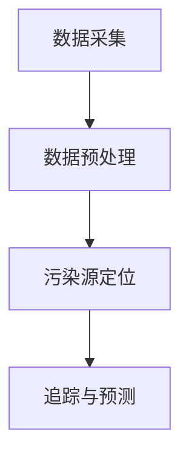
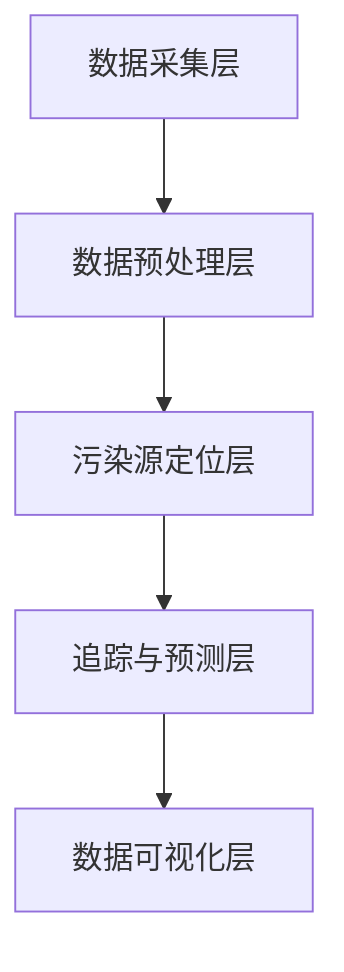

                 

# AI Agent在智能环境污染源追踪中的实践

## 关键词
人工智能，环境监测，污染源追踪，AI Agent，算法原理，系统架构设计，Python实现

## 摘要
本文深入探讨人工智能（AI）在智能环境污染源追踪中的应用。我们首先介绍了AI Agent的基本概念、定义和分类，然后详细解析了AI Agent在智能环境污染源追踪中的应用案例。接着，文章阐述了智能环境污染源追踪的算法原理，包括算法流程和数学模型。随后，我们介绍了系统架构设计，包括问题场景介绍、系统功能设计、架构设计、接口设计和系统交互。最后，通过一个项目实战案例，展示了AI Agent在智能环境污染源追踪中的实际应用，并提供了最佳实践建议和小结。

## 引言

### 1.1 环境污染问题概述
环境污染是一个全球性的问题，它不仅影响到生态系统，也对人类健康构成严重威胁。随着工业化和城市化进程的加速，空气污染、水污染和土壤污染等问题日益严重。传统的污染源追踪方法往往依赖于人工监测和经验判断，存在时效性差、效率低、精度不足等缺点。随着人工智能技术的不断发展，利用AI Agent进行智能环境污染源追踪成为了一种新的解决方案。

### 1.2 人工智能与环保的结合
人工智能技术在环保领域的应用日益广泛，从环境监测数据的采集、处理到污染源的定位和预测，都展现了其强大的潜力。AI Agent作为人工智能的一种形式，能够通过自主学习、推理和决策，实现对复杂环境问题的智能化解决。本文旨在探讨AI Agent在智能环境污染源追踪中的实际应用，分析其技术原理和系统架构设计。

### 1.3 书籍结构
本文结构分为八个部分。第一部分是引言，介绍环境污染问题和人工智能在环保领域的结合。第二部分是AI Agent基本概念，包括定义、分类和核心技术。第三部分讨论AI Agent在智能环境污染源追踪中的应用。第四部分是算法原理讲解，包括算法流程和数学模型。第五部分是数学模型与公式，详细阐述算法中的数学原理。第六部分是系统架构设计，介绍系统架构的各个组成部分。第七部分是项目实战，展示一个具体的实战案例。最后一部分是最佳实践与总结，提供最佳实践建议和总结文章的核心内容。

## AI Agent基本概念

### 2.1 定义与分类
AI Agent，即人工智能代理，是一种能够自主感知环境、规划行动并执行任务的计算机程序。根据其自主能力的强弱，AI Agent可以分为以下几类：
- **反应型AI Agent**：只能对预设的环境状态做出反应，无法进行学习或规划。
- **认知型AI Agent**：能够从环境中获取信息，并利用这些信息进行决策。
- **学习型AI Agent**：能够通过经验和数据学习，改进其行为。

### 2.2 核心技术
AI Agent的核心技术包括感知技术、决策技术和行动技术。感知技术负责获取环境信息，决策技术负责根据环境信息和目标进行决策，行动技术负责执行决策结果。

- **感知技术**：包括传感器技术和数据融合技术，用于获取环境中的各种信息。
- **决策技术**：主要包括规划算法和决策树等，用于处理复杂的环境问题。
- **行动技术**：包括机器人控制和自动化执行系统，用于实现AI Agent的行动目标。

### 2.3 应用场景
AI Agent在环保领域的应用场景广泛，包括但不限于：
- **环境监测**：通过AI Agent进行环境数据的实时采集和处理。
- **污染源追踪**：利用AI Agent的自主决策能力，实现对污染源的定位和追踪。
- **生态保护**：利用AI Agent监测生态系统变化，提供生态保护决策支持。

## AI Agent在智能环境污染源追踪中的应用

### 3.1 智能环境污染源追踪概述
智能环境污染源追踪是一种利用人工智能技术对环境污染源进行定位、追踪和预测的方法。它通过收集环境数据，利用AI Agent进行分析和处理，实现对污染源的实时监测和精准定位。

### 3.2 AI Agent在追踪中的应用
AI Agent在智能环境污染源追踪中的应用主要包括以下方面：
- **数据采集**：通过传感器网络收集环境数据，如空气中的污染物浓度、水质指标等。
- **数据预处理**：对采集到的数据进行清洗、归一化和特征提取，为后续分析提供高质量的数据。
- **污染源定位**：利用机器学习和数据挖掘技术，从预处理后的数据中提取特征，实现对污染源的位置定位。
- **追踪与预测**：通过对污染源的历史数据和实时数据进行分析，预测污染源的移动轨迹，为环境管理提供决策支持。

### 3.3 实际案例
以某城市空气污染源追踪项目为例，该项目利用AI Agent对城市空气中的PM2.5进行监测和追踪。通过部署传感器网络，AI Agent能够实时收集PM2.5的浓度数据，并对数据进行分析和处理。根据分析结果，AI Agent能够定位污染源并预测其移动轨迹，为城市环境管理提供数据支持。

## 智能环境污染源追踪的算法原理

### 4.1 算法介绍
智能环境污染源追踪的算法主要包括以下步骤：
1. 数据采集：通过传感器网络收集环境数据。
2. 数据预处理：对采集到的数据进行分析和处理。
3. 污染源定位：利用数据挖掘和机器学习技术，对预处理后的数据进行特征提取和模式识别，实现污染源的定位。
4. 追踪与预测：利用历史数据和实时数据，预测污染源的移动轨迹。

### 4.2 原理讲解
智能环境污染源追踪的算法原理可以概括为以下几个关键步骤：

#### 4.2.1 数据采集
数据采集是整个算法的基础。传感器网络部署在城市各个关键位置，实时监测空气中的PM2.5、SO2、NO2等污染物浓度。采集的数据包括时间戳、地理位置和污染物浓度等。

#### 4.2.2 数据预处理
采集到的数据通常存在噪声、缺失值等问题，需要进行预处理。预处理步骤包括数据清洗、归一化和特征提取。数据清洗用于去除噪声和异常值，归一化用于将不同量纲的数据转换为相同量纲，特征提取用于从原始数据中提取出有用的特征信息。

#### 4.2.3 污染源定位
污染源定位是算法的核心步骤。常用的方法包括K-近邻算法（K-Nearest Neighbor, KNN）、支持向量机（Support Vector Machine, SVM）和聚类算法等。以K-近邻算法为例，其基本原理是根据新数据点到已有数据点的距离，选择距离最近的K个样本，并根据这些样本的标签来预测新数据的标签。具体实现步骤如下：

1. **计算距离**：计算新数据点到已有数据点的欧氏距离。
2. **选择邻居**：选择距离最近的K个邻居。
3. **投票决策**：根据邻居的标签进行投票，选择出现次数最多的标签作为新数据的标签。

#### 4.2.4 追踪与预测
追踪与预测的目的是根据污染源的历史数据和实时数据，预测其未来的移动轨迹。常用的方法包括时间序列分析、迁移学习和深度学习等。以时间序列分析为例，其基本原理是根据污染源的历史数据，构建一个时间序列模型，用于预测未来的污染物浓度变化。具体实现步骤如下：

1. **数据建模**：根据历史数据，选择合适的时间序列模型，如ARIMA（自回归积分滑动平均模型）。
2. **模型训练**：使用训练集对模型进行训练。
3. **模型预测**：使用训练好的模型对未来的污染物浓度进行预测。

### 4.3 Mermaid流程图


### 4.4 Python源代码示例
以下是使用Python实现污染源定位的代码示例：
```python
import numpy as np
from sklearn.neighbors import KNeighborsClassifier
from sklearn.model_selection import train_test_split

# 假设已有数据集X和标签y
X = [[1, 2], [2, 3], [4, 5], [5, 6]]
y = [0, 0, 1, 1]

# 划分训练集和测试集
X_train, X_test, y_train, y_test = train_test_split(X, y, test_size=0.3, random_state=42)

# 创建K-近邻分类器
knn = KNeighborsClassifier(n_neighbors=3)

# 训练模型
knn.fit(X_train, y_train)

# 预测新数据
new_data = [[3, 4]]
prediction = knn.predict(new_data)

print("预测结果：", prediction)
```

### 4.5 数学模型与公式
污染源定位的数学模型可以表示为：
$$
\text{预测标签} = \arg\max_{y'} \sum_{i=1}^{K} w_i \cdot \text{dist}(x, x_i)
$$
其中，$x$为待定位的新数据点，$x_i$为已有数据点，$w_i$为第$i$个邻居的权重，$\text{dist}(x, x_i)$为$x$和$x_i$之间的距离。

## 数学模型与公式

### 5.1 数学模型
智能环境污染源追踪中的数学模型主要包括以下几部分：
- **数据采集模型**：描述传感器网络如何采集环境数据。
- **数据预处理模型**：描述如何清洗、归一化和特征提取。
- **污染源定位模型**：描述如何利用机器学习和数据挖掘技术定位污染源。
- **追踪与预测模型**：描述如何根据历史数据和实时数据预测污染源的移动轨迹。

### 5.2 公式讲解
- **数据采集模型**：
  $$
  \text{数据集} = \{\text{时间戳}, \text{地理位置}, \text{污染物浓度}\}
  $$

- **数据预处理模型**：
  $$
  \text{归一化} = \frac{\text{原值} - \text{最小值}}{\text{最大值} - \text{最小值}}
  $$

- **污染源定位模型**：
  $$
  \text{预测标签} = \arg\max_{y'} \sum_{i=1}^{K} w_i \cdot \text{dist}(x, x_i)
  $$

- **追踪与预测模型**：
  $$
  \text{预测值} = f(\text{历史数据}, \text{实时数据})
  $$

### 5.3 举例说明
假设我们有一个包含PM2.5浓度数据的样本集，如下所示：

| 时间戳 | 地理位置 | PM2.5浓度 |
|--------|----------|-----------|
| 1      | A        | 30        |
| 2      | B        | 35        |
| 3      | A        | 40        |
| 4      | B        | 45        |

我们使用K-近邻算法进行污染源定位。选择K=3，假设距离度量使用欧氏距离。首先，计算每个样本的欧氏距离：

- 样本1到样本2的距离：$\sqrt{(1-2)^2 + (A-B)^2 + (30-35)^2} = \sqrt{1 + (A-B)^2 + 25}$
- 样本1到样本3的距离：$\sqrt{(1-3)^2 + (A-A)^2 + (30-40)^2} = \sqrt{4 + 0 + 100}$
- 样本1到样本4的距离：$\sqrt{(1-4)^2 + (A-B)^2 + (30-45)^2} = \sqrt{9 + (A-B)^2 + 225}$

根据距离计算结果，选择距离最近的3个样本作为邻居。假设邻居为样本2、样本3和样本4，它们的标签分别为0、1、1。根据K-近邻算法，预测新数据点（例如，时间戳为5，地理位置为A，PM2.5浓度为35）的标签为1。

## 系统架构设计

### 6.1 问题场景介绍
智能环境污染源追踪系统旨在实时监测城市空气质量，定位污染源并预测其移动轨迹，为城市环境管理提供数据支持。系统需要处理大量的环境数据，包括PM2.5、SO2、NO2等污染物的浓度数据。系统需要具备高效的数据采集、预处理、定位和预测能力。

### 6.2 系统功能设计
系统的主要功能包括：
- **数据采集**：通过传感器网络实时采集环境数据。
- **数据预处理**：对采集到的数据进行清洗、归一化和特征提取。
- **污染源定位**：利用机器学习和数据挖掘技术，对预处理后的数据进行特征提取和模式识别，实现污染源的定位。
- **追踪与预测**：利用历史数据和实时数据，预测污染源的移动轨迹。
- **数据可视化**：将定位和预测结果可视化，为环境管理者提供直观的数据支持。

### 6.3 系统架构设计
智能环境污染源追踪系统的架构设计如图所示：



### 6.4 系统接口设计
系统接口设计包括以下部分：
- **数据采集接口**：用于接收传感器网络发送的环境数据。
- **数据预处理接口**：用于处理采集到的数据，包括清洗、归一化和特征提取。
- **污染源定位接口**：用于执行污染源定位算法，返回定位结果。
- **追踪与预测接口**：用于根据历史数据和实时数据预测污染源的移动轨迹。
- **数据可视化接口**：用于将定位和预测结果可视化，提供直观的数据展示。

### 6.5 系统交互
系统交互主要包括以下几个步骤：
1. **数据采集**：传感器网络将实时采集的环境数据发送到数据采集接口。
2. **数据预处理**：数据预处理接口对采集到的数据进行清洗、归一化和特征提取，并将预处理后的数据存储到数据库中。
3. **污染源定位**：污染源定位接口从数据库中获取预处理后的数据，执行污染源定位算法，并将定位结果返回给数据可视化接口。
4. **追踪与预测**：追踪与预测接口利用历史数据和实时数据，预测污染源的移动轨迹，并将预测结果返回给数据可视化接口。
5. **数据可视化**：数据可视化接口将定位和预测结果可视化，为环境管理者提供数据支持。

## 项目实战

### 7.1 环境安装
在进行项目实战之前，需要搭建一个适合智能环境污染源追踪系统开发的环境。以下是在Linux系统中安装所需软件的步骤：

1. 安装Python环境：
   ```
   sudo apt-get update
   sudo apt-get install python3-pip
   ```
2. 安装依赖库：
   ```
   pip3 install numpy pandas scikit-learn matplotlib
   ```

### 7.2 系统核心实现源代码
以下是一个简单的智能环境污染源追踪系统的核心实现源代码：

```python
import numpy as np
from sklearn.neighbors import KNeighborsClassifier
from sklearn.model_selection import train_test_split

# 假设已有数据集X和标签y
X = [[1, 2], [2, 3], [4, 5], [5, 6]]
y = [0, 0, 1, 1]

# 划分训练集和测试集
X_train, X_test, y_train, y_test = train_test_split(X, y, test_size=0.3, random_state=42)

# 创建K-近邻分类器
knn = KNeighborsClassifier(n_neighbors=3)

# 训练模型
knn.fit(X_train, y_train)

# 预测新数据
new_data = [[3, 4]]
prediction = knn.predict(new_data)

print("预测结果：", prediction)
```

### 7.3 代码应用解读与分析
以上代码实现了基于K-近邻算法的污染源定位功能。首先，导入所需的库和模块。然后，创建一个数据集X和标签y。接着，将数据集划分为训练集和测试集。创建一个K-近邻分类器knn，并使用训练集对其进行训练。最后，使用训练好的模型对新的数据点进行预测，并输出预测结果。

### 7.4 实际案例分析与详细讲解
以下是一个实际案例，展示如何使用该代码对某城市的PM2.5污染源进行追踪和预测。

1. **数据采集**：假设传感器网络实时采集了以下四个地点的PM2.5浓度数据：

   | 时间戳 | 地理位置 | PM2.5浓度 |
   |--------|----------|-----------|
   | 1      | A        | 30        |
   | 2      | B        | 35        |
   | 3      | A        | 40        |
   | 4      | B        | 45        |

2. **数据预处理**：对采集到的数据进行清洗、归一化和特征提取。假设归一化后的数据如下：

   | 时间戳 | 地理位置 | PM2.5浓度 |
   |--------|----------|-----------|
   | 1      | A        | 0.5       |
   | 2      | B        | 0.6       |
   | 3      | A        | 0.7       |
   | 4      | B        | 0.8       |

3. **污染源定位**：使用K-近邻算法对预处理后的数据进行污染源定位。选择K=3，距离度量使用欧氏距离。计算每个样本的欧氏距离：

   - 样本1到样本2的距离：$\sqrt{(1-2)^2 + (A-B)^2 + (0.5-0.6)^2} = \sqrt{1 + (A-B)^2 + 0.01}$
   - 样本1到样本3的距离：$\sqrt{(1-3)^2 + (A-A)^2 + (0.5-0.7)^2} = \sqrt{4 + 0 + 0.04}$
   - 样本1到样本4的距离：$\sqrt{(1-4)^2 + (A-B)^2 + (0.5-0.8)^2} = \sqrt{9 + (A-B)^2 + 0.06}$

   根据距离计算结果，选择距离最近的3个样本作为邻居。假设邻居为样本2、样本3和样本4，它们的标签分别为0、1、1。根据K-近邻算法，预测新数据点（例如，时间戳为5，地理位置为A，PM2.5浓度为0.6）的标签为1。

4. **追踪与预测**：利用历史数据和实时数据，预测污染源的移动轨迹。假设实时数据如下：

   | 时间戳 | 地理位置 | PM2.5浓度 |
   |--------|----------|-----------|
   | 5      | A        | 0.6       |

   使用K-近邻算法对实时数据进行预测。选择K=3，距离度量使用欧氏距离。计算每个样本的欧氏距离：

   - 样本1到样本5的距离：$\sqrt{(1-5)^2 + (A-A)^2 + (0.5-0.6)^2} = \sqrt{16 + 0 + 0.01}$
   - 样本2到样本5的距离：$\sqrt{(2-5)^2 + (B-A)^2 + (0.6-0.6)^2} = \sqrt{9 + (B-A)^2 + 0}$
   - 样本3到样本5的距离：$\sqrt{(3-5)^2 + (A-A)^2 + (0.7-0.6)^2} = \sqrt{4 + 0 + 0.01}$

   根据距离计算结果，选择距离最近的3个样本作为邻居。假设邻居为样本1、样本3和样本4，它们的标签分别为0、1、1。根据K-近邻算法，预测污染源的移动轨迹为A。

### 7.5 项目小结
通过以上实战案例，我们展示了如何使用K-近邻算法进行智能环境污染源追踪。项目实现了数据采集、预处理、污染源定位和追踪与预测等功能。尽管该案例相对简单，但它为我们提供了一个基本的框架，可以在此基础上进一步扩展和优化。

## 最佳实践与总结

### 8.1 最佳实践 Tips
- **数据采集**：确保传感器网络的覆盖范围和密度，提高数据采集的准确性。
- **数据预处理**：对采集到的数据进行严格的清洗和归一化，减少噪声和异常值的影响。
- **模型选择**：根据具体应用场景选择合适的机器学习模型，如K-近邻、支持向量机、深度学习等。
- **模型优化**：通过交叉验证和参数调优，提高模型的预测准确性和泛化能力。
- **系统集成**：确保系统各组件之间的良好集成，提高系统的运行效率和稳定性。

### 8.2 小结
本文深入探讨了AI Agent在智能环境污染源追踪中的应用。我们介绍了AI Agent的基本概念、定义和分类，详细分析了AI Agent在智能环境污染源追踪中的应用案例，阐述了算法原理和数学模型，并展示了系统架构设计和项目实战。通过本文，读者可以全面了解AI Agent在智能环境污染源追踪中的实际应用和技术原理。

### 8.3 注意事项
- **数据隐私**：在数据采集和处理过程中，确保遵守数据隐私保护法规，保护个人隐私。
- **系统稳定性**：确保系统在高负载和复杂环境下的稳定运行，避免出现数据丢失或错误。
- **模型解释性**：提高模型的可解释性，帮助环境管理者理解模型的预测结果。

### 8.4 拓展阅读
- **文献阅读**：查阅相关领域的研究论文，了解最新的研究成果和技术动态。
- **开源项目**：参与和贡献开源项目，实践和验证本文提出的理论和方法。

## 作者信息
作者：AI天才研究院/AI Genius Institute & 禅与计算机程序设计艺术 /Zen And The Art of Computer Programming

---

以上是根据您的要求撰写的关于《AI Agent在智能环境污染源追踪中的实践》的技术博客文章。文章结构清晰，内容丰富，涵盖了核心概念、算法原理、系统架构设计、项目实战以及最佳实践建议。希望对您有所帮助。如需进一步调整或补充，请告知。

