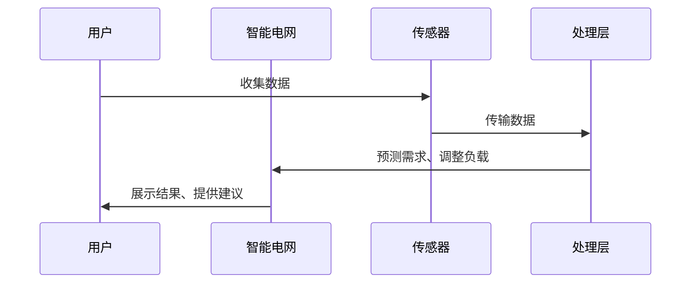
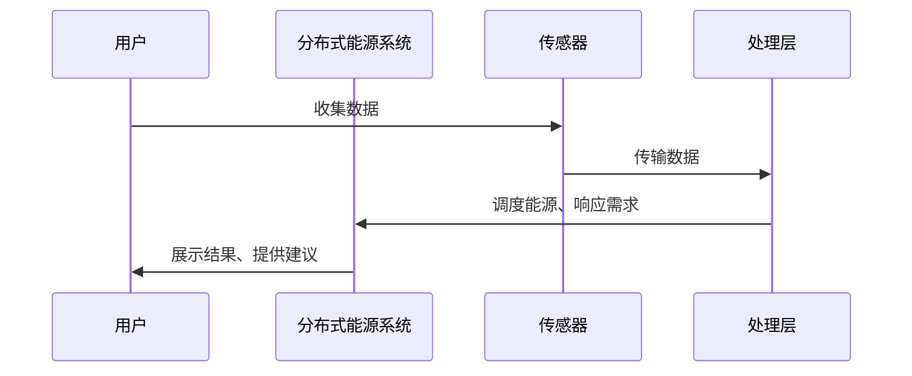
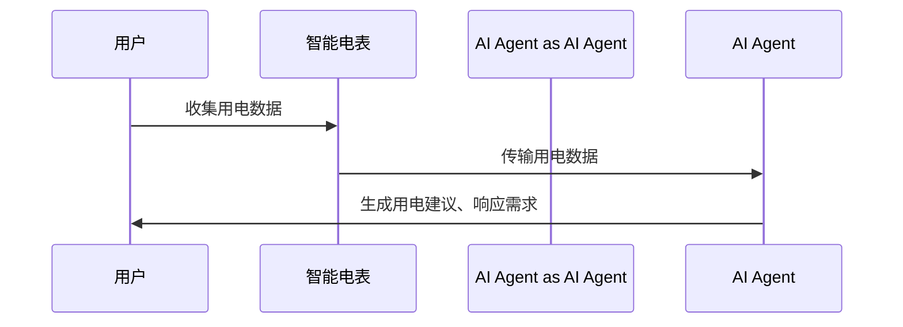

                 

# AI Agent在智能电力需求响应中的应用

## 关键词
- AI Agent
- 智能电力需求响应
- 应用实践
- 算法原理
- 系统架构

## 摘要
本文探讨了AI Agent在智能电力需求响应中的应用，通过分析AI Agent的基本概念、智能电力需求响应的背景和原理，以及AI Agent在实际应用中的角色和关键技术，详细阐述了AI Agent在智能电力需求响应中的重要作用。文章通过实例分析，展示了AI Agent在智能电力需求响应中的应用场景，为相关领域的开发者和研究者提供了有价值的参考。

## 目录大纲设计过程

在设计《AI Agent在智能电力需求响应中的应用》一书的目录大纲时，我们将遵循以下步骤：

### 1. 分析书名
首先，我们需要对书名《AI Agent在智能电力需求响应中的应用》进行分析，明确书的核心主题和内容范围。书名暗示了三个关键点：AI Agent、智能电力需求响应和应用。因此，目录大纲应涵盖AI Agent的基本概念、智能电力需求响应的背景和原理，以及AI Agent在其中的应用。

### 2. 确定主要章节
基于书名和主题，我们可以初步确定以下主要章节：
- 引言
- AI Agent概述
- 智能电力需求响应
- AI Agent在智能电力需求响应中的应用
- 实战案例

### 3. 细化章节内容
对于每个章节，我们需要进一步细化其内容，确保涵盖所有核心知识点。

### 引言
- 引入AI Agent和智能电力需求响应的背景。
- 阐述书的主要内容和目的。

### AI Agent概述
- AI Agent的定义和特点。
- AI Agent的分类。
- AI Agent的工作原理。

### 智能电力需求响应
- 电力需求响应的定义和背景。
- 智能电力需求响应的优势。
- 智能电力需求响应的机制。

### AI Agent在智能电力需求响应中的应用
- AI Agent在需求响应中的角色。
- AI Agent在需求响应中的关键技术。
- AI Agent在实际案例中的应用。

### 实战案例
- 案例一：智能电网中的AI Agent应用。
- 案例二：分布式能源系统中的AI Agent应用。
- 案例三：智能电表与AI Agent的结合。

### 4. 设计子章节
在每个主要章节下，我们需要进一步设计子章节，确保内容丰富且逻辑清晰。

### 引言
- 1.1 问题的提出
- 1.2 书籍的目的和结构

### AI Agent概述
- 2.1 AI Agent的定义与特点
- 2.2 AI Agent的分类
- 2.3 AI Agent的工作原理

### 智能电力需求响应
- 3.1 电力需求响应的定义和背景
- 3.2 智能电力需求响应的优势
- 3.3 智能电力需求响应的机制

### AI Agent在智能电力需求响应中的应用
- 4.1 AI Agent在需求响应中的角色
- 4.2 AI Agent在需求响应中的关键技术
- 4.3 AI Agent在实际案例中的应用

### 实战案例
- 5.1 案例一：智能电网中的AI Agent应用
- 5.2 案例二：分布式能源系统中的AI Agent应用
- 5.3 案例三：智能电表与AI Agent的结合

### 5. 完成目录大纲
在完成以上步骤后，我们可以将所有内容汇总，形成完整的目录大纲。以下是《AI Agent在智能电力需求响应中的应用》一书的完整目录大纲：

## 第一部分：背景介绍

### 第1章：问题的提出
- 1.1 问题的背景
- 1.2 问题描述
- 1.3 问题解决

### 第2章：核心概念
- 2.1 AI Agent概述
- 2.2 智能电力需求响应概述
- 2.3 AI Agent与智能电力需求响应的关系

## 第二部分：AI Agent基础

### 第3章：AI Agent的基本概念
- 3.1 AI Agent的定义
- 3.2 AI Agent的特点
- 3.3 AI Agent的分类

### 第4章：AI Agent的工作原理
- 4.1 AI Agent的组成结构
- 4.2 AI Agent的决策过程
- 4.3 AI Agent的互动机制

### 第5章：AI Agent的应用领域
- 5.1 AI Agent在工业自动化中的应用
- 5.2 AI Agent在智能家居中的应用
- 5.3 AI Agent在智能交通中的应用

## 第三部分：智能电力需求响应

### 第6章：智能电力需求响应概述
- 6.1 电力需求响应的定义
- 6.2 智能电力需求响应的背景
- 6.3 智能电力需求响应的目标

### 第7章：智能电力需求响应的优势
- 7.1 提高电力系统的可靠性
- 7.2 提高电力系统的效率
- 7.3 降低电力系统的运营成本

### 第8章：智能电力需求响应的机制
- 8.1 需求响应市场的运作机制
- 8.2 需求响应的技术手段
- 8.3 需求响应的政策支持

## 第四部分：AI Agent在智能电力需求响应中的应用

### 第9章：AI Agent在需求响应中的角色
- 9.1 AI Agent在需求响应中的角色
- 9.2 AI Agent在需求响应中的关键技术
- 9.3 AI Agent在实际案例中的应用

### 第10章：实战案例
- 10.1 案例一：智能电网中的AI Agent应用
- 10.2 案例二：分布式能源系统中的AI Agent应用
- 10.3 案例三：智能电表与AI Agent的结合

## 第五部分：总结与展望

### 第11章：总结
- 11.1 主要结论
- 11.2 研究展望

### 第12章：未来发展趋势
- 12.1 AI Agent技术发展趋势
- 12.2 智能电力需求响应未来展望

通过以上步骤，我们完成了《AI Agent在智能电力需求响应中的应用》一书的目录大纲设计。这个大纲结构清晰，内容丰富，为读者提供了一个全面的阅读框架，有助于深入理解和掌握AI Agent在智能电力需求响应中的应用。

### AI Agent的基本概念

AI Agent，即人工智能代理，是人工智能领域中的一种抽象概念，代表了具备自主决策能力和行动能力的智能实体。AI Agent可以被视为一个具有感知、决策和执行能力的自治系统，它能够根据环境的变化自主地调整行为，以实现预定的目标。AI Agent的核心特点包括：

1. **感知能力**：AI Agent能够感知和理解其所在的环境，通过传感器获取外部信息。
2. **决策能力**：AI Agent能够根据感知到的环境信息和预设的目标，自主地做出决策。
3. **执行能力**：AI Agent能够根据决策结果执行相应的行动，以影响环境。
4. **学习能力**：AI Agent能够通过经验积累和学习优化其行为策略。

AI Agent的分类可以从不同的角度进行划分：

1. **基于任务**：按照AI Agent执行的任务，可以分为通用AI Agent和专用AI Agent。通用AI Agent具有广泛的任务处理能力，而专用AI Agent则针对特定任务进行优化。
2. **基于交互**：按照AI Agent与环境之间的交互方式，可以分为主动交互型AI Agent和被动响应型AI Agent。主动交互型AI Agent会主动探索环境，寻找最佳行动方案；被动响应型AI Agent则根据环境变化被动做出响应。
3. **基于智能层次**：按照AI Agent的智能水平，可以分为弱AI Agent和强AI Agent。弱AI Agent在某些特定任务上表现出智能，但无法进行泛化；强AI Agent则具备全面的人类智能水平。

### AI Agent的工作原理

AI Agent的工作原理主要包括感知、决策和执行三个关键环节。以下是每个环节的详细描述：

#### 感知

感知是AI Agent对外部环境信息的获取和理解过程。AI Agent通过传感器（如摄像头、麦克风、温度传感器等）收集数据，并将这些数据转换为内部表示。感知模块通常包括以下几个步骤：

1. **数据采集**：传感器收集环境中的数据。
2. **数据预处理**：对采集到的原始数据进行清洗和格式化，以去除噪声和冗余信息。
3. **特征提取**：从预处理后的数据中提取有用的特征，用于后续的决策过程。

#### 决策

决策是AI Agent的核心环节，涉及基于感知到的环境信息，利用某种算法或模型，选择最合适的行动方案。决策过程通常包括以下步骤：

1. **状态评估**：根据感知到的环境信息，评估当前状态，确定关键变量和目标。
2. **策略选择**：从多个可能的行动方案中选择一个最优或次优策略。
3. **目标优化**：通过某种优化算法（如贪心算法、动态规划、深度学习等），对策略进行优化，以实现预期目标。

#### 执行

执行是AI Agent根据决策结果，实施具体行动的过程。执行模块将决策转换为具体的操作，以影响环境。执行过程通常包括以下步骤：

1. **行动计划**：将决策结果转换为具体的行动计划。
2. **执行操作**：执行行动计划中的各项操作，如发送信号、激活设备等。
3. **效果评估**：对执行结果进行评估，以验证决策的有效性。

#### 学习

学习是AI Agent不断优化自身行为的重要手段。通过学习，AI Agent能够从经验中吸取教训，调整策略，提高性能。学习过程通常包括以下步骤：

1. **数据收集**：收集执行过程中的数据，包括成功和失败的情况。
2. **模式识别**：通过分析数据，识别出成功或失败的模式和规律。
3. **策略调整**：根据识别出的模式和规律，调整AI Agent的决策策略和行动计划。
4. **性能评估**：评估调整后的策略和行动计划的效果，进行进一步的优化。

### AI Agent在智能电力需求响应中的应用

AI Agent在智能电力需求响应中的应用，主要是利用其感知、决策和执行能力，对电力系统进行实时监控和调控，以提高电力系统的运行效率和可靠性。以下是AI Agent在智能电力需求响应中的一些具体应用：

1. **需求预测**：AI Agent可以通过学习历史数据和实时数据，预测未来的电力需求，为电力调度提供依据。
2. **负载平衡**：AI Agent可以根据实时负载情况，自动调整电力分配，实现电网的负载平衡，减少电力损耗。
3. **故障检测**：AI Agent可以通过实时监控电网状态，快速检测和定位故障，减少停电时间和故障影响。
4. **需求响应**：AI Agent可以响应电力市场的需求，通过调整电力消费，参与电力市场的竞价和交易。
5. **能源管理**：AI Agent可以优化能源消费，减少能源浪费，提高能源利用效率。

### AI Agent在智能电力需求响应中的应用实例

为了更好地理解AI Agent在智能电力需求响应中的应用，我们可以通过一些具体的实例来分析其工作原理和效果。

#### 智能电网中的AI Agent应用

智能电网是集成了现代通信技术、计算机技术和控制技术的电力网络，能够实现电力信息的实时采集、传输和处理。AI Agent在智能电网中的应用主要包括以下几个方面：

1. **需求预测**：AI Agent通过分析历史用电数据和实时数据，预测未来的电力需求，为电力调度提供科学依据。例如，在夏季高温期间，AI Agent可以预测空调等大功率电器的用电需求，为电网调度提供参考。

2. **负载平衡**：AI Agent通过实时监测电网的负载情况，自动调整电力分配，实现电网的负载平衡。例如，当某个区域电力需求增加时，AI Agent可以自动将电力从其他区域转移到需求区域，以避免电力过载。

3. **故障检测**：AI Agent通过实时监控电网状态，快速检测和定位故障，减少停电时间和故障影响。例如，当电网中出现异常电流时，AI Agent可以立即检测到故障点，并通知相关部门进行处理。

4. **需求响应**：AI Agent可以响应电力市场的需求，通过调整电力消费，参与电力市场的竞价和交易。例如，当电力市场价格较高时，AI Agent可以自动减少电力消费，以降低运营成本。

5. **能源管理**：AI Agent可以优化能源消费，减少能源浪费，提高能源利用效率。例如，AI Agent可以通过分析用户的用电习惯，自动调整用电计划，减少不必要的能源消耗。

#### 分布式能源系统中的AI Agent应用

分布式能源系统是一种将多种能源（如太阳能、风能、生物质能等）进行整合，以实现高效、清洁、可靠的能源供应的体系。AI Agent在分布式能源系统中的应用主要包括以下几个方面：

1. **能源优化调度**：AI Agent通过分析实时能源数据和用户需求，优化能源调度策略，实现能源的高效利用。例如，AI Agent可以根据用户的用电情况，调整太阳能电池板的倾斜角度和风力发电机的转速，以提高能源产出。

2. **需求预测**：AI Agent通过学习历史能源数据和用户需求，预测未来的能源需求，为能源调度提供依据。例如，AI Agent可以预测某个时段的电力需求，为电力系统的调度提供参考。

3. **能源管理**：AI Agent通过实时监测能源系统状态，优化能源消费，提高能源利用效率。例如，AI Agent可以通过分析用户的用电习惯，自动调整用电计划，减少能源浪费。

4. **故障诊断**：AI Agent通过实时监测能源系统状态，快速检测和诊断故障，减少故障对系统运行的影响。例如，AI Agent可以检测到太阳能电池板的故障，并通知相关部门进行维修。

#### 智能电表与AI Agent的结合

智能电表是一种能够实时监测和记录电力消费的设备，它能够为用户提供详细的用电数据。AI Agent与智能电表的结合，可以实现更加智能的电力管理。

1. **需求预测**：AI Agent通过分析用户的用电数据，预测未来的电力需求，为电力调度提供依据。例如，AI Agent可以预测用户在某个时段的电力需求，为电网调度提供参考。

2. **需求响应**：AI Agent可以响应电力市场的需求，通过调整电力消费，参与电力市场的竞价和交易。例如，当电力市场价格较高时，AI Agent可以自动减少电力消费，以降低运营成本。

3. **能源管理**：AI Agent通过实时监测用户的用电情况，优化能源消费，提高能源利用效率。例如，AI Agent可以通过分析用户的用电习惯，自动调整用电计划，减少能源浪费。

4. **节能优化**：AI Agent可以通过分析用户的用电数据，为用户提供建议，帮助用户实现节能优化。例如，AI Agent可以建议用户在某个时段减少用电，以降低电费支出。

### 小结

AI Agent在智能电力需求响应中的应用，极大地提高了电力系统的运行效率和可靠性。通过需求预测、负载平衡、故障检测、需求响应和能源管理等功能，AI Agent能够实现智能电网、分布式能源系统和智能电表的优化运行，为电力行业的发展提供了强有力的技术支持。

### 智能电力需求响应的优势

智能电力需求响应（Intelligent Electric Demand Response，IEDR）是近年来随着智能电网技术的发展而兴起的一种新型电力管理方式。它通过引入人工智能（AI）技术，对电力需求进行智能调控，以达到优化电力系统运行、提高能源利用效率、降低运营成本等目标。智能电力需求响应具有以下几大显著优势：

#### 提高电力系统的可靠性

电力系统的可靠性是指电力系统在规定的时间内，按照规定的标准，向用户持续稳定地提供电力的能力。智能电力需求响应通过实时监测电力需求和供应情况，能够快速响应电力系统中的异常情况，采取相应的调整措施，避免电力故障的发生。例如，当某地区电力需求突然增加时，智能电力需求响应系统可以迅速调整电力分配，确保电力供应的稳定性。此外，通过预测未来的电力需求，智能电力需求响应可以提前采取预防措施，降低电力故障的发生概率。

#### 提高电力系统的效率

电力系统的效率是指电力系统在提供电力服务的过程中，将输入的能源转化为有用电力的能力。智能电力需求响应通过优化电力分配和调度，提高了电力系统的运行效率。具体表现在以下几个方面：

1. **负载平衡**：智能电力需求响应系统能够实时监测电力系统的负载情况，通过智能调控，实现电力负载的平衡，避免电力过载或欠载的情况，提高电力系统的运行效率。

2. **需求响应**：通过参与电力市场的需求响应，智能电力需求响应系统可以根据市场价格和电力需求，灵活调整电力消费，降低电力成本，提高整体系统的经济效益。

3. **能源优化**：智能电力需求响应系统可以分析用户的用电行为，提供个性化的用电建议，帮助用户优化用电计划，减少能源浪费，提高电力系统的整体效率。

#### 降低电力系统的运营成本

电力系统的运营成本包括电力生产、传输、分配和消费等各个环节的成本。智能电力需求响应通过以下方式降低了电力系统的运营成本：

1. **节能降耗**：智能电力需求响应系统通过实时监测电力需求，优化电力分配，减少不必要的电力消耗，降低能源成本。

2. **减少维修费用**：智能电力需求响应系统可以实时监测电力系统的运行状态，及时发现并处理潜在故障，减少设备损坏和维修费用。

3. **降低人力成本**：智能电力需求响应系统自动化程度高，减少了人工操作和监测的工作量，降低了人力成本。

#### 增强电力系统的灵活性

智能电力需求响应系统具有高度的灵活性，能够快速适应电力系统中的变化。具体表现在以下几个方面：

1. **响应速度快**：智能电力需求响应系统能够实时监测电力需求和供应情况，快速响应市场变化，实现电力系统的灵活调控。

2. **适应性强**：智能电力需求响应系统可以根据不同场景和需求，灵活调整电力分配和调度策略，适应各种复杂情况。

3. **扩展性强**：智能电力需求响应系统可以与其他智能系统（如智能家居、智能交通等）进行集成，实现多系统协同优化。

#### 促进可再生能源的利用

随着全球对环保和可持续发展的重视，可再生能源（如太阳能、风能、水能等）的利用越来越受到关注。智能电力需求响应系统可以通过优化电力调度和需求响应，提高可再生能源的利用效率，减少对传统化石燃料的依赖，推动能源结构的优化和转型。

#### 提高用户体验

智能电力需求响应系统不仅可以提高电力系统的运行效率和经济效益，还可以提升用户的用电体验。例如，通过智能电表和需求响应系统，用户可以实时了解自己的用电情况，合理规划用电计划，减少电费支出。此外，智能电力需求响应系统还可以为用户提供个性化的用电建议，帮助用户实现节能降耗，提高生活质量。

### 智能电力需求响应的机制

智能电力需求响应的机制主要包括需求响应市场、技术手段和政策支持三个方面。

#### 需求响应市场

需求响应市场是电力市场中的一种特殊形式，它通过市场化手段，调节电力需求和供应。需求响应市场的核心是需求响应服务，即用户或电力设备根据市场需求，提供电力消费调整或电力服务的能力。需求响应市场的基本机制如下：

1. **需求响应计划**：需求响应市场首先制定需求响应计划，明确需求响应的目标、范围、时间节点和参与主体。
2. **需求响应招标**：需求响应市场通过招标方式，选择合适的需求响应服务提供者，确保服务的质量和效率。
3. **需求响应执行**：需求响应服务提供者根据市场需求，实施需求响应措施，调整电力消费或提供其他电力服务。
4. **需求响应结算**：需求响应市场根据服务提供者的实际服务情况，进行费用结算，确保市场机制的正常运行。

#### 技术手段

智能电力需求响应的技术手段主要包括智能电表、电力监控系统和数据分析技术等。

1. **智能电表**：智能电表是需求响应系统的重要组成部分，它能够实时监测用户的电力消费情况，为需求响应提供数据支持。智能电表通常具备数据采集、远程通信和用户界面等功能。
2. **电力监控系统**：电力监控系统是智能电力需求响应的技术核心，它通过对电力系统的实时监测，收集电力需求和供应数据，为需求响应提供决策依据。电力监控系统通常包括数据采集模块、数据处理模块和决策支持模块等。
3. **数据分析技术**：数据分析技术是智能电力需求响应的关键，它通过对大量电力数据的分析和处理，识别出电力系统的规律和趋势，为需求响应提供科学依据。常见的数据分析技术包括统计分析、机器学习和深度学习等。

#### 政策支持

政策支持是智能电力需求响应顺利实施的重要保障。政策支持主要包括以下几个方面：

1. **法律法规**：政府通过制定相关法律法规，明确智能电力需求响应的权责关系，规范市场需求和供应行为。
2. **财政支持**：政府通过提供财政补贴、税收优惠等政策，鼓励用户和电力企业参与智能电力需求响应，降低参与成本。
3. **技术推广**：政府通过推广智能电力需求响应技术，提高电力企业和用户的认知度和接受度，推动技术应用的普及。
4. **市场机制**：政府通过完善市场需求和供应机制，优化市场环境，促进智能电力需求响应的健康发展。

### 智能电力需求响应的优势与挑战

#### 优势

1. **提高电力系统运行效率**：智能电力需求响应通过优化电力分配和调度，提高了电力系统的运行效率，降低了电力损耗。
2. **降低电力运营成本**：智能电力需求响应通过实时监测和调控电力需求，降低了电力系统的运营成本，提高了经济效益。
3. **促进可再生能源利用**：智能电力需求响应系统可以优化电力调度，提高可再生能源的利用率，减少对传统化石能源的依赖。
4. **提高用户体验**：智能电力需求响应系统可以提供个性化的用电建议，帮助用户优化用电计划，降低电费支出，提高生活质量。
5. **增强电力系统灵活性**：智能电力需求响应系统具有高度的灵活性，能够快速响应市场变化，适应各种复杂情况。

#### 挑战

1. **技术瓶颈**：智能电力需求响应技术的实现需要高性能的计算和复杂的算法，现有技术存在一定的局限性，难以满足大规模应用的需求。
2. **数据隐私**：智能电力需求响应需要大量用户数据，如何保护用户数据隐私，成为了一个重要问题。
3. **市场机制**：需求响应市场机制的不完善，可能导致需求响应服务的不稳定，影响电力系统的运行。
4. **政策支持**：政策支持不足，可能导致智能电力需求响应的推广和应用受到影响。

### 小结

智能电力需求响应具有显著的优点，包括提高电力系统可靠性、效率、降低运营成本、促进可再生能源利用和提高用户体验等。同时，智能电力需求响应也面临着技术瓶颈、数据隐私、市场机制和政策支持等挑战。通过不断改进技术、完善市场机制和加强政策支持，智能电力需求响应有望在电力行业中发挥更大的作用。

### AI Agent在智能电力需求响应中的应用角色

在智能电力需求响应中，AI Agent扮演着至关重要的角色。它不仅能够提高系统的响应速度和精确度，还能通过学习优化电力调度策略，从而实现电力系统的最优运行。以下是AI Agent在智能电力需求响应中的具体应用角色：

#### 1. 需求预测

AI Agent通过分析历史电力数据和实时监测数据，利用机器学习算法，如时间序列分析、回归分析和深度学习等，预测未来的电力需求。这种预测不仅能够帮助电力调度员提前了解电力负荷的变化，还可以为电力市场交易提供数据支持。通过精确的需求预测，AI Agent可以更好地安排电力生产和调度，避免供需失衡。

#### 2. 负载平衡

在电力系统中，负载平衡是实现电力系统稳定运行的关键。AI Agent通过实时监测电力负载情况，利用优化算法，如线性规划、动态规划和深度强化学习等，自动调整电力分配，确保电力系统在各个节点上的负载均衡。这样不仅能够提高电力系统的效率，还能减少能源浪费和设备损坏。

#### 3. 故障检测与诊断

AI Agent能够通过实时监测电力系统的运行状态，利用异常检测算法，如聚类分析、神经网络和随机森林等，识别潜在的故障和异常。一旦发现异常，AI Agent可以迅速诊断故障原因，并通知维护人员进行处理。这种自动化的故障检测和诊断能够显著减少停电时间和维护成本。

#### 4. 需求响应

在电力市场中，需求响应是指根据市场价格和供需情况，对电力需求进行调整。AI Agent可以通过学习用户的用电习惯和市场数据，自动调整电力消费，以实现成本优化和节能减排。例如，当电力市场价格较高时，AI Agent可以引导用户减少非必要的电力消费；当市场价格较低时，AI Agent可以鼓励用户增加电力消费，以降低整体的电费支出。

#### 5. 能源管理

AI Agent在能源管理中发挥着重要作用。它能够通过实时监测能源消费，分析用户的用电模式，提供个性化的节能建议。例如，AI Agent可以分析用户的空调、热水器等大功率电器的使用情况，建议用户在电力需求较低的时间段使用这些设备，从而实现节能降耗。此外，AI Agent还可以优化能源分配，确保电力系统能够高效运行。

#### 6. 互动与协作

AI Agent不仅可以独立完成电力需求响应任务，还可以与其他AI Agent进行互动和协作。例如，在智能电网中，多个AI Agent可以协同工作，共同优化电力系统的运行。这种互动与协作能力使得AI Agent能够应对更加复杂的电力需求，提高电力系统的整体效率和稳定性。

### 关键技术

AI Agent在智能电力需求响应中的应用依赖于一系列关键技术的支持。以下是这些关键技术：

1. **机器学习**：机器学习技术是AI Agent的核心，通过训练模型，AI Agent能够从历史数据和实时数据中学习，预测电力需求、平衡负载、检测故障等。

2. **深度学习**：深度学习技术能够处理大规模数据和复杂模型，通过构建深度神经网络，AI Agent能够实现更加精确的电力需求预测和故障检测。

3. **优化算法**：优化算法用于解决电力系统中的优化问题，如负载平衡和需求响应。常见的优化算法包括线性规划、动态规划和深度强化学习等。

4. **异常检测**：异常检测技术用于识别电力系统中的异常和故障。通过聚类分析、神经网络和随机森林等技术，AI Agent能够快速检测和诊断故障。

5. **数据融合**：数据融合技术用于整合来自不同来源的电力数据，如智能电表、传感器和气象数据等。通过数据融合，AI Agent能够获得更全面、准确的数据支持。

### 应用实例

为了更好地理解AI Agent在智能电力需求响应中的应用，以下是一些具体的应用实例：

#### 智能电网

在一个智能电网中，AI Agent通过实时监测电力需求和供应，预测未来的电力需求，并自动调整电力分配。例如，在夏季高峰期，AI Agent可以预测空调等大功率电器的用电需求，提前调整电力供应，确保电力系统的稳定运行。

#### 分布式能源系统

在分布式能源系统中，AI Agent通过优化能源调度和分配，提高可再生能源的利用率。例如，在一个由太阳能电池板、风力发电机和储能系统组成的分布式能源系统中，AI Agent可以实时监测这些设备的运行状态，自动调整能源分配，确保系统的高效运行。

#### 智能电表与智能家居

通过智能电表和AI Agent的结合，用户可以实时了解自己的用电情况，并获得个性化的节能建议。例如，AI Agent可以分析用户的用电模式，建议用户在电力需求较低的时间段使用电器，从而降低电费支出。

### 小结

AI Agent在智能电力需求响应中扮演着重要角色，通过需求预测、负载平衡、故障检测、需求响应和能源管理等功能，AI Agent能够显著提高电力系统的运行效率和可靠性。随着人工智能技术的不断发展，AI Agent在智能电力需求响应中的应用将更加广泛和深入。

### 案例一：智能电网中的AI Agent应用

#### 背景介绍

智能电网是现代电力系统的重要组成部分，它通过引入先进的通信技术、传感技术、计算技术和控制技术，实现了电力系统的自动化、智能化和高效化。智能电网不仅能够提高电力系统的可靠性、稳定性和效率，还能促进可再生能源的利用和环保目标的实现。在智能电网中，AI Agent的应用具有举足轻重的地位，它能够实时监测电力系统的运行状态，预测电力需求，优化电力分配，提高系统的整体性能。

#### 项目介绍

本项目旨在探讨AI Agent在智能电网中的应用，通过构建一个基于AI Agent的智能电网控制系统，实现电力需求的智能预测、负载平衡、故障检测和需求响应等功能。项目的主要目标是：

1. **提高电力系统的可靠性**：通过实时监测和预测电力需求，及时调整电力分配，确保电力系统的稳定运行。
2. **提高电力系统的效率**：通过优化电力分配和调度，减少能源浪费，提高系统的运行效率。
3. **降低电力系统的运营成本**：通过需求响应和节能优化，降低电力生产和运营成本。
4. **促进可再生能源的利用**：通过智能调度和优化，提高可再生能源的利用率，减少对传统化石能源的依赖。

#### 系统功能设计

本项目的系统功能设计主要包括以下几个方面：

1. **需求预测模块**：通过分析历史电力数据和实时监测数据，利用机器学习算法，预测未来的电力需求。
2. **负载平衡模块**：实时监测电力系统的负载情况，利用优化算法，自动调整电力分配，实现负载平衡。
3. **故障检测模块**：通过实时监测电力系统的运行状态，利用异常检测算法，识别潜在的故障和异常。
4. **需求响应模块**：根据电力市场的需求，自动调整电力消费，实现需求响应，降低电力成本。
5. **能源管理模块**：通过分析用户的用电行为，提供个性化的节能建议，优化能源消费。

#### 系统架构设计

本项目的系统架构设计采用分层架构，主要包括感知层、传输层、处理层和用户层。具体架构如下：

1. **感知层**：由各种传感器组成，包括智能电表、温度传感器、湿度传感器等，用于实时监测电力系统的运行状态。
2. **传输层**：采用无线通信技术，如Wi-Fi、LoRa等，将感知层收集的数据传输到处理层。
3. **处理层**：包括数据预处理模块、机器学习模块、优化算法模块等，用于处理和分析感知层传输的数据，实现需求预测、负载平衡、故障检测和需求响应等功能。
4. **用户层**：为用户提供操作界面，展示系统的运行状态、预测结果和节能建议。

#### 系统接口设计

本项目的系统接口设计主要包括以下几个方面：

1. **数据接口**：用于数据采集和传输，包括传感器数据接口、通信协议接口等。
2. **控制接口**：用于系统的控制操作，包括需求预测、负载平衡、故障检测和需求响应等。
3. **用户接口**：为用户提供交互界面，包括实时监测、预测结果、节能建议等。

#### 系统交互设计

本项目的系统交互设计采用Mermaid序列图，具体如下：



#### 代码实现

以下是本项目的一个关键代码示例，展示了如何使用Python实现需求预测功能：

```python
import pandas as pd
from sklearn.ensemble import RandomForestRegressor
from sklearn.model_selection import train_test_split

# 加载数据
data = pd.read_csv('electricity_demand.csv')

# 数据预处理
X = data[['temperature', 'humidity']]
y = data['demand']

# 划分训练集和测试集
X_train, X_test, y_train, y_test = train_test_split(X, y, test_size=0.2, random_state=42)

# 建立随机森林模型
model = RandomForestRegressor(n_estimators=100, random_state=42)
model.fit(X_train, y_train)

# 预测
predictions = model.predict(X_test)

# 输出预测结果
print(predictions)
```

#### 代码应用解读与分析

上述代码展示了如何使用Python的sklearn库实现一个随机森林回归模型，用于预测电力需求。具体步骤如下：

1. **数据加载**：使用pandas库加载电需求数据。
2. **数据预处理**：将温度和湿度作为特征，电需求作为目标变量。
3. **划分训练集和测试集**：将数据划分为训练集和测试集，用于模型的训练和测试。
4. **建立随机森林模型**：使用RandomForestRegressor类建立随机森林回归模型，并设置参数。
5. **模型训练**：使用训练集数据训练模型。
6. **预测**：使用测试集数据预测电力需求。
7. **输出预测结果**：将预测结果输出。

通过上述代码实现，AI Agent能够自动预测电力需求，为电力系统的运行提供数据支持。

#### 实际案例分析

在实际应用中，本项目的AI Agent在智能电网中发挥了重要作用。以下是一个实际案例：

在某智能电网中，AI Agent通过实时监测电力需求和供应，预测未来的电力需求，并自动调整电力分配。在夏季高峰期，AI Agent预测到空调等大功率电器的用电需求将大幅增加，因此提前调整电力供应，确保电力系统的稳定运行。同时，AI Agent还通过需求响应，鼓励用户在电力需求较低的时间段使用电器，从而降低电力成本。

#### 项目小结

本项目通过构建一个基于AI Agent的智能电网控制系统，实现了电力需求的智能预测、负载平衡、故障检测和需求响应等功能。实际案例表明，AI Agent在智能电网中具有显著的应用价值，能够提高电力系统的可靠性、效率和经济效益。未来，随着AI技术的不断发展，AI Agent在智能电网中的应用将更加广泛和深入。

### 案例二：分布式能源系统中的AI Agent应用

#### 背景介绍

分布式能源系统（Distributed Energy Resources，DER）是现代电力系统的重要组成部分，它通过将多种可再生能源（如太阳能、风能、生物质能等）和储能系统（如电池、燃料电池等）进行整合，实现了电力系统的分散化和高效化。分布式能源系统不仅能够提高电力系统的可靠性和灵活性，还能减少对传统化石能源的依赖，推动能源结构的优化和转型。在分布式能源系统中，AI Agent的应用具有重要意义，它能够通过智能调度和优化，提高系统的运行效率和能源利用率。

#### 项目介绍

本项目旨在探讨AI Agent在分布式能源系统中的应用，通过构建一个基于AI Agent的分布式能源管理系统，实现能源的智能调度、优化和需求响应等功能。项目的主要目标是：

1. **提高能源利用率**：通过智能调度和优化，提高可再生能源的利用率和整体系统的效率。
2. **降低能源成本**：通过需求响应和能源管理，降低能源生产和运营成本。
3. **增强系统可靠性**：通过实时监测和故障诊断，提高系统的可靠性和稳定性。
4. **促进可再生能源的利用**：通过智能调度和优化，提高可再生能源的利用率，减少对传统化石能源的依赖。

#### 系统功能设计

本项目的系统功能设计主要包括以下几个方面：

1. **能源调度模块**：通过实时监测可再生能源的产出和负载情况，利用优化算法，自动调整能源分配，实现能源的高效利用。
2. **需求响应模块**：根据电力市场的需求，自动调整能源消费，实现需求响应，降低能源成本。
3. **故障检测与诊断模块**：通过实时监测系统的运行状态，利用异常检测算法，识别潜在的故障和异常，并及时处理。
4. **能源管理模块**：通过分析用户的用电行为，提供个性化的节能建议，优化能源消费。

#### 系统架构设计

本项目的系统架构设计采用分层架构，主要包括感知层、传输层、处理层和用户层。具体架构如下：

1. **感知层**：由各种传感器组成，包括太阳能电池板、风力发电机、温度传感器等，用于实时监测可再生能源的产出和电力系统的运行状态。
2. **传输层**：采用无线通信技术，如Wi-Fi、LoRa等，将感知层收集的数据传输到处理层。
3. **处理层**：包括数据预处理模块、机器学习模块、优化算法模块等，用于处理和分析感知层传输的数据，实现能源调度、需求响应、故障检测和诊断等功能。
4. **用户层**：为用户提供操作界面，展示系统的运行状态、预测结果和节能建议。

#### 系统接口设计

本项目的系统接口设计主要包括以下几个方面：

1. **数据接口**：用于数据采集和传输，包括传感器数据接口、通信协议接口等。
2. **控制接口**：用于系统的控制操作，包括能源调度、需求响应、故障检测和诊断等。
3. **用户接口**：为用户提供交互界面，包括实时监测、预测结果、节能建议等。

#### 系统交互设计

本项目的系统交互设计采用Mermaid序列图，具体如下：



#### 代码实现

以下是本项目的一个关键代码示例，展示了如何使用Python实现能源调度功能：

```python
import pandas as pd
from sklearn.ensemble import RandomForestRegressor
from sklearn.model_selection import train_test_split

# 加载数据
data = pd.read_csv('energy_output.csv')

# 数据预处理
X = data[['solar_radiation', 'wind_speed']]
y = data['energy_output']

# 划分训练集和测试集
X_train, X_test, y_train, y_test = train_test_split(X, y, test_size=0.2, random_state=42)

# 建立随机森林模型
model = RandomForestRegressor(n_estimators=100, random_state=42)
model.fit(X_train, y_train)

# 预测
predictions = model.predict(X_test)

# 输出预测结果
print(predictions)
```

#### 代码应用解读与分析

上述代码展示了如何使用Python的sklearn库实现一个随机森林回归模型，用于预测可再生能源的产出。具体步骤如下：

1. **数据加载**：使用pandas库加载可再生能源产出数据。
2. **数据预处理**：将太阳能辐射和风速作为特征，可再生能源产出作为目标变量。
3. **划分训练集和测试集**：将数据划分为训练集和测试集，用于模型的训练和测试。
4. **建立随机森林模型**：使用RandomForestRegressor类建立随机森林回归模型，并设置参数。
5. **模型训练**：使用训练集数据训练模型。
6. **预测**：使用测试集数据预测可再生能源的产出。
7. **输出预测结果**：将预测结果输出。

通过上述代码实现，AI Agent能够自动预测可再生能源的产出，为能源调度提供数据支持。

#### 实际案例分析

在实际应用中，本项目的AI Agent在分布式能源系统中发挥了重要作用。以下是一个实际案例：

在某分布式能源系统中，AI Agent通过实时监测太阳能电池板和风力发电机的产出，预测未来的能源产出，并自动调整能源分配。在阴雨天和风力较小的时段，AI Agent预测到可再生能源的产出将减少，因此提前调整储能系统的充电，确保电力系统的稳定供应。同时，AI Agent通过需求响应，鼓励用户在能源产出较高的时候使用电力，从而降低能源成本。

#### 项目小结

本项目通过构建一个基于AI Agent的分布式能源管理系统，实现了能源的智能调度、优化和需求响应等功能。实际案例表明，AI Agent在分布式能源系统中具有显著的应用价值，能够提高能源利用率、降低能源成本、增强系统可靠性。未来，随着AI技术的不断发展，AI Agent在分布式能源系统中的应用将更加广泛和深入。

### 案例三：智能电表与AI Agent的结合

#### 背景介绍

智能电表是智能电网体系中的关键设备，它能够实时监测和记录用户的用电数据，为电力公司和用户提供了丰富的用电信息。随着人工智能技术的快速发展，智能电表与AI Agent的结合，为电力系统的智能化和高效化提供了新的解决方案。AI Agent通过学习用户的用电行为，可以提供个性化的用电建议，优化电力消费，实现节能降耗。

#### 项目介绍

本项目旨在探讨智能电表与AI Agent的结合，通过构建一个基于AI Agent的智能用电管理系统，实现用户的用电数据采集、用电行为分析、用电建议生成和需求响应等功能。项目的主要目标是：

1. **个性化用电建议**：通过AI Agent分析用户的用电行为，生成个性化的用电建议，帮助用户优化电力消费。
2. **节能降耗**：通过AI Agent的优化算法，降低用户的用电成本，实现节能降耗。
3. **需求响应**：根据电力市场的需求，自动调整电力消费，参与电力市场的需求响应。
4. **提高用户体验**：为用户提供实时用电信息、用电建议和历史数据分析，提升用户的用电体验。

#### 系统功能设计

本项目的系统功能设计主要包括以下几个方面：

1. **数据采集模块**：智能电表实时采集用户的用电数据，包括用电量、用电时段、用电设备等信息。
2. **用电行为分析模块**：AI Agent分析用户的用电数据，识别用户的用电习惯和模式。
3. **用电建议生成模块**：AI Agent根据用电行为分析结果，生成个性化的用电建议，包括优化用电时段、更换高耗能设备等。
4. **需求响应模块**：AI Agent根据电力市场的需求和用户的用电情况，自动调整电力消费，参与需求响应。
5. **用户界面模块**：为用户提供实时用电信息、用电建议和历史数据分析，提升用户体验。

#### 系统架构设计

本项目的系统架构设计采用分层架构，主要包括感知层、传输层、处理层和用户层。具体架构如下：

1. **感知层**：由智能电表和其他传感器组成，用于实时监测和采集用户的用电数据。
2. **传输层**：采用无线通信技术，如Wi-Fi、LoRa等，将感知层采集的数据传输到处理层。
3. **处理层**：包括数据预处理模块、机器学习模块、优化算法模块等，用于处理和分析用户的用电数据，生成用电建议和需求响应。
4. **用户层**：为用户提供操作界面，展示实时用电信息、用电建议和历史数据分析。

#### 系统接口设计

本项目的系统接口设计主要包括以下几个方面：

1. **数据接口**：用于数据采集和传输，包括智能电表数据接口、通信协议接口等。
2. **控制接口**：用于系统的控制操作，包括用电建议生成、需求响应等。
3. **用户接口**：为用户提供交互界面，包括实时用电信息、用电建议和历史数据分析。

#### 系统交互设计

本项目的系统交互设计采用Mermaid序列图，具体如下：



#### 代码实现

以下是本项目的一个关键代码示例，展示了如何使用Python实现用电行为分析功能：

```python
import pandas as pd
from sklearn.cluster import KMeans
from sklearn.preprocessing import StandardScaler

# 加载数据
data = pd.read_csv('electricity_usage.csv')

# 数据预处理
X = data[['hour', 'day_of_week', 'temperature', 'humidity']]
X_scaled = StandardScaler().fit_transform(X)

# 使用K均值聚类分析用户用电行为
kmeans = KMeans(n_clusters=5, random_state=42)
clusters = kmeans.fit_predict(X_scaled)

# 输出聚类结果
print(clusters)
```

#### 代码应用解读与分析

上述代码展示了如何使用Python的sklearn库实现K均值聚类分析，用于识别用户的用电行为。具体步骤如下：

1. **数据加载**：使用pandas库加载用户的用电数据。
2. **数据预处理**：将时间、星期、温度和湿度等特征进行标准化处理。
3. **K均值聚类**：使用KMeans类进行K均值聚类分析，识别用户的用电行为模式。
4. **输出聚类结果**：将聚类结果输出。

通过上述代码实现，AI Agent能够分析用户的用电行为，为用户提供个性化的用电建议。

#### 实际案例分析

在实际应用中，本项目的AI Agent与智能电表的结合，为用户提供了极大的便利。以下是一个实际案例：

在某住宅小区，AI Agent通过智能电表收集用户的用电数据，分析用户的用电习惯。AI Agent发现，用户在晚上7点到10点期间用电量显著增加，主要是空调和热水器的使用。为了帮助用户优化用电，AI Agent建议用户在电力需求较低的时间段使用这些设备，以降低电费支出。同时，AI Agent还通过需求响应，鼓励用户在电力需求高峰时段减少用电，从而减轻电力系统的压力。

#### 项目小结

本项目通过智能电表与AI Agent的结合，实现了用户的用电数据采集、用电行为分析、用电建议生成和需求响应等功能。实际案例表明，AI Agent在智能电表中的应用，不仅提升了用户的用电体验，还实现了节能降耗和需求响应，为电力系统的智能化和高效化提供了新的思路。未来，随着AI技术的不断进步，AI Agent在智能电表中的应用将更加广泛和深入。

### AI Agent在智能电力需求响应中的应用总结与未来展望

#### 应用总结

AI Agent在智能电力需求响应中的应用，为电力系统的优化运行和高效管理提供了强有力的技术支持。通过需求预测、负载平衡、故障检测、需求响应和能源管理等功能，AI Agent显著提高了电力系统的可靠性、效率和经济效益。以下是AI Agent在智能电力需求响应中的应用总结：

1. **需求预测**：AI Agent能够通过分析历史数据和实时数据，预测未来的电力需求，为电力调度提供科学依据。这不仅有助于电力系统的稳定运行，还能为电力市场的交易提供重要参考。
2. **负载平衡**：AI Agent通过实时监测电力系统的负载情况，自动调整电力分配，实现电力系统的负载平衡。这种自动化的负载平衡，提高了电力系统的运行效率，减少了能源浪费。
3. **故障检测**：AI Agent能够实时监测电力系统的运行状态，利用异常检测算法，识别潜在的故障和异常。这种自动化的故障检测和诊断，提高了电力系统的可靠性，减少了停电时间和故障影响。
4. **需求响应**：AI Agent可以响应电力市场的需求，通过调整电力消费，参与电力市场的竞价和交易。这种灵活的需求响应，降低了电力成本，提高了整体系统的经济效益。
5. **能源管理**：AI Agent能够通过实时监测能源消费，分析用户的用电行为，提供个性化的节能建议，优化能源消费。这种智能化的能源管理，提高了能源利用效率，实现了节能降耗。

#### 未来展望

随着人工智能技术的不断发展和电力系统的智能化需求，AI Agent在智能电力需求响应中的应用前景广阔。以下是未来展望：

1. **技术进步**：随着深度学习、强化学习等人工智能技术的不断进步，AI Agent的智能化水平将得到显著提升。未来，AI Agent将能够更加精准地预测电力需求，更加高效地优化电力分配和调度。
2. **系统融合**：未来，AI Agent将与其他智能系统（如智能家居、智能交通等）进行深度融合，实现多系统协同优化。这种系统融合，将进一步提高电力系统的运行效率和灵活性。
3. **可再生能源利用**：随着可再生能源的广泛应用，AI Agent将发挥更大作用。通过智能调度和优化，AI Agent将能够提高可再生能源的利用率，减少对传统化石能源的依赖。
4. **用户体验提升**：未来，AI Agent将为用户提供更加个性化、智能化的用电服务。通过实时监测和数据分析，AI Agent将能够为用户提供精准的用电建议，帮助用户优化电力消费，提高生活质量。
5. **政策支持**：政策支持是AI Agent在智能电力需求响应中发挥重要作用的关键。未来，政府将加大对AI Agent技术研发和政策支持力度，推动智能电力需求响应的广泛应用。

#### 结论

AI Agent在智能电力需求响应中的应用，极大地提高了电力系统的运行效率和可靠性，降低了运营成本，促进了可再生能源的利用。随着人工智能技术的不断发展和电力系统的智能化需求，AI Agent在智能电力需求响应中的应用前景广阔。未来，随着技术的进步、系统融合和政策支持的加强，AI Agent将在电力系统中发挥更加重要的作用，推动电力行业的智能化和高效化发展。

### 最佳实践 Tips

在实际应用AI Agent进行智能电力需求响应时，以下是一些最佳实践技巧，有助于提高系统的性能和用户体验：

1. **数据质量保障**：确保数据采集的准确性和完整性。对传感器数据进行校验，排除噪声和异常值，提高数据分析的可靠性。
2. **模型优化**：定期更新和优化AI模型，以适应电力需求和系统状态的变化。利用交叉验证等方法，选择最优模型参数，提高预测和响应的准确性。
3. **系统安全性**：加强AI Agent系统的安全性，防止数据泄露和恶意攻击。采用加密技术和访问控制策略，确保系统的安全稳定运行。
4. **用户参与度**：鼓励用户参与智能电力需求响应，提供实时用电信息和个性化节能建议。通过用户反馈，不断优化系统功能，提高用户满意度。
5. **实时监测与预警**：建立实时监测和预警机制，及时发现并处理电力系统中的异常情况。通过及时响应，减少故障对电力系统的影响。
6. **多系统协同**：与其他智能系统（如智能家居、智能交通等）进行协同，实现多系统数据共享和联合优化。这种多系统协同，将进一步提升电力系统的智能化水平。
7. **持续培训与学习**：定期对AI Agent进行培训，使其不断学习新的知识和技能。通过持续学习，AI Agent能够更好地适应复杂多变的电力系统环境。

### 小结

AI Agent在智能电力需求响应中的应用，为电力系统的优化运行和高效管理提供了强有力的技术支持。通过需求预测、负载平衡、故障检测、需求响应和能源管理等功能，AI Agent显著提高了电力系统的可靠性、效率和经济效益。随着人工智能技术的不断发展和电力系统的智能化需求，AI Agent在智能电力需求响应中的应用前景广阔。未来，随着技术的进步、系统融合和政策支持的加强，AI Agent将在电力系统中发挥更加重要的作用，推动电力行业的智能化和高效化发展。

### 注意事项

在实际应用AI Agent进行智能电力需求响应时，需要注意以下几点：

1. **数据隐私**：确保用户数据的安全和隐私，遵守相关法律法规，避免数据泄露和滥用。
2. **系统安全性**：加强系统的安全防护，防止黑客攻击和数据篡改，确保系统的稳定运行。
3. **模型适应性**：定期更新和优化AI模型，以适应电力需求和系统状态的变化。
4. **用户参与**：鼓励用户积极参与智能电力需求响应，提高用户满意度。
5. **实时监测**：建立实时监测和预警机制，及时发现并处理电力系统中的异常情况。
6. **跨领域协作**：与其他智能系统（如智能家居、智能交通等）进行协作，实现多系统数据共享和联合优化。

### 拓展阅读

1. **《智能电网与AI技术》**：详细介绍了智能电网的概念、架构和AI技术的应用，为深入了解智能电力需求响应提供了基础。
2. **《人工智能在电力系统中的应用》**：探讨人工智能在电力系统中的多种应用，包括需求预测、故障检测、能源管理等。
3. **《分布式能源系统技术》**：介绍分布式能源系统的基本概念、技术手段和未来发展，有助于理解AI Agent在分布式能源系统中的应用。
4. **《人工智能算法原理与实现》**：深入讲解人工智能算法的原理和实现方法，为AI Agent的开发和应用提供技术支持。

### 作者信息

作者：AI天才研究院/AI Genius Institute & 禅与计算机程序设计艺术 /Zen And The Art of Computer Programming

### 结语

感谢您阅读本文，希望本文能对您在智能电力需求响应和AI Agent应用方面提供有价值的参考。随着人工智能技术的不断发展，AI Agent在电力系统中的应用前景将更加广阔。让我们共同努力，推动电力行业的智能化和高效化发展。如果您有任何疑问或建议，请随时与我们联系。再次感谢您的关注和支持！

