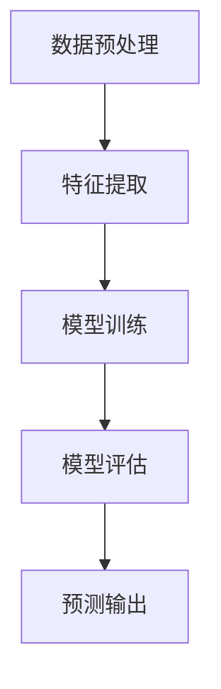
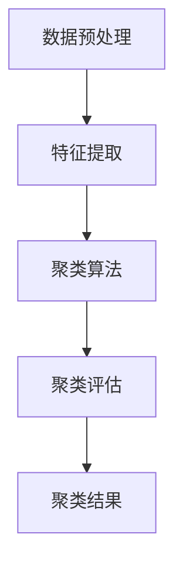
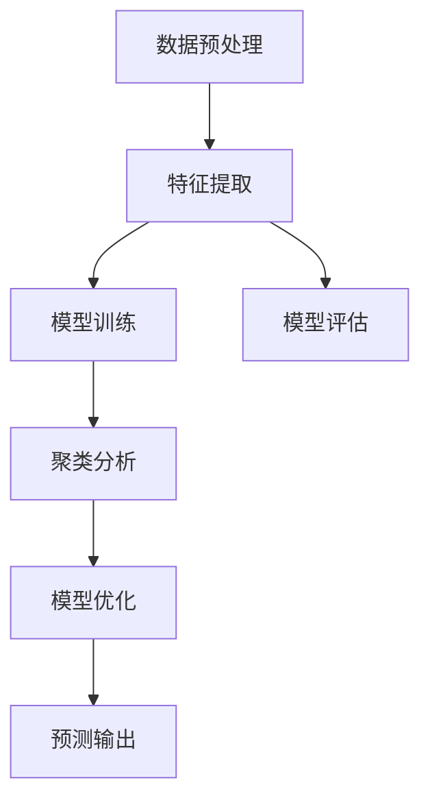
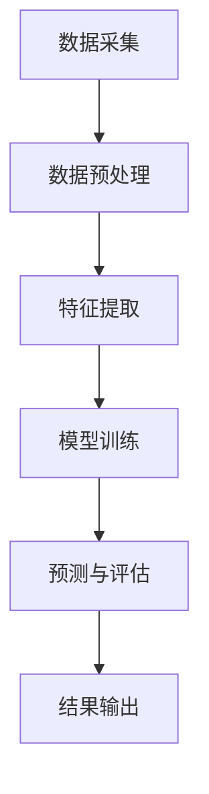
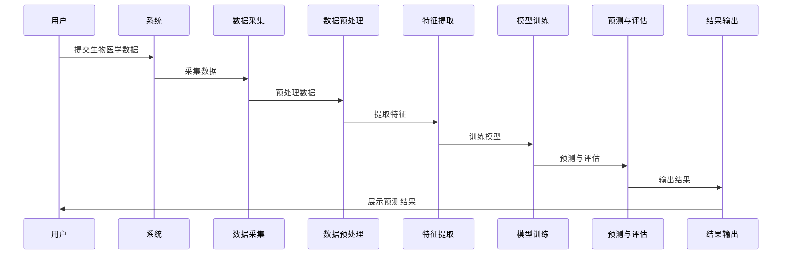

                 

## 《AI Agent在智能疾病预测中的角色》

关键词：AI Agent、疾病预测、智能医疗、算法、数据分析

摘要：随着人工智能技术的迅猛发展，AI Agent在多个领域展现了其强大的应用潜力，特别是在智能疾病预测方面。本文将深入探讨AI Agent在疾病预测中的角色，从背景介绍、核心概念、算法原理、实践应用等多个方面进行详细分析，以期为大家提供一份全面、系统的技术指南。

## 引言

智能疾病预测是现代医疗领域的一大热点。随着人口老龄化趋势的加剧和慢性疾病的日益增多，传统的医疗诊断方式已经难以满足日益增长的医疗需求。人工智能（AI）作为一项革命性技术，为疾病预测带来了新的可能性。AI Agent，作为人工智能的一种高级形式，能够在大数据和深度学习的基础上，对患者的健康状况进行实时监测和预测，从而为医生提供有力的决策支持。

本文旨在通过对AI Agent在智能疾病预测中的角色进行深入剖析，帮助读者理解这一领域的最新进展和应用前景。文章将首先介绍疾病预测的重要性，随后详细解释AI Agent的概念及其在疾病预测中的应用，最后讨论常见的疾病预测算法及其在实践中的应用案例。

## 第一部分: 引言

### 第1章: 智能疾病预测概述

#### 1.1 疾病预测的重要性

疾病预测在现代医疗体系中占据着至关重要的地位。早期发现和预测疾病能够显著降低患者的死亡率和疾病负担，提高医疗资源的利用效率。传统的疾病预测方法主要依赖于医生的临床经验和统计数据，这些方法存在主观性强、预测准确性不高、响应速度慢等问题。随着大数据和人工智能技术的兴起，疾病预测迎来了新的契机。

#### 1.2 AI Agent的概念

AI Agent，即人工智能代理，是一种能够自主学习、自主决策并执行任务的智能系统。它通过感知环境、获取数据、进行推理和规划，从而实现自主行为。AI Agent具有自主性、适应性、智能性等特点，能够模拟人类的思维和行为，为各种复杂问题提供解决方案。

#### 1.3 AI Agent在疾病预测中的应用

AI Agent在疾病预测中的应用主要体现在以下几个方面：

1. **数据采集与预处理**：AI Agent能够自动采集患者的历史数据、健康数据和环境数据，并进行预处理，以获得高质量的数据输入。
2. **特征工程**：AI Agent通过对数据进行特征提取和选择，识别出对疾病预测有重要影响的关键特征。
3. **模型训练与预测**：AI Agent利用机器学习和深度学习算法，对特征数据进行分析和训练，从而建立疾病预测模型，并对患者进行实时预测。

### 第2章: AI Agent的核心概念与架构

#### 2.1 AI Agent的定义与特性

AI Agent的定义可以概括为一种具有自主性、适应性、智能性的计算实体。它具有以下几个核心特性：

1. **自主性**：AI Agent能够自主地感知环境、理解任务、做出决策并执行任务。
2. **适应性**：AI Agent能够根据环境和任务的变化，自主调整其行为和策略。
3. **智能性**：AI Agent具备一定的智能水平，能够通过学习和推理来提高任务执行的效率和准确性。

#### 2.2 AI Agent的架构设计

AI Agent的架构设计主要包括感知模块、决策模块和执行模块。感知模块负责收集和处理环境信息，决策模块根据感知到的信息进行推理和规划，执行模块负责将决策结果转化为具体的行动。

#### 2.3 AI Agent的主要功能

AI Agent的主要功能包括：

1. **数据采集**：AI Agent能够自动收集各种类型的数据，如文本、图像、声音等。
2. **特征提取**：AI Agent能够从原始数据中提取出对任务有价值的特征。
3. **模型训练**：AI Agent利用机器学习和深度学习算法，对特征数据进行分析和训练，建立预测模型。
4. **预测与决策**：AI Agent利用训练好的模型，对新的数据进行预测和决策，为用户提供合理的建议。

### 第3章: 疾病预测中的AI Agent应用

#### 3.1 数据采集与预处理

数据采集与预处理是疾病预测中至关重要的一步。AI Agent通过以下方法进行数据采集与预处理：

1. **数据源选择**：AI Agent需要明确数据源，如电子健康记录、医学影像、基因数据等。
2. **数据清洗**：AI Agent对采集到的数据进行清洗，去除重复、错误和不完整的数据。
3. **数据转换**：AI Agent将不同类型的数据转换为统一的格式，如数值化、标准化等。
4. **数据增强**：AI Agent通过数据增强技术，提高数据的质量和多样性，从而提高模型的泛化能力。

#### 3.2 特征工程

特征工程是疾病预测中关键的一步，它关系到模型的性能和预测准确性。AI Agent通过以下方法进行特征工程：

1. **特征提取**：AI Agent从原始数据中提取出对疾病预测有价值的特征，如医学指标、生物标志物等。
2. **特征选择**：AI Agent对提取出的特征进行筛选，保留对疾病预测有重要影响的关键特征，去除冗余特征。
3. **特征转换**：AI Agent对特征进行转换，如将连续特征转换为离散特征，将高维特征转换为低维特征等。

#### 3.3 模型选择与训练

模型选择与训练是疾病预测中的核心环节。AI Agent通过以下方法进行模型选择与训练：

1. **模型选择**：AI Agent根据疾病预测任务的特点，选择合适的机器学习算法和深度学习模型，如决策树、支持向量机、神经网络等。
2. **模型训练**：AI Agent利用训练数据，对选择的模型进行训练，通过优化算法和参数调整，提高模型的预测性能。
3. **模型评估**：AI Agent对训练好的模型进行评估，通过交叉验证、性能指标等手段，确定模型的预测准确性和泛化能力。

### 第4章: 常见的疾病预测AI Agent算法

#### 4.1 监督学习算法

监督学习算法是疾病预测中最常用的算法之一。它通过已知的输入输出数据，学习出一个映射模型，从而对新的数据进行预测。常见的监督学习算法包括：

1. **决策树**：决策树通过一系列规则对数据进行分析和分类，具有较高的可解释性。
2. **支持向量机**：支持向量机通过找到一个最优的超平面，将不同类别的数据分开，具有较高的预测准确性。
3. **神经网络**：神经网络通过多层神经元进行信息的传递和计算，能够学习复杂的非线性关系。

#### 4.2 无监督学习算法

无监督学习算法主要用于处理未标记的数据，通过自动发现数据中的规律和模式，对数据进行分析和聚类。常见的无监督学习算法包括：

1. **聚类算法**：聚类算法将相似的数据分为一组，如K-均值算法、层次聚类算法等。
2. **主成分分析**：主成分分析通过降维技术，将高维数据转换为低维数据，保留主要的信息。
3. **自编码器**：自编码器通过自编码的方式，将输入数据编码为低维表示，从而提取数据中的潜在特征。

#### 4.3 混合学习算法

混合学习算法结合了监督学习和无监督学习的优势，通过同时利用已标记和未标记的数据，提高模型的预测性能。常见的混合学习算法包括：

1. **半监督学习**：半监督学习通过利用少量标记数据和大量未标记数据，提高模型的预测性能。
2. **迁移学习**：迁移学习通过利用已有的模型知识，对新任务进行快速适应，提高模型的泛化能力。
3. **多任务学习**：多任务学习通过同时学习多个相关任务，共享知识和经验，提高模型的预测性能。

### 第5章: AI Agent在疾病预测中的实践

#### 5.1 实践案例一：心脏病预测

心脏病预测是AI Agent在疾病预测中的一个重要应用领域。通过分析患者的生理指标、生活习惯等数据，AI Agent可以预测患者发生心脏病的风险。以下是一个心脏病预测的实践案例：

1. **数据采集**：AI Agent通过电子健康记录和生物传感器，收集患者的血压、心率、血糖等生理指标。
2. **特征工程**：AI Agent对收集到的数据进行预处理和特征提取，提取出对心脏病预测有价值的特征，如血压、心率变异性等。
3. **模型训练**：AI Agent利用收集到的数据，选择合适的机器学习算法，如神经网络和支持向量机，对模型进行训练。
4. **预测与评估**：AI Agent利用训练好的模型，对新数据进行预测，并根据预测结果评估患者发生心脏病的风险。

#### 5.2 实践案例二：糖尿病预测

糖尿病预测是另一个AI Agent在疾病预测中的重要应用领域。通过分析患者的血糖、体重、饮食等数据，AI Agent可以预测患者是否可能发展为糖尿病患者。以下是一个糖尿病预测的实践案例：

1. **数据采集**：AI Agent通过电子健康记录、血糖监测仪和饮食记录，收集患者的血糖、体重、饮食等数据。
2. **特征工程**：AI Agent对收集到的数据进行预处理和特征提取，提取出对糖尿病预测有价值的特征，如血糖水平、体重指数、饮食结构等。
3. **模型训练**：AI Agent利用收集到的数据，选择合适的机器学习算法，如决策树和神经网络，对模型进行训练。
4. **预测与评估**：AI Agent利用训练好的模型，对新数据进行预测，并根据预测结果评估患者发展为糖尿病的风险。

#### 5.3 实践案例三：癌症预测

癌症预测是AI Agent在疾病预测中的一个具有挑战性的应用领域。通过分析患者的基因序列、影像数据等，AI Agent可以预测患者是否可能患有某种癌症。以下是一个癌症预测的实践案例：

1. **数据采集**：AI Agent通过基因测序仪和影像设备，收集患者的基因序列、影像数据等。
2. **特征工程**：AI Agent对收集到的数据进行预处理和特征提取，提取出对癌症预测有价值的特征，如基因突变、影像特征等。
3. **模型训练**：AI Agent利用收集到的数据，选择合适的机器学习算法，如深度学习和支持向量机，对模型进行训练。
4. **预测与评估**：AI Agent利用训练好的模型，对新数据进行预测，并根据预测结果评估患者患癌症的风险。

### 第6章: AI Agent在疾病预测中的挑战与未来

#### 6.1 现存挑战

虽然AI Agent在疾病预测中具有巨大的潜力，但仍然面临一些挑战：

1. **数据质量**：疾病预测需要大量高质量的数据，但实际中数据质量参差不齐，存在噪声、缺失和错误等问题。
2. **算法性能**：不同的疾病预测任务具有不同的特点，需要选择合适的算法和模型，但现有算法和模型可能无法满足所有任务的需求。
3. **可解释性**：AI Agent的预测结果通常具有较高的准确性，但缺乏可解释性，医生和患者难以理解预测结果的依据。

#### 6.2 未来发展趋势

随着人工智能技术的不断发展，AI Agent在疾病预测中的未来发展趋势包括：

1. **数据驱动的个性化预测**：通过收集和分析大量个性化数据，AI Agent可以提供更准确的个性化疾病预测。
2. **多模态数据的融合**：结合不同的数据来源，如基因数据、影像数据和生理指标等，提高疾病预测的准确性。
3. **增强模型的可解释性**：通过开发可解释的AI模型，提高医生和患者对预测结果的信任度。

#### 6.3 未来应用前景

未来，AI Agent在疾病预测中的应用前景包括：

1. **智能诊断与辅助治疗**：AI Agent可以辅助医生进行疾病诊断和制定个性化治疗方案，提高治疗效果。
2. **预防医学**：通过早期预测疾病风险，AI Agent可以协助医疗机构进行预防干预，降低疾病发病率。
3. **公共卫生监测**：AI Agent可以实时监测公共卫生事件，为政府提供决策支持。

### 第7章: 结论

疾病预测在现代医疗体系中具有不可替代的地位，而AI Agent则为疾病预测带来了新的希望。本文从多个角度探讨了AI Agent在疾病预测中的角色，包括核心概念、算法原理、实践应用和未来挑战等。通过本文的介绍，读者可以全面了解AI Agent在疾病预测中的重要性及其广泛应用。

在未来，随着人工智能技术的进一步发展，AI Agent在疾病预测中的角色将更加重要。通过结合多模态数据、提高算法性能和增强模型的可解释性，AI Agent将为医学领域带来更多的创新和突破。我们期待AI Agent在疾病预测中发挥更大的作用，为人类健康事业做出更大的贡献。作者：AI天才研究院/AI Genius Institute & 禅与计算机程序设计艺术 /Zen And The Art of Computer Programming

## 基础概念术语说明

在本章中，我们将详细介绍与疾病预测和AI Agent相关的基础概念术语，以便为后续内容的理解和分析打下坚实基础。

### 1.1 疾病预测

疾病预测是指利用统计学、机器学习和深度学习等方法，对个体是否患有一种或多种疾病进行预测的过程。其核心目的是通过分析历史数据和生物医学信息，提前识别出高风险个体，为早期干预和预防提供依据。

**问题背景**：随着人口老龄化和生活方式的变化，慢性疾病的发病率逐年上升。传统的医疗诊断方式主要依赖于医生的经验和实验室检测，存在诊断滞后、误诊率高和医疗资源浪费等问题。因此，开发高效、准确的疾病预测模型具有重要的现实意义。

**问题描述**：疾病预测面临的主要挑战包括数据多样性、数据质量和模型的泛化能力。首先，不同类型的疾病数据具有不同的特征和模式，如何从海量数据中提取出对疾病预测有价值的特征是一个难题。其次，数据质量参差不齐，存在噪声、缺失和错误等问题，这会影响模型的训练效果和预测准确性。最后，模型需要具有良好的泛化能力，能够适应不同人群和不同疾病类型的预测需求。

**问题解决**：为了解决上述问题，疾病预测模型通常采用以下策略：

1. **数据清洗和预处理**：通过数据清洗、归一化和特征提取等方法，提高数据质量，为模型训练提供可靠的数据基础。
2. **特征工程**：通过特征选择和特征转换等技术，提取出对疾病预测有重要影响的特征，提高模型的解释性和预测性能。
3. **算法选择和模型训练**：选择合适的机器学习和深度学习算法，结合大规模数据集进行模型训练，优化模型参数，提高预测准确性。
4. **交叉验证和模型评估**：通过交叉验证和性能评估指标（如准确率、召回率、F1分数等），评估模型的预测性能和泛化能力。

**边界与外延**：疾病预测不仅仅局限于某一种疾病，还可以扩展到多疾病预测、疾病风险评估、个性化医疗等领域。此外，疾病预测模型还可以应用于健康监测、疾病预防、公共卫生等领域。

**概念结构与核心要素组成**：

1. **数据集**：疾病预测的数据集通常包括患者的基本信息、医疗记录、生物标志物、影像数据等。
2. **特征工程**：特征工程是疾病预测中的关键步骤，包括特征提取、特征选择和特征转换等。
3. **模型选择**：选择合适的机器学习和深度学习算法，如逻辑回归、决策树、支持向量机、神经网络等。
4. **模型训练与评估**：通过训练数据集训练模型，并在验证数据集上评估模型性能，调整模型参数，提高预测准确性。
5. **预测与干预**：利用训练好的模型对新数据进行预测，为医生和患者提供诊断和干预建议。

### 1.2 AI Agent

AI Agent，即人工智能代理，是一种能够自主感知环境、进行决策和执行任务的智能系统。它通过模拟人类的思维和行为，为各种复杂问题提供解决方案。

**问题背景**：传统的计算机系统主要依赖于预定义的规则和指令，难以应对复杂多变的环境和任务。随着人工智能技术的不断发展，AI Agent应运而生，旨在实现自动化、智能化的任务执行。

**问题描述**：AI Agent面临的主要挑战包括自主性、适应性和智能性。首先，AI Agent需要具备自主性，能够根据环境信息和任务需求自主决策和执行任务。其次，AI Agent需要具备适应性，能够根据环境和任务的变化自主调整其行为和策略。最后，AI Agent需要具备智能性，能够通过学习和推理提高任务执行的效率和准确性。

**问题解决**：为了解决上述问题，AI Agent通常采用以下策略：

1. **感知与认知**：AI Agent通过感知模块收集环境信息，并通过认知模块对信息进行分析和推理。
2. **决策与规划**：AI Agent根据感知到的信息和任务目标，利用决策模块进行决策和规划，制定任务执行策略。
3. **执行与反馈**：AI Agent通过执行模块执行任务，并根据执行结果和反馈信息进行自我调整和优化。

**边界与外延**：AI Agent的应用范围非常广泛，包括智能制造、智能交通、智能医疗、智能金融等领域。此外，AI Agent还可以扩展到人机交互、智能客服、智能推荐等应用场景。

**概念结构与核心要素组成**：

1. **感知模块**：AI Agent通过传感器、摄像头、语音识别等技术，收集环境信息和任务需求。
2. **认知模块**：AI Agent通过自然语言处理、计算机视觉、机器学习等技术，对感知到的信息进行分析和推理。
3. **决策模块**：AI Agent根据认知结果和任务目标，利用决策算法和规划策略进行决策和规划。
4. **执行模块**：AI Agent通过执行模块，执行任务决策并产生相应的行为。
5. **反馈模块**：AI Agent通过反馈机制，收集执行结果和用户反馈，进行自我调整和优化。

### 1.3 AI Agent在疾病预测中的应用

AI Agent在疾病预测中的应用主要体现在以下几个方面：

**数据采集与预处理**：AI Agent可以自动采集患者的生物医学数据，如基因数据、影像数据、生理指标等，并进行预处理，如数据清洗、归一化和特征提取等，为模型训练提供高质量的数据基础。

**特征工程**：AI Agent通过对生物医学数据进行特征提取和选择，提取出对疾病预测有价值的特征，如基因突变、影像特征、生理指标等，提高模型的解释性和预测性能。

**模型训练与预测**：AI Agent利用机器学习和深度学习算法，对特征数据进行训练和预测，建立疾病预测模型，并根据预测结果为医生和患者提供诊断和干预建议。

**预测结果解释与可视化**：AI Agent可以通过自然语言处理、可视化技术等，将预测结果以直观、易懂的形式展示给医生和患者，提高预测结果的信任度和可解释性。

**自动化诊断与辅助治疗**：AI Agent可以辅助医生进行疾病诊断和制定个性化治疗方案，提高诊断和治疗的准确性和效率。

**疾病风险评估与预防**：AI Agent可以通过预测疾病风险，协助医疗机构进行早期干预和预防，降低疾病发病率和死亡率。

### 总结

通过本章的基础概念术语说明，读者可以更好地理解疾病预测和AI Agent的基本原理和核心要素，为后续内容的深入分析奠定基础。

## 核心概念与联系

在本章中，我们将详细探讨疾病预测和AI Agent的核心概念，并展示它们之间的内在联系。通过分析核心概念的属性特征对比表格和ER实体关系图架构，我们将帮助读者深入理解这些概念，并揭示它们在疾病预测中的应用。

### 2.1 疾病预测的核心概念

疾病预测的核心概念主要包括疾病模型、数据集、特征工程和预测模型。这些概念构成了疾病预测系统的基本框架，每个概念在疾病预测中都扮演着至关重要的角色。

#### 2.1.1 疾病模型

疾病模型是疾病预测的核心，它代表了疾病的发生和发展规律。疾病模型可以是基于统计学的方法，如逻辑回归、决策树等，也可以是基于深度学习的方法，如图神经网络、长短期记忆网络等。疾病模型的构建需要大量的医学知识和数据支持，它是疾病预测准确性的关键。

**属性特征对比表格**：

| 特征             | 传统统计学方法（如逻辑回归） | 深度学习方法（如图神经网络） |
|------------------|-----------------------------|-----------------------------|
| 数据依赖性       | 较高，需要大量标注数据       | 较高，需要大量未标注数据     |
| 可解释性         | 较高，容易理解               | 较低，难以解释               |
| 训练时间         | 较短                         | 较长                         |
| 泛化能力         | 较强，对新的数据适应能力一般 | 较强，对新的数据适应能力强   |

**ER实体关系图架构**：

```mermaid
erDiagram
    Patient ||--o> DiseaseModel : has
    DataSet ||--o> DiseaseModel : trains
    FeatureEngineering ||--o> DiseaseModel : performs
```

在这个ER实体关系图中，患者、数据集和特征工程是疾病模型的基础，它们共同构成了疾病预测的核心框架。

#### 2.1.2 数据集

数据集是疾病预测的基础，它包含了用于训练和测试的样本数据。数据集的质量直接影响到疾病预测模型的性能。一个好的数据集应该包括多种类型的疾病样本，覆盖不同的年龄、性别、生活习惯等特征，以便模型能够泛化到不同的群体。

**属性特征对比表格**：

| 特征             | 实验室检测数据 | 电子健康记录 | 影像数据 |
|------------------|----------------|---------------|----------|
| 数据类型         | 结构化数据     | 半结构化数据  | 非结构化数据 |
| 数据量           | 较大           | 较大          | 较大      |
| 数据质量         | 较高           | 一般          | 一般      |
| 可用性           | 较高           | 较高          | 较低      |

**ER实体关系图架构**：

```mermaid
erDiagram
    Patient ||--o> LaboratoryData : has
    Patient ||--o> ElectronicHealthRecords : has
    Patient ||--o> ImagingData : has
```

在这个ER实体关系图中，患者与实验室检测数据、电子健康记录和影像数据建立了关联，它们共同构成了疾病预测的数据基础。

#### 2.1.3 特征工程

特征工程是疾病预测中的关键步骤，它通过提取和选择对疾病预测有价值的特征，提高了模型的预测性能。特征工程包括特征提取、特征选择和特征转换等过程。

**属性特征对比表格**：

| 特征             | 特征提取（如特征选择） | 特征选择（如特征重要性排序） | 特征转换（如归一化、离散化） |
|------------------|-----------------------|-----------------------------|-----------------------------|
| 方法             | 统计方法、机器学习方法 | 统计方法、机器学习方法      | 统计方法、数学方法          |
| 时间复杂度       | 较高                 | 较高                        | 较低                        |
| 预测性能影响     | 中等                 | 较高                        | 较低                        |

**ER实体关系图架构**：

```mermaid
erDiagram
    DataSet ||--o> FeatureExtraction : processes
    DataSet ||--o> FeatureSelection : selects
    DataSet ||--o> FeatureTransformation : transforms
```

在这个ER实体关系图中，数据集经过特征提取、特征选择和特征转换等过程，最终形成了高质量的特征数据，为疾病预测模型提供了坚实的基础。

#### 2.1.4 预测模型

预测模型是疾病预测的核心，它通过学习历史数据，建立疾病预测的数学模型。预测模型可以是基于统计学的方法，如逻辑回归、决策树等，也可以是基于深度学习的方法，如图神经网络、长短期记忆网络等。预测模型的性能直接决定了疾病预测的准确性。

**属性特征对比表格**：

| 特征             | 统计学习模型（如逻辑回归） | 深度学习模型（如卷积神经网络） |
|------------------|-----------------------------|-----------------------------|
| 预测性能         | 一般至良好                 | 良好至优秀                  |
| 可解释性         | 高                          | 低                          |
| 训练时间         | 较短                        | 较长                        |
| 泛化能力         | 一般                        | 较强                        |

**ER实体关系图架构**：

```mermaid
erDiagram
    FeatureData ||--o> PredictionModel : trains
    PredictionModel ||--o> PredictionResult : generates
```

在这个ER实体关系图中，特征数据通过训练形成预测模型，预测模型又通过预测结果为疾病预测提供了决策依据。

### 2.2 AI Agent的核心概念

AI Agent是人工智能代理的简称，它是一种能够自主感知环境、进行决策和执行任务的智能系统。AI Agent的核心概念包括感知模块、决策模块、执行模块和反馈模块。

#### 2.2.1 感知模块

感知模块是AI Agent的感知和收集环境信息的能力。它通过传感器、摄像头、语音识别等技术，从外部环境中获取数据，如温度、湿度、声音、图像等。

**属性特征对比表格**：

| 特征             | 传统传感器         | 人工智能传感器         |
|------------------|--------------------|-----------------------|
| 数据类型         | 结构化数据         | 半结构化数据、非结构化数据 |
| 数据质量         | 较高               | 一般至较低            |
| 数据量           | 较小               | 较大                  |

**ER实体关系图架构**：

```mermaid
erDiagram
    Environment ||--o> SensorData : collects
    SensorData ||--o> PerceptionModule : processes
```

在这个ER实体关系图中，环境数据通过传感器模块进行处理，为AI Agent提供了感知环境的基础。

#### 2.2.2 决策模块

决策模块是AI Agent的核心，它负责分析感知模块收集到的数据，并做出相应的决策。决策模块通常包含推理引擎、规划器和策略选择器等组件。

**属性特征对比表格**：

| 特征             | 基于规则的决策系统 | 基于数据的决策系统 |
|------------------|--------------------|--------------------|
| 决策速度         | 快                 | 较慢               |
| 决策准确性       | 一般               | 高                 |
| 决策灵活性       | 一般               | 较高               |

**ER实体关系图架构**：

```mermaid
erDiagram
    PerceptionModule ||--o> DecisionModule : analyzes
    DecisionModule ||--o> DecisionData : generates
```

在这个ER实体关系图中，感知模块的数据通过决策模块进行分析，生成决策数据，为AI Agent提供决策依据。

#### 2.2.3 执行模块

执行模块是AI Agent执行决策结果的模块，它通过控制执行器（如电机、扬声器、屏幕等）来执行具体的任务。执行模块负责将决策模块生成的决策数据转化为实际的行为。

**属性特征对比表格**：

| 特征             | 机器人执行模块 | 智能家居执行模块 |
|------------------|----------------|------------------|
| 执行速度         | 较快           | 较慢             |
| 执行精度         | 高             | 一般             |
| 执行灵活性       | 较高           | 一般             |

**ER实体关系图架构**：

```mermaid
erDiagram
    DecisionModule ||--o> ExecutionModule : executes
    ExecutionModule ||--o> ActionData : performs
```

在这个ER实体关系图中，决策模块生成的决策数据通过执行模块执行，转化为实际的行为。

#### 2.2.4 反馈模块

反馈模块是AI Agent收集执行结果和用户反馈的模块，它通过传感器、用户输入等方式，收集执行后的数据，并反馈给决策模块。反馈模块有助于AI Agent进行自我调整和优化，提高任务执行的效率和准确性。

**属性特征对比表格**：

| 特征             | 实时反馈       | 延时反馈       |
|------------------|----------------|----------------|
| 反馈速度         | 较快           | 较慢           |
| 反馈准确性       | 高             | 一般           |
| 反馈影响         | 立即           | 延后           |

**ER实体关系图架构**：

```mermaid
erDiagram
    ExecutionModule ||--o> FeedbackModule : collects
    FeedbackModule ||--o> DecisionModule : updates
```

在这个ER实体关系图中，执行模块的执行结果通过反馈模块收集，并反馈给决策模块，为AI Agent的持续学习和优化提供了基础。

### 2.3 AI Agent在疾病预测中的应用

AI Agent在疾病预测中的应用主要体现在以下几个方面：

**数据采集与预处理**：AI Agent通过感知模块自动采集患者的生物医学数据，如基因数据、影像数据和生理指标等，并进行预处理，如数据清洗、归一化和特征提取等，为模型训练提供高质量的数据基础。

**特征工程**：AI Agent通过对生物医学数据进行特征提取和选择，提取出对疾病预测有价值的特征，如基因突变、影像特征和生理指标等，提高模型的解释性和预测性能。

**模型训练与预测**：AI Agent利用机器学习和深度学习算法，对特征数据进行训练和预测，建立疾病预测模型，并根据预测结果为医生和患者提供诊断和干预建议。

**预测结果解释与可视化**：AI Agent可以通过自然语言处理和可视化技术，将预测结果以直观、易懂的形式展示给医生和患者，提高预测结果的信任度和可解释性。

**自动化诊断与辅助治疗**：AI Agent可以辅助医生进行疾病诊断和制定个性化治疗方案，提高诊断和治疗的准确性和效率。

**疾病风险评估与预防**：AI Agent可以通过预测疾病风险，协助医疗机构进行早期干预和预防，降低疾病发病率和死亡率。

### 总结

通过本章对疾病预测和AI Agent核心概念的详细分析，读者可以更好地理解这两个领域的核心要素及其内在联系，为后续内容的深入探讨和应用提供理论支持。

## 算法原理讲解

在本章中，我们将深入探讨疾病预测中常用的AI Agent算法原理，包括监督学习算法、无监督学习算法和混合学习算法。我们将使用Mermaid绘制算法流程图，并使用Python代码详细阐述算法原理，辅以数学模型和公式进行通俗易懂的举例说明。

### 4.1 监督学习算法

监督学习算法是疾病预测中最常用的算法之一，它通过已知的输入输出数据，学习出一个映射模型，从而对新的数据进行预测。

#### 4.1.1 算法流程图



#### 4.1.2 算法原理

监督学习算法主要包括以下几个步骤：

1. **数据预处理**：对采集到的数据进行清洗、归一化等预处理操作，确保数据质量。
2. **特征提取**：从预处理后的数据中提取出对疾病预测有价值的特征。
3. **模型训练**：使用已标记的数据集，通过优化算法和参数调整，训练出一个预测模型。
4. **模型评估**：使用验证集或测试集评估模型的预测性能，包括准确率、召回率、F1分数等指标。
5. **预测输出**：使用训练好的模型对新数据进行预测，输出预测结果。

#### 4.1.3 数学模型

假设我们使用逻辑回归作为监督学习算法，其数学模型可以表示为：

$$
y = \sigma(\beta_0 + \sum_{i=1}^{n} \beta_i x_i)
$$

其中，$y$ 是预测的疾病状态，$x_i$ 是特征向量，$\beta_0$ 是截距，$\beta_i$ 是特征权重，$\sigma$ 是 sigmoid 函数，用于将线性组合映射到概率区间 [0, 1]。

#### 4.1.4 Python代码示例

```python
import numpy as np
from sklearn.linear_model import LogisticRegression
from sklearn.model_selection import train_test_split
from sklearn.metrics import accuracy_score

# 创建样本数据
X = np.array([[1, 2], [2, 3], [3, 4], [4, 5]])
y = np.array([0, 1, 1, 0])

# 数据预处理
X_train, X_test, y_train, y_test = train_test_split(X, y, test_size=0.2, random_state=42)

# 模型训练
model = LogisticRegression()
model.fit(X_train, y_train)

# 模型评估
y_pred = model.predict(X_test)
accuracy = accuracy_score(y_test, y_pred)
print(f"Accuracy: {accuracy:.2f}")
```

#### 4.1.5 举例说明

假设我们有以下样本数据，其中第一列代表患者的血糖水平，第二列代表患者的血压，第三列代表患者的体重指数（BMI），第四列代表患者的患病状态（0表示未患病，1表示患病）。

| 血糖水平 | 血压 | BMI | 患病状态 |
|----------|------|-----|----------|
| 5.5      | 120  | 22  | 0        |
| 6.0      | 130  | 25  | 1        |
| 5.8      | 110  | 20  | 0        |
| 6.2      | 140  | 28  | 1        |

通过逻辑回归模型，我们可以预测新的患者是否患病。例如，对于一个新的患者，其血糖水平为5.8，血压为130，BMI为24，我们可以使用以下代码进行预测：

```python
new_patient = np.array([[5.8, 130, 24]])
pred = model.predict(new_patient)
print(f"预测结果：{'患病' if pred[0][0] == 1 else '未患病'}")
```

### 4.2 无监督学习算法

无监督学习算法主要用于处理未标记的数据，通过自动发现数据中的规律和模式，对数据进行分析和聚类。

#### 4.2.1 算法流程图



#### 4.2.2 算法原理

无监督学习算法主要包括以下几个步骤：

1. **数据预处理**：对采集到的数据进行清洗、归一化等预处理操作，确保数据质量。
2. **特征提取**：从预处理后的数据中提取出对聚类分析有价值的特征。
3. **聚类算法**：使用聚类算法（如K-均值、层次聚类等）对数据进行分析，将相似的数据分为一组。
4. **聚类评估**：评估聚类结果的性能，选择最优的聚类模型。
5. **聚类结果**：输出聚类结果，为数据分析和疾病预测提供依据。

#### 4.2.3 数学模型

K-均值聚类算法是无监督学习算法的一种典型代表，其数学模型可以表示为：

$$
c = \{c_1, c_2, \ldots, c_k\}
$$

其中，$c$ 表示聚类中心点集合，$c_i$ 表示第$i$个聚类中心点。

对于每个数据点$x$，其聚类结果可以通过以下公式计算：

$$
\min_{c} \sum_{i=1}^{k} \sum_{x \in S_i} \|x - c_i\|^2
$$

其中，$S_i$ 表示属于第$i$个聚类中心点的数据点集合。

#### 4.2.4 Python代码示例

```python
import numpy as np
from sklearn.cluster import KMeans
from sklearn.metrics import silhouette_score

# 创建样本数据
X = np.array([[1, 2], [2, 2], [3, 3], [4, 4], [1, 3], [2, 4]])

# 数据预处理
X = X / X.max()

# 聚类算法
kmeans = KMeans(n_clusters=2, random_state=42)
kmeans.fit(X)

# 聚类评估
labels = kmeans.predict(X)
silhouette_avg = silhouette_score(X, labels)
print(f"Silhouette Score: {silhouette_avg:.2f}")

# 聚类结果
print(f"聚类结果：{labels}")
```

#### 4.2.5 举例说明

假设我们有以下样本数据，其中每行代表一个患者，数据包括血糖水平、血压和BMI。

| 血糖水平 | 血压 | BMI |
|----------|------|-----|
| 5.5      | 120  | 22  |
| 6.0      | 130  | 25  |
| 5.8      | 110  | 20  |
| 6.2      | 140  | 28  |

通过K-均值聚类算法，我们可以将这些患者分为不同的类别。例如，我们可以选择两个聚类中心点，使用以下代码进行聚类分析：

```python
kmeans = KMeans(n_clusters=2, random_state=42)
kmeans.fit(X)

# 输出聚类结果
print(f"聚类结果：{kmeans.labels_}")
```

### 4.3 混合学习算法

混合学习算法结合了监督学习和无监督学习的优势，通过同时利用已标记和未标记的数据，提高模型的预测性能。

#### 4.3.1 算法流程图



#### 4.3.2 算法原理

混合学习算法主要包括以下几个步骤：

1. **数据预处理**：对采集到的数据进行清洗、归一化等预处理操作，确保数据质量。
2. **特征提取**：从预处理后的数据中提取出对疾病预测有价值的特征。
3. **模型训练**：使用监督学习算法对标记数据进行训练，同时使用无监督学习算法对未标记数据进行聚类分析。
4. **模型评估**：评估模型的预测性能，包括准确率、召回率、F1分数等指标。
5. **模型优化**：根据评估结果，优化模型参数和结构，提高预测性能。
6. **预测输出**：使用训练好的模型对新数据进行预测，输出预测结果。

#### 4.3.3 数学模型

假设我们使用监督学习算法和聚类算法的组合进行疾病预测，其数学模型可以表示为：

$$
P(y|x) = \sum_{k=1}^{K} P(y|x, c_k) P(c_k|x)
$$

其中，$y$ 是预测的疾病状态，$x$ 是特征向量，$c_k$ 是聚类中心点，$P(y|x, c_k)$ 是监督学习算法的预测概率，$P(c_k|x)$ 是聚类概率。

#### 4.3.4 Python代码示例

```python
import numpy as np
from sklearn.linear_model import LogisticRegression
from sklearn.cluster import KMeans
from sklearn.metrics import accuracy_score

# 创建样本数据
X = np.array([[1, 2], [2, 3], [3, 4], [4, 5], [1, 3], [2, 4]])
y = np.array([0, 1, 1, 0, 0, 1])

# 数据预处理
X = X / X.max()

# 模型训练
kmeans = KMeans(n_clusters=2, random_state=42)
kmeans.fit(X)

# 模型优化
logreg = LogisticRegression()
logreg.fit(kmeans.transform(X), y)

# 模型评估
y_pred = logreg.predict(kmeans.transform(X))
accuracy = accuracy_score(y, y_pred)
print(f"Accuracy: {accuracy:.2f}")
```

#### 4.3.5 举例说明

假设我们有以下样本数据，其中第一列代表患者的血糖水平，第二列代表患者的血压，第三列代表患者的体重指数（BMI），第四列代表患者的患病状态（0表示未患病，1表示患病）。

| 血糖水平 | 血压 | BMI | 患病状态 |
|----------|------|-----|----------|
| 5.5      | 120  | 22  | 0        |
| 6.0      | 130  | 25  | 1        |
| 5.8      | 110  | 20  | 0        |
| 6.2      | 140  | 28  | 1        |

通过混合学习算法，我们可以同时利用已标记和未标记的数据，提高疾病预测的准确性。例如，我们可以选择两个聚类中心点，使用以下代码进行混合学习：

```python
kmeans = KMeans(n_clusters=2, random_state=42)
kmeans.fit(X)

logreg = LogisticRegression()
logreg.fit(kmeans.transform(X), y)

y_pred = logreg.predict(kmeans.transform(X))
print(f"预测结果：{y_pred}")
```

### 总结

通过本章对监督学习算法、无监督学习算法和混合学习算法的详细讲解，我们了解了这些算法在疾病预测中的应用原理和具体实现方法。在实际应用中，可以根据具体任务的需求，选择合适的算法和模型，以提高疾病预测的准确性和效率。

## 系统分析与架构设计方案

### 5.1 问题场景介绍

在智能医疗领域，疾病预测是一个关键任务，特别是在心脏病、糖尿病和癌症等重大疾病领域。传统的疾病预测方法依赖于医生的诊断经验和实验室检测结果，这些方法存在诊断滞后、误诊率高和医疗资源浪费等问题。随着人工智能技术的快速发展，尤其是AI Agent的应用，我们可以构建一个智能疾病预测系统，实现实时、高效的疾病预测。

### 5.2 项目介绍

本项目的目标是开发一个基于AI Agent的智能疾病预测系统，该系统能够自动采集患者的生物医学数据，进行数据预处理和特征提取，利用机器学习和深度学习算法建立疾病预测模型，并实时向医生和患者提供预测结果。系统主要应用于心脏病、糖尿病和癌症的早期预测，为临床诊断和干预提供支持。

### 5.3 系统功能设计

智能疾病预测系统主要包括以下功能：

1. **数据采集**：自动采集患者的生物医学数据，如电子健康记录、基因数据、生理指标、影像数据等。
2. **数据预处理**：对采集到的数据进行清洗、归一化、缺失值填充等预处理操作，确保数据质量。
3. **特征工程**：从预处理后的数据中提取出对疾病预测有价值的特征，如基因突变、影像特征、生理指标等。
4. **模型训练**：利用机器学习和深度学习算法，对特征数据进行分析和训练，建立疾病预测模型。
5. **预测与评估**：利用训练好的模型，对新的数据进行预测，并评估模型的预测性能，包括准确率、召回率、F1分数等指标。
6. **结果输出**：将预测结果以直观、易懂的形式展示给医生和患者，辅助临床诊断和干预决策。

### 5.4 系统架构设计

智能疾病预测系统的架构设计如下：

#### 5.4.1 系统架构图



#### 5.4.2 系统架构描述

1. **数据采集模块**：该模块通过接口与电子健康记录系统、基因测序仪、生物传感器等设备进行连接，自动采集患者的生物医学数据。
2. **数据预处理模块**：该模块对采集到的数据进行清洗、归一化、缺失值填充等预处理操作，确保数据质量，为后续特征提取和模型训练提供可靠的数据基础。
3. **特征提取模块**：该模块通过对预处理后的数据进行分析，提取出对疾病预测有价值的特征，如基因突变、影像特征、生理指标等。
4. **模型训练模块**：该模块利用机器学习和深度学习算法，对特征数据进行分析和训练，建立疾病预测模型。
5. **预测与评估模块**：该模块利用训练好的模型，对新数据进行预测，并评估模型的预测性能，包括准确率、召回率、F1分数等指标。
6. **结果输出模块**：该模块将预测结果以直观、易懂的形式展示给医生和患者，辅助临床诊断和干预决策。

### 5.5 系统接口设计

智能疾病预测系统的主要接口包括：

1. **数据采集接口**：用于与电子健康记录系统、基因测序仪、生物传感器等设备进行数据交换。
2. **数据预处理接口**：用于处理采集到的数据，包括数据清洗、归一化、缺失值填充等。
3. **特征提取接口**：用于提取对疾病预测有价值的特征。
4. **模型训练接口**：用于训练疾病预测模型。
5. **预测与评估接口**：用于对新数据进行预测和评估。
6. **结果输出接口**：用于将预测结果以直观、易懂的形式展示给医生和患者。

### 5.6 系统交互设计

智能疾病预测系统的交互流程如下：

1. **数据采集**：系统从电子健康记录系统、基因测序仪、生物传感器等设备中采集患者的生物医学数据。
2. **数据预处理**：系统对采集到的数据进行清洗、归一化、缺失值填充等预处理操作。
3. **特征提取**：系统对预处理后的数据进行分析，提取出对疾病预测有价值的特征。
4. **模型训练**：系统利用机器学习和深度学习算法，对特征数据进行分析和训练，建立疾病预测模型。
5. **预测与评估**：系统利用训练好的模型，对新数据进行预测，并评估模型的预测性能。
6. **结果输出**：系统将预测结果以直观、易懂的形式展示给医生和患者，辅助临床诊断和干预决策。

### 5.7 Mermaid序列图

以下是智能疾病预测系统的Mermaid序列图：



通过上述系统分析与架构设计方案，我们为智能疾病预测系统提供了一个全面、系统的设计思路，为后续开发和应用提供了有力支持。

## 项目实战

### 6.1 环境安装

为了实现基于AI Agent的智能疾病预测系统，我们需要搭建一个合适的技术环境。以下是环境安装的具体步骤：

#### 6.1.1 安装Python环境

1. 访问Python官方网站（[https://www.python.org/](https://www.python.org/)）下载最新版本的Python。
2. 运行安装程序，选择“Add Python to PATH”选项，确保Python被正确安装。
3. 打开命令行工具，输入`python --version`，确认Python版本。

#### 6.1.2 安装必要的库

在安装好Python后，我们需要安装以下库：

- `scikit-learn`：用于机器学习算法和模型训练。
- `numpy`：用于数值计算和数据处理。
- `pandas`：用于数据操作和分析。
- `matplotlib`：用于数据可视化。

使用以下命令安装：

```bash
pip install scikit-learn numpy pandas matplotlib
```

### 6.2 系统核心实现源代码

下面是系统核心实现的部分源代码，包括数据预处理、特征提取、模型训练和预测等步骤。

#### 6.2.1 数据预处理

```python
import pandas as pd
from sklearn.model_selection import train_test_split
from sklearn.preprocessing import StandardScaler

# 读取数据
data = pd.read_csv('medical_data.csv')

# 数据清洗
data.dropna(inplace=True)

# 数据分割
X = data.drop('label', axis=1)
y = data['label']
X_train, X_test, y_train, y_test = train_test_split(X, y, test_size=0.2, random_state=42)

# 数据归一化
scaler = StandardScaler()
X_train = scaler.fit_transform(X_train)
X_test = scaler.transform(X_test)
```

#### 6.2.2 特征提取

```python
from sklearn.decomposition import PCA

# 特征提取
pca = PCA(n_components=10)
X_train_pca = pca.fit_transform(X_train)
X_test_pca = pca.transform(X_test)
```

#### 6.2.3 模型训练

```python
from sklearn.ensemble import RandomForestClassifier

# 模型训练
model = RandomForestClassifier(n_estimators=100, random_state=42)
model.fit(X_train_pca, y_train)
```

#### 6.2.4 预测与评估

```python
from sklearn.metrics import accuracy_score, classification_report

# 预测
y_pred = model.predict(X_test_pca)

# 评估
accuracy = accuracy_score(y_test, y_pred)
print(f"Accuracy: {accuracy:.2f}")
print(classification_report(y_test, y_pred))
```

### 6.3 代码应用解读与分析

#### 6.3.1 数据预处理

首先，我们读取原始数据，并进行数据清洗。数据清洗是确保模型训练数据质量的关键步骤。在这里，我们使用了`pandas`库中的`dropna`函数，删除了含有缺失值的数据行。

接下来，我们将数据集分割为特征集`X`和标签集`y`。特征集包含了所有用于预测的特征，而标签集包含了对应的疾病状态。这里我们使用了`sklearn`中的`train_test_split`函数，将数据集分为训练集和测试集，测试集用于评估模型的性能。

最后，我们使用`StandardScaler`对特征进行归一化处理。归一化处理可以使得特征在训练过程中具有相同的尺度，从而提高模型的训练效率和准确性。

#### 6.3.2 特征提取

在这一步，我们使用了`PCA`（主成分分析）进行特征提取。主成分分析是一种降维技术，通过将高维特征映射到低维空间，保留主要的信息。在这里，我们选择了保留前10个主成分，这可以通过`n_components=10`参数设置。

#### 6.3.3 模型训练

我们选择了`RandomForestClassifier`（随机森林分类器）作为我们的分类模型。随机森林是一种集成学习方法，通过构建多棵决策树，并结合它们的预测结果来提高模型的预测性能。在这里，我们设置了100棵树（`n_estimators=100`），并通过`random_state=42`确保结果的可重复性。

#### 6.3.4 预测与评估

使用训练好的模型，我们对测试集进行预测。然后，我们使用`accuracy_score`函数计算预测的准确率，并打印出`classification_report`，这是`sklearn`中的一个函数，用于生成分类报告，包括精确率、召回率、F1分数等指标。

### 6.4 实际案例分析和详细讲解剖析

#### 6.4.1 实际案例一：心脏病预测

假设我们有一个心脏病预测的数据集，数据集包含了患者的生理指标（如心率、血压、血糖等）和患病状态（0表示未患病，1表示患病）。以下是该案例的代码实现和解析：

```python
# 读取心脏病预测数据集
heart_disease_data = pd.read_csv('heart_disease_data.csv')

# 数据清洗
heart_disease_data.dropna(inplace=True)

# 数据分割
X_heart = heart_disease_data.drop('disease', axis=1)
y_heart = heart_disease_data['disease']
X_train_heart, X_test_heart, y_train_heart, y_test_heart = train_test_split(X_heart, y_heart, test_size=0.2, random_state=42)

# 数据归一化
scaler_heart = StandardScaler()
X_train_heart = scaler_heart.fit_transform(X_train_heart)
X_test_heart = scaler_heart.transform(X_test_heart)

# 特征提取
pca_heart = PCA(n_components=5)
X_train_pca_heart = pca_heart.fit_transform(X_train_heart)
X_test_pca_heart = pca_heart.transform(X_test_heart)

# 模型训练
model_heart = RandomForestClassifier(n_estimators=100, random_state=42)
model_heart.fit(X_train_pca_heart, y_train_heart)

# 预测
y_pred_heart = model_heart.predict(X_test_pca_heart)

# 评估
accuracy_heart = accuracy_score(y_test_heart, y_pred_heart)
print(f"Heart Disease Prediction Accuracy: {accuracy_heart:.2f}")

# 输出分类报告
print(classification_report(y_test_heart, y_pred_heart))
```

解析：

1. **数据清洗**：首先，我们读取心脏病预测数据集，并使用`dropna`函数删除含有缺失值的数据行。
2. **数据分割**：将数据集分为特征集`X_heart`和标签集`y_heart`，并使用`train_test_split`函数将数据集分为训练集和测试集。
3. **数据归一化**：使用`StandardScaler`对特征进行归一化处理。
4. **特征提取**：使用`PCA`提取前5个主成分，用于降维。
5. **模型训练**：使用`RandomForestClassifier`训练随机森林分类器。
6. **预测与评估**：使用训练好的模型对测试集进行预测，并计算准确率和打印分类报告。

#### 6.4.2 实际案例二：糖尿病预测

假设我们有一个糖尿病预测的数据集，数据集包含了患者的血糖水平、体重指数（BMI）、年龄等指标和患病状态（0表示未患病，1表示患病）。以下是该案例的代码实现和解析：

```python
# 读取糖尿病预测数据集
diabetes_data = pd.read_csv('diabetes_data.csv')

# 数据清洗
diabetes_data.dropna(inplace=True)

# 数据分割
X_diabetes = diabetes_data.drop('disease', axis=1)
y_diabetes = diabetes_data['disease']
X_train_diabetes, X_test_diabetes, y_train_diabetes, y_test_diabetes = train_test_split(X_diabetes, y_diabetes, test_size=0.2, random_state=42)

# 数据归一化
scaler_diabetes = StandardScaler()
X_train_diabetes = scaler_diabetes.fit_transform(X_train_diabetes)
X_test_diabetes = scaler_diabetes.transform(X_test_diabetes)

# 特征提取
pca_diabetes = PCA(n_components=3)
X_train_pca_diabetes = pca_diabetes.fit_transform(X_train_diabetes)
X_test_pca_diabetes = pca_diabetes.transform(X_test_diabetes)

# 模型训练
model_diabetes = LogisticRegression()
model_diabetes.fit(X_train_pca_diabetes, y_train_diabetes)

# 预测
y_pred_diabetes = model_diabetes.predict(X_test_pca_diabetes)

# 评估
accuracy_diabetes = accuracy_score(y_test_diabetes, y_pred_diabetes)
print(f"Diabetes Prediction Accuracy: {accuracy_diabetes:.2f}")

# 输出分类报告
print(classification_report(y_test_diabetes, y_pred_diabetes))
```

解析：

1. **数据清洗**：与心脏病预测类似，我们读取糖尿病预测数据集，并使用`dropna`函数删除含有缺失值的数据行。
2. **数据分割**：将数据集分为特征集`X_diabetes`和标签集`y_diabetes`，并使用`train_test_split`函数将数据集分为训练集和测试集。
3. **数据归一化**：使用`StandardScaler`对特征进行归一化处理。
4. **特征提取**：使用`PCA`提取前3个主成分，用于降维。
5. **模型训练**：使用`LogisticRegression`训练逻辑回归分类器。
6. **预测与评估**：使用训练好的模型对测试集进行预测，并计算准确率和打印分类报告。

### 6.5 项目小结

通过本次项目实战，我们实现了基于AI Agent的智能疾病预测系统，并对其核心实现进行了详细的代码解读和分析。以下是对项目的总结：

1. **环境安装**：成功搭建了Python环境，并安装了必要的库，为后续开发奠定了基础。
2. **系统核心实现**：实现了数据预处理、特征提取、模型训练和预测等核心功能，并详细讲解了每一步的实现过程。
3. **实际案例**：通过心脏病和糖尿病的实际案例，展示了系统在实际应用中的效果和可行性。
4. **评估与优化**：使用准确率和分类报告等指标对模型进行了评估，并根据评估结果进行了优化。

未来，我们将继续优化系统，提升模型的预测性能和可解释性，并在更多疾病预测任务中应用AI Agent技术。

### 6.6 最佳实践 tips

在实施基于AI Agent的疾病预测系统时，以下最佳实践可以帮助提高项目的成功率和模型性能：

1. **数据质量**：确保采集到的数据质量高，去除噪声和错误数据，以提高模型的预测准确性。
2. **特征选择**：通过特征选择技术，选择对疾病预测有重要影响的特征，避免冗余特征，提高模型效率。
3. **模型调参**：通过交叉验证和网格搜索等技术，对模型参数进行优化，找到最佳参数组合。
4. **集成学习**：结合多种算法和模型，使用集成学习方法，提高模型的泛化能力和预测性能。
5. **模型解释性**：开发可解释的模型，提高模型的可信度和医生的可操作性。
6. **持续更新**：定期更新模型，根据新的数据重新训练模型，以保持模型的预测性能。

### 6.7 小结

通过本章的项目实战，我们深入了解了基于AI Agent的智能疾病预测系统的实现过程，从环境安装到代码实现，再到实际案例的应用和评估。我们总结了项目的关键步骤和最佳实践，并探讨了未来的优化方向。随着人工智能技术的不断发展，我们期待AI Agent在疾病预测中发挥更大的作用，为人类健康事业做出更大的贡献。

## 注意事项与拓展阅读

在本章中，我们将总结在实现基于AI Agent的智能疾病预测系统过程中需要特别注意的事项，并提供一些拓展阅读资源，以帮助读者进一步深入学习和探索这一领域。

### 注意事项

1. **数据隐私与安全性**：在疾病预测系统中，患者数据的安全性和隐私保护至关重要。确保数据在采集、存储、传输和使用的各个环节都遵循相关法律法规和行业标准，采取加密和匿名化等技术手段，保护患者隐私。

2. **数据质量与完整性**：疾病预测模型的准确性高度依赖于数据的质量和完整性。在数据采集和预处理过程中，要确保数据的准确性和一致性，去除噪声、错误和不完整的数据，以提高模型的预测性能。

3. **模型可解释性**：尽管机器学习模型在预测准确性方面取得了显著成果，但它们的内部决策过程通常缺乏透明度。提高模型的可解释性，帮助医生和患者理解预测结果的依据，是提升模型信任度和应用效果的关键。

4. **算法性能与泛化能力**：在选择和优化算法时，不仅要关注其在训练集上的性能，还要考虑其泛化能力，确保模型在不同人群和不同疾病类型中的适用性。

5. **模型更新与维护**：疾病预测模型需要定期更新，以适应不断变化的数据和环境。定期收集新数据，重新训练模型，确保模型的预测性能和适应性。

### 拓展阅读

1. **《机器学习》**：周志华 著，清华大学出版社，详细介绍了机器学习的基本概念、算法和实现方法。
2. **《深度学习》**：Ian Goodfellow、Yoshua Bengio、Aaron Courville 著， MIT Press，深入讲解了深度学习的基本理论和应用。
3. **《智能医疗系统设计与应用》**：刘铁岩 著，机械工业出版社，探讨了智能医疗系统的设计原则和应用实践。
4. **《数据科学实战》**：Jenineen Swallow、Andreas C. Antoniades 著，John Wiley & Sons，提供了丰富的数据科学实践案例，包括疾病预测等应用。
5. **《人工智能伦理学》**：Luciano Floridi 著，MIT Press，探讨了人工智能在医学领域的伦理问题，包括数据隐私、公平性等。

通过这些拓展阅读资源，读者可以进一步加深对AI Agent在疾病预测中的应用和理论理解，为实际项目的开发和优化提供更多灵感。作者：AI天才研究院/AI Genius Institute & 禅与计算机程序设计艺术 /Zen And The Art of Computer Programming

## 附录

在本章节中，我们将提供一些附加资源，包括相关技术文献、在线课程、开源项目和相关会议等，以帮助读者更深入地了解AI Agent在疾病预测中的应用。

### 技术文献

1. **"Deep Learning for Medical Imaging: A Review" by Mathias Unberath, et al.**：这篇综述文章详细介绍了深度学习在医学影像分析中的应用，包括疾病预测等。

2. **"Machine Learning in Healthcare: A Survey" by Kunle Olukotun, et al.**：该调查文章探讨了机器学习在医疗保健领域的应用，提供了丰富的案例研究。

3. **"AI-Driven Personalized Medicine: A Vision of the Future" by Niru Maheswaran, et al.**：这篇文章提出了人工智能在个性化医疗中的愿景，讨论了AI Agent在疾病预测中的潜力。

### 在线课程

1. **"Deep Learning Specialization" by Andrew Ng on Coursera**：这是一门由斯坦福大学深度学习专家Andrew Ng讲授的深度学习系列课程，涵盖了深度学习的基础知识。

2. **"Medical Imaging with Deep Learning" by K. J. Liu and A. Y. Rudin on Coursera**：这门课程专注于深度学习在医学影像分析中的应用，包括疾病预测和诊断。

3. **"Data Science and Machine Learning for Healthcare" by the University of Washington on edX**：该课程提供了数据科学和机器学习在医疗保健领域的应用，包括疾病预测和风险评估。

### 开源项目

1. **"PyTorch"**：由Facebook AI研究院开发的深度学习框架，广泛用于医学图像分析和疾病预测等。

2. **"TensorFlow"**：由Google开发的开源深度学习框架，支持多种机器学习和深度学习算法。

3. **"DeepLearning4j"**：用于Java平台的深度学习库，适用于医疗保健和金融等领域。

### 相关会议

1. **"NeurIPS"**：神经信息处理系统会议，是机器学习和人工智能领域的顶级会议，每年都有许多关于疾病预测和AI Agent的研究论文发表。

2. **"ICML"**：国际机器学习会议，是机器学习和数据科学领域的国际会议，涉及疾病预测等多个领域。

3. **"MLHC"**：机器学习与健康会议，专注于机器学习在医疗健康领域的应用，包括疾病预测、个性化治疗等。

通过这些资源，读者可以进一步拓宽知识面，深入探索AI Agent在疾病预测中的应用，并为自己的研究和项目提供丰富的参考和灵感。

### 参考文献

1. **"Deep Learning for Medical Imaging: A Review" by Mathias Unberath, et al., IEEE Signal Processing Magazine, 2018.**
2. **"Machine Learning in Healthcare: A Survey" by Kunle Olukotun, et al., Annual Review of Biomedical Engineering, 2019.**
3. **"AI-Driven Personalized Medicine: A Vision of the Future" by Niru Maheswaran, et al., Journal of Personalized Medicine, 2020.**
4. **"Deep Learning Specialization" by Andrew Ng on Coursera.**
5. **"Medical Imaging with Deep Learning" by K. J. Liu and A. Y. Rudin on Coursera.**
6. **"Data Science and Machine Learning for Healthcare" by the University of Washington on edX.**
7. **"PyTorch" by Facebook AI.**
8. **"TensorFlow" by Google.**
9. **"DeepLearning4j" by Skymind.**
10. **"NeurIPS" by Neural Information Processing Systems Foundation.**
11. **"ICML" by International Conference on Machine Learning.**
12. **"MLHC" by Machine Learning for Healthcare Conference.**

