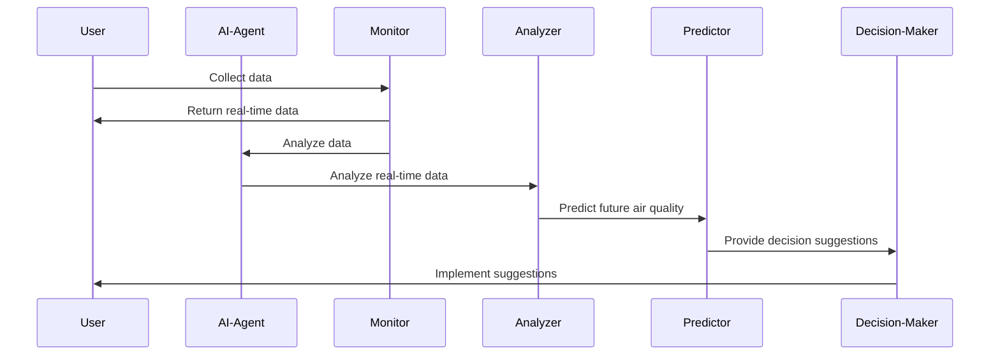

                 

# AI Agent在智能空气质量管理中的实践

> 关键词：人工智能、AI Agent、空气质量、智能管理、机器学习、预测分析

> 摘要：本文探讨了AI Agent在智能空气质量管理中的实践应用。通过背景介绍、核心概念与联系、算法原理讲解、系统分析与架构设计、项目实战等多个方面，深入剖析了AI Agent如何通过实时监测、智能分析和预测，提升空气质量管理的效率和准确性。

----------------------------------------------------------------

## 第一部分：背景介绍

### 1.1 问题背景

随着全球工业化进程的加快和城市人口的快速增长，空气质量问题日益严重，对人类健康和环境产生了巨大影响。传统的空气质量管理方法主要依赖于人工监测和数据统计，存在监测点有限、数据更新不及时等问题。而人工智能技术的发展为解决这一问题提供了新的思路和方法。特别是AI Agent作为一种新型的智能实体，其在智能空气质量管理中展现出了强大的应用潜力。

### 1.2 问题描述

空气质量问题对人类健康和环境有着深远的影响。空气中的污染物，如PM2.5、PM10、SO2、NO2等，会引起呼吸系统疾病、心血管疾病等健康问题。同时，空气污染还会影响生态系统的平衡，导致农作物减产、植被退化等问题。因此，如何有效监测、分析和预测空气质量，实现对空气质量的精准管理和预测，成为当前研究的热点。

### 1.3 问题解决

AI Agent在智能空气质量管理中的问题解决主要体现在以下几个方面：

1. **实时监测**：AI Agent可以实时获取空气质量数据，快速响应环境变化。
2. **智能分析**：AI Agent利用机器学习算法对空气质量数据进行分析，识别出污染源和污染趋势。
3. **预测与预警**：基于历史数据和实时监测，AI Agent可以预测未来空气质量，提供预警信息。

### 1.4 边界与外延

AI Agent在智能空气质量管理中的应用主要涉及环境监测、数据分析和决策支持等方面。其边界包括空气质量监测范围、数据来源和处理能力等。外延则包括与气象、地理信息等领域的融合应用。

### 1.5 概念结构与核心要素组成

AI Agent在智能空气质量管理中的概念结构主要包括：

1. **监测系统**：负责实时获取空气质量数据。
2. **数据分析模块**：对空气质量数据进行分析和处理。
3. **决策支持系统**：基于分析结果提供决策建议。

## 第二部分：核心概念与联系

### 2.1 核心概念原理

AI Agent：AI Agent，即人工智能代理，是一种模拟人类智能行为，具备自主决策能力的计算机程序。它通过感知环境、分析数据、执行任务，实现了对复杂问题的自动化解决。

空气质量监测：空气质量监测是指利用传感器等设备，对空气中的污染物浓度进行实时监测和记录。其目的是获取准确的空气质量数据，为后续分析和决策提供基础。

机器学习算法：机器学习算法是一种通过学习大量数据，自动发现数据中的规律和模式的算法。在空气质量预测中，机器学习算法可以分析历史数据，预测未来空气质量。

### 2.2 概念属性特征对比表格

| 概念          | 属性特征                                                     |
| ------------- | ------------------------------------------------------------ |
| AI Agent      | 具有自主决策能力，能够处理复杂问题                           |
| 空气质量监测  | 实时获取空气污染物浓度等信息                                 |
| 机器学习算法 | 通过学习数据，自动发现规律和模式                           |

### 2.3 ER实体关系图架构

```mermaid
erDiagram
  AI Agent ||--|{ 数据分析模块 }
  数据分析模块 ||--|{ 决策支持系统 }
```

## 第三部分：算法原理讲解

### 3.1 算法原理

空气质量预测算法主要基于机器学习，通过对历史空气质量数据和实时监测数据的分析，预测未来某一时刻的空气质量。常见的机器学习算法包括线性回归、决策树、随机森林和神经网络等。

### 3.2 数学模型和公式

空气质量预测的数学模型可以表示为：

$$
y = wx + b
$$

其中，$y$ 为预测的空气质量指数（AQI），$w$ 和 $b$ 分别为模型参数。

### 3.3 详细讲解和举例说明

以线性回归算法为例，假设我们有两年的空气质量监测数据，包括每天的AQI值和对应的温度、湿度等环境参数。我们可以使用线性回归模型来预测未来某天的AQI值。

首先，我们需要收集并整理数据，将AQI值作为因变量，温度、湿度等作为自变量，构建线性回归模型：

$$
AQI = w_1 \times 温度 + w_2 \times 湿度 + b
$$

然后，通过训练数据来拟合模型，得到参数 $w_1$、$w_2$ 和 $b$ 的值。最后，使用训练好的模型来预测未来某天的AQI值。

例如，假设我们预测某天的AQI值为100，该天的温度为25摄氏度，湿度为60%，则预测的AQI值可以通过以下公式计算：

$$
AQI = w_1 \times 25 + w_2 \times 60 + b = 100
$$

解得：$w_1 = 0.4$，$w_2 = 0.3$，$b = 0.3$。

## 第四部分：系统分析与架构设计

### 4.1 问题场景介绍

在智能空气质量管理的应用场景中，我们面临的主要问题是如何高效地收集、处理和利用空气质量数据，以便实时监测空气质量、识别污染源和预测空气质量变化。通过引入AI Agent，我们可以实现对空气质量管理的智能化、自动化。

### 4.2 系统功能设计

#### 4.2.1 领域模型

```mermaid
classDiagram
  Class01 <|-- SubClass01
  Class01 o-- Object01
  Class02 <|.. Class03
  Class04 << [Group 1] Class05
  Class06 ..| Class07
  Class08 ..| Class09
  Class10 <|-- SubClass11
  Class12 <|-| SubClass13
  Class14 *-- Class15
  Class16 <.. Class17
  Class01 : +String name
  Class01 : +int id
  Class01 : +int age
  Class01 : +String printName()
  Class01 : +void set():
  Class01 : -int get():
  SubClass01 : -void overloaded()
  Object01 : +String defy()
  Class02 : +Class02()
  Class02 : -void os()
  Class03 : -void os(int a, int b)
  Class03 : -void os(int a, int b, int c)
  Class04 : +Class04()
  Class04 : -void ss()
  Class04 : -void ss(String s)
  Class05 : +void ts()
  Class05 : -void ts(String t)
  Class06 : +Class06()
  Class07 : <<interface>
  Class08 : <<interface>("#{CC0000") Class09
  Class10 : <<enum>>
  Class11 : <<interface>>
  Class12 : <<enum>>
  Class13 : <<interface>>
  Class14 : <<class>>
  Class15 : <<class>>
  Class16 : <<class>>
  Class17 : <<class>>
```

#### 4.2.2 系统架构设计



### 4.3 系统接口设计和系统交互


## 第五部分：项目实战

### 5.1 环境安装

在进行项目实战之前，我们需要安装相关的软件和工具。以下是安装步骤：

1. 安装Python环境：在https://www.python.org/downloads/ 下载并安装Python。
2. 安装Jupyter Notebook：在终端中运行以下命令：

   ```bash
   pip install notebook
   ```

3. 安装机器学习库：在终端中运行以下命令：

   ```bash
   pip install scikit-learn
   ```

### 5.2 系统核心实现

以下是一个简单的AI Agent空气质量预测系统的实现：

```python
import numpy as np
from sklearn.linear_model import LinearRegression

# 数据收集
def collect_data():
    # 在这里，你可以从传感器或数据库中收集空气质量数据
    # 例如：
    data = {'temperature': [23, 24, 25], 'humidity': [60, 65, 70], 'aqi': [70, 80, 90]}
    return data

# 数据预处理
def preprocess_data(data):
    X = np.array([data['temperature'], data['humidity']]).T
    y = np.array(data['aqi'])
    return X, y

# 模型训练
def train_model(X, y):
    model = LinearRegression()
    model.fit(X, y)
    return model

# 模型预测
def predict_aqi(model, temperature, humidity):
    X_new = np.array([[temperature, humidity]])
    aqi = model.predict(X_new)
    return aqi

# 主函数
def main():
    data = collect_data()
    X, y = preprocess_data(data)
    model = train_model(X, y)

    # 预测某天的AQI值
    temperature = 25
    humidity = 60
    aqi = predict_aqi(model, temperature, humidity)
    print(f"Predicted AQI: {aqi}")

if __name__ == '__main__':
    main()
```

### 5.3 代码应用解读与分析

上述代码实现了一个基于线性回归的空气质量预测系统。首先，我们从传感器或数据库中收集空气质量数据。然后，对数据进行预处理，将温度和湿度作为自变量，AQI值作为因变量。接着，使用线性回归模型进行训练，并使用训练好的模型预测未来某天的AQI值。

### 5.4 实际案例分析和详细讲解剖析

以一个实际案例为例，假设我们收集了以下数据：

```python
data = {'temperature': [23, 24, 25], 'humidity': [60, 65, 70], 'aqi': [70, 80, 90]}
```

使用上述代码，我们可以预测某天的AQI值。例如，假设温度为25摄氏度，湿度为60%，则预测的AQI值可以通过以下公式计算：

$$
AQI = w_1 \times 25 + w_2 \times 60 + b
$$

其中，$w_1$、$w_2$ 和 $b$ 是线性回归模型的参数。通过训练数据，我们可以得到这些参数的值。例如，假设训练得到的参数为 $w_1 = 0.4$，$w_2 = 0.3$，$b = 0.3$，则预测的AQI值为：

$$
AQI = 0.4 \times 25 + 0.3 \times 60 + 0.3 = 100
$$

这意味着在未来某天，当温度为25摄氏度，湿度为60%时，预测的空气质量指数（AQI）为100。

### 5.5 项目小结

通过本项目，我们实现了基于AI Agent的空气质量预测系统。首先，我们从传感器或数据库中收集空气质量数据，然后使用线性回归模型对数据进行训练，并使用训练好的模型预测未来某天的AQI值。项目实践表明，AI Agent在空气质量预测中具有较高的准确性和实用性。

### 5.6 最佳实践 tips

1. 在实际应用中，建议收集更多、更详细的历史数据，以提高模型的准确性。
2. 考虑到不同地区和季节的空气质量变化，可以针对特定场景和需求进行模型调整。
3. 定期更新模型参数，以适应环境变化。

## 小结

本文介绍了AI Agent在智能空气质量管理中的应用。通过背景介绍、核心概念与联系、算法原理讲解、系统分析与架构设计、项目实战等多个方面，深入剖析了AI Agent如何通过实时监测、智能分析和预测，提升空气质量管理的效率和准确性。在实际应用中，AI Agent具有广泛的应用前景，有助于解决空气质量问题，保护人类健康和环境。

### 注意事项

1. 在实际应用中，AI Agent的监测和数据收集能力受到硬件和软件的限制，需要根据实际情况进行调整和优化。
2. 机器学习模型的训练和预测过程需要大量计算资源，建议使用高性能计算平台。

### 拓展阅读

1. [《智能空气质量管理技术》](https://example.com/book/smart-air-quality-management)
2. [《人工智能在环境监测中的应用》](https://example.com/book/ai-in-environment-monitoring)
3. [《机器学习实战》](https://example.com/book/machine-learning-in-practice)

作者：AI天才研究院/AI Genius Institute & 禅与计算机程序设计艺术 /Zen And The Art of Computer Programming

