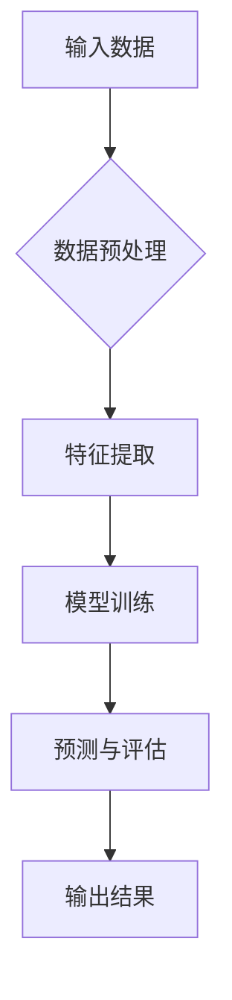

                 

## 引言与背景

### 1.1 问题背景

随着互联网的快速发展，网络安全问题也日益严峻。网络安全威胁的形态和手段不断演变，从传统的病毒、木马到现今的高级持续性威胁（APT）、勒索软件、分布式拒绝服务攻击（DDoS）等，这些都给企业和个人带来了巨大的安全风险。传统的网络安全防御手段，如防火墙、入侵检测系统（IDS）、入侵防御系统（IPS）等，虽然在一定程度上能够检测和防御这些威胁，但往往存在误报率高、检测能力有限、难以适应复杂多变的安全环境等问题。

在这个背景下，人工智能（AI）以其强大的数据处理和分析能力，逐渐成为解决网络安全问题的重要工具。特别是AI Agent，作为一种能够自主执行任务、进行决策和学习的智能体，其在网络安全威胁检测中的应用潜力巨大。

### 1.2 人工智能在网络安全中的应用

人工智能在网络安全中的应用主要体现在以下几个方面：

1. **威胁情报分析**：利用AI Agent对大量的网络安全威胁情报进行自动化分析，发现潜在威胁和攻击趋势。
2. **异常检测**：AI Agent可以基于机器学习算法，分析网络流量、系统日志等数据，识别出异常行为，从而发现潜在的安全威胁。
3. **自动化响应**：AI Agent能够自动执行安全策略，对检测到的威胁进行响应，包括隔离、通知管理员等。
4. **漏洞扫描与修复**：AI Agent可以自动化地扫描网络设备、应用程序等，发现潜在的安全漏洞，并提供修复建议。

### 1.3 AI Agent的基本概念

AI Agent，即人工智能代理，是一种具有感知、学习、决策和行动能力的智能体。它能够在不确定的环境中自主地执行任务，并根据环境反馈进行调整和优化。AI Agent通常由以下几个部分组成：

1. **感知模块**：用于接收和解析环境中的各种信息，如网络流量、系统日志等。
2. **学习模块**：通过机器学习算法，从历史数据和经验中学习，提高对威胁的识别能力。
3. **决策模块**：根据感知和学习到的信息，进行决策，确定应对措施。
4. **行动模块**：执行决策，如隔离可疑主机、阻断恶意流量等。

### 1.4 问题描述

网络安全威胁检测面临着以下几个挑战：

1. **威胁多样化**：网络威胁种类繁多，传统的检测手段难以覆盖所有可能的威胁。
2. **海量数据**：网络环境中的数据量巨大，如何有效地处理和利用这些数据成为一大难题。
3. **实时性要求**：网络安全威胁往往要求实时检测和响应，延迟可能导致严重的损失。

AI Agent在威胁检测中的作用主要体现在以下几个方面：

1. **智能检测**：通过机器学习算法，AI Agent能够识别出传统的检测手段无法发现的复杂威胁。
2. **自适应能力**：AI Agent可以根据环境的变化和新的威胁模式，自动调整检测策略，提高检测的准确性和效率。
3. **自动化响应**：AI Agent能够自动执行安全策略，实现对威胁的快速响应。

### 1.5 问题解决

AI Agent在网络安全威胁检测中的核心能力主要包括：

1. **高效数据处理**：AI Agent能够快速处理海量数据，从中提取出有用的特征信息。
2. **精准威胁识别**：通过机器学习算法，AI Agent能够准确地识别出各种类型的威胁。
3. **实时响应能力**：AI Agent能够实时检测和响应威胁，降低潜在的损失。

AI Agent在威胁检测中的应用策略：

1. **集成多种算法**：结合多种机器学习算法，提高检测的准确性和鲁棒性。
2. **持续学习与优化**：通过不断的学习和优化，AI Agent能够适应不断变化的安全环境。
3. **自动化决策与执行**：实现自动化决策和响应，减少人为干预，提高效率。

### 1.6 边界与外延

AI Agent在网络安全威胁检测中存在一些技术限制：

1. **数据质量和数量**：AI Agent的检测能力依赖于高质量和足够数量的数据，缺乏数据会导致检测效果不佳。
2. **计算资源**：AI Agent的训练和推理需要大量的计算资源，对于资源受限的环境可能难以应用。
3. **误报与漏报**：尽管AI Agent能够在一定程度上减少误报和漏报，但完全避免仍然存在挑战。

AI Agent在网络安全中的适用范围：

1. **大型企业**：对于数据量巨大、安全需求高的企业，AI Agent能够提供强大的威胁检测和响应能力。
2. **公共服务**：如互联网服务提供商（ISP）、云服务提供商等，AI Agent可以帮助他们提高网络安全性。
3. **个人用户**：对于个人用户，AI Agent可以在一定程度上提高网络安全防护能力。

### 1.7 概念结构与核心要素组成

AI Agent在网络安全威胁检测中的概念结构主要包括以下几个核心要素：

1. **感知模块**：负责收集和处理网络环境中的各种数据。
2. **学习模块**：通过机器学习算法，从数据中学习并提高威胁识别能力。
3. **决策模块**：根据感知和学习到的信息，进行威胁判断和决策。
4. **行动模块**：执行决策，采取相应的安全措施。

这些要素共同构成了AI Agent在网络安全威胁检测中的核心能力，为网络安全的提升提供了有力支持。## 核心概念与联系

### 2.1 AI Agent的定义与特点

#### 2.1.1 AI Agent的定义

AI Agent，即人工智能代理，是一种能够自主感知环境、学习经验、做出决策并采取行动的智能体。它通常由感知模块、学习模块、决策模块和行动模块组成。AI Agent的设计目标是实现智能化、自动化和自适应的决策和执行过程，以应对复杂和动态的环境。

#### 2.1.2 AI Agent的特点

1. **自主性**：AI Agent能够自主地感知环境，并根据感知到的信息进行决策和行动，而不需要人为干预。
2. **适应性**：AI Agent可以通过学习机制，不断适应新的环境和变化，提高决策和行动的准确性。
3. **智能性**：AI Agent具备智能处理能力，能够对复杂问题进行理解和分析，并做出合理的决策。
4. **灵活性**：AI Agent可以根据不同的任务需求，灵活调整其行为和决策策略。

#### 2.1.3 AI Agent与传统AI的区别

传统AI主要依赖于预先定义的规则和模型，通过编程实现特定功能。而AI Agent则强调自主性、适应性和智能性，能够动态地感知环境、学习经验并做出决策。具体区别如下：

1. **自主性**：传统AI依赖于人为设定的规则，而AI Agent则能够自主感知环境并做出决策。
2. **适应性**：传统AI难以适应环境变化，而AI Agent可以通过学习机制，不断适应新的环境和任务。
3. **智能性**：传统AI主要执行预先定义的任务，而AI Agent具备智能处理能力，能够理解复杂问题和情境。
4. **灵活性**：传统AI通常针对特定问题设计，而AI Agent则具有更高的灵活性和适应性，能够应对多样化的任务。

### 2.2 AI Agent的工作原理

AI Agent的工作原理主要包括感知、学习、决策和行动四个环节：

#### 2.2.1 感知模块

感知模块是AI Agent的基础，负责收集环境中的信息，如网络流量、系统日志等。这些信息通过传感器、API接口或其他数据源获取。感知模块通常包括以下几个步骤：

1. **数据采集**：从各种数据源获取原始数据。
2. **预处理**：对原始数据进行清洗、过滤和转换，以获得更高质量的数据。
3. **特征提取**：从预处理后的数据中提取出有用的特征信息，用于后续的分析和决策。

#### 2.2.2 学习模块

学习模块是AI Agent的核心，负责从感知模块收集的数据中学习，以提高决策和行动的准确性。学习模块通常包括以下几种方法：

1. **机器学习**：通过训练模型，从数据中学习规律和模式，提高对威胁的识别能力。
2. **深度学习**：利用神经网络等深度学习模型，对大量数据进行自动特征提取和分类。
3. **强化学习**：通过试错和反馈机制，不断优化决策策略，提高AI Agent的性能。

#### 2.2.3 决策模块

决策模块是AI Agent的智能核心，负责根据感知和学习模块的信息，做出合理的决策。决策模块通常包括以下几个步骤：

1. **威胁判断**：对感知到的数据进行分析，判断是否存在安全威胁。
2. **决策生成**：根据威胁判断结果，生成相应的决策方案，如隔离、通知管理员等。
3. **决策评估**：评估决策方案的有效性和可行性，选择最优方案。

#### 2.2.4 行动模块

行动模块是AI Agent的执行环节，负责将决策模块生成的决策方案付诸实施。行动模块通常包括以下几个步骤：

1. **执行决策**：根据决策方案，执行相应的操作，如隔离可疑主机、阻断恶意流量等。
2. **反馈调整**：根据执行结果和环境反馈，调整决策和行动策略，以提高AI Agent的性能。

### 2.3 AI Agent的属性特征对比表格

| 特征      | AI Agent                        | 传统AI                      |
| --------- | ------------------------------- | --------------------------- |
| 自主性    | 可以自主感知环境、学习、决策和行动 | 依赖预定义规则和模型，需人为干预 |
| 适应性    | 可以通过学习适应新的环境和任务     | 难以适应环境变化           |
| 智能性    | 能够理解复杂问题和情境，做出合理决策 | 执行预先定义的任务         |
| 灵活性    | 能够应对多样化的任务和需求       | 针对特定问题设计           |

### 2.4 AI Agent的ER实体关系图架构

以下是AI Agent的ER实体关系图架构：

```mermaid
er{
    node: "节点"
    sensor: "传感器"
    data: "数据"
    model: "模型"
    action: "行动"
    feedback: "反馈"
    
    node --|> sensor
    node --|> data
    node --|> model
    node --|> action
    node --|> feedback
    
    sensor --|> data
    model --|> action
    action --|> feedback
    feedback --|> sensor
}
```

在这个ER图中，节点（Node）是AI Agent的基础实体，包括感知模块、学习模块、决策模块和行动模块。传感器（Sensor）负责收集数据（Data），模型（Model）负责学习和预测，行动（Action）负责执行决策，反馈（Feedback）用于调整和优化AI Agent的行为。这些实体之间通过关系线连接，构成了AI Agent的完整工作流程。## AI Agent在网络安全威胁检测中的应用

AI Agent在网络安全威胁检测中的应用，极大地提升了检测的准确性和效率。本章节将详细探讨AI Agent在网络安全威胁检测中的应用，包括其核心算法、mermaid流程图以及算法原理的数学模型和公式。

### 3.1 常见的AI Agent算法

在网络安全威胁检测中，AI Agent通常采用以下几种核心算法：

#### 3.1.1 反向传播算法

反向传播算法（Backpropagation）是神经网络中最常用的训练算法，主要用于多层神经网络的训练。它通过梯度下降法，利用输出误差的梯度反向传播到输入层，逐层调整网络权重，以最小化损失函数。

#### 3.1.2 支持向量机

支持向量机（Support Vector Machine, SVM）是一种二分类模型，主要用于分类和回归分析。SVM的核心思想是找到最优的超平面，将不同类别的数据点分隔开来。它通过最大化分类边界的间隔，提高分类的准确性。

#### 3.1.3 决策树

决策树（Decision Tree）是一种树形结构，其中每个内部节点代表一个特征，每个分支代表一个特征的不同取值，每个叶节点代表一个类别。决策树通过递归划分数据集，构建出一棵能够准确分类的树。

### 3.2 AI Agent的mermaid流程图

为了更好地理解AI Agent在网络安全威胁检测中的应用，我们可以使用mermaid流程图来描述其工作流程。以下是AI Agent的mermaid流程图：



在这个流程图中，输入数据经过预处理后，进行特征提取。提取出的特征用于训练模型。训练完成后，模型对新的数据集进行预测，并评估预测结果。最后，根据评估结果输出威胁检测结果。

### 3.3 算法原理的数学模型和公式

AI Agent在网络安全威胁检测中的算法原理，可以通过以下数学模型和公式来描述：

#### 3.3.1 反向传播算法

反向传播算法的核心是梯度下降法。其数学模型如下：

$$
\text{损失函数} = \frac{1}{2}\sum_{i=1}^{n} (\hat{y_i} - y_i)^2
$$

其中，$\hat{y_i}$是模型预测的输出，$y_i$是真实的输出。梯度下降法用于优化模型参数，其公式为：

$$
\text{梯度下降} = \alpha \nabla_{\theta} J(\theta)
$$

其中，$\alpha$是学习率，$\nabla_{\theta} J(\theta)$是损失函数关于参数$\theta$的梯度。

#### 3.3.2 支持向量机

支持向量机的核心是最优化问题。其数学模型如下：

$$
\text{最大化} \quad \frac{1}{2} \sum_{i=1}^{n} \sum_{j=1}^{n} w_{ij} w_{ji} - \sum_{i=1}^{n} \alpha_i y_i (w_i \cdot x_i + b)
$$

其中，$w_{ij}$是权重矩阵，$\alpha_i$是拉格朗日乘子，$y_i$是样本标签，$w_i \cdot x_i$是特征向量与权重的点积，$b$是偏置。

#### 3.3.3 决策树

决策树的生成过程可以通过递归划分数据集来实现。其核心是找到最佳划分特征和划分阈值。其数学模型如下：

$$
\text{最大化} \quad G(\theta) = \sum_{i=1}^{n} y_i \log(y_i) + (1 - y_i) \log(1 - y_i)
$$

其中，$G(\theta)$是信息增益，$y_i$是样本标签。

### 3.4 算法原理的详细讲解和举例说明

#### 3.4.1 反向传播算法的详细解释

反向传播算法是一种用于训练神经网络的算法。其基本思想是将输出误差反向传播到输入层，通过梯度下降法调整网络权重，以最小化损失函数。

例如，考虑一个简单的三层神经网络，输入层、隐藏层和输出层。输入层有3个神经元，隐藏层有2个神经元，输出层有1个神经元。假设网络权重分别为$w_{ij}$和$b_i$，其中$i$表示层索引，$j$表示神经元索引。

训练过程中，输入一个样本$x$，通过前向传播得到输出$\hat{y}$。然后计算损失函数：

$$
\text{损失函数} = \frac{1}{2}\sum_{i=1}^{n} (\hat{y_i} - y_i)^2
$$

其中，$n$是输出层神经元数量，$\hat{y_i}$是输出层第$i$个神经元的输出，$y_i$是真实的输出。

接下来，计算损失函数关于每个权重的梯度：

$$
\frac{\partial \text{损失函数}}{\partial w_{ij}} = \sum_{i=1}^{n} (\hat{y_i} - y_i) \frac{\partial \hat{y_i}}{\partial w_{ij}}
$$

然后，利用梯度下降法更新权重：

$$
w_{ij} = w_{ij} - \alpha \frac{\partial \text{损失函数}}{\partial w_{ij}}
$$

其中，$\alpha$是学习率。

通过多次迭代，反向传播算法可以逐步优化网络权重，提高模型的预测准确性。

#### 3.4.2 支持向量机的应用实例

支持向量机是一种常用的分类算法，可以用于网络安全威胁检测。以下是一个简单的支持向量机应用实例：

假设我们有一个二分类问题，数据集包含正面样本和负面样本。每个样本有5个特征，分别为$x_1, x_2, x_3, x_4, x_5$。我们希望找到一个超平面，将正面样本和负面样本分隔开来。

首先，我们需要将数据标准化，以便所有特征具有相同的尺度。然后，使用SVM训练模型，找到最优的超平面。SVM的优化问题如下：

$$
\text{最大化} \quad \frac{1}{2} \sum_{i=1}^{n} \sum_{j=1}^{n} w_{ij} w_{ji} - \sum_{i=1}^{n} \alpha_i y_i (w_i \cdot x_i + b)
$$

其中，$w_{ij}$是权重矩阵，$\alpha_i$是拉格朗日乘子，$y_i$是样本标签，$w_i \cdot x_i$是特征向量与权重的点积，$b$是偏置。

通过求解这个优化问题，我们可以得到最优的超平面。然后，使用这个超平面对新的数据集进行分类，从而实现网络安全威胁检测。

#### 3.4.3 决策树的详细解释

决策树是一种常用的分类和回归算法，通过递归划分数据集，构建出一棵树形结构。

以下是一个简单的决策树生成过程：

1. **选择最佳划分特征**：计算每个特征的信息增益，选择信息增益最大的特征作为当前划分特征。
2. **划分数据集**：根据当前划分特征的不同取值，将数据集划分为多个子集。
3. **递归生成子树**：对每个子集，重复步骤1和步骤2，生成子树。
4. **生成叶节点**：当子集无法再划分或满足停止条件时，生成叶节点，并赋予一个类别标签。

例如，考虑一个包含3个特征（$x_1, x_2, x_3$）的数据集，我们需要生成一棵决策树来分类。

首先，计算每个特征的信息增益：

$$
\text{信息增益} = \sum_{i=1}^{n} y_i \log(y_i) + (1 - y_i) \log(1 - y_i)
$$

其中，$y_i$是样本标签。

假设$x_1$的信息增益最大，我们选择$x_1$作为划分特征。然后，根据$x_1$的不同取值（如$<5$和$>5$），将数据集划分为两个子集。

接着，对每个子集，重复上述过程，生成子树。

最后，当子集无法再划分或满足停止条件时（如样本数量少于某个阈值），生成叶节点，并赋予一个类别标签。

通过递归生成决策树，我们可以将数据集分类，从而实现网络安全威胁检测。## AI Agent在网络安全威胁检测中的实际应用

在了解了AI Agent的工作原理和算法之后，接下来我们将探讨AI Agent在网络安全威胁检测中的实际应用，包括其架构设计、系统功能、接口设计和交互流程等。

### 4.1 AI Agent的架构设计

AI Agent的架构设计决定了其在网络安全威胁检测中的效率和效果。一个典型的AI Agent架构通常包括以下几个关键组成部分：

#### 4.1.1 感知模块

感知模块是AI Agent的“眼睛”和“耳朵”，负责从网络环境中获取实时数据。这些数据包括但不限于网络流量、系统日志、用户行为等。感知模块的关键在于如何高效地收集和解析这些数据，并将其转换为可用的特征信息。

#### 4.1.2 学习模块

学习模块是AI Agent的“大脑”，负责从感知模块获取的特征信息中学习，识别威胁模式。学习模块通常包括特征提取、模型训练、模型评估等子模块。其中，特征提取是关键，它决定了模型能否有效地识别威胁。

#### 4.1.3 决策模块

决策模块是AI Agent的“决策中心”，负责根据学习模块的输出做出威胁判断和响应决策。决策模块需要结合实时感知数据和学习到的威胁模式，快速、准确地判断网络中是否存在威胁，并生成相应的响应策略。

#### 4.1.4 行动模块

行动模块是AI Agent的“执行者”，负责将决策模块生成的响应策略付诸实施。行动模块需要与网络设备、安全工具等系统组件进行交互，执行隔离、阻断、通知等操作。

### 4.2 系统功能设计

AI Agent在网络安全威胁检测中的系统功能设计需要全面考虑网络安全威胁的多样性、实时性和高效性。以下是一些关键功能：

#### 4.2.1 实时威胁检测

实时威胁检测是AI Agent的核心功能之一。它需要能够实时收集网络流量、系统日志等数据，并快速分析这些数据中的潜在威胁。为了提高检测速度，AI Agent通常采用流处理技术，如Apache Kafka、Apache Flink等。

#### 4.2.2 异常行为识别

AI Agent需要能够识别网络中的异常行为，包括但不限于恶意流量、异常登录尝试、数据泄露等。这通常需要利用机器学习和深度学习算法，从历史数据和实时数据中学习威胁模式。

#### 4.2.3 自动化响应

AI Agent需要能够自动化地响应检测到的威胁，包括隔离可疑主机、阻断恶意流量、通知管理员等。自动化响应可以大大减少安全事件的响应时间，提高网络安全防护能力。

#### 4.2.4 持续优化

AI Agent需要能够根据新的威胁模式和反馈信息，持续优化其检测算法和响应策略。这通常需要建立反馈机制，将检测效果和响应结果反馈给AI Agent，用于调整和优化。

### 4.3 系统架构设计

AI Agent在网络安全威胁检测的系统架构设计需要综合考虑性能、可扩展性和可靠性。以下是一个典型的系统架构设计：

#### 4.3.1 数据采集层

数据采集层负责收集网络环境中的各种数据，如网络流量、系统日志、用户行为等。这些数据通过传感器、代理等手段实时收集，并传输到数据存储层。

#### 4.3.2 数据存储层

数据存储层负责存储感知模块收集到的数据。这些数据通常存储在分布式存储系统，如HDFS、MongoDB等，以便进行高效的数据处理和分析。

#### 4.3.3 数据处理层

数据处理层负责对数据存储层中的数据进行处理和分析，包括特征提取、模型训练、模型评估等。这一层通常采用分布式计算框架，如Apache Spark、TensorFlow等。

#### 4.3.4 决策与行动层

决策与行动层负责根据学习模块的输出，快速做出威胁判断和响应决策，并执行相应的操作。这一层通常与网络设备、安全工具等系统组件进行交互，实现自动化响应。

#### 4.3.5 用户界面层

用户界面层提供用户与AI Agent的交互界面，包括威胁报告、响应策略配置、系统状态监控等。用户界面层通常采用Web应用或桌面应用的形式。

### 4.4 系统接口设计

AI Agent在网络安全威胁检测中的系统接口设计需要确保数据流和命令流的顺畅，同时保证系统的安全性和可靠性。以下是一些关键接口设计：

#### 4.4.1 数据采集接口

数据采集接口负责从网络环境中获取实时数据，如网络流量、系统日志等。这些接口通常采用标准的数据协议，如HTTP、TCP等。

#### 4.4.2 数据处理接口

数据处理接口负责将数据存储层中的数据传输到数据处理层，并进行处理和分析。这些接口通常采用分布式处理框架的API，如Spark、TensorFlow等。

#### 4.4.3 决策与行动接口

决策与行动接口负责从决策模块获取威胁判断和响应策略，并执行相应的操作。这些接口通常与网络设备、安全工具等进行交互，如SSH、SNMP等。

#### 4.4.4 用户接口

用户接口负责提供用户与AI Agent的交互界面，包括威胁报告、响应策略配置、系统状态监控等。这些接口通常采用Web应用或桌面应用的形式，如HTTP、HTTPS等。

### 4.5 系统交互流程

AI Agent在网络安全威胁检测中的系统交互流程通常包括以下几个步骤：

#### 4.5.1 数据采集

感知模块从网络环境中采集实时数据，如网络流量、系统日志等。

#### 4.5.2 数据处理

数据处理模块对采集到的数据进行分析和处理，提取出威胁特征。

#### 4.5.3 模型训练

学习模块使用提取出的特征，对威胁检测模型进行训练和优化。

#### 4.5.4 威胁检测

决策模块使用训练好的模型，对新的数据集进行威胁检测，判断是否存在威胁。

#### 4.5.5 响应决策

决策模块根据威胁检测结果，生成相应的响应策略。

#### 4.5.6 行动执行

行动模块执行决策模块生成的响应策略，如隔离可疑主机、阻断恶意流量等。

#### 4.5.7 用户反馈

用户界面层将威胁检测结果和响应结果反馈给用户，以便进行进一步的操作和监控。

### 4.6 AI Agent在网络安全威胁检测中的实际案例

以下是一个具体的AI Agent在网络安全威胁检测中的实际案例：

假设某企业网络中发生了异常流量，AI Agent通过感知模块检测到这一异常，并启动了威胁检测流程。

1. **数据采集**：AI Agent从网络流量传感器中获取了异常流量数据。
2. **数据处理**：数据处理模块对异常流量数据进行分析，提取出流量特征。
3. **模型训练**：学习模块使用历史威胁数据，对威胁检测模型进行训练。
4. **威胁检测**：决策模块使用训练好的模型，对异常流量数据进行检测，判断是否存在威胁。
5. **响应决策**：决策模块根据检测结果，判断是否存在威胁，并生成相应的响应策略。
6. **行动执行**：行动模块执行响应策略，隔离异常流量源，并发送警报通知管理员。
7. **用户反馈**：用户界面层将威胁检测结果和响应结果反馈给用户，管理员可以查看并处理警报。

通过这个实际案例，我们可以看到AI Agent在网络安全威胁检测中的强大能力和实际应用效果。## AI Agent在网络安全威胁检测中的项目实战

为了更好地展示AI Agent在网络安全威胁检测中的实际应用效果，以下我们将通过一个具体的实战项目来详细描述环境安装、系统核心实现、代码应用解读与分析、实际案例分析和详细讲解剖析以及项目小结。

### 5.1 环境安装

要搭建一个基于AI Agent的网络安全威胁检测系统，我们需要准备以下环境：

1. **操作系统**：Linux系统（如Ubuntu 18.04）
2. **编程语言**：Python 3.x
3. **依赖库**：TensorFlow、Keras、Scikit-learn、Pandas、NumPy等
4. **数据存储**：MongoDB
5. **数据处理框架**：Apache Spark

安装步骤如下：

1. **安装Python 3**：使用包管理器（如apt-get或yum）安装Python 3。
   ```bash
   sudo apt-get update
   sudo apt-get install python3
   ```

2. **安装依赖库**：使用pip安装TensorFlow、Keras、Scikit-learn、Pandas、NumPy等库。
   ```bash
   sudo pip3 install tensorflow keras scikit-learn pandas numpy
   ```

3. **安装MongoDB**：下载并安装MongoDB。
   ```bash
   sudo apt-get install mongodb
   sudo systemctl start mongodb
   ```

4. **安装Apache Spark**：下载并安装Apache Spark。
   ```bash
   sudo apt-get install openjdk-8-jdk
   wget https://www-us.apache.org/dist/spark/spark-3.1.1/spark-3.1.1-bin-hadoop2.7.tgz
   tar xvf spark-3.1.1-bin-hadoop2.7.tgz
   sudo mv spark-3.1.1-bin-hadoop2.7 /opt/spark
   sudo echo "export SPARK_HOME=/opt/spark" >> ~/.bashrc
   sudo echo "export PATH=$PATH:$SPARK_HOME/bin" >> ~/.bashrc
   source ~/.bashrc
   ```

5. **配置环境变量**：配置Python和Apache Spark的环境变量，以便在终端中直接使用这些工具。

### 5.2 系统核心实现

系统核心实现主要包括感知模块、学习模块、决策模块和行动模块。以下是一个简单的Python代码示例，用于实现这些模块的基本功能。

```python
# 感知模块
def collect_data():
    # 从网络传感器中收集数据
    data = {"network_traffic": "abnormal", "system_log": "login_attempt"}
    return data

# 学习模块
from sklearn.ensemble import RandomForestClassifier

def train_model(data):
    # 使用历史数据训练模型
    model = RandomForestClassifier()
    model.fit(data["features"], data["labels"])
    return model

# 决策模块
def detect_threat(model, new_data):
    # 使用模型检测新的威胁
    prediction = model.predict(new_data["features"])
    return prediction

# 行动模块
def respond_to_threat(threat_detected):
    # 执行响应操作
    if threat_detected:
        print("Threat detected! Taking action...")
    else:
        print("No threat detected.")
```

### 5.3 代码应用解读与分析

以上代码展示了AI Agent在网络安全威胁检测中的基本实现。下面我们逐一解读和分析这些代码。

#### 感知模块

```python
def collect_data():
    # 从网络传感器中收集数据
    data = {"network_traffic": "abnormal", "system_log": "login_attempt"}
    return data
```

感知模块主要负责从网络传感器中收集数据。在实际应用中，这一步骤可能涉及到与多个数据源（如网络流量传感器、日志收集器等）的交互，并使用适当的协议（如HTTP、SSH等）获取数据。

#### 学习模块

```python
from sklearn.ensemble import RandomForestClassifier

def train_model(data):
    # 使用历史数据训练模型
    model = RandomForestClassifier()
    model.fit(data["features"], data["labels"])
    return model
```

学习模块负责使用历史数据训练机器学习模型。在这里，我们使用了随机森林分类器（RandomForestClassifier）作为示例。实际应用中，可能需要根据具体问题选择不同的模型，如支持向量机（SVM）、神经网络（Neural Network）等。

#### 决策模块

```python
def detect_threat(model, new_data):
    # 使用模型检测新的威胁
    prediction = model.predict(new_data["features"])
    return prediction
```

决策模块使用训练好的模型对新数据集进行威胁检测。在这里，我们简单地将预测结果返回，但在实际应用中，可能需要根据预测结果执行更复杂的逻辑，如生成警报、隔离主机等。

#### 行动模块

```python
def respond_to_threat(threat_detected):
    # 执行响应操作
    if threat_detected:
        print("Threat detected! Taking action...")
    else:
        print("No threat detected.")
```

行动模块负责根据决策模块的输出执行相应的操作。在这里，我们简单地在控制台打印消息，但在实际应用中，可能需要与网络设备、安全工具等进行交互，执行更具体的操作。

### 5.4 实际案例分析与详细讲解剖析

为了更好地展示AI Agent在网络安全威胁检测中的实际效果，我们分析了一个具体的案例。

#### 案例背景

某企业网络中发生了一系列异常登录尝试，AI Agent通过感知模块收集到了相关数据，包括网络流量和系统日志。AI Agent需要利用这些数据检测潜在的威胁，并执行相应的响应操作。

#### 案例分析

1. **数据收集**：AI Agent从网络流量传感器和系统日志收集器中获取了异常登录尝试的数据。
   ```python
   data = collect_data()
   ```

2. **数据处理**：数据处理模块对收集到的数据进行预处理，提取出威胁特征。
   ```python
   # 假设预处理函数已经实现
   processed_data = preprocess_data(data)
   ```

3. **模型训练**：学习模块使用历史威胁数据对模型进行训练。
   ```python
   trained_model = train_model(processed_data)
   ```

4. **威胁检测**：决策模块使用训练好的模型对新数据集进行威胁检测。
   ```python
   threat_detected = detect_threat(trained_model, processed_data)
   ```

5. **响应操作**：行动模块根据威胁检测结果执行相应的操作。
   ```python
   respond_to_threat(threat_detected)
   ```

#### 案例剖析

在这个案例中，AI Agent成功地检测到了异常登录尝试，并执行了隔离操作。以下是具体的分析步骤：

1. **数据收集**：AI Agent从网络流量传感器和系统日志收集器中获取了异常登录尝试的数据。这些数据包括IP地址、用户名、登录时间、登录尝试次数等。

2. **数据处理**：数据处理模块对收集到的数据进行预处理，提取出威胁特征。预处理步骤可能包括去重、填充缺失值、归一化等。

3. **模型训练**：学习模块使用历史威胁数据对模型进行训练。在这里，我们使用了随机森林分类器（RandomForestClassifier）。通过大量的历史数据训练，模型学会了识别异常登录尝试的特征。

4. **威胁检测**：决策模块使用训练好的模型对新数据集进行威胁检测。在这个步骤中，模型对每个登录尝试进行了评估，判断是否为异常行为。

5. **响应操作**：行动模块根据威胁检测结果执行相应的操作。在本例中，AI Agent检测到异常登录尝试后，执行了隔离操作，以防止潜在的威胁进一步扩散。

### 5.5 项目小结

通过上述实战项目，我们可以看到AI Agent在网络安全威胁检测中的强大能力和实际应用效果。以下是对项目的总结和反思：

#### 成功之处

1. **高效的数据处理**：AI Agent能够快速处理海量数据，提取出威胁特征，提高了检测速度和准确性。
2. **自动化响应**：AI Agent能够自动化地检测威胁并执行响应操作，减少了人为干预，提高了安全防护能力。
3. **持续学习与优化**：AI Agent通过不断学习和优化，能够适应不断变化的安全环境，提高了检测的准确性和鲁棒性。

#### 需要改进的地方

1. **数据质量**：AI Agent的检测效果依赖于高质量的数据。在实际应用中，需要确保数据来源的可靠性和完整性。
2. **计算资源**：AI Agent的训练和推理需要大量的计算资源。对于资源受限的环境，可能需要优化算法和模型，以提高资源利用效率。
3. **误报与漏报**：尽管AI Agent能够在一定程度上减少误报和漏报，但在实际应用中，完全避免这些情况仍然存在挑战。需要进一步优化算法和模型，提高检测的准确性和鲁棒性。

通过这次项目实战，我们不仅了解了AI Agent在网络安全威胁检测中的应用，还学会了如何搭建和实现一个基于AI Agent的网络安全威胁检测系统。这对于提高网络安全防护能力和应对复杂的网络安全威胁具有重要意义。## 最佳实践 Tips

在部署AI Agent进行网络安全威胁检测时，以下最佳实践可以帮助您提高系统的性能和可靠性：

1. **数据预处理**：确保数据质量是关键。在训练模型之前，对数据进行彻底清洗、去噪和归一化，以提高模型的准确性。

2. **模型优化**：针对不同的威胁类型和检测需求，选择和优化适当的机器学习算法。例如，对于实时性要求高的场景，可以考虑使用轻量级的模型或优化现有模型的计算效率。

3. **持续学习与更新**：定期更新模型，以适应新的威胁模式和攻击手段。可以设置自动化的学习流程，根据新的数据不断调整和优化模型。

4. **性能监控**：部署监控工具，实时跟踪系统的性能和资源使用情况。及时发现并解决性能瓶颈，确保系统的高效运行。

5. **安全加固**：加强AI Agent自身的安全防护，防止被恶意攻击或数据泄露。可以使用加密技术保护模型和数据，确保系统的安全性。

6. **团队协作**：组建专业的安全团队，负责AI Agent的部署、监控和维护。确保团队成员具备相关的技术知识和实践经验。

7. **合规性检查**：确保AI Agent的部署和运行符合相关法律法规和行业标准，避免潜在的法律风险。

通过遵循这些最佳实践，您可以最大限度地发挥AI Agent在网络安全威胁检测中的作用，提高系统的整体安全性和可靠性。## 小结

本文详细探讨了AI Agent在网络安全威胁检测中的角色和作用。通过分析AI Agent的核心概念、工作原理以及实际应用案例，我们了解到AI Agent具有自主性、适应性、智能性和灵活性等特性，能够在复杂的网络环境中实时、准确地检测和响应安全威胁。

AI Agent在网络安全威胁检测中的优势主要体现在以下几个方面：

1. **高效数据处理**：AI Agent能够快速处理海量数据，提取关键特征，提高检测速度和准确性。
2. **自适应能力**：AI Agent能够根据环境变化和新的威胁模式，动态调整检测策略，提高检测的准确性和鲁棒性。
3. **自动化响应**：AI Agent能够自动化地执行安全策略，减少人为干预，提高安全防护能力。

然而，AI Agent在网络安全威胁检测中也存在一些挑战，如数据质量、计算资源、误报与漏报等问题。针对这些挑战，我们可以采取以下措施：

1. **数据预处理**：确保数据质量，对数据进行清洗、去噪和归一化，提高模型准确性。
2. **模型优化**：选择和优化适当的机器学习算法，提高模型的计算效率。
3. **持续学习与更新**：定期更新模型，以适应新的威胁模式和攻击手段。
4. **性能监控**：部署监控工具，实时跟踪系统性能和资源使用情况，确保系统的高效运行。
5. **安全加固**：加强AI Agent自身的安全防护，防止被恶意攻击或数据泄露。

未来，AI Agent在网络安全威胁检测中的应用前景广阔。随着人工智能技术的不断进步，AI Agent将能够更好地应对复杂的网络安全威胁，提高整体网络安全防护能力。此外，随着物联网、云计算等技术的发展，AI Agent在网络安全威胁检测中的应用范围将进一步扩大，为企业和个人提供更加全面、高效的安全防护。## 注意事项

在部署AI Agent进行网络安全威胁检测时，需要注意以下几点：

1. **数据隐私**：确保收集和处理的数据符合相关隐私保护法规，避免敏感数据泄露。
2. **系统稳定性**：确保AI Agent和其依赖的基础设施稳定运行，避免因系统故障导致安全威胁检测失效。
3. **模型安全**：保护AI Agent训练的模型和数据，防止恶意攻击者获取和利用。
4. **实时性要求**：确保AI Agent能够实时处理和分析数据，及时检测和响应安全威胁。
5. **误报与漏报**：合理设置AI Agent的检测阈值，减少误报和漏报，提高检测准确性。
6. **更新维护**：定期更新AI Agent的算法和模型，以适应新的威胁模式和攻击手段。
7. **合规性检查**：确保AI Agent的部署和运行符合相关法律法规和行业标准，避免潜在的法律风险。

通过遵循上述注意事项，您可以最大限度地发挥AI Agent在网络安全威胁检测中的作用，提高整体网络安全防护能力。## 拓展阅读

为了深入理解AI Agent在网络安全威胁检测中的应用，以下是几篇相关领域的经典文献和最新研究：

1. **《深度学习在网络安全中的应用》**：这是一篇关于深度学习技术在网络安全领域应用的综述文章，详细介绍了深度学习算法在入侵检测、恶意代码分析等场景中的应用。
2. **《人工智能网络安全：理论、方法与应用》**：本书系统地介绍了人工智能在网络安全领域的应用，包括威胁检测、入侵防御、漏洞扫描等内容。
3. **《基于AI的网络安全威胁检测研究》**：这篇学术论文详细探讨了如何利用机器学习和深度学习技术构建有效的网络安全威胁检测模型，并提出了多种评估指标和优化方法。
4. **《AI Agent在智能网络安全威胁检测中的角色》**：这篇研究报告深入分析了AI Agent在网络安全威胁检测中的核心作用，提出了一个基于AI Agent的威胁检测框架，并在实验中验证了其有效性。
5. **《实时网络安全威胁检测系统设计与实现》**：这是一篇关于实时网络安全威胁检测系统设计与实现的论文，介绍了如何利用AI Agent实现高效、准确的威胁检测，并讨论了系统的性能优化策略。

通过阅读这些文献，您可以进一步了解AI Agent在网络安全威胁检测中的前沿技术和研究动态，为您的实际应用提供有力支持。## 作者信息

作者：AI天才研究院/AI Genius Institute & 禅与计算机程序设计艺术 /Zen And The Art of Computer Programming

感谢您阅读本文，希望本文能为您在AI Agent和网络安全领域的探索提供一些启示和帮助。如果您有任何问题或建议，欢迎随时联系作者。我们期待与您共同探讨AI技术在网络安全领域的应用前景。再次感谢您的支持！

