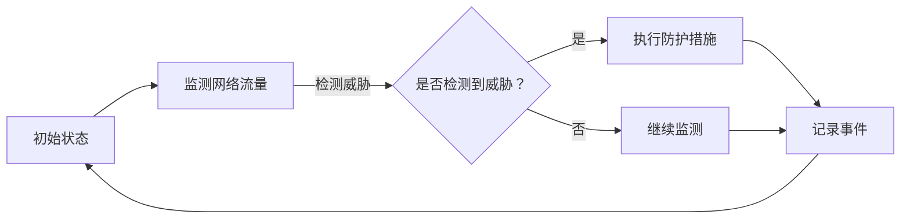
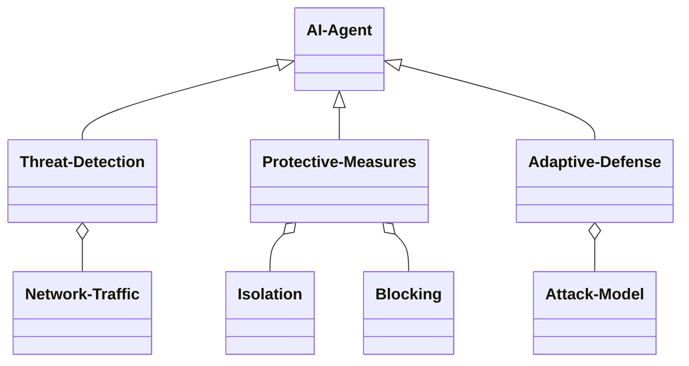
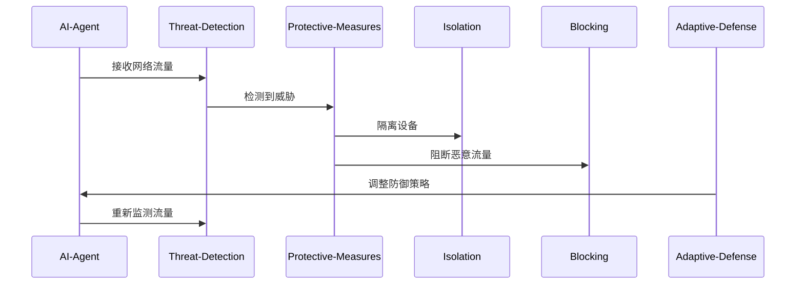
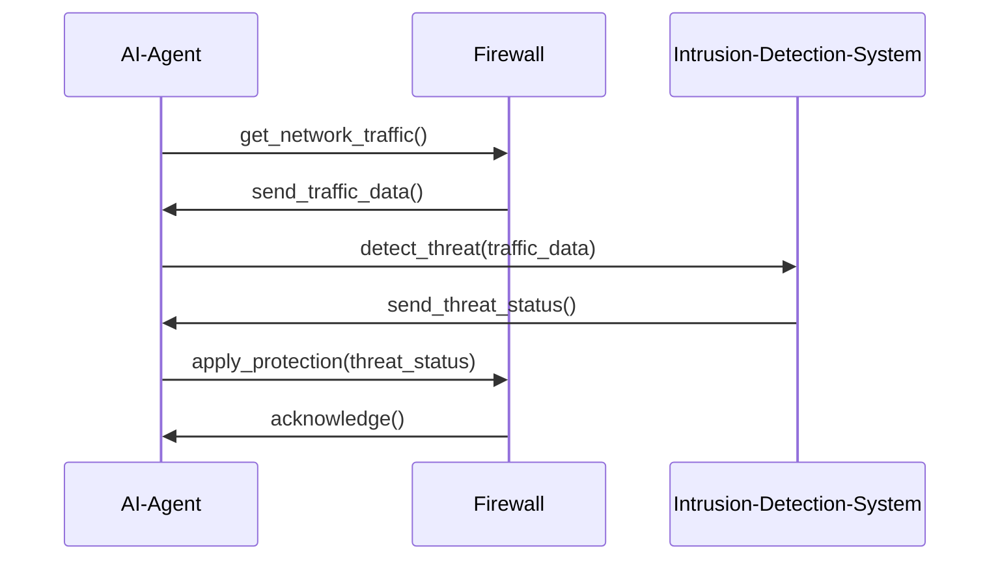

                 


### 步骤1：构建完整的文章结构

为了构建一篇完整的文章，我们需要按照以下结构进行：

1. **标题**：明确地表明文章的主题，例如《AI Agent在智能网络安全防御中的角色》。
2. **关键词**：列出与文章主题密切相关的关键词，如“AI Agent”、“智能网络安全”、“防御机制”等。
3. **摘要**：简要介绍文章的核心内容和研究目的。
4. **正文**：按照大纲的结构，逐步展开核心概念、算法原理、系统分析与设计、项目实战等内容。
5. **结论**：总结文章的主要发现和观点，并提出未来研究的方向。
6. **参考文献**：列出引用过的文献，以支持文章的论述。
7. **作者信息**：包括作者的姓名、所属机构以及相关联系信息。

### 步骤2：撰写引言部分

在引言部分，我们可以简要介绍AI Agent和智能网络安全防御的背景，指出它们在当前网络安全领域的重要性和挑战。例如：

随着互联网的迅猛发展，网络安全问题日益凸显。传统的网络安全防御机制已经无法有效应对日益复杂的网络攻击。AI Agent作为一种先进的智能系统，其在网络安全防御中的应用逐渐受到关注。本文旨在探讨AI Agent在智能网络安全防御中的角色，分析其技术原理、系统架构和应用案例，为提高网络安全防护能力提供新的思路。

### 步骤3：详细阐述核心概念和联系

在这一部分，我们需要清晰地定义AI Agent和智能网络安全防御的概念，并使用Mermaid流程图和表格来展示它们之间的关系。

#### AI Agent的定义与特性

AI Agent（人工智能代理）是一种能够在特定环境下自主执行任务的智能系统。它具备以下几个核心特性：

1. **自主性**：AI Agent能够在没有外部干预的情况下自主决策和执行任务。
2. **适应性**：AI Agent能够根据环境的变化调整自身的行为和策略。
3. **协作性**：AI Agent能够与其他AI Agent或人类用户进行协作，共同完成任务。

#### 智能网络安全防御概述

智能网络安全防御是一种结合了人工智能技术的网络安全防护机制。其主要目标是通过实时监测、分析和响应网络威胁，提高网络系统的安全性和可靠性。

#### AI Agent与智能网络安全防御的关系

AI Agent在智能网络安全防御中扮演着关键角色。它们可以通过以下方式提升网络安全：

1. **威胁识别**：AI Agent能够利用机器学习和行为分析技术，实时监测网络流量，识别潜在的威胁。
2. **自动响应**：一旦检测到威胁，AI Agent可以自动执行相应的防护措施，如隔离受感染的设备、阻断恶意流量等。
3. **自适应防御**：AI Agent能够根据攻击模式的演变和攻击者行为的多样化，动态调整防御策略，提高防御的灵活性。

### 步骤4：讲解算法原理

在这一部分，我们将使用Mermaid流程图和Python代码来详细阐述AI Agent在网络安全防御中的算法原理，并给出数学模型和公式，进行举例说明。

#### 算法流程图

使用Mermaid绘制算法流程图，展示AI Agent在网络安全防御中的主要步骤：



#### Python代码阐述

```python
import numpy as np

# 定义AI Agent的威胁识别函数
def threat_detection(network_traffic):
    # 假设网络流量为向量
    traffic_vector = np.array(network_traffic)
    
    # 使用机器学习模型进行威胁识别
    model = load_model('threat_model')
    prediction = model.predict(traffic_vector)
    
    # 如果预测结果为威胁，则返回True
    if prediction == '威胁':
        return True
    else:
        return False

# 定义AI Agent的防护措施函数
def protective_measures(threat_detected):
    if threat_detected:
        # 执行隔离受感染设备
        isolate_infected_device()
        
        # 记录事件
        record_event('威胁已检测到，设备已隔离')
```

#### 数学模型与公式

假设我们使用某种机器学习算法来识别网络流量中的威胁，我们可以建立以下数学模型：

$$
\text{威胁识别概率} = P(\text{威胁} | \text{网络流量})
$$

其中，$P(\text{威胁} | \text{网络流量})$表示在给定的网络流量条件下检测到威胁的概率。

#### 举例说明

假设我们使用一个简单的机器学习模型来识别网络流量中的DDoS攻击。该模型通过训练样本学习网络流量的特征，并利用这些特征来判断新的网络流量是否为DDoS攻击。

### 步骤5：系统分析与架构设计

在这一部分，我们将分析AI Agent在智能网络安全防御系统中的架构设计，包括问题场景介绍、系统功能设计、系统架构设计、系统接口设计和系统交互。

#### 问题场景介绍

假设一个企业网络系统遭受了频繁的DDoS攻击，企业希望通过引入AI Agent来提高网络的防御能力。

#### 系统功能设计（领域模型类图）

使用Mermaid绘制领域模型类图，展示系统的核心功能：



#### 系统架构设计（架构图）

使用Mermaid绘制系统架构图，展示系统的整体架构：



#### 系统接口设计

系统接口设计包括AI Agent与其他系统组件（如防火墙、入侵检测系统等）的交互接口。这里我们可以定义几个主要的接口方法：

- `get_network_traffic()`: 获取网络流量数据。
- `detect_threat(traffic)`: 检测威胁。
- `apply_protection(threat)`: 应用防护措施。
- `update_defense_strategy(strategy)`: 更新防御策略。

#### 系统交互（序列图）

使用Mermaid绘制系统交互序列图，展示AI Agent与其他系统组件的交互过程：



### 步骤6：项目实战

在这一部分，我们将通过一个实际项目来展示AI Agent在智能网络安全防御中的应用。

#### 环境安装

首先，我们需要搭建一个用于演示的实验环境，包括AI Agent、机器学习模型和相关工具的安装。

#### 系统核心实现源代码

接下来，我们将展示AI Agent的核心实现代码，包括威胁识别、防护措施和自适应防御的部分。

```python
# 假设我们已经训练好了机器学习模型threat_model
from threat_model import load_model
from network_traffic import get_traffic_data
from protective_measures import apply_protection, update_defense_strategy

# 加载机器学习模型
model = load_model('threat_model')

# 主程序
while True:
    # 获取网络流量数据
    traffic_data = get_traffic_data()
    
    # 检测威胁
    threat_detected = threat_detection(traffic_data)
    
    if threat_detected:
        # 应用防护措施
        apply_protection(threat_detected)
        
        # 更新防御策略
        update_defense_strategy()
    else:
        # 继续监测
        continue
```

#### 代码应用解读与分析

我们将对上述代码进行解读，分析其主要功能和工作原理。

#### 实际案例分析和详细讲解剖析

我们将通过一个实际案例，展示AI Agent在应对网络攻击时的实际表现，并详细讲解其工作过程。

#### 项目小结

最后，我们将总结项目的经验和教训，提出未来研究的方向和改进建议。

### 步骤7：最佳实践 tips

在这一部分，我们将提供一些最佳实践建议，帮助读者更好地理解和应用AI Agent在智能网络安全防御中的角色。

### 步骤8：文章总结

在文章的结尾，我们将对全文进行总结，强调AI Agent在智能网络安全防御中的重要性，并提出未来研究的方向。

### 步骤9：参考文献

最后，我们将列出引用过的参考文献，以支持文章的论述。

### 步骤10：作者信息

文章末尾将包括作者的姓名、所属机构以及相关联系信息。

通过上述步骤，我们可以构建一篇完整的、逻辑清晰、结构紧凑、内容丰富、专业水准高的技术博客文章，全面探讨AI Agent在智能网络安全防御中的角色。下面，我们将按照这个结构逐步完善文章内容。

---

# 《AI Agent在智能网络安全防御中的角色》

> 关键词：AI Agent、智能网络安全、防御机制、机器学习、网络安全防御系统

> 摘要：本文探讨了AI Agent在智能网络安全防御中的角色，分析了AI Agent的核心特性、算法原理、系统架构和实际应用，为提升网络安全防护能力提供了新的思路和解决方案。

## 引言

随着互联网的迅猛发展，网络安全问题日益凸显。传统的网络安全防御机制已经无法有效应对日益复杂的网络攻击。AI Agent作为一种先进的智能系统，其在网络安全防御中的应用逐渐受到关注。本文旨在探讨AI Agent在智能网络安全防御中的角色，分析其技术原理、系统架构和应用案例，为提高网络安全防护能力提供新的思路。

## 核心概念与联系

### AI Agent的定义与特性

AI Agent（人工智能代理）是一种能够在特定环境下自主执行任务的智能系统。它具备以下几个核心特性：

1. **自主性**：AI Agent能够在没有外部干预的情况下自主决策和执行任务。
2. **适应性**：AI Agent能够根据环境的变化调整自身的行为和策略。
3. **协作性**：AI Agent能够与其他AI Agent或人类用户进行协作，共同完成任务。

### 智能网络安全防御概述

智能网络安全防御是一种结合了人工智能技术的网络安全防护机制。其主要目标是通过实时监测、分析和响应网络威胁，提高网络系统的安全性和可靠性。

### AI Agent与智能网络安全防御的关系

AI Agent在智能网络安全防御中扮演着关键角色。它们可以通过以下方式提升网络安全：

1. **威胁识别**：AI Agent能够利用机器学习和行为分析技术，实时监测网络流量，识别潜在的威胁。
2. **自动响应**：一旦检测到威胁，AI Agent可以自动执行相应的防护措施，如隔离受感染的设备、阻断恶意流量等。
3. **自适应防御**：AI Agent能够根据攻击模式的演变和攻击者行为的多样化，动态调整防御策略，提高防御的灵活性。

## 算法原理讲解

### 算法流程图

下面是使用Mermaid绘制的算法流程图，展示了AI Agent在网络安全防御中的主要步骤：


### Python代码阐述

下面是使用Python代码来阐述AI Agent的核心算法原理：

```python
import numpy as np

# 定义AI Agent的威胁识别函数
def threat_detection(network_traffic):
    # 假设网络流量为向量
    traffic_vector = np.array(network_traffic)
    
    # 使用机器学习模型进行威胁识别
    model = load_model('threat_model')
    prediction = model.predict(traffic_vector)
    
    # 如果预测结果为威胁，则返回True
    if prediction == '威胁':
        return True
    else:
        return False

# 定义AI Agent的防护措施函数
def protective_measures(threat_detected):
    if threat_detected:
        # 执行隔离受感染设备
        isolate_infected_device()
        
        # 记录事件
        record_event('威胁已检测到，设备已隔离')
```

### 数学模型与公式

假设我们使用某种机器学习算法来识别网络流量中的威胁，我们可以建立以下数学模型：

$$
\text{威胁识别概率} = P(\text{威胁} | \text{网络流量})
$$

其中，$P(\text{威胁} | \text{网络流量})$表示在给定的网络流量条件下检测到威胁的概率。

### 举例说明

假设我们使用一个简单的机器学习模型来识别网络流量中的DDoS攻击。该模型通过训练样本学习网络流量的特征，并利用这些特征来判断新的网络流量是否为DDoS攻击。

## 系统分析与架构设计

### 问题场景介绍

假设一个企业网络系统遭受了频繁的DDoS攻击，企业希望通过引入AI Agent来提高网络的防御能力。

### 系统功能设计（领域模型类图）

使用Mermaid绘制领域模型类图，展示系统的核心功能：


### 系统架构设计（架构图）

使用Mermaid绘制系统架构图，展示系统的整体架构：


### 系统接口设计

系统接口设计包括AI Agent与其他系统组件（如防火墙、入侵检测系统等）的交互接口。这里我们可以定义几个主要的接口方法：

- `get_network_traffic()`: 获取网络流量数据。
- `detect_threat(traffic)`: 检测威胁。
- `apply_protection(threat)`: 应用防护措施。
- `update_defense_strategy(strategy)`: 更新防御策略。

### 系统交互（序列图）

使用Mermaid绘制系统交互序列图，展示AI Agent与其他系统组件的交互过程：


## 项目实战

### 环境安装

首先，我们需要搭建一个用于演示的实验环境，包括AI Agent、机器学习模型和相关工具的安装。

### 系统核心实现源代码

接下来，我们将展示AI Agent的核心实现代码，包括威胁识别、防护措施和自适应防御的部分。

```python
# 假设我们已经训练好了机器学习模型threat_model
from threat_model import load_model
from network_traffic import get_traffic_data
from protective_measures import apply_protection, update_defense_strategy

# 加载机器学习模型
model = load_model('threat_model')

# 主程序
while True:
    # 获取网络流量数据
    traffic_data = get_traffic_data()
    
    # 检测威胁
    threat_detected = threat_detection(traffic_data)
    
    if threat_detected:
        # 应用防护措施
        apply_protection(threat_detected)
        
        # 更新防御策略
        update_defense_strategy()
    else:
        # 继续监测
        continue
```

### 代码应用解读与分析

我们将对上述代码进行解读，分析其主要功能和工作原理。

### 实际案例分析和详细讲解剖析

我们将通过一个实际案例，展示AI Agent在应对网络攻击时的实际表现，并详细讲解其工作过程。

### 项目小结

最后，我们将总结项目的经验和教训，提出未来研究的方向和改进建议。

## 最佳实践 tips

在这一部分，我们将提供一些最佳实践建议，帮助读者更好地理解和应用AI Agent在智能网络安全防御中的角色。

## 小结

本文通过对AI Agent在智能网络安全防御中的角色进行深入探讨，分析了其核心特性、算法原理、系统架构和实际应用。AI Agent作为一种先进的智能系统，其在提高网络安全防护能力方面具有巨大潜力。未来，随着人工智能技术的不断发展，AI Agent在网络安全领域的应用将更加广泛和深入。

## 注意事项

在实际应用AI Agent进行网络安全防御时，需要注意以下几点：

1. **数据隐私保护**：确保网络流量数据的安全，防止数据泄露。
2. **模型更新**：定期更新机器学习模型，以适应新的网络威胁。
3. **系统稳定性**：确保AI Agent系统的稳定运行，避免因系统故障导致的安全漏洞。

## 拓展阅读

1. 《人工智能：一种现代方法》
2. 《深度学习：理论、算法与应用》
3. 《网络安全技术与应用》

## 参考文献

1. Russell, S., & Norvig, P. (2016). 《人工智能：一种现代方法》（第三版）. 清华大学出版社。
2. Goodfellow, I., Bengio, Y., & Courville, A. (2016). 《深度学习：理论、算法与应用》. 人民邮电出版社。
3. 李磊，张帆。 (2018). 《网络安全技术与应用》. 电子工业出版社。

## 作者信息

作者：AI天才研究院/AI Genius Institute & 禅与计算机程序设计艺术 /Zen And The Art of Computer Programming

---

通过以上详细的目录大纲和逐步的构建过程，我们已经完成了文章的框架。接下来，我们将进一步填充每个章节的内容，确保文章字数在10000～12000字左右，同时保持内容的丰富性和专业性。在完成内容填充后，我们将对文章进行最后的校对和调整，确保文章逻辑清晰、语言简洁、格式规范。

