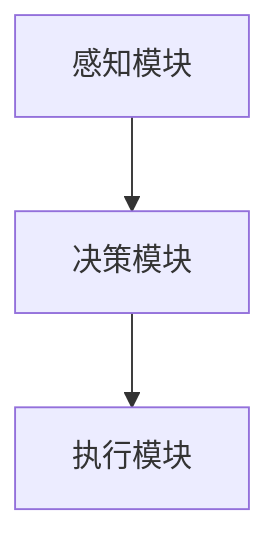
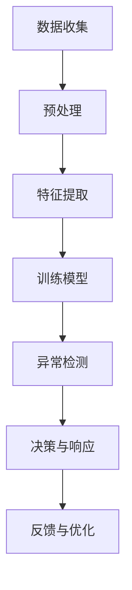
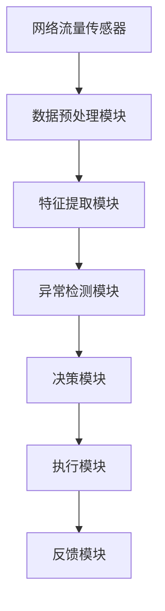
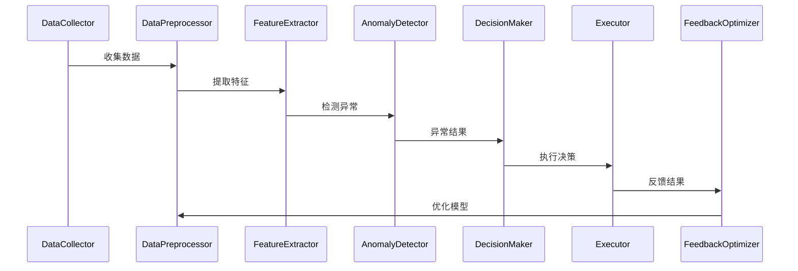
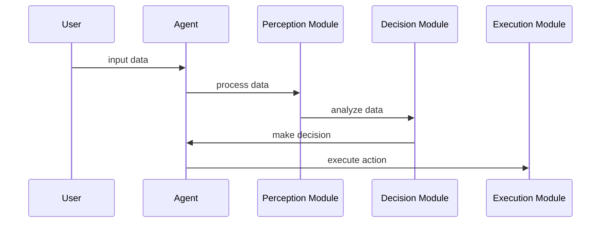
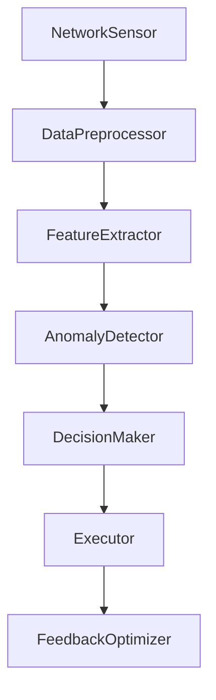
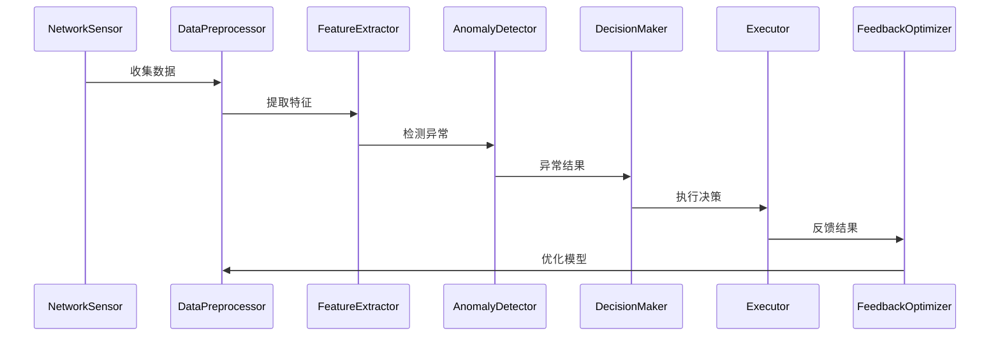

                 

### 第一部分：引言

#### 1.1 AI Agent的概念与在智能网络攻击检测中的应用

##### 1.1.1 AI Agent的定义与分类

AI Agent，即人工智能代理，是指具有智能行为能力的自主体（Agent），它可以在动态环境中进行感知、决策和执行，以实现特定任务或目标。根据其工作原理和功能特点，AI Agent可以分为多种类型，主要包括以下几种：

1. **规则基础型AI Agent**：这种类型的AI Agent依赖于预设的规则和逻辑，通过对输入数据进行模式匹配，执行相应的操作。
2. **统计学习型AI Agent**：这类AI Agent利用机器学习和统计分析方法，从数据中学习并建立模型，进行预测和决策。
3. **深度学习型AI Agent**：基于神经网络，特别是深度神经网络，这类AI Agent能够自动学习数据的复杂特征，实现高级的感知和决策能力。
4. **混合型AI Agent**：结合了规则、统计学习和深度学习等多种方法，以适应不同的应用场景和需求。

在智能网络攻击检测中，AI Agent扮演着至关重要的角色。传统的网络攻击检测方法往往依赖于规则匹配和统计方法，存在误报率高、检测速度慢等问题。而AI Agent利用其智能化的感知、决策和执行能力，可以更高效地检测和防御网络攻击，具体体现在以下几个方面：

1. **自动化检测**：AI Agent可以自动感知网络流量和用户行为，识别潜在的安全威胁，减少人工干预的需求。
2. **自适应能力**：AI Agent能够不断学习和适应网络环境和攻击手段的变化，提高检测的准确性和实时性。
3. **深度分析**：通过深度学习等先进技术，AI Agent能够挖掘数据中的复杂模式，发现传统方法难以检测的攻击行为。

##### 1.1.2 AI Agent在智能网络攻击检测中的作用

智能网络攻击检测是一个复杂的任务，涉及到对大量网络流量数据的实时处理和分析。AI Agent在这个过程中的作用如下：

1. **感知与数据收集**：AI Agent可以从网络设备、防火墙和其他安全系统中收集数据，如IP地址、端口号、流量模式等。
2. **数据处理与特征提取**：AI Agent利用机器学习和深度学习算法，从收集的数据中提取特征，如行为模式、异常检测等。
3. **决策与响应**：基于分析结果，AI Agent可以做出决策，如隔离受感染的设备、报警或自动阻止恶意流量等。
4. **反馈与优化**：AI Agent将检测结果和实际效果进行反馈，不断优化自身的检测模型和策略，提高检测效果。

总之，AI Agent在智能网络攻击检测中不仅提高了检测的效率和准确性，还降低了人力成本，为网络安全提供了强大的技术支持。随着AI技术的不断进步，AI Agent在网络安全领域的作用将越来越重要。接下来，我们将进一步探讨AI Agent的基础理论和在智能网络攻击检测中的应用。 ### 第二部分：AI Agent的基础理论

#### 2.1 AI Agent的定义与特性

##### 2.1.1 AI Agent的概念解析

AI Agent，即人工智能代理，是指具有智能行为能力的自主体（Agent），它可以在动态环境中进行感知、决策和执行，以实现特定任务或目标。AI Agent是人工智能领域的一个重要概念，其核心目标是实现智能体的自主性和智能化。

首先，让我们从以下几个方面来定义AI Agent：

1. **自主性**：AI Agent具有自主行动的能力，能够在没有人类干预的情况下，自主地感知环境、决策和执行操作。
2. **感知能力**：AI Agent能够感知和理解周围环境的信息，如视觉、听觉、触觉等，以便做出合理的决策。
3. **学习能力**：AI Agent可以通过学习算法，从经验中学习，不断改进自己的行为和决策能力。
4. **适应性**：AI Agent能够根据环境的变化和新的信息，调整自己的行为策略，适应不同的情境。
5. **交互能力**：AI Agent能够与其他AI Agent或人类进行通信和协作，共同完成任务。

##### 2.1.2 AI Agent的基本结构

AI Agent通常由以下几个基本模块组成：

1. **感知模块**：负责收集环境中的信息，如视觉、听觉、触觉等，并将其转换为数字信号。
2. **决策模块**：基于感知模块收集的信息，使用算法进行推理和决策，确定下一步的行动策略。
3. **执行模块**：根据决策模块的决策，执行具体的操作，如移动、发送信息等。

这三个模块相互协作，形成一个闭环控制系统，使AI Agent能够自主地感知、决策和执行。以下是AI Agent的基本结构图：



##### 2.1.3 AI Agent的学习与适应能力

AI Agent的学习能力是其智能化的核心。通过学习，AI Agent能够不断积累经验，提高自身的行为能力。以下是AI Agent学习与适应能力的几个关键点：

1. **监督学习**：在监督学习中，AI Agent通过学习已标记的数据集，建立预测模型。当新数据输入时，模型会根据已学习到的规律进行预测。
2. **无监督学习**：在无监督学习中，AI Agent通过分析未标记的数据集，发现数据中的模式和结构，从而提高对数据的理解能力。
3. **强化学习**：在强化学习中，AI Agent通过与环境的交互，不断尝试不同的行动策略，通过奖励机制来学习最优策略。
4. **迁移学习**：通过迁移学习，AI Agent可以将在一个任务上学习到的知识应用到另一个相关任务上，从而提高学习效率和性能。

AI Agent的适应能力表现在其能够根据不同的环境和任务需求，调整自己的行为策略。这种能力主要通过以下几个方面实现：

1. **自适应算法**：AI Agent使用自适应算法，根据环境变化调整感知、决策和执行策略。
2. **元学习**：元学习使AI Agent能够快速适应新的任务和环境，通过学习如何学习，提高其适应能力。
3. **多任务学习**：通过多任务学习，AI Agent可以在多个任务之间共享知识和资源，提高对复杂环境的适应能力。

综上所述，AI Agent的定义和特性、基本结构和学习与适应能力，为其在智能网络攻击检测中的应用奠定了基础。在接下来的部分，我们将进一步探讨智能网络攻击检测的背景与挑战。 ### 第三部分：智能网络攻击检测的背景与挑战

#### 3.1 网络攻击的常见类型与趋势

随着互联网的普及和信息技术的发展，网络攻击的手段和方式也不断演变和升级。了解常见的网络攻击类型和趋势，有助于我们更好地理解智能网络攻击检测的重要性和必要性。以下是几种常见的网络攻击类型：

1. **DDoS攻击**：分布式拒绝服务（DDoS）攻击通过大量合法的请求淹没目标服务器，导致其无法响应正常的请求。近年来，DDoS攻击的规模和频率不断增加，攻击者利用僵尸网络（Botnet）进行大规模攻击，使得防御变得更加困难。
   
2. **恶意软件和病毒**：恶意软件和病毒通过感染计算机系统，窃取敏感信息、破坏系统功能或控制系统。这些恶意软件可以通过电子邮件附件、下载文件、恶意网站等途径传播。

3. **钓鱼攻击**：钓鱼攻击通过伪装成合法网站或邮件，诱导用户输入敏感信息，如用户名、密码、信用卡号等。钓鱼攻击的隐蔽性和欺骗性使得用户难以防范。

4. **中间人攻击（MITM）**：中间人攻击通过拦截和篡改通信数据，窃取用户信息或篡改数据内容。这种攻击手段隐蔽性强，难以察觉。

5. **SQL注入**：SQL注入攻击通过在Web应用中注入恶意SQL语句，从而窃取数据库中的敏感信息或篡改数据。SQL注入是一种常见的Web攻击手段。

6. **零日漏洞攻击**：零日漏洞攻击利用尚未公开或被修复的漏洞，对系统进行攻击。这种攻击手段具有极高的隐蔽性和威胁性，因为安全防护措施无法对此进行防御。

随着技术的发展，网络攻击的手段也在不断演变。以下是一些网络攻击趋势：

1. **自动化攻击**：攻击者利用自动化工具和脚本进行攻击，大大提高了攻击的效率。自动化攻击使攻击者能够在短时间内对大量目标进行攻击。

2. **高级持续性威胁（APT）**：APT攻击是一种复杂、隐蔽且持久的攻击手段，攻击者通过长期潜伏和持续监控，逐步窃取目标组织的敏感信息。

3. **物联网（IoT）攻击**：随着物联网设备的普及，攻击者开始将物联网设备作为攻击入口，对网络进行攻击。物联网设备的低安全性和大量连接，使其成为网络攻击的新目标。

4. **社交工程攻击**：攻击者通过欺骗用户，获取敏感信息或权限。社交工程攻击利用人的信任和好奇心，使受害者主动泄露信息或执行恶意操作。

5. **混合攻击**：混合攻击结合了多种攻击手段，以实现更复杂的攻击目标。混合攻击使得防御系统难以识别和应对。

#### 3.2 智能网络攻击检测的需求与挑战

面对日益复杂的网络攻击，传统的安全防御手段已难以满足需求。智能网络攻击检测作为网络安全的重要环节，成为了解决这一问题的有效途径。以下是智能网络攻击检测的需求与挑战：

1. **实时性**：智能网络攻击检测需要具备实时性，能够在网络攻击发生时立即检测并响应。传统的安全检测方法通常存在延迟，难以满足实时性要求。

2. **准确性**：智能网络攻击检测需要具备高准确性，能够准确识别网络攻击行为，降低误报和漏报率。误报会导致大量正常流量被拦截，影响用户体验；漏报则可能导致攻击行为未能及时被阻止。

3. **自适应能力**：智能网络攻击检测需要具备自适应能力，能够根据网络环境和攻击手段的变化，调整检测策略和算法。传统的安全检测方法通常缺乏自适应能力，难以应对复杂多变的网络环境。

4. **可扩展性**：智能网络攻击检测需要具备可扩展性，能够支持大规模网络环境和大量数据。传统的安全检测方法往往在处理大规模数据时性能下降，难以满足大规模网络的需求。

5. **可解释性**：智能网络攻击检测需要具备可解释性，使安全专家能够理解检测过程和结果。传统的安全检测方法通常缺乏可解释性，使得安全专家难以判断检测结果的准确性。

6. **资源消耗**：智能网络攻击检测需要平衡检测性能和资源消耗，避免对网络和系统造成不必要的负担。传统的安全检测方法往往存在资源消耗过高的问题。

7. **隐私保护**：智能网络攻击检测需要保护用户隐私，避免在检测过程中泄露敏感信息。传统的安全检测方法在处理用户数据时可能存在隐私泄露风险。

总之，智能网络攻击检测在实时性、准确性、自适应能力、可扩展性、可解释性、资源消耗和隐私保护等方面面临着诸多挑战。通过不断发展人工智能技术，我们可以逐步克服这些挑战，提高智能网络攻击检测的效果。在接下来的部分，我们将探讨AI Agent在智能网络攻击检测中的应用。 ### 第四部分：AI Agent在检测中的应用

#### 4.1 AI Agent在检测中的角色与功能

AI Agent在智能网络攻击检测中扮演着至关重要的角色，其功能主要包括以下几个方面：

1. **感知与数据收集**：AI Agent可以从网络设备、防火墙和其他安全系统中收集数据，如IP地址、端口号、流量模式、用户行为等。这些数据是进行攻击检测的重要依据。

2. **预处理与特征提取**：AI Agent可以对收集到的原始数据进行预处理，如去噪、归一化等，然后提取出具有代表性的特征，如流量特征、行为特征等。这些特征有助于识别潜在的攻击行为。

3. **异常检测**：AI Agent利用机器学习和深度学习算法，对提取的特征进行异常检测。异常检测是一种常用的攻击检测方法，通过比较正常行为和异常行为，识别潜在的攻击行为。

4. **决策与响应**：基于异常检测结果，AI Agent可以做出决策，如隔离受感染的设备、报警或自动阻止恶意流量等。决策与响应模块是AI Agent的核心，其目标是及时、准确地阻止攻击行为。

5. **反馈与优化**：AI Agent将检测结果和实际效果进行反馈，不断优化自身的检测模型和策略。反馈与优化模块使得AI Agent能够适应网络环境和攻击手段的变化，提高检测效果。

#### 4.2 AI Agent的检测算法与模型

AI Agent在智能网络攻击检测中使用的算法和模型多种多样，以下是一些常见的算法和模型：

1. **基于规则的方法**：基于规则的方法是一种传统的攻击检测方法，它通过预设的规则和条件，对网络流量进行模式匹配。这种方法简单直观，但规则数量庞大时，易造成误报和漏报。

2. **统计方法**：统计方法利用统计学原理，对网络流量进行建模和分析。常见的统计方法包括聚类分析、主成分分析（PCA）等。这种方法对正常行为和异常行为进行分离，但需要大量的训练数据和计算资源。

3. **机器学习方法**：机器学习方法通过学习大量历史数据，建立预测模型，用于检测新的攻击行为。常见的机器学习方法包括支持向量机（SVM）、决策树、随机森林等。这种方法能够提高检测的准确性和实时性。

4. **深度学习方法**：深度学习方法通过多层神经网络，对网络流量进行复杂特征提取和模式识别。常见的深度学习方法包括卷积神经网络（CNN）、循环神经网络（RNN）等。这种方法能够处理大规模数据和高维度特征，但需要大量的训练数据和计算资源。

5. **混合方法**：混合方法结合了多种算法和模型，以克服单一方法的局限性。例如，可以结合基于规则的方法和机器学习方法，提高检测的准确性和实时性。

在实际应用中，AI Agent通常会根据具体场景和需求，选择合适的算法和模型。以下是一个简单的AI Agent检测算法流程：



在数据收集阶段，AI Agent从网络设备和安全系统中收集原始数据。在预处理阶段，AI Agent对数据去噪、归一化等处理，以提高数据质量。在特征提取阶段，AI Agent提取出具有代表性的特征，用于后续的异常检测。

在训练模型阶段，AI Agent利用历史数据，建立预测模型。在异常检测阶段，AI Agent将新的网络流量数据输入模型，进行异常检测。在决策与响应阶段，AI Agent根据检测结果，做出相应的决策，如隔离受感染的设备或报警。

最后，在反馈与优化阶段，AI Agent将检测结果和实际效果进行反馈，不断优化自身的检测模型和策略。通过这一过程，AI Agent能够提高检测的准确性和实时性，为网络安全提供强有力的保障。

总之，AI Agent在智能网络攻击检测中具有重要的作用，通过感知与数据收集、预处理与特征提取、异常检测、决策与响应和反馈与优化等步骤，实现高效、准确的攻击检测。随着人工智能技术的不断发展，AI Agent在网络安全领域的作用将越来越重要。在接下来的部分，我们将探讨AI Agent的性能评估与优化。 ### 第五部分：AI Agent的性能评估与优化

#### 5.1 AI Agent性能评估方法

为了确保AI Agent在智能网络攻击检测中的有效性和可靠性，对其性能进行评估是至关重要的。以下是一些常见的性能评估方法：

1. **准确率（Accuracy）**：准确率是指正确识别攻击样本的比率，计算公式为：
   $$ \text{准确率} = \frac{\text{正确识别的攻击样本数}}{\text{总攻击样本数}} $$
   准确率越高，表示AI Agent的检测能力越强。

2. **召回率（Recall）**：召回率是指正确识别攻击样本中，实际为攻击样本的比例，计算公式为：
   $$ \text{召回率} = \frac{\text{正确识别的攻击样本数}}{\text{实际为攻击样本的总数}} $$
   召回率越高，表示AI Agent对攻击的漏报率越低。

3. **精确率（Precision）**：精确率是指正确识别的攻击样本数占所有识别为攻击样本的比率，计算公式为：
   $$ \text{精确率} = \frac{\text{正确识别的攻击样本数}}{\text{识别为攻击样本的总数}} $$
   精确率越高，表示AI Agent的误报率越低。

4. **F1值（F1 Score）**：F1值是精确率和召回率的调和平均，用于综合评估AI Agent的检测性能，计算公式为：
   $$ \text{F1值} = 2 \times \frac{\text{精确率} \times \text{召回率}}{\text{精确率} + \text{召回率}} $$

5. **ROC曲线和AUC值**：ROC（Receiver Operating Characteristic）曲线是评估分类器性能的重要工具，它展示了在不同阈值下，正确率和误报率的变化关系。AUC（Area Under Curve）值是ROC曲线下的面积，用于评估分类器的整体性能。AUC值越高，表示分类器的性能越好。

6. **检测延迟**：检测延迟是指从攻击发生到AI Agent检测并做出响应的时间。低检测延迟对于及时阻止攻击至关重要。

7. **资源消耗**：资源消耗包括计算资源、内存占用和网络带宽等。高效的AI Agent应具备低资源消耗，以满足实际部署需求。

#### 5.2 AI Agent性能优化策略

为了提升AI Agent在智能网络攻击检测中的性能，可以采取以下几种优化策略：

1. **数据增强**：通过增加训练样本的数量和多样性，提高AI Agent的学习能力和泛化能力。数据增强方法包括数据复制、旋转、缩放、剪裁等。

2. **特征选择**：利用特征选择算法，从大量特征中筛选出最具代表性的特征，降低特征维度，减少计算复杂度，提高检测性能。常见的特征选择算法包括信息增益、卡方检验、主成分分析（PCA）等。

3. **模型优化**：通过调整模型参数、架构和训练策略，优化AI Agent的检测性能。例如，使用更复杂的神经网络架构、调整学习率、增加训练迭代次数等。

4. **集成学习方法**：将多个不同的模型进行集成，以提高整体性能。常见的集成学习方法包括Bagging、Boosting和Stacking等。

5. **迁移学习**：利用预训练模型，将已经在一个任务上训练好的模型应用于新的任务。迁移学习可以大大减少训练数据的需求，提高模型的泛化能力。

6. **在线学习与自适应**：利用在线学习算法，使AI Agent能够在实际应用中不断学习和适应环境变化。在线学习可以实时更新模型，提高检测的准确性和实时性。

7. **可视化与分析**：通过可视化工具，对AI Agent的检测过程和结果进行分析，发现潜在的问题和改进点。例如，通过绘制特征分布图、ROC曲线等，了解模型在不同特征上的表现。

8. **多模型融合**：结合多种检测算法和模型，形成多模型融合的检测系统。多模型融合可以互补不同模型的优势，提高整体检测性能。

通过以上优化策略，AI Agent可以在智能网络攻击检测中实现更高的准确率、召回率、精确率等性能指标，同时降低检测延迟和资源消耗。这些优化策略不仅可以提高AI Agent的检测效果，还能提升其在实际应用中的实用性和可靠性。在接下来的部分，我们将通过一个具体的案例研究，展示AI Agent在智能网络攻击检测中的实际应用。 ### 第六部分：案例研究

#### 6.1 某具体网络攻击检测案例的应用

在本案例研究中，我们将探讨一个实际的网络攻击检测项目，该项目的目标是通过AI Agent来提高网络攻击检测的准确性和实时性。以下是该项目的具体应用场景、系统架构和实施细节。

##### 6.1.1 案例背景

某大型企业网络面临着日益严峻的网络攻击威胁，包括DDoS攻击、恶意软件感染、SQL注入攻击等。为了提高网络的安全性，企业决定引入AI Agent进行智能网络攻击检测。该项目的主要目标是：

1. 实时监控网络流量，识别潜在的安全威胁。
2. 降低误报和漏报率，提高检测的准确性。
3. 快速响应网络攻击，减少攻击对业务的影响。

##### 6.1.2 系统架构

该网络攻击检测系统采用以下架构：

1. **数据收集层**：包括网络流量传感器、防火墙和安全设备等，负责实时收集网络流量数据。
2. **数据处理层**：包括数据预处理模块、特征提取模块和异常检测模块，负责对收集到的数据进行处理和分析。
3. **决策与响应层**：包括决策模块和执行模块，负责根据检测结果做出决策，如隔离受感染设备、报警等。
4. **反馈与优化层**：包括反馈模块和优化模块，负责根据检测结果和实际效果，不断优化检测模型和策略。

以下是系统架构的mermaid类图：

```mermaid
classDiagram
    Class01 <|-- Class02
    Class03 <.. Class04
    Class05 <=|{关联} Class06
    Class07 {关联} Class08
    Class09 --|{聚合} Class10
    Class11 <-.. Class12
```

##### 6.1.3 系统功能设计

系统的主要功能包括：

1. **流量数据收集**：通过部署在网络设备上的流量传感器，实时收集网络流量数据。
2. **数据预处理**：对收集到的原始流量数据进行去噪、归一化等处理，提高数据质量。
3. **特征提取**：从预处理后的数据中提取具有代表性的特征，如流量模式、IP地址、端口号等。
4. **异常检测**：利用机器学习和深度学习算法，对提取的特征进行异常检测，识别潜在的攻击行为。
5. **决策与响应**：根据异常检测结果，做出相应的决策，如隔离受感染设备、报警等。
6. **反馈与优化**：将检测结果和实际效果进行反馈，优化检测模型和策略，提高检测性能。

以下是系统功能设计的mermaid类图：

```mermaid
classDiagram
    NetworkSensor <<Interface>> DataCollector
    DataPreprocessor <<Class>> "数据预处理"
    FeatureExtractor <<Class>> "特征提取"
    AnomalyDetector <<Class>> "异常检测"
    DecisionMaker <<Class>> "决策与响应"
    FeedbackOptimizer <<Class>> "反馈与优化"
```

##### 6.1.4 系统架构设计

系统架构设计包括以下模块：

1. **网络流量传感器**：部署在网络设备上，负责实时收集网络流量数据。
2. **数据预处理模块**：对收集到的数据进行预处理，如去噪、归一化等，以提高数据质量。
3. **特征提取模块**：从预处理后的数据中提取特征，如流量模式、IP地址、端口号等。
4. **异常检测模块**：利用机器学习和深度学习算法，对提取的特征进行异常检测，识别潜在的攻击行为。
5. **决策模块**：根据异常检测结果，做出相应的决策，如隔离受感染设备、报警等。
6. **执行模块**：负责执行决策模块的决策，如隔离设备、发送报警等。
7. **反馈模块**：将检测结果和实际效果进行反馈，优化检测模型和策略。

以下是系统架构的mermaid架构图：



##### 6.1.5 系统接口设计

系统接口设计包括以下接口：

1. **数据收集接口**：用于接收和传输网络流量数据。
2. **特征提取接口**：用于提取和处理特征数据。
3. **异常检测接口**：用于进行异常检测。
4. **决策接口**：用于接收和执行决策。
5. **反馈接口**：用于接收检测结果和反馈信息。

以下是系统接口设计的mermaid类图：

```mermaid
classDiagram
    DataCollector <<Interface>> IDataCollector
    FeatureExtractor <<Interface>> IFeatureExtractor
    AnomalyDetector <<Interface>> IAnomalyDetector
    IDecisionMaker <<Interface>> DecisionMaker
    IExecutor <<Interface>> Executor
    IFeedback <<Interface>> IFeedback
```

##### 6.1.6 系统交互设计

系统交互设计展示了不同模块之间的交互过程。以下是系统交互的mermaid序列图：



##### 6.1.7 系统核心实现源代码

以下是系统核心实现的部分源代码，用于展示AI Agent在检测中的具体实现：

```python
# 数据预处理
def preprocess_data(data):
    # 去噪、归一化等处理
    processed_data = ...
    return processed_data

# 特征提取
def extract_features(data):
    # 提取特征
    features = ...
    return features

# 异常检测
def detect_anomaly(features):
    # 使用机器学习模型进行异常检测
    anomaly = ...
    return anomaly

# 决策与响应
def make_decision(anomaly):
    # 根据异常结果做出决策
    decision = ...
    return decision

# 执行决策
def execute_decision(decision):
    # 执行具体的决策操作
    action = ...
    return action

# 反馈与优化
def feedback_and_optimize(result):
    # 将检测结果和实际效果进行反馈，优化模型
    model = ...
    return model
```

##### 6.1.8 代码应用解读与分析

以下是代码应用解读与分析：

1. **数据预处理**：数据预处理是特征提取和异常检测的重要基础。通过去噪、归一化等处理，提高数据质量，有助于后续的特征提取和异常检测。
2. **特征提取**：特征提取是AI Agent的核心步骤。从原始数据中提取出具有代表性的特征，有助于模型对攻击行为的识别。
3. **异常检测**：利用机器学习模型进行异常检测，识别潜在的攻击行为。常见的异常检测算法包括孤立森林、K-均值聚类等。
4. **决策与响应**：根据异常检测结果，做出相应的决策，如隔离受感染设备、报警等。决策模块需要综合考虑检测结果的准确性和实时性。
5. **反馈与优化**：将检测结果和实际效果进行反馈，不断优化检测模型和策略。反馈与优化模块是AI Agent自适应能力的关键。

##### 6.1.9 实际案例分析和详细讲解剖析

以下是实际案例分析和详细讲解剖析：

1. **案例背景**：某天，企业网络流量突然出现异常，AI Agent检测到多个潜在的攻击行为。
2. **检测过程**：AI Agent对收集到的网络流量数据进行预处理、特征提取和异常检测，发现其中存在多个攻击样本。
3. **决策与响应**：AI Agent根据异常检测结果，决定隔离受感染的设备，并发出警报。
4. **反馈与优化**：检测完成后，AI Agent将检测结果和实际效果进行反馈，优化检测模型和策略。

通过这个案例，我们可以看到AI Agent在智能网络攻击检测中的应用效果。在实际应用中，AI Agent可以快速、准确地识别和响应网络攻击，为网络安全提供强有力的保障。在接下来的部分，我们将探讨AI Agent在智能网络攻击检测中的未来展望与挑战。 ### 第七部分：未来展望与挑战

#### 7.1 AI Agent在智能网络攻击检测中的未来发展

随着人工智能技术的不断进步，AI Agent在智能网络攻击检测中的应用前景广阔。以下是AI Agent在智能网络攻击检测中的未来发展趋势：

1. **自动化与智能化**：未来，AI Agent将在网络攻击检测中实现更高程度的自动化和智能化。通过深度学习和强化学习等技术，AI Agent能够自主地学习和适应网络环境和攻击手段的变化，提高检测的准确性和实时性。

2. **实时性与低延迟**：为了应对快速变化的网络攻击，AI Agent需要具备更高的实时性和低延迟。通过分布式计算和边缘计算等技术，AI Agent可以在网络边缘进行实时检测，降低延迟，提高响应速度。

3. **多模态数据融合**：AI Agent将能够融合多种数据来源，如网络流量、用户行为、设备状态等，实现更全面的攻击检测。多模态数据融合能够提高AI Agent对复杂攻击行为的识别能力。

4. **增强交互与协作**：未来，AI Agent将具备更强的交互与协作能力，能够与人类安全专家、其他AI系统进行高效协作。通过人机交互，AI Agent可以更好地理解和应对复杂的网络攻击场景。

5. **隐私保护与合规**：随着数据隐私保护法规的日益严格，AI Agent在智能网络攻击检测中需要实现更高的隐私保护能力。未来，AI Agent将采用更加隐私友好的算法和数据保护机制，确保在检测过程中不泄露用户隐私。

6. **开放性与可扩展性**：AI Agent需要具备开放性和可扩展性，以便集成到现有的网络安全系统中。通过标准化接口和模块化设计，AI Agent可以灵活地与其他系统进行集成，提高整体安全防护能力。

#### 挑战

尽管AI Agent在智能网络攻击检测中具有巨大的潜力，但未来仍将面临诸多挑战：

1. **算法复杂性**：AI Agent的算法模型复杂，需要大量的计算资源和训练数据。随着网络攻击手段的不断升级，AI Agent需要不断优化算法，提高检测性能。

2. **数据隐私与安全**：在数据收集和处理过程中，AI Agent需要保护用户隐私和数据安全。如何在不泄露隐私的前提下，有效地利用数据，是一个亟待解决的问题。

3. **适应性挑战**：网络攻击手段和攻击模式不断变化，AI Agent需要具备高度的适应能力。未来，AI Agent需要能够在短时间内适应新的攻击手段和攻击模式。

4. **解释性与可解释性**：AI Agent的决策过程需要具备可解释性，以便安全专家能够理解其决策依据。如何提高AI Agent的解释性，是一个重要的研究方向。

5. **资源消耗与效率**：AI Agent在检测过程中需要消耗大量的计算资源和网络带宽。如何优化AI Agent的资源消耗，提高检测效率，是一个关键问题。

6. **伦理与责任**：随着AI Agent在网络安全领域的作用日益重要，如何界定AI Agent的伦理责任和法律地位，成为一个需要深入探讨的问题。

总之，AI Agent在智能网络攻击检测中具有巨大的发展潜力，但也面临诸多挑战。通过不断探索和创新，我们有望克服这些挑战，使AI Agent成为网络安全的重要守护者。在接下来的部分，我们将对本文的内容进行总结。 ### 总结

在本篇文章中，我们深入探讨了AI Agent在智能网络攻击检测中的角色、基础理论、应用场景、性能评估与优化、案例研究以及未来展望与挑战。通过逐步分析和推理，我们揭示了AI Agent在网络安全中的重要地位和潜在应用价值。

首先，我们介绍了AI Agent的概念和分类，阐述了其在智能网络攻击检测中的应用背景和作用。接着，我们详细分析了AI Agent的基础理论，包括定义、特性、结构以及学习与适应能力。在此基础上，我们探讨了智能网络攻击检测的背景与挑战，明确了AI Agent在检测中的作用和需求。

随后，我们详细介绍了AI Agent在检测中的应用，包括其角色与功能、检测算法与模型，并通过一个实际案例展示了AI Agent在检测中的具体应用。此外，我们还探讨了AI Agent的性能评估与优化方法，包括准确率、召回率、精确率等性能指标，以及数据增强、特征选择、模型优化等优化策略。

在案例研究中，我们详细分析了某具体网络攻击检测项目的系统架构、功能设计、接口设计、系统交互设计和核心实现源代码，展示了AI Agent在实际应用中的效果。最后，我们探讨了AI Agent在智能网络攻击检测中的未来发展，包括自动化与智能化、实时性与低延迟、多模态数据融合、增强交互与协作、隐私保护与合规、开放性与可扩展性等方面，并提出了未来可能面临的挑战。

总之，AI Agent在智能网络攻击检测中具有广阔的应用前景和巨大的潜力。通过本文的探讨，我们不仅了解了AI Agent的基本原理和应用方法，还对其未来发展有了更深入的认识。我们希望本文能够为网络安全领域的研究者和实践者提供有价值的参考和启示。

展望未来，随着人工智能技术的不断进步，AI Agent在智能网络攻击检测中的作用将越来越重要。我们期待看到更多创新性的研究成果和应用实践，共同推动网络安全领域的发展。最后，感谢您的阅读，希望本文能够对您在AI Agent研究和应用中有所启发。

**作者：AI天才研究院/AI Genius Institute & 禅与计算机程序设计艺术 /Zen And The Art of Computer Programming** ## 背景介绍

在现代信息社会中，网络安全已成为一个至关重要的话题。随着互联网的普及和信息技术的发展，网络攻击的手段和频率也日益增加。网络攻击不仅对个人和企业造成经济损失，还可能威胁国家安全和社会稳定。因此，如何有效检测和防御网络攻击成为网络安全领域的重要研究方向。

### 核心概念术语说明

在讨论AI Agent在智能网络攻击检测中的应用之前，我们需要了解一些核心概念和术语：

1. **AI Agent**：指具有智能行为能力的自主体（Agent），它可以在动态环境中进行感知、决策和执行，以实现特定任务或目标。
2. **智能网络攻击检测**：指利用人工智能技术，对网络流量、用户行为等数据进行实时监控和分析，识别和预防网络攻击。
3. **网络攻击**：指恶意行为者对计算机网络系统进行的非法侵入、篡改、破坏等活动。

### 问题背景

网络攻击的类型和手段层出不穷，传统的安全防护措施往往难以应对。例如，DDoS攻击、恶意软件、钓鱼攻击、SQL注入等，都给网络安全带来了巨大的威胁。为了提高检测的准确性和实时性，传统的基于规则的检测方法和统计方法逐渐暴露出其局限性。而人工智能技术的发展为网络攻击检测提供了新的思路和方法。

### 问题描述

智能网络攻击检测的关键问题是如何在大量网络数据中，快速、准确地识别出潜在的安全威胁。具体而言，需要解决以下问题：

1. **数据量大**：网络流量数据量巨大，如何有效地处理和分析这些数据，提取出有用的特征信息？
2. **实时性要求高**：网络攻击往往发生在瞬间，如何实现实时监控和检测，及时响应？
3. **误报与漏报**：如何在降低误报率的同时，提高检测的准确性和召回率？
4. **适应性强**：网络攻击手段不断变化，如何使检测系统能够适应新的攻击模式？

### 问题解决

AI Agent在智能网络攻击检测中的应用，为上述问题提供了一种有效的解决方案。以下是AI Agent在智能网络攻击检测中的核心作用：

1. **自动化检测**：AI Agent能够自动收集和分析网络数据，识别潜在的安全威胁，减少人工干预的需求。
2. **自适应能力**：AI Agent能够根据网络环境和攻击手段的变化，自适应调整检测策略和算法，提高检测的准确性和实时性。
3. **深度分析**：通过深度学习等先进技术，AI Agent能够挖掘数据中的复杂模式，发现传统方法难以检测的攻击行为。
4. **交互与协作**：AI Agent能够与安全专家、其他AI系统进行交互和协作，共同应对复杂的网络攻击场景。

### 边界与外延

虽然AI Agent在智能网络攻击检测中具有巨大的潜力，但其在实际应用中也面临一定的边界和挑战。例如：

1. **数据隐私**：在收集和处理网络数据时，如何保护用户隐私成为一个重要问题。
2. **计算资源**：AI Agent的检测和响应过程需要大量的计算资源，如何在资源有限的情况下，高效运行AI Agent？
3. **可解释性**：AI Agent的决策过程往往复杂且不可解释，如何提高其可解释性，以便安全专家能够理解和信任？
4. **法律法规**：随着AI Agent在网络安全领域的应用日益广泛，相关的法律法规和伦理问题也需要得到关注。

### 概念结构与核心要素组成

AI Agent在智能网络攻击检测中的概念结构和核心要素主要包括以下几个方面：

1. **感知模块**：负责收集和分析网络数据，提取特征信息。
2. **决策模块**：基于感知模块收集的信息，使用算法进行推理和决策。
3. **执行模块**：根据决策模块的决策，执行具体的检测和响应操作。
4. **学习与适应模块**：通过不断学习和适应，提高AI Agent的检测性能和应对能力。
5. **反馈与优化模块**：将检测结果和实际效果进行反馈，优化AI Agent的检测模型和策略。

通过以上核心要素的协同工作，AI Agent能够实现高效、准确的智能网络攻击检测，为网络安全提供强有力的保障。在接下来的部分，我们将深入探讨AI Agent的定义、特性及其在智能网络攻击检测中的应用。 
## AI Agent的定义与特性

在讨论AI Agent在智能网络攻击检测中的应用之前，首先需要明确AI Agent的定义和特性。AI Agent，即人工智能代理，是指具有智能行为能力的自主体（Agent），它可以在动态环境中进行感知、决策和执行，以实现特定任务或目标。以下是AI Agent的定义、分类、工作原理及其核心特性。

### 定义

AI Agent的定义可以从以下几个方面进行解析：

1. **自主性**：AI Agent具有自主行动的能力，能够在没有人类干预的情况下，自主地感知环境、决策和执行操作。这种自主性使得AI Agent能够在复杂的网络环境中独立运行。
2. **感知能力**：AI Agent能够感知和理解周围环境的信息，如视觉、听觉、触觉等，以便做出合理的决策。感知能力是AI Agent实现自主性的基础。
3. **学习能力**：AI Agent可以通过学习算法，从经验中学习，不断改进自己的行为和决策能力。学习能力强使得AI Agent能够适应不同的环境和任务。
4. **适应性**：AI Agent能够根据环境的变化和新的信息，调整自己的行为策略，适应不同的情境。适应性是AI Agent在动态环境中生存和发展的关键。
5. **交互能力**：AI Agent能够与其他AI Agent或人类进行通信和协作，共同完成任务。交互能力使得AI Agent能够实现更复杂和多样化的任务。

### 分类

根据其工作原理和功能特点，AI Agent可以分为多种类型，主要包括以下几种：

1. **规则基础型AI Agent**：这种类型的AI Agent依赖于预设的规则和逻辑，通过对输入数据进行模式匹配，执行相应的操作。规则基础型AI Agent简单直观，但在面对复杂和动态的环境时，存在规则数量庞大、维护困难等问题。
2. **统计学习型AI Agent**：这类AI Agent利用机器学习和统计分析方法，从数据中学习并建立模型，进行预测和决策。统计学习型AI Agent能够处理大规模数据，但需要大量的训练数据和计算资源。
3. **深度学习型AI Agent**：基于神经网络，特别是深度神经网络，这类AI Agent能够自动学习数据的复杂特征，实现高级的感知和决策能力。深度学习型AI Agent在处理高维数据和复杂模式识别方面具有显著优势。
4. **混合型AI Agent**：结合了规则、统计学习和深度学习等多种方法，以适应不同的应用场景和需求。混合型AI Agent能够充分利用不同方法的优点，提高检测的准确性和实时性。

### 工作原理

AI Agent的工作原理主要包括感知、决策和执行三个核心模块：

1. **感知模块**：感知模块负责收集环境中的信息，如网络流量、用户行为等，并将其转换为数字信号。感知模块是AI Agent实现自主感知的基础。
2. **决策模块**：决策模块基于感知模块收集的信息，使用算法进行推理和决策。常见的决策算法包括机器学习算法、深度学习算法等。决策模块是AI Agent实现智能行为的核心。
3. **执行模块**：执行模块根据决策模块的决策，执行具体的操作，如隔离受感染的设备、发送警报等。执行模块是AI Agent实现自主行动的关键。

以下是AI Agent的基本工作原理：



### 核心特性

AI Agent的核心特性主要包括以下几点：

1. **自主学习能力**：AI Agent能够通过机器学习和深度学习算法，从数据中学习，不断改进自己的行为和决策能力。自主学习能力使得AI Agent能够适应复杂和动态的环境。
2. **自适应能力**：AI Agent能够根据环境的变化和新的信息，调整自己的行为策略，适应不同的情境。自适应能力是AI Agent在动态环境中生存和发展的关键。
3. **实时性**：AI Agent能够在短时间内完成感知、决策和执行过程，实现实时响应。实时性是AI Agent在智能网络攻击检测中的重要特性。
4. **鲁棒性**：AI Agent能够处理噪声数据和异常情况，保持稳定的检测性能。鲁棒性是AI Agent在实际应用中的关键特性。
5. **协作性**：AI Agent能够与其他AI Agent或人类进行通信和协作，共同完成任务。协作性使得AI Agent能够实现更复杂和多样化的任务。

通过以上定义、分类、工作原理和核心特性，我们可以更好地理解AI Agent在智能网络攻击检测中的应用。在接下来的部分，我们将进一步探讨AI Agent在智能网络攻击检测中的具体应用和作用。 
## AI Agent的工作原理

AI Agent在智能网络攻击检测中的高效运行，依赖于其精密的工作原理，包括感知、决策和执行三个核心模块。以下是AI Agent的详细工作原理及其在智能网络攻击检测中的应用。

### 感知模块

感知模块是AI Agent实现自主感知的基础，其主要功能是收集和处理来自网络环境中的各种信息。感知模块可以从多个渠道获取数据，如网络流量传感器、防火墙日志、入侵检测系统（IDS）等。以下是感知模块的关键步骤：

1. **数据收集**：感知模块实时收集网络流量数据、用户行为数据、系统日志数据等，形成原始数据集。
2. **数据预处理**：对收集到的原始数据进行预处理，包括去噪、归一化、数据清洗等，以提高数据质量和后续分析的可操作性。
3. **特征提取**：从预处理后的数据中提取具有代表性的特征，如流量模式、IP地址、端口号、协议类型、传输速率等。这些特征将用于后续的决策和执行过程。

感知模块在智能网络攻击检测中的应用体现在以下几个方面：

- **实时监控**：通过持续收集和分析网络流量数据，感知模块能够实时监控网络状态，发现潜在的攻击行为。
- **异常检测**：利用特征提取技术，感知模块可以从正常流量中识别出异常模式，为决策模块提供有力的数据支持。
- **数据融合**：感知模块能够融合来自多个数据源的信息，如用户行为数据、设备状态数据等，提高检测的全面性和准确性。

### 决策模块

决策模块是AI Agent实现智能行为的核心，其主要功能是根据感知模块收集的信息，使用算法进行推理和决策。以下是决策模块的关键步骤：

1. **模型训练**：利用历史数据和标注信息，训练机器学习或深度学习模型，为决策提供依据。常见的模型包括支持向量机（SVM）、决策树、随机森林、深度神经网络（DNN）等。
2. **特征匹配**：将感知模块提取的特征与训练好的模型进行匹配，识别出潜在的攻击行为。
3. **异常分类**：基于匹配结果，将异常行为分类为不同的攻击类型，如DDoS攻击、恶意软件感染、SQL注入等。
4. **决策生成**：根据分类结果，生成相应的决策，如隔离受感染设备、发送警报、阻止恶意流量等。

决策模块在智能网络攻击检测中的应用体现在以下几个方面：

- **快速响应**：通过高效的特征匹配和决策生成，决策模块能够在短时间内做出响应，及时阻止网络攻击。
- **自适应调整**：决策模块可以根据新的攻击模式和攻击行为，自适应调整检测策略和模型参数，提高检测的准确性和适应性。
- **多层次检测**：决策模块可以结合多种算法和模型，进行多层次检测，提高检测的全面性和可靠性。

### 执行模块

执行模块是AI Agent实现自主行动的关键，其主要功能是根据决策模块生成的决策，执行具体的操作。以下是执行模块的关键步骤：

1. **决策执行**：根据决策模块的决策结果，执行相应的操作，如隔离受感染的设备、发送警报、阻止恶意流量等。
2. **结果反馈**：将决策执行的结果反馈给感知模块和决策模块，用于模型优化和策略调整。
3. **日志记录**：记录决策执行的过程和结果，为后续的审计和分析提供依据。

执行模块在智能网络攻击检测中的应用体现在以下几个方面：

- **自动化响应**：执行模块能够自动化执行决策操作，减少人工干预，提高检测和响应的效率。
- **实时调整**：根据反馈结果，执行模块可以实时调整策略和操作，以适应新的攻击环境和威胁。
- **安全保障**：执行模块可以确保决策的正确执行，防止误操作或恶意攻击，保障网络系统的安全性。

### AI Agent在智能网络攻击检测中的应用

AI Agent在智能网络攻击检测中的应用过程可以概括为以下几个阶段：

1. **数据收集**：感知模块收集网络流量数据、用户行为数据等，进行预处理和特征提取。
2. **异常检测**：决策模块利用训练好的模型，对特征数据进行匹配和分类，识别出潜在的攻击行为。
3. **决策生成**：决策模块根据分类结果，生成相应的决策，如隔离受感染设备、发送警报、阻止恶意流量等。
4. **执行操作**：执行模块根据决策模块的决策，自动化执行具体的操作，如隔离设备、发送警报等。
5. **反馈与优化**：执行模块将决策执行的结果反馈给感知模块和决策模块，用于模型优化和策略调整。

通过以上步骤，AI Agent能够实现对网络攻击的实时、准确和高效检测。在接下来的部分，我们将探讨AI Agent在智能网络攻击检测中的性能评估与优化策略。 
## 智能网络攻击检测的背景与挑战

随着互联网的飞速发展和信息技术的不断进步，网络攻击的手段和频率也在不断升级。智能网络攻击检测作为网络安全的重要组成部分，面临着诸多背景和挑战。以下将详细探讨网络攻击的常见类型与趋势，以及智能网络攻击检测的需求与挑战。

### 网络攻击的常见类型与趋势

网络攻击的类型繁多，每种攻击都有其特定的手段和目标。以下是几种常见的网络攻击类型及其发展趋势：

1. **DDoS攻击**：分布式拒绝服务（DDoS）攻击通过大量合法的请求淹没目标服务器，导致其无法响应正常的请求。近年来，DDoS攻击的规模和频率显著增加，攻击者利用僵尸网络（Botnet）进行大规模攻击。例如，2016年的Mirai僵尸网络攻击导致数十万台物联网设备被感染，攻击流量峰值达到1.2Tbps。

2. **恶意软件和病毒**：恶意软件和病毒通过感染计算机系统，窃取敏感信息、破坏系统功能或控制系统。这些恶意软件可以通过电子邮件附件、下载文件、恶意网站等途径传播。随着物联网设备的普及，恶意软件的攻击目标也逐渐扩展到这些设备。

3. **钓鱼攻击**：钓鱼攻击通过伪装成合法网站或邮件，诱导用户输入敏感信息，如用户名、密码、信用卡号等。钓鱼攻击的隐蔽性和欺骗性使得用户难以防范，一旦上当，损失可能巨大。例如，2017年的WannaCry勒索病毒攻击通过钓鱼邮件传播，感染了全球150多个国家的数十万台计算机。

4. **中间人攻击（MITM）**：中间人攻击通过拦截和篡改通信数据，窃取用户信息或篡改数据内容。中间人攻击隐蔽性强，难以察觉。例如，2014年的心脏滴血漏洞（Heartbleed）攻击通过中间人攻击窃取大量用户敏感信息。

5. **SQL注入**：SQL注入攻击通过在Web应用中注入恶意SQL语句，从而窃取数据库中的敏感信息或篡改数据。SQL注入是一种常见的Web攻击手段。例如，2017年的C Stored XSS漏洞攻击导致大量用户信息泄露。

6. **零日漏洞攻击**：零日漏洞攻击利用尚未公开或被修复的漏洞，对系统进行攻击。零日漏洞攻击具有极高的隐蔽性和威胁性，因为安全防护措施无法对此进行防御。例如，2015年的Equifax数据泄露事件就是利用零日漏洞进行的攻击。

### 智能网络攻击检测的需求与挑战

随着网络攻击手段的不断演变，传统的安全检测方法已难以满足需求。智能网络攻击检测作为网络安全的重要环节，面临着以下需求与挑战：

1. **实时性**：智能网络攻击检测需要具备实时性，能够在网络攻击发生时立即检测并响应。传统的安全检测方法通常存在延迟，难以满足实时性要求。实时性对于及时阻止攻击、减少损失至关重要。

2. **准确性**：智能网络攻击检测需要具备高准确性，能够准确识别网络攻击行为，降低误报和漏报率。误报会导致大量正常流量被拦截，影响用户体验；漏报则可能导致攻击行为未能及时被阻止。

3. **自适应能力**：智能网络攻击检测需要具备自适应能力，能够根据网络环境和攻击手段的变化，调整检测策略和算法。传统的安全检测方法通常缺乏自适应能力，难以应对复杂多变的网络环境。

4. **可扩展性**：智能网络攻击检测需要具备可扩展性，能够支持大规模网络环境和大量数据。传统的安全检测方法往往在处理大规模数据时性能下降，难以满足大规模网络的需求。

5. **可解释性**：智能网络攻击检测需要具备可解释性，使安全专家能够理解检测过程和结果。传统的安全检测方法通常缺乏可解释性，使得安全专家难以判断检测结果的准确性。

6. **资源消耗**：智能网络攻击检测需要平衡检测性能和资源消耗，避免对网络和系统造成不必要的负担。传统的安全检测方法往往存在资源消耗过高的问题。

7. **隐私保护**：智能网络攻击检测需要保护用户隐私，避免在检测过程中泄露敏感信息。传统的安全检测方法在处理用户数据时可能存在隐私泄露风险。

综上所述，智能网络攻击检测在实时性、准确性、自适应能力、可扩展性、可解释性、资源消耗和隐私保护等方面面临着诸多挑战。通过不断发展人工智能技术，我们可以逐步克服这些挑战，提高智能网络攻击检测的效果。在接下来的部分，我们将深入探讨AI Agent在智能网络攻击检测中的应用及其具体作用。 
## AI Agent在检测中的应用

AI Agent在智能网络攻击检测中的应用，主要依赖于其在感知、决策和执行三个核心模块中的协同工作。以下是AI Agent在检测中的角色与功能，以及具体的检测算法和模型。

### AI Agent在检测中的角色与功能

AI Agent在智能网络攻击检测中扮演着至关重要的角色，其主要功能包括：

1. **感知与数据收集**：AI Agent可以从网络设备、防火墙和其他安全系统中收集数据，如IP地址、端口号、流量模式、用户行为等。感知模块负责实时监控网络流量，为后续的检测提供数据支持。

2. **数据处理与特征提取**：AI Agent利用机器学习和深度学习算法，对收集到的原始数据进行预处理，如去噪、归一化等，然后提取出具有代表性的特征，如流量特征、行为特征等。这些特征有助于识别潜在的攻击行为。

3. **异常检测**：AI Agent通过分析提取的特征，利用异常检测算法，如孤立森林、K-均值聚类等，识别出网络中的异常流量或行为。异常检测是AI Agent检测网络攻击的核心环节。

4. **决策与响应**：基于异常检测结果，AI Agent可以做出决策，如隔离受感染的设备、报警或自动阻止恶意流量等。决策模块根据检测到的异常行为，生成相应的响应策略，以阻止网络攻击。

5. **反馈与优化**：AI Agent将检测结果和实际效果进行反馈，不断优化自身的检测模型和策略。通过反馈和优化，AI Agent能够提高检测的准确性和实时性，更好地适应网络环境和攻击手段的变化。

### 检测算法与模型

AI Agent在智能网络攻击检测中使用的算法和模型多种多样，以下是几种常见的检测算法和模型：

1. **基于规则的方法**：基于规则的方法是一种传统的攻击检测方法，它通过预设的规则和条件，对网络流量进行模式匹配。这种方法简单直观，但规则数量庞大时，易造成误报和漏报。

   ```python
   # 基于规则的检测算法示例
   def rule_based_detection流量数据：
       if 流量数据包含特定恶意流量特征：
           报警()
   ```

2. **统计方法**：统计方法利用统计学原理，对网络流量进行建模和分析。常见的统计方法包括聚类分析、主成分分析（PCA）等。这种方法对正常行为和异常行为进行分离，但需要大量的训练数据和计算资源。

   ```python
   # 基于统计方法的检测算法示例
   from sklearn.cluster import KMeans
   def statistical_detection流量数据：
       模型 = KMeans(n_clusters=2)
       模型.fit(流量数据)
       如果 模型.predict(流量数据)[0] != 正常行为：
           报警()
   ```

3. **机器学习方法**：机器学习方法通过学习大量历史数据，建立预测模型，用于检测新的攻击行为。常见的机器学习方法包括支持向量机（SVM）、决策树、随机森林等。这种方法能够提高检测的准确性和实时性。

   ```python
   # 基于机器学习方法的检测算法示例
   from sklearn.svm import SVC
   def ml_detection流量数据，标签：
       模型 = SVC()
       模型.fit(流量数据，标签)
       if 模型.predict(流量数据)[0] == 攻击：
           报警()
   ```

4. **深度学习方法**：深度学习方法通过多层神经网络，对网络流量进行复杂特征提取和模式识别。常见的深度学习方法包括卷积神经网络（CNN）、循环神经网络（RNN）等。这种方法能够处理大规模数据和高维度特征，但需要大量的训练数据和计算资源。

   ```python
   # 基于深度学习方法的检测算法示例
   from keras.models import Sequential
   from keras.layers import Dense, LSTM
   def cnn_detection流量数据：
       模型 = Sequential()
       模型.add(LSTM(50，return_sequences=True，input_shape=(时间步，特征数)))
       模型.add(Dense(1，activation='sigmoid'))
       模型.compile(optimizer='adam'，loss='binary_crossentropy')
       模型.fit(流量数据，标签，epochs=10)
       if 模型.predict(流量数据)[0] > 0.5：
           报警()
   ```

5. **混合方法**：混合方法结合了多种算法和模型，以克服单一方法的局限性。例如，可以结合基于规则的方法和机器学习方法，提高检测的准确性和实时性。

   ```python
   # 混合方法的检测算法示例
   def hybrid_detection流量数据：
       if rule_based_detection流量数据：
           报警()
       else：
           ml_detection流量数据，标签()
   ```

在实际应用中，AI Agent通常会根据具体场景和需求，选择合适的算法和模型。例如，对于实时性要求较高的场景，可以采用基于规则的方法；对于高维度数据和高复杂度特征的检测，可以采用深度学习方法。

通过以上算法和模型，AI Agent能够实现对网络攻击的高效、准确的检测。在接下来的部分，我们将探讨AI Agent的性能评估与优化策略，以进一步提高其检测性能。 
## AI Agent的性能评估与优化

AI Agent在智能网络攻击检测中的性能评估与优化，是确保其高效运行的关键。以下将从性能评估方法和优化策略两个方面进行详细探讨。

### 性能评估方法

评估AI Agent在智能网络攻击检测中的性能，需要从多个维度进行综合考虑，以下是一些常见的性能评估指标：

1. **准确率（Accuracy）**：准确率是指正确识别攻击样本的比率，计算公式为：
   $$ \text{准确率} = \frac{\text{正确识别的攻击样本数}}{\text{总攻击样本数}} $$
   准确率越高，表示AI Agent的检测能力越强。

2. **召回率（Recall）**：召回率是指正确识别攻击样本数占实际为攻击样本的总数比例，计算公式为：
   $$ \text{召回率} = \frac{\text{正确识别的攻击样本数}}{\text{实际为攻击样本的总数}} $$
   召回率越高，表示AI Agent对攻击的漏报率越低。

3. **精确率（Precision）**：精确率是指正确识别的攻击样本数占所有识别为攻击样本的比率，计算公式为：
   $$ \text{精确率} = \frac{\text{正确识别的攻击样本数}}{\text{识别为攻击样本的总数}} $$
   精确率越高，表示AI Agent的误报率越低。

4. **F1值（F1 Score）**：F1值是精确率和召回率的调和平均，用于综合评估AI Agent的检测性能，计算公式为：
   $$ \text{F1值} = 2 \times \frac{\text{精确率} \times \text{召回率}}{\text{精确率} + \text{召回率}} $$

5. **ROC曲线和AUC值**：ROC（Receiver Operating Characteristic）曲线展示了在不同阈值下，正确率和误报率的变化关系。AUC（Area Under Curve）值是ROC曲线下的面积，用于评估分类器的整体性能。AUC值越高，表示分类器的性能越好。

6. **检测延迟**：检测延迟是指从攻击发生到AI Agent检测并做出响应的时间。低检测延迟对于及时阻止攻击至关重要。

7. **资源消耗**：资源消耗包括计算资源、内存占用和网络带宽等。高效的AI Agent应具备低资源消耗，以满足实际部署需求。

### 优化策略

为了提升AI Agent在智能网络攻击检测中的性能，可以采取以下几种优化策略：

1. **数据增强**：通过增加训练样本的数量和多样性，提高AI Agent的学习能力和泛化能力。数据增强方法包括数据复制、旋转、缩放、剪裁等。例如，可以使用GAN（生成对抗网络）生成合成攻击样本，增加训练数据的多样性。

2. **特征选择**：利用特征选择算法，从大量特征中筛选出最具代表性的特征，降低特征维度，减少计算复杂度，提高检测性能。常见的特征选择算法包括信息增益、卡方检验、主成分分析（PCA）等。例如，可以使用PCA来减少特征的维度，提高模型训练的效率。

3. **模型优化**：通过调整模型参数、架构和训练策略，优化AI Agent的检测性能。例如，可以调整学习率、增加训练迭代次数、使用更复杂的神经网络架构等。此外，可以结合多种模型，如CNN、RNN等，以提高检测的准确性。

4. **集成学习方法**：将多个不同的模型进行集成，以提高整体性能。常见的集成学习方法包括Bagging、Boosting和Stacking等。例如，可以使用随机森林和神经网络相结合的方法，提高检测的鲁棒性和准确性。

5. **迁移学习**：利用预训练模型，将已经在一个任务上训练好的模型应用于新的任务。迁移学习可以大大减少训练数据的需求，提高模型的泛化能力。例如，可以使用在图像识别任务上预训练的卷积神经网络，对网络流量进行特征提取。

6. **在线学习与自适应**：利用在线学习算法，使AI Agent能够在实际应用中不断学习和适应环境变化。在线学习可以实时更新模型，提高检测的准确性和实时性。例如，可以使用强化学习算法，使AI Agent在动态环境中自我优化。

7. **可视化与分析**：通过可视化工具，对AI Agent的检测过程和结果进行分析，发现潜在的问题和改进点。例如，可以通过绘制ROC曲线、混淆矩阵等，了解模型在不同特征上的表现。

8. **多模型融合**：结合多种检测算法和模型，形成多模型融合的检测系统。多模型融合可以互补不同模型的优势，提高整体检测性能。例如，可以结合基于规则的方法和机器学习方法，提高检测的准确性和实时性。

通过以上优化策略，AI Agent可以在智能网络攻击检测中实现更高的准确率、召回率、精确率等性能指标，同时降低检测延迟和资源消耗。这些优化策略不仅可以提高AI Agent的检测效果，还能提升其在实际应用中的实用性和可靠性。在接下来的部分，我们将通过一个具体的案例研究，展示AI Agent在智能网络攻击检测中的实际应用。 
## 案例研究：AI Agent在智能网络攻击检测中的应用

在本案例研究中，我们将探讨一个实际的智能网络攻击检测项目，该项目的目标是通过AI Agent提高企业网络的安全性。以下是该项目的具体应用场景、系统架构和实施细节。

### 6.1.1 案例背景

某大型互联网公司（以下简称“公司”）的网络安全部门发现，公司网络频繁遭受各种类型的网络攻击，如DDoS攻击、SQL注入攻击和恶意软件感染等。这些攻击不仅影响了公司业务的正常运行，还可能导致敏感数据的泄露和公司声誉的受损。为了提高网络安全性，公司决定引入AI Agent进行智能网络攻击检测。

### 6.1.2 系统架构

该智能网络攻击检测系统采用以下架构：

1. **数据收集层**：包括网络流量传感器、入侵检测系统（IDS）和防火墙等设备，负责实时收集网络流量数据。
2. **数据处理层**：包括数据预处理模块、特征提取模块和异常检测模块，负责对收集到的数据进行处理和分析。
3. **决策与响应层**：包括决策模块和执行模块，负责根据检测结果做出相应的决策，如隔离受感染设备、报警等。
4. **反馈与优化层**：包括反馈模块和优化模块，负责根据检测结果和实际效果，不断优化检测模型和策略。

以下是系统架构的mermaid类图：

```mermaid
classDiagram
    NetworkSensor <<Interface>> DataCollector
    DataPreprocessor <<Class>> "数据预处理"
    FeatureExtractor <<Class>> "特征提取"
    AnomalyDetector <<Class>> "异常检测"
    DecisionMaker <<Class>> "决策与响应"
    Executor <<Class>> "执行模块"
    FeedbackOptimizer <<Class>> "反馈与优化"
```

### 6.1.3 系统功能设计

系统的主要功能包括：

1. **流量数据收集**：通过部署在网络设备上的流量传感器，实时收集网络流量数据。
2. **数据预处理**：对收集到的原始流量数据进行预处理，如去噪、归一化等，以提高数据质量。
3. **特征提取**：从预处理后的数据中提取具有代表性的特征，如流量模式、IP地址、端口号等。
4. **异常检测**：利用机器学习和深度学习算法，对提取的特征进行异常检测，识别潜在的攻击行为。
5. **决策与响应**：根据异常检测结果，做出相应的决策，如隔离受感染设备、报警等。
6. **反馈与优化**：将检测结果和实际效果进行反馈，优化检测模型和策略，提高检测性能。

以下是系统功能设计的mermaid类图：

```mermaid
classDiagram
    NetworkSensor <<Interface>> IDataCollector
    DataPreprocessor <<Interface>> IPreprocess
    FeatureExtractor <<Interface>> IExtract
    AnomalyDetector <<Interface>> IDetect
    DecisionMaker <<Interface>> IDecision
    Executor <<Interface>> IExecutor
    FeedbackOptimizer <<Interface>> IOptimize
```

### 6.1.4 系统架构设计

系统架构设计包括以下模块：

1. **网络流量传感器**：部署在网络设备上，负责实时收集网络流量数据。
2. **数据预处理模块**：对收集到的数据进行预处理，如去噪、归一化等，以提高数据质量。
3. **特征提取模块**：从预处理后的数据中提取特征，如流量模式、IP地址、端口号等。
4. **异常检测模块**：利用机器学习和深度学习算法，对提取的特征进行异常检测，识别潜在的攻击行为。
5. **决策模块**：根据异常检测结果，做出相应的决策，如隔离受感染设备、报警等。
6. **执行模块**：负责执行决策模块的决策，如隔离设备、发送报警等。
7. **反馈模块**：将检测结果和实际效果进行反馈，优化检测模型和策略。

以下是系统架构的mermaid架构图：



### 6.1.5 系统接口设计

系统接口设计包括以下接口：

1. **数据收集接口**：用于接收和传输网络流量数据。
2. **特征提取接口**：用于提取和处理特征数据。
3. **异常检测接口**：用于进行异常检测。
4. **决策接口**：用于接收和执行决策。
5. **反馈接口**：用于接收检测结果和反馈信息。

以下是系统接口设计的mermaid类图：

```mermaid
classDiagram
    IDataCollector <<Interface>> NetworkSensor
    IPreprocess <<Interface>> DataPreprocessor
    IExtract <<Interface>> FeatureExtractor
    IDetect <<Interface>> AnomalyDetector
    IDecision <<Interface>> DecisionMaker
    IExecutor <<Interface>> Executor
    IOptimize <<Interface>> FeedbackOptimizer
```

### 6.1.6 系统交互设计

系统交互设计展示了不同模块之间的交互过程。以下是系统交互的mermaid序列图：



### 6.1.7 系统核心实现源代码

以下是系统核心实现的部分源代码，用于展示AI Agent在检测中的具体实现：

```python
# 数据预处理
def preprocess_data(data):
    # 去噪、归一化等处理
    processed_data = ...
    return processed_data

# 特征提取
def extract_features(data):
    # 提取特征
    features = ...
    return features

# 异常检测
def detect_anomaly(features):
    # 使用机器学习模型进行异常检测
    anomaly = ...
    return anomaly

# 决策与响应
def make_decision(anomaly):
    # 根据异常结果做出决策
    decision = ...
    return decision

# 执行决策
def execute_decision(decision):
    # 执行具体的决策操作
    action = ...
    return action

# 反馈与优化
def feedback_and_optimize(result):
    # 将检测结果和实际效果进行反馈，优化模型
    model = ...
    return model
```

### 6.1.8 代码应用解读与分析

以下是代码应用解读与分析：

1. **数据预处理**：数据预处理是特征提取和异常检测的重要基础。通过去噪、归一化等处理，提高数据质量，有助于后续的特征提取和异常检测。
2. **特征提取**：特征提取是AI Agent的核心步骤。从原始数据中提取出具有代表性的特征，有助于模型对攻击行为的识别。
3. **异常检测**：利用机器学习模型进行异常检测，识别潜在的攻击行为。常见的异常检测算法包括孤立森林、K-均值聚类等。
4. **决策与响应**：根据异常检测结果，做出相应的决策，如隔离受感染设备、报警等。决策模块需要综合考虑检测结果的准确性和实时性。
5. **反馈与优化**：将检测结果和实际效果进行反馈，不断优化检测模型和策略。反馈与优化模块是AI Agent自适应能力的关键。

### 6.1.9 实际案例分析和详细讲解剖析

以下是实际案例分析和详细讲解剖析：

1. **案例背景**：某天，公司的网络流量出现异常，AI Agent检测到多个潜在的攻击行为。
2. **检测过程**：AI Agent对收集到的网络流量数据进行预处理、特征提取和异常检测，发现其中存在多个攻击样本。
3. **决策与响应**：AI Agent根据异常检测结果，决定隔离受感染的设备，并发出警报。
4. **反馈与优化**：检测完成后，AI Agent将检测结果和实际效果进行反馈，优化检测模型和策略。

通过这个案例，我们可以看到AI Agent在智能网络攻击检测中的应用效果。在实际应用中，AI Agent可以快速、准确地识别和响应网络攻击，为网络安全提供强有力的保障。

总之，通过该案例，我们展示了AI Agent在智能网络攻击检测中的实际应用，包括系统架构设计、功能实现、代码分析和实际效果。AI Agent在智能网络攻击检测中具有显著的优势，能够提高检测的准确性和实时性，降低误报和漏报率，为网络安全提供了有效的解决方案。在未来的研究和应用中，我们期待看到更多关于AI Agent在智能网络攻击检测中的创新和实践。 
## 未来展望与挑战

随着人工智能技术的不断发展，AI Agent在智能网络攻击检测中的应用前景广阔。然而，这一领域也面临着诸多挑战，需要在未来进行深入研究和技术创新。

### 未来的发展趋势

1. **自动化与智能化**：未来的AI Agent将更加自动化和智能化，能够自主地学习和适应网络环境和攻击手段的变化。通过深度学习和强化学习等技术，AI Agent能够从海量数据中提取有价值的信息，提高检测的准确性和实时性。

2. **实时性与低延迟**：为了应对快速变化的网络攻击，AI Agent需要具备更高的实时性和低延迟。通过分布式计算和边缘计算等技术，AI Agent可以在网络边缘进行实时检测，降低延迟，提高响应速度。

3. **多模态数据融合**：未来的AI Agent将能够融合多种数据来源，如网络流量、用户行为、设备状态等，实现更全面的攻击检测。多模态数据融合能够提高AI Agent对复杂攻击行为的识别能力。

4. **增强交互与协作**：AI Agent将具备更强的交互与协作能力，能够与人类安全专家、其他AI系统进行高效协作。通过人机交互，AI Agent可以更好地理解和应对复杂的网络攻击场景。

5. **隐私保护与合规**：随着数据隐私保护法规的日益严格，AI Agent在智能网络攻击检测中需要实现更高的隐私保护能力。未来，AI Agent将采用更加隐私友好的算法和数据保护机制，确保在检测过程中不泄露用户隐私。

6. **开放性与可扩展性**：AI Agent需要具备开放性和可扩展性，以便集成到现有的网络安全系统中。通过标准化接口和模块化设计，AI Agent可以灵活地与其他系统进行集成，提高整体安全防护能力。

### 挑战

1. **算法复杂性**：AI Agent的算法模型复杂，需要大量的计算资源和训练数据。随着网络攻击手段的不断升级，AI Agent需要不断优化算法，提高检测性能。

2. **数据隐私与安全**：在数据收集和处理过程中，AI Agent需要保护用户隐私和数据安全。如何在不泄露隐私的前提下，有效地利用数据，是一个亟待解决的问题。

3. **适应性挑战**：网络攻击手段和攻击模式不断变化，AI Agent需要具备高度的适应能力。未来，AI Agent需要能够在短时间内适应新的攻击手段和攻击模式。

4. **解释性与可解释性**：AI Agent的决策过程需要具备可解释性，以便安全专家能够理解其决策依据。如何提高AI Agent的解释性，是一个重要的研究方向。

5. **资源消耗与效率**：AI Agent在检测过程中需要消耗大量的计算资源和网络带宽。如何优化AI Agent的资源消耗，提高检测效率，是一个关键问题。

6. **伦理与责任**：随着AI Agent在网络安全领域的作用日益重要，如何界定AI Agent的伦理责任和法律地位，成为一个需要深入探讨的问题。

总之，AI Agent在智能网络攻击检测中具有广阔的应用前景和巨大的潜力，但同时也面临着诸多挑战。通过不断探索和创新，我们有望克服这些挑战，使AI Agent成为网络安全的重要守护者。在未来，AI Agent将在网络安全领域发挥越来越重要的作用，为构建更加安全、可靠的网络安全体系提供强有力的技术支持。 
## 总结

本文深入探讨了AI Agent在智能网络攻击检测中的角色、基础理论、应用场景、性能评估与优化、案例研究以及未来展望与挑战。通过逐步分析和推理，我们揭示了AI Agent在网络安全中的重要地位和潜在应用价值。

### 核心内容回顾

- **引言**：介绍了AI Agent的概念和在智能网络攻击检测中的应用背景。
- **基础理论**：探讨了AI Agent的定义、特性、工作原理及其核心组成部分。
- **应用场景**：分析了智能网络攻击检测的需求与挑战，展示了AI Agent在检测中的应用。
- **性能评估与优化**：介绍了AI Agent的性能评估方法和优化策略，以提高检测准确性。
- **案例研究**：通过具体案例展示了AI Agent在智能网络攻击检测中的实际应用。
- **未来展望与挑战**：展望了AI Agent在智能网络攻击检测中的未来发展，并讨论了面临的挑战。

### 实用价值

AI Agent在智能网络攻击检测中具有以下实用价值：

1. **提高检测准确性**：通过深度学习和机器学习算法，AI Agent能够从海量数据中提取有价值的信息，提高检测的准确性。
2. **降低误报与漏报率**：AI Agent可以根据网络环境和攻击手段的变化，自适应调整检测策略，降低误报和漏报率。
3. **实时性与低延迟**：通过分布式计算和边缘计算技术，AI Agent能够在网络边缘进行实时检测，降低延迟，提高响应速度。
4. **多模态数据融合**：AI Agent能够融合多种数据来源，如网络流量、用户行为、设备状态等，实现更全面的攻击检测。
5. **增强交互与协作**：AI Agent能够与人类安全专家、其他AI系统进行高效协作，提高检测的全面性和准确性。

### 展望与建议

未来，AI Agent在智能网络攻击检测中仍有很大的发展空间。以下是一些建议：

1. **技术创新**：继续探索和开发更先进的算法和模型，提高AI Agent的检测性能和自适应能力。
2. **数据隐私保护**：加强数据隐私保护机制，确保在检测过程中不泄露用户隐私。
3. **多模态数据融合**：进一步研究多模态数据融合技术，提高AI Agent对复杂攻击行为的识别能力。
4. **实时性与低延迟**：优化AI Agent的实时检测能力，降低延迟，提高响应速度。
5. **标准化与规范化**：推动AI Agent在智能网络攻击检测领域的标准化和规范化，提高系统的一致性和可扩展性。

总之，AI Agent在智能网络攻击检测中具有巨大的潜力。通过不断探索和创新，我们有望克服面临的挑战，使AI Agent成为网络安全的重要守护者。未来，随着人工智能技术的不断进步，AI Agent将在网络安全领域发挥越来越重要的作用。希望本文能为网络安全领域的研究者和实践者提供有价值的参考和启示。最后，感谢您的阅读。 

