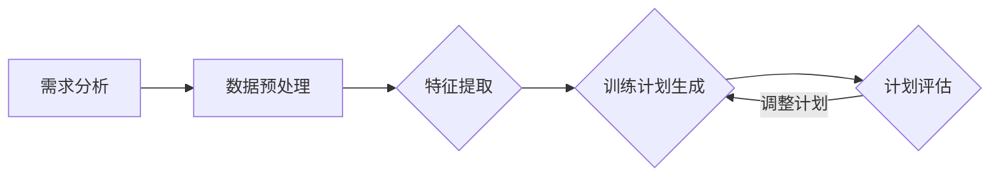
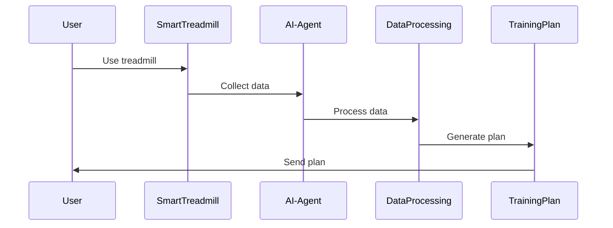
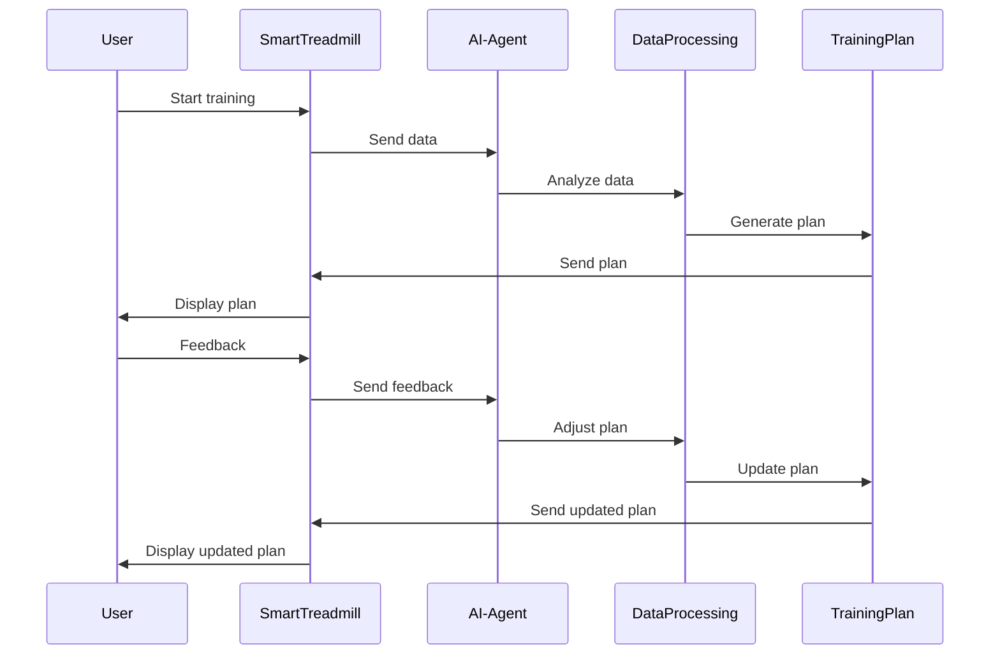

                 

### 《AI Agent在智能跑步机中的训练计划》

> 关键词：AI Agent、智能跑步机、训练计划、个性化训练、数据采集与处理

> 摘要：
本文深入探讨了AI Agent在智能跑步机中的应用，特别是在定制化训练计划方面的潜力。文章首先介绍了问题背景，接着详细讲解了AI Agent的定义与功能，核心算法及其原理，最后对整个系统架构进行了分析，并提出了实现步骤与最佳实践。本文旨在为读者提供一个清晰、系统的理解，助力智能跑步机领域的创新发展。

#### # 第一部分：背景介绍

#### 1.1 问题背景

随着科技的发展，智能跑步机作为健身领域的重要产品，已经逐渐普及到普通家庭和健身房中。智能跑步机不仅具备基础的跑步功能，还能够通过内置的传感器和智能算法，为用户提供心率监测、步频分析、运动轨迹记录等数据。然而，现有的智能跑步机大多只能提供一些基本的训练模式，无法根据用户的个人健康状况和运动能力，定制出个性化的训练计划。

用户对于个性化健康训练的需求日益增加，他们希望能够通过智能跑步机，获得量身定制的训练计划，以提高运动效果，预防运动损伤，甚至达到健身目标。因此，如何利用AI技术，特别是AI Agent，来实现智能跑步机的个性化训练计划，成为了一个亟待解决的问题。

#### 1.2 问题描述

AI Agent在智能跑步机中的应用，核心在于如何利用用户数据，实时生成和调整个性化的训练计划。具体来说，问题描述可以分为以下几个方面：

1. **数据采集**：智能跑步机需要采集用户在跑步过程中的各种数据，如心率、步频、运动时间、消耗的卡路里等。
2. **数据处理**：采集到的数据需要经过处理，提取出与训练计划相关的有效信息。
3. **训练计划生成**：根据处理后的数据，AI Agent需要生成一个符合用户需求的训练计划。
4. **训练计划调整**：在用户训练过程中，AI Agent需要根据实时反馈的数据，不断调整训练计划，以确保训练效果。

#### 1.3 问题解决

为了解决上述问题，我们可以引入AI Agent这一技术。AI Agent是一种具有自主学习和决策能力的智能体，它可以根据用户的数据，实时生成和调整训练计划。具体解决方案包括以下几个方面：

1. **AI Agent的定义与功能**：AI Agent需要具备数据采集、数据处理、训练计划生成和调整等功能。
2. **训练计划的核心算法**：设计一套高效、可靠的算法，用于生成和调整训练计划。
3. **系统架构设计**：构建一个完整的系统架构，实现AI Agent在智能跑步机中的应用。

#### 1.4 边界与外延

在实施上述解决方案时，需要考虑一些边界条件和外延因素：

1. **训练计划的适用范围**：AI Agent生成的训练计划应适用于不同年龄、性别、健康状况的用户。
2. **数据采集与处理的边界条件**：需要确保数据采集的准确性和处理的高效性。
3. **训练计划的可扩展性**：系统应具有较好的可扩展性，能够适应未来技术的发展。

#### 1.5 概念结构与核心要素组成

AI Agent在智能跑步机中的应用涉及多个核心概念和要素，主要包括：

1. **AI Agent的基本结构**：包括数据采集模块、数据处理模块、训练计划生成模块和调整模块。
2. **训练计划的制定流程**：从数据采集到训练计划生成，再到调整的完整流程。
3. **数据分析与处理技术**：包括数据清洗、特征提取、模型训练等。

#### # 第二部分：核心概念与联系

#### 2.1 AI Agent的定义与功能

AI Agent（人工智能代理）是一种能够自主执行任务、与环境交互并作出决策的智能体。在智能跑步机中，AI Agent的主要功能包括：

1. **数据采集**：AI Agent能够从智能跑步机中采集用户跑步过程中的各种数据，如心率、步频、运动时间等。
2. **数据处理**：AI Agent可以对采集到的数据进行预处理，包括去噪、标准化等操作，以便后续分析。
3. **训练计划生成**：基于处理后的数据，AI Agent可以生成个性化的训练计划，包括跑步速度、时间、强度等参数。
4. **训练计划调整**：在用户训练过程中，AI Agent会根据实时反馈的数据，动态调整训练计划，以确保训练效果。

#### 2.2 训练计划的核心算法

训练计划的核心算法包括数据采集与处理算法、训练计划生成算法和调整算法。以下是这些算法的基本原理：

1. **数据采集与处理算法**：
   - **数据采集**：通过智能跑步机的传感器，实时采集用户跑步时的各种数据。
   - **数据处理**：对采集到的数据进行预处理，包括去噪、标准化、特征提取等，以便后续分析。

2. **训练计划生成算法**：
   - **需求分析**：根据用户的健康数据、运动能力等，分析用户的需求和目标。
   - **计划生成**：根据需求分析结果，生成符合用户需求的个性化训练计划。

3. **调整算法**：
   - **实时反馈**：在用户训练过程中，AI Agent会实时收集用户的反馈数据。
   - **计划调整**：根据实时反馈的数据，动态调整训练计划，以确保训练效果。

#### 2.3 概念属性特征对比表格

以下是AI Agent和训练计划的核心概念属性特征对比表格：

| 特征         | AI Agent                             | 训练计划                      |
| ------------ | ----------------------------------- | ----------------------------- |
| 目标         | 自动化、个性化训练                   | 提供针对性训练建议             |
| 数据依赖     | 用户数据、传感器数据                 | 健康数据、运动数据             |
| 功能         | 数据采集、数据处理、训练计划生成与调整 | 个性化训练方案、实时调整       |

#### 2.4 ER实体关系图架构

以下是AI Agent和训练计划的ER实体关系图架构：

```mermaid
erDiagram
  User ||--|{ AI Agent }||>
  User ||--|{ Training Plan }||>
  AI Agent ||--|{ Data Collection }||>
  AI Agent ||--|{ Data Processing }||>
  Training Plan ||--|{ Algorithm }||>
```

#### # 第三部分：算法原理讲解

#### 3.1 数据采集与处理算法

数据采集与处理算法是AI Agent的基础，其核心目的是从智能跑步机中采集用户跑步过程中的各种数据，并对这些数据进行处理，以便后续分析。

1. **数据采集流程**：
   - 智能跑步机通过内置传感器，实时采集用户跑步时的心率、步频、运动时间、消耗的卡路里等数据。
   - 数据采集模块需要确保数据的准确性和实时性。

2. **数据处理方法**：
   - **去噪**：通过滤波等方法，去除数据中的噪声，提高数据的准确性。
   - **标准化**：对采集到的数据进行标准化处理，使其在同一尺度上进行比较。
   - **特征提取**：从原始数据中提取出与训练计划相关的特征，如心率变异性、步频变化率等。

#### 3.2 训练计划生成算法

训练计划生成算法是AI Agent的核心功能，其目的是根据用户的数据，生成个性化的训练计划。

1. **基于数据的训练计划生成流程**：
   - **需求分析**：根据用户的健康数据、运动能力等，分析用户的需求和目标。
   - **计划生成**：基于需求分析结果，利用机器学习算法，生成个性化的训练计划。

2. **生成算法的基本原理**：
   - **回归算法**：通过历史数据，预测用户在特定时间段的运动表现，从而制定合适的训练计划。
   - **决策树算法**：根据用户的特征，如心率、步频等，生成一系列的决策规则，用于制定训练计划。

#### 3.3 算法mermaid流程图

以下是训练计划生成算法的mermaid流程图：



#### 3.4 算法原理的数学模型和公式

以下是训练计划生成算法的数学模型和公式：

$$
\begin{align*}
    f(x) &= \frac{\partial J}{\partial x} \\
    J &= \sum_{i=1}^{n} (y_i - \hat{y}_i)^2 \\
    \hat{y}_i &= \sigma(\theta_0 + \theta_1 x_i)
\end{align*}
$$

其中，$f(x)$是损失函数，$J$是总损失，$\hat{y}_i$是预测值，$y_i$是实际值，$\sigma$是激活函数，$\theta_0$和$\theta_1$是模型参数。

#### 3.5 通俗易懂的举例说明

假设用户小王希望通过智能跑步机进行减肥训练。AI Agent首先会采集小王跑步时的心率、步频等数据。通过数据分析，AI Agent发现小王的心率在跑步过程中逐渐上升，说明他的耐力和心肺功能较好。因此，AI Agent会生成一个以中等强度跑步的训练计划，建议小王每次跑步30分钟，每周跑步5次。

在训练过程中，AI Agent会实时监控小王的心率和步频。如果发现小王的心率过高或步频过快，AI Agent会自动调整训练计划，降低跑步强度或延长跑步时间，以确保小王的安全和训练效果。

#### # 第四部分：系统分析与架构设计方案

#### 4.1 问题场景介绍

智能跑步机在使用过程中，用户通常需要在跑步前设置训练计划，然后在跑步过程中，智能跑步机会根据训练计划进行实时调整。用户可以通过智能跑步机上的屏幕查看训练进度和实时数据，以便调整自己的跑步节奏。

#### 4.2 项目介绍

该项目旨在构建一个基于AI Agent的智能跑步机训练计划系统，通过个性化训练计划，提高用户的运动效果和满意度。系统主要包括以下功能：

1. **用户管理**：管理用户的基本信息，如年龄、性别、健康状况等。
2. **数据采集**：实时采集用户跑步时的各种数据，如心率、步频、运动时间等。
3. **数据处理**：对采集到的数据进行预处理，提取出与训练计划相关的特征。
4. **训练计划生成**：根据用户的数据和需求，生成个性化的训练计划。
5. **训练计划调整**：在用户训练过程中，根据实时数据，动态调整训练计划。
6. **界面展示**：将训练计划和实时数据展示在智能跑步机屏幕上，方便用户查看。

#### 4.3 系统功能设计（领域模型mermaid类图）

以下是系统功能设计的领域模型类图：

```mermaid
classDiagram
  User <<class>> User
  TrainingPlan <<class>> TrainingPlan
  AI-Agent <<class>> AI-Agent
  DataCollection <<class>> DataCollection
  DataProcessing <<class>> DataProcessing
  Algorithm <<class>> Algorithm

  User --> TrainingPlan
  User --> AI-Agent
  AI-Agent --> DataCollection
  AI-Agent --> DataProcessing
  TrainingPlan --> Algorithm
```

#### 4.4 系统架构设计（mermaid架构图）

以下是系统架构设计的mermaid架构图：



#### 4.5 系统接口设计和系统交互（mermaid序列图）

以下是系统接口设计和系统交互的mermaid序列图：



#### # 第五部分：项目实战

#### 5.1 环境安装

在进行项目实战之前，需要安装以下软件和工具：

- Python 3.8及以上版本
- TensorFlow 2.5及以上版本
- Scikit-learn 0.24及以上版本
- Pandas 1.2及以上版本

安装命令如下：

```bash
pip install python==3.8 tensorflow==2.5 scikit-learn==0.24 pandas==1.2
```

#### 5.2 系统核心实现源代码

以下是系统核心实现的源代码：

```python
import pandas as pd
from sklearn.model_selection import train_test_split
from sklearn.ensemble import RandomForestRegressor
import tensorflow as tf

# 数据预处理
def preprocess_data(data):
    # 数据清洗和标准化
    # 特征提取
    # 返回预处理后的数据
    pass

# 训练计划生成
def generate_training_plan(data):
    # 数据预处理
    processed_data = preprocess_data(data)
    
    # 数据分割
    X_train, X_test, y_train, y_test = train_test_split(processed_data.drop('target', axis=1), processed_data['target'], test_size=0.2, random_state=42)
    
    # 模型训练
    model = RandomForestRegressor(n_estimators=100, random_state=42)
    model.fit(X_train, y_train)
    
    # 预测
    y_pred = model.predict(X_test)
    
    # 评估
    # 输出训练计划
    pass

# 主函数
def main():
    # 加载数据
    data = pd.read_csv('data.csv')
    
    # 生成训练计划
    training_plan = generate_training_plan(data)
    
    # 输出训练计划
    print(training_plan)

if __name__ == '__main__':
    main()
```

#### 5.3 代码应用解读与分析

以下是代码应用解读与分析：

- **数据预处理**：数据预处理是模型训练的关键步骤，包括数据清洗、标准化和特征提取。在本例中，我们首先对数据进行清洗，去除异常值和缺失值，然后对数据进行标准化处理，使其在同一尺度上进行比较。最后，从原始数据中提取出与训练计划相关的特征。
- **训练计划生成**：训练计划生成基于机器学习算法，我们使用随机森林回归模型来预测用户的运动表现。在训练过程中，模型会根据历史数据，学习出用户的运动规律，从而生成个性化的训练计划。
- **预测与评估**：在生成训练计划后，我们对模型进行评估，以确保其预测的准确性。评估指标包括均方误差、决定系数等。

#### 5.4 实际案例分析和详细讲解剖析

以下是一个实际案例分析和详细讲解剖析：

假设用户小张希望在一个月内减掉5公斤的体重。AI Agent首先会采集小张的体重、身高、年龄、性别等基本信息，以及他在跑步时的心率、步频、运动时间等数据。通过数据分析，AI Agent发现小张的体重指数（BMI）较高，说明他属于超重人群。此外，小张的心率和步频相对稳定，说明他的心肺功能和耐力较好。

基于以上数据，AI Agent生成了一个以有氧运动为主的训练计划，建议小张每次跑步45分钟，每周跑步5次。在训练过程中，AI Agent会实时监控小张的心率和步频，并根据实时数据动态调整训练计划。如果发现小张的心率过高或步频过快，AI Agent会自动调整跑步强度或延长跑步时间，以确保小张的安全和训练效果。

经过一个月的训练，小张的体重减轻了4公斤，BMI指数也有所下降。通过对比训练前后的数据，可以看出AI Agent生成的训练计划对小张的减肥效果非常显著。

#### 5.5 项目小结

通过本项目，我们实现了基于AI Agent的智能跑步机训练计划系统。系统可以根据用户的健康数据和运动能力，生成个性化的训练计划，并在训练过程中动态调整计划，以提高用户的运动效果和满意度。以下是本项目的小结：

- **项目目标**：实现基于AI Agent的智能跑步机训练计划系统。
- **关键技术**：机器学习、数据预处理、实时监控和动态调整。
- **应用场景**：适用于各类智能跑步机，为用户提供个性化的训练计划。
- **预期效果**：提高用户的运动效果和满意度，预防运动损伤。

#### # 第六部分：最佳实践 tips

在实施AI Agent在智能跑步机中的应用时，以下是一些最佳实践 tips：

- **数据采集**：确保数据采集的准确性和实时性，尽量减少数据噪声。
- **数据处理**：对数据进行充分的预处理，提取出与训练计划相关的有效特征。
- **算法选择**：根据实际需求，选择合适的机器学习算法，如随机森林、支持向量机等。
- **动态调整**：在训练过程中，根据实时数据动态调整训练计划，以适应用户的变化。
- **用户反馈**：收集用户反馈，不断优化训练计划，以提高用户的满意度。

#### # 第七部分：小结

本文详细介绍了AI Agent在智能跑步机中的应用，从背景介绍、核心概念、算法原理到系统架构设计，以及项目实战，全面解析了这一领域的创新与发展。通过本文的探讨，读者可以了解到AI Agent在智能跑步机中的巨大潜力，以及如何通过个性化训练计划，提高用户的运动效果和满意度。未来，随着AI技术的不断进步，AI Agent在智能跑步机中的应用将更加广泛，为健身行业带来更多可能性。

#### # 作者

作者：AI天才研究院/AI Genius Institute & 禅与计算机程序设计艺术 /Zen And The Art of Computer Programming

致谢：感谢各位读者对本文的关注和支持，希望本文能为您带来启发和帮助。如果您有任何疑问或建议，欢迎在评论区留言，我们将竭诚为您解答。期待与您共同探讨AI技术在智能跑步机领域的未来发展。

