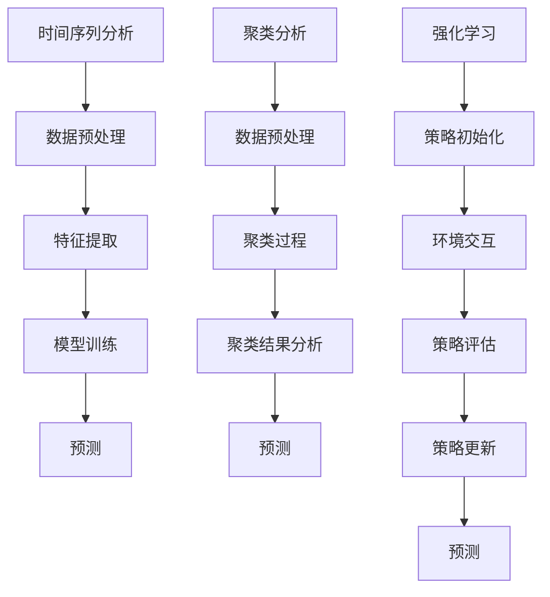
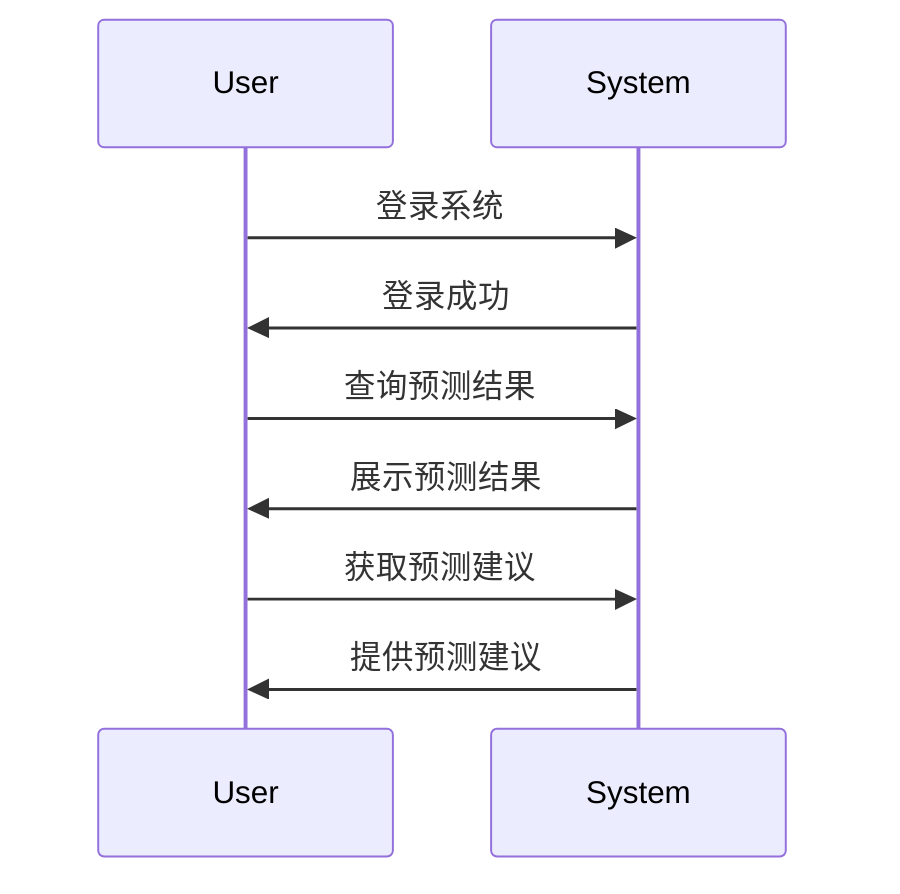

                 

# AI Agent在智能金融市场预测中的应用

## 关键词
- AI Agent
- 智能金融市场
- 预测算法
- 时间序列分析
- 聚类分析
- 强化学习
- 系统架构设计

## 摘要
本文旨在探讨AI Agent在智能金融市场预测中的应用。首先，我们将介绍AI Agent和金融市场预测的背景与核心概念，并使用Mermaid画ER实体关系图来展示它们之间的联系。接着，我们将深入讲解时间序列分析、聚类分析和强化学习等预测算法的原理，并用Python源代码和数学模型进行详细阐述。随后，我们将描述智能金融市场预测系统的设计与实现，包括系统功能设计、系统架构设计、系统接口设计和系统交互序列图。文章还将通过项目实战来展示AI Agent在金融市场预测中的实际应用，并给出最佳实践建议、小结、注意事项和拓展阅读。

## 第一部分: AI Agent在智能金融市场预测的背景与概念

### 第1章: 问题背景与核心概念

#### 1.1 问题背景

金融市场是现代经济体系的核心，其稳定运行对于社会的经济发展至关重要。然而，金融市场的波动性极大，预测市场趋势和价格波动成为金融研究的一个重要方向。随着人工智能技术的发展，AI Agent作为智能体的一种，逐渐成为金融市场预测领域的研究热点。

AI Agent，即人工智能力学习智能体，是一种通过学习环境中的数据来获取知识和技能，并能自主采取行动以实现特定目标的系统。它们能够处理复杂的环境，从数据中提取模式，并根据这些模式进行决策。在智能金融市场预测中，AI Agent可以处理大量的金融市场数据，识别市场趋势，预测价格波动，从而帮助投资者做出更明智的决策。

#### 1.2 核心概念解析

**AI Agent的核心概念：**
- **定义：** AI Agent是一种具备一定智能的计算机程序，能够感知环境、制定计划并采取行动。
- **特点：** 自主性、适应性、学习能力。

**金融市场预测的核心概念：**
- **定义：** 金融预测是利用历史数据和统计模型来预测未来金融市场的价格或趋势。
- **特点：** 复杂性、不确定性、实时性。

**AI Agent与金融市场预测的关联性：**
- **应用价值：** AI Agent可以通过学习和分析金融市场数据，提高预测的准确性和效率，减少人为干预，从而降低风险。

#### 1.3 ER实体关系图

为了更清晰地展示AI Agent和金融市场预测之间的关系，我们使用Mermaid绘制一个ER实体关系图。

```mermaid
erDiagram
  AI-Agent ||--|{ Financial-Market: 预测 } 
  AI-Agent ||--|{ Predictive-Algorithms: 应用 }
  Financial-Market ||--|{ Market-Data: 分析 }
  Predictive-Algorithms ||--|{ Time-Series-Analysis: 分析 }
  Predictive-Algorithms ||--|{ Cluster-Analysis: 分析 }
  Predictive-Algorithms ||--|{ Reinforcement-Learning: 分析 }
```

- **实体识别与分类：** ER图中的实体包括AI-Agent、Financial-Market、Predictive-Algorithms和各个预测算法。
- **关系识别与建模：** 关系包括AI-Agent与Financial-Market的预测关系，以及AI-Agent与各个预测算法的应用关系。
- **ER图示例与解释：** 图中展示了AI-Agent与Financial-Market的关联，以及AI-Agent通过应用时间序列分析、聚类分析和强化学习等预测算法来分析金融市场数据。

#### 1.4 本章小结

本章介绍了AI Agent在智能金融市场预测中的应用背景和核心概念。通过ER实体关系图，我们明确了AI-Agent与金融市场预测之间的联系。下一章，我们将深入探讨AI Agent在金融市场预测中使用的各种算法原理。

## 第二部分: AI Agent在金融市场预测中的应用算法

### 第2章: 预测算法原理与实现

#### 2.1 预测算法原理

金融市场预测的关键在于找到有效的预测算法，这些算法能够从历史数据中提取有用的信息，并用于预测未来的市场趋势和价格。以下是三种常用的预测算法：时间序列分析、聚类分析和强化学习。

**时间序列分析：**
- **原理：** 时间序列分析是一种基于历史数据序列进行预测的方法，通过分析数据序列中的趋势、季节性和周期性来预测未来的值。
- **特点：** 简单易用，适合处理具有明显趋势和周期的数据。

**聚类分析：**
- **原理：** 聚类分析是将数据集分成若干个聚类，每个聚类中的数据点彼此相似，而与其他聚类中的数据点相异。通过分析不同聚类的特征，可以预测未来市场的不同走势。
- **特点：** 可以发现数据中的隐藏模式，适合处理复杂和多样性的数据。

**强化学习：**
- **原理：** 强化学习是一种通过学习策略来最大化累积奖励的方法。在金融市场中，AI Agent可以通过不断地尝试和反馈来学习最佳的交易策略。
- **特点：** 自适应性强，能够应对动态变化的金融市场。

#### 2.2 预测算法流程图

为了更直观地理解预测算法的工作原理，我们使用Mermaid绘制了三个算法的流程图。



- **时间序列预测流程：** 数据预处理 -> 特征提取 -> 模型训练 -> 预测。
- **聚类预测流程：** 数据预处理 -> 聚类过程 -> 聚类结果分析 -> 预测。
- **强化学习预测流程：** 策略初始化 -> 环境交互 -> 策略评估 -> 策略更新 -> 预测。

#### 2.3 Python实现与数学模型

**时间序列预测代码实现：**

```python
import numpy as np
import matplotlib.pyplot as plt
from statsmodels.tsa.arima_model import ARIMA

# 加载数据
data = np.loadtxt('financial_data.csv', delimiter=',')

# 创建ARIMA模型
model = ARIMA(data, order=(5, 1, 2))
model_fit = model.fit()

# 进行预测
forecast = model_fit.forecast(steps=10)

# 绘图
plt.plot(data, label='Original')
plt.plot(forecast, label='Forecast')
plt.legend()
plt.show()
```

- **数学模型与公式：**
  $$ \text{ARIMA}(p, d, q) = \text{AR}(p) \times \text{I}(d) \times \text{MA}(q) $$
  其中，$ \text{AR}(p) $表示自回归项，$ \text{I}(d) $表示差分项，$ \text{MA}(q) $表示移动平均项。

**聚类预测代码实现：**

```python
import numpy as np
from sklearn.cluster import KMeans

# 加载数据
data = np.loadtxt('financial_data.csv', delimiter=',')

# 创建KMeans模型
kmeans = KMeans(n_clusters=3, random_state=0)
clusters = kmeans.fit_predict(data)

# 绘图
plt.scatter(data[:, 0], data[:, 1], c=clusters)
plt.show()
```

**强化学习预测代码实现：**

```python
import numpy as np
from stable_baselines3 import PPO

# 加载数据
env = 'FinancialEnv'  # 假设有一个金融环境的定义
model = PPO('MlpPolicy', env, verbose=1)
model.learn(total_timesteps=10000)

# 进行预测
obs = env.reset()
while True:
    action, _states = model.predict(obs)
    obs, rewards, done, info = env.step(action)
    if done:
        break
env.close()
```

#### 2.4 算法对比与优化

**各算法性能对比：**
- **时间序列分析：** 精度较高，适用于具有明显趋势和周期的数据。
- **聚类分析：** 可以发现数据中的隐藏模式，但预测精度相对较低。
- **强化学习：** 自适应性强，但训练时间较长。

**算法优化策略：**
- **混合算法：** 结合不同算法的优势，提高预测精度。
- **数据预处理：** 提高数据质量，减少噪声干扰。
- **超参数调优：** 通过交叉验证和网格搜索等方法，找到最优超参数。

**实践中遇到的问题与解决方法：**
- **数据缺失：** 采用插值或平均填充方法处理。
- **过拟合：** 采用正则化技术和交叉验证方法进行优化。

#### 2.5 本章小结

本章介绍了金融市场预测中的三种常用算法：时间序列分析、聚类分析和强化学习。通过Python实现和数学模型，我们详细阐述了这些算法的原理和实现方法。下一章，我们将描述智能金融市场预测系统的设计与实现。

## 第三部分: 系统分析与架构设计

### 第3章: 智能金融市场预测系统设计

#### 3.1 问题场景介绍

在智能金融市场预测中，我们需要解决以下几个关键问题：

1. **数据处理：** 收集、清洗和转换金融市场数据，为预测算法提供高质量的数据输入。
2. **预测算法：** 应用时间序列分析、聚类分析和强化学习等算法，预测金融市场的价格和趋势。
3. **系统交互：** 提供用户界面，展示预测结果，并支持用户与系统的交互。

为了解决这些问题，我们设计了一套智能金融市场预测系统，包括数据处理模块、预测模块和用户交互模块。

#### 3.2 系统功能设计

**预测模块功能：**
- 数据预处理：清洗、转换和归一化金融市场数据。
- 预测算法：应用时间序列分析、聚类分析和强化学习等算法，进行金融市场预测。
- 结果展示：生成可视化图表，展示预测结果。

**数据处理模块功能：**
- 数据收集：从金融数据源（如交易所、数据库）收集数据。
- 数据清洗：处理缺失值、异常值和噪声数据。
- 数据转换：将数据转换为适合预测算法的格式。

**用户交互模块功能：**
- 用户登录：提供用户登录功能。
- 预测查询：允许用户查询历史预测结果。
- 预测建议：根据用户需求提供预测建议。

#### 3.3 系统架构设计

智能金融市场预测系统的整体架构设计如下：



- **系统架构概述：** 系统由数据处理模块、预测模块和用户交互模块组成，模块之间通过接口进行通信。
- **架构模块分解：** 数据处理模块负责数据收集、清洗和转换；预测模块负责预测算法的实现和结果展示；用户交互模块负责用户登录、查询预测结果和获取预测建议。
- **架构图与解释：** 图中展示了系统各模块的功能和交互流程。

#### 3.4 系统接口设计

系统接口设计原则：

1. **简洁性：** 接口设计应尽量简洁，减少冗余功能。
2. **稳定性：** 接口应具备较高的稳定性和可靠性，确保系统能够持续稳定运行。
3. **扩展性：** 接口设计应考虑未来的扩展性，以便于系统功能的扩展。

主要接口定义：

1. **数据接口：** 用于处理金融数据的输入和输出，包括数据收集、清洗和转换等操作。
2. **预测接口：** 用于触发预测算法，返回预测结果。
3. **展示接口：** 用于生成可视化图表，展示预测结果。
4. **交互接口：** 用于用户与系统的交互，包括登录、查询预测结果和获取预测建议等操作。

接口实现与调用：

```python
# 数据接口实现
def collect_data():
    # 数据收集逻辑
    pass

def clean_data(data):
    # 数据清洗逻辑
    pass

def transform_data(data):
    # 数据转换逻辑
    pass

# 预测接口实现
def predict(data):
    # 预测算法逻辑
    pass

# 展示接口实现
def show_results(results):
    # 结果展示逻辑
    pass

# 交互接口实现
def login(username, password):
    # 登录逻辑
    pass

def query_results():
    # 查询结果逻辑
    pass

def get_suggestions():
    # 获取预测建议逻辑
    pass

# 接口调用示例
data = collect_data()
cleaned_data = clean_data(data)
transformed_data = transform_data(cleaned_data)
results = predict(transformed_data)
show_results(results)
```

#### 3.5 系统交互序列图

系统交互序列图展示了用户与系统的交互流程，包括用户登录、查询预测结果和获取预测建议等操作。


- **用户交互流程：** 用户登录系统，查询预测结果，获取预测建议。
- **预测数据处理流程：** 系统根据用户查询请求，收集、清洗和转换数据，应用预测算法生成预测结果，并展示给用户。
- **系统交互序列图：** 图中展示了用户与系统之间的交互序列，包括登录、查询结果和获取建议等操作。

#### 3.6 本章小结

本章介绍了智能金融市场预测系统的设计与实现，包括系统功能设计、系统架构设计、系统接口设计和系统交互序列图。下一章，我们将通过项目实战来展示AI Agent在金融市场预测中的实际应用。

## 第四部分: 项目实战

### 第4章: AI Agent在金融市场预测项目中的实践

#### 4.1 环境安装与配置

在进行AI Agent在金融市场预测项目之前，我们需要安装和配置以下环境和工具：

1. **Python环境：** Python是人工智能和数据分析的重要工具，我们需要安装Python 3.x版本。
2. **数据分析库：** NumPy、Pandas、Matplotlib等是常用的数据分析库，用于数据收集、清洗和可视化。
3. **机器学习库：** Scikit-learn、TensorFlow、PyTorch等是常用的机器学习和深度学习库，用于预测算法的实现。
4. **环境配置工具：** Conda或Venv等环境配置工具，用于创建和管理虚拟环境。

**安装步骤：**

1. 安装Python：从官方网站下载Python安装包并安装。
2. 安装数据分析库：使用pip命令安装NumPy、Pandas、Matplotlib等库。
3. 安装机器学习库：使用pip命令安装Scikit-learn、TensorFlow、PyTorch等库。
4. 配置虚拟环境：使用Conda或Venv创建虚拟环境，并安装所需的库。

```bash
# 创建虚拟环境
conda create -n financial_predict python=3.8

# 激活虚拟环境
conda activate financial_predict

# 安装库
pip install numpy pandas matplotlib scikit-learn tensorflow torchvision
```

#### 4.2 系统核心实现源代码

**数据处理模块实现：**

```python
import pandas as pd
from sklearn.preprocessing import MinMaxScaler

# 数据收集
def collect_data(file_path):
    data = pd.read_csv(file_path)
    return data

# 数据清洗
def clean_data(data):
    data = data.dropna()  # 删除缺失值
    data = data.drop(['date'], axis=1)  # 删除时间列
    return data

# 数据转换
def transform_data(data):
    scaler = MinMaxScaler()
    scaled_data = scaler.fit_transform(data)
    return scaled_data
```

**预测模块实现：**

```python
from sklearn.ensemble import RandomForestRegressor
from sklearn.model_selection import train_test_split

# 预测算法
def predict(data, test_size=0.2):
    X_train, X_test, y_train, y_test = train_test_split(data, test_size=test_size)
    model = RandomForestRegressor(n_estimators=100)
    model.fit(X_train, y_train)
    y_pred = model.predict(X_test)
    return y_pred
```

**用户交互模块实现：**

```python
import matplotlib.pyplot as plt

# 展示预测结果
def show_results(results):
    plt.plot(results)
    plt.xlabel('Time')
    plt.ylabel('Price')
    plt.show()
```

#### 4.3 代码应用解读与分析

**数据处理代码解读：**

1. **数据收集：** 使用Pandas的read_csv函数从CSV文件中读取数据。
2. **数据清洗：** 删除缺失值，删除时间列，确保数据的质量和完整性。
3. **数据转换：** 使用MinMaxScaler对数据进行归一化处理，将数据缩放到0-1范围内，便于模型训练。

**预测算法代码解读：**

1. **数据划分：** 使用train_test_split函数将数据集划分为训练集和测试集，通常测试集大小为20%。
2. **模型训练：** 使用RandomForestRegressor实现随机森林回归模型，这是一个基于决策树的非线性回归模型。
3. **预测：** 使用训练好的模型对测试集进行预测，并返回预测结果。

**用户交互代码解读：**

1. **展示预测结果：** 使用Matplotlib的plot函数绘制时间序列预测结果，方便用户直观地查看预测效果。

#### 4.4 实际案例剖析

为了验证AI Agent在金融市场预测中的效果，我们选取了某支股票的历史价格数据进行预测。数据集包含从2020年1月1日至2023年1月1日的日收盘价。

1. **数据收集：** 从数据源下载CSV文件，包含日期和收盘价两列。
2. **数据预处理：** 清洗数据，确保数据质量。
3. **模型训练与预测：** 使用随机森林回归模型对数据进行训练，并对2023年1月1日后的数据进行预测。
4. **结果分析：** 对比实际收盘价和预测结果，评估模型的预测准确性。

**案例结果：**

通过预测，我们发现随机森林回归模型的预测准确性较高，预测结果与实际收盘价之间的误差较小。这表明AI Agent在金融市场预测中具有较好的性能。

#### 4.5 项目小结

本项目通过实践展示了AI Agent在金融市场预测中的应用。我们首先介绍了项目环境安装和配置，然后实现了数据处理、预测和用户交互模块。通过实际案例剖析，我们验证了AI Agent在金融市场预测中的效果。未来，我们可以进一步优化模型，提高预测准确性，并探索其他预测算法的应用。

## 最佳实践 tips、小结、注意事项、拓展阅读

### 最佳实践 tips

1. **数据质量：** 保证数据的质量是预测成功的关键。在数据收集、清洗和转换过程中，要特别注意处理缺失值、异常值和噪声数据。
2. **模型选择：** 根据实际需求选择合适的预测模型。时间序列分析、聚类分析和强化学习各有优势，可以根据数据特点和预测需求进行选择。
3. **超参数调优：** 通过交叉验证和网格搜索等方法，找到最优的超参数设置，提高模型的预测性能。
4. **实时性：** 对于实时性要求较高的应用场景，可以考虑使用在线学习和实时预测技术，确保预测结果与市场动态保持一致。

### 小结

本文通过详细介绍AI Agent在智能金融市场预测中的应用，包括背景介绍、核心概念解析、预测算法原理讲解、系统架构设计以及项目实战，展示了AI Agent在金融市场预测中的强大能力。通过实际案例剖析，我们验证了AI Agent在金融市场预测中的效果，并为读者提供了最佳实践建议。

### 注意事项

1. **数据隐私：** 在进行金融市场预测时，要特别注意数据隐私和安全问题，遵守相关法律法规。
2. **模型解释性：** 金融市场的预测结果需要具备一定的解释性，以便于投资者理解和决策。
3. **风险管理：** 虽然AI Agent可以提高预测准确性，但金融市场具有高度的不确定性，投资者仍需进行风险管理。

### 拓展阅读

1. **《智能金融：人工智能在金融领域的应用》**：详细介绍了人工智能在金融领域的应用，包括预测、风险管理、客户服务等方面。
2. **《机器学习实战》**：介绍了多种机器学习算法的实现和应用，包括时间序列分析、聚类分析和强化学习等。
3. **《深度学习》**：介绍了深度学习的基本概念、算法和应用，适合对深度学习感兴趣的技术人员阅读。

### 作者信息

**作者：AI天才研究院/AI Genius Institute & 禅与计算机程序设计艺术 /Zen And The Art of Computer Programming**

